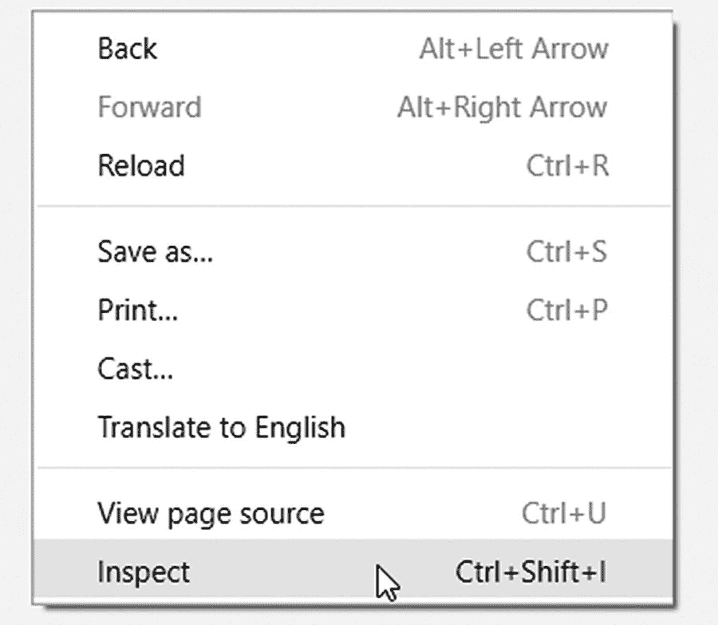
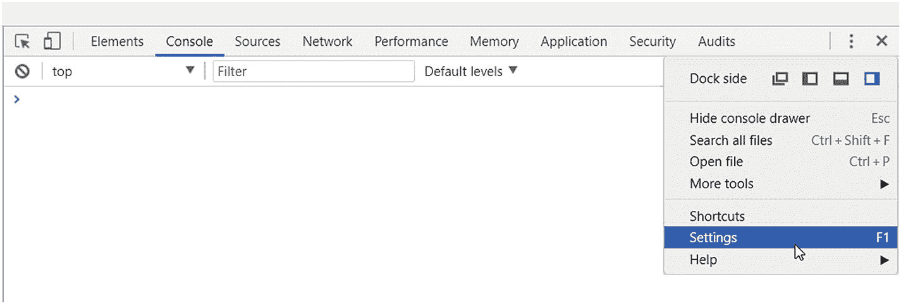
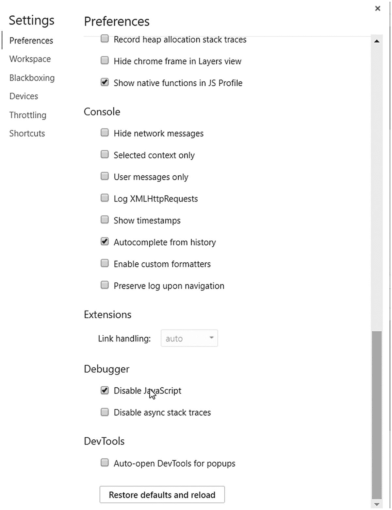

# 一、入门指南

我们将直接进入深水区，而不是每个库后面的安装说明:这一章介绍了一般的网站抓取和我们将在本书中实现的需求。

你可能希望对网站抓取有一个全面的介绍，但是因为你正在读这本书，我希望你已经知道什么是网站抓取，并且你想学习如何用 Python 来做。

因此，我只给你一个主题的浏览，然后直接进入创建一个抓取网站的脚本的深度！

## 网站抓取

随着互联网的普及，需要抓取网站，在那里你可以分享你的内容和大量数据。第一批广为人知的刮刀是由搜索引擎开发者发明的(比如谷歌或 AltaVista)。这些抓取器(几乎)会遍历整个互联网，扫描每一个网页，从中提取信息，并建立一个你可以搜索的索引。

每个人都可以创造一个刮刀。我们很少有人会尝试实现这样一个大的应用，这可能是谷歌或必应的新竞争。但是我们可以将范围缩小到一两个网页，以结构化的方式提取信息，并将结果导出到数据库或结构化文件(JSON、CSV、XML、Excel 表)。

如今，*数字化转型*是公司使用并希望参与的新流行语。这种转变的一个组成部分是通过 API 向每个人(或者至少是对该数据感兴趣的其他公司)提供数据访问点。有了这些 API，你不需要投入时间和其他资源来创建一个网站抓取器。

尽管提供 API 对 scraper 开发者没有好处，但这个过程很慢，许多公司都懒得创建这些访问点，因为他们有一个网站，维护就够了。

### 网站抓取项目

有很多使用案例，你可以利用你的网站抓取知识。有些可能是常识，有些则是极端情况。在本节中，您将找到一些可以利用您的知识的用例。

创建 scraper 的主要原因是从网站中提取信息。这些信息可以是公司销售的产品清单、食品杂货的营养细节，或者是过去 15 年的 NFL 结果。这些项目中的大多数都是进一步数据分析的基础:手动收集所有这些数据是一个漫长且容易出错的过程。

有时你会遇到这样的项目，你需要从一个网站提取数据，然后加载到另一个网站`—`进行迁移。我最近有一个项目，我的客户将他的网站转移到 WordPress，而旧的博客引擎的导出功能并不意味着将其导入 WordPress。我创建了一个 scraper，提取所有帖子(大约 35000 个)及其图片，对内容进行一些格式化以使用 WordPress 短代码，然后将所有这些帖子导入新网站。

一个奇怪的项目可能是下载整个互联网！理论上这不是不可能的:你从一个网站开始，下载它，提取并跟随这个页面上的所有链接，并下载新的网站。如果你抓取的网站都有互相链接，你就可以浏览(并下载)整个互联网。我不建议你开始这个项目，因为你不会有足够的磁盘空间来容纳整个互联网，但这个想法很有趣。让我知道你有多远，如果你实现这样一个刮刀。

### 网站是瓶颈

通过网站收集数据最困难的部分之一是网站各不相同。我指的不仅仅是数据，还有版面。因为每个网站都有不同的布局，使用不同的(或没有)HTML IDs 来标识字段，等等，所以很难创建一个适合所有网站的 scraper。

如果这还不够，许多网站经常改变布局。如果发生这种情况，您的铲运机将无法像以前那样工作。在这种情况下，唯一的选择就是重新审视你的代码，使其适应目标网站的变化。

不幸的是，如果你想编写专门的数据提取器，你不会学到帮助你创建一个总是工作的刮刀的秘密技巧。我将在本书中展示一些例子，如果使用了 HTML 标准，这些例子将始终有效。

## 本书中的工具

在这本书里，你将会学到用 Python 做网站抓取的基本工具。你很快就会意识到从头开始制造每一件刮刀有多难。

但是 Python 有一个很棒的社区，有很多项目可以帮助你专注于你的刮刀的重要部分:数据提取。我将向您介绍像`requests`库、`Beautiful Soup`和`Scrapy`这样的工具。

`requests`库是处理 HTTP 的繁琐任务的轻量级包装器，它是推荐的方式:

> 建议将请求包用于更高级别的 HTTP 客户端接口。
> 
> — Python 3 文档

`Beautiful Soup`是一个内容解析器。它不是一个网站抓取工具，因为它不会自动导航页面，而且很难扩展。但是它有助于解析内容，并为您提供了以友好的方式从 XML 和 HTML 结构中提取所需信息的选项。

`Scrapy`是一个网站抓取框架/库。比`Beautiful Soup`厉害多了，还可以规模化。因此，你可以用`Scrapy`更容易地创建更复杂的刮刀。但是另一方面，您有更多的选项可以配置。微调`Scrapy`可能是一个问题，如果你做错了，你可能会搞砸很多。但是伴随着强大的力量而来的是巨大的责任:你必须小心使用`Scrapy`。

尽管`Scrapy`是**为网站抓取而创建的 Python 库**，但有时我更喜欢`requests`和`Beautiful Soup`的组合，因为它是轻量级的，我可以在短时间内编写我的 scraper`—`，并且我不需要缩放或并行执行。

## 准备

在开始一个网站刮刀的时候，哪怕是一个小脚本，也要做好任务的准备。一开始，您需要考虑一些法律和技术问题。

在这一节，我会给你一个简短的清单，列出你应该做些什么来为网站抓取工作或任务做准备:

1.  网站的所有者允许刮痧吗？要找到答案，请阅读网站的*条款&条件*和*隐私政策*。

2.  能不能刮出自己感兴趣的部分？更多信息见`robots.txt`文件，并使用可处理该信息的工具。

3.  网站使用什么技术？有一些免费的工具可以帮助你完成这项任务，但是你可以查看网站的 HTML 代码来找到答案。

4.  我应该使用什么工具？根据你的任务和网站的结构，有不同的路径可以选择。

现在让我们来看一下提到的每一项的详细描述。

### 术语和机器人

刮擦目前几乎没有任何限制；没有法律规定什么可以刮，什么不可以。

然而，有一些准则定义了你应该尊重什么。没有强制执行；你可以完全忽略这些建议，但你不应该。

在你开始任何搜集任务之前，看看你想收集数据的网站的*条款&条件*和*隐私政策*。如果抓取没有限制，那么您应该查看给定网站的`robots.txt`文件。

阅读网站的条款和条件时，您可以搜索以下关键词来查找限制条件:

*   刮刀/刮削

*   爬虫/爬行

*   马胃蝇蛆

*   蜘蛛；状似蜘蛛的物体；星形轮；十字叉；连接柄；十字头

*   程序

大多数时候可以找到这些关键词，这使得你的搜索更容易。如果你运气不好，你需要通读全部法律内容，这并不容易，至少我认为法律内容读起来总是枯燥无味的。

在欧盟，有一种数据保护权利已经存在了几年，但从 2018 年开始严格执行:GDPR。不要把私人的私人数据收集到你的信息中——如果因为你的信息收集而泄露出去，你可能要承担责任。

#### robots.txt

大多数网站都提供了一个名为`robots.txt`的文件，用来告诉网络爬虫哪些东西可以刮，哪些东西不应该碰。当然，尊重这些建议取决于开发者，但是我建议你**总是服从**文件的内容。

让我们看看这样一个文件的例子:

```py
User-agent: *
Disallow: /covers/
Disallow: /api/
Disallow: /*checkval
Disallow: /*wicket:interface
Disallow: ?print_view=true
Disallow: /*/search
Disallow: /*/product-search

Allow: /*/product-search/discipline

Disallow: /*/product-search/discipline?*facet-subj=
Disallow: /*/product-search/discipline?*facet-pdate=
Disallow: /*/product-search/discipline?*facet-type=category

```

前面的代码块来自 [`www.apress.com/robots.txt`](http://www.apress.com/robots.txt) 。正如你所看到的，大多数内容告诉你什么是不允许的。比如刮刀不该刮 [`www.apress.com/covers/`](http://www.apress.com/covers/) 。

除了 Allow 和 Disallow 条目之外，用户代理也很有趣。每台铲运机都应有一个标识，该标识通过用户代理参数提供。由谷歌和必应创建的更大的机器人有它们独特的标识符。因为它们是将你的页面添加到搜索结果中的抓取器，你可以定义*排除*，让这些机器人不再骚扰你。在本章的后面，您将创建一个脚本，该脚本将使用自定义用户代理检查并遵循`robots.txt`文件的指导原则。

在一个`robots.txt file`中可以有其他条目，但它们不是标准的。要了解更多关于这些条目的信息，请访问 [`https://en.wikipedia.org/wiki/Robots_exclusion_standard`](https://en.wikipedia.org/wiki/Robots_exclusion_standard) 。

### 网站技术

另一个有用的准备步骤是查看目标网站使用的技术。

有一个名为`builtwith`的 Python 库，旨在检测网站利用的技术。这个库的问题是上一个版本 *1.3.2* 是 2015 年发布的，和 Python 3 不兼容。因此，您不能像使用 PyPI 中的库一样使用它。 <sup>[1](#Fn1)</sup>

然而，在 2017 年 5 月，Python 3 支持已被添加到源代码中，但新版本尚未发布(然而，我在 2017 年 11 月写这篇文章)。这并不意味着我们不能使用这个工具；我们必须手动安装它。

首先，从 [`https://bitbucket.org/richardpenman/builtwith/downloads/`](https://bitbucket.org/richardpenman/builtwith/downloads/) 下载源码。如果您愿意，可以使用 Mercurial 克隆存储库，以便在发生新的更改时保持最新。

下载源代码后，导航到下载源代码的文件夹，并执行以下命令:

`pip install .`

该命令将`builtwith`安装到您的 Python 环境中，您可以使用它。

现在，如果您打开 Python CLI，您可以查看您的目标站点，看看它使用了什么技术。

```py
>>> from builtwith import builtwith
>>> builtwith('http://www.apress.com')
{'javascript-frameworks': ['AngularJS', 'jQuery'], 'font-scripts': ['Font Awesome'], 'tag-managers': ['Google Tag Manager'], 'analytics': ['Optimizely']}

```

前面的代码块显示了 Apress 在其网站上使用的技术。你可以从 AngularJS 中学到，如果你打算写一个 scraper，你应该准备好处理用 JavaScript 呈现的动态内容。

`builtwith`不是一个神奇的工具，它是一个下载给定网址的网站抓取器；解析其内容；根据它的知识库，它会告诉你网站使用了哪些技术。该工具使用基本的 Python 功能，这意味着有时您无法在感兴趣的网站中获得信息，但大多数情况下您可以获得足够的信息。

### 使用 Chrome 开发工具

为了浏览网站并确定需求的领域，我们将使用 Google Chrome 的内置 *DevTools* 。如果你不知道这个工具能为你做什么，这里有一个快速介绍。

> **Chrome 开发者工具* *(简称 DevTools)，是谷歌 Chrome 内置的一套网页创作和调试工具。* *DevTools* *为 web 开发人员提供了对浏览器内部及其 web 应用的深度访问。使用 DevTools 有效地跟踪布局问题，设置 JavaScript 断点，并深入了解代码优化。**

 *如你所见，DevTools 为你提供了查看浏览器内部工作的工具。我们不需要什么特别的东西；我们将使用 DevTools 来查看信息驻留在哪里。

在这一节中，我将通过截图指导我们完成我开始(或者只是评估)一个抓取项目时通常会做的步骤。

#### 设置

首先，你必须准备获取信息。即使我们知道要刮哪个网站，提取什么样的数据，我们也需要一些准备。

基本的网站抓取工具是简单的工具，将网站内容下载到内存中，然后提取这些数据。这意味着它们不能像 JavaScript 一样运行动态内容，因此我们必须通过禁用 JavaScript 渲染来使我们的浏览器类似于一个简单的刮刀。

首先，用鼠标右键单击网页，从菜单中选择“Inspect”，如图 [1-1](#Fig1) 所示。



图 1-1

启动 Chrome 的 DevTools

或者，你可以在 Windows 中按下`CTRL+SHIFT+I`或者在 Mac 上按下 z `+` ⇧+ `I`来打开 DevTools 窗口。

然后定位设置按钮(三个垂直排列的点，如图 [1-2](#Fig2) 。)并点击它:



图 1-2

设置菜单位于三个点的下方

或者，您可以在 Windows 中按下`F1`。

现在向下滚动到*设置*屏幕的底部，确保`Disable JavaScript`被选中，如图 [1-3](#Fig3) 所示。



图 1-3

禁用 JavaScript

现在重新加载页面，退出*设置*窗口，但是保持在 inspector 视图中，因为我们将使用这里可用的 HTML 元素选择器。

### 注意

如果你想知道你的抓取器如何看到网站，禁用 JavaScript 是必要的。

在本书的后面，您将学习如何抓取利用 JavaScript 呈现动态内容的网站的选项。

但是为了充分理解和享受这些额外的功能，您必须学习基础知识。

### 工具注意事项

如果你正在读这本书，你很可能会用 Python 3 编写你的刮刀。但是，您必须决定使用哪些工具。

在这本书里，你会学到交易的工具，你可以自己决定用什么，但现在我会和你分享我是如何决定一种方法的。

如果你正在处理一个简单的网站`—`，简单，我的意思是一个不过度使用 JavaScript 渲染的网站`—`，那么你可以选择用`Beautiful Soup` + `requests`创建一个爬虫或者使用`Scrapy`。如果您必须处理大量数据，并且希望加快速度，请使用`Scrapy`。最终你会在 90%的任务中使用`Scrapy`，你可以将`Beautiful Soup`整合到`Scrapy`中一起使用。

如果网站使用 JavaScript 进行渲染，您可以对 AJAX/XHR 调用进行逆向工程并使用您喜欢的工具，或者您可以使用一个工具来为您渲染网站。这样的工具是 Selenium 和 Portia。我将在本书中向您介绍这些方法，您可以决定哪种方法最适合您，哪种方法更容易使用。

## 开始编码

在这个冗长的介绍之后，是时候写一些代码了。我猜你渴望让你的手指变得“脏”并且创造你的第一个刮刀。

在这一节中，我们将编写简单的 Python 3 脚本来帮助您开始抓取，并利用您在本章前面所读到的一些信息。

这些微型脚本不会是成熟的应用，只是本书中等待您的小演示。

### 解析 robots.txt

让我们创建一个应用，它解析目标网站的`robots.txt`文件并根据内容进行操作。

Python 有一个名为`robotparser`的内置模块，它使我们能够读取和理解`robots.txt`文件，并询问解析器我们是否可以抓取目标网站的给定部分。

我们将使用之前显示的来自`Apress.com`的`robots.txt`文件。要跟进，打开您选择的 Python 编辑器，创建一个名为`robots.py`的文件，并添加以下代码:

```py
from urllib import robotparser

robot_parser = robotparser.RobotFileParser()

def prepare(robots_txt_url):
    robot_parser.set_url(robots_txt_url)
    robot_parser.read()

def is_allowed(target_url, user_agent='*'):
    return robot_parser.can_fetch(user_agent, target_url)

if __name__ == '__main__':
    prepare('http://www.apress.com/robots.txt')

    print(is_allowed('http://www.apress.com/covers/'))
    print(is_allowed('http://www.apress.com/gp/python'))

```

现在让我们运行示例应用。如果我们做的一切都是正确的(并且 Apress 没有改变它的机器人指南)，我们应该取回`False`和`True`，因为我们不被允许访问`covers`文件夹，但是在 Python 部分没有限制。

```py
> python robots.py
False
True

```

如果你自己写 scraper，不使用`Scrapy`，这段代码片段还是不错的。集成`robotparser`并在访问之前检查每个 URL，这有助于您自动执行满足网站所有者访问请求的任务。

在本章的前面，我提到过您可以在一个`robots.txt`文件中定义用户代理特定的限制。因为我无法访问 Apress 网站，所以我在自己的主页上为这本书创建了一个自定义条目，该条目如下所示:

```py
User-Agent: bookbot
Disallow: /category/software-development/java-software-development/

```

现在来看看这是如何工作的。为此，您必须修改之前编写的 Python 代码(`robots.py`)或创建一个新的代码，以便在您调用`is_allowed`函数时提供一个用户代理，因为它已经接受了一个用户代理作为参数。

```py
    from urllib import robotparser

robot_parser = robotparser.RobotFileParser()

def prepare(robots_txt_url):
    robot_parser.set_url(robots_txt_url)
    robot_parser.read()

def is_allowed(target_url, user_agent='*'):
    return robot_parser.can_fetch(user_agent, target_url)

if __name__ == '__main__':
    prepare('http://hajba.hu/robots.txt')

    print(is_allowed('http://hajba.hu/category/software-development/java-software-development/', 'bookbot'))
    print(is_allowed('http://hajba.hu/category/software-development/java-software-development/', 'my-agent'))
    print(is_allowed('http://hajba.hu/category/software-development/java-software-development/', 'googlebot'))

```

上述代码将产生以下输出:

```py
False
True
True

```

不幸的是，你无法阻止恶意机器人抓取你的网站，因为在大多数情况下，它们会忽略你的`robots.txt`文件中的设置。

### 创建链接提取器

在这个冗长的介绍之后，是时候创建我们的第一个 scraper 了，它将从给定的页面中提取链接。

这个例子很简单；我们不会使用任何专门的工具来抓取网站，只使用标准 Python 3 安装中可用的库。

让我们打开一个文本编辑器(或者您选择的 Python IDE)。我们将在一个名为`link_extractor.py`的文件中工作。

```py
from urllib.request import urlopen
import re

def download_page(url):
    return urlopen(url).read().decode('utf-8')

def extract_links(page):
    link_regex = re.compile('<a[^>]+href=["\'](.*?)["\']', re.IGNORECASE)
    return link_regex.findall(page)

if __name__ == '__main__':
    target_url = 'http://www.apress.com/'
    apress = download_page(target_url)
    links = extract_links(apress)

    for link in links:
        print(link)

```

前面的代码块提取了所有的链接，这些链接可以在 Apress 主页上找到(仅在第一页上)。如果用 Python 命令`link_extractor.py`运行代码，会看到很多以斜杠(`/`)开头的 URL，没有任何域信息。这是因为这些是`apress.com`网站的内部链接。为了解决这个问题，我们可以手动在链接集中查找这样的条目，或者使用 Python 标准库中已经存在的工具:`urljoin`。

```py
from urllib.request import urlopen, urljoin
import re

def download_page(url):
    return urlopen(url).read().decode('utf-8')

def extract_links(page):
    link_regex = re.compile('<a[^>]+href=["\'](.*?)["\']', re.IGNORECASE)
    return link_regex.findall(page)

if __name__ == '__main__':
    target_url = 'http://www.apress.com/'
    apress = download_page(target_url)
    links = extract_links(apress)

    for link in links:
        print(urljoin(target_url, link))

```

正如您所看到的，当您运行修改后的代码时，这种新方法会将 [`http://www.apress.com`](http://www.apress.com) 添加到每个缺少此前缀的 URL，例如 [`http://www.apress.com/gp/python`](http://www.apress.com/gp/python) ，但保留其他 URL，如 [`https://twitter.com/apress`](https://twitter.com/apress) 。

前面的代码示例使用正则表达式来查找网站的 HTML 代码中的所有锚标记(`<a>`)。正则表达式是一个很难学的题目，也不容易写。这就是为什么我们不会深入这个话题，而会在本书中使用更高级的工具，比如`Beautiful Soup`，来提取我们的内容。

### 提取图像

在这一节中，我们将从网站中提取图像源。我们还不会下载任何图片，只是想知道这些图片在网上的位置。

图像与上一节中的链接非常相似，但是它们是由``标签定义的，并且有一个`src`属性，而不是一个`href`。

有了这些信息，您可以在这里停下来，尝试自己编写提取器。接下来，你会找到我的解决方案。

```py
from urllib.request import urlopen, urljoin
import re

def download_page(url):
    return urlopen(url).read().decode('utf-8')

def extract_image_locations(page):
    img_regex = re.compile(']+src=["\'](.*?)["\']', re.IGNORECASE)
    return img_regex.findall(page)

if __name__ == '__main__':
    target_url = 'http://www.apress.com/'
    apress = download_page(target_url)
    image_locations = extract_image_locations(apress)

    for src in image_locations:
        print(urljoin(target_url, src))

```

如果仔细观察，我只修改了一些变量名和正则表达式。我可以使用前一节中的链接提取器，只修改表达式。

## 摘要

在这一章中，你已经基本了解了网站抓取以及如何准备抓取工作。

除了简介之外，您还为从网页中提取信息的抓取器创建了第一个构建块，比如链接和图像源。

正如你可能猜到的，第 1 章仅仅是个开始。在接下来的章节中会有更多的内容。

您将学习创建一个刮刀的要求，并且您将使用像`Beautiful Soup`和`Scrapy`这样的工具编写您的第一个刮刀。敬请期待，继续阅读！

<aside class="FootnoteSection" epub:type="footnotes">Footnotes [1](#Fn1_source)

PyPI——Python 包索引

 </aside>*