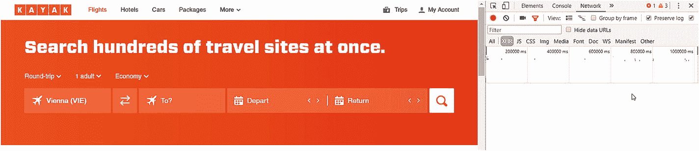
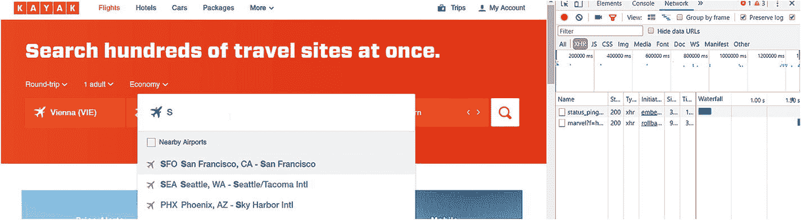
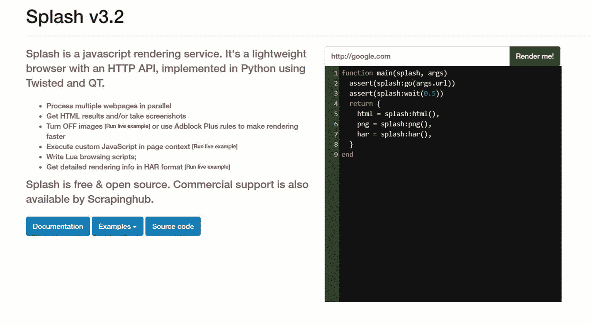
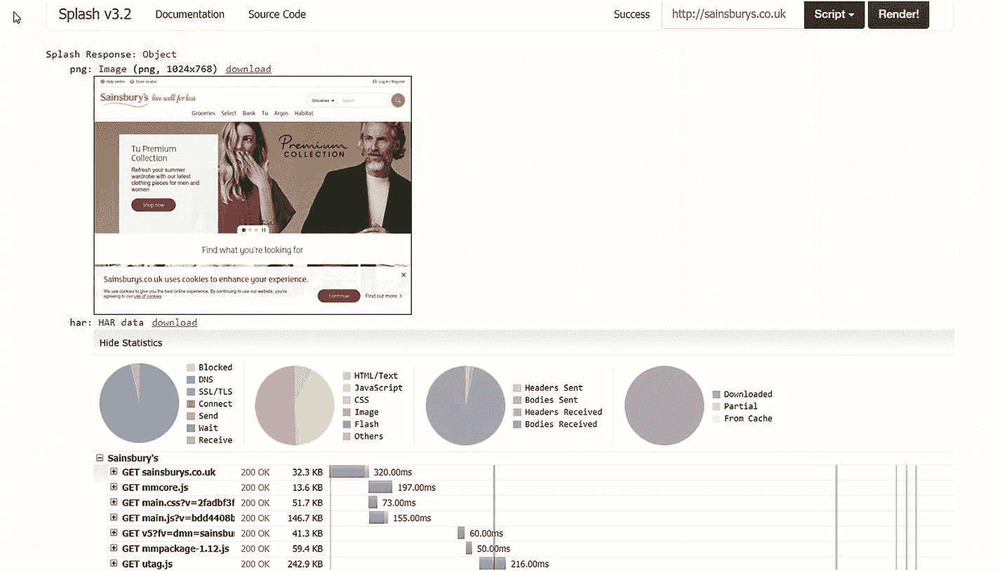
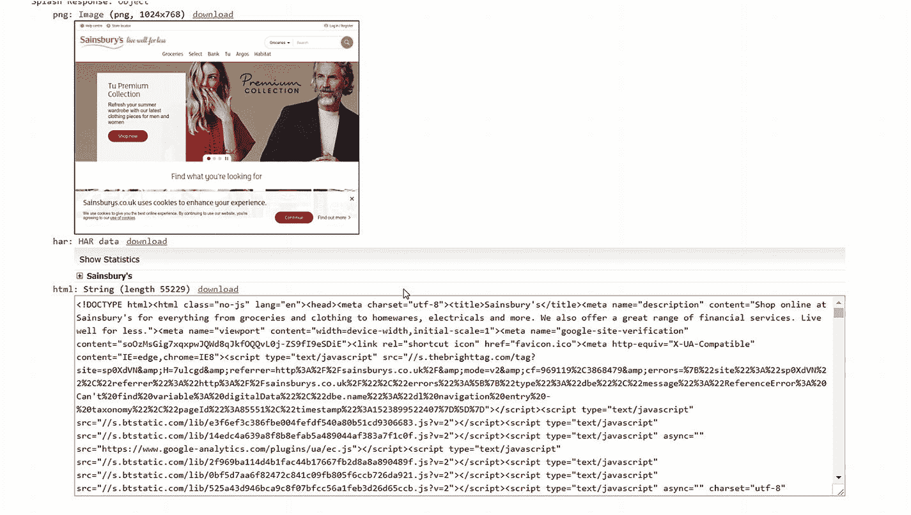

# 5.处理 JavaScript

本章是关于处理利用 JavaScript 动态呈现信息的网站。

在前面的章节中，你已经看到了一个基本的网站抓取器加载网页的内容，并对源代码进行提取。如果包含了 JavaScript，它就不会被执行，页面中的动态信息也会丢失。

这很糟糕，至少在你需要动态数据的情况下。

抓取使用 JavaScript 的网站的另一个有趣的部分是，你可能需要点击或按钮才能进入正确的页面/获得正确的内容，因为这些操作调用了一系列 JavaScript 函数。

现在我会给你如何处理这些问题的选择。大多数时候，如果你用谷歌或其他引擎搜索互联网，你会发现 Selenium 是解决方案。然而，还有其他的选择，我会给你更多的见解。也许其他的选择会更符合你的需求。

## 逆向工程

第一种选择是高级开发人员的`—`至少我觉得高级开发人员会做更多的逆向工程。

这里的想法是使用 Chrome 的 DevTools(或其他浏览器中的类似功能)，启用 JavaScript，并监控`XHR`网络流，以找出哪些数据是从服务器请求的，并单独呈现。

有了目标端点(或者是一个`GET`或者是一个`POST`请求),您就可以看到提供哪些参数以及它们如何影响结果。

让我们看一个简单的例子:在`kayak.com`你可以搜索航班，因此也可以搜索机场。在这个简单的例子中，我们将对目的地搜索端点进行逆向工程，以提取一些信息，即使这些信息没有价值。

对于这些例子，我将使用 Chrome。这是因为我使用 Chrome 来完成所有的抓取任务。如果你知道如何使用开发者工具，它也可以和 Firefox 一起工作。

首先让我们转到`kayak.com`，打开 DevTools 窗口，在那里找到*网络*选项卡，如图 [5-1](#Fig1) 所示。



图 5-1

打开 DevTools 的 Kayak.com

正如你在图中看到的，我已经导航到了*网络*选项卡内的 *XHR* 选项卡，因为所有的 AJAX 和 XHR 调用都列在这里。

现在让我们点击网站上标有 **To 的字段。**并输入一个字母，例如`S`，观察 *XHR* 页签内右侧的数值，如图 [5-2](#Fig2) 所示。



图 5-2

机场的小名单

现在你在网站上得到一些可能的机场列表，但也有两个 XHR 请求。我们对以`marvel`开头的请求感兴趣:

```py
www.kayak.com/mv/marvel?f=h&where=so&s=50&lc_cc=US&lc=en&v=v2&cv=5.

```

这是返回机场信息的请求。它有一些参数，我不知道它们是做什么的，如果改变，结果会受到什么影响，但我知道的是:

*   `where`是您正在寻找的密钥

*   `s`是搜索的类型；`58`是机场

*   `lc`是区域设置；您可以更改它，并在稍后获得不同的结果`—`

*   `v`是版本；如果你选择`v1`而不是默认的`v2`，那么结果格式会有一点点不同

根据这些信息，我们能从中得到什么？我们了解了一些机场，以及一些关于如何对 JavaScript 进行逆向工程以及何时决定使用不同工具的想法。

在这个例子中，JavaScript 呈现是一个简单的 HTTP `GET`调用`—`没有什么特别的，我打赌您已经知道如何提取这些端点传递的信息。是的，使用`requests`和漂亮的汤库或者 Scrapy 和一些`Request`物品。

回到这个例子:当您改变`lc`的值时，例如，将请求中的`de`或`es`，您将得到不同的机场以及在您选择的地区中对这些机场的描述。这意味着 JavaScript 逆向工程不仅仅是找到您想要使用的正确调用，还需要一些思考。

### 关于逆向工程的思考

如果您发现自己有一个利用 HTTP 端点获取数据的搜索，您可以尝试弄清楚这个搜索是如何工作的。例如，尝试添加搜索表达式，而不是发送一些您期望交付结果的值。这样的表达式可以是`*`匹配全部，`.+`计算正则表达式，或者`%`如果它后面有某种 SQL 查询。

### 摘要

你看，有时 JavaScript 逆向工程是有回报的:你知道那些讨厌的 XHR 调用是简单的请求，你可以在你的脚本中覆盖它们。然而，有时 JavaScript 会做出更复杂的事情，比如在初始页面加载后呈现和加载数据。相信我，你不会想逆向工程的。

## 溅泼的量

Splash <sup>[1](#Fn1)</sup> 是用 Python 编写的开源 JavaScript 渲染引擎。它是轻量级的，并与 Scrapy 顺利集成。

它被维护着，并且每隔几个月就会发布新的版本。

### 设置

Splash 的基本和最简单的用法是从开发人员那里获得一个 Docker 映像并运行它。这确保您拥有项目所需的所有依赖项，并且可以开始使用它。在本节中，我们将使用 Docker。

如果您还没有 Docker，请安装它。你可以在这里找到更多关于安装 Docker 的信息: [`https://docs.docker.com/manuals/`](https://docs.docker.com/manuals/) 。

如果这样做了，您可以在控制台上执行以下命令来获得映像:

```py
docker pull scrapinghub/splash
docker run -p 5023:5023 -p 8050:8050 -p 8051:8051 scrapinghub/splash

```

### 注意

在某些机器上，启动 Splash 需要管理员权限。例如，在我的 Windows 10 电脑上，我必须从管理员控制台运行 docker 容器。在类似 Unix 的机器上，您可能需要使用`sudo`来运行容器。

现在 Splash 正在 localhost:8050 上运行，它看起来应该如图 [5-3](#Fig3) 所示。



图 5-3

闪屏欢迎画面

现在你可以在右上角输入一个网址，点击`Render me!`来显示网站。如果您输入 [`http://sainsburys.co.uk`](http://sainsburys.co.uk) ，您会得到与图 [5-4](#Fig4) 所示类似的结果(图像会有所不同)。



图 5-4

飞溅渲染塞恩斯伯里的

正如你所看到的，你从你抓取的页面中得到一个截图，在它的下面是一些统计数据和呈现相关网站的请求的时间。在页面底部你看到的是网站的源代码，如图 [5-5](#Fig5) 所示。



图 5-5

源飞溅

这个源代码是页面呈现后得到的代码。为了验证这一点，您可以打开一个交互式 Python shell 并使用`requests`获得网站。

```py
>>> import requests
>>> r = requests.get('http://sainsburys.co.uk')
>>> r.text
'<!DOCTYPE html><html class="no-js" lang="en"><head><meta charset="utf-8"><title>Sainsbury\'s</title><meta name="description" content="Shop online at Sainsbury\'s for everything from groceries and clothing to homewares, electricals and more. We also offer a great range of financial services. Live well for less."><meta name="viewport" content="width=device-width,initial-scale=1"><meta name="google-site-verification" content="soOzMsGig7xqxpwJQWd8qJkfOQQvL0j-ZS9fI9eSDiE"><link rel="shortcut icon" href="favicon.ico"><meta http-equiv="X-UA-Compatible" content="IE=edge,chrome=IE8"><script type="text/javascript" src="//service.maxymiser.net/cdn/sainsburyscoUK/js/mmcore.js"></script><!--[if lt IE 9]>\n    <script src="https://cdn.polyfill.io/v1/polyfill.min.js"></script>\n    <link rel="stylesheet" href="homepage/css/main_ie8.css?v=65f0de0508c75d5aac7501580ddf4e0a">\n    <![endif]--><!--[if gte IE 9]>\n    <link rel="stylesheet" href="homepage/css/main.css?v=2fadbf3f7bf0aa1b5e3613ec61ebabf7">\n    <![endif]--><link rel="stylesheet" href="homepage/css/main.css?v=2fadbf3f7bf0aa1b5e3613ec61ebabf7"><!--[if !IE]><!--><!--<![endif]--></head><body><script type="text/javascript">(function(a,b,c,d)
....

```

前面的示例结果只是摘录。如果您将这段代码保存到一个 HTML 文件中，并在浏览器中打开它，然后对 Splash 返回的源代码进行同样的操作，您将看到相同的页面。不同之处在于源代码:Splash 有更多的代码行，并且包含扩展的 JavaScript 函数。

### 一个生动的例子

要了解如何让 Splash 与动态网站(大量使用 JavaScript)一起工作，让我们看一个不同的例子。例如， [`http://www.protopage.com/`](http://www.protopage.com/) 会根据原型生成一个网页，您可以对其进行定制。如果您访问该站点，您必须等待几秒钟，直到页面呈现出来。

如果我们想要从这个站点抓取数据(也没有太多可用的，但是想象一下它有很多可以提供的)，并且我们使用一个简单的工具(`requests`库，Scrapy)或者使用默认设置的 Splash，我们只得到告诉我们该页面当前被渲染的基础页面。

为了用 Splash 渲染站点，我修改了脚本(顺便说一下，它是用 Lua 编写的)，并将等待时间增加到了**三秒**。

```py
function main(splash, args)
  assert(splash:go(args.url))
  assert(splash:wait(3))
  return {
    html = splash:html(),
    png = splash:png(),
    har = splash:har(),
  }
end

```

根据目标网站的网络速度和负载，三秒钟可能太短了。请随意为您的目标网站尝试不同的值来呈现页面。

现在这一切都好了，但是如何使用 Splash 来刮网站呢？

### 与 Scrapy 集成

Splash 开发人员推荐的方法是将该工具与 Scrapy 集成，因为我们使用 Scrapy 作为我们的抓取工具，所以我们将彻底了解它是如何实现的。

首先，我们需要使用`pip`安装 Splash Python 包。

```py
pip install scrapy-splash

```

既然已经安装了这个库，我们需要启用与`scrapy-splash`一起交付的中间件。

```py
DOWNLOADER_MIDDLEWARES = {
    'scrapy_splash.SplashCookiesMiddleware': 720,
    'scrapy_splash.SplashMiddleware': 725,
'scrapy.downloadermiddlewares.httpcompression.HttpCompressionMiddleware': 810,
}

```

前进的数字并不完全是经验性的:Splash 中间件必须比`HttpProxyMiddleware`的顺序更高，后者的默认值是`750`。为了安全起见(例如 Scrapy 改变了这个代理中间件的默认值)，我们可以像这样改变中间件的配置:

```py
DOWNLOADER_MIDDLEWARES = {
    'scrapy_splash.SplashCookiesMiddleware': 720,
    'scrapy_splash.SplashMiddleware': 725,
'scrapy.downloadermiddlewares.httpproxy.HttpProxyMiddleware': 750,
'scrapy.downloadermiddlewares.httpcompression.HttpCompressionMiddleware': 810,
}

```

然后，我们必须添加蜘蛛中间件，以节省磁盘空间和网络流量。这是可选的；如果你不这样做，重复的 Splash 参数会被存储在你的磁盘上并被发送到你的 Splash 服务器上(这在云中会很有趣`—`见下一章关于这个主题的更多内容)。

```py
SPIDER_MIDDLEWARES = {
    'scrapy_splash.SplashDeduplicateArgsMiddleware': 100,
}

```

现在我们可以定义 Splash 工作所需的一些变量。其中之一是`SPLASH_URL`，它(显然)告诉中间件 Splash 实例可以在哪里呈现。

```py
SPLASH_URL = 'http://localhost:8050/'

```

接下来的两个变量是因为 Scrapy 没有提供覆盖请求指纹的方法，这使得在脚本和 Splash 之间路由这些请求和响应有点复杂。然而，Splash 的开发者提出了一个解决方案，你可以使用他们的配置。

```py
DUPEFILTER_CLASS = 'scrapy_splash.SplashAwareDupeFilter'
HTTPCACHE_STORAGE = 'scrapy_splash.SplashAwareFSCacheStorage'

```

第二个变量指向一个缓存存储解决方案，它可以感知 Splash。如果您正在使用另一个自定义缓存存储，您必须调整它以与 Splash 配合使用。这需要你子类化前面提到的存储类，并用`scrapy_splash.splash_request_fingerprint`替换所有对`scrapy.util.request.request_fingerprint`的调用，以解决那些讨厌的变化指纹。

我们必须适应的最后一个变化是`Request` s 的用法:我们需要使用`SplashRequest`而不是默认的 Scrapy `Request`。

现在让我们修改塞恩斯伯里的蜘蛛使用飞溅。

### 调整`basic`蜘蛛

在理想的情况下，您只需要像我们在上一节中所做的那样修改配置，所有的请求和响应都会经过 Splash，因为我们没有使用`Scrapy`的`Request`对象。

不幸的是，我们还需要在 scraper 的代码中进行更多的配置。如果你不相信我，就启动铲运机，不要有飞溅运行。

为了让我们的 scraper 在 Splash 中运行，我们需要修改每个请求调用来使用一个`SplashRequest`，并且每次我们发起一个新的请求时(启动 scraper 或者`yield`-调用一些`response.follow`)。

为了取得良好的开端，我们可以在脚本中添加以下函数:

```py
from scrapy_splash import SplashRequest

def start_requests(self):
    for url in self.start_urls:
        yield SplashRequest(url, callback=self.parse)

```

这是蜘蛛通过飞溅操作的最低要求。参数说明了一切:`URL`是目标 URL，`callback`定义了要使用的方法。有一些选项可以配置 Splash 的行为方式，例如，等待一段时间来呈现网站。比方说，如果我们想在加载页面时多等一秒钟，我们可以这样修改`SplashRequests`的调用:

```py
yield SplashRequest(url, callback=self.parse, args={'wait':1.0})

```

所以，我们很好，我们通过 Splash 呈现了第一个页面，但是其他调用，比如导航到详细页面或下一个页面呢？

为了适应这些，我稍微修改了 XPath 提取代码。到目前为止，我们使用的是`response.follow`方法，其中我们可以提供包含我们想要抓取的潜在下一个 URL 的选择器。

使用 Splash，我们需要提取这些 URL，并将它们作为参数提供给`SplashRequest`构造函数。我将使用`parse`方法作为例子。在第四章[的结尾是这样的:](4.html)

```py
def parse(self, response):
    urls = response.xpath('//ul[@class="categories departments"]/li/a')

    for url in urls:
        yield response.follow(url, callback=self.parse_department_pages)

```

现在看起来是这样的:

```py
def parse(self, response):
    urls = response.xpath('//ul[@class="categories departments"]/li/a/@href').extract()

    for url in urls:
        if url.startswith('http'):
            yield SplashRequest(url, callback=self.parse_department_pages)

```

我为`url.startswith('http')`添加了过滤器，以避免在`url`不包含绝对 URL 时可能发生的潜在错误。在某些情况下，您需要将 URL 与响应的基本 URL 连接在一起以获得目标域(因为`url`是该域的相对 URL)。下面是一个使用`parse`方法的例子。

```py
def parse(self, response):
    urls = response.xpath('//ul[@class="categories departments"]/li/a/@href').extract()

    for url in urls:
        yield SplashRequest(response.urljoin(url), callback=self.parse_department_pages)

```

除了前面提到的，我做的一个改变是将蜘蛛重命名为`splash`。

运行铲运机保持不变。

```py
scrapy crawl splash -o splashburys.jl

```

在 scraper 完成后，您会在`splashburys.jl`文件中找到类似于以下摘录的记录。

```py
{"url": "https://www.sainsburys.co.uk/shop/ProductDisplay?storeId=10151&productId=1153156&urlRequestType=Base&categoryId=312365&catalogId=10216&langId=44", "product_name": "Sainsbury's Venison Steak, Taste the Difference 250g", "product_image": "https://www.sainsburys.co.uk/wcsstore7.25.53/ExtendedSitesCatalogAssetStoimg/productImages/90/0000001442090/0000001442090_L.jpeg", "price_per_unit": "£7.50", "rating": "3.0", "product_reviews": "2", "item_code": "6450995", "nutritions": {"Energy ": "583kJ/", "Fat ": "2.6g", "of which saturates ": "0.9g", "mono-unsaturates ": "1.0g", "polyunsaturates ": "0.6g", "Carbohydrate ": "<0.5g", "of which sugars ": "<0.5g", "Fibre ": "<0.5g", "Protein ": "28.2g", "Sodium ": "0.05g", "Salt ": "0.13g"}, "product_origin": ""}
{"url": "https://www.sainsburys.co.uk/shop/gb/groceries/special-offers-314361-44/sainsburys-salmon-with-lemon-butter--taste-the-difference-145g", "product_name": "Sainsbury's Lightly Smoked Salmon with Wild Garlic Butter, Taste the Difference 145g", "product_image": "https://www.sainsburys.co.uk/wcsstore7.25.53/ExtendedSitesCatalogAssetStoimg/productImages/27/0000000301527/0000000301527_L.jpeg", "price_per_unit": "£3.00", "rating": "2.3333", "product_reviews": "3", "item_code": "7880107", "nutritions": {"Energy": "990kJ", "Energy kcal": "238kcal", "Fat": "16.9g", "Saturates": "4.6g", "Mono-unsaturates": "7.5g", "Polyunsaturates": "3.8g", "Carbohydrate": "1.6g", "Sugars": "1.2g", "Fibre": "0.6g", "Protein": "19.6g", "Salt": "0.63g"}, "product_origin": "Packed in United Kingdom Farmed in Scotland Produced from Farmed Scottish ( UK) Atlantic Salmon ( Salmo salar)"}

```

就是这样:我们把塞恩斯伯里的刮刀换成了飞溅式的。

### Splash 不运行时会发生什么？

好问题，但我打赌你已经有答案了。scraper 不会做任何事情，它会退出并显示一条错误消息，该消息包含以下有价值的信息来识别这个特定的错误原因。

```py
2018-04-27 16:07:19 [scrapy.core.scraper] ERROR: Error downloading <GET https://www.sainsburys.co.uk/shop/gb/groceries/meat-fish/ via http://localhost:8050/render.html>: Connection was refused by other side: 10061:

```

### 摘要

Splash 是一个很好的基于 Python 的网站渲染工具，可以很容易地与 Scrapy 集成。

一个缺点是，你必须通过一个有点复杂的过程或使用 Docker 手动安装它。这使得将它移植到云变得复杂(参见第 [6](6.html) 章的云解决方案)，因此你应该只在本地抓取器中使用 Splash。然而，在本地，它可以给你一个巨大的好处，它与 Scrapy 无缝集成，使用 JavaScript 动态地抓取网站内容。

另一个缺点是速度。当我在本地电脑上使用 Splash 时，它每分钟只能勉强浏览 20 页。这对于我的口味来说太慢了，但有时我无法绕过它。

## 硒

如果您在互联网上搜索关于网站抓取的内容，您将最常遇到关于 Selenium 的文章和问题。最初，我想把 Selenium 排除在这本书之外，因为我不喜欢它的方法；对我的口味来说有点笨拙。然而，因为它的流行，我决定增加一个关于这个工具的部分。也许你会在 Scrapy 脚本中嵌入一个基于 Selenium 的解决方案(例如，你已经有了一个 Selenium-scraper，但想扩展它)，我想帮助你完成这个任务。

首先，我们将了解 Selenium 以及如何独立使用它，然后我们将把它添加到 Scrapy spider 中。

### 先决条件

要让 Selenium 在您的计算机上工作，您必须像大多数 Python 库一样通过 Python 包索引来安装它。

```py
pip install selenium

```

要使用 Selenium 进行网站抓取，您需要一个 web 浏览器。这意味着您将看到配置好的 web 浏览器(比如 Firefox 或 Chrome)打开，加载网站，然后 Selenium 开始工作并提取您定义的脚本。

要启用 Selenium 和浏览器之间的链接，您必须安装特定的 web 驱动程序。

对于 Chrome，请访问 [`https://sites.google.com/a/chromium.org/chromedriver/home`](https://sites.google.com/a/chromium.org/chromedriver/home) 。我下载了 2.38 版本。

对于 Firefox，需要安装 GeckoDriver。可以在 GitHub 上找到。我下载了 0.20.1 版本。

当您运行 Python 脚本时，这些驱动程序必须在`PATH`上。我把它们都放在一个文件夹中，因为在这种情况下，我只需添加这一个文件夹，我所有的 web 驱动程序都是可用的。

### 注意

这些 web 驱动程序需要特定的浏览器版本。例如，如果您已经安装了 Chrome 并下载了最新版本的 web 驱动程序，如果您错过了更新浏览器，您可能会遇到如下异常:

`raise exception_class(message, screen, stacktrace) selenium.common.exceptions.SessionNotCreatedException: Message: session not created exception: Chrome version must be >= 65.0.3325.0`

`(Driver info: chromedriver=2.38.552522 (437e6fbedfa8762dec75e2c5b3ddb86763dc9dcb),platform=Windows NT 10.0.16299 x86_64)`

### 基本用法

现在，为了验证一切是否正常，让我们编写一个简单的脚本，使用 Selenium 为我们打开 Sainsbury 的网站。

```py
from selenium.webdriver import Chrome, Firefox

chrome = Chrome()
firefox = Firefox()

chrome.open()  # this opens a Chrome window
firefox.open()  # this opens a Firefox window

chrome.get('https://sainsburys.co.uk')  # navigates to the target website in Chrome
firefox.get('https://sainsburys.co.uk')  # navigates to the target website in Firefox

```

好了，让浏览器自动打开，导航到目标网站，挺好的。但是抓取信息呢？

因为我们有一个触手可及的网站(在浏览器中)，所以我们可以像前面章节那样解析 HTML `—`,或者使用 Selenium 的产品从网页的 HTML 中提取数据。

我不会详细介绍 Selenium 的提取器，因为这会超出本书的范围，但是让我告诉您，通过使用 Selenium，您可以访问一组不同的提取函数，您可以在您的浏览器实例中使用这些函数。

### 与 Scrapy 集成

硒可以和 Scrapy 融合。您唯一需要做的就是正确配置 Selenium(在`PATH`上安装 web 驱动程序并安装浏览器),然后就可以开始玩了。

我喜欢做的是禁用浏览器窗口。这是因为每当我看到一个自动导航页面的浏览器窗口时，我都会分心，如果你把 Scrapy 和 Selenium 结合起来，我会疯掉。

除此之外，您将需要一个中间件，该中间件将在通过 Scrapy 直接发送调用之前拦截调用，并将使用 Selenium 而不是正常的请求。

一个基本的中间件应该是这样的:

```py
# -*- coding: utf-8 -*-

from scrapy import signals
from scrapy.http import HtmlResponse
from scrapy.utils.python import to_bytes
from selenium import webdriver
from selenium.webdriver.firefox.options import Options

class SeleniumDownloaderMiddleware:

    def __init__(self):
        self.driver = None

    @classmethod
    def from_crawler(cls, crawler):
        middleware = cls()
        crawler.signals.connect(middleware.spider_opened, signals.spider_opened)
        crawler.signals.connect(middleware.spider_closed, signals.spider_closed)
        return middleware

    def process_request(self, request, spider):
        self.driver.get(request.url)
        body = to_bytes(self.driver.page_source)
        return HtmlResponse(self.driver.current_url, body=body, encoding='utf-8', request=request)

    def spider_opened(self, spider):
        options = Options()
        options.set_headless()
        self.driver = webdriver.Firefox(options=options)

    def spider_closed(self, spider):
        if self.driver:
            self.driver.close()
            self.driver.quit()
            self.driver = None

```

前面的代码使用 Firefox 作为默认浏览器，并在蜘蛛打开时以无头模式启动它。当 spider 关闭时，web 驱动程序也会关闭。

有趣的部分是当请求发生时:它被截取并通过浏览器路由，响应 HTML 代码被包装到一个`HtmlResponse`对象中。现在，您的蜘蛛获得了加载了 Selenium 的 HTML 代码，您可以使用它进行抓取。

#### 羊血清硒

最近在 GitHub 发现了一个新鲜的项目，叫做 scrapy-selenium。这是一个方便的项目，让你安装并使用它来结合羊瘙痒病和硒的力量。我认为这个项目值得和你分享。

### 注意

因为这个项目是一个私人项目，它可能有问题。如果你发现一些不工作，随时提出这个项目的问题，开发人员会帮助你解决这个问题。如果没有，给我发一封电子邮件，我会看看我是否能给你一个解决方案，或者可能自己维护应用程序并提供更新的版本。

这个项目就像我们在上一节中实现的定制中间件一样工作:它拦截请求并使用 Selenium 下载页面。

先说配置。

```py
from shutil import which

SELENIUM_DRIVER_NAME = 'firefox'
SELENIUM_DRIVER_EXECUTABLE_PATH = which('geckodriver')
SELENIUM_DRIVER_ARGUMENTS = ['-headless']

```

或者，你可以用 Chrome 代替 Firefox，但是在这种情况下，要注意`--headless`参数:它需要两个破折号。

```py
from shutil import which

SELENIUM_DRIVER_NAME = 'chrome'
SELENIUM_DRIVER_EXECUTABLE_PATH = which('geckodriver')
SELENIUM_DRIVER_ARGUMENTS = ['--headless']
And we need the right middleware:
DOWNLOADER_MIDDLEWARES = {
    'scrapy_selenium.SeleniumMiddleware': 800
}

```

对于蜘蛛，我重用了 Splash 部分的代码，但是将使用的`Request`实现改为`scrapy-selenium`实现:

```py
from scrapy_selenium import SeleniumRequest

```

我不得不修改构造函数调用以包含 URL 作为命名参数。

```py
def start_requests(self):
    for url in self.start_urls:
        yield SeleniumRequest(url=url, callback=self.parse)

```

一定要把这些电话都换了。如果您错过了一个，您将得到如下错误:

```py
  yield SeleniumRequest(url, callback=self.parse)
  File "c:\dev\__py_venv\scrapy\lib\site-packages\scrapy_selenium\http.py", line 29, in __init__
    super().__init__(*args, **kwargs)
TypeError: __init__() missing 1 required positional argument: 'url'

```

### 摘要

Selenium 是网站抓取器开发人员使用的替代工具，因为它支持通过浏览器进行 JavaScript 渲染。我们看到了一些关于如何将 Selenium 与 Scrapy 集成的解决方案，但是跳过了提取信息的内置方法。

同样，使用 Selenium 这样的外部工具会降低抓取速度，即使是在无头模式下。

## 美味汤的解决方案

到目前为止，我们一直在寻找可以将基于 JavaScript 的网站抓取与 Scrapy 集成的解决方案。但是有些项目使用 Beautiful Soup 也可以，不需要完整的 scraper 环境。

### 溅泼的量

Splash 也提供手动使用。这意味着，您可以选择让 Splash 呈现网站，并将源代码返回到您的代码中。我们可以利用它来制作一个简单的刮刀，上面写着漂亮的汤。

这里的想法是向 Splash 发送一个 HTTP 请求，提供要呈现的 URL(和任何配置参数)并获取结果，然后在这个结果上使用 Beautiful Soup，这是一个呈现的 HTML。

为了坚持前面的例子，我们将把 scraper 形式的第 [3 章](3.html)转换成一个利用 Splash 来呈现 Sainsbury 的页面的工具。

这里的想法是简单地调用 Splash 的 HTTP API 来呈现网页，而不是通过`requests`库获取页面。这意味着我们唯一的改变是在`get_page`函数中，在这里我们转发我们想要抓取的 URL 到 Splash。

```py
def get_page(url):
    try:
        r = requests.get('http://localhost:8050/render.html?url=' + url)
        if r.status_code == 200:
            return BeautifulSoup(r.content, bs_parser)
    except Exception as e:
        pass
    return None

```

如您所见，我们调用 Splash 安装的`render.html`端点，并提供目标 URL 作为简单的`GET`参数。

如果您对`POST`请求更感兴趣，您可以将处理函数更改为如下所示:

```py
def get_page(url):
    try:
        r = requests.post('http://localhost:8050/render.html', data='{'url': '+ url + '}')
        if r.status_code == 200:
            return BeautifulSoup(r.content, bs_parser)
    except Exception as e:
        pass
    return None

```

### 硒

当然，我们也可以将硒元素整合到我们美丽的汤液中。它的工作方式和 Scrapy 一样。

同样，我不会使用内置的 Selenium 方法从网站中提取信息。我只使用 Selenium 来呈现页面和提取我需要的信息。

为此，我将在 scraper 中添加两个助手函数，它们在需要的地方初始化和分解 Selenium。

```py
def initialize():
    global selenium
    if not selenium:
        selenium = Firefox()

def tear_down():
    global selenium
    if selenium:
        selenium.quit()
        selenium = None

```

为了安全起见，我会在每次我们要下载页面的时候，添加一个对`initialize()`的调用；然而，我将只在脚本完成时调用`tear_down()`。

```py
def get_page(url):
    initialize()
    try:
        selenium.get(url)
        return BeautifulSoup(selenium.page_source, bs_parser)
    except Exception as e:
        pass
    return None

```

### 摘要

尽管我们把重点放在 Scrapy 上，因为在我看来它目前是 Python 的网站抓取工具**，你可以看到让 Scrapy 处理 JavaScript 的选项可以被添加到“普通的”漂亮的汤抓取器中。这让您可以选择继续使用您已经熟悉的工具！**

## 摘要

在这一章中，我们看了一些利用 JavaScript 抓取网站的方法。我们查看了使用 web 浏览器执行 JavaScript 的主流 Selenium，然后进入了无头世界，在那里您不需要任何窗口来执行 JavaScript，这使得您的脚本可移植且更容易执行。

自然地，使用另一个工具来完成一些额外的渲染需要时间和开销。如果您不需要 JavaScript 渲染，那么创建您的脚本时不需要任何附加组件，如 Splash 或 Selenium。你将受益于速度的提高。

现在我们准备看看如何将我们的蜘蛛部署到云中！

<aside class="FootnoteSection" epub:type="footnotes">Footnotes [1](#Fn1_source)

[T2`https://splash.readthedocs.io/en/stable/`](https://splash.readthedocs.io/en/stable/)

  [2](#Fn2_source)

[T2`https://github.com/clemfromspace/scrapy-selenium`](https://github.com/clemfromspace/scrapy-selenium)

 </aside>