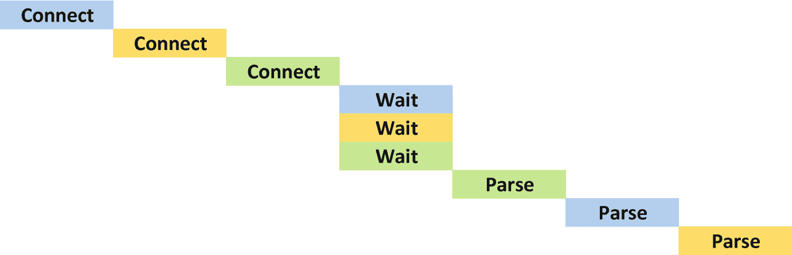
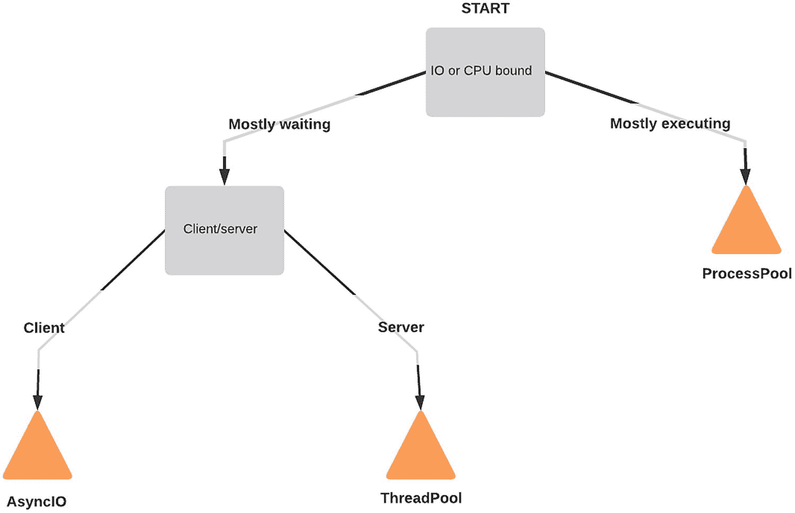

# 七、并行和异步

开发人员发现自己面临的一个常见问题是，他们有一个花费大量时间等待某事发生的操作，以及其他不依赖于第一个操作结果的操作。当程序正在做其他事情时，等待缓慢的操作完成可能会令人沮丧。这是异步编程试图解决的基本问题。

这个问题在 IO 操作(如网络请求)期间变得最为明显。在我们的聚合过程中，我们有一个循环，它向各个端点发出 HTTP 请求，然后处理结果。这些 HTTP 请求可能需要一些时间来完成，因为它们通常涉及检查外部传感器并在几秒钟内查看值。如果每个请求需要 3 秒钟才能完成，那么检查 100 个传感器将意味着在所有处理时间之外还要等待 5 分钟。

另一种方法是我们将程序的某些方面并行化。并行化最自然的功能是涉及等待某个外部系统的步骤。如图 [7-2](#Fig2) 所示，如果图 [7-1](#Fig1) 中的三个等待步骤能够并行化，将会节省大量时间。



图 7-2

并行等待的逐步过程，解析不一定按顺序进行


图 7-1

连接到三台传感器服务器并下载其数据的分步过程

当然，计算机对一次可以处理多少网络请求有实际的限制。任何将文件复制到外部硬盘的人都知道，一些存储介质比并行存储介质更适合处理多个顺序访问。最适合并行编程的情况是在需要执行的 IO 绑定和 CPU 绑定操作之间达到平衡的时候。如果强调 CPU 限制，唯一可能的速度提升就是提交更多的资源。另一方面，如果有太多的 IO 发生，我们可能不得不限制并发任务的数量，以避免处理任务的积压。

## 非阻塞 IO

用 Python 编写异步函数的最简单的方法，也是长久以来一直可行的方法，是编写使用非阻塞 IO 操作的函数。非阻塞 IO 操作是标准 IO 操作的变体，它在操作开始时立即返回，而不是在操作完成时返回的正常行为。

一些库可能将这些用于底层操作，比如从套接字读取，但是它们很少用于更复杂的设置或者被大多数 Python 开发人员使用。没有广泛使用的库允许开发人员利用 HTTP 请求的非阻塞 IO，所以我不能推荐它作为管理 web 服务器同时连接问题的实用解决方案。不过，这是一种在 Python 2 时代更常用的技术，看起来很有趣，因为它有助于我们理解更现代的解决方案的优点和缺点。

我们将在这里查看一个示例实现，以便我们可以看到代码必须如何构造才能利用这一点的差异。实现依赖于标准库的`select.select(...)`函数，它是`select(2)`系统调用的包装器。当给定一个类似文件的对象列表(包括套接字和子进程调用)时，`select`返回那些准备好读取数据的对象， <sup>[1](#Fn1)</sup> 或阻塞，直到至少有一个准备好。

`select`代表异步代码的关键思想，即我们可以并行等待多件事情，但有一个处理阻塞的函数，直到一些数据准备好。阻塞行为从依次等待每个任务变为等待多个并发请求中的第一个。非阻塞 IO 进程的关键是一个阻塞的函数，这似乎有悖常理，但其目的并不是完全消除阻塞，而是将阻塞转移到我们没有其他事情可做的时候。

堵不是坏事；这使得我们的代码有一个易于理解的执行流程。如果没有连接就绪时`select(...)`没有阻塞，我们就必须引入一个循环来重复调用`select(...)`,直到连接就绪。立即阻塞的代码更容易理解，因为它不必处理变量是尚未准备好的未来结果的占位符的情况。select 方法通过将阻塞推迟到稍后的时间点来牺牲程序流中的一些天真的清晰性，但是它允许我们利用并行等待。

Caution

以下示例函数非常乐观；它们不是符合标准的 HTTP 函数，并且它们对服务器的行为做了许多假设。这是故意的；它们在这里是为了说明一种方法，而不是推荐在现实世界中使用的代码。对于教学和比较目的来说，它足够好，仅此而已。

清单 [7-1](#PC1) 显示了一个程序的例子，它发出一些非阻塞 IO HTTP 请求。我们代码的 HTTP 处理和这个示例最显著的区别是增加了两个额外的函数——执行 HTTP 请求和响应动作的函数。像这样分割逻辑使得这种方法没有吸引力，但是重要的是要记住在请求包中有这些函数的等价物；我们在这里看到它们只是因为我们在寻找一个没有库可以依靠的方法。

```py
import datetime
import io
import json
import select
import socket
import typing as t
import urllib.parse

import h11

def get_http(uri: str, headers: t.Dict[str, str]) -> socket.socket:
    """Given a URI and a set of headers, make a HTTP request and return the
    underlying socket. If there were a production-quality implementation of
    nonblocking HTTP this function would be replaced with the relevant one
    from that library."""
    parsed = urllib.parse.urlparse(uri)
    if parsed.port:
        port = parsed.port
    else:
        port = 80
    headers["Host"] = parsed.netloc
    sock = socket.socket()
    sock.connect((parsed.hostname, port))
    sock.setblocking(False)

    connection = h11.Connection(h11.CLIENT)
    request = h11.Request(method="GET", target=parsed.path, headers=headers.items())

    sock.send(connection.send(request))
    sock.send(connection.send(h11.EndOfMessage()))
    return sock

def read_from_socket(sock: socket.socket) -> str:
    """ If there were a production-quality implementation of nonblocking HTTP
    this function would be replaced with the relevant one to get the body of
    the response if it was a success or error otherwise. """
    data = sock.recv(1000000)
    connection = h11.Connection(h11.CLIENT)
    connection.receive_data(data)

    response = connection.next_event()
    headers = dict(response.headers)
    body = connection.next_event()
    eom = connection.next_event()

    try:
        if response.status_code == 200:
            return body.data.decode("utf-8")
        else

:
            raise ValueError("Bad response")
    finally:
        sock.close()

def show_responses(uris: t.Tuple[str]) -> None:
    sockets = []
    for uri in uris:
        print(f"Making request to {uri}")
        sockets.append(get_http(uri, {}))
    while sockets:
        readable, writable, exceptional = select.select(sockets, [], [])
        print(f"{ len(readable) } socket(s) ready")
        for request in readable:
            print(f"Reading from socket")
            response = read_from_socket(request)
            print(f"Got { len(response) } bytes")
            sockets.remove(request)

if __name__ == "__main__":
    show_responses([
        "http://jsonplaceholder.typicode.com/posts?userId=1",
        "http://jsonplaceholder.typicode.com/posts?userId=5",
        "http://jsonplaceholder.typicode.com/posts?userId=8",
    ])

Listing 7-1Optimistic nonblocking HTTP functions – nbioexample.py

```

使用 Python 解释器运行该文件的结果将是获取这三个 URL，然后在它们的数据可用时读取它们，如下所示:

```py
> pipenv run python .\nbioexample.py
Making request to http://jsonplaceholder.typicode.com/posts?userId=1
Making request to http://jsonplaceholder.typicode.com/posts?userId=5
Making request to http://jsonplaceholder.typicode.com/posts?userId=8
1 socket(s) ready
Reading from socket
Got 27520 bytes
1 socket(s) ready
Reading from socket
Got 3707 bytes
1 socket(s) ready
Reading from socket
Got 2255 bytes

```

`get_http(...)`函数是创建套接字的函数。它解析提供给它的 URL，并设置一个 TCP/IP 套接字来连接到该服务器。这确实涉及到一些阻塞 IO，特别是任何 DNS 查找和套接字设置操作，但是与等待主体的时间相比，这些相对较短，所以我没有试图使它们成为非阻塞的。

然后，该函数将这个套接字设置为*非阻塞*，并使用`h11`库生成一个 HTTP 请求。仅仅通过字符串操作生成 HTTP 请求 <sup>[2](#Fn2)</sup> 是完全可能的，但是这个库极大地简化了我们的代码。

一旦套接字上有可用的数据，我们就调用`read_from_socket(...)`函数。它假设数据少于 1000000 字节，并且表示一个完整的响应， <sup>[3](#Fn3)</sup> 然后使用`h11`库将其解析为表示响应的头和主体的对象。我们用它来确定请求是否成功，并返回响应的主体或引发一个`ValueError`。数据被解码为 UTF-8，因为那是 Flask 在另一端为我们生成的。用正确的字符集解码是很重要的；这可以通过提供一个定义了字符集的头来实现，也可以通过其他一些关于字符集的保证来实现。由于我们还编写了服务器代码，我们知道我们正在使用 Flask 的内置 JSON 支持，它使用 Flask 的默认编码，即 UTF-8。

Tip

在某些情况下，您可能不确定使用的是哪种字符编码。chardet 库分析文本以建议最可能的编码，但这并不是万无一失的。该库或类似具有多种编码的 try/except 块的后备库仅适用于从不一致且不报告其编码的源加载数据的情况。在大多数情况下，您应该能够指定准确的编码，并且您必须这样做以避免细微的错误。

### 使我们的代码不阻塞

为了将前面的函数集成到我们的代码库中，我们代码中的其他函数需要一些更改，如清单 [7-2](#PC3) 所示。现有的`get_data_points(...)`功能将需要分成`connect_to_server(...)`和`prepare_datapoints_from_response(...)`功能。因此，我们将 socket 对象暴露给`add_data_from_sensors(...)`函数，允许它使用`select`，而不仅仅是在每个服务器上循环。

```py
def connect_to_server(server: str, api_key: t.Optional[str]) -> socket.socket:
    if not server.endswith("/"):
        server += "/"
    url = server + "v/2.0/sensors/"
    headers = {}
    if api_key:
        headers["X-API-KEY"] = api_key

    return get_http(url, headers=headers)

def prepare_datapoints_from_response(response: str) -> t.Iterator[DataPoint]:
    now = datetime.datetime.now()
    json_result = json.loads(response)
    if "sensors" in json_result:
        for value in json_result["sensors"]:
            yield DataPoint(
                sensor_name=value["id"], collected_at=now, data=value["value"]
            )
    else:
        raise ValueError(
            f"Error loading data from stream: " + json_result.get("error", "Unknown")
        )

def add_data_from_sensors(
    session: Session, servers: t.Tuple[str], api_key: t.Optional[str]
) -> t.Iterable[DataPoint]:
    points: t.List[DataPoint] = []
    sockets = [connect_to_server(server, api_key) for server in servers]
    while sockets:
        readable, writable, exceptional = select.select(sockets, [], [])
        for request in readable:
            # In a production quality implementation there would be
            # handling here for responses that have only partially been
            # received.
            value = read_from_socket(request)
            for point in prepare_datapoints_from_response(value):
                session.add(point)
                points.append(point)
            sockets.remove(request)
    return points

Listing 7-2Additional glue functions

```

这听起来可能微不足道，但这是决定不在生产代码中使用这种 HTTP 请求方法的充分理由。在我看来，如果没有一个库来简化 API，那么使用非阻塞套接字所增加的认知负荷是过多的。理想的方法是不对程序流引入任何更改，但是最小化更改有助于保持代码的可维护性。这种实现将原始套接字泄漏到应用程序函数中的事实是不可接受的。

总的来说，虽然这种方法确实减少了等待时间，但是它要求我们对代码进行重大的重构，并且它只在等待步骤中提供了节省，而不是在解析阶段。非阻塞 IO 是一种有趣的技术，但是它只适用于例外情况，并且需要对程序流进行重大修改，以及放弃所有公共库来实现最基本的结果。我不推荐这种做法。

## 多线程和多重处理

更常见的方法是将工作负载分成多个线程或进程。线程允许同时处理逻辑子问题。它们可能是 CPU 受限的，也可能是 IO 受限的。在这个模型中，一组结果的解析可能发生在等待另一组结果之前，因为整个检索过程被分成一个新的线程。每个任务都是并行运行的，但是在一个线程中，所有的事情都是顺序运行的(如图 [7-3](#Fig3) 所示)，函数照常阻塞。


图 7-3

使用线程或多个进程时的并行任务

一个线程中的代码总是按顺序执行，但是当多个线程同时运行时，不能保证它们的执行以任何有意义的方式同步。更糟糕的是，不能保证不同线程中的代码执行与语句边界对齐。当两个线程访问同一个变量时，不能保证先执行*或*动作:它们可能会重叠。Python 用来执行用户函数的内部低级“字节码”是 Python 中并行性的构建块，而不是语句。

### 低级线程

Python 中线程的最底层接口是`threading.Thread`对象，它有效地将函数调用包装到一个新线程中。线程的动作可以通过传递一个函数作为`target=`参数或者通过子类化`threading.Thread`并定义一个`run()`方法来定制，如表 [7-1](#Tab1) 所示。

表 7-1

为线程执行提供代码的两种方法

<colgroup><col class="tcol1 align-left"> <col class="tcol2 align-left"></colgroup> 
| `import threading``def helloworld():``print("Hello world!")``thread = threading.Thread(``target=helloworld,``name="helloworld"``)``thread.start()``thread.join()` | `import threading``class HelloWorldThread(threading.Thread):``def run(self):``print("Hello world!")``thread = HelloWorldThread(name="helloworld")``thread.start()``thread.join()` |

`start()`方法开始执行线程；`join()`方法阻塞执行，直到该线程完成。`name`参数主要用于调试性能问题，但是如果您曾经手动创建过线程，那么总是设置一个名称是一个好习惯。

线程没有返回值，所以如果它们需要返回一个计算出的值，这可能会很棘手。传回值的一种方式是使用一个可变对象，它可以在适当的位置改变，或者，如果使用子类方法，在线程对象上设置一个属性。

当只有一个简单的返回类型时，线程对象上的属性是一个很好的方法，比如一个布尔成功值，或者一个计算的结果。当线程在做一件不连续的工作时，这是一个很好的选择。

当您有多个线程时，可变对象是最合适的，每个线程处理一个常见问题的一部分，例如，从一组 URL 收集传感器数据，每个线程负责一个 URL。这个对象非常适合这个目的。

Exercise 7-1: Write a Wrapper To Return via a Queue

与其直接调整函数，不如编写一些代码来包装任意函数，并将其结果存储在一个队列中，而不是直接返回，以允许函数像线程一样干净地运行。如果你卡住了，回头看看第 5 章和如何写一个接受参数的装饰器。

函数`return_via_queue(...)`应该如下所示:

```py
from __future__ import annotations
...

def add_data_from_sensors(
    session: Session, servers: t.Tuple[str], api_key: t.Optional[str]
) -> t.Iterable[DataPoint]:
    points: t.List[DataPoint] = []
    q: queue.Queue[t.List[DataPoint]] = queue.Queue()
    wrap = return_via_queue(q)
    threads = [
        threading.Thread(target=wrap(get_data_points), args=(server, api_key))
        for server in servers
    ]
    for thread in threads:
        # Start all threads
        thread.start()
    for thread in threads:
        # Wait for all threads to finish
        thread.join()
    while not q.empty():
        # So long as there's a return value in the queue, process one # thread's results
        found = q.get_nowait()
        for point in found:
            session.add(point)
            points.append(point)
    return points

```

您还必须调整`get_data_points(...)`函数来返回一列`DataPoint`对象，而不是它们的迭代器，或者在包装器函数中进行等效的转换。这是为了确保在线程将数据返回给主线程之前，所有数据都在线程中得到处理。因为生成器直到值被请求时才产生它们的值，所以我们需要确保请求发生在线程内。

本章的代码示例中提供了包装器方法的示例实现和该程序的简单线程版本。

**关于 __ 未来 _ _ 进口的说明**

**像** `from __future__ import example`这样的语句是启用特性的方式，这些特性将成为 Python 未来版本的一部分。它们必须在 Python 文件的最顶端，前面没有其他语句。

在这种情况下，行`q: queue.Queue[t.List[DataPoint]] = queue.Queue()`就是问题。标准库中的`queue.Queue`对象不是 Python 3.8 中的泛型类型，所以它不能接受它所包含的对象类型的类型定义。这一遗漏在 Python 中被跟踪为 bug 33315，这里有理由不愿意添加新的`typing.Queue`类型或调整内置类型。

尽管如此，mypy 将`queue.Queue`视为泛型类型；只是 Python 解释器没有。有两种方法可以解决这个问题，一种是使用基于字符串的类型提示，这样 Python 解释器就不会试图计算`queue.Queue[...]`而失败

```py
    q: "queue.Queue[t.List[DataPoint]]" = queue.Queue()

```

或者通过使用来自`__future__`的`annotations`选项，启用为 Python 4 计划的类型注释解析逻辑。这个逻辑阻止 Python 在运行时解析注释，并且是前面的示例中采用的方法。

这种低级别的线程对用户来说一点也不友好。正如我们在前面的练习中看到的，可以编写一个包装器代码，使函数在线程环境中不变地工作。也可以为`threading.Thread`对象编写一个包装器，自动包装被调用的函数，并自动从内部队列中检索结果，然后无缝地返回给程序员。

幸运的是，我们不必在生产代码中编写这样的特性；Python 标准库中内置了一个助手:`concurrent.futures.ThreadPoolExecutor`。`ThreadPoolExecutor`管理使用中的线程数量，允许程序员限制一次执行的线程数量。

使用`ThreadPoolExecutor`对一个 hello world 线程的等效调用是

```py
from concurrent.futures import ThreadPoolExecutor

def helloworld():
    print("Hello world!")

with ThreadPoolExecutor() as pool:
    pool.submit(helloworld)

```

这里，我们看到一个上下文管理器，它定义了线程池活动的时间段。由于没有将`max_threads`参数传递给执行器，Python 根据运行程序的计算机上可用的 CPU 数量来选择线程数量。

一旦进入上下文管理器，程序就向线程池提交函数调用。可以多次调用`pool.submit(...)`函数来调度额外的任务，其结果是一个表示该任务的`Future`对象。使用过现代 JavaScript 的开发人员对未来会非常熟悉；它们是代表将来某个时刻会出现的值(或错误)的对象。`result()`方法返回提交的函数返回的任何值。如果该函数引发了一个异常，那么当调用`result()`方法时也会引发相同的异常。

```py
from concurrent.futures import ThreadPoolExecutor

def calculate():
    return 2**16

with ThreadPoolExecutor() as pool:
    task = pool.submit(calculate)

>>> print(task.result())
65536

```

Caution

如果不访问未来的 result()方法，那么它引发的任何异常都不会传播到主线程。这可能会使调试变得困难，所以最好确保您总是能够访问结果，即使您从未将它赋给变量。

如果在`with`块中调用了`result()`，执行将会阻塞，直到相关任务完成。当`with`块结束时，执行会一直阻塞，直到*所有的*预定任务都完成，所以在`with`块结束后对 result 方法的调用总是立即返回。

### 字节码

为了理解 Python 中线程化的一些限制，我们需要看看解释器如何加载和运行代码的幕后。在这一节中，Python 代码可能用解释器使用的底层字节码进行了注释。这个字节码是一个实现细节，存储在`.pyc`文件中。它在最底层编码程序的行为。解释像 Python 这样复杂的语言并不是一项简单的任务，因此 Python 解释器将其对代码的解释缓存为一系列简单的操作。

当人们谈论 Python 时，他们通常谈论的是 C 编程语言中 Python 的实现 CPython。CPython 是*引用*的实现，因为它旨在成为人们在了解 Python 如何工作时的参考。还有其他实现，其中最流行的是 PyPy，这是一种用专门设计的类似 Python 的语言而不是 c 语言编写的 Python 实现。<sup>[4](#Fn4)</sup>CPython 和 pypypy 都将它们对 Python 代码的解释缓存为 Python 字节码。

Python 的另外两个实现值得一提:Jython 和 IronPython。这两者都将它们的解释缓存为字节码，但关键是它们使用了不同的字节码。Jython 使用与 Java 相同的字节码格式，IronPython 使用与. NET 相同的字节码格式。对于本章，当我们谈论字节码时，我们谈论的是 Python 字节码，因为我们是在 CPython 中如何实现线程的背景下看待它的。

一般来说，您不必担心字节码，但是了解它的作用对于编写多线程代码是很有用的。以下给出的样本是使用标准库中的`dis`模块 <sup>[5](#Fn5)</sup> 生成的。函数`dis.dis(func)`显示了给定函数的字节码，假设它是用 Python 而不是 C 扩展编写的。例如，`sorted(...)`函数是用 C 实现的，因此没有字节码可以显示。

为了演示这一点，让我们看一个函数及其反汇编(清单 [7-3](#PC8) )。该函数已经用来自`dis.dis(increment)`的反汇编结果进行了注释，该结果显示了文件中的行号、函数中指令的字节码偏移量、指令名和任何指令参数作为它们的原始值，括号中是 Python 表示。

```py
num = 0

def increment():
    global num
    num += 1          # 5  0    LOAD_GLOBAL              0 (num)
                      #    2    LOAD_CONST               1 (1)
                      #    4    INPLACE_ADD
                      #    6    STORE_GLOBAL             0 (num)

    return None       # 10 8    LOAD_CONST               0 (None)
                      #    10   RETURN_VALUE

Listing 7-3A simple function to increment a global variable

```

行`num += 1`看起来像一个原子操作， <sup>[6](#Fn6)</sup> 但是字节码显示底层解释器运行四个操作来完成它。我们不关心这四个指令是什么，只是我们不能相信我们的直觉，哪些操作是原子的，哪些不是。

如果我们连续运行这个增量函数 100 次，存储到`num`的结果将是`100`，这在逻辑上是有意义的。如果这个函数在一对线程中执行，就不能保证最后的结果是`100`。在这种情况下，只有当另一个线程正在运行`LOAD_CONST`、`IN_PLACE_ADD`或`STORE_GLOBAL`步骤时，没有线程执行`LOAD_GLOBAL`字节码步骤，才能找到正确的结果。Python 不能保证这一点，所以前面的代码不是线程安全的。

启动一个线程是有开销的，而且计算机会同时运行多个进程。尽管有两个线程可用，但这两个线程可能碰巧按顺序运行，或者它们可能同时启动，或者启动时间之间可能存在偏移。执行重叠的方式如图 [7-4](#Fig4) 所示。


图 7-4

两个线程同时执行 num += 1 的可能安排。只有最左边和最右边的例子产生正确的结果

#### 那个女孩

然而，这有些简化了。CPython 有一个称为 GIL(Global Interpreter Lock)的特性，用于简化线程安全。 <sup>[7](#Fn7)</sup> 这个锁意味着一次只能有一个线程在执行 Python 代码。然而，这不足以解决我们的问题，因为 GIL 的粒度是字节码级别的，所以尽管没有两条字节码指令同时执行，解释器仍然可以在每条路径之间切换，从而导致重叠。因此，图 [7-5](#Fig5) 显示了螺纹如何重叠的更准确的表示。


图 7-5

GIL 激活时 num += 1 执行的可能安排。只有最左边和最右边产生正确的结果

看起来 GIL 在不保证正确结果的情况下消除了线程的优势，但它并不像看起来那么糟糕。我们将很快讨论它的好处，但是首先，我们应该解决这个否定线程优势的问题。严格来说，没有两条字节码指令可以同时运行。

字节码指令比 Python 的行要简单得多，允许解释器在任何给定的点上推理它正在采取什么动作。因此，它可以在安全的情况下允许多线程执行，比如在网络连接期间或等待从文件中读取数据时。

具体来说，并不是 Python 解释器做的所有事情都需要持有 GIL。它必须保存在字节码指令的开头和结尾，但是可以在内部释放。等待套接字有数据可供读取是不需要持有 GIL 就可以完成的事情之一。在发生 IO 操作的字节码指令中，GIL 可以被释放，解释器可以同时执行任何不需要持有 GIL 的代码，只要它在不同的线程中。一旦 IO 操作完成，它必须等待从获取它的线程那里重新获得 GIL，然后才能继续执行。

在这种情况下，代码永远不必等待 IO 函数完成，Python 会以设定的时间间隔中断线程，以公平地调度其他线程。默认情况下，这大约是每 0.005 秒一次，这是一个足够长的时间，我们的示例可以在我的计算机上正常运行。如果我们使用`sys.setswitchinterval(...)`函数手动告诉解释器更频繁地切换线程，我们会开始看到失败。

*不同切换间隔的线程安全测试代码*

```py
if __name__ == "__main__":
    import concurrent.futures
    import sys
    for si in [0.005, 0.0000005, 0.0000000005]:
        sys.setswitchinterval(si)
        results = []
        for attempt in range(100):
            with concurrent.futures.ThreadPoolExecutor(max_workers=2) as pool:
                for i in range(100):
                    pool.submit(increment)
            results.append(num)
            num = 0
        correct = [a for a in results if a == 100]
        pct = len(correct) / len(results)
        print(f"{pct:.1%} correct at sys.setswitchinterval({si:.10f})")

```

*在我的电脑上，运行这个的结果是*

```py
100.0% correct at sys.setswitchinterval(0.0050000000)
71.0% correct at sys.setswitchinterval(0.0000005000)
84.0% correct at sys.setswitchinterval(0.0000000005)

```

在我的测试中，默认行为 100%正确并不意味着它解决了问题。0.005 是一个精心选择的区间，对于大多数人来说，这个区间产生错误的几率较低。当你测试一个函数时，它碰巧能工作，这并不意味着它能保证在每台机器上都能工作。引入线程的代价是获得了相对简单的并发性，但没有关于共享状态的强有力的保证。

### 锁和死锁

通过强制执行字节码指令不重叠的规则，可以保证它们是原子的。对于相同的值，没有两个`STORE`字节码指令同时发生的风险，因为没有两个字节码指令可以真正同时运行。指令的执行可能会自动释放 GIL，并等待在其执行的部分重新获得它，但这与并行发生的任意两个指令不同。Python 使用这种原子性来构建线程安全的类型和同步工具。

如果您需要在线程之间共享状态，您必须用锁手动保护这个状态。锁是允许您防止您的代码与其他可能干扰的代码同时运行的对象。如果两个并发线程都试图获取锁，只有一个会成功。任何试图获取锁的其他线程都将被阻塞，直到第一个线程释放它。这是可能的，因为锁是用 C 代码实现的，这意味着它们的执行是作为一个字节码步骤发生的。等待锁变得可用并获得锁的所有工作都是响应单个字节码指令而执行的，这使它成为原子性的。

受锁保护的代码仍然可以被中断，但是在这些中断期间不会运行冲突的代码。当线程持有锁时，它们仍然可以被中断。如果线程被中断而试图获取同一个锁，那么它将无法这样做，并将暂停执行。在有两个线程的环境中，这意味着执行将直接返回到第一个函数。如果有一个以上的线程是活动的，它可能会首先传递给其他线程，但同样无法获取第一个线程的锁。

*带锁定的增量功能*

```py
import threading

numlock = threading.Lock()
num = 0

def increment():
    global num
    with numlock:
        num += 1
    return None

```

在这个版本的函数中，名为`numlock`的锁用于保护读/写 num 值的操作。这个上下文管理器使得锁在执行传递到主体之前被获取，并且在主体之后的第一行之前被释放。尽管我们在这里增加了一些开销，但这是最小的，并且它保证了代码的结果是正确的，不管任何用户设置或不同的 Python 解释器版本。

*带锁测试结果* `num += 1`

```py
100.0% correct at sys.setswitchinterval(0.0050000000)
100.0% correct at sys.setswitchinterval(0.0000005000)
100.0% correct at sys.setswitchinterval(0.0000000005)

```

无论切换间隔是多长，这段代码都能找到正确的结果，因为组成`num += 1`的四个字节码指令保证作为一个块执行。在每四个块的前后都有一个额外的锁定字节码指令，如图 [7-6](#Fig6) 所示。


图 7-6

num += 1 在两个线程上的可能安排，在开始和结束时显示显式锁定

从线程池中正在使用的两个线程来看，`with` `numlock` `:`行可能会阻塞执行，也可能不会。两个线程都不需要做任何特殊的事情来处理这两种情况(立即获得锁或等待轮到)，因此这是对控制流相对最小的更改。

困难在于确保所需的锁到位并且不存在矛盾。如果一个程序员定义了两个锁并同时使用它们，就有可能造成程序陷入*死锁*的情况。

#### 僵局

考虑这样一种情况，我们在一个线程中递增两个数字，在另一个线程中递减它们，从而产生以下函数:

```py
num = 0
other = 0

def increment():
    global num
    global other
    num += 1
    other += 1
    return None

def decrement():
    global num
    global other
    other -= 1
    num -= 1
    return None

```

这个程序遭遇了我们以前遇到的同样的问题；如果我们在`ThreadPoolExecutor`中安排这些功能，那么结果可能是不正确的。我们可能会考虑应用之前解决这个问题的相同的锁定模式，添加一个`otherlock`锁来补充我们已经创建的`numlock`锁，但是死锁的可能性潜伏在这段代码中。我们有三种方法来安排这些函数中的锁(如表 [7-2](#Tab2) 所示)，其中一种方法会导致死锁。

表 7-2

同时更新两个变量的三种锁定方法

<colgroup><col class="tcol1 align-left"> <col class="tcol2 align-left"> <col class="tcol3 align-left"></colgroup> 
| *最小化锁定代码(防止死锁)*`num = 0``other = 0``numlock = \threading.Lock()``otherlock = \threading.Lock()``def increment():``global num``global other``with numlock:``num += 1``with otherlock:``other += 1``return None``def decrement():``global num``global other``with otherlock:``other -= 1``with numlock:``num -= 1``return None` | *以一致的顺序使用锁(防止死锁)*`num = 0``other = 0``numlock = threading.Lock()``otherlock = \threading.Lock()``def increment():``global num``global other``with numlock, otherlock:``num += 1``cother += 1``return None``def decrement():``global num``global other``with numlock, otherlock:``other -= 1``num -= 1``return None` | *以不一致的顺序使用锁(* ***导致死锁*** *)*`num = 0``other = 0``numlock = \threading.Lock()``otherlock = \threading.Lock()``def increment():``global num``global other``with numlock, otherlock:``num += 1``other += 1``return None``def decrement():``global num``global other``with otherlock, numlock:``other -= 1``num -= 1``return None` |

最好的选择是确保我们永远不会同时持有两把锁。这使得它们真正独立，因此没有死锁的风险。在这种模式下，线程永远不会等待获取锁，直到它们已经释放了之前持有的锁。

中间的实现同时使用两个锁。这不太好，因为它持有锁的时间超过了需要的时间，但有时代码不可避免地需要锁定两个变量。虽然前面的两个函数都可以编写为一次只使用一个锁，但是请考虑交换值的函数的情况:

```py
def switch():
    global num
    global other
    with numlock, otherlock:
        num, other = other, num
    return None

```

这个函数要求`num`和`other`在执行时都没有被另一个线程使用，所以它需要保持两个数字都被锁定。在`increment()`和`decrement()`(和`switch()`)函数中获取锁的顺序相同，所以每个函数都试图在`otherlock`之前获取`numlock`。如果两个线程在执行过程中是同步的，它们会同时尝试获取`numlock`，其中一个会阻塞。不会出现死锁。

最后一个例子展示了一个实现，其中`decrement()`函数中的锁的顺序被颠倒了。这确实很难注意到，但是会导致死锁。运行第三版`increment()`的线程有可能在运行减量的线程获得`otherlock`锁的同时获得`numlock`锁。现在，两个线程都在等待获取它们没有的锁，并且在它们获得丢失的锁之前都不能释放它们的锁。**这会导致程序无限期挂起。**

有几种方法可以避免这个问题。由于这是关于代码结构的逻辑断言，自然的工具是静态检查器，以确保您的代码不会颠倒获取锁的顺序。不幸的是，我不知道任何现有的 Python 代码检查的实现。

最直接的替代方法是使用一个锁来覆盖这两个变量，而不是单独锁定它们。尽管表面上看这很吸引人，但随着需要保护的对象数量的增加，它并不能很好地扩展。当另一个线程处理`other`变量时，一个锁对象会阻止对`num`变量的任何操作。跨独立函数共享锁会大大增加代码中的阻塞量，这会抵消线程带来的优势。

您可能会放弃获取锁的`with numlock:`方法，而直接调用锁的`acquire()`方法。虽然这允许您指定一个超时时间和一个错误处理程序，以防在超时时间内没有获得锁，但我不推荐这样做。随着错误处理程序的引入，这种变化使得代码的逻辑更难理解，以这种方式检测死锁的唯一适当的反应是引发异常。这会因为超时而减慢程序的速度，并且不能解决问题。这种方法在本地调试时可能很有用，允许您检查死锁期间的状态，但不应该考虑用于生产代码。

我的建议是，您应该使用所有这些方法来防止死锁。首先，你应该使用最小数量的锁来保证你的程序线程安全。如果您确实需要多个锁，您应该最小化它们被持有的时间，一旦共享状态被操纵，就释放它们。最后，您应该定义锁的顺序，并在获取锁时始终使用这个顺序。最简单的方法是总是按字母顺序获取锁。确保锁的固定顺序仍然需要手动检查您的代码，但是锁的每次使用都可以根据您的规则独立检查，而不是根据所有其他使用检查。

### 避免全局状态

避免全局状态并不总是可能的，但是在许多情况下，这是可能的。一般来说，如果两个函数都不依赖于共享变量的值，那么可以安排两个函数并行运行。 <sup>[8](#Fn8)</sup> 假设不是 100 个对`increment()`的调用和 100 个对`decrement()`的调用，而是 100 个对`increment()`的调用和 1 个对函数`save_number_to_database()`的调用。无法保证在调用`save_number_to_database()`之前`increment()`会完成多少次。保存的数字可能在 0 到 100 之间，这显然是没有用的。这些函数并行运行没有意义，因为它们都依赖于共享变量的值。

共享数据有两种主要的关联方式。共享数据可以用于跨多个线程整理数据，也可以用于在多个线程之间传递数据。

#### 整理数据

我们的两个`increment()`和`decrement()`函数只是简单的演示。它们通过加 1 或减 1 来操纵它们的共享状态，但是通常并行运行的函数会进行更复杂的操纵。例如，在`apd.aggregation`中，共享状态是我们拥有的传感器结果的集合，每个线程向该集合添加更多的结果。

有了这两个例子，我们可以将决定操作应该是什么和应用操作的工作分开。由于这只是我们应用需要访问共享状态的操作的阶段，这允许我们并行地进行任何计算或 IO 操作。然后每个线程返回结果，最后将结果合并在一起，如清单 [7-4](#PC15) 所示。

```py
import concurrent.futures
import threading

def increment():
    return 1

def decrement():
    return -1

def onehundred():
    tasks = []
    with concurrent.futures.ThreadPoolExecutor() as pool:
        for i in range(100):
            tasks.append(pool.submit(increment))
            tasks.append(pool.submit(decrement))
    number = 0
    for task in tasks:
        number += task.result()
    return number

if __name__ == "__main__":

    print(onehundred())

Listing 7-4Example of using task result to store intended changes

```

#### 传递数据

到目前为止，我们讨论的例子都涉及到将工作委托给子线程的主线程，但是在处理来自早期任务的数据的过程中发现新任务是很常见的。例如，大多数 API 对数据进行分页，因此如果我们有一个获取 URL 的线程和一个解析响应的线程，我们需要能够将初始 URL 从主线程传递到获取线程，还需要将新发现的 URL 从解析线程传递到获取线程。

当在两个(或更多)线程之间传递数据时，我们需要使用队列，或者是`queue.Queue`或者是变体`queue.LifoQueue`。这些分别实现 FIFO<sup>和 LIFO[9](#Fn9)和 T6】队列。虽然我们以前只将`Queue`用作一个方便的、线程安全的数据容器，但现在我们将按预期使用它。</sup>

队列有四种主要方法。<sup>[10](#Fn10)</sup>`get()`和`put()`方法是不言自明的，除了说如果队列是空的，那么`get()`方法阻塞，如果队列设置了最大长度并且是满的，那么`put()`方法阻塞。此外，还有一个`task_done()`方法，用于告诉队列一个项目已经被成功处理，还有一个`join()`方法，阻塞直到所有项目都被成功处理。`join()`方法通常由向队列添加项目的线程调用，以允许它等待直到所有工作完成。

因为如果队列当前是空的，那么`get()`方法就会阻塞，所以不可能在非线程代码中使用这个方法。但是，这确实使它们非常适合线程代码，在线程代码中，需要等到产生数据的线程使数据可用。

Tip

事先并不总是清楚一个队列中将存储多少项。如果在检索到最后一项后调用`get()`，那么它将无限期阻塞。这可以通过为 get 提供一个超时参数来避免，在这种情况下，它将在引发`queue.Empty`异常之前阻塞给定的秒数。更好的方法是发送一个 sentinel 值，比如 None。然后，代码可以检测这个值，并知道它不再需要检索新值。

如果我们构建一个线程程序来从 GitHub 公共 API 获取信息，我们需要能够检索 URL 并解析它们的结果。如果能够在获取 URL 的同时进行解析就好了，所以我们将在获取和解析函数之间拆分代码。

清单 [7-5](#PC16) 展示了这样一个程序的例子，其中多个 GitHub repos 可以并行检索它们的提交。它使用三个队列，一个用于 fetch 线程的输入，一个用于 fetch 的输出和 parse 的输入，一个用于 parse 的输出。

```py
from concurrent.futures import ThreadPoolExecutor
import queue
import requests
import textwrap

def print_column(text, column):
    wrapped = textwrap.fill(text, 45)
    indent_level = 50 * column
    indented = textwrap.indent(wrapped, " " * indent_level)
    print(indented)

def fetch(urls, responses, parsed):
    while True:
        url = urls.get()
        if url is None:
            print_column("Got instruction to finish", 0)
            return
        print_column(f"Getting {url}", 0)
        response = requests.get(url)
        print_column(f"Storing {response} from {url}", 0)
        responses.put(response)
        urls.task_done()

def parse(urls, responses, parsed):
    # Wait for the initial URLs to be processed
    print_column("Waiting for url fetch thread", 1)
    urls.join()

    while not responses.empty():
        response = responses.get()
        print_column(f"Starting processing of {response}", 1)

        if response.ok:
            data = response.json()
            for commit in data:
                parsed.put(commit)

            links = response.headers["link"].split(",")
            for link in links:
                if "next" in link:
                    url = link.split(";")[0].strip("<>")
                    print_column(f"Discovered new url: {url}", 1)
                    urls.put(url)

        responses.task_done()
        if responses.empty():
            # We have no responses left, so the loop will
            # end. Wait for all queued urls to be fetched
            # before continuing
            print_column("Waiting for url fetch thread", 1)
            urls.join()

    # We reach this point if there are no responses to process
    # after waiting for the fetch thread to catch up. Tell the
    # fetch thread that it can stop now, then exit this thread.
    print_column("Sending instruction to finish", 1)
    urls.put(None)

def get_commit_info(repos):
    urls = queue.Queue()
    responses = queue.Queue()
    parsed = queue.Queue()

    for (username, repo) in repos:
        urls.put(f"https://api.github.com/repos/{username}/{repo}/commits")

    with ThreadPoolExecutor() as pool:
        fetcher = pool.submit(fetch, urls, responses, parsed)
        parser = pool.submit(parse, urls, responses, parsed)
    print(f"{parsed.qsize()} commits found")

if __name__ == "__main__":
    get_commit_info(
        [("MatthewWilkes", "apd.sensors"), ("MatthewWilkes", "apd.aggregation")]
    )

Listing 7-5Threaded API client

```

运行这段代码会产生两列输出，由来自每个线程的消息组成。完整的输出太长，无法在此包含，但下面给出了一小部分作为演示:

```py
Getting https://api.github.com/repos/MatthewW
ilkes/apd.aggregation/commits
Storing <Response [200]> from https://api.git
hub.com/repos/MatthewWilkes/apd.aggregation/c
ommits
                                                  Starting processing of <Response [200]>
                                                  Discovered new url: https://api.github.com/
                                                  repositories/188280485/commits?page=2
                                                  Starting processing of <Response [200]>
Getting https://api.github.com/repositories/1
88280485/commits?page=2
                                                  Discovered new url: https://api.github.com/
                                                  repositories/222268232/commits?page=2

```

通过检查来自每个线程的日志消息，我们可以查看它们的工作是如何并行调度的。首先，主线程设置必要的队列和子线程，然后等待所有线程完成。两个子线程一启动，fetch 线程就开始处理主线程传递的 URL，而 parse 线程在等待解析响应时会迅速暂停。

解析线程在没有工作时使用`urls.join()`,所以每当它用完工作时，它就等待，直到获取线程完成它发送的所有工作。这在图 [7-7](#Fig7) 中可见，因为解析行总是在提取行完成后恢复。


图 7-7

清单 [7-5](#PC16) 中三个线程的时序图

fetch 线程不使用任何队列的`join()`方法，它使用`get()`来阻塞，直到有一些工作要做。这样，可以看到获取线程在解析线程仍在执行时恢复。最后，解析线程向获取线程发送一个 sentinel 值以结束，当两者都退出时，主线程中的线程池上下文管理器退出，执行返回到主线程。

### 其他同步原语

我们在前面的例子中使用的队列同步比我们前面使用的锁行为更复杂。事实上，在标准库中还有许多其他的同步原语。这些允许您构建更复杂的线程安全协调行为。

#### 重入锁

`Lock`对象非常方便，但它不是唯一用于跨线程同步代码的系统。也许其他最重要的是可重入锁，它可以作为`threading.RLock`获得。可重入锁是可以被多次获取的锁，只要这些获取是嵌套的。

```py
from concurrent.futures import ThreadPoolExecutor
import threading

num = 0

numlock = threading.RLock()

def fiddle_with_num():
    global num
    with numlock:
        if num == 4:
            num = -50

def increment():
    global num
    with numlock:
        num += 1
        fiddle_with_num()

if __name__ == "__main__":
    with ThreadPoolExecutor() as pool:
        for i in range(8):
            pool.submit(increment)
    print(num)

Listing 7-6An example of nested locking using RLocks

```

这样做的好处是，依赖于一个锁的函数可以调用其他依赖于同一个锁的函数，在第一个锁释放它之前，第二个函数不会阻塞。这大大简化了使用锁的 API 的创建。

*清单输出示例* [*7-6*](#PC18)

```py
> python .\listing7-06-reentrantlocks.py
-46

```

#### 情况

与我们目前使用的锁不同，条件声明变量已经准备好，而不是它正忙。队列在内部使用条件来实现`get()`、`put(...)`和`join()`的阻塞行为。条件允许比获取锁更复杂的行为。

条件是一种告诉其他线程该检查数据的方式，这些数据必须独立存储。等待数据的线程调用上下文管理器中条件的`wait_for(...)`函数，而提供数据的线程调用`notify()`方法。没有规定一个线程不能在不同的时间同时做这两件事；但是，如果所有线程都在等待数据，而没有一个线程在发送数据，那么就有可能引入死锁。

例如，当调用队列的`get(...)`方法时，代码立即通过其内部`not_empty`条件获取队列的单锁，然后检查队列的内部存储是否有任何可用数据。如果是，则返回一个项并释放锁。此时保持锁定可以确保没有其他用户可以同时检索该项，因此没有重复的风险。然而，如果内存中没有数据，那么就调用`not_empty.wait()`方法。这释放了单个锁，允许其他线程操作队列，并且直到条件*通知*已经添加了一个新项目时才重新获取锁并返回。

有一种叫做`notify_all()`的`notify()`方法。标准的`notify()`方法只唤醒一个正在等待的线程，而`notify_all()`唤醒所有正在等待的线程。使用`notify_all()`代替`notify()`总是安全的，但是当预计只有一个线程将被解除阻塞时，`notify()`避免了唤醒多个线程。

一个条件本身仅足以发送一个信息位:该数据已经可用。为了实际检索数据，我们必须以某种方式存储它，比如队列的内部存储。

清单 [7-7](#PC20) 中的例子创建了两个线程，每个线程从一个共享的`data`列表中取出一个数字，然后将这个数字以 2 为模推送到一个共享的`results`列表中。该代码使用两个条件来实现这一点，一个条件是确保有数据可供处理，另一个条件是确定何时应该关闭线程。

```py
from concurrent.futures import ThreadPoolExecutor
import sys
import time
import threading

data = []
results = []
running = True

data_available = threading.Condition()
work_complete = threading.Condition()

def has_data():
    """ Return true if there is data in the data list """
    return bool(data)

def num_complete(n):
    """Return a function that checks if the results list has the length specified by n"""

    def finished():
        return len(results) >= n

    return finished

def calculate():
    while running:
        with data_available:
            # Acquire the data_available lock and wait for has_data
            print("Waiting for data")
            data_available.wait_for(has_data)
            time.sleep(1)
            i = data.pop()
        with work_complete:
            if i % 2:
                results.append(1)
            else:
                results.append(0)
            # Acquire the work_complete lock and wake listeners
            work_complete.notify_all()

if __name__ == "__main__":
    with ThreadPoolExecutor() as pool:
        # Schedule two worker functions
        workers = [pool.submit(calculate), pool.submit(calculate)]

        for i in range(200):
            with data_available:
                data.append(i)
                # After adding each piece of data wake the data_available lock
                data_available.notify()
        print("200 items submitted")

        with work_complete:
            # Wait for at least 5 items to be complete through the work_complete lock
            work_complete.wait_for(num_complete(5))

        for worker in workers:
            # Set a shared variable causing the threads to end their work
            running = False
        print("Stopping workers")

    print(f"{len(results)} items processed")

Listing 7-7An example program using conditions

```

*清单输出示例* [*7-7*](#PC20)

```py
> python .\listing7-07-conditions.py
Waiting for data
Waiting for data
200 items submitted
Waiting for data
Waiting for data
Waiting for data
Stopping workers
Waiting for data
Waiting for data
7 items processed

```

#### 障碍

屏障是 Python 中概念上最简单的同步对象。用已知数量的*方*创建屏障。当一个线程调用`wait()`时，它会一直阻塞，直到等待的线程数量与关卡的参与方数量相同。也就是说，`threading.Barrier(2)`在第一次调用`wait()`时阻塞，但是第二次调用立即返回并释放第一次阻塞的调用。

当多个线程处理一个问题的多个方面时，障碍是有用的，因为它们可以防止工作积压。屏障允许您确保一组线程只与该组中最慢的成员运行得一样快。

在屏障的初始创建或任何`wait()`调用中可以包含超时。如果任何等待调用花费的时间超过其超时时间，那么所有等待线程都会引发一个`BrokenBarrierException`，任何试图等待该障碍的后续线程也会如此。

清单 [7-8](#PC22) 中的例子演示了同步一组五个线程，每个线程都等待一段随机的时间，这样一旦最后一个线程准备好了，它们都会继续执行。

```py
from concurrent.futures import ThreadPoolExecutor
import random
import time
import threading

barrier = threading.Barrier(5)

def wait_random():
    thread_id = threading.get_ident()
    to_wait = random.randint(1, 10)
    print(f"Thread {thread_id:5d}: Waiting {to_wait:2d} seconds")
    start_time = time.time()
    time.sleep(to_wait)
    i = barrier.wait()
    end_time = time.time()
    elapsed = end_time - start_time

    print(
        f"Thread {thread_id:5d}: Resumed in position {i} after {elapsed:3.3f} seconds"
    )

if __name__ == "__main__":
    with ThreadPoolExecutor() as pool:
        # Schedule two worker functions
        for i in range(5):
            pool.submit(wait_random)

Listing 7-8Example of using a barrier

```

*清单输出示例* [*7-8*](#PC22)

```py
> python .\listing7-08-barriers.py
Thread 21812: Waiting  8 seconds
Thread 17744: Waiting  2 seconds
Thread 13064: Waiting  4 seconds
Thread 14064: Waiting  6 seconds
Thread 22444: Waiting  4 seconds
Thread 21812: Resumed in position 4 after 8.008 seconds
Thread 17744: Resumed in position 0 after 8.006 seconds
Thread 22444: Resumed in position 2 after 7.999 seconds
Thread 13064: Resumed in position 1 after 8.000 seconds
Thread 14064: Resumed in position 3 after 7.999 seconds

```

#### 事件

事件是另一种简单的同步方法。任何数量的线程都可以调用事件上的`wait()`方法，该方法会一直阻塞，直到事件被触发。通过调用`set()`方法可以在任何时候触发事件，这将唤醒所有等待事件的线程。对`wait()`方法的任何后续调用都会立即返回。

与屏障一样，事件对于确保多线程保持同步非常有用，而不是一些线程抢在前面。事件的不同之处在于，它们只有一个线程来决定何时该组可以继续，因此它们非常适合于一个线程专用于管理其他线程的程序。

event 方法也可以使用`clear()`方法重置，因此将来对`wait()`的任何调用都将被阻塞。可以用`is_set()`方法来检查事件的当前状态。清单 [7-9](#PC24) 中的例子使用一个事件将一组线程与一个主线程同步，这样它们等待的时间至少与主线程一样长，但不会更长。

```py
from concurrent.futures import ThreadPoolExecutor
import random

import time
import threading

event = threading.Event()

def wait_random(master):
    thread_id = threading.get_ident()
    to_wait = random.randint(1, 10)
    print(f"Thread {thread_id:5d}: Waiting {to_wait:2d} seconds " f"(Master: {master})")
    start_time = time.time()
    time.sleep(to_wait)
    if master:
        event.set()
    else:
        event.wait()
    end_time = time.time()
    elapsed = end_time - start_time
    print(
        f"Thread {thread_id:5d}: Resumed after {elapsed:3.3f} seconds"
    )

if __name__ == "__main__":
    with ThreadPoolExecutor() as pool:

        # Schedule two worker functions
        for i in range(4):
            pool.submit(wait_random, False)
        pool.submit(wait_random, True)

Listing 7-9Example of using events to set a minimum wait time

```

*清单示例控制台输出* [*7-9*](#PC24)

```py
> python .\listing7-09-events.py
Thread 19624: Waiting  9 seconds (Master: False)
Thread  1036: Waiting  1 seconds (Master: False)
Thread  6372: Waiting 10 seconds (Master: False)
Thread 16992: Waiting  1 seconds (Master: False)
Thread 22100: Waiting  6 seconds (Master: True)
Thread 22100: Resumed after 6.003 seconds
Thread 16992: Resumed after 6.005 seconds
Thread  1036: Resumed after 6.013 seconds
Thread 19624: Resumed after 9.002 seconds
Thread  6372: Resumed after 10.012 seconds

```

#### 旗语

最后，信号量在概念上更复杂，但却是一个非常古老的概念，因此在许多语言中都很常见。信号量类似于锁，但是它可以被多个线程同时获取。创建信号量时，必须给它一个值。该值是可以同时获取的次数。

信号量对于确保依赖稀缺资源的操作(例如使用大量内存或开放网络连接的操作)不会在超过某个阈值的情况下并行运行非常有用。例如，清单 [7-10](#PC26) 展示了等待随机时间的五个线程，但是一次只能有三个线程等待。

```py
from concurrent.futures import ThreadPoolExecutor
import random
import time
import threading

semaphore = threading.Semaphore(3)

def wait_random():

    thread_id = threading.get_ident()
    to_wait = random.randint(1, 10)
    with semaphore:
        print(f"Thread {thread_id:5d}: Waiting {to_wait:2d} seconds")
        start_time = time.time()
        time.sleep(to_wait)

        end_time = time.time()
        elapsed = end_time - start_time
        print(
            f"Thread {thread_id:5d}: Resumed after {elapsed:3.3f} seconds"
        )

if __name__ == "__main__":
    with ThreadPoolExecutor() as pool:
        # Schedule two worker functions
        for i in range(5):
            pool.submit(wait_random)

Listing 7-10Example of using semaphores to ensure only one thread waits at once

```

*清单示例控制台输出* [*7-10*](#PC26)

```py
> python .\listing7-10-semaphore.py
Thread 10000: Waiting 10 seconds
Thread 24556: Waiting  1 seconds
Thread 15032: Waiting  6 seconds

Thread 24556: Resumed after 1.019 seconds
Thread 11352: Waiting  8 seconds
Thread 15032: Resumed after 6.001 seconds
Thread  6268: Waiting  4 seconds
Thread 11352: Resumed after 8.001 seconds
Thread 10000: Resumed after 10.014 seconds
Thread  6268: Resumed after 4.015 seconds

```

### ProcessPoolExecutors

正如我们已经看到使用`ThreadPoolExecutor`将代码的执行委托给不同的线程，这导致我们违反了 GIL 的限制，如果我们愿意放弃所有共享状态，我们可以使用`ProcessPoolExecutor`在多个进程中运行代码。

当在进程池中执行代码时，开始时可用的任何状态都可用于子进程。但是，两者之间没有协调。数据只能作为提交给池的任务的返回值传递回控制流程。对全局变量的更改不会以任何方式反映出来。

尽管多个独立的 Python 进程不受 GIL 规定的同一种一次一个的执行方法的约束，但它们也有很大的开销。对于 IO 绑定的任务(即，大部分时间都在等待，因此不持有 GIL 的任务)，进程池通常比线程池慢。

另一方面，涉及大量计算的任务非常适合委托给子流程，尤其是那些长时间运行的任务，与并行执行的节省相比，设置的开销更小。

### 让我们的代码多线程化

我们要并行化的函数是`get_data_points(...)`；当处理 1 个或 500 个传感器时，实现命令行和数据库连接的函数没有显著变化；没有特别的理由将它的工作分成线程。将这项工作放在主线程中可以更容易地处理错误和报告进度，所以我们只重写了`add_data_from_sensors(...)`函数。

*使用 ThreadPoolExecutor 的 add_data_from_sensors 的实现*

```py
def add_data_from_sensors(
    session: Session, servers: t.Tuple[str], api_key: t.Optional[str]
) -> t.List[DataPoint]:

    threads: t.List[Future] = []
    points: t.List[DataPoint] = []
    with ThreadPoolExecutor() as pool:
        for server in servers:
            points_future = pool.submit(get_data_points, server, api_key)
            threads.append(points_future)
        for points_future in threads:
            points += handle_result(points_future, session)
    return points

def handle_result(execution: Future, session: Session) -> t.List[DataPoint]:
    points: t.List[DataPoint] = []
    result = execution.result()
    for point in result:
        session.add(point)
        points.append(point)
    return points

```

因为我们会在第一次调用`result()`方法之前将所有的任务提交给`ThreadPoolExecutor`，所以它们会被排队等待在线程中同时执行。触发阻塞的是`result()`方法和`with`阻塞的结尾；提交作业不会导致程序阻塞，即使您提交的作业多于可以同时处理的数量。

与原始线程方法或非阻塞 IO 方法相比，这种方法对程序流的干扰要小得多，但它仍然涉及到更改执行流，以处理这些函数现在处理`Future`对象而不是直接处理数据的事实。

## 异步

当谈到 Python 并发性时，AsyncIO 是房间里的大象，这主要是因为它是 Python 3 的旗舰特性之一。这是一种语言特性，它允许像非阻塞 IO 示例那样工作，但使用与`ThreadPoolExecutor`有点类似的 API。API 并不完全相同，但是提交任务和能够阻塞以等待结果的基本概念是两者共有的。

异步代码是协同多任务的。也就是说，代码永远不会被中断以允许另一个函数执行；只有当某个功能阻塞时，才会发生切换。这一改变使得推断代码将如何运行变得更加容易，因为像`num += 1`这样简单的语句不会被中断。

在使用 asyncio 时，您经常会看到两个新的关键字，即`async`和`await`关键字。`async`关键字将某些控制流块(特别是`def`、`for`和`with`)标记为使用 asyncio 流，而不是标准流。这些块的含义仍然与标准同步 Python 中的相同，但是底层代码路径可能会有很大不同。

相当于`ThreadPoolExecutor`本身的是事件循环。当执行异步代码时，事件循环对象负责跟踪所有要执行的任务，并协调将它们的返回值传递回调用代码。

打算从同步上下文和异步上下文中调用的代码之间有严格的区别。如果您意外地从同步上下文中调用异步代码，您会发现自己使用的是协程对象而不是您期望的数据类型，如果您从异步上下文中调用同步代码，您可能会无意中引入阻塞 IO，从而导致性能问题。

为了加强这种分离，并允许 API 作者有选择地支持同步和异步使用他们的对象，`async`修饰符被添加到`for`和`with`中，以指定您正在使用异步兼容的实现。这些变量*不能*用于同步上下文或者没有异步实现的对象(比如元组或者列表，在`async for`的情况下)。

### 异步定义

我们可以像定义函数一样定义新的协程。但是，`def`关键字变成了`async def`。这些协程像其他协程一样返回值。因此，我们可以在一个 asyncio 方法中实现清单 [7-3](#PC8) 中的相同行为，如清单 [7-11](#PC29) 所示。

```py
import asyncio

async def increment():
    return 1

async def decrement():
    return -1

async def onehundred():
    num = 0
    for i in range(100):
        num += await increment()
        num += await decrement()
    return num

if __name__ == "__main__":
    asyncio.run(onehundred())

Listing 7-11Example of concurrent increment and decrement coroutines

```

其行为方式相同:运行两个协程，检索它们的值，并根据这些函数的结果调整 num 变量。主要区别在于，这些协同程序不是提交给线程池，而是将`onehundred()`异步函数传递给事件循环来运行，该函数负责调用完成工作的其他协同程序。

当我们调用一个被定义为异步的函数时，我们会收到一个协程对象作为结果，而不是让函数执行。

```py
async def hello_world():
    return "hello world"

>>> hello_world()
<coroutine object hello_world at 0x03DEDED0>

```

`asyncio.run(...)`函数是异步代码的主要入口点。它会一直阻塞，直到传递的函数以及该函数调度的所有其他函数都完成为止。结果是同步代码一次只能启动一个协同程序。

### 等待

关键字`await`是阻塞的触发器，直到异步函数完成。但是，这只会阻塞当前的异步调用堆栈。您可以同时执行多个异步函数，在这种情况下，在等待结果的同时执行另一个函数。

`await`关键字相当于`ThreadPoolExecutor`示例中的`Future.result()`方法:它将一个*可获得的*对象转换成它的结果。它可以出现在任何使用异步函数调用的地方；编写打印图 [7-8](#Fig8) 所示函数结果的三种变体中的任何一种都同样有效。


图 7-8

await 关键字的三种等效用法

一旦使用了 await，底层的 await 就会被使用。这是不可能的

```py
data = get_data()
if await data:
    print(await data)

```

可应用对象是实现`__await__()`方法的对象。这是一个实现细节；你不需要写一个`__await__()`方法。相反，您将使用为您提供的各种不同的内置对象。例如，任何使用`async def`定义的协程都有一个`__await__()`方法。

除了协程之外，另一个常见的 awawait 是`Task`，它可以用`asyncio.create_task(...)`函数从协程中创建。通常的用法是用`asyncio.run(...)`调用一个函数，然后用`asyncio.create_task(...)`调度下一个函数。

```py
async def example():
    task = asyncio.create_task(hello_world())
    print(task)
    print(hasattr(task, "__await__"))
    return await task

>>> asyncio.run(example())

<Task pending coro=<hello_world() running at <stdin>:1>>
True
'hello world'

```

任务是已经被调度用于并行执行的协程。当您`await`一个协程时，您让它被调度执行，然后立即阻塞等待它的结果。`create_task(...)`功能允许您在需要任务结果之前安排任务*。如果您有多个操作要执行，每个操作都执行一些阻塞 IO，但是您直接`await`了协程，那么在前一个操作完成之前，一个操作不会被调度。将协程调度为任务首先允许它们并行运行，如表 [7-3](#Tab3) 所示。*

表 7-3

用于并行等待的任务和裸协同程序的比较

<colgroup><col class="tcol1 align-left"> <col class="tcol2 align-left"></colgroup> 
| *直接等待协程*`import asyncio``import time``async def slow():``start = time.time()``await asyncio.sleep(1)``await asyncio.sleep(1)``await asyncio.sleep(1)``end = time.time()``print(end - start)``>>> asyncio.run(slow())``3.0392887592315674` | *首先转换为任务*`import asyncio``import time``async def slow():``start = time.time()``first = asyncio.create_task(asyncio.sleep(1))``second = asyncio.create_task(asyncio.sleep(1))``third = asyncio.create_task(asyncio.sleep(1))``await first``await second``await third``end = time.time()``print(end - start)``>>> asyncio.run(slow())``1.0060641765594482` |

有一些有用的便利函数来处理基于协程的调度任务，最著名的是`asyncio.gather(...)`。该方法接受任意数量的可应用对象，将它们调度为任务，等待它们，并按照它们的协同程序/任务最初给出的顺序返回它们的返回值元组的可应用对象。

当多个 awaitables 应该并行运行时，这非常有用:

```py
async def slow():
    start = time.time()
    await asyncio.gather(
        asyncio.sleep(1),
        asyncio.sleep(1),
        asyncio.sleep(1)
    )
    end = time.time()
    print(end - start)

>>> asyncio.run(slow())
1.0132906436920166

```

### 异步用于

`async for`构造允许迭代一个对象，其中迭代器*本身*由异步代码定义。在同步迭代器上使用`async for`是不正确的，因为同步迭代器仅仅是在异步上下文中使用，或者恰好包含 awaitables。

我们使用的常见数据类型都不是异步迭代器。如果你有一个元组或者一个列表，那么你就使用标准的 for 循环，不管它们包含什么，也不管它们是用在同步还是异步代码中。

本节包含了异步函数中三种不同的循环方法的例子。类型提示在这里特别有用，因为这里的数据类型略有不同，它清楚地表明每个函数需要哪些类型。

清单 [7-12](#PC34) 展示了一个**可迭代的**。它包含两个异步函数:一个协程返回一个数字 <sup>[11](#Fn11)</sup> ，另一个将一个可迭代表的内容相加。也就是说，`add_all(...)`函数期望来自`number(...)`的协程(或任务)的标准迭代。`numbers()`功能是同步的；它返回一个包含两次调用`number(...)`的标准列表。

```py
import asyncio
import typing as t

async def number(num: int) -> int:
    return num

def numbers() -> t.Iterable[t.Awaitable[int]]:
    return [number(2), number(3)]

async def add_all(numbers: t.Iterable[t.Awaitable[int]]) -> int:
    total = 0
    for num in numbers:
        total += await num
    return total

if __name__ == "__main__":
    to_add = numbers()
    result = asyncio.run(add_all(to_add))
    print(result)

Listing 7-12Looping over a list of awaitables

```

在`add_all(...)`函数中，循环是标准的 for 循环，因为它在遍历一个列表。列表的内容是`number(2)`和`number(3)`的结果，所以需要等待这两个调用来检索它们各自的结果。

另一种写法是颠倒 iterable 和 awaitable 之间的关系。也就是说，不是传递一个整型变量列表，而是传递一个整型变量列表的**。这里，`numbers()`被定义为一个协程，它返回一个整数列表。**

```py
import asyncio
import typing as t

async def number(num: int) -> int:
    return num

async def numbers() -> t.Iterable[int]:
    return [await number(2), await number(3)]

async def add_all(nums: t.Awaitable[t.Iterable[int]]) -> int:
    total = 0
    for num in await nums:
        total += num
    return total

if __name__ == "__main__":
    to_add = numbers()
    result = asyncio.run(add_all(to_add))
    print(result)

Listing 7-13Awaiting a list of integers

```

`numbers()`协程现在负责等待单个`number(...)`协程。我们仍然使用标准的 for 循环，但是现在我们不是等待 for 循环的内容，而是等待我们正在循环的值。

对于这两种方法，第一个`number(...)`调用在第二个调用之前被等待，但是对于第一种方法，控制传递回两者之间的`add_all(...)`函数。在第二种情况下，只有在所有的数字都被单独等待并组合成一个列表后，控制权才会被传递回来。使用第一种方法，每个`number(...)`协程在需要时被处理，但是使用第二种方法，`number(...)`调用的所有处理都发生在第一个值被使用之前。

第三种方法是使用`async for`。为此，我们将清单 [7-13](#PC36) 中的`numbers()`协程转换成一个生成器函数，从而得到清单 [7-14](#PC34) 中的代码。这与在同步 Python 代码中使用的避免高内存使用率的方法相同，同样的代价是值只能迭代一次。

```py
import asyncio
import typing as t

async def number(num: int) -> int:
    return num

async def numbers() -> t.AsyncIterator[int]:
    yield await number(2)
    yield await number(3)

async def add_all(nums: t.AsyncIterator[int]) -> int:
    total = 0
    async for num in nums:
        total += num
    return total

if __name__ == "__main__":
    to_add = numbers()
    result = asyncio.run(add_all(to_add))
    print(result)

Listing 7-14Asynchronous generator

```

我们仍然需要在`numbers()`方法中使用`await`关键字，因为我们想要迭代`number(...)`方法的结果，而不是结果的占位符。像第二个版本一样，这隐藏了等待来自`sum(...)`函数的单个`number(...)`调用的细节，而不是信任迭代器来管理它。然而，它也保留了第一个属性，即每个`number(...)`调用只在需要时才被评估:它们并不都被提前处理。

对于一个支持被 For 迭代的对象，它必须实现一个返回迭代器的`__iter__`方法。迭代器是一个对象，它实现了一个`__iter__`方法(返回自身)和一个`__next__`方法来推进迭代器。实现了`__iter__`但没有实现`__next__`的对象不是*迭代器*而是*可迭代*。Iterables 可以被迭代；迭代器也知道它们的当前状态。

同样，实现异步方法`__aiter__`的对象是一个`AsyncIterable`。如果`__aiter__`返回`self`并且还提供了一个`__anext__`异步方法，那么它就是一个`AsyncIterator`。

一个对象可以实现所有四种方法，以支持同步和异步迭代。这只有在你实现一个行为类似于 iterable 的类时才有意义，无论是同步的还是异步的。创建异步 iterable 最简单的方法是使用异步函数的`yield`构造，这对于大多数用例来说已经足够了。

在前面所有的例子中，我们直接使用了协程。当函数指定它们在`typing.Awaitable`上工作时，我们可以确定如果我们传递任务而不是协程，相同的代码将会工作。第二个例子，我们在等待一个列表，相当于使用内置的`asyncio.gather(...)`函数。两者都返回一系列结果。因此，这可能是你最常看到的方法，尽管如清单 [7-15](#PC37) 所示。

```py
import asyncio
import typing as t

async def number(num: int) -> int:
    return num

async def numbers() -> t.Iterable[int]:
    return await asyncio.gather(
        number(2),
        number(3)
    )

async def add_all(nums: t.Awaitable[t.Iterable[int]]) -> int:
    total = 0
    for num in await nums:
        total += num
    return total

if __name__ == "__main__":
    to_add = numbers()
    result = asyncio.run(add_all(to_add))
    print(result)

Listing 7-15Using gather to process tasks in parallel

```

### 异步方式

`with`语句还有一个异步对应物`async with`，用于帮助编写依赖异步代码的上下文管理器。这在异步代码中很常见，因为许多 IO 操作都涉及安装和拆卸阶段。

就像`async for`使用`__aiter__`而不是`__iter__`一样，异步上下文管理器定义了`__aenter__`和`__aexit__`方法来替换`__enter__`和`__exit__.`，如果合适的话，对象可以再次选择实现所有四个方法来在两个上下文中工作。

在异步函数中使用同步上下文管理器时，可能会在正文的第一行之前和最后一行之后阻塞 IO。使用`async with`和兼容的上下文管理器允许事件循环在阻塞 IO 期间调度一些其他的异步代码。

我们将在接下来的两章中更详细地介绍使用和创建上下文管理器，但两者都等同于 try/finally 构造，但标准上下文管理器在其进入和退出方法中使用同步代码，而异步上下文管理器使用异步代码。

### 异步锁定原语

尽管异步代码不像线程那样容易受到并发安全问题的影响，但是仍然有可能编写出存在并发错误的异步代码。基于等待结果而不是线程被中断的交换模型可以防止大多数意外错误，但不能保证正确性。

例如，在清单 [7-16](#PC38) 中，我们有一个我们查看线程时的增量示例的 asyncio 版本。在`num +=`行中有一个`await`,并引入了一个`offset()`协程来返回将加到 num 中的 1。这个`offset()`函数也使用`asyncio.sleep(0)`来阻塞几分之一秒，这模拟了阻塞 IO 请求的行为。

```py
import asyncio
import random

num = 0

async def offset():
    await asyncio.sleep(0)
    return 1

async def increment():
    global num
    num += await offset()

async def onehundred():
    tasks = []
    for i in range(100):
        tasks.append(increment())
    await asyncio.gather(*tasks)
    return num

if __name__ == "__main__":
    print(asyncio.run(onehundred()))

Listing 7-16Example of an unsafe asynchronous program

```

尽管这个程序应该打印 100，但它也可以打印任何低至 1 的数字，这取决于事件循环对调度任务做出的决定。为了防止这种情况，我们需要将 await `offset()`调用移到不属于`+=`构造的部分，或者锁定`num`变量。

AsyncIO 提供线程库中`Lock`、`Even` t、`Condition`和`Semaphore`的直接等价物。这些变体使用相同 API 的异步版本，因此我们可以修复清单 [7-17](#PC39) 中所示的事件函数。

```py
import asyncio
import random

num = 0

async def offset():
    await asyncio.sleep(0)
    return 1

async def increment(numlock):
    global num
    async with numlock:
        num += await offset()

async def onehundred():
    tasks = []
    numlock = asyncio.Lock()

    for i in range(100):
        tasks.append(increment(numlock))
    await asyncio.gather(*tasks)
    return num

if __name__ == "__main__":
    print(asyncio.run(onehundred()))

Listing 7-17Example of asynchronous locking

```

也许同步原语的线程版本和异步版本的最大区别在于异步原语不能在全局范围内定义。更准确地说，它们只能从正在运行的协程中实例化，因为它们必须向当前事件循环注册自己。

### 使用同步库

到目前为止，我们编写的代码依赖于我们拥有一个完全异步的库和函数堆栈，以便从我们的异步代码中调用。如果我们引入一些同步代码，那么我们在执行它的时候会阻塞所有的任务。我们可以通过使用`time.sleep(...)`方法阻塞一段时间来演示这一点。早先我们使用`asyncio.sleep(...)`来建模一个长期运行的异步感知任务；混合这些让我们看看这样一个混合系统的性能:

```py
import asyncio
import time

async def synchronous_task():
    time.sleep(1)

async def slow():
    start = time.time()
    await asyncio.gather(
        asyncio.sleep(1),
        asyncio.sleep(1),
        synchronous_task(),
        asyncio.sleep(1)
    )
    end = time.time()
    print(end - start)

>>> asyncio.run(slow())

2.006387243270874

```

在这种情况下，我们的三个异步任务都需要 1 秒钟，并且是并行处理的。阻塞任务也需要 1 秒，但它是串行处理的，这意味着总时间是 2 秒。为了确保所有四个函数并行运行，我们可以使用`loop.run_in_executor(...)`函数。这会分配一个`ThreadPoolExecutor`(或者您选择的另一个执行器)并在该上下文中运行指定的任务，而不是在主线程中。

```py
import asyncio
import time

async def synchronous_task():
    loop = asyncio.get_running_loop()
    await loop.run_in_executor(None, time.sleep, 1)

async def slow():
    start = time.time()
    await asyncio.gather(
        asyncio.sleep(1),
        asyncio.sleep(1),
        synchronous_task(),
        asyncio.sleep(1)
    )
    end = time.time()
    print(end - start)

>>> asyncio.run(slow())
1.0059468746185303

```

`run_in_executor(...)`函数的工作原理是将问题切换到一个易于异步处理的问题上。它使用一个线程(或进程)来执行代码，而不是试图将任意 Python 函数从同步转换为异步，找到正确的位置将控制权交还给事件循环，在正确的时间被唤醒等等。由于线程和进程是一种操作系统结构，因此它们天生适合异步控制。这将需要与 asyncio 系统兼容的范围缩小到启动一个线程并等待它完成。

### 让我们的代码异步

让我们的代码在异步上下文中工作的第一步是选择一个函数作为异步函数链中的第一个。我们希望将同步和异步代码分开，所以我们需要在调用栈中选择一个足够高的位置，使得所有需要异步的东西都可以(可能是间接地)被这个函数调用。

在我们的代码中，`get_data_points(...)`函数是我们唯一想要在异步上下文中运行的函数。由`add_data_from_sensors(...)`调用，T1 本身由`standalone(...)`调用，依次由`collect_sensor_data(...)`调用。这四个函数中的任何一个都可以成为`asyncio.run(...)`的自变量。

`collect_sensor_data(...)`函数是 click 入口点，所以不能是异步函数。`get_data_points(...)`函数需要被多次调用，因此它比异步流的主入口点更适合协程。这就剩下`standalone(...)`和`add_data_from_sensors(...)`。

`standalone(...)`函数已经完成了数据库的设置；这也是设置事件循环的好地方。因此，我们需要让`add_data_from_sensors(...)`成为一个异步函数，并调整如何从`standalone(...)`调用它。

```py
def standalone(
    db_uri: str, servers: t.Tuple[str], api_key: t.Optional[str], echo: bool = False
) -> None:
    engine = create_engine(db_uri, echo=echo)
    sm = sessionmaker(engine)
    Session = sm()
    asyncio.run(add_data_from_sensors(Session, servers, api_key))
    Session.commit()

```

我们现在需要改变底层函数的实现，使之不调用任何阻塞同步代码。目前，我们使用请求库进行 HTTP 调用，这是一个阻塞的同步库。

作为替代，我们将切换到`aiohttp`模块来发出 HTTP 请求。Aiohttp 是一个本地异步 http 库，支持客户端和服务器应用程序。该接口不像 requests 那样精致，但是非常有用。

API 中最大的区别是 HTTP 请求涉及许多上下文管理器，如下所示:

```py
    async with aiohttp.ClientSession() as http:
        async with http.get(url) as request:
            result = await request.json()

```

顾名思义，`ClientSession`代表了具有共享 cookie 状态和 HTTP 头配置的会话的思想。在这种情况下，请求是通过 get 这样的异步上下文管理器发出的。上下文管理器的结果是一个对象，该对象具有可以等待以检索响应内容的方法。

不可否认，前面的结构比等效的 using requests 要冗长得多，它允许在许多地方让出执行流来绕过阻塞 IO。最明显的是`await`行，它在等待响应被检索并解析为 JSON 时放弃控制权。不太明显的是`http.get(...)`上下文管理器的入口和出口，它可以建立套接字连接，允许像 DNS 解析这样的事情不阻塞执行。当进入和退出一个`ClientSession`时，执行流也有可能被产出。

所有这些就是说，虽然前面的构造比使用请求的相同代码更冗长，但它确实允许透明地设置和拆除与 HTTP 会话相关的共享资源，并且是以不会显著减慢该过程的方式这样做的。

在我们的`add_data_from_sensors(...)`函数中，我们需要处理现在需要这个会话对象的事实，最好是在我们的多个请求之间共享客户端会话。我们还需要保留请求协程调用的记录，这样我们就可以并行调度它们并检索它们的数据。

```py
async def add_data_from_sensors(
    session: Session, servers: t.Tuple[str], api_key: t.Optional[str]
) -> t.List[DataPoint]:
    todo: t.List[t.Awaitable[t.List[DataPoint]]] = []
    points: t.List[DataPoint] = []
    async with aiohttp.ClientSession() as http:
        for server in servers:
            todo.append(get_data_points(server, api_key, http))
        for a in await asyncio.gather(*todo):
            points += await handle_result(a, session)
    return points

```

在这个函数中，我们定义了两个变量，一个 awaitables 列表，每个变量返回一个`DataPoint`对象列表，以及一个在处理 awaitables 时填充的`DataPoint`对象列表。然后，我们设置`ClientSession`并遍历服务器，为每个服务器添加一个`get_data_points(...)`调用。在这个阶段，这些是协程，因为它们没有被调度为任务。我们可以依次等待它们，但是这样会导致每个请求按顺序发生。相反，我们使用`asyncio.gather(...)`将它们调度为任务，并允许我们迭代结果，每个结果都是一个`DataPoint`对象的列表。

接下来，我们需要将数据添加到数据库中。我们在这里使用 SQLAlchemy，它是一个同步库。对于生产质量的代码，我们需要确保这里没有阻塞的机会。下面的实现不能保证`session.add(...)`方法会因为数据与数据库会话同步而阻塞。

*不应在生产代码中使用的 handle_result 占位符*

```py
async def handle_result(result: t.List[DataPoint], session: Session) -> t.List[DataPoint]:
    for point in result:
        session.add(point)
    return result

```

我们将在下一章探讨在并行执行环境中处理数据库集成的方法，但这对于原型来说已经足够好了。

最后，我们需要做获取数据的实际工作。该方法与同步版本有很大的不同，除了它也需要传入`ClientSession`，并且必须做一些小的更改以适应 HTTP 请求 API 中的差异。

*使用 aiohttp 实现 get _ data _ points*

```py
async def get_data_points(server: str, api_key: t.Optional[str], http: aiohttp.ClientSession) -> t.List[DataPoint]:
    if not server.endswith("/"):
        server += "/"
    url = server + "v/2.0/sensors/"
    headers = {}
    if api_key:
        headers["X-API-KEY"] = api_key
    async with http.get(url) as request:
        result = await request.json()
        ok = request.status == 200
    now = datetime.datetime.now()
    if ok:
        points = []
        for value in result["sensors"]:
            points.append(
                DataPoint(
                    sensor_name=value["id"], collected_at=now, data=value["value"]
                )
            )
        return points
    else:
        raise ValueError(
            f"Error loading data from {server}: "
            + result.json().get("error", "Unknown")
        )

```

与多线程或多进程模型相比，这种方法有许多不同的选择。多进程模型允许真正的并发处理，多线程方法可以获得一些非常小的性能增益，这要归功于较少限制的切换保证，但在我看来，异步代码具有更自然的接口。

asyncio 方法的主要缺点是，只有使用异步库才能真正实现这些优点。通过结合使用 asyncio 和 threaded 方法，仍然可以使用其他库，这两种方法之间的良好集成使这变得很容易，但是将现有代码转换为异步方法有很大的重构需求，同样，首先要习惯于编写异步代码也有很大的学习曲线。

## 比较

本章附带的代码中有所有四种方法的实现，因此我们可以运行一个简单的基准来比较它们的速度。以这种方式对提议的优化进行基准测试总是很困难；除了真实世界的测试之外，很难从任何东西得到真实的数字，所以下面的内容应该有所保留。

这些数字是通过在一次调用中多次从同一个传感器提取数据而生成的。除了对这些调用进行计时的机器上的其他负载之外，这些数字是不现实的，因为它们不涉及查找许多不同目标的连接信息，并且因为返回所请求数据的服务器在它能够服务的同时请求的数量上是有限的。

从图 [7-9](#Fig9) 中可以看出，线程化和 asyncio 方法在耗时方面几乎没有区别。我们因其复杂性而拒绝的非阻塞 IO 方法也是可比较的。多进程方法明显较慢，但与其他三种方法相似。标准的同步方法的行为类似于仅从一个或两个传感器收集数据，但是较大的结果集很快变得病态，比并行方法花费更长的数量级。

我们应该从中获得的信息是，这种工作负载非常适合并行化。asyncio 在我们的基准测试中快了 20%,这一事实并不一定等同于它是一种更快的技术，只是在这个特定的测试中更快而已。未来对代码库的改变，以及不同的测试条件，很容易改变技术之间的关系。


图 7-9

使用不同的并行化方法从 1、2、5、10、20 或 50 个 HTTP APIs 加载数据所花费的时间

## 做出选择

在撰写本文时，Python 社区中流传着两个关于 asyncio 的恶意谎言。首先，asyncio 在并发性方面取得了“胜利”。第二是它不好，不应该使用。毫不奇怪，真相就在中间。Asyncio 对于很大程度上受限于 io 的网络客户端来说非常出色，但不是万能的。

在选择不同的方法时，首先要问自己的问题是，您的代码是将大部分时间用于等待 IO，还是将大部分时间用于处理数据。等待一会儿然后进行大量计算的任务不太适合 asyncio，因为它可以并行化等待，但不能并行化执行，从而留下大量 CPU 受限的任务需要执行。同样，它也不是线程池的天然选择，因为 GIL 会阻止各种线程真正并行运行。多进程部署有更高的开销，但是能够利用 CPU 绑定代码中的真正并行化。

如果任务等待的时间确实比执行代码的时间长，那么 asyncio 或基于线程的并行化方法可能是最佳选择。根据经验，我建议对调用服务器但自己不等待网络请求的应用程序使用 asyncio，对接受入站连接的应用程序使用进程池和线程池的组合。 <sup>[12](#Fn12)</sup> 表示这一点的决策树如图 [7-10](#Fig10) 所示。



图 7-10

客户机/服务器应用中并行化方法的决策树

这不是一个硬性规定；有太多的例外可以列出来，您应该考虑您的应用程序的细节并测试您的假设，但总的来说，我更喜欢针对服务器应用程序的抢占式多任务处理 <sup>[13](#Fn13)</sup> 的健壮且可预测的行为。

我们的传感器 API 端点完全是标准的 Python，但是通过 waste WSGI 服务器运行。WSGI 服务器为我们做出并发决策，用`waitress-serve`实例化一个四线程线程池来处理入站请求。

收集器进程在每次调用中都需要大量的等待，并且完全是客户端的，因此使用 asyncio 来实现其并发行为是一个很好的选择。

## 摘要

在本章中，我们已经了解了两种最常见的并行化类型，线程化和异步化，以及其他不太常用的方法。并发性是一个困难的话题，我们还没有讨论完使用 asyncio 可以实现的事情，但是我们现在将线程放在后面。

异步编程是一个非常强大的工具，所有 Python 程序员都应该知道，但线程和 asyncio 的权衡非常不同，一般来说，在任何给定的程序中，只有一个是有用的。

如果您需要用 Python 编写一个依赖于并发性的程序，我强烈建议您尝试不同的方法，找出最适合您的问题的方法。我也鼓励你确保理解我们在本章中使用的所有同步原语的用法，因为锁的适当使用可以决定一个缓慢而难以理解的程序和一个快速而直观编写的程序之间的差别。

### 额外资源

下面的链接包含了一些有用的背景信息，这些信息与我在本章中讨论的主题以及一些其他不太常见的方法有关:

*   Julia Evans 的 HTTP zine 很好的解释了 HTTP 协议的内部以及版本之间的差异: [`https://wizardzines.com/zines/http/`](https://wizardzines.com/zines/http/) 。

*   Greenlets 是 Python 中原生协程的前身，对于需要使用非常老版本 Python 的人来说可能有用: [`https://greenlet.readthedocs.io/en/latest/`](https://greenlet.readthedocs.io/en/latest/) 。

*   类似地， [`https://github.com/stackless-dev/stackless/wiki`](https://github.com/stackless-dev/stackless/wiki) 涵盖了无栈 Python，这是 Python 的一个变种，旨在并行运行许多小操作时提供更好的性能。Greenlets 源自无堆栈项目。

*   正如线程池由线程支持一样，进程池由进程支持。关于 Python 底层流程管理功能的信息在 [`https://docs.python.org/3/library/multiprocessing.html`](https://docs.python.org/3/library/multiprocessing.html) 。

*   大卫·比兹利的精彩演讲“了解 GIL”的幻灯片可在 [`www.dabeaz.com/GIL/`](http://www.dabeaz.com/GIL/) 获取。虽然在它问世的十年间，一些小细节发生了变化(比如“蜱”的概念)，但总体描述仍然非常准确，值得一读。

*   关于 Python 的 PyPy 实现的信息可以在 [`www.pypy.org/`](http://www.pypy.org/) 找到。

<aside aria-label="Footnotes" class="FootnoteSection" epub:type="footnotes">Footnotes [1](#Fn1_source)

它还可以做其他事情，比如检测文件何时可以写入，但这与我们的需求无关。

  [2](#Fn2_source)

假设您使用的是 HTTP 0.9、1.0 或 1.1。HTTP 2.0 及更高版本是二进制协议。

  [3](#Fn3_source)

这是一个可怕的假设，会导致大量间歇性的错误。要真正做到这一点，我们必须逐块构建响应。

  [4](#Fn4_source)

使用 PyPy 的一个原因是它有一个 JIT 编译器，使得一些代码运行得更快。与 CPython 的兼容性不是 100%，这主要是由于编译后的扩展是如何处理的，但是在 PyPy 下，程序的性能可能会有很大的不同。也许值得一试，看看你的程序是否工作，它们是快了还是慢了。

  [5](#Fn5_source)

拆解的简称。

  [6](#Fn6_source)

一步完成的不能分割的操作。

  [7](#Fn7_source)

Python 的一些实现，尤其是那些运行在底层虚拟机(如 Jython)上的实现，不实现 GIL，因为虚拟机提供了相同的保证。总体效果是一样的，只是字节码和切换的具体细节不一样。

  [8](#Fn8_source)

除了为线程安全而设计的变量类型，如队列。

  [9](#Fn9_source)

*后进先出*和*先进先出*。

  [10](#Fn10_source)

他们也有一些内省队列状态的方法，比如`empty()`、`full()`和`qsize()`。不过，底层队列可能会在检查状态和下一条指令之间发生变化。只有当你对程序的状态有额外的保证时，这些方法才真正有用，所以你知道队列不会改变。

  [11](#Fn11_source)

这是一个虚构的例子，因为没有理由编写一个只返回自己的参数的函数，特别是以异步方式，但是如果我们设想这不是返回输入，而是调用返回数据的 web 服务，这就更有道理了。这是一个有用的功能和更容易理解的东西之间的权衡。

  [12](#Fn12_source)

我向维护 Guillotina 项目的朋友 Nathan 和 Ramon 道歉，Guillotina 项目是 Python 中高性能 REST APIs 的专家框架，他们将大力宣传 asyncio 在服务器代码中的好处。

  [13](#Fn13_source)

抢占式多任务处理是指一个中央机构可以中断任务，给另一个任务一个执行的机会。在这种情况下，Python GIL 通过其切换间隔强制执行此操作。另一种选择，即*合作多任务*，是任务必须自愿放弃对同伴的控制。这是协程这个名字的基础，也是 Windows 3.1 应用程序中的错误如此容易地在无意中冻结系统的原因。

 </aside>