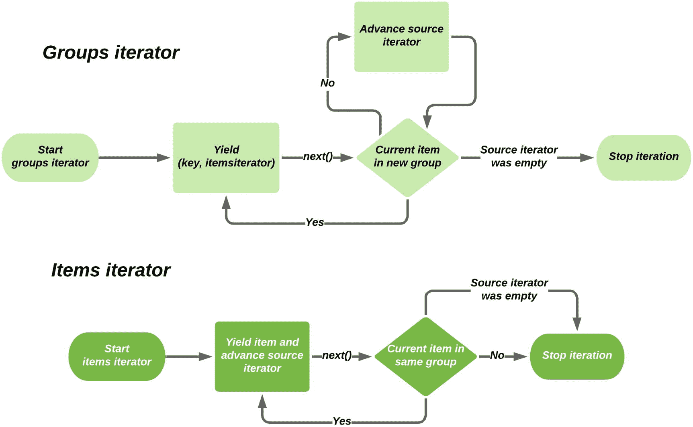
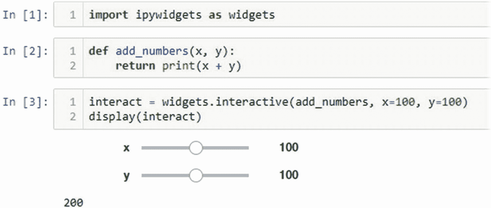

# 九、查看数据

在前一章的结尾，我们开始研究我们可能感兴趣的查询类型，但是我们还没有编写任何例程来帮助我们理解我们正在收集的数据。在这一章中，我们将回到 Jupyter 笔记本，这一次是作为数据分析工具，而不是原型制作工具。

IPython 和 Jupyter 无缝支持同步和异步函数调用。我们在这两种类型的 API 之间有一个(大部分)自由的选择。由于`apd.aggregation`包的其余部分是异步的，我建议我们创建一些实用程序协程来提取和分析数据。

## 查询功能

Jupyter 笔记本可以自由地导入和使用 SQLAlchemy 函数，但这需要用户了解大量关于聚合系统数据结构的内部信息。这实际上意味着我们已经创建的表和模型成为公共 API 的一部分，对它们的任何更改都可能意味着增加主版本号并为最终用户记录更改。

相反，让我们创建一些返回`DataPoint`记录供用户交互的函数。这样，只有`DataPoint`对象和函数签名是我们必须为人们维护的 API 的一部分。随着我们发现额外的需求，我们可以随时添加更多的功能。

首先，我们需要的最重要的特性是找到数据记录的能力，这些数据记录是按照收集时间排序的。这允许用户编写一些分析代码来分析传感器随时间变化的值。我们可能还想通过传感器类型、部署标识符和日期范围对此进行过滤。

我们必须决定函数的形式。它应该返回对象的列表或元组还是迭代器？元组可以让我们轻松地计算检索到的条目数，并多次遍历列表。另一方面，迭代器将允许我们最小化 RAM 的使用，这可能有助于我们支持更大的数据集，但限制我们只能迭代一次数据。我们将创建迭代器函数，因为它们允许更高效的代码。迭代器可以被调用代码转换成元组，所以我们的用户可以选择迭代元组。

在编写这个函数之前，我们需要一种方法让用户建立数据库连接。因为我们的目标之一是对我们的最终用户隐藏数据库的细节，所以我们不想要求为此使用 SQLAlchemy 函数。我们创建的用于连接数据库的定制函数(清单 [9-1](#PC1) )也可以设置上下文变量来表示我们的连接，从而避免了对所有搜索函数的显式会话参数的需求。

```py
import contextlib
from contextvars import ContextVar
import functools
import typing as t

from sqlalchemy import create_engine
from sqlalchemy.orm import sessionmaker
from sqlalchemy.orm.session import Session

db_session_var: ContextVar[Session] = ContextVar("db_session")

@contextlib.contextmanager
def with_database(uri: t.Optional[str] = None) -> t.Iterator[Session]:
    """Given a URI, set up a DB connection, and return a Session as a context manager """
    if uri is None:
        uri = "postgresql+psycopg2://localhost/apd"
    engine = create_engine(uri)
    sm = sessionmaker(engine)
    Session = sm()
    token = db_session_var.set(Session)
    try:
        yield Session
        Session.commit()
    finally:
        db_session_var.reset(token)
        Session.close()

Listing 9-1query.py with a context manager to connect to the database

```

该函数充当(同步)上下文管理器，建立数据库连接和相关会话，在进入相关`with`块的主体之前，返回该会话并将其设置为`db_session_var`上下文变量的值。当上下文管理器退出时，它还会取消设置此会话，提交所有更改，并关闭会话。这确保了数据库中没有延迟锁，数据是持久的，并且使用`db_session_var`变量的函数只能在上下文管理器的主体中使用。

如果我们确保已经安装了聚合包的环境在 Jupyter 中注册为内核，我们就可以开始在笔记本中编写实用函数了。我还建议安装一些助手包，这样我们可以更容易地可视化结果。

```py
> pipenv install ipython matplotlib
> pipenv run ipython kernel install --user --name="apd.aggregation"

```

我们现在可以启动一个新的 Jupyter 笔记本(清单 [9-2](#PC3) ，选择`apd.aggregation`内核并连接到数据库，使用新的`with_database(...)`装饰器。为了测试连接，我们可以使用产生的会话和我们的`datapoint_table`对象手动查询数据库。

```py
from apd.aggregation.query import with_database
from apd.aggregation.database import datapoint_table

with with_database("postgresql+psycopg2://apd@localhost/apd") as session:
    print(session.query(datapoint_table).count())

Listing 9-2Jupyter cell to find number of sensor records

```

我们还需要编写返回`DataPoint`对象供用户分析的函数。最终，我们将不得不处理由于处理大量数据而导致的性能问题，但是您为解决问题而编写的第一个代码不应该被优化，一个简单的实现既更容易理解，也更可能不会因为太聪明而受到影响*。我们将在下一章研究一些优化技术。*

*Premature Optimization

> 调试比一开始写代码要难两倍。因此，如果你尽可能聪明地编写代码，从定义上来说，你没有足够的聪明去调试它。
> 
> -布莱恩·金格

Python 不是最快的编程语言；编写代码来最小化固有的缓慢可能很诱人，但是我强烈建议抵制这种冲动。我见过“高度优化”的代码需要一个小时来执行，而当替换为相同逻辑的简单实现时，只需要两分钟就可以完成。

这并不常见，但是当你使你的代码更加精细时，你的工作就变得更加困难。

如果您编写了一个方法的最简单版本，您可以将其与后续版本进行比较，以确定您是在使代码变得更快还是更复杂。

我们将实现的第一个版本的`get_data()`返回数据库中所有的`DataPoint`对象，而不必担心处理任何 SQLAlchemy 对象。我们已经决定创建一个生成器协程，而不是一个返回`DataPoint`对象列表的函数(或协程)，所以我们最初的实现是清单 [9-3](#PC4) 中的那个。

```py
async def get_data() -> t.AsyncIterator[DataPoint]:
    db_session = db_session_var.get()
    loop = asyncio.get_running_loop()
    query = db_session.query(datapoint_table)
    rows = await loop.run_in_executor(None, query.all)
    for row in rows:
        yield DataPoint.from_sql_result(row)

Listing 9-3Simplest implementation of get_data()

```

该函数从由`with_database(...)`设置的上下文变量中获取会话，构建查询对象，然后使用执行器运行该对象的 all 方法，在 all 方法运行时让位于其他任务。迭代查询对象而不是调用`query.all()`会导致循环运行时触发数据库操作，所以我们必须小心，只在异步代码中设置查询，并将`all()`函数调用委托给执行器。这样做的结果是一个 SQLAlchemy 的轻量级结果列表，名为 rows 变量中的 tuples，然后我们可以对其进行迭代，产生匹配的`DataPoint`对象。

由于`rows`变量包含所有结果对象的列表，我们知道在执行返回到我们的`get_data()`函数之前，所有数据都已经被数据库处理过，并在执行器中被解析为 SQLAlchemy。这意味着在第一个`DataPoint`对象对最终用户可用之前，我们使用了存储完整结果集所需的所有 RAM。当我们不知道我们是否需要所有这些数据时，存储所有这些数据是有点内存和时间效率低下的，但是在迭代器中对数据进行分页的复杂方法将是过早优化的一个例子。不要改变这种天真的方法，直到它成为一个问题。

我们总是不得不处理检索 SQLAlchemy 行对象的内存和时间开销，但是表 [9-1](#Tab1) 中的数字让我们知道通过将它们转换成`DataPoint`类我们给系统增加了多少开销。一百万行将涉及额外的 152 兆字节的 RAM 和额外的 1.5 秒的处理时间。这两者都在现代计算机的能力范围之内，并且适合于不经常执行的任务，所以它们不是当前的问题。

表 9-1

SQLAlchemy 行和我们的 DataPoint 类的 RAM 使用和实例化时间的比较

<colgroup><col class="tcol1 align-left"> <col class="tcol2 align-left"> <col class="tcol3 align-left"></colgroup> 
| 

目标

 | 

尺寸 <sup>[1](#Fn1)</sup>

 | 

时间实例化 <sup>[2](#Fn2)</sup>

 |
| --- | --- | --- |
| SQLAlchemy 结果行 | 80 字节 | 0.4 微秒 |
| 数据点 | 152 字节 | 1.5 微秒 |

**结果可能因 Python 实现和可用处理能力而异*

然而，因为我们正在创建一个迭代器，所以不能保证我们的`DataPoint`对象会立刻驻留在内存中。如果消费代码没有保存对它们的引用，那么在它们被使用后，它们可以立即被垃圾回收。例如，在清单 [9-4](#PC6) 中，我们使用两个新的助手函数来计算行数，而没有任何数据点对象驻留在内存中。

```py
from apd.aggregation.query import with_database, get_data

with with_database("postgresql+psycopg2://apd@localhost/apd") as session:
    count = 0
    async for datapoint in get_data():
        count += 1
    print(count)

Listing 9-4Jupyter cell to count data points using our helper context manager

```

仅仅计算数据点并不是分析数据的有趣方式。我们可以开始尝试通过在散点图上绘制数值来理解这些数据。让我们从一个简单的健全性检查开始，绘制出`RelativeHumidity`传感器的值与日期的关系(列表 [9-5](#PC7) )。这是一个很好的开始，因为存储的数据是浮点数而不是基于字典的结构，所以我们不需要解析值。

matplotlib 库可能是 Python 中最流行的绘图库。它的`plot_date(...)`函数非常适合绘制一系列随时间变化的数值。它需要 x 轴的值列表和 y 轴的相应值列表，以及在绘制点 <sup>[3](#Fn3)</sup> 时使用的样式和一个标志来设置哪个轴包含日期值。我们的`get_data(...)`函数不直接返回我们需要的 x 和 y 参数，它返回数据点对象的异步迭代器。

我们可以使用 list comprehension 将数据点对象的异步 iterable 转换为包含来自单个传感器的日期和值对的元组列表。此时，我们有了一个日期和值对的列表，可以使用内置的`zip(...)` <sup>[4](#Fn4)</sup> 函数将分组转换为一对列表，一个用于日期，另一个用于值。

```py
from apd.aggregation.query import with_database, get_data

from matplotlib import pyplot as plt

async def plot():
    points = [
        (dp.collected_at, dp.data)
        async for dp in get_data()
        if dp.sensor_name=="RelativeHumidity"
    ]
    x, y = zip(*points)
    plt.plot_date(x, y, "o", xdate=True)

with with_database("postgresql+psycopg2://apd@localhost/apd") as session:
    await plot()
plt.show()

Listing 9-5Relative humidity plotting jupyter cell, with the output chart it generates

```


### 过滤数据

最好在查询阶段过滤数据，而不是在迭代时丢弃所有不符合我们标准的传感器数据。现在，选择每一条数据，创建一个结果对象，然后是一个`DataPoint`对象，只有这样才跳过不相关的条目。为此，我们可以向`get_data(...)`方法添加一个额外的参数，该参数决定是否将`sensor_data`上的过滤器应用于生成的查询。

```py
async def get_data(sensor_name: t.Optional[str] = None) -> t.AsyncIterator[DataPoint]:
    db_session = db_session_var.get()
    loop = asyncio.get_running_loop()
    query = db_session.query(datapoint_table)
    if sensor_name:
        query = query.filter(datapoint_table.c.sensor_name == sensor_name)
    query = query.order_by(datapoint_table.c.collected_at)

```

这种方法节省了大量开销，因为这意味着只有相关的传感器数据点被传递给最终用户，而且这是一个更自然的接口。用户希望能够指定他们想要的数据，而不是绝对获取所有数据并手动过滤。清单 [9-6](#PC9) 中的函数版本用不到一秒的时间来执行我的样本数据集(相比之下，前一版本用了 3 秒多)，但显示的是相同的图表。

```py
from apd.aggregation.query import with_database, get_data

from matplotlib import pyplot as plt

async def plot():
    points = [(dp.collected_at, dp.data) async for dp in get_data(sensor_name="RelativeHumidity")]
    x, y = zip(*points)
    plt.plot_date(x, y, "o", xdate=True)

with with_database("postgresql+psycopg2://apd@localhost/apd") as session:
    await plot()
plt.show()

Listing 9-6Delegating filtering to the get_data function

```

这个绘图函数很短，不太复杂；它代表了从数据库加载数据的一个非常自然的接口。不利的一面是，将多个部署混合在一起会导致图表不清晰，因为给定时间有多个数据点。Matplotlib 支持用不同的逻辑结果集多次调用`plot_date(...)`，然后用不同的颜色显示。我们的用户可以通过在迭代`get_data(...)`调用的结果时创建多个点列表来实现这一点，如清单 [9-7](#PC10) 所示。

```py
import collections

from apd.aggregation.query import with_database, get_data

from matplotlib import pyplot as plt

async def plot():
    legends = collections.defaultdict(list)
    async for dp in get_data(sensor_name="RelativeHumidity"):
        legends[dp.deployment_id].append((dp.collected_at, dp.data))

    for deployment_id, points in legends.items():
        x, y = zip(*points)
        plt.plot_date(x, y, "o", xdate=True)

with with_database("postgresql+psycopg2://apd@localhost/apd") as session:
    await plot()
plt.show()

Listing 9-7Plotting all sensor deployments independently

```


这又使得界面不自然；对于最终用户来说，更合理的做法是迭代部署，然后迭代传感器数据值，而不是迭代所有数据点，然后手动将它们组织到列表中。另一种方法是创建一个列出所有部署 id 的新函数，然后允许`get_data(...)`通过`deployment_id`进行过滤。这将允许我们遍历单个部署，并进行新的`get_data(...)`调用以仅获取该部署的数据。清单 [9-8](#PC11) 展示了这一点。

```py
async def get_deployment_ids():
    db_session = db_session_var.get()
    loop = asyncio.get_running_loop()
    query = db_session.query(datapoint_table.c.deployment_id).distinct()
    return [row.deployment_id for row in await loop.run_in_executor(None, query.all)]

async def get_data(
    sensor_name: t.Optional[str] = None,
    deployment_id: t.Optional[UUID] = None,
) -> t.AsyncIterator[DataPoint]:
    db_session = db_session_var.get()
    loop = asyncio.get_running_loop()
    query = db_session.query(datapoint_table)
    if sensor_name:
        query = query.filter(datapoint_table.c.sensor_name == sensor_name)
    if deployment_id:
        query = query.filter(datapoint_table.c.deployment_id == deployment_id)
    query = query.order_by(
        datapoint_table.c.collected_at,
    )

Listing 9-8Extended data collection functions for deployment_id filtering

```

这个新函数可用于循环多个对`get_data(...)`的调用，而不是 plot 函数循环并将结果数据点分类到独立的列表中。清单 [9-9](#PC12) 展示了一个非常自然的接口，用于循环单个传感器的所有部署，其行为与之前的版本相同。

```py
import collections

from apd.aggregation.query import with_database, get_data, get_deployment_ids

from matplotlib import pyplot as plt

async def plot(deployment_id):
    points = []
    async for dp in get_data(sensor_name="RelativeHumidity", deployment_id=deployment_id):
        points.append((dp.collected_at, dp.data))

    x, y = zip(*points)
    plt.plot_date(x, y, "o", xdate=True)

with with_database("postgresql+psycopg2://apd@localhost/apd") as session:
    deployment_ids = await get_deployment_ids()
    for deployment in deployment_ids:
        await plot(deployment)
plt.show()

Listing 9-9Plotting all deploymens using the new helper functions

```

这种方法允许最终用户单独询问每个部署，因此一次只有传感器和部署组合的相关数据被载入 RAM。这是一个非常适合提供给最终用户的 API。

### 多级迭代器

我们之前修改了按传感器名称过滤的界面，以在数据库中进行过滤，从而避免重复不必要的数据。我们新的部署 id 过滤器不是用来排除我们不需要的数据，而是用来使独立遍历每个逻辑组变得更容易。我们不需要在这里使用过滤器，我们正在使用一个使界面更加自然。

如果您经常使用标准库中的`itertools`模块，您可能已经使用过`groupby(...)`函数。它接受一个迭代器和一个键函数，并返回一个迭代器的迭代器，第一个迭代器是键函数的值，第二个迭代器是与键函数的给定结果匹配的一系列值。这就是我们一直试图通过列出我们的部署，然后过滤数据库查询来解决的问题。

给`groupby(...)`的关键函数通常是一个简单的 lambda 表达式，但它可以是任何函数，比如来自操作符模块的函数之一。比如`operator.attrgetter("deployment_id")`相当于`lambda obj: obj.deployment_id`，`operator.itemgetter(2)`相当于`lambda obj: obj[2].`

对于这个例子，我们将定义一个键函数，它返回一个模为 3 的整数的值，以及一个`data()`生成器函数，它产生一系列固定的数字，并在这个过程中打印它的状态。这让我们可以清楚地看到底层迭代器是何时高级的。

```py
import itertools
import typing as t

def mod3(n: int) -> int:
    return n % 3

def data() -> t.Iterable[int]:
    for number in [0, 1, 4, 7, 2, 6, 9]:
        print(f"Yielding {number}")
        yield number

```

我们可以遍历 data()生成器的内容并打印 mod3 函数的值，这让我们看到第一组有一个项目，然后是一组三个项目，然后是一组一个项目，然后是一组两个项目。

```py
>>> print([mod3(number) for number in data()])
data() is starting
Yielding 0
Yielding 1
Yielding 4
Yielding 7
Yielding 2
Yielding 6
Yielding 9
data() is complete
[0, 1, 1, 1, 2, 0, 0]

```

设置 groupby 不会消耗基础 iterable 当 groupby 被迭代时，它生成的每个项目都被处理。为了正确工作，groupby 只需要确定当前项是否与前一个项在同一个组中，或者是否有新的组开始，它不需要将 iterable 作为一个整体来分析。对于 key 函数来说，具有相同值的项只有在它们是输入迭代器中的连续块时才会被分组在一起，所以通常要确保底层迭代器是有序的，以避免分组。

通过用`mod3(...)` key 函数在我们的数据上创建一个 groupby，我们可以创建一个两级循环，首先迭代 key 函数的值，然后迭代产生那个键值的来自`data()`的值。

```py
>>> for val, group in itertools.groupby(data(), mod3):
...     print(f"Starting new group where mod3(x)=={val}")
...     for number in group:
...         print(f"x=={number} mod3(x)=={mod3(val)}")
...     print(f"Group with mod3(x)=={val} is complete")
...
data() is starting
Yielding 0
Starting new group where mod3(x)==0
x==0 mod3(x)==0
Yielding 1
Group with mod3(x)==0 is complete
Starting new group where mod3(x)==1
x==1 mod3(x)==1
Yielding 4
x==4 mod3(x)==1
Yielding 7
x==7 mod3(x)==1
Yielding 2
Group with mod3(x)==1 is complete
Starting new group where mod3(x)==2
x==2 mod3(x)==2
Yielding 6
Group with mod3(x)==2 is complete
Starting new group where mod3(x)==0
x==6 mod3(x)==0
Yielding 9
x==9 mod3(x)==0
data() is complete
Group with mod3(x)==0 is complete

```

从 print 语句的输出中，我们可以看到 groupby 一次只提取一项，但是它管理迭代器的方式使得对值的循环很自然。每当内部循环请求一个新项时，groupby 函数都会从底层迭代器请求一个新项，然后根据该值决定其行为。如果 key 函数报告与前一项相同的值，它会向内部循环产生新值；否则，它表示内部循环完成，并保持该值，直到下一个内部循环开始。

如果我们有具体的条目列表，迭代器的行为就像我们预期的一样；如果不需要，就不需要迭代内部循环。如果我们在推进外循环之前没有完全迭代内循环，groupby 对象将透明地推进源 iterable，就像我们已经做的那样。在下面的例子中，我们跳过了三个 where `mod3(...)==1`的组，我们可以看到底层迭代器被 groupby 对象推进了三次:

```py
>>> for val, group in itertools.groupby(data(), mod3):
...     print(f"Starting new group where mod3(x)=={val}")
...     if val == 1:
...         # Skip the ones
...         print("Skipping group")
...         continue
...     for number in group:
...         print(f"x=={number} mod3(x)=={mod3(val)}")
...     print(f"Group with mod3(x)=={val} is complete")
...
data() is starting
Yielding 0
Starting new group where mod3(x)==0
x==0 mod3(x)==0
Yielding 1
Group with mod3(x)==0 is complete
Starting new group where mod3(x)==1
Skipping group
Yielding 4
Yielding 7
Yielding 2
Starting new group where mod3(x)==2
x==2 mod3(x)==2
Yielding 6
Group with mod3(x)==2 is complete
Starting new group where mod3(x)==0
x==6 mod3(x)==0
Yielding 9
x==9 mod3(x)==0
data() is complete
Group with mod3(x)==0 is complete

```

当我们使用它时，行为是直观的，但是很难理解它是如何实现的。图 [9-1](#Fig1) 显示了一对流程图，一个用于外部循环，一个用于每个单独的内部循环。



图 9-1

演示 groupby 如何工作的流程图

如果我们有一个标准迭代器(与异步迭代器相反)，我们可以通过`deployment_id`对数据进行排序，并使用`itertools.groupby(...)`来简化我们的代码以处理多个部署，而不需要查询单个部署。我们可以遍历这些组，并使用列表理解和`zip(...)`，以我们已经使用的相同方式处理内部迭代器，而不是对每个组进行新的`get_data(...)`调用。

不幸的是，在撰写本文时，groupby 还没有完全异步的对等物。虽然我们可以编写一个函数来返回一个异步迭代器，它的值是数据点对的 UUID 和异步迭代器，但是没有办法将它们自动分组。

冒着编写聪明代码的风险，我们可以使用闭包编写一个自己处理异步代码的 groupby 实现。它将向最终用户公开多个迭代器，这些迭代器在同一个底层迭代器上工作，就像`itertools.groupby(...)`一样。如果有可用的库函数，最好使用库函数。

每当我们发现 key 函数的一个新值时，我们需要返回一个新的生成器函数，它维护了对底层源迭代器的引用。这样，当有人推进一个项迭代器时，它可以选择要么产生它接收的数据点，要么指示它是项迭代器的结尾，就像 groupby 函数所做的那样。同样，如果我们在一个 item 迭代器被消耗之前推进外部迭代器，它需要“快进”通过底层迭代器，直到找到一个新组的开始。

清单 [9-10](#PC17) 中的代码是一个单独的函数，它委托给我们的 get data 函数，并将其包装在适当的 groupby 逻辑中，而不是一个可以适应任何迭代器的通用函数。

```py
async def get_data_by_deployment(
    *args, **kwargs
) -> t.AsyncIterator[t.Tuple[UUID, t.AsyncIterator[DataPoint]]]:
    """Return an Async Iterator that contains two-item pairs.
    These pairs are a string (deployment_id), and an async iterator that contains
    the datapoints with that deployment_id.

    Usage example:

        async for deployment_id, datapoints in get_data_by_deployment():
            print(deployment_id)
            async for datapoint in datapoints:
                print(datapoint)
            print()
    """
    # Get the data, using the arguments to this function as filters
    data = get_data(*args, **kwargs)

    # The two levels of iterator share the item variable, initialise it # with the first item from the iterator. Also set last_deployment_id
    # to None, so the outer iterator knows to start a new group.
    last_deployment_id: t.Optional[UUID] = None
    try:
        item = await data.__anext__()
    except StopAsyncIteration:
        # There were no items in the underlying query, return immediately
        return

    async def subiterator(group_id: UUID) -> t.AsyncIterator[DataPoint]:
        """Using a closure, create an iterator that yields the current
        item, then yields all items from data while the deployment_id matches
        group_id, leaving the first that doesn't match as item in the enclosing
        scope."""
        # item is from the enclosing scope
        nonlocal item
        while item.deployment_id == group_id:
            # yield items from data while they match the group_id this iterator represents
            yield item
            try:
                # Advance the underlying iterator
                item = await data.__anext__()
            except StopAsyncIteration:
                # The underlying iterator came to an end, so end the subiterator too
                return

    while True:
        while item.deployment_id == last_deployment_id:
            # We are trying to advance the outer iterator while the
            # underlying iterator is still part-way through a group.# Speed through the underlying until we hit an item where
            # the deployment_id is different to the last one (or,
            # is not None, in the case of the start of the iterator)
            try:
                item = await data.__anext__()
            except StopAsyncIteration:
                # We hit the end of the underlying iterator: end this # iterator too
                return
        last_deployment_id = item.deployment_id
        # Instantiate a subiterator for this group
        yield last_deployment_id, subiterator(last_deployment_id)

Listing 9-10An implementation of get_data_by_deployment that acts like an asynchronous groupby

```

这使用`await` `data.__anext__()`来推进底层数据迭代器，而不是异步 for 循环，以使迭代器在多个地方被使用的事实更加明显。

这个生成器协程的实现在本章的代码中。我鼓励您尝试添加打印语句和断点，以帮助理解控制流。这段代码比您需要编写的大多数 Python 代码都要复杂(我要提醒您不要将这种复杂程度引入到生产代码中；把它作为一个自包含的依赖项更好)，但是如果你能理解它是如何工作的，你就能彻底掌握生成器函数、异步迭代器和闭包的细节。随着异步代码在生产代码中的使用越来越多，提供这种迭代器复杂操作的库肯定会出现。

### 附加过滤器

我们为`sensor_name`和`deployment_id`添加了`get_data(...)`过滤器，但是选择显示的时间范围也很有用。我们可以用两个日期时间过滤器来实现这一点，这两个过滤器用于过滤`collected_at`字段。清单 [9-11](#PC18) 中显示了支持此功能的`get_data(...)`的实现，但是因为`get_data_by_deployment(...)`将所有参数原封不动地传递给`get_data(...)`，所以我们不需要修改该函数来允许我们的分析中的日期窗口。

```py
async def get_data(
    sensor_name: t.Optional[str] = None,
    deployment_id: t.Optional[UUID] = None,
    collected_before: t.Optional[datetime.datetime] = None,
    collected_after: t.Optional[datetime.datetime] = None,
) -> t.AsyncIterator[DataPoint]:
    db_session = db_session_var.get()
    loop = asyncio.get_running_loop()
    query = db_session.query(datapoint_table)
    if sensor_name:
        query = query.filter(datapoint_table.c.sensor_name == sensor_name)
    if deployment_id:
        query = query.filter(datapoint_table.c.deployment_id == deployment_id)
    if collected_before:
        query = query.filter(datapoint_table.c.collected_at < collected_before)
    if collected_after:
        query = query.filter(datapoint_table.c.collected_at > collected_after)
    query = query.order_by(
        datapoint_table.c.deployment_id,
        datapoint_table.c.sensor_name,
        datapoint_table.c.collected_at,
    )

    rows = await loop.run_in_executor(None, query.all)
    for row in rows:
        yield DataPoint.from_sql_result(row)

Listing 9-11get_data method with sensor, deployment, and date filters

```

### 测试我们的查询功能

查询功能需要测试，就像其他任何功能一样。与我们到目前为止编写的大多数函数不同，查询函数带有大量可选参数，这些参数会显著改变返回数据的输出。虽然我们不需要为每个过滤器测试大范围的值(我们可以相信我们的数据库的查询支持工作正常)，但我们需要测试每个选项是否按预期工作。

我们需要一些安装夹具来测试依赖于数据库的功能。虽然我们可以模拟数据库连接，但我不推荐这样做，因为数据库是非常复杂的软件，不太适合被模拟。

测试数据库应用最常见的方法是创建一个新的空数据库，并允许测试控制表和数据的创建。一些数据库软件，比如 SQLite，允许动态创建新的数据库，但是大多数都需要预先建立数据库。

假设我们有一个空的数据库，我们需要一个连接它的夹具，一个设置表的夹具，一个设置数据的夹具。连接夹具与`with_database`上下文管理器、 <sup>[5](#Fn5)</sup> 非常相似，填充数据库的函数将包括我们可以使用`db_session.execute(datapoint_table.insert().values(...))`插入的样本数据。

建立数据库表的设备是最困难的。最简单的方法是使用`metadata.create_all(...)`，就像我们在引入数据库迁移的 alembic 之前所做的那样。这适用于大多数应用，因此通常是最佳选择。我们的应用包括一个数据库视图，它不是由 SQLAlchemy 管理的，而是由 Alembic 中的一个定制迁移管理的。因此，我们需要使用 Alembic 的升级功能来设置我们的数据库表。我们需要的相关夹具如清单 [9-12](#PC19) 所示。

```py
import datetime
from uuid import UUID

from apd.aggregation.database import datapoint_table

from alembic.config import Config
from alembic.script import ScriptDirectory
from alembic.runtime.environment import EnvironmentContext
import pytest

@pytest.fixture
def db_uri():
    return "postgresql+psycopg2://apd@localhost/apd-test"

@pytest.fixture
def db_session(db_uri):
    from sqlalchemy import create_engine
    from sqlalchemy.orm import sessionmaker

    engine = create_engine(db_uri, echo=True)
    sm = sessionmaker(engine)
    Session = sm()
    yield Session
    Session.close()

@pytest.fixture
def migrated_db(db_uri, db_session):
    config = Config()
    config.set_main_option("script_location", "apd.aggregation:alembic")
    config.set_main_option("sqlalchemy.url", db_uri)
    script = ScriptDirectory.from_config(config)

    def upgrade(rev, context):
        return script._upgrade_revs(script.get_current_head(), rev)

    def downgrade(rev, context):
        return script._downgrade_revs(None, rev)

    with EnvironmentContext(config, script, fn=upgrade):
        script.run_env()

    try:
        yield
    finally:
        # Clear any pending work from the db_session connection
        db_session.rollback()

        with EnvironmentContext(config, script, fn=downgrade):
            script.run_env()

@pytest.fixture
def populated_db(migrated_db, db_session):
    datas = [
        {
            "id": 1,
            "sensor_name": "Test",
            "data": "1",
            "collected_at": datetime.datetime(2020, 4, 1, 12, 0, 1),
            "deployment_id": UUID("b4c68905-b1e4-4875-940e-69e5d27730fd"),
        },
        # Additional sample data omitted from listing for brevity's sake
    ]
    for data in datas:
        insert = datapoint_table.insert().values(**data)
        db_session.execute(insert)

Listing 9-12Database setup fixtures

```

这为我们提供了一个环境，我们可以在其中编写测试来查询只包含已知值的数据库，因此我们可以编写有意义的断言。

#### 参数化测试

Pytest 有一个特殊的功能，可以生成做一些非常相似的事情的多个测试:标记`parameterize`。如果一个测试函数被标记为参数化的，那么它可以有不对应于 fixtures 的附加参数，以及这些参数的一系列值。测试函数将运行多次，每个不同的参数值函数运行一次。我们可以使用这个特性编写函数来测试我们函数的各种过滤方法，而不需要大量的重复，如清单 [9-13](#PC20) 所示。

```py
class TestGetData:
    @pytest.fixture
    def mut(self):
        return get_data

    @pytest.mark.asyncio
    @pytest.mark.parametrize(
        "filter,num_items_expected",
        [
        ({}, 9),
        ({"sensor_name": "Test"}, 7),
        ({"deployment_id": UUID("b4c68905-b1e4-4875-940e-69e5d27730fd")}, 5),
        ({"collected_after": datetime.datetime(2020, 4, 1, 12, 2, 1),}, 3),
        ({"collected_before": datetime.datetime(2020, 4, 1, 12, 2, 1),}, 4),
        (
            {
                "collected_after": datetime.datetime(2020, 4, 1, 12, 2, 1),
                "collected_before": datetime.datetime(2020, 4, 1, 12, 3, 5),
            },
            2,
        ),
        ],
    )
    async def test_iterate_over_items(
        self, mut, db_session, populated_db, filter, num_items_expected
    ):
        db_session_var.set(db_session)
        points = [dp async for dp in mut(**filter)]
        assert len(points) == num_items_expected

Listing 9-13A parameterized get_data test to verify different filters

```

第一次运行这个测试时，它将`filter={}, num_items_expected=9`作为参数。第二次运行有`filter={"sensor_name": "Test"}, num_items_expected=7`，以此类推。这些测试功能中的每一个都将独立运行，并将被视为新的通过或未通过测试，视情况而定。

这将导致生成六个测试，名称类似于`TestGetData.test_iterate_over_items[filter5-2]`。这个名称是基于参数的，复杂的参数值(如`filter`)由它们的名称和列表中从零开始的索引来表示，简单的参数(如`num_items_expected`)直接包含在内。大多数情况下，您不需要关心名称，但是识别测试失败的变体是非常有用的。

## 显示多个传感器

我们现在有三个函数可以帮助我们连接到数据库，并以合理的顺序和可选的过滤迭代`DataPoint`对象。到目前为止，我们一直在使用`matplotlib.pyplot.plot_dates(...)`函数将成对的传感器值和日期转换成一个图表。这是一个辅助函数，通过在全局名称空间中提供各种绘图函数，使生成绘图变得更加容易。在制作多个图表时，这不是推荐的方法。

我们希望能够遍历我们的每种传感器类型，并为每种类型生成一个图表。如果我们要使用 pyplot API，我们将被限制使用一个单独的绘图，最高的值使轴倾斜，使得最低的值无法读取。相反，我们希望为每一个生成一个独立的图，并将它们并排显示。为此，我们可以使用`matplotlib.pyplot.figure(...)`和`figure.add_subplot(...)`函数。子情节是一个对象，其行为大体上类似于`matplotlib.pyplot`，但是代表了一个更大的情节网格中的一个单独的情节。例如，`figure.add_subplot(3,2,4)`是三行两列网格图中的第四个图。

现在，我们的`plot(...)`函数假设它正在处理的数据是一个数字，可以直接传递给 matplotlib 以显示在我们的图表上。不过，我们的许多传感器都有不同的数据格式，例如温度传感器，它有一个温度字典，单位被用作它的值属性。这些不同的值需要先转换成数字，然后才能绘制出来。

我们可以在`apd.aggregation`中将我们的绘图函数重构为一个实用函数，以极大地简化我们的 Jupyter 笔记本，但我们需要确保它可以用于其他格式的传感器数据。每个图都需要为要绘制的传感器提供一些配置、绘制图的子图对象，以及从部署 id 到用于填充图的图例的面向用户的名称的映射。它还应该接受与`get_data(...)`相同的过滤参数，允许用户通过日期或部署 id 来约束他们的图表。

我们将把这个配置数据作为一个数据类的实例传递，它还包含一个对“clean”函数的引用。这个 clean 函数负责将 DataPoint 实例转换成一对可以由 matplotlib 绘制的值。clean 函数必须将`DataPoint`对象的 iterable 转换为 matplotlib 可以理解的`(x, y)`对的 iterable。对于`RelativeHumidity`和`RAMAvailable`传感器，这是一个产生日期/浮点元组的简单问题，就像我们的代码到目前为止所做的那样。

```py
async def clean_passthrough(
    datapoints: t.AsyncIterator[DataPoint],
) -> t.AsyncIterator[t.Tuple[datetime.datetime, float]]:
    async for datapoint in datapoints:
        if datapoint.data is None:
            continue
        else:
            yield datapoint.collected_at, datapoint.data

```

config 数据类还需要一些字符串参数，例如图表的标题、轴标签和 sensor_name，这些参数需要传递给`get_data(...)`，以便找到该图表所需的数据。一旦定义了`Config`类，我们就可以创建两个 config 对象来表示两个传感器，这两个传感器使用原始浮点数作为它们的值类型，并创建一个函数来返回所有注册的配置。

将 matplotlib 中的图形函数与我们新的配置系统结合起来，我们可以编写一个新的`plot_sensor(...)`函数(清单 [9-14](#PC22) ),它可以使用 Jupyter 笔记本中的几行简单代码生成任意数量的图表。

```py
@dataclasses.dataclass(frozen=True)
class Config:
    title: str
    sensor_name: str
    clean: t.Callable[[t.AsyncIterator[DataPoint]], t.AsyncIterator[t.Tuple[datetime.datetime, float]]]
    ylabel: str

configs = (
    Config(
        sensor_name="RAMAvailable",
        clean=clean_passthrough,
        title="RAM available",
        ylabel="Bytes",
    ),
    Config(
        sensor_name="RelativeHumidity",
        clean=clean_passthrough,
        title="Relative humidity",
        ylabel="Percent",
    ),
)

def get_known_configs() -> t.Dict[str, Config]:
    return {config.title: config for config in configs}

async def plot_sensor(config: Config, plot: t.Any, location_names: t.Dict[UUID,str], **kwargs) -> t.Any:
    locations = []
    async for deployment, query_results in get_data_by_deployment(sensor_name=config.sensor_name, **kwargs):
        points = [dp async for dp in config['clean'](query_results)]
        if not points:
            continue
        locations.append(deployment)
        x, y = zip(*points)
        plot.set_title(config['title'])
        plot.set_ylabel(config['ylabel'])
        plot.plot_date(x, y, "-", xdate=True)
    plot.legend([location_names.get(l, l) for l in locations])
    return plot

Listing 9-14New config objects and plot function that uses it

```

有了这些新函数，我们可以修改 Jupyter 笔记本单元格来调用`plot_sensor(...)`函数，而不是在 Jupyter 中编写我们自己的绘图函数。由于这些助手函数，apd.aggregation 的最终用户需要编写的连接到数据库并呈现两个图表的代码(如清单 [9-15](#PC268) 所示)大大缩短了。

```py
import asyncio
from matplotlib import pyplot as plt

from apd.aggregation.query import with_database

from apd.aggregation.analysis import get_known_configs, plot_sensor
with with_database("postgresql+psycopg2://apd@localhost/apd") as session:

    coros = []
    figure = plt.figure(figsize = (20, 5), dpi=300)
    configs = get_known_configs()
    to_display = configs["Relative humidity"], configs["RAM available"]
    for i, config in enumerate(to_display, start=1):
        plot = figure.add_subplot(1, 2, i)
        coros.append(plot_sensor(config, plot, {}))
    await asyncio.gather(*coros)

display(figure)

Listing 9-15Jupyter cell to plot both Humidity and RAM Available, and their output

```


由于`Temperature`和`SolarCumulativeOutput`传感器以`{'unit': 'degC', 'magnitude': 8.4}`的格式从`pint`包中返回序列化的对象，我们不能将这些与我们现有的`clean_passthrough()`函数一起使用；我们需要创造一个新的。最简单的是假设单位总是相同的，只提取量级线。这将会不正确地用不同的标度绘制任何温度，因为单位没有被校正。目前，我们所有的传感器都返回以摄氏度为单位的值，所以这不是一个严重的问题。

```py
async def clean_magnitude(datapoints):
    async for datapoint in datapoints:
        if datapoint.data is None:
            continue
        yield datapoint.collected_at, datapoint.data["magnitude"]

```

如果我们使用这个新的 cleaner 函数来添加一个新的温度配置对象，我们会看到图 [9-2](#Fig2) 中的图表。从这些数据中我们可以清楚地看到，温度传感器并不完全可靠:我办公室的温度很少超过钢的熔点。


图 9-2

温度传感器输出有明显的误差，扭曲了数据

## 处理数据

我们采用的方法的一个优点是，我们可以对给定的数据执行相对任意的转换，从而允许我们丢弃我们认为不正确的数据点。在分析时丢弃数据通常比在收集时丢弃数据更好，因为检查数据点有效性的函数中的错误不会导致数据丢失，如果只是在分析时检查的话。我们总是可以在事后删除不正确的数据，但我们永远无法回忆起我们选择忽略的数据。

解决温度传感器问题的一种方法是让 clean 迭代器查看底层数据的移动窗口，而不是一次只查看一个`DataPoint`。这样，它可以使用传感器值的邻居来丢弃差异太大的值。

`collections.deque`类型对此很有用，因为它提供了一个具有可选最大大小的结构，所以我们可以将找到的每个温度添加到 deque 中，但是当读取它时，我们只能看到最后添加的`n`条目。deque 可以从左边缘或右边缘添加或移除项目，因此在将其用作受限窗口时，从同一端添加和弹出项目的一致性非常重要。

我们可以从过滤掉 DHT22 传感器、<sup>[【6】](#Fn6)</sup>支持范围之外的任何值开始，以去除最不正确的数据。这消除了许多(但不是全部)不正确的读数。过滤出单项峰值的一个简单方法是有一个三项窗口，产生中间项，除非它与两边的平均温度相差太大，如清单 [9-16](#PC24) 所示。我们不想消除所有合理的波动，所以我们对“没有太大差异”的定义必须考虑到，诸如 21c、22c、21c 的读数运行是合理的，同时排除诸如 20c、60c、23c 的运行。

```py
async def clean_temperature_fluctuations(
    datapoints: t.AsyncIterator[DataPoint],
) -> t.AsyncIterator[t.Tuple[datetime.datetime, float]]:
    allowed_jitter = 2.5
    allowed_range = (-40, 80)
    window_datapoints: t.Deque[DataPoint] = collections.deque(maxlen=3)

    def datapoint_ok(datapoint: DataPoint) -> bool:
        """Return False if this data point does not contain a valid temperature"""
        if datapoint.data is None:
            return False
        elif datapoint.data["unit"] != "degC":
            # This point is in a different temperature system. While it # could be converted
            # this cleaner is not yet doing that.
            return False
        elif not allowed_range[0] < datapoint.data["magnitude"] < allowed_range[1]:
            return False
        return True

    async for datapoint in datapoints:
        if not datapoint_ok(datapoint):
            # If the datapoint is invalid then skip directly to the next item
            continue

        window_datapoints.append(datapoint)
        if len(three_temperatures) == 3:
            # Find the temperatures of the datapoints in the window, then # average

            # the first and last and compare that to the middle point.
            window_temperatures = [dp.data["magnitude"] for dp in window_datapoints]
            avg_first_last = (window_temperatures[0] + window_temperatures[2]) / 2
            diff_middle_avg = abs(window_temperatures[1] - avg_first_last)
            if diff_middle_avg > allowed_jitter:
                pass
            else:
                yield window_datapoints[1].collected_at, window_temperatures[1]
        else:
            # The first two items in the iterator can't be compared to both # neighbors
            # so they should be yielded
            yield datapoint.collected_at, datapoint.data["magnitude"]
    # When the iterator ends the final item is not yet in the middle
    # of the window, so the last item must be explicitly yielded
    if datapoint_ok(datapoint):
        yield datapoint.collected_at, datapoint.data["magnitude"]

Listing 9-16An example implementation of a cleaner function for temperature

```

如图 [9-3](#Fig3) 所示，这种清洁功能可以产生更加平滑的温度趋势。清洗器过滤掉任何找不到温度的数据点以及任何严重的错误。它保留了温度趋势的细节；由于该窗口包含最后三个记录的数据点(甚至那些没有从数据集中排除的数据点)，只要温度的突然变化持续至少两个连续读数，它就会开始反映在输出数据中。


图 9-3

使用适当的清洁剂时，相同数据的结果

Exercise 9-1: Add a Cleaner For Solarcumulativeoutput

`SolarCumulativeOutput`传感器返回瓦特小时数，其序列化方式与温度传感器相同。如果我们绘制这个图表，我们会看到一条不规则移动的上升趋势线。更有用的是看到某一时刻的发电量，而不是该时刻之前的总发电量。

为了实现这一点，我们需要将瓦特小时转换为瓦特，这意味着将瓦特小时数除以数据点之间的时间量。

编写一个`clean_watthours_to_watts(...)`迭代器协程，跟踪最后的时间和瓦特小时读数，找出差异，然后返回瓦特除以经过的时间。

例如，以下两个日期和值对将在下午 1 点产生一个值为 5.0 的输出条目。

```py
[
    (datetime.datetime(2020, 4, 1, 12, 0, 0), {"magnitude": 1.0, "unit": "watt_hour"}),
    (datetime.datetime(2020, 4, 1, 13, 0, 0), {"magnitude": 6.0, "unit": "watt_hour"})
]

```

本章附带的代码包含本练习的一个工作环境，包括一个测试设置和一系列针对该功能的单元测试，但没有实现。本章的最终代码中还有一个 cleaner 的实现。

有了这些用于太阳能和温度的清洁器和配置条目，我们可以绘制一个 2x2 的图表网格。由于图表现在显示了所需的数据，现在是通过添加部署名称的值来提高可读性的好时机，这些值作为最终参数传递给清单 [9-17](#PC26) 中的`plot_sensor(...)`。

```py
import asyncio
from uuid import UUID

from matplotlib import pyplot as plt

from apd.aggregation.query import with_database
from apd.aggregation.analysis import get_known_configs, plot_sensor

location_names = {
 UUID('53998a51-60de-48ae-b71a-5c37cd1455f2'): "Loft",
 UUID('1bc63cda-e223-48bc-93c2-c1f651779d69'): "Living Room",
 UUID('ea0683de-6772-4678-bfe7-6014f54ffc8e'): "Office",
 UUID('5aaa901a-7564-41fb-8eba-50cdd6fe9f80'): "Outside",
}

with with_database("postgresql+psycopg2://apd@localhost/apd") as session:
    coros = []
    figure = plt.figure(figsize = (20, 10), dpi=300)
    configs = get_known_configs().values()
    for i, config in enumerate(configs, start=1):
        plot = figure.add_subplot(2, 2, i)
        coros.append(plot_sensor(config, plot, location_names))
    await asyncio.gather(*coros)

display(figure)

Listing 9-17Final Jupyter cell to display 2x2 grid of charts

```


## 与 Jupyter 小工具的交互性

到目前为止，我们生成图表的代码对最终用户没有交互性。我们目前显示所有记录的数据点，但是如果能够过滤，只显示一个时间段，而不需要修改代码来生成图表，将会非常方便。

为此，我们使用`setup.cfg`的`extras_require`功能在`ipywidgets`上添加一个可选的依赖项，并使用`pipenv install -e .[jupyter]`在我们的环境中重新安装`apd.aggregation`包。

您可能还需要运行以下命令，以确保系统范围的 Jupyter 安装启用了对小部件的支持功能:

```py
> pip install --user widgetsnbextension
> jupyter nbextension enable --py widgetsnbextension

```

安装了这个之后，我们可以请求 Jupyter 为每个参数创建交互式小部件，并使用用户选择的值调用函数。交互性允许查看笔记本的人选择任意输入值，而不需要修改单元格的代码，甚至不需要理解代码。

图 [9-4](#Fig4) 显示了一个将两个整数相加的函数示例，该函数已经连接到 Jupyter 的交互支持。在这种情况下，两个整数参数被赋予默认值 100，并呈现为滑块。用户可以操作这些滑块，函数的结果会自动重新计算。



图 9-4

加法函数的交互式视图

### 多重嵌套的同步和异步代码

我们不能将协程传递给`interactive(...)`函数，因为它被定义为一个标准的同步函数。它本身是一个同步函数，所以它甚至不可能`await`协程调用的结果。尽管 IPython 和 Jupyter 允许在通常不允许的地方使用`await`结构，但这是通过将单元封装在协程 <sup>[7](#Fn7)</sup> 中并将其作为任务调度来实现的；真正将同步和异步代码结合在一起的并不是深奥的魔法，而是一种为了方便而进行的黑客攻击。

我们的绘图代码需要等待`plot_sensor(...)`协程，所以 Jupyter 必须将单元格包装到协程中。协程只能由协程调用或直接在事件循环的`run(...)`函数上调用，因此异步代码通常会增长到整个应用都是异步的程度。拥有一组全同步或全异步的函数比混合这两种方法要容易得多。

我们在这里不能这样做，因为我们需要向`interactive(...)`提供一个函数，我们无法控制这个函数的实现。我们解决这个问题的方法是，我们必须将协程转换成一个新的同步方法。我们不希望仅仅为了适应`interactive(...)`函数而将所有代码重写为同步样式，所以用包装器函数来弥补这个差距是更好的选择。

协程需要访问一个事件循环，它可以使用该事件循环来调度任务，并负责调度任务。我们现有的事件循环不会这样做，因为它正忙于执行等待`interactive(...)`返回的协程。如果你还记得，在 asyncio 中是`await`关键字实现了协作多任务，所以我们的代码只有在遇到`await`表达式时才会在不同的任务之间切换。

如果我们正在运行一个协程，我们可以`await`另一个协程或任务，这允许事件循环执行其他代码。直到被等待的函数完成执行，执行才会返回到我们的代码，但是其他的协程可以同时运行。我们*可以*从异步上下文中调用类似`interactive(...)`的同步代码，但是这些代码会引入阻塞。因为这种阻塞不是对一个`await`语句的阻塞，所以在此期间执行不能传递给另一个协程。从异步函数调用任何同步函数都相当于保证一个代码块不包含`await`语句，这就保证了不会有其他协程的代码运行。

到目前为止，我们已经使用了`asyncio.run(...)`函数从同步代码中启动一个协程并阻塞等待它的结果，但是我们已经在对`asyncio.run(main())`的调用中，所以我们不能再这样做了。 <sup>[8](#Fn8)</sup> 由于`interactive(...)`调用在没有`await`表达式的情况下被阻塞，我们的包装器将运行在一个保证协程代码不能运行的环境中。尽管我们用来将异步协程转换为同步函数的包装函数必须安排协程的执行，但它不能依赖现有的事件循环来完成这项工作。

为了明确这一点，想象一个以两个函数作为参数的函数，如清单 [9-18](#PC28) 所示。这两个函数都返回一个整数。这个函数调用作为参数传递的两个函数，将结果相加，然后返回这些整数的和。如果所有涉及的功能都是同步的，就没有问题。

```py
import typing as t

def add_number_from_callback(a: t.Callable[[], int], b: t.Callable[[], int]) -> int:
    return a() + b()

def constant() -> int:
    return 5

print(add_number_from_callback(constant, constant))

Listing 9-18Example of calling only synchronous functions from a synchronous context

```

我们甚至可以从异步上下文中调用这个`add_number_from_callback(...)`函数并得到正确的结果，但要注意的是`add_number_from_callback(...)`会阻塞整个过程，这可能会抵消异步代码的好处。

```py
async def main() -> None:
    print(add_number_from_callback(constant, constant))

asyncio.run(main())

```

我们特殊的调用是低风险的，因为我们知道没有 IO 请求可能会阻塞很长时间。但是，我们可能希望添加一个新函数，从 HTTP 请求中返回一个数字。如果我们已经有了一个协同例程来获取 HTTP 请求的结果，我们可能希望使用它，而不是将它重新实现为一个同步函数。获取数字(在本例中是从 random.org 随机数生成器服务获取)的协程示例如下:

```py
import aiohttp

async def async_get_number_from_HTTP_request() -> int:
    uri = "https://www.random.org/integers/?num=1&min=1&max=100&col=1" "&base=10&format=plain"
    async with aiohttp.ClientSession() as http:
        response = await http.get(uri)
        return int(await response.text())

```

由于这是一个协程，我们不能将其直接传递给`add_number_from_callback(...)`函数。如果我们尝试，我们会看到 Python 错误`TypeError: unsupported operand type(s) for +: 'int' and 'coroutine'`。 <sup>[9](#Fn9)</sup>

您可以为`async_get_number_from_HTTP_request`编写一个包装函数来创建一个我们可以等待的新任务，但是这将把协程提交给现有的事件循环，我们已经决定这不是一个可行的解决方案。我们无法等待这个任务，因为在同步函数中使用`await`是无效的，以嵌套方式调用`asyncio.run(...)`也是无效的。等待这种情况的唯一方式是循环什么都不做，直到任务完成，但是这个循环阻止了事件循环调度任务，导致了矛盾。

```py
def get_number_from_HTTP_request() -> int:
    task = asyncio.create_task(async_get_number_from_HTTP_request())
    while not task.done():
        pass
    return task.result()

```

`main()`任务不断地在`task.done()`检查中循环，从不命中`await`语句，因此永远不会让位于`async_get_number_from_HTTP_request()`任务。该函数会导致死锁。

Tip

也可以用任何不包含显式`await`语句或隐式语句(如`async for`和`async with`)的长期运行循环来创建阻塞异步代码。

您不需要像我们在这里所做的那样，编写一个循环来检查另一个协程的数据。你应该`await`协程而不是循环。如果您确实需要一个内部没有等待的循环，您可以通过等待一个什么也不做的函数(如`await asyncio.sleep(0)`)来明确地给事件循环一个切换到其他任务的机会，只要您是在一个协程中循环，而不是在一个协程调用的同步函数中循环。

我们不能将整个调用堆栈转换成异步习惯用法，所以解决这个问题的唯一方法是启动第二个事件循环，允许两个任务并行运行。我们已经阻塞了当前的事件循环，但是我们*可以*启动第二个事件循环来执行异步 HTTP 代码。

这种方法使得从同步上下文中调用异步代码成为可能，但是在主事件循环中调度的所有任务仍然被阻塞，等待 HTTP 响应。这只解决了混合同步和异步代码时的死锁问题；性能损失仍然存在。您应该尽可能避免混合同步和异步代码。由此产生的代码难以理解，可能会引入死锁，并抵消 asyncio 的性能优势。

清单 [9-19](#PC33) 给出了一个助手函数，它采用一个协程并在一个新线程中执行它，而不涉及当前运行的事件循环。这还包括一个协程，它利用这个包装器传递 HTTP 协程，就像它是一个同步函数一样。

```py
def wrap_coroutine(f):
    @functools.wraps(f)
    def run_in_thread(*args, **kwargs):
        loop = asyncio.new_event_loop()
        wrapped = f(*args, **kwargs)
        with ThreadPoolExecutor(max_workers=1) as pool:
            task = pool.submit(loop.run_until_complete, wrapped)
        return task.result()
    return run_in_thread

async def main() -> None:
    print(
        add_number_from_callback(
            constant, wrap_coroutine(async_get_number_from_HTTP_request)
        )
    )

Listing 9-19Wrapper function to start a second event loop and delegate new async tasks there

```

我们可以使用同样的方法来允许我们的`plot_sensor(...)`协程在`interactive(...)`函数调用中使用，如清单 [9-20](#PC34) 所示。

```py
import asyncio
from uuid import UUID

import ipywidgets as widgets
from matplotlib import pyplot as plt

from apd.aggregation.query import with_database
from apd.aggregation.analysis import (get_known_configs, plot_sensor, wrap_coroutine)

@wrap_coroutine
async def plot(*args, **kwargs):
    location_names = {
     UUID('53998a51-60de-48ae-b71a-5c37cd1455f2'): "Loft",
     UUID('1bc63cda-e223-48bc-93c2-c1f651779d69'): "Living Room",
     UUID('ea0683de-6772-4678-bfe7-6014f54ffc8e'): "Office",
     UUID('5aaa901a-7564-41fb-8eba-50cdd6fe9f80'): "Outside",
    }

    with with_database("postgresql+psycopg2://apd@localhost/apd") as session:
        coros = []
        figure = plt.figure(figsize = (20, 10), dpi=300)
        configs = get_known_configs().values()
        for i, config in enumerate(configs, start=1):
            plot = figure.add_subplot(2, 2, i)
            coros.append(plot_sensor(config, plot, location_names, *args, **kwargs))
        await asyncio.gather(*coros)
    return figure

start = widgets.DatePicker(
    description='Start date',
)
end = widgets.DatePicker(
    description='End date',
)
out = widgets.interactive(plot, collected_after=start, collected_before=end)

display(out)

Listing 9-20Interactive chart filtering example, with output shown

```


### 整理

我们现在在 Jupyter 细胞中有许多复杂的逻辑。我们应该把它移到一些更通用的实用函数中，这样终端用户就不需要处理如何绘制图表的细节。我们不希望用户必须处理将协程转换成包装函数以传递给交互系统的细节，因此我们可以提供一个助手函数供他们使用，如清单 [9-21](#PC35) 所示。

```py
async def plot_multiple_charts(*args: t.Any, **kwargs: t.Any) -> Figure:
    # These parameters are pulled from kwargs to avoid confusing function
    # introspection code in IPython widgets
    location_names = kwargs.pop("location_names", None)
    configs = kwargs.pop("configs", None)
    dimensions = kwargs.pop("dimensions", None)
    db_uri = kwargs.pop("db_uri", "postgresql+psycopg2://apd@localhost/apd")

    with with_database(db_uri):
        coros = []
        if configs is None:
            # If no configs are supplied, use all known configs
            configs = get_known_configs().values()
        if dimensions is None:
            # If no dimensions are supplied, get the square root of the # number
            # of configs and round it to find a number of columns. This will
            # keep the arrangement approximately square. Find rows by
            # multiplying out rows.
            total_configs = len(configs)
            columns = round(math.sqrt(total_configs))
            rows = math.ceil(total_configs / columns)
        figure = plt.figure(figsize=(10 * columns, 5 * rows), dpi=300)
        for i, config in enumerate(configs, start=1):
            plot = figure.add_subplot(columns, rows, i)
            coros.append(plot_sensor(config, plot, location_names, *args, **kwargs))
        await asyncio.gather(*coros)
    return figure

def interactable_plot_multiple_charts(
    *args: t.Any, **kwargs: t.Any
) -> t.Callable[..., Figure]:
    with_config = functools.partial(plot_multiple_charts, *args, **kwargs)
    return wrap_coroutine(with_config)

Listing 9-21Genericized versions of the plot functions

```

这给我们留下了 Jupyter 代码，它实例化小部件和位置名称，然后调用`interactable_plot_multiple_charts(...)`来生成传递给`interactive(...)`函数的函数。由此产生的 Jupyter 单元相当于前面的实现，但要短得多，如下所示:

```py
import ipywidgets as widgets
from apd.aggregation.analysis import interactable_plot_multiple_charts

plot = interactable_plot_multiple_charts(location_names=location_names)
out = widgets.interact(plot, collected_after=start, collected_before=end)

display(out)

```

## 持久端点

我们可以做的下一个逻辑清理是将端点的配置移动到一个新的数据库表中。这将允许我们自动生成`location_names`变量，确保每个图表上使用的颜色在调用中保持一致，还允许我们更新所有传感器端点，而不必每次都传递它们的 URL。

为此，我们将创建一个新的数据库表和数据类来表示 apd.sensors 的部署。我们还需要命令行实用程序来添加和编辑部署元数据、实用程序函数来获取数据，并对所有这些进行测试。

Exercise 9-2: Implement Stored Deployments

在数据库中存储部署所涉及的更改需要创建新的表、新的控制台脚本、迁移和一些测试工作。

根据您认为有用的内容，实现以下任意或所有功能:

*   包含 id、名称、URI 和 API 键的部署对象和表

*   用于添加、编辑和列出部署的命令行脚本

*   命令行脚本的测试

*   使 collect_sensor_data 的服务器和 api_key 参数可选，如果省略，则使用存储的值

*   通过 ID 获取部署记录的助手函数

*   部署表中用于绘制数据的颜色的附加字段

*   修改绘图函数以直接使用其数据库记录中的展开名称和线条颜色

所有这些都包含在本章附带的同一个实现中。

## 绘制地图和地理数据

在这一章中，我们一直关注 xy 值与时间的关系图，因为它代表了我们一直在检索的测试数据。有时我们需要根据其他坐标轴绘制数据。其中最常见的是纬度对经度，因此该图类似于一张地图。

如果我们从数据集中提取纬度和经度项(比方说，一个将坐标映射到英国各地温度记录的字典)，我们可以将这些作为参数传递给`plot(...)`来查看它们的可视化，如清单 [9-22](#PC37) 所示。

```py
import matplotlib.pyplot as plt
fig, ax = plt.subplots()
lats = [ll[0] for ll in datapoints.keys()]
lons = [ll[1] for ll in datapoints.keys()]
ax.plot(lons, lats, "o")
plt.show()

Listing 9-22Plotting lat/lons using matplotlib, and the resulting chart

```


数据的形状只是非常近似地像大不列颠的轮廓，如图 [9-5](#Fig5) 所示。大多数人看到这个情节时都不会这样认为。


图 9-5

包括英格兰、威尔士和苏格兰的大不列颠岛的轮廓

失真是因为我们是根据*等矩形*地图投影绘制的，其中纬度和经度是等间距网格，没有考虑地球的形状。没有一个正确的地图投影；这在很大程度上取决于地图的预期用途。

我们需要这张地图让大多数人看起来很熟悉，不管他们生活在哪个国家，他们都会非常熟悉这个国家的轮廓。我们希望看到它的人看到的是数据，而不是不寻常的投影。最常用的投影是*墨卡托*投影，OpenStreetMap (OSM)项目为其提供了多种编程语言的实现，包括 Python。 <sup>[10](#Fn10)</sup> 实现投影的`merc_x(...)`和`merc_y(...)`函数不会包含在清单中，因为它们是相当复杂的数学函数。

Tip

当绘制显示数百平方公里区域的地图时，使用投影功能变得越来越重要，但对于小比例地图，可以使用`ax.set_aspect(...)`功能提供更熟悉的视图。改变纵横比将失真最小的点从赤道移动到另一个纬度；它不能校正失真。例如，`ax.set_aspect(1.7)`会将失真最小的点移到纬度 54 度，因为`1.7`等于`1 / cos(54)`。

有了投影功能，我们可以重新运行绘图功能，看到这些点与我们期望的轮廓更加匹配，如图 [9-6](#Fig6) 所示。在这种情况下，轴上的标签不再显示坐标；它们显示无意义的数字。我们现在应该忽略这些标签。


图 9-6

使用来自 OSM 的 merc_x 和 merc_y 投影的地图

### 新的地块类型

这只向我们显示了每个数据点的位置，而不是与之相关的值。到目前为止，我们使用的绘图函数都绘制两个值，x 和 y 坐标。虽然我们可以用温度来标记绘图点，或者用刻度来标记颜色，但最终的图表并不容易阅读。相反，matplotlib 中有一些其他的绘图类型可以帮助我们:特别是`tricontourf(...)`。tricontour 绘图函数系列采用`(x, y, value)`的三维输入，并在它们之间进行插值，以创建一个带有代表一系列值的颜色区域的绘图。

当 tricontour 函数绘制颜色区域时，我们也应该绘制进行测量的点，尽管不太突出(清单 [9-23](#PC38) )。这与在图表上绘制多个数据集的方式相同；我们可以根据需要多次调用各种绘图函数来显示所有数据；它们不必是相同类型的图，只要轴是兼容的。

```py
fig, ax = plt.subplots()

lats = [ll[0] for ll in datapoints.keys()]
lons = [ll[1] for ll in datapoints.keys()]
temperatures = tuple(datapoints.values())

x = tuple(map(merc_x, lons))
y = tuple(map(merc_y, lats))

ax.tricontourf(x, y, temperatures)
ax.plot(x, y, 'wo', ms=3)
ax.set_aspect(1.0)
plt.show()

Listing 9-23Color contours and scatter on the same plot

```


一旦我们知道我们在看什么，这是可以理解的，但我们可以通过在地图上标出大不列颠岛的海岸线来进一步改进它。给定代表英国海岸线的坐标列表， <sup>[11](#Fn11)</sup> 我们可以最后一次调用 plot 函数，这次指定我们要画一条线而不是点。我们绘图的最终版本(图 [9-7](#Fig7) )更容易阅读，特别是如果我们能够通过调用`plt.colorbar(tcf)`来绘制图例，其中`tcf`是`ax.tricontourf(...)`函数调用的结果。


图 9-7

典型冬日英国周围的气温图

Tip

Python 和 Matplotlib 提供了许多 GIS 库，使复杂的地图变得更加简单。如果你打算画很多地图，我建议你看看 Fiona 和 Shapely，它们可以轻松地操作点和多边形。我向所有使用 Python 处理地理信息的人强烈推荐这些库；他们确实非常强大。

matplotlib 的底图工具包提供了非常灵活的地图绘制工具，但是维护人员已经决定不像标准 Python 包那样分发它，所以我无法推荐它作为地图绘制的通用解决方案。

### apd.aggregation 中支持地图类型图表

我们需要对我们的配置对象进行一些更改来支持这些地图，因为它们的行为与我们到目前为止制作的所有其他图不同。之前，我们已经迭代了部署，并为每个部署绘制了一个图，代表一个传感器。要绘制地图，我们需要结合两个值(坐标和温度)并绘制一个代表所有部署的*图。我们的个人部署可能会四处移动，并提供一个坐标传感器来记录他们在给定时间的位置。单独的自定义清理函数不足以组合多个数据点的值。*

#### 数据类中的向后兼容性

我们的`Config`对象包含一个`sensor_name`参数，它过滤作为绘图过程一部分的`get_data_by_deployment(...)`函数调用的输出。我们需要覆盖系统的这一部分；我们不再希望向`get_data_by_deployment(...)`函数传递单个参数；我们希望能够用自定义过滤来替换整个呼叫。

`sensor_name=`参数已成为可选参数，类型已更改为`InitVar`。我们还添加了一个新的 get_data 参数，这是一个可选的可调用参数，形状与`get_data_by_deployment(...)`相同。InitVars 是数据类的另一个有用的特性，它允许指定参数，这些参数没有被存储，但是在一个名为`__post_init__(...)`的创建后钩子中是可用的。在我们的例子中，如清单 [9-24](#PC40) 所示，我们可以定义这样一个钩子来基于`sensor_name=`设置新的`get_data=`变量，保持与只传递一个`sensor_name=`的实现的向后兼容性。

```py
@dataclasses.dataclass
class Config:
    title: str
    clean: t.Callable[[t.AsyncIterator[DataPoint]], t.AsyncIterator[t.Tuple[datetime.datetime, float]]]
    get_data: t.Optional[
        t.Callable[..., t.AsyncIterator[t.Tuple[UUID, t.AsyncIterator[DataPoint]]]]
    ] = None
    ylabel: str
    sensor_name: dataclasses.InitVar[str] = None

    def __post_init__(self, sensor_name=None):
        if self.get_data is None:
            if sensor_name is None:
                raise ValueError("You must specify either get_data or sensor_name")
            self.get_data = get_one_sensor_by_deployment(sensor_name)

def get_one_sensor_by_deployment(sensor_name):
    return functools.partial(get_data_by_deployment, sensor_name=sensor_name)

Listing 9-24Data class with get_data parameter and backward compatibility hook

```

自动调用`__post_init__(...)`函数，向其传递任何`InitVar`属性。当我们在`__post_init__`方法中设置`get_data`时，我们需要确保数据类没有被冻结，因为这算作修改。

这一改变允许我们改变传递给`clean(...)`函数的数据，但是该函数仍然期望返回一个传递给`plot_date(...)`函数的时间和浮点元组。我们需要改变`clean(...)`函数的形状。

我们将不再仅仅使用`plot_date(...)`来表达我们的观点；某些类型的图表需要等高线和点，因此我们还必须添加另一个自定义点来选择数据的绘制方式。`Config`类的新`draw`属性提供了这个功能。

为了支持这些新的函数调用签名，我们需要使`Config`成为一个泛型类，如清单 [9-25](#PC41) 所示。这使得指定配置对象的基础数据成为可能(或者让类型系统从上下文中推断出它)。现有的数据类型是类型`Config[datetime.datetime, float]`，但是我们的地图`Config`将是`Config[t.Tuple[float, float], float]`。也就是说，一些配置根据日期绘制一个浮点数，另一些配置根据一对浮点数绘制一个浮点数。

```py
plot_key = t.TypeVar("plot_key")
plot_value = t.TypeVar("plot_value")

@dataclasses.dataclass
class Config(t.Generic[plot_key, plot_value]):
    title: str
    clean: t.Callable[
        [t.AsyncIterator[DataPoint]], t.AsyncIterator[t.Tuple[plot_key, plot_value]]
    ]
    draw: t.Optional[
        t.Callable[
            [t.Any, t.Iterable[plot_key], t.Iterable[plot_value], t.Optional[str]], None
        ]
    ] = None
    get_data: t.Optional[
        t.Callable[..., t.AsyncIterator[t.Tuple[UUID, t.AsyncIterator[DataPoint]]]]
    ] = None
    ylabel: t.Optional[str] = None
    sensor_name: dataclasses.InitVar[str] = None

    def __post_init__(self, sensor_name=None):
        if self.draw is None:
            self.draw = draw_date
        if self.get_data is None:
            if sensor_name is None:
                raise ValueError("You must specify either get_data or sensor_name")
            self.get_data = get_one_sensor_by_deployment(sensor_name)

Listing 9-25A generic Config type

```

现在,`Config`类中有许多复杂的类型信息。不过，这确实有好处:下面的代码引发了一个键入错误:

```py
Config(
    sensor_name="Temperature",
    clean=clean_temperature_fluctuations,
    title="Ambient temperature",
    ylabel="Degrees C",
    draw=draw_map,
)

```

当我们阅读代码时，它也给了我们信心；我们知道函数的参数和返回类型是匹配的。因为这段代码涉及到将数据结构转换成元组(*等)迭代器的大量操作。很容易弄不清楚到底需要什么。这是输入提示的完美用例。*

我们希望用户使用自定义绘制和清理方法来创建自定义配置对象。拥有可靠的打字信息可以让他们更快地发现细微的错误。

我们需要处理现有的两种绘图类型的`config.get_data(...)`和`config.draw(...)`函数是我们已经在本章中深入研究过的代码的重构，但是对于那些对细节感兴趣的人来说，它们可以在本章附带的代码中查看。

### 使用新配置绘制自定义地图

对`Config`的更改允许我们定义基于地图的配置，但我们当前的数据不包括任何可以绘制为地图的数据，因为我们的部署都不包括位置传感器。我们可以使用新的`config.get_data(...)`选项来生成一些静态数据，而不是真实的聚合数据来演示功能。我们还可以通过扩展`draw_map(...)`函数来添加自定义海岸线(清单 [9-26](#PC43) )。

```py
def get_literal_data():
    # Get manually entered temperature data, as our particular deployment
    # does not contain data of this shape
    raw_data = {...}
    now = datetime.datetime.now()
    async def points():
        for (coord, temp) in raw_data.items():
            deployment_id = uuid.uuid4()
            yield DataPoint(sensor_name="Location", deployment_id=deployment_id,
            collected_at=now, data=coord)
            yield DataPoint(sensor_name="Temperature", deployment_id=deployment_id,
            collected_at=now, data=temp)
    async def deployments(*args, **kwargs):
        yield None, points()
    return deployments

def draw_map_with_gb(plot, x, y, colour):
    # Draw the map and add an explicit coastline
    gb_boundary = [...]
    draw_map(plot, x, y, colour)
    plot.plot(
        [merc_x(coord[0]) for coord in gb_boundary],
        [merc_y(coord[1]) for coord in gb_boundary],
        "k-",
    )

country = Config(
    get_data=get_literal_data(),
    clean=get_map_cleaner_for("Temperature"),
    title="Country wide temperature",
    ylabel="",
    draw=draw_map_with_gb,
)

out = widgets.interactive(interactable_plot_multiple_charts(configs=configs + (country, )), collected_after=start, collected_before=end)

Listing 9-26Jupyter function to draw a custom map chart along with the registered charts

```


Exercise 9-3: Add a Bar Chart For Cumulative Solar Power

我们为太阳能发电数据编写了一个清洁器，将它转换为瞬时功率，而不是累积功率。这使得随着时间的推移发电变得更加明显，但也使得理解每天的发电量变得更加困难。

编写一个新的 cleaner，返回每天的累积电量，并编写一个新的 draw 函数，以条形图的形式显示这些电量。

和往常一样，本章附带的代码包括一个起点和一个完整的示例版本。

## 摘要

在这一章中，我们回到了 Jupyter，它的目的是人们最熟悉的，而不是纯粹作为一个原型工具。我们在这里也使用了 Matplotlib，很多 Jupyter 的用户可能已经遇到过了。这两者共同构成了交流数据分析结果的强大工具。

我们已经编写了许多帮助函数，让人们可以轻松地在 Jupyter 中构建自定义界面来查看我们正在聚合的数据。这允许我们定义一个面向公众的 API，同时允许我们非常灵活地改变事情的实现方式。一个好的面向最终用户的 API 对于留住用户至关重要，所以值得花时间去做。

本章附带代码的最终版本包含了我们构建的所有函数，其中许多函数都包含很长的样本数据块。其中一些太长了，无法在出版物中包含，所以我建议您看看代码示例，并尝试一下。

最后，我们看了一些我们已经使用过的技术的更高级的用法，包括当缺省参数不够时使用数据类的`__post_init__(...)`钩子来保持向后兼容性，以及同步和异步代码的更复杂的组合。

### 额外资源

以下链接提供了本章所涵盖主题的其他背景信息:

*   有关 matplotlib 图表上可用的格式选项的详细信息以及到其他图表类型的链接可在 matplotlib 文档中找到，位于 [`https://matplotlib.org/3.1.1/api/_as_gen/matplotlib.pyplot.plot.html#matplotlib.pyplot.plot`](https://matplotlib.org/3.1.1/api/_as_gen/matplotlib.pyplot.plot.html%2523matplotlib.pyplot.plot) 。

*   管理创建独立 postgresql 实例的测试助手库是 testing.postgresql，可从 [`https://github.com/tk0miya/testing.postgresql`](https://github.com/tk0miya/testing.postgresql) 获得。

*   OpenStreetMap 关于墨卡托投影的页面，包括不同实现的细节，是 [`https://wiki.openstreetmap.org/wiki/Mercator`](https://wiki.openstreetmap.org/wiki/Mercator) 。

*   Fiona 库，用于解析 Python 中的地理信息文件，记录在 [`https://fiona.readthedocs.io/en/latest/README.html`](https://fiona.readthedocs.io/en/latest/README.html) 。

*   Shapely 库，用于在 Python 中操作复杂的 GIS 对象，可在 [`https://shapely.readthedocs.io/en/latest/manual.html`](https://shapely.readthedocs.io/en/latest/manual.html) 获得。我特别推荐这款；它在很多场合对我都很有用。

<aside aria-label="Footnotes" class="FootnoteSection" epub:type="footnotes">Footnotes [1](#Fn1_source)

使用`sys.getsizeof(...)`计算尺寸。这不包括对象上属性的大小，简单对象可以用`sys.getsizeof(obj.__dict__)`找到。

  [2](#Fn2_source)

使用`timeit.timeit(...)`进行估算，如下所示:

```py
setup = """
import datetime
import uuid
from sqlalchemy.util._collections import lightweight_named_tuple
result = lightweight_named_tuple("result", ["id", "collected_at", "sensor_name", "deployment_id", "data",])
data = (1, datetime.datetime.now(), "Example", uuid.uuid4(), None)
"""
timeit.timeit("result(data)", setup)

```

  [3](#Fn3_source)

“o”样式指定一个圆形标记，没有线条。该字符串可以包含标记类型、线条样式和颜色。*r 将绘制红星，-是默认颜色的线条，没有标记，s - m 是由虚线连接的洋红色方块，等等。本章中的附加资源列表包含完整规范的链接。

  [4](#Fn4_source)

翻转可重复项的可重复项的拆分方式。我发现最容易把这想象成旋转一个电子表格。如果您的输入 iterables 是`["Matt", "Leeds"], ["Jesse", "Seattle"]`和`["Nejc", "Ljubljana"`，您可以想象这相当于一个电子表格，其中姓名在 A 列，城市在 b 列。在这种情况下，Matt 是第 1 行，Jesse 是第 2 行，Nejc 是第 3 行。`tuple(zip(*names_and_cities))`按顺序读出*列*，则为`(('Matt', 'Jesse', 'Nejc'), ('Leeds', 'Seattle', 'Ljubljana'))`。

  [5](#Fn5_source)

我建议不要添加 commit()调用，因为这将允许在两次测试之间回滚对数据库的更改。

  [6](#Fn6_source)

温度传感器旨在测量环境温度。如果我们编写一个新的传感器类型来收集不同类型的温度数据，我们可能需要重新考虑这个过滤器。

  [7](#Fn7_source)

具体来说，IPython 试图将单元编译成字节码，并检查语法错误。如果有语法错误，它会将代码包装在一个协程中，然后重试。

  [8](#Fn8_source)

`asyncio.run(...)`不是*可重入*:调用不能嵌套。

  [9](#Fn9_source)

```py
 Mypy would word the error as
error: Argument 2 to "add_number_from_callback" has incompatible type "Callable[[], Coroutine[Any, Any, int]]"; expected "Callable[[], int]"

```

  [10](#Fn10_source)

[https:// wiki。openstreetmap。org/wiki/Mercator # Python _ implementation](https://wiki.openstreetmap.org/wiki/Mercator%2523Python_implementation)

  [11](#Fn11_source)

用于提取这些内容的代码如下。数据来自 [www。自然地球数据。com](http://www.naturalearthdata.com) 数据集。

```py
import fiona

path = "ne_10m_admin_0_countries.shp"
shape = fiona.open(path)
countries = tuple(shape)
UK = [country for country in countries if country['properties']['ADMIN'] == "United Kingdom"][0]
coastlines = UK['geometry']['coordinates']
by_complexity = sorted(coastlines, key=lambda coords: len(coords[0]))
gb_boundary = by_complexity[-1][0]

```

Jupyter 笔记本中省略了这一点，以减少使用它所需的依赖性。在实践中，将使用这个函数而不是文字元组。

 </aside>*