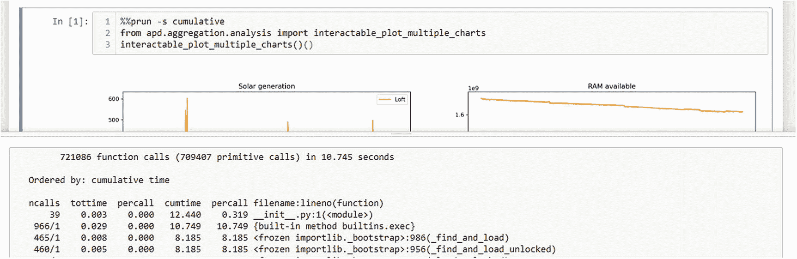
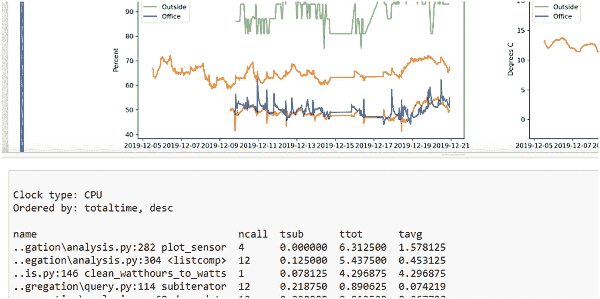
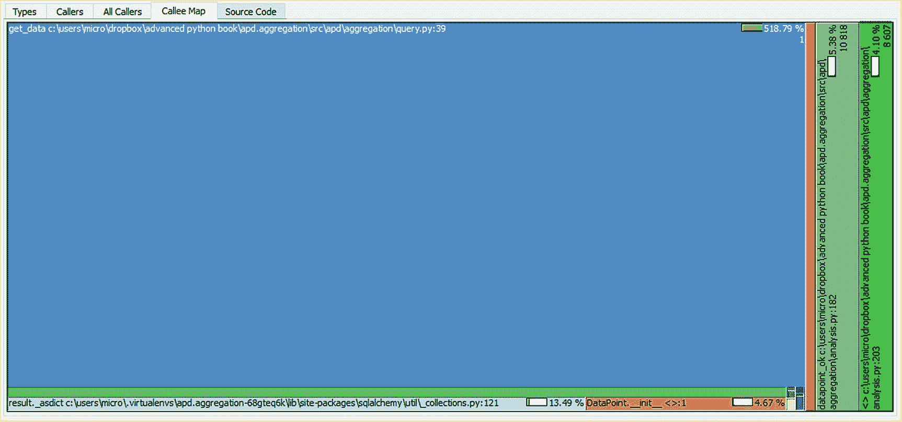

# 10.加快速度

提高代码速度有两种主要方法:优化我们编写的代码和优化程序的控制流以运行更少的代码。人们通常专注于优化代码而不是控制流，因为更容易进行自包含的更改，但是最显著的好处通常是在更改流程时。

## 优化功能

优化一个函数的第一步是在做任何改变之前对它的性能有一个很好的理解。Python 标准库有一个 profile 模块来帮助实现这一点。Profile 会在代码运行时对代码进行内省，以了解每个函数调用所花费的时间。探查器可以检测对同一函数的多次调用，并监视任何间接调用的函数。然后，您可以生成一个报告，显示整个运行的函数调用图。

我们可以使用`profile.run(...)`函数来分析一条语句。这使用参考分析器，它总是可用的，但是大多数人在`cProfile.run(...)` <sup>[1](#Fn1)</sup> 使用优化的分析器。分析器将对作为第一个参数传递的字符串进行`exec`，生成分析信息，然后自动将分析结果格式化成报告。

```py
>>> from apd.aggregation.analysis import interactable_plot_multiple_charts
>>> import cProfile
>>> cProfile.run("interactable_plot_multiple_charts()()", sort="cumulative")
         164 function calls in 2.608 seconds

   Ordered by: cumulative time

   ncalls  tottime  percall  cumtime  percall filename:lineno(function)
        1   0.001   0.001   2.608   2.608 {built-in method builtins.exec}
        1   0.001   0.001   2.606   2.606 <string>:1(<module>)
        1   0.004   0.004   2.597   2.597 analysis.py:327(run_in_thread)
        9   2.558   0.284   2.558   0.284 {method 'acquire' of '_thread.lock' objects}
        1   0.000   0.000   2.531   2.531 _base.py:635(__exit__)
...

```

这里显示的表格显示了一个函数被调用的次数( *ncalls* )、执行该函数所花费的时间( *tottime* )以及总时间除以调用次数( *percall* )。它还显示了执行该函数和所有被间接调用的函数所花费的累计时间，包括总计时间和除以调用次数的时间(*累计时间*和第二个 *percall* )。具有高累计时间和低总时间的函数意味着函数本身不能从优化中受益，但是涉及该函数的控制流可以。

Tip

一些 ide 和代码编辑器内置了对运行分析器和查看其输出的支持。如果您使用的是 IDE，那么这可能是一个更自然的界面。然而，分析器的行为仍然是相同的。

在 Jupyter 笔记本中运行代码时，您也可以使用“单元格魔术”功能生成相同的报告(图 [10-1](#Fig1) )。单元魔术是在单元上的注释，用于在执行期间使用命名的插件，在本例中是一个分析器。如果您创建了单元格的第一行`%%prun -s cumulative`，那么一旦单元格执行完毕，笔记本就会显示一个包含整个单元格的概要报告的弹出窗口。

Caution

“cell magic”方法目前与 IPython 中的顶级 await 支持不兼容。如果你使用%%prun 细胞魔法，那么该细胞不能等待协程。



图 10-1

分析 jupiter 笔记本电脑单元的示例

### 分析和线程

前面的例子生成的报告列出了许多线程内部函数，而不是我们的实质性函数。这是因为我们的`interactable_plot_multiple_charts(...)(...)`函数 <sup>[2](#Fn2)</sup> 启动了一个新线程来处理底层协程的运行。分析器不会进入已启动的线程来启动分析器，所以我们只能看到主线程在等待工作线程完成。

我们可以通过改变代码将协程封装到线程中的方式来解决这个问题，让我们有机会在子线程中插入一个分析器。例如，我们可以添加一个`debug=`标志，然后如果`debug=True`被传递，就向线程池提交一个不同的函数，如清单 [10-1](#PC2) 所示。

```py
_Coroutine_Result = t.TypeVar("_Coroutine_Result")

def wrap_coroutine(
    f: t.Callable[..., t.Coroutine[t.Any, t.Any, _Coroutine_Result]], debug: bool=False,
) -> t.Callable[..., _Coroutine_Result]:
    """Given a coroutine, return a function that runs that coroutine
    in a new event loop in an isolated thread"""

    @functools.wraps(f)
    def run_in_thread(*args: t.Any, **kwargs: t.Any) -> _Coroutine_Result:
        loop = asyncio.new_event_loop()
        wrapped = f(*args, **kwargs)

        if debug:
            # Create a new function that runs the loop inside a cProfile
            # session, so it can be profiled transparently

            def fn():
                import cProfile

                return cProfile.runctx(
                    "loop.run_until_complete(wrapped)",
                    {},
                    {"loop": loop, "wrapped": wrapped},
                    sort="cumulative",
                )

            task_callable = fn
        else:
            # If not debugging just submit the loop run function with the
            # desired coroutine
            task_callable = functools.partial(loop.run_until_complete, wrapped)
        with ThreadPoolExecutor(max_workers=1) as pool:
            task = pool.submit(task_callable)
        # Mypy can get confused when nesting generic functions, like we do # here
        # The fact that Task is generic means we lose the association with
        # _CoroutineResult. Adding an explicit cast restores this.
        return t.cast(_Coroutine_Result, task.result())

    return run_in_thread

def interactable_plot_multiple_charts(
    *args: t.Any, debug: bool=False, **kwargs: t.Any
) -> t.Callable[..., Figure]:
    with_config = functools.partial(plot_multiple_charts, *args, **kwargs)
    return wrap_coroutine(with_config, debug=debug)

Listing 10-1Example of wrap_coroutine to optionally include profiling

```

在清单 [10-1](#PC2) 中，我们使用分析器中的`runctx(...)`函数，而不是`run(...)`函数。`runctx(...)`允许将全局和局部变量传递给我们正在分析的表达式。 <sup>[3](#Fn3)</sup> 解释器不会自省代表要运行的代码的字符串来确定需要什么变量。您必须显式地传递它们。

有了这一改变，我们用来绘制所有带有交互元素的图表的代码也可以请求收集分析信息，因此 Jupyter 笔记本中的用户可以轻松地调试他们正在添加的新图表类型，如图 [10-2](#Fig2) 所示。


图 10-2

从 jupiter 使用集成分析选项

运行在子线程中的分析器在顶部仍然包括一些开销函数，但是我们现在可以看到我们想要分析的函数，而不仅仅是线程管理函数。如果我们只看与我们的代码相关的函数，输出如下:

```py
ncalls   tottime  percall  cumtime  percall  filename:lineno(function)
    20   0.011    0.001    2.607    0.130    analysis.py:282(plot_sensor)
    12   0.028    0.002    2.108    0.176    analysis.py:304(<listcomp>)
  3491   0.061    0.000    1.697    0.000    analysis.py:146(clean_watthours_to_watts)
 33607   0.078    0.000    0.351    0.000 query.py:114(subiterator)
    12   0.000    0.000    0.300    0.025 analysis.py:60(draw_date)
 33603   0.033    0.000    0.255    0.000 query.py:39(get_data)
     3   0.001    0.000    0.254    0.085 analysis.py:361(plot_multiple_charts)
 16772   0.023    0.000    0.214    0.000 analysis.py:223(clean_passthrough)
 33595   0.089    0.000    0.207    0.000 database.py:77(from_sql_result)
  8459   0.039    0.000    0.170    0.000 analysis.py:175(clean_temperature_fluctuations)
    24   0.000    0.000    0.140    0.006 query.py:74(get_deployment_by_id)
     2   0.000    0.000    0.080    0.040 query.py:24(with_database)

```

看起来`plot_sensor(...)`函数被调用了 20 次，列表理解`points = [dp async for dp in config.clean(query_results)]`被调用了 12 次，`clean_watthours_to_watts(...)`函数被调用了 3491 次。大量报告的对 clean 函数的调用是由于分析器与生成器函数的交互方式。每次从生成器请求一个新项时，它都被归类为该函数的一个新调用。同样，每次一个项目被放弃，它被归类为调用返回。这种方法看起来比测量从第一次调用到生成器耗尽的时间更复杂，但是这意味着 tottime 和 cumtime 总计不包括迭代器空闲并等待其他代码请求下一项的时间。但是，这也意味着 percall 数字表示检索单个项目所花费的时间，而不是每次调用该函数所花费的时间。

Caution

分析器需要一个函数来确定当前时间。默认情况下，profile 使用`time.process_time()`，cProfile 使用`time.perf_counter()`。这些测量非常不同的东西。`process_time()`函数测量 CPU 忙碌的时间，但是`perf_counter()`测量真实世界的时间。现实世界的时间通常被称为“墙上时间”，意思是由墙上的时钟测量的时间。

### 解释配置文件报告

`clean_watthours_to_watts(...)`函数应该立即吸引你的注意力，因为它是一个相对低级的函数，具有非常高的累计时间。这个函数被用作绘制四个图表之一的支持函数，但是它占了`plot_sensor(...)`总执行时间的 65%。这个函数是我们开始优化的地方，但是如果我们比较 tottime 和 cumtime，我们可以看到它只花了这个函数总时间的 2%。

这种差异告诉我们，并不是我们在这个函数中直接编写的代码导致了速度下降，而是我们在实现`clean_watthours_to_watts(...)`的过程中间接调用了其他函数。现在，我们着眼于优化功能，而不是优化执行流程。因为优化这个函数需要优化调用我们无法控制的函数的模式，所以我们暂时忽略它。本章的后半部分将介绍通过改变控制流来提高性能的策略，我们将在那里返回来修正这个函数。

相反，让我们把注意力集中在那些 tottime 比 cumtime 高的项目上，这表示花费的时间是在执行我们编写的代码上，而不是在执行我们正在使用的代码上。这些数字明显低于我们之前观察的次数；它们是相对简单的功能，代表着较小的潜在利益，但情况可能并不总是如此。

```py
       12   0.103   0.009   2.448   0.204 analysis.py:304(<listcomp>)
    33595   0.082   0.000   0.273   0.000 database.py:77(from_sql_result)
    33607   0.067   0.000   0.404   0.000 query.py:114(subiterator)

```

我们看到与数据库接口相关的两个函数是潜在的候选函数。这些都运行了 33，000 次以上，每次运行的总时间不到十分之一秒，因此它们不是特别诱人的优化目标。尽管如此，就我们代码的总时间而言，它们是最高的，因此它们代表了我们必须进行简单、自包含类型的优化的最佳机会。

要做的第一件事是尝试改变一些关于实现的东西，并测量任何差异。现有的实现非常短，只包含一行代码。我们根本不可能优化，但让我们试试。

```py
@classmethod
def from_sql_result(cls, result) -> DataPoint:
    return cls(**result._asdict())

```

在前面的实现中，有一点可能会导致速度变慢，那就是生成了一个值字典，并动态地映射到关键字参数。 <sup>[4](#Fn4)</sup> 一个要测试的想法将是显式地传递论点，因为我们知道它们是一致的。

```py
@classmethod
def from_sql_result(cls, result) -> DataPoint:
    if result.id is None:
        return cls(data=result.data, deployment_id=result.deployment_id,
                    sensor_name=result.sensor_name, collected_at=result.collected_at)
    else:
        return cls(id=result.id, data=result.data, deployment_id=result.deployment_id, sensor_name=result.sensor_name,
        collected_at=result.collected_at)

```

这个过程中最重要的部分是检验我们的假设。我们需要重新运行代码并比较结果。我们还需要意识到这样一个事实，即代码的执行时间可能会因外部因素(如计算机上的负载)而有所不同，因此尝试运行几次代码以查看结果是否稳定是一个好主意。我们在这里寻求显著的加速，因为我们的改变会引入可维护性问题，所以微不足道的速度提升是不值得的。

```py
    33595   0.109   0.000   0.147   0.000 database.py:77(from_sql_result)

```

这里的结果显示，与之前的实现相比，在`from_sql_result()`函数上花费了更多的时间，但是累积时间减少了。这个结果告诉我们，我们对`from_sql_result()`所做的更改直接导致该函数花费更长的时间，但是这样做的时候，我们更改了控制流以消除对`_asdict()`的调用，并直接传递值，这大大弥补了我们引入的减速。

换句话说，除了通过改变控制流来避免`_asdict()`中的代码之外，这个函数的实现对性能没有明显的改善。它还要求我们列出在多个地方使用的字段，从而降低了代码的可维护性。因此，我们将坚持我们的原始实现，而不是“优化”版本。

Tip

对于类的创建还有另一个潜在的优化，在类上设置一个 __slots__ 属性，比如`__slots__ = {"sensor_name", "data", "deployment_id", "id", "collected_at"}`。这使得开发人员可以保证在一个实例上只设置专门命名的属性，这使得解释器可以添加许多优化。在撰写本文时，数据类和`__slots__`之间存在一些不兼容，这使得它不太容易使用，但是如果您想优化对象的实例化，那么我建议您看一看。

其他两个也是如此:`subiterator()`和列表理解功能非常少；对它们的更改会降低可读性，并且不会带来实质性的性能改进。

一个小的、容易理解的函数成为显著性能改进的候选者的情况相对较少，因为糟糕的性能通常与复杂性相关。如果系统的复杂性是由简单函数的组合造成的，那么性能的提高来自于控制流的优化。如果你有很长的函数来做复杂的事情，那么更有可能的是通过孤立地优化函数来获得显著的改进。

### 其他分析器

Python 自带的分析器足以在大多数情况下获得有用的信息。尽管如此，由于代码性能是一个如此重要的主题，还有其他可用的分析器，它们都有独特的优点和缺点。

#### 时间到了

要提到的最重要的可选分析器也来自 Python 标准库，名为 timeit。时间它对于分析快速、独立的函数很有用。它不是在正常运行中监控程序，而是重复运行给定的代码，并返回所用的累计时间。

```py
>>> import timeit
>>> from apd.aggregation.utils import merc_y
>>> timeit.timeit("merc_y(52.2)", globals={"merc_y": merc_y})
1.8951617999996415

```

当使用默认参数调用时，如前所示，输出是执行第一个参数一百万次所需的秒数，使用最精确的时钟测量。只有第一个参数(`stmt=`)是必需的，它是每次要执行的代码的字符串表示。第二个字符串参数(`setup=`)表示测试开始前必须执行的设置代码，一个`globals=`字典允许将任意项传递到被分析代码的名称空间中。这对于在测试中传递函数特别有用，而不是在`setup=`代码中导入它。可选的`number=`参数允许我们指定代码应该运行多少次，因为一百万次执行对于执行时间超过 50 微秒的函数来说是不合适的。 <sup>[5](#Fn5)</sup>

表示要测试的代码的字符串和`setup=`字符串都可以是包含一系列 Python 语句的多行字符串。但是，请注意，第一个字符串中的任何定义或导入每次都要运行，所以所有设置代码都应该在第二个字符串中完成，或者直接作为全局变量传递。

#### 线条轮廓图

一个普遍推荐的替代分析器是 Robert Kern 的 line_profiler。 <sup>[6](#Fn6)</sup> 它逐行记录信息，而不是逐函数记录，这对于精确定位函数性能问题的来源非常有用。

不幸的是，line_profiler 的权衡相当重要。它需要修改您的 Python 程序来注释您希望分析的每个函数，并且当这些注释就位时，代码不能运行，除非通过 line _ profilers 自定义环境。此外，在撰写本文时，大约有两年的时间无法安装带有 pip 的 line_profiler。虽然你会发现很多人在网上推荐这个分析器，但部分原因是它比其他工具更早上市。我建议避免使用这个分析器，除非对调试复杂的函数绝对必要；你可能会发现安装花费的时间比安装后节省的时间还多。

#### 雅皮

另一个可选的分析器是 yappi， <sup>[7](#Fn7)</sup> ，它提供了跨多线程和异步事件循环运行的 Python 代码的透明分析。迭代器的调用计数之类的数字表示迭代器被调用的次数，而不是检索的项数，并且不需要修改代码来支持多线程分析。

yappi 的缺点是，它是一个相对较小的项目，正在大量开发中，因此您可能会发现它不如许多其他 Python 库那么完美。对于内置分析器不足的情况，我会推荐 yappi。在撰写本文时，我仍然推荐内置的分析工具作为我的首选，但是 yappi 紧随其后。

yappi 的接口与我们到目前为止使用的内置分析器有些不同，因为它没有提供与`run(...)`函数调用等价的接口。yappi 分析器必须在被分析的代码周围启用和禁用。默认分析器有一个等效的 API，如表 [10-1](#Tab1) 所示。

表 10-1

profile 和 yappi 分析的比较

<colgroup><col class="tcol1 align-left"> <col class="tcol2 align-left"></colgroup> 
| *使用启用/禁用 API 的 c profile*`import cProfile``profiler = cProfile.Profile()``profiler.enable()``method_to_profile()``profiler.disable()``profiler.print_stats()` | *基于 Yappi 的剖析*`import yappi``yappi.start()``method_to_profile()``yappi.stop()``yappi.get_func_stats().print_all()` |

在 Jupyter 单元中使用 yappi 使我们能够调用底层代码中的函数，而不需要解决线程和异步问题。我们本可以使用 yappi 来分析我们的代码，而不需要提前修改`debug=`参数。在前面的例子中，如果`method_to_profile()`调用`interactable_plot_multiple_charts(...)`和`widgets.interactive(...)`，产生的概要文件输出如下:

```py
Clock type: CPU
Ordered by: totaltime, desc

name                                  ncall  tsub      ttot      tavg
..futures\thread.py:52 _WorkItem.run  17     0.000000  9.765625  0.574449
..rrent\futures\thread.py:66 _worker  5/1    0.000000  6.734375  1.346875
..38\Lib\threading.py:859 Thread.run  5/1    0.000000  6.734375  1.346875
..ndowsSelectorEventLoop.run_forever  1      0.000000  6.734375  6.734375
..b\asyncio\events.py:79 Handle._run  101    0.000000  6.734375  0.066677
..lectorEventLoop.run_until_complete  1      0.000000  6.734375  6.734375
..WindowsSelectorEventLoop._run_once  56     0.000000  6.734375  0.120257
..gation\analysis.py:282 plot_sensor  4      0.093750  6.500000  1.625000
..egation\analysis.py:304 <listcomp>  12     0.031250  5.515625  0.459635
...

```

在这个例子中，yappi 显示的总时间明显高于 cProfile 显示的总时间。您应该只比较性能分析器产生的时间和使用相同工具在相同硬件上产生的结果，因为当启用性能分析器时，性能会有很大差异 <sup>[8](#Fn8)</sup> 。

Yappi Helper Functions

Yappi 支持按函数和模块过滤统计数据。还有一个提供定制过滤功能的选项，以准确地确定应该在性能报告中显示哪些代码。还有一些其他的选择；您应该查看 yappi 的文档，找到推荐的方法来过滤输出，只显示您感兴趣的代码。

本章附带的代码有一些帮助器函数，可以让 yappi 在 Jupyter 上下文中更容易进行分析。这些是`profile_with_yappi`，一个上下文管理器，处理激活和停用分析器；`jupyter_page_file`，一个上下文管理器，帮助以与`%%prun`单元魔术相同的方式显示剖析数据，不与单元输出合并；和`yappi_package_matches`，一个助手，它使用`filter_callback=`选项来限制显示的统计信息，只显示给定 Python 包中的模块。清单 [10-2](#PC11) 显示了使用这些辅助函数的一个例子。



```py
from apd.aggregation.analysis import (interactable_plot_multiple_charts, configs)
from apd.aggregation.utils import (jupyter_page_file, profile_with_yappi, yappi_package_matches)
import yappi

with profile_with_yappi():
    plot = interactable_plot_multiple_charts()
    plot()

with jupyter_page_file() as output:
    yappi.get_func_stats(filter_callback=lambda stat:
        yappi_package_matches(stat, ["apd.aggregation"])
    ).print_all(output)

Listing 10-2.Jupyter cell for yappi profiling, with part of the Jupyter output shown

```

这三个助手都不是必需的，但是它们提供了一个更加用户友好的界面。

#### Tracemalloc

到目前为止，我们看到的分析器都是测量运行一段代码所需的 CPU 资源。我们可用的另一个主要资源是内存。一个运行速度很快但需要大量内存的程序在可用内存较少的系统上运行速度会慢得多。

Python 有一个内置的 RAM 分配分析器，称为 tracemalloc。该模块提供`tracemalloc.start()`和`tracemalloc.stop()`功能，分别启用和禁用 profiler。通过使用`tracemalloc.take_snapshot()`功能，可以随时请求轮廓结果。清单 [10-3](#PC12) 给出了一个在我们的绘图代码中使用它的例子。

这样做的结果是一个`Snapshot`对象，它有一个`statistics(...)`方法来返回单个统计数据的列表。该函数的第一个参数是对结果进行分组的关键字。最有用的两个键是`"lineno"`(用于逐行分析)和`"filename"`(用于整个文件分析)。一个`cumulative=`标志允许用户选择是否包含间接调用函数的内存使用。也就是说，每个统计行应该直接表示一行做了什么，还是表示运行该行的所有结果？

```py
import tracemalloc

from apd.aggregation.analysis import interactable_plot_multiple_charts

tracemalloc.start()
plot = interactable_plot_multiple_charts()()
snapshot = tracemalloc.take_snapshot()
tracemalloc.stop()
for line in snapshot.statistics("lineno", cumulative=True):
    print(line)

Listing 10-3Example script to debug memory usage after plotting the charts

```

标准库中的文档提供了一些帮助函数，以提供更好的输出数据格式，尤其是`display_top(...)`函数的代码示例。 <sup>[9](#Fn9)</sup>

Caution

tracemalloc 分配器只显示在生成快照时仍处于活动状态的内存分配。对我们的程序进行分析表明，SQL 解析使用了大量的 ram，但是不会显示我们的`DataPoint`对象，尽管它们占用了更多的 RAM。与 SQL 对象不同，我们的对象是短命的，所以在我们生成快照时它们已经被丢弃了。调试内存使用峰值时，必须在峰值时创建快照。

#### 新遗迹

如果你正在运行一个基于网络的应用程序，那么商业服务 New Relic 可能会提供有用的剖析见解。它提供了一个紧密集成的分析系统，允许您监控来自 web 请求的控制流、服务这些请求所涉及的功能，以及作为呈现过程的一部分与数据库和第三方服务的交互。

New Relic 和它的竞争对手之间的权衡是巨大的。您可以访问一组优秀的概要分析数据，但是它并不适合所有的应用程序类型，并且要花费大量的金钱。此外，使用真实用户的动作来执行概要分析这一事实意味着，在向您的系统引入新的遗留系统之前，您应该考虑用户隐私。也就是说，新的遗迹剖析提供了一些我见过的最有用的性能分析。

## 优化控制流程

更常见的情况是，在 Python 系统中，不是单个函数导致性能问题。正如我们前面看到的，以一种天真的方式编写代码通常会导致一个函数除了改变它正在做的事情之外不能被优化。

以我的经验来看，低性能最常见的原因是函数的计算量超过了它所需要的。例如，在我们第一次实现获取整理数据的功能时，我们还没有数据库端过滤，所以我们添加了一个循环来从不相关的数据中过滤我们想要的数据。

稍后过滤输入数据不只是移动工作区；它可以增加正在完成的总工作量。在这种情况下，完成的工作是从数据库加载数据，建立数据点记录，并从这些记录中提取相关数据。通过将过滤从加载步骤转移到提取步骤，我们为那些我们不关心的对象建立了数据点记录。

Complexity

函数所花费的时间并不总是与输入的大小成正比，但是对于在数据上循环一次的函数来说，这是一个很好的近似值。排序和其他更复杂的操作表现不同。

函数需要多长时间(或需要多少内存)和它们的输入大小之间的关系称为计算复杂度。大多数程序员从来不需要担心函数的确切复杂性类别，但是在优化代码时，有必要了解它们的大致区别。

您可以使用具有不同输入的 timeit 函数来估计输入大小和时间之间的关系，但是根据经验，最好避免在循环中嵌套循环。迭代次数很少的嵌套循环是可以的，但是在用户输入上的另一个循环中循环用户输入会导致函数花费的时间随着用户输入量的增加而迅速增加。

对于给定的输入大小，函数花费的时间越长，就越需要最小化它处理的无关数据量。

在图 [10-3](#Fig3) 中，横轴表示花费的时间，纵轴表示流水线中一个阶段必须处理的输入量。一个步骤的宽度，也就是它处理的时间，与它处理的数据量成正比。

这两个流说明了处理单个传感器所需的工作量，上面的流具有数据库级别的过滤，下面的流具有 Python 中的过滤。在这两种情况下，输出总量是相同的，但是中间阶段要处理的数据量不同，因此花费的时间也不同。


图 10-3

数据库中过滤的代码数据集大小与清理期间过滤的关系图

我们在两个地方丢弃数据:当我们只找到有问题的传感器的数据时，以及当丢弃无效数据时。通过将传感器过滤器移到数据库中，我们减少了加载步骤中完成的工作量，从而减少了所需的时间。我们正在转移大部分过滤，用于移除无效数据的更复杂的过滤仍在清理步骤中进行。如果我们能够将这种过滤转移到数据库中，将会进一步减少加载步骤所花费的时间，尽管不是那么多。

我们已经假设我们在编写函数时需要过滤数据库，部分是为了提高 API 的可用性，但是我们可以通过使用 yappi profiler 和为我们的绘图系统提供显式配置的能力来测试这一假设。然后，我们可以直接比较使用数据库支持的过滤和 Python 过滤绘制图表所需的时间。数据库中过滤性能分析的实现如清单 [10-4](#PC13) 所示。

```py
import yappi

from apd.aggregation.analysis import (interactable_plot_multiple_charts, Config)
from apd.aggregation.analysis import (clean_temperature_fluctuations, get_one_sensor_by_deployment)
from apd.aggregation.utils import profile_with_yappi

yappi.set_clock_type("wall")

filter_in_db = Config(
    clean=clean_temperature_fluctuations,
    title="Ambient temperature",
    ylabel="Degrees C",
    get_data=get_one_sensor_by_deployment("Temperature"),
)

with profile_with_yappi():
    plot = interactable_plot_multiple_charts(configs=[filter_in_db])
    plot()

yappi.get_func_stats().print_all()

Listing 10-4Jupyter cell to profile a single chart, filtering in SQL

```

下面的统计数据是 cells 输出的一部分，显示了我们最感兴趣的一些条目。我们可以看到加载了 10828 个数据对象，`get_data(...)`函数花费了 2.7 秒，6 次数据库调用总共花费了 2.4 秒。`analysis.py` ( `points = [dp async for dp in config.clean(query_results)]`)的第 304 行的 list comprehension 是调用 cleaner 函数的地方。清理数据需要 0.287 秒，但是清理函数本身的时间可以忽略不计。

```py
name                                  ncall  tsub      ttot      tavg
..lectorEventLoop.run_until_complete  1      0.000240  3.001717  3.001717
..alysis.py:341 plot_multiple_charts  1      2.843012  2.999702  2.999702
..gation\analysis.py:282 plot_sensor  1      0.000000  2.720996  2.720996
..query.py:86 get_data_by_deployment  1      2.706142  2.706195  2.706195
..d\aggregation\query.py:39 get_data  1      2.569511  2.663460  2.663460
..lchemy\orm\query.py:3197 Query.all  6      0.008771  2.407840  0.401307
..lchemy\orm\loading.py:35 instances  10828  0.005485  1.588923  0.000147
..egation\analysis.py:304 <listcomp>  4      0.000044  0.286975  0.071744
..175 clean_temperature_fluctuations  4      0.000000  0.286888  0.071722

```

我们可以重新运行相同的测试，但是使用相同图表的新版本，其中所有的过滤都在 Python 中进行。清单 [10-5](#PC15) 演示了这一点，通过添加一个新的更干净的函数来进行过滤，并使用现有的`get_data_by_deployment(...)`函数作为数据源。这代表了如果我们没有给`get_data(...)`添加一个`sensor_name=`参数，我们需要如何过滤数据。

```py
import yappi

from apd.aggregation.analysis import (interactable_plot_multiple_charts, Config, clean_temperature_fluctuations, get_data_by_deployment)
from apd.aggregation.utils import (jupyter_page_file, profile_with_yappi, YappiPackageFilter)

async def filter_and_clean_temperature_fluctuations(datapoints):
    filtered = (item async for item in datapoints if item.sensor_name=="Temperature")
    cleaned = clean_temperature_fluctuations(filtered)
    async for item in cleaned:
        yield item

filter_in_python = Config(
    clean=filter_and_clean_temperature_fluctuations,
    title="Ambient temperature",
    ylabel="Degrees C",
    get_data=get_data_by_deployment,
)

with profile_with_yappi():
    plot = interactable_plot_multiple_charts(configs=[filter_in_python])
    plot()

yappi.get_func_stats().print_all()

Listing 10-5Jupyter cell to profile drawing the same chart but without any database filtering

```

在这个版本中，过滤发生在`filter_and_clean_temperature_fluctuations(...)`中，所以我们预计这需要很长时间。所花费的额外时间部分存在于该函数的生成器表达式中，但不是全部。`plot_multiple_charts(...)`花费的总时间从 3.0 秒增加到了 8.0 秒，其中 1.3 秒是过滤。这表明，通过在数据库中进行过滤，我们节省了 3.7 秒的开销，这代表了 21%的加速。

```py
name                                  ncall  tsub      ttot      tavg
..lectorEventLoop.run_until_complete  1      0.000269  7.967136  7.967136
..alysis.py:341 plot_multiple_charts  1      7.637066  7.964143  7.964143
..gation\analysis.py:282 plot_sensor  1      0.000000  6.977470  6.977470
..query.py:86 get_data_by_deployment  1      6.958155  6.958210  6.958210
..d\aggregation\query.py:39 get_data  1      6.285337  6.881415  6.881415
..lchemy\orm\query.py:3197 Query.all  6      0.137161  6.112309  1.018718
..lchemy\orm\loading.py:35 instances  67305  0.065920  3.424629  0.000051
..egation\analysis.py:304 <listcomp>  4      0.000488  1.335928  0.333982
..and_clean_temperature_fluctuations  4      0.000042  1.335361  0.333840
..175 clean_temperature_fluctuations  4      0.000000  1.335306  0.333826
..-input-4-927271627100>:7 <genexpr>  4      0.000029  1.335199  0.333800

```

### 可视化分析数据

复杂的迭代器函数很难分析，正如`clean_temperature_fluctuations(...)`将它的`tsub`时间列为零。这是一个调用其他方法的复杂函数，但是对于它来说，花费的时间正好为零，这一定是一个舍入误差。**剖析运行代码可以为你指出正确的方向，但你只能从这种方法中得到指示性的数字**。从这个角度也很难看出 0.287 秒的总时间是如何按组成函数分解的。

内置的 profile 模块和 yappi 都支持以 pstats 格式导出数据，这是一种特定于 Python 的 profile 格式，可以传递给可视化工具。Yappi 还支持 Valgrind 分析工具中的 callgrind 格式。

我们可以使用`yappi.get_func_stats().save("callgrind.filter_in_db", "callgrind")`保存来自 yappi 的 callgrind 配置文件，然后将其加载到类似 KCachegrind 的 callgrind 可视化工具中。 <sup>[12](#Fn12)</sup> 图 [10-4](#Fig4) 显示了在 QCachegrind 中显示该代码的数据库过滤版本的示例，其中块的面积对应于在相应函数中花费的时间。



图 10-4

过滤数据库中的数据时，调用 clean _ temperature _ contractions 图表

你可能会惊讶地发现`get_data(...)`不仅出现在这张图表中，而且是迄今为止最大的单个区块。`clean_temperature_fluctuations(...)`函数似乎没有调用`get_data(...)`函数，所以为什么这个函数会占用大部分时间还不是很明显。

迭代器使得对调用流的推理变得困难，因为当你在一个循环中从一个 iterable 中取出一个项目时，它看起来不像一个函数调用。在引擎盖下，Python 正在调用`youriterable.__next__()`(或`youriterable.__anext__()`)，它将执行传递回底层函数，完成前面的 yield。因此，一个 for 循环可以调用任意数量的函数，即使它的主体是空的。`async for`的结构让这一点更清楚，因为它明确表示底层代码可能在等待。底层代码不可能等待，除非控制传递给其他代码，而不仅仅是与静态数据结构交互。当分析使用 iterable 的代码时，您会发现使用 iterable 的函数调用的底层数据生成函数出现在输出中。

Consuming Iterables and Single Dispatch Functions

我们可以尽快编写一个使用迭代器的函数，这在一定程度上简化了调用堆栈。使用迭代器会由于阻止任务并行运行而降低性能，并且需要足够的内存来容纳整个 iterable，但是它确实大大简化了分析工具的输出。清单 [10-6](#PC17) 显示了在保留相同接口的同时使用可迭代和异步可迭代的简单函数。

```py
def consume(input_iterator):
    items = [item for item in input_iterator]
    def inner_iterator():
        for item in items:
            yield item
    return inner_iterator()

async def consume_async(input_iterator):
    items = [item async for item in input_iterator]
    async def inner_iterator():
        for item in items:
            yield item
    return inner_iterator()

Listing 10-6Pair of functions for consuming iterators in place

```

这对函数接受一个迭代器(或异步迭代器),一被调用(或等待)就使用它，返回一个新的迭代器，这个迭代器只从预先使用的源产生。这些功能的用法如下:

```py
# Synchronous
nums = (a for a in range(10))
consumed = consume(nums)

# Async
async def async_range(num):
    for a in range(num):
        yield a
nums = async_range(10)
consumed = await consume_async(nums)

```

我们可以使用标准库中的 functools 模块，特别是`@singledispatch`装饰器来简化这个过程。回到第二章，我们看了 Python 的动态分派功能，它允许函数被它所连接的类查找。我们正在做类似的事情。我们有一对与底层数据类型相关联的函数，但是这些数据类型不是我们编写的类。我们无法控制附加到它们上面的函数，因为这两种类型是核心语言的特性，而不是我们已经创建并可以编辑的类。

`@singledispatch` decorator 根据第一个参数的类型将函数标记为有多个不同的实现。使用这种方法重写我们的函数(清单 [10-7](#PC19) )只需要向它们添加装饰器，将替代实现加入到基本实现中，并添加一个类型提示来区分变量。

```py
import functools

@functools.singledispatch
def consume(input_iterator):
    items = [item for item in input_iterator]
    def inner_iterator():
        for item in items:
            yield item
    return inner_iterator()

@consume.register
async def consume_async(input_iterator: collections.abc.AsyncIterator):
    items = [item async for item in input_iterator]
    async def inner_iterator():
        for item in items:
            yield item
    return inner_iterator()

Listing 10-7Pair of functions for consuming iterators in place with single dipatch

```

这两个函数的行为与前面的实现完全相同，除了`consume(...)`函数可以用于任一类型的迭代器。它基于其输入类型透明地在同步和异步实现之间切换。如果第一个参数是 AsyncIterator，那么使用`consume_async(...)`变量；否则使用`consume(...)`变体。

```py
nums = (a for a in range(10))
consumed = consume(nums)
nums = async_range(10)
consumed = await consume (nums)

```

传递给 register 的函数必须有类型定义或传递给 register 函数本身的类型。我们在这里使用了`collections.abc.AsyncIterator`而不是`typing.AsyncIterator`作为类型，因为类型必须是*运行时可检查的*。这意味着`@singledispatch`仅限于在具体类或抽象基类上调度。

`typing.AsyncIterator`类型是一个泛型类型:我们可以用`typing.AsyncIterator[int]`来表示`int`的迭代器。这是 mypy 用于静态分析的，但不在运行时使用。如果不消耗整个迭代器并检查其内容，一个正在运行的 Python 程序不可能知道一个任意的异步迭代器是否是一个`typing.AsyncIterator[int]`迭代器。

`collections.abc.AsyncIterator`不保证迭代器的内容，所以它类似于`typing.AsyncIterator[typing.Any]`，但是因为它是一个抽象基类，所以可以在运行时用`isinstance(...)`进行检查。

### 贮藏

另一种提高性能的方法是缓存函数调用的结果。缓存的函数调用记录了过去的调用及其结果，以避免多次计算相同的值。到目前为止，我们一直使用摄氏温度系统来绘制温度，但有几个国家保留了古老的华氏测量系统。如果我们能够指定我们希望使用哪个温度系统来显示我们的图表，那就太好了，这样用户就可以选择他们最熟悉的系统。

转换温标的工作与现有`clean_temperature_fluctuations(...)`方法完成的任务正交；例如，我们可能想在不消除波动的情况下转换温度。为了实现这一点，我们创建一个新的函数，它接受一个 cleaner 和一个温度系统，并返回一个新的 cleaner 来调用底层的那个，然后进行温度转换。

```py
def convert_temperature(magnitude: float, origin_unit: str, target_unit: str) -> float:
    temp = ureg.Quantity(magnitude, origin_unit)
    return temp.to(target_unit).magnitude
def convert_temperature_system(cleaner, temperature_unit):
    async def converter(datapoints):
        results = cleaner(datapoints)
        async for date, temp_c in results:
            yield date, convert_temperature(temp_c, "degC", temperature_unit)

    return converter

```

前面的函数没有任何类型提示，因为它们非常冗长。cleaner 参数和来自`convert_temperature_system(...)`的返回值都是类型`t.Callable[[t.AsyncIterator[DataPoint]], t.AsyncIterator[t.Tuple[datetime.datetime, float]]]`，这是一个非常复杂的结构，在一行代码中包含两次。这些类型在我们的分析函数中被重复使用，虽然很难一眼识别，但是它们映射到容易理解的概念。这些都是分解成变量的很好的候选者，其结果如清单 [10-8](#PC22) 所示。

```py
CLEANED_DT_FLOAT = t.AsyncIterator[t.Tuple[datetime.datetime, float]]
CLEANED_COORD_FLOAT = t.AsyncIterator[t.Tuple[t.Tuple[float, float], float]]

DT_FLOAT_CLEANER = t.Callable[[t.AsyncIterator[DataPoint]], CLEANED_DT_FLOAT]
COORD_FLOAT_CLEANER = t.Callable[[t.AsyncIterator[DataPoint]], CLEANED_COORD_FLOAT]

def convert_temperature(magnitude: float, origin_unit: str, target_unit: str) -> float:
    temp = ureg.Quantity(magnitude, origin_unit)
    return temp.to(target_unit).magnitude

def convert_temperature_system(

    cleaner: DT_FLOAT_CLEANER, temperature_unit: str,
) -> DT_FLOAT_CLEANER:
    async def converter(datapoints: t.AsyncIterator[DataPoint],) -> CLEANED_DT_FLOAT:
        results = cleaner(datapoints)
        reveal_type(temperature_unit)
        reveal_type(convert_temperature)
        async for date, temp_c in results:
            yield date, convert_temperature(temp_c, "degC", temperature_unit)

    return converter

Listing 10-8Typed conversion functions

```

Typing Protocols, Typevars and Variance

我们以前使用过`t.TypeVar(...)`来表示泛型类型中的占位符，比如在 config 类中定义了`draw(...)`函数。我们必须使用`T_key`和`T_value`类型的变量，因为类中的一些函数使用了一组键和值，而另一些函数使用了一对键和值的可迭代变量。

也就是说，当`clean=`函数的类型为

```py
t.Callable[t.AsyncIterator[DataPoint]], t.AsyncIterator[t.Tuple[datetime.datetime, float]]

```

相应的`draw=`功能属于以下类型

```py
t.Callable[[t.Any, t.Iterable[datetime.datetime], t.Iterable[float], t.Optional[str]], None]

```

我们需要独立地访问`datetime`和`float`组件类型来构建这两种类型声明。类型变量允许我们告诉 mypy，类型是一个占位符，以后会提供；这里我们需要一个`T_key`和一个`T_value`类型的变量。我们还可以使用它们来定义一个名为`Cleaned`的泛型类型的模式，以及该类型的两个具有特定值的实例。

```py
Cleaned = t.AsyncIterator[t.Tuple[T_key, T_value]]
CLEANED_DT_FLOAT = Cleaned[datetime.datetime, float]
CLEANED_COORD_FLOAT = Cleaned[t.Tuple[float, float], float]

```

如果你期望有许多不同类型的 cleaned/cleaner 类型，那么这种方法比显式地给每个函数分配完整的类型要清晰一些。

返回这些数据的 cleaner 函数有点复杂，因为 mypy 推断可调用函数中使用泛型类型的能力是有限的。要为可调用类型和类类型创建复杂的别名(相对于数据变量)，我们必须使用*协议*特性。协议是一个类，它定义了底层对象必须拥有的被认为是匹配的属性，非常类似于自定义抽象基类的 subclasshook，但采用声明式风格，用于静态类型而不是运行时类型检查。

我们想定义一个接受数据点的`AsyncIterator`和其他类型的可调用函数。这里的另一种类型由`T_cleaned_co`类型变量表示，如下所示:

```py
T_cleaned_co = t.TypeVar("T_cleaned_co", covariant=True, bound=Cleaned)

class CleanerFunc(Protocol[T_cleaned_co]):
    def __call__(self, datapoints: t.AsyncIterator[DataPoint]) -> T_cleaned_co:
        ...

```

这个`CleanerFunc`类型可以用来生成与之前的`*_CLEANED`变量相匹配的`*_CLEANER`变量。方括号中用于`CleanerFunc`的类型是这个特定函数提供的`Cleaned`的变体。

```py
DT_FLOAT_CLEANER = CleanerFunc[CLEANED_DT_FLOAT]
COORD_FLOAT_CLEANER = CleanerFunc[CLEANED_COORD_FLOAT]

```

`TypeVar`中的`covariant=`参数是新增加的，我们用于变量名的`_co`后缀也是新增加的。以前，我们的类型变量被用来定义函数参数和函数返回值。这些是*不变的*类型:类型定义必须完全匹配。如果我们声明一个函数期望一个`Sensor[float]`作为参数，我们不能传递一个`Sensor[int]`。正常情况下，如果我们要定义一个期望一个`float`作为参数的函数，传递一个`int`就可以了。

这是因为我们没有允许 mypy 在`Sensor`类的组成类型上使用它的兼容性检查逻辑。这个权限是通过可选的`covariant=`和`contravariant=`参数赋予类型变量的。一个*共变*类型是正常子类型逻辑适用的类型，因此如果传感器的`T_value`是共变的，那么期望`Sensor[float]`的函数可以接受`Sensor[int]`，以期望`float`的函数可以接受`int`的相同方式。这对于泛型类来说是有意义的，泛型类的函数**向它们被传递的函数提供**数据。

一个*逆变*类型(通常以`_contra`后缀命名)是一个反向逻辑成立的类型。如果传感器的`T_value`是逆变的，那么期望`Sensor[float]`的函数不能接受`Sensor[int]`，但是它们必须接受比`float`更具体的东西，比如`Sensor[complex]`。这对于泛型类很有用，这些泛型类的函数**从传递给它们的函数中消耗**数据。

我们正在定义一个提供数据的协议， <sup>[13](#Fn13)</sup> ，所以协变类型是最合适的。传感器同时是数据的提供者(`sensor.value()`)和消费者(`sensor.format(...)`)，因此必须**不变**。

Mypy 在检查协议时会检测到适当类型的差异，如果不匹配，就会引发错误。因为我们正在定义一个提供数据的函数，所以我们必须设置`covariant=True`来防止这个错误出现。

`bound=`参数指定了可以推断出该变量的最小规格。由于这被指定为`Cleaned`，`T_cleaned_co`只有在可以被推断为与`Cleaned[Any, Any]`匹配时才有效。`CleanerFunc[int]`无效，因为`int`不是`Cleaned[Any, Any]`的子类型。`bound=`参数也可用于创建对现有变量类型的引用，在这种情况下，它允许定义遵循某些外部提供的函数签名的类型。

协议和类型变量是强大的特性，可以简化类型，但是如果过度使用，也会使代码看起来混乱。将类型作为变量存储在一个模块中是一个很好的中间点，但是您应该确保所有的类型样板文件都经过了很好的注释，甚至可能放在一个实用程序文件中，以避免给代码带来过多的新贡献者。

有了新的转换代码，我们可以创建一个绘图配置，以华氏度为单位绘制温度图表。清单 [10-9](#PC28) 展示了 apd.aggregation 包的最终用户如何创建一个新的`Config`对象，该对象的行为方式与现有对象相同，但以他们喜欢的温度范围呈现其值。

```py
import yappi
from apd.aggregation.analysis import (interactable_plot_multiple_charts, Config)
from apd.aggregation.analysis import (convert_temperature_system, clean_temperature_fluctuations)
from apd.aggregation.analysis import get_one_sensor_by_deployment

filter_in_db = Config(
    clean=convert_temperature_system(clean_temperature_fluctuations, "degF"),
    title="Ambient temperature",
    ylabel="Degrees F",
    get_data=get_one_sensor_by_deployment("Temperature"),
)
display(interactable_plot_multiple_charts(configs=[filter_in_db])())

Listing 10-9Jupyter cell to generate a single chart showing temperature in degrees F

```

我们已经通过添加这个函数改变了控制流，所以我们应该再运行一次分析来发现它做了什么改变。我们不希望温度转换花费大量的时间。

```py
..ation\analysis.py:191 datapoint_ok  10818  0.031250  0.031250  0.000003
..on\utils.py:41 convert_temperature  8455   0.078125  6.578125  0.000778

```

虽然`datapoint_ok(...)`被调用了 10818 次，但是`convert_temperature(...)`函数本身被调用了 8455 次。这告诉我们，通过在转换温度之前过滤掉`datapoint_ok(...)`和清理函数，我们避免了 2363 次调用`convert_temperature(...)`来获取绘制当前图表时不需要知道的数据。然而，我们所做的调用仍然花费了 6.58 秒，是绘制这个图表的总时间的三倍。这太过分了。

我们可以通过重新实现这个函数来优化它，消除对 pint 的依赖，从而减少相关的开销。如果`convert_temperature(...)`是一个简单的算术函数，花费的时间会减少到 0.02 秒，代价是牺牲了很多灵活性。这对于两个单位都需要的简单转换来说很好；pint 擅长于事先不知道确切转换的情况。

或者，我们可以缓存`convert_temperature(...)`函数的结果。简单的缓存可以通过创建一个字典来实现，该字典在以摄氏度输入的值和所选温度系统中的值之间进行映射。清单 [10-10](#PC30) 中的实现为迭代器的每次调用建立了一个字典，防止相同的条目被计算多次。

```py
def convert_temperature_system(
    cleaner: DT_FLOAT_CLEANER, temperature_unit: str,
) -> DT_FLOAT_CLEANER:
    async def converter(datapoints: t.AsyncIterator[DataPoint],) -> CLEANED_DT_FLOAT:
        temperatures = {}
        results = cleaner(datapoints)
        async for date, temp_c in results:
            if temp_c in temperatures:
                temp_f = temperatures[temp_c]
            else:
                temp_f = temperatures[temp_c] = convert_temperature(temp_c, "degC", temperature_unit)
            yield date, temp_f

    return converter

Listing 10-10A simple manual cache

```

一个缓存的效率 <sup>[14](#Fn14)</sup> 通常用命中率来衡量。如果我们的数据集是`[21.0, 21.0, 21.0, 21.0]`，那么我们的命中率将是 75%(未命中、命中、命中、命中)。如果是`[1, 2, 3, 4]`，那么命中率会降到零。前面的缓存实现假设了一个合理的命中率，因为它没有努力从缓存中清除未使用的值。缓存总是在额外使用的内存和节省的时间之间进行权衡。它变得有价值的确切临界点取决于存储的数据大小以及您对内存和时间的个人要求。

从缓存中逐出数据的常见策略是 LRU(最近最少使用)缓存。该策略定义了最大缓存大小。如果缓存已满，当要添加新项目时，它将替换最长时间未被访问的项目。

`functools`模块提供了一个 LRU 缓存作为装饰器的实现，这使得包装我们的函数变得很方便。我们还可以用它来创建现有函数的缓存版本，方法是在 LRU 缓存装饰器中手工包装一个函数。

Caution

如果函数只接受可哈希类型作为参数，可以使用 LRU 缓存。如果一个可变类型(比如没有`frozen=True`的字典、列表、集合或数据类)被传递给一个包装在 LRU 缓存中的函数，就会引发一个`TypeError`。

如果我们使用原来的基于 pint 的`convert_temperature(...)`函数，并添加 LRU 缓存装饰器，我们现在就可以对使用缓存所花费的时间进行基准测试。这样做的结果是，对函数的调用次数大大减少了，但是每次调用花费的时间*却保持不变。没有缓存的 8455 次调用变成了 67 次调用，对应于 99.2%的命中率，并将提供该特性的时间开销从 217%减少到 1%。*

```py
..on\utils.py:40 convert_temperature  67     0.000000  0.031250  0.000466

```

通过对修饰函数使用`cache_info()`方法，可以在不运行分析器的情况下检索关于 LRU 缓存效率的附加信息。这在调试复杂系统时很有用，因为您可以检查哪些缓存性能良好，哪些性能不佳。

```py
>>> from apd.aggregation.utils import convert_temperature
>>> convert_temperature.cache_info()
CacheInfo(hits=8455, misses=219, maxsize=128, currsize=128)

```

图 [10-5](#Fig5) 以对数标度显示了所有三种方法所用的时间(水平线代表十倍增长，而不是线性增长)。这有助于证明缓存和优化方法有多接近；对于我们的特殊问题，缓存一个非常昂贵的函数会导致与另一个不太灵活的实现相同数量级的性能。


图 10-5

三种方法的性能总结

重写函数以避免使用 pint 仍然可以提高性能，但是缓存结果可以以小得多的变化提供大致相同的改进，无论是在代码行还是概念上。

和往常一样，这里需要平衡。很可能人们只想要摄氏度或华氏度的温度，所以只提供这两种温度的转换函数可能就足够了。转换本身是简单易懂的，所以引入错误的风险是最小的。更复杂的函数可能不那么容易优化，这使得缓存成为更有吸引力的方法。或者，他们可能处理命中率较低的数据，使得重构更有吸引力。

`@lru_cache`装饰器的好处不在于缓存的内在效率(它是一个相当简单的缓存实现)，而在于它很容易为 Python 函数实现。需要使用缓存的每个人都可以理解用缓存修饰的函数的实现，因为他们可以忽略缓存，而专注于函数体。例如，如果您正在编写一个定制的缓存层，使用像 Redis 这样的系统作为存储而不是字典，那么您应该构建您的集成，这样它就不会用特定于缓存的指令污染修饰代码。

#### 缓存属性

functools 模块中另一个可用的缓存装饰器是`@functools.cached_property`。这种类型的缓存比 LRU 缓存更受限制，但它适合一种非常常见的用例，这种用例足以保证包含在 Python 标准库中。用`@cached_property`修饰的函数与用`@property`修饰的函数行为相同，但是底层函数只被调用一次。

程序第一次读取属性时，它会被底层函数调用的结果透明地替换。 <sup>[15](#Fn15)</sup> 只要底层函数的行为是可预测的并且没有副作用， <sup>[16](#Fn16)</sup> a `@cached_property`与常规的`@property`没有区别。像`@property`一样，这只能作为一个类的属性，并且必须采用除了`self`之外不接受任何参数的函数形式。

这可以用在`apd.sensors`包中 DHT 传感器的实现中。这两个传感器的`value()`方法从 Adafruit 接口包大量委托给 DHT22 类。在下面的方法中，只有一小部分代码与提取值相关；剩下的是设置代码:

```py
    def value(self) -> t.Optional[t.Any]:
        try:
            import adafruit_dht
            import board

            # Force using legacy interface
            adafruit_dht._USE_PULSEIO = False

            sensor_type = getattr(adafruit_dht, self.board)
            pin = getattr(board, self.pin)
        except (ImportError, NotImplementedError, AttributeError):
            # No DHT library results in an ImportError.
            # Running on an unknown platform results in a
            # NotImplementedError when getting the pin
            return None
        try:
            return ureg.Quantity(sensor_type(pin).temperature, ureg.celsius)
        except (RuntimeError, AttributeError):
            return None

```

我们可以对此进行更改，将创建传感器接口的公共代码分解到一个基类中，该基类包含一个传感器属性。温度和湿度传感器可以丢弃所有的接口代码，转而依赖于`self.sensor`的存在。

```py
class DHTSensor:

    def __init__(self) -> None:
        self.board = os.environ.get("APD_SENSORS_TEMPERATURE_BOARD", "DHT22")
        self.pin = os.environ.get("APD_SENSORS_TEMPERATURE_PIN", "D20")

    @property
    def sensor(self) -> t.Any:
        try:
            import adafruit_dht
            import board

            # Force using legacy interface
            adafruit_dht._USE_PULSEIO = False

            sensor_type = getattr(adafruit_dht, self.board)
            pin = getattr(board, self.pin)
            return sensor_type(pin)
        except (ImportError, NotImplementedError, AttributeError):
            # No DHT library results in an ImportError.
            # Running on an unknown platform results in a
            # NotImplementedError when getting the pin
            return None

class Temperature(Sensor[t.Optional[t.Any]], DHTSensor):
    name = "Temperature"
    title = "Ambient Temperature"

    def value(self) -> t.Optional[t.Any]:
        try:
            return ureg.Quantity(self.sensor.temperature, ureg.celsius)
        except RuntimeError:
            return None

    ...

```

`DHTSensor`类中的`@property`行可以用`@cached_property`替换，以便在调用之间缓存传感器对象。在这里添加一个缓存不会影响我们现有代码的性能，因为我们不保存对传感器的长期引用并重复查询它们的值，但是传感器代码的任何第三方用户可能会发现这是一个优势。

Exercise 10-1: Optimizing Clean_Watthours_To_Watts

在本章的开始，我们确定了最需要优化的`clean_watthours_to_watts(...)`函数。在我的测试数据集上，它增加了几秒钟的执行时间。

在本章的代码中，有一些扩展的测试来测量这个函数的行为和它的性能。验证性能的测试很棘手，因为它们通常是最慢的测试，所以我不建议理所当然地添加它们。如果您添加了它们，请确保将它们标记出来，这样您就可以在正常的测试运行中跳过它们。

修改`clean_watthours_to_watts(...)`功能，使测试通过。您需要实现大约 16 倍的加速才能通过测试。本章讨论的策略足以实现大约 100 倍的加速。

## 摘要

从这一章学到的最重要的一课是，无论你对你的问题空间理解得多好，你都应该衡量你的性能改进，而不仅仅是假设它们是改进。通常有一系列选项可供您用来提高性能，其中一些选项比其他选项更具性能。想到一个聪明的方法可以让事情变得更快，却发现它实际上没有帮助，这可能会令人失望，但知道这一点还是更好。

最快的选择可能需要比合理假设可用的更多的 RAM，或者可能需要删除某些功能。你必须仔细考虑这些，因为不能满足用户需求的快速代码是没有用的。

functools 中的两个缓存函数是日常编程中需要注意的。将`@functools.lru_cache`用于带参数的函数，将`@functools.cached_property`用于多处需要的对象的计算属性。

如果你的输入提示开始看起来很麻烦，那么你应该整理它们。您可以为变量分配类型，并用类似于`TypedDict`和`Protocol`的类来表示它们，尤其是当您需要定义更复杂的结构化类型时。请记住，这些不是用于运行时类型检查的，并考虑将它们移到类型实用程序模块中，以获得更清晰的代码。这种重组已经在本章的示例代码中得到应用。

### 额外资源

以下链接更深入地介绍了本节涵盖的主题:

*   如果你对打字中使用的不同变量的逻辑感兴趣，我推荐你读一读利斯科夫替代原理。位于 [`https://en.wikipedia.org/wiki/Liskov_substitution_principle`](https://en.wikipedia.org/wiki/Liskov_substitution_principle) 的维基百科页面是一个很好的起点，特别是对于计算机科学课程材料的链接。

*   关于 mypy 如何处理协议和一些高级用途的更多细节，比如允许对协议类型进行有限的运行时检查，可以在 [`https://mypy.readthedocs.io/en/stable/protocols.html`](https://mypy.readthedocs.io/en/stable/protocols.html) 找到。

*   Beaker ( [`https://beaker.readthedocs.io/en/latest/`](https://beaker.readthedocs.io/en/latest/) )是 Python 的一个缓存库，支持各种后端存储。它特别针对 web 应用程序，但也可以用于任何类型的程序。这对于需要多种类型的缓存来存储不同数据的情况很有用。

*   我们在本章中使用的两个第三方配置文件是 [`https://github.com/rkern/line_profiler`](https://github.com/rkern/line_profiler) 和 [`https://github.com/sumerc/yappi`](https://github.com/sumerc/yappi) 。

*   在 [`https://docs.python.org/3/library/profile.html#using-a-custom-timer`](https://docs.python.org/3/library/profile.html%2523using-a-custom-timer) 的标准库文档中可以找到关于如何定制与内置分析工具一起使用的定时器的文档。

<aside aria-label="Footnotes" class="FootnoteSection" epub:type="footnotes">Footnotes [1](#Fn1_source)

如果您使用的是除 CPython 之外的 Python 实现(比如 PyPy 或 Jython)，这个优化的分析器将不可用，您需要使用参考实现。

  [2](#Fn2_source)

这个函数被调用了两次，因为它是作为交互式小部件的一部分使用的。`interactable_plot_multiple_charts(...)`接受设置参数并返回一个可以挂接到小部件的函数。我们在这里调用它两次，因为我们想设置这个函数，并且在没有特殊参数的情况下调用它一次，而不是将它插入到交互式小部件中。

  [3](#Fn3_source)

将循环和包装变量作为显式局部变量提供，还可以确保 Python 知道如何在这些变量上创建闭包，并使它们可用于分析表达式。如果我们传递了`locals=locals()`，我们就不会看到这些变量被传递下来，除非我们使用`nonlocal loop`和`nonlocal wrapped`语句给 Python 一个提示，告诉它我们需要来自包含作用域的这些变量。

  [4](#Fn4_source)

timeit profiler(将在下一节中介绍)可用于演示这种关系:

`>>> def func(a, b, c, d, e, f, g, h, i, j, k):`

`...   return a+b+c+d+e+f+g+h+i+j+k`

`...`

`>>> timeit.timeit(“func(**vals)”, “vals={‘a’:1, ‘b’:1, ‘c’:1, ‘d’:1, ‘e’:1, ‘f’:1, ‘g’:1, ‘h’:1, ‘i’:1, ‘j’:1, ‘k’:1}”, globals={‘func’:func})`

`0.7101785999999777`

`>>> timeit.timeit(“func(a=1,b=1,c=1,d=1,e=1,f=1,g=1,h=1,i=1,j=1,k=1)”, globals={‘func’:func})`

`0.6051479999999998`

`>>> timeit.timeit(“a(1,1,1,1,1,1,1,1,1,1,1)”, globals={‘func’:func})`

`0.479350299999993`

这些方法之间的差别对于琐碎的泛函来说是微不足道的，对于更复杂的函数来说是无关紧要的。你应该继续使用使你的代码最清晰的那个；在我们的示例中，我们只是将此作为提高性能的最后手段。

  [5](#Fn5_source)

一个需要 1 毫秒执行的函数转换成时间，在默认参数下需要 15 分钟以上。

  [6](#Fn6_source)

[T2`https://github.com/rkern/line_profiler`](https://github.com/rkern/line_profiler)

  [7](#Fn7_source)

[T2`https://github.com/sumerc/yappi`](https://github.com/sumerc/yappi)

  [8](#Fn8_source)

我见过真实世界中的 Python 代码，在 OSX 主机上的 Linux VM 中比在主机上快一个数量级，即使运行相同版本的 Python 和所有依赖项。Python 版本、操作系统版本和剖析器都会产生很大的不同，所以无论何时进行基准测试，都应该建立一个基线；不要依赖于你前几天创造的。

  [9](#Fn9_source)

[T2`https://docs.python.org/3/library/tracemalloc.html#pretty-top`](https://docs.python.org/3/library/tracemalloc.html%2523pretty-top)

  [10](#Fn10_source)

其他商业分析工具也是可用的。

  [11](#Fn11_source)

具体来说，这就是*多项式*复杂度，有时写成 O(n <sup>c</sup> )。花费的时间是执行循环体的时间，乘以每个循环的长度。

  [12](#Fn12_source)

截图来自 Windows 端口，QCachegrind。由于 Valgrind 是一个 Linux 工具，如果你使用 Linux，你会发现更多的实用程序。

  [13](#Fn13_source)

虽然它消耗 DataPoint 对象，但那是固定类型。重要的只是 TypeVar 对象的使用方式。

  [14](#Fn14_source)

也就是说，使用一个缓存，而不是一种缓存。只有当我们知道缓存请求的信息时，我们才能谈论缓存的效率。

  [15](#Fn15_source)

这种替换是线程安全的，因此即使多个线程试图读取该属性，也不会对给定对象多次调用该函数。

  [16](#Fn16_source)

函数式编程环境中的副作用是函数除了返回输出变量之外所做的事情。如果一个函数操纵可变数据，比如改变一个全局变量，那么返回一个缓存的返回值也会阻止这些改变在以后的调用中发生。

 </aside>