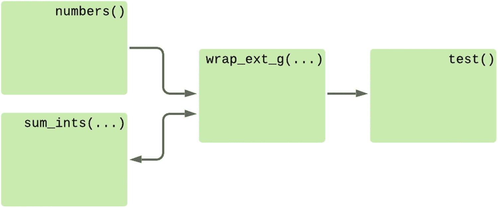

# 十二、回调和数据分析

在过去的 11 章中，我们已经编写了两个实用程序来从各种来源收集数据并将它们聚合在一起。我们设计了用于显示汇总数据、从错误状况中恢复以及使最终用户能够根据自己的需求定制流程的每一步的系统。然而，与这些数据交互的唯一方式是在屏幕上查看。没有功能可以在数据到来时主动分析数据并做出相应的反应。

在最后一章中，我们将向聚合过程添加一个新概念，允许我们构建检测输入数据中特定条件的*触发器*和检测到这些条件时运行的*动作*。一些潜在有用的是数据的阈值点(如温度高于 18°C，太阳能电池板输出高于 0.5 kW，或 RAM 低于 500MB)。可选地，在两个传感器之间存在相关性，例如一个传感器上的温度与另一个传感器的温度相差超过阈值，或者跨时间的相关性，例如太阳能功率明显多于或少于前一天。

## 生成器数据流

到目前为止，我们编写的所有分析代码都是被动的；它介于数据源和消费者之间，并在消费者获取数据时修改数据。这些功能都是一个`for`循环的变体；它们迭代源数据，并可能产生输出。生成器是重构输入和输出都是可迭代的循环的一种很好的方式。

同样的代码可以用几种不同的方式来表达，如理解、修改共享变量的循环或生成函数。例如，我们从 DataPoint 对象获取值的`clean_passthrough(...)`函数是一个生成器函数，如清单 [12-1](#PC1) 所示。

```py
async def clean_passthrough(
    datapoints: t.AsyncIterator[DataPoint],
) -> CLEANED_DT_FLOAT:
    async for datapoint in datapoints:
        if datapoint.data is None:
            continue
        else:
            yield datapoint.collected_at, datapoint.data

Listing 12-1The passthrough cleaner generator function

```

我们可以通过使用`values = [value async for value in clean_passthrough(datapoints)]`将数据点的异步迭代器转换成日期和值对的列表。

同样的逻辑可以直接表达为列表理解或操作列表对象的循环。这些在表 [12-1](#Tab1) 中显示为两种实现。

表 12-1

同一逻辑的理解和循环实现

<colgroup><col class="tcol1 align-left"> <col class="tcol2 align-left"></colgroup> 
| `cleaned = [``(datapoint.collected_at, datapoint.data)``async for datapoint in datapoints``if datapoint.data``]` | `results = []``async for datapoint in datapoints:``if datapoint.data is None:``continue``else:``results.append(``datapoint.collected_at, datapoint.data``)` |

关键的区别在于，通过使用生成器函数，我们可以通过函数的名称来引用循环的逻辑。对于理解和标准循环，我们总是根据我们正在处理的数据来定义逻辑。正是这个属性使得 generator 函数成为我们的最佳选择，因为我们需要将对逻辑的引用传递给`Config`对象的构造函数，而无需提取任何数据。

在任何情况下，我们写的更复杂的函数都不能被理解。它们需要变量来跟踪状态并有条件地执行不同的操作。任何理解都可以重写为生成函数， <sup>[1](#Fn1)</sup> 但并不是所有的生成函数都可以重写为理解。如果你的理解变得过于复杂，你应该考虑将它重构为一个 for 循环或者一个生成器函数。

### 消耗自身输出的发电机

到目前为止，我们看到的生成器函数模拟了一个`for`循环。它们有一个数据源作为参数，可以被迭代。生成器函数实现循环的逻辑，函数用它想要处理的源数据调用它。这看起来像清单 [12-2](#PC2) ，它显示了一个简单的生成器函数，用于对一些数字求和。

```py
import typing as t

def sum_ints(source: t.Iterable[int]) -> t.Iterator[int]:
    """Yields a running total from the underlying iterator"""
    total = 0
    for num in source:
        total += num
        yield total

def numbers() -> t.Iterator[int]:
    yield 1
    yield 1
    yield 1

def test():
    sums = sum_ints(numbers())
    assert [a for a in sums] == [1, 2, 3]

Listing 12-2Generator to sum numbers

```

在这个例子中，`numbers()`函数用于提供整数的迭代器，而`sum_ints(...)`函数接受任何整数的迭代器并将它们相加。尽管`test()`函数负责调用这两个函数并将它们连接在一起，但它只迭代`sum_ints(...)`的输出。是`sum_ints(...)`迭代`numbers()`的输出，而不是`test()`。这样，数据从`numbers()`函数流向`sum_ints(...)`函数再流向`test()`函数，如图 [12-1](#Fig1) 所示。


图 12-1

迭代器链的数据流行为

尽管我们可以将任意的 iterable 传递给一个函数进行迭代，但有时我们希望对下一个要处理的数据有更明确的控制。用这种消费生成器的模式最难表达的事情之一是用一个初始值启动一个生成器，然后将它自己的输出作为输入反馈回来(图 [12-2](#Fig2) )。


图 12-2

一个迭代器，用初始值处理自己的输出

任何时候我们想要一个生成器来处理自己的输出，我们都必须对它进行编码，而不是使用输入迭代器作为数据源，如清单 [12-3](#PC3) 所示。这防止了它被用于除了它自己的输出之外的任何方式。

```py
import itertools
import typing as t

def sum_ints(start: int) -> t.Iterator[int]:
    """Yields a running total with a given start value"""
    total = start
    while True:
        yield total
        total += total

def test():
    sums = sum_ints(1)
    # Limit an infinite iterator to the first 3 items
    # itertools.islice(iterable, [start,] stop, [step])
    sums = itertools.islice(sums, 3)
    assert [a for a in sums] == [1, 2, 4]

Listing 12-3A variant that has only a single start value, then processes its output

```

有一些真实的用例希望编写既可以在输入流上工作也可以在自己的输出上工作的函数。任何以与输入相同的输出格式返回数据的函数都可以这样写，但是迭代地*改进*它们的输入的函数是一个很好的选择。

例如，如果我们有一个函数，通过将图像的大小重新调整为其输入大小的 50%来减小图像的大小，我们可以编写一个生成器函数，在给定一个可迭代的图像的情况下，返回一个已调整大小的图像的迭代器。或者，如果我们可以在它自己的输出上使用相同的生成器，我们可以提供一个输入图像，并得到一个相同的初始图像的逐渐变小版本的生成器。

我们定义的新函数不能再像我们最初想要的那样用来添加任意的整数。让`sum_ints(...)`函数既能处理自己的输出又能处理任意可迭代对象的一种方法是定义一个新的迭代器，它使用闭包在使用生成器的代码和它的函数之间共享状态。

我们可以创建一个返回两个迭代器的函数，一个委托给`sum_ints(...)`迭代器并保存最新值的副本，另一个迭代器用作`sum_ints(...)`的输入，它使用第一个函数的共享值。 <sup>[2](#Fn2)</sup> 该包装函数的数据流如图 [12-3](#Fig3) 所示。


图 12-3

使用包装函数生成迭代器的数据流，迭代器在自己的输出上工作

清单 [12-4](#PC4) 展示了编写这个包装函数的一种方法。`get_wrap_feedback_pair(...)`函数提供了两个生成器，它们在`test()`方法中被用来创建一个版本的`sum_ints(...)`,它有一个已知的初始值，将自己的输出作为输入返回。

```py
import itertools
import typing as t

def sum_ints(source: t.Iterable[int]) -> t.Iterator[int]:
    """Yields a running total from the underlying iterator"""
    total = 0
    for num in source:
        total += num
        yield total

def get_wrap_feedback_pair(initial=None):  # get_w_f_p(...) above
    """Return a pair of external and internal wrap functions"""
    shared_state = initial
    # Note, feedback() and wrap(...) functions assume that
    # they are always in sync
    def feedback():
        while True:
            """Yield the last value of the wrapped iterator"""
            yield shared_state
    def wrap(wrapped):
        """Iterate over an iterable and stash each value"""
        nonlocal shared_state
        for item in wrapped:
            shared_state = item
            yield item
    return feedback, wrap

def test():
    feedback, wrap = get_wrap_feedback_pair(1)
    # Sum the iterable (1, ...) where ... is the results
    # of that iterable, stored with the wrap method
    sums = wrap(sum_ints(feedback()))
    # Limit to 3 items
    sums = itertools.islice(sums, 3)
    assert [a for a in sums] == [1, 2, 4]

Listing 12-4Helper function to feed a generator’s output back as input

```

现在,`sum_ints(...)`函数表示应用于循环每一步的逻辑，而`get_wrap_feedback_pair(...)`编码了生成器的输出和它应该处理的下一个值之间的关系。例如，如果我们想基于输出结果进行数据库查询，并使用它来提供下一个值，我们就需要设计一个新的`get_wrap_feedback_pair(...)`变体，对输入和输出之间的新关系进行编码。

这种方法让我们更接近于能够从调用函数动态地控制迭代器中的数据流，但是它仍然是有限的。如果我们只想要一个关系，它工作得非常好，但是由于代码是自包含的，调用函数(`test()`，在我们的例子中)不能影响行为。它依赖包装函数来实现适当的逻辑。

### 增强型发电机

另一种方法是改变生成器的行为，使用“增强的生成器”语法。 <sup>[3](#Fn3)</sup> 这允许数据在每次生成一个项目时被发送到正在运行的生成器中。它仍然相当有限，因为您不能发送比产生的更多的数据，但它确实允许一种更具表现力的定制行为的方式。

到目前为止，我们一直将`yield`视为 return 语句的替代，但是`yield`表达式解析为一个可以存储在变量中的值，如`received = yield to_send`。在正常操作下，`received`值始终为`None`，但是可以通过使用`send(...)`方法推进发生器来改变。这种模式允许生成器函数在每次前进时遍历调用者显式提供的数据。

Enhanced Asynchronous Generators

使用异步生成器对象上的`asend(...)`协程，相同的执行模型可用于在本地协程中实现的迭代器。除了必须等待之外，这与`send(...)`方法的行为方式相同。这是需要的，因为异步迭代器在产生新对象时会阻塞，而`asend(...)`和`send(...)`调用都是请求新对象的特例。

除非底层生成器处于收益状态，否则可能不会等待`asend(...)`结果。这个调用不涉及同步，所以不能安全地并行调度多个调用。在对同一个生成器发出另一个调用之前，您必须一直等待一个`asend(...)`调用的结果。因此，很少将此作为一项任务来安排。

没有下一个(...)使发电机前进一位的方法。虽然您可以手动使用`await gen.__anext__()`，但是我建议您使用 await `gen.asend(None)`在循环之外推进异步迭代器。

清单 [12-5](#PC5) 显示了一个整数求和函数的例子，它从 yield 语句返回值而不是输入 iterable 中接收数据。

```py
import typing as t

def sum_ints() -> t.Generator[int, int, None]:
    """Yields a running total from the underlying iterator"""
    total = 0
    num = yield total
    while True:
        total += num
        num = yield total

def test():
    # Sum the iterable (1, ...) where ... is the results
    # of that iterable, stored with the wrap method
    sums = sum_ints()
    next(sums)  # We can only send to yield lines, so advance to the first
    last = 1
    result = []
    for n in range(3):
        last = sums.send(last)
        result.append(last)
    assert result == [1, 2, 4]

test()

Listing 12-5Sending data to an in-progress generator

```

Note

发电机的类型定义已从`t.Iterable[int]`更改为`t.Generator[int, int, None]`。前者相当于 t.Generator[int，None，None]，意思是它产生`int` s，但是它期望被发送`None`并返回`None`作为它的最终值。

在这种情况下，如图 [12-4](#Fig4) 所示的控制流程要简单得多。这两个函数之间自由传递数据，而不是数据只在一个方向流动，或者通过中间函数循环流动。


图 12-4

使用增强的生成器方法控制流

增强的生成器函数对循环体进行编码，就像标准生成器一样，但是它们更接近于`while`循环而不是`for`循环的行为。它不是对一些输入数据进行循环，而是对一个条件进行循环，并在循环过程中接收中间值。

这种方法非常适合有状态函数需要外部指令的情况，比如图像操作。图像编辑增强生成器可以将初始图像作为其输入，然后执行诸如“调整大小”、“旋转”、“裁剪”等命令。命令可以是硬编码的；它们可能来自用户输入或者来自对它输出的最后一个版本的分析。

#### 使用类

增强的生成器可以使用从 yield 语句中获得的值作为下一个要处理的数据，或者作为一个指令来改变它们正在做的事情，或者它们可以混合使用这两者。

用各种指令多次调用并且在调用之间共享状态的代码通常作为一个类来实现。在这种情况下，实例负责存储状态，该类的用户调用不同的方法来通知需要什么代码路径。

任何使用这种方法的代码看起来都比增强的生成器语法更自然。例如，清单 [12-6](#PC6) 显示了表示为一个类的相同平均值计算行为。

```py
class MeanFinder:
    def __init__(self):
        self.running_total = 0
        self.num_items = 0

    def add_item(self, num: float):
        self.running_total += num
        self.num_items += 1

    @property
    def mean(self):
        return self.running_total / self.num_items

def test():
    # Recursive mean from initial data
    mean = MeanFinder()
    to_add = 1
    for n in range(3):

        mean.add_item(to_add)
        to_add = mean.mean
    assert mean.mean == 1.0

    # Mean of a concrete data list
    mean = MeanFinder()
    for to_add in [1, 2, 3]:
        mean.add_item(to_add)
    assert mean.mean == 2.0

Listing 12-6Class-based approach for long-running sets of asynchronous code

```

这种方法特别适合于希望在多个相似的函数之间共享代码的情况，因为类可以被子类化，每个实现可以覆盖单独的方法。然而，开发人员期望类比增强的生成器更少有状态。在事先知道需要多少参数和什么类型的情况下调用对象上的方法是正常的。增强的生成器允许开发人员编写程序，其中接收函数决定从调用函数请求什么数据。这非常适合生成器表示用于整理多段数据并保留中间结果的算法的情况。 <sup>[4](#Fn4)</sup>

#### 使用增强的生成器包装可迭代对象

由于`yield`的结果，我们的增强生成器改变了控制流以期望新的项目，所以我们不能使用增强生成器来代替标准生成器。该方法可用于创建与其调用函数协同工作来处理数据的函数，但它不再可用作另一个 iterable 的简单包装。

为了解决这个问题，我们可以编写一个包装函数，将增强生成器的签名转换为标准生成器函数的签名。然后，我们可以在需要交互控制行为的情况下使用增强的生成器，当我们有一个可迭代输入时使用包装的生成器，如清单 [12-7](#PC7) 所示。

```py
import typing as t

input_type = t.TypeVar("input_type")
output_type = t.TypeVar("output_type")

def wrap_enhanced_generator(
    input_generator: t.Callable[[], t.Generator[output_type, input_type, None]]
) -> t.Callable[[t.Iterable[input_type]], t.Iterator[output_type]]:
    underlying = input_generator()
    next(underlying)  # Advance the underlying generator to the first yield

    def inner(data: t.Iterable[input_type]) -> t.Iterator[output_type]:
        for item in data:
            yield underlying.send(item)

    return inner

def sum_ints() -> t.Generator[int, int, None]:
    """Yields a running total from the underlying iterator"""
    total = 0
    num = yield total
    while True:
        total += num
        num = yield total

def numbers() -> t.Iterator[int]:
    yield 1
    yield 1
    yield 1

def test() -> None:
    # Start with 1, feed output back in, limit to 3 items
    recursive_sum = sum_ints()
    next(recursive_sum)
    result = []
    last = 1
    for i in range(3):
        last = recursive_sum.send(last)
        result.append(last)
    assert result == [1, 2, 4]

    # Add 3 items from a standard iterable
    simple_sum = wrap_enhanced_generator(sum_ints)
    result_iter = simple_sum(numbers())
    assert [a for a in result_iter] == [1, 2, 3]

Listing 12-7An enhanced generator that can be used as a standard generator

```

这种方法允许我们定义一个增强的生成器函数来定义流程中单个步骤的逻辑，然后使用该逻辑作为迭代器的包装器或者处理它自己的输出。图 [12-5](#Fig5) 显示了循环输入迭代时使用的数据流。



图 12-5

包裹增强生成器的控制流

#### 重构返回值过多的函数

任何增强的生成器也可以写成一系列函数，只要每次调用都传递所有必需的中间值。所有需要参数的函数都在有效地共享状态，只是以一种比通常更明确的方式。

复杂的程序结构不太适合这种习惯用法，所以我不建议重写一个增强的生成器来使用协程。如果您在一个循环中看到一组函数，其中一个函数的返回值被立即传递给另一个函数调用，而没有被使用，那么这可能是重构的一个很好的候选。

清单 [12-8](#PC8) 演示了一对函数来计算一系列数字的平均值。`mean_ints_split_initial()`函数提供了一些初始值，调用函数将这些初始值和要添加的新数字一起传递给`mean_ints_split(...)`。`mean_ints_split(...)`函数接受三个参数并返回两个值，但是调用函数只关心一个参数和一个值。

```py
import typing as t

def mean_ints_split_initial() -> t.Tuple[float, int]:
    return 0.0, 0

def mean_ints_split(
    to_add: float, current_mean: float, num_items: int
) -> t.Tuple[float, int]:
    running_total = current_mean * num_items
    running_total += to_add
    num_items += 1
    current_mean = running_total / num_items
    return current_mean, num_items

def test():
    # Recursive mean from initial data
    to_add, current_mean, num_items = mean_ints_split_initial()
    for n in range(3):
        current_mean, num_items = mean_ints_split(to_add, current_mean, num_items)
        to_add = current_mean
    assert current_mean == 1.0
    assert num_items == 3

    # Mean of concrete data list
    current_mean = num_items = 0
    for to_add in [1, 2, 3]:
        current_mean, num_items = mean_ints_split(to_add, current_mean, num_items)
    assert current_mean == 2.0
    assert num_items == 3

Listing 12-8Code to find the average of some numbers expressed as bare functions

```

这里传递的`num_items`值只与`mean_ints_split(...)`的实现相关；对调用函数没用。如果开发人员可以实例化一个新的均值计算，然后传入数字并访问修改后的均值，而不需要每次都传递额外的上下文数据，那么 API 会更加简单。这是增强生成器的另一个好用途，代码如清单 [12-9](#PC9) 所示。

```py
import typing as t

def mean_ints() -> t.Generator[t.Optional[float], float, None]:
    running_total = 0.0
    num_items = 0
    to_add = yield None
    while True:
        running_total += to_add
        num_items += 1
        to_add = yield running_total / num_items

def test():
    # Recursive mean from initial data
    mean = mean_ints()
    next(mean)
    to_add = 1
    for n in range(3):
        current_mean = mean.send(to_add)
        to_add = current_mean
    assert current_mean == 1.0

    # Mean of a concrete data list
    # wrap_enhanced_generator would also work here
    mean = mean_ints()
    next(mean)
    for to_add in [1, 2, 3]:
        current_mean = mean.send(to_add)
    assert current_mean == 2.0

Listing 12-9Simplified mean calculation using an enhanced generator

```

如果您发现自己有一个被多次调用的协程，并且每次都被传递上一次调用的结果，那么它就非常适合于增强的生成器。

### 行列

到目前为止，我们看到的所有方法都假设不需要将数据从多个来源推送到迭代器。如前所述，如果另一个线程或任务试图在数据准备好之前发送数据，生成器会引发异常，这需要使用复杂的锁来防止。同样，我们不能向生成器发送数据，除非我们也提取一段数据。如果多个函数试图*发送*数据，那么它们必然也是*提取*数据，并且需要协调以确保正确的函数获得任何预期供其使用的数据。

更好的方法是使用一个`Queue`对象。在关于线程化的章节中，我们将这些作为将工作传递给线程的解决方案，但是 asyncio 模块提供了一个`Queue`实现，它以类似的方式为异步 Python 工作。具体来说，任何可以阻塞标准队列中线程的方法都适用于 asyncio 队列。清单 [12-10](#PC10) 展示了使用队列的`sum_ints(...)`函数的实现。

```py
import asyncio
import itertools
import typing as t

async def sum_ints(data: asyncio.Queue) -> t.AsyncIterator[int]:
    """Yields a running total a queue, until a None is found"""
    total = 0
    while True:
        num = await data.get()
        if num is None:
            data.task_done()
            break
        total += num
        data.task_done()
        yield total

def numbers() -> t.Iterator[int]:
    yield 1
    yield 1
    yield 1

async def test():
    # Start with 1, feed output back in, limit to 3 items
    data = asyncio.Queue()
    sums = sum_ints(data)

    # Send the initial value
    await data.put(1)
    result = []
    async for last in sums:
        if len(result) == 3:
            # Stop the summer at 3 items
            await data.put(None)
        else:
            # Send the last value retrieved back
            await data.put(last)
            result.append(last)
    assert result == [1, 2, 4]

    # Add 3 items from a standard iterable
    data = asyncio.Queue()
    sums = sum_ints(data)

    for number in numbers():
        await data.put(number)
    await data.put(None)
    result = [value async for value in sums]
    assert result == [1, 2, 3]

Listing 12-10Sending work to a coroutine with a queue

```

这种队列方法非常类似于使用一对包装函数的方法，如果我们比较图 [12-3](#Fig3) 和 [12-6](#Fig6) 就可以看出这一点。主要区别在于添加到队列中的值完全由包含的`test()`函数决定。


图 12-6

使用队列时的执行流

队列纯粹是数据的管道；对于数据应该来自哪里，它没有特定于应用的逻辑。对于基于线程的队列使用，我推荐使用一个 sentinel 值 <sup>[5](#Fn5)</sup> 来告诉协程何时结束，因为这样更容易清理迭代器。

### 选择控制流

我很少使用增强的生成器方法，因为通常有一些方法可以用更常用的 Python 控制结构来解决这个问题，比如类和队列。我发现这一点更清楚，但增强的生成器非常值得了解，以防您遇到特别适合它们的问题。

图 [12-7](#Fig7) 中的决策树图示了我决定使用什么结构的过程。与本书中的其他决策树不同，这种选择很大程度上取决于美学和可读性。该图表将帮助您找到自然的匹配，但是您很可能会做出不同的决定，因为您认为这将提高可维护性。


图 12-7

不同控制流的决策树

## 我们行动的结构

我们需要为触发器和动作选择一种传递数据的方法。动作事先没有可用的数据，而是通过单个调用函数传递数据。我们将把它们实现为具有处理特定点的方法的类。

触发器更难设计。他们可能需要在数据点检查之间存储状态。我们希望从数据库中加载数据，所以我们可以创建一个异步迭代器，它执行数据库查询并产生结果，每当到达迭代器的末尾时进行更多的数据库查询，直到有更多的数据可用。在这种情况下，我们将提前获得数据，因为我们将有一个迭代器对象，我们相信它包含所有必要的数据。因此，我们选择将触发器实现为一个包装另一个的迭代器。

然而，还有另一个潜在的有用数据源:动作。例如，我们可能有一个触发器对象，它比较“产生的能量”和“使用的能量”来产生一个“购买的能量”值。我们不希望将这个值添加到数据库中，因为它只是另外两个数据点的差，而不是测量值，但是如果它太高或异常高，我们可能希望创建警报。

我们可以编写`PowerUsedTooHigh`和`PowerUsedHigherThanUsual`触发器，但是这些会非常具体，并且共享许多相同的代码。如果能写一个`DifferenceBetweenSensors`触发器以及`ValueTooHigh`和`ValueHigherThanUsual`助手就更好了。这将允许用户用任何一对传感器组成逻辑，但我们需要一种方法将`DifferenceBetweenSensors`的输出发送到`ValueTooHigh`和`ValueHigherThanUsual`堆栈。

如果数据点可以来自数据库或动作的行为，那么我们不能认为数据源是预先可用的，必须在决策树的第一个问题上采取右边的路径。数据源是将整理后的数据传递给触发器的函数，这意味着我们应该遵循左边的路径。因此，触发器将作为类来实现。

最后，我们希望允许用户将触发器和动作组合到管道中。像触发器一样，这些对象没有预先可用的数据，但与触发器不同，它们从多个地方接收数据。这个功能负责接收来自数据库的数据和来自操作的数据，所以它是基于队列的。

总之，我们的分析代码有`Action`、`Trigger`和`DataProcessor`、`Action`和`Trigger`都是从单个位置传递的数据，所以它们都被实现为类。可以从多个来源接收数据，并负责将其传递给触发器和动作，因此它们使用队列来接收数据。

### 分析协程

为了允许用户动态地编写动作和触发器，我们提供了一个代表已配置管道的`DataProcessor`类(清单 [12-11](#PC11) )。该类负责为该流程的所有数据设置输入队列，并为启动各种所需任务提供一个更简单的 API。

```py
@dataclasses.dataclass
class DataProcessor:
    name: str
    action: Action
    trigger: Trigger[t.Any]

    def __post_init__(self):
        self._input: t.Optional[asyncio.Queue[DataPoint]] = None
        self._sub_tasks: t.Set = set()

    async def start(self) -> None:
        self._input = asyncio.Queue()
        self._task = asyncio.create_task(self.process(), name=f"{self.name}_process")
        await asyncio.gather(self.action.start(), self.trigger.start())

    @property
    def input(self) -> asyncio.Queue[DataPoint]:
        if self._input is None:
            raise RuntimeError(f"{self}.start() was not awaited")
        if self._task.done():
            raise RuntimeError("Processing has stopped") from (self._task.exception())
        return self._input

    async def idle(self) -> None:
        await self.input.join()

    async def end(self) -> None:
        self._task.cancel()

    async def push(self, obj: DataPoint) -> None:
        return await self.input.put(obj)

    async def process(self) -> None:
        while True:
            data = await self.input.get()
            try:
                processed = await self.trigger.handle(data)
            except ValueError:
                continue
            else:
                action_taken = await self.action.handle(processed)
            finally:
                self.input.task_done()

Listing 12-11A class to represent a configured trigger and action pair

```

`idle()`方法委托给队列的`join()`方法，该方法一直阻塞，直到`task_done()`被调用的次数与等待`get()`的次数相同。因此，`await processor.idle()`会阻塞，直到没有项目等待处理。这种方法对于编写测试代码特别有用，因为它允许我们在开始断言预期的动作被执行之前，确保处理器已经完成处理。

在原始数据源与触发器和操作之间添加一个队列，使我们能够保证数据总是按顺序处理，并且故障不会阻碍其他任务接收数据的能力。我们只能以最慢的触发器处理数据的速度将数据输入到一组触发器中，除非我们允许它们积累大量数据进行处理。

允许积压工作建立的问题是，我们会发现自己使用越来越多的内存来存储较慢任务的任务。`idle()`方法在这里可能很有用，因为它允许我们定期阻塞接收协程，所以积压只能暂时累积，必须在接收更多数据之前清除。或者，我们可以为输入队列定义一个最大长度，当单个传感器的积压太长时，它会暂时停止接收。

有了数据处理器，我们还可以定义触发器和动作组件的基类来匹配它的行为，如清单 [12-12](#PC12) 所示。

```py
import typing as t

from ..typing import T_value
from ..database import DataPoint
from ..exceptions import NoDataForTrigger

class Trigger(t.Generic[T_value]):
    name: str

    async def start(self) -> None:
        """ Coroutine to do any initial setup """
        return

    async def match(self, datapoint: DataPoint) -> bool:
        """ Return True if the datapoint is of interest to this
        trigger.
        This is an optional method, called by the default implementation
        of handle(...)."""
        raise NotImplementedError

    async def extract(self, datapoint: DataPoint) -> T_value:
        """ Return the value that this datapoint implies for this trigger,
        or raise NoDataForTrigger if no value is appropriate.
        Can also raise IncompatibleTriggerError if the value is not readable.

        This is an optional method, called by the default implementation
        of handle(...).
        """
        raise NotImplementedError

    async def handle(self, datapoint: DataPoint) -> t.Optional[DataPoint]:
        """Given a data point, optionally return a datapoint that
        represents the value of this trigger. Will delegate to the
        match(...) and extract(...) functions."""
        if not await self.match(datapoint):
            # This data point isn't relevant
            return None

        try:
            value = await self.extract

(datapoint)
        except NoDataForTrigger:
            # There was no value for this point
            return None

        return DataPoint(
            sensor_name=self.name,
            data=value,
            deployment_id=datapoint.deployment_id,
            collected_at=datapoint.collected_at,
        )

class Action:
    async def start(self) -> None:
        return

    async def handle(self, datapoint: DataPoint):
        raise NotImplementedError

Listing 12-12Base classes for the Trigger and Action components

```

这两个对象有一个允许初始启动动作的`start()`协程和一个接受并处理`DataPoint`对象的`handle(...)`方法。在`Trigger`的情况下，handle(…)方法检查传递的数据点是否与触发器相关，如果是，它返回一个新的数据点，数据由`extract(...)`方法指定。对于一个`Action`，`handle(...)`协程返回一个布尔值，表示是否采取了一个动作。它还具有特定于处理程序的副作用，例如数据库访问。

要创建的一个好的第一个触发器是将一个`DataPoint`的值与一个阈值进行比较，如清单 [12-13](#PC13) 所示。例如，这可以用来发现过高的温度。由于`ValueThresholdTrigger`类是一个相当复杂的类，接受许多参数，所以数据类功能对于确保它有适当的标准方法是有用的，比如`__init__(...)`。

```py
import dataclasses
import typing as t
import uuid

from ..database import DataPoint
from ..exceptions import IncompatibleTriggerError
from .base import Trigger

@dataclasses.dataclass(frozen=True)
class ValueThresholdTrigger(Trigger[bool]):
    name: str
    threshold: float
    comparator: t.Callable[[float, float], bool]
    sensor_name: str
    deployment_id: t.Optional[uuid.UUID] = dataclasses.field(default=None)

    async def match(self, datapoint: DataPoint) -> bool:
        if datapoint.sensor_name != self.sensor_name:
            return False
        elif (self.deployment_id and datapoint.deployment_id != self.deployment_id):
            return False
        return True

    async def extract(self, datapoint: DataPoint) -> bool:
        if datapoint.data is None:
            raise IncompatibleTriggerError("Datapoint does not contain data")
        elif isinstance(datapoint.data, float):
            value = datapoint.data
        elif (isinstance(datapoint.data, dict) and "magnitude" in datapoint.data):
            value = datapoint.data["magnitude"]
        else:
            raise IncompatibleTriggerError("Unrecognised data format")
        return self.comparator(value, self.threshold)  # type: ignore

Listing 12-13A trigger to check for a value having a certain relationship to a prespecified value

```

控制阈值检查的两个参数是`comparator=`和`threshold=`参数。`threshold`是一个浮点数，`comparator=`是一个接受两个浮点数并返回一个布尔值的函数。

有效比较器的一个例子是`lambda x, y: x > y`，但是在`operator`模块中有一些内置的标准比较版本。 <sup>[6](#Fn6)</sup> 设定`comparator=operator.gt`可能更露骨一点，我更喜欢。你应该使用任何你觉得更自然的风格。

我们还需要至少一个基本的`Action`实现，最简单有用的一个是调用 webhook 通知外部服务温度过高的动作。清单 [12-14](#PC14) 显示了这方面的实现。

```py
@dataclasses.dataclass
class WebhookAction(Action):
    """An action that runs a webhook"""
    uri: str

    async def start(self) -> None:
        return

    async def handle(self, datapoint: DataPoint) -> bool:
        async with aiohttp.ClientSession() as http:
            async with http.post(
                self.uri,
                json={
                    "value1": datapoint.sensor_name,
                    "value2": str(datapoint.data),
                    "value3": datapoint.deployment_id.hex,
                },
            ) as request:
                logger.info(
                    f"Made webhook request for {datapoint} with status " f"{request.status}"
                )
                return request.status == 200

Listing 12-14An action that calls a webhook, using the format expected by the IFTTT service

```

另一个有用的操作是记录发送的任何数据点。虽然这对于生产没有太大的帮助，但是作为调试管道的一种方式，它是无价的。这让我们可以看到工具在终端中正在做什么；实现它的代码在清单 [12-15](#PC15) 中。

```py
class LoggingAction(Action):
    """An action that stores any generated data points back to the DB"""

    async def start(self) -> None:
        return

    async def handle(self, datapoint: DataPoint) -> bool:
        logger.warn(datapoint)
        return True

Listing 12-15Action handler that logs to the standard error stream

```

本章附带的代码包括一些额外的触发器和动作，在您阅读本文时,`apd.aggregation`的发布版本可能会包括更多。

### 摄取数据

我们希望运行许多并发的触发器和动作集，所以我们将使用一个长时间运行的协程作为多个子任务的控制器。这个协程管理触发器和动作的设置，并将数据交给每个子任务。

长时间运行的协程的行为与长时间运行的线程有很大不同，尤其是在它们如何终止方面。当我们查看长时间运行的线程时，我们需要创建一种方法来指示线程，不再有数据需要它处理，它应该结束了。增强型迭代器也是如此，我们对基于队列的协程和函数使用了相同的模式，其中发送一个 sentinel 值是停止处理任务的唯一方式。

作为任务调度的协程使这变得更容易，因为它们有一个`cancel()`方法。`cancel()`方法允许开发人员停止一个任务，而不需要添加一个方法来要求它自己停止。这对于协程长时间运行的系统设计特别有用，因为它允许我们干净地关闭程序中不再需要的部分。协程已经启动的任何任务也会被取消，除非它们在第一次创建时用`asyncio.shield(...)`包装。还可以使用 try/finally 块编写一个协程，它可以干净地从请求的取消中关闭。取消是通过在协程代码中引发一个`CancelledError`异常来实现的，这个异常可以被捕获，终结代码在结束前运行。

现在有了初始行为集的处理程序，但是我们需要一种方法将数据推入这个过程。我们已经有了一个从数据库加载数据并异步迭代的函数；我们可以通过将它放在一个无限循环中来补充这一点，一旦第一次迭代结束，这个无限循环就会搜索任何额外的数据，如清单 [12-16](#PC16) 所示。

```py
import asyncio

from apd.aggregation.query import db_session_var, get_data

async def get_data_ongoing(*args, **kwargs):
    last_id = 0
    db_session = db_session_var.get()
    while True:
        # Run a timer for 300 seconds concurrently with our work
        minimum_loop_timer = asyncio.create_task(asyncio.sleep(300))
        async for datapoint in get_data(*args, **kwargs):
            if datapoint.id > last_id:
                # This is the newest datapoint we have handled so far
                last_id = datapoint.id
            yield datapoint
            # Next time, find only data points later than the latest we've # seen
            kwargs["inserted_after_record_id"] = last_id
        # Commit the DB to store any work that was done in this loop and
        # ensure that any isolation level issues do not prevent loading more
        # data
        db_session.commit()
        # Wait for that timer to complete. If our loop took over 5 minutes
        # this will complete immediately, otherwise it will block
        await minimum_loop_timer

Listing 12-16A version of get_data(...) that may block for new data while iterating

```

Tip

这使用了 asyncio.sleep(...)以确保循环迭代之间的最小时间。如果我们在循环结束时直接等待 asyncio.sleep(300 ),那么迭代之间至少会有 300 秒，但也可能更多。在循环开始时将此任务委托给一个任务，然后等待任务完成，这意味着我们的 300 秒等待与循环体中执行的生产性工作并行运行。通过对当前时间进行算术运算来计算每次循环迭代所需的延迟，可以获得相同的效果，但这要清楚得多。

这里的实现在每个数据库查询之间有一个静态延迟。这不是最有效的方法，因为它在数据检查之间引入了一个固定的周期，因此可能需要 5 分钟才能获得新数据。我们可以减少迭代之间的时间，但这意味着相应地增加了数据库服务器的负载。这种方法称为短轮询，因为它定期发出一个短请求来检查更多数据。长轮询更有效，因为它涉及到直到有数据可用时才完成的请求，但是它要求后端和接口库支持它。短轮询是最兼容的方法，因此在没有证据表明它太低效的情况下，它是一个很好的默认方法。

Postgres Pubsub

如果我们使用一个提供 pubsub， <sup>[7](#Fn7)</sup> 的数据库，我们可以完全避免轮询，并重新编写它来监听数据聚合过程发送的通知主题。

PostgreSQL pubsub 功能是通过 LISTEN 和 NOTIFY 命令启用的。SQLAlchemy 并没有紧密集成这个功能，但是底层的连接库支持它，所以如果它对我们有用，我们可以利用它。

如果连接的数据库是 PostgreSQL，我们将首先修改 CLI 以在添加新数据后发送通知:

```py
    if "postgresql" in db_uri:
        # On Postgres sent a pubsub notification, in case other processes are
        # waiting for this data
        Session.execute("NOTIFY apd_aggregation;")

```

接下来，我们将创建一个替代的`get_data_ongoing(...)`实现来寻找通知。该函数必须调用`Session.execute("LISTEN apd_aggregation;")`来确保连接正在接收相关主题的通知。

因为我们没有使用完全异步的 PostgreSQL 库，所以我们不能只`await`一个通知，所以我们必须创建一个合适的 shim 函数，处理从数据库连接读取通知。

```py
async def wait_for_notify(loop, raw_connection):
    waiting = True
    while waiting:
        # The database connection isn't asynchronous, poll in a new thread
        # to make sure we've received any notifications
        await loop.run_in_executor(None, raw_connection.poll)
        while raw_connection.notifies:
            # End the loop after clearing out all pending
            # notifications
            waiting = False
            raw_connection.notifies.pop()
        if waiting:
            # If we had no notifications wait 15 seconds then
            # re-check
            await asyncio.sleep(15)

```

这仍然需要主动检查数据库状态，但是`poll()`函数不进行数据库查询，所以它是一个轻量级得多的解决方案。数据库负载的减少使得将检查间隔时间从几分钟减少到几秒钟变得更加高效。

### 运行分析流程

完成这个特性的最后一个部分是编写一个新的命令行实用程序来运行处理。这个实用程序负责建立数据库连接，加载用户的配置，将用户定义的处理程序连接到数据库的信息提要，然后启动长期运行的协程。

清单 [12-17](#PC19) 显示了一个新的 click 命令，它获取一个基于 python 的配置文件和一个数据库连接字符串的路径，并执行该文件中的所有数据处理器。

```py
import asyncio
import importlib.util
import logging
import typing as t

import click

from .actions.runner import DataProcessor
from .actions.source import get_data_ongoing
from .query import with_database

logger = logging.getLogger(__name__)

def load_handler_config(path: str) -> t.List[DataProcessor]:
    # Create a module called user_config backed by the file specified, and # load it
    # This uses Python's import internals to fake a module in a known # location
    # Based on an StackOverflow answer by Sebastian Rittau and sample code
    # from Brett Cannon
    module_spec = importlib.util.spec_from_file_location("user_config", path)
    module = importlib.util.module_from_spec(module_spec)
    module_spec.loader.exec_module(module)
    return module.handlers

@click.command()
@click.argument("config", nargs=1)
@click.option(
    "--db",
    metavar="<CONNECTION_STRING>",
    default="postgresql+psycopg2://localhost/apd",
    help="The connection string to a PostgreSQL database",
    envvar="APD_DB_URI",

)
@click.option("-v", "--verbose", is_flag=True, help="Enables verbose mode")
def run_actions(config: str, db: str, verbose: bool) -> t.Optional[int]:
    """This runs the long-running action processors defined in a config file.

    The configuration file specified should be a Python file that defines a
    list of DataProcessor objects called processors.n
    """
    logging.basicConfig(level=logging.DEBUG if verbose else logging.WARN)

    async def main_loop():
        with with_database(db):
            logger.info("Loading configuration")
            handlers = load_handler_config(config)

            logger.info(f"Configured {len(handlers)} handlers")
            starters = [handler.start() for handler in handlers]
            await asyncio.gather(*starters)

            logger.info(f"Ingesting data")
            data = get_data_ongoing()
            async for datapoint in data:
                for handler in handlers:
                    await handler.push(datapoint)

    asyncio.run(main_loop())
    return True

Listing 12-17Command-line tool to run the management pipeline

```

我们这里使用的配置文件是一个 Python 文件，由`load_handler_config(...)`函数显式加载。该工具的配置包括组合不同的 Python 类、lambda 函数和其他可调用程序，因此它不适合非技术最终用户直接编辑。我们本来可以创建一个提供这些选项的配置文件格式，但是至少现在，基于 Python 的配置已经足够了。清单 [12-18](#PC20) 显示了这个配置文件的一个例子。

```py
import operator

from apd.aggregation.actions.action import (
    OnlyOnChangeActionWrapper,
    LoggingAction,
)
from apd.aggregation.actions.runner import DataProcessor
from apd.aggregation.actions.trigger import ValueThresholdTrigger

handlers = [
    DataProcessor(
        name="TemperatureBelow18",
        action=OnlyOnChangeActionWrapper(LoggingAction()),
        trigger=ValueThresholdTrigger(
            name="TemperatureBelow18",
            threshold=18,
            comparator=operator.lt,
            sensor_name="Temperature",
        ),
    )
] 

Listing 12-18A config file that uses a variety of actions and handlers from the accompanying code

```

## 流程状态

长时间运行的流程可能很难监控。向用户显示此类进程状态的最常见方式是显示进度条，但这只有在我们事先知道要处理的数据量的情况下才有效。我们的系统被特别设计成无限期运行，等待新的数据。即使没有数据等待处理，我们也不是 100%完成，因为我们有理由期待更多的数据即将到来。

更合适的方法是收集正在进行的工作的统计数据，并将它们显示给用户。我们可以跟踪每个数据处理器读取的数据点的总数和它的操作成功处理的总数，以及所用时间的滚动平均值。这三项允许我们生成有用的统计数据(清单 [12-19](#PC21) ),让最终用户很好地了解每个处理程序的效率。

```py
@dataclasses.dataclass
class DataProcessor:
    name: str
    action: Action
    trigger: Trigger[t.Any]

    def __post_init__(self):
        self._input: t.Optional[asyncio.Queue[DataPoint]] = None
        self._sub_tasks: t.Set = set()
        self.last_times = collections.deque(maxlen=10)
        self.total_in = 0
        self.total_out = 0

    async def process(self) -> None:
        while True:
            data = await self.input.get()
            start = time.time()
            self.total_in += 1
            try:
                processed = await self.trigger.handle(data)
            except ValueError:

                continue
            else:
                action_taken = await self.action.handle(processed)
                if action_taken:
                    elapsed = time.time() - start
                    self.total_out += 1
                    self.last_times.append(elapsed)
            finally:
                self.input.task_done()

    def stats(self) -> str:
        if self.last_times:
            avr_time = sum(self.last_times) / len(self.last_times)
        elif self.total_in:
            avr_time = 0
        else:
            return "Not yet started"
        return (
            f"{avr_time:0.3f} seconds per item. {self.total_in} in, "
            f"{self.total_out} out, {self.input.qsize()} waiting."
        )

Listing 12-19A data processor that generates statistics as it’s used

```

确定何时在类 UNIX 系统上显示统计信息的标准方法是注册一个返回信息的信号处理程序。信号是进程被告知各种操作系统事件的方式，例如，当用户按下`<CTRL+c>`时。不是所有的平台都支持相同的信号集，所以通常不同的信号会在不同的操作系统上使用。

对于提供请求统计数据信号的操作系统(称为`SIGINFO`)，我们应该确保程序做出适当的反应。为了实现这一点，我们用一个函数来更新 CLI 工具，以迭代数据处理器并将它们的统计数据输出给用户，如清单 [12-20](#PC22) 所示。

```py
import signal
def stats_signal_handler(sig, frame, data_processors=None):
    for data_processor in data_processors:
        click.echo(
            click.style(data_processor.name, bold=True, fg="red") + " " + data_processor.stats()
        )
    return

signal_handler = functools.partial(stats_signal_handler, data_processors=handlers)
signal.signal(signal.SIGINFO, signal_handler)

Listing 12-20Example of a statistics signal handler

```

使用`signal.signal(...)`函数注册一个信号处理程序，该函数接受一个信号号和一个处理程序。处理程序必须是一个接受两个参数的函数:正在处理的信号和接收信号时正在执行的帧。

Note

信号值是一个整数，但是如果你运行`print(signal.SIGINT)`(例如)，你会看到`Signals.SIGINT`。这是因为它是用一个`Enum`对象实现的。我们在第 [4](04.html) 章中用`IntEnum`创建了返回代码结构，所以这是相当熟悉的。有几个`Enum`的变种可用；最有趣的是`Flag`。这进一步扩展了`Enum`，允许项目的按位组合，比如`Constants.ONE | Constants.TWO`。

`SIGINFO`信号只在基于 BSD Unix 操作系统的操作系统上可用，比如 FreeBSD 和 macOS。 <sup>[8](#Fn8)</sup> 查看程序输出时，按下`<CTRL+t>`键，该键升起。该处理程序拦截兼容操作系统上对`<CTRL+t>`的任何使用，并触发统计数据的显示。在 Linux 系统上，`SIGINFO`不可用，通常使用`SIGUSR1`，可以使用`kill`命令发送:

```py
kill -SIGUSR1 pid

```

这个信号用处不大，因为不可能用组合键生成，但它是一个标准，所以我们也应该支持它。Windows 没有提供请求状态更新的信号，所以我们选择了`<CTRL+c>`处理程序 <sup>[9](#Fn9)</sup> 。`<CTRL+c>`的新行为是在第一次按下它时打印统计数据，然后第二次快速连续按下会导致程序结束。我们将通过创建一个信号处理程序来实现这一点，这个信号处理程序会自动复位，并安排一个任务稍后重新连接这个处理程序(清单 [12-21](#PC24) )。

```py
def stats_signal_handler(sig, frame, original_sigint_handler=None, data_processors=None):
    for data_processor in data_processors:
        click.echo(
            click.style(data_processor.name, bold=True, fg="red") + " " + data_processor.stats()
        )
    if sig == signal.SIGINT:
        click.secho("Press Ctrl+C again to end the process", bold=True)
        handler = signal.getsignal(signal.SIGINT)
        signal.signal(signal.SIGINT, original_sigint_handler)
        asyncio.get_running_loop().call_later(5, install_ctrl_c_signal_handler, handler)
    return

def install_ctrl_c_signal_handler(signal_handler):
    click.secho("Press Ctrl+C to view statistics", bold=True)
    signal.signal(signal.SIGINT, signal_handler)

def install_signal_handlers(running_data_processors):
    original_sigint_handler = signal.getsignal(signal.SIGINT)
    signal_handler = functools.partial(
        stats_signal_handler,
        data_processors=running_data_processors,
        original_sigint_handler=original_sigint_handler,
    )

    for signal_name in "SIGINFO", "SIGUSR1", "SIGINT":
        try:
            signal.signal(signal.Signals[signal_name], signal_handler)
        except KeyError:
            pass

Listing 12-21Signal handler functions to show statistics

```

这使用当前事件循环的`loop.call_later(...)`方法来恢复信号处理程序。这个方法调度一个等待给定时间的新任务，然后调用一个函数。被调用的函数不是一个等待的协程，而是一个标准函数，所以它不能用于任何可能阻塞的东西。

这个方法和`loop.call_soon(...)`的目的是允许异步代码调度回调，而不必先将它们包装在一个协程中，然后作为一个任务来调度。

Caution

用`signal.signal(...)`注册的信号处理器在收到信号后立即运行，中断任何并发的 asyncio 进程。重要的是，任何处理程序都要尽量减少与程序其他部分的交互，因为这可能会导致不确定的行为。有一个`loop.add_signal_handler(...)`函数和`signal.signal(...)`有相同的签名，但是保证信号处理器在安全的情况下被调用一次。并非所有的事件循环实现都支持这一点:例如，这个方法在 Microsoft Windows 上不工作。如果您需要 Windows 兼容性，您必须确保您的信号处理程序不会干扰您的异步任务。

### 回收

这种定义函数并将它们传递给其他函数的方法已经被我们用作图表配置对象的一部分。对于分析程序，我们使用`Handler`和`Action`对象，它们维护状态并有多个可调用的方法。另一方面，我们定义了`clean(...)`、`get_data(...)`和`draw(...)`函数，而不是这三个函数的自定义类。

例如，我们可以创建一个只有一个`clean(...)`方法的`Cleaner`对象，而不是传递一个函数。只要只需要一个可调用函数，使用函数而不是类就没有什么特别的好处。

传递函数的一个非常常见的用例是实现回调。回调是一个函数，用于挂钩到中间函数中的事件。我们传递给图表配置的三个函数是图表功能的核心，不是回调函数。

真正的回调函数对正在运行的函数没有影响，只有外部的副作用。例如，`plot_sensor(...)`方法检查特定部署对于给定传感器没有点的情况，如果图例为空，则跳过将该传感器添加到图例。我们可以想象，当这种情况发生时，我们希望挂钩到这一点来告诉用户，因为在过滤视图时，看到不同数量的部署可能会令人困惑。发生这种情况时调用的函数就是回调函数的一个例子。

我们可以通过在这个方法的签名中添加一个 log_skipped 回调函数来实现这一点，这个函数会传递一条消息给用户。该消息将被添加如下:

```py
if log_skipped:
    log_skipped(f"No points for {name} in {config.title} chart")

```

然后，该函数可以将任意数量的不同调用作为`log_skipped=`传递，以定制如何通知用户。例如，它可以被打印到屏幕上，它可以被制作成日志消息，或者它可以被附加到列表中以在其他地方显示。

```py
plot_sensor(config, plot, location_names, *args, log_skipped=print, **kwargs)
plot_sensor(config, plot, location_names, *args, log_skipped=logger.info, **kwargs)

messages = []
plot_sensor(config, plot, location_names, *args, log_skipped=messages.append, **kwargs)

```

这并不是说回调实现了不重要的功能，但是它们从来都不是触发它们的函数的核心功能。延迟后重置我们的信号处理程序是应用的核心功能，但它是事件循环工作的附带内容，因此也被视为回调。

回调是核心功能一部分的另一个例子是我们的`process(...)`方法。我们没有并行调度动作，这样我们可以确保它们按顺序发生，但是如果我们*让*将动作调度为任务，那么我们就会在任务完成之前进入下一个循环迭代。这使得记录完成每个动作所花费的时间变得不可能。

清单 [12-22](#PC27) 展示了一种处理这种情况的方法，即向完成时运行的任务添加一个回调。等待任务的时间并不重要；任务完成后，回调会很快运行。

```py
    def action_complete(self, start, task):
        action_taken = task.result()
        if action_taken:
            elapsed = time.time() - start
            self.total_out += 1
            self.last_times.append(elapsed)
        self.input.task_done()

    async def process(self) -> None:
        while True:
            data = await self.input.get()
            start = time.time()
            self.total_in += 1
            try:
                processed = await self.trigger.handle(data)
            except ValueError:
                self.input.task_done()
                continue
            else:
                result = asyncio.create_task(self.action.handle(processed))
                result.add_done_callback(functools.partial(self.action_complete, start))

Listing 12-22Example of using a callback to record the time taken for a task

```

通过将`handle(...)`协程包装在另一个收集相关统计数据的协程中，也可以在没有`add_done_callback(...)`的情况下实现这一点，但这在很大程度上是一个风格问题。通过包装协程，可以更清楚地重写用 asyncio 回调可以实现的大多数事情。除了阻塞代码与 asyncio 框架的低级集成之外，任务回调很少是最好的方法，但有时它会很有用。

我们不会应用这两个更改:我们不想失去任何按日期顺序处理操作的保证，因为它可能会使最终用户对无序通知感到困惑。

## 扩展可用的操作

我们可用的动作和触发器是演示的合理基础，但它们不足以满足现实世界的用户需求。尽管我们可以按原样发布软件，但通过进一步构建一些我们期望真实用户需要的东西，我们更容易找到实现中的痛点。

Exercise 12-1: A Trigger That Subtracts Two Sensor Values

在本章前面，我们说过比较同一传感器的两种部署会很有用。例如，如果房屋楼上的湿度明显高于楼下的湿度，则表明最近使用了淋浴。这不是仅仅通过设定楼上传感器的阈值就可以检测到的，并且不太可能出现误报。

编写一个新的处理程序，比较同一传感器的两个部署，并返回两个值之间的差异。本章的代码中有一个分支点，它提供了一个很好的起点，一个更新的`get_data(...)`方法不会不适当地对数据进行排序。

一旦我们有了一个计算两个传感器之间差异的触发器，我们就可以创建功能来允许`Action`将触发器的输出传递回所有`DataProcessor`的集合以进行重新分析。通过这种方式，我们从本章开始就合并了两种数据处理方法，我们处理从数据库查询的可迭代数据，但偶尔也会处理过程本身的输出。我们可以使用另一个`Queue`对象来表示我们想要传递回处理程序的短暂数据点。`get_data_ongoing(...)`函数(清单 [12-23](#PC28) )也将从这个队列中提取数据，而不仅仅是数据库。

```py
import asyncio
from contextvars import ContextVar

from apd.aggregation.query import db_session_var, get_data

refeed_queue_var = ContextVar("refeed_queue")

async def queue_as_iterator(queue):
    while not queue.empty():
        yield queue.get_nowait()

async def get_data_ongoing(*args, historical=False, **kwargs):
    last_id = 0
    if not historical:
        kwargs["inserted_after_record_id"] = last_id = (await get_newest_ record_id())
    db_session = db_session_var.get()
    refeed_queue = refeed_queue_var.get()

    while True:
        # Run a timer for 300 seconds concurrently with our work
        minimum_loop_timer = asyncio.create_task(asyncio.sleep(300))
        import datetime
        async for datapoint in get_data(*args, inserted_after_record_id=last_id, order=False, **kwargs):
            if datapoint.id > last_id:
                # This is the newest datapoint we have handled so far
                last_id = datapoint.id
            yield datapoint

        while not refeed_queue.empty():
            # Process any datapoints gathered through the refeed queue
            async for datapoint in queue_as_iterator(refeed_queue):
                yield datapoint

        # Commit the DB to store any work that was done in this loop and
        # ensure that any isolation level issues do not prevent loading more
        # data
        db_session.commit()
        # Wait for that timer to complete. If our loop took over 5 minutes
        # this will complete immediately, otherwise it will block
        await minimum_loop_timer

Listing 12-23Updated version of get_data that includes data points from a context variable

```

清单 [12-23](#PC28) 中的代码假设在上下文变量中有一个队列，只要有一些可用，就从该队列中取出项目。这将处理来自数据库查询的所有`DataPoint`,然后在进行下一个查询之前处理所有生成的点。清单 [12-24](#PC29) 显示了向该队列添加项目所需的操作。

```py
from .source import refeed_queue_var

class RefeedAction(Action):
    """An action that puts data points into a special queue to be consumed
    by the analysis programme"""

    async def start(self) -> None:
        return

    async def handle(self, datapoint: DataPoint) -> bool:
        refeed_queue = refeed_queue_var.get()
        if refeed_queue is None:
            logger.error("Refeed queue has not been initialised")
            return False
        else:
            await refeed_queue.put(datapoint)
            return True

Listing 12-24The relevant refeed action

```

在这两个代码路径中都没有设置`refeed_queue_var`变量。这是因为单独的处理程序和`get_data_ongoing(...)`函数运行在不同的上下文中，所以它们不能全局设置上下文变量。迭代器在命令行工具的`main_loop()`的上下文中运行，但是每个处理程序都有自己单独的上下文，因为它们是作为并行运行的任务启动的。

我们需要在之前设置上下文变量*，处理程序被分支为新任务，以便它们维护对同一任务的引用。我们将把它添加到`main_loop()`函数本身。虽然可以使用全局变量而不是上下文变量来编写这段代码，但这会使将来的测试和潜在的多线程变得更加困难。*

## 摘要

在这一章中，我们应用了许多我们在前面章节中提到的技术来极大地扩展聚合程序的功能。Python 的强大之处在于能够使用相对较少的功能来实现不同的结果。

在我看来，实现这一点最重要的特性是能够编写将逻辑实现作为参数的代码，无论是作为类、函数还是生成器函数。这非常适合我们在本书的分析部分所做的工作，因为它允许我们创建数据管道，并在需要的地方提供特定于应用的逻辑。

### 额外资源

我还想分享几个链接，包括本章主题的额外阅读材料，如下所示:

*   关于 Python 如何处理信号的更多文档可以在标准库的文档中找到，在 [`https://docs.python.org/3/library/signal.html`](https://docs.python.org/3/library/signal.html) 。这对于编写跨平台应用特别有用，因为 Microsoft Windows 的行为完全不同。

*   关于 PostgreSQL 的 pub/sub 处理如何工作的细节在 [`www.postgresql.org/docs/12/sql-listen.html`](https://www.postgresql.org/docs/12/sql-listen.html) 和 [`www.postgresql.org/docs/12/sql-notify.html`](https://www.postgresql.org/docs/12/sql-notify.html) 处。

*   我使用 IFTTT 的 webhook 支持作为发送通知的地方。有关此项服务的详细信息，请访问 [`https://ifttt.com/`](https://ifttt.com/) 和 [`https://ifttt.com/maker_webhooks`](https://ifttt.com/maker_webhooks) 。

此外，我还想分享几个链接，不是专门针对本章的:

*   Python 软件基金会关于 [`www.python.org/events/`](https://www.python.org/events/) 即将举办的活动列表。

*   Code project ( [`https://adventofcode.com/`](https://adventofcode.com/) )的问世，每年 12 月发布 25 个拟通过编码解决的谜题。我发现这些写得非常好，是尝试新技术或语言的好方法。我鼓励你尝试一下本书中涉及这些难题的一些技巧，尤其是如果你在日常编程工作中没有机会的话。

### 收场白

这个长时间运行的过程是本书示例代码的最终特征。有了它，我们就有了一个系统，它有一个可以部署到多个服务器的轻量级组件，可以有选择地记录随时间变化的数据，并通过 HTTP 接口提供这些数据，但它本身就是一个有用的调试工具。我们有一个中央聚合流程，用于维护要查询的已知 HTTP 端点的列表，一个 Jupyter 笔记本，用于绘制聚合数据的图表，还有一个分析流程，用于处理传入数据，以便将合成数据添加到共享数据库或触发外部操作。

在本书的开始，我列举了一些这种类型的应用有用的真实世界的例子。最明显的一个例子是我关注的智能家居，我们的工作允许我们绘制能源使用和温度随时间变化的图表。触发系统可以用来检测一个房间的温度和湿度何时比其他房间更接近外部温度，这表明一扇窗户一直开着，我们可以使用 webhook 将通知推送到移动设备。

一个城市传感器网络，如阿姆斯特丹用于监测飞机噪音的网络，可以在任何给定时间将声音水平绘制在地图上，并且可以编写一个自定义触发器来检测移动的噪音源，以便与已知的飞行数据相关联。

对于服务器监控，我们可以绘制 RAM 和磁盘使用情况的图表，并在服务器的任何监控项目低于阈值时向 Slack 发送通知。通知操作对于像 arcade 这样的部署特别有用，在这种部署中，非技术人员可以得到关于特定机器上的警报状况的警告，并且维护人员会在事后生成报告。

这个项目的代码将随着时间的推移继续发展。网站( [`https://advancedpython.dev`](https://advancedpython.dev) )和这本书在 Apress 网站上的部分都逐章提供了这本书的源代码。欢迎对该软件的当前版本做出任何贡献。

除了构建一个合理有用的软件之外，我们还探索了 Python 标准库的很大一部分，同时关注示例软件中不常用的工具和技术。我们使用了 cookiecutter 和 Pipenv 来创建项目和设置构建环境，使用 Jupyter 来构建软件原型和构建一次性仪表板和分析脚本，并且我们还构建了一个 web 服务。

我们为卫星进程编写了一段同步代码，为聚合软件编写了一个异步工具。两者都使用 SQLAlchemy 和 Alembic 进行数据库连接，使用 pytest 进行测试，涵盖了在同步和异步上下文中的使用。

示例代码广泛使用了相对较新的语言特性，如上下文变量、数据类和类型，以使我们的代码更具表现力，并且我们已经探索了使用 asyncio、迭代器和并发性等特性的适当位置。其中一些技术你可能非常熟悉；其他人可能完全是外国人。Python 的生态系统很广阔，有许多较小的社区致力于创造令人兴奋的新工具。只有通过参与所有这些社区，你才能意识到他们在开发什么。加入当地的 Python 社区可以更容易地了解最新动态。世界各国都有 Python 大会，很多城市都有用户群。还有聊天室、论坛和问答板，社区的所有部分都可以在那里互动。

我曾经听到有人吹嘘他们可能在 24 小时内学会 Python。我完全不同意。我现在已经学习 Python 16 年了，觉得自己还有很多东西要学。Python 是一种设计良好的语言，因此非常直观；一个初学者当然可以在 24 小时内写出一个简单的程序，而一个有经验的程序员可以在很短的时间内写出相应的更复杂的程序。然而，学会足够多的知识并不等同于什么都学会了。

成千上万的人致力于 Python 的生态系统，通过贡献错误报告、文档、库和核心代码来不断改进它。日常的 Python 编程略有不同；虽然这不太可能影响你的日常工作，但今天有可能是某人发布了一个让你的工作更轻松的工具。你不看是不会知道的。

向同行学习是开源软件最有回报的部分之一；我希望这本书对你有所帮助，我也希望不久能在 Python 活动中见到你并向你学习。

<aside aria-label="Footnotes" class="FootnoteSection" epub:type="footnotes">Footnotes [1](#Fn1_source)

但是，您可能需要使用正确类型的第二种理解来转换数据类型，就像我们使用列表理解将异步迭代器转换为列表一样。

  [2](#Fn2_source)

我们用`get_data_by_deployment(...)`迭代器做了类似的事情，它使用共享状态来定义影响另一个生成器的生成器。这是本书中迄今为止最复杂的迭代器例子。

  [3](#Fn3_source)

这个名字取自添加它的 Python 增强提案 PEP342。从技术上来说，这种软件工程模式是一个协程，PEP342 的标题就说明了这一点。这是 2005 年 Python 的一个增强，远在使用`async def`的真正协程被引入之前。我将调用这些增强的生成器或引用*发送*数据到生成器，以避免混淆这些函数和异步函数。

  [4](#Fn4_source)

例如，将图像排列成拼贴画的程序可以实现为一个类，该类具有提供图像并获取排列结果的方法，或者它可以实现为一个增强的生成器，每当添加图像时，都会返回一个新的结果。

  [5](#Fn5_source)

我们一直使用`None`作为我们的 sentinel 值，但是如果`None`是协程可能从队列中期望的有效值，那么我们需要选择另一个值。一个常见的选择是创建对象的模块级实例，如`END_OF_QUEUE_SENTINEL = object()`。然后可以使用以下公式进行比较

`if value is END_OF_QUEUE_SENTINEL:`

`break`

  [6](#Fn6_source)

Lambda 函数是只包含一个返回表达式的未命名函数。它们对于编写简单的函数非常有用，尤其是简单的闭包，但是过度使用它们是很有诱惑力的。`operator.gt`的一个具体优势是回溯将它显示为`<built-in function gt>`而不是`<function <lambda> at 0x00DD0858>`。

  [7](#Fn7_source)

发布/订阅。这个特性允许一个连接请求关于给定“主题”的消息，并允许其他连接发送消息。

  [8](#Fn8_source)

其他 BSD 启发的操作系统也是可用的。

  [9](#Fn9_source)

Jupyter 还增选了`<CTRL+c>`处理程序，以提供关于正在运行的内核数量的信息，并防止意外终止，因此这并不是前所未有的。

 </aside>