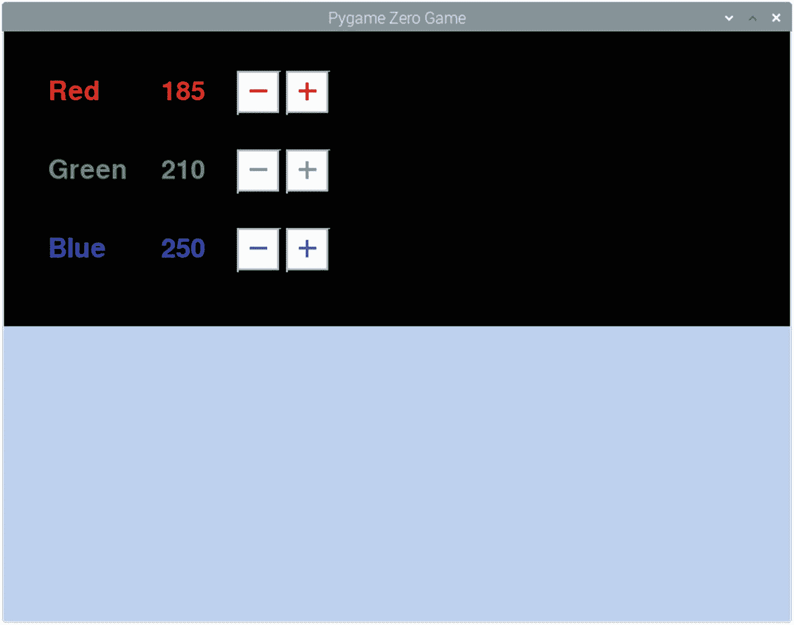

# 6.彩色

在第 [3](03.html) 章中，简单提到了定义颜色有不同的方法。这一章将会介绍颜色在 Pygame Zero 中的不同用法。您还将看到如何使用鼠标与程序进行交互。

本章将使用一些代码示例，但本章并不是要创建一个特定的游戏；这是关于学习新的工具和技术，可能在未来有用。

## 颜色混合

为了理解颜色模型，看看定义颜色的不同方法是很有用的。在很小的时候，你就应该知道你可以通过混合不同颜色的颜料来制作不同的颜色。通过这个你知道了原色是蓝色、红色和黄色。如果你在彩色打印机上看墨水，你仍然会看到它在工作，但是使用青色(浅蓝色)、品红色(浅红色)和黄色。你还会看到，你有一个黑色的墨水给一个真正的黑色。这就是众所周知的 CMYK 颜色模型。

CMYK 模式非常适合打印机，因为它是减色模式。你从浅色(通常是白纸)开始，添加的墨水防止颜色被反射。通过添加特定数量的墨水，您可以过滤掉不想要的光线，以获得您想要的颜色。

计算机屏幕上使用的 RGB 方案则相反。它不是阻挡颜色，而是从黑色屏幕开始，并添加彩色光，以达到所需的颜色。因为颜色是增加的而不是减少的，所以减色法使用不同的颜色。计算机屏幕上使用的颜色是红色、绿色和蓝色(RGB)。还有其他配色方案，Python 中也有可以在不同颜色模型之间转换的模块，但本质上大多数游戏编程只需要 RGB。

在 Pygame 中，零 RGB 值通常作为一个元组输入，以 0 到 255 的数字列出三种不同的颜色成分。例如，要表示橙色，您可以使用(255，165，0)，其中 255 表示红色部分(最大值)，165 表示绿色部分，0 表示蓝色部分。它也可以作为十六进制值输入，就像在 HTML 或 CSS 中定义的一样。这显示了相同的三个值，但转换为十六进制(基数为 16)而不是十进制。对于橙色，这将是#ffa500。还有大约 657 个不同的单词可以用来表示从“aliceblue”到“yellowgreen”的各种颜色。一小部分颜色代码如图 [6-1](#Fig1) 所示。


图 6-1

颜色代码列表

生成此列表的代码在清单 [6-1](#PC1) 中，并作为 color-demo.py 包含在源代码中。演示程序显示颜色选择的 word、RGB 和 HTML 值。它在黑白背景上显示它们，使颜色可见。

```py
# Program to demonstrate some of the color words including in Pygame / Pygame Zero
import pygame

WIDTH = 800
HEIGHT = 600

colors = ['aquamarine1', 'black', 'blue', 'magenta', 'gray', 'green', 'limegreen', 'maroon', 'navy', 'brown', 'purple',
'red', 'lightgray', 'orange', 'white', 'yellow', 'violet']

def draw():
    screen.draw.filled_rect(Rect((400,0),(400,600)),(255,255,255))
    line_number = 0
    for color in colors:
        print_color (color, line_number)
        line_number += 1

def print_color (colorname, line_number):
    color_rgb_string = "{},{},{}".format(pygame.Color(colorname).r, pygame.Color(colorname).g, pygame.Color(colorname).b)
    color_html_string = "#{:02x}{:02x}{:02x}".format(pygame.Color(colorname).r, pygame.Color(colorname).g, pygame.Color(colorname).b)
    screen.draw.text(colorname, (20,30*(line_number+1)), color=colorname)
    screen.draw.text(color_rgb_string, (130,30*(line_number+1)), color=colorname)
    screen.draw.text(color_html_string, (250,30*(line_number+1)), color=colorname)
    screen.draw.text(colorname, (420,30*(line_number+1)), color=colorname)
    screen.draw.text(color_rgb_string, (530,30*(line_number+1)), color=colorname)
    screen.draw.text(color_html_string, (650,30*(line_number+1)), color=colorname)

Listing 6-1Code to display a selection of color words with color codes

```

代码使用 Pygame Zero 显示文本，但是访问 Pygame。直接颜色列表。Pygame Zero 文档中没有颜色列表，但是在 Pygame 源代码的附录 B 中有一个链接，在那里可以看到所有定义的颜色。

## 弹跳球

为了进一步演示颜色的使用，我制作了一个小程序，展示一个球在屏幕上弹跳。球在移动时会改变颜色。我不会在游戏中使用这个，但我会解释所使用的技术，如果你想制作一个依赖于弹跳的游戏，如突破，这可能是有用的。程序截图如图 [6-2](#Fig2) 所示。


图 6-2

彩色弹力球

清单 [6-2](#PC2) 中显示了这方面的代码，并作为 bouncingball.py 包含在提供的源代码中。

```py
WIDTH = 800
HEIGHT = 600

# starting positions
ball_x = 400
ball_y = 300
ball_speed = 5
# Velocity separated into x and y components
ball_velocity = [0.7 * ball_speed, 1 * ball_speed]
ball_radius = 20
ball_color_pos = 0

def draw():
    screen.clear()
    draw_ball()

def update():
    global ball_x, ball_y, ball_velocity, ball_color_pos
    ball_color_pos += 1
    if (ball_color_pos > 255):
        ball_color_pos = 0
    ball_x += (ball_velocity[0])
    ball_y += (ball_velocity[1])
    if (ball_x + ball_radius >= WIDTH or ball_x - ball_radius <= 0):
        ball_velocity[0] = ball_velocity[0] * -1
    if (ball_y + ball_radius >= HEIGHT or ball_y - ball_radius <= 0):
        ball_velocity[1] = ball_velocity[1] * -1

def draw_ball():
    color = color_wheel (ball_color_pos)
    screen.draw.filled_circle ((ball_x,ball_y), ball_radius, color)

# Cycle around a color wheel - 0 to 255
def color_wheel(pos):
    if pos < 85:
        return (pos * 3, 255 - pos * 3, 0)
    elif pos < 170:
        pos -= 85
        return (255 - pos * 3, 0, pos * 3)
    else:
        pos -= 170
        return (0, pos * 3, 255 - pos * 3)

Listing 6-2Code to display a selection of color words with color codes

```

与所有 Pygame Zero 代码一样，该代码基于 draw 和 update 函数。

更新函数处理球的移动。球有一个速度(速度和方向的组合),它以每次运行更新函数时 x 和 y 的变化来存储。使用默认速度 5，每次调用该函数时，球将在 X 方向移动 3.5 个像素，在 Y 方向移动 5 个像素。当球碰到墙时，它在适当方向上的速度将会逆转。

draw 函数运行 draw_ball 函数，该函数使用 screen.draw.filled_circle 绘制球。它从 color_wheel 函数中计算出球的颜色。

色轮分三个阶段创建。第一阶段开始时没有红灯，全绿灯，没有蓝光。在这个阶段，红光增加，蓝光减少。

第二阶段是红光减少，蓝光增加，没有绿光。

第三阶段是绿光增加，蓝光减少，没有红光。

这仅使用轮子周围的一片，具有固定的亮度。可用的颜色总数超过 1600 万，但因为它只占用一个切片，所以每次调用 color_wheel 函数时，它都会返回 256 种不同颜色中的一种。使用下一种颜色，每画一次球意味着球在屏幕上移动时会改变颜色。

## 背景颜色选择器

为了帮助可视化不同的颜色，下一个程序将提供一种查看与不同颜色代码相关的颜色的方法。

该程序允许用户选择一种颜色，它将显示在窗口的下半部分。如图 [6-3](#Fig3) 所示。



图 6-3

颜色选择程序

像这一章的其余部分一样，它不会涉及到创建一个完整的游戏，但它将展示可以用于创建游戏的技术。这包括如何处理鼠标事件来使用鼠标创建游戏。

### 处理鼠标事件

当移动、单击或拖动鼠标时，会触发一个事件。然后这些函数调用鼠标事件函数，您可以在自己的代码中实现这些函数。这些功能是鼠标按下、鼠标抬起和鼠标移动。如果您在 Pygame Zero 代码中实现了这些函数，那么只要其中一个事件被触发，它们就会被调用。

看看 on_mouse_down 函数，每次按下一个鼠标按钮都会触发它。该函数可以有两个参数；如果它们包含在函数中，那么它们将被提供鼠标的位置和按下的鼠标按钮。

清单 [6-3](#PC3) 中显示了一个示例函数。

```py
def on_mouse_down(pos, button):
    if (button == mouse.LEFT):
       print ("Mouse pressed, position {} {}".format((pos[0]), pos[1]))

Listing 6-3Code to handle mouse press

```

每次按下左键时使用这个代码，它会将鼠标的坐标打印到控制台上。如果屏幕上有演员，那么可以使用演员碰撞点方法检测鼠标是否在其中一个演员上。这与使用传统(非游戏)应用程序不同。在游戏中，你通常希望鼠标一点就有动作(如按下按钮、发射激光或转动卡片)。在传统的应用程序中，要按下一个按钮，通常需要按下按钮，然后当鼠标在同一点上时也需要释放它。这意味着跟踪按钮是否在 on_mouse_down 期间，然后等待直到 on_mouse_up 被调用。因为这是一本游戏编程的书，所以它将只涉及第一个，但是如果你在非游戏应用中使用 Pygame Zero 的话，这是你需要考虑的事情。

### 创建颜色选择器

颜色选择器使用选定的颜色创建一个 filled_rectangle。矩形占据了程序窗口的一半。这类似于之前使用的 filled_circle，只是它使用了 Rect 对象。颜色是基于颜色 _ 红色、颜色 _ 绿色和颜色 _ 蓝色的变量设置的。每个参数的值都是通过 on_mouse_down 函数使用加号和减号按钮设置的。这些按钮是作为演员对象创建的图像，就像创建角色或其他精灵一样。

颜色选择器的代码如清单 [6-4](#PC4) 所示。

```py
WIDTH = 800
HEIGHT = 600

color_red = 0
color_green = 0
color_blue = 0

change_amount = 5

BOX = Rect((0,300),(800,300))

button_minus_red = Actor("button_minus_red", (260,63))
button_plus_red = Actor("button_plus_red", (310,63))
button_minus_green = Actor("button_minus_green", (260,143))
button_plus_green = Actor("button_plus_green", (310,143))
button_minus_blue = Actor("button_minus_blue", (260,223))
button_plus_blue = Actor("button_plus_blue", (310,223))

def draw() :
    screen.clear()

    screen.draw.text("Red", (45,45), fontsize=40, color="red")
    screen.draw.text(str(color_red), (160,45), fontsize=40, color="red")
    screen.draw.text("Green", (45,125), fontsize=40, color="green")
    screen.draw.text(str(color_green), (160,125), fontsize=40, color="green")
    screen.draw.text("Blue", (45,205), fontsize=40, color="blue")
    screen.draw.text(str(color_blue), (160,205), fontsize=40, color="blue")

    button_minus_red.draw()
    button_plus_red.draw()
    button_minus_green.draw()
    button_plus_green.draw()
    button_minus_blue.draw()
    button_plus_blue.draw()

    screen.draw.filled_rect (BOX, (color_red,color_green,color_blue))

def update() :
    pass

def on_mouse_down(pos, button):
    global color_red, color_green, color_blue
    if (button == mouse.LEFT):
        if (button_minus_red.collidepoint(pos)):
            color_red -= change_amount
            if (color_red < 1):
                color_red = 0
        elif (button_plus_red.collidepoint(pos)):
            color_red += change_amount
            if (color_red > 255):
                color_red = 255
        elif (button_minus_green.collidepoint(pos)):
            color_green -= change_amount
            if (color_green < 1):
                color_green = 0
        elif (button_plus_green.collidepoint(pos)):
            color_green += change_amount
            if (color_green > 255):
                color_green = 255
        elif (button_minus_blue.collidepoint(pos)):
            color_blue -= change_amount
            if (color_blue < 1):
                color_blue = 0
        elif (button_plus_blue.collidepoint(pos)):
            color_blue += change_amount
            if (color_blue > 255):
                color_blue = 255

Listing 6-4Color selector program

```

on_mouse_down 函数处理所有的按钮按压。每个按钮都有一个文本块，用于查看按钮是否与鼠标位置发生冲突。如果检测到碰撞，它会将相应颜色的值增加或减少 5。改变 5 而不是 1 的原因是为了减少所需的按钮点击次数，尽管这并不意味着只能显示颜色的子集。

## 摘要

本章介绍了如何在 Pygame Zero 中创建颜色以及如何使用颜色。弹跳球程序展示了如何使用这些颜色。颜色选择器提供了一种创建不同颜色的方法，以及如何使用鼠标与程序进行交互。这些程序中使用的代码可以用作创建游戏的构建块。

在下一章，这些颜色将被用来创建另一个使用矢量图像的游戏。