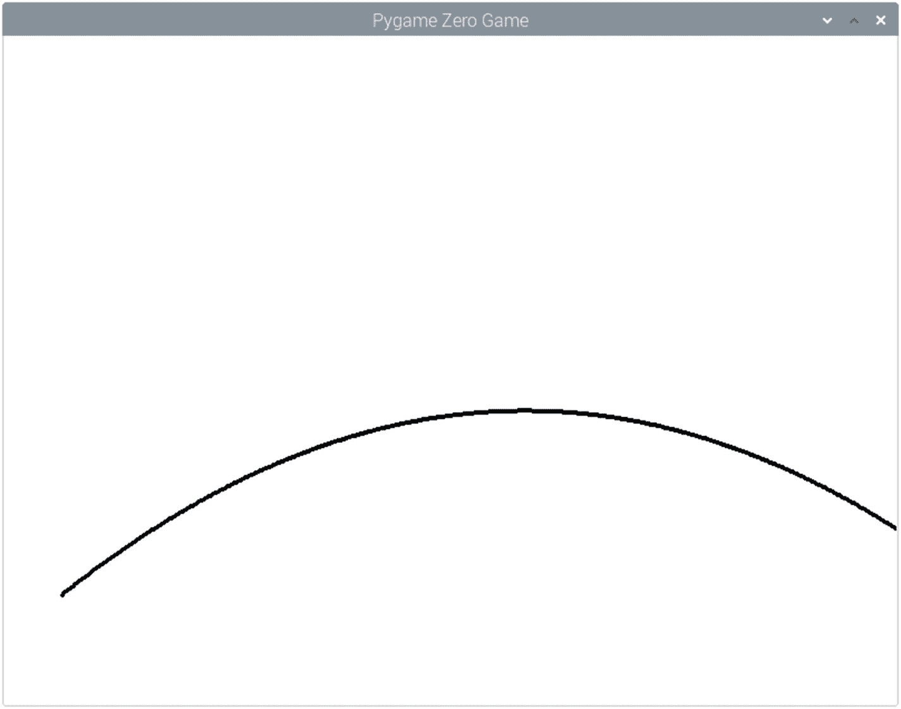

# 7.坦克游戏零

最后几章已经涵盖了一些理论；现在你将有机会在新游戏中应用这些技术。这个游戏是一个炮兵战斗游戏，叫做零号坦克游戏——一场摧毁敌人坦克的战斗。

这个游戏将会使用前几章学到的一些特性，并在此基础上进行扩展。它将使用动态矢量图形来创建精灵和背景图像。它还将涵盖一种追踪坦克炮发射的炮弹轨迹的新技术。

我没有一行一行地介绍这个程序，而是解释了一些用来创建这个游戏的不同技术。这些将在本章的末尾集合在一起，以创建一个可用的游戏。

游戏是双人回合制游戏。玩家 1 将向敌人的坦克发射一枚炮弹，试图摧毁它。如果不成功，那么 2 号玩家就有机会了。如此反复，直到其中一个玩家的炮弹成功命中对方的坦克。

## 坦克的矢量图像

这个游戏不是使用位图图像，而是使用内置的 Pygame Zero 形状创建的。这包括创建为多边形的风景和使用简单形状创建的坦克。坦克的基本外形如图 [7-1](#Fig1) 所示。


图 7-1

使用矢量形状创建的坦克形状

在代码中，坦克的底部被称为轨道，它被创建为一个多边形；主要部分被称为船体，创建为矩形；顶部是炮塔，呈椭圆形；枪是长方形的，但却是多边形的。

这将需要额外的代码来计算出坦克的位置和不同形状的相对坐标。绘制枪的位置的数学将会非常复杂，所以会放在一个单独的函数中。清单 [7-1](#PC1) 中显示了绘制一个坦克的代码。这作为 tankshape.py 包含在源代码中。

```py
import math
import pygame

WIDTH=800
HEIGHT=600

left_tank_position = 50,400
left_gun_angle = 20

def draw():
    draw_tank ("left", left_tank_position, left_gun_angle)

def draw_tank (left_right, tank_start_pos, gun_angle):
    (xpos, ypos) = tank_start_pos
    tank_color = (216, 216, 153)

    # The shape of the tank track is a polygon
    # (uses list of tuples for the x and y co-ords)
    track_positions = [
        (xpos+5, ypos-5),
        (xpos+10, ypos-10),
        (xpos+50, ypos-10),
        (xpos+55, ypos-5),
        (xpos+50, ypos),
        (xpos+10, ypos)
    ]
    # Polygon for tracks (pygame not pygame zero)
    pygame.draw.polygon(screen.surface, tank_color, track_positions)

    # hull uses a rectangle which uses top right coords and dimensions
    hull_rect = Rect((xpos+15,ypos-20),(30,10))
    # Rectangle for tank body "hull" (pygame zero)
    screen.draw.filled_rect(hull_rect, tank_color)

    # Despite being an ellipse pygame requires this as a rect
    turret_rect = Rect((xpos+20,ypos-25),(20,10))
    # Ellipse for turret (pygame not pygame zero)
    pygame.draw.ellipse(screen.surface, tank_color, turret_rect)

    # Gun position involves more complex calculations so in a separate function
    gun_positions = calc_gun_positions (left_right, tank_start_pos, gun_angle)
    # Polygon for gun barrel (pygame not pygame zero)
    pygame.draw.polygon(screen.surface, tank_color, gun_positions)

# Calculate the polygon positions for the gun barrel
def calc_gun_positions (left_right, tank_start_pos, gun_angle):
    (xpos, ypos) = tank_start_pos
    # Set the start of the gun (top of barrel at point it joins the tank)
    if (left_right == "right"):
        gun_start_pos_top = (xpos+20, ypos-20)
    else:
        gun_start_pos_top = (xpos+40, ypos-20)

    # Convert angle to radians (for right subtract from 180 deg first)
    relative_angle = gun_angle
    if (left_right == "right"):
        relative_angle = 180 - gun_angle
    angle_rads = math.radians(relative_angle)
    # Create vector based on the direction of the barrel
    # Y direction *-1 (due to reverse y of screen)
    gun_vector = (math.cos(angle_rads), math.sin(angle_rads) * -1)

    # Determine position bottom of barrel
    # Create temporary vector 90deg to existing vector
    if (left_right == "right"):
        temp_angle_rads = math.radians(relative_angle - 90)
    else:
        temp_angle_rads = math.radians(relative_angle + 90)
    temp_vector =  (math.cos(temp_angle_rads), math.sin(temp_angle_rads) * -1)

    # Add constants for gun size
    GUN_LENGTH = 20
    GUN_DIAMETER = 3
    gun_start_pos_bottom = (gun_start_pos_top[0] + temp_vector[0] *
        GUN_DIAMETER, gun_start_pos_top[1] + temp_vector[1] * GUN_DIAMETER)

    # Calculate barrel positions based on vector from start position
    gun_positions = [
        gun_start_pos_bottom,
        gun_start_pos_top,
        (gun_start_pos_top[0] + gun_vector[0] * GUN_LENGTH,
            gun_start_pos_top[1] + gun_vector[1] * GUN_LENGTH),
        (gun_start_pos_bottom[0] + gun_vector[0] * GUN_LENGTH,
            gun_start_pos_bottom[1] + gun_vector[1] * GUN_LENGTH),
    ]

    return gun_positions

Listing 7-1Code to display a tank created using shapes

```

程序首先导入一些模块。一个是数学模块，一个是 pygame。需要导入 pygame 的原因是，虽然游戏是为 Pygame Zero 设计的，但有一些功能是 Pygame Zero 目前没有的。导入 pygame 使代码能够利用 pygame 模块中的功能。

接下来有一些关于坦克位置和火炮角度的全局变量。这些是指左油箱；在最终的游戏中，将会有两个坦克，并且随着游戏的发展，它们的名字将会是一致的。

draw 函数是通过调用`draw_tank`函数绘制坦克的单个入口。没有更新功能，因为此时不需要它。

绘制坦克的任务转到`draw_tank`函数。该函数的第一个参数是单词“left”或“right”。这在这段代码中没有使用，因为目前它只创建了左边的容器，但是如果知道以后会需要的话，最好包含任何将来的参数。其他参数表示坦克的位置和火炮指向的角度。

`draw_tank`功能首先定义代表坦克履带的形状。这被创建为多边形。多边形可以是至少有三条边的任何闭合形状，这使得它非常适合不规则形状。

```py
    track_positions = [
        (xpos+5, ypos-5),
        (xpos+10, ypos-10),
        (xpos+50, ypos-10),
        (xpos+55, ypos-5),
        (xpos+50, ypos),
        (xpos+10, ypos)
    ]
    pygame.draw.polygon(screen.surface, tank_color, track_positions)

```

用代表形状的所有顶点(每个角)创建了`track_positions`列表。Pygame Zero 目前不包含创建多边形的代码。为了克服这个限制，使用 Pygame 方法。与 Pygame Zero 中使用的开始`screen.draw`不同，该方法是`pygame.draw.polygon`，并且使用`screen.surface`将要绘制的表面作为第一个参数传递。

下一个形状是一个矩形，可以直接从 Pygame Zero 绘制。

```py
    hull_rect = Rect((xpos+15,ypos-20),(30,10))
    screen.draw.filled_rect(hull_rect, tank_color)

```

`hull_rect`是 Rect 对象，它有一个元组来表示起始位置(left，top)和一个元组来表示矩形的像素大小(width，height)。然后与颜色一起传递给`screen.draw.filled_rect`。

转台创建为一个椭圆。Pygame Zero 目前不支持椭圆(只有一个圆)，所以这也需要使用 Pygame 创建。椭圆被定义为包含椭圆的矩形(Rect 对象)。

```py
    turret_rect = Rect((xpos+20,ypos-25),(20,10))
    pygame.draw.ellipse(screen.surface, tank_color, turret_rect)

```

draw 函数中的最后一项是绘制枪管。这是一个矩形，它被旋转以反映选定的角度。因为它是以一个角度绘制的，所以它被创建为一个多边形。确定顶点位置的数学过程非常复杂，所以它被分解成一个独立的函数`calc_gun_positions`。枪如图 [7-2](#Fig2) 所示，显示了枪在坦克上的位置和枪的角度。


图 7-2

使用矢量形状创建的坦克形状

已经编写了`calc_gun_positions`函数来支持坦克在屏幕的左边(枪指向右边)或者在屏幕的右边(枪指向左边)。这是通过首先为桶的顶部设置适当的开始位置来完成的，桶的顶部与坦克的外壳重叠。`gun_angle`是从图 [7-2](#Fig2) 所示基准线算起的度数。如果坦克在右边，那么火炮角度通过减去 180 度转换成相对角度。

然后，角度被转换为弧度，因为这是数学模块用于三角函数的角度。然后基于 x 轴变化的余弦和 y 轴变化的正弦创建`gun_vector`。该向量给出了 x 和 y 的相对变化，并且可以乘以枪的长度来计算枪顶部顶点的位置。使用类似的技术来找到底部位置，该位置相对于枪向量成 90 度角(取决于它是左还是右而为正或负)。最后，创建一个名为`gun_positions`的列表，该列表被返回到 draw 函数以创建多边形。

## 创造动态景观

在前面的代码中，坦克只是停留在一个静止的位置，悬停在空中。下一部分将为坦克的站立创造景观。不是创建一个每次玩游戏都一样的静态景观，而是创建一个动态景观。这将展示如何使用随机数生成动态景观。图 [7-3](#Fig3) 显示了一个示例景观。


图 7-3

坦克游戏的动态景观

景观将生成为多边形。你可能认为你可以用一个随机数值来确定 y 轴的值。这并不那么简单，因为随机数会导致每个点之间的明显差异，导致景观过于崎岖和不现实。取而代之的是，通过计算一个随机值作为与先前位置的差值来创建风景。这给出了一个更加渐进的变化。我还在左右两侧创建了一个平坦的区域，这是坦克的位置。清单 [7-2](#PC5) 显示了这方面的代码。该代码作为 tanktrajectory.py 包含在源代码中。

```py
import random
import pygame

WIDTH=800
HEIGHT=600

SKY_COLOR = (165, 182, 209)
GROUND_COLOR = (9,84,5)

# How big a chunk to split up x axis
LAND_CHUNK_SIZE = 20
# Max that land can go up or down within chunk size
LAND_MAX_CHG = 20
# Max height of ground
LAND_MIN_Y = 200

# Position of the two tanks - set to zero, update before use
left_tank_position = (0,0)
right_tank_position = (0,0)

def draw():
    screen.fill(SKY_COLOR)
    pygame.draw.polygon(screen.surface, GROUND_COLOR, land_positions)

# Setup game - allows create new game
def setup():
    global left_tank_position, right_tank_position, land_positions
    # Setup landscape (these positions represent left side of platform)
    # Choose a random position
    # The complete x,y co-ordinates will be saved in a
    # tuple in left_tank_rect and right_tank_rect
    left_tank_x_position = random.randint (10,300)
    right_tank_x_position = random.randint (500,750)

    # Sub divide screen into chunks for the landscape
    # store as list of x positions (0 is first position)
    current_land_x = 0
    current_land_y = random.randint (300,400)
    land_positions = [(current_land_x,current_land_y)]
    while (current_land_x < WIDTH):
        if (current_land_x == left_tank_x_position):
            # handle tank platform
            left_tank_position = (current_land_x, current_land_y)
            # Create level ground for the tank to sit on
            # Add another 50 pixels further along at same y position
            current_land_x += 60
            land_positions.append((current_land_x, current_land_y))
            continue
        elif (current_land_x == right_tank_x_position):
            # handle tank platform
            right_tank_position = (current_land_x, current_land_y)
            # Create level ground for the tank to sit on
            # Add another 50 pixels further along at same y position
            current_land_x += 60
            land_positions.append((current_land_x, current_land_y))
            continue
        # Checks to see if next position will be where the tanks are
        if (current_land_x < left_tank_x_position and current_land_x +
            LAND_CHUNK_SIZE >= left_tank_x_position):
            # set x position to tank position
            current_land_x = left_tank_x_position
        elif (current_land_x < right_tank_x_position and current_land_x +
            LAND_CHUNK_SIZE >= right_tank_x_position):
            # set x position to tank position
            current_land_x = right_tank_x_position
        elif (current_land_x + LAND_CHUNK_SIZE > WIDTH):
            current_land_x = WIDTH
        else:
            current_land_x += LAND_CHUNK_SIZE

        # Set the y height
        current_land_y += random.randint(0-LAND_MAX_CHG,LAND_MAX_CHG)
        # check not too high or too low
        # Note the reverse logic as high y is bottom of screen
        if (current_land_y > HEIGHT):   # Bottom of screen
            current_land_y = HEIGHT
        if (current_land_y < LAND_MIN_Y):
            current_land_y = LAND_MIN_Y
        # Add to list
        land_positions.append((current_land_x, current_land_y))
    # Add end corners
    land_positions.append((WIDTH,HEIGHT))
    land_positions.append((0,HEIGHT))

# Setup the game (at end so that it can see the other functions)
setup()

Listing 7-2Code to generate a random landscape for the tank game

```

在设置了一些常量和变量之后，调用 setup 函数。调用`setup`的指令在文件的底部。这是因为在 Python 中，函数必须在被调用之前定义，所以通过将它放在文件的底部，所有早期的函数都已经被加载了。

在创建地面之前，需要计算坦克的位置。这是为了使代码可以确保坦克安装在地面的水平部分。储罐的 x 位置是基于随机整数设置的；一旦计算了地面，将在稍后添加 y 位置。然后背景被分割成固定大小的块。如果一个坦克会在下一个区域，那么块会在这个位置结束，这样就可以创建水平区域了。然后创建下一个块，y 轴保持不变。

如果当前区域没有坦克，那么它会被随机改变。所有这些位置都被添加到一个列表中，然后由 draw 函数用来绘制多边形。

## 计算轨迹

当炮弹从枪中射出时，它不是沿着一条直线。这是由几个因素造成的，主要的影响是重力。忽略其他因素，那么引力把它拉向地球将导致壳的路径形成抛物线，因为它首先升高，然后开始向地球回落。

在现实世界中，由于空气阻力和遇到的任何风阻力，路径会被扭曲。为了简单起见，这个程序只考虑重力。这将由函数`update_shell_position`和函数`draw_shell`来处理。为了说明这一点，我创建了一个程序 tanktrajectory.py，它将显示某组值的完整路径。路径如图 [7-4](#Fig4) 所示，修改颜色以提高对比度。



图 7-4

坦克炮弹发射轨迹示例

清单 [7-3](#PC6) 中显示了演示这一点的代码。

```py
import math
import pygame

WIDTH=800
HEIGHT=600

SKY_COLOR = (165, 182, 209)
SHELL_COLOR = (255,255,255)
shell_start_position = (50,500)
left_gun_angle = 50
left_gun_power = 60
-
shell_positions = []

def draw_shell (position):
    (xpos, ypos) = position
    # Create rectangle of the shell
    shell_rect = Rect((xpos,ypos),(5,5))
    pygame.draw.ellipse(screen.surface, SHELL_COLOR, shell_rect)

def draw():
    screen.fill(SKY_COLOR)
    for this_position in shell_positions:
        draw_shell(this_position)

def update_shell_position (left_right):
    global shell_power, shell_angle, shell_start_position, shell_current_position, shell_time

    init_velocity_y = shell_power * math.sin(shell_angle)

    # Direction - multiply by -1 for left to right
    if (left_right == 'left'):
        init_velocity_x = shell_power * math.cos(shell_angle)
    else:
        init_velocity_x = shell_power * math.cos(math.pi - shell_angle)

    # Gravity constant is 9.8 m/s^2 but this is in terms of screen so instead use a suitable value
    GRAVITY_CONSTANT = 0.004
    # Constant to give a sensible distance on x axis
    DISTANCE_CONSTANT = 1.5

    # time is calculated in update cycles
    shell_x = shell_start_position[0] + init_velocity_x * shell_time * DISTANCE_CONSTANT
    shell_y = shell_start_position[1] + -1 * ((init_velocity_y * shell_time) -
        (0.5 * GRAVITY_CONSTANT * shell_time * shell_time))

    shell_current_position = (shell_x, shell_y)
    shell_time += 1

def setup_trajectory():
    global shell_positions, shell_current_position, shell_power, shell_angle, shell_time

    shell_current_position = shell_start_position

    shell_angle = math.radians (left_gun_angle)
    shell_power = left_gun_power / 40
    shell_time = 0

    while (shell_current_position[0] < WIDTH and shell_current_position[1] < HEIGHT):
        update_shell_position("left")
        shell_positions.append(shell_current_position)

setup_trajectory()

Listing 7-3Code to demonstrate trajectory for a tank shell being fired

```

`setup_trajectory`函数用于演示轨迹，不会包含在游戏中。它设置角度，然后创建一个 while 循环，计算炮弹落地或离开屏幕右侧之前将经过的所有位置。

`update_shell_position`功能从计算 x 和 y 方向的初速度开始。这是基于枪的威力和角度。

然后需要两个常数:一个表示重力常数(拉向地球的力的大小)的值，另一个表示距离常数，它影响壳在每一步在 x 方向上移动的距离。重力的值是 9.8 米/秒 <sup>`2`</sup> ，但这是假设以米为单位测量的真实距离。在电脑屏幕的情况下，我们用像素来度量虚拟距离。所使用的值是使用试错法创建的，以获得看起来真实并给出合适曲线的值。相同的试错法用于距离常数。然后将这些值包含在以下算法中，以确定每个时间间隔的壳位置。

```py
    shell_x = shell_start_position[0] + init_velocity_x * shell_time * DISTANCE_CONSTANT
    shell_y = shell_start_position[1] + -1 * ((init_velocity_y * shell_time) -
        (0.5 * GRAVITY_CONSTANT * shell_time * shell_time))

```

这不包括任何空气阻力、风阻力的因素，也不包括除重力之外作用在壳体上的任何其他力。

这个演示程序同时显示所有的贝壳位置，但在游戏中一次只会画一个贝壳，它会在屏幕上缓慢移动。

## 检测碰撞

在早期的游戏中，碰撞是基于矩形碰撞特性的。虽然这是一个有用的技术，但它没有这个游戏所需要的精确度。一种替代技术是通过寻找像素的颜色来检测炮弹何时与坦克或地面碰撞，以查看它是否与坦克或地面的颜色匹配。要做到这一点，地面和每个坦克的颜色必须是独一无二的。清单 [7-4](#PC8) 显示了将用于检测碰撞的函数。

```py
def detect_hit (left_right):
    global shell_current_position
    (shell_x, shell_y) = shell_current_position
    # Add offset (3 pixels)
    # offset left/right depending upon direction of fire
    if (left_right == "left"):
        shell_x += 3
    else:
        shell_x -= 3
    shell_y += 3
    offset_position = (math.floor(shell_x), math.floor(shell_y))

    # Check whether it's off the screen
    # temporary if just y axis, permanent if x
    if (shell_x > WIDTH or shell_x <= 0 or shell_y >= HEIGHT):
        return 10
    if (shell_y < 1):
        return 1

    # Get color at position
    color_pixel = screen.surface.get_at(offset_position)
    if (color_pixel == GROUND_COLOR):
        return 11
    if (left_right == 'left' and color_pixel == TANK_COLOR_P2):
        return 20
    if (left_right == 'right' and color_pixel == TANK_COLOR_P1):
        return 20

    return 0

Listing 7-4Function to detect collision with tank or ground

```

这段代码在外壳前面创建一个偏移量，这样就不会看到它自己的颜色。然后检查该位置是否在屏幕之外。如果它超过了屏幕的顶部，那么这只是一个暂时的情况，所以如果它离开了屏幕的右侧或左侧，它将返回一个不同的值。然后，代码使用下面一行来读取偏移位置的像素值:

```py
    color_pixel = screen.surface.get_at(offset_position)

```

这将返回偏移位置的像素值。如果该值与坦克或地面的颜色匹配，那么它将返回一个适当的值。

在这个函数中，返回的值只是被选择来代表不同条件的值。如果您正在编写将在其他程序中重用的代码，那么创建一个常量以便更容易理解该值的含义通常是一个好主意。例如，在第 [6 章](06.html)中查看鼠标的状态时，会进行一个测试来查看按钮的值是否等于`mouse.LEFT`。`mouse.LEFT`的值只是一个数字，恰好是 1。一般来说，记住`mouse.LEFT`比记住每个不同按钮产生的数字更容易。因为这仅用于这个特定的函数，所以返回真实值，但是代码中包含了注释来解释这些值的含义。

## 完整的游戏代码

还有相当多的额外代码，但是大部分都包含了在前面章节中已经演示过的技术。

与大多数程序一样，需要跟踪游戏的状态，以了解哪个玩家当前处于活动状态，或者显示适当的消息。这是通过在变量`game_state`中设置适当的文本来实现的。不同的状态列在程序开始时的注释中；他们是

*   “开始”——开始前的定时延迟

*   “球员 1”——等待球员摆好位置

*   “玩家 1 开火”——玩家 1 开火

*   “玩家 2”——玩家 2 设定位置

*   “玩家 2 开火”——玩家 2 开火了

*   “game _ over _ 1”-显示玩家 1 赢了

*   “game _ over _ 2”——显示玩家 2 赢了

这些状态在更新或绘制函数中有适当的代码，以确保游戏给出正确的提示或适当地处理输入。

从更新函数中调用`player_keyboard`函数，检查是否有按键被按下。如果按下向上或向下按钮，则枪仰角被调整；如果按下左按钮或右按钮，则调整功率(以最大功率的百分比表示)，如果按下空格键，则发射炮弹。还有一个额外的测试，看看是否按下了左键，这是另一个选项，而不是空格来发射炮弹。这是为了让游戏可以与 Picade 或其他基于 Raspberry Pi 的街机一起工作，这些机器将该键映射到一个物理按钮。

游戏第一次运行时，所有需要运行的代码都有一个设置函数。这创造了景观，也为以后需要的许多变量设置了值。还有额外的代码向用户显示消息。完整游戏的代码如清单 [7-5](#PC10) 所示。

```py
import math
import random
import pygame

WIDTH=800
HEIGHT=600

# States are:
# start - timed delay before start
# player1 - waiting for player to set position
# player1fire - player 1 fired
# player2 - player 2 set position
# player2fire - player 2 fired
# game_over_1 / game_over_2 - show who won 1 = player 1 won etc.
game_state = "player1"

# Color constants
SKY_COLOR = (165, 182, 209)
GROUND_COLOR = (9,84,5)
# Different tank colors for player 1 and player 2
# These colors must be unique as well as the GROUND_COLOR
TANK_COLOR_P1 = (216, 216, 153)
TANK_COLOR_P2 = (219, 163, 82)
SHELL_COLOR = (255,255,255)
TEXT_COLOR = (255,255,255)

# How big a chunk to split up x axis
LAND_CHUNK_SIZE = 20
# Max that land can go up or down within chunk size
LAND_MAX_CHG = 20
# Max height of ground
LAND_MIN_Y = 200

# Timer used to create delays before action (prevent accidental button press)
game_timer = 0

# Angle that the gun is pointing (degrees relative to horizontal)
left_gun_angle = 20
right_gun_angle = 50
# Amount of power to fire with - is divided by 40 to give scale 10 to 100
left_gun_power = 25
right_gun_power = 25
# These are shared between left and right as we only fire one shell at a time
shell_power = 1
shell_angle = 0
shell_time = 0

# Position of shell when fired (create as a global - but update before use)
shell_start_position = (0,0)
shell_current_position = (0,0)

# Position of the two tanks - set to zero, update before use
left_tank_position = (0,0)
right_tank_position = (0,0)

# Draws tank (including gun - which depends upon direction and aim)
# left_right can be "left" or "right" to depict which position the tank is in
# tank_start_pos requires x, y co-ordinates as a tuple
# angle is relative to horizontal - in degrees
def draw_tank (left_right, tank_start_pos, gun_angle):
    (xpos, ypos) = tank_start_pos

    # Set appropriate color for the tank
    if (left_right == "left"):
        tank_color = TANK_COLOR_P1
    else:
        tank_color = TANK_COLOR_P2
    # The shape of the tank track is a polygon
    # (uses list of tuples for the x and y co-ords)
    track_positions = [
        (xpos+5, ypos-5),
        (xpos+10, ypos-10),
        (xpos+50, ypos-10),
        (xpos+55, ypos-5),
        (xpos+50, ypos),
        (xpos+10, ypos)
    ]
    # Polygon for tracks (pygame not pygame zero)
    pygame.draw.polygon(screen.surface, tank_color, track_positions)

    # hull uses a rectangle which uses top right co-ords and dimensions
    hull_rect = Rect((xpos+15,ypos-20),(30,10))
    # Rectangle for tank body "hull" (pygame zero)
    screen.draw.filled_rect(hull_rect, tank_color)

    # Despite being an ellipse pygame requires this as a rect
    turret_rect = Rect((xpos+20,ypos-25),(20,10))
    # Ellipse for turret (pygame not pygame zero)
    pygame.draw.ellipse(screen.surface, tank_color, turret_rect)

    # Gun position involves more complex calculations so in a separate function
    gun_positions = calc_gun_positions (left_right, tank_start_pos, gun_angle)
    # Polygon for gun barrel (pygame not pygame zero)
    pygame.draw.polygon(screen.surface, tank_color, gun_positions)

def draw_shell (position):
    (xpos, ypos) = position
    # Create rectangle of the shell
    shell_rect = Rect((xpos,ypos),(5,5))
    pygame.draw.ellipse(screen.surface, SHELL_COLOR, shell_rect)

# Calculate the polygon positions for the gun barrel
def calc_gun_positions (left_right, tank_start_pos, gun_angle):
    (xpos, ypos) = tank_start_pos
    # Set the start of the gun (top of barrel at point it joins the tank)
    if (left_right == "right"):
        gun_start_pos_top = (xpos+20, ypos-20)
    else:
        gun_start_pos_top = (xpos+40, ypos-20)

    # Convert angle to radians (for right subtract from 180 deg first)
    relative_angle = gun_angle
    if (left_right == "right"):
        relative_angle = 180 - gun_angle
    angle_rads = relative_angle * (math.pi / 180)
    # Create vector based on the direction of the barrel
    # Y direction *-1 (due to reverse y of screen)
    gun_vector = (math.cos(angle_rads), math.sin(angle_rads) * -1)

    # Determine position bottom of barrel
    # Create temporary vector 90deg to existing vector
    if (left_right == "right"):
        temp_angle_rads = math.radians(relative_angle - 90)
    else:
        temp_angle_rads = math.radians(relative_angle + 90)
    temp_vector =  (math.cos(temp_angle_rads), math.sin(temp_angle_rads) * -1)

    # Add constants for gun size
    GUN_LENGTH = 20
    GUN_DIAMETER = 3
    gun_start_pos_bottom = (gun_start_pos_top[0] + temp_vector[0] * GUN_DIAMETER, gun_start_pos_top[1] + temp_vector[1] * GUN_DIAMETER)

    # Calculate barrel positions based on vector from start position
    gun_positions = [
        gun_start_pos_bottom,
        gun_start_pos_top,
        (gun_start_pos_top[0] + gun_vector[0] * GUN_LENGTH, gun_start_pos_top[1] + gun_vector[1] * GUN_LENGTH),
        (gun_start_pos_bottom[0] + gun_vector[0] * GUN_LENGTH, gun_start_pos_bottom[1] + gun_vector[1] * GUN_LENGTH),
    ]

    return gun_positions

def draw():
    global game_state, left_tank_position, right_tank_position, left_gun_angle, right_gun_angle, shell_start_position
    screen.fill(SKY_COLOR)
    pygame.draw.polygon(screen.surface, GROUND_COLOR, land_positions)
    draw_tank ("left", left_tank_position, left_gun_angle)
    draw_tank ("right", right_tank_position, right_gun_angle)
    if (game_state == "player1" or game_state == "player1fire"):
        screen.draw.text("Player 1\nPower "+str(left_gun_power)+"%", fontsize=30, topleft=(50,50), color=(TEXT_COLOR))
    if (game_state == "player2" or game_state == "player2fire"):
        screen.draw.text("Player 2\nPower "+str(right_gun_power)+"%", fontsize=30, topright=(WIDTH-50,50), color=(TEXT_COLOR))
    if (game_state == "player1fire" or game_state == "player2fire"):
        draw_shell(shell_current_position)
    if (game_state == "game_over_1"):
        screen.draw.text("Game Over\nPlayer 1 wins!", fontsize=60, center=(WIDTH/2,200), color=(TEXT_COLOR))
    if (game_state == "game_over_2"):
        screen.draw.text("Game Over\nPlayer 2 wins!", fontsize=60, center=(WIDTH/2,200), color=(TEXT_COLOR))

def update():
    global game_state, left_gun_angle, left_tank_position, shell_start_position, shell_current_position, shell_angle, shell_time, left_gun_power, right_gun_power, shell_power, game_timer
    # Delayed start (prevent accidental firing by holding start button down)
    if (game_state == 'start'):
        game_timer += 1
        if (game_timer == 30):
            game_timer = 0
            game_state = 'player1'
    # Only read keyboard in certain states
    if (game_state == 'player1'):
        player1_fired = player_keyboard("left")
        if (player1_fired == True):
            # Set shell position to end of gun
            # Use gun_positions so we can get start position
            gun_positions = calc_gun_positions ("left", left_tank_position, left_gun_angle)
            shell_start_position = gun_positions[3]
            shell_current_position = gun_positions[3]
            game_state = 'player1fire'
            shell_angle = math.radians (left_gun_angle)
            shell_power = left_gun_power / 40
            shell_time = 0
    if (game_state == 'player1fire'):
        update_shell_position ("left")
        # shell value is whether the shell is inflight, hit or missed
        shell_value = detect_hit("left")
        # shell_value 20 is if other tank hit
        if (shell_value >= 20):
            game_state = 'game_over_1'
        # 10 is offscreen and 11 is hit ground, both indicate missed
        elif (shell_value >= 10):
            game_state = 'player2'
    if (game_state == 'player2'):
        player2_fired = player_keyboard("right")
        if (player2_fired == True):
            # Set shell position to end of gun
            # Use gun_positions so we can get start position
            gun_positions = calc_gun_positions ("right", right_tank_position, right_gun_angle)
            shell_start_position = gun_positions[3]
            shell_current_position = gun_positions[3]
            game_state = 'player2fire'
            shell_angle = math.radians (right_gun_angle)
            shell_power = right_gun_power / 40
            shell_time = 0
    if (game_state == 'player2fire'):
        update_shell_position ("right")
        # shell value is whether the shell is inflight, hit or missed
        shell_value = detect_hit("right")
        # shell_value 20 is if other tank hit
        if (shell_value >= 20):
            game_state = 'game_over_2'
        # 10 is offscreen and 11 is hit ground, both indicate missed
        elif (shell_value >= 10):
            game_state = 'player1'
    if (game_state == 'game_over_1' or game_state == 'game_over_2'):
        # Allow space key or left-shift (picade) to continue
        if (keyboard.space or keyboard.lshift):
            game_state = 'start'
            # Reset position of tanks and terrain
            setup()

def update_shell_position (left_right):
    global shell_power, shell_angle, shell_start_position, shell_current_position, shell_time

    init_velocity_y = shell_power * math.sin(shell_angle)

    # Direction - multiply by -1 for left to right
    if (left_right == 'left'):
        init_velocity_x = shell_power * math.cos(shell_angle)
    else:
        init_velocity_x = shell_power * math.cos(math.pi - shell_angle)

    # Gravity constant is 9.8 m/s^2 but this is in terms of screen so instead use a sensible constant
    GRAVITY_CONSTANT = 0.004
    # Constant to give a sensible distance on x axis
    DISTANCE_CONSTANT = 1.5
    # Wind is not included in this version, to implement then decreasing wind value is when the wind is against the fire direction
    # wind > 1 is where wind is against the direction of fire. Wind must never be 0 or negative (which would make it impossible to fire forwards)
    wind_value = 1

    # time is calculated in update cycles
    shell_x = shell_start_position[0] + init_velocity_x * shell_time * DISTANCE_CONSTANT
    shell_y = shell_start_position[1] + -1 * ((init_velocity_y * shell_time) - (0.5 * GRAVITY_CONSTANT * shell_time * shell_time * wind_value))
    shell_current_position = (shell_x, shell_y)

    shell_time += 1

# Detects if the shell has hit something.
# Simple detection looks at color of the screen at the position
# uses an offset to not detect the actual shell
# Return 0 for in-flight,
# 1 for offscreen temp (too high),
# 10 for offscreen permanent (too far),
# 11 for hit ground,
# 20 for hit other tank
def detect_hit (left_right):
    global shell_current_position
    (shell_x, shell_y) = shell_current_position
    # Add offset (3 pixels)
    # offset left/right depending upon direction of fire
    if (left_right == "left"):
        shell_x += 3
    else:
        shell_x -= 3
    shell_y += 3
    offset_position = (math.floor(shell_x), math.floor(shell_y))

    # Check whether it's off the screen
    # temporary if just y axis, permanent if x
    if (shell_x > WIDTH or shell_x <= 0 or shell_y >= HEIGHT):
        return 10
    if (shell_y < 1):
        return 1

    # Get color at position
    color_pixel = screen.surface.get_at(offset_position)
    if (color_pixel == GROUND_COLOR):
        return 11
    if (left_right == 'left' and color_pixel == TANK_COLOR_P2):
        return 20
    if (left_right == 'right' and color_pixel == TANK_COLOR_P1):
        return 20

    return 0

# Handles keyboard for players
# If player has hit fire key (space) then returns True
# Otherwise changes angle of gun if applicable and returns False
def player_keyboard(left_right):
    global shell_start_position, left_gun_angle, right_gun_angle, left_gun_power, right_gun_power

    # get current angle
    if (left_right == 'left'):
        this_gun_angle = left_gun_angle
        this_gun_power = left_gun_power
    else:
        this_gun_angle = right_gun_angle
        this_gun_power = right_gun_power

    # Allow space key or left-shift (picade) to fire
    if (keyboard.space or keyboard.lshift):
        return True
    # Up moves firing angle upwards, down moves it down
    if (keyboard.up):
        this_gun_angle += 1
        if (this_gun_angle > 85):
            this_gun_angle = 85
    if (keyboard.down):
        this_gun_angle -= 1
        if (this_gun_angle < 0):
            this_gun_angle = 0
    # left reduces power, right increases power
    if (keyboard.right):
        this_gun_power += 1
        if (this_gun_power > 100):
            this_gun_power = 100
    if (keyboard.left):
        this_gun_power -= 1
        if (this_gun_power < 10):
            this_gun_power = 10
    # Update the appropriate global (left / right)
    if (left_right == 'left'):
        left_gun_angle = this_gun_angle
        left_gun_power = this_gun_power
    else:
        right_gun_angle = this_gun_angle
        right_gun_power = this_gun_power

    return False

# Setup game - allows create new game
def setup():
    global left_tank_position, right_tank_position, land_positions
    # Setup landscape (these positions represent left side of platform)
    # Choose a random position
    # The complete x,y co-ordinates will be saved in a tuple in left_tank_rect and right_tank_rect
    left_tank_x_position = random.randint (10,300)
    right_tank_x_position = random.randint (500,750)

    # Sub divide screen into chunks for the landscape
    # store as list of x positions (0 is first position)
    current_land_x = 0
    current_land_y = random.randint (300,400)
    land_positions = [(current_land_x,current_land_y)]
    while (current_land_x < WIDTH):
        if (current_land_x == left_tank_x_position):
            # handle tank platform
            left_tank_position = (current_land_x, current_land_y)
            # Add another 50 pixels further along at same y position (level ground for tank to sit on)
            current_land_x += 60
            land_positions.append((current_land_x, current_land_y))
            continue
        elif (current_land_x == right_tank_x_position):
            # handle tank platform
            right_tank_position = (current_land_x, current_land_y)
            # Add another 50 pixels further along at same y position (level ground for tank to sit on)
            current_land_x += 60
            land_positions.append((current_land_x, current_land_y))
            continue
        # Checks to see if next position will be where the tanks are
        if (current_land_x < left_tank_x_position and current_land_x + LAND_CHUNK_SIZE >= left_tank_x_position):
            # set x position to tank position
            current_land_x = left_tank_x_position
        elif (current_land_x < right_tank_x_position and current_land_x + LAND_CHUNK_SIZE >= right_tank_x_position):
            # set x position to tank position
            current_land_x = right_tank_x_position
        elif (current_land_x + LAND_CHUNK_SIZE > WIDTH):
            current_land_x = WIDTH
        else:
            current_land_x += LAND_CHUNK_SIZE
        # Set the y height
        current_land_y += random.randint(0-LAND_MAX_CHG,LAND_MAX_CHG)
        # check not too high or too lower (note the reverse logic as high y is bottom of screen)
        if (current_land_y > HEIGHT):   # Bottom of screen
            current_land_y = HEIGHT
        if (current_land_y < LAND_MIN_Y):
            current_land_y = LAND_MIN_Y
        # Add to list
        land_positions.append((current_land_x, current_land_y))
    # Add end corners
    land_positions.append((WIDTH,HEIGHT))
    land_positions.append((0,HEIGHT))

# Setup the game (at end so that it can see the other functions)
setup()

Listing 7-5Complete code for Tank Game Zero

```

而不是自己输入所有代码，你会找到一个名为 tankgame.py 的书源代码的副本。

您可能会注意到有些代码是重复的。这是因为当参与人 1 在玩的时候有一些代码，参与人 2 也有非常相似的代码。这是通常最好避免的事情；这不仅意味着更多的输入，还使得记住更新两个容器的代码以及在出错时进行调试变得更加困难。这是可以在未来版本中重构的，也是面向对象编程可以帮助解决的，这将在第 [9](09.html) 章中介绍。

## 改进游戏

这个游戏是从制作一个令人愉快的游戏开始的。事实上，有几个商业游戏是基于火炮游戏的概念。许多人使用坦克，但其他人用其他物体代替坦克，如针对城堡墙壁的弹射器或带有各种不同武器的蠕虫。甚至有一个游戏使用弹射器向试图偷吃鸡蛋的猪发射不同的鸟。

现在你已经了解了相关的概念，你能想出让游戏更有趣的方法吗？以下是我的一些想法:

*   拥有多条生命或者需要不同数量的伤害等级(生命值)。

*   改变参与人先走的顺序，这样参与人 1 并不总是占优势。

*   用不同的风量加上风阻。

*   添加音效或背景音乐。

*   显示炮弹击中时的爆炸。

*   添加计算机播放器选项。

*   有不同形状或不同颜色的坦克。

*   不同的坦克可以有不同的力量和生命值，这样可以在更强的火力和更好的抗打击之间做出选择。

*   赚取点数用于坦克升级。

*   让油箱移动。

*   多辆坦克。

*   不同的武器。

*   用不同的物体或生物替换坦克。

您可以将这些特性添加到现有的代码中，或者使用您学到的概念来创建另一个游戏。

## 摘要

本章涵盖了各种技术，包括绘制矢量图像，创建动态景观，计算轨迹，以及创建游戏的其他步骤。坦克游戏将在下一章中再次使用，这将增加一些音效和背景音乐。