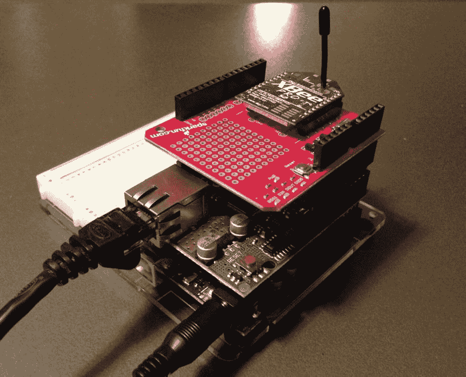
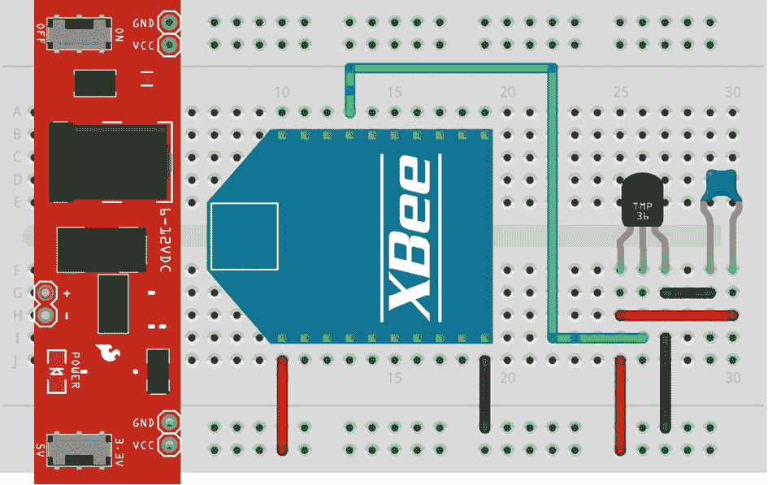

# 10.构建您的网络:Arduino 无线聚合器+无线传感器节点+ Raspberry Pi 服务器

根据目前为止你在书中学到的信息，尤其是第 8 章[和第 9 章](08.html)[中的信息，是时候把它们放在一起，用 MySQL 数据库服务器构建你的第一个传感器网络了。](09.html)

在本章中，您将所有组件放在一起，构建一个工作传感器网络，该网络以您的 Raspberry Pi MySQL 服务器作为数据存储库，一个数据聚合节点(您可以看到 Arduino 和 Raspberry Pi 的示例)，以及许多通过 XBee 模块连接的传感器节点。这些是您在前面章节中构建的构建模块，现在结合起来演示如何构建低成本传感器网络。

## 数据聚合节点

回想一下，数据聚合器是一个特殊的节点，用于接收来自多个来源(传感器)的信息并存储结果。源数据可以来自节点本身上的多个传感器，但更常见的是，数据聚合节点从不直接连接到聚合节点的多个传感器节点接收信息(它们通过 XBee 模块连接)。

大多数情况下，这些传感器由其他节点托管并放置在其他位置，并且数据聚集节点通过有线或无线连接连接到传感器节点。例如，您可能在一个位置将一个传感器托管在低功耗 Arduino 上，而在另一个位置将另一个传感器托管在 Raspberry Pi 上，这两个传感器都使用 XBee 模块连接到您的数据聚合节点。除了所选网络介质的限制之外，您可以让几十个节点向一个数据聚合节点提供传感器数据。

使用数据聚集节点有几个优点。如果您使用无线技术，如带有 XBee 模块的 ZigBee，数据聚合节点可以让您通过将数据聚合节点放置在离传感器最近的位置来扩展网络范围。然后，数据聚集节点可以通过更可靠的介质将数据传输到另一个节点，例如数据库服务器。

例如，您可能希望在有电源和以太网连接的外屋放置一个数据聚合节点，以从位于其他各种建筑物中的远程传感器节点收集数据。一个要考虑的情况是监控一个或多个房间甚至外部仓库的温度。这些建筑可能有电，也可能没有电，但很可能没有以太网线路。因此，数据聚合节点可以放置在最近的有电源和以太网端口的建筑物中。

Note

在这种情况下，我指的是距离传感器节点最近的点，它仍然在无线传输介质(如 XBee)的范围内。

数据聚合节点还允许您将处理一组传感器的逻辑移动到一个更强大的节点。例如，如果您使用需要代码来处理值的传感器(如 TMP36)，您可以使用数据聚合节点来接收来自这些传感器的原始数据，存储这些数据，并在以后计算这些值。这不仅确保了您只在一个位置拥有代码，而且还允许您为远程传感器使用不太复杂(功能不太强大)的主机。也就是说，您可以为传感器使用更便宜或更旧的 Arduino 板，为数据聚合节点使用更强大的 Arduino 板。这样做还有一个额外的好处，就是如果一个远程传感器损坏了，更换起来并不昂贵。

还记得，您必须决定要将传感器数据存储在哪里。数据聚合节点可以将数据本地存储在可移动介质或机载存储设备上(本地存储)，也可以将数据传输到另一个节点进行存储(远程存储)。选择使用哪一个通常基于数据将如何被消费或查看。

例如，如果您只想存储从传感器读取的最后一个值，您可能需要考虑某种形式的可视化显示或远程访问机制。在这种情况下，使用仅存储最新值的本地存储可能更具成本效益且不太复杂。

另一方面，如果您需要记录一段时间内的数据值以供以后处理，您应该考虑将数据存储在另一个节点上，以便可以在不影响传感器网络的情况下访问数据。也就是说，您可以将数据存储在更强大的系统上(比如个人计算机、服务器或基于云的服务)，并进一步降低聚合节点发生故障时丢失数据的风险。

以下部分基于前几章中的示例，探讨了每种形式的数据聚合器的示例。我将这些部分保持简短，以提供一个参考框架，并帮助您为本章后面讨论的项目积累知识。

### 本地存储数据聚合器

本地存储数据聚合器是一种节点，它被设计成从一个或多个传感器或传感器节点接收传感器数据，并将数据存储在内置于或连接到该节点的设备上。回想一下，对于基于 Arduino 的节点，这通常是通过 Arduino 以太网屏蔽或另一个 SD 卡屏蔽的 EEPROM(内存)或 SD 驱动器。回想一下，对于 Raspberry Pi，这可能是通过通用输入/输出(GPIO)引脚连接的 SD 引导驱动器、USB 驱动器或 EEPROM。

本地存储的性质是使用本地存储数据聚合节点的一个限制因素。也就是说，如果您想在以后处理数据，您可以选择一种介质，允许您检索数据并将其移动到另一台计算机上。如第 [7](07.html) 章所述，EEPROM 是一个不太可能的选择，因为它的易失性和连接到个人电脑的困难性。这使得 SD 卡或可移动驱动器成为唯一合理的替代方案。但是，如果传感器数据主要用于显示数据，您可以使用 EEPROM 来存储最新值或值的简短列表，以便按需显示。

这并不意味着本地存储数据聚合器是一个无用的概念。让我们考虑这样一种情况，您想要监控几个附属建筑的温度。您没有将数据用于任何分析，而只是希望能够在方便时(或需要时)读取这些值。

一个可能的解决方案是设计带有可视化显示的本地存储数据聚集节点。例如，您可以使用 LCD 来显示传感器数据。当然，这意味着数据聚集节点必须位于一个您可以轻松到达的位置。

但是，让我们考虑这样一种情况，您的数据聚合节点也位于远程位置。也许它也在另一个外屋，但是你大部分时间都在不同的地方度过。在这种情况下，远程访问解决方案是最好的。

幸运的是，您只需做很少的工作就可以提供这样的机制。考虑一下 Arduino 的以太网库。有一些示例草图向您展示了如何在 Arduino 上托管一个轻量级 web 服务器。如果您只想从远程位置访问传感器数据进行查看，web 服务器是理想的解决方案。您将浏览器指向数据聚合节点并查看数据。

这种数据聚合节点的设计需要在本地存储最新的值，比如说，在内存或 EEPROM 中，并且当客户端连接时，显示数据。对于本地存储数据聚合节点来说，这是一个简单而优雅的解决方案。下面的项目演示了这些技术。

### 项目:具有本地存储的数据聚合节点

如果您还没有从以前的项目中构建组件，或者在让一个或多个组件工作时遇到了问题，那么您可能想要返回并重温那些章节。我讨论了所需的每个组件，但没有达到前几章中的详细程度。如果您发现需要复习某些组件，请参考引用的章节。

综上所述，是时候用本地存储数据聚合节点来构建您的第一个传感器网络了。精明的读者会意识到，你已经在前几章中构建了所有传感器组件的示例。新的是本地存储的选择和显示数据的机制。

在这个项目中，您将构建一个数据聚合节点，它可以通过以太网访问，并支持一个轻量级 web 服务器来显示从多个传感器中的每一个读取的最新值。传感器节点通过 XBee 模块与数据聚合节点联网。除了 web 服务器部分和使用板载 EEPROM 存储数据的选择之外，数据聚合节点的代码与您在以前的项目中使用的代码相似。

#### 五金器具

这个项目的硬件由几个基于 XBee 的温度传感器节点组成，这些节点与一个基于 Arduino 的节点通信，该节点将成为您的数据聚合节点。我在第 [2](02.html) 和第 [4](04.html) 章讨论了 XBee 模块，在第 [4](04.html) 章讨论了 XBee 温度传感器节点。

##### 数据聚集节点

因为您想要使用 web 服务器，所以数据聚合节点需要 Arduino 以太网屏蔽和 XBee 屏蔽(或等效物)。如果您在 Arduino 上使用两个屏蔽，您可能需要使用一个可堆叠的接头套件( [`www.sparkfun.com/products/11417`](http://www.sparkfun.com/products/11417) )，以确保以太网屏蔽不会阻止 XBee 屏蔽的针脚正确就位。

图 [10-1](#Fig1) 显示了我在项目中使用的一种数据聚集节点。Arduino 屏蔽安装在 Arduino 板上，接头用于提高连接的高度，以便 XBee 屏蔽可以安全安装。尽管这使得电路板堆得相当高，但它仍然是一种紧凑的形式。



图 10-1

基于 Arduino 的数据聚合节点

如果您使用的 XBee 模块具有片上天线或其他形式的不从 XBee 模块顶部突出的天线，您可以先将 XBee 屏蔽放在 Arduino 上，然后将以太网屏蔽放在顶部。在这种情况下，您不需要额外的竖板。

可堆叠的接头套件是一个方便的附件，因为它允许您提高防护罩的高度，以便您可以访问或在某些情况下查看 Arduino 板上的组件(如 led 和一些防护罩通用的各种按钮或开关)。您可以在 SparkFun、Adafruit 和大多数供应商那里找到可堆叠的接头套件，这些供应商都有 Arduino 板和屏蔽板。

您还需要一种为数据聚合节点供电的方法。如果您计划将该项目作为实验来执行，并让节点通过 USB 电缆连接到您的笔记本电脑，那么您就可以了，不需要更多。但是如果您计划部署节点，您需要通过典型的壁式电源为 Arduino 供电。9V 电源应该足够了，或者您可以使用通过筒式连接器连接的 9V 电池。图 [10-2](#Fig2) 显示了 SparkFun 的壁式电源。图 [10-3](#Fig3) 显示了来自 SparkFun 的 9V 电池托架。


图 10-3

9V 电池托架(SparkFun 提供)


图 10-2

壁式电源(SparkFun 提供)

确保为数据聚合节点使用配置了*协调器 API* 固件的 XBee 模块。请参阅第 [2](02.html) 和 [4](04.html) 章，了解如何配置 XBee 模块的详细信息。

##### 传感器节点

回想一下第 [4](04.html) 章，XBee 传感器节点的硬件包括一个试验板、一些跳线、一个试验板电源、一个电源(典型的 5–9V 壁式电源适配器即可)、一个 TMP36 温度传感器和一个 0.10uF 电容。您还需要一个 XBee 分线板，带有插头(试验板的间距为 0.1 英寸)，就像 Adafruit 或 SparkFun 提供的那种。温度传感器节点可以通过 9V 电池供电，如果有电源，也可以通过 9V 壁式电源供电。

为了方便起见，我在图 [10-4](#Fig4) 中重复了第 [4](04.html) 章的接线图。您需要构建至少两个这样的温度传感器节点，但是三个会是更好的测试项目。



图 10-4

TMP 传感器节点接线

Note

有可能使用较低电压的电源。有关更多信息，请参考试验板电源的文档。

确保为每个传感器节点使用配置有*终端设备*或*路由器 API* 固件的 XBee 模块。请参考第 [2](02.html) 和 [4](04.html) 章，了解如何配置 XBee 模块的详细信息。每个传感器节点的设置在表 [10-1](#Tab1) 中重复。

表 10-1

XBee 传感器节点选项和值

<colgroup><col class="tcol1 align-left"> <col class="tcol2 align-left"> <col class="tcol3 align-left"> <col class="tcol4 align-left"></colgroup> 
| 

密码

 | 

设置名称

 | 

描述

 | 

价值

 |
| --- | --- | --- | --- |
| D3 | a3/上帝 3 | 触发模拟或数字数据记录 | 2—ADC |
| 身份 | 平移 ID | 网络的 Id | Eight thousand and eighty-eight |
| 红外的 | 输入输出采样率 | 等待发送数据的时间 | 3a 98—15000 毫秒 |
| 镍 | 节点标识符 | 节点的名称 | TMP36_* |
| V+ | 电源电压阈值 | 电源电压 | FFFF(总是发送) |

Note

您应该给每个 XBee 一个惟一的节点 id，比如`TMP36_1`、`TMP36_2`、`TMP36_3`等等。这对于本章后面的 Raspberry Pi 示例是必不可少的。

回想一下，连接到 Arduino 的 XBee 模块是使用表 [10-2](#Tab2) 中所示的以下设置的*协调器*角色。

表 10-2

XBee 协调器选项和值

<colgroup><col class="tcol1 align-left"> <col class="tcol2 align-left"> <col class="tcol3 align-left"> <col class="tcol4 align-left"></colgroup> 
| 

**代码**

 | 

**设定名称**

 | 

**描述**

 | 

**值**

 |
| --- | --- | --- | --- |
| 身份 | 平移 ID | 网络的 Id | Eight thousand and eighty-eight |
| 镍 | 节点标识符 | 节点的名称 | 协调者 |

继续构建您的温度传感器节点。将它们连接起来，并仔细检查试验板电源的电源设置。确保将其设置为 3.3V。一旦您连接好所有温度传感器节点，请不要给它们通电。在给传感器节点加电之前，您需要等待，直到您完成草图的编写并上传到数据聚合节点。我将在下一节讨论草图。

Tip

当您在处理这个项目时——实际上，最初几次启动网络时——您应该在同一位置测试所有内容。例如，在同一个表或工作台上设置传感器节点和数据聚集节点，并调试网络，直到一切正常工作。只有这样，您才能安全地将传感器节点部署到它们的远程位置。 <sup>[1](#Fn1)</sup>

#### 软件

这个项目的软件不需要任何额外的特殊库或类似的下载，这些你在前面的章节中已经加载过了。我先给出草图的概述，然后更详细地讨论新的部分。为了简洁起见，我跳过了以前项目中使用的一些代码。请参考清单 [10-4](#PC8) 中的完整代码了解更多细节，并确保您了解代码如何工作。

##### 概观

您使用的草图结合了 Arduino IDE 中的 web 服务器示例以及以前项目中的代码。你可以稍微重新安排一下，因为向串行监视器写入数据的需求减少了。事实上，您不需要向串行监视器写入任何内容。但是出于调试的目的，您确实留下了一些语句。

如果你还没有在 Arduino IDE 中试验过 web 服务器示例(参见*文件* ➤ *示例* ➤ *以太网*或*文件* ➤ *示例* ➤ *WiFi* )，如果你觉得这个草图的代码很有挑战性(或者如果你只是想在 Arduino 及其以太网或 WiFi 盾上找点乐子)，你可能会想这么做。

Tip

如果草图不像您预期的那样工作，请考虑添加额外的打印语句，以便将调试信息打印到串行监视器。这是编写和调试大型或复杂草图的一种非常常见的做法。

这个草图的 web 服务器部分并不复杂，也不难理解。本质上，您使用`EthernetServer`库来监听连接；一旦建立了连接，您就可以通过一个`EthernetClient`实例将 HTML 代码写回客户端。

或者，如果你决定使用 WiFi 盾，你使用`WiFiServer`库监听连接；一旦建立了连接，您就可以通过一个`WiFiClient`实例将 HTML 代码写回客户端。在这一部分，我们将探索该草图的 WiFi 版本。

如前所述，您存储了每个传感器节点的最新值，以便在 web 服务器上显示。如第 [7](07.html) 章所述，使用 Arduino 时存储这些值会出现问题。您的选择仅限于使用 Arduino Ethernet shield 上的 SD 驱动器或板载 EEPROM。

虽然你在第 [7](07.html) 章中试验了外部 EEPROM，但为了简单起见，你使用了板载 EEPROM。板载 EEPROM 的大小因 Arduino 板的选择而异，但在大多数情况下，它足以为每个传感器节点存储十几个字节。

要使用板载 EEPROM，只需在草图中包含`EEPROM.h`文件。读取和写入板载 EEPROM 非常容易，一次只能读取一个字节。您调用`EEPROM.read()`，传入您想要读取的字节的地址。写入 EEPROM 类似。你调用`EEPROM.write()`，传入你想要存储字节的地址和你想要存储的数据(字节)的值。使用这个库的例子可以在 Arduino IDE 中找到。

现在让我们进入代码！以下部分介绍了草图的主要组件—web 服务器、本地存储和从传感器节点读取数据。我省略了处理传感器数据的代码，因为这是第 4 章中代码的直接复制，为了简洁，我跳过了一些普通的操作。在 Arduino IDE 中打开一个新的草图，并将其命名为`Arduino_Web_Aggregate.ino`。

##### 轻量级 Web 服务器

轻量级 web 服务器的代码取自 Arduino IDE 中的一个示例。您可以通过将向客户端发送数据的代码移动到一个单独的函数中来修改该示例。

要构建 web 服务器，首先必须包含正确的库并声明一些变量。以下摘录显示了所需的代码(为了清楚起见，省略了其他组件的代码):

```py
#include <WiFi.h>
...
byte mac[] = {0xDE, 0xAD, 0xBE, 0xEF, 0xFE, 0xED};
IPAddress ip(10, 0, 1, 111);

// Start Ethernet Server class with port 80 (default for HTTP)
WiFiServer server(80);
...

```

请注意，您包括了 WiFi(或以太网)和 SPI 头。您还声明了两个变量:一个 MAC 地址和一个 IP 地址。在以前的项目中，您允许以太网库使用 DHCP 来分配 IP 地址；但是在这种情况下，您需要知道 IP 地址，因此您必须使用静态 IP 地址。请确保选择一个对您的数据聚合节点将连接到的网段有效的地址。

最后，初始化`WiFiServer`类的一个实例，将它传递到端口 80(这是 HTTP 服务的默认端口)。您可以选择另一个端口号，但可能需要将其添加到您的 URL 中才能访问 web 服务器。例如，如果你选择`3303`，你将使用`http://10.0.1.111:3303`。

现在真正有趣的部分来了。您构建的 web 服务器是一个简化的服务，它只向客户端返回少量的 HTTP 代码。除了包含文件和变量，您还需要在`setup()`方法中初始化以太网类。下面的代码显示了需要什么。本质上，首先初始化串行库，然后是 WiFi 库(为简洁起见省略)，最后是服务器实例。请参考第 [6](06.html) 、 [7](07.html) 和 [9](09.html) 章中的 WiFi 示例，了解有关设置 WiFi 部分的更多详细信息。

```py
void setup() {
  Serial.begin(115200);
  while (!Serial); // wait for serial port to connect

  // WiFi section
...
  server.begin();
...
}

```

为了让 web 服务器在客户端连接时做出响应，您向草图中添加了一个名为`listener()`的新方法。下面的代码显示了从`loop()`方法调用该方法的位置。在这种情况下，首先检查传感器的响应；如果没有可用的传感器数据，您将检查客户端是否已连接并响应呼叫:

```py
void loop() {
  if [...]

  } else {
    // Listen for client and respond.
    listener();
  }
}

```

至于监听器部分，您需要做的是检查客户端是否已经通过`server.available()`方法连接。这个方法的返回是一个`EthernetClient`类的实例。如果变量不为空(一个客户端已经连接)，那么通过`client.available()`方法检查客户端是否可用。如果是这样，就为每个请求的响应发送数据，直到检测到换行符。

首先通过`client.print()`和`client.println()`方法发送 HTTP 头。您还可以发送欢迎用户的横幅。如果传感器数据存储在本地，则发送每个存储的传感器节点的数据(通过一个循环)；否则，您会发送一个状态横幅，声明没有数据。

传感器数据的发送是通过名为`send_sensor_data()`的新方法进行的。该方法使用客户端实例的`client.print()`和`client.println()`方法 <sup>[2](#Fn2)</sup> 以文本形式写入数据，并为每个数据块写入结束 HTTP 标记。在这种情况下，您发送传感器节点的地址、摄氏温度、华氏温度以及来自传感器节点的参考电压。

清单 [10-1](#PC4) 显示了监听客户端并发送响应所需的代码。为了简洁起见，我展示了发送数据的客户端代码的摘录:`setup()`和`loop()`代码。所需的完整代码请参考清单 [10-4](#PC8) 。

```py
...
void send_sensor_data(EthernetClient *client, int num_sample) {
  unsigned int address;
  float temp_c;
  float temp_f;
  float volts;

  // Read sensor data from memory and display it.
  read_sample(num_sample, &address, &temp_c, &temp_f, &volts);

  client->println("<br />");
  client->print("Node Address: ");
  client->print(address, HEX);
  client->print(".");
...
}

void listener() {
  // listen for incoming clients
  EthernetClient client = server.available();
  if (client) {
    Serial.println("Got a connection!");
    // an http request ends with a blank line
    boolean currentLineIsBlank = true;
    while (client.connected()) {
      if (client.available()) {
        char c = client.read();
        // if you've gotten to the end of the line (received a newline
        // character) and the line is blank, the http request has ended,
        // so you can send a reply
        if (c == '\n' && currentLineIsBlank) {
          // send a standard http response header
          client.println("HTTP/1.1 200 OK");
          client.println("Content-Type: text/html");
          client.println();

          // Print header
          client.println("Welcome to the Arduino Data Aggregate Node!");
          client.println("<br />");

          // read sensor data
          byte num_samples = EEPROM.read(0);
          for (int i = 0; i < num_samples; i++) {
            send_sensor_data(&client, i);
          }
          // if no data, say so!
          if (num_samples == 0) {
            client.print("No samples to display.");
            client.println("<br />");
          }
          break;
        }
        if (c == '\n') {
          currentLineIsBlank = true;
        }
        else if (c != '\r') {
          currentLineIsBlank = false;
        }
      }
    }
    // give the web browser time to receive the data
    delay(1);
    // close the connection:
    client.stop();
  }
}
...

Listing 10-1The Web Server Code

```

既然您已经理解了 web 服务器组件是如何工作的，那么让我们来研究一下本地存储组件。

##### 使用板载 EEPROM 的本地存储

本地存储组件使用板载 EEPROM 来存储和检索传感器数据。在概述部分，我讨论了使用这个库有多容易。在这一节中，我将讨论如何存储和检索传感器数据的细节。

因为您只存储来自每个传感器节点的最新值(样本),并且您可能有多个传感器节点进行通信，所以您需要一种简单的机制来组织数据。你可以使用类似于第 [7](07.html) 章的外部 EEPROM 项目。

EEPROM 存储器的第一个字节(地址 0)用于存储当前样本数和每个样本的 10 字节块。不是存储每个传感器节点的整个 64 位地址(XBee 64 位网络地址)，而是存储最后 2 个字节，当转换为十六进制并显示为文本时，将显示 4 个十六进制数字。 <sup>[3](#Fn3)</sup> 你也只存储原始传感器数据，它是一个浮点型(4 字节)，和参考电压，它也是一个浮点型(4 字节)。因此，你需要 10 个字节来存储一个样本。

因为您只存储来自传感器的原始数据，所以您必须稍后像在第 [4](04.html) 章中一样执行温度计算。我把这个留给你在清单 [10-4](#PC8) 中探索。

您还可以向`setup()`方法添加代码，以在初始启动时初始化 EEPROM。在这种情况下，向地址 0 写入 0 意味着没有存储样本。这确保您可以简单地通过重置(或关闭然后打开)数据聚合节点来从头重新启动。如果您发现您需要使值持久化，那么在`setup()`方法至少执行一次之后，从该方法中取出下面的代码:

```py
void setup() {
 ...
  // Initialize the EEPROM
  EEPROM.write(0, 0);
}

```

为了使事情变得简单一点，我们创建了四种读写 EEPROM 的新方法。清单 [10-2](#PC6) 显示了完整的方法。请注意，您有两组方法，一组用于整数(2 字节)，一组用于浮点变量(4 字节)。

```py
...
// Read an integer from EEPROM
int read_int(byte position) {
  int value = 0;
  byte* p = (byte*)(void*)&value;
  for (int i = 0; i < sizeof(value); i++)
      *p++ = EEPROM.read(position++);
  return value;
}

// Read a float from EEPROM
float read_float(byte position) {
  float value = 0;
  byte* p = (byte*)(void*)&value;
  for (int i = 0; i < sizeof(value); i++)
      *p++ = EEPROM.read(position++);
  return value;
}

// Write an integer to EEPROM
void write_int(byte position, int value) {
  const byte *p = (const byte *)(const void *)&value;
  for (int i = 0; i < sizeof(value); i++)
      EEPROM.write(position++, *p++);
}

// Write a float to EEPROM
void write_float(byte position, float value) {
  const byte *p = (const byte *)(const void *)&value;
  for (int i = 0; i < sizeof(value); i++)
      EEPROM.write(position++, *p++);
}
...

Listing 10-2EEPROM Helper Methods

```

请注意，在代码中，您使用了一些指针技巧来将整数转换为字节数组。这对于高级 C 和 C++程序员编写的代码来说并不少见。虽然可以使用其他方法(比如移位字节)将值分解成字节，但是我想用这种高级技术来让您思考指针是如何工作的。在更复杂的草图中，你很可能会遇到以类似方式操作指针的情况。

Tip

对于那些不能放任自流的人(你知道你是谁)，毫无疑问你可以在这里看到一些优化的空间。请注意，这些方法非常相似。唯一真正改变的是类型。那么，如何进一步优化这段代码呢？提示:考虑一个模板 <sup>[4](#Fn4)</sup> ( [`http://playground.arduino.cc/Code/EEPROMWriteAnything`](http://playground.arduino.cc/Code/EEPROMWriteAnything) )。

现在，您已经了解了如何在 EEPROM 中存储和检索样本，接下来让我们看看这是如何融入从传感器节点读取数据的代码中的。

##### 通过 XBee 从传感器节点读取数据

从多个 XBee 模块读取数据的代码与第 [4](04.html) 章中的项目相同。事实上，您为该草图编写的代码能够并且确实支持多个传感器节点的连接。回想一下，这是可能的，因为您的数据聚合节点使用配置为协调器的 XBee 模块，而您的传感器节点使用配置为路由器的 XBee 模块。

因为初始化代码与第 4 章中的项目没有变化，所以我在这里省略了那些细节。但是用于存储传感器数据的代码是不同的。在这种情况下，您需要将样本存储在存储器(EEPROM)中。因为您只想存储最新的值，所以必须首先通过地址在内存中查找样本。如果找到匹配项，将数据保存在相同的位置。如果在存储的样本中找不到匹配，则将其添加到末尾，并增加存储的样本数。你把这个方法和之前一样命名为`record_sample()`。

但你不会就此结束。您还需要读取和写入示例数据的方法。您将这些方法分解成单独的方法，这样就可以使`record_sample()`方法更小，更容易阅读。因此，您创建了`read_sample()`和`write_sample()`方法，它们使用前面描述的 EEPROM 辅助方法来存储和检索样本。

清单 [10-3](#PC7) 显示了存储传感器数据的新代码的主要部分和`loop()`方法的完整代码。注意它是如何排除了`listener()`调用的。

```py
// Read a sample from EEPROM
void read_sample(byte index, unsigned int *address, float *temp_f,
                 float *temp_c, float *volts) {
  float temp;
  byte position =  (index * bytes_per_sample) + 1;

  *address = read_int(position);

  temp = read_float(position + 2);

  *temp_c = ((temp * 1200.0 / 1024.0) - 500.0) / 10.0;
  *temp_f = ((*temp_c * 9.0)/5.0) + 32.0;

  *volts = read_float(position + 6);
}

// Write sample to EEPROM
void write_sample(byte index) {
  byte position =  (index * bytes_per_sample) + 1;

  write_int(position, address);
  write_float(position + 2, temperature);
  write_float(position + 6, voltage);
}

void record_sample(ZBRxIoSampleResponse *ioSample) {
  int saved_addr;

  // Get sample data from XBee
  get_sample_data(ioSample);

  // See if already in memory. If not, add it.
  byte num_samples = EEPROM.read(0);
  boolean found = false;
  for (byte i = 0; i < num_samples; i++) {
    byte position = (i * bytes_per_sample) + 1;

    // get address
    saved_addr = read_int(position);
    if (saved_addr == address) {
      write_sample(i);
      found = true;
    }
  }
  if (!found) {
    // Save sample
    write_sample(num_samples);

    // Update number of sensors
    num_samples++;
    EEPROM.write(0, num_samples);
  }
}

...

void loop() {
  //attempt to read a packet
  xbee.readPacket();

  if (xbee.getResponse().isAvailable()) {
    // got something

    if (xbee.getResponse().getApiId() == ZB_IO_SAMPLE_RESPONSE) {

      // Get the packet
      xbee.getResponse().getZBRxIoSampleResponse(ioSample);

      // Get and store the data locally (in memory)
      record_sample(&ioSample);
    }
    else {
      Serial.print("Expected I/O Sample, but got ");
      Serial.print(xbee.getResponse().getApiId(), HEX);
    }
  } else if (xbee.getResponse().isError()) {
    Serial.print("Error reading packet.  Error code: ");
    Serial.println(xbee.getResponse().getErrorCode());
  } else {
    // Listen for client and respond.
    listener();
  }
}

Listing 10-3Reading from XBee Sensor Nodes

```

对该草图的新组件的讨论到此结束。以下部分包括整个草图，所有这些组件都在适当的上下文中。一定要花时间通读代码。这是迄今为止你在这本书里用过的最大的草图(代码)。

##### 把这一切放在一起

现在您已经了解了草图主要组件的工作原理，让我们更详细地检查完成的草图。清单 [10-4](#PC8) 显示了草图的完整代码。回想一下，我们将该文件命名为`Arduino_Web_Aggregate.ino`。

Tip

如果您使用的是 Leonardo，请查看软件序列号( [`www.arduino.cc/en/Reference/SoftwareSerial`](http://www.arduino.cc/en/Reference/SoftwareSerial) )代码上关于 XBee 保护罩引脚的注释。根据你的列奥纳多使用的盾，你可能需要改变这些。

```py
/**
  Beginning Sensor Networks Second Edition
  Example Arduino Data Aggregate Node

  This project demonstrates how to receive sensor data from
  multiple XBee sensor nodes, save the samples in the onboard
  EEPROM and present them as a web page. It uses an Arduino
  with an XBee shield with an XBee coordinator installed.

  Note: This sketch was adapted from the examples in the XBee
  library created by Andrew Rapp.
*/

#include <XBee.h>
#include <SoftwareSerial.h>
#include <WiFi.h>
#include <EEPROM.h>

byte bytes_per_sample = 10; // address (2), temp (4), volts (4)

// Setup pin definitions for XBee shield
uint8_t recv = 8;
uint8_t trans = 9;
SoftwareSerial soft_serial(recv, trans);

// assign a MAC address and IP address for the Arduino
byte mac_addr[] = { 0xDE, 0xAD, 0xBE, 0xEF, 0xFE, 0xED };

IPAddress server_addr(192,168,42,8);  // IP of the MySQL *server* here
char user[] = "arduino_user";            // MySQL user login username
char password[] = "secret";              // MySQL user login password
char ssid[] = "SSID";
char pass[] = "PASSWORD";

// Start WiFi Server class with port 80
WiFiServer server(80);

// Instantiate an instance of the XBee library
XBee xbee = XBee();

// Instantiate an instance of the IO sample class
ZBRxIoSampleResponse ioSample = ZBRxIoSampleResponse();

// Sample data values
unsigned int address;   // Last 4 digits of XBee address
float temperature;      // Raw temperature value
float voltage;          // Reference voltage

// Get sample data
void get_sample_data(ZBRxIoSampleResponse *ioSample) {
  Serial.print("Received data from address: ");
  address = (ioSample->getRemoteAddress64().getMsb() << 8) +
             ioSample->getRemoteAddress64().getLsb();
  Serial.print(ioSample->getRemoteAddress64().getMsb(), HEX);
  Serial.println(ioSample->getRemoteAddress64().getLsb(), HEX);
  temperature = ioSample->getAnalog(3);
  int ref = xbee.getResponse().getFrameData()[17] << 8;
  ref += xbee.getResponse().getFrameData()[18];
  voltage = (float(ref) * float(1200.0 / 1024.0))/1000.0;
}

// Read an integer from EEPROM
int read_int(byte position) {
  int value = 0;
  byte* p = (byte*)(void*)&value;
  for (int i = 0; i < sizeof(value); i++)
      *p++ = EEPROM.read(position++);
  return value;
}

// Read a float from EEPROM
float read_float(byte position) {
  float value = 0;
  byte* p = (byte*)(void*)&value;
  for (int i = 0; i < sizeof(value); i++)
      *p++ = EEPROM.read(position++);
  return value;
}

// Write an integer to EEPROM
void write_int(byte position, int value) {
  const byte *p = (const byte *)(const void *)&value;
  for (int i = 0; i < sizeof(value); i++)
      EEPROM.write(position++, *p++);
}

// Write a float to EEPROM
void write_float(byte position, float value) {
  const byte *p = (const byte *)(const void *)&value;
  for (int i = 0; i < sizeof(value); i++)
      EEPROM.write(position++, *p++);
}

// Read a sample from EEPROM
void read_sample(byte index, unsigned int *address, float *temp_c,
                 float *temp_f, float *volts) {
  float temp;
  byte position =  (index * bytes_per_sample) + 1;

  *address = read_int(position);

  temp = read_float(position + 2);

  *temp_c = ((temp * 1200.0 / 1024.0) - 500.0) / 10.0;
  *temp_f = ((*temp_c * 9.0)/5.0) + 32.0;

  *volts = read_float(position + 6);
}

// Write sample to EEPROM
void write_sample(byte index) {
  byte position =  (index * bytes_per_sample) + 1;

  write_int(position, address);
  write_float(position + 2, temperature);
  write_float(position + 6, voltage);
}

// Record a sample
void record_sample(ZBRxIoSampleResponse *ioSample) {
  int saved_addr;

  // Get sample data from XBee
  get_sample_data(ioSample);

  // See if already in memory. If not, add it.
  byte num_samples = EEPROM.read(0);
  boolean found = false;
  for (byte i = 0; i < num_samples; i++) {
    byte position = (i * bytes_per_sample) + 1;

    // get address
    saved_addr = read_int(position);
    if (saved_addr == address) {
      write_sample(i);
      found = true;
    }
  }
  if (!found) {
    // Save sample
    write_sample(num_samples);

    // Update number of sensors
    num_samples++;
    EEPROM.write(0, num_samples);
  }
}

void send_sensor_data(WiFiClient *client, int num_sample) {
  unsigned int address;
  float temp_c;
  float temp_f;
  float volts;

  // Read sensor data from memory and display it.
  read_sample(num_sample, &address, &temp_c, &temp_f, &volts);

  client->print("<br />\nNode Address: ");
  client->print(address, HEX);
  client->print("<br />\nTemperature: ");
  client->print(temp_c);
  client->print("C<br />\nTemperature: ");
  client->print(temp_f);
  client->print("F<br />\nVoltage: ");
  client->print(volts);
  client->println("V<br />");
}

void listener() {
  // listen for incoming clients
  WiFiClient client = server.available();
  if (client) {
    Serial.println("Got a connection!");
    // an http request ends with a blank line
    boolean currentLineIsBlank = true;
    while (client.connected()) {
      if (client.available()) {
        char c = client.read();
        // if you've gotten to the end of the line (received a newline
        // character) and the line is blank, the http request has ended,
        // so you can send a reply
        if (c == '\n' && currentLineIsBlank) {
          // send a standard http response header
          client.println("HTTP/1.1 200 OK");
          client.println("Content-Type: text/html");
          client.println();

          // Print header
          client.println("Welcome to the Arduino Data Aggregate Node!");
          client.println("<br />");

          // read sensor data
          byte num_samples = EEPROM.read(0);
          for (int i = 0; i < num_samples; i++) {
            send_sensor_data(&client, i);
          }
          // if no data, say so!
          if (num_samples == 0) {
            client.print("No samples to display.");
            client.println("<br />");
          }
          break;
        }
        if (c == '\n') {
          currentLineIsBlank = true;
        }
        else if (c != '\r') {
          currentLineIsBlank = false;
        }
      }
    }
    // give the web browser time to receive the data
    delay(100);
    // close the connection:
    client.stop();
  }
}

void setup() {
  Serial.begin(115200);
  while (!Serial); // wait for serial port to connect

  // WiFi section
  Serial.println("Starting WiFi.");
  int status = WiFi.begin(ssid, pass);
  // if you're not connected, stop here:
  if (status != WL_CONNECTED) {
    Serial.println("Couldn't get a WiFi connection!");
    while(true);
  }
  // if you are connected, print out info about the connection:
  else {
    Serial.println("Connected to network");
    IPAddress ip = WiFi.localIP();
    Serial.print("My IP address is: ");
    Serial.println(ip);
  }
  server.begin();

  soft_serial.begin(9600);
  xbee.setSerial(soft_serial);

  // Initialize the EEPROM
  EEPROM.write(0, 0);
}

void loop() {
  //attempt to read a packet
  xbee.readPacket();

  if (xbee.getResponse().isAvailable()) {
    // got something

    if (xbee.getResponse().getApiId() == ZB_IO_SAMPLE_RESPONSE) {

      // Get the packet
      xbee.getResponse().getZBRxIoSampleResponse(ioSample);

      // Get and store the data locally (in memory or on card?)
      record_sample(&ioSample);
    }
    else {
      Serial.print("Expected I/O Sample, but got ");
      Serial.print(xbee.getResponse().getApiId(), HEX);
    }
  } else if (xbee.getResponse().isError()) {
    Serial.print("Error reading packet.  Error code: ");
    Serial.println(xbee.getResponse().getErrorCode());
  } else {
    // Listen for client and respond.
    listener();
    delay(100);
  }
}

Listing 10-4Local-Storage Data-Aggregate Node

```

花些时间浏览草图，直到你完全理解了所有东西是如何协同工作的。一旦你熟悉并熟悉了代码，编译它并上传到你的 Arduino。

#### 测试项目

一旦代码编译成功并上传到您的 Arduino 数据聚合节点，在任何传感器节点通电之前，通过 web 浏览器连接到您的 Arduino。请务必使用您在草图中填写的 IP 地址。图 [10-5](#Fig5) 显示了正确的响应。此时，您也可以打开串行监视器。


图 10-5

来自未连接传感器的数据聚合节点的示例响应

如果您看到这个响应，那么您已经成功地编写了一个运行在 Arduino 上的非常轻量级的 web 服务器！这有多酷？现在，打开一个温度传感器节点的电源，等待 5-10 分钟。如果您还没有打开串行监视器，现在就打开，然后等待传感器节点数据到达。您应该会在串行监视器中看到消息“`Received data from address: NNNNN`”。发生这种情况时，刷新浏览器并注意变化。

如果您在 web 浏览器中获得了一些数据，请打开所有传感器节点的电源，等待几个样本到达。如果有三个温度传感器节点在运行，下面显示了串行监视器应该打印的内容。请注意，地址会有所不同，应该与您的 XBee 模块相匹配。

```py
Starting WiFi.
Connected to network
My IP address is: 192.168.42.12
Got a connection!
Got a connection!
Got a connection!

```

等到您看到几个迭代的样本到达，然后刷新您的浏览器。您应该只看到一个条目，其中包含每个连接的传感器的最新样本。下面显示了一个示例结果，其中有三个传感器节点提供数据。

```py
Welcome to the Arduino Data Aggregate Node!

Node Address: DB79
Temperature: 21.60C
Temperature: 70.88F
Voltage: 3.82V

Node Address: D45C
Temperature: 18.20C
Temperature: 64.77F
Voltage: 3.24V

Node Address: 29DB
Temperature: 11.52C
Temperature: 52.74F
Voltage: 3.15V

```

等待几分钟，然后刷新浏览器。您应该会看到样本值发生了变化。如果没有(或者你只是想找点乐子)，小心地影响传感器的值，把它们放在离热源或冷源更近的地方。

Note

如果您没有看到来自传感器节点的任何数据，并且串行监视器中没有任何指示接收到任何数据的内容，请使用第 [2](02.html) 和 [4](04.html) 章中的故障排除部分来诊断 XBee 模块的可能问题。请记住，它们都必须具有相同版本的 API 固件，传感器节点必须具有*路由器*角色，数据聚合节点必须具有*协调器*角色。此外，一定要留出至少 10 分钟的时间让 XBee 模块连接并形成网络。

好吧，那很有趣，不是吗？的确是这样:您现在已经展示了对传感器网络基本构建模块的掌握。虽然您只使用了 Arduino 节点来使这一点更容易理解，但下一个项目将 Raspberry Pi 引入其中，进一步完善了您的传感器网络工具缓存。

Note

如果您的输出与显示的有所不同，这是正常的。在某些情况下，您可能还会注意到传感器报告的数据与更精确的设备测量的数据之间存在微小差异。只要您看到特定传感器的值在公差范围内(查看供应商的数据表)，您的传感器节点就工作正常。

#### 为了更多乐趣

你可以用这个项目做很多很酷的事情。对我来说最明显的是用有意义的标签替换 XBee 地址。更具体地说，按位置标记传感器节点。例如，XBee 节点`CD0F`位于我的门廊，而节点`29DB`位于我的办公室。如果网页上的标签写明贝尔博士的办公室和贝尔夫人的门廊，那就更有意义了。提示:为这些数据创建一个查找表，以便在向客户端显示时可以替换这些值。

另一个探索领域是使用 SD 卡而不是板载 EEPROM 来存储数据。不是只存储每个传感器节点的最后一个值，而是在单独的文件中存储每个传感器的运行值列表。当客户端请求数据时，只显示最后写入每个文件的值。这将演示将本地存储数据聚合节点变成允许随时间存储值的节点所需的微小更改。注意不要超过 SD 卡的容量！

有一样东西是这个项目所没有的，它对于您想知道样本是何时采集的情况来说是必不可少的:样本的日期和时间！该项目存储每个传感器的最新值，但您不知道样本是何时采集的。例如，如果您只从一个传感器接收一次数据，并且发生了一些事情导致该传感器停止发送数据，该怎么办？没有日期和时间参考，你无法知道这一点。要解决这个问题，您可以修改项目以使用实时时钟模块，并存储每个样本的日期和时间，如第 [7](07.html) 章所示。提示:您需要通过添加实时时钟值来扩展存储样本数据的方法。

如果您正在寻找一个重大的挑战，修改代码以将数据发送到云，并将云用作您的数据存储机制。

### 远程存储数据聚合器

远程存储数据聚合器是一种节点，设计用于从一个或多个传感器或传感器节点接收传感器数据，并将数据存储在不同的节点上。最常见的情况是，另一个节点是一个具有更强大存储设备的系统。例如，它可能是一台可以存储大文件的计算机，也可能是一台允许您将数据存储在表中的数据库服务器。

远程存储数据聚合节点没有本地存储数据聚合节点复杂，因为不需要处理数据以在本地设备中显示或存储。相反，您只是将原始数据传递到远程节点(系统)进行存储。

如果您希望存储数据以供以后处理，远程存储也是首选。虽然丢失一些值是可以接受的，但更有可能的是，您希望收集所有产生的数据，以便您的分析更加准确。 <sup>[5](#Fn5)</sup> 因此，您希望从数据聚合节点到远程存储节点的连接是可靠的。

也可能有这样的情况，即您向多个节点发送数据。考虑这样一种情况，您正在使用不同的传感器或产生不同格式数据的传感器。在这种情况下，您可能希望将一些传感器的数据发送到一个远程节点，而将其他数据发送到其他节点。这样做的原因没有使用不同的本地存储数据聚合节点那么重要，但这仍然是一个问题。我将在下一章考虑这一问题以及类似的传感器网络规划问题。

在下面几节中，您将看到 Arduino 和 Raspberry Pi 的这种形式的数据聚集节点的工作示例。

### 项目:Arduino 数据-带数据库存储的聚合节点

该项目使用以前的项目作为其基础。您可以使用类似的硬件(电路板、屏蔽板)和软件，但草图稍有不同。如果您还没有构建上一个项目的组件，或者在让它工作时遇到了问题，那么您可能想先回去诊断并纠正问题。

由于我们将使用我们在第 [9](09.html) 章看到的连接器/Arduino，我们将需要使用一个内存更大的 Arduino 板。对于这个项目，我建议使用 Arduino Uno，或者更好的 Arduino Mega 2560 板。事实上，我将使用 Mega 2560 演示该项目。

Note

如果您使用 WiFi 屏蔽，请务必参考供应商的数据表或设置文档，以便在 Arduino Mega 2560 上正确使用主板。

您还可以使用您在第 8 章[中创建的 MySQL 数据库服务器和第 9 章](08.html)[中的连接机制。如果你还没有建立数据库服务器或者在你的电脑上安装了数据库服务器，你需要回到第 8 章](09.html)[并建立它。](08.html)

Note

如果你在用 MySQL 配置 Raspberry Pi 时遇到问题，或者想简化项目，你可以使用在另一台电脑上运行的 MySQL 服务器。但是，如果您计划安装或使用这个项目作为您自己的传感器网络的基础，您应该运行您的 Raspberry Pi 数据库服务器。

既然如此，是时候构建传感器网络，将样本存储在数据库中了。精明的读者会意识到您已经在前几章中构建了所有组件的示例。

#### 五金器具

这个项目使用与上一个项目相同的传感器硬件作为传感器节点和数据聚集节点。不同之处在于，您使用一个更大的板作为数据聚合节点，而我们添加了一个新节点 MySQL 数据库服务器。

回想一下第 [8](08.html) 章，MySQL 数据库服务器是一个通过 USB 集线器连接外部硬盘的 Raspberry Pi(Raspberry Pi 无法通过 USB 总线为硬盘等设备供电)。如果您还没有构建 MySQL 数据库服务器，请参考第 [8](08.html) 章中的“构建 Raspberry Pi MySQL 服务器”部分。

继续启动数据库服务器，并确保它可以接受连接。在使用其他节点时，您可以让服务器保持开机和连接状态。在完成数据聚合节点的所有软件更改之前，最好关闭传感器节点的电源。

#### 软件

与硬件一样，您使用与上一个项目中相同的软件，尽管为 MySQL 连接添加了额外的库，并对草图做了一些修改。因为您使用相同的 XBee 配置，所以从 XBee 模块读取数据的所有代码都与前一个项目中的相同。

我省略了创建 web 服务器并将数据值写入 EEPROM 的代码。这删除了许多代码，但基本结构是相同的。新的部分是对 MySQL 连接器 Arduino 库的调用，用于连接到数据库服务器并发出查询以保存数据，正如您在第 [9](09.html) 章中看到的。在以下段落中，您将学习草图的每个新部分。后面一节将介绍如何配置 MySQL 数据库。

##### 将 MySQL 连接器代码添加到草图

如果你还没有安装 MySQL 连接器 Arduino 库，请参考第 [9](09.html) 章安装该库。一旦你安装了这个库，打开一个新的草图并命名为`Arduino_MySQL_Aggregate.ino`。下面显示了从 XBee 模块读取数据所需的库以及连接器库:

```py
#include <XBee.h>
#include <SoftwareSerial.h>
#include <WiFi.h>
#include <MySQL_Connection.h>
#include <MySQL_Cursor.h>

```

您重用了与 XBee 通信的变量，但是从库中添加了一个`MySQL_Connector`类的实例、用户、密码、SQL `INSERT`和默认数据库字符串，如下所示:

```py
char user[] = "arduino_user";      // MySQL user login username
char password[] = "secret";        // MySQL user login password
// Sample query
char INSERT_SQL[] = "INSERT INTO house.temperature (address, raw_temp, voltage) VALUES('%s','$s','%s')";
char DEFAULT_DATABASE[] = "house";
...
WiFiClient client;
MySQL_Connection conn((Client *)&client);

```

你还需要存储 MySQL 数据库服务器的 IP 地址 <sup>[6](#Fn6)</sup> 。通过下面的代码可以做到这一点。确保为您的 MySQL 服务器使用正确的 IP 地址——不使用正确的地址将导致草图首次启动时出现连接错误(因为您是通过`setup()`方法连接到服务器的):

```py
IPAddress server_addr(192,168,42,8);  // IP of the MySQL *server* here

```

您保留了上一个项目中的`get_sample_data()`方法，但是删除了`listener()`、`send_sensor_data()`和 EEPROM 读写方法。然而,`record_sample()`方法需要重写。既然这样，你还是叫`get_sample_data()`；但是，您没有从原始数据中计算温度并将其显示到串行监视器上，而是构建了一个`INSERT` SQL 语句来将数据保存在一个表中(我将在下一节解释数据库的设置)。这需要构建字符串来保存字符串中十六进制地址的最后四位数字、原始温度和电压。一旦构建了字符串，您只需调用 MySQL 连接器类实例的`cmd_query()`方法(`my_conn`)。新方法如下所示:

```py
void record_sample(ZBRxIoSampleResponse *ioSample) {
  int saved_addr;
  char temp_buff[20];
  char voltage_buff[20];
  char query[128];

  // Get sample data from XBee
  get_sample_data(ioSample);

  // Send data to MySQL
  String addr(address, HEX);
  dtostrf(temperature, 4, 4, temp_buff);
  dtostrf(voltage, 4, 4, voltage_buff);
  sprintf(query, addr.c_str(), temp_buff, voltage_buff);

  Serial.println(&query[0]);
  // Initiate the query class instance
  MySQL_Cursor *cur_mem = new MySQL_Cursor(&conn);
  // Execute the query
  int res = cur_mem->execute(query);
  if (!res) {
    Serial.println("Query failed.");
  } else {
    Serial.println("Ok.");
  }
  delete cur_mem;
}

```

对`setup()`方法的更改需要添加连接到数据库服务器的代码。您删除了对`server.begin()`和`EEPROM.write(0, 0)`的调用，因为您既没有启动 web 服务器，也没有使用 EEPROM 来存储样本。相反，将以下代码添加到`setup()`方法的末尾:

```py
// Now connect to MySQL
Serial.println("Connecting to MySQL...");
if (conn.connect(server_addr, 3306, user, password, DEFAULT_DATABASE)) {
  delay(1000);
} else {
  Serial.println("Connection failed.");
}

```

修改`loop()`方法要容易得多。所有的调用都是为了读取 XBee 模块和调用`record_sample()`方法。剩下唯一要做的事情就是删除最后一个包含对`listener()`方法调用的 else 语句。

正如你所看到的，修改上一个项目的草图非常容易。事实上，如果您想节省一些编码时间，您可以从以前的项目中复制代码，并删除不需要的部分。清单 [10-5](#PC16) 显示了完整的草图，包括上一个项目中重复使用的所有零件。

```py
/**
  Beginning Sensor Networks Second Edition
  Sensor Networks Example Arduino Data Aggregate Node

  This project demonstrates how to receive sensor data from
  multiple XBee sensor nodes saving the samples in a MySQL
  database.

  It uses an Arduino with an XBee shield with an XBee
  coordinator installed.
*/

#include <XBee.h>
#include <SoftwareSerial.h>
#include <WiFi.h>
#include <MySQL_Connection.h>
#include <MySQL_Cursor.h>

// Setup pin definitions for XBee shield
uint8_t recv = 8;
uint8_t trans = 9;
SoftwareSerial soft_serial(recv, trans);

// assign a MAC address and IP address for the Arduino
byte mac_addr[] = { 0xDE, 0xAD, 0xBE, 0xEF, 0xFE, 0xED };

IPAddress server_addr(192,168,42,8);  // IP of the MySQL *server* here
char user[] = "arduino_user";      // MySQL user login username
char password[] = "secret";        // MySQL user login password
char ssid[] = "SSID";
char pass[] = "PASSWORD";
// Sample query
char INSERT_SQL[] = "INSERT INTO house.temperature (address, raw_temp, voltage) VALUES('%s','$s','%s')";
char DEFAULT_DATABASE[] = "house";

WiFiClient client;
MySQL_Connection conn((Client *)&client);

// Start WiFi Server class with port 80
WiFiServer server(80);

// Instantiate an instance of the XBee library
XBee xbee = XBee();

// Instantiate an instance of the IO sample class
ZBRxIoSampleResponse ioSample = ZBRxIoSampleResponse();

// Sample data values
unsigned int address;   // Last 4 digits of XBee address
float temperature;      // Raw temperature value
float voltage;          // Reference voltage

// Get sample data
void get_sample_data(ZBRxIoSampleResponse *ioSample) {
  Serial.print("Received data from address: ");
  address = (ioSample->getRemoteAddress64().getMsb() << 8) +
             ioSample->getRemoteAddress64().getLsb();
  Serial.print(ioSample->getRemoteAddress64().getMsb(), HEX);
  Serial.println(ioSample->getRemoteAddress64().getLsb(), HEX);
  temperature = ioSample->getAnalog(3);
  int ref = xbee.getResponse().getFrameData()[17] << 8;
  ref += xbee.getResponse().getFrameData()[18];
  voltage = (float(ref) * float(1200.0 / 1024.0))/1000.0;
}

// Record a sample
void record_sample(ZBRxIoSampleResponse *ioSample) {
  int saved_addr;
  char temp_buff[20];
  char voltage_buff[20];
  char query[128];

  // Get sample data from XBee
  get_sample_data(ioSample);

  // Send data to MySQL
  String addr(address, HEX);
  dtostrf(temperature, 4, 4, temp_buff);
  dtostrf(voltage, 4, 4, voltage_buff);
  sprintf(query, addr.c_str(), temp_buff, voltage_buff);

  Serial.println(&query[0]);
  // Initiate the query class instance
  MySQL_Cursor *cur_mem = new MySQL_Cursor(&conn);
  // Execute the query
  int res = cur_mem->execute(query);
  if (!res) {
    Serial.println("Query failed.");
  } else {
    Serial.println("Ok.");
  }
  delete cur_mem;
}

void setup() {
  Serial.begin(115200);
  while (!Serial); // wait for serial port to connect

  // WiFi section
  Serial.println("Starting WiFi.");
  int status = WiFi.begin(ssid, pass);
  // if you're not connected, stop here:
  if (status != WL_CONNECTED) {
    Serial.println("Couldn't get a WiFi connection!");
    while(true);
  }
  // if you are connected, print out info about the connection:
  else {
    Serial.println("Connected to network");
    IPAddress ip = WiFi.localIP();
    Serial.print("My IP address is: ");
    Serial.println(ip);
  }
  soft_serial.begin(9600);
  xbee.setSerial(soft_serial);

  // Now connect to MySQL
  Serial.println("Connecting to MySQL...");
  if (conn.connect(server_addr, 3306, user, password, DEFAULT_DATABASE)) {
    delay(1000);
  } else {
    Serial.println("Connection failed.");
  }
}

void loop() {
  //attempt to read a packet
  xbee.readPacket();

  if (xbee.getResponse().isAvailable()) {
    // got something

    if (xbee.getResponse().getApiId() == ZB_IO_SAMPLE_RESPONSE) {

      // Get the packet
      xbee.getResponse().getZBRxIoSampleResponse(ioSample);

      // Get and store the data locally (in memory or on card?)
      record_sample(&ioSample);
    }
    else {
      Serial.print("Expected I/O Sample, but got ");
      Serial.print(xbee.getResponse().getApiId(), HEX);
    }
  } else if (xbee.getResponse().isError()) {
    Serial.print("Error reading packet.  Error code: ");
    Serial.println(xbee.getResponse().getErrorCode());
  }
}

Listing 10-5Arduino Remote-Storage Data Aggregate

```

您可能想知道为什么删除了计算华氏温度和摄氏温度的代码。您这样做是因为您可以将此功能转移到数据库服务器。这不仅释放了一些处理能力(对于较小的微控制器来说是一个很大的帮助)，而且对于像 Arduino 这样的平台来说，它还释放了少量的内存。这个项目节省的成本可能很小，但是考虑一下非常复杂的草图或者正在做其他事情的 Arduino 的情况。内存的任何节省都可以为存储数据或使用更多传感器提供更多空间。

例如，考虑构建一个节点的需求，该节点不仅通过 XBee 网络充当数据集合，而且还托管 Arduino 上通过 I2C 接口连接的许多传感器，并通过一些其他硬件专用接口显示数据，如 LCD 面板甚至硬拷贝打印机。 <sup>[7](#Fn7)</sup> 所有这些组件都需要包含库；根据 Arduino 的大小，内存可能会不足。我构建的草图迫使我使用 Arduino Mega，不是因为草图的大小，而是因为我需要使用的库所需要的内存总量。

现在您已经构建了草图，让我们转向数据库服务器，看看需要做些什么来支持在表中存储样本。

##### 设置 MySQL 数据库

本节讨论了在 MySQL 服务器上创建数据库以保存和报告传感器数据所需的工作。您需要做的第一件事是创建想要使用的数据库，并用必要的对象填充它。在这种情况下，您需要两个表和一个触发器。我向您展示了所有需要的命令，但为了简洁起见，省略了与服务器的大部分交互。如果你还没有阅读这些章节，请参考第 [6](06.html) 和 [7](07.html) 章节，获得关于 MySQL 的快速入门教程。

连接到您的 MySQL 数据库服务器。回想一下，如果在 Raspberry Pi 上运行，您可以通过`mysql -uroot -p<password>`命令来完成，或者如果在 PC 上运行，您可以通过`mysqlsh --uri root@localhost:3306 --sql`命令来使用 MySQL Shell。继续创建数据库并将其命名为 house，如下所示:

```py
CREATE DATABASE house;
USE house;

```

数据将存储在一个表中。如前所述，您希望存储 XBee 传感器节点的地址(64 位地址的最后四个十六进制数字)、原始温度样本和电压。

此时，您可以考虑向数据库服务器添加一些功能，否则需要在数据聚合节点上做更多的工作。例如，考虑这样一个事实:您想知道样本是什么时候采集的。也就是说，您希望存储样本的日期和时间。如果您还记得前面的章节，您必须使用连接到 Arduino 的实时时钟模块来显示样本的日期和时间。幸运的是，您可以通过使用 timestamp 数据类型创建一个列，简单地指示数据库服务器自动存储这些数据，从而避免所有的代码和硬件。当行被插入到表中时，此数据类型存储当前日期和时间。很酷，是吧？

但是你可能想知道这是怎么回事。让服务器为字段填充数据的技巧是不要在`INSERT`语句中传递值。这是一个特殊的 sentinel 值，服务器将其解释为您想要计算时间戳并保存它。请注意，如果需要存储特定的值，可以为该列提供特定的时间戳。

您还可以将计算华氏温度和摄氏温度的代码移到数据库中。这需要使用触发器(一个特殊的代码块，可以在插入、更新或删除行的特定时刻执行)。一会儿你看着扳机；现在，您可以简单地为每个温度值添加一列。

因此，您总共需要六列:样本的日期和时间、传感器节点的地址、原始温度样本、电压、华氏温度和摄氏温度。实现该表所需的`CREATE TABLE`语句如下。命名桌子温度:

```py
CREATE TABLE `temperature` (
  `sample_date` timestamp DEFAULT CURRENT_TIMESTAMP ON UPDATE CURRENT_TIMESTAMP,
  `address` char(8) DEFAULT NULL,
  `raw_temp` float DEFAULT NULL,
  `voltage` float DEFAULT NULL,
  `fahrenheit` float DEFAULT '0',
  `celsius` float DEFAULT '0'
) ENGINE=InnoDB DEFAULT CHARSET=latin18;

```

请注意，您没有使用主键。我把这个问题留给你来考虑，我将在下一章讨论数据库设计的注意事项。

What about Nodes Without Xbees? What Address Do I Use?

这里创建的表使用一个短字符串作为 XBee 传感器节点的地址。如果您添加一个不使用 XBees 的传感器节点(它直接连接到服务器以存储数据)，或者如果有传感器连接到数据聚合节点，您会使用什么？无论哪种情况，您都可以为每个传感器创建自己的唯一值。您可以使用 XBee 64 位地址的最后四位数字的约定，并存储十六进制值。您可以轻松地用从 0000 到 FFFF 的值对传感器节点和传感器进行编号。这给你留下了大量的工作价值。但是一定不要使用与 XBees 相同的值。

回想一下，上一个项目的挑战之一是为每个传感器节点使用有意义的名称。您也可以将它以查找表的形式移动到数据库服务器。在这种情况下，您需要一个与存储在温度表中的值相匹配的列和另一个用于存储更有意义的名称的列。这允许您在保留数据的原始形式的同时添加更多对人友好的数据。稍后，您将看到在服务器上查询数据时如何检索这些信息。以下语句创建名为 sensor_names 的新表，并用数据填充它。您以一个示例`SELECT`语句结束，以检索输入的数据:

```py
CREATE TABLE `sensor_names` (
  `address` char(8) DEFAULT NULL,
  `name` char(30) DEFAULT NULL
) ENGINE=InnoDB DEFAULT CHARSET=latin1;

INSERT INTO sensor_names VALUES ('DB79', 'New Porch');
INSERT INTO sensor_names VALUES ('D45C', 'Living Room');
INSERT INTO sensor_names VALUES ('29DB', 'Office');

SELECT * FROM house.sensor_names;
+---------+-------------+
| address | name        |
+---------+-------------+
| 29a2    | New Porch   |
| 29db    | Living Room |
| cd0f    | Office      |
+---------+-------------+
3 rows in set (0.00 sec)

```

Tip

当您在项目中使用 XBee 节点时，请在下面的`INSERT`语句中使用这些地址。

现在让我们考虑一下触发器。这就是将计算华氏和摄氏温度的代码移植到数据库服务器的方法。我鼓励你检查一下在线 MySQL 参考手册中触发器的语法和用法( [`https://dev.mysql.com/doc/refman/8.0/en/create-trigger.html`](https://dev.mysql.com/doc/refman/8.0/en/create-trigger.html) )。同时，我将向您展示添加您需要的触发器需要哪些语句。

您需要检测新行何时被添加到表中。当这种情况发生时，您希望执行计算并将结果存储在适当的列中。因此，您需要创建一个在插入新行之前运行的触发器。当该事件发生时，您可以执行计算。以下代码显示了您需要创建的触发器。这些计算看起来应该很熟悉，尽管语法不同。请注意 new 运算符的使用，它允许您引用传入(新)行中的值进行读取或写入:

```py
DELIMITER //
CREATE TRIGGER calc_temp BEFORE INSERT ON temperature
FOR EACH ROW
BEGIN
  declare c float;
  set c = ((new.raw_temp * 1200.0 / 1024.0) - 500.0) / 10.0;
  set new.celsius = c;
  set new.fahrenheit = ((c * 9.0)/5.0) + 32.0;
END;
//
DELIMITER ;

```

您可能注意到的第一件事是使用了`DELIMITER`命令。这是一个特殊的命令，可用于替换；在`mysql`客户端中决定语句结束的字符。在这种情况下，您使用`//`而不是`;`。

因为触发器主体包含以分号结尾的 SQL 语句，所以需要进行`DELIMITER`更改。如果您没有更改分隔符，`mysql`客户端将检测到语句结束，并尝试执行部分编码的触发器。如果在创建这个触发器时遇到语法错误，请检查以确保使用了如图所示的`DELIMITER`命令。请注意，您做的最后一件事是将分隔符改回分号。

还要注意，您设置了在插入之前执行的触发器，并且有一个循环来处理每个新行。虽然您发出的是单个`INSERT`语句，但是这个语法是必需的，因为可能会出现一次添加多个新行的情况。例如，如果涉及到事务，在处理完几行之前，可能不会提交(永久存储)更改。在这种情况下，触发器将触发一次，并且将为每个新行处理一次正文。

如果你还没有在第 [9](09.html) 章中授予用户访问权限，你也需要这样做。您可以使用`CREATE USER`和`GRANT`语句来实现这一点:

```py
CREATE USER 'arduino_user'@'%' IDENTIFIED WITH mysql_native_password BY 'secret';
GRANT ALL ON *.* to 'arduino_user'@'%';

```

现在，您已经设置好了 MySQL 数据库服务器并创建了必要的数据库对象，让我们把它们放在一起，看看它是如何运行的。此时，您可以将草图上传到 Arduino 数据聚合节点(确保它已接入您的网络),并打开传感器节点的电源。在给传感器节点通电之前，请等待 3-5 分钟。

#### 测试项目

加载草图后，打开串行监视器，观察关于连接到 MySQL 数据库服务器的语句。如果一切正常，您应该会看到一条成功消息。如果没有，请检查您使用的 IP 地址，并确保您的 MySQL 服务器正在运行并接受连接。

当您看到连接成功消息时，您可以打开传感器节点的电源。您应该开始看到在每个传感器节点的串行监视器中打印出一条消息。回想一下清单 [10-5](#PC16) 中，您打印了一份从 XBee 读取的数据的公告(并显示了地址)。您还可以显示样本数据的完整的`INSERT`语句。

如果让草图运行一段时间，并让几个传感器节点通电并通信，您将开始看到草图也记录了来自这些传感器节点的样本。清单 [10-6](#PC22) 显示了为来自几个传感器节点的样本打印的语句示例。

```py
Connected to network
My IP address is: 192.168.42.12
Connecting...
...trying...
Connected to server version 8.0.19
Received data from address: 13A20040A0D45C
Query: INSERT INTO house.temperature (address, raw_temp, voltage) VALUES ('d45c',573.0000,3.2062) ... Ok.
Received data from address: 13A200409029DB
Query: INSERT INTO house.temperature (address, raw_temp, voltage) VALUES ('29db',546.0000,3.1688) ... Ok.
Received data from address: 13A2004192DB79
Query: INSERT INTO house.temperature (address, raw_temp, voltage) VALUES ('db79',622.0000,3.8109) ... Ok.
Received data from address: 13A20040A0D45C
Query: INSERT INTO house.temperature (address, raw_temp, voltage) VALUES ('d45c',572.0000,3.2109) ... Ok.
Received data from address: 13A200409029DB
Query: INSERT INTO house.temperature (address, raw_temp, voltage) VALUES ('29db',547.0000,3.1734) ... Ok.
Received data from address: 13A2004192DB79
Query: INSERT INTO house.temperature (address, raw_temp, voltage) VALUES ('db79',622.0000,3.8109) ... Ok.
Received data from address: 13A20040A0D45C
Query: INSERT INTO house.temperature (address, raw_temp, voltage) VALUES ('d45c',572.0000,3.2109) ... Ok.
Received data from address: 13A200409029DB
Query: INSERT INTO house.temperature (address, raw_temp, voltage) VALUES ('29db',546.0000,3.1688) ... Ok.
Received data from address: 13A2004192DB79
Query: INSERT INTO house.temperature (address, raw_temp, voltage) VALUES ('db79',623.0000,3.8109) ... Ok.
Received data from address: 13A20040A0D45C
Query: INSERT INTO house.temperature (address, raw_temp, voltage) VALUES ('d45c',572.0000,3.2109) ... Ok.
Received data from address: 13A200409029DB
Query: INSERT INTO house.temperature (address, raw_temp, voltage) VALUES ('29db',546.0000,3.1734) ... Ok.
Received data from address: 13A2004192DB79
Query: INSERT INTO house.temperature (address, raw_temp, voltage) VALUES ('db79',622.0000,3.8098) ... Ok.

Listing 10-6Output from Arduino_MySQL_Aggregate Sketch

```

如果你看到类似这些例子的结果，你已经解决了这个项目！但是数据库里的数据呢？你怎么看？一旦草图运行了一段时间，连接到您的 MySQL 数据库服务器，发出以下命令，并观察结果:

```py
> SELECT * FROM house.temperature;
+---------+--------+-------+---------+---------+--------------+
| sample_date | address | raw_temp | voltage | fahrenheit | celsius |
+---------+--------+-------+---------+---------+--------------+
| 2020-03-22 19:30:30 | d45c | 573 | 3.2062 | 62.8672 | 17.1484  |
| 2020-03-22 19:30:45 | 29db | 546 | 3.1688 | 57.1719 | 13.9844  |
| 2020-03-22 19:31:00 | db79 | 622 | 3.8109 | 73.2031 | 22.8906  |
| 2020-03-22 19:31:15 | d45c | 572 | 3.2109 | 62.6562 | 17.0312  |
| 2020-03-22 19:31:30 | 29db | 547 | 3.1734 | 57.3828 | 14.1016  |
| 2020-03-22 19:31:45 | db79 | 622 | 3.8109 | 73.2031 | 22.8906  |
| 2020-03-22 19:32:00 | d45c | 572 | 3.2109 | 62.6562 | 17.0312  |
| 2020-03-22 19:32:15 | 29db | 546 | 3.1688 | 57.1719 | 13.9844  |
| 2020-03-22 19:32:30 | db79 | 623 | 3.8109 | 73.4141 | 23.0078  |
| 2020-03-22 19:32:45 | d45c | 572 | 3.2109 | 62.6562 | 17.0312  |
| 2020-03-22 19:33:00 | 29db | 546 | 3.1734 | 57.1719 | 13.9844  |
| 2020-03-22 19:33:15 | db79 | 622 | 3.8098 | 73.2031 | 22.8906  |
+---------+--------+-------+---------+---------+--------------+
12 rows in set (0.0007 sec)

```

请注意，我有许多行要查看！这是因为我将 XBee 模块的睡眠时间设置为一个非常低的值。实际上，您可以将睡眠时间设置为几秒钟以上。对于这个项目，让它频繁地进行采样是很好的。

还要注意，您已经为样本日期、华氏温度和摄氏温度列填充了数据！这表明 timestamp 数据类型起作用了，您的触发器在`INSERT`触发，创建了计算出的值。这难道不比让你那可怜的超负荷工作的 Arduino 计算出那些值更容易吗？

现在让我们考虑数据库服务器的另一个特性。回想一下上一个项目，您可以很容易地看到每个传感器节点的最后已知样本。如果你从来没有把这些值存储在任何地方，你怎么能再现这个特性呢？您不太可能需要这个特性，但是如果您需要类似的特性，让我们来探索一下。

答案是你确实存储了那些值！你在一个样本中存储每一个值。问题是您不知道表中的哪一行是每个传感器的最新数据。但答案还在，不是吗？

这是精明的 SQL 程序员挣钱的地方。您确实可以通过使用一个叫做分组的 SQL 魔术和`MAX()`函数来获得这些数据。在这种情况下，您需要传感器的名称(不是地址)以及华氏和摄氏温度值，就像您在 web 服务器上拥有的一样。

要获得名称，您必须连接(组合两个表中在一组公共列上匹配的行)temperature 和 sensor_names 表，并在地址上匹配。回想一下，每个表中的值都将匹配，即 sensor_names 表中的一行将与 temperature 表中特定数量的行匹配。

但是最后的值呢？要获得这些数据，您可以在子查询(从另一个查询中执行的查询)上使用`MAX()`函数来返回每组地址的最新时间戳。注意子查询中的`GROUP BY`子句。您可以使用子查询中的结果来限制`SELECT`的输出，只输出那些与每个地址的最新值匹配的行。以下代码显示了完整的`SELECT`语句和示例结果:

```py
SELECT name, fahrenheit, voltage
FROM temperature join sensor_names ON temperature.address = sensor_names.address
WHERE sample_date IN (
SELECT MAX(sample_date)
FROM temperature
GROUP BY address
);
+-------------+------------+---------+
| name        | fahrenheit | voltage |
+-------------+------------+---------+
| Living Room |    62.6562 |  3.2109 |
| Office      |    57.1719 |  3.1734 |
| New Porch   |    73.2031 |  3.8098 |
+-------------+------------+---------+
3 rows in set (0.0034 sec)

```

如果您认为这是一个非常复杂的查询，不要难过。当您开始使用数据库时，SQL 可能是一个相当大的挑战。如果您发现您需要使用这样的查询，那么购买一本关于学习 SQL 的书来更加熟悉 SQL 命令的能力和功能是值得的。

#### 为了更多乐趣

在这个项目中，你可以做很多事情。事实上，前一个项目的所有挑战都适用。剩下唯一要做的事情就是用 Raspberry Pi 替换其中一个传感器节点，用 Raspberry Pi 替换数据聚集节点。你在下一个项目中做后者，但是让我们考虑如何做前者。

第 7 章探讨了如何创建一个由 Raspberry Pi 托管的传感器节点。考虑将这一挑战向前推进一步，并将其与您在第 [7](07.html) 章中学到的关于使用 TMP36 传感器的知识结合起来。将这样的节点添加到您的网络中。

更有趣的是，您可以将先前项目中的 web 服务器组件添加到草图中。保留这些元素还会引入一种在第 [1](01.html) 章中讨论的数据聚合节点形式——混合数据聚合节点。回想一下，这样做的好处是，如果节点失去了与服务器的连接(或者服务器出现故障)，您至少可以从数据聚合节点获得最新的数据。

对于那些需要更多功能的人:如果你发现你需要一个更工业级的网关，你可以看看 Digi 工业网关；一个用于开发复杂应用程序的开源 Python 环境，支持 ZigBee，并有一个坚固的外壳。详见 [`www.digi.com/products/networking/gateways/xbee-industrial-gateway`](http://www.digi.com/products/networking/gateways/xbee-industrial-gateway) 。

既然您已经掌握了使用 Arduino 的数据聚合节点，那么让我们来探索使用 Raspberry Pi 构建数据聚合节点。

### 项目:Raspberry Pi 数据-带数据库存储的聚合节点

这个项目使用前一个项目中的传感器节点，但是不使用 Arduino 作为数据聚合节点的主机，而是使用 Raspberry Pi。您还将使用上一个项目中的同一个 MySQL 数据库服务器，通过 Raspberry Pi 数据聚合节点存储来自 XBee 传感器节点的传感器数据。

该项目的目标是重现上一个项目的功能。也就是说，您希望 Raspberry Pi 通过 XBee 模块(协调器)从多个传感器节点接收传感器样本，并将这些结果保存在 MySQL 数据库中。然而，由于我们使用的是 XBee Python 库，我们必须对如何根据原始数据计算温度做一些小的改动。正如您将看到的，变化很微妙，但并不困难。

该项目的基础是第 [5](05.html) 章的 Raspberry Pi XBee 项目。最好复习一下课文，以便熟悉这项任务。我展示了第 5 章[的接线图作为复习。](05.html)

#### 五金器具

该项目需要以前项目中的 XBee 托管传感器节点、一个 Raspberry Pi、一个 GPIO 分线板和电缆、一个试验板、一个 XBee 适配器和一些试验板跳线。

布线与第 [5](05.html) 章“项目:为 XBee 传感器节点创建 Raspberry Pi 数据采集器”一节中的相同。图 [10-6](#Fig6) 显示了来自章节 [5](05.html) 的试验板和布线。如图所示连接 XBee 适配器，将 GPIO 电缆连接到您的 Raspberry Pi，然后通电！您不必安装 XBee，但这样做是个好主意。记住，你需要你的协调节点。


图 10-6

将 XBee 连接到树莓 Pi

#### 软件

本项目的软件要求与第 [5](05.html) 章的项目相同。也就是说，您正在使用连接器/Python 库。参见第 [5](05.html) 章了解如何下载和安装库。但是，您必须安装另一个库 MySQL 连接器/Python 库。

您可以使用清单 [10-7](#PC25) 中所示的命令在您的 Raspberry Pi 上安装 MySQL 连接器/Python 库，这也将安装任何可能需要的必备库。

```py
$ pip3 install mysql-connector-python
Looking in indexes: https://pypi.org/simple, https://www.piwheels.org/simple
Collecting mysql-connector-python
  Downloading https://files.pythonhosted.org/packages/5c/1e/3f372b31853b868153e453146d99ca787da3eb4bf0b654590b829b262afa/mysql_connector_python-8.0.19-py2.py3-none-any.whl (355kB)
    100% |████████████████████████████████| 358kB 50kB/s
Collecting protobuf==3.6.1 (from mysql-connector-python)
  Downloading https://files.pythonhosted.org/packages/77/78/a7f1ce761e2c738e209857175cd4f90a8562d1bde32868a8cd5290d58926/protobuf-3.6.1-py2.py3-none-any.whl (390kB)
    100% |████████████████████████████████| 399kB 103kB/s
Collecting dnspython==1.16.0 (from mysql-connector-python)
  Downloading https://files.pythonhosted.org/packages/ec/d3/3aa0e7213ef72b8585747aa0e271a9523e713813b9a20177ebe1e939deb0/dnspython-1.16.0-py2.py3-none-any.whl (188kB)
    100% |████████████████████████████████| 194kB 112kB/s
Requirement already satisfied: six>=1.9 in /usr/lib/python3/dist-packages (from protobuf==3.6.1->mysql-connector-python) (1.12.0)
Requirement already satisfied: setuptools in /usr/lib/python3/dist-packages (from protobuf==3.6.1->mysql-connector-python) (40.8.0)
Installing collected packages: protobuf, dnspython, mysql-connector-python
Successfully installed dnspython-1.16.0 mysql-connector-python-8.0.19 protobuf-3.6.1

Listing 10-7Installing MySQL Connector/Python

```

回想一下，我提到过我们需要改变摄氏和华氏的计算，因为我们使用 XBee Python 库来读取数据。如果你还记得第五章的话，我们必须使用一个稍微不同的公式来计算温度。因此，我们将使用下面的命令禁用触发器，并将计算放在代码中，而不是使用现有的触发器。这很好，因为 Raspberry Pi 有足够的能力来进行计算。

```py
DROP TRIGGER house.calc_temp;

```

正如您将看到的，我们还将更改 INSERT SQL 命令来传递摄氏温度和华氏温度的值，而不是允许触发器填充这些值。

现在让我们开始编写您的 Python 脚本。如果你想复制第五章的剧本，你可以。只需将其复制到一个名为`pi_xbee_mysql.py`的文件中。或者你可以打开一个新文件，从头开始输入代码。

您需要输入的第一条语句是那些包含您需要的库的语句。回想一下第 [5](05.html) 章，其中包括`serial`和`xbee`库。您还添加了`mysql.connector`库，如下所示:

```py
import serial
from digi.xbee.devices import XBeeDevice
from digi.xbee.io import IOLine, IOMode
import mysql.connector

```

接下来，定义一些变量。你在第 [5](05.html) 章中使用了项目中相同的变量和定义，但是为你的 MySQL 代码添加了两个新的变量和定义。在这种情况下，您需要添加一个变量来存储数据库连接器类的实例。

您还需要扩展常量，以包含与 MySQL 服务器通信所需的常量。添加用户名、主机(或 IP)、端口和密码。这些值与您通过`mysql`客户端连接到 MySQL 服务器时使用的值相同。以下代码显示了所有常量和变量:

```py
# MySQL constants
USER = 'arduino_user'       # MySQL user id
PASSWD = 'secret'           # MySQL password
HOST_OR_IP = '192.168.42.8' # MySQL server IP address
PORT = 3306                 # MySQL port
# Query string
INSERT_SQL = ("INSERT INTO house.temperature (address, raw_temp, voltage, celsius, fahrenheit) "
              "VALUES('{0}', {1}, {2}, {3}, {4})")

# Serial port on Raspberry Pi
SERIAL_PORT = "/dev/ttyS0"
# BAUD rate for the XBee module connected to the Raspberry Pi
BAUD_RATE = 9600
# Analog pin we want to monitor/request data
ANALOG_LINE = IOLine.DIO3_AD3
# Sampling rate
SAMPLING_RATE = 15

# Get an instance of the XBee device class
device = XBeeDevice(SERIAL_PORT, BAUD_RATE)

# Variables for MySQL Connector/Python code
db_conn = None

```

Caution

确保所有常量都与 XBee 配置和访问 MySQL 数据库服务器的细节相匹配。如果脚本运行不正确或者您无法连接到 MySQL，请仔细检查这些设置。

我们将搜索网络一次并获得所有节点的列表，而不是通过节点 id 搜索网络中的节点。虽然这个例子一开始就展示了如何做到这一点，但是您可以使用 XBee 库注册一个回调来检测何时添加新节点。详见 [`https://xbplib.readthedocs.io/en/latest/user_doc/discovering_the_xbee_network.html`](https://xbplib.readthedocs.io/en/latest/user_doc/discovering_the_xbee_network.html) 的 API 文档。

以下代码显示了如何使用 XBee 库来发现网络上的节点:

```py
def discover_nodes():
    """Get a list of the nodes (node ids) on the network
    Returns:
    """
    # Request the network class and search the network for the remote node
    xbee_network = device.get_network()
    xbee_network.start_discovery_process()
    print("Discovering network", end='')
    while xbee_network.is_discovery_running():
        print(".", end='')
        time.sleep(0.5)
    print("done.")
    devices = xbee_network.get_devices();
    node_ids= []
    for dev in devices:
        print("Found {0} at {1}.".format(dev.get_node_id(), dev.get_64bit_addr()))
        node_ids.append(dev.get_node_id())
    if not node_ids:
        print("WARNING: No nodes found.")
    return node_ids

```

回想一下，我们现在需要一种方法来获取网络中的 XBee 节点，这样我们就可以捕获它正在报告的数据。

```py
def get_remote_device():
    """Get the remote node from the network
    Returns:
    """
    # Request the network class and search the network for the remote node
    xbee_network = device.get_network()
    remote_device = xbee_network.discover_device(REMOTE_NODE_ID)
    if remote_device is None:
        print("ERROR: Remove node id {0} not found.".format(REMOVE_NODE_ID))
        exit(1)
    remote_device.set_dest_address(device.get_64bit_addr())
    remote_device.set_io_configuration(ANALOG_LINE, IOMode.ADC)
    remote_device.set_io_sampling_rate(SAMPLING_RATE)

```

接下来，我们需要一个回调方法在数据准备好时执行。在这种情况下，我们将以相同的方法对数据形成`INSERT`查询，并调用`save_sample()`方法来执行它。

```py
def io_sample_callback(sample, remote, time):
    address = str(remote.get_64bit_addr())
    # Get the raw temperature value
    raw_temp = sample.get_analog_value(ANALOG_LINE)
    # Calculate supply voltage
    volts = (sample.power_supply_value * (1200.0 / 1024.0)) / 1000.0
    # Save results in the table
    short_addr = address[-4:]
    print("Reading from {0}: {1}, {2}.".format(short_addr, raw_temp, volts))
    # Get the temperature in Celsius
    temp_c = (sample.get_analog_value(ANALOG_LINE) / 1023.0 * 1.25 - 0.5) * 100.0
    # Calculate temperature in Fahrenheit
    temp_f = ((temp_c * 9.0) / 5.0) + 32.0
    print("\tTemperature is {0:.2f}C. {1:.2f}F".format(temp_c, temp_f))
    query = (INSERT_SQL.format(short_addr, raw_temp, volts, temp_c, temp_f))
    save_sample(db_conn, query)

```

为了使用`save_sample()`方法，我们向它传递数据库连接实例和一个查询字符串。该方法创建一个游标，执行查询，然后检查结果。如果有结果，它会将结果返回给调用者。完整的方法如下:

```py
def save_sample(conn, query_str):
    results = None
    cur = conn.cursor(
        cursor_class=mysql.connector.cursor.MySQLCursorBufferedRaw)
    try:
        res = cur.execute(query_str)
    except mysql.connector.Error as e:
        cur.close()
        raise Exception("Query failed. " + e.__str__())
    try:
        results = cur.fetchall()
    except mysql.connector.errors.InterfaceError as e:
        if e.msg.lower() == "no result set to fetch from.":
            pass # This error means there were no results.
        else:    # otherwise, re-raise error
            raise e
    conn.commit()
    cur.close()
    return results

```

现在你可以使用与第 5 章中的项目相同的形式来得到脚本的实质内容(一个无限循环 <sup>[9](#Fn9)</sup> ，有一个`break`例外)。但是首先，您要连接到数据库服务器(记住，遇到函数声明时不会执行，只有被调用时才会执行)。您创建了一个值字典，将它们设置为前面显示的常量。这是一种可以在任何 Python 脚本中使用的技术，以避免传递大量参数。以下代码尝试连接到 MySQL 服务器，如果成功，将返回数据库连接器类的实例:

```py
# Connect to database server
try:
    parameters = {
        'user': USER,
        'host': HOST_OR_IP,
        'port': PORT,
        'passwd': PASSWD,
        }
    print("Connecting to MySQL...", end='')
    db_conn = mysql.connector.connect(**parameters)
    print("done.")
except mysql.connector.Error as e:
    raise Exception("ERROR: Cannot connect to MySQL Server!")
    exit(1)

```

如果连接失败，就会抛出异常。如果发生这种情况，请确保检查您的常量值是否正确，并尝试使用相同的参数通过`mysql`客户端应用程序连接到 MySQL 服务器。一旦您可以通过`mysql`客户端成功连接，请再次尝试该脚本。

下一部分是 while infinity 循环，也取自第 [5](05.html) 章中的例子:

```py
try:
    # Read and save temperature data
    print("Welcome to example of storing data from a set of remote TMP36 sensors in MySQL!")

    device.open()  # Open the device class
    # Get the nodes on the network
    remote_node_ids = discover_nodes()
    # Setup the remote device
    for remote_id in remote_node_ids:
        get_remote_device(remote_id)
    # Register a listener to handle the samples received by the local device
    device.add_io_sample_received_callback(io_sample_callback)
    while True:
        pass
except KeyboardInterrupt:
    if device is not None and device.is_open():
        device.close()

```

一旦 while infinity 循环终止，您必须断开与服务器的连接。下面的代码可以做到这一点。在这种情况下，您可以忽略任何错误—您正在断开连接，并且您不在乎是否失败，因为脚本将会停止:

```py
# Disconnect from the server
try:
    db_conn.disconnect()
except:
    pass

```

如果您认为这不是很多代码，那么您是正确的。连接器/Python 库使得在 Python 中使用 MySQL 变得非常容易。清单 [10-8](#PC36) 显示了该项目的完整代码。在您尝试运行脚本之前，请花一些时间来确保所有内容都输入正确。

```py
#
# Beginning Sensor Networks Second Edition
# RasPi XBee Remote Storage Data Aggregator
#
# For this script, we read data from an XBee coordinator
# node whenever data is received from an XBee sensor node.
# We also need a connection to a database server for saving
# the results in a table.
#
# The data read is from one sample (temperature from a
# XBee sensor node and the supply voltage at the source) for
# each device on the network by node id.
#
import serial
import time
from digi.xbee.devices import XBeeDevice
from digi.xbee.io import IOLine, IOMode
import mysql.connector

# MySQL constants
USER = 'arduino_user'       # MySQL user id
PASSWD = 'secret'           # MySQL password
HOST_OR_IP = '192.168.42.8' # MySQL server IP address
PORT = 3306                 # MySQL port
# Query string
INSERT_SQL = ("INSERT INTO house.temperature (address, raw_temp, voltage, celsius, fahrenheit) "
              "VALUES('{0}', {1}, {2}, {3}, {4})")

# Serial port on Raspberry Pi
SERIAL_PORT = "/dev/ttyS0"
# BAUD rate for the XBee module connected to the Raspberry Pi
BAUD_RATE = 9600
# Analog pin we want to monitor/request data
ANALOG_LINE = IOLine.DIO3_AD3
# Sampling rate
SAMPLING_RATE = 15

# Get an instance of the XBee device class
device = XBeeDevice(SERIAL_PORT, BAUD_RATE)

# Variables for MySQL Connector/Python code
db_conn = None

# Save the sample in the database
def save_sample(conn, query_str):
    results = None
    cur = conn.cursor(
        cursor_class=mysql.connector.cursor.MySQLCursorBufferedRaw)
    try:
        res = cur.execute(query_str)
    except mysql.connector.Error as e:
        cur.close()
        raise Exception("Query failed. " + e.__str__())
    try:
        results = cur.fetchall()
    except mysql.connector.errors.InterfaceError as e:
        if e.msg.lower() == "no result set to fetch from.":
            pass # This error means there were no results.
        else:    # otherwise, re-raise error
            raise e
    conn.commit()
    cur.close()
    return results

# Method to connect to the network and discover the nodes
def discover_nodes():
    """Get a list of the nodes (node ids) on the network
    Returns:
    """
    # Request the network class and search the network for the remote node
    xbee_network = device.get_network()
    xbee_network.start_discovery_process()
    print("Discovering network", end='')
    while xbee_network.is_discovery_running():
        print(".", end='')
        time.sleep(0.5)
    print("done.")
    devices = xbee_network.get_devices();
    node_ids= []
    for dev in devices:
        print("Found {0} at {1}.".format(dev.get_node_id(), dev.get_64bit_addr()))
        node_ids.append(dev.get_node_id())
    if not node_ids:
        print("WARNING: No nodes found.")
    return node_ids

# Method to connect to the network and get the remote node by id
def get_remote_device(remote_id):
    """Get the remote node from the network
    Returns:
    """
    # Request the network class and search the network for the remote node
    xbee_network = device.get_network()
    remote_device = xbee_network.discover_device(remote_id)
    if remote_device is None:
        print("ERROR: Remote node id {0} not found.".format(remote_id))
        exit(1)
    remote_device.set_dest_address(device.get_64bit_addr())
    remote_device.set_io_configuration(ANALOG_LINE, IOMode.ADC)
    remote_device.set_io_sampling_rate(SAMPLING_RATE)

# Method to get the data when available from the remote node
def io_sample_callback(sample, remote, time):
    address = str(remote.get_64bit_addr())
    # Get the raw temperature value
    raw_temp = sample.get_analog_value(ANALOG_LINE)
    # Calculate supply voltage
    volts = (sample.power_supply_value * (1200.0 / 1024.0)) / 1000.0
    # Save results in the table
    short_addr = address[-4:]
    print("Reading from {0}: {1}, {2}.".format(short_addr, raw_temp, volts))
    # Get the temperature in Celsius
    temp_c = (sample.get_analog_value(ANALOG_LINE) / 1023.0 * 1.25 - 0.5) * 100.0
    # Calculate temperature in Fahrenheit
    temp_f = ((temp_c * 9.0) / 5.0) + 32.0
    print("\tTemperature is {0:.2f}C. {1:.2f}F".format(temp_c, temp_f))
    query = (INSERT_SQL.format(short_addr, raw_temp, volts, temp_c, temp_f))
    save_sample(db_conn, query)

# Connect to database server
try:
    parameters = {
        'user': USER,
        'host': HOST_OR_IP,
        'port': PORT,
        'passwd': PASSWD,
        }
    print("Connecting to MySQL...", end='')
    db_conn = mysql.connector.connect(**parameters)
    print("done.")
except mysql.connector.Error as e:
    raise Exception("ERROR: Cannot connect to MySQL Server!")
    exit(1)

try:
    # Read and save temperature data
    print("Welcome to example of storing data from a set of remote TMP36 sensors in MySQL!")

    device.open()  # Open the device class
    # Get the nodes on the network
    remote_node_ids = discover_nodes()
    # Setup the remote device
    for remote_id in remote_node_ids:
        get_remote_device(remote_id)
    # Register a listener to handle the samples received by the local device
    device.add_io_sample_received_callback(io_sample_callback)
    while True:
        pass
except KeyboardInterrupt:
    if device is not None and device.is_open():
        device.close()

# Disconnect from the server
try:
    db_conn.disconnect()
except:
    pass

Listing 10-8Raspberry Pi Remote-Storage Data Aggregator

```

#### 测试项目

要测试项目，请确保 XBee 适配器中安装了 XBee 协调器节点。在打开 XBee 传感器节点之前，请稍等片刻。所有节点通电后，您就可以开始工作了。发出以下命令启动脚本:

```py
$ python ./pi_xbee_mysql.py

```

如果您看到语法错误或异常，请确保修复它们并重新运行该命令。如果脚本启动并且没有发生任何事情，您知道它正在工作(或者至少没有任何错误)。回想一下，代码正在等待从 XBee 传感器节点接收数据包(样本)。当节点开始发送数据时，您会看到类似于清单 [10-9](#PC38) 中所示的输出。记住，你可以随时通过按下 *Ctrl+C* 来停止你的脚本。

```py
Connecting to MySQL...done.
Welcome to example of storing data from a set of remote TMP36 sensors in MySQL!
Discovering network.............done.
Found TMP36_2 at 0013A20040A0D45C.
Found TMP36_1 at 0013A2004192DB79.
Found TMP36_3 at 0013A200409029DB.
Reading from D45C: 543, 3.15.
    Temperature is 16.35C. 61.43F
Reading from DB79: 539, 3.82734375.
    Temperature is 15.86C. 60.55F
Reading from 29DB: 523, 3.0796875.
    Temperature is 13.91C. 57.03F
Reading from D45C: 544, 3.15.
    Temperature is 16.47C. 61.65F
Reading from DB79: 539, 3.82734375.
    Temperature is 15.86C. 60.55F
Reading from 29DB: 523, 3.0796875.
    Temperature is 13.91C. 57.03F
Reading from D45C: 544, 3.15.
    Temperature is 16.47C. 61.65F
Reading from DB79: 540, 3.82734375.
    Temperature is 15.98C. 60.77F
Reading from 29DB: 523, 3.084375.
    Temperature is 13.91C. 57.03F

Listing 10-9Example Output for pi_xbee_mysql.py

```

要查看您的样本是否保存在数据库中，请连接到服务器并执行以下查询:

```py
> SELECT * FROM house.temperature;
+------------+-----+--------+--------+-----------+------------+
| sample_date | address | raw_temp | voltage | fahrenheit | celsius |
+------------+------+-------+--------+-----------+------------+
| 2020-03-23 14:41:24 | D45C | 543 | 3.15    | 61.4282 | 16.349  |
| 2020-03-23 14:41:31 | DB79 |539  | 3.82734 | 60.5484 | 15.8602 |
| 2020-03-23 14:41:34 | 29DB | 523 | 3.07969 | 57.0293 | 13.9052 |
| 2020-03-23 14:41:39 | D45C | 544 | 3.15    | 61.6481 | 16.4712 |
| 2020-03-23 14:41:46 | DB79 | 539 | 3.82734 | 60.5484 | 15.8602 |
| 2020-03-23 14:41:49 | 29DB | 523 | 3.07969 | 57.0293 | 13.9052 |
| 2020-03-23 14:41:54 | D45C | 544 | 3.15 | 61.6481 | 16.4712 |
| 2020-03-23 14:42:02 | DB79 | 540 | 3.82734 | 60.7683 | 15.9824 |
| 2020-03-23 14:42:04 | 29DB | 523 | 3.08437 | 57.0293 | 13.9052 |
| 2020-03-23 14:42:09 | D45C | 544 | 3.15 | 61.6481 | 16.4712 |
| 2020-03-23 14:42:17 | DB79 | 539 | 3.825 | 60.5484 | 15.8602 |
| 2020-03-23 14:42:18 | 29DB | 523 | 3.07969 | 57.0293 | 13.9052 |
+---------------+-------+------+------+-------+------+

```

您应该在结果集中看到许多行，并且能够将这些行与脚本的输出相匹配。一旦您验证了它正在工作，恭喜您自己:您现在已经掌握了使用 Arduino 和 Raspberry Pi 构建远程存储数据聚合节点！

此外，您已经通过在每个项目中使用相同的 XBee 传感器节点展示了 XBee 模块的多功能性。花些时间试验脚本和存储在数据库中的数据。

#### 为了更多乐趣

那很有趣，不是吗？您可能想知道，对于如此坚实的 Python 代码，您还能做些什么。嗯，你可以做一些很酷的事情。

我能建议的最大挑战是使用这个脚本并稍微重写它，以便通过 ADC 模块从 TMP36 传感器获取数据。换句话说，将 Raspberry Pi 数据聚合节点更改为传感器节点，直接将其数据存储到数据库中。

除此之外，您可能想尝试将脚本更改为守护程序，这样您就可以在后台运行它，同时还可以使用您的 Raspberry Pi 做其他事情。

## 部件购物清单

本章中的项目没有必需的组件。表 [10-3](#Tab3) 显示了完成项目可能需要的可选组件列表。其余组件，如 XBee 模块和支持硬件，包含在其他章节的购物清单中；这些如表 [10-4](#Tab4) 所示。

表 10-3

所需组件

<colgroup><col class="tcol1 align-left"> <col class="tcol2 align-left"> <col class="tcol3 align-left"> <col class="tcol4 align-left"></colgroup> 
| 

项目

 | 

供应商

 | 

是吗？成本美元

 | 

所需数量

 |
| --- | --- | --- | --- |
| 可堆叠接头套件 | [T2`www.sparkfun.com/products/11417`](http://www.sparkfun.com/products/11417) | $1.50–1.95 | 1* |
| [T2`www.adafruit.com/products/85`](http://www.adafruit.com/products/85) |

**可选，可能不需要。*

表 10-4

以前章节中重复使用的组件

<colgroup><col class="tcol1 align-left"> <col class="tcol2 align-left"> <col class="tcol3 align-left"> <col class="tcol4 align-left"></colgroup> 
| 

项目

 | 

供应商

 | 

是吗？成本美元

 | 

所需数量

 |
| --- | --- | --- | --- |
| Arduino(任何支持盾牌的) | 各种各样的 | 25 美元及以上 | 每个节点 1 个 |
| XBee 盾 | [T2`www.sparkfun.com/products/12847`](http://www.sparkfun.com/products/12847) | $24.95 | one |
| TMP36 传感器 | [T2`www.sparkfun.com/products/10988`](http://www.sparkfun.com/products/10988) | $1.50 | 每个传感器节点 1 个 |
| [T2`www.adafruit.com/products/165`](http://www.adafruit.com/products/165) |
| 0.10uF 电容 | [T2`www.sparkfun.com/products/8375`](http://www.sparkfun.com/products/8375) | $0.25 | 每个传感器节点 1 个 |
| 试验板(非迷你) | [T2`www.sparkfun.com/products/9567`](http://www.sparkfun.com/products/9567) | $5.95 | 每个传感器节点 1 个 Raspberry Pi 个 |
| 试验板跳线 | [T2`www.sparkfun.com/products/8431`](http://www.sparkfun.com/products/8431) | $3.95 | one |
| XBee-ZB (ZB)系列 2 或 2.5 | [T2`www.sparkfun.com`](http://www.sparkfun.com) | $25.00 | 2–4(每个节点 1 个) |
| [T2`www.adafruit.com`](http://www.adafruit.com) |
| 树莓 Pi 型号 3B+或 4B 2GB 或 4GB | 大多数在线商店 | 35 美元及以上 | Two |
| HDMI 或 HDMI 转 DVI 电缆 | 大多数在线和零售商店 | 变化 | one |
| HDMI 或 DVI 监视器 | 大多数在线和零售商店 | 变化 | one |
| USB 键盘 | 大多数在线和零售商店 | 变化 | one |
| USB 电源 | 大多数在线和零售商店 | 变化 | one |
| USB A 型到微型 USB 插头 | 大多数在线和零售商店 | 变化 | one |
| SD 卡 2GB 或更大 | 大多数在线和零售商店 | 变化 | one |
| 剩余硬盘 | 任何 USB 硬盘(多余的或购买的) | 变化 | one |
| 树莓馅饼+ | [T2`www.adafruit.com/product/2029`](http://www.adafruit.com/product/2029) | $7.95 | one |
| 墙壁适配器 9V(可选) | [T0](http://www.sparkfun.com/products/)T1】 | $5.95 | 每个节点 1 个** |
| 9V 电池盒(可选) | [T2`www.sparkfun.com/products/10512`](http://www.sparkfun.com/products/10512) | $2.95–3.95 | 每个节点 1 个** |
| [T2`www.adafruit.com/products/67`](http://www.adafruit.com/products/67) |
| XBee Explorer 用标题<sup>调节[10](#Fn10)T3】</sup> | [T2`www.sparkfun.com/products/11373`](http://www.sparkfun.com/products/11373) | $10.95 | 每个传感器节点 1 个 Raspberry Pi 个 |

** *您可以混合搭配这些设备，前提是您有足够的电力为所有节点供电。*

## 摘要

在本章中，您探索了如何构建数据聚合节点，以及如何将传感器节点连接到这些节点来构建无线传感器网络。您了解了如何使用本地存储来存储和显示来自通过 ZigBee (XBee)网络连接的传感器的传感器数据，还了解了如何使用 Raspberry Pi 作为数据库服务器来存储和检索传感器数据。您甚至探索了如何用 Arduino 和 Raspberry Pi 构建数据聚合节点。

在下一章中，我将介绍规划传感器网络的注意事项以及更高级的传感器网络主题。我将讨论如何处理来自多个传感器的传感器数据，您将了解更多关于如何使用 MySQL 数据库来生成报告和数据视图以供分析。

<aside aria-label="Footnotes" class="FootnoteSection" epub:type="footnotes">Footnotes [1](#Fn1_source)

当然是在 XBee 范围内。

  [2](#Fn2_source)

因为您通过引用传递客户端变量，所以您使用`->`而不是句点来取消对指针的引用。

  [3](#Fn3_source)

为什么只有四位数字(字符)？不会有碰撞吗？不，不一定。您可以购买的大多数 XBee 模块没有最后四位数字相同的 64 位地址。有可能，但可能性不大。如果您发现 XBee 模块就是这种情况，请考虑使用最后八个字符。

  [4](#Fn4_source)

我在这里没有使用模板，因为我不想让代码太复杂。事实上，除非您熟悉指针，否则您可能会认为这段代码难以辨认，无法编译，或者它神秘地“正常工作”在这种情况下，你必须相信我的话。对于 Arduino 编程新手来说，有什么比使用模板来编写代码更神秘的呢？我认识一些非常优秀的 C++程序员，他们发现使用模板是一个挑战。

  [5](#Fn5_source)

这让我想起了我的高级统计学教授，他在学期开始时提出了这样一个问题，“多少数据构成了统计相关的样本量？”他没有给出答案，但在学期末他又问了这个问题。令他高兴的是，学生们给出的答案是“这取决于你用这些数据做什么。”当被要求给出一个数字答案时，他的回答是坚定不移的“42”

  [6](#Fn6_source)

它必须是服务器所连接的网段的有效 IP 地址。

  [7](#Fn7_source)

是的，这些是存在的！ [`www.sparkfun.com/products/10438`见](http://www.sparkfun.com/products/10438)。

  [8](#Fn8_source)

这里缺少什么？你能发现这张桌子的潜在问题吗？给你个提示:它能接受重复行吗？行的排序呢？这是一个问题吗？

  [9](#Fn9_source)

它被称为无限循环，因为测试条件始终为真。在这种情况下，除非您终止脚本或按下 *Ctrl+C* ，否则只要硬件保持通电和工作，它就会继续运行。

  [10](#Fn10_source)

您已经在前面的章节中使用了一些，但是您可能还需要更多一些，这取决于您决定添加多少个传感器节点。

 </aside>