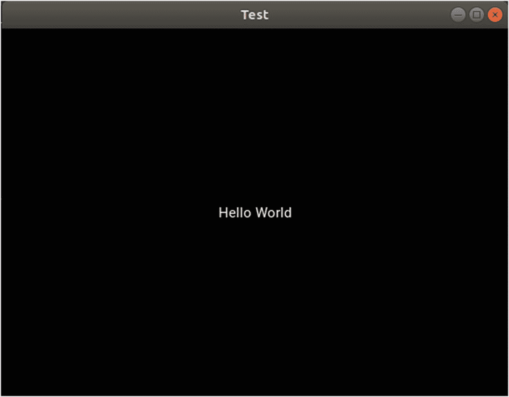
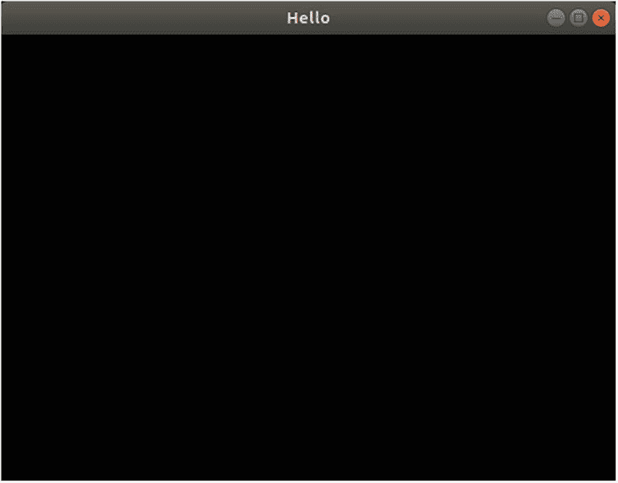

# 一、为 Android 应用程序开发准备 Kivy

本章介绍了用 Python 构建跨平台应用程序的 Kivy 框架。它首先向您展示如何在桌面计算机上准备 Kivy 开发环境。我们将创建一个简单的 Kivy 桌面应用程序。我们还将安装 Buildozer，并使用它从桌面应用程序构建一个 Android Studio 项目。创建一个 APK 文件，签名后可以安装在 Android 设备上或部署在 Google Play 上。

## 什么令人失望？

Kivy 是一个跨平台的 Python 框架，用于构建具有自然用户界面(NUI)的应用程序。由于是跨平台的，Kivy 代码将在 Windows、Linux、Mac、Android 和 IOS 设备上不变地运行。Kivy 的界面是*自然的*，这意味着任何用户都可以很容易地与界面自然交互。用户不必花费数小时来学习如何使用该界面。交互可以通过带有非触摸屏的光标或使用多点触摸功能来实现。

Kivy 基于许多创建用户界面的低级库。在本书中，将使用简单的直接媒体层(SDL)。SDK 是一个跨平台的库，用于通过 OpenGL 对图形硬件进行底层访问。其他库也是可用的，比如 PyGame。开发人员不会直接与这些库交互，因为 Kivy 是抽象的。它将开发人员从不必要的细节中分离出来，并提供一个简单的界面来访问设备的功能。例如，在 Java 中，开发人员必须编写大量代码才能访问 Android 摄像头并在 Android Studio 中捕捉图像。在 Kivy，这些细节很多都是隐藏的。通过一种非常简单的方式，只需几行代码，用户就可以捕捉图像、上传和播放音频文件、处理触摸事件等等。

Kivy 也是模块化的。这意味着 Kivy 项目可以被组织成许多独立的模块。模块可以在多个项目中使用。在非模块化的库中，没有正在创建的功能的分离，因此我们必须在每个新的应用程序中为每个特性重复它们。

## Kivy 安装

为了构建一个 Kivy 移动应用程序，最好先构建一个桌面应用程序。这样，我们至少知道在我们转移到移动应用程序之前，事情运行良好。这是因为调试桌面应用程序更容易。因此，本章从在桌面上准备 Kivy 开发环境开始。

我们可以使用 *pip 安装程序*来安装 Kivy，它从 Python 包索引(PyPI)中获取库来安装最新的稳定版本，或者指定 GitHub 项目的链接来安装其最新的开发版本。我们需要确保 pip 安装正确。如果您打算使用 Python 2，那么在终端中键入`pip`。对于 Python 3 使用`pip3`。因为 Python 2 预装在 Ubuntu 中，所以预计`pip`命令会成功。如果没有，则使用以下命令:

```py
ahmed-gad@ubuntu:-$sudo apt install python-pip

```

如果您打算使用 Python 3 并且`pip3`终端命令失败，您必须使用以下命令安装它:

```py
ahmed-gad@ubuntu:-$sudo apt install python3-pip

```

安装 pip 后，我们可以用它来安装 Kivy。在安装它之前，我们需要确保安装了 Cython。如果之前没有安装 Cython，请使用`pip`或`pip3`安装。以下是安装 Cython for Python 2 的命令:

```py
ahmed-gad@ubuntu:-$pip install cython

```

之后，我们可以使用下面的命令开始 Kivy 安装。注意，它也安装在 Python 2 中。

```py
ahmed-gad@ubuntu:-$pip install kivy

```

目前，我们可以在构建移动应用程序之前构建 Kivy 桌面应用程序。让我们从构建 hello world 应用程序开始。应用程序显示一个显示`"Hello World"`文本的窗口。

## 构建简单的桌面 Kivy 应用程序

构建 Kivy 应用程序的第一步是创建一个扩展了`kivy.app.App`类的新类。根据清单 [1-1](#PC5) ，该类被称为`TestApp`。第二步是覆盖`kivy.app.App`类中名为`build`的函数。这个函数放置运行应用程序时出现在屏幕上的小部件(GUI 元素)。在这个例子中，使用`Label`类从`kivy.uix.label`模块创建一个标签，其文本属性被分配给`"Hello World"`文本。注意，`kivy.uix`模块保存了 GUI 上出现的所有 Kivy 小部件。最后，定制类被实例化以运行应用程序。构建这样一个应用程序的完整代码如清单 [1-1](#PC5) 所示。

```py
import kivy.app
import kivy.uix.label

class TestApp(kivy.app.App):

    def build(self):
        return kivy.uix.label.Label(text="Hello World")

app = TestApp()
app.run()

Listing 1-1Build Your First Kivy Application

```

如果应用程序保存在名为`test.py`的文件中，我们可以使用以下命令从终端运行它:

```py
ahmed-gad@ubuntu:-$python test.py

```

图 [1-1](#Fig1) 显示了运行应用程序后出现的窗口。它只是一个简单的窗口，文本在中间。请注意，`Test`一词显示在窗口的标题栏中。注意，自定义类名是`TestApp`，由两个字组成，`Test`和`App`。当类中有单词`App`时，Kivy 自动将应用程序标题设置为它前面的文本，在本例中是`Test`。



图 1-1

清单 [1-1](#PC5) 中应用程序的窗口

可以使用`TestApp`类构造函数的 title 参数来更改应用程序的标题。清单 [1-2](#PC7) 对清单 [1-1](#PC5) 做了两处修改。第一个变化是将应用程序的标题设置为`Hello`。第二个变化是我们可以构建一个没有`build()`功能的应用程序。删除此函数，类将为空。为此，添加了`pass`关键字。

```py
import kivy.app

class TestApp(kivy.app.App):
    pass

app = TestApp(title="Hello")
app.run()

Listing 1-2Changing the Application Title

```

我们目前使用这个`build()`函数来保存应用程序小部件，所以通过删除它，应用程序窗口将是空的，如图 [1-2](#Fig2) 所示。在接下来的章节中，将讨论 KV 语言在应用程序中添加窗口小部件。



图 1-2

运行清单 [1-2](#PC7) 中的代码后出现的窗口

## 安装 Buildozer 并创建 buildozer.init 文件

在创建了这样一个简单的桌面应用程序并确保一切按预期运行之后，我们可以开始构建移动应用程序了。为此，我们使用了一个名为 *Buildozer* **，**的项目，它负责自动化打包所需工具的过程，使应用程序在移动端运行。如前所述，我们可以直接使用 pip 来安装最新的稳定版本，也可以指定 GitHub 链接来安装最新的开发版本。我们可以根据以下命令使用 pip 进行安装:

```py
ahmed-gad@ubuntu:-$pip install buildozer

```

为了构建 Android 应用程序，Python 文件必须命名为`main.py`，并且位于项目的根目录下。Buildozer 使用这个文件作为最终 Java 项目中的主要活动。创建这个文件后，我们需要指定一些关于项目的属性。这些属性对于构建 Android 应用程序非常重要。这些属性被添加到名为`buildozer.spec`的文件中。您不需要从头开始创建这个文件，因为您可以使用下面的命令自动创建它。只要确保在`main.py`所在的同一个路径下执行即可(即在项目根目录下执行)。

```py
ahmed-gad@ubuntu:-$buildozer init

```

假设保存项目文件的文件夹名为`NewApp`，发出该命令后，项目目录树如下:

*   新应用
    *   `bin`

    *   `.buildozer`

    *   `main.py`

    *   `buildozer.spec`

除了需求之外,`.buildozer`文件夹还包含 Android 项目。在我们成功构建项目之后，`bin`文件夹保存了生成的 APK 文件。

清单 [1-3](#PC10) 中给出了`buildozer.spec`文件的抽象版本。我们来讨论一下现有的字段，一个一个来。`title`定义了应用程序标题，在安装应用程序后显示给用户。`package.name`和`package.domain`字段很重要，因为它们定义了应用程序在 Google Play 发布时的 ID。`source.dir`属性表示 Python 源文件`main.py`的位置。如果它与`buildozer.spec`文件位于同一个文件夹中，那么它只是被设置为一个点(`.`)。

```py
[app]

# (str) Title of your application

title = FirstApp

# (str) Package name

package.name = kivyandroid

# (str) Package domain (needed for android/ios packaging)

package.domain = com.gad

# (str) Source code where the main.py live

source.dir = .

# (list) Source files to include (let empty to include all the files)

source.include_exts = py,png,jpg,kv,atlas,wav

# (list) Source files to exclude (let empty to not exclude anything)

source.exclude_exts = gif

# (list) List of inclusions using pattern matching

#source.include_patterns = assets/∗,img/∗.png

# (list) List of exclusions using pattern matching

#source.exclude_patterns = license,img/∗/∗.jpg

# (list) List of directory to exclude (let empty to not exclude anything)

source.exclude_dirs = bin

# (str) Application versioning (method 1)

version = 0.1

# (list) Application requirements

# comma separated e.g. requirements = sqlite3,kivy

requirements = kivy, numpy

# (str) Custom source folders for requirements

# Sets custom source for any requirements with recipes

requirements.source.numpy = /home/ahmedgad/numpy

# (str) Presplash of the application

presplash.filename = %(source.dir)s/presplash.png

# (str) Icon of the application

icon.filename = %(source.dir)s/logo.png

# (str) Supported orientation (one of landscape, portrait or all)

orientation = landscape

#

# OSX Specific

#

# change the major version of python used by the app

osx.python_version = 3

# Kivy version to use

osx.kivy_version = 1.10.1

#

# Android specific

#

# (bool) Indicate if the application should be fullscreen or not

fullscreen = 1

# (list) Permissions

android.permissions = INTERNET, CAMERA

# (int) Android API to use

android.api = 26

# (int) Minimum API required

android.minapi = 19

# (int) Android SDK version to use

#android.sdk = 27

# (str) Android NDK version to use

#android.ndk = 18b

# (str) Android NDK directory (if empty, it will be automatically downloaded.)

android.ndk_path = /home/ahmedgad/.buildozer/android/platform/android-ndk-r18b

# (str) Android SDK directory (if empty, it will be automatically downloaded.)

android.sdk_path = /home/ahmedgad/.buildozer/android/platform/android-sdk-linux

Listing 1-3Fields Inside the buildozer.spec File

```

假设我们在项目中使用了一些必须打包在 Android 应用程序中的资源。这可以用不同的方法来完成。尽管很简单，但如果没有成功完成，可能会浪费几个小时的调试时间。

一种简单的方法是在`source.include_exts`属性中指定这种资源的扩展。例如，如果所有带有。巴布亚新几内亚。jpg，还有。wav 扩展将被打包在应用程序中，那么属性将如下所示。如果该字段为空，则将包括根目录中的所有文件。

```py
source.include_exts = png, jpg, wav

```

与`source.include_exts`属性相反，有一个名为`source.exclude_exts`的属性定义了要从打包中排除的扩展。如果为空，则不排除任何文件。

还有`source.include_patterns`和`source.exclude_patterns`分别创建要包含和排除的模式。请注意，它们是使用`#`进行注释的。

与`source.exclude_exts`类似，有一个名为`source.exclude_dirs`的属性定义了要排除的目录。例如，`bin`文件夹是存在的，但是我们对包含它不感兴趣。这减小了 APK 文件的大小。

`version`属性定义了 Android 应用的版本。当您将应用程序的新版本上传到 Google Play 时，此属性必须更改为比您之前使用的更高的数字。

在`requirements`属性中，您可以声明在 Python 代码中导入的所需库。例如，如果导入了 NumPy，则 NumPy 必须是该属性中的一项。每个需求将在第一次使用时被下载。

如果您下载了一个需求，并且想要在应用程序中使用它，而不是下载一个新的，那么您必须在用需求的名称替换了`<requirement-name>`之后，在`requirements.source.<requirement-name>`属性中定义这个需求的目录。例如，使用`requirements.source.numpy`为 NumPy 定义路径。

属性定义了用作应用程序图标的图像。它可以是 PNG 文件。当加载应用程序时，会为用户显示一个由`presplash.filename`属性定义的图像。Kivy 徽标用作默认图像。

`orientation`属性定义了应用程序支持的方向。可以设置为`landscape`或`portrait`使用一个方向。要根据设备的方向进行设置，请将其设置为`all`。

`osx.python_version`和`osx.kivy_version`属性分别定义了正在使用的 Python 和 Kivy 的版本。

如果应用程序将以全屏模式运行，则将`fullscreen`属性设置为`1`。这将在应用程序运行时隐藏通知栏。

`android.permissions`属性设置应用程序运行所需的权限。例如，如果您在应用程序中访问摄像机，那么必须在该属性中声明`CAMERA`权限。

最近，谷歌禁止用户上传针对少于 26 个 API 的应用程序。因此，为了将应用发布到 Google Play，该应用必须面向至少 26 个 API。`android.api`和`android.minapi`字段定义了要使用的目标和最低 API 版本。重要的是不要将`android.api`设置为小于 26 的值。

`android.sdk`和`android.ndk`字段设置用于构建应用的 SDK 和 NDK 的版本。如果没有这样的版本，可以下载。您也可以下载这些需求并在`android.ndk_path`T3 属性中指定它们的路径。

文件中有更多的字段可以帮助你。您可以通过向下滚动到`buildozer.spec`文件来了解更多信息。从他们的名字可以推断出他们的工作。请注意，系统不会要求您使用文件中的所有字段。只使用你需要的。

## Buildozer 模板

注意，使用 Buildozer 构建 Android 应用类似于 Python 和 Android(即 Java)之间的桥梁。开发者创建一个 Python 项目，Buildozer 根据`buildozer.spec`文件中定义的规范将其转换成 Android Java 项目。为此，Buildozer 拥有根据这些属性中使用的值填充的模板。假设在`buildozer.spec`文件中指定的包名是`kivyandroid`，您可以在这里显示的目录中找到模板，因为项目根目录被命名为`NewApp`。

```py
NewApp/.buildozer/android/platform/build/dists/kivyandroid/templates

```

名为`x.y`的文件的模板是`x.tmpl.y`。例如，`AndroidManifest.xml`文件的模板叫做`AndroidManifest.tmpl.xml`。用于`build.gradle`文件的模板叫做`build.tmpl.gradle`。

### build.gradle

清单 [1-4](#PC13) 中显示了`build.tmpl.gradle`文件中负责指定目标和最小 API 的部分。`minSdkVersion`字段保存应用程序支持的最低 API 级别。`targetSdkVersion`字段保存目标 API 级别。对于`minSdkVersion`，如果将变量值`{{args.min_sdk_version}}`替换为静态值，比如 19，那么无论`buildozer.spec file`内部的`android.minapi`属性中指定什么值，最小 API 都将是 19。这个对`targetSdkVersion`也适用。

```py
android {
   ...
   defaultConfig {
      minSdkVersion {{ args.min_sdk_version }}
      targetSdkVersion {{ android_api }}

      ...
   }
    ...

Listing 1-4Specifying the Target and Minimum APIs in Gradle

```

### AndroidManifest.xml

在`AndroidManifest.templ.xml`文件中，清单 [1-5](#PC14) 给出了负责声明在`buildozer.spec`文件的`android.permissions`属性中定义的应用权限的部分。第一行允许写入外部存储器。因为这样的权限是绝对的，并且不依赖于在`buildozer.spec`文件中定义的权限，这意味着即使您没有指定任何权限，这样的权限也是存在的。

```py
    ...
<uses-permission android:name="android.permission.WRITE_EXTERNAL_STORAGE" />
{ % for perm in args.permissions %}
{ % if '.' in perm %}
<uses-permission android:name = "{{ perm }}" / >
{ % else %}
<uses-permission android:name = "android.permission.{{ perm }}" />
{ % endif %}
{ % endfor %}
    ...

Listing 1-5Declaring the Application Permission Inside Android Manifest

```

对于定义的自定义权限，有一个`for`循环，它遍历`android.permissions`属性中的每个值。对于每个值，都会为其创建一个`<uses-permission>`元素。

### strings.xml

另一个模板名为`strings.tmpl.xml`，它负责生成为应用程序定义字符串资源的`strings.xml`文件。清单 [1-6](#PC15) 显示了这个模板的内容。第一个字符串名为`app_name`，它定义了应用程序的名称。通过将`{{` `args.name` `}}`替换为`buildozer.spec`文件中`title`属性的值来检索名称。

```py
<?xml version="1.0" encoding="utf-8"?>
<resources>
    <string name="app_name">{{ args.name }}</string>
    <string name="private_version">{{ private_version }}</string>
    <string name="presplash_color">{{ args.presplash_color }}</string>
    <string name="urlScheme">{{ url_scheme }}</string>
</resources>

Listing 1-6Specifying the String Resources Inside the strings.xml File

```

在基于这样的模板准备好所需的文件后，Buildozer 构建 Android 项目。项目的主要活动是`PythonActivity.java`，它可以在下面的路径中找到。在本书的后面，Android 项目将在 Android Studio 中用于编写一些 Java 功能。

/ `NewApp/.buildozer/android/platform/build/dists/kivyandroid/build/src/main/java/org/kivy/android/`

在构建应用程序之前，有一些工具必须可用，如 Android SDK 和 NDK。安装构建 Android 应用程序所需工具的一个简单方法是使用终端命令，如下所示。它根据`buildozer.spec`中`android.sdk`和`android.ndk`属性定义的版本下载 SDK 和 NDK。

```py
ahmed-gad@ubuntu:-$buildozer android debug

```

Buildozer 准备了所有的需求，以保证成功地构建应用程序。例如，它将所需的 Python 库打包到 APK 中，如果尚未下载，则下载它们。它还获取其他工具，如 SDK、NDK 和 Python-4-Android (P4A)。

如果您的互联网连接速度很快，这个命令会让您的生活更轻松。但是这种方式对于低速互联网连接非常耗时，因此不可靠。如果互联网连接中断，就没有机会继续下载。下载所需的 Python 库并不困难，因为与 SDK 和 NDK 相比，它们的大小并不大。根据我的经验，我浪费了很多时间试图多次下载这样的需求。

更好的解决方案是使用 Buildozer 最小化下载的数据量。这是通过手工(离线)准备大部分需求，然后将它们链接到 Buildozer 来完成的。您可以通过使用支持暂停和恢复下载过程的更可靠的软件来做到这一点。离线准备需求是很有趣的，因为它能够选择您在应用程序中需要的任何东西的精确版本。离线下载需求的一个有趣的原因是当我们对构建多个共享一些需求的项目感兴趣的时候。每次创建项目时，都会下载相同的需求。或者，我们可以只下载一次需求，并将它们链接到 Buildozer。因此，我们不需要为每个单独的项目下载相同的文件。

## 准备 Android SDK 和 NDK

从适用于 Linux 的 Android SDK 开始，在指定准确的版本号后，可以从该页面( [`http://dl.google.com/android/android-sdk_r{{rev}}-linux.tgz`](http://dl.google.com/android/android-sdk_r%257b%257brev%257d%257d-linux.tgz) )下载。此 URL 使用 SDK 修订版 24 ( [`http://dl.google.com/android/android-sdk_r24-linux.tgz`](http://dl.google.com/android/android-sdk_r24-linux.tgz) )。正如扩展名所反映的，它将作为压缩文件下载。

因为下载的 SDK 没有一些组件，包括 SDK 工具、SDK 平台、SDK 平台工具和 SDK 构建工具，所以我们也需要下载它们。SDK 平台用于针对特定的 Android 平台。SDK 平台工具用于支持目标 Android 平台的特性。SDK 构建工具用于构建应用程序和创建 APK。SDK 工具提供了开发和调试工具。例如，在我们为目标平台构建了 APK 文件之后，这些工具用于运行和调试它。

在指定版本号后，可以从该页面( [`https://dl-ssl.google.com/android/repository/tools_r{{rev}}-linux.zip`](https://dl-ssl.google.com/android/repository/tools_r%257b%257brev%257d%257d-linux.zip) )下载 SDK 工具。比如 SDK Tools 22 . 6 . 2 修订版可以从这个页面下载( [`https://dl-ssl.google.com/android/repository/tools_r22.6.2-linux.zip`](https://dl-ssl.google.com/android/repository/tools_r22.6.2-linux.zip) )。在指定目标平台和版本号后，可以从该页面( [`https://dl.google.com/android/repository/android-{{platform}}_r{{rev}}.zip`](https://dl.google.com/android/repository/android-%257b%257bplatform%257d%257d_r%257b%257brev%257d%257d.zip) )下载 SDK 平台。比如这是下载 SDK 平台 19 修订版 4 的 URL([`https://dl.google.com/android/repository/android-19_r04.zip`](https://dl.google.com/android/repository/android-19_r04.zip))。SDK 平台工具可以从这个网址( [`https://dl.google.com/android/repository/platform-tools_r{{rev}}-linux.zip`](https://dl.google.com/android/repository/platform-tools_r%257b%257brev%257d%257d-linux.zip) )下载，指定版本号后。比如这是下载 SDK 平台工具修订版 19 的 URL([`https://dl.google.com/android/repository/platform-tools_r19.0.1-linux.zip`](https://dl.google.com/android/repository/platform-tools_r19.0.1-linux.zip))。

在指定版本号后，可以从这个 URL ( [`https://dl.google.com/android/repository/build-tools_r{{rev}}-linux.zip`](https://dl.google.com/android/repository/build-tools_r%257b%257brev%257d%257d-linux.zip) )下载 SDK 构建工具。这是 SDK 构建工具 19.1 版本的 URL([`https://dl.google.com/android/repository/build-tools_r19.1-linux.zip`](https://dl.google.com/android/repository/build-tools_r19.1-linux.zip))。

类似于下载 SDK，NDK 可以从这个网址( [`http://dl.google.com/android/ndk/android-ndk-r{{rev}}c-linux-x86_64.tar.bz2`](http://dl.google.com/android/ndk/android-ndk-r%257b%257brev%257d%257dc-linux-x86_64.tar.bz2) )下载。此 URL 对应于 NDK 版本 9 ( [`http://dl.google.com/android/ndk/android-ndk-r9c-linux-x86_64.tar.bz2`](http://dl.google.com/android/ndk/android-ndk-r9c-linux-x86_64.tar.bz2) )。

P4A 项目也可以使用 Buildozer 自动下载和安装。但是如果我们对使用项目的开发版本感兴趣，我们不能依赖 Buildozer，而必须从 GitHub 中克隆它( [`https://github.com/kivy/python-for-android`](https://github.com/kivy/python-for-android) )。

在成功下载需求之后，比如 SDK 及其工具、NDK 和 P4A，还有一个步骤，那就是将它们链接到 Buildozer。这个过程是这样的。

假设安装的 Buildozer 位于`/home/ahmedgad/.buildozer/`中，压缩后的 Android SDK 和 NDK 会被解压到`/home/ahmedgad/.buildozer/android/platform/`路径。如果 SDK 和 NDK 文件夹分别命名为`android-sdk-linux`和`android-ndk-r9c`，那么 SDK 的完整路径就是`/home/ahmedgad/.buildozer/android/platform/android-sdk-linux`，NDK 的完整路径就是`/home/ahmedgad/.buildozer/android/platform/android-ndk-r9c`。在 SDK 的 Tools 文件夹中，SDK 工具将被提取出来。下载的 SDK 平台将被解压到 SDK 内的`platforms`文件夹中。SDK 平台工具将被提取到 SDK 内的`platform-tools`文件夹中。下载的 SDK 构建工具将被解压到`build-tools`文件夹中，也在 SDK 中。SDK 的目录树如下，其中`...`表示父目录中有一些文件和文件夹:

*   `android-sdk-linux`
    *   `build-tools`
        *   `19.1.0`
            *   `. . .`

    *   `platforms`
        *   `android-19`
            *   `. . .`

    *   `platforms-tools`
        *   `. . .`

    *   `tools`
        *   `. . .`

    *   `. . .`

请注意，您可以从位于 SDK 工具中的 Android 工具使用 SDK 管理器来管理 SDK。可以使用以下命令访问它:

```py
ahmed-gad@ubuntu:-$. android-sdk-linux/tools/android

```

Android SDK 管理器如图 [1-3](#Fig3) 所示。使用管理器，我们可以查看已经安装的工具、可用的更新和可供下载的新工具。确保所需的工具可用。


图 1-3

Android SDK 管理器

之后，我们需要分别使用`android.sdk_path`和`android.ndk_path`字段在应用程序的`buildozer.spec`文件中指定 SDK 和 NDK 的路径。如果克隆的 P4A 项目的路径是`/home/ahmedgad/python-for-android` **，**它将被分配给`buildozer.spec`文件中的`p4a.source_dir`字段。

## 准备 Python 需求

先说按项目下载需要的 Python 库。通常，我们不必离线下载它们，因为 Buildozer 本身会下载所有需要的 Python 库，并将它们自动链接到项目。它根据`buildozer.spec`文件的`requirements`字段知道需要哪些库。例如，如果我们的项目需要 NumPy 和 Kivy，该字段将如下所示:

```py
requirements = kivy,numpy

```

只需在该字段中指定所需的库，Buildozer 就会为您下载它们。对于每个库，在`/NewApp/.buildozer/android/platform/build/packages`路径中创建一个带有其名称的文件夹，其中`NewApp`是项目的根目录。例如，如果 NumPy 是一个必需的库，那么在这个路径中会有一个名为`numpy`的文件夹。在每个库的文件夹中，库将以压缩文件的形式下载。这样做的目的是缓存这个库，这样就可以只下载一次，而不是每次构建项目时都下载。注意，到目前为止，这个库还没有安装，只是被下载/缓存了。

注意，库不必存在于`packages`文件夹中。还有一种方法可以告诉 Buildozer 所需的库驻留在哪里。假设先前在`packages`文件夹外下载了一个库，我们只想告诉 Buildozer。这个库的路径在`buildozer.spec`文件中指定。在将`LIB_NAME`替换为库名后，`requirements.source.LIB_NAME`字段接受这些库的路径。例如，NumPy 的路径在`requirements.source.numpy`字段中指定。

假设我们的项目需要 NumPy 1.15.2，我们可以从这个页面( [`https://github.com/numpy/numpy/releases/download/v1.15.2/numpy-1.15.2.zip`](https://github.com/numpy/numpy/releases/download/v1.15.2/numpy-1.15.2.zip) )下载。如果这个库位于`/home/ahmedgad/numpy`中，需要添加到`buildozer.spec`文件中来帮助构建者使用这个库的字段如下。这个过程可以对所有类型的需求重复进行。

```py
requirements.source.numpy = /home/ahmedgad/numpy

```

当 Buildozer 构建项目时，它会检查所需的库是否被缓存到了`packages`文件夹中，或者它的路径是使用`requirements.source`字段显式指定的。如果找到了这些库，将会使用它们。如果没有，Buildozer 必须将它们下载到`packages`文件夹中。

在 Buildozer 找到所有需要的库之后，它开始安装它们。库被安装到`/NewApp/.buildozer/android/platform/build/build/other_builds`路径。类似于创建一个文件夹来保存每个下载的库，该路径中也有一个文件夹来保存已安装的库。例如，将有一个名为`numpy`的文件夹来保存 NumPy 库的安装。

## 构建和运行简单的 Kivy Android 应用程序

在我们安装了所需的库之后，`buildozer android debug`命令将成功完成，APK 文件将被导出到项目的`bin`目录中。我们可以将这个文件复制到 Android 设备上，安装它，然后运行应用程序。我们还可以使用这个命令在 Android 设备上自动构建、部署和运行应用程序:

```py
ahmed-gad@ubuntu:-$buildozer android debug deploy run

```

这需要使用 USB 电缆将 Android 设备连接到机器，并启用 USB 调试。要在设备中启用 USB 调试，请转到设置，选择列表末尾的开发人员选项项，并将 USB 调试复选框的状态切换为打开。如果“开发人员选项”项不可见，请转到“设置”下的“关于设备”项，并按七次 tab 键。(注意，根据 Android OS 版本，步骤可能会有一些变化。)

我们还可以通过将`logcat`附加到该命令来查看设备的日志，如下所示:

```py
ahmed-gad@ubuntu:-$buildozer android debug deploy run logcat

```

图 [1-4](#Fig4) 显示了应用程序在 Android 设备上运行后的外观。


图 1-4

在 Android 中运行 Kivy 应用程序

## 摘要

到本章结束时，我们已经使用 Kivy 跨平台 Python 库成功创建了一个非常简单的 Android 应用程序。请记住，相同的 Python 代码用于创建桌面和移动应用程序。我们通过在台式计算机上准备 Kivy 开发环境来开始应用程序开发过程。然后，我们创建了一个简单的应用程序来检查一切是否按预期运行。这个应用程序只是在一个窗口中显示文本。

成功运行桌面应用程序后，我们开始移动(Android)应用程序部署。它是通过安装 Buildozer 为 Kivy 应用程序生产 Android Studio 项目开始的。Kivy 项目属性在一个名为`buildozer.spec`的文件中指定。这些属性包括应用程序标题、请求的权限、所需的资源、Android SDK 和 NDK 的路径等等。该项目包括 Android Studio 所需的所有资源，如 Gradle、Manifest、Strings 等。为这个项目创建了一个 APK 文件，它可以安装在 Android 设备上，甚至可以在签署后部署在 Google Play 上。