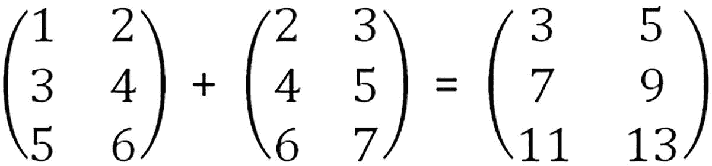
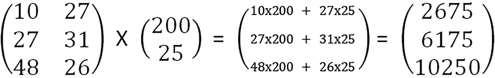

# 2.编程

在这一章中，我们将回顾 C 编程语言。如果你的计算机上还没有 C 开发环境，你可以从微软免费下载。您可以下载他们的 Microsoft 开发工具包(SDK)。另一种访问 C 的方法是使用 Visual Studio。同样，可以下载它的一个版本。

## c 程序格式

清单 [2-1](#PC1) 是一个简单的 C 程序，它要求用户输入一个字符，读取该字符，然后将其打印到屏幕上。我们将用它来展示 C 程序的基本格式。

当你写了很多程序时，给每个程序一个相关的标题是很有帮助的。这个程序被称为 c1.2readprint.c，“c1.2”，因为它在第 [2](2.html) 章的第一部分，而“readprint”是因为它读取并打印一个字符。的”。C "对于任何 C 程序来说都是必不可少的。如果没有这个，c 程序将无法编译。编译器把你的程序转换成计算机硬件能理解的机器代码。

在下面的程序中，int main()将您的代码分隔在{和}之间(尽管我们将在后面看到，您可以在 main()部分之外编写一段单独的代码，并从 main()部分调用它。#include <stdio.h>是一个命令，告诉编译器将执行 getchar()和 putchar()的代码附加到您的可执行程序上。stdio 指的是标准输入输出库。</stdio.h>

注释写在这个程序中，显示/提醒程序中正在做什么。它们写在/*和*/之间。如此处所示，它们可以写在同一行或不同行的 C 代码之后。

代码中的“printf”告诉计算机打印每个双引号之间的内容。

getchar 和 putchar 指令读取和打印一个字符。

```py
#include <stdio.h>
/* read and display a number */
int main () {
   char c; /* store area where the character read in will be kept */

   printf("Enter character: "); /* ask the user to enter a character */
   c = getchar(); /* read the character in */

   printf("Character entered: "); /* tell the user what character the program has read */
   putchar(c); /* write the character */

   return(0);
}

Listing 2-1c1.2readprint.c

```

char c；指令意味着你在程序中保留了一个位置，用来存储读入的字符。c 可以被称为你程序中的一个“变量”。在代码 c=getchar()中，=符号表示“分配给”指令说获取字符，并把它赋给变量 c，输入一个字符。你的程序应该回复你输入的字符。现在输入你的名字。会发生什么？getchar()只读取一个字符，它只会将您键入的第一个字符存储到程序的 char c 数据存储中。注意程序中的注释告诉你正在发生什么。我

## 将两个数相加

在清单 [2-2](#PC2) 中，我们要求用户输入两个整数。然后我们把这些加起来，把答案打印出来。然后我们要求用户输入两个浮点数，我们将它们相加并显示答案。

```py
#define _CRT_SECURE_NO_WARNINGS
#include<stdio.h>

int main()
{
      int int_number1, int_number2, itotal; /* storage areas for the int numbers */
      float float_number1, float_number2, ftotal; /* storage areas for the float numbers */

      /* ask the user to enter two integers */

      printf("Please enter an integer number:\n ");
      scanf("%d", &int_number1); /* read integer number in */
      printf("You entered %d\n", int_number1);

      printf("Please enter another integer number: \n");
      scanf("%d", &int_number2); /* read integer number in */
      printf("You entered %d\n", int_number2);

      /* add the two numbers into ‘total’ and display the answer */

      itotal = int_number1 + int_number2; /* add two numbers */
      printf("total is %d\n", itotal);

      /* ask the user to enter two floating point (decimal) numbers */

      printf("Please enter a float number:\n ");
      scanf("%f", &float_number1); /* read decimal number in */
      printf("You entered %f\n", float_number1);

      printf("Please enter another float number: \n");
      scanf("%f", &float_number2); /* read decimal number in */
      printf("You entered %f\n", float_number2);

      /* add the two numbers into 'total' and display the answer */

      ftotal = float_number1 + float_number2; /* add the numbers */
      printf("total is %f\n", ftotal);

      return 0;
}

Listing 2-2c1.2addtwodf.c

```

在这个程序中，我们读入整数和浮点数。我们用 int 定义每个整数的存储，如程序开始所示，用 float 定义浮点数的存储。我们还指定了存储位置，用于在添加数字时存储总数。这是整数的 itotal 和浮点数的 ftotal。注意，我们可以在 int 命令后列出所有的存储名称，只要它们都是 int 类型。“类型”是我们区分数据的方式，例如，整数是“integer”或“int”以及字符，如“A”、“$”和“？”是“char”类型。

在这个程序中，我们使用 scanf 从屏幕上读取字符，而不是 getchar()。这是因为我们要添加的数字可以不止一个字符。scanf 和 printf 中的%d 指定要读取或写入的整数。scanf 和 printf 中的%f 指定要读取或写入的整数。在 printf 这里，要打印的答案存储在 itotal 或 ftotal 中。

## 两个数相乘并相除

在清单 [2-3](#PC3) 中，我们输入两个浮点数。首先，我们将它们相乘并打印出答案；然后，我们将第一个数字除以第二个数字，并显示答案。

```py
#define _CRT_SECURE_NO_WARNINGS
#include <stdio.h>

/*  multiply two floating point numbers */

int main()
{
      float this_is_a_number1, this_is_a_number2, total; /* storage areas for the numbers */

      /* ask the user to enter two floating point (decimal) numbers */

      printf("Please enter a number:\n ");
      scanf("%f", &this_is_a_number1); /* read number in */
      printf("You entered %f\n", this_is_a_number1);

      printf("Please enter another number: \n");
      scanf("%f", &this_is_a_number2); /* read number in */
      printf("You entered %f\n", this_is_a_number2);

       /* multiply  the two numbers into 'total' and display the answer */

      total = this_is_a_number1 * this_is_a_number2; /* multiply the numbers */
      printf("product is %f\n", total);

      /* divide  the two numbers into 'total' and display the answer */

      total = this_is_a_number1 / this_is_a_number2; /* divide the numbers */
      printf("quotient is %f\n", total);

      return 0;
}

Listing 2-3c1.2multdiv.c

```

这一节涉及基本数据和算术运算。下一节着眼于在编程中使用循环的有用性。

## 对于循环

当我们在做两个数字的程序时，用十个数字做类似的事情会有点麻烦。我们可以通过重复类似的代码十次来完成。我们可以通过编写一段代码，然后在同一段代码中循环十次来使这变得简单一点。这被称为“for 循环”

清单 [2-4](#PC4) 是一个 for 循环如何帮助我们的例子。

```py
#define _CRT_SECURE_NO_WARNINGS
#include<stdio.h>
/* demonstrate a forloop */
main()

{
      float this_is_a_number, total; /* storage areas for the numbers */
      int i;

      total = 0;

      /* forloop goes round 10 times */
      for (i = 0;i < 10;i++)
      {
            /* ask the user to enter the floating point (decimal) number */

            printf("Please enter a number:\n ");
            scanf("%f", &this_is_a_number); /* read number in */
            total = total + this_is_a_number;

      }
      printf("Total Sum is = %f\n", total);
}

Listing 2-4c1.2for.c

```

for 语句的语法是

for(初始值；最终值；增量)

执行循环的代码包含在 for 语句后的}和语句后的}中。

在 for 语句中，变量 I 用作在循环过程中要递增和测试的变量。I 的初始值为 0，如 for 语句的第一部分所示；然后每次代码在循环中完成，I 就加 1(这就是 i++所做的)。在每个循环之后，进行测试以查看 I 值是否已经达到 10(这是 i<10 的部分)。当它出现时，循环停止。所以在这种情况下，循环中的代码执行了十次。在代码中，要求用户输入一个数字。在每个循环中，这个值被加到 total 中，然后最终的值被打印出来。

## Do While 循环

还有另一种方法可以做与 for 循环类似的事情，但是格式稍有不同。循环说“do”，然后在{}内，再次包含一系列命令，以“while …”结束，其中“…”只是为真的条件。当条件不为真时，它退出循环。所以使用“do”循环来做和 for 循环一样的事情。do 循环中的 i++指令只是将 I 当前包含的值加 1。减去 1 只是我。

```py
#define _CRT_SECURE_NO_WARNINGS
#include<stdio.h>
/* demonstrate a do loop */
main()

{
      float this_is_a_number, total; /* storage areas for the numbers */
      int i;

      total = 0;
      i = 0;
      /* do loop goes round until the value of i reaches 10 */
      do {

            printf("Please enter a number:\n ");
            scanf("%f", &this_is_a_number);
            total = total + this_is_a_number;
            i++;

      }while( i < 10);
      printf("Total Sum is = %f\n", total);
}

```

你应该会发现你得到的结果和你的 for 循环程序是一样的。

在了解了环路的用处之后，我们现在来看看交换机。

## 开关指令

C 语言中另一个有用的指令是 switch。它接受一个值，并根据该值跳转到代码中的适当位置。在清单 [2-5](#PC6) 中，用户可以输入 1 到 5 之间的任意整数值。

switch 指令取值，如果是 1，跳转到`case 1`:；如果是 2，跳转到`case 2`:；等等。如果输入的数字不是一个从 1 到 5 的整数，它会进入`default`:输出一个错误信息。

```py
#define _CRT_SECURE_NO_WARNINGS
#include <stdio.h>
/* Example of a switch operation */
int main()
{
      int this_is_a_number; /* storage areas for the numbers */

      /* ask the user to enter integer number */

      printf("Please enter an integer between 1 and 5:\n ");
      scanf("%d", &this_is_a_number);

      /* Move to the appropriate case statement corresponding to the entered number */

      switch (this_is_a_number)
      {

      case 1:
            printf("Case1: Value is: %d", this_is_a_number);
            break;
      case 2:
            printf("Case2: Value is: %d", this_is_a_number);
            break;
      case 3:
            printf("Case3: Value is: %d", this_is_a_number);
            break;
      case 4:
            printf("Case4: Value is: %d", this_is_a_number);
            break;
      case 5:
            printf("Case5: Value is: %d", this_is_a_number);
            break;
      default:
            printf("Error Value is: %d", this_is_a_number); /* The number entered was not between 1 and 5 so report the error*/
      }
      return 0;
}

Listing 2-5c1.2swi.c

```

你可以做类似的事情，但是使用特定的字符而不是数字。然后，使用字符作为案例名称跳转到适当的位置，例如，如果键入 a，则跳转到案例 a:。

上一节展示了如何使用 switch 语句跳转到特定的代码段。下一节做了类似的事情，但是使用了“if”和“else”。

## 否则

当你的程序需要决定是执行一个操作还是另一个操作时，我们使用 if 语句。

这些相当简单。基本上，我们说(以下不是实际代码)

```py
if (something is true)
      Perform a task

```

这是 if 的基本形式。

我们可以这样延伸

```py
if (something is true)
      Perform a task
else
      Perform a different task

```

下面是演示这一点的一些 C 代码:

```py
#include <stdio.h>
/* Example of an if operation */
int main()
{

     int this_is_a_number; /* storage area for the number*/
      /* ask the user to enter a specific integer */

      printf( "Please enter an integer between 1 and 10:\n " );
      scanf( "%d", &this_is_a_number );

      if (this_is_a_number <6)
            printf( "This number is less than 6;\n " );

      /* ask the user to enter another specific integer */

      printf( "Please enter an integer between 10 and 20:\n " );
      scanf( "%d", &this_is_a_number );

      if (this_is_a_number <16)
            printf( "This number is less than 16\n " );
      else
            printf( "This number is greater than 15\n " );

    return 0;
}

```

创建并测试您的程序。当您测试时，最好测试到每个极限，甚至输入不正确的数据。这里没有检查你是否真的进入了指定的范围。您可以自己添加一个测试。

“if then else”类型的命令有一个扩展。这就是“if then else if ”,在这里您添加了一个额外级别的 if。下面是您上一个程序的扩展来添加这个。

## 如果，如果

清单 [2-6](#PC10) 与前一个清单做了相同的 if，但是它不是跟在 else 后面，而是做 else if 来测试另一个选项。

```py
#define _CRT_SECURE_NO_WARNINGS
#include <stdio.h>
/* Example of an if then else if operation */
int main()
{
      int this_is_a_number; /* storage area for the number*/

      /* ask the user to enter a specific integer */

      printf("Please enter an integer between 1 and 10:\n ");
      scanf("%d", &this_is_a_number);

      if (this_is_a_number < 6)
            printf("This number is less than 6;\n ");

      /* ask the user to enter another specific integer */

      printf("Please enter an integer between 10 and 20:\n ");
      scanf("%d", &this_is_a_number);

      if (this_is_a_number < 16)
      {
            printf("This number is less than 16\n ");
      }
      else if (this_is_a_number == 20)
      {
            printf("This number is 20\n ");
      }
      else
      {
            printf("This number is greater than 15\n ");
      }

      return 0;
}

Listing 2-6c1.2if.c

```

这里，它测试输入的数字是否小于 16。如果是，它会打印“这个数字小于 16”；否则，它将测试该数字是否等于 20。如果是，它打印出“这个数是 20”。否则，它会打印出“该数字大于 15 但不是 20”。

已经看到了“if”语句的用处，我们现在将转向数组。

## 数据阵列

在我们的程序中有另一种存储数据的方法，而不仅仅是在单独的位置。这些被称为“数组”它们可以定义为“int ”,其中数组的所有元素都是整数。它们可以是“char ”,其中所有元素都是字符。还有其他类型，我们稍后会看到。我们用插入方括号中的数组长度定义一个整数数组，例如，int arr[8]表示一个包含八个元素的数组。在这种情况下，“arr”是数组的名称。

清单 [2-7](#PC11) 向我们展示了如何读入八个整数并将它们存储在一个数组中。

```py
#define _CRT_SECURE_NO_WARNINGS
#include<stdio.h>
/* program to show array use */

int main()

{
      int arr1[8]; /* define an array of 8 integers */
      int i;

      /* ask the user to enter 8 integers */

      printf("enter 8 integer numbers\n");

      for (i = 0;i < 8;i++)
      {

            scanf("%d", &arr1[i]);  /* read the entered integers into arr1[i] */
      }
      /* print out the contents of the array */

      printf("Your 8 numbers are \n");

      for (i = 0;i < 8;i++)
      {
            printf("%d ", arr1[i]);
      }
      printf("\n");

}

Listing 2-7c1.2arr.c

```

创建这个程序并测试它。它将读取您输入的八个字符，并将它们存储在数组“arr1”中。然后它读取 arr1 并打印出其内容。

为了在数组中读写字符，我们将其定义为“char ”,注意我们在 scanf 和 printf 中使用了%c，因为%c 需要字符而%d 需要整数。

```py
#define _CRT_SECURE_NO_WARNINGS
#include<stdio.h>
/* program to show character array use */

int main()

{
      char arr2[10]; /* define array of 10 characters */
      int i;

      /* ask the user to enter 10 characters */

      printf("enter 10 characters \n");

      for (i = 0;i < 10;i++)
      {
            scanf("%c", &arr2[i]); /* read each character entered into the array */
      }

      printf("Your 10 characters are \n");

      /* print out the contents of the array */

      for (i = 0;i < 10;i++)
      {
            printf("%c ", arr2[i]);
      }
      printf("\n");

}

```

当我们写软件解决数学问题时，数组真的很有用。我们可以扩展我们刚刚学到的想法。如果我们说我们刚刚使用的 int 数组是一维的(即一行中的数字)，我们可以有一个二维数组(就像矩阵中的数字一样。)

下面是一个程序，允许你输入数据到一个二维数组。它的一部分最多可以有八个整数，另一部分最多可以有七个整数。这里定义为 int arr1[7][8]。你可以这样想象:

```py
   1      2     3     4     5     6     7    8
   4      3     4     5     6     7     8    9
   0      4     5     6     7     8     9   10
   9      5     6     7     8     9    10   11
   3      7     8     9    10    11    12   13
   8      8     9    10    11    12    13   14
   6      9    10    11    12    13    14   15

```

该阵列有 7 行 8 列，可以称为 7×8 阵列(类似于数学中的 7×8 矩阵)。清单 [2-8](#PC14) 将数据读入数组。

```py
#define _CRT_SECURE_NO_WARNINGS
#include<stdio.h>

/* example of a 2D array test*/
int main()

{
      int arr1[7][8]; /* 2D array */

      int i, j, k, l;

      /* ask the user to enter number of rows and columns to be used */

      printf("enter number of rows and columns (max 7 rows max 8 columns) \n");
      scanf("%d %d", &k, &l); /* store the number of rows and columns */

      /* test if the user has exceeded the limits for rows or columns */

      if (k > 7 || l > 8)
      {
            printf("error - max of 8 for rows or columns\n");

      }

      else
      {
            /* ask the user to enter the data for the arrays */

            printf("enter array\n");
            for (i = 0;i < k;i++)
            {
                  for (j = 0;j < l;j++)
                  {
                        scanf("%d", &arr1[i][j]);
                  }
            }

            /* print out the 2D array */

            printf("Your array is \n");
            for (i = 0;i < k;i++)
            {
                  for (j = 0;j < l;j++)
                  {
                        printf("%d ", arr1[i][j]);
                  }
                  printf("\n");

            }
      }

}

Listing 2-8c1.2arr2D.c

```

这个项目中有一些新的想法。除了二维数组之外，我们还有一个嵌套 for 循环的例子，如前所述。我们也看到了一些在你的程序中非常有用的东西。这被称为“数据审查”如果你看看我们数组的定义，它的第一部分有 7 个整数，第二部分有 8 个整数。如果用户试图输入八个以上的字符，就会导致程序出错而失败。我们可以通过检查用户没有为每个部分输入超过最大预期数量的整数来防止这种情况。这就是第一个“如果”语句的作用。程序的第一部分将“行数”存储到 k 中，将列数存储到 l 中。if 语句说明，如果行数大于 7 或列数大于 8，则它会输出一条错误消息并终止程序。符号“||”表示“或”

2D 阵列逐行存储。因此，如果您输入如上所示的 7x8 矩阵中的数据，并打印出第一行，那么您应该得到 1 2 3 4 5 6 7 8。您可以编写一个快速测试程序来完成这项工作。

```py
#define _CRT_SECURE_NO_WARNINGS
#include<stdio.h>

/* example of a 2D array test with extras*/
int main()

{
      int arr1[7][8]; /* 2D array */

      int i, j, k, l;

      /* ask the user to enter number of rows and columns to be used */

      printf("enter number of rows and columns (max 7 rows max 8 columns) \n");
      scanf("%d %d", &k, &l);
      if (k > 7 || l > 8)
      {
            printf("error - max of 8 for rows or columns\n");

      }

      else
      {
            printf("enter array\n");
            for (i = 0;i < k;i++)
            {
                  for (j = 0;j < l;j++)
                  {
                        scanf("%d", &arr1[i][j]);
                  }
            }
            printf("Your array is \n");
            for (i = 0;i < k;i++)
            {
                  for (j = 0;j < l;j++)
                  {
                        printf("%d ", arr1[i][j]);
                  }
                  printf("\n");

            }
      }

      /* print out the first row of the 2D array */

      printf("first row of array\n");
      for (j = 0;j < l;j++)
      {
            printf("%d ", arr1[0][j]);
      }
      printf("\n");

}

```

这和你的 2D 数组程序是一样的，除了在最后，它多做了一点。

```py
for(j=0;j<k;j++)
{
      printf("%d ",arr1[0][j]);
}

```

这只是打印出 arr[0][0]，arr[0][1]，arr[0][2]，arr[0][3]，arr[0][4]，arr[0][5]，arr[0][6]和 arr[0][7]。这就是数据在 2D 数组中的存储方式。如果你想要第二行，你只需要改变 printf("%d "，arr 1[0][j])；在最后一个 for 循环中打印 f("%d "，arr 1[1][j])；。

当你写程序对矩阵进行运算时，二维数组是至关重要的。



这里，我们将两个 3x2 矩阵相加，生成另一个 3x2 矩阵。正如您在前面的图表中所看到的，我们只需将相应的行和列相加，就可以在第三个矩阵的相应位置产生一个和。

清单 [2-9](#PC17) 演示了这一点。第一个矩阵是 matarr1，第二个是 matarr2。您可以看到，这些矩阵被预定义为与前面的矩阵具有相同的值。两者之和放入 matadd。嵌套的 for 循环首先将 matadd 清零。另一个嵌套的 for 循环执行加法。

```py
/* Matrix program */
/* add two matrices */
#define _CRT_SECURE_NO_WARNINGS
#include<stdio.h>
int main()
{

      int matarr1[3][2] = {
      {1, 2},
      {3, 4},
      {5, 6}
      };

      int matarr2[3][2] = {
      {2, 3},
      {4, 5},
      {6, 7}
      };

       int matadd[3][2];/* matrix answer (rowxcolumn)*/
       int i,j,k;
       int r1,c1,r2,c2;/* row and col for 1st and 2nd matrices */

       r1=3;
       c1=2;
       r2=3;
       c2=2;

       for(i=0;i<r1;i++)
       {
             for(j=0;j<c2;j++)
             {
                   matadd[i][j]=0;/* clear the matrix */
             }

       }

       printf("Your first matrix is \n");
       for(i=0;i<r1;i++)
       {
             for(j=0;j<c1;j++)
             {
                   printf("%d ",matarr1[i][j]);  /* first matrix in
                   matarr1 */
             }
             printf("\n");
       }

       printf("Your second matrix is \n");
       for(i=0;i<r2;i++)
       {
             for(j=0;j<c2;j++)
             {
                   printf("%d ",matarr2[i][j]);  /* second matrix in
                   matarr2 */
             }
             printf("\n");
       }
       /* add corresponding elements of the matrices into matadd */
       for(i=0;i<r1;i++)
       {
             for(j=0;j<c2;j++)
             {
                   for(k=0;k<r2;k++)
                   {
                         matadd[i][j] = matarr1[i][j]
                         + matarr2[i][j];
                   }

             }
       }
       /* Write the solution */
       printf("Your matrix multiplication is \n");
       for(i=0;i<r1;i++)
       {
             for(j=0;j<c2;j++)
             {
                   printf("%d ",matadd[i][j]);
             }
             printf("\n");
       }

}

Listing 2-9c1.2matadd.c

```

下图显示了两个矩阵相乘的机制。对于两个矩阵，第一个矩阵的列数必须等于第二个矩阵的行数。对于下面的矩阵，第一个矩阵是 3x2(三行两列)，第二个矩阵是 2x1(两行一列)，所以这些可以相乘。查看图中的第三个矩阵，您可以看到乘法是如何工作的。



清单 [2-10](#PC18) 用两个预设矩阵 matarr1 和 matarr2 执行前面的乘法。乘法的结果保存在矩阵 matmult 中。这最初被清除为零。

```py
/* Matrix program */
/* multiply two matrices */
#define _CRT_SECURE_NO_WARNINGS
#include<stdio.h>
int main()
{

      int matarr1[3][2] = {
      {10, 27},
      {27, 31},
      {48, 26}
      };

      int matarr2[2][1] = {
      {200},
      {25}
      };

       int matmult[3][1]; /* matrix answer (rowxcolumn)*/
       int i,j,k;
       int r1,c1,r2,c2; /* row and col for 1st and 2nd matrices */

       r1=3;
       c1=2;
       r2=2;
       c2=1;

       for(i=0;i<r1;i++)
       {

             for(j=0;j<c2;j++)
             {
                   matmult[i][j]=0; /* clear the matrix */
             }
       }

       printf("Your first matrix is \n");
       for(i=0;i<r1;i++)
       {
             for(j=0;j<c1;j++)
             {
                   printf("%d ",matarr1[i][j]); /* first matrix in
                   matarr1 */
             }
             printf("\n");
       }

       printf("Your second matrix is \n");
       for(i=0;i<r2;i++)
       {
             for(j=0;j<c2;j++)
             {
                   printf("%d ",matarr2[i][j]); /* second matrix in
                   matarr2 */
             }
             printf("\n");
       }
       /* multiply corresponding elements of the matrices into matmult */
       for(i=0;i<r1;i++)
       {
             for(j=0;j<c2;j++)
             {
                   for(k=0;k<r2;k++)
                   {
                         matmult[i][j] = matmult[i][j] + matarr1[i][k]
                         * matarr2[k][j];
                   }
             }
       }
       /* Write the solution */
       printf("Your matrix multiplication is \n");
       for(i=0;i<r1;i++)
       {
             for(j=0;j<c2;j++)
             {
                   printf("%d ",matmult[i][j]);
             }
             printf("\n");
       }

}

Listing 2-10c1.2matmult4.c

```

您已经看到了扩展我们的数据定义以包含数组的重要性。

## 功能

有时候当你写程序的时候，你会发现你可能会在程序的不同地方写相似的代码行。如果您将这些类似的代码行放在一个单独的地方，并在需要时调用它们，您可以使这更容易做到，并且其他人也更容易理解您的代码所做的事情。这组独立的代码称为函数。如果函数每次被调用时都要做稍微不同的事情，这没关系，因为每次调用时你都可以用不同的参数来调用函数。下面的代码将演示这一点。这是一段相当琐碎的代码，但它说明了这一点。

```py
#define _CRT_SECURE_NO_WARNINGS
#include <stdio.h>

/* This code demonstrates what a function does */
/* The function here compares two numbers and says which is bigger */
/* The user enters three numbers and gets told which is bigger than which !*/

      void myfunction(int a,int b); /* declaration of your function and its parameters */

      int first , second, third;
main()
{

      /* ask the user to enter the three numbers to be compared */

       printf( "Please enter first integer number: " );
       scanf( "%d", &first );
       printf( "Please enter second integer number: " );
       scanf( "%d", &second );
       printf( "Please enter third integer number: " );
       scanf( "%d", &third );

      myfunction(first , second); /* compare the first with the second */
      myfunction(first , third); /* compare the first with the third */
      myfunction(second , third); /* compare the second with the third */
}
void myfunction(int a,int b)
/* the function is outside the main{} part of the program */
/* The function just compares the two parameters, a and b, and says which is greater*/
{

      if(a>b)
            printf("%d is greater than %d\n", a,b);
      else if (a<b)
            printf("%d is greater than %d\n", b,a);
      else
            printf("%d and %d are equal\n", a,b);
}

```

这里的函数叫做 myfunction。注意，它是在 main{}之外定义的。它是在程序开始时声明的。给这个函数两个数字，a 和 b，它比较这两个数字，然后说哪个更大。在程序的主要部分，用户被提示输入三个数字。然后，在代码的主要部分，这些被输入到对 myfunction 的调用中。

这是一段相当简单的代码，但是它展示了如何使用一个函数。

清单 [2-11](#PC20) 也展示了函数是如何使用的。这段代码基于你在本章“数据数组”一节中编写的程序。它打印出 2D 数组的特定行。对该函数的一个调用要求该函数打印出数组的第二行，另一个调用要求它打印出第一行。

```py
#define _CRT_SECURE_NO_WARNINGS
#include<stdio.h>

/* example of a function*/
void printarow(int row, int cols, int arr[8][8]);
int main()

{
      int arr1[8][8];

      int i, j, rows, cols;

      /* ask the user to enter the rows and columns */

      printf("enter number of rows and columns (max 8 rows max 8 columns) \n");
      scanf("%d %d", &rows, &cols);
      if (rows > 8 || cols > 8)
      {
            printf("error - max of 8 for rows or columns\n");

      }

      else
      {
            printf("enter array\n");
            for (i = 0;i < rows;i++)
            {
                  for (j = 0;j < cols;j++)
                  {
                        scanf("%d", &arr1[i][j]);
                  }
            }
            printf("Your array is \n");
            for (i = 0;i < rows;i++)
            {
                  for (j = 0;j < cols;j++)
                  {

                        printf("%d ", arr1[i][j]);
                  }
                  printf("\n");

            }
      }
      printarow(2, cols, arr1); /* This calls to print out row 2 only(assumes that you have at least 2 rows) */
      printf("\n");
      printarow(1, cols, arr1); /* This calls to print out row 1 only */
      printf("\n");
}

void      printarow(int row, int cols, int arr[8][8])

/* this is a function which can be called from anywhere in the program */
/* and can be called as often as you want to */
/* If you need to do the same type of thing many times it saves you */
/* having to write out the same code repeatedly. All you need to */
/* is call the function */

{
      int j;
      printf("row %d is ", row);
      for (j = 0;j < cols;j++)
      {
            printf("%d ", arr[row - 1][j]);
      }

}

Listing 2-11c1.2func.c

```

请注意，函数中使用的数组名称不必与 main{}中使用的名称相同。在 if 指令中(行> 7 ||列> 8)，||表示或。所以在这里，我们说，如果用户指定了超过 7 行或超过 8 列，那么我们打印一个错误并停止程序。在本章的最后，列出了 C 语言中常用的算术和逻辑符号。

创建并测试这个程序。该代码假设您至少有两行。您可以修改代码来多次调用 printarow。

函数可以向调用者返回值。下面的代码演示了这一点:

```py
/* Function which returns an answer  */
/* finds the pupil in one year of the school with the highest marks */

#include <stdio.h>
double getmarks(double pupils[]);

int main()
{
      double pupil;
      /* Array with marks for class is preset in the main part of the program */
      double marks[] = { 10.6, 23.7, 67.9, 93.0, 64.2, 33.8 ,57.5 ,82.2 ,50.7 ,45.7 };

      /* Call function getmarks. The function returns the max marks which is then stored in pupil */
      pupil = getmarks(marks);
      printf("Max mark is  = %f", pupil);
      return 0;
}

double getmarks(double pupils[])
{
      int i;
      double highest;
      highest = 0;
      /* Go through all the pupils in turn and store the highest mark */
      for (i = 0; i < 6; ++i)
      {
            if (highest < pupils[i])
                  highest = pupils[i];

      }
      return highest; /* returns the value in highest to where the function was called */
}

```

这个函数叫做 getmarks。它返回一个值到它被调用的地方。在实际的程序中，这个函数会在程序的不同点被多次调用。这种技术既高效又让程序更容易理解。

## 用线串

C 中的字符串就像我们已经看过的字符数组。主要区别在于字符串末尾有一个空字符。这只是为了显示字符串的结束位置，因为我们必须做一些事情，比如比较两个字符串，或者找出字符串的长度。为了找到长度，我们在 string.h 库中为我们编写了一个函数，这个函数需要在末尾空字符。因此，如果我们将一个预置字符串定义为一个特定长度的字符数组，我们需要考虑末尾的空值。因此，如果我们的字符串中有“tokens ”,单词有六个字符，那么我们的字符串数组在其定义中必须有七个字符，以说明末尾的空字符。当我们使用 printf 打印一个字符串时，我们使用%s 来表示它是一个字符串(我们使用%d 来打印一个整数，或者使用%f 来打印一个浮点数)。

清单 [2-12](#PC22) 是一个检查字符串长度(strlen)、复制到另一个(strcpy)、连接两个字符串(strcat)、比较两个字符串内容(strcmp)的程序。

两个字符串的连接只是将一个字符串标记到另一个字符串的末尾。

```py
#define _CRT_SECURE_NO_WARNINGS
#include <stdio.h>
#include <string.h>
/* Program to demonstrate string operations strlen, strcpy, strcat, strcmp */

int main() {
      char borrow[7] = { 't', 'o', 'k', 'e', 'n', 's','\0' };
      char string1[32] = "This is string1";
      char string2[16] = "This is string2";
      char string3[16];
      int  len;
      /* Print out the lengths of the strings */

      len = strlen(string1);
      printf("strlen(string1) :  %d\n", len);
      len = strlen(string2);
      printf("strlen(string2) :  %d\n", len);
      len = strlen(string3);
      printf("strlen(string3) :  %d\n", len);

      /* copy string1 into string3 */

      strcpy(string3, string1);
      printf("strcpy( string3, string1) :  %s\n", string3);
      len = strlen(string3);
      printf("strlen(string3) after copy of string1 into string3 :  %d\n", len);

      /* Compare string1 and string3 (these should be the same)*/

      if (strcmp(string1, string3) == 0)
            printf("strings are the same\n");

      /* concatenates string1 and string2 */

      strcat(string1, string2);
      printf("strcat( string1, string2):   %s\n", string1);

      /* total length of string1 after concatenation */

      len = strlen(string1);
      printf("strlen(string1) after cat of string2 onto string1 :  %d\n", len);
      printf("String as predefined quoted chars: %s\n", borrow);

      return 0;
}

Listing 2-12c1.2string.c

```

在 strlen 中，函数返回字符串的长度。

在 strcpy 中，该函数将命令中的第二个字符串复制到第一个字符串中。

**在 strcmp 中，函数比较两个字符串的内容，如果相等则返回 0。**

在 strcat 中，函数将第二个字符串标记到第一个字符串的末尾。

本节演示了 c 语言中字符串的使用。这是“结构”的一个扩展定义，如下所示。

## 结构

到目前为止，所使用的变量只是某一类型的单独命名的变量。另一种类型的变量是结构。这是一个包含独立变量的变量。如果您想象一个包含大学学生详细信息的文件，每个学生的详细信息可能是他们的姓名、学号，也可能是他们最后的考试分数。因此，在纸质文件中，这些文件可能是这样保存的:

```py
id
Name
Percent

```

所以每个学生的档案里都会有这样一个条目。

下面是一个声明这种结构的程序。然后，它将变量名 s1 和 s2 指定为该类型的定义。然后它给每个结构赋值，然后打印出来。

```py
/* Structure example program */
#define _CRT_SECURE_NO_WARNINGS
#include<stdio.h>
#include<string.h>

/* define the structure */
struct Student {
      int id;
      char name[16];
      double percent;
};

int main() {
      /* define two data locations of type “student” */

      struct Student s1, s2;

      /* Assign values to the s1 structure */

      s1.id = 56;
      strcpy(s1.name, "Rob Smith");
      s1.percent = 67.400000;
      /* Print out structure s1 */

      printf("\nid : %d", s1.id);
      printf("\nName : %s", s1.name);
      printf("\nPercent : %lf", s1.percent);

      /* Assign values to the s2 structure */

      s2.id = 73;
      strcpy(s2.name, "Mary Gallagher");
      s2.percent = 93.800000;

      /* Print out structure s1 */

      printf("\nid : %d", s2.id);
      printf("\nName : %s", s2.name);
      printf("\nPercent : %lf", s2.percent);

      return (0);
}

```

这是可以扩展的，所以我们可以在一个定义中定义一个更大的数字，而不是定义单独的条目(s1 和 s2)。在下面的例子中，我们在数组 year9 中定义了五个项目。然后我们将第一个学生条目称为 year9[0]，将第二个学生条目称为 year9[1]，依此类推。(列表 [2-13](#PC25) )。

```py
/* Structure example program (extended structure)*/
#define _CRT_SECURE_NO_WARNINGS
#include<stdio.h>

/* define the structure */

struct Student {
   int id;
   char name[16];
   double percent;
};
int main() {
      int i;
   /* define 5 data locations of type “student” */
         struct Student year9[5];
         for(i=0; i<5; i++)
         {
            /* Assign values to the structure */
            printf("enter student ID\n");
            scanf("%d",&year9[i].id);
            printf("enter student name\n");
            scanf("%s",year9[i].name);
            printf("enter student percent\n");
            scanf("%lf",&year9[i].percent);
        }
        for(i=0; i<5; i++)
        {
            /* Print out structure s1 */

            printf("\nid : %d", year9[i].id);
            printf("\nName : %s", year9[i].name);
            printf("\nPercent : %lf", year9[i].percent);

        }
    return (0);
}

Listing 2-13c1.2struct.c

```

这种类型的结构定义在设置文件和读写文件时至关重要。你会在处理文件使用的章节中看到更多的结构。

结构广泛用于文件处理。

## 变量的大小

C 语言中有一个有用的函数，它可以告诉你机器上变量的字节大小。有时，不同的编译器或软件开发工具对于不同的结构有不同的大小。这个函数叫做 sizeof。您向它提供想要知道其大小的变量类型，它以字节数的形式返回答案。

如果不知道结构的大小，也可以提供一个结构作为参数(清单 [2-14](#PC26) )。

```py
/* Program to illustrate the use of the sizeof command */

#include <stdio.h >
#include < limits.h >
#include < math.h >

      int main() {

      int sizeofint;
      unsigned int sizeofunsint;
      float sizeoffloat;
      double sizeofdouble;
      char sizeofchar;

      printf("storage size for int : %zd \n", sizeof(sizeofint));
      printf("storage size for uns int : %zd \n", sizeof(sizeofunsint));
      printf("storage size for float : %zd \n", sizeof(sizeoffloat));
      printf("storage size for double float: %zd \n", sizeof(sizeofdouble));
      printf("storage size for char: %zd \n", sizeof(sizeofchar));

      return(0);

}

Listing 2-14sizeof

```

这将打印出整型、无符号整型、浮点型和双浮点型的大小，如下所示:

```py
storage size for int : 4
storage size for uns int : 4
storage size for float : 4
storage size for double float: 8
storage size for char: 1

```

## Goto 命令

在某些情况下，您可能想要跳出正常的代码序列，例如，如果您发现代码序列中有错误。在这种情况下，您可以定义一个标签，并从代码序列中跳转到该标签。

Goto 在编程中不常使用，但如果您想快速退出程序，可以使用它(清单 [2-15](#PC28) )。

```py
/* Demonstrate a goto statement */
/* a:, b:, c:,d:,e:, f:is a simulation of a program. We will simulate an error by setting testvalue to 2*/

#define _CRT_SECURE_NO_WARNINGS
#include <stdio.h>
int main()
{
      int i, testvalue;
      int x1,x2,x3,x4,x5,x6;

      printf("Please enter a number:\n ");
      scanf("%d", &testvalue); /* read number in */

      x1 = x2 = x3 = x4 = x5 = x6 = 0;

      a:
            x1 = 1;

      b:
            x2 = 1;
            if(testvalue == 2)
                  goto f;
      c:
            x3 = 1;
      d:
            x4 = 1;
      e:
            x5 = 1;
      f:
            x6 = 1;

      printf("x1 = %d, x2 = %d, x3 = %d, x4 = %d, x5 = %d, x6 = %d,   \n",x1,x2,x3,x4,x5,x6);
}

Listing 2-15c1.2goto.c

```

这会输出(如果您输入 0、3456 和 2)

```py
Please enter a number:
 0
x1 = 1, x2 = 1, x3 = 1, x4 = 1, x5 = 1, x6 = 1,
Please enter a number:
 3456
x1 = 1, x2 = 1, x3 = 1, x4 = 1, x5 = 1, x6 = 1,
Please enter a number:
 2
x1 = 1, x2 = 1, x3 = 0, x4 = 0, x5 = 0, x6 = 1,

```

## 常见的数学和逻辑符号

以下是 C 代码中使用的数学符号及其含义的列表:

```py
=   assign
==  equals
!=  not equal to
<   less than
>   greater than
<= less than or equal to
>=  greater than or equal to

&&  logical AND
||  logical OR
!   logical NOT

```

## 文件存取

本节是关于将数据移入和移出文件。文件访问的基本命令有 fopen(打开文件)、fclose(关闭文件)、fread(从已打开的文件中读取数据)和 fwrite(将数据写入已打开的文件)。还有一两个其他的文件命令，我们稍后会遇到。

我们将在这里看看这些技术。

我们使用指令文件*fp 在程序的开始声明指针。星号*表示变量是一个指针，每当我们在程序中访问这个文件时，我们就使用 fp。我们使用 fopen 命令设置指针的值。

“w”表示我们想要对文件进行写访问。fopen 中对此的可能值如下:

“r”=打开阅读

" w" =创建一个用于写入的文件

" a" =附加到文件

" r+" =读写

" w+" =创建一个可读写的文件

" a+" =打开进行读取和追加

fopen 命令返回一个指针，它存储在 fp 中。代码如下所示。

在这个程序中，我们使用命令 fwrite 来写入文件。

```py
fwrite(&s10, sizeof(s1), 1, fp);

```

我们将 s10 中的数据写入 fp 指向的文件。当我们将所有数据写入文件后，我们调用

```py
fclose(fp);

```

这将关闭 fp 指向的文件。

### 学生记录文件

本章的下一个程序展示了如何将包含不同类型数据的结构写入一个文件。该数据包含学生标识符、姓名和考试成绩。其结构如下所示:

```py
struct student {
       int studentID;
       char name[13];
       int marks;
};

```

每个学生都有一个这样的结构。第一个程序创建一个包含这些数据的文件。每个学生的结构数据是在程序开始时设置的。

我们从打开文件开始。指令是

```py
fp = fopen("students.bin", "w");

```

其中 students.bin 是文件名，fp 是文件指针。

我们使用几个 fwrite 调用写入文件。

我们关闭文件，然后重新打开它，以便检查我们写了什么。在我们阅读中，我们有

```py
numread=fread(&s2, sizeof(s2), 1, fp);

```

其中 numread 是读取的结构数。我们期望一个结构已经被读取，如我们的 fread 中的第三个参数所示。如果是 1，那么我们打印记录。如果不是 1，我们检查错误。通过调用命令 feof(fp ),我们可以检查是否出现了意外的文件结尾。如果是这样，那么我们打印出一条适当的消息。

最后，我们关闭文件(清单 [2-16](#PC36) )。

```py
/* Create the file and write records to it */

#define _CRT_SECURE_NO_WARNINGS
#include<stdio.h>

/*define the structure for each student’s data */

struct student {

      int studentID;
      char name[13];
      int marks;
};

int main()
{
      int i, numread;
      FILE *fp;
      struct student s1;
      struct student s2;

      /* Preset the data for each student */

      struct student s10 = { 10,"Coster      ",15 };
      struct student s11 = { 11,"Harris      ",20 };
      struct student s12 = { 12,"Frazer      ",25 };
      struct student s13 = { 13,"Kirrane     ",30 };
      struct student s14 = { 14,"Marley      ",35 };
      struct student s15 = { 15,"OBrien      ",40 };
      struct student s16 = { 16,"Brown       ",45 };
      struct student s17 = { 17,"Tomlinson   ",50 };
      struct student s18 = { 18,"Mulcahy     ",55 };
      struct student s19 = { 19,"Coyle       ",60 };
      struct student s20 = { 20,"Baxter      ",65 };
      struct student s21 = { 21,"Weeks       ",70 };
      struct student s22 = { 22,"Owens       ",75 };
      struct student s23 = { 23,"Cannon      ",80 };
      struct student s24 = { 24,"Parker      ",85 };

      /* Open the students file */

      fp = fopen("students.bin", "w");

      /* Write details of each student to file*/
      /* from the structures defined above */

      fwrite(&s10, sizeof(s1), 1, fp);
      fwrite(&s11, sizeof(s1), 1, fp);
      fwrite(&s12, sizeof(s1), 1, fp);
      fwrite(&s13, sizeof(s1), 1, fp);
      fwrite(&s14, sizeof(s1), 1, fp);
      fwrite(&s15, sizeof(s1), 1, fp);
      fwrite(&s16, sizeof(s1), 1, fp);
      fwrite(&s17, sizeof(s1), 1, fp);
      fwrite(&s18, sizeof(s1), 1, fp);
      fwrite(&s19, sizeof(s1), 1, fp);
      fwrite(&s20, sizeof(s1), 1, fp);
      fwrite(&s21, sizeof(s1), 1, fp);
      fwrite(&s22, sizeof(s1), 1, fp);
      fwrite(&s23, sizeof(s1), 1, fp);
      fwrite(&s24, sizeof(s1), 1, fp);

      /* Close the file */

      fclose(fp);

      /* Reopen the file (at the start of the file)*/

      fopen("students.bin", "r");

      /* Read and print out all of the records on the file */

      for (i = 0;i < 15;i++)
      {

            numread = fread(&s2, sizeof(s2), 1, fp);   /* read into structure s2 */

            if (numread == 1)
            {

                 /* reference elements of structure by s2.studentID etc */

                  printf("\nstudentID : %d", s2.studentID);
                  printf("\nName : %s", s2.name);
                  printf("\nmarks : %d", s2.marks);
            }
            else {
                  /* If an error occurred on read then print out message */

                  if (feof(fp))

                        printf("Error reading students.bin : unexpected end of file fp is %p\n", fp);

                  else if (ferror(fp))
                  {
                        perror("Error reading students.bin");
                  }
            }

      }
      /* Close the file */

      fclose(fp);

}

Listing 2-16c1.2filewrite2.c

```

清单 [2-17](#PC37) 从文件中读取并显示数据。我们再次打开文件，这次是只读的(open 调用中的“r”)。

下面的代码说明了这一点。

我们在 fread 中指定，我们希望将数据读入程序的结构中。这里的结构是 s2，在程序的顶部，我们有针对 filewrite 程序的结构定义。在我们对 s2 的定义中，我们将其标识为“结构化学生”类型这定义了类型，就像 int 在程序顶部的定义中定义 numread 的类型一样。

```py
/* fileread */
/* reads from file */
/* reads and prints sequentially */

#define _CRT_SECURE_NO_WARNINGS
#include<stdio.h>

/*define the structure for each student’s data */

struct student {
      int studentID;
      char name[13];
      int marks;
};

int main()
{
      FILE *fp;

      struct student s2;

      int numread, i;
      /* Open students file */

      fp = fopen("students.bin", "r");
      printf("\nAll students\n");
      for (i = 0;i < 15;i++)
      {

            /* Read each student data from file sequentially */

            fread(&s2, sizeof(s2), 1, fp);

            /* Print student ID, name and Marks for each student */

            printf("\nstudentID : %d", s2.studentID);
            printf("\n Name : %s", s2.name);
            printf("\nmarks : %d", s2.marks);

      }

      fclose(fp);

}

Listing 2-17c1.2fileread3.c

```

清单 [2-18](#PC39) 显示了如何更新文件中的记录。这里我们想更新 ID 为 23 的学生的记录，并给他们的分数加 10。我们浏览文件直到找到正确的 ID。然后我们在他们的结构中加上 10 分。此时，文件指针指向下一条记录，因此我们必须将其向后移动一条记录，然后我们的 fwrite 将覆盖正确的记录。我们使用命令向后移动一条记录

```py
fseek(fp,minusone*sizeof(s2),SEEK_CUR);

```

该指令的 minusone*sizeof(s2)部分表示向后移动一个记录的长度。

```py
/* fileupdate */
/* reads and prints sequentially */
/* reads, updates and prints specific records */

#define _CRT_SECURE_NO_WARNINGS
#include<stdio.h>
/*define the structure for each student’s data */

struct student {
      int studentID;
      char name[13];
      int marks;
};

int main()
{
      FILE *fp;
      long int minusone = -1;
      struct student s2;

      int numread, i;
      /* Open students file */

      fp = fopen("students.bin", "r");
      printf("\nAll students\n");
      for (i = 0;i < 15;i++)
      {
            /* Read each student data from file sequentially */

            fread(&s2, sizeof(s2), 1, fp);

            /* Print student ID, name and marks for each student */

            printf("\nstudentID : %d", s2.studentID);
            printf("\n Name : %s", s2.name);
            printf("\nmarks : %d", s2.marks);

      }

      fclose(fp);

      /* Re-open the students file */

      fp = fopen("students.bin", "r+");  /* r+ is for update */
      printf("\nStudent ID=23\n");

      for (i = 0;i < 15;i++)
      {
            /* Search the file for student with ID of 23 */

            fread(&s2, sizeof(s2), 1, fp);
            if (s2.studentID == 23)
            {
                  /* Found the student. */
                  /* update their marks */
                  /* Print their updated details */

                  s2.marks = s2.marks + 10;
                  printf("\nName : %s", s2.name);
                  printf("\nmarks : %d", s2.marks);
                  fseek(fp,minusone*sizeof(s2),SEEK_CUR);
                  fwrite(&s2,sizeof(s2),1,fp);
                  break;
            }
      }
      /* Go back to the beginning of the file */

      fseek(fp, sizeof(s2), SEEK_END);
      rewind(fp);
      printf("\updated file\n");

      /* read and display the updated file*/

      for (i = 0;i < 15;i++)
      {
            fread(&s2, sizeof(s2), 1, fp);
            printf("\nName : %s", s2.name);
            printf("\nmarks : %d", s2.marks);

      }

      fclose(fp);

}

Listing 2-18c1.2fileupdate2.c

```

清单 [2-19](#PC40) 显示了我们如何从文件中选择特定的记录或记录数。我们使用 fp = fopen("students.bin "，" r ")打开文件；。这里的“r”表示只读。

我们从读取所有文件并打印出所有数据开始。然后我们关闭文件并重新打开它。我们想找到 ID 为 23 的学生。当我们找到它，我们把它打印出来。

我们可以调用 rewind 将文件返回到开头，而不是关闭并重新打开文件。我们用 fseek(fp，sizeof(s2)，SEEK _ END)；到达文件的末尾，然后倒带(FP)；将文件指针移回到开头。

在这一轮档案中，我们想找到所有分数在 63 分以上的学生。我们再次设置了一个 for 循环来遍历文件中的每个结构。如果分数超过 63，我们打印出学生的名字。这次我们不打破 for 循环，因为可能不止一个学生的分数超过 63 分。

然后我们倒回到程序的开始，打印出文件中的前三个学生。这个程序显示了一些不同的选择选项。

```py
/* fileupdate */
/* reads from file */
/* reads and prints sequentially */
/* reads and prints specific records */

#define _CRT_SECURE_NO_WARNINGS
#include<stdio.h>

/*define the structure for each student’s data */

struct student {
      int studentID;
      char name[13];
      int marks;
};

int main()
{

      FILE *fp;
      long int minusone = -1;
      struct student s2;

      int numread, i;

      /* Open students file */

      fp = fopen("students.bin", "r");
      printf("\nAll students\n");
      for (i = 0;i < 15;i++)
      {
            /* Read each student data from file sequentially */

            fread(&s2, sizeof(s2), 1, fp);

            /* Print student ID, name and marks for each student */

            printf("\nstudentID : %d", s2.studentID);
            printf("\n Name : %s", s2.name);
            printf("\nmarks : %d", s2.marks);

      }

      fclose(fp);

      /* Re-open the students file */

      fp = fopen("students.bin", "r");
      printf("\nStudent ID=23\n");

      for (i = 0;i < 15;i++)
      {

            /* Search the file for student with ID of 23 */

            fread(&s2, sizeof(s2), 1, fp);
            if (s2.studentID == 23)
            {
                  /* Found the student. Print their name and marks */

                  printf("\nName : %s", s2.name);
                  printf("\nmarks : %d", s2.marks);

                  break;
            }
      }
      /* Go back to the beginning of the file */

      fseek(fp, sizeof(s2), SEEK_END);
      rewind(fp);
      printf("\nStudents marks>63\n");

      /* Find all students with marks are above 63 */

      for (i = 0;i < 15;i++)
      {
      fread(&s2, sizeof(s2), 1, fp);
            if (s2.marks > 63)
            {
                  /* Print out name of each student with marks above 63 */
                  printf("\nName : %s", s2.name);

            }
      }
      /* Go back to the beginning of the file */

      rewind(fp);

      /* Read and print out the first 3 students in the file */

      printf("\nFirst 3 students \n");

      numread = fread(&s2, sizeof(s2), 1, fp);
      if (numread == 1)
      {
            printf("\nstudentID : %d", s2.studentID);
            printf("\nName : %s", s2.name);
            printf("\nmarks : %d", s2.marks);
      }
      numread = fread(&s2, sizeof(s2), 1, fp);
      if (numread == 1)
      {

            printf("\nstudentID : %d", s2.studentID);
            printf("\nName : %s", s2.name);
            printf("\nmarks : %d", s2.marks);
      }
      numread = fread(&s2, sizeof(s2), 1, fp);
      if (numread == 1)
      {
            printf("\nstudentID : %d", s2.studentID);
            printf("\nName : %s", s2.name);
            printf("\nmarks : %d", s2.marks);
      }
      /* Close the file */

      fclose(fp);

}

Listing 2-19c1.2fileselect.c

```

## 摘要

在阅读完这一章并运行了所示的程序后，你应该对 C 如何帮助你的工作有了很好的理解。以下章节实现了第 [1 章](1.html)和此处所示的内容。

## 练习

1.  以 For 循环为例，在 for 循环程序中，读入一个整数，并在 for 指令中将其用作循环的限制。测试你的修正案，给它和你原来的 for 循环程序一样的编号。

2.  编写一个程序来扩展数据数组程序，这样就可以输入和存储两个独立的数组。然后打印出第一个数组的第一行和第二个数组的第一行。

3.  写一个类似于从函数中返回值的程序。在这种情况下，调用函数来查找一组标记的平均值。在程序的主体部分设置一个数组，用 9 个值初始化。调用您的函数来计算这些数字的平均值。你的函数应该返回平均值，这个值存储在程序的主体部分，然后打印出来。

4.  编写一个程序将另一个学生添加到文件中。不要只是将它添加到 c1.2filewrite2.c 程序的列表中，而是编写一个新程序将另一个学生追加到该文件中。