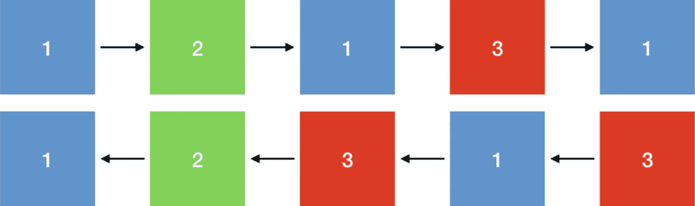

# 11.Twisted和 HTTP/2

## 介绍

HTTP/2 是作为几乎所有万维网基础的古老协议的最新修订版:超文本传输协议。HTTP 最初是由蒂姆·伯纳斯·李在 1989 年在 CERN(欧洲核研究组织)开发的，从那时起，它就一直是网络的引擎。该协议的主导地位是如此完整，以至于几乎所有大多数人认为是“互联网”的东西实际上都是万维网的一部分，因此使用 HTTP。

从本质上讲，HTTP 是一种允许浏览器与网站通信的协议。它为您的浏览器请求“资源”，如网页或图像，以及服务器提供这些资源作为响应，提供了一种正式的编码。它还支持上传数据。虽然它最常见的用途是网站，但 HTTP 也通常通过使用“web APIs”用于机器对机器的通信，这使程序员可以编写与存储在其他计算机上的数据进行交互的应用。你听说过的大多数大公司都运行 web API！

在早期，该协议经历了多次修订，但随着互联网工程任务组(IETF)于 1996 年发布 RFC 1945，该协议成为最常见的形式。这代表了该协议第一个长期版本的愿景，并确立了其众所周知的特性。这些包括它基于文本的、人类可读的性质；它依赖于定义良好的行为(如 GET、POST 和 DELETE)的动词字典；以及用于管理内容缓存的工具。HTTP/1.0 之后紧接着是 HTTP/1.1，这是一个增量版本，对协议的表达能力和效率进行了大量改进。HTTP/1.1 于 1997 年在 RFC 2068 中首次指定，并于 1999 年在著名的 RFC 2616 中更新。这个版本的 HTTP 在接下来的 15 年里几乎完全没有变化。所有在这个时代成熟的软件和服务都是建立在这个 90 年代的协议之上的。

不幸的是，HTTP/1.1 有许多缺点，使得它越来越不适合 2010 年代的网络。作为一个基于文本的协议，它非常冗长，需要传输比严格要求更多的字节。它也缺乏任何形式的多路复用， <sup>[2](#Fn2)</sup> 意味着任何时候传输中的每个 HTTP 请求/响应对都需要一个专用的 TCP 连接，这将导致下面进一步探讨的问题。与大多数二进制协议相比，它解析起来也很复杂和缓慢。

这些缺点的结合导致 HTTP/1.1 连接在延迟、带宽和操作系统资源使用方面存在问题。这些担忧促使 Google 开始尝试 HTTP/1.1 的替代方案，这些方案保持了相同的语义，但使用了不同的网络格式来传输数据。在对这个名为 SPDY， <sup>[3](#Fn3)</sup> 的实验性协议进行了几年的测试后，很明显，该协议为 HTTP/1.1 的许多问题提供了解决方案，IETF HTTP 工作组决定使用 SPDY 作为 HTTP 协议新修订版(版本 2)的基础。

HTTP/2 包含了对 HTTP/1.1 的许多改进。它将协议从基于文本改为使用带长度前缀的二进制帧流。它添加了一种特殊的压缩形式，适合与 HTTP 头一起使用，极大地减少了与给定的 HTTP 请求或响应相关的开销。它提供了多路复用和流控制，允许多个 HTTP 请求/响应对话发生在一个 TCP 连接上。最后，它增加了对协商扩展的明确支持，使 HTTP/2 在将来比 HTTP/1.1 更容易扩展。

自 2015 年被标准化以来，HTTP/2 变得极其成功。所有主流浏览器都像大多数主流 web 服务器一样支持它，它正迅速取代 HTTP/1.1 成为 web 上使用的主要协议。这种广泛的部署意味着开发人员希望能够在他们自己的应用中利用该协议，包括那些直接构建在 Twisted 上的应用。

Twisted 包含一个 HTTP 服务器。2016 年，我们开始扩展这个提供 HTTP/1.1 支持的 HTTP 服务器，以提供 HTTP/2 支持，该功能的初始版本于 2016 年 7 月在 Twisted 16.3 中发布。本章的其余部分将讨论这个实现是如何构建的，它的关键特性，并涵盖这个实现使用的几种有用的异步编程技术。

## 设计目标

Twisted 中的 HTTP/2 集成工作从一开始就有许多特定的设计目标。

### 无缝集成

HTTP/2 项目的第一个也是最重要的设计目标是尽可能无缝地与 Twisted 现有的 web 服务器集成，这是`twisted.web`的一部分。该项目的理想结果是现有的 Twisted Web 应用能够支持 HTTP/2，而无需修改任何代码。这将使现有的和新的 web 应用尽可能广泛地访问 HTTP/2，并且进入门槛极低。

令人高兴的是，HTTP/2 被设计成具有与 HTTP/1.1 相同的“语义”。这意味着任何有效的 HTTP/1.1 消息在 HTTP/2 中都必须至少有一个完全等价的表示。尽管在网络上发送的字节的具体排列是不同的，但是 HTTP 会话的抽象含义可以在 HTTP/1.1 和 HTTP/2 中准确地表达。这意味着，至少在原则上，允许`twisted.web`的用户透明地启用 HTTP/2 而无需任何代码更改是可能的。

在 Twisted 中，通过广泛使用接口来定义抽象层，这种“无缝”集成成为可能。接口是您可以在一系列相关对象上调用的函数的正式描述。例如，您可以像这样使用`zope.interface`描述一个“车辆”界面:

```py
from zope.interface import interface

class IVehicle(Interface):
    def turn_on():
        pass

    def turn_off():
        pass

```

有了这个定义的接口，你就可以通过对接口而不是对特定的实现编程来编写可以操作任何类型车辆的程序。像这样的接口是一种形式的*多态*(面向对象编程中使用的一个术语)，是基于类的继承的一种替代。本节将不再进一步探讨多态接口的概念，只是说为对象定义接口允许您编写代码，可以非常优雅地使用同一接口的替代实现。

在 HTTP 的情况下，原则上我们可以定义一组接口，用于在语义级别使用 HTTP(不参考特定的网络格式)，并让用户针对这些接口编写代码。例如，你可以有一个`HTTPServer`接口，它公开了一个按照通用的`HTTPRequest`和`HTTPRespose`对象来操作的接口，并且保护用户代码不受底层连接的特定属性的影响。

不幸的是，以这种方式定义接口并不总是容易做到的，并且在实践中遇到了许多困难，需要解决这些困难来实现这个设计目标。这些将在本章的后面部分详细介绍。然而，一旦解决了这些困难，我们就能够构建一个最终的实现，它几乎与现有的 HTTP/1.1 实现无缝结合。

最终结果是，从 Twisted 16.3 开始，任何使用`twisted.web`的应用都可以通过在安装或升级 Twisted 时安装可选的`http2` extra 来获得自动 HTTP/2 支持。然后，Twisted 将从操作系统中检测所有相关的特性，假设一切正常，HTTP/2 将在可能的情况下自动使用。

### 默认情况下的最佳行为

HTTP/2 是一个复杂的协议，具有许多可调参数，这些参数会影响协议的效率。帧大小、优先级管理、压缩策略、并发流限制，甚至缓冲区大小都在调节协议效率方面发挥作用。

因为 Twisted 中的 HTTP/2 支持对用户是透明的，所以大多数用户很可能不会注意到它的存在。因此，协议在默认情况下尽可能高效地运行是至关重要的。这是因为如果用户不知道某个特性的存在，他们就不能合理地为他们的用例配置这个特性。

这是特性开发的一个一般经验，它是从前面的设计目标延续下来的:想要完全无缝和透明的特性也必须有适用于最广泛用例的合理缺省值。如果不这样做，用户将会在不知情的情况下体验到软件的次优行为，如果他们最终意识到这种行为，他们将不得不进行复杂的分析和调试来跟踪它。

由于这个原因，Twisted 的 HTTP/2 支持需要小心谨慎。默认配置需要在几乎所有情况下都能很好地执行，并且没有大量的开销，其最低目标是至少与 HTTP/1.1 实现一样好。否则这个特性最终会惩罚启用它的用户，使它完全没有价值。

### 分离关注点和重用代码

最后，也是最重要的，设计目标是避免重复发明太多轮子。设计网络应用时，一个重要的反模式是构建定制组件，而不是粘在已解决问题的已有实现中。当使用像 Twisted 这样的框架时，这尤其具有诱惑力，因为在集成预先存在的解决方案时，需要小心避免阻塞事件循环。这样做的原因是，用于避免阻塞事件循环的特定机制通常因框架而异，因此为每个框架编写定制代码非常诱人:这样做的代价是不可能跨多个框架重用大块代码。

幸运的是，Python 生态系统已经包含了一个“sans-io”HTTP/2 实现。这是一个可以用来解析和序列化 HTTP/2 协议的协议栈，但是它不理解任何关于 I/O 的东西。像这样的实现被设计成粘合到像 Twisted 这样的框架中，并且它们允许大量的代码重用。

这是网络编程中最重要的设计模式之一，因此值得重复:只要有可能，您应该努力将您的协议解析器与您的特定 I/O 实现分开。您的协议解析器应该只对内存中的字节缓冲区进行操作，无论是消费还是产生它们，并且应该没有从网络获取字节或向网络提供字节的机制。这种设计模式允许您更容易地将您的协议解析器从一种 I/O 模式移植到另一种模式，并且使测试和扩展您的协议解析器变得非常容易。

有了这个设计目标就改变了工作的性质。Twisted HTTP/2 实现处理 HTTP/2 协议中需要向网络写入字节和从网络写入字节的部分，设置和处理计时器，并将 HTTP/2 事件翻译成`twisted.web`接口。sans-io HTTP/2 实现负责将字节流解析成 HTTP/2 事件，并将来自`twisted.web`的函数调用转换成字节发出。

这种代码重用还允许花更多的时间来优化 Twisted 可以增加最大价值的实现部分。Twisted 的实现非常注重减少数据到达网络的延迟，有效地传播背压，以及减少不必要的系统调用或 I/O 开销。当核心协议逻辑被分解到一个单独的项目中时，这就容易多了。

一般来说，当处理“标准”问题时，这是最好的方法。它缩小了代码库的规模，避免了花费太多的工程时间来解决已经解决的问题，并允许您专注于提高解决方案的效率和可伸缩性。

## 实施问题

一旦确定了设计目标，就可以开始编写代码了。虽然对于许多开发人员来说，这是有趣的部分，但也经常会发生一些意想不到的事情。此外，我们经常会发现，在概念上讨论时，设计的某些方面非常简单，但是当它们被转化为代码时，就变得非常复杂了。本节涵盖了与具体实现相关的一些具体问题。

### 到底什么是联系？标准接口的价值

在`twisted.web,`中，有许多对象合作实现 HTTP 支持。最简单的版本是将底层 TCP `Transport`与`HTTPChannel`和`Request`对象联系起来。这种关系如图 [11-1](#Fig1) 所示。


图 11-1

*三个最重要的对象* *在 Twisted 中提供 HTTP 支持*

在实现 HTTP/2 支持时，我们发现标准的 Twisted HTTP 请求处理程序(`twisted.web.http.Request`)期望以`twisted.web.http.HTTPChannel`的形式传递一个对 HTTP 连接处理对象的引用(或者类似接口的东西:令人沮丧的是，期望的接口从未被编译)。在`Request`的构造函数中，它进入了刚刚传递的通道，并取出了`transport`属性来保存它自己。所有后续调用`Request.write`写出响应体的操作都将被代理到`transport.write`。无论`transport`对象是什么，`transport.write`都会调用`write`函数。这个对象将实现`twisted.internet.interfaces.ITransport`:Twisted 中广泛使用的另一个`zope.interface`接口。在这种情况下，`ITransport`是一个特别常见的接口，用于表示任何类型的可写数据传输。这通常是诸如 TCP 之类的低级流协议，但实际上可以是提供流写接口的任何东西。在旧的 HTTP/1 模型中，这几乎总是底层的 TCP 传输。

对于 HTTP/1.1 来说，这种分层冲突最终会很好地工作，因为一旦发送了响应头，响应体就可以被视为任意的字节流。然而，这对于 HTTP/2 来说非常不适用:多路复用、优先级和流量控制都使得防止应用对 TCP 连接进行任意写入变得极其重要。

作为 HTTP/2 工作的一部分，我们需要清理它。然而，我们不能简单地移除这些属性:它们是`Request`的公共 API 的一部分，需要被保留。<sup>[4](#Fn4)T4】</sup>

最直接的改变是让 HTTP/1.1 `twisted.web.http.HTTPChannel`对象成为`ITransport`的实现者，它将大多数方法代理到底层传输。这确保了`HTTPChannel`在封装自己的资源方面做得更好，因为它确保了用户不需要进入它内部来编写响应体，同时也解决了以前设计中的一些语义问题。本质上，`HTTPChannel`应该是响应的传输，而不是*拥有*一个可以在其中发送响应的传输的对象。当然，由于向后兼容策略，`HTTPChannel`不能删除它的`transport`属性，所以它没有真正封装传输，但是阻止它的使用是重要的第一步。

一旦这样做了，就可以将`Request`的内部实现改为对每个最初发送到传输层的调用使用`HTTPChannel`。本质上是自我的每一个实例。`transport`体内的一个`Request`法被改成了`self.channel`。这确保了 Twisted 的 HTTP 请求处理的默认实现现在适当地考虑了 TCP 连接和 HTTP 连接之间的预期抽象。

不幸的是，由于 Twisted 的兼容性政策，我们无法在这里创建一个干净的断点。已经存在大量使用 Twisted Web 创建的 HTTP/1.1 应用，其中一些不可避免地直接写入传输(或者处理传输，例如，到达并检索 TLS 证书)。出于这个原因，transport 属性不能从`HTTPChannel`中删除，并且还需要出现在作为 HTTP/2 等价物提供的任何对象上。

正如上一节所讨论的，HTTP/2 中的多路复用需要多个协作对象来提供所需的抽象。这也意味着有两个独立的对象*一起*提供与`HTTPChannel`相同的接口。`Request`只需要`HTTPChannel`接口的一个子集。出于兼容性目的，该部分接口被放置在`H2Stream`上。

由于`Request`需要从其渠道获得`transport`属性，`H2Stream`也需要一个`transport`属性。然而，HTTP/2 代码不需要像 HTTP/1.1 代码那样继续提供相同的抽象冲突:假设没有遗留 API 需求，它只需要能够访问属性。由于这个原因，所有的`H2Stream`对象都有一个总是被设置为`None`的`transport`属性。

这是一个很好的例子，如果在`Request`和`HTTPChannel`对象之间存在标准接口，情况会变得更容易。在最初创建时，没有预见到可能有必要让这些对象中的每一个都支持其伙伴对象的多种可能的实现，因此这两个对象之间使用的接口没有正式定义。缺少正式定义意味着这些对象的*有效*接口是它们的整个 API 表面:所有方法和所有属性。

当试图创建额外的抽象层时，这种宽泛且隐含的接口会导致巨大的困难。如果重新实现一个对象的人需要完全模拟它的整个公共 API，那么提供替代实现和构建适当的抽象就变得相当困难。

然而，从积极的一面来看，`Request`需要从`HTTPChannel` *那里得到的大部分有效接口都被*以`ITransport`的形式定义了。因为`Request`花费了大部分时间来编写`HTTPChannel`的传输，并且因为该传输只能被合理地假设为`ITransport`的实现者，所以很容易识别出哪些方法需要添加到`HTTPChannel`以及它们的行为应该是什么。一旦这样做了，识别需要呈现的有效 API `H2Stream`是什么就很简单了。

由于在 Twisted Web 的早期缺乏对可扩展性的关注，集成 HTTP/2 比需要的要困难。然而，情况可能会更糟:由于在 Twisted 的所有代码中广泛使用了接口，解决这些抽象违规问题比其他情况要容易得多。

这对未来的工程师来说应该是一个重要的教训:当系统被设计时，它很可能被设计成组件之间的高级接口。这些接口应该被编入代码中，因为它们提供了关于每个组件对其他组件的期望的非常有用的指导，并允许组件在未来进行更易处理的扩展和增强。

### 多路复用和优先级

HTTP/2 最复杂的部分之一是它的多路复用支持。引入 HTTP/2 的这个核心特性是为了允许多个 HTTP 请求/响应对使用同一个 TCP 连接，方法是在同一个 TCP 连接上同时发送和接收它们。与 HTTP/1.1 使用多个并发 TCP 连接相比，这种方法有许多优点:

1.  它使用较少的系统资源。每个 TCP 连接占用客户机和服务器的操作系统中的一个文件描述符，这增加了两个操作系统跟踪网络连接所必须做的工作量。它还增加了内核和 Twisted 应用中使用的内存量，前者必须分配数据结构来跟踪连接，后者分配大量数据结构来管理每个传输。

2.  它导致更好的吞吐量和更高的数据传输率。最广泛部署的 TCP 拥塞控制算法被设计为期望在任何时间任何两个主机之间不会有多于一个的 TCP 连接。两台主机之间有许多连接的结果，特别是如果它们都在传输大量数据(这是 web 上常见的一种使用模式)，就是多个并发连接的吞吐量无法达到链路上的最大可能吞吐量。

3.  它保持连接“更热”如果 TCP 连接长时间处于空闲状态，它们很容易被关闭(由中间体或任一对等体关闭),或者返回到“慢启动”状态，在这种状态下，先前关于链路拥塞的知识被丢弃。在任一情况下，当该连接开始被重用时，随着 TCP 慢启动阶段的进行，它将具有长时间的低吞吐量，并且如果该连接被关闭，它还将具有 TCP 和 TLS 握手的附加延迟。“热”连接，即持续或几乎持续使用的连接，避免了这两个问题，从而减少了延迟并提高了吞吐量。

在 HTTP/2 中，多路复用是通过将一个 HTTP/2 连接分成多个双向“流”来实现的。每个流都携带一个 HTTP 请求及其相关的响应。这非常简单，只需给每个流一个唯一的标识符，并确保属于该流的每个数据帧都携带该流标识符。这允许由 TCP 连接提供的单个有序数据流被分成多个逻辑数据流，如图 [11-2](#Fig2) 所示。



图 11-2

流是分散的数据块。它们可以以任何顺序交错。

然而，仅仅用适当的流标识符标记所有数据是不够的。为了解释为什么，考虑一个假想的网站作为云图片库会发生什么。这个网站有两个目的:它显示图像，它接受用户输入对它们进行修改。每个用户输入触发一个 API 请求/响应:此外，用户滚动或编辑将导致服务器向下流另一个图像文件。

API 请求/响应通常非常小:例如，它们可能是仅由几百个字节组成的 JSON 文档。图像的比例要大得多:可能有几兆字节。此外，生成图像不需要任何计算:它们存储在磁盘上，因此它们的数据随时可供网络服务器使用。

那么，一个可能的问题是，服务器可能会用图像流的数据完全填充 HTTP/2 连接，阻塞 API 响应的数据。API 响应构成了需要发送的数据的一小部分，但是该数据比图像数据具有更高的优先级。用户可能愿意等待缩略图加载，但他们不太可能愿意等待所有图像下载，直到他们看到他们的用户界面交互的效果。

大多数多路数据传输媒体都存在这个问题:我们如何确保最高优先级的数据尽快到达，同时确保连接总是得到最大限度的利用？对于这个问题有许多可能的解决方案，但是 HTTP/2 使用了一个方案，该方案涉及客户端设置*流优先级*。

流优先级允许客户端通知服务器不同流上数据的相对重要性。这些数据的目的是让服务器决定如何将稀缺的资源分配给客户机发出的不同请求。一般来说，服务器必须分配的主要资源是带宽，但是更复杂的服务器也可以使用这些信息来分配 CPU 时间、文件描述符或磁盘空间:实际上是任何有限的资源。

最简单的流优先级方案是简单地给每个流分配一个数字优先级。编号较大的流比编号较小的流更重要，应该首先提供服务。由于缺乏表达能力，这种模式往往很难实现:虽然它允许您指出一些数据比其他数据更重要，但它严重地无法让您表达该数据有多重要。

最简单可行的方案是给每个流一个数字权重。这个权重反映了流的相对重要性:如果流 X 的*权重是流 Y 的*的两倍，那么服务的重要性大约是流 Y 的两倍。这种方法的优点是，它可以用于按比例分配资源:在前面的例子中，流 X 应该被分配流 Y 的两倍的资源。这允许客户端发出信号，表明他们认为获得对流 X 的及时响应比对流 Y 的及时响应更重要，以及他们认为这有多重要。

HTTP/2 的前身协议 SPDY 使用了这种简单的方法。然而，到了指定 HTTP/2 的时候，HTTP 工作组认为这种方法不够有表现力，并且遗漏了一些用例。特别是，它不允许客户端容易地表达约束“如果由于某种原因不能在流 B 上使用资源，则只在流 A 上使用它们。”换句话说，这允许客户端说“没有流 B 的结果，流 A 是没有价值的，所以不要在 A 上花费任何时间，除非流 B 由于某种原因被阻塞。”

由于这个原因，HTTP/2 有一个更复杂的优先级系统。这个系统允许客户指定一个优先级的*树*，其中树*中的每个节点依赖于它上面的父节点*。这些优先级不影响“控制”数据，例如 HTTP 头:它们仅用于指示所请求资源的优先级。

对于 Twisted 的 web 服务器，我们很难分配上面讨论的大部分非带宽资源，因为我们对用户的应用没有足够的了解，无法准确知道我们应该问什么问题。结果只能把带宽分了。为了在 Twisted 中尽可能高效地做到这一点，我们对划分带宽做了一个简单的近似:我们划分帧。例如，如果流 A 和 B 的权重分别为 32 和 64，那么优先级算法的完美实现将为流 A 分配 1/3 的带宽，为流 B 分配另外的 2/3。准确地做到这一点将需要拆分用户对`transport.write`的每个调用中到达的数据，这将需要重复地将数据复制进和复制出缓冲区。如果没有用于此目的的高性能缓冲区，这种对内存的重复切片和复制是非常慢的(在开发时 Twisted 中没有这种功能，也不在本工作的范围内)，这意味着我们要尽可能地避免它。

为了避免这种切片，我们可以保持数据被写入，而是给每个流一个数量等于其相对权重的*帧*。每当发送缓冲区中有空间容纳更多要发送的数据时，Twisted 实现将根据流权重检查哪些有数据要发送的流应该接着发送。然后，我们发送单个数据块，达到该流的最大帧尺寸 <sup>[6](#Fn6)</sup> ，然后清洗并重复。这种基于帧的多路复用是网络协议设计中的常见模式，可以很容易地用于任意帧的协议。

该优先级树的构建和维护由第三方`priority`库处理。这个库构建并维护由客户端发送的优先级状态，并提供一个 iterable 来逐步指示 Twisted 实现接下来应该服务哪个流。它还包括来自 Twisted 应用的关于每个流是否有任何数据可发送的信息。没有数据要发送的流被视为*阻塞*，通常会分配给这些流的 TCP 连接部分会在作为子依赖项的流之间拆分。

围绕优先级树循环运行所有数据的需要给数据发送管道增加了一个难题，这在 HTTP/1.1 实现中是不存在的。对于 HTTP/1.1，响应数据的所有写入都可以直接传递给底层的 TCP 连接对象，该对象可以负责处理缓冲和发送数据。对于 HTTP/2，我们不想这样做，因为我们需要根据相对流优先级来交错写入。

更重要的是，实现需要对客户端发送的流优先级的变化做出响应:如果客户端增加了流的优先级，我们希望这能尽快反映在数据中。如果实现急切地将所有流数据写入 TCP 连接对象，可能会导致大量等待发送的数据缓冲区，这些缓冲区是根据旧的流优先级而不是新的流优先级来分配的。对于连接上的 TCP 吞吐量远低于 Twisted 应用中生成数据的速率的情况，这可能会导致在优先级变化反映到实际数据中之前出现数秒钟的延迟:这显然是不可接受的。

因此，Twisted HTTP/2 实现需要自己对数据进行内部缓冲，并异步发送数据给对`transport.write`的调用。这是通过重复使用`IReactor` `.callLater`来调度一个将发送最高优先级可用数据块的功能来实现的。

使用`callLater`允许我们通过注意来自 TCP 连接的反压力来避免发送缓冲区溢出(更多细节见下一节),并确保我们发送所有可用数据而不阻塞对`write.`的任何调用

数据发送函数的核心如下所示(为了清楚起见，去掉了错误处理和一些边缘情况):

```py
class H2Connection:
    def _sendPrioritisedData(self, *args):
        stream = None

        while stream is None:
            try:
                stream = next(self.priority)
            except priority.DeadlockError:
                # All streams are currently blocked or not progressing. Wait
                # until a new one becomes available.
                self._sendingDeferred = Deferred()
                self._sendingDeferred.addCallback(self._sendPrioritisedData)
                return
        # Wait behind the transport. This is managed elsewhere in this class,
        # as part of the implementation of IPushProducer.
        if self._consumerBlocked is not None:
            self._consumerBlocked.addCallback(self._sendPrioritisedData)
            return

        remainingWindow = self.conn.local_flow_control_window(stream)
        frameData = self._outboundStreamQueues[stream].popleft()
        maxFrameSize = min(self.conn.max_outbound_frame_size, remainingWindow)

        if frameData is _END_STREAM_SENTINEL:
            # There's no error handling here even though this can throw
            # ProtocolError because we really shouldn't encounter this problem.
            # If we do, that's a nasty bug.
            self.conn.end_stream(stream)
            self.transport.write(self.conn.data_to_send())

            # Clean up the stream
            self._requestDone(stream)
        else:
            # Respect the max frame size.
            if len(frameData) > maxFrameSize:
                excessData = frameData[maxFrameSize:]
                frameData = frameData[:maxFrameSize]
                self._outboundStreamQueues[stream].appendleft(excessData)

            # If for whatever reason the max frame length is zero and so we
            # have no frame data to send, don't send any.
            if frameData:
                self.conn.send_data(stream, frameData)
                self.transport.write(self.conn.data_to_send())

            # If there's no data left, this stream is now blocked.
            if not self._outboundStreamQueues[stream]:
                self.priority.block(stream)

            # Also, if the stream's flow control window is exhausted, tell it
            # to stop.
            if self.remainingOutboundWindow(stream) <= 0:
                self.streams[stream].flowControlBlocked()
        self._reactor.callLater(0, self._sendPrioritisedData)

```

这个功能可以分为四个逻辑部分。第一个检查是否有任何被认为“能够进行”的流(也就是说，在它们的流控制窗口 <sup>[7](#Fn7)</sup> 中有可发送的数据和空间来发送它)。如果没有，那么我们就没有任何数据要发送，所以我们设置了一个`Deferred`,当一个流由于任何原因被解除阻塞时，它将被回调。

第二部分检查发送缓冲区中是否有空间。这是由`Deferred`发出的另一个信号:如果在`self._consumerBlocked,`中有一个`Deferred`，那么 Twisted 已经通知我们发送缓冲区已满，我们应该避免写入。同样，我们不做任何工作就返回，并确保当`Deferred`触发时，这个函数将被调用。在这两种情况下，该功能都不会被调用，直到阻止其进程的情况得到解决。

第三和第四部分与实际数据的发送有关。在这种情况下，我们有一个流，它有可发送的数据，并且在发送缓冲区中有空间来发送它。然后，我们从队列中弹出一大块数据(之前写在对`write`的调用中)。如果对象是`_END_STREAM_SENTINEL,`，那么主体就完成了，我们需要完成流的发送。否则，我们创建一个可以发送数据的数据帧，并可选地进行一些其他的状态管理。

最后一步，如果我们发送了任何数据，我们安排使用`callLater`调用这个方法，如前所述。

这种方法虽然比 HTTP/1.1 发送数据所需的逻辑复杂得多，但却是 HTTP/2 多路复用方法的核心。这种增加的计算复杂性使得 HTTP/2 在 Python 代码中比 HTTP/1.1 慢，但是极大地提高了协议的网络性能。

上述方法是如何处理复杂的多路复用数据发送或任何种类的缓冲发送逻辑的模型:可以在过程的每一步重复调用的单个函数，并且如果由于任何原因它不能做任何工作(例如，因为传输不能接受更多数据，或者因为没有数据要发送)，可以容易地重新调度该函数。

### 反压力

新手程序员在使用像 Twisted 这样的异步系统时经常犯的一个错误是没有考虑如何处理过载情况。像 Twisted 这样的异步网络框架极大地增加了应用可以处理的网络流量，但是使用该框架的开发人员编写的应用代码可能跟不上 Twisted 和操作系统可以处理的数据量。

所有联网的应用都有可能遇到这样的情况:工作进入系统的速度快于系统的处理速度。一个简单的例子是一个 web 应用，它可以在 10 ms 内在一个 CPU 内核上处理一个请求。如果这个应用暴露在低于每秒 100 个请求的恒定负载下，那么一切都很好。

当这个完全相同的系统的负载水平超过每秒 100 个请求时，会发生什么情况？这个问题有许多可能的答案，但是这个系统中大多数 Twisted 应用的标准行为是它们将缓冲数据。 <sup>[8](#Fn8)</sup>

这种方法对于“尖峰”负载来说通常是合理的:如果系统上的负载只是短暂地超过每秒 100 个请求，然后又下降到这个水平以下，那么请求将短暂地经历更长的延迟(响应请求所需的时间)，因为它们在被处理之前会在缓冲区中停留一段时间，但是 Twisted 应用将在新数据到达之前更快地从缓冲区中提供数据，因此缓冲区将慢慢变空。

然而，如果负载持续一段时间超过每秒 100 个请求，或者*实质上*超过该水平(例如，数百或数千倍)，则缓冲表示有问题。每个请求的等待时间将会增加，可能会达到与失败难以区分的程度(大多数用户等待请求响应的时间不会超过一两秒，因此对于这些用户来说，20 秒的请求等待时间相当于请求失败)。更糟糕的是，如果过载持续，缓冲区将继续增长，如果不加检查，最终将消耗系统中的所有内存。最有可能的结果是操作系统会终止该进程:在最坏的情况下，该进程将开始交换，这将大大降低其计算速度并降低应用的处理速度，使应用更难处理过载。

因此，可伸缩的 Twisted 应用需要为过载做好准备。最常见的处理方式是创建传播*背压*的系统。背压是从一个系统到另一个系统的信号，表示“您提交工作的速度超过了我的完成速度，请慢下来。”通过异步应用正确地传播背压，允许该应用向接收工作的系统部分传达它可以处理多少工作。

具有讽刺意味的是，传播背压的一个很好的例子是阻塞 I/O。当使用阻塞 I/O 通过 TCP 发送数据时，如果远程对等体读取数据的速度不够快，发送调用将最终阻塞，直到远程对等体消耗了足够的数据来允许您的操作系统继续发送。这会强制降低发送应用的速度，使其发送数据的速度不会快于远程应用从套接字读取数据的速度。

### Twisted中的背压

目前，在 Twisted 中，通过让传输和协议实现两个接口来传播背压:`IPushProducer`和`IConsumer`。一般来说，`Transport`实现`IPushProducer`，而`Protocol`实现`IConsumer`，尽管在更复杂的系统中(比如 Twisted 中的 HTTP/2 实现)，同一个对象可能同时实现`IConsumer`(用于入站数据)和`IPushProducer`(用于出站数据)。

这两个接口非常简单:

```py
class IPushProducer(IProducer):
    """
    A push producer, also known as a streaming producer is expected to produce (write to this consumer) data on a continuous basis, unless it has been paused. A paused push producer will resume producing after its resumeProducing() method is called. For a push producer which is not pauseable, these functions may be noops.
    """

    def pauseProducing():
        """
        Pause producing data.

        Tells a producer that it has produced too much data to process for the time being, and to stop until resumeProducing() is called.
        """
    def resumeProducing():
        """
        Resume producing data.

        This tells a producer to re-add itself to the main loop and produce more data for its consumer.
        """

class IProducer(Interface):
    """
    A producer produces data for a consumer.

    Typically producing is done by calling the write method of a class implementing L{IConsumer}.
    """

    def stopProducing():
        """
        Stop producing data.

        This tells a producer that its consumer has died, so it must stop producing data for good.
        """

class IConsumer(Interface):
    """
    A consumer consumes data from a producer.
    """

    def registerProducer(producer, streaming):
        """
        Register to receive data from a producer.

        This sets self to be a consumer for a producer. When this object runs out of data (as when a send(2) call on a socket succeeds in moving the last data from a userspace buffer into a kernelspace buffer), it will ask the producer to resumeProducing().

        For L{IPushProducer} providers, C{pauseProducing} will be called whenever the write buffer fills up and C{resumeProducing} will only be called when it empties.

        @type producer: L{IProducer} provider

        @type streaming: C{bool}
        @param streaming: C{True} if C{producer} provides L{IPushProducer},
        C{False} if C{producer} provides L{IPullProducer}.
        @raise RuntimeError: If a producer is already registered.

        @return: L{None}
        """

    def unregisterProducer():
        """
        Stop consuming data from a producer, without disconnecting.
        """

    def write(data):
        """
        The producer will write data by calling this method.

        The implementation must be non-blocking and perform whatever buffering is necessary. If the producer has provided enough data for now and it is a L{IPushProducer}, the consumer may call its C{pauseProducing} method. 

        """

```

这些接口最重要的部分是`IPushProducer``.pauseProducing``IPushProducer.resumeProducing`和`IConsumer.write`。其余的是管理性的，涉及到告诉消费者关于生产者的情况，以及告诉生产者消费者不能再接受数据。

当一个`IConsumer`经历了太多的负载，以至于他们希望数据停止进入他们，他们可以在他们注册的生产者上调用`pauseProducing`。当他们准备接受更多的工作时，他们会打电话给`resumeProducing`。此时，消费者的注册生产者将再次开始调用`write`，直到`IConsumer`再次调用`pauseProducing`。

### HTTP/2 中的背压

HTTP/2 有两种背压信号方法，都使用流量控制算法。第一个是与 HTTP/1.1 共享的，因为它实际上内置于 HTTP/1.1 和 HTTP/2 都使用的 TCP 中。TCP 维护一个接收方窗口，将接收方的能力反馈给发送方。如果 TCP 连接的一端停止从套接字读取，另一端最终会发现不允许它发送进一步的数据。

此外，HTTP/2 还维护自己的四个流控制窗口:两个用于整个连接(一个用于从客户机发送到服务器的数据，一个用于从服务器发送到客户机的数据)，两个用于每个流(同样，每个方向一个)。这些流控制窗口限制了每个对等体被允许发送多少数据:流窗口管理在给定的流上可以发送多少数据，而连接窗口控制在整个连接上可以发送多少数据。

这些窗口中的每一个也可以用于传播背压:让这些窗口大小中的任何一个变为零都会迫使远程对等体停止发送其部分或全部数据。这意味着我们希望能够将这些从客户端发送的背压信号传播到 Twisted 服务器。我们还希望能够将反压力信号从 Twisted 应用传播到客户端:如果 web 应用处理数据的速度比客户端发送数据的速度慢，我们应该适当降低数据交付的速度。 <sup>[9](#Fn9)</sup>

这方面的策略有两个:增加对 Twisted 服务器的支持，以发出和消耗背压，并适当地管理我们的 HTTP/2 流控制窗口。先说发射和消耗背压。

`IConsumer/` `IPushProducer`接口的一个关键之处是这两个接口是一对一的。这意味着每个消费者只能有一个生产者，并且每个生产者一次只能为一个消费者生产。这对于 HTTP/2 来说是个问题，因为我们有多个数据流，每个数据流都会单独传播背压。

解决这个问题最简单的方法是用两个对象来定义 HTTP/2 连接，而不是一个。第一个对象拥有底层的 TCP 传输，并将自己注册为该传输的生产者和消费者:在代码中，这个类是`twisted.web._http2.H2Connection`。

当客户端启动新的流时，这个对象创建一个新的对象来处理流数据，同时作为应用代码的生产者和消费者:在代码中，这个类是`twisted.web._http2.H2Stream`。在这两个对象之间，我们使用一个只为 HTTP/2 存在的自定义接口，以允许连接告诉流何时应该暂停它的生产者，因为流不能再发送(`H2Stream.flowControlBlocked`)以及何时窗口大小已经改变(`H2Stream.windowUpdated`)。H2Stream 在其应用上将这些调用转换成对`pauseProducing` & `resumeProducing`的调用。类似地，`H2Stream`允许应用调用`pauseProducing`来阻止流传递更多的数据。当被调用时，这将导致`H2Stream`开始缓冲数据，而不是将数据传递给应用。

这种相当混乱的关系如图 [11-3](#Fig3) 所示。


图 11-3

HTTP/2 连接中各种对象之间的生产者/消费者关系。每条线代表一个生产者/消费者关系。注意，这些关系并不总是用`IProducer/IConsumer`接口实现，如本节所讨论的。

如果与流相关联的任何流控制窗口为零，则流可能会被“阻塞”。也就是说，如果 TCP 流阻塞(传输调用`H2Connection`上的`pauseProducing`，该连接拥有的所有`H2Stream`对象将调用它们的应用上的`pauseProducing`。此外，如果连接流控制窗口变为 0，所有的`H2Stream`对象将在它们的应用上调用`pauseProducing`。最后，如果特定于流的窗口变为 0，与该流相关联的`H2Stream`对象将在其应用上调用`pauseProducing`，但其他对象不会。

然而，这种缓冲并不是无限的。它受流控制窗口的限制。你看，`H2Connection`还为`H2Stream`提供了另一个 API:`H2Connection.openStreamWindow`。当*向应用*传送数据时，而不是之前，该函数由`H2Stream`调用。这意味着，如果应用暂停生产，流窗口将不会打开，因此最终将被远程对等体耗尽，远程对等体将被允许在该流上不再发送数据，直到应用开始处理积压。

值得注意的是，即使应用无法处理更多数据，`H2Connection`也不会阻止客户端在 TCP 连接上发送更多数据。这是因为 HTTP/2 使用许多控制帧来管理流控制窗口和连接状态。这些额外的控制帧不能用于导致过多的数据缓冲，因此没有理由阻止客户端发送它们。

与 HTTP/1.1 相比，适当选择传播背压的应用在 HTTP/2 上会获得更丰富的体验。应用中较慢的部分，或者与较慢的客户端交互的部分，可以愉快地减慢速度，而不会限制系统的整体并发性。这也确保了通过 HTTP/2 提供数据的应用可以优雅而谨慎地处理过载，以一种可管理的方式降低服务质量，防止它们被完全淹没。

应用可以通过确保它们的请求处理器为它处理的每个`Request`注册一个`IPushProducer`来选择加入这个信号。`twisted.web.http.Request`提供`IConsumer`正是为了这个目的。

应该注意的是，`IConsumer/IPushProducer`接口是有限的，不一定能提供背压传播 API 应该提供的所有丰富功能。为了看到最终可能取代`IConsumer/IPushProducer`的更好界面的例子，让我们看看 tubes。 <sup>[10](#Fn10)</sup>

## 现状和未来扩展

Twisted HTTP/2 实现在 2016 年 7 月发布的 Twisted 16.3 中发布。该实现受到许多可选依赖项的限制，必须安装这些依赖项才能启用它，还需要满足 Twisted 正在使用的 OpenSSL 版本的一些要求。这些关口有效地将 HTTP/2 支持置于正在进行的“测试”状态。

自最初发布以来，许多有进取心的用户选择了支持，并帮助跟踪错误和报告问题。结果是 Twisted 的 HTTP/2 栈现在运行在数量巨大的机器上，几乎没有问题。这是一个巨大的成功，也是该项目的持续健康发展的一个非常积极的信号。

这项工作有几个自然的发展方向。第一个也是最大的挑战是编写一个 HTTP/2 客户机，它透明地填充到当前的 HTTP/1.1 客户机中。这是一项尚未认真尝试的重要工作，尽管一些前期工作已经完成。

工作的另一个重点是开始公开 API 以利用 HTTP/2 的特性。特别是，HTTP/2 支持服务器推送，这允许服务器乐观地开始发送客户端呈现页面可能需要的资源。一个有趣的未来增强将是允许 Twisted 应用通过公开适当的 API 以编程方式发出推送的资源。这可以用链接头解析来扩展，以支持来自传统 WSGI 应用的推送。

最后，允许对 HTTP/2 栈进行更多配置的 API 将是一个有用的扩展。目前还不支持允许 Twisted 应用修改 HTTP/2 配置，无论是全局的还是基于每个连接的。增加这种支持是向提供完整特性的 HTTP/2 实现的必要发展。

## 摘要

在本章中，我们介绍了 RFC 7540 中定义的 HTTP/2 协议。我们讨论了对`twisted.web`的扩展以支持该协议，重点讨论了该集成的设计目标，以及在实现过程中出现的一些具体问题。我们还讨论了并发编程中背压的重要性，以及接口设计对接口可扩展性的重要性。最后，我们总结了 Twisted 对 HTTP/2 支持的现状和未来发展方向。

<aside class="FootnoteSection" epub:type="footnotes">Footnotes [1](#Fn1_source)

HTTP/1.1 在 RFC 7230 及其相关 RFC 中于 2014 年进行了更新。这并不是对协议的实质性修改:相反，目标是将 HTTP/1.1 在这 15 年间的部署方式整理成文。

  [2](#Fn2_source)

HTTP/1.1 确实定义了一个叫做“管道”的概念，它允许一个用户代理提交多个请求，而不需要等待前一个请求的响应。原则上，流水线提供了某种形式的多路复用支持。不幸的是，流水线技术不是解决这个问题的好方法，并且存在许多问题。最严重的是，要求服务器按照请求被发送的顺序来响应请求。如果服务器需要生成大量响应，这可能会导致长时间等待后续请求的响应。此外，如果服务器接收到具有副作用(例如，改变一些数据)的请求，则它需要停止处理该流水线连接上的所有其他请求，直到该请求被完全处理，除非它能够证明那些其他请求是安全的。实际上，这些限制是如此繁重，以至于没有一个主流浏览器支持管道，因此它从未被广泛部署。

  [3](#Fn3_source)

发音为“快速”

  [4](#Fn4_source)

向后兼容的优点在 [`https://twistedmatrix.com/documents/current/core/development/policy/compatibility-policy.html`](https://twistedmatrix.com/documents/current/core/development/policy/compatibility-policy.html) 中有更好的解释。

  [5](#Fn5_source)

更具体地说，算法假设系统上每个 TCP 连接的数据包丢失事件是独立的:一个连接上的数据包丢失事件与其他连接的行为无关。对于在进行批量数据传输的相同的两个主机之间的多个 TCP 连接，这种假设不成立:分组丢失事件最经常发生是因为链路饱和，结果分组丢失将很可能同时发生在大多数或所有 TCP 连接上。这会导致所有 TCP 连接的数据吞吐量一下子减半，使链路长时间得不到充分利用。

  [6](#Fn6_source)

眼尖的读者会注意到，Twisted 对传递给`write()`的数据大小没有设置上限，这意味着这个数据块可能大于 HTTP/2 最大帧大小。如果发生这种情况，我们无论如何都必须进行内存复制；这是无法避免的。

  [7](#Fn7_source)

有关流量控制窗口的更多信息，请参见下一节背压。

  [8](#Fn8_source)

嗯，大部分是。这要看这 10 ms 是用来做什么的。如果这 10 ms 的大部分时间都在等待其他事情的发生(比如数据库查询)，那么 Twisted 就会缓冲。如果这 10 毫秒完全用于在 CPU 上进行计算，那么行为将会不同。现在，我们假设发生的是前一种情况。

  [9](#Fn9_source)

注意，这不同于对等体不再想要数据*的情况*。如果一个对等体不再希望 HTTP/2 流继续下去，它可以通过一个特定的 HTTP/2 帧(称为`RST_STREAM`)彻底取消该流。这与背压没有直接关系，但值得注意。

  [10](#Fn10_source)

[T2`https://twisted.github.io/tubes/`](https://twisted.github.io/tubes/)

 </aside>