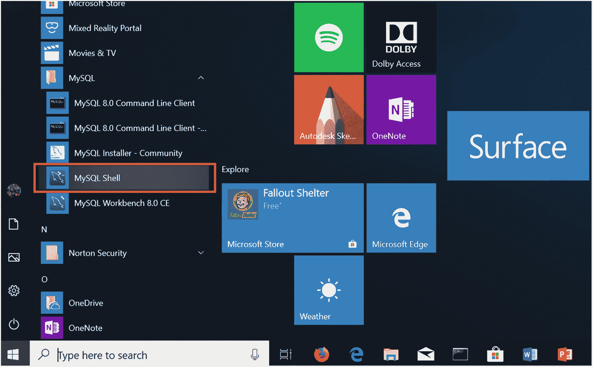
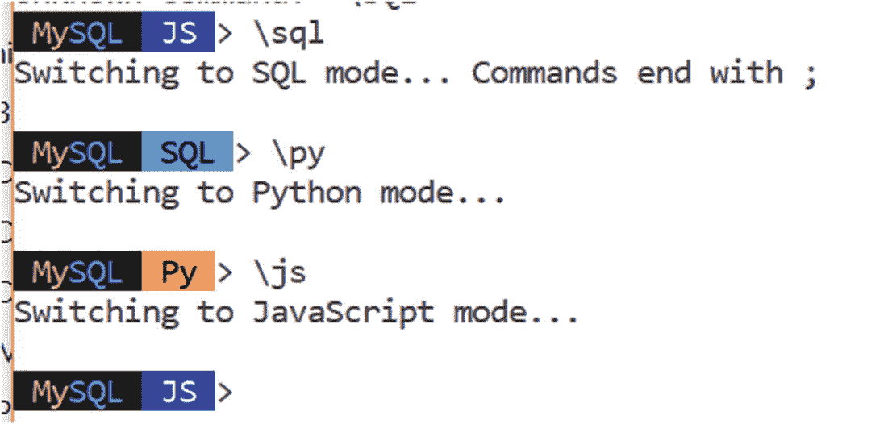

# 3.MySQL Shell 教程

既然我们已经知道了 MySQL Shell 是什么以及它在 MySQL 产品套件中的位置，那么是时候了解 Shell 能为我们做什么了。具体来说，它支持哪些命令，如何连接服务器，支持哪些功能？

在这一章中，我们将更详细地探讨 MySQL 外壳。我们将了解更多关于它的主要特性和选项，以及如何使用新的 shell 来交互式地执行脚本。正如您将看到的，MySQL Shell 是 MySQL 未来的一个重要元素。让我们从 shell 支持的命令和选项开始。

## 命令和选项

如果您认为新的 shell 只不过是原始客户端的改进版本，那么您就大错特错了。shell 不仅仅是原始客户端的简单替换。为了让您开始了解它的不同之处，以及它如何比原来的 shell 复杂得多，让我们从检查支持的命令和选项开始。

命令是您可以在提示符下提供的特殊条目，它直接与 MySQL Shell 应用交互。这些命令通常被称为 shell 命令，并以斜杠(`\`)开头。选项指的是启动 MySQL Shell 时可以指定的许多参数(选项)。因此，shell 支持启动时的定制，比如连接到服务器、设置模式等等。

在接下来的几节中，我们将了解更多关于 shell 的命令和选项，但是首先让我们简单地讨论一下如何启动 shell。

### 启动 MySQL Shell

根据您的平台和安装 shell 的方式，您可以从系统(例如，开始)菜单启动 shell。但是，在所有平台上，安装都将 shell 可执行文件放在可以从命令行执行的地方。Windows 上的 shell 可执行文件命名为`mysqlsh.exe`。在其他平台上，简直就是`mysqlsh`。

例如，在 Windows 上，您可以在特殊的终端中使用开始菜单启动 shell，如图 [3-1](#Fig1) 所示。



图 3-1

从“开始”菜单启动 Shell(Windows)

大多数人会从命令行启动 shell。我们可以通过打开终端(或控制台)并运行 shell 可执行文件来实现这一点。例如，图 [3-2](#Fig2) 显示了如何从命令窗口启动 Windows 上的 shell。你可以在其他平台上做同样的事情。


图 3-2

从命令行启动 Shell(Windows)

### 命令

像最初的 MySQL 客户端一样，有一些特殊的命令控制应用本身，而不是与数据交互(通过 SQL 或 X DevAPI)。要执行 shell 命令，请发出带斜线(`\`)的命令。例如，`\help`打印所有 shell 命令的帮助。表 [3-1](#Tab1) 列出了一些更常用的外壳命令。

表 3-1

Shell 命令

<colgroup><col class="tcol1 align-left"> <col class="tcol2 align-left"> <col class="tcol3 align-left"></colgroup> 
| 

命令

 | 

捷径

 | 

描述

 |
| --- | --- | --- |
| `\` |   | 开始多行输入(仅限 SQL 模式) |
| `\connect` | `\c` | 连接到服务器 |
| `\help` | `\?,\h` | 打印帮助文本 |
| `\history` |   | 查看和编辑命令行历史 |
| `\js` |   | 切换到 JavaScript 模式 |
| `\nowarnings` | `\w` | 不显示警告 |
| `\option` |   | 查询和更改 MySQL 外壳配置选项 |
| `\py` |   | 切换到 Python 模式 |
| `\quit` | `\q,\exit` | 放弃 |
| `\reconnect` |   | 重新连接到同一个 MySQL 服务器 |
| `\rehash` |   | 手动更新自动完成名称缓存 |
| `\source` | `\.` | 执行指定的脚本文件 |
| `\sql` |   | 切换到 SQL 模式 |
| `\status` | `\s` | 打印有关连接的信息 |
| `\use` | `\u` | 设置会话的模式 |
| `\warnings` | `\W` | 在每个语句后显示警告 |

有些命令，如\connect 命令，带有一个或多个参数。学习如何使用 shell 命令的最好方法是使用`\help`命令。您可以使用不带参数的命令来获得相关帮助。例如，要了解更多关于`\connect`命令的信息，输入`\help connect`，如清单 [3-1](#PC1) 所示。这里，我们从命令行启动 shell，不带任何选项，它以默认的 JavaScript 模式启动，发出几个 help 命令，然后用`\q`命令退出 shell。为了简洁起见，省略了部分输出，命令以粗体显示，以便于阅读。

```py
C:\>mysqlsh

MySQL Shell 8.0.16
...
 MySQL  JS > \help sql
Found several entries matching sql

The following topics were found at the X DevAPI category:

- mysqlx.Session.sql
- mysqlx.SqlExecute.sql

For help on a specific topic use: \? <topic>

e.g.: \? mysqlx.Session.sql

 MySQL  JS > \help connect
NAME
      connect - Establishes the shell global session.

SYNTAX
      shell.connect(connectionData[, password])

WHERE
      connectionData: the connection data to be used to establish the session.
      password: The password to be used when establishing the session.

DESCRIPTION
      This function will establish the global session with the received
      connection data.

      The connection data may be specified in the following formats:

      - A URI string
      - A dictionary with the connection options
...
 MySQL  JS > \q
Bye!

Listing 3-1Getting Help in MySQL Shell

```

### 小费

使用`\help <command>`了解如何使用新命令。

您可以使用`\sql`、`\js`和`\py` shell 命令动态切换模式。这不仅意味着您可以在不重启 shell 的情况下更改模式，还允许您随时切换模式，从而使处理 SQL 和 NoSQL 数据变得更加容易。例如，您可以执行一些 SQL 命令，然后连接到 X DevAPI 来运行 JavaScript，返回到 SQL，然后切换到运行 Python 脚本。此外，即使使用了启动选项来设置模式，也可以使用这些 shell 命令。

注意，退出 shell 的方式是使用`\q`(或`\quit`)命令。如果您像在旧客户端中习惯的那样键入`quit`，shell 将根据您所处的模式做出不同的响应。清单 [3-2](#PC2) 展示了每种模式下发生的情况。让我们从默认模式(JavaScript)开始，然后切换到 Python，最后是 SQL 模式。

```py
MySQL  JS > quit
ReferenceError: quit is not defined

 MySQL  JS > \py
Switching to Python mode...

 MySQL  Py > quit
Traceback (most recent call last):
  File "<string>", line 1, in <module>
NameError: name 'quit' is not defined

 MySQL  Py > \sql
Switching to SQL mode... Commands end with ;

 MySQL  SQL > quit;
ERROR: Not connected.

 MySQL  SQL >
 MySQL  SQL > \quit
Bye!

Listing 3-2Results of Using quit in Different Modes

```

如果您习惯了旧的 MySQL 客户端，并且不小心使用了旧的客户端命令，您可能会看到类似的奇怪现象，但是只需要经常使用它就可以提醒您要使用的正确命令。现在，让我们看看 shell 的命令行选项。

### 选择

可以使用几个控制模式、连接、行为等的启动选项来启动 shell。本节介绍一些您可能想要使用的更常用的选项。我们将在后面的章节中看到更多关于连接选项的内容。表 [3-2](#Tab2) 显示了常见的外壳选项。这些只是众多选择中的几个。

表 3-2

常见的 MySQL Shell 选项

<colgroup><col class="tcol1 align-left"> <col class="tcol2 align-left"></colgroup> 
| 

[计]选项

 | 

描述

 |
| --- | --- |
| `--auth-method=method` | 要使用的身份验证方法 |
| `--cluster` | 确保目标是 InnoDB 集群的一部分 |
| `--compress` | 启用客户端和服务器之间的压缩 |
| `--database=name` | - schema 的别名 |
| `--dba=enableXProtocol` | 在连接到的服务器中启用 X 协议。必须与- mysql 一起使用 |
| `--dbpassword=name` | 连接到服务器时使用的密码 |
| `--dbuser=name, -u` | 用于连接的用户 |
| `--execute=<cmd>, -e` | 执行命令并退出 |
| `--file=file, -f` | 用于执行的流程文件 |
| `--host=name, -h` | 用于连接的主机名 |
| `--import` | 导入一个或多个 JSON 文档 |
| `--interactive[=full], -i` | 为了在批处理模式下使用，它强制模拟交互模式处理。批处理中的每一行都像在交互模式下一样进行处理 |
| `--js` | 以 JavaScript 模式启动 |
| `--json=[raw&#124;pretty]` | 以 raw 格式(无格式)或 pretty(人类可读格式)生成 JSON 格式的输出 |
| `--log-level=value` | 日志级别。值必须是 1 到 8 之间的整数或[无、内部、错误、警告、信息、调试、调试 2、调试 3]中的任何一个 |
| `--mc --mysql` | 创建经典(旧协议)会话 |
| `--mx --mysqlx` | 创建一个 X 协议会话(简称为“会话”) |
| `--name-cache` | 为默认模式启用表名加载 |
| `--no-name-cache` | 禁止加载默认模式的表名 |
| `--nw, --no-wizard` | 禁用执行脚本的向导模式(非交互式) |
| `-p` | 请求密码提示以设置密码 |
| `--password=name` | dbpassword 的别名 |
| `--port=#, -P` | 用于连接的端口号 |
| `--py` | 以 Python 模式启动 |
| `--schema=name, -D` | 要使用的架构 |
| `--socket=sock, -S` | UNIX 中用于连接的套接字名称或 Windows 中的命名管道名称(仅限经典会话) |
| `--sql` | 以 SQL 模式启动 |
| `--sqlc` | 使用经典会话在 SQL 模式下启动 |
| `--sqlx` | 使用创建 X 协议会话在 SQL 模式下启动 |
| `--ssl-ca=name` | PEM 格式的 CA 文件(查看 OpenSSL 文档) |
| `--ssl-capath=dir` | CA 目录 |
| `--ssl-cert=name` | PEM 格式的 X509 证书 |
| `--ssl-cipher=name` | 要使用的 SSL 密码 |
| `--ssl-crl=name` | 证书吊销列表 |
| `--table` | 以表格格式显示结果 |
| `--tabbed` | 以选项卡格式显示结果 |
| `--uri` | 以`user@host:port`的形式提供连接信息 |
| `--vertical` | 以垂直格式显示结果(如`\G`) |

请注意，有些选项有别名，其用途与原始客户端相同。如果您有启动客户机来执行操作的脚本，这使得切换到 shell 变得更容易一些。还要注意，有一组使用安全套接字层(SSL)连接的选项。还有一些选项可以控制输出的显示方式——传统的表格(比如 SQL 结果)、垂直方向，甚至是 JSON。花点时间浏览一下这个列表，让自己熟悉哪些是可用的。但是，还有其他不常用的选项。有关可用选项的完整列表，请参见 [`https://dev.mysql.com/doc/mysql-shell/8.0/en/mysqlsh.html`](https://dev.mysql.com/doc/mysql-shell/8.0/en/mysqlsh.html) 。现在不要担心记住它们或如何使用它们——我们将在后面的章节中看到它们的实际应用。

## MySQL Shell 入门

正如我们所了解的，MySQL Shell 是 MySQL 产品组合中一个令人兴奋的新成员。它不仅是一个新的客户端，还是一个优秀的脚本环境，可以用来开发处理数据的新工具和应用。酷！

### 注意

我们不会检查 MySQL Shell 的每个方面；相反，我们专注于常用的特性。我们还将在后面的章节中看到许多演示的特性。有关应用日志、启动脚本和使用环境变量( [`https://dev.mysql.com/doc/mysql-shell/8.0/en/`](https://dev.mysql.com/doc/mysql-shell/8.0/en/) )等附加功能的更多信息，请参见 MySQL Shell online 用户手册。

让我们再看一次壳牌的行动。清单 [3-3](#PC3) 展示了一个使用命令行选项通过统一资源标识符(URI)连接到我们的 MySQL 服务器的例子，设置默认模式，模式为 SQL，输出格式为 vertical。

### 注意

在以后的例子中，我将使用清单而不是图形来展示运行中的 shell。

```py
C:\Users\cbell>mysqlsh --sql --uri=root@localhost -p -D world --vertical
Creating a session to 'root@localhost/world'
Please provide the password for 'root@localhost': ∗∗∗∗∗∗∗∗∗∗
Save password for 'root@localhost'? [Y]es/[N]o/Ne[v]er (default No):
Fetching schema names for autocompletion... Press ^C to stop.
Fetching table and column names from `world` for auto-completion... Press ^C to stop.
Your MySQL connection id is 11 (X protocol)
Server version: 8.0.16 MySQL Community Server - GPL
Default schema set to `world`.
MySQL Shell 8.0.16

Copyright (c) 2016, 2019, Oracle and/or its affiliates. All rights reserved.

Oracle is a registered trademark of Oracle Corporation and/or its
affiliates. Other names may be trademarks of their respective
owners.

Type '\help' or '\?' for help; '\quit' to exit.

 MySQL  localhost:33060+ ssl  world  SQL > SHOW TABLES;
∗∗∗∗∗∗∗∗∗∗∗∗∗∗∗∗∗∗∗∗∗∗∗∗∗∗∗ 1\. row ∗∗∗∗∗∗∗∗∗∗∗∗∗∗∗∗∗∗∗∗∗∗∗∗∗∗∗
Tables_in_world: city
∗∗∗∗∗∗∗∗∗∗∗∗∗∗∗∗∗∗∗∗∗∗∗∗∗∗∗ 2\. row ∗∗∗∗∗∗∗∗∗∗∗∗∗∗∗∗∗∗∗∗∗∗∗∗∗∗∗
Tables_in_world: country
∗∗∗∗∗∗∗∗∗∗∗∗∗∗∗∗∗∗∗∗∗∗∗∗∗∗∗ 3\. row ∗∗∗∗∗∗∗∗∗∗∗∗∗∗∗∗∗∗∗∗∗∗∗∗∗∗∗
Tables_in_world: countrylanguage
3 rows in set (0.0014 sec)

 MySQL  localhost:33060+ ssl  world  SQL > \q
Bye!

Listing 3-3Starting the MySQL Shell with Options

```

正如您所看到的，您可以使用或不使用选项来启动 shell。您可以选择在启动时连接，或者在启动 shell 后等待并连接到服务器。事实上，无论是否使用命令行选项进行连接，都可以在不重新启动应用的情况下更改到另一台服务器的连接。当使用多个 MySQL 服务器时，这是一个很好的特性，正如我们将看到的，这也是有效设置高可用性解决方案的关键。

正如我们在表格和前面的例子中看到的，您必须使用`\connect` shell 命令来连接服务器。这些连接称为会话，shell 有几个处理会话的特性。连接可以使用原始的客户机/服务器协议，也可以使用新的 X 协议，通过 X 插件与服务器通信。这意味着 shell 允许您处理关系文档(SQL)和/或 JSON 文档(NoSQL)。我们将在后面的章节中发现更多关于连接的内容。

除了会话，理解 shell 支持的各种模式也很重要。回想一下，这些包括 SQL、JavaScript 和 Python 模式。像连接一样，您可以在命令行上指定模式，并在使用 shell 时随时更改模式。这使您可以根据需要在 Python 和 SQL 之间来回切换，而无需离开应用。

以下部分从较高的层次上介绍了 shell 的会话和模式功能。了解这些特性是理解如何在 shell 中建立连接的关键。我们将在后面的章节中继续学习如何建立连接。有关 MySQL Shell 的更多信息，请参见在线 MySQL 参考手册中标题为“MySQL Shell 用户指南”的部分。

### 会话和模式

像最初的客户端和大多数 MySQL 客户端应用一样，您需要连接到 MySQL 服务器，以便运行命令。MySQL Shell 支持多种连接 MySQL 服务器的方式和多种与服务器交互的选项(称为会话)。在会话中，您可以更改 shell 接受命令的方式(称为模式),以包括 SQL、JavaScript 或 Python 命令。

考虑到使用服务器的所有不同的新概念，那些初学使用 shell 的人可能会发现其中的细微差别，甚至有时会感到困惑。事实上，在线参考手册和各种博客以及其他报告有时会互换使用模式和会话，但是正如您将看到的，它们是不同的(无论多么微妙)。让我们从查看可用的会话对象开始。

#### 会话对象

关于会话，首先要理解的是，会话是到单个服务器的连接。第二件要理解的事情是，每个会话可以使用两个会话对象中的一个来启动，这两个会话对象公开了一个特定的对象，用于使用特定的通信协议与 MySQL 服务器一起工作。也就是说，会话是到服务器的连接(定义了所有参数)，会话对象是 shell 用来以几种方式之一与服务器进行交互的对象。更具体地说，MySQL Shell 会话对象简单地定义了如何与服务器交互，包括支持什么模式，甚至 Shell 如何与服务器通信。shell 支持如下两个会话对象:

*   *会话*:X 协议会话用于应用开发，支持 JavaScript、Python、SQL 模式。通常用于开发脚本或执行脚本。要使用该选项启动 shell，请使用`--mx` ( `--mysqlx`)选项。

*   *经典会话*:使用旧的服务器通信协议，对 DevAPI 的支持非常有限。对没有 X 插件或不支持 X 协议的旧服务器使用这种模式。通常用于旧服务器的 SQL 模式。要使用该选项启动 shell，请使用`--mc` ( `--mysqlc`)选项。

通过为经典会话指定`-mc`或为 X 协议会话指定`-mx`，可以指定使用`\connect` shell 命令时要使用的会话对象(协议)。下面依次展示了其中的每一个。注意`<URI>`指定了统一资源标识符。

*   `\connect -mx <URI>`:使用 X 协议(会话)

*   `\connect -mc <URI>`:使用经典协议(经典会话)

本章和其他地方提到的 URI 是指连接到 MySQL 服务器时使用的连接信息的特定格式或布局。下面显示了构建 URI 的格式。

```py
[scheme://][user[:[password]]@]target[:port][/schema][?attribute1=value1&attribute2=value2...

```

注意，我们可以指定可选的连接(会话)类型、用户、密码(不推荐)、目标或主机、端口，甚至模式以及会话类型使用的任何选项。例如，用于连接到本地 MySQL 服务器的简单 URI 如下所示。这里，我们使用用户名 root 和端口 3306。如果 URI 中没有密码，shell 将提示输入密码。

```py
/connect root@localhost:3306

```

当然，您仍然可以对用户、主机和端口使用单独的命令行选项。然而，标准做法是将 URIs 与`/connect`命令或命令行选项一起使用。

### 小费

有关使用 URIs 的更多信息，请参见 [`https://dev.mysql.com/doc/refman/8.0/en/connecting-using-uri-or-key-value-pairs.html`](https://dev.mysql.com/doc/refman/8.0/en/connecting-using-uri-or-key-value-pairs.html) 。

召回会话大致等同于连接。但是，会话不仅仅是一个连接，因为它包含了用于建立连接的所有设置(包括会话对象)以及用于与服务器通信的协议。因此，我们有时会遇到术语“协议”来描述会话。

#### 支持的模式

shell 支持三种模式(也称为语言支持或简称为活动语言)；SQL、JavaScript 和 Python。回想一下，我们可以使用 shell 命令启动这些模式中的任何一种。你可以随时切换模式(语言),每次都不会断线。下面列出了三种模式以及如何切换到每种模式。

*   `\sql`:切换到 SQL 语言

*   `\js`:切换到 JavaScript 语言(默认模式)

*   `\py`:切换到 Python 语言

您可以随时切换模式，也可以在特定模式下启动 shell。默认模式是 JavaScript。因此，如果您没有在命令行上指定模式，您将会看到 JavaScript 提示。这是你知道自己处于哪种模式的方法。图 [3-3](#Fig3) 显示了各种模式。它们还用 JavaScript 黄色、SQL 橙色和 Python 蓝色进行了颜色编码。不错！



图 3-3

MySQL Shell 模式提示

现在我们已经了解了会话和模式，我们可以看看如何连接到 MySQL 服务器。

## 使用连接

在 shell 中建立连接可能需要一些时间来适应与最初的 MySQL 客户端不同的工作方式，最初的 MySQL 客户端需要在命令行中使用几个选项。您可以使用特殊格式的 URI 字符串，或者通过名称使用单个选项连接到服务器(像旧客户端一样)。也支持 SSL 连接。可以通过启动选项、shell 命令和脚本来建立连接。但是，所有连接都需要使用密码。因此，除非您另外声明，否则如果没有给出密码，shell 将提示您输入密码。

### 注意

如果您想使用没有密码的连接(不推荐)，您必须使用`--password`选项，或者，如果使用 URI，包括一个额外的冒号来代替密码。

下面不是讨论所有可用的连接方式和选项，而是在下面的部分中给出每种连接方式的一个示例。

### 使用 URI

回想一下，URI 是一个使用特殊格式来包含各种参数值的字符串。密码、端口和模式是可选的，但用户和主机是必需的。在这种情况下，模式是连接时要使用的默认模式(数据库)。旧客户机/服务器协议的默认端口是 3306，X 协议的默认端口是 33060。要在启动 shell 时使用命令行上的 URI 连接到服务器，请使用`--uri`选项指定如下。

```py
$ mysqlsh --uri root:secret@localhost:3306

```

### 小费

如果您省略了`--uri`但仍然包含一个 URI，那么 shell 将处理作为 URI 出现的字符串。

shell 假定所有连接都需要密码，如果没有提供密码，它将提示输入密码。清单 [3-4](#PC7) 显示了前面没有密码的连接。注意 shell 是如何提示输入密码的。

```py
C:\Users\cbell>mysqlsh --uri root@localhost:33060/world_x --sql
Creating a session to 'root@localhost:33060/world_x'
Please provide the password for 'root@localhost:33060': ∗∗∗∗∗∗∗∗∗∗
Save password for 'root@localhost:33060'? [Y]es/[N]o/Ne[v]er (default No):
Fetching schema names for autocompletion... Press ^C to stop.
Fetching table and column names from `world_x` for auto-completion... Press ^C to stop.
Your MySQL connection id is 16 (X protocol)
Server version: 8.0.16 MySQL Community Server - GPL
Default schema set to `world_x`.
MySQL Shell 8.0.16

Copyright (c) 2016, 2019, Oracle and/or its affiliates. All rights reserved.

Oracle is a registered trademark of Oracle Corporation and/or its
affiliates. Other names may be trademarks of their respective
owners.

Type '\help' or '\?' for help; '\quit' to exit.

 MySQL  localhost:33060+ ssl  world_x  SQL > \q
Bye!

Listing 3-4Connecting with a URI

```

注意，我们还用 URI 中的模式选项指定了默认模式( *world_x* )。 *world_x* 数据库是一个示例数据库，您可以从 [`https://dev.mysql.com/doc/index-other.html`](https://dev.mysql.com/doc/index-other.html) 下载。我们将在后面的 MySQL Shell 教程中安装这个数据库。

### 使用单个选项

您还可以使用单独的选项在 shell 命令行上指定连接。可用的连接选项如表 [3-1](#Tab1) 所示。清单 [3-5](#PC8) 展示了如何使用单独的选项连接到 MySQL 服务器。注意，我用`--py`选项将模式(语言)改为 Python。

```py
C:\Users\cbell>mysqlsh --user root --host localhost --port 33060 --schema world_x --py --mx
Creating an X protocol session to 'root@localhost:33060/world_x'
Please provide the password for 'root@localhost:33060': ∗∗∗∗∗∗∗∗∗∗
Save password for 'root@localhost:33060'? [Y]es/[N]o/Ne[v]er (default No):
Fetching schema names for autocompletion... Press ^C to stop.
Your MySQL connection id is 17 (X protocol)
Server version: 8.0.16 MySQL Community Server - GPL
Default schema `world_x` accessible through db.
MySQL Shell 8.0.16

Copyright (c) 2016, 2019, Oracle and/or its affiliates. All rights reserved.

Oracle is a registered trademark of Oracle Corporation and/or its
affiliates. Other names may be trademarks of their respective
owners.

Type '\help' or '\?' for help; '\quit' to exit.

 MySQL  localhost:33060+ ssl  world_x  Py > \q

Bye!

Listing 3-5Connecting Using Individual Options

```

### 在脚本中使用连接

如果您计划使用 shell 来创建脚本或者仅仅作为一个原型工具，那么您还会希望在脚本中使用会话。虽然有些例子可能看起来很奇怪，并且没有详细的解释，但是在学习如何执行这些步骤的细节(以及为什么)之前，看看事情是如何进行的总是一个好主意。因此，您应该阅读这一部分，以熟悉什么是可能的。在本节中，我们将探讨如何在脚本中使用会话。我们将在后面的章节中学习如何使用这些例子。

在脚本中使用会话的强大之处在于我们可以保存它们并在以后重用它们。在这种情况下，我们将创建一个变量来包含获取的会话。以这种方式创建的会话称为全局会话，因为一旦创建，它就可用于任何模式。然而，根据我们使用的会话对象(回想一下这是经典还是 X 协议)，我们将使用不同的方法创建一个 X 或经典会话。我们对 X 协议会话对象使用`get_session()`方法，对经典会话对象使用`get_classic_session()`方法。

### 注意

我们将把重点放在 Python 脚本上，但是许多例子也适用于 JavaScript，尽管类和方法的大小写略有不同。

下面演示如何在 Python 中获取 X 协议会话对象。注意，我在 URI 中指定了密码，并将密码作为单独的参数。为了简洁起见，我省略了 shell 提示符。

```py
> my_session = mysqlx.get_session('root@localhost:33060', 'secret');
> print(my_session)
<Session:root@localhost:33060>

```

以下演示了如何在 Python 中获取经典会话对象。

```py
Py > my_classic = mysql.get_classic_session('root@localhost:3306', 'secret');
Py > print(my_classic)
<ClassicSession:root@localhost:3306>

```

### 使用 SSL 连接

您还可以创建 SSL 连接，以便安全地连接到您的服务器。要使用 SSL，您必须将服务器配置为使用 SSL。要在运行 MySQL 的同一台机器上使用 SSL，可以使用`--ssl-mode=REQUIRED`选项。

使用 SHOW VARIABLES 命令查看 SSL 变量的状态，以确定您的服务器是否启用了 SSL。清单 [3-6](#PC11) 显示了使用%包围的 ssl 运行查询的结果，这是通配符。这将导致显示名称中带有 ssl 的所有变量。我们可以看到，SSL 确实是启用的(见`have_ssl`，显示的是`YES`)。如果您的服务器没有设置为使用 SSL，而您想要使用 SSL 连接，请参阅在线 MySQL 参考手册( [`https://dev.mysql.com/doc/refman/8.0/en/encrypted-connections.html`](https://dev.mysql.com/doc/refman/8.0/en/encrypted-connections.html) )以了解如何在您的服务器上设置 SSL。

```py
SQL > SHOW VARIABLES LIKE '%ssl%';
+--------------------+-----------------+
| Variable_name      | Value           |
+--------------------+-----------------+
| have_openssl       | YES             |
| have_ssl           | YES             |
| mysqlx_ssl_ca      |                 |
| mysqlx_ssl_capath  |                 |
| mysqlx_ssl_cert    |                 |
| mysqlx_ssl_cipher  |                 |
| mysqlx_ssl_crl     |                 |
| mysqlx_ssl_crlpath |                 |
| mysqlx_ssl_key     |                 |
| ssl_ca             | ca.pem          |
| ssl_capath         |                 |
| ssl_cert           | server-cert.pem |
| ssl_cipher         |                 |
| ssl_crl            |                 |
| ssl_crlpath        |                 |
| ssl_fips_mode      | OFF             |
| ssl_key            | server-key.pem  |
+--------------------+-----------------+
17 rows in set (0.0207 sec)

Listing 3-6Checking for SSL Support

```

您也可以指定 SSL 选项，如表 [3-1](#Tab1) 所示。您可以使用命令行选项在命令行上指定它们，或者将其作为`\connect` shell 命令的扩展。下面显示了如何使用 SSL 和命令行选项连接到服务器。

```py
C:\Users\cbell>mysqlsh -uroot -h127.0.0.1 --port=33060 --ssl-mode=REQUIRED

```

### 注意

MySQL 服务器的旧版本可能没有启用 X 插件。请参阅在线 MySQL 参考手册，了解如何在版本 5.7 和 8.0 的早期版本中启用 X 插件。

现在，让我们通过演示 MySQL Shell 的基本特性来看看它的运行情况。

## 使用 MySQL Shell

以下部分演示了如何在最基本的操作中使用 MySQL shell 选择和插入数据。这些示例使用了 *world_x* 数据库，旨在提供一个概述，而不是深入探讨。如果您对 MySQL 文档存储或 JSON 数据一无所知，不要绝望；本教程旨在演示如何使用 MySQL Shell，因为该 Shell 旨在用于 JSON 文档，所以我们将这样做。

因此，本教程的目标是在 *world_x* 数据库中插入新数据，然后执行搜索以检索满足包含新数据的条件的行。我将使用关系表来说明这些概念，因为对于我们这些熟悉“普通”数据库操作的人来说，这更容易理解。

在开始我们的旅程之前，让我们花点时间安装我们将需要的示例数据库，Oracle 的示例 MySQL 数据库。

### 安装示例数据库

Oracle 提供了几个示例数据库，供您在测试和开发应用时使用。样本数据库可以从 [`http://dev.mysql.com/doc/index-other.html`](http://dev.mysql.com/doc/index-other.html) 下载。我们想要使用的示例数据库被命名为 *world_x* ，以表明它包含 JSON 文档，并且打算用 X DevAPI、shell 等进行测试。继续前进，导航到该页面并下载数据库。示例数据库包含几个关系表(`country`、`city`和`countrylanguage`)以及一个集合(`countryinfo`)。

下载完文件后，解压缩并记下文件的位置。我们进口的时候你会需要的。接下来，启动 MySQL Shell 并连接到您的服务器。使用`\sql` shell 命令切换到 SQL 模式，然后使用`\source` shell 命令读取`world_x.sql`文件并处理其所有语句。清单 [3-7](#PC13) 展示了如何使用这些选项并安装示例数据库。为简洁起见，省略了运行\source 命令的响应。

```py
JS > \sql
Switching to SQL mode... Commands end with ;
SQL > \source world_x.sql
Query OK, 0 rows affected (0.0034 sec)
Query OK, 0 rows affected (0.0004 sec)
Query OK, 0 rows affected (0.0003 sec)
…
Query OK, 0 rows affected (0.0003 sec)
Query OK, 0 rows affected (0.0002 sec)
Query OK, 0 rows affected (0.0003 sec)
Query OK, 0 rows affected (0.0003 sec)
Query OK, 0 rows affected (0.0002 sec)
Query OK, 0 rows affected (0.0003 sec)

 MySQL  localhost:3306 ssl  SQL > show databases;
+--------------------+
| Database           |
+--------------------+
| information_schema |
| mysql              |
| performance_schema |
| sakila             |
| sys                |
| world_x            |
+--------------------+
6 rows in set (0.0045 sec)
SQL > USE world_x;
Query OK, 0 rows affected (0.00 sec)
SQL > SHOW TABLES;
+-------------------+
| Tables_in_world_x |
+-------------------+
| city      |
| country   |
| countryinfo       |
| countrylanguage   |
+-------------------+
4 rows in set (0.00 sec)

Listing 3-7Installing the world_x Sample Database

```

注意，我安装了另一个名为 *sakila* 的示例数据库，您也可以在 Oracle 网站上找到这个数据库和 *world_x* 数据库。我还展示了位于示例数据库中的表。

### 小费

如果文件的路径中有空格，应该用双引号将路径括起来。

您还可以使用命令行上的`--recreate-schema`选项安装示例数据库，如下所示。请注意，如果数据库已经存在，这将删除并重新创建数据库。这是批处理运行 SQL 命令的另一个例子。

```py
C:\Users\cbell\Downloads\world_x-db>mysqlsh -uroot -hlocalhost --sql --recreate-schema --schema=world_x < world_x.sql
Please provide the password for 'root@localhost': ∗∗∗∗∗∗∗∗∗∗

Please pick an option out of [Y]es/[N]o/Ne[v]er (default No):
Recreating schema world_x...

```

当然，您可以使用 similar source 命令在旧客户机上安装 sample 数据库，但是这有什么意思呢？

现在，让我们看看如何处理数据。

### 使用数据

在本节中，我们将看到一些在数据库中选择和插入数据的简单示例。我使用 *world_x* 数据库中的城市表来演示查询中的 JSON 数据类型。正如您将看到的，这开启了一种处理数据的新方式。同样，我们将在下一章看到更多关于 JSON 数据类型的内容。对于这一节，您应该关注 shell 中的交互。也就是说，如何使用 shell 来运行查询。如果您是 SQL 数据库专家，那么除了 JSON 数据类型之外，所有这些都非常熟悉。先说查询数据。

我们要完成的任务是查看城市表中有哪些行。在这种情况下，我们将检索(选择)那些包含美国城市的行。我们将按名称对行进行排序，为了简洁起见，只显示前 20 行。清单 [3-8](#PC15) 展示了如何执行查询。即使你不懂 SQL，这个查询读起来也很容易。

```py
SQL > SELECT Name, District, Info FROM city WHERE CountryCode = 'USA' ORDER BY Name DESC LIMIT 20;
+------------------+----------------------+------------------------+
| Name             | District             | Info                   |
+------------------+----------------------+------------------------+
| Yonkers          | New York             | {"Population": 196086} |
| Worcester        | Massachusetts        | {"Population": 172648} |
| Winston-Salem    | North Carolina       | {"Population": 185776} |
| Wichita Falls    | Texas                | {"Population": 104197} |
| Wichita          | Kansas               | {"Population": 344284} |
| Westminster      | Colorado             | {"Population": 100940} |
| West Valley City | Utah                 | {"Population": 108896} |
| West Covina      | California           | {"Population": 105080} |
| Waterbury        | Connecticut          | {"Population": 107271} |
| Washington       | District of Columbia | {"Population": 572059} |
| Warren           | Michigan             | {"Population": 138247} |
| Waco             | Texas                | {"Population": 113726} |
| Visalia          | California           | {"Population": 91762}  |
| Virginia Beach   | Virginia             | {"Population": 425257} |
| Vancouver        | Washington           | {"Population": 143560} |
| Vallejo          | California           | {"Population": 116760} |
| Tulsa            | Oklahoma             | {"Population": 393049} |
| Tucson           | Arizona              | {"Population": 486699} |
| Torrance         | California           | {"Population": 137946} |
| Topeka           | Kansas               | {"Population": 122377} |
+------------------+----------------------+------------------------+
20 rows in set (0.0024 sec)

Listing 3-8
Selecting Rows

```

注意`Info`栏。这是一个 JSON 数据类型列，数据显示为 JSON 文档(例如，`{"Population": 122377}`)。这表明 JSON 文档包含一个表示每个城市人口的键/值对。我们可以看到这个表是如何使用清单 [3-9](#PC16) 中所示的`SHOW CREATE TABLE`查询构建的。这里，我们看到了`Info`列的 JSON 数据类型。

```py
SQL > SHOW CREATE TABLE city\G
∗∗∗∗∗∗∗∗∗∗∗∗∗∗∗∗∗∗∗∗∗∗∗∗∗∗∗ 1\. row ∗∗∗∗∗∗∗∗∗∗∗∗∗∗∗∗∗∗∗∗∗∗∗∗∗∗∗
       Table: city
Create Table: CREATE TABLE `city` (
  `ID` int(11) NOT NULL AUTO_INCREMENT,
  `Name` char(35) CHARACTER SET utf8 COLLATE utf8_general_ci NOT NULL DEFAULT '',
  `CountryCode` char(3) CHARACTER SET utf8 COLLATE utf8_general_ci NOT NULL DEFAULT '',
  `District` char(20) CHARACTER SET utf8 COLLATE utf8_general_ci NOT NULL DEFAULT '',
  `Info` json DEFAULT NULL,
  PRIMARY KEY (`ID`)
) ENGINE=InnoDB AUTO_INCREMENT=4080 DEFAULT CHARSET=utf8
1 row in set (0.0038 sec)

Listing 3-9SHOW CREATE TABLE Example

```

您可能想知道我们是否可以在查询中的`Info`列中使用 JSON 文档。答案是，可以，可以！我们可以使用一个特殊的函数(为处理 JSON 数据类型而设计的几十个函数之一)来提取键、值对。在这种情况下，我们将使用`JSON_EXTACT()`函数传入列名和一个称为路径表达式的特殊格式的字符串。在这种情况下，我们希望选择那些代表人口超过 500，000 的城市的行。清单 [3-10](#PC17) 显示了修改后的查询的一个例子。在这种情况下，我们将输出限制为前 10 行，但保留排序选项，并将列限制为 name、district 和 information 列。此外，我们将以批处理模式使用 shell 来启动 shell，运行查询，然后退出。

```py
C:\Users\cbell\Downloads\world_x-db>mysqlsh --uri=root@localhost:3306 --sql --table -e "SELECT Name, District, Info FROM world_x.city WHERE CountryCode = 'USA' AND JSON_EXTRACT(Info, '$.Population') > 500000 ORDER BY Name DESC LIMIT 10;"
Please provide the password for 'root@localhost:3306': ∗∗∗∗∗∗∗∗∗∗
Save password for 'root@localhost:3306'? [Y]es/[N]o/Ne[v]er (default No):
+---------------+----------------------+-------------------------+
| Name          | District             | Info                    |
+---------------+----------------------+-------------------------+
| Washington    | District of Columbia | {"Population": 572059}  |
| Seattle       | Washington           | {"Population": 563374}  |
| San Jose      | California           | {"Population": 894943}  |
| San Francisco | California           | {"Population": 776733}  |
| San Diego     | California           | {"Population": 1223400} |
| San Antonio   | Texas                | {"Population": 1144646} |
| Portland      | Oregon               | {"Population": 529121}  |
| Phoenix       | Arizona              | {"Population": 1321045} |
| Philadelphia  | Pennsylvania         | {"Population": 1517550} |
| Oklahoma City | Oklahoma             | {"Population": 506132}  |
+---------------+----------------------+-------------------------+

Listing 3-10Selecting Rows Using JSON Data Type (Batch Mode)

```

让我们更仔细地看看这个命令。注意，我们用`--uri`启动 shell 以提供登录信息，`--sql`启动 SQL 模式，`--table`以表格模式显示输出(默认为 tab)，而`-e`选项后跟执行并返回结果的查询。您可以使用这种机制在任何批处理作业中插入 shell。

我们要做的下一个任务是插入数据。为了让事情变得有趣，我们将修改一些行，以包含您在镇上可以访问的有趣网站。在纯关系数据库中，这需要更改表或添加新表来存储新信息。但是 JSON 数据类型允许我们通过更多的键、值对以自由形式添加信息。因此，我们将修改信息列，以包括关于感兴趣的站点的附加信息。换句话说，我们可以添加自己对去过的地方的评论，并推荐给其他人。

对于这个例子，我们将添加两个站点；华盛顿特区的史密森尼国家航空航天博物馆( [`https://airandspace.si.edu/`](https://airandspace.si.edu/) )和马里兰州的国家海港( [`https://www.nationalharbor.com/`](https://www.nationalharbor.com/) )。当你在这个地区时，这是两个值得参观的好地方。

我们知道华盛顿特区的表中有一行，但是巴尔的摩呢？我们可以像前面一样运行一个快速的批处理查询，但是这一次我们将以选项卡的形式看到结果。

```py
C:\Users\cbell\Downloads\world_x-db>mysqlsh --uri=root@localhost:3306 --sql  -e "SELECT Name, Info FROM world_x.city WHERE CountryCode = 'USA' AND DISTRICT = 'Maryland'"
Please provide the password for 'root@localhost:3306': ∗∗∗∗∗∗∗∗∗∗
Save password for 'root@localhost:3306'? [Y]es/[N]o/Ne[v]er (default No):
Name    Info
Baltimore       {"Population": 651154}

```

现在我们知道两个城市都有行，我们需要做的就是构造我们想要插入的 JSON。在这种情况下，我们将使用另一个 JSON 函数来添加新数据。但首先，让我们看看这些数据是什么样的。在这种情况下，我们希望包括网站的名称、网站的 URL 和网站的类型(例如，博物馆、景点)。为了能够为每个城市添加多个站点，我们将以 JSON 数组的形式添加新数据。这可能看起来很混乱，但是让我们看看巴尔的摩的例子。下面显示了包含现有数据和新数据的完整 JSON 文档。我以一种典型的方式对它进行了格式化，您将看到 JSON 文档使用缩进。

```py
{
      "Population": 651154,
      "Places_of_interest": [
            {
                  "name":"National Harbor",
                  "URL":"https://www.nationalharbor.com/",
                  "type":"attraction"
            }
      ]
}

```

此时，您可能想知道如何确保 JSON 文档的格式正确。对于大多数人来说，这来自于使用 JSON 的经验。然而，MySQL 提供了一个名为`JSON_VALID()`的 JSON 函数，您可以用它来验证 JSON 文档。只需将字符串作为参数传递。对于有效的文档，应该得到值 1，对于有错误的文档，应该得到值 0，如下所示。在这里，我们看到文件是有效的。

```py
SQL > SELECT JSON_VALID('{"Population": 651154, "Places_of_interest": [{"name": " National Harbor ", "URL":" https://www.nationalharbor.com/","type":"attraction"}]}')\G
∗∗∗∗∗∗∗∗∗∗∗∗∗∗∗∗∗∗∗∗∗∗∗∗∗∗∗ 1\. row ∗∗∗∗∗∗∗∗∗∗∗∗∗∗∗∗∗∗∗∗∗∗∗∗∗∗∗
JSON_VALID('{"Population": 651154, "Places_of_interest": [{"name": " National Harbor ", "URL":" https://www.nationalharbor.com/","type":"attraction"}]}'): 1
1 row in set (0.0005 sec)

```

现在我们准备更新表中的数据。为此，我们将使用 UPDATE SQL 语句，用上面的新 JSON 文档替换信息列。但是，我们必须用更传统的字符串重新格式化文档。您可以在字符串中保留空格和换行符，但这样做并不常见。相反，我们希望形成一个用单引号括起来的字符串。但是首先，我们需要表中该行的键。city 表有一个名为 ID 的关键字字段。我们去查两个城市的身份证。

```py
SQL > SELECT ID, Name FROM world_x.city WHERE Name IN ('Washington', 'Baltimore');
+------+------------+
| ID   | Name       |
+------+------------+
| 3809 | Baltimore  |
| 3813 | Washington |
+------+------------+
2 rows in set (0.0053 sec)

```

现在，让我们做更新。下面是一个典型的 SQL `UPDATE`命令，用于替换表中特定行的列。这里没有什么不寻常的，但是请注意，我们使用 SQL 执行的`\G`选项以更容易阅读的形式显示结果。

```py
SQL > UPDATE world_x.city set Info = '{"Population": 651154,"Places_of_interest":[{"name":"National Harbor","URL":"https://www.nationalharbor.com/","type":"attraction"}]}' WHERE ID = 3809;
Query OK, 1 row affected (0.0499 sec)

Rows matched: 1  Changed: 1  Warnings: 0

SQL > SELECT Name, District, Info FROM world_x.city WHERE ID = 3809\G
∗∗∗∗∗∗∗∗∗∗∗∗∗∗∗∗∗∗∗∗∗∗∗∗∗∗∗ 1\. row ∗∗∗∗∗∗∗∗∗∗∗∗∗∗∗∗∗∗∗∗∗∗∗∗∗∗∗
    Name: Baltimore
District: Maryland
    Info: {"Population": 651154, "Places_of_interest": [{"URL": "https://www.nationalharbor.com/", "name": "National Harbor", "type": "attraction"}]}
1 row in set (0.0008 sec)

```

在这里，我们看到我们已经成功地更新(替换)了 JSON 文档。但是输出不容易阅读。为了更容易阅读，让我们使用`JSON_PRETTY()`函数，它将输出重新格式化为更令人满意的布局。下面显示了添加了函数的相同查询。那不是更好读吗？

```py
SQL > SELECT Name, District, JSON_PRETTY(Info) FROM world_x.city WHERE ID = 3809\G
∗∗∗∗∗∗∗∗∗∗∗∗∗∗∗∗∗∗∗∗∗∗∗∗∗∗∗ 1\. row ∗∗∗∗∗∗∗∗∗∗∗∗∗∗∗∗∗∗∗∗∗∗∗∗∗∗∗
             Name: Baltimore
         District: Maryland
JSON_PRETTY(Info): {
  "Population": 651154,
  "Places_of_interest": [
    {
      "URL": "https://www.nationalharbor.com/",
      "name": "National Harbor",
      "type": "attraction"
    }
  ]
}
1 row in set (0.0005 sec)

```

现在，让我们看看使用该列的真实更新完成的其他更新。这里，我们将使用另一个名为 JSON_MERGE_PRESERVE()的特殊 JSON 函数，它合并两个 JSON 文档并保留数组(当合并两个数组时)。对于这个例子，它有效地将现有的 JSON 文档与我们添加的新信息合并在一起。

### 注意

有几种方法可以实现这一更新，但这是精明的数据库管理员常用的一种方法。

为了实现这一点，让我们首先从行中获取当前的 JSON 文档。我们将使用一个局部变量(以@开头)来存储使用`SELECT`语句的`SELECT…INTO`版本的结果，如下所示。在这里，我们将值保存到`@var1`并显示它。

```py
SQL > SELECT Info FROM world_x.city WHERE ID = 3813 INTO @var1;
Query OK, 1 row affected (0.0007 sec)

SQL > SELECT @var1;
+------------------------+
| @var1                  |
+------------------------+
| {"Population": 572059} |
+------------------------+
1 row in set (0.0004 sec)

```

现在我们可以构建我们想要添加的新信息。下面展示了仅包含新数据的 JSON 文档(population 已经在该行中)。但是不要担心，我们将合并文档。

```py
{
      "Places_of_interest":[
            {
                  "name":"Smithsonian National Air and Space Museum",
                  "URL":"https://airandspace.si.edu/",
                  "type":"museum"
            }
      ]
}

```

接下来，我们可以使用 JSON 文档和变量来更新行，如下所示。

```py
SQL > UPDATE world_x.city SET Info = JSON_MERGE_PRESERVE(@var1, '{"Places_of_interest":[{"name":"Smithsonian National Air and Space Museum","URL":"https://airandspace.si.edu/","type":"museum"}]}') WHERE ID = 3813;
Query OK, 1 row affected (0.0784 sec)

Rows matched: 1  Changed: 1  Warnings: 0

```

请注意，我们现在添加了新信息，并保留了总体。酷。

```py
SQL > SELECT Name, District, JSON_PRETTY(Info) FROM world_x.city WHERE ID = 3813\G
∗∗∗∗∗∗∗∗∗∗∗∗∗∗∗∗∗∗∗∗∗∗∗∗∗∗∗ 1\. row ∗∗∗∗∗∗∗∗∗∗∗∗∗∗∗∗∗∗∗∗∗∗∗∗∗∗∗
             Name: Washington
         District: District of Columbia
JSON_PRETTY(Info): {
  "Population": 572059,
  "Places_of_interest": [
    {
      "URL": "https://airandspace.si.edu/",
      "name": "Smithsonian National Air and Space Museum",
      "type": "museum"
    }
  ]
}
1 row in set (0.0005 sec)

```

现在，如果我们只想检索`Places_of_interest`数组的值呢？在这种情况下，我们可以使用另一个名为`JSON_EXTRACT()`的 JSON 函数从数组中提取键和值。下面演示了这种技术。请注意以粗体突出显示的部分。这里，我们使用前面看到的路径表达式提取密钥。而且，我们正在对整个表进行查询，所以我们将获得 JSON 文档中具有`Places_of_interest`键的所有行。

```py
SQL > SELECT Name, District, JSON_EXTRACT(info, '$.Places_of_interest[∗].name') as Sights FROM world_x.city WHERE JSON_EXTRACT(info, '$.Places_of_interest') IS NOT NULL \G
∗∗∗∗∗∗∗∗∗∗∗∗∗∗∗∗∗∗∗∗∗∗∗∗∗∗∗ 1\. row ∗∗∗∗∗∗∗∗∗∗∗∗∗∗∗∗∗∗∗∗∗∗∗∗∗∗∗
    Name: Baltimore
District: Maryland
  Sights: ["National Harbor"]
∗∗∗∗∗∗∗∗∗∗∗∗∗∗∗∗∗∗∗∗∗∗∗∗∗∗∗ 2\. row ∗∗∗∗∗∗∗∗∗∗∗∗∗∗∗∗∗∗∗∗∗∗∗∗∗∗∗
    Name: Washington
District: District of Columbia
  Sights: ["Smithsonian National Air and Space Museum"]
2 rows in set (0.0119 sec)

```

好了，现在看起来容易多了，不是吗？这也是一个有点混乱的 SQL 命令。如果这一切看起来有点痛苦，你是对的，的确如此。在 SQL 中处理 JSON 数据需要借助 JSON 函数，但是这是一个额外的步骤，在语法上可能有点混乱。关于每个 JSON 函数的完整解释，请参阅在线 MySQL 参考手册。 <sup>[1](#Fn1)</sup> 我们将在下一章看到更多关于 JSON 函数的内容。

### 使用格式模式

如果您经常使用旧的 MySQL 客户端来查询具有宽行的数据，那么您很可能会像上面一样使用`\G`选项来以垂直格式显示结果，这使得读取数据更加容易。有了 shell，我们可以用几种方式显示数据。在这一节中，我们将看到在批处理模式下运行 shell 以各种格式显示数据的简短示例。正如您将看到的，选择格式有助于使数据更容易阅读(或者如果在脚本中阅读输出，则更容易摄取)。

回想一下，我们可以使用命令行选项`--table`、`--tabbed`、`--vertical`或`--json`来设置 JSON 格式，有两种选择。选择的输出将影响输出在执行模式(SQL、Python 或 JavaScript)下的外观。对于本教程，我们将只看到 SQL 模式。

让我们从表格格式开始。下面以表格格式显示了在批处理模式下执行最后一个查询的结果。请注意，我们看到的输出类似于在 SQL 模式下交互运行时的输出。

```py
C:\Users\cbell>mysqlsh --uri=root@localhost:3306 --sql -e "SELECT Name, District, JSON_EXTRACT(info, '$.Places_of_interest[∗].name') as Sights FROM world_x.city WHERE JSON_EXTRACT(info, '$.Places_of_interest') IS NOT NULL" --table
Please provide the password for 'root@localhost:3306': ∗∗∗∗∗∗∗∗∗∗
Save password for 'root@localhost:3306'? [Y]es/[N]o/Ne[v]er (default No):
+------------+----------------------+-------------------------------------+
| Name       | District             | Sights                              |
+------------+----------------------+-------------------------------------+
| Baltimore  | Maryland             | ["National Harbor"]                 |
| Washington | District of Columbia | ["Smithsonian National Air and Space Museum"]                      |
+------------+----------------------+-------------------------------------+

```

接下来，让我们看看选项卡式格式。下面显示了以选项卡格式在批处理模式下执行最后一个查询的结果。注意，在这种情况下，输出是一个制表符分隔的视图。在清单中不容易看到，但是当在脚本中运行时，它使得输入输出很容易用制表符分开。

```py
C:\Users\cbell>mysqlsh --uri=root@localhost:3306 --sql -e "SELECT Name, District, JSON_EXTRACT(info, '$.Places_of_interest[∗].name') as Sights FROM world_x.city WHERE JSON_EXTRACT(info, '$.Places_of_interest') IS NOT NULL" --tabbed
Please provide the password for 'root@localhost:3306': ∗∗∗∗∗∗∗∗∗∗
Save password for 'root@localhost:3306'? [Y]es/[N]o/Ne[v]er (default No):
Name    District        Sights
Baltimore       Maryland        ["National Harbor"]
Washington      District of Columbia    ["Smithsonian National Air and Space Museum"]

```

接下来，我们来看看垂直格式。下面显示了使用垂直格式在批处理模式下执行最后一个查询的结果。注意，在这种情况下，输出类似于在 SQL 模式下使用`\G`选项。

```py
C:\Users\cbell>mysqlsh --uri=root@localhost:3306 --sql -e "SELECT Name, District, JSON_EXTRACT(info, '$.Places_of_interest[∗].name') as Sights FROM world_x.city WHERE JSON_EXTRACT(info, '$.Places_of_interest') IS NOT NULL" --vertical
Please provide the password for 'root@localhost:3306': ∗∗∗∗∗∗∗∗∗∗
Save password for 'root@localhost:3306'? [Y]es/[N]o/Ne[v]er (default No):
∗∗∗∗∗∗∗∗∗∗∗∗∗∗∗∗∗∗∗∗∗∗∗∗∗∗∗ 1\. row ∗∗∗∗∗∗∗∗∗∗∗∗∗∗∗∗∗∗∗∗∗∗∗∗∗∗∗
    Name: Baltimore
District: Maryland
  Sights: ["National Harbor"]
∗∗∗∗∗∗∗∗∗∗∗∗∗∗∗∗∗∗∗∗∗∗∗∗∗∗∗ 2\. row ∗∗∗∗∗∗∗∗∗∗∗∗∗∗∗∗∗∗∗∗∗∗∗∗∗∗∗
    Name: Washington
District: District of Columbia
  Sights: ["Smithsonian National Air and Space Museum"]

```

接下来，让我们看看原始的 JSON 格式。下面显示了使用原始 JSON 格式在批处理模式下执行最后一个查询的结果。注意，在这种情况下，输出与我们通常在 SQL 模式下看到的非常不同。事实上，我们将输出视为一系列 JSON 文档，尽管没有格式化。

```py
C:\Users\cbell>mysqlsh --uri=root@localhost:3306 --sql -e "SELECT Name, District, JSON_EXTRACT(info, '$.Places_of_interest[∗].name') as Sights FROM world_x.city WHERE JSON_EXTRACT(info, '$.Places_of_interest') IS NOT NULL" --json=raw
{"password":"Please provide the password for 'root@localhost:3306': "}
∗∗∗∗∗∗∗∗∗∗
{"prompt":"Save password for 'root@localhost:3306'? [Y]es/[N]o/Ne[v]er (default No): "}

{"executionTime":"0.0063 sec","info":"","rows":[{"Name":"Baltimore","District":"Maryland","Sights":"[\"National Harbor\"]"},{"Name":"Washington","District":"District of Columbia","Sights":"[\"Smithsonian National Air and Space Museum\"]"}],"warningCount":0,"warningsCount":0,"warnings":[],"hasData":true,"affectedRowCount":0,"affectedItemsCount":0,"autoIncrementValue":0}

```

最后，我们来看看漂亮的 JSON 格式。到目前为止，输出相当简洁。然而，漂亮的 JSON 格式有点冗长。清单 [3-11](#PC33) 显示了以批处理模式执行最后一个查询的结果，格式为漂亮的 JSON 格式。在这种情况下，它添加了空白和新行，以便于阅读。

```py
C:\Users\cbell>mysqlsh --uri=root@localhost:3306 --sql -e "SELECT Name, District, JSON_EXTRACT(info, '$.Places_of_interest[∗].name') as Sights FROM world_x.city WHERE JSON_EXTRACT(info, '$.Places_of_interest') IS NOT NULL" --json=pretty
{
    "password": "Please provide the password for 'root@localhost:3306': "
}
∗∗∗∗∗∗∗∗∗∗
{
    "prompt": "Save password for 'root@localhost:3306'? [Y]es/[N]o/Ne[v]er (default No): "
}

{
    "executionTime": "0.0033 sec",
    "info": "",
    "rows": [
        {
            "Name": "Baltimore",
            "District": "Maryland",
            "Sights": "[\"National Harbor\"]"
        },
        {
            "Name": "Washington",
            "District": "District of Columbia",
            "Sights": "[\"Smithsonian National Air and Space Museum\"]"
        }
    ],
    "warningCount": 0,
    "warningsCount": 0,
    "warnings": [],
    "hasData": true,
    "affectedRowCount": 0,
    "affectedItemsCount": 0,
    "autoIncrementValue": 0
}

Listing 3-11The JSON pretty Format

```

请注意，输出更加冗长，甚至来自 shell 的消息也是 JSON 格式的，但是这确实有助于更好地读取 JSON 数据。

### 代码/命令历史

像它的前身一样，shell 允许您通过命令历史列表调用最后输入的命令。与原始客户端不同，shell 还允许您搜索历史记录。这在编写脚本时特别有用，因为它允许您搜索以前使用过的操作。

要搜索命令历史，请随时按下 *CTRL+R* 。这将启动反向搜索，通过命令进行反向搜索。提示会发生变化，表明您正在搜索，您可以键入要搜索的命令的前几个字符。搜索时将显示找到的第一个命令，如下所示。如果这不是你正在寻找的命令，你可以再次按下 *CTRL+R* 来获得下一个匹配，或者按下 *CTRL+C* 来取消。如果按下*回车*，找到的命令将被执行。

```py
(reverse-i-search)`SHOW': SHOW TABLES FROM world_x;

```

向前搜索有一点不同，当你已经处于搜索模式时，向前搜索仍然有效。也就是说，按下 *CTRL+S* 将向前搜索历史记录，但如果您不在搜索模式下，则不能向前搜索。然而，一旦你掌握了窍门，使用起来就非常方便。与反向搜索一样，正向搜索会更改提示，如下所示。

```py
(i-search)`SHOW': SHOW DATABASES;

```

您还可以配置存储在历史记录中的项目数量(默认为 100)，以及在名为`~/.mysqlsh/history`(Windows 上为`%AppData%\MySQL\mysqlsh\history`)的文件中查看历史记录。但是，您必须使用\history 命令保存历史，或者将 shell 配置为自动保存历史。我们将在后面的章节中看到如何做到这一点。您可以使用\history 命令随时查看历史列表，如下所示。

```py
SQL > \history
    1  \history
    2  \connect root@localhost:3306
    3  SHOW DATABASES;
    4  SHOW TABLES FROM world_x;
    5  SHOW VARIABLES LIKE '%ssh%';
    6  SHOW VARIABLES LIKE '%ssl%';

```

\history 命令还允许您删除历史记录中的一个或多个条目，清除历史记录(在切换模式时很有用)，并保存历史记录。命令选项如下所示。

*   `\history del 2-4`:从历史记录中删除条目 2、3 和 4。

*   `\history clear`:清除本次会话的历史记录。

*   `\history save`:保存历史到文件。

### 注意

只有那些交互输入的命令才会保存在历史记录中。批处理执行不会将命令保存到历史文件中。

### 保存密码

现在让我们来讨论 shell 的最新和最有成效的特性之一——秘密存储。这是通过称为可插拔密码存储的功能实现的，该功能支持多种存储机制，包括秘密存储、钥匙串等。

它允许您安全地存储常用的密码，这使得使用 MySQL Shell 更加容易和安全。您可以使用秘密储存装置(如钥匙串)来存储服务器连接的密码。您以交互方式输入连接的密码，该密码作为连接的凭证与服务器 URL 一起存储。

### 小费

参见 [`https://dev.mysql.com/doc/mysql-shell/8.0/en/mysql-shell-pluggable-password-store.html`](https://dev.mysql.com/doc/mysql-shell/8.0/en/mysql-shell-pluggable-password-store.html) 了解更多关于使用可插拔密码存储器的信息。

事实上，到目前为止，您已经看到该消息多次出现在 shell 的输出中，在所有示例中，我只需对该提示按 enter 键就可以回答“no ”,这告诉 shell 不要存储密码。

```py
Please provide the password for 'root@localhost:3306': ∗∗∗∗∗∗∗∗∗∗
Save password for 'root@localhost:3306'? [Y]es/[N]o/Ne[v]er (default No):

```

现在，让我们补救一下，并在我们的系统上永久保存该密码！清单 [3-12](#PC38) 显示了运行 shell 来执行一个简单查询的脚本。第一次，我告诉 shell 记住密码。第二次，我不再需要记住密码，shell 也不会提示我输入密码。

```py
C:\Users\cbell>mysqlsh --uri=root@localhost:3306 --sql -e "SELECT Name, District, JSON_EXTRACT(info, '$.Places_of_interest[∗].name') as Sights FROM world_x.city WHERE JSON_EXTRACT(info, '$.Places_of_interest') IS NOT NULL" --vertical
Please provide the password for 'root@localhost:3306': ∗∗∗∗∗∗∗∗∗∗
Save password for 'root@localhost:3306'? [Y]es/[N]o/Ne[v]er (default No): Y
∗∗∗∗∗∗∗∗∗∗∗∗∗∗∗∗∗∗∗∗∗∗∗∗∗∗∗ 1\. row ∗∗∗∗∗∗∗∗∗∗∗∗∗∗∗∗∗∗∗∗∗∗∗∗∗∗∗
    Name: Baltimore
District: Maryland
  Sights: ["National Harbor"]
∗∗∗∗∗∗∗∗∗∗∗∗∗∗∗∗∗∗∗∗∗∗∗∗∗∗∗ 2\. row ∗∗∗∗∗∗∗∗∗∗∗∗∗∗∗∗∗∗∗∗∗∗∗∗∗∗∗
    Name: Washington
District: District of Columbia
  Sights: ["Smithsonian National Air and Space Museum"]

C:\Users\cbell>mysqlsh --uri=root@localhost:3306 --sql -e "SELECT Name, District, JSON_EXTRACT(info, '$.Places_of_interest[∗].name') as Sights FROM world_x.city WHERE JSON_EXTRACT(info, '$.Places_of_interest') IS NOT NULL" --vertical
∗∗∗∗∗∗∗∗∗∗∗∗∗∗∗∗∗∗∗∗∗∗∗∗∗∗∗ 1\. row ∗∗∗∗∗∗∗∗∗∗∗∗∗∗∗∗∗∗∗∗∗∗∗∗∗∗∗
    Name: Baltimore
District: Maryland
  Sights: ["National Harbor"]
∗∗∗∗∗∗∗∗∗∗∗∗∗∗∗∗∗∗∗∗∗∗∗∗∗∗∗ 2\. row ∗∗∗∗∗∗∗∗∗∗∗∗∗∗∗∗∗∗∗∗∗∗∗∗∗∗∗
    Name: Washington
District: District of Columbia
  Sights: ["Smithsonian National Air and Space Museum"]

Listing 3-12Saving Passwords with the Secret Store

```

如果您想在忘记或更改密码时重置密码，可以使用一个特殊的对象(全局变量),该对象是一个可用于自定义可插拔密码功能的类。由于定制 shell 是一个更大的主题，我们将在下一节讨论如何定制 shell，在下一节我们还将看到如何重置存储的密码。

### 定制外壳

我们将讨论的最后一个教程是如何定制 shell。您可以更改几个控制 shell 操作方式的参数。这包括更改提示以及自动完成、等待时间、输出格式等等。让我们从它是如何工作的开始。

有三种方法可以在 shell 中设置配置选项。您可以使用`\option`命令来列出、设置甚至取消设置选项及其值，或者您可以在 Python 或 JavaScript 模式下使用`shell.option`对象，或者您可以修改磁盘上的配置文件。让我们来看看这些技术的实际应用。

#### 使用`\option`命令

`\option`命令在任何模式下都有效。`\option`命令是设置选项的更常用方法。清单 [3-13](#PC39) 显示了`\option`命令的帮助文本以及配置命令历史的选项列表。

```py
Py > \help \option
NAME
      \option - Allows working with the available shell options.

SYNTAX
      \option [args]

DESCRIPTION
      The given [args] define the operation to be done by this command, the
      following values are accepted

      - -h, --help [<filter>]: print help for the shell options matching
        filter.
      - -l, --list [--show-origin]: list all the shell options.
      - <shell_option>: print value of the shell option.
      - <shell_option> [=] <value> sets the value for the shell option.
      - --persist causes an option to be stored on the configuration file
      - --unset resets an option value to the default value.
Py > \option --help history
 history.autoSave           Shell's history autosave.
 history.maxSize            Shell's history maximum size
 history.sql.ignorePattern  Shell's history ignore list.

Py > \option history.autoSave
false

Py > \option history.maxSize
1000

Py > \option history.sql.ignorePattern
∗IDENTIFIED∗:∗PASSWORD∗

Listing 3-13Using the \option Command

```

这里，我们看到了一个使用`\option \help`命令列出命令历史功能可用选项的例子。虽然这仅仅显示了选项的名称，但是我们可以使用`\option`命令来查看每个特定选项的值。如果你想看到所有可用的选项及其值，使用`\option --list`命令。

### 小费

如果设置选项时没有使用`--persist`参数，当 shell 关闭时，更改不会被保存。您必须使用参数来保存更改，以便在以后的执行中保持(保存)更改。

回想一下上一节，我们可以让 shell 自动保存历史，这样我们就不必手动保存了。正如我们在清单 [3-13](#PC39) 中看到的，我们可以将`history.autoSave`选项设置为`true`，如下所示。注意，这里我们只是使用赋值参数(等号)来设置值，然后保存(持久化)更改。

```py
Py > \option --persist history.autoSave = true

```

#### 使用`shell.option`对象

我们还可以通过使用`shell.option`对象和`set()`方法(为 shell 的当前执行设置值)或者使用`set_perist()`方法永久保存值，在其中一种脚本模式中设置选项。为了设置选项，我们使用选项类别和选项的名称作为引号(单引号或双引号)内的点字符串。例如，下面的代码设置了自动历史保存，就像我们在上一节中看到的那样。

```py
Py > shell.options.set_persist("history.autoSave", True)

```

shell 对象有几个方法可以与选项一起使用，如下所示。

*   `shell.options.set(<option_name>, <value>)`:将`<option_name>`设置为此会话的值，不保存更改。

*   `shell.options.set_persist(<option_name>, <value>)`:将`<option_name>`设置为此会话的值，并将更改保存到配置文件。

*   `shell.options.unset(<option_name>)`:将`<option_name>`重置为该会话的默认值，更改不会保存到配置文件中。

*   `shell.options.unset_persist(<option_name>)`:将`<option_name>`重置为该会话的默认值，并将更改保存到配置文件。

清单 [3-14](#PC42) 展示了一个使用 shell 对象和自动完成特性(通过按下 *TAB* 两次来启动)来取消设置值，将其更改为缺省值并保存它的例子。最后，我们看看如何将所有选项恢复到它们的默认值。

```py
Py > shell.options.<TAB><TAB>
autocomplete.nameCache          devapi.dbObjectHandles          pager
batchContinueOnError            history.autoSave                passwordsFromStdin
credentialStore.excludeFilters  history.maxSize                 sandboxDir
credentialStore.helper          history.sql.ignorePattern       showWarnings
credentialStore.savePasswords   interactive                     useWizards
dba.gtidWaitTimeout             logLevel
defaultMode                     outputFormat
Py > shell.options.set("history.autoSave", True)

Py > print(shell.options["history.autoSave"])
True
Py > shell.options.unset_persist("history.autoSave")

Listing 3-14Using the shell.option Object

```

#### 使用配置文件

更改和保留的选项以 JSON 格式存储在配置文件中。值在启动时读取，当您使用持久化功能时，设置会保存到配置文件中。因此，您还可以通过将选项添加到配置文件中来更改它们，或者如果选项已经存在，您可以在文件中更改它们并重新启动 shell 以使它们生效。下面显示了配置文件的一个示例。所有选项和值都作为键、值对存储在同一个 JSON 文档中。

```py
C:\Users\cbell\AppData\Roaming\MySQL\mysqlsh>more options.json
{
    "history.autoSave": "true"
}

```

配置文件的位置是用户配置路径，该文件被命名为`options.json`。在 Windows 上，该文件位于`%APPDATA%\MySQL\mysqlsh\options.json`，或者在 Linux 上，位于`~/.mysqlsh/options.json`。

第一次更改选项时会创建配置文件。虽然您可以编辑此文件来更改选项，但必须非常小心。这是因为该文件被视为内部文件，用户不能更改。如果您犯了一个错误，设置了错误的选项(比如拼错了名称)，shell 可能不会启动并抛出一个错误。因此，您应该注意首先以交互方式设置选项，然后编辑文件来更改它。虽然这仍不被认为是“安全的”，但可以通过编辑文件来更改选项。

### 警告

不建议直接编辑`options.json`文件。

### 使用保存的密码

您可以在 shell 中配置的事情之一是可插入的密码身份验证，或者用更实际的术语来说，保存在 secret store 中的凭证。在这种情况下，我们可能想要撤销某些密码，因为我们已经更改了它们，或者我们可能想要查看存储了哪些凭证。

我们可以使用 shell 对象中的一个或多个函数与这个特性进行交互。例如，下面显示了如何列出存储的凭据。这将返回所有存储的凭据的列表(或者，如果缺少变量，则打印返回的列表)。在这种情况下，只存储一个凭据。请注意，不打印任何密码。

```py
Py > shell.list_credentials()
[
    "root@localhost:3306"
]

```

以下函数允许您使用可插拔密码存储。您可以列出可用的秘密存储帮助程序，以及列出、存储和检索凭据。要使用其中的任何一个，您必须以一种脚本模式(Python 或 JavaScript)执行它们。然而，值得注意的是，由于命名约定的不同，Python 和 JavaScript 模式之间的方法名称略有不同。例如，JavaScript 名称遵循类似于 camelCase 的不同模式，Python 在名称中使用下划线。我们将在本书中使用 Python 示例。

*   `cred_list = list_credentials()`:返回存储的所有凭证列表(无密码！)

*   `delete_credential(<URI>)`:删除给定 URI 的凭证

*   `delete_all_credentials()`:删除当前存储的所有凭证

*   `cred_helpers = list_credential_helpers()`:返回凭证帮助者列表

*   `store_credential(<URI>, [<password>])`:存储给定 URI 的凭证，可选地指定密码(如果未提供，则提示输入密码)

如果您想要替换其中一个凭证——比方说更改与之相关的密码——您可以使用提供相同 URI 的`shell.store_credential()`方法，如下所示。在本例中，我省略了 password 参数，所以 shell 会提示输入密码。

```py
Py > shell.store_credential("root@localhost:3306")
Please provide the password for 'root@localhost:3306': ∗∗∗∗∗∗∗∗∗∗

```

如果我们想刷新所有凭证，我们可以使用`shell.delete_all_credentials()`方法。

### 更改提示

最后，shell 允许您更改交互式会话的提示。如果您想要显示一个提醒或类似的提示，例如使用不同的数据库或服务器，您可能需要这样做。

更改提示需要编辑系统上的文件。这个文件称为提示主题文件，可以使用`MYSQLSH_PROMPT_THEME`环境变量或者将主题模板文件保存到 Linux 上的`~/.mysqlsh`文件夹中的一个名为`prompt.json`的文件或者 Windows 上的`%AppData%\MySQL\mysqlsh`目录中来指定。

您可以在安装 shell 的目录`share\mysqlsh\prompt`中找到示例提示主题文件。例如，在 Windows 中，文件存储在`c:\Program Files\MySQL\MySQL Shell 8.0`中。下面显示了提示主题文件的列表。

```py
10/04/2018  02:54 AM             1,245 prompt_16.json
10/04/2018  02:54 AM             2,137 prompt_256.json
10/04/2018  02:54 AM             1,622 prompt_256inv.json
10/04/2018  02:54 AM             2,179 prompt_256pl+aw.json
10/04/2018  02:54 AM             1,921 prompt_256pl.json
10/04/2018  02:54 AM               183 prompt_classic.json
10/04/2018  02:54 AM             2,172 prompt_dbl_256.json
10/04/2018  02:54 AM             2,250 prompt_dbl_256pl+aw.json
10/04/2018  02:54 AM             1,992 prompt_dbl_256pl.json
10/04/2018  02:54 AM             1,205 prompt_nocolor.json

```

在这里，我们看到了几个为各种常见的提示定制而预先格式化的文件。有不同的颜色主题以及在问题中显示的内容。例如，下面显示了经典主题:

```py
{
  "symbols" : {
    "separator" : "-",
    "separator2" : "-",
    "ellipsis" : "-"
  },
  "segments": [
    {
      "text": "mysql"
    },
    {
      "text": "%mode%"
    }
  ]
}

```

如果您想进行自己的更改，可以在位于应用安装的`share\mysqlsh\prompt`目录下的`README.prompt`文件中找到记录的格式。您可以使用主题来指定特殊字体、终端颜色等。

但是，在创建提示主题文件时要小心，因为如果在提示主题文件中发现错误，将会打印一条错误消息并使用默认的提示主题。我建议在构建自己的提示主题文件之前，花些时间阅读一下`README.prompt`文件并研究一下示例。此外，请记住，这些文件可能会指定依赖于平台的设置，并且可能不会普遍适用。

## 摘要

MySQL Shell 代表了 MySQL 用户生产力的一次重大飞跃。shell 不仅是一个更好的 MySQL 客户端，它还是一个代码编辑器和测试环境。在这一章中，我们对 shell 及其主要特性进行了一个简短的浏览，包括内置命令、如何格式化输出，甚至如何定制 shell。在接下来的章节中，我们将再次应用我们到目前为止所学到的知识，探索如何在各种任务中使用 shell。

虽然在本章中我们还没有学到关于 MySQL Shell 的所有知识，但是我们已经了解了它是如何工作的，以及如何使用 MySQL Shell 提高工作效率。如果您想了解构成 MySQL Shell 的所有细微差别，请参阅在线用户指南( [`https://dev.mysql.com/doc/mysql-shell/8.0/en/`](https://dev.mysql.com/doc/mysql-shell/8.0/en/) )。

在下一章中，我们将进行一次使用 SQL 数据库的向导之旅。我们将看到使用 SQL 接口的简要概述，但是我们将把重点放在使用 X DevAPI 处理关系数据库上。如果您非常熟悉 SQL 数据库和使用 SQL 命令，您可能希望浏览本章的 SQL 部分，然后浏览第 [5](05.html) 章中的示例，这些示例演示了如何将 MySQL Shell 用于 SQL 数据库，包括如何使用新的 X DevAPI for SQL 数据库。

<aside class="FootnoteSection" epub:type="footnotes">Footnotes [1](#Fn1_source)

[T2`https://dev.mysql.com/doc/refman/8.0/en/json.html`](https://dev.mysql.com/doc/refman/8.0/en/json.html)

 </aside>