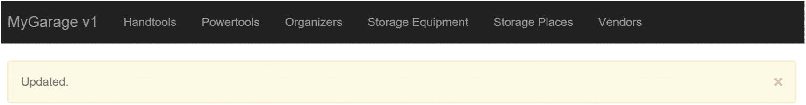
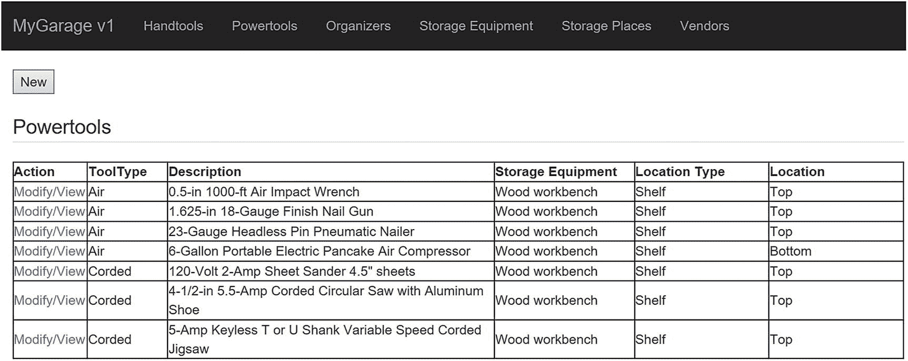
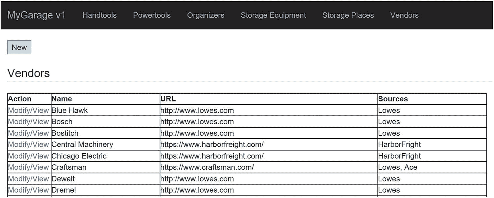
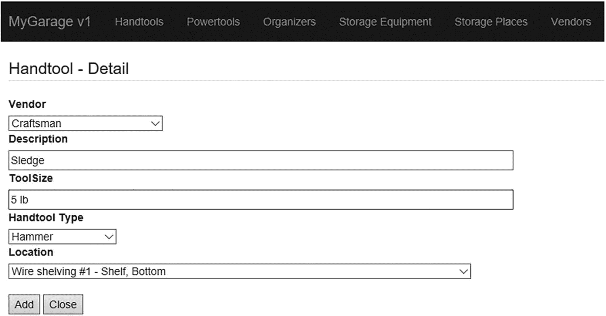
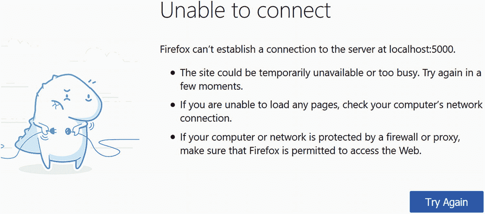
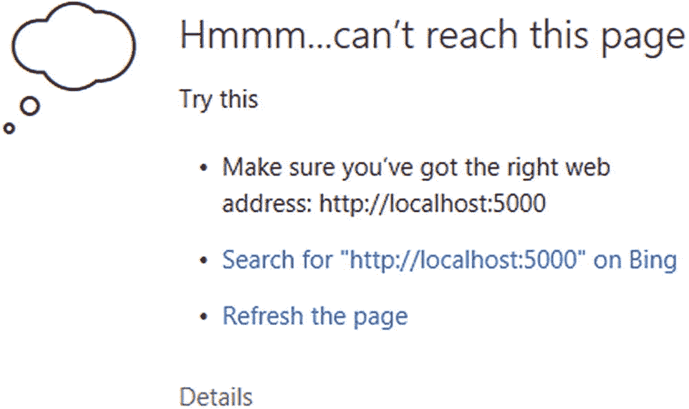

# 12.附录

本书中的示例应用程序是使用 Python 和 Flask 框架编写的 web 应用程序。如果您想要实现示例应用程序，您需要在您的计算机上安装一些东西。

本附录将帮助您为计算机准备所需的工具；您需要安装什么以及如何配置您的环境。我们还将看到关于 Flask 框架的简短介绍，以及运行示例应用程序的演练。让我们先看看如何设置我们的计算机来运行示例应用程序。

## 设置您的环境

对你的环境的改变并不困难，也不漫长。我们将安装 Flask 和一些扩展，这是应用程序用户界面所需要的。这些 web 库使得用 Python 开发 web 应用程序比使用原始的 HTML 代码并为请求编写自己的处理程序和代码要容易得多。另外，Flask 并不难学。我们需要安装的库如表 [A-1](#Tab1) 所示。该表列出了库/扩展的名称、简短描述以及产品文档的 URL。

餐桌 A-1

所需库的列表

<colgroup><col class="tcol1 align-left"> <col class="tcol2 align-left"> <col class="tcol3 align-left"></colgroup> 
| 

图书馆

 | 

描述

 | 

文件

 |
| --- | --- | --- |
| 瓶 | Python Web API | [T2`http://flask.pocoo.org/docs/0.12/installation/`](http://flask.pocoo.org/docs/0.12/installation/) |
| 烧瓶脚本 | Flask 的脚本支持 | [T2`https://flask-script.readthedocs.io/en/latest/`](https://flask-script.readthedocs.io/en/latest/) |
| 烧瓶自举 | 用户界面的改进和增强 | [T2`https://pythonhosted.org/Flask-Bootstrap/`](https://pythonhosted.org/Flask-Bootstrap/) |
| 烧瓶-WTF | WTForms 集成 | [T2`https://flask-wtf.readthedocs.io/en/latest/`](https://flask-wtf.readthedocs.io/en/latest/) |
| WTForms | 表单验证和呈现 | [T2`https://wtforms.readthedocs.io/en/latest/`](https://wtforms.readthedocs.io/en/latest/) |

### 注意

根据您的系统配置，您可能会看到为本节安装的组件安装了更多或更少的组件。

当然，您应该已经在系统上安装了 Python。如果没有，请确保下载并安装最新版本的 2。x 或 3。x 版。本章中的示例代码是用 Python 2.7.10 和 Python 3.6.0 测试的。

要安装这些库，我们可以使用 Python 包管理器 pip 从命令行安装这些库。pip 工具包含在大多数 Python 发行版中，但是如果您需要安装它，您可以在 [`https://pip.pypa.io/en/latest/installing/`](https://pip.pypa.io/en/latest/installing/) 查看安装文档。

如果需要在 Windows 上安装 pip，需要下载一个安装程序，`get-pip.py` ( [`https://pip.pypa.io/en/stable/installing/#installing-with-get-pip-py`](https://pip.pypa.io/en/stable/installing/%2523installing-with-get-pip-py) ，然后将安装目录的路径添加到 *PATH* 环境变量中。有几篇文章更详细地记录了这个过程。你可以谷歌“在 Windows 10 上安装 pip”，找到包括 [`https://matthewhorne.me/how-to-install-python-and-pip-on-windows-10/`](https://matthewhorne.me/how-to-install-python-and-pip-on-windows-10/) 在内的几个，这是最准确的。

### 注意

如果您的系统上安装了多个 Python 版本，pip 命令将安装到默认的 Python 版本环境中。要使用 pip 安装到特定版本，请使用`pipN`，其中 N 是版本。例如，`pip3`在 Python 3 环境中安装包。

pip 命令非常方便，因为它使得安装注册的 Python 包(那些在 Python 包索引中注册的包，缩写为 PyPI ( [`https://pypi.python.org/pypi`](https://pypi.python.org/pypi) ))非常容易。pip 命令将使用一个命令下载、解压缩和安装。让我们来看看如何安装我们需要的每个包。

### 小费

有些系统可能需要以提升的权限运行 pip，例如 sudo (Linux、macOS)，或者在命令窗口中以管理员用户身份运行(Windows 10)。如果安装由于权限问题而无法复制文件，您将知道是否需要提升权限。

### 安装烧瓶

清单 [A-1](#PC1) 演示了如何使用命令`pip install flask`安装 Flask。请注意，该命令下载必要的组件，提取它们，然后运行每个组件的安装程序。在这种情况下，我们看到 Flask 由几个组件组成，包括 Werkzeug、MarkupSafe 和 Jinja2。我们将在烧瓶初级读本部分了解更多。

```py
$ pip3 install flask
Collecting flask
  Using cached Flask-0.12.2-py2.py3-none-any.whl
Collecting Werkzeug>=0.7 (from flask)
  Downloading Werkzeug-0.14.1-py2.py3-none-any.whl (322kB)
    100% |█████████████████████| 327kB 442kB/s
Collecting Jinja2>=2.4 (from flask)
  Using cached Jinja2-2.10-py2.py3-none-any.whl
Collecting itsdangerous>=0.21 (from flask)
  Using cached itsdangerous-0.24.tar.gz
Collecting click>=2.0 (from flask)
  Downloading click-6.7-py2.py3-none-any.whl (71kB)
    100% |█████████████████████| 71kB 9.4MB/s
Collecting MarkupSafe>=0.23 (from Jinja2>=2.4->flask)
  Using cached MarkupSafe-1.0.tar.gz
Installing collected packages: Werkzeug, MarkupSafe, Jinja2, itsdangerous, click, flask
  Running setup.py install for MarkupSafe ... done
  Running setup.py install for itsdangerous ... done
Successfully installed Jinja2-2.10 MarkupSafe-1.0 Werkzeug-0.14.1 click-6.7 flask-0.12.2 itsdangerous-0.24

Listing A-1Installing Flask

```

### 安装烧瓶-脚本

清单 [A-2](#PC2) 展示了如何使用命令`pip install flask-script`安装 Flask-Script。注意，在这种情况下，我们看到安装检查先决条件及其版本。

```py
$ pip3 install flask-script
Collecting flask-script
  Using cached Flask-Script-2.0.6.tar.gz
Requirement already satisfied: Flask in /Library/Frameworks/Python.framework/Versions/3.6/lib/python3.6/site-packages (from flask-script)
Requirement already satisfied: click>=2.0 in /Library/Frameworks/Python.framework/Versions/3.6/lib/python3.6/site-packages (from Flask->flask-script)
Requirement already satisfied: Jinja2>=2.4 in /Library/Frameworks/Python.framework/Versions/3.6/lib/python3.6/site-packages (from Flask->flask-script)
Requirement already satisfied: Werkzeug>=0.7 in /Library/Frameworks/Python.framework/Versions/3.6/lib/python3.6/site-packages (from Flask->flask-script)
Requirement already satisfied: itsdangerous>=0.21 in /Library/Frameworks/Python.framework/Versions/3.6/lib/python3.6/site-packages (from Flask->flask-script)
Requirement already satisfied: MarkupSafe>=0.23 in /Library/Frameworks/Python.framework/Versions/3.6/lib/python3.6/site-packages (from Jinja2>=2.4->Flask->flask-script)
Installing collected packages: flask-script
  Running setup.py install for flask-script ... done
Successfully installed flask-script-2.0.6

Listing A-2Installing Flask-Script

```

### 安装烧瓶-引导程序

清单 [A-3](#PC3) 演示了如何使用命令`pip install flask-bootstrap` `.`安装 Flask-Bootstrap，我们再次看到安装检查先决条件及其版本，以及安装相关组件。

```py
$ pip3 install flask-bootstrap
Collecting flask-bootstrap
  Downloading Flask-Bootstrap-3.3.7.1.tar.gz (456kB)
    100% |█████████████████████| 460kB 267kB/s
Requirement already satisfied: Flask>=0.8 in /Library/Frameworks/Python.framework/Versions/3.6/lib/python3.6/site-packages (from flask-bootstrap)
Collecting dominate (from flask-bootstrap)
  Downloading dominate-2.3.1.tar.gz
Collecting visitor (from flask-bootstrap)
  Downloading visitor-0.1.3.tar.gz
Requirement already satisfied: click>=2.0 in /Library/Frameworks/Python.framework/Versions/3.6/lib/python3.6/site-packages (from Flask>=0.8->flask-bootstrap)
Requirement already satisfied: Jinja2>=2.4 in /Library/Frameworks/Python.framework/Versions/3.6/lib/python3.6/site-packages (from Flask>=0.8->flask-bootstrap)
Requirement already satisfied: Werkzeug>=0.7 in /Library/Frameworks/Python.framework/Versions/3.6/lib/python3.6/site-packages (from Flask>=0.8->flask-bootstrap)
Requirement already satisfied: itsdangerous>=0.21 in /Library/Frameworks/Python.framework/Versions/3.6/lib/python3.6/site-packages (from Flask>=0.8->flask-bootstrap)
Requirement already satisfied: MarkupSafe>=0.23 in /Library/Frameworks/Python.framework/Versions/3.6/lib/python3.6/site-packages (from Jinja2>=2.4->Flask>=0.8->flask-bootstrap)
Installing collected packages: dominate, visitor, flask-bootstrap
  Running setup.py install for dominate ... done
  Running setup.py install for visitor ... done
  Running setup.py install for flask-bootstrap ... done
Successfully installed dominate-2.3.1 flask-bootstrap-3.3.7.1 visitor-0.1.3

Listing A-3Installing Flask-Bootstrap

```

### 安装烧瓶-WTF

清单 [A-4](#PC4) 演示了如何使用命令`pip install flask-wtf`安装 Flask-WTF。

```py
$ pip3 install flask-wtf
Collecting flask-wtf
  Downloading Flask_WTF-0.14.2-py2.py3-none-any.whl
Requirement already satisfied: WTForms in /Library/Frameworks/Python.framework/Versions/3.6/lib/python3.6/site-packages (from flask-wtf)
Requirement already satisfied: Flask in /Library/Frameworks/Python.framework/Versions/3.6/lib/python3.6/site-packages (from flask-wtf)
Requirement already satisfied: Jinja2>=2.4 in /Library/Frameworks/Python.framework/Versions/3.6/lib/python3.6/site-packages (from Flask->flask-wtf)
Requirement already satisfied: click>=2.0 in /Library/Frameworks/Python.framework/Versions/3.6/lib/python3.6/site-packages (from Flask->flask-wtf)
Requirement already satisfied: Werkzeug>=0.7 in /Library/Frameworks/Python.framework/Versions/3.6/lib/python3.6/site-packages (from Flask->flask-wtf)
Requirement already satisfied: itsdangerous>=0.21 in /Library/Frameworks/Python.framework/Versions/3.6/lib/python3.6/site-packages (from Flask->flask-wtf)
Requirement already satisfied: MarkupSafe>=0.23 in /Library/Frameworks/Python.framework/Versions/3.6/lib/python3.6/site-packages (from Jinja2>=2.4->Flask->flask-wtf)
Installing collected packages: flask-wtf
Successfully installed flask-wtf-0.14.2

Listing A-4Installing Flask-WTF

```

### 安装 WTForms

下面演示了如何使用命令`pip install wtforms`安装 WTForms。在这种情况下，安装很简单，因为我们只需要一个包。

```py
$ pip3 install wtforms
Collecting wtforms
  Using cached WTForms-2.1.zip
Installing collected packages: wtforms
  Running setup.py install for wtforms ... done
Successfully installed wtforms-2.1

```

### 安装连接器/Python

您还应该安装 MySQL 连接器/Python 8.0.16 或更高版本的数据库连接器。如果没有，从 [`https://dev.mysql.com/downloads/connector/python/`](https://dev.mysql.com/downloads/connector/python/) 下载并安装。如果您安装了多个版本的 Python，请确保将其安装在您想要使用的所有 Python 环境中。否则，在启动代码时，您可能会看到如下错误。

```py
$ python3 ./mygarage_v1.py runserver -p 5001
Traceback (most recent call last):
  File "./mygarage_v1.py", line 18, in <module>
    from database.mygarage import Databases
  File ".../Ch06/database/mygarage.py", line 15, in <module>
    import mysql.connector
ModuleNotFoundError: No module named 'mysql'

```

Pip 也可以用来安装 MySQL 连接器/Python。下面显示了如何使用 PIP 安装连接器。

```py
$ pip3 install mysql-connector-python
Collecting mysql-connector-python
  Downloading mysql_connector_python-8.0.16-cp36-cp36m-macosx_10_12_x86_64.whl (3.2MB)
    100% |█████████████████████| 3.2MB 16.9MB/s
Installing collected packages: mysql-connector-python
Successfully installed mysql-connector-python-8.0.16

```

现在我们的计算机已经安装好了，让我们上一堂关于 Flask 及其相关扩展的速成课。以下不会教你 Flask 的每一个细微之处；相反，我们的目标是让您熟悉应用程序的布局以及各个部分是如何组合在一起的。

## 弗拉斯克第一

Flask 是与 Python 一起使用的几个 web 应用程序库(有时称为框架或应用程序编程接口)之一。Flask 在众多选择中是独一无二的，因为它很小，一旦你熟悉了它的工作原理，就很容易使用。也就是说，一旦编写了初始化代码，使用 Flask 的大部分工作将局限于创建网页、重定向响应和编写功能代码。

Flask 被认为是一个微框架，因为它体积小、重量轻，而且它不会强迫你进入一个专门编写代码来与框架交互的盒子。它提供了您需要的一切，没有什么是您不需要的，让您自己选择在代码中使用什么。

Flask 由提供基本功能的两个主要组件组成:处理所有工作托管网页的 Web 服务器网关接口(WSGI)和用于简化网页开发的模板库，该模板库减少了学习 HTML 的需要，消除了重复的构造，并为 HTML 代码提供了脚本功能。WSGI 组件被命名为 Werkzeug，它从德语中大致翻译过来的意思是“工作”“东西”( [`htt` p `s://palletsprojects.com/p/werkzeug//`](https://palletsprojects.com/p/werkzeug//) )。模板组件被命名为 Jinja2，并模仿 Django ( [`http://jinja.pocoo.org/docs/2.10/`](http://jinja.pocoo.org/docs/2.10/) )。两者都是由 Flask 的创始人开发和维护的。

Flask 也是一个可扩展的库，允许其他开发人员创建基本库的附件(扩展)来添加功能。在上一节中，我们看到了如何安装 Flask 可用的一些扩展。我们将在示例应用程序中使用脚本、引导和 WTForms 扩展。

您可能认为 Flask“缺少”的组件之一是与其他服务(如数据库系统)交互的能力。这是一个有目的的设计，像这样的功能可以通过扩展来实现。我们已经安装了我们需要的扩展以及 Connector/Python，我们需要它来与 MySQL 交互。

Flask 以及前面描述的扩展提供了用 Python 制作 web 应用程序所需的所有连接和管道。它消除了编写 web 应用程序所需的几乎所有负担，例如解释客户机响应包、路由、HTML 表单处理等等。如果您曾经用 Python 编写过 web 应用程序，您将会体会到创建健壮的 web 页面的能力，而无需编写 HTML 和样式表的复杂性。

现在，让我们开始学习 Flask！如果您不着急，尝试一下示例应用程序，您的第一个 Flask 应用程序将在第一次尝试时就能工作。学习 Flask 最难的部分已经过去了——安装 Flask 及其扩展。剩下的就是学习在 Flask 中编写应用程序的概念。在此之前，让我们了解一下 Flask 中的术语，以及如何设置我们将用来初始化本章中使用的应用程序实例的基本代码。

### 术语

Flask 旨在简化编写 web 应用程序的繁琐过程。按照 Flask 的说法，使用代码的两个部分来呈现一个 web 页面:一个视图，在 HTML 文件中定义；一个路由，处理来自客户端的请求。回想一下，我们可以看到两个请求中的一个:一个 GET 请求请求加载一个 web 页面(从客户端的角度读取)，一个 POST 请求通过 web 页面将数据从客户端发送到服务器(从客户端的角度写入)。这两个请求都在 Flask 中使用您定义的函数进行处理。

然后，这些函数呈现网页，并将其发送回客户端以满足请求。Flask 调用函数视图函数(或简称视图)。Flask 知道调用哪个方法的方式是使用识别 URL 路径(在 Flask 中称为路由)的装饰器。你可以用一条或多条路线来装饰一个功能，这样就可以提供多种到达视图的方式。用的装饰师是`@app.route(<path>)`。以下显示了查看功能的多条路线的示例。为了简洁起见，这里显示了该函数的一小段摘录。

```py
@app.route('/handtool', methods=['GET', 'POST'])
@app.route('/handtool/<int:handtool_id>', methods=['GET', 'POST'])
def handtool(handtool_id=None):
    """Manage handtool CRUD operations."""
    handtool_table = Handtool(mygarage)
    form = HandtoolForm()
    # Get data from the form if present
    form_handtoolid = form.handtoolid.data
    # Handtool type choices
    form.handtooltype.choices = HANDTOOL_TYPES
    vendor_list = Vendor(mygarage)
    vendors = vendor_list.read()
    vendor_list = []
...
    return render_template("handtool.html", form=form)

```

注意这里有多个装饰者。第一个是`handtool`，它允许我们使用类似于`localhost:5000/handtool`的 URL，这使得 Flask 将执行路由到`handtool()`函数。第二个是`handtool/<handtool_id>`，演示了如何使用变量向视图传递信息。在这种情况下，如果用户(应用程序)使用 URL `localhost:5000/handtool/4842`，Flask 将值`4842`放入`handtool_id`变量中。这样，我们可以动态地将信息传递给我们的视图。

在函数结束时，我们通过调用`render_template()`函数(从 flask 模块导入)返回，该函数告诉 flask 返回(刷新)带有我们获取或分配的数据的网页。网页，handtool.html，而视图的一部分在 Flask 中被称为表单。我们将使用这个概念从数据库中检索信息并将其发送给用户。我们可以返回一个简单的 HTML 字符串(或整个文件)或所谓的表单。因为我们使用 Flask-WTF 和 WTForms 扩展，所以我们可以返回一个呈现为 form 类的模板。我们将在后面的章节中讨论表单、表单类以及其他路径和视图。正如您将看到的，模板是另一个强大的功能，它使创建网页变得很容易。

Flask 构建了一个应用程序中所有路径的列表，使得应用程序在被请求时可以很容易地将执行路由到正确的函数。但是，如果请求了一条路线，但该路线在应用程序中不存在，会发生什么情况呢？默认情况下，您会收到一条类似“未找到”的一般性错误消息。在服务器上找不到请求的 URL。我们将在后面的小节中看到如何添加我们自己的自定义错误处理路由。

现在我们已经了解了 Flask 中使用的术语以及它是如何与网页一起工作的，让我们来看看一个典型的 Flask 应用程序是如何构造的，它带有我们需要的扩展。

### 初始化和应用程序实例

Flask 及其扩展为您的 web 应用程序提供了入口点。Flask 会为您完成这些工作，而不是自己编写所有繁重的代码！我们将在本章使用的 Flask 扩展包括 Flask-Script、Flask-Bootstrap、Flask-WTF 和 WTForms。以下各节简要介绍了每一种方法。

#### 烧瓶脚本

Flask-Script 通过添加一个命令行解析器(表现为 manager)来启用 Flask 应用程序中的脚本，您可以使用该解析器链接到您编写的函数。这可以通过用`@manager.command`修饰函数来实现。理解这为我们做了什么的最好方法是通过一个例子。

下面是一个基本的原始 Flask 应用程序，它什么也不做。它甚至不是一个“hello，world”示例，因为没有显示任何内容，也没有托管任何网页——它只是一个原始的 Flask 应用程序。

```py
from flask import Flask      # import the Flask framework
app = Flask(__name__)        # initialize the application
if __name__ == "__main__":   # guard for running the code
    app.run()                # launch the application

```

注意这个`app.run()`调用。这称为服务器启动，在我们使用 Python 解释器加载脚本时执行。当我们运行这段代码时，我们看到的只是来自 Flask 的默认消息，如下所示。请注意，我们无法查看帮助，因为没有这样的选项。我们还看到代码使用 web 服务器的缺省值启动(如果需要，我们可以在代码中更改)。例如，我们可以改变服务器监听的端口。

```py
$ python ./sample-code.py --help
 ∗ Running on http://127.0.0.1:5000/ (Press CTRL+C to quit)

```

使用 Flask-Script，我们不仅添加了帮助选项，还添加了控制服务器的选项。下面的代码显示了添加语句来启用 Flask-Script 是多么容易。新语句以粗体突出显示。

```py
from flask import Flask          # import the Flask framework
from flask_script import Manager # import the flask script manager class

app = Flask(__name__)            # initialize the application
manager = Manager(app)           # initialize the script manager class

# Sample method linked as a command-line option
@manager.command
def hello_world():
    """Print 'Hello, world!'"""
    print("Hello, world!")

if __name__ == "__main__":       # guard for running the code
    manager.run()                # launch the application via manager class

```

当运行这段代码时，我们可以看到还有其他选项可用。请注意，文档字符串(紧跟在方法定义之后)显示为所添加命令的帮助文本。

```py
$ python ./flask-script-ex.py --help
usage: flask-script-ex.py [-?] {hello_world,shell,runserver} ...

positional arguments:
  {hello_world,shell,runserver}
    hello_world         Print 'Hello, world!'
    shell               Runs a Python shell inside Flask application context.
    runserver           Runs the Flask development server i.e. app.run()

optional arguments:
  -?, --help            show this help message and exit

```

注意我们看到了我们添加的命令行参数(命令)，`hello_world`，但是我们也看到了 Flask-Script 提供的两个新参数:`shell`和`runserver`。启动服务器时，必须选择其中一个命令。shell 命令允许您在 Python 解释器或类似工具中使用代码，而`runserver`执行启动 web 服务器的代码。

我们不仅可以获得关于命令和选项的帮助，Flask-Script 还提供了从命令行对服务器的更多控制。事实上，通过附加- help 选项，我们可以看到每个命令的所有选项，如下所示。

```py
$ python ./flask-script-ex.py runserver --help
usage: flask-script-ex.py runserver [-?] [-h HOST] [-p PORT] [--threaded]
                                    [--processes PROCESSES]
                                    [--passthrough-errors] [-d] [-D] [-r] [-R]
                                    [--ssl-crt SSL_CRT] [--ssl-key SSL_KEY]

Runs the Flask development server i.e. app.run()

optional arguments:
  -?, --help            show this help message and exit
  -h HOST, --host HOST
  -p PORT, --port PORT
  --threaded
  --processes PROCESSES
  --passthrough-errors
  -d, --debug           enable the Werkzeug debugger (DO NOT use in production
                        code)
  -D, --no-debug        disable the Werkzeug debugger
  -r, --reload          monitor Python files for changes (not 100% safe for
                        production use)
  -R, --no-reload       do not monitor Python files for changes
  --ssl-crt SSL_CRT     Path to ssl certificate
  --ssl-key SSL_KEY     Path to ssl key

```

请注意，在这里我们可以看到，我们可以控制服务器的所有方面，包括端口、主机，甚至它是如何执行的。

最后，我们可以执行我们修饰为命令行选项的方法，如下所示。

```py
$ python ./flask-script-ex.py hello_world
Hello, world!

```

因此，Flask-Script 仅用几行代码就提供了一些非常强大的功能。你一定会喜欢的！

#### 烧瓶自举

Flask-Bootstrap 最初由 Twitter 开发，用于制作统一、美观的 web 客户端。幸运的是，他们把它变成了一个 Flask 扩展，这样每个人都可以利用它的特性。Flask-Bootstrap 是一个独立的框架，它提供了更多的命令行控制和用户界面组件，以获得干净、漂亮的网页。它也兼容最新的网络浏览器。

该框架在幕后发挥了神奇的作用，它是一个级联样式表(CSS)和脚本的客户端库，这些样式表和脚本是从 Flask 中的 HTML 模板(通常称为 HTML 文件或模板文件)调用的。我们将在后面的章节中学习更多关于模板的知识。由于是客户端，在主应用中初始化就不会看到太多。不管怎样，下面显示了如何将 Flask-bootstrap 添加到我们的应用程序代码中。这里，我们看到我们有一个框架，其中初始化并配置了 Flask-Script 和 Flask-Bootstrap。

```py
from flask import Flask          # import the Flask framework
from flask_script import Manager # import the flask script manager class
from flask_bootstrap import Bootstrap  # import the flask bootstrap extension

app = Flask(__name__)            # initialize the application
manager = Manager(app)           # initialize the script manager class
bootstrap = Bootstrap(app)       # initialize the bootstrap extension

if __name__ == "__main__":       # guard for running the code
    manager.run()                # launch the application via manager class

```

#### WTForms

WTForms 是我们需要用来支持 Flask-WTF 扩展的一个组件。它提供了 Flask-WTF 组件所提供的大部分功能(因为 Flask-WTF 组件是 WTForms 的 Flask 特定包装器)。因此，我们只需要安装它作为 Flask-WTF 的先决条件，我们将在 Flask-WTF 的上下文中讨论它。

#### 烧瓶-WTF

Flask-WTF 扩展是一个有趣的组件，提供了几个非常有用的附加功能，最值得一提的是供我们使用，与 WTForms(一个框架不可知组件)的集成，允许创建表单类，以及以跨站点请求伪造(CSRF)保护的形式提供额外的 web 安全性。这两个特性允许您将 web 应用程序提升到更高的复杂程度。

#### 表单类

表单类提供了一个类的层次结构，使得定义网页更加符合逻辑。使用 Flask-WTF，您可以使用两段代码定义表单；一个从`FormForm`类(从 Flask 框架导入)派生的特殊类，您可以使用一个或多个提供数据编程访问的附加类来定义字段，以及一个用于呈现网页的 HTML 文件(或模板)。这样，我们在 HTML 文件上看到了一个抽象层(表单类)。我们将在下一节看到更多关于 HTML 文件的内容。

使用表单类，您可以定义一个或多个字段，比如文本的`TextField`，字符串的`StringField`，等等。更好的是，您可以定义允许您以编程方式描述数据的验证器。例如，您可以为文本字段定义最小和最大字符数。如果提交的字符数超出范围，将生成一条错误消息。是的，您可以定义错误消息！下面列出了一些可用的验证器。查看 [`http://wtforms.readthedocs.io/en/latest/validators.html`](http://wtforms.readthedocs.io/en/latest/validators.html) 获得验证器的完整列表。

为了形成类，我们必须导入类和任何我们想在应用程序的序言中使用的字段类。下面显示了一个导入表单类和表单域类的示例。在这个例子中，我们还导入了一些验证器，用于自动验证数据。

```py
from flask_wtf import FlaskForm
from wtforms import (HiddenField, TextField, TextAreaField, SelectField,
                     SelectMultipleField, IntegerField, SubmitField)
from wtforms.validators import Required, Length

```

要定义一个表单类，我们必须从`FlaskForm`派生一个新类。从那里，我们可以构造我们想要的类，但是它允许您定义字段。`FlaskForm`父类包括 Flask 需要实例化和使用 form 类的所有必要代码。

让我们看一个简单的例子。下面显示了 handtool 网页的 form 类。我们将通过 view 函数链接到这个代码的 handtool 表包含几个字段。我们使用一个可用的字段类为我们想要放在页面上的每个字段添加一个类。因为 Id 字段不是用户需要看到的，所以我们将该字段设为隐藏字段，其他字段为`TextField()`类的衍生物。注意这些是如何在清单中用名称(标签)作为第一个参数来定义的。

```py
class HandtoolForm(FlaskForm):
    handtoolid = HiddenField('Id')
    vendor = NewSelectField(
        'Vendor', validators=[Required(message=REQUIRED.format("Vendor"))]
    )
    description = TextField(
        'Description',
        validators=[Required(message=REQUIRED.format("Description")),
                    Length(min=1, max=125,
                    message=RANGE.format("Description", 1, 125))]
    )
    handtooltype = NewSelectField(
        'Handtool Type',
        validators=[Required(message=REQUIRED.format("Handtool Type"))]
    )
    toolsize = TextField('ToolSize')
    place = NewSelectField(
        'Location',
        validators=[Required(message=REQUIRED.format("Location"))]
    )
    create_button = SubmitField('Add')
    del_button = SubmitField('Delete')
    close_button = SubmitField('Close')

```

还要注意，我们已经为字段定义了一组验证器，其形式为从 WTForms 组件导入的函数调用。在每一种情况下，我们都为消息使用字符串，以使代码更容易阅读，更统一。

我们使用`Required()`验证器来指示字段必须有一个值。我们用字段的名称增加了默认的错误消息，使用户更容易理解。我们还使用了一个`Length()`验证函数，它定义了字段数据的最小和最大长度。我们再次增加了默认的错误消息。验证器仅适用于 POST 操作(当提交事件发生时)。

接下来，我们看到有三个`SubmitField()`实例:一个用于创建(添加)按钮，另一个用于删除按钮和关闭按钮。正如您可能猜到的，按照 HTML 的说法，这些字段被呈现为类型为“submit”的`<input>`字段。

有几个字段类可供使用。表 [A-2](#Tab2) 显示了最常用的字段类(也称为 HTML 字段)的示例。您还可以从这些字段派生来创建自定义字段类，并为可以显示在字段旁边的标签提供文本(例如，作为按钮文本)。我们将在后面的章节中看到一个这样的例子。

表 A-2

WTForms 字段类

<colgroup><col class="tcol1 align-left"> <col class="tcol2 align-left"></colgroup> 
| 

字段类

 | 

描述

 |
| --- | --- |
| `BooleanField` | 具有真值和假值的复选框 |
| `DateField` | 接受日期值 |
| `DateTimeField` | 接受日期时间值 |
| `DecimalField` | 接受十进制值 |
| `FileField` | 文件上传字段 |
| `FloatField` | 接受浮点值 |
| `HiddenField` | 隐藏文本字段 |
| `IntegerField` | 接受整数值 |
| `MultipleFileField` | 允许选择多个文件 |
| `PasswordField` | 密码(屏蔽)文本字段 |
| `RadioField` | 单选按钮列表 |
| `SelectField` | 下拉列表(选择一个) |
| `SelectMultipleField` | 下拉选项列表(选择一项或多项) |
| `StringField` | 接受简单文本 |
| `SubmitField` | 表单提交按钮 |
| `TextAreaField` | 多行文本字段 |

#### 跨站点请求伪造(CSRF)保护

跨站点请求伪造(CSRF)保护是一种允许开发人员用加密密钥对网页进行签名的技术，这使得黑客欺骗 GET 或 POST 请求变得更加困难。这是通过首先在应用程序代码中放置一个特殊的键，然后在每个 HTML 文件中引用这个键来实现的。下面显示了一个应用程序序言的示例。请注意，我们需要做的就是用一个短语给`app.config`数组的`SECRET_KEY`索引赋值。这应该是一个不容易猜到的短语。

```py
from flask import Flask          # import the Flask framework
from flask_script import Manager # import the flask script manager class
from flask_bootstrap import Bootstrap  # import the flask bootstrap extension

app = Flask(__name__)            # initialize the application
app.config['SECRET_KEY'] = "He says, he's already got one!"
manager = Manager(app)           # initialize the script manager class
bootstrap = Bootstrap(app)       # initialize the bootstrap extension

if __name__ == "__main__":       # guard for running the code
    manager.run()                # launch the application via manager class

```

要激活网页中的 CSRF，我们只需将`form.csrf_token`添加到 HTML 文件中。这是一个特殊的隐藏字段，Flask 使用它来验证请求。我们将在后面的部分中看到更多关于在哪里放置它的信息。但首先，我们来看看 Flask 的一个很酷的功能，叫做 flash。

#### 信息闪烁

Flask 有很多很酷的功能。Flask 扩展的创建者似乎已经考虑到了一切——甚至是错误消息。考虑一个典型的 web 应用程序。你如何向用户传达错误？您是否重定向到一个新页面，发出一个弹出窗口，或者可能在页面上显示错误？Flask 有一个解决方案，叫做消息闪烁。

消息闪烁是使用 Flask 框架中的 flash()方法完成的。我们只需在代码的序言中导入它；然后当我们想要显示消息时，我们调用 flash()函数，传入我们想要看到的错误消息。Flask 将在表单顶部的一个格式良好的框中显示错误。它没有取代表单，也不是弹出窗口，但是它允许用户关闭消息。您可以使用 flash messaging 向用户传达错误、警告甚至状态更改。图 [A-1](#Fig1) 显示了一个快速消息的例子。在本例中，我们看到两条 flash 消息，表明您可以同时显示多条消息。请注意用于消除图像的消息右侧的小 X。



图 A-1

示例简讯

### HTML 文件和模板

让我们回顾一下到目前为止的旅程。我们发现了如何用各种组件初始化应用程序，并了解了 Flask 如何通过 decorators 使用路由来为应用程序创建一组 URLs 这些路由指向一个视图函数，该函数实例化了 form 类。下一个难题是如何将 HTML 网页链接到 form 类。

回想一下，这是通过`render_template()`函数完成的，在这里我们传入一个 HTML 文件的名称进行处理。template 出现在名称中的原因是因为我们可以使用 Jinja2 模板组件来简化 web 页面的编写。更具体地说，HTML 文件包含 HTML 标记和 Jinja2 模板构造。

### 注意

所有 HTML 文件(模板)必须存储在 templates 文件夹中，与主应用程序代码位于同一位置。如果你把它们放在其他地方，Flask 将找不到 HTML 文件。

模板和表单类是设计用户界面的地方。简而言之，模板用于包含表示逻辑，HTML 文件用于包含表示数据。这些主题可能是一些人需要花一些时间来尝试如何使用它们的领域。下面几节将通过工作示例的演示，向您简要介绍 Jinja2 模板以及如何在我们的 HTML 文件中使用它们。有关更多详细信息，请参见在线文档。

#### Jinja2 模板概述

Jinja2 模板，也就是模板，用于包含任何表示逻辑，比如遍历数据数组，决定显示什么，甚至格式化和表示设置。如果您熟悉其他 web 开发环境，您可能已经看到过这种封装在脚本中或通过嵌入式脚本(如 JavaScript)实现的功能。

回想一下，我们在主代码中呈现了网页。这个函数告诉 Flask 读取指定的文件，并将模板结构转换(渲染)成 HTML。也就是说，Flask 会将模板结构扩展并编译成 web 服务器可以呈现给客户机的 HTML。

有几种模板结构可以用来控制执行流、循环甚至注释。每当你想使用一个模板结构(想想脚本语言)，你用前缀和后缀``把它括起来。这是为了让 Flask 框架将该构造识别为模板操作，而不是 HTML。

然而，看到模板结构与 HTML 标记混杂在一起并不罕见，也很正常。事实上，这正是你应该做的。毕竟，您将创建的文件被命名为. html。它们只是碰巧包含模板构造。这是否意味着在使用 Flask 时只能使用模板？不，当然不是。如果你愿意，你可以渲染一个纯 HTML 文件！

起初，查看模板可能会令人望而生畏。但也没那么难。只需查看所有将``作为“代码”部分的行。你也可以看到以`{# #}`前缀和后缀形式的评论。

如果你看看模板，你会看到构造和标签，并使用两个空格缩进格式化。在标签和构造之外，缩进和空白通常无关紧要。然而，大多数开发人员会使用某种形式的缩进来使文件更容易阅读。事实上，大多数编码指南都要求缩进。

模板除了构造(想想代码)之外的一个很酷的特性是创建模板层次结构的能力。这允许您创建一个其他模板可以使用的“基础”模板。例如，您可以创建一个模板构造和 HTML 标记的样板文件，这样您的所有网页看起来都一样。

回想一下 Flask-Bootstrap，Bootstrap 提供了几个很好的格式化特性。其中一个功能是创建一个外观漂亮的导航栏。很自然，我们希望它出现在我们所有的网页上。我们可以通过在基本模板中定义它并在我们的其他模板(HTML)文件中扩展它来做到这一点。让我们看一下示例应用程序的基本模板。清单 [A-5](#PC19) 显示了库应用程序的基本模板。

```py

MyGarage

<div class="navbar navbar-inverse" role="navigation">
    <div class="container">
        <div class="navbar-header">
            <button type="button" class="navbar-toggle" data-toggle="collapse" data-target=".navbar-collapse">
                <span class="sr-only">Toggle navigation</span>
                <span class="icon-bar"></span>
            </button>
            <a class="navbar-brand" href="/">MyGarage v1</a>
        </div>
        <div class="navbar-collapse collapse">
            <ul class="nav navbar-nav">
                <li><a href="/list/handtool">Handtools</a></li>
            </ul>
            <ul class="nav navbar-nav">
                <li><a href="/list/powertool">Powertools</a></li>
            </ul>
            <ul class="nav navbar-nav">
                <li><a href="/list/organizer">Organizers</a></li>
            </ul>
            <ul class="nav navbar-nav">
                <li><a href="/list/storage">Storage Equipment</a></li>
            </ul>
            <ul class="nav navbar-nav">
                <li><a href="/list/place">Storage Places</a></li>
            </ul>
            <ul class="nav navbar-nav">
                <li><a href="/list/vendor">Vendors</a></li>
            </ul>
        </div>
    </div>
</div>



<div class="container">
    
    <div class="alert alert-warning">
        <button type="button" class="close" data-dismiss="alert">&times;</button>
        {{ message }}
    </div>
    

    
</div>


Listing A-5Sample Base Template

```

哇，这里发生了很多事情！花些时间通读一下。虽然这看起来像是发生在罗斯威尔的飞船事故，但理解起来并不困难。你可以在 [`http://jinja.pocoo.org/docs/2.10/`](http://jinja.pocoo.org/docs/2.10/) 找到关于模板和 Jinja2 的完整解释。

#### 使用模板的 HTML 文件

现在我们知道模板文件为页面生成 HTML，我们准备看看如何显示我们在表单类中定义的字段类。让我们从如何在示例应用程序中显示供应商数据的演练开始讨论。我们从定义给视图函数的表单类和字段类开始，视图函数呈现模板，最后是模板本身。

回想一下，表单类是我们定义一个或多个表单字段的地方。我们将使用这些字段类实例来访问视图函数和模板中的数据。清单 [A-6](#PC20) 显示了表单类。

```py
class VendorForm(FlaskForm):
    """Vendor form class"""
    vendorid = HiddenField('VendorId')
    name = TextField(
        'Name',
        validators=[
            Required(message=REQUIRED.format("Name")),
            Length(min=1, max=50, message=RANGE.format("Name", 1, 50))]
        )
    url = TextField(
        'URL', validators=[
            Required(message=REQUIRED.format("URL")),
            Length(min=0, max=125, message=RANGE.format("URL", 0, 125))]
    )
    sources = TextField(
        'Sources',
        validators=[
            Required(message=REQUIRED.format("Sources")),
            Length(min=0, max=40, message=RANGE.format("Sources", 0, 40))]
    )
    create_button = SubmitField('Add')
    del_button = SubmitField('Delete')
    close_button = SubmitField('Close')

Listing A-6
Vendor Form Class

```

注意，form 类创建了四个字段；一个用于供应商 Id，这是一个隐藏字段，数据库表中的名称、URL 和源列各有一个。我们还看到三个提交字段(按钮)；一个用于创建新数据(`create_button`)，一个用于删除供应商数据(`del_button`)，另一个用于关闭表单(`close_button`)。

在视图函数中实例化表单数据之后，当呈现表单数据时，我们将表单数据传递给模板。清单 [A-7](#PC21) 显示了供应商数据的视图功能，为清晰起见，删除了数据库代码，占位符以粗体显示。这里，我们首先实例化供应商表单类，然后将其传递给模板。

```py
@app.route('/vendor', methods=['GET', 'POST'])
@app.route('/vendor/<int:vendor_id>', methods=['GET', 'POST'])
def vendor(vendor_id=None):
    """Manage vendor CRUD operations."""
    form = VendorForm()
    if vendor_id:
        # Read operation goes here
        form.create_button.label.text = "Update"
    else:
        del form.del_button
    if request.method == 'POST':
        operation = "Create"
        if form.close_button.data:
            operation = "Close"
        if form.create_button.data:
            if form.create_button.label.text == "Update":
                operation = "Update"
        if form.del_button and form.del_button.data:
            operation = "Delete"
            # Delete operation goes here
        if form.validate_on_submit():
            # Get the data from the form here
            if operation == "Close":
                return redirect('/list/vendor')
            elif operation == "Create":
                # Create operation goes here
            elif operation == "Update":
                # Delete operation goes here
        else:
            flash_errors(form)
    return render_template("vendor.html", form=form)

Listing A-7Vendor View Function (no database access)

```

请注意，这里我们看到了为视图定义的路线。还要注意，我们已经为请求设置了包括 GET 和 POST 的方法。注意，我们可以检查请求是否是 POST(提交数据)。在这种情况下，我们可以从 form 类实例中检索数据，并将其保存到数据库中。

最后，请注意，我们实例化了供应商表单类(form)的一个实例，然后将其作为参数传递给`render_template("vendor.html", form=form)`调用。在这种情况下，我们现在呈现存储在 templates 文件夹中的`vendor.html`模板。

好了，现在我们有了表单类和视图函数。现在的焦点是当我们呈现 HTML 模板文件时会发生什么。清单 [A-8](#PC22) 显示了供应商数据的 HTML 文件(模板)。

```py

MyGarage Search

  <form method=post> {{ form.csrf_token }}
    <fieldset>
      <legend>Vendor - Detail</legend>
      {{ form.hidden_tag() }}
      <div style=font-size:20pz; font-weight:bold; margin-left:150px;s>
        {{ form.name.label }} <br>
        {{ form.name(size=50) }} <br>
        {{ form.url.label }} <br>
        {{ form.url(size=100) }} <br>
        {{ form.sources.label }} <br>
        {{ form.sources(size=40) }} <br>
        <br>
        {{ form.create_button }}
        
          {{ form.del_button }}
        
        {{ form.close_button }}
      </div>
    </fieldset>
  </form>


Listing A-8
Vendor HTML File

```

注意，模板从扩展(继承)我们之前讨论过的`base.html`模板文件开始。我们看到一个块定义了标题，另一个块定义了页面内容。在该块中，我们看到了如何在页面上定义字段，从表单类实例(form)引用字段类实例。实际上，注意我们引用了字段的标签和数据。标签是在声明字段类时定义的，数据是存储值的地方。当我们想要填充表单(GET)时，我们将数据元素设置为值，当我们想要读取数据(POST)时，我们引用数据元素。

还要注意，为了安全起见，我们添加了 CSRF 令牌，用`form.hidden_tag()`函数呈现隐藏字段，并有条件地包含提交字段，包括删除提交字段(`del_button`)。

咻！这就是 Flask 呈现网页的方式。一旦您习惯了，这是一种很好的方式来分离几层功能，并使从用户那里获取数据或呈现给用户变得容易。

现在，让我们看看如何在我们的应用程序中构建定制的错误处理程序，以及稍后如何将应用程序中的控制重定向到正确的视图函数。

### 错误处理程序

回想一下，我们提到过可以为应用程序中的错误创建自己的错误处理机制。有两种这样的错误机制你应该考虑；一个用于 404(未找到)错误，另一个用于 500(应用程序错误)。为了定义每一个，我们首先创建一个用`@app.errorhandler(num)`修饰的视图函数、一个视图函数和一个 HTML 文件。让我们看看每个例子。

#### 未找到(404)错误

为了处理 404(未找到)错误，我们创建了一个带有特殊错误处理程序路由函数的视图函数，该函数呈现 HTML 文件。Flask 会自动将所有未找到的错误条件定向到此视图。下面显示了 404 未找到错误处理程序的视图函数。如你所见，这很简单。

```py
@app.errorhandler(404)
def page_not_found(e):
    return render_template('404.html'), 404

```

相关的错误处理程序 HTML 代码位于名为 404.html 的文件中，如下所示。请注意，我们从 base.html 文件继承而来，因此生成的网页看起来与应用程序中的任何其他网页一样，都包含来自引导组件的菜单。注意，我们还可以定义错误消息的文本和标题。随意修饰你自己的错误处理程序，让你的用户更感兴趣。

```py

MyGarage ERROR: Page Not Found

<div class="page-header">
    <h1>Page not found.</h1>
</div>


```

#### 应用程序(500)错误

为了处理 500 个(应用程序)错误，我们遵循与前面相同的模式。下面是应用程序错误的错误处理程序。

```py
@app.errorhandler(500)
def internal_server_error(e):
    return render_template('500.html'), 500

```

相关的错误处理程序 HTML 代码位于名为 500.html 的文件中，如下所示。请注意，我们从 base.html 文件继承而来，因此生成的网页看起来与应用程序中的任何其他网页一样，都带有来自 bootstrap 组件的菜单。

```py

MyGarage ERROR

<div class="page-header">
    <h1>OOPS! Application error.</h1>
</div>


```

强烈建议所有 Flask 应用程序创建这些基本的错误处理程序。在开发应用程序时，您可能会发现应用程序错误处理程序非常有用。您甚至可以扩充代码，以提供要在网页中显示的调试信息。

### 重新寄送

此时，您可能想知道 Flask 应用程序如何以编程方式将执行从一个视图定向到另一个视图。答案是 Flask 中的另一个简单构造:重定向。我们使用带有 URL 的`redirect()`函数(从 flask 模块导入)将控制重定向到另一个视图。例如，假设您有一个列表表单，根据用户单击的按钮(通过 POST 提交表单)，您希望显示不同的 web 页面。下面演示了如何使用`redirect()`函数来实现这一点。

```py
if kind == 'handtool':
    form.form_name.label = 'Handtools'
    if request.method == 'POST':
        return redirect('handtool')
...
elif kind == 'organizer':
    form.form_name.label = 'Organizers'
    if request.method == 'POST':
        return redirect('organizer')
...
elif kind == 'powertool':
    form.form_name.label = 'Powertools'
    if request.method == 'POST':
        return redirect('powertool')
...

```

这里，我们看到 POST 请求后有三个重定向。在每种情况下，我们都使用应用程序中定义的一个路由来告诉 Flask 调用相关的视图函数。这样，我们可以创建一个菜单或一系列提交字段，允许用户从一个页面移动到另一个页面。

`redirect()`函数需要一个有效的路径，在大多数情况下，它只是您在装饰器中提供的文本。但是，如果您需要形成一个复杂的 URL 路径，您可以在重定向之前使用`url_for()`函数来验证路由。如果您重组或更改路线，该功能还有助于避免断开链接。例如，您可以使用`redirect(url_for('vendor'))`来验证路线并为其形成一个 URL。

### 附加功能

除了我们在这个速成班中所看到的，Flask 还有更多的内容。您可能有兴趣进一步了解一些未讨论的内容，包括以下内容(这只是其中的一部分)。如果您对这些感兴趣，可以考虑在在线文档中查找它们。

*   *应用程序和请求上下文*:您可以使用一些变量来捕获应用程序上下文，比如会话、全局、请求等等。更多信息参见 [`http://flask.pocoo.org/docs/0.12/appcontext/`](http://flask.pocoo.org/docs/0.12/appcontext/) 。

*   *Cookies* :如果你需要，你可以使用 Cookies。更多信息参见 [`http://flask.pocoo.org/docs/0.12/quickstart/#cookies`](http://flask.pocoo.org/docs/0.12/quickstart/%2523cookies) 。

*   *Flask-Moment–日期和时间的本地化*:如果需要进行日期和时间的本地化，请参见 [`https://github.com/miguelgrinberg/Flask-Moment`](https://github.com/miguelgrinberg/Flask-Moment) 的 Flask-Moment 扩展。

### 小费

有关 Flask 以及如何使用它及其相关包的更多信息，以下书籍是该主题的绝佳参考: *Flask Web Development:用 Python 开发 Web 应用* (O'Reilly Media 2014)，Miguel Grinberg。

## 烧瓶审查:样品应用

现在我们已经对 Flask 有了一个简单的了解，让我们看看如何在我们的一个示例应用程序中实现这一切。在本节中，我们将回顾如何设置示例应用程序以及如何启动它们。在这一节中，我们将看到来自第 [5](05.html) 章的示例应用程序。后面章节中的示例应用程序以非常相似的方式工作。一旦您熟悉了如何启动这里的示例并与之交互，您就应该能够运行其他示例应用程序了。我们从如何下载和复制文件开始。

### 准备您的电脑

你要做的第一件事就是从图书网站 [`https://www.apress.com/us/book/97814NNNNNNNN`](https://www.apress.com/us/book/97814NNNNNNNN) 下载这本书的源代码。您应该会看到代表每章源代码的文件夹。只需下载与您想要的章节相匹配的文件夹。下载源代码并解压后，找到要使用的示例应用程序的文件夹。例如，第 [5](05.html) 章中的示例应用程序位于 [`https://github.com/apress/introducing-mysql-8-shell`](https://github.com/apress/introducing-mysql-8-shell) 的一个同名文件夹中。

此时，您必须选择运行应用程序的位置。如果您想从下载和解压缩文件的位置运行它，您可以。但是，最好将代码移动到另一个位置。

例如，在 Linux 或 macOS 上，您可以将它放在您的`home`文件夹中名为 source 的文件夹中。或者，在 Windows 10 上，你可以把它放在你的`Documents`文件夹里。一旦决定了位置，就可以创建一个文件夹来包含示例应用程序(`mygarage_v1`)。接下来，将提取章节代码时创建的文件复制到`mygarage_v1`文件夹中，包括子目录。如果您随后显示该文件夹中的文件列表，您应该有主可执行文件和两个子文件夹，如下所示。

```py
C:\Users\cbell\Documents\mygarage_v1>dir
 Volume in drive C is Local Disk
 Volume Serial Number is AAFC-6767

 Directory of C:\Users\cbell\Documents\mygarage_v1

03/14/2019  02:20 PM    <DIR>          .
03/14/2019  02:20 PM    <DIR>          ..
03/14/2019  02:20 PM    <DIR>          database
03/08/2019  11:02 PM            38,045 mygarage_v1.py
03/14/2019  02:20 PM    <DIR>          templates
               1 File(s)         38,045 bytes
               4 Dir(s)  124,419,055,616 bytes free

```

两个子文件夹`database`和`templates`用于存储我们需要的代码模块和分类文件。`database`文件夹是我们放置数据库代码模块的地方，`templates`文件夹是我们放置`.html`文件的地方。如果你愿意，你可以浏览这些文件夹的内容。

现在，您应该已经在您的计算机上安装并运行了 MySQL。您将需要您想要用来连接到 MySQL 的用户帐户和密码，以便输入命令来启动应用程序。在此之前，让我们确保已经创建并填充了数据库。

回想一下第 [5](05.html) 章的讨论，示例源代码包含一个名为`database/garage_v1.sql`的文件，该文件包含用于创建示例数据库并使用示例数据填充该数据库的 SQL 语句。如果您还没有这样做，让我们现在就开始吧。

转到数据库文件夹，发出以下命令，告诉 shell 打开文件并执行语句。运行它不需要一分钟，因为我们是在批处理模式下运行的，完成后将退出 shell。清单 [A-9](#PC29) 显示了运行这些命令的结果。

```py
C:\Users\cbell\Documents\mygarage_v1>cd database
C:\Users\cbell\Documents\mygarage_v1\database>mysqlsh --uri root@localhost:3306 --sql -f garage_v1.sql
Records: 31  Duplicates: 0  Warnings: 0
Records: 6  Duplicates: 0  Warnings: 0
Records: 250  Duplicates: 0  Warnings: 0
Records: 3  Duplicates: 0  Warnings: 0
Records: 0  Duplicates: 0  Warnings: 0
Records: 0  Duplicates: 0  Warnings: 0
Records: 0  Duplicates: 0  Warnings: 0
Records: 0  Duplicates: 0  Warnings: 0
Records: 22  Duplicates: 0  Warnings: 0
Records: 0  Duplicates: 0  Warnings: 0
Records: 0  Duplicates: 0  Warnings: 0
Records: 0  Duplicates: 0  Warnings: 0
Records: 0  Duplicates: 0  Warnings: 0
Records: 22  Duplicates: 0  Warnings: 0
Records: 0  Duplicates: 0  Warnings: 0
Records: 0  Duplicates: 0  Warnings: 0
Records: 2  Duplicates: 0  Warnings: 0
Records: 3  Duplicates: 0  Warnings: 0

Listing A-9Populating the Example Database (Windows 10)

```

既然我们已经创建并填充了数据库，我们就可以第一次启动示例应用程序了。

### 运行示例应用程序

回到`mygarage_v1`文件夹，用下面粗体显示的命令运行应用程序。注意，系统会提示您输入 MySQL 用户 Id(用户帐户)和密码。

```py
C:\Users\cbell\Documents\mygarage_v1>python mygarage_v1.py runserver
User Id: root
Password:
 ∗ Serving Flask app "mygarage_v1" (lazy loading)
 ∗ Environment: production
   WARNING: Do not use the development server in a production environment.
   Use a production WSGI server instead.
 ∗ Debug mode: off
 ∗ Running on http://127.0.0.1:5000/ (Press CTRL+C to quit)

```

如果您运行的是 Flask 和 Python 的新版本，您可能会看到一个或多个反对警告，如“`DeprecationWarning: Required is going away in WTForms 3.0, use DataRequired`”。如果发生这种情况，您可以使用选项`-W ignore::DeprecationWarning`抑制警告，如下所示。

```py
C:\Users\cbell\Documents\mygarage_v1>python -W ignore::DeprecationWarning mygarage_v1.py runserver

```

请注意输出末尾的那一行。这将向您显示在浏览器中用于连接和使用应用程序的 URL。它正在运行，我们只需要连接到它。请将该 URL 复制到您的浏览器中。当您按下*时，输入*(或点击 Go 等。)，您将看到如图 [A-2](#Fig2) 所示的应用程序登录页面。


图 A-2

登录页面(my garage _ v1)-存储设备列表视图

在这里，我们看到的登陆或默认页面是存储设备列表。这是默认设置，因为这是车库存储解决方案的最高视图级别，即车库中的所有容器。

请注意，在应用程序的顶部，我们看到了 Flask 横幅，其中包含应用程序中每个视图的链接(按钮),包括手动工具、电动工具、组织器、存储设备、存储位置和供应商。每个链接都显示视图中的项目列表。因此，我们称之为列表视图。

请注意，视图中的每一行都有一个修改/查看链接，我们可以使用它来查看某个项目的更多详细信息，或者我们可以编辑(或删除)该项目。顶部的 *New* 按钮允许我们为活动列表视图创建一个新项目。

正如我们在第 [5](05.html) 章中了解到的，其中的每一个都代表数据库中的一个表。手工工具、电动工具和供应商代表了车库中的工具及其制造商。其他视图是我们在车库中用来组织工具的容器。

正如你在阅读第 5 章时所猜测的，每个视图都是以列表的形式呈现的。因此，我们将在每个视图(表)中看到所有项目(记录)的列表。让我们按照横幅上显示的顺序简要看一下其中的每一项。图 [A-3](#Fig3) 为手工具视图，图 [A-4](#Fig4) 为手工具详图。


图 A-3

手工工具列表视图

在此视图中，我们可以看到工具类型、描述、尺寸、存放在哪个存储设备中、位置类型和位置。因此，我们一眼就能看到我们的 8" C 夹钳存放在滚动工具柜的底部抽屉里。还要注意，我们有每个项目的*修改/查看*链接，这允许我们编辑项目(行)或查看关于手持工具的更多细节。


图 A-4

手提包视图

在这里，我们看到底部有更新、删除或关闭操作的按钮。如果我们想进行更改，我们使用*更新*按钮。如果我们想删除项目(记录/行)，我们使用*删除*按钮。*关闭*按钮只是关闭表单并返回列表视图。所有详细视图表单上都有这些按钮。图 [A-5](#Fig5) 显示了电动工具列表视图，其布局与手动工具列表视图相似。



图 A-5

电动工具列表视图

图 [A-6](#Fig6) 显示了组织者列表视图。


图 A-6

组织者列表视图

图 [A-7](#Fig7) 显示了存储设备列表视图，也是开始或着陆视图。


图 A-7

存储设备列表视图

现在，您开始意识到所有的列表视图都有相似的布局。不同之处在于列，因为一些列表视图使用不同的列来显示项目。让我们完成对列表视图的调查。

图 [A-8](#Fig8) 显示了存储位置列表视图。在这里，我们看到与表中存储的数据相匹配的略有不同的列。


图 A-8

存储位置列表视图

最后，图 [A-9](#Fig9) 显示了供应商列表视图。



图 A-9

供应商列表视图

此时，如果您已经启动了应用程序，您应该会在终端(命令窗口)中看到几条消息。每一个都告诉我们当你点击视图时应用程序的反应。以下是摘录。这是完全正常的，如果出现问题，可以帮助您诊断任何问题。

```py
127.0.0.1 - - [17/Mar/2019 17:06:48] "GET /list/handtool HTTP/1.1" 200 -
127.0.0.1 - - [17/Mar/2019 17:07:22] "GET /list/powertool HTTP/1.1" 200 -
127.0.0.1 - - [17/Mar/2019 17:07:42] "GET /list/organizer HTTP/1.1" 200 -
127.0.0.1 - - [17/Mar/2019 17:08:03] "GET /list/storage HTTP/1.1" 200 -
127.0.0.1 - - [17/Mar/2019 17:08:26] "GET /list/place HTTP/1.1" 200 -
127.0.0.1 - - [17/Mar/2019 17:08:55] "GET /list/vendor HTTP/1.1" 200 -
127.0.0.1 - - [17/Mar/2019 17:09:17] "GET /list/place HTTP/1.1" 200 -
127.0.0.1 - - [17/Mar/2019 17:09:18] "GET /list/storage HTTP/1.1" 200 -
127.0.0.1 - - [17/Mar/2019 17:09:20] "GET /list/organizer HTTP/1.1" 200 -
127.0.0.1 - - [17/Mar/2019 17:09:22] "GET /list/powertool HTTP/1.1" 200 -
127.0.0.1 - - [17/Mar/2019 17:09:23] "GET /list/handtool HTTP/1.1" 200 –

```

现在，让我们回顾一下如何使用应用程序来存储和定位车库中的工具，包括如何表示创建、读取、更新和删除(CRUD)操作。

### 如何使用该应用程序

让我们从解释如何使用示例应用程序开始。虽然你在书中找到的大多数示例应用程序只是为了简单地演示一个概念，但是很少有一个完整的、可用的应用程序。第 [5](05.html) 和第 [6](06.html) 章中的应用程序旨在让任何人都可以使用，不仅是为了演示概念，也是为了使用！

我们已经看到了如何获取表(数据库)中各种项目的列表，并且我们已经了解到我们可以编辑我们想要进行更改的任何项目，但是当您想要添加一个新项目时，您该怎么做呢？

例如，当您获得一个新工具，或者可能丢失或赠送了一个工具时，您可以通过添加一个新工具来标识其存储位置，从而编辑数据。也就是说，您确定组织者、存储位置和存储设备。例如，如果您获得了一个新的锤子，您可以在 handtools 列表视图中点击 *New* 按钮，填写数据，并使用下拉列表选择它的存放位置。注意，当你打开一个新的详细视图时，现在显示*删除*按钮(与创建操作无关)。图 [A-10](#Fig10) 展示了一个例子。



图 A-10

添加新锤子

请注意，这里有供应商、工具类型和位置的下拉列表。这些都在数据库中有所表示。回想一下，工具类型是 handtools 表中的一个枚举。供应商只是在 vendors 表中查找供应商名称。位置下拉列表的填充更加复杂，因为它是存储设备和存储位置表的组合(连接),因此您可以选择单个条目，而不是从几个下拉列表中进行选择。

那么，这对你组织事情有什么帮助呢？回想一下，我们还可以添加新的组织者、存储位置和存储设备。例如，如果您想要添加一个存储箱来存储物品，您可以在“组织者”视图中为它创建一个新记录，然后确定它在哪里——也许您可以将它放在搁架单元的架子上。通过这种方式，你可以增加车库或工作室的储物空间，而不会忘记东西放在哪里。当然，这是你遵守的储藏室原则:事物按照告诉你事物走向的事物走向，而不是按照你认为它们应该走向的地方。 <sup>[2](#Fn2)</sup>

### 应用程序中的 CRUD 操作

为了完成对示例应用程序的浏览，现在让我们看看应用程序是如何实现 CRUD 操作的。下面简要说明每个 CRUD 操作是如何表示的。

*   *Create* :每个列表视图上的 *New* 按钮允许您在表格中创建新的记录(行)。

*   *读作*:这有两种表现方式；您可以使用列表视图查看每个表的所有行，并且您可以通过单击列表视图中行上的*修改/查看*链接来查看记录的完整详细信息。

*   *更新*:每个条目的详细视图上的*更新*按钮允许您更新表格中的记录(行)。

*   *删除*:每个条目的详细视图上的*删除*按钮允许您删除表格中的记录(行)。

既然我们已经看到了应用程序中所有可用的视图(除了每个细节视图)，我们现在就有了安装和使用示例应用程序所需的知识。同样，本书中的其他示例应用程序将以类似的方式工作，尽管有些视图可能有所不同。

还有一件事要学:如何关掉它。

### 关闭示例应用程序

要关闭应用程序，只需返回到启动应用程序的终端窗口，按下 *CTRL-C* 。您可以随时关闭浏览器，但如果您在停止后尝试使用该应用程序，您可能会看到如图 [A-11](#Fig11) 和 [A-12](#Fig12) 所示的`can’t reach this page`或`unable to connect`等错误。



图 A-12

找不到错误(Windows 10–Firefox)



图 A-11

找不到错误(Windows 10–Edge)

<aside class="FootnoteSection" epub:type="footnotes">Footnotes [1](#Fn1_source)

大多数人在这方面做得很好！

  [2](#Fn2_source)

作为人类，我们经常辜负这个信条。因此需要库存调节。

 </aside>