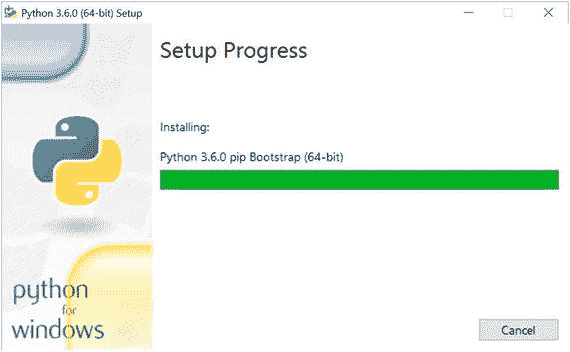
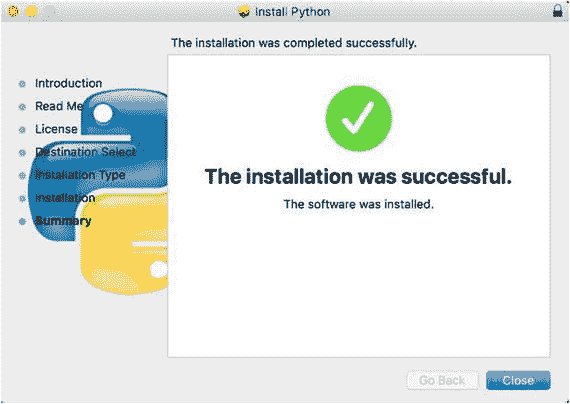
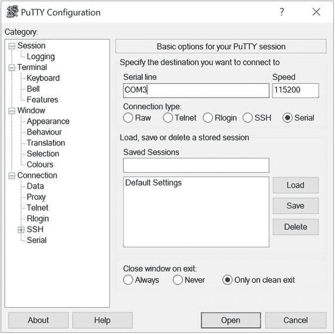
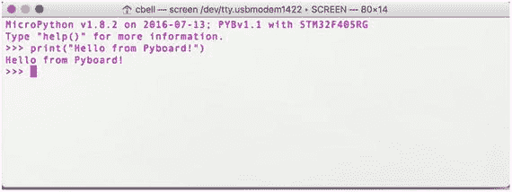
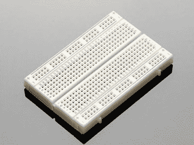
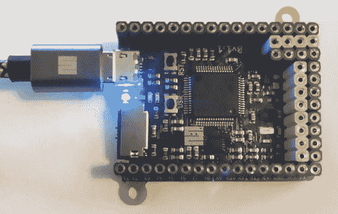
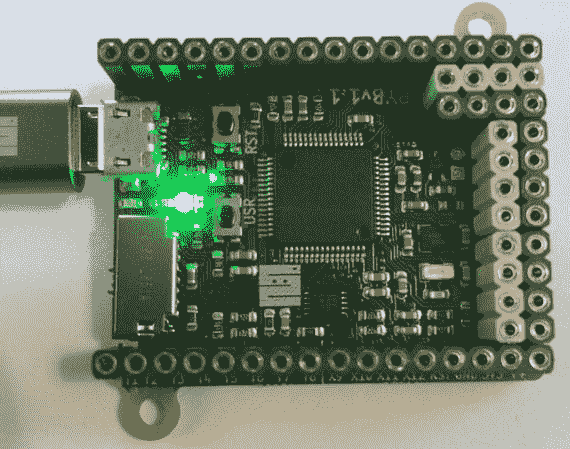

# 2.介绍 MicroPython

现在，我们已经了解了更多关于物联网的知识，并看到了一些 MicroPython 的演示，是时候了解更多关于 MicroPython 的知识了——我们如何开始，它如何工作，以及您可以使用自己的 MicroPython 板做什么的示例。

即使对于没有任何编程经验的人来说，学习 MicroPython 也是非常容易的。事实上，学习 MicroPython 所需要的只是一点耐心和一点时间来习惯使用 MicroPython、电路板和电子设备所特有的语法和机制。正如我们将会看到的，只要有一点点知识，你就可以做很多事情。

在这一章中，我们将学习更多关于 MicroPython 的知识，包括如何开始使用最流行的主板之一的概述。如果你还没有冲浪板，也不用担心；本章中的例子旨在让你了解你能做什么，而不是一个详细的教程。也就是说，我们将会看到本章中使用的主板以及第 [3](03.html) 章中其他主板的详细教程。我们还将在第 4 章[中更详细地探讨编程 Python。](04.html)

Tip

我将本机运行 MicroPython 或可以加载 MicroPython 二进制文件的微处理器板称为“MicroPython 兼容板”或“MicroPython 板”。

我们先来看看什么是 MicroPython，包括为什么创建它，如何入门。

## 入门指南

使用 Python 语言控制硬件已经有一段时间了。Raspberry Pi、pcDuino 和其他低成本计算机以及类似主板的用户已经拥有了使用 Python 控制硬件的优势。在这种情况下，他们在基于 Linux 的本地操作系统上使用了完整版本的 Python 编程语言。

然而，这需要构建特殊的库来与硬件通信。这些库旨在与通用输入输出(GPIO)引脚接口。GPIO 引脚通常出现在板上的一排或多排公引脚中。一些电路板使用母头引脚。

虽然这些电路板使那些想要开发电子项目的人成为可能，但它要求用户购买电路板以及键盘、鼠标和显示器等外围设备。不仅如此，用户还必须学习操作系统。对于那些不习惯 Linux 的人来说，这本身就是一个挑战。

你可能想知道微控制器，如广受欢迎的 Arduino ( `arduino.cc`)或 Espressif，也称为 ESP 板(`espressif.com`)。对于那些板卡，你必须用一种类 C 语言 [<sup>1</sup>](#Fn1) 来编程，这可能是有些人不愿意学的。

MicroPython 的愿景是将学习 Python 的简单性与微控制器板的低成本和易用性结合起来，这将允许更多的人在艺术和科学项目中使用电子产品。初学者不必学习新的操作系统或学习更复杂的编程语言。答案是 MicroPython。图 [2-1](#Fig1) 显示了来自 Adafruit 的技能徽章 [<sup>2</sup>](#Fn2) 形式的 MicroPython 标志。


图 2-1。

MicroPython Logo Skill Badge (courtesy of adafruit.com)

那很酷，不是吗？是集成电路(芯片)上的一条蛇(巨蟒)。可以在 [`www.adafruit.com/products/3271`](http://www.adafruit.com/products/3271) 向 Adafruit 订购此技能徽章。如果你没有任何东西可以贴上补丁，Adafruit 还储备了一个俏皮的 MicroPython 贴纸( [`www.adafruit.com/products/3270`](http://www.adafruit.com/products/3270) )。当你读完这本书的时候，我建议你买一本，骄傲地展示出来。

### 起源

MicroPython [<sup>3</sup>](#Fn3) 由 Damien P. George、Paul Sokolovsky 和其他贡献者创建和维护。它被设计成 Python 3 语言的精简、高效版本，并安装在一个小型微控制器上。由于 Python 是一种解释语言，因此(一般来说)比编译语言慢，所以 MicroPython 被设计得尽可能高效，以便它可以在通常比典型的个人计算机慢得多且内存少得多的微控制器上运行。

Compiled VS. Interpreted

编译语言使用称为编译器的程序将源代码从人类可读的形式转换为二进制可执行的形式。这种转换涉及几个步骤，但一般来说，我们获取源代码并将其编译成二进制形式。由于它是二进制形式，处理器可以直接执行生成的语句，而不需要任何额外的步骤(同样，一般情况下)。

另一方面，解释语言不是编译的，而是用一个叫做解释器的程序动态地转换成二进制形式(或中间二进制形式)。Python 3 提供了一个 Python 可执行文件，它既是解释器又是控制台，允许您在输入代码时运行代码。Python 程序一次运行一行代码，从文件的顶部开始。

因此，编译语言比解释语言更快，因为代码是为执行而准备的，并且不需要中间的实时步骤来在执行之前处理代码。

另一方面，Arduino 等微控制器板需要一个编译步骤，您必须在电脑上执行该步骤，并首先将二进制可执行文件加载到板上。相比之下，由于 MicroPython 的解释器直接在硬件上运行，我们不需要中间步骤来准备代码；我们可以直接在硬件上运行解释语言！

这使得硬件制造商可以制造小型、廉价的主板，在与微处理器相同的芯片上包含 MicroPython(通常情况下)。这使您能够连接到电路板，编写代码，并执行它，而无需任何额外的工作。

您可能会想，将 Python 3 缩减到适合内存有限的小芯片的大小，这种语言被剥离了，缺少了一些特性。这不可能比事实更进一步。事实上，MicroPython 是 Python 3 核心特性的完整实现，包括紧凑的运行时和交互式解释器。它支持读写文件、加载模块、与 GPIO 引脚等硬件交互、错误处理等等。最重要的是，Python 3 代码的优化允许它被编译成需要大约 256K 内存来存储二进制文件的二进制文件，并且运行时只需要 16k 的 RAM。

然而，有一些事情 MicroPython 没有从 Python 3 语言中实现。下面几节将向您介绍使用 MicroPython 能做什么，不能做什么。

### MicroPython 功能

MicroPython 最大的特点当然是运行 Python。这允许你创建简单的、有效的、易于理解的程序。我认为，这是它相对于 Arduino 等其他主板的最大优势。下面列出了 MicroPython 支持的一些特性。我们将在本书中更详细地看到这些特性。

*   交互式解释器:MicroPython 板内置了一个特殊的交互式控制台，您可以通过 USB 电缆(或在某些情况下通过 WiFi)连接到板上来访问它。这个控制台被称为读取-评估-打印循环，它允许您键入代码并一次执行一行。这是一个很好的方法来原型化你的代码或者只是在你开发的时候运行一个项目。
*   Python 标准库:MicroPython 也支持许多标准 Python 库。总的来说，你会发现 MicroPython 支持 80%以上最常用的库。其中包括解析 JavaScript 对象符号(JSON)， [<sup>4</sup>](#Fn4) 套接字编程，字符串操作，文件输入/输出，甚至正则表达式支持。
*   硬件级库:MicroPython 具有内置的库，允许您直接访问硬件来打开或关闭模拟引脚、读取模拟数据、读取数字数据，甚至使用脉宽调制(PWM)来控制硬件，这是一种通过快速调制设备功率来限制设备功率的方法。例如，使风扇比满功率运转时旋转得更慢。
*   可扩展:MicroPython 也是可扩展的。对于需要在底层(用 C 或 C++)实现一些复杂的库并在 MicroPython 中包含新库的高级用户来说，这是一个很好的特性。是的，这意味着您可以构建自己独特的代码，并使其成为 MicroPython 特性集的一部分。

回答你的问题，“我能用 MicroPython 做什么？，“答案还挺多的！您可以控制连接到 MicroPython 板上的硬件，编写代码模块以扩展您的程序的功能，并将它们存储在 SD 卡上以供以后检索(就像您在 PC 上使用 Python 一样)，等等。您可以连接的硬件包括打开和关闭 led，驱动伺服系统，读取传感器，甚至在 LCD 上显示文本。一些主板还以 WiFi 无线电的形式提供网络支持。几乎任何你可以用其他微控制器板做的事情，你都可以用 MicroPython 板来做。

然而，在芯片上运行 MicroPython 有一些限制。

### MicroPython 限制

MicroPython 最大的限制是易用性。Python 的易用性意味着代码是动态解释的。尽管 MicroPython 得到了高度优化，但对解释器来说还是有损失的。这意味着需要高精度的项目，如高速数据采样或通过连接(USB、硬件接口等)进行通信。)可能跑得不够快。对于这些领域，我们可以通过用处理低级通信的优化库来扩展 MicroPython 语言来克服这个问题。

MicroPython 使用的内存也比 Arduino 等其他微控制器平台多一点。通常，这不是一个问题，但是如果你的程序开始变大，你应该考虑一下。使用大量库的大型程序消耗的内存可能会超出您的预期。这又一次与 Python 的易用性有关——这是另一个要付出的代价。

最后，如前所述，MicroPython 没有实现所有 Python 3 库的所有特性。但是，您应该会发现它拥有构建 IOT 项目所需的一切(甚至更多)。

Are My Python Skills Applicable To Micropython?

如果你已经学会了如何用 Python 编程，你可能会期望看到一些与众不同的东西，甚至是关于 MicroPython 的奇怪的东西。好消息是，使用 MicroPython 只需要掌握 Python 技能。的确，MicroPython 和 Python 使用相同的语法；没有什么新东西要学。正如您将在接下来的几章中看到的，MicroPython 实现了 Python 库的一个子集，但仍然是非常 Python 化的。

### MicroPython 运行于什么之上？

由于 MicroPython 越来越受欢迎，运行 MicroPython 的主板有了更多的选择。其中一部分来自开发人员构建特定于处理器和平台的 MicroPython 编译版本，您可以下载并安装到主板上。这是增长最快的类别。

有两类板可以用来运行 MicroPython。首先是从工厂加载了 MicroPython 并且只运行 MicroPython 的主板。其中包括 Pyboard(最初的 MicroPython 板)和 WiPy。接下来是有可用固件选项在板上安装 MicroPython 的板，包括 ESP8266、Teensy 等。我们将在下一章看到更多关于这些板的内容。

接下来，让我们在下一节中从我们的 PC 上探索 Python，让您了解这种语言是什么样的，并有机会在不需要 MicroPython 板的情况下亲自尝试一下。

### 在您的电脑上体验 Python

由于 MicroPython 是 Python(只是为了优化的目的稍微缩小了一点)，您可以在 PC 上运行 Python 并试验这种语言。我建议在你的 PC 上加载 Python，即使你已经有一个 MicroPython 板。你可能会发现用你的电脑来尝试更方便，因为你可以更好地控制环境。然而，您的 PC 将无法与电子元件或硬件(如 MicroPython 板)通信，因此虽然您可以在 PC 上做更多的事情，但您无法测试与硬件通信的代码。但是您可以测试基本的构造，比如函数调用、打印消息等等。

所以，何必呢？简单地说，在 MicroPython 板上尝试之前，使用您的 PC 调试 Python 代码将允许您完成项目的大部分工作。更具体地说，通过在您的 PC 上开发普通的东西，您消除了许多在 MicroPython 板上调试代码的潜在问题。这是新手程序员犯的头号错误——编写完整的解决方案而不测试较小的部分。从小处着手，一次只测试一小部分代码，只添加那些已经测试并证明可以正常工作的部分，这样总是更好。

您需要做的只是下载并安装 Python 3(例如，Python 3.6.2 是最新的，但新版本会定期发布)。以下部分简要描述了如何在各种平台上安装 Python。关于这里没有列出的平台的具体信息，参见 Python wiki:[`https://wiki.python.org/moin/BeginnersGuide/Download`](https://wiki.python.org/moin/BeginnersGuide/Download)。

Caution

Python 有两个版本——Python 2 和 Python 3。因为 MicroPython 是基于 Python 3 的，所以您需要安装 Python 3 版，而不是 Python 2 版。

但是首先，检查您的系统，看看是否已经安装了 Python。打开终端窗口(命令提示符)并键入以下命令。

```py
python --version

```

如果安装了 Python，您应该会看到如下所示的内容。

```py
$ python --version
Python 3.6.0

```

如果您看到了类似 Python 2.7.3 的版本，那么您的机器上仍然有机会安装 Python 3。有些系统同时安装了 Python 2 和 Python 3。要运行 Python 3，请使用以下命令。

```py
python3

```

如果没有安装 Python 3 或者它是旧版本，请使用以下部分在您的系统上安装 Python。您应该始终安装最新版本。可以从 [`www.python.org/downloads/`](http://www.python.org/downloads/) 下载 Python 3。

#### 在 Windows 10 上安装 Python 3

大多数 Windows 机器不包含 Python，您必须安装它。可以从 Python 官方网站( [`https://www.python.org/downloads/windows/`](https://www.python.org/downloads/windows/) )下载 Python 3 for Windows。你会发现通常的 32 位和 64 位版本的 Windows installer 选项，以及一个基于 web 的安装程序和一个`.zip`格式。大多数人会使用 Windows installer 选项，但是如果您必须手动安装 Python，您可以使用其他选项。

下载 Python 后，就可以启动安装程序了。例如，在我的 Windows 10 机器上，我在名为最新 Python 3 版本——Python 3 . 6 . 0 的链接下下载了该文件。如果你向下滚动，你可以找到你想要的安装程序。例如，我点击了 Windows 64 位机器的安装程序。这下载了一个名为`python-3.6.0-amd64.exe`的文件，我将它放在我的`Downloads`文件夹中，并通过双击该文件来执行。

像大多数 Windows installer 安装一样，您可以通过各种屏幕来同意许可，指定您要安装它的位置，并最终启动安装。图 [2-2](#Fig2) 显示了安装程序运行的示例。



图 2-2。

Installing Python on Windows 10 Tip

如果你遇到困难或者需要更详细的指导，请参阅《如何极客 [`www.howtogeek.com/197947/how-to-install-python-on-windows/`](http://www.howtogeek.com/197947/how-to-install-python-on-windows/) 的精彩文章。

安装完成后，您可以尝试上一节中的测试来验证安装。如果不修改路径变量，可能需要使用开始菜单上的 Python 控制台快捷方式来启动控制台。

#### 在 macOS 上安装 Python 3

如果您使用的是 macOS，您可能已经安装了 Python，因为大多数 macOS 版本默认安装 Python。但是，如果您无法运行上面的 Python 版本命令或者版本不正确，您仍然可以从 Python 网站( [`https://www.python.org/downloads/mac-osx/`](https://www.python.org/downloads/mac-osx/) )下载最新的 Python 3。您会找到几个版本，但您应该下载可用的最新版本。

下载 Python 后，就可以启动安装程序了。例如，在我的 iMac 上，我在名为最新 Python 3 版本——Python 3 . 6 . 0 的链接下下载了最新的 Python 3 文件。如果你向下滚动，你可以找到你想要的安装程序。例如，我点击了 64 位机器的安装程序。这下载了一个名为`python-3.6.0-macosx10.6.pkg`的文件，我将它放在我的下载文件夹中并执行。

像大多数安装程序一样，您可以一步一步地通过各种屏幕，同意许可，指定您想要安装它的位置，最后开始安装。图 [2-3](#Fig3) 显示了安装程序运行的示例。

Note

根据您运行的 macOS 版本以及您的安全设置，您可能需要更改它们来运行安装程序，因为它不是由指定的开发人员签名的。请查看“系统偏好设置”中的“安全性与隐私”面板。



图 2-3。

Installing Python on macOS

安装完成后，您可以尝试上一节中的测试来验证安装。

#### 在 Linux 上安装 Python 3

如果您使用的是 Linux，安装 Python 的方式会因平台而异。例如，Ubuntu 使用 apt-get 命令，而其他发行版有不同的包管理器。使用您平台的默认包管理器安装 Python 3.6(或更高版本)。

例如，在 Debian 或 Ubuntu 上，我们使用以下命令安装 Python 3.6 包。第一个命令更新包，以确保我们拥有最新的包引用。第二个命令启动必要文件的下载并安装 Python。

```py
sudo apt-get update
sudo apt-get install python3.6

```

Tip

在 16.10 之前的 Ubuntu 版本上，您可能需要在运行 update 命令之前添加 apt 存储库。使用命令`sudo add-apt-repository ppa:jonathonf/python-3.6`添加存储库并重新运行`sudo apt-get update`命令，然后安装 Python 3.6。其他平台可能有类似的解决方案。

图 [2-4](#Fig4) 展示了一个在 Kubuntu(Ubuntu 的一个变种)上安装的例子。您的平台输出可能略有不同。


图 2-4。

Installing Python on Kubuntu (Linux)

注意，在这次安装中，我已经安装了 Python 2.7 和 Python 3.4。一旦我安装了 Python 3.6，我就可以简单地通过使用正确的解释器来运行这三个版本:2.7 版使用`python`，3.4 版使用`python3`，3.6 版使用`python3.6`。如果安装了以前版本的 Python，您的平台可能会有类似的约束。

安装完成后，您可以尝试上一节中的测试来验证安装。

#### 运行 Python 控制台

现在让我们在电脑上运行一些测试。回想一下，我们可以通过打开一个终端窗口(命令提示符)并输入命令`python`(或`python3`或`python3.6`，这取决于您的安装)来打开 Python 控制台。看到提示后，在提示处输入下面的代码(`>>>`)。这段代码将在屏幕上打印一条消息。结尾的`--n`是一个特殊的非打印字符，它发出回车(类似于按 Enter)来移动到新的一行。

```py
print ("Hello, World!")

```

当你输入这段代码时，你会马上看到结果。回想一下，解释器的工作方式是每次执行一行代码——每次按回车键。但是，与运行存储在文件中的程序不同，您在控制台中输入的代码不会被保存。图 [2-5](#Fig5) 显示了一个在 macOS 上运行 Python 控制台的例子。注意，我输入了一个简单的程序——典型的“你好，世界！”例子。


图 2-5。

Hello, World!

要退出控制台，输入`quit()`代码，如上图所示。

虽然这演示了如何在 PC 上运行 Python，但并不有趣。让我们看一些更复杂的东西。

#### 用解释器运行 Python 程序

假设您的项目要求您将数据保存到文件中，或者可能从文件中读取数据。我们可以在我们的 PC 上对文件进行实验，而不是试图找出如何在 MicroPython 板上做到这一点！

在下一个例子中，我将数据写入文件，然后读取数据并打印出来。不要太担心理解代码——通读一下就好——它非常直观。清单 [2-1](#Par73) 显示了这个例子的代码。我使用了文本编辑器，并将文件保存为 file_io.py。

```py
# Example code to demonstrate writing and reading data to/from files

# Step 1: Create a file and write some data
new_file = open("log.txt", "w")    # use "write" mode
new_file.write("1,apples,2.5--n")   # write some data
new_file.write("2,oranges,1--n")    # write some data
new_file.write("3,peaches,3--n")    # write some data
new_file.write("4,grapes,21--n")    # write some data
new_file.close()  # close the file

# Step 2: Open a file and read data
old_file = open("log.txt", "r")  # use "read" mode
# Use a loop to read all rows in the file
for row in old_file.readlines():
    columns = row.strip("--n").split(",") # split row by commas
    print(" : ".join(columns))  # print the row with colon separator
    old_file.close()

Listing 2-1.File IO Example

```

我将代码保存到一个文件中，向您展示如何使用 Python 解释器使用以下命令执行 Python 脚本。如果使用 Windows，可能需要修改类似“`python.exe file_io.py`”的命令。

```py
python ./file_io.py

```

清单 [2-2](#Par77) 显示了运行脚本的结果。

```py
$ python ./file_io.py
1 : apples : 2.5
2 : oranges : 1
3 : peaches : 3
4 : grapes : 21
Listing 2-2.Output for the File IO Example

```

请注意，代码通过将最初写入的逗号替换为空格、冒号和另一个空格来更改数据中的分隔符。代码通过用逗号将读取的行(字符串)分成几部分来实现这一点。因此，列数据包含三个部分，我们使用`join()`方法重新连接字符串并打印出来。花点时间通读代码，你会看到这些方面。如你所见，Python 易于阅读。

既然我们已经在 PC 上试验了 Python，那么让我们看看如何在典型的 MicroPython 板上使用 MicroPython。

## MicroPython 如何工作

回想一下，MicroPython 设计用于小型微控制器平台。这些微控制器平台中的一些使用包含 MicroPython 二进制文件(库、基本磁盘 IO、引导等)的特殊芯片。)以及微控制器、存储器和支持组件。

像大多数微控制器一样，当您使用 MicroPython 板时，您必须首先编写代码并将其加载到板上。大多数 MicroPython 主板都有一个 USB 闪存驱动器，当您使用 USB 电缆将它连接到您的计算机时，它就会安装。这个闪存驱动器存储了几个文件，您可以通过修改来改变它的行为。您也可以将您的程序(脚本文件)复制到这个驱动器，以便在引导时执行。我们将在后面的章节中看到如何做到这一点。

您还可以使用 MicroPython 控制台，它非常类似于我们在上一节中看到的 Python 控制台。MicroPython 控制台被称为运行、评估、打印循环或 REPL 控制台。每次开发板通电时，在将程序加载到开发板上执行之前，控制台使启动和调试程序(排除错误)变得非常容易。

### 运行、评估、打印循环(REPL 控制台)

如果您使用过 Arduino 之类的微控制器板，您可能会熟悉以下一些内容。但是如果您没有使用过这样的程序或者没有使用过终端程序，我提供了您在三个主要平台上需要的所有步骤:Windows、macOS 和 Linux。以下部分将带您完成首次连接到电路板的过程。

我在这些例子中使用 Pyboard。您可以使用默认加载了 MicroPython 的任何其他板，但是在第一次开始使用该板之前，一定要查看供应商的文档。某些主板可能需要在首次使用前加载固件。

#### 连接电路板

要开始使用 REPL 控制台，请使用 USB 转 micro USB 电缆(通常)将该板连接到您的计算机，该电缆通过 USB 供电并连接控制台。一旦主板启动(有些主板第一次启动可能需要 1-2 分钟)，您就可以使用终端程序连接到主板。从那里，我们可以像使用 Python 控制台一样使用 REPL 控制台。

Tip

有些主板可能需要一段时间才能启动，因此如果您没有连接，请稍等片刻，然后再试一次。

当主板完成启动时，您可以使用电脑浏览主板上的驱动器。使用 USB 电缆连接 Pyboard 后，您应该会看到 USB 驱动器安装。例如，在 Windows 10 上，您可以使用文件资源管理器查看驱动器上的文件。图 [2-6](#Fig6) 显示了 Pyboard 上的文件示例。


图 2-6。

USB Drive (Pyboard )

注意有两个文件的扩展名为`.py`:`boot.py`，在引导时执行(因此得名)；和`main.py`，如果你想独立使用该板，你可以用你自己的程序替换它。同样，我们将在后面的章节中看到这一点。还有一些附加文件，如`README.txt`，其中包含一些使用电路板的说明；还有`pybcdc.inf`，这是一个 Windows 的设备驱动安装程序。

Tip

要在 Windows 10 以外的 Windows 版本上使用 Pyboard，您可能需要安装 USB 设备驱动程序。设备驱动程序包含在 Pyboard 的板载闪存驱动器中，以备不时之需。如果您有旧版本的 Windows 或在使用终端应用程序时遇到问题，您可以按照 [`http://micropython.org/resources/Micro-Python-Windows-setup.pdf`](http://micropython.org/resources/Micro-Python-Windows-setup.pdf) 的优秀指南中所述安装设备驱动程序。

#### 启动 REPL 控制台(Windows)

要使用 Windows 连接到 REPL 控制台，你需要一个像 PuTTY 这样的终端程序，它最初是由西蒙·塔瑟姆( [`http://www.chiark.greenend.org.uk/∼sgtatham/putty/latest.html`](http://www.chiark.greenend.org.uk/%E2%88%BCsgtatham/putty/latest.html) )开发的。PuTTY 是一个简单的终端程序，非常容易使用，并且是为 Windows 平台开发的。

要安装 PuTTY，请选择适当的`.msi`文件(32 位或 64 位)，下载它，然后双击该文件启动安装程序。按照提示完成安装。比如我下载了名为`putty-64bit-0.68-installer.msi`的文件。

现在您已经安装了 PuTTY，您必须知道要使用的正确端口。打开设备管理器，沿树向下导航，直到找到端口(COM & LPT)条目，然后单击将其打开。请注意，Pyboard 必须连接才能工作。您应该在子树中看到一个或多个条目，指示连接到 PC 的 COM 端口(和打印机端口)。Pyboard 将被简单地列为 USB 串行设备(COMn ),其中 n 是类似 COM1、COM2 等的数字。比如在我的 PC 上，它被列为 COM3。图 [2-7](#Fig7) 显示了一个来自我的电脑的例子。


图 2-7。

Finding the COM Port on Windows 10

现在我们可以打开 PuTTY 并连接到 Pyboard。使用开始菜单上的快捷方式启动 PuTTY，或者在搜索框中键入 PuTTY，当 Cortana 找到该条目时单击它。当 PuTTY 打开时，您将看到一个对话框，您可以使用它通过网络上的终端进行连接。因为 Pyboard 是通过 COM 端口连接的，所以我们必须单击标有 Serial 的小单选按钮。然后，我们可以在串行线文本框中输入 COM 端口，并将速度设置为 115200。图 [2-8](#Fig8) 显示了一个正确配置的 PuTTY，用于连接到 COM3 上的 Pyboard(如设备管理器所示)。



图 2-8。

Connecting to Pyboard Using PuTTY

准备就绪后，单击“打开”按钮。这将打开一个新的终端，启动 REPL 控制台，如图 [2-9](#Fig9) 所示。我输入了一个简单的语句来演示控制台正在工作。


图 2-9。

The REPL Console (Windows 10) Tip

如果你不喜欢黑底白字的配色方案，你可以通过点击树控件中的颜色来改变它们。小心行事，因为您必须单独设置这些值(没有方案概念)。

#### 启动 REPL 控制台(macOS 和 Linux)

要使用 macOS 或 Linux 进行连接，您可以使用以下命令。您唯一需要做的就是找到正确的设备。我用列出我的 macOS 系统上的设备的第一个命令来演示这一点。请在连接到 MicroPython 板(Pyboard)后执行此操作。

```py
$ ls /dev/tty.usb*
/dev/tty.usbmodem1422
$ screen /dev/tty.usbmodem1422

```

继续插入您的主板，然后按照上面的说明打开一个控制台。控制台打开后，输入如下所示的代码。图 [2-10](#Fig10) 显示了在 Pyboard 上运行的 REPL 控制台的示例。



图 2-10。

REPL Console (Pyboard)

你能从你电脑上的 Python 控制台看出区别吗？仔细看。除了输出顶部的版本声明，它们是相同的，这很好。

REPL 游戏机有一个奇怪之处。`quit()`不工作了。要退出某些板的控制台，您需要重置板或切断连接。虽然这看起来很奇怪，但我确信它在未来会得到改进，回想一下，我们通常不使用 REPL 控制台来运行我们的项目；相反，我们用它来测试代码，所以退出时的一点小问题不是大问题。

Caution

您应该避免简单地拔掉您的 MicroPython 板。有些主板，如 Pyboard，将它们的基本文件系统作为一个可挂载的 USB 驱动器。未弹出板就断开连接可能会导致数据丢失。

现在是时候来看看我们能用 MicroPython 做些什么了。下一节使用几个示例项目向您展示如何使用 MicroPython 板。我再一次用最少的硬件解释和细节来介绍这些例子。我们将在下一章学到更多关于硬件的知识。

## 使用 MicroPython 关闭并运行

如果你像我一样遇到新技术，你很可能想尽快开始。如果您已经有一个 Pyboard，那么您可以按照本节中的示例进行操作，并查看更多使用 MicroPython 的示例。为了简单起见，我们将只看到那些在板上运行的项目，不需要额外的组件，也不使用互联网。图 [2-11](#Fig11) 展示了来自 MicroPython.org([`https://store.micropython.org/`](https://store.micropython.org/))的 Pyboard 1.1。


图 2-11。

Pyboard with Headers

电路板的右侧是微型 USB 连接器，上方是微型 SD 读卡器。如果您查看这些连接器之间，您会看到四个小 led，如方形框所示。指示灯的左侧是一个标有 USR 的按钮。这些是我们将在以下示例中与之交互的组件。

Note

此处显示的 Pyboard 具有从 MicroPython.org 预焊的 GPIO 接头(板周围的插座排)。如果您订购 Pyboard，我建议您购买这个版本，尤其是如果您不知道如何或不想自己焊接接头的话。

我最喜欢这个板的地方是它有一个发光二极管(led)阵列和一个按钮，你可以用它来试验编写 MicroPython 项目。这使得 Pyboard 成为初学者的绝佳首选。

但是，如果你还没有冲浪板，也不用担心。同样，我包括这一部分是为了帮助你通过例子了解更多的可能性。一旦我们讨论了流行的板的细节以及如何在 MicroPython 中编程，我们将深入到更复杂的项目中，您可以在学习的过程中进行实验。

不幸的是，Pyboard 不提供任何形式的网络，因此它在 IOT 项目中的使用可能相当有限。幸运的是，有很多方法可以将你的 Pyboard 连接到互联网。

Note

您可以使用的兼容 MicroPython 的主板越来越多。我选择 Pyboard 来演示 MicroPython，因为 Pyboard 是最容易使用的板，而且相对便宜。我们将在第 [3](03.html) 章中了解更多关于其他选择的信息。如果你想买一个 Pyboard 来运行这些例子，你可以，但是你可能需要一个不同的板或者一个网络模块来用于连接到互联网的更高级的项目。

### 附加硬件

虽然下面的例子不需要任何额外的电子元件，但我想介绍几个你在本书后面会用到的关键元件。如果您没有这些组件，现在订购它们是一个好主意，这样当您到达示例项目时，您将拥有您所需要的。

除了 MicroPython 板之外，我认为这些组件是任何想要学习如何使用电子学和 MicroPython 的人的必备物品。这些包括一个基本的电子工具包，其中包含学习电子技术时需要的最常见的组件、试验板和跳线。我将在下面的章节中描述每一个。

#### 基本电子套件

本书中的示例项目使用了几种常见的电子元件，如发光二极管、开关、按钮、电阻等。在爱好层面学习使用电子产品时，最大的挑战之一是买什么。我曾和一些人交谈过，他们多次去当地的电子商店购买他们需要的东西，似乎无论他们买什么都没有合适的组件。

幸运的是，电子产品零售商已经意识到了这个问题，现在他们提供了一个基本的电子套件，其中包含了许多更常见的组件。Adafruit ( `adafruit.com/products/2975`)和 Sparkfun ( `sparkfun.com/products/13973`)都提供这样的套件。虽然这两种套件都不会出错，但我最喜欢 Adafruit 套件，因为它有更多的组件(例如，更多的 led)。

Adafruit Parts Pal 封装在一个小型塑料外壳中，带有大量电子元件。图 [2-12](#Fig12) 显示了零件 Pal 套件。


图 2-12。

Adafruit Parts Pal (courtesy of adafruit.com)

该套件包括以下组件:原型制作工具、led、电容器、电阻器、一些基本传感器等。事实上，这个工具包里的组件比你做很多实验所需的都要多。更好的是，该套件的价格仅为 19.95 美元，非常划算(而且这个箱子是一个巨大的奖励)。

*   1x -带插销的储物箱
*   1x 半尺寸试验板
*   20x -公/公跳线- 3 英寸(75 毫米)
*   10x -公/公跳线- 6 英寸(150 毫米)
*   5x-5 毫米漫射绿色发光二极管
*   5x-5 毫米漫射红色发光二极管
*   1x-10 毫米扩散共阳极 RGB LED
*   10x - 1.0uF 陶瓷电容
*   10x - 0.1uF 陶瓷电容
*   10x - 0.01uF 陶瓷电容器
*   5x - 10uF 50V 电解电容器
*   5x - 100uF 16V 电解电容器
*   10x - 560 欧姆±5%轴向电阻
*   10x - 1K 欧姆±5%轴向电阻
*   10x 10K 欧姆±5%轴向电阻器
*   10x - 47K 欧姆±5%轴向电阻
*   5x - 1N4001 二极管
*   5x - 1N4148 信号二极管
*   5x - NPN 晶体管 PN2222 至-92
*   5x - PNP 晶体管 PN2907 至-92
*   2x - 5V 1.5A 线性稳压器- 7805 至-220
*   1x - 3.3V 800mA 线性稳压器- LD1117-3.3 至-220
*   1x - TLC555 宽电压范围、低功耗 555 定时器
*   1x 光电池
*   1x 热敏电阻(试验板版本)
*   1x -振动传感器开关
*   1x 10K 试验板微调电位计
*   1x - 1K 试验板调整电位计
*   1x 压电蜂鸣器
*   5x - 6mm 触觉开关
*   3x SPDT 滑动开关
*   1x - 40 针分离式插头带
*   1x - 40 针插座条

#### 试验板和跳线

试验板是一种特殊的工具，它允许您插入电气元件，并提供各列之间的互连，以便您可以将两个元件的引线插入同一列，从而实现连接。电路板分为两排，便于在电路板中央使用 IC。电线(称为跳线或简称跳线)可用于将试验板上的电路连接到 MicroPython 板上。在本章的后面你会看到一个这样的例子。

幸运的是，Adafruit Parts Pal 配备了如图 [2-13](#Fig13) 所示的试验板。这是 Adafruit 公司的半块面包板。这种试验板被称为半板，因为它是标准试验板正常长度的一半。最重要的是，它适合零件 Pal 盒。



图 2-13。

Half-sized Breadboard (courtesy of adafruit.com)

如果已经有了一些组件，或者决定购买一个不附带试验板的不同的基本电子套件，您可以从 Adafruit ( `adafruit.com/products/64`)单独购买试验板。

如果您的 MicroPython 板有公头引脚而不是母头引脚，您将需要一套不同的跳线。再说一次，Adafruit 有你需要的东西。如果您需要公/母跳线，请订购优质母/公扩展跳线–20 x 6(ada fruit . com/products/1954)。图 [2-14](#Fig14) 显示了一组公/母跳线。


图 2-14。

Male/Female Jumper Wires (courtesy of adafruit.com)

现在，让我们来看看一些硬件的运行情况！

### 例 1:

在本例中，我们将编写代码来打开电路板上的一个 led。如果您按照图 [2-11](#Fig11) 所示的方向放置电路板，四个 led 从左到右排列为不同的颜色，分别为红色、绿色、黄色(橙色)和蓝色。如果你像我一样是右撇子，你可能会调整电路板的方向，使 USB 连接器在左边。在这种情况下，蓝色 LED 位于最左侧。

让我们写一些代码来打开蓝色 LED。与其简单地打开它，不如让我们使用一个称为循环的结构来每隔 250 毫秒打开和关闭它。因此，它会快速闪烁。在我解释代码之前，让我们看一下完整的代码。清单 [2-3](#Par156) 展示了代码的样子。不用担心；我将在清单之后解释每一行代码。

```py
#
# MicroPython for the IOT
#
# Example 1
#
# Turn on the blue LED (4 = Blue)
#
# Dr. Charles Bell
#
import pyb              # Import the Pyboard library

led = pyb.LED(4)        # Get the LED instance
led.off()               # Make sure it's off first

for i in range(0, 20):  # Run the indented code 20 times
    led.on()            # Turn LED on
    pyb.delay(250)      # Wait for 250 milleseconds
    led.off()           # Turn LED off
    pyb.delay(250)      # Wait for 250 milleseconds

led.off()               # Turn the LED off at the end
print("Done!")          # Goodbye!

Listing 2-3.Blink the Blue LED

```

代码的第一行是注释行。这些都被 MicroPython 忽略了，是一种向他人传达你的程序正在做什么的方式。在 REPL 控制台中输入代码时，可以随意跳过注释行。

接下来是一行用于导入 Pyboard 硬件库的代码(`pyb`)。该库专用于 Pyboard，并提供板上的所有元件。接下来的两行代码通过使用 Pyboard 库(`pyb`)初始化一个变量(led)来获得第四个 LED(蓝色的那个)。这就创建了一个我们可以使用的对象的实例。在这种情况下，我们立即通过调用`led.off()`关闭 LED。

接下来是代码的主要部分——一个循环！在这种情况下，它是一个`for`循环，设计用来运行它下面的代码块，如缩进所指示的那样运行 20 次。`for`循环使用计数器`i`和由`range(0, 20)`函数返回的 0 到 19 的值。在循环体(缩进部分)中，我们首先用`led.on()`打开 LED，使用 Pyboard `delay()`方法等待 250 毫秒，然后再次关闭 LED，再等待 250 毫秒。最后，我们关闭 LED 并打印一条消息，说明我们完成了。

您可以在 REPL 控制台中逐行输入该代码。#开头的可以跳过。一旦您输入了`for`循环语句，您将得到一个没有`>>>`提示的行。这很正常。使用两个空格键入下一行(用于缩进，为循环建立块)。第二次`delay()`调用后，在空白处像结束缩进块一样按回车键。现在看一下 Pyboard。蓝色 LED 应该在闪烁。请记住，REPL 控制台与 Python 控制台一样，在您输入代码时运行代码。图 [2-15](#Fig15) 显示了代码运行的一个例子(我在蓝色 LED 亮着的时候捕捉到的)。如果你想让它闪烁得更慢，只需调整`delay()`调用，将数值增加到 500 甚至 1000。



图 2-15。

Running Example 1 Note

在某些平台上，如 macOS 和 Linux，您可以使用文本编辑器输入代码，然后将其复制并粘贴到 REPL 控制台。然而，这并不适用于所有平台或终端程序。你自己试试。

如果您想再次运行代码或出现错误，您必须首先关闭 PuTTY 窗口，然后弹出 USB 驱动器。一旦弹出，按下重置按钮(板上标有 RST)重新初始化 REPL 控制台。

### 例 2:

现在，让我们使用不同循环(while 循环)中的计数变量按顺序打开和关闭 led。在这种情况下，我们必须一次打开一个 led，然后在短暂的延迟后关闭。因此，它就像前面的例子一样，但是，正如你将看到的，它展示了更多的复杂性。因为它更复杂，所以在展示完整的代码之前，我将分几部分浏览代码。

像 Pyboard 的所有程序一样，我们从导入 Pyboard 硬件库开始。

```py
import pyb              # Import the Pyboard library

```

这个例子使用了两个循环。首先，我们循环关闭所有的 led。下面显示了如何做到这一点。请注意，我使用了 1 到 4 范围内的计数变量。在循环体中，我使用 Pyboard 硬件库中的计数变量获取 LED，并将其保存在名为`led` ( `led = pyb.LED(j)`)的变量中，然后用`led.off()`将其关闭。在开始时关闭 led 是一个好习惯，它将处理任何让代码运行或中断代码运行的事件，以便一个或多个 led 保持打开。您也可以通过重置电路板来解决这个问题，但这种方法是首选的(也是一种好的做法)。

```py
for j in range(1, 5):   # Turn off all of the LEDs
    led = pyb.LED(j)    # Get the LED
    led.off()           # Turn the LED off

```

接下来，我们使用另一个初始化为 1 的计数变量。然后，我们用一个无限条件开始 while 循环。也就是说，while 后面的表达式始终为真。在循环体中，我做了与上一个循环类似的事情，从 Pyboard 硬件库中获取 LED，打开它，等待 500 毫秒，关闭它，再等待 500 毫秒。在循环体的末尾，我增加了计数变量(而循环不像 for 循环那样增加计数变量)。如果计数器计数到 5，我从 1 开始计数。检查以下代码以查看这些元素。

```py
while True:             # Loop forever
    led = pyb.LED(i)    # Get next LED
    led.on()            # Turn LED on
    pyb.delay(500)      # Wait for 1/2 second
    led.off()           # Turn LED off
    pyb.delay(500)      # Wait for 1/2 second
    i = i + 1           # Increment the LED counter
    if i > 4:           # If > 4, start over at 1
        i = 1

```

清单 [2-4](#Par171) 显示了完整的代码。通读几遍，直到你确信它可以工作。

```py
#
# MicroPython for the IOT
#
# Example 2
#
# Turn on the four LEDs on the board in order
#
# 1 = Red
# 2 = Green
# 3 = Orange
# 4 = Blue
#
# Dr. Charles Bell
#
import pyb              # Import the Pyboard library

for j in range(1, 5):   # Turn off all of the LEDs
    led = pyb.LED(j)    # Get the LED
    led.off()           # Turn the LED off

i = 1                   # LED counter
while True:             # Loop forever
    led = pyb.LED(i)    # Get next LED
    led.on()            # Turn LED on
    pyb.delay(500)      # Wait for 1/2 second
    led.off()           # Turn LED off
    pyb.delay(500)      # Wait for 1/2 second
    i = i + 1           # Increment the LED counter
    if i > 4:           # If > 4, start over at 1
        i = 1

Listing 2-4.Example 2: Blinking the LEDs

```

当您运行代码时，您将看到 led 依次打开，首先是红色，然后是绿色、黄色(橙色)和蓝色。由于循环没有结束，它将一直闪烁 led，直到您重置板(记住首先弹出驱动器)。参见图 [2-16](#Fig16) 。



图 2-16。

Running Example 2

### 例 3:

这个例子演示了如何使用板上的按钮。它还演示了如何使用中断(称为回调函数)。也就是说，我们在代码中创建一个函数，然后告诉 MicroPython 在发生中断时执行该函数——在本例中，就是当按钮被按下时。由于这个例子也很复杂，我将带您浏览一下代码。

首先，我们导入 Pyboard 硬件库，为绿色 LED(列表中的第二个)设置一个变量，并关闭它。

```py
import pyb                  # Import the Pyboard library
led = pyb.LED(2)            # Get LED instance (2 = green)
led.off()                   # Make sure the LED if off

```

接下来，我们定义一个函数。这相当容易。我们只是使用 def 指令并给函数一个名字。姑且称之为 flash_led 吧。在这个函数中，我们让 LED 快速闪烁(100 毫秒延迟)25 次。我们已经在前面的例子中看到了这样做的代码。

```py
def flash_led():
    for i in range(0, 25):
        led.on()
        pyb.delay(100)
        led.off()
        pyb.delay(100)

```

接下来，我们通过获取用户按钮(在库中称为开关)来创建另一个变量。然后，我们使用方法 callback()并传入我们创建的函数的名称。这两个语句将建立连接，以便在按钮被按下时运行 flash_led()函数。

```py
button = pyb.Switch()       # Get the button (switch)
button.callback(flash_led)  # Register the callback (ISR)

```

最后，我们打印一条消息，说明代码已经可以测试了。

```py
print("Ready for testing!")

```

清单 [2-5](#Par183) 显示了完整的代码。

```py
#
# MicroPython for the IOT
#
# Example 3
#
# Flash the green LED when button is pushed
#
# Dr. Charles Bell
#
import pyb                  # Import the Pyboard library
led = pyb.LED(2)            # Get LED instance (2 = green)
led.off()                   # Make sure the LED if off

# Setup a callback function to handle button pressed
# using an interrupt service routine
def flash_led():
    for i in range(0, 25):
        led.on()
        pyb.delay(100)
        led.off()
        pyb.delay(100)

button = pyb.Switch()       # Get the button (switch)
button.callback(flash_led)  # Register the callback (ISR)

print("Ready for testing!")

Listing 2-5.Example 3: Using a Button

```

一旦你看到，准备测试！在 REPL 控制台中，您可以测试它。如果你胆小或有异常高的静电倾向，使用非导电探针并按下标有 USR 的按钮。图 [2-17](#Fig17) 显示了一个按钮按下调用 flash_led()方法的例子。尝试几次，直到你满意为止。


图 2-17。

Running Example 3

拔下或重置 Pyboard 之前，不要忘记弹出驱动器。

## 摘要

MicroPython 是微控制器世界中一个非常令人激动的新成员。第一次，初学者不需要学习新的操作系统或复杂的编程语言如 C 或 C++来编程微控制器。MicroPython 允许有一些甚至没有编程经验的人试验电子产品并构建有趣的项目。因此，MicroPython 为更多的业余爱好者和爱好者提供了机会，他们只想在没有陡峭的学习曲线的情况下完成他们的项目。

在本章中，我们发现了 MicroPython 的主要特性。我们还发现 MicroPython 是基于我们在个人电脑上发现的 Python。我们甚至在 PC 上测试 Python 来展示相似之处。最重要的是，我们亲眼看到了 MicroPython 如何在微控制器板上工作。在这种情况下，我们使用原始的 MicroPython 板 Pyboard 来演示为在 Pyboard 上运行组件而编写的三个 Python 代码示例。

在下一章中，我们将发现一系列可以用来运行 MicroPython 和构建我们的 IOT 项目的硬件。正如您将看到的，有许多选项，从已经加载了 MicroPython 的板(允许您无需额外设置即可构建项目)到您可以自己加载 MicroPython 的普通板。

Footnotes [1](#Fn1_source)

有些人可能会说 C++，我想这是有一定道理的，但它们更像是通用的、基本的 C 语言。

  [2](#Fn2_source)

是的，我有一个。

  [3](#Fn3_source)

版权所有 2014–2017，Damien P. George，Paul Sokolovsky 和贡献者。最后更新于 2017 年 3 月 5 日。

  [4](#Fn4_source)

[T2`https://www.json.org/`](https://www.json.org/)