# 3.MicroPython 硬件

现在我们已经快速了解了如何使用 MicroPython 板，包括几种形式的 MicroPython 项目的演示，是时候浏览一下可用的板和相关硬件了。正如我们将看到的，有几个板可以选择，包括那些已经加载了 MicroPython 的板，以便它们可以开箱即用；那些允许你在板上加载 MicroPython 的；那些现有的电路板，只要稍加努力，就值得研究。

本章还包括如何开始使用所讨论的每种板，包括如何连接板、加载固件等。您应该通读整个章节，因为虽然许多概念是相同的，但程序可能会因主板不同而略有不同。此外，本章的重点是支持 MicroPython 的主板。虽然我简要讨论了您可以使用的替代板，但这些部分中的信息对于使用本章中未列出的板是有用的。

在我们开始查看可用的主板之前，让我们讨论一些使用 MicroPython 主板的最佳实践和其他实用建议。这些适用于本章中的所有主板，也可能适用于任何新兴的主板，因此在选择主板时，你应该将这些考虑在内。

## 开始使用 MicroPython 板

虽然你可以买一个这样的主板，然后直接进入你的 IOT 项目，但是在使用你的主板时，有一些事情你应该考虑和记住。具体来说，有些主板可能需要更新，有些可能需要组装硬件(焊接)，而其他的可能有局限性要考虑。我将在本节中讨论这些以及更多内容。我还包括一些在你的电脑上使用主板的技巧。

### 固件更新

那些在芯片上包含 MicroPython 的主板可能需要固件更新。固件 [<sup>1</sup>](#Fn1) 是用来描述芯片上软件的术语。大多数主板都有特殊的芯片，允许您自己更新 MicroPython(和其他方面),使您能够跟上供应商、MicroPython 等的变化。

加载固件是特定于主板的，因此您应该参考供应商的文档来了解如何更新固件。例如，Pycom 在 [`https://docs.pycom.io/chapter/gettingstarted/installation/firmwaretool.html`](https://docs.pycom.io/chapter/gettingstarted/installation/firmwaretool.html) 记录了 WiPy 板的更新过程。

当您第一次收到主板时，或者当您发现无法访问某些库函数、操作失败或发布新硬件(附加主板)时，您应该考虑更新固件。但是，您应该避免过于频繁地更新固件。

我的理念很简单:我只在主板是新的时候更新一次固件，并且只在某些东西不再工作的时候更新。如果您的项目正在运行，并且没有遇到任何问题，就没有必要更新它。过于频繁地更新固件的一个风险是，如果固件中发生了一些变化，如旧的库或硬件不再受支持，对库的更改破坏了您的代码，以及其他恼人的问题，您可能会使您的项目变得无用。我对这个规则的唯一例外是，如果供应商已经修复了一个错误或改善了用户体验，在这种情况下，我会更新固件。底线是，如果有用，就不要乱来！

Tip

当您的主板是新的时，只在以后需要时更新您的固件。

特别要提到的是那些必须自己加载 MicroPython 的板。其中一些主板可能需要您更新系统的其他部分，如引导机制、在非易失性内存中加载 MicroPython 等。如果您选择使用必须加载 MicroPython 的主板，请务必查看供应商的文档，了解关于更新主板上软件的建议(可能不仅限于固件)。最后，有些主板是新的，因此它们的固件可能不是测试版或候选版本，也不是产品质量。在这些情况下，我喜欢更频繁地更新固件，直到发布生产版本。

### 网络问题

如果您的主板具有联网功能，您在学习如何使用主板时应该格外小心。具体来说，请按照供应商的说明设置网络并将您的主板连接到网络。例如，某些主板具有非常特殊的机制来连接到 WiFi 网络。未能正确配置您的网络连接将导致很多挫折，尤其是如果您的项目旨在生成通过网络访问的数据。

如果您的主板具有联网功能，我建议通读文档并运行任何示例，向您展示如何将主板连接到网络。花时间学习如何做到这一点(并重复)，将消除大量浪费的时间。事实上，初学者犯的头号错误是连接他们的电路板，编写代码将数据发送到网络上的另一个系统，却发现它不起作用。在这种情况下，他们在第一次使用它之前没有确保网络部分正常工作。

这也适用于将主板连接到您的 PC。对于那些允许您将板载存储器作为文件系统进行访问的主板，这可能不是问题，但对于其他需要通过特殊软件通过 USB 进行连接的主板，您应该确保在尝试编写第一个 Python 程序之前可以连接到主板。

### 一步一个脚印！

新手常犯的另一个错误是坐下来一次写完所有代码，而没有提前测试任何东西。这就造成了这样一种情况:如果某件事不成功，它可能会被一大堆问题掩盖。例如，如果有一些逻辑错误或产生的数据不正确，它可能会导致项目的其他部分失败或产生不正确的结果。当项目根本不工作时，情况会变得更糟——有太多的部分需要尝试和诊断出了什么问题。这往往会让初学者陷入困惑和沮丧的绝望境地。你们这些学生完全知道我在说什么。

这可以通过一步一步地构建项目来轻松避免。也就是说，一次构建一个方面的项目。例如，如果你用发光二极管发出信号，首先让那部分工作。同样，如果你从一个传感器读取数据，在把它们连接在一起并希望它们都能正常工作之前，确保你能独立正确地完成这项工作。即使是非常有经验的人也可能犯这种错误，但是如果出现问题，他们更有能力解决(他们知道得更多，但是这是一种照我说的做而不是照我做的情况)。我们将一步一步地构建本书中的示例。有些很小，可能只有一个步骤，但是这种实践是你从事任何项目都应该注意的。

### 程序设计工具

一些微控制器供应商提供软件开发(编程)工具。可以说最成功的一个是 Arduino 集成开发环境(IDE)。Arduino IDE 提供了操作(编程)Arduino 所需的所有工具，从编写代码到编译，再到将其安装到电路板上。

一些供应商提供了用于其主板的软件。最有希望的包括来自 pycom.io 的工具，包括用于流行编程编辑器 [<sup>2</sup>](#Fn2) 的 PyMakr 插件和用于移动设备的 PyMate ( [`https://pycom.io/pymate/`](https://pycom.io/pymate/) )应用。PyMakr 插件是一个特殊的编辑器和工具，用于编写 Python 程序并将其安装在 WiPy 板上。PyMate 应用是一个令人兴奋的新解决方案，允许您远程使用 WiPy，包括将其连接到您的网络和读取设备，在您的移动设备上显示数据。我们将在研究 WiPy 板时看到这些例子。

Caution

Atom、Sublime、Visual Studio Code 和 PyCharm 的 PyMakr 插件仍在开发中。目的是用 PyMakr 桌面应用来替换它们。目前，建议用户使用 FileZilla 等 FTP 客户端将代码/项目上传到他们的设备。

如果您的主板供应商提供用于其主板的软件，您应该考虑使用它。然而，编写 Python 脚本并将其加载到主板上所需的大部分工作都可以在没有特殊软件的情况下完成。事实上，有几个支持 Python 的编程编辑器包括 Komodo Edit ( [`www.activestate.com/komodo-ide/downloads/edit`](http://www.activestate.com/komodo-ide/downloads/edit) )、PyCharm ( [`www.jetbrains.com/pycharm/`](http://www.jetbrains.com/pycharm/) )和用于 Eclipse 的 PyDev IDE 插件( [`www.pydev.org/`](http://www.pydev.org/) )。PyCharm IDE 作为社区编辑器(免费)和付费应用提供。Komodo Edit 也是一个更强大的免费版本，付费的 Komodo Edit IDE。

我最喜欢的编辑器是 Komodo Edit 和 PyCharm。两者都有 Python 语法高亮显示——文本的颜色会改变以指示语法、字符串等。，还有一些可以完成你的语句，甚至可以根据你使用的构造自动缩进。

两者都是编写 Python 的绝佳选择。Komodo Edit 是一个简单的编辑器，但它的工作做得非常好。PyCharm 是一个 Python IDE，它能做更多的事情，包括交互式调试。虽然您不能使用 MicroPython 板的一些功能，但是如果您想在 PC 上使用 Python，您应该考虑使用 IDE(或类似的工具)。图 [3-1](#Fig1) 显示了使用 Komodo Edit 编辑下一章中的 Python 示例的例子。虽然您看不到突出显示的彩色文本，但是请注意，编辑器提供了链接编号、用于编辑多个文件的选项卡等等。

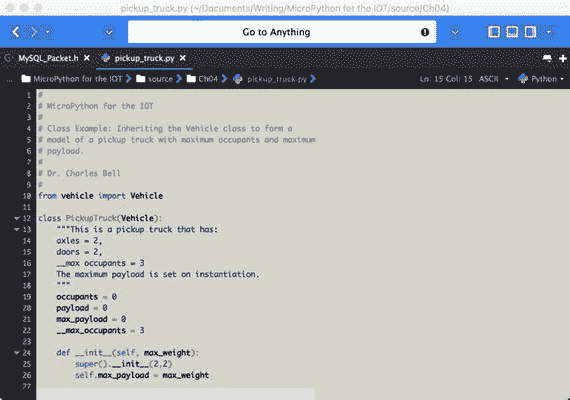

图 3-1。

Komodo Edit Example

虽然不是必需的，但强烈建议您使用包含 Python 语法突出显示的编辑器。它不仅能帮助你写代码，还能帮助你写出更正确的代码。我发现代码完成功能是一个真正的时间节省。您不必选择这里讨论的任何一种，因为除了 PyMakr 或 PyMate 之外，没有一种是为特定的主板设计的。记住，为 MicroPython 板编写 Python 与为 PC 编写 Python 脚本没有什么不同——语法是相同的。

### 需要一些组件

一些供应商，如 Adafruit 和 George Robotics Limited/micropython . org(py board 的原始制造商)提供焊接和不焊接接头的电路板。不焊接接头节省了生产成本，在某些情况下还节省了运输成本，使电路板更便宜。如果你知道如何焊接(或者知道谁知道)，你可以用不带接头的电路板来节省一点。

您可能需要不带接头的电路板的另一个原因是，如果您想将电路板安装在工程外壳或其他形式的嵌入式安装中。在这种情况下，焊接头部可能会占用更多的空间，或者使整个项目变得更大。

您还可能会遇到一些附加板、分线板或其他不与接头(或连接器)焊接的分立元件。如果您想使用这些，您可能需要自己焊接接头或连接器。例如，Adafruit ( `adafruit.com`)和 Sparkfun ( `sparkfun.com`)的大多数分线板都没有焊接接头。

### GPIO 引脚

在上一章中，我们了解了一些通用输入输出(GPIO)引脚。各种板的区别之一是 GPIO 引脚的排列方式，甚至是引脚的数量。虽然大多数板支持一系列引脚，包括模拟和数字引脚，但有些板提供的引脚比其他板少。图 [3-2](#Fig2) 显示了 WiPy 上可用的 GPIO 引脚。您可以从主板制造商或供应商处找到类似的图纸(也称为数据手册、映射或引脚排列)。

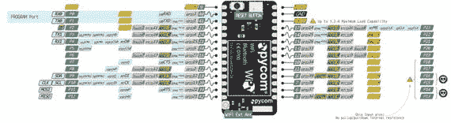

图 3-2。

WiPy GPIO Pins (courtesy of pycom.io)

如果您的项目需要几个模拟或数字引脚，您应该计划选择一个能够支持所需引脚数量的电路板。幸运的是，大多数会；然而，一些可以加载 MicroPython 的较新的主板可能不能。例如，无处不在的 ESP8266 [<sup>3</sup>](#Fn3) (一种低成本的 WiFi 芯片)的一些版本可能只支持几个引脚，这对于有许多组件的项目来说不太理想。

### 其他提示

本节包括几个使用 MicroPython 板时可能遇到的问题的提示。把这些建议当作你在实验前或实验过程中应该做的事情。让我们从基础开始。

#### 访问社区论坛

您应该做的第一件事(甚至在购买主板之前)是访问您选择的主板的社区论坛。许多供应商主持和管理一个在线消息论坛，供人们提出问题，社区中的人们提供他们的见解、答案、建议，甚至帮助那些陷入困境的人。

除了阅读这本书，访问社区论坛是绝对必要的。事实上，你应该考虑在任何时候对你的董事会有疑问或问题的时候访问论坛。你很可能会遇到一个人，他曾经遇到过同样的(或非常相似的)问题，以及他们(和其他人)对如何解决这个问题的建议。

下面列出了更流行的 MicroPython 板的论坛。如果你在这里没有看到你的公告板，下次你上网的时候谷歌一下；然后，如果你喜欢这个论坛，把它加入书签以便更快地访问。

*   Pyboard(和 MicroPython)论坛: [`https://forum.micropython.org/`](https://forum.micropython.org/)
*   Pycom (WiPy)论坛: [`https://forum.pycom.io/`](https://forum.pycom.io/)
*   电路论坛: [`https://forum.micropython.org/viewtopic.php?f=16&t=2894`](https://forum.micropython.org/viewtopic.php?f=16&t=2894)
*   通用 Python 论坛(不针对 MicroPython): [`https://www.python.org/community/`](https://www.python.org/community/)

Note

我在第 [12 章](12.html)中提供了更多与社区论坛互动的技巧。

#### 小心轻放！

您应该将 MicroPython 板视为一种非常敏感的设备，容易受到静电放电(ESD)的影响。除非您将您的主板放在箱子里，否则您应该小心处理您的主板，在通电之前，请始终将它放在不导电的表面上。ESD 可能是由许多事情引起的(回想一下你小时候在地毯上穿着运动鞋的时候)。这种放电会损坏电路板。请务必处理好您的主板，以便控制 ESD 并将其降至最低。

图 [3-3](#Fig3) 显示了供应商装运的保护箱中的 Pyboard 示例。这种蛤壳式外壳仅比主板大一点点，当它在您的工具包底部发出嘎嘎声时，可以通过卡扣关闭，以确保主板的安全。


图 3-3。

The Pyboard v1.1with Headers in its Protective Case

您也不应该在主板通电时移动它。为什么呢？MicroPython 板上焊接有元件，两侧有许多裸露的引脚。如果任何两个或两个以上的引脚接触到导电的东西，您可能会损坏电路板。

此外，请务必将您的主板存放在 ESD 安全容器中——专门用于存放电子产品的容器。应该避免使用普通、日常、廉价的塑料盒。但是，如果您没有为电子产品制作的容器，您可以使用防静电袋来存放电路板。您购买的许多主板和组件都采用这种包装。所以，不要扔掉！

您应该注意确保您的身体、工作区和项目接地，以避免静电放电(ESD)。避免这种情况的最佳方法是使用接地带，环绕在手腕上，并连接到像这些`uline.com/BL_7403/Anti-Static-Table-Mats`的防静电垫上。

最后，将 USB 电缆连接到主板时要格外小心。大多数主板都配有微型 USB 连接器，这种连接器容易损坏(比其他连接器更容易损坏)。在大多数情况下，不是电缆坏了，而是电路板上的连接器坏了。发生这种情况时，可能很难修复(或者可能无法修复)。也有可能电缆本身会停止工作，或者只有当您将电缆固定到位时才能工作。如果发生这种情况，请尝试使用新的电缆，如果这样可以解决问题，请扔掉旧的电缆。如果不能解决问题，可能是主板上的连接器有问题。幸运的是，插拔电缆时格外小心可以避免这些问题。例如，始终首先插入微型 USB 端，然后使用全尺寸 USB 端插入和拔出您的 PC。使用 micro USB 连接器的次数越少，损坏的几率就越小。

#### 电脑无法识别 SD 驱动器

当人们第一次使用带有微型 SD 卡/驱动器的主板时，最常遇到的问题之一是操作系统无法识别板载 USB 驱动器。如果您的主板带有 USB 就绪驱动器(内置或外置)，而您在文件浏览器(或 finder)中看不到它，您可以做几件事情来解决这个问题。首先，如果主板有一个可移动的 micro SD 驱动器，请确保它被正确插入并且被格式化为 FAT。如果你提供了自己的微型 SD 卡，这通常是一个问题。把它重新格式化成 FAT，应该就可以了。

另一方面，如果主板有一个可移动的 micro SD 驱动器和一个板载驱动器，请取出 micro SD 卡，然后再次尝试将主板连接到您的 PC。有时，外部 micro SD 卡优先于板载驱动器。

如果您的主板根本不显示，或者您通过 USB 连接到它有问题，有几种可能的原因。首先，确保你的 USB 线是供应商推荐的。如果你像我一样，已经积累了一个名副其实的 USB 电缆坑，很可能有一条或多条你“最喜欢”的电缆是充电电缆，而不是数据线。也就是说，电缆可以用来给设备充电，但用于传输数据的引脚(导线)缺失或未连接。先检查你的电缆。

下一种可能的情况是你的电脑没有安装正确的驱动程序。请务必查看供应商网站，了解您需要安装哪些驱动程序。有些需要特定操作系统的特殊驱动程序。例如，如果您使用 Windows 10，您将需要大多数主板的驱动程序。

另一个可能的问题是电路板需要外部电源。我在一些早期的原型板上见过这种情况，在某些情况下也在生产板上见过这种情况(但本章没有列出)。在这种情况下，您需要先打开主板电源，然后再将其连接到 PC。

#### 跳线松动或丢失

使用带有跳线(设计用于完成电路的小型塑料连接器)的电路板时，可能会出现一个或多个跳线丢失的情况。跳线用于启用或禁用某些功能。图 [3-4](#Fig4) 显示了 WiPy 扩展板上跳线的引脚排列示例。


图 3-4。

Jumpers on the WiPy Expansion Board

跳线非常小，很容易丢失或放错地方。如果您丢失了跳线并需要更换，您通常可以从您所在地区的计算机维修店获得一些跳线。如果你所在的地区没有任何电脑维修店，如果你找到一个自己组装电脑的 PC 爱好者，你应该可以从他们那里获得几个跳线。为什么呢？因为这些人通常手头都有很多。当我管理一家电脑公司时，我不能放弃这些东西。我还有几百个在某个地方。底线是你不应该买它们——我敢肯定，你身边有人有一些备用的。

如果一个或多个跳线脱落，您可以拧紧它们，使它们更难移除。要拧紧跳线，使用一对尖嘴钳，并轻轻(我提到轻轻？)压缩母插座。做那件事有一点技巧。您也可以在引脚顶部轻轻向外弯曲跳线引脚，使跳线更加贴合。当然，如果它仍然太松或者你损坏了它，你可以找到那个电脑爱好者并得到一个新的。

有些板卡，比如 WiPy 扩展板， [<sup>4</sup>](#Fn4) 有几个跳线，拆下来不影响操作。例如，如果你没有使用锂聚合物 [<sup>5</sup>](#Fn5) 电池，通过 USB 连接等。，那么如果移除一些跳线，您就可以使用未使用的跳线来代替丢失的跳线。

现在我们已经了解了开始使用 MicroPython 板的一些注意事项，让我们开始浏览可用的板，从那些已经加载并准备使用 MicroPython 的板开始。每个部分都包括对该板的简要概述，以及关于如何开始使用该板以及在哪里可以购买该板的说明。

## 支持 MicroPython 的主板

我们将探讨的第一类主板是那些安装了 MicroPython 并随时可以使用的主板。这些主板不需要安装任何软件就可以使用(尽管您可能需要定期更新固件或在 PC 上安装驱动程序)。因此，对于那些刚接触 MicroPython 和电子产品的人来说，这些主板是最好的选择。然而，这并不意味着主板不强大——它们是强大的！事实上，本书中的项目是使用这些板演示的，您会发现它们对于大多数中小型 IOT 项目来说绰绰有余。

在撰写本文时，支持 MicroPython 的板是 Pyboard 和 WiPy。两者都是不错的选择，但是正如我们将看到的，对于 IOT 项目来说，其中一个更容易使用。

### Pyboard

Pyboard MicroPython 板是第一批用于托管 MicroPython 的板之一。在某些方面，它为 MicroPython 板应该如何配置和如何操作设定了标准。它由 Damien George 创建，于 2013 年作为 Kickstarter 活动开始，旨在实现片上 Python 以在微控制器上运行。Pyboard 及其附件板由乔治机器人有限公司(`micropython.org`)生产和销售。

#### 概观

该板最显著的特点是尺寸小。该板尺寸约为 40 毫米 x 40mm 毫米，有两个分离式“耳”用于安装该板。没有耳朵，板子大约是 32 毫米乘 40 毫米。也就是说，如果你不想安装板，你可以打破耳朵，减少尺寸更大。电路板的三面都有放置接头的空间。一侧包含一个微型 USB 电缆连接器，用于连接到您的 PC(或为主板供电)以及微型 SD 驱动器。图 [3-5](#Fig5) 显示了 Pyboard v1.1 的特写视图。


图 3-5。

The Pyboard v1.1 without Headers (courtesy of adafruit.com)

注意棋盘左上角和右下角的小耳朵。这些都是穿孔的，便于拆卸。到目前为止，他们并没有碍事；因此，除非你有一个更小的，紧配合的情况下，你可以让他们重视。

你还可以在微型 USB 连接器附近的板上看到两个小按钮。一个是用户自定义按钮，您可以编程(USR ),另一个是复位按钮(RST ),用于复位电路板。主板的中心是 ARM 处理器芯片。

最后，在 micro SD 卡插槽旁边的板上有四个 led。这些是用来交流错误，通电，并可以打开或关闭你的代码！

#### 关于硬件的更多信息

现在，让我们了解更多关于硬件的知识，更具体地说，一些您可能不知道但可能方便知道的细节和规格。

当您使用插入了 micro SD 卡的主板时(并且该卡被格式化为 FAT ),主板将使用该驱动器而不是内部驱动器进行引导，并且当您将 Pyboard 连接到 PC 时，它会显示出来。但是，您将看不到内部驱动器。这是许多人困惑的根源。如果您想使用内部驱动器进行引导，您必须在 micro SD 上创建一个名为`flash`的文件夹，并在该文件夹中创建一个名为`SKIPSD`的空文件。这样做，然后断开并重新连接您的板。之后，您可以从您的脚本访问 micro SD 卡。

回想一下引导驱动器是用来保存`boot.py`和`main.py`文件的；`boot.py`文件在启动时执行，一旦开发板运行，就会调用`main.py`。默认情况下，更改这些选项以添加您的自定义程序就是您让电路板引导到您的项目中的方式。

然而，这两个驱动器都可以从 Python 中访问，不管哪一个用于引导。内部驱动器在文件夹`/flash`下，micro SD 卡(当 SKIPSD trick 发出时)在文件夹`/sd`下(分别使用`0:/`和`1:/`的旧版本板)。在 Python 代码中使用这些路径来访问正确的驱动器。

该板还支持其他引导模式，可通过 USR 按钮启动。要更改模式，请在插入(或打开)主板时按住 USR 按钮。按住按钮时，板上的 led 将按如下方式点亮。当电路板循环到您想要的模式时，释放 USR 按钮。

*   当绿色 LED 亮起时，主板正常启动。
*   当橙色 LED 亮起时，主板会在启动时跳过运行 boot.py 和 main.py 文件。
*   当绿色和橙色指示灯亮起时，主板会重置内部驱动器上的文件系统，将 boot.py 和 main.py 恢复为出厂内容。

最后一种模式是非常有用的，如果你设法砖板。更具体地说，如果您的主板变得不可用或无法正确启动，请先尝试此模式，看看它是否能解决问题。

led 的另一个用途是指示存在 Python 错误。如果红色和绿色指示灯闪烁，则表明从 main.py 调用的 Python 脚本中存在错误。如果所有指示灯都循环亮起，则表明可能存在硬件故障。尝试关闭主板电源并重置文件系统。如果那不起作用，你的板可能被损坏。

Pyboard 由几个主要组件组成。我在这里列出它们是为了让那些有兴趣了解支持哪些功能的人知道。我从微控制器和内存规格开始。

*   STM32F405RG 微控制器
*   带硬件浮点的 168 MHz Cortex M4 CPU
*   1024 千字节闪存 ROM 和 192 千字节 RAM
*   三轴加速度计(MMA7660)
*   带可选备用电池的实时时钟
*   24 个 GPIO 引脚
*   (2) 12 位数模(DAC)转换器，引脚 X5 和 X6 上提供
*   (3) 12 位模数转换器，16 个引脚，4 个带屏蔽
*   4 个发光二极管
*   1 个微型 SD 插槽
*   1 个微型 USB 接口，用于与您的电脑通信
*   1 个复位(RST)和 1 个用户(USR)开关
*   3.3V LDO 电压调节器，能够向输入电压范围为 3.6V 至 10V 的组件提供高达 300mA 的电流
*   ROM 中的 DFU 引导程序便于固件升级

如果您有兴趣了解其中一些器件的更多信息，以下是主要器件的附加数据和数据表链接。

*   单片机(STM32F405RGT6): [`http://www.st.com/en/microcontrollers/stm32f405rg.html`](http://www.st.com/en/microcontrollers/stm32f405rg.html)
*   加速度计(飞思卡尔 MMA7660): [`http://micropython.org/resources/datasheets/MMA7660FC.pdf`](http://micropython.org/resources/datasheets/MMA7660FC.pdf)
*   LDO 稳压器(微芯片 MCP1802): [`http://micropython.org/resources/datasheets/MCP1802-22053C.pdf`](http://micropython.org/resources/datasheets/MCP1802-22053C.pdf)

如前所述，Pyboard 有多种版本，包括焊接和不焊接接头的版本，以及速度稍慢、硬件功能较少的早期版本(1.0 版)。我建议您的所有项目都使用 1.1 版的开发板。

What, No Internet?

Pyboard 中可能缺少您期望找到的一个特性。没有联网功能。虽然最新的固件包括使用两个网络硬件(CC3000 和 WizNet5000)的规定，但您必须购买支持其中一个芯片组/库的模块(分线板)来将您的 Pyboard 连接到互联网(或您的本地网络)。有些人可能会发现在没有网络的情况下使用 Pyboard 对大多数项目来说是很好的，但是本书后面的项目将需要连接到网络。毕竟，这是一本 IOT 的书！因此，如果您打算构建一个 IOT 项目，您可能需要考虑一个不同的电路板，或者查看下一节中的网络示例，了解如何将 Pyboard 连接到您的网络。

如果您想使用外部电源或电池为主板供电，您必须确保电源设置为 3.6-10V。连接更高的电源会损坏电路板。较低的功率会使电路板不稳定(可能无法正常运行)。您可以将电源(正极)连接到 VIN，将接地(负极)连接到 GND。图 [3-6](#Fig6) 显示了这些引脚位于微型 USB 连接器附近的特写。


图 3-6。

Pins for connecting external power (Pyboard) Tip

在拔下驱动器插头或重置主板之前，请始终弹出驱动器。

现在，让我们从连接到我们的 PC 并运行一个简单的 Python 程序的简单演练开始，来看看 Pyboard 的运行情况。

#### Pyboard 入门

我们在第 2 章中讨论了 REPL 控制台，包括如何将主板连接到你的电脑。让我们再看一遍，这样我们就能确保理解它是如何工作的。要连接到主板，请使用 USB 转 micro USB 电缆，将一端连接到 Pyboard，另一端连接到 PC。过一会儿，您应该会看到一个名为`PYBFLASH`的驱动器被挂载(或者在 Windows 上，一个新的驱动器盘符出现在文件资源管理器树中)。

Tip

如果你使用 Windows 10，Pyboard 需要很长时间(超过 5 分钟)才能显示为 USB 驱动器，那么你需要更新你的固件。事实上，这是一个已知的问题，并已在最近的固件版本中得到解决。

然后，您可以打开 USB 驱动器，通过在驱动器上编辑文件或将文件复制到驱动器来修改文件。例如，如果您想要修改 main.py 脚本以包含您自己的代码或加载您自己的脚本文件，您可以进行更改，然后弹出驱动器并重置板。一旦你这样做了，你添加的代码或者你设置调用的脚本将会在主板启动时触发。我们将在后面的章节中看到如何做到这一点。

你也可以像我们在第 [2](02.html) 章看到的那样启动 REPL 控制台。图 [3-7](#Fig7) 显示了连接到 Pyboard 的 REPL 控制台示例。在这种情况下，代码只是打印一条语句——现在已经是老生常谈的 Hello，World！消息。

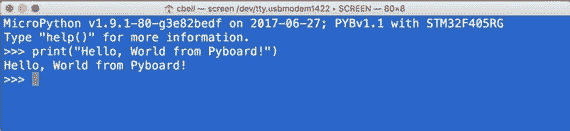

图 3-7。

The REPL Console (Pyboard)

#### 加载固件

回想一下，我们讨论过定期加载固件的必要性。这适用于所有的主板，不管它们是否准备好了 MicroPython。这是因为 MicroPython 的版本在不断完善，缺陷也在不断修复。因此，为了确保您拥有最新的更新，您应该在获得主板时至少更新一次固件，并且只在以后需要时更新，例如当您发现缺陷或向库中添加新的硬件组件时。在每块板上加载固件略有不同，但我们将从 Pyboard 开始详细介绍，然后在本章中提及其他板的不同之处。

在开始之前，您应该检查加载的固件版本。您可以使用以下 Python 语句来实现这一点。在这种情况下，代码在通过 REPL 控制台连接的 Pyboard 上运行。

```py
>>> import os
>>> os.uname()
(sysname='pyboard', nodename='pyboard', release='1.9.1', version='v1.9.1-80-g3e82bedf on 2017-06-27', machine='PYBv1.1 with STM32F405RG')

```

这里我们看到固件版本是 1.9.1，这是在撰写本文时可用的最新版本。它还显示固件加载的日期以及固件文件的名称。最后，我们还看到了板名。

您可以从 [`http://micropython.org/download/`](http://micropython.org/download/) 下载固件模块。举例来说，现在用于将 Pyboard 更新到最新版本的文件 [<sup>6</sup>](#Fn6) 被命名为`pybv10-network-20170629-v1.9.1-95-g1942f0ce.dfu (latest)`并且包含网络硬件支持。图 [3-8](#Fig8) 显示了显示文件及其描述的网站摘录。当您访问该网站时，您会发现各种主板的固件。如果你想用其他的板，一定要标记这一页，因为你需要它。

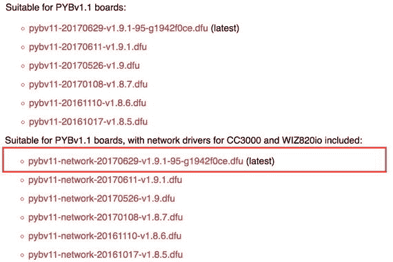

图 3-8。

Excerpt of Firmware Available for the Pyboard

注意，这些文件以文件扩展名`.dfu`命名，代表设备固件更新[<sup>7</sup>](#Fn7)——一种特殊的固件二进制格式。你应该下载最新版本的固件。一定要选择和你的板子相匹配的！例如，我选择了标题为适合 PYBv1.1 板的文件，其中包括 CC30000 和 WIZ820io 的网络驱动程序，因为我想将我的 Pyboard 与网络模块一起使用。您应该选择具有帮助节省空间(内存)所需的最小支持集的固件，但是，到目前为止，这还不是一个问题。

接下来，你将需要一个 DFU 程序员。如果使用 Windows，从 [`http://www.st.com/en/development-tools/stsw-stm32080.html`](http://www.st.com/en/development-tools/stsw-stm32080.html) 下载编程器。选择与您的系统匹配的版本(32 位或 64 位)并安装它。您可能需要首先通过电子邮件注册您的请求。

如果你用的是 macOS 或者 Linux，可以从 [`https://github.com/micropython/micropython`](https://github.com/micropython/micropython) 下载加载的纯 Python 版本的 DFU。单击克隆或下载按钮，然后下载 Zip 按钮，并将文件保存到您的 PC。这将下载所有用于 MicroPython 的工具和实用程序。下载完成后，解压文件并在 tools 文件夹中找到名为`pydfu.py`的文件。参见 [`https://github.com/micropython/micropython/wiki/Pyboard-Firmware-Update`](https://github.com/micropython/micropython/wiki/Pyboard-Firmware-Update) 了解更多关于如何在 Linux 或 macOS 上使用这个 DFU 编程器的信息。

接下来你必须做的是将 Pyboard 设置为 DFU 模式。如图 [3-9](#Fig9) 所示，在 DFU 和 3.3V 引脚之间放置一根跳线即可。3.3V 引脚标记在电路板边缘，DFU 引脚就在它旁边(未标记，但位于第二行)。在将评估板连接到 PC 之前，请执行此操作。

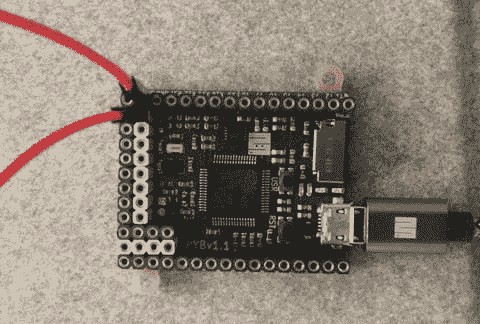

图 3-9。

DFU Mode Jumper (Pyboard) Note

首次在 DFU 模式下将主板连接到 PC 时，Windows 10 可能会安装驱动程序。如果驱动程序安装开始，请选择自动选项，并允许 Windows 搜索驱动程序。该过程完成后，您就可以加载固件了。

现在我们来看看如何使用 Windows 10 更新固件。一旦你下载了你想加载的固件并安装了 DFU 编程器，你可以启动它，然后点击“更新或验证操作”部分的“选择”按钮(见下文)，搜索你下载的文件，然后打开它。读取文件后，单击升级按钮开始更新。该过程将开始更新电路板，并显示如图 [3-10](#Fig10) 所示的完整信息。


图 3-10。

DFU Programmer (Windows 10)

该过程完成后，单击“退出”关闭 DFU 编程器，断开主板与 PC 的连接，并移除跳线。主板现在将使用最新的固件启动。

#### 与 Pyboard 联网

本节将向您展示如何使您的 Pyboard 成为支持网络的设备。我们将简要介绍这一点，因为只有拥有 Pyboard 的用户才需要将这一步作为他们设置和入门的一部分，并且只有在我们使用互联网的示例项目中才会用到。

首先，你必须购买一个网络模块。这是困难的部分，因为迄今为止支持的唯一两个芯片组/库是用于 WiFi 的 CC3000 (CC3K)和用于以太网的 WIZNET5000 (WIZNET5K)。可悲的是，找到一个 CC3K 模块可能是一个挑战，因为制造它们的零售商已经更新到更新的芯片。

幸运的是，Adafruit 制作了一个 CC3K 模块(和 Arduino shield ),可以工作。不幸的是，他们不再生产这种主板，而是用一种使用不同芯片组的更好的主板取代了它(因此不兼容)。你可以在流行的互联网拍卖网站上找到类似的主板，但大多数供应商都在亚洲，所以运输时间会稍长一些。寻找这些模块的其他地方包括 DigiKey ( `digikey.com`)、Mouser ( `mouser.com`)和 Amazon ( `amazon.com`)，但库存有限。

无论你买哪个，确保它有可用的分线针，这样你就可以把它连接到你的 Pyboard。查找标记为 MISO、MOSI、CLK/SCK、IRQ 和 VBAT_EN/VBEN 的引脚。它们应该在模块上排成一行。即使它和我将要展示给你的不完全一样，它也应该可以工作。

Caution

确保您已经加载了具有网络支持的固件。标准固件不包括网络模块。

为了证明您确实可以将 Pyboard 连接到互联网(您可能会发现一些帖子认为这是不可能的)，让我们重新利用 Adafruit 的 CC3000 Arduino shield。是的，这意味着我们可以在没有 Arduino 的情况下使用 Arduino 盾！Arduino 的许多屏蔽和模块可以与其他微处理器一起使用。您只需要知道如何将引脚连接到 Pyboard。别担心，我会告诉你具体怎么做。图 [3-11](#Fig11) 显示未安装接头的屏蔽。


图 3-11。

Adafruit CC3000 Arduino Shield (courtesy of adafruit.com)

Adafruit 是如此神奇的资源的原因之一是它们包括所有产品的数据表和操作指南。他们甚至维护停产产品的链接。在简要回顾了他们的文档后，需要将屏蔽和 Pyboard 一起使用的引脚在屏蔽上和文档中都有标注。

MicroPython 文档( [`https://docs.micropython.org/en/latest/pyboard/library/network.html`](https://docs.micropython.org/en/latest/pyboard/library/network.html) )对如何使用支持的库有很好的指导。在这种情况下，对 CC3000 部分的检查揭示了将 CC3000 模块连接到 Pyboard 所需的引脚。幸运的是，由于 CC3000 shield 与 Arduino 一起使用，因此该 shield 增加了 Arduino 接头。我们将使用这些来连接到 Pyboard。

表 [3-1](#Tab1) 显示了两块板上的正确引脚。只需使用一根公母跳线将 Pyboard 上的引脚连接到 CC3000 屏蔽上的正确引脚。将公端连接到屏蔽上的引脚(通常会插入 Arduino ),母端连接到 Pyboard 引脚。你总共需要八根跳线。注意，其他模块可能具有类似的布置。引脚的标签与表中所示的相同，但编号可能不同，或者排列在专用接头中。

表 3-1。

Mapping Pins from the Pyboard to the CC3000 Shield

<colgroup><col> <col> <col> <col></colgroup> 
| Pyboard | CC3000 屏蔽 |
| --- | --- |
| 个人识别码 | 插脚数 | 个人识别码 | 插脚数 |
| --- | --- | --- | --- |
| V+ |   | 5V |   |
| 地线 |   | 地线 |   |
| Y3 | Y3 | 伊拉克 | 数字 3 |
| Y4 | Y4 | vbat _ en | 数字 5 |
| Y5 | Y5 | WCS | 数字 10 |
| Y6 | Y6 | 血清肌酸激酶 | 数字 13 |
| Y7 | Y7 | 军事情报部门组织(Military Intelligence Service Organization) | 数字 12 |
| Y8 | Y8 | 工业博物馆 | 数字 11 |

图 [3-12](#Fig12) 显示了所有连接的连接图，图 [3-13](#Fig13) 显示了完成后连接的样子。有点乱，但是很管用。请务必将屏蔽和电路板放在不导电的工作面上。

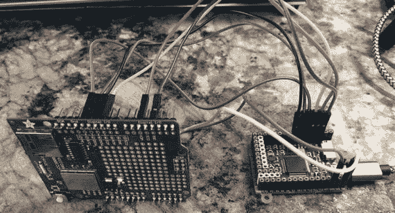

图 3-13。

Pyboard with Adafruit CC3000 Arduino Shield


图 3-12。

Connecting the CC3000 to the Pyboard Note

如果你仔细检查 CC3000 屏蔽，你会看到有一个单独的头孔，如果你不想使用 Arduino 头可以使用。

如果您有 Pyboard 和 CC3000 shield，请继续进行连接。首先要确保你的 Pyboard 没有连接到你的电脑上。完成所有连接后，您就可以将 Pyboard 连接到 PC 了。

现在，让我们编写一些代码来测试模块，并将我们的 Pyboard 连接到互联网。由于这是一个 WiFi 盾，我们需要知道您的 WiFi 接入点(路由器)的名称和密码。我们需要使用的代码如清单 [3-1](#Par130) 所示。

```py
# connect/ show IP config a specific network interface
import network
import pyb

def test_connect():
    nic = network.CC3K(pyb.SPI(2), pyb.Pin.board.Y5, pyb.Pin.board.Y4, pyb.Pin.board.Y3)
    nic.connect('YOUR_ROUTER_HERE', 'YOUR_ROUTER_PASSWORD_HERE')
    while not nic.isconnected():
        pyb.delay(50)
    print(nic.ifconfig())

    # now use usocket as usual
    import usocket as socket
    addr = socket.getaddrinfo('micropython.org', 80)[0][-1]
    s = socket.socket()
    s.connect(addr)
    s.send(b'GET / HTTP/1.1\r\nHost: micropython.org\r\n\r\n')
    data = s.recv(1000)
    print(data)
    s.close()

Listing 3-1.Using the CC3000 Module

on a Pyboard

```

花点时间通读代码。该代码旨在连接到`micropython.org`网站并返回标题数据。请注意，除了网络代码之外，还有打印网络信息和从网站返回的数据的语句。另外，注意代码是作为名为`test_connect()`的函数实现的。我们将从 REPL 控制台调用该函数。别担心，这很容易。

继续编辑代码以包含您的路由器和密码，然后以名称`CC3K.py`将其保存到您的 Pyboard USB 驱动器。接下来，用 REPL 控制台连接到您的 Pyboard，然后发出以下命令。这将加载模块，然后运行代码并测试连接。

```py
>>> from CC3K import test_connect
>>> test_connect()

```

连接可能需要一些时间来执行，但是当它完成时，您应该会看到一行打印出连接信息，在这之后，您会注意到连接到网站所返回的数据。如果您看到连接错误，请确保验证您的路由器名称和密码。

```py
('10.0.1.123', '255.255.255.0', '10.0.1.1', '10.0.1.1', '10.0.1.1', '08:00:28:59:23:cb', 'MY_ROUTER')
b'HTTP/1.1 200 OK\r\nServer: nginx/1.8.1\r\nDate: Thu, 29 Jun 2017 02:21:50 GMT\r\nContent-Type: text/html; charset=utf-8\r\nTransfer-Encoding: chunked\r\nConnection: keep-alive\r\nVary: Accept-Encoding\r\nX-Frame-Options: SAMEORIGIN\r\n\r\n3dc3\r\n<!DOCTYPE html>\n\n\n\n<html lang="en">\n  <head>\n    <meta charset="utf-8">\n    <meta http-equiv="X-UA-Compatible" content="IE=edge">\n    <meta name="viewport" content="width=device-width, initial-scale=1">\n    <!-- The above 3 meta tags *must* come first in the head -->\n\n    <link rel="icon" href="/static/img/favicon.ico">\n\n    <title>MicroPython - Python for microcontrollers</title>\n\n    <link href="/static/bootstrap-3.3.7-dist/css/bootstrap.min.css" rel="stylesheet">\n\n    <link href="/static/css/sty'

```

如果这看起来工作量很大，不要担心，因为这和将你的 Pyboard 连接到互联网一样复杂。现在不用太担心理解所有的代码。在接下来的几章中，我们将更深入地探索 Python 和 MicroPython 库。

现在，让我们看看您可以在哪里购买我们自己的 Pyboard。

#### 去哪里买

你可以在网上找到 micropython.org 的 py board([`https://store.micropython.org/store/#/store`](https://store.micropython.org/store/#/store))。主板从欧盟发货，但运费合理。如果你在北美，你也可以从 Adafruit ( [`https://www.adafruit.com/?q=pyboard`](https://www.adafruit.com/?q=pyboard) `&`)购买板子和相关配件。根据货币兑换和运输(您希望主板交付的速度)，您可能会发现从欧盟订购主板会稍微便宜一些。你也可以在各种拍卖网站和亚马逊等零售网站上找到这个公告板。你可以为你的 Pyboard 支付 35-40 美元。

您可以购买安装或不安装接头的 Pyboard。旧版本的电路板可以以同样的方式购买，有一个版本没有加速度计，这使得它稍微便宜一些。不过我推荐买最新的，1.1 版的板。

至于网络模块，最好的办法是等到更多的硬件支持被添加到 MicroPython 库(并上传固件)或者找到一个旧的 Adafruit CC3000 模块。查看网上拍卖网站，寻找仍在出售这些物品的卖家或有二手物品出售的人。 [<sup>8</sup>](#Fn8)

### WiPy

WiPy MicroPython 板是第一批支持 MicroPython 的板中的另一个。顾名思义，WiPy 内置了充当主机的 WiFi 网络(想想路由器或接入点)。事实上，你使用 WiPy 的默认方式是通过 WiFi。因此，您不必使用另一个模块来使您的项目互联网就绪。这个特性使得 WiPy 成为本书中项目的更好选择。作为奖励，该板还具有蓝牙，使其更容易适应您的项目。

#### 概观

该板最显著的特点是尺寸小。该板尺寸约为 40 毫米 x 40mm 毫米，有两个。WiPy 是一个比一包口香糖大不了多少的小模块，尺寸仅为 42 毫米 x 20mm 毫米，厚度仅为 3.5 毫米(不含头部)。

该板有或没有接头(获得一个有接头或自己安装)。您可以在试验板上使用该板，也可以购买像 dock 一样工作的特殊板。Pycom 将其称为扩展板，并提供了一个微型 SD 驱动器，微型 USB 连接器，led，复制所有的插头引脚，并包括一个电池连接器。扩展板使 WiPy 的使用变得相当容易，正如我们将看到的，使用它只有一个技巧。图 [3-14](#Fig14) 显示了 Pycom 的 WiPy 板。

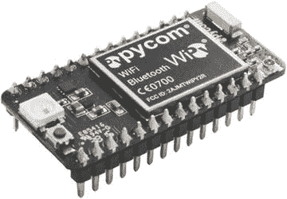

图 3-14。

Pycom WiPy (courtesy of pycom.io)

扩展板允许您通过 USB 连接到 WiPy，并使用 LIPO 电池或通过 USB 为板供电。我喜欢扩展板，因为它很方便。此外，它在每个角落都有孔，可以将其安装在竖板上，以便更容易地接触到引脚或将其永久安装在机箱或工具架上。它甚至有一个用户可访问的(可编程)按钮和 LED。图 [3-15](#Fig15) 显示了 Pycom 扩展板。

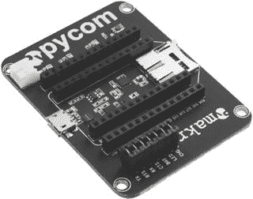

图 3-15。

Pycom Expansion Board (courtesy of pycom.io) Tip

WiPy 的当前版本是 2.0 版。如果您购买了 WiPy 并想要扩展板，请确保您还购买了 2.0 版本的扩展板。

当然，扩展板要大得多，尺寸约为 50 毫米 x 65mm 毫米，安装的 WiPy 厚度约为 14 毫米。仍然很小，但没有 WiPy 本身小。

微型 SD 驱动器和微型 USB 连接器是您在使用 WiPy 时可能需要的功能。扩展板的另一个特点是，LIPO 电池连接器也是一个充电器，因此当您的板插入 USB 电源时，它可以为 LIPO 电池充电。

#### 关于硬件的更多信息

现在，让我们了解更多关于硬件的知识，更具体地说，一些您可能不知道但可能方便知道的细节和规格。

首先，扩展板上的 micro SD 卡(WiPy 没有 SD 驱动器)的工作方式与 Pyboard 不同。WiPy 无法从 micro SD 驱动器启动，但仍然可以存储您的文件并从您的程序中访问它们。我们将在下一节看到更多关于如何使用 micro SD 驱动器的内容。

接下来我们要讨论的是引导模式。您可以像 Pyboard 一样更改引导模式，这在出现问题时很有帮助，但与 Pyboard 不同的是，引导模式与配置(固件)更改一起工作，而不是与板的引导方式一起工作。更具体地说，您可以将开发板设置为安全引导，这将跳过`boot.py`和`main.py`脚本。安全引导模式包括以下几种。

*   使用最新固件安全启动
*   使用以前的用户更新安全启动
*   带出厂设置的安全启动

要激活和选择保存引导模式，请在 P12 引脚(GPIO20)和 3.3V 之间放置一根跳线。这将有效地“上拉”引脚，以便固件可以检测到选择。握住主板，使 USB 连接器位于顶部时，P12 引脚是左侧最后一个引脚，3.3V 引脚是右侧第三个引脚。图 [3-16](#Fig16) 显示了 WiPy 扩展板上正确安装的跳线。

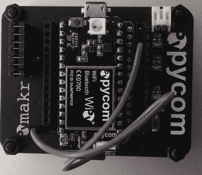

图 3-16。

Jumper Installed for Safe Boot Selection (WiPy Expansion Board)

当您打开主板电源时，LED 将变为橙色并开始缓慢闪烁。如果您在 3 秒钟后将跳线留在原位，LED 将开始快速闪烁，主板将使用最新的固件启动。如果您将跳线留在原位超过 3 秒钟，主板将使用之前的用户更新选择启动。最后，如果您将跳线留在原位 3 秒钟以上，LED 将会更快地闪烁，表示主板将会以出厂设置启动。在此过程中的任何时候移除跳线，以选择所需的安全启动模式。

WiPy 板支持 WiFi 和蓝牙通信机制，是 IOT 项目的绝佳选择。它采用 Espressif ESP32 芯片组和双处理器。其他功能包括以下内容。

*   强大的 CPU、BLE 和最新的 WiFi 无线电
*   1 公里 WiFi 范围
*   适合标准试验板(带接头)
*   超低功耗:与其他连接的微控制器相比微不足道
*   哈希/加密:SHA、MD5、DES、AES
*   无线局域网（wireless fidelity 的缩写）
    *   802.11b/g/n 16mbps
    *   安全性:SSL/TLS 支持和 WPA 企业安全性
*   蓝牙:低能耗和经典
*   RTC:以 32KHz 运行
*   电源:3.3V 至 5.5V，3V3 输出，能够提供高达 500mA 的电流
*   记忆
    *   RAM: 512KB
    *   外部闪存 4MB
    *   硬件浮点加速
*   Python 多线程

有趣的是，Pycom 还制造了其他几种 MicroPython 板，您可以用它们来进行更高级的项目。每块主板都支持不同的通信机制(WiFi、无线电、蜂窝和蓝牙)和嵌入式解决方案的高级功能。它们都具有与 WiPy 相同的外形。其中包括以下电路板。有关更多信息，请参见产品描述页面。

*   SiPy:支持 Sigfox、WiFi、BLE ( [`https://www.pycom.io/product/sipy/`](https://www.pycom.io/product/sipy/) )
*   LoPy:支持 LoRa、WiFi 和 BLE ( [`https://www.pycom.io/product/lopy/`](https://www.pycom.io/product/lopy/) )
*   GPy:支持 WiFi、BLE 和蜂窝 LTE-CAT M1/NB1 ( [`https://www.pycom.io/product/gpy/`](https://www.pycom.io/product/gpy/) )
*   FiPy: Sigfox、LoRa、WiFi、BLE 和 cellular LTE-CAT M1/NB1([`https://www.pycom.io/product/fipy/`](https://www.pycom.io/product/fipy/))

最棒的是，Pycom 扩展板可以与这些板一起工作。显然，Pycom 的业务是向 IOT 世界提供一系列强大的微处理器——全部运行 MicroPython！

如果您想使用外部电源或电池为主板供电，您必须确保电源设置为 3.3-5V。连接更高的电源会损坏电路板。较低的功率会使电路板不稳定(程序可能会失败)。您可以将电源(正极)连接到 VIN，将接地(负极)连接到 GND。图 [3-17](#Fig17) 显示了这些引脚位于大 LED 附近的特写。


图 3-17。

Pins for connecting external power (WiPy - courtesy of pycom.io)

现在，让我们来看看 WiPy 的运行情况，从连接到我们的 PC 并运行一个简单的 Python 程序开始。

#### WiPy 入门

让我们再次从基础开始——REPL 控制台。由于 WiPy 是一种 WiFi 设备，因此最简单的连接方式是通过 WiFi。如果您使用的是扩展板，您只需要用连接到 PC 的 USB 电缆或 USB 电源给板通电。如果您使用不带扩展板的 WiPy，您可以如上所示给板通电。

WiPy 通电后，它将设置默认为 192.168.4.XXX 的 WiFi 网络，WiPy 的 IP 地址为 192.168.4.1。此过程可能需要几分钟，在此期间，WiPy 上的 LED 将熄灭。当它开始闪烁蓝色时，您的 WiPy 网络已准备好连接。

要通过 WiFi 连接到主板，您必须将 PC 连接到 WiPy WiFi 网络。网络 SSID 应该像`wipy-wlan-b454`。密码是 [`www.pycom.io`](http://www.pycom.io) 。按照操作系统的正常程序连接到网络。如果您的电脑仅使用 WiFi，您将无法同时访问互联网，但在试用主板时，您不需要这样做。

连接到 WiPy WiFi 网络后，您可以使用 telnet 连接到 REPL 控制台，如下所示。

```py
$ telnet 192.168.4.1

```

请注意，在 REPL 控制台出现之前，连接可能需要一些时间。这很正常。一旦建立连接，您将被要求输入用户名和密码。使用`micro`作为用户，使用`python`作为密码。一旦你输入了密码，你应该会看到控制台并且可以和 WiPy 进行交互，如图 [3-18](#Fig18) 所示。


图 3-18。

The REPL Console (WiPy)

如果使用扩展板，您还可以通过 USB 连接到 WiPy。但是，您必须首先在 WiPy 上复制 UART 通信。这是一个常见的疏忽，有些人抱怨他们的 WiPy 不能通过 USB 连接。他们没有做到的是(除了阅读在线文档之外)在通过网络连接的 WiPy 上运行下面的代码。这个代码复制了扩展板上的 UART，这样你就可以通过 USB 连接了。但是，如果您计划通过网络使用 WiPy，则不需要这样做。

```py
from machine import UART
import os
uart = UART(0, 115200)
os.dupterm(uart)

```

Note

较新的 WiPy 板应该已经有这个代码。

如果您的 WiPy 在`boot.py`文件中没有这个代码，您应该考虑添加它。

#### 连接到您的 WiFi 网络

如果您想将 WiPy 连接到 WiFi 网络，您需要对 boot.py 脚本进行一些小的更改。最简单的方法是从 WiPy 中复制它，修改它，然后将新版本复制到 WiPy 中。最好的方法是使用文件传输协议(ftp)。大多数操作系统都有 ftp 客户端，但是如果你的系统没有，你可以找到几个下载选项。使用用户`micro`和`password` python 进行连接。清单 [3-2](#Par193) 展示了如何连接到 WiPy 并将`boot.py`文件复制到你的 PC 上。

```py
$ mkdir wipy_files
$ cd wipy_files/
$ ftp 192.168.4.1
Connected to 192.168.4.1.
220 Micropython FTP Server
Name (192.168.4.1:cbell): micro
Password:
Remote system type is UNIX.
Using binary mode to transfer files.
ftp> cd flash
ftp> get boot.py
local: boot.py remote: boot.py
227 (192,168,4,1,7,232)
   108        6.33 KiB/s
108 bytes received in 00:00 (6.23 KiB/s)
ftp> get main.py
local: main.py remote: main.py
227 (192,168,4,1,7,232)
    34        2.53 KiB/s
34 bytes received in 00:00 (2.47 KiB/s)
ftp> quit
MacBook-Pro:wipy_files cbell$ ls
boot.py  main.py
Listing 3-2.Copying Files From the WiPy

```

注意，我在本地 PC 上创建了一个目录，然后用命令 ftp 192.168.4.1 连接到 WiPy。然后，我切换到闪存目录，用 get 命令复制文件。一旦我复制了文件，我就退出 ftp 应用，现在文件就在我的本地机器上了。

Tip

备份您的原始 WiPy 文件，以便在需要时可以恢复到出厂设置。

现在我们可以修改 boot.py 文件来连接到我们的本地网络。我们需要做的是使用网络模块中的 WLAN 类来配置它，以扫描网络并通过名称(SSID)和密码连接到您的 WiFi 网络。清单 [3-3](#Par198) 显示了您需要添加到您的`boot.py`文件中的代码(新行以粗体显示)。在将代码保存到 WiPy(以粗体显示)之前，请确保在代码中替换您的 SSID 和密码。

Caution

我建议等到您准备好运行您的 IOT 项目时再对您的`boot.py`文件进行这种更改。继续在默认模式下使用 WiPy，直到你完善了你的项目。

```py
# boot.py -- run on boot-up
from machine import UART

from network import WLAN

import os
uart = UART(0, 115200)
os.dupterm(uart)

wlan = WLAN(mode=WLAN.STA)

wlan.scan()

wlan.connect(ssid='Your Network SSID', auth=(WLAN.WPA2, 'Your Network Password'))

while not wlan.isconnected():

    pass

print(wlan.ifconfig()) # prints out local IP

Listing 3-3.Enabling WiFi Connection on Boot (WiPy)

```

注意复制 UART 的代码也包括在内。另外，请注意末尾的打印。在将文件保存到 WiPy 之前，您应该使用 USB 上的 REPL 控制台测试代码，并粘贴它以确保它能够工作。我们必须使用 USB，因为 WiFi 会在执行过程中重置。下面显示了从 REPL 控制台运行代码的结果。

```py
>>> from network import WLAN
>>> wlan = WLAN(mode=WLAN.STA)
>>> wlan.scan()
[(ssid='SSIDHERE1', bssid=b' \xc9\xd0\x18W\x11', sec=3, channel=1, rssi=-70), (ssid='SSIDHERE2', bssid=b'\x88\x1f\xa16X\x1c', sec=3, channel=6, rssi=-78), (ssid='SSIDHERE3', bssid=b'\xb8\x8d\x12bX\xd3', sec=3, channel=1, rssi=-90)]
>>> wlan.connect(ssid="SSIDHERE1", auth=(WLAN.WPA2, "SSIDPASSWORD"))
>>> while not wlan.isconnected():
...     pass
>>> print(wlan.ifconfig())
('10.0.1.128', '255.255.255.0', '10.0.1.1', '10.0.1.1')

```

注意，返回的 IP 地址(print 语句中的第一个)是 10.0.1.128。现在，您可以使用 telnet 连接到您的 WiPy，如下所示。

```py
$ telnet 10.0.1.128
Trying 10.0.1.128...
Connected to 10.0.1.128.
Escape character is '^]'.
MicroPython v1.8.6-689-g095792e0 on 2017-06-27; WiPy with ESP32
Login as: micro
Password:
Login succeeded!
Type "help()" for more information.

```

一旦您对它的工作感到满意(您有正确的 SSID 和密码)，您就可以进行更改，并将文件复制到您的 WiPy 中，如清单 [3-4](#Par204) 所示。

```py
$ ftp 192.168.4.1
Connected to 192.168.4.1.
220 Micropython FTP Server
Name (192.168.4.1:cbell): micro
Password:
Remote system type is UNIX.
Using binary mode to transfer files.
ftp> cd flash
ftp> put boot.py
local: boot.py remote: boot.py
227 (192,168,4,1,7,232)
100% |***********************************|   336     1.84 MiB/s   00:00 ETA
336 bytes sent in 00:00 (0.86 KiB/s)
ftp> quit
Listing 3-4.Copying Files To the WiPy

```

现在你可以重启你的 WiPy，等待蓝色 LED 闪烁；那你应该能在你的 WiFi 网络上看到。酷吧。

#### 使用 SD 驱动器

与 Pyboard 一样，WiPy 在与扩展板配合使用时，也有一个微型 SD 驱动器。您可以使用 SD 卡来存储数据、脚本等。然而，与 Pyboard 不同的是，SD 驱动器在主板启动时并不使用(您不能从它启动)，当通过 USB 电缆连接到您的 PC 时也不可安装。

您的电脑上既没有安装内置驱动器，也没有安装 SD 卡(如果连接到扩展卡，并且插入了一张 FAT 格式的卡)。您必须使用文件传输协议(FTP)应用来访问您的文件，就像我们在上一节中看到的那样。但是，您可以通过 REPL 控制台安装 SD 卡。如果您总是想要访问 SD 驱动器，可以将此代码添加到闪存驱动器上的 boot.py 文件中。

我们需要做的是运行一些 MicroPython 代码来启用 SD 卡并挂载它。以下显示了如何安装 SD 卡。

```py
from machine import SD
try:
    sd = SD()
    os.mount(sd, '/sd')
    print('Card mounted at /sd')
except:
    sd = None
   print('ERROR: Card not mounted. ')

```

现在，当您访问您的文件时，您会看到 SD 卡。

```py
$ ftp 192.168.4.1
Connected to 192.168.4.1.
Micropython FTP Server
Name (192.168.4.1:cbell): micro
Password:
Remote system type is UNIX.
Using binary mode to transfer files.
ftp> ls
drw-rw-r--   1 root  root         0 Jan  1  1985 flash
drw-rw-r--   1 root  root         0 Jan  1  1985 sd

```

#### 加载固件

在 WiPy 上加载固件比在 Pyboard 上加载要简单一些。Pycom 为 Windows、macOS 和 Linux 提供了非常易于使用的固件升级工具，帮助您逐步完成自动选择最新版本的过程。你可以从 [`https://docs.pycom.io/chapter/gettingstarted/installation/firmwaretool.html`](https://docs.pycom.io/chapter/gettingstarted/installation/firmwaretool.html) 下载。固件升级过程最好使用扩展板来完成。

Tip

如果你打算用 WiPy，一定要买扩展板。这是非常值得的。

您只需为您的平台下载升级工具，安装它，然后运行应用。例如，在 macOS 上，你可以点击链接，下载工具，打开存档，并安装它。

像 Pyboard 一样，您也必须跳线其中一个引脚。在这种情况下，我们将通过将跳线连接到 GND 来拉低引脚 G23。握住主板，使 USB 连接器位于顶部时，G23 引脚是左上第四个引脚，GND 引脚是右上第二个引脚。图 [3-19](#Fig19) 显示了 WiPy 扩展板上正确安装的跳线。

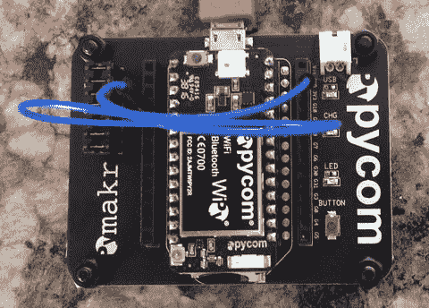

图 3-19。

Jumper Installed for Firmware Upgrade Tool (WiPy Expansion Board)

现在，让我们简单看看 Pycom 固件升级工具是如何在 macOS 上运行的。该对话框有四个主要面板:欢迎、设置、通信和结果。您可以单击“继续”按钮前进到每个面板。在设置面板上，会提醒您需要进行的连接以及如何设置跳线。在通信面板上，选择 WiPy 连接的通信(USB)端口。升级完成后，结果面板会告诉您何时可以断开板的连接。图 [3-20](#Fig20) 按顺序显示对话框，从左上顺时针方向。


图 3-20。

Upgrading the Firmware (WiPy)

#### 特殊应用

还有一点是 WiPy(和所有 Pycom 板)所独有的。Pycom 还为一些流行的编辑器提供了一个特殊的编辑器插件，允许你在 WiPy 上连接和处理你的文件。该插件名为 PyMakr，目前可用于 Atom 编辑器(但很快将可用于其他编辑器)。Pycom 还为您的移动设备提供了一个名为 PyMate 的应用，允许您在移动设备上与 WiPy 进行交互。

PyMakr 插件是 WiPy 体验的一个很好的补充。该插件是 Pycom 最初发布的原始 PyMakr 编辑器的替代品，但他们意识到开发一个新的编辑器不如开发一个允许用户使用他们现有的喜爱的编辑器的插件有效率。

该插件允许您在编辑器中打开 REPL 控制台，移动(同步)文件，打开 Python 脚本并运行它们，配置控制台以连接到其他网络上的 WiPy(设置)，并获取有关 WiPy 的信息，如固件版本、SSID 等。图 3-21 显示了一个在 Atom 编辑器中运行的插件的例子。


图 3-21。

PyMakr Plugin (Atom)

如果你喜欢这里的早期版本的例子，你可以访问下面的 URL 并查看其他编辑器的未来版本: [`https://docs.pycom.io/chapter/gettingstarted/installation/pymakr.html`](https://docs.pycom.io/chapter/gettingstarted/installation/pymakr.html) 。

用于移动设备的 PyMate 应用还允许您与您的 WiPy 进行交互，类似于使用 WiPy 的 PyMakr 插件，但它可以提供一些小部件，您可以使用这些小部件从您的 WiPy 中读取数据并显示数据。小部件可用于在移动设备上显示脚本中的数据。小部件包括线形图和条形图、控制 led 的按钮等等。

PyMate 的设置需要从苹果或谷歌应用商店下载，并在您的移动设备上进行配置。它还需要向 Pycom 注册应用。设置 WiPy 需要首先连接到您的 WiFi(或蜂窝)网络以下载正确的文件，然后选择您的设备，最后连接到 WiPy WiFi 以上传文件。该过程会修改`boot.py`文件，所以一定要先备份该文件。如果您遇到问题或者无法再访问您的 WiPy，您可以引导到一个安全引导模式，并将原始 boot.py 文件复制到 WiPy(或者编辑 PyMate 为您创建的文件)。一旦在 PyMate 中设置好设备，就可以连接到它并执行脚本，配置想要与之交互的小部件。

PyMate 应用目前非常新，关于如何使用它的文档非常少。出于这个原因，您可能想等到完成本书中的项目后再使用 PyMate 应用。这主要是由于对`boot.py`文件的修改，但也因为您必须首先学习如何使用 MicroPython 访问硬件，这样您才能使用小部件。图 [3-22](#Fig22) 显示了 PyMate 应用。


图 3-22。

PyMate Application (courtesy of pycom.io)

如果您已经决定购买 WiPy(和扩展板)，我鼓励您查看这些应用。

Deep Sleep Issue Resolved

Pycom 最近宣布了他们的主板关于深度睡眠模式的一个小问题，深度睡眠模式是一种您可以通过编程将主板置于低功耗模式并稍后唤醒的状态。使用深度睡眠模式可以让主板省电，对于使用太阳能或电池供电的项目尤其方便。该问题被发现是一个硬件问题，Pycom 正在构建一个特殊的附加板(称为 shield ),您可以使用它来纠正旧主板的深度睡眠问题。请访问 pycom.io 了解深度睡眠盾的最新信息。本书中的项目不需要深度睡眠模式，但是你自己的 IOT 项目可能需要。

#### 去哪里买

您可以直接从 Pycom ( [`https://www.pycom.io/webshop/`](https://www.pycom.io/webshop/) )购买 WiPy 和其他板。Adafruit 也有主板，但可能没有所有最新的配件( [`https://www.adafruit.com/?q=pycom&`](https://www.adafruit.com/?q=pycom&) )。Pycom 还有一个便利的零售商链接，你可以用它来找到离你更近的经销商( [`https://www.pycom.io/where-to-buy/`](https://www.pycom.io/where-to-buy/) )。WiPy 的价格约为 25 美元，扩展板约为 20 美元。你应该考虑买一块扩展板，让你的 WiPy 工作起来更轻松。

您可以购买带或不带接头的电路板。为了在本书中使用，最好安装标题。这允许您将电路板插入试验板。

## 兼容 MicroPython 的主板

下一组要探索的硬件是那些没有配备 MicroPython 的主板，但可以加载 MicroPython 固件或使用特殊软件执行 MicroPython。

这个类别的板需要一些努力来配置，可能不适合初学者(除了 BBC micro:bit)。它们也可能不支持相同的硬件功能，如 GPIO 引脚，具有 MicroPython(目前)不支持的附加硬件，或者在某种情况下可能需要 MicroPython 的特殊变体才能正常工作。因此，我不会花太多时间来描述这些板或它们的硬件。相反，我将简要概述这些板，然后描述如何开始，包括加载 MicroPython 所需的过程。如果您决定使用这些板中的一种，请查看供应商的网站，了解有关使用 MicroPython 板的最新信息。

这里涉及的板是广受欢迎的 BBC micro:bit 板，它在学校的使用趋势越来越明显，来自 Adafruit 的最新电路板称为 Circuit Playground Express，以及 Adafruit Feather Huzzah。这些板是按照让 MicroPython 在板上工作所需的复杂程度排列的。

### BBC 微:比特

BBC micro:bit 板是专门设计的，非常容易使用。事实上，它旨在帮助教孩子更多关于硬件和软件的知识。在这一点上，BBC micro:bit 是一个巨大的成功。这一成功的部分原因在于该板的易用性——它的外形尺寸只有大约 52 毫米 x 42mm 毫米，两侧都有元件。

一侧是可编程 led 阵列和两个按钮。另一侧是包括处理器、微型 USB 连接器、复位按钮和电池连接器在内的组件。该板的 GPIO 接头沿底部边缘排列，也是双面的。一组大孔引脚(称为鳄鱼引脚)均匀分布，允许接地、电源(3V)和(3) GPIO 引脚。这使得使用带有边缘连接器的板变得简单。图 [3-23](#Fig23) 显示了 BBC micro:bit 板的正面和背面。


图 3-23。

The BBC micro:bit Board (front and back)

该板成功的另一个原因是为支持它而创建的软件。开发人员已经开发了一个易于使用的软件来与电路板一起工作。由于该板旨在像类 C 语言中的 Arduino 编码一样使用，可用的软件超出了本书的范围，但您可以在 [`http://microbit.org/`](http://microbit.org/) 了解更多信息。然而，我们将很快看到一个特殊的应用，它使我们能够在 BBC micro:bit 上创建、编辑和运行 MicroPython。酷。

BBC micro:bit 没有联网功能，但有蓝牙，可以用来连接另一台设备，将数据转发到互联网上。因此，它可以用于 IOT 项目，但不像带有 WiFi 模块的 WiPy 或 Pyboard 那么容易，可能需要一个中间节点，如 PC 或小型计算机，如 Raspberry Pi 甚至 Arduino。

以下列出了 BBC micro:bit 板的一些硬件特性的概述。当主板通过 USB 电缆连接到 PC 时，您也可以访问板载 USB 驱动器。

*   32 位 ARM Cortex 处理器
*   16K 帧
*   用于检测方向的圆规
*   用于检测运动变化(速度)的加速度计
*   低能耗蓝牙(BLE)
*   (2)可编程按钮
*   可编程 led 的 5x5 阵列
*   (3)鳄鱼数字/模拟引脚
*   边缘连接器上的 20 个 GPIO 引脚
*   电池连接器

现在我们已经对硬件有了一个简单的了解，让我们看看如何将开发板与 MicroPython 一起使用。

#### 使用 MicroPython 启动并运行

BBC micro:bit 板是与 MicroPython 一起使用的最简单的替代板。这要归功于两个软件应用——一个名为 Mu 的桌面应用，一个名为 uFlash 的命令行工具。Mu 是一个完整的编辑器，你可以在你的 PC 上使用，当通过 USB 电缆连接到你的 BBC micro:bit 时，可以保存和执行脚本。uFlash 工具可用于手动将 Python 脚本传输到电路板。这两个选项都可以在 Windows、macOS 和 Linux 上使用。图 3-24 显示了一个使用 Mu 编写一个简短的 MicroPython 脚本来使用 led 滚动消息的例子。


图 3-24。

The Mu Editor for MicroPython on the BBC micro:bit

与我们必须首先安装固件才能使用 MicroPython 的其他主板不同，BBC micro:bit 可以使用这些工具之一来运行 MicroPython 脚本。例如，我们可以使用 Mu 编写我们的 MicroPython 脚本，然后用该脚本的编译版本(称为十六进制文件)来“刷新”BBC micro:bit 板。是的，这意味着你可以写你的脚本，编译它，并直接闪存(加载十六进制文件)到主板上！我们只需在编辑器中编写代码，然后点击 Flash 将其加载到板上。最棒的是，该板被编程为每次启动时总是运行脚本。因此，这意味着我们可以直接将自己的代码加载到电路板上，而无需额外的工作。酷。

您仍然可以通过单击 REPL 按钮，通过管理部门应用使用 REPL 控制台访问电路板。图 [3-25](#Fig25) 显示了在 Windows 10 上运行于 Mu 的 BBC micro:bit 的 REPL 控制台。


图 3-25。

REPL Console via Mu on Windows 10 (BBC micro:bit) Tip

你可以在 BBC micro:bit at [`https://microbit-micropython.readthedocs.io/en/latest/`](https://microbit-micropython.readthedocs.io/en/latest/) 上读到关于使用 MicroPython 的最新消息。

#### 去哪里买

你可以从一些零售商那里购买 BBC micro:bit 以及一些配件，包括 Adafruit ( [`https://www.adafruit.com/?q=micro%3Abit&`](https://www.adafruit.com/?q=micro%3Abit&) )、Sparkfun ( [`https://www.sparkfun.com/categories/284`](https://www.sparkfun.com/categories/284) )、Pi Hut ( [`https://thepihut.com/collections/micro-bit-store`](https://thepihut.com/collections/micro-bit-store) )和 Kitronik ( [`https://www.kitronik.co.uk/microbit.html`](https://www.kitronik.co.uk/microbit.html) )。你也可以在特别的“买一送一”促销活动中从开发商那里购买主板，该活动在 [`https://give.microbit.org/`](https://give.microbit.org/) 向世界各地的学校免费赠送 BBC micro:bit 主板。该板的成本约为 25 美元。

如果您计划将该板用于 IOT 项目或本书中的项目，我建议您也购买一个 edge 连接器分线板，如 Sparkfun ( [`https://www.sparkfun.com/products/13989`](https://www.sparkfun.com/products/13989) )的分线板。

### Circuit Playground Express(开发者版)

下一个最容易使用的替代板是 Adafruit 的 Circuit Playground Express 板。实际上，Circuit Playground Express(开发者版)是一个奇怪的替代板。它的模式是在其他几个 Adafruit 可穿戴板的基础上设计的，这样它就可以融入到衣服中。 [<sup>9</sup>](#Fn9) 因此，它是圆形的，直径约 50 毫米。

Note

当前的主板附加了开发人员版的名称，因为它仍处于早期版本。我怀疑将来会有更完整的生产形式的板。

电路板外侧有 10 个带大孔的引脚(称为鳄鱼垫)，可以与鳄鱼夹配合使用，也可以用导线缝合。Adafruit 还向男性跳线出售短吻鳄皮，你可能会发现这是将该板与面包板配合使用所必需的。参见 [`https://www.adafruit.com/product/3255`](https://www.adafruit.com/product/3255) 处的小鳄鱼夹到公跳线束。另一个有趣的功能是一组 10 个 RGB 新像素，这是一种明亮的 led，你可以通过代码改变颜色。该板还装有传感器，是 IOT 项目实验的一个很好的选择。图 [3-26](#Fig26) 为赛车场快速板。


图 3-26。

Circuit Playground Express, Developer Edition (courtesy of adafruit.com)

下面列出了 Circuit Playground Express 板的一些硬件功能的概述。当主板通过 USB 电缆连接到 PC 时，您也可以访问板载 USB 驱动器。

*   ATSAMD21 ARM Cortex M0 处理器，运行频率为 3.3V 和 48MHz
*   2mb SPI 闪存，主要用于 CircuitPython 存储代码和库
*   用于编程和调试的微型 USB 端口。USB 端口可以充当串行端口、键盘、鼠标、操纵杆或 MIDI
*   10 倍迷你 RGB 新像素
*   运动传感器
*   温度传感器(热敏电阻)
*   光传感器(光电晶体管)。也可以作为颜色传感器和脉冲传感器。
*   声音传感器(MEMS 麦克风)
*   迷你音箱！
*   (2)按钮
*   (1)滑动开关
*   红外接收器和发射器。也可以作为接近传感器。
*   (8)鳄鱼夹友好输入/输出引脚
*   I2C，UART，8 个引脚，可进行模拟输入，多路 PWM 输出
*   (7)触摸板可以作为电容式触摸输入，剩下的 1 个是真正的模拟输出
*   红色“#13”可编程 LED
*   复原按钮

Note

还有 Adafruit 的 Circuit Playground 经典板。不要把它和游乐场快车混淆。这些板是不一样的；只有 Express board 可以运行 MicroPython。

然而，与 Pyboard 一样，Circuit Playground Express(开发者版)不具备任何联网功能。因此，您必须使用外部模块连接到您的网络。我发现最好的选择是蓝牙模块，但其他模块如 CC3000 可能是替代品。

该板也不运行 MicroPython。相反，它运行一个名为 CircuitPython 的特殊版本的 MicroPython。CircuitPython 是由 Adafruit 设计和维护的 MicroPython 的衍生产品，专为 Circuit Playground Express 和许多其他电路板而构建。CircuitPython 被设计成可以在多种电路板上运行，包括 Circuit Playground Express、Feather 和其他流行的电路板。CircuitPython 目前与 MicroPython 版本 1.8.4 兼容，但会定期更新。

虽然 CircuitPython 与 MicroPython 兼容，但对于某些特性，您可能需要使用不同的硬件库。存在一些差异，这些差异记录在 [`https://github.com/adafruit/circuitpython#differences-from-micropython`](https://github.com/adafruit/circuitpython#differences-from-micropython) 中。但是对于我们的使用来说，它的工作方式几乎和我们对 MicroPython 的期望完全一样。

Adafruit 有一套很好的教程和博客来帮助你。更多关于 CircuitPython 的信息，参见 [`https://github.com/adafruit/circuitpython`](https://github.com/adafruit/circuitpython) 和 [`https://learn.adafruit.com/search?q=circuitpython&`](https://learn.adafruit.com/search?q=circuitpython&) 。

现在我们已经对硬件有了一个简单的了解，让我们看看如何将开发板与 MicroPython 一起使用。

#### 使用 CircuitPython 启动和运行

虽然 Circuit Playground Express 板没有像 BBC micro:bit 那样的花哨应用，但一旦安装了正确的驱动程序，在板上加载 CircuitPython 二进制文件(固件)就出奇地容易。事实上，你需要做的就是下载当前的二进制文件，并将其复制到主板的驱动器上。所涉及的步骤总结如下。

如果使用 Windows 10，则需要先下载 Adafruit 的专用设备驱动程序。你可以在 [`https://github.com/adafruit/Adafruit_Windows_Drivers/releases/download/1.0.0.0/adafruit_drivers.exe`](https://github.com/adafruit/Adafruit_Windows_Drivers/releases/download/1.0.0.0/adafruit_drivers.exe) 得到司机。只需下载并运行安装程序。驱动程序支持许多 Adafruit 板。当您进入安装选项页面时，您可以选择您想要支持的板。我建议选择所有板，这样您就可以使用任何支持 CircuitPython 的 Adafruit 板。正如您将看到的，有许多这样的选项。图 [3-27](#Fig27) 显示了安装选项的示例。


图 3-27。

Adafruit Boards Driver – Installation Options

接下来，我们需要下载固件。Adafruit 以一种称为 USB 闪存格式(UF2)的特殊格式构建固件。 [<sup>10</sup>](#Fn10) 前往 [`https://github.com/adafruit/circuitpython/releases`](https://github.com/adafruit/circuitpython/releases) 下载最新版本。比如我下载的文件就被命名为`adafruit-circuitpython-circuitplayground_express-2.0.0-beta.1.uf2`。

Note

当你进入那个页面时，你会发现每个板都有两个选项:一个`.bin`文件和一个`.uf2`文件。`.bin`文件与一个名为 bossac、 [<sup>11</sup>](#Fn11) 的命令行工具一起使用，但是我们不会使用那个工具，因为 UF2 格式更容易使用。

现在，您可以将 Circuit Playground Express 连接到您的电脑。当 u 盘挂载(应该命名为`CIRCUITPY`)时，将旧的名为`CURRENT.UF2`的 UF2 文件复制到你的 PC 上。我们将用它作为备份。接下来，将新的 UF2 拖到`CIRCUITPY`文件夹中。文件复制完成后，电路板将重启并运行 CircuitPython。就这样！您刚刚加载了 CircuitPython！看，这比其他任何一块板都容易，是吧？

Caution

您必须保存原始的 UF2 文件，以便可以反向安装 Python。

您现在应该看到驱动器返回，但没有 UF2 文件。例如，我的板只显示了一个名为 boot_out.txt 的文件。现在，您可以使用 screen 或 Windows 上的 PUTTY 连接到您的板。但是首先，检查一下主板使用的是哪个 COM 端口。图 [3-28](#Fig28) 显示了在 Windows 上使用 PUTTY 运行 REPL 控制台。


图 3-28。

REPL Console on Windows (Circuit Playground Express)

幸运的是，将电路板恢复到默认配置也很容易。您可以通过单击两次重置按钮将主板置于引导加载程序模式来完成此操作。当处于引导模式时，led 将变为红色，在此期间，您可以复制我们保存的名为 CURRENT 的原始文件。UF2 到弹出的驱动器(名为 CIRCUITPY)。复制完成后，主板将重新启动并运行原始固件。

#### 去哪里买

Circuit Playground Express(开发者版)板可从 Adafruit 和 Adafruit 产品经销商处获得。你可以在 [`https://www.adafruit.com/product/3333`](https://www.adafruit.com/product/3333) 找到棋盘。成本约为 25 美元。

如果您决定尝试 Circuit Playground Express 板，我建议您购买一些鳄鱼夹，这样您就可以将该板与试验板一起使用，或者将其连接到其他组件。请访问 Adafruit 商店，了解更多将电路板连接到您的组件的想法和附件。

### 阿达果羽毛 Huzzah

ada fruit Feather huz zah w/ESP8266 WiFi 是另一个非常受欢迎的板，但在它上面加载 MicroPython 仅限于使用命令行工具，在 Windows 上使用有点奇怪。因此，我认为这是最难使用的 MicroPython 兼容板。幸运的是，它确实使用了 MicroPython，而不是 Circuit Playground Express 这样的 CircuitPython。

事实上，该板具有许多特性，使其成为 MicroPython IOT 项目的绝佳替代板。其中最主要的是它有网络，在 WiFi 网络上工作得很好，与 WiPy 不相上下。

该板如此受欢迎的原因之一是因为它基于 ESP8266 [<sup>12</sup>](#Fn12) WiFi 微控制器，时钟频率为 80 MHz，并在一个小巧轻便的封装中结合了丰富的功能(因此得名羽毛)。该板也非常小，大约是一包口香糖的大小，尺寸为 51 毫米 x 23mm 毫米 x 8 毫米，适合放在试验板上，这也使它成为一种优秀的原型制作工具。该板有两行 GPIO 接口，包括通信(RX、TX)、I2C 和 SPI 协议。图 [3-29](#Fig29) 为阿达果羽毛 Huzzah 板。


图 3-29。

Adafruit Feather Huzzah (courtesy of adafruit.com)

下面列出了 Circuit Playground Express 板的一些硬件功能的概述。当主板通过 USB 电缆连接到 PC 时，您也可以访问板载 USB 驱动器。

*   ESP8266 @ 80MHz，带 3.3V 逻辑/电源
*   4MB 闪存
*   内置 WiFi 802.11 b/g/n
*   峰值电流输出为 500mA 的 3.3V 稳压器
*   微型 USB 连接器
*   (9) GPIO 引脚-也可用作 I2C 和 SPI
*   (1)最大 1.0V 时的模拟输入
*   100mA LiPoly 充电器，带充电状态指示灯 LED
*   红色可编程 LED (#0)
*   蓝色可编程发光二极管(#2)
*   电源/使能引脚
*   4 个安装孔
*   复原按钮

现在我们已经对硬件有了一个简单的了解，让我们看看如何将开发板与 MicroPython 一起使用。

#### 使用 MicroPython 启动并运行

在 Feather Huzzah(或任何 ESP8266 板)上使用 MicroPython 的过程需要确保您加载了正确的驱动程序，使用基于 Python 的串行 bootloader 实用程序分两步进行，首先擦除闪存，然后写入新的固件。

首先，确保您的电脑安装了正确的驱动程序来识别主板。同样，Adafruit 有一个我们可以使用的驱动程序，可以在 [`https://www.silabs.com/products/development-tools/software/usb-to-uart-bridge-vcp-drivers`](https://www.silabs.com/products/development-tools/software/usb-to-uart-bridge-vcp-drivers) 找到。只需下载并安装驱动程序，然后将您的主板重新连接到 PC。您应该能够在您的 PC 上找到 COM 端口(或/ `dev/`文件)。

Feather Huzzah 的一个优点是，它支持在固件上传之前进入引导模式。当我们试图访问引导程序时，该功能会自动检测并将其置于正确的模式。酷！

Tip

在其他 ESP8266 板上加载 MicroPython 可能需要将板设置为 bootloader 模式。查看您的文档了解如何做到这一点。

我们唯一需要的是正确的固件文件。可以从 [`http://micropython.org/download/#esp8266`](http://micropython.org/download/#esp8266) 下载最新固件。我选择了支持调试的最新版本，但是关闭了基于 Web 的 REPL——一个名为`esp8266-ota-20170613-v1.9.1-4-g6ed4581f.bin`的文件。下载文件，并记住你把它(和它的名字)放在哪里，因为我们很快就会需要它。

要开始加载固件，我们需要来自 [`https://github.com/espressif/esptool`](https://github.com/espressif/esptool) 的 ESP8266 和 ESP32 串行引导程序实用程序。使用克隆或下载按钮下载工具，然后解压缩文件。您不必安装该工具。我们将使用 Python 解释器从目录中运行它。

一旦安装了驱动程序，打开控制台(终端)并切换到解压`esptool.py`实用程序的目录，并且您的主板通过 USB 电缆连接到您的 PC，我们就可以开始使用`esptool.py`脚本和`erase_flash`命令擦除主板上的闪存驱动器，如清单 [3-5](#Par319) 所示。

```py
$ python ./esptool.py --port /dev/tty.SLAB_USBtoUART erase_flash
esptool.py v2.0.1
Connecting........_
Detecting chip type... ESP8266
Chip is ESP8266
Uploading stub...
Running stub...
Stub running...
Erasing flash (this may take a while)...
Chip erase completed successfully in 8.8s
Hard resetting...
Listing 3-5.
Erasing

Firmware (Feather Huzzah)

```

这个过程只需要几分钟。完成后，我们可以使用清单 [3-6](#Par321) 中所示的`esptool.py`脚本和`write_flash`命令上传固件。

```py
$ python ./esptool.py --port /dev/tty.SLAB_USBtoUART --baud 460800 write_flash --flash_size=detect 0 ∼/Downloads/esp8266-ota-20170613-v1.9.1-4-g6ed4581f.bin
esptool.py v2.0.1
Connecting........_
Detecting chip type... ESP8266
Chip is ESP8266
Uploading stub...
Running stub...
Stub running...
Changing baud rate to 460800
Changed.
Configuring flash size...
Auto-detected Flash size: 4MB
Flash params set to 0x0040
Compressed 819888 bytes to 545209...
Wrote 819888 bytes (545209 compressed) at 0x00000000 in 12.7 seconds (effective 514.6 kbit/s)...
Hash of data verified.
Leaving...
Hard resetting...
Listing 3-6.
Uploading

Firmware (Feather Huzzah)

```

这个过程需要一点时间，但一旦完成，您可以重置板或断开连接，然后重新连接；如图 [3-30](#Fig30) 所示，您可以用 REPL 控制台连接到板上。


图 3-30。

REPL Console (Feather Huzzah)

我应该指出，我遇到了一些与最新固件的小通信问题，所以在该版本中可能会有一些不稳定。确保使用最新的固件以避免问题。

What About Other ESP8266 Boards?

如果您想知道是否可以在其他 ESP8266 和类似的板上加载 MicroPython，答案是肯定的，可以！请参见 [`http://micropython.org/download/#esp8266`](http://micropython.org/download/#esp8266) 中的“ESP8266 板固件”,了解可用的最新固件。

#### 去哪里买

羽毛 Huzzah 板可从 Adafruit 和 Adafruit 产品经销商处获得。你可以在 [`https://www.adafruit.com/product/2821`](https://www.adafruit.com/product/2821) 找到棋盘。您可以购买不带接头、带引脚接头或带堆叠接头的电路板。我建议购买堆叠接头，这样您就可以将公/公跳线与试验板一起使用，但普通引脚接头也很好，因为您可以将板直接插入试验板。堆叠式割台的成本约为 20 美元。

现在，让我们简要讨论一下您可以使用的其他一些电路板。正如你可能会怀疑的，这种类型的板是最难使用的，并不适合所有人。

## 其他电路板

随着 MicroPython 越来越受欢迎，您可能会看到更多可用的板。事实上，目前正在努力使 MicroPython 在几个主板上可用，包括 Teensy、Arduino 和 ESP8266 (Espressif)芯片组主板的几个变量。有一些早期的，有限的版本可用，如 Teensy 3。x 版本的板，可以用 MicroPython 加载，但是这个过程需要交叉编译的经验，因此不适合初学者(但是欢迎您尝试！). [<sup>十三</sup>](#Fn13)

然而，请记住，第三方板可能在功能上有些滞后，文档通常最多是不完整的。但是现在您已经阅读了关于生产板的内容，您应该已经掌握了使用新板所需的知识。

我们也开始看到 Pyboard 的几种变体出现。到目前为止，我已经看到了另外两个来自亚洲的板子，看起来像是 Pyboard 的克隆版。我试用过其中一个克隆板，虽然 GPIO 引脚布局不同，但它的行为与 Pyboard 完全一样。如果您发现您想要在一个大型项目或一个多次完成的项目中使用多个电路板(如在教学环境中)，您可能需要考虑克隆电路板，因为它们可以节省大量成本。

如果本章没有介绍您要使用的主板，您可以查看 MicroPython 网站( [`http://micropython.org/download`](http://micropython.org/download) )，了解适用于您主板的 MicroPython 固件安装的最新信息。

现在我们已经看到了一些可用的 MicroPython 板，让我们深入了解一下您可以用来构建项目的附件。

## 分线板和附加组件

我们将探讨的最后一点硬件是那些可与 MicroPython 板一起使用的板。这些可以是特殊的、独立的模块(称为分线板)，以及专门设计用于 MicroPython 板的板(取决于板，称为屏蔽板或面板)。以下部分简要描述了一些分线板、屏蔽/外壳和一些附件，您可以根据选择的板来考虑这些附件。这个清单既不全面，也不是你必须买的东西的清单。在讨论完 MicroPython 之后，我们将在每个示例章节中看到推荐的硬件。

### 分线板

分线板是业余爱好者和爱好者在创建 MicroPython(或任何基于微控制器的)IOT 解决方案时将使用的关键元素之一。这是因为分线板是小型电路板，包含支持传感器、网络接口甚至显示器等功能所需的所有组件。分线板还支持几种通信协议中的一种，这种协议只需要连接几个引脚，非常易于使用。总的来说，它们为开发人员节省了大量时间，让他们知道如何设计电路来支持传感器或芯片。

要在我们的项目中使用分线板，我们只需要知道使用哪个接口以及如何连接。幸运的是，大多数供应商都会提供数据手册和其它文档来帮助您连接电路板。即使供应商只有 Arduino 的文档，学习如何进行连接仍然是有帮助的。诀窍是学习如何编写 MicroPython 代码。我们将在第 [5](05.html) 和 [6](06.html) 章中了解更多关于 MicroPython 库和硬件支持的信息。现在，让我们探索一些可用的分线板。同样，这里显示的只是一个非常小的样本。

事实上，Sparkfun 有大量的分线板可供选择。你可以找到各种有用的板子。完整列表见 [`https://www.sparkfun.com/categories/20`](https://www.sparkfun.com/categories/20) 。Adafruit 也有大量的分线板可供选择。你可以在 [`https://www.adafruit.com/category/42`](https://www.adafruit.com/category/42) 看到他们的产品。任何一家供应商都有公认运行良好的主板，并且有足够的文档支持它们。但是，如前所述，您可能需要对它们进行修改，以便与 MicroPython 硬件库一起使用。

回想一下前面的讨论，有用于提供网络连接的分线板。此外，回想一下，MicroPython 目前支持使用 CC3K WiFi 芯片组的分线板以及使用 WIZNET5K 以太网芯片组的分线板。我们之前看到了一种使用 Arduino CC3K 屏蔽的有趣方法，但图 [3-31](#Fig31) 显示的是 Adafruit CC3000 WiFi 分线板。我给你看这个有两个原因:首先，你可以看到它比 Arduino 盾小得多；第二，您可以看到一排引脚(目前没有接头)。请注意，这里只有几个引脚(如果不是通过阅读文档，而是根据经验)，我们可以看到它支持与屏蔽层相同的 SPI 协议/接口。 [<sup>14</sup>](#Fn14) 就像重新利用的 Arduino shield 一样，我们可以使用这个分线板为不具备该功能的 MicroPython 板添加网络。


图 3-31。

Adafruit CC3000 Module (courtesy of adafruit.com)

下一个分线板是我们将在后面的章节中用来读取天气数据的。有许多分线板包括用于天气数据的传感器。最常见和最容易使用的是那些读取温度，湿度和大气压力。图 [3-32](#Fig32) 显示了两个这样的分线板的例子:一个来自 Adafruit ( [`https://www.adafruit.com/product/992`](https://www.adafruit.com/product/992) )，另一个来自 Sparkfun ( [`https://www.sparkfun.com/products/13676`](https://www.sparkfun.com/products/13676) )。Adafruit MPL115A2 读取气压和温度，而 Sparkfun BME 280 测量气压、湿度和温度。两者都使用 I2C 接口/协议。 [<sup>15</sup>](#Fn15)


图 3-32。

Weather Breakout Boards (courtesy of adafruit.com and sparkfun.com)

下一个分线板本身通常被认为是一个传感器，因为它只执行一个功能，但它仍然是一个分线板。许多传感器以这种方式封装，当它们是分线板时，通常被称为传感器。幸运的是，如果你用错了术语，大多数人会明白你的意思。您可以通过安装传感器的电路板是否包含其他分立元件和一排接头引脚来判断它是否是分线板。

在这种情况下，分线板测量土壤湿度，可以方便地创建一个工厂监测解决方案，我们将在后面的章节。图 [3-33](#Fig33) 展示了来自 Sparkfun ( [`https://www.sparkfun.com/products/13322`](https://www.sparkfun.com/products/13322) )的土壤水分分线板。


图 3-33。

Soil Moisture Sensor (courtesy of sparkfun.com)

注意板子的独特形状。两臂或长叉是测量湿度的传感器设备的一部分。请注意，顶部是一组引脚(未安装接头),用于连接您的主板。此分线板不使用特殊接口；相反，传感器产生的电压可以在 MicroPython 板上的一个模拟引脚上测量。事实上，我们只需要三条线:5V，GND，和信号(连接到我们板上的模拟引脚)。同样，我们将在后面的章节中看到如何使用这个分线板。

最后一个分线板是 BBC micro:bit 板的专用配件。这是一个边缘连接器，您可以使用它将 BBC micro:bit 板插入试验板，从而更容易将引脚连接到其他组件。你可以在 Sparkfun ( [`https://www.sparkfun.com/products/13989`](https://www.sparkfun.com/products/13989) )找到这个分线板。如果你选择使用 BBC micro:bit board 来运行 MicroPython，我强烈推荐这个或者类似的东西。

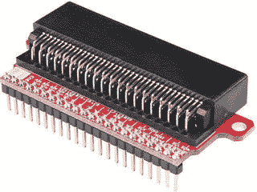

图 3-34。

BBC micro:bit Edge Breakout Board (courtesy of sparkfun.com)

### 特定于主板的屏蔽/外壳

MicroPython 板供应商，实际上是各种微控制器和类似板的供应商，封装他们的组件，以便他们可以用于称为 shields 或 skins 或类似东西的附加板。例如，Beaglebone 附加板称为 capes，Raspberry Pi 附加板称为 hats。这些板具有匹配的头部，用于插入(或堆叠在)主 MicroPython 板上以增加功能。许多屏蔽或外壳都有直通或堆叠接头，允许一次添加多个屏蔽。例如，Arduino 及其屏蔽格式可以配置为添加两个、三个或更多屏蔽。

在本节中，我们将看到一些可用于 Pyboard 和 WiPy MicroPython 板的附加板。如果您决定在本书中的项目中使用另一种板，请向供应商或零售商了解附加板的可用性。因为有几块板相对较新，所以你应该每隔几周左右检查一下，看看是否有新的板被添加进来。

#### Pyboard

Pyboard 附加板称为皮肤。 [<sup>16</sup>](#Fn16) 可以从`micropython.org` ( [`https://store.micropython.org/store/#/store`](https://store.micropython.org/store/#/store) )购买 Pyboard 皮肤(以及其他配件)。其他零售商可能会出售这种水果，但 Adafruit 目前不出售这种水果皮。皮肤通常被包装并作为未组装的套件出售，因此如果你想使用一个但不知道如何焊接，你可能需要学习或找到可以为你焊接组件的人。幸运的是，小的表面贴装元件已经组装好了，所以你最需要做的就是焊接更大的元件，比如接头。

第一个皮肤是一个原型板，允许您在皮肤上构建一个电路，以便您可以将其与 Pyboard 一起使用。它带有一套完整的标题。我喜欢它，因为虽然它比 Pyboard 略大，但有足够的空间，如果你想组装一个电路，你可以。此外，它允许您删除皮肤，以便您可以在其他项目中使用您的 Pyboard。图 [3-35](#Fig35) 显示了来自 micropython.org 的原型皮肤通孔 XY 尺寸皮肤


图 3-35。

Pyboard Protoskin Through-hole XY-Size

下一个皮肤是一个奇怪而有趣的功能，它为 Pyboard 添加了音频。它被简单地称为音频皮肤，允许你播放和录制短声音，以及播放某些波形(声音)。我展示这本书是为了激起你对本书以外的项目的兴趣。图 [3-36](#Fig36) 显示了来自 micropython.org 的音频皮肤。

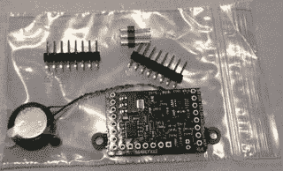

图 3-36。

Pyboard Audio Skin

下一个皮肤是另一个非常有趣的特性，它允许你以触摸 LCD 的形式给你的 Pyboard 添加一个视觉元素。具有电阻式触摸和头部的彩色 LCD 皮肤增加了使用 160x128 像素图形 LCD 显示器和背光以及覆盖整个屏幕的电阻式触摸传感器来添加交互界面的能力。这意味着您可以为您的 MicroPython 项目构建小型图形界面。酷！图 [3-37](#Fig37) 显示了带有电阻式触摸的彩色 LCD 面板的正面和背面以及来自 micropython.org 的 headers 面板。幸运的是，你可以购买这种皮肤作为一个完整的组装套件。

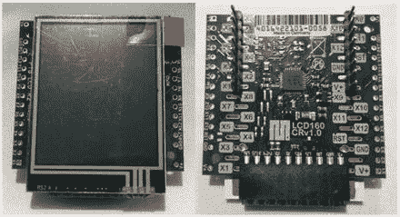

图 3-37。

Pyboard LCD Skin

#### WiPy 及相关

WiPy 和相关的附加板称为 shields。Pycom 包装和销售他们完全组装好并随时可用的盾牌。你可以从 Pycom ( `pycom.io`)或者 Adafruit ( `adafruit.com`)等其他零售商那里购买盾牌。他们的所有屏蔽都提供了一个带 LIPO 充电器的电池连接器、用于与电路板通信的微型 USB、一组适合所有 Pycom 电路板(WiPy、SiPy、LoPy、GPy 和 FiPy)的接头和一个微型 SD 读卡器。

我们看到的第一个屏蔽是扩展板，我认为它是 WiPy 和相关板的必需附件。下一个是设计用来容纳几个传感器的盾，称为 PySense 盾( [`https://www.pycom.io/product/pysense/`](https://www.pycom.io/product/pysense/) )。图 [3-38](#Fig38) 显示了重力感应盾。


图 3-38。

PySense Shield (courtesy of pycom.io)

该盾牌的功能列表令人印象深刻，包括以下内容(由 pycom.io 提供)。显然，这里有很多你可以利用的东西，所以如果你正在考虑使用 WiPy，这个盾和下一个盾可能会打破平衡。事实上，我将在后面的章节中向您展示如何使用这个屏蔽来读取天气数据。

*   环境光传感器
*   大气压力传感器
*   湿度传感器
*   3 轴 12 位加速度计
*   温度传感器
*   带串行访问的 USB 端口
*   LiPo 电池充电器
*   MicroSD 卡兼容性
*   超低功耗运行(深度睡眠时 1uA)

WiPy 和相关电路板的下一个(目前唯一的)盾牌是 PyTrack 盾牌( [`https://www.pycom.io/product/pytrack/`](https://www.pycom.io/product/pytrack/) )。这个防护罩类似于 PySense 防护罩，但它没有一系列传感器(它有一个加速度计)，而是有一个 GPS 芯片，你可以用它来记录位置。图 [3-39](#Fig39) 所示为 PyTrack 盾。

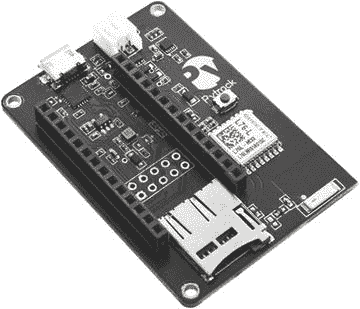

图 3-39。

PyTrack Shield (courtesy of pycom.io)

该盾牌的功能列表令人印象深刻，包括以下内容(由 pycom.io 提供)。很明显，这里有很多你可以利用的东西，所以如果你考虑使用 WiPy，这个盾和之前的盾可能会扭转局势。

*   超级精确的 GNSS + Glonass GPS
*   3 轴 12 位加速度计
*   带串行访问的 USB 端口
*   LiPo 电池充电器
*   Micro SD 卡兼容性
*   超低功耗运行(深度睡眠时 1uA)

### 特定于主板的附件

我们将讨论的最后一类硬件是本章中讨论的几种主板可用的附件。就像生活中的几乎所有事情一样，我们可以为我们的电路板添加配件，以达到深远(且昂贵)的目的。虽然 MicroPython 主板可用的附件列表还没有达到 Raspberry Pi 或 Arduino 的书呆子比例，但仍有一些附件是您应该考虑的。

在这一节中，我将介绍 Pyboard、WiPy 和 BBC micro:bit 的一些我认为必不可少的附件。这并不意味着你应该冲出去买，或者这本书需要它们；相反，我认为如果你打算在完成本书中的例子后继续用这些板进行开发，你应该考虑它们。

例如，我觉得每个项目都应该放在一个盒子里，这样电路板和任何其他元件都不会受到意外触摸、跌落和其他可能损坏电子设备的事件的影响。如果您计划将电路板安装在某个地方进行长期操作，这一点尤其正确。因此，我为每块板列出一个案例。

#### Pyboard

除了 USB 线和皮肤等必需品之外，Pyboard 没有太多附件。但我发现有一件配饰是 Pyboard 不可或缺的——来自 micropython.org 的盒子。

Tip

白板配件的最佳来源是 micropython.org([`https://store.micropython.org/store/#/store`](https://store.micropython.org/store/#/store))。他们以欧盟为基地，向美国和其他国家发货。

你可以从 micropython.org 购买一个铝制外壳，这是我见过的最好的外壳之一。其他主板上也有一些类似的，但是它们的价格通常都过高。那根本不适用于这个例子。这款保护套有三种型号:一种是打开的盖子，可以接触到接头；另一种是关闭的盖子，可以安装触摸屏。它们都与带耳板相适应，因此使用这种情况时，您无需将它们折断。图 [3-40](#Fig40) 显示了打开盖子的纸板盒。

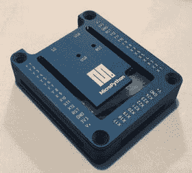

图 3-40。

PyBoard Case

我对这个案子的质量怎么说都不为过。这简直是我见过的最好的。打开和关闭的盖子上有文字，标记了割台上的所有针脚。这个案子你不会失望的。它有点贵，大约 35 美元，但物有所值。他们经常缺货，所以经常检查新订单。

#### WiPy 和相关板

WiPy 的配件清单正在增加。你可以买到 USB 线等日常必需品，但 Pycom 也出售天线和各种各样的外壳等物品。

Tip

WiPy 配件的最佳来源是 Pycom ( [`https://www.pycom.io/webshop#accessories`](https://www.pycom.io/webshop#accessories) `-`)。虽然他们的总部设在欧盟，但他们确实以令人印象深刻的交货时间表向美国发货。

WiPy 的外壳有不同的颜色和形状。有尺寸适合 WiPy 和 shield 的轻型外壳，也有密封用于户外的外壳，包括一个足以容纳 WiPy、shield 和 LIPO 电池的外壳。图 [3-41](#Fig41) 显示了用于 WiPy 的烟色外壳，其可以容纳 WiPy 和护罩。


图 3-41。

WiPy Case (courtesy of pycom.io)

接下来是一个电池盒，带有正确的连接器，可连接到您的主板上。您可以得到一个电池盒，其中包含用于正确电压的正确数量的电池(首先检查您的主板规格)以及带有正确连接器的电池盒。我选择购买一个通用的外壳，可以容纳四节 1.5V AA 电池，并自己添加了正确的连接器。图 [3-42](#Fig42) 显示了我在项目中经常使用的电池盒。我已经在 WiPy 部分列出了电池盒，但它也可以用于其他板，如 BBC micro:bit。


图 3-42。

Battery Case Caution

请确保您的电池盒包含适合您的主板的大小和额定功率。

#### BBC 微:比特

拥有最令人印象深刻的附件列表的板是 BBC micro:bit。我确信这是由于它的流行，但它也有利于我们的努力。您可以找到用于建造机器人、电源配件、箱子等的工具包！

Tip

BBC micro:bit 配件的两个优秀来源是 Kitronik ( [`https://www.kitronik.co.uk/microbit.html`](https://www.kitronik.co.uk/microbit.html) )和 Pi Hut ( [`https://thepihut.com/collections/micro-bit-store`](https://thepihut.com/collections/micro-bit-store) )。两者都在欧盟，但都以令人印象深刻的交货时间表运往美国。

我喜欢的 BBC micro:bit 的电源选项之一是 Kitronik ( [`https://www.kitronik.co.uk/5610-mipower-board-for-the-bbc-microbit.html`](https://www.kitronik.co.uk/5610-mipower-board-for-the-bbc-microbit.html) )提供的 MI:power board。这个板很好，因为它使用大型鳄鱼引脚(0，3V 和 GND)安装到您的 BBC micro:bit 板上，仅使用一个小型 3V 硬币电池供电。挂载的时候不占太多空间。它包括一个开关，允许您关闭电路板，并提供一个小扬声器(因此通过#0 引脚连接)，以便您可以将声音添加到您的项目中。图 [3-43](#Fig43) 显示了 Kitronik 的电源屏蔽。


图 3-43。

MI:power Board for the BBC micro:bit

如果你决定使用这种电池板，我强烈推荐它超过外部电池——特别是对于 BBC micro:bit，并且你决定使用外壳，你应该知道大多数外壳不是为支持 MI:power 板而设计的。然而，我确实找到了至少一个。正如你所猜测的，它是由制造 MI:power 的同一批人制造的！

BBC micro:bit 提供了许多案例，似乎每天都有另一个案例出现(包括那些可以在 3D 打印机上打印的案例)。然而，我发现我喜欢的那个和我在其他板上用过的一样。它由丙烯酸制成，使用尼龙螺栓将几层连接在一起。这是一个干净的组件，可以清晰地看到电路板，考虑到 BBC micro:bit 有很多 led，这很好！图 [3-44](#Fig44) 显示了 BBC micro:bit 的 MI:pro 案例。

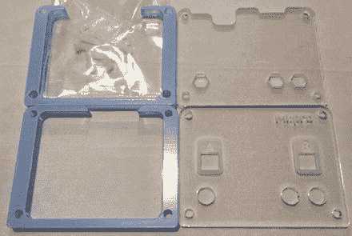

图 3-44。

BBC micro:bit MI:pro Case Kit

最后，如果你要经常使用 BBC micro:bit 进行实验，包括本书中的例子以及互联网上的几十个例子，你应该考虑 Kitronik ( [`https://www.kitronik.co.uk/5609-prototyping-system-for-the-bbc-microbit.html`](https://www.kitronik.co.uk/5609-prototyping-system-for-the-bbc-microbit.html) )的原型系统。该套件带有一个板，您可以安装一个附带的边缘连接器分线点和试验板，使该套件成为一个漂亮整洁的包装。图 [3-45](#Fig45) 显示了 Kitronik 的原型系统。该工具包包含在更大的发明人工具包中，如下侧栏所述。


图 3-45。

Prototyping System for the BBC micro:bit (courtesy of kitronik.uk.co)

现在，让我们简单地讨论一下，在 IOT 之旅中，您应该为您的 MicroPython 购买哪种主板。

## 我应该买哪块板？

所以，你想买一个 MicroPython 板但是不知道选哪个。幸运的是，本章中的所有电路板都是理想的选择。可能使某些人比其他人更适合某些人的特征包括以下几点。

*   无需组装–如果您不知道如何焊接或不想花时间加载软件、自举和固件，那么您应该考虑现成的主板，如 Pyboard 或 WiPy。
*   连接性–如果您计划公开您的 IOT 解决方案(相对于学术练习)，您应该考虑具有内置 WiFi 或类似网络功能(如 WiPy 或 Feather)的主板。
*   现有硬件——如果您已经投资并拥有平台和设备(附加板、分线板等)。)，你可能会考虑留在董事会。例如，如果你在 Arduino 上投资了很多，你应该考虑在 Arduino 板上加载 MicroPython。

显然，选择购买哪种主板需要事先考虑。话说回来，如果你是一个真正的发烧友，你可能会决定买几块这样的板， [<sup>17</sup>](#Fn17) 自己试验一下哪一块最适合你的项目。不管怎样，我觉得最适合 IOT 学习 MicroPython 的是那些有网络的板，比如 WiPy 和 Feather Huzzah。然而，Pyboard 和 BBC micro:bit 板也是学习 MicroPython 的很好的板，但是需要一个外部模块来添加网络功能。

Consider Buying a Kit

许多主板都附带一个套件，其中包含各种附件，包括一个包含主板和电源适配器的入门套件。其他套件可能包括试验板，通常还有传感器或附加板。例如，您可以为 BBC micro:bit 板购买几个套件，包括 Sparkfun 的两个不错的选项。

*   BBC micro:bit Go Bundle–包含电路板和电池组( [`https://www.sparkfun.com/products/14336`](https://www.sparkfun.com/products/14336) )
*   spark fun Inventor ' s Kit for BBC micro:bit——他们广受欢迎的 BBC micro:bit Inventor ' s Kit 的一个版本，包括至少 14 个不同实验所需的所有基本电子元件，以及一本易读的说明书( [`https://www.sparkfun.com/products/14300`](https://www.sparkfun.com/products/14300) )
*   微型:气候工具包-包含板，气象站附加板，以及天气传感器！( [`https://www.sparkfun.com/products/14217`](https://www.sparkfun.com/products/14217)

其他供应商可能有针对其他主板的附加或类似套件。例如，Kitronik 为 BBC micro:bit 提供了一个优秀的发明家工具包(如下所示，由 kitronik.co.uk 提供),里面有许多你需要的部件。


如果您刚刚开始，没有任何主板或组件，入门套件可能是最经济的选择。

## 摘要

哇，信息量真大。如您所见，有几种 MicroPython 板可用。有些工具，比如 Pyboard 和 WiPy，可以直接使用，除了插入它并编写您的第一个 Python 程序之外，不需要任何东西。其他人可能要求您首先加载 MicroPython，其他人仍然需要一点魔法来使它们工作。然而，这里介绍的所有电路板都是本书实验中使用的绝佳选择。

在本章中，我们探索了一些使用 MicroPython 板的最佳实践和技巧。我们讨论了可能出错的常见问题，以及在哪里寻找您可能遇到的其他问题的解决方案。最后，我们看了几个流行的插件和分线板，您可以使用它们来开发您的项目，包括本书后面使用的那些。

在下一章，我们将深入学习使用 Python 和 MicroPython 的编程教程。这一章在很大程度上是一个闪电之旅，旨在帮助指导你能够写出(并理解)本书中的例子。

Footnotes [1](#Fn1_source)

[T2`https://en.wikipedia.org/wiki/Firmware`](https://en.wikipedia.org/wiki/Firmware)

  [2](#Fn2_source)

PyMakr 插件取代了独立的 PyMakr 应用。更多信息见 [`https://forum.pycom.io/topic/635/pymakr-time-of-death-09-02`](https://forum.pycom.io/topic/635/pymakr-time-of-death-09-02) 。

  [3](#Fn3_source)

[T2`https://en.wikipedia.org/wiki/ESP8266`](https://en.wikipedia.org/wiki/ESP8266)

  [4](#Fn4_source)

[T2`https://docs.pycom.io/pycom_esp32/_downloads/exp_v03_pinout_v13.pdf`](https://docs.pycom.io/pycom_esp32/_downloads/exp_v03_pinout_v13.pdf)

  [5](#Fn5_source)

[T2`https://en.wikipedia.org/wiki/Lithium_polymer_battery`](https://en.wikipedia.org/wiki/Lithium_polymer_battery)

  [6](#Fn6_source)

版本号可能不会改变，但日期或内部版本号可能会经常改变。

  [7](#Fn7_source)

[T2`https://en.wikipedia.org/wiki/USB#Device_Firmware_Upgrade`](https://en.wikipedia.org/wiki/USB#Device_Firmware_Upgrade)

  [8](#Fn8_source)

我觉得`micropython.org`提供网络板(皮肤)或类似的东西只是时间问题。检查他们的网站更新。

  [9](#Fn9_source)

最新 Adafruit 可穿戴产品见 [`https://www.adafruit.com/category/65`](https://www.adafruit.com/category/65) 。

  [10](#Fn10_source)

[T2`https://github.com/Microsoft/uf2`](https://github.com/Microsoft/uf2)

  [11](#Fn11_source)

[T2`https://learn.adafruit.com/adafruit-feather-m0-express-designed-for-circuit-python-circuitpython/circuitpython#flashing-with-bossac`](https://learn.adafruit.com/adafruit-feather-m0-express-designed-for-circuit-python-circuitpython/circuitpython#flashing-with-bossac)

  [12](#Fn12_source)

的确是最普遍的芯片！

  [13](#Fn13_source)

如果你喜欢冒险，有一个小小的 3。关于如何加载 MicroPython，请参见 [`https://github.com/micropython/micropython/wiki/Board-Teensy-3.1-3.5-3.6`](https://github.com/micropython/micropython/wiki/Board-Teensy-3.1-3.5-3.6) ，但是要预先警告这不是一件简单的事情。

  [14](#Fn14_source)

注意 MOSI 和 MISO 引脚，这是一个 SPI 接口。

  [15](#Fn15_source)

注意 SDA 和 SLA 引脚，这是一个 I2C 接口。

  [16](#Fn16_source)

只是一个名字。每个人都试图成为独一无二的，但我仍然称它们为盾牌——这是我修补 Arduino 时养成的习惯。

  [17](#Fn17_source)

是的，我拥有这里列出的董事会(一些多重)，以及一个不断增长的，不要脸的其他董事会。