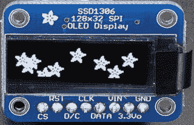
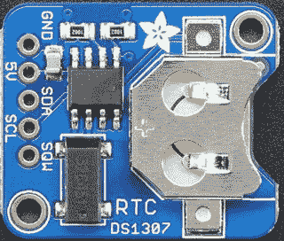
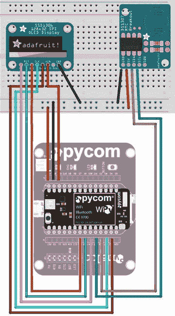
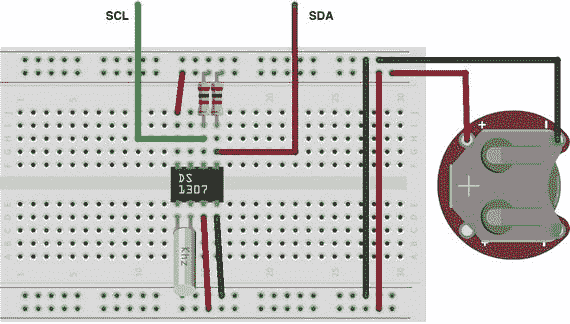

# 八、项目一：MicroPython 风格的你好世界

这是本书最有趣的部分——从事 MicroPython 项目！正是在这一点上，我们已经学会了如何用 MicroPython 编写代码，现在对硬件甚至如何使用分立电子器件和分线板有了更多的了解。

本章介绍了如何构建 MicroPython 项目。因此，我们还需要学习一些东西，包括在我们的 MicroPython 板上安装和运行项目的技术和程序。这一章将介绍那些使你的 MicroPython 项目成功所需要的东西。因此，这一章有点长，即使你不打算实现这个项目，也应该被认为是必读的。

为了帮助实现这些目标并使事情变得简单一点(因为这是您的第一个真正的 MicroPython 项目)，我们将放弃将这个项目连接到互联网，这样我们可以使这个项目更容易实现。后面的章节会有更少的介绍性信息，并且会更多地关注项目，因为随着我们的进展，它们会变得更加复杂。

正如您将看到的，所有项目章节的格式都是相同的:首先是项目概述，然后是所需组件的列表以及如何组装硬件。一旦我们掌握了如何连接硬件，我们就可以看到如何连接一切，并开始编写代码。每章都以如何执行项目结束，并附有一个项目运行的例子和美化项目的建议。

如果你现在想知道你需要哪种板来完成这些项目，不要担心，因为我们将在本章中看到如何在 WiPy 和 Pyboard 上实现这个项目，以及不同之处的演示。

那么，让我们开始我们的第一个 MicroPython 项目吧！

## 概观

在这一章中，我们将设计并构建一个 MicroPython 时钟。我们将同时使用 SPI 和 I2C 分线板。我们将使用小型有机发光二极管(有机发光二极管) [<sup>1</sup>](#Fn1) 显示器，该显示器使用 SPI 接口和基于硬件的实时时钟(RTC)，该时钟使用 DS1307 芯片和电池在项目关闭时记录时间。我们将使用基于硬件的 RTC，并在小型有机发光二极管显示器上显示当前日期和时间，而不是简单地连接到互联网上的网络时间协议(NTP)服务器。这不仅使项目变得更小，还演示了如何为可能没有连接到互联网的项目使用 RTC。

虽然 Pyboard 具有 RTC 电路，您可以连接外部电池，以便在电路板关闭时保持 RTC 供电(参见 [`http://docs.micropython.org/en/latest/pyboard/pyboard/quickref.html`](http://docs.micropython.org/en/latest/pyboard/pyboard/quickref.html) 的 VBAT 引脚参考)，但大多数片上系统(SOC)板，如 WiPy 和其他基于 Espressif 的板，不支持此功能。因此，我们将使用外部 RTC，以便您可以在其他板上使用该项目。

正如您将看到的，需要相当多的布线，并且理解硬件功能是编写代码的必要条件，这就是为什么我们在前几章花时间讨论固件和各种低级硬件控制。你需要这些技能和知识来完成这个项目。

虽然一个时钟可能听起来很简单，但这个项目将引导您完成组装硬件和编写代码所需的所有步骤。正如您将看到的，除了硬件布局和引脚数之外，WiPy 和 Pyboard 之间还有一些明显的差异。事实上，我们将看到在我们如何为每一个写代码方面有一些不同。

此外，该项目很小而且很简单，因此我们可以专注于过程，然后我们可以将其应用于更高级的项目。事实上，我们会看到，即使是一个相对简单的项目也可能有意想不到的难度。但是不要担心，因为这一章记录了你完成这个项目需要做的所有事情。

这个项目的来源很多。以下链接包括本项目使用的背景数据。学习如何应用来自这些网站的知识不是一件容易解释或学习的事情；然而，通过查看这些资源(如果你愿意的话)，它应该可以帮助你理解如何研究和计划你自己的项目。

*   项目创意和驱动因素来源: [`http://micropython-urtc.readthedocs.io/en/latest/examples.html`](http://micropython-urtc.readthedocs.io/en/latest/examples.html)
*   有机发光二极管显示信息: [`https://learn.adafruit.com/monochrome-oled-breakouts/wiring-128x32-spi-oled-display`](https://learn.adafruit.com/monochrome-oled-breakouts/wiring-128x32-spi-oled-display)
*   有机发光二极管显示驱动: [`https://github.com/adafruit/micropython-adafruit-ssd1306`](https://github.com/adafruit/micropython-adafruit-ssd1306)
*   RTC 驱动文档: [`https://github.com/adafruit/Adafruit-uRTC/tree/master/docs`](https://github.com/adafruit/Adafruit-uRTC/tree/master/docs)
*   RTC 驱动: [`https://github.com/adafruit/Adafruit-uRTC`](https://github.com/adafruit/Adafruit-uRTC)

注意使用的网站。一个好的实践是从 Adafruit 和 MicroPython 学习、blobs 和论坛开始。然后检查驱动程序。也就是说，先做研究，找到所有你能找到的参考资料。如果你从 Adafruit 或 Sparkfun 上找到了不错的教程，你可以把它们下载到你的平板电脑上，或者打印出来供以后阅读。更重要的是，在开始使用硬件或编写代码之前，花时间阅读参考资料，以便尽可能多的理解。通过了解一些简单的事情，如如何将电路板连接到设备以及如何使用驱动程序，您可以节省大量时间。 [<sup>3</sup>](#Fn3)

Which Driver Do I Use?

您可能会遇到这样的情况:您为您想要使用的硬件找到了多个驱动程序。事实上，我为有机发光二极管展示会找到了三个司机。它们之间的差异是微妙的，看起来至少有一个是为特定平台编写的。

其实上面列出的是最好用的一个。尽管如此，它需要做一些小的改动才能与 WiPy 和 Pyboard 一起使用。我将向您展示这些变化，正如您将看到的，它们并不难发现和修复(例如，当 MicroPython 抛出异常时，它将向您显示问题的根源)。

如果您遇到类似的情况——有多个驱动程序可供选择，您可能希望尝试每个驱动程序，直到找到最适合您的硬件和项目的驱动程序。有时，在这种情况下，这是真的，一个驱动程序可能不可行，或者另一个可能缺乏您需要的功能。例如，我发现的一个驱动程序不支持文本，所以它不能用于这个项目，另一个需要进行重大修改才能用于 Pyboard。诀窍是找到修改量最少但效果最好的驱动程序。

现在让我们看看这个项目需要哪些组件，然后我们将看看如何将所有组件连接在一起。

## 必需的组件

表 [8-1](#Tab1) 列出了你需要的部件。您可以从 Adafruit ( `adafruit.com`)、Sparkfun ( `sparkfun.com`)或任何出售电子元件的电子商店单独购买元件。如果您想购买这些组件，可以链接到供应商。当列出同一对象的多行时，您可以选择其中一行——您不需要两个都要。此外，您可能会找到销售这些组件的其他供应商。你应该货比三家，找到最好的交易。显示的成本是估计值，不包括任何运输成本。

表 8-1。

Required Components

<colgroup><col> <col> <col> <col> <col></colgroup> 
| 成分 | 数量 | 描述 | 费用 | 链接 |
| --- | --- | --- | --- | --- |
| MicroPython 板 | one | 带标题的 Pyboard v1.1 版 | $45-50 | [`https://www.adafruit.com/product/2390`](https://www.adafruit.com/product/2390)[`https://www.adafruit.com/product/3499`T5】](https://www.adafruit.com/product/3499) |
| [T2`https://www.sparkfun.com/products/14413`](https://www.sparkfun.com/products/14413) |
| [T2`https://store.micropython.org/store`](https://store.micropython.org/store) |
| WiPy | $25 | [T2`https://www.adafruit.com/product/3338`](https://www.adafruit.com/product/3338) |
| [T2`https://www.pycom.io/product/wipy/`](https://www.pycom.io/product/wipy/) |
| 有机发光二极管显示器 | one | 基于 ssd1306 的 SPI 显示器 | $18 | [T2`https://www.adafruit.com/product/661`](https://www.adafruit.com/product/661) |
| RTC 分线板 | one | 带备用电池的 RTC 模块 | $15 | [T2`https://www.sparkfun.com/products/12708`](https://www.sparkfun.com/products/12708) |
| 试验板 | one | 原型板，半尺寸 | $5 | [T2`https://www.sparkfun.com/products/12002`](https://www.sparkfun.com/products/12002) |
| 跳线 | Twelve | M/M 跳线，6”(成本是一套 10 根跳线) | $4 | [T2`https://www.sparkfun.com/products/8431`](https://www.sparkfun.com/products/8431) |
| 力量 | one | 从电脑获取电源的 USB 电缆 |   | 使用您的备件 |
| one | USB 5V 电源和电缆 |   | 使用您的备件 |
| 纽扣电池 | one | 参见 RTC 分线板数据表 | $3-5 | 常见的 |

请注意，在源代码中，最后两项是“使用您的备件”。这是指我们大多数人手头都有这些东西，而且在某些情况下还很丰富。例如，如果你买了一块 MicroPython 板，如果你还没有电缆，你也需要买一根。此外，随着 USB 充电设备的激增，很难想象任何拥有一台以上智能设备的人没有额外的 USB 充电器或电源。

如果您选择使用 WiPy，建议您也从 Adafruit ( [`https://www.adafruit.com/product/3344`](https://www.adafruit.com/product/3344) )或 Pycom ( [`https://www.pycom.io/product/wipy-expansion-board/`](https://www.pycom.io/product/wipy-expansion-board/) `).`)购买扩展板

本项目中使用的有机发光二极管分线板是 Adafruit 的一个小模块。它有一个很小但很亮的显示屏，可以安装在试验板上。分辨率为 128 像素宽，32 像素高。有机发光二极管分线板没有安装接头，但如果你知道如何焊接(现在可能是练习的好时机)或者你可以让朋友帮助你，它们很容易添加。图 [8-1](#Fig1) 显示了 Adafruit 有机发光二极管 SPI 分线板。



图 8-1。

Monochrome 128x32 SPI OLED Graphic Display (courtesy of adafruit.com)

有几种有机发光二极管分线板可用，只要它们具有 SPI 接口并使用 ssd1306 控制器芯片(说明会告诉你这一点)，就可以使用备用有机发光二极管显示器。我们之所以需要在控制器芯片上使用一个，是因为驱动程序是为该控制器编写的。其他控制器芯片将需要不同的驱动器。

本项目中使用的 RTC 分线板是 Adafruit 的 DS1307 分线板。该板也没有安装接头(但包括接头)，也没有配备电池，因此您必须购买 CR1220 纽扣电池。如果你不想去商店的话，Adafruit 也有这些东西。图 [8-2](#Fig2) 显示了 RTC 分线板。



图 8-2。

DS1307 Real-Time Clock Assembled Breakout Board (courtesy of adafrui.com)

有几种 DS1307 RTC 时钟可用。事实上，Sparkfun 有一个，或者您可以自己创建一个！参见侧栏“构建您自己的 RTC 模块”了解更多细节。幸运的是，我们将使用的库支持带有 DS1307、DS3231 或 PCF8523 RTC 芯片的分线板。

Tip

小型分立元件，如 led、电阻等。，甚至跳线和试验板都可以在第 [2](02.html) 章提到的套件中找到——Adafruit Parts Pal([`https://www.adafruit.com/product/2975`](https://www.adafruit.com/product/2975))或者 Sparkfun 初学者配件套件( [`https://www.sparkfun.com/products/13973`](https://www.sparkfun.com/products/13973) )。我推荐其中一套。

现在，让我们看看如何将组件连接在一起。

## 安装硬件

这个项目有很多联系。有机发光二极管需要 7 个，RTC 需要 4 个，电源和接地需要一些额外的跳线。为了让事情更简单，我们将计划事情应该如何连接。我们将使用试验板来安装分线板，使连接更容易。更具体地说，我们将了解每个元件需要什么样的连接，以及它们需要在哪里连接到我们的电路板，将它们写下来以保持事情的连续性。做少量的家庭作业会为你节省时间(并且不会有一点点的挫败感)。

在这一节和下一节中，我们将看到如何为 WiPy 和 Pyboard 实现这个项目。在硬件的情况下，分线板侧的连接都是相同的，但是每个板的管脚号不同。表中显示了两种板，左边显示了带有 pin 标签的 MicroPython 板，右边显示了带有 pin 标签的分线板。我们将使用公/公跳线通过试验板进行这些连接。

正如您将看到的，像这样绘制连接使得检查连接变得容易。这个表和一个接线图是你将在本书和互联网或其他地方的其他示例项目中看到的工具。因此，学习如何阅读地图和接线图是一项让你的项目成功的技能。

表 [8-2](#Tab2) 显示了本项目所需的连接。注意“导线颜色”列。使用此列记录跨接导线的颜色，以帮助管理连接。使用什么颜色的电线并不重要，但是为每个连接使用不同的颜色有助于管理您将要连接的许多电线。如果您记下每个连接使用的是哪种颜色的电线，还可以更容易地检查您的连接。传统上，我们至少用黑色代表地(负极)，红色代表电源(正极)。

表 8-2。

Connections for the MicroPython Clock (WiPy and Pyboard)

<colgroup><col> <col> <col> <col> <col></colgroup> 
| MicroPython 板 | 分线板 | 电线颜色 |
| --- | --- | --- |
| WiPy | Pyboard | 板 | 个人识别码 |   |
| --- | --- | --- | --- | --- |
| P9 | X9 | 雷达跟踪中心（Radar Tracking Centre 的缩写） | 圣地亚哥 |   |
| P8 | X10 | 雷达跟踪中心（Radar Tracking Centre 的缩写） | 国家药品监督管理局 |   |
| 5V | V+ | 雷达跟踪中心（Radar Tracking Centre 的缩写） | 5V |   |
| 地线 | 地线 | 雷达跟踪中心（Radar Tracking Centre 的缩写） | 地线 |   |
| P6 | Y3 | 有机发光二极管（Organic Light Emitting Diode 的缩写） | 英特尔的快速储存技术 |   |
| 孕烯醇酮 | Y4 | 有机发光二极管（Organic Light Emitting Diode 的缩写） | 跟单信用证 |   |
| P7 | Y5 | 有机发光二极管（Organic Light Emitting Diode 的缩写） | 特许测量员 |   |
| P10 | Y6 | 有机发光二极管（Organic Light Emitting Diode 的缩写） | 时钟信号 |   |
| P11 | Y8 | 有机发光二极管（Organic Light Emitting Diode 的缩写） | 数据 |   |
| 3V3 | 3V3 | 有机发光二极管（Organic Light Emitting Diode 的缩写） | 车辆识别号码 |   |
| 地线 | 地线 | 有机发光二极管（Organic Light Emitting Diode 的缩写） | 地线 |   |

哇，联系真多啊！让我们来复习一些元件接线的技巧。将元件连接到电路板的最佳方式是使用试验板。正如我们在第 [7](07.html) 章中看到的，试验板允许我们插入组件，并使用跳线进行连接。这简化了项目的布线，并允许您在需要腾出更多空间时移动物品。试验板也有助于布线电源和接地连接，因为试验板的两侧都有电源轨，我们可以将其用作公共连接。也就是说，用一根跳线将电源和接地连接到试验板，用另一根跳线连接到分线板。

插入组件时，务必确保针脚与中央通道平行安装。回想一下，试验板的引脚以垂直于中央通道的方式成行布线。这允许您对元件(或电路板上的引脚)进行多个连接。

Caution

项目通电时，切勿插拔跳线。

最后，务必确保您的项目布线时仔细检查所有连接，尤其是电源、接地和用于信号的任何引脚(将设置为“高”或“开”)，如用于 SPI 接口的引脚。最重要的是，当项目(或您的板)通电时，切勿插拔跳线。这很可能会损坏您的主板或组件。 [<sup>4</sup>](#Fn4)

首先，拿出你的试验板，插上元件；然后，使用不同颜色的跳线，将所有需要的电线插入试验板，并在图表中注明您使用的颜色。当您开始将跳线的另一端插入 MicroPython 板时，这将对您有很大帮助。

在这个项目中，我将有机发光二极管安装在一个半尺寸试验板的左侧，就在中央通道的下方，RTC 模块安装在右侧，也在通道的下方。请注意，这些板使用不同的电源连接。有机发光二极管板使用 3.3V，RTC 板使用 5V。打开项目电源之前，请务必检查组件的电源要求。再三检查你的连接。

现在，让我们看看如何连接 WiPy 和 Pyboard，如图所示。

### WiPy

WiPy 的布线最好将扩展板上的 USB 连接器朝向左侧。这将允许您读取电路板上的引脚数，即使在电线插入电路板之后。然而，这只是一个建议。只要电线连接正确，方向并不重要。图 [8-3](#Fig3) 显示了 WiPy、有机发光二极管和 RTC 分线板的接线图。



图 8-3。

Wiring the Clock Project (WiPy)

### Pyboard

Pyboard 的布线最好将 USB 连接器朝向左侧。这将允许您读取电路板上的引脚数，即使在电线插入电路板之后。图 [8-4](#Fig4) 显示了 Pyboard、有机发光二极管和 RTC 分线板的接线图。


图 8-4。

Wiring the Clock Project (Pyboard) Caution

总是再三检查你的连接，尤其是所有的电源和接地连接。请务必检查电源连接，以确保正确的电源(3V 或 5V)正确连接到组件。连接错误的电压会损坏部件。

如果您选择了不同于图中所示的 RTC 板，请务必根据需要调整连接。例如，Sparkfun DS1307 分线板的引脚顺序不同，所以不要只看这张图，尤其是在使用替代组件的情况下！

同样，在给主板通电之前，请务必仔细检查您的连接。现在，我们来谈谈我们需要编写的代码。暂时不要启动您的主板——在我们准备好测试该项目之前，还需要进行大量的讨论。

## 写代码

现在是时候为我们的项目编写代码了。由于我们正在使用几个新组件，我将依次介绍每个组件的代码。代码并不太复杂，但可能不像以前项目中的一些代码那样清晰。让我们先来看看这个项目的设计。

### 设计

一旦你整理好硬件以及如何将元件连接到你的电路板上，就该开始设计代码了。 [<sup>5</sup>](#Fn5) 幸运的是，这个项目足够小，可以让设计变得简单。简而言之，我们希望在有机发光二极管上每秒显示一次时间。因此，代码的“工作”是从 RTC 读取日期和时间，然后在有机发光二极管上显示出来。下面列出的步骤总结了如何为这个项目或任何项目设计和实现代码。

1.  库:我们需要为 RTC 和有机发光二极管选择和导入库
2.  设置:我们需要为 I2C 和 SPI 设置接口
3.  初始化:我们需要为库中的类初始化对象实例
4.  功能:我们将需要一个新的功能，让我们的项目启动和启动运行
5.  Main:修改我们的 MicroPython 板上的 main.py 文件来运行我们的代码

这五个元素是我们将在本书的所有项目中使用的，事实上，它是所有 MicroPython 项目都要遵循的一个好模式。新的功能步骤是我们还没有看到的新步骤。简而言之，我们将代码的操作部分包装在一个单独的函数中，以便在启动时从`main.py`文件中调用。当我们执行和测试这个项目时，我们将会看到更多关于它的内容。

现在我们知道了项目代码将如何实现，让我们回顾一下所需的库。

### 所需的库

回想一下之前我们需要两个驱动程序:一个用于有机发光二极管显示，另一个用于 RTC。有机发光二极管显示器的驱动程序可在 [`https://github.com/adafruit/micropython-adafruit-ssd1306`](https://github.com/adafruit/micropython-adafruit-ssd1306) 找到，RTC 的驱动程序可在 [`https://github.com/adafruit/Adafruit-uRTC`](https://github.com/adafruit/Adafruit-uRTC) 找到。

现在就下载这两个驱动程序吧。您应该能够访问这些站点，单击克隆或下载链接，然后单击下载 Zip 按钮将文件下载到您的 PC。然后，打开下载文件的位置并解压缩。您应该找到以下文件。将这些内容复制到您电脑上的某个位置。我们复制它们是因为我们需要修改它们，如果我们犯了错误或者事情不顺利，复制它们可以让我们回到原来的样子。

*   `ssd1306.py`:有机发光二极管显示驱动
*   `urtc.py`:RTC 驱动

我们必须修改一个库有两个主要原因；在这种情况下，我们看到了两者的例子。首先，Adafruit 驱动程序针对的目标平台存在差异。更具体地说，它是为不同的 MicroPython 板编写的，但是我们可以很容易地根据我们的需要对它进行修改。第二，主板上的固件之间存在差异。这将需要更改驱动程序代码，以使用与特定 MicroPython 板相关的正确的类和函数。

同样，不要担心，因为对库的更改很小。但是，这是一个很常见的现象，你应该习惯于做这样的小改动——尤其是如果你使用的是 WiPy 或 Pyboard 之外的板！

使用驱动程序时，还有一个需要考虑的问题。您应该查看驱动程序文档以了解任何限制。例如，驱动程序可能需要较新版本的固件。在某些情况下，可能还需要旧版本的固件(但这种情况很少见)。如果您的驱动程序与您的主板不兼容，而文档声称它可以与您的主板兼容，请在文档中检查您的固件版本是否有任何不兼容之处。

在接下来的章节中，我们将会看到在 WiPy 和 Pyboard 上使用驱动程序所需的一般变化。

#### 更改 WiPy 的`ssd1306.py`

有机发光二极管驱动程序需要对 WiPy 固件进行少量的修改。WiPy 上的引脚类没有`high()`或`low()`功能。取而代之的是，WiPy 固件使用一个函数`value()`，我们将它作为参数传递，1 表示高，0 表示低。幸运的是，对于那些知道如何读取差异文件(diff 命令 [<sup>6</sup>](#Fn6) 的输出)的人来说，只需将所有出现的`.high()`更改为`.value(1)`并将`.low()`更改为`.value(0).`，差异文件如清单 [8-1](#Par72) 所示。

```py
--- ./Pyboard/ssd1306.py        2016-10-30 14:06:02.000000000 -0400
+++ ./WiPy/ssd1306.py           2017-07-20 21:39:31.000000000 -0400
@@ -146,23 +146,23 @@

     def write_cmd(self, cmd):
         self.spi.init(baudrate=self.rate, polarity=0, phase=0)
-        self.cs.high()
-        self.dc.low()
-        self.cs.low()
+        self.cs.value(1)
+        self.dc.value(0)
+        self.cs.value(0)
         self.spi.write(bytearray([cmd]))
-        self.cs.high()
+        self.cs.value(1)

     def write_framebuf(self):
         self.spi.init(baudrate=self.rate, polarity=0, phase=0)
-        self.cs.high()
-        self.dc.high()
-        self.cs.low()
+        self.cs.value(1)
+        self.dc.value(1)
+        self.cs.value(0)
         self.spi.write(self.buffer)
-        self.cs.high()
+        self.cs.value(1)

     def poweron(self):
-        self.res.high()
+        self.res.value(1)
         time.sleep_ms(1)
-        self.res.low()
+        self.res.value(0)
         time.sleep_ms(10)
-        self.res.high()
+        self.res.value(1)

Listing 8-1.Changes for the ssd1306.py code module for the WiPy (difference file)

```

What’s a Difference File?

差异文件是`diff`命令的输出。它逐行显示同一文件的两个版本之间的变化或差异。在统一差异文件中，以减号开头的行是要删除的行，而以加号开头的行是要添加的行。文件中没有序言(符号)的行被用作定位更改的上下文(以及一个特殊的头)。差异文件可与`patch`命令一起使用，将更改应用于文件。因此，差异文件有时被称为“补丁”或“差异”文件。

#### 对 Pyboard 的`uRTC.` `py`进行更改

RTC 驱动程序将无法在 Pyboard 上正确运行(但在 WiPy 上无需更改即可正常运行)。所需的更改是由于 I2C 类的功能不同。驱动程序使用以下方法来读取和写入数据。

```py
i2c.readfrom_mem(address, register, num_to_read)
i2c.writeto_mem(address, register, buffer)

```

但是，Pyboard 固件有不同的函数名，参数顺序也不同，如下所示。请注意，read 函数的参数顺序是不同的。

```py
i2c.mem_read(num_read, address, register)
i2c.mem_write(buffer, address, register)

```

因此，我们需要改变库中的所有读写功能，以匹配我们的板的固件。你所需要做的就是打开文件并进行修改——只需要重命名函数并重新排列 read 函数的参数。清单 [8-2](#Par79) 显示了您需要做出的更改。

```py
--- ./Pyboard/urtc.py    2017-07-20 19:20:38.000000000 -0400
+++ ./WiPy/urtc.py    2017-04-21 16:52:32.000000000 -0400
@@ -40,8 +40,8 @@

     def _register(self, register, buffer=None):
         if buffer is None:
-            return self.i2c.mem_read(1, self.address, register)[0]
-        self.i2c.mem_write(buffer, self.address, register)
+            return self.i2c.readfrom_mem(self.address, register, 1)[0]
+        self.i2c.writeto_mem(self.address, register, buffer)

     def _flag(self, register, mask, value=None):
         data = self._register(register)
@@ -56,8 +56,8 @@

     def datetime(self, datetime=None):
         if datetime is None:
-            buffer = self.i2c.mem_read(7, self.address,
-                                           self._DATETIME_REGISTER)
+            buffer = self.i2c.readfrom_mem(self.address,
+                                           self._DATETIME_REGISTER, 7)
             if self._SWAP_DAY_WEEKDAY:
                 day = buffer[3]
                 weekday = buffer[4]
@@ -128,8 +128,8 @@

     def alarm_time(self, datetime=None, alarm=0):
         if datetime is None:
-            buffer = self.i2c.mem_read(3, self.address,
-                                           self._ALARM_REGISTERS[alarm])
+            buffer = self.i2c.readfrom_mem(self.address,
+                                           self._ALARM_REGISTERS[alarm], 3)
             day = None
             weekday = None
             second = None
@@ -145,8 +145,8 @@
                     if not buffer[1] & 0x80 else None)
             if alarm == 0:
                 # handle seconds
-                buffer = self.i2c.mem_read(1,
-                    self.address, self._ALARM_REGISTERS[alarm] - 1)
+                buffer = self.i2c.readfrom_mem(
+                    self.address, self._ALARM_REGISTERS[alarm] - 1, 1)
                 second = (_bcd2bin(buffer[0] & 0x7f)
                           if not buffer[0] & 0x80 else None)
             return datetime_tuple(
@@ -219,8 +219,8 @@

     def alarm_time(self, datetime=None):
         if datetime is None:
-            buffer = self.i2c.mem_read(4, self.address,
-                                           self._ALARM_REGISTER)
+            buffer = self.i2c.readfrom_mem(self.address,
+                                           self._ALARM_REGISTER, 4)
             return datetime_tuple(
                 weekday=_bcd2bin(buffer[3] &
                                  0x7f) if not buffer[3] & 0x80 else None,

Listing 8-2.Changes for the urtc.py code module for the Pyboard (difference file)

```

幸运的是，没有那么多你需要做的改变，所以做这些改变很容易也很快。如果你知道如何应用补丁的差异文件， [<sup>7</sup>](#Fn7) 你可以这样做，所有的变化都会为你做。提示:您需要使用 patch 命令。否则，只需打开文件并手动进行更改。只需找到所有标有减号(-)的行，并更改它们以匹配带加号(+)的行。如果你复制粘贴，别忘了去掉加号。

#### 更改 Pyboard 的`ssd1306.py`

有机发光二极管驱动程序也不能在 Pyboard 上正确运行。所需的改变是由于我们在 RTC 驱动中看到的 I2C 类函数的相同差异。您可能想知道，如果我们使用 SPI 接口，为什么需要进行这些更改。事实证明，该驱动程序既可用于 I2C 接口，也可用于 SPI 接口，由于 I2C 接口不同，因此仍需进行更改。如果我们不这样做，MicroPython 会抱怨，我们将无法使用该驱动程序。是的，即使我们不用那部分代码。这是因为 MicroPython 将检查导入的整个代码模块的语法。

像 RTC 驱动程序一样，只需打开文件并进行更改。清单 [8-3](#Par84) 显示了使 RTC 驱动程序兼容 WiPy 和 Pyboard 的差异文件。

```py
--- /Users/cbell/Downloads/Adafruit-uRTC-master_orig/urtc.py    2017-04-21 16:52:32.000000000 -0400
+++ /Users/cbell/Downloads/Adafruit-uRTC-master/urtc.py         2017-07-20 19:20:38.000000000 -0400
@@ -40,8 +40,8 @@

     def _register(self, register, buffer=None):
         if buffer is None:
-            return self.i2c.readfrom_mem(self.address, register, 1)[0]
-        self.i2c.writeto_mem(self.address, register, buffer)
+            return self.i2c.mem_read(1, self.address, register)[0]
+        self.i2c.mem_write(buffer, self.address, register)

     def _flag(self, register, mask, value=None):
         data = self._register(register)
@@ -56,8 +56,8 @@

     def datetime(self, datetime=None):
         if datetime is None:
-            buffer = self.i2c.readfrom_mem(self.address,
-                                           self._DATETIME_REGISTER, 7)
+            buffer = self.i2c.mem_read(7, self.address,
+                                           self._DATETIME_REGISTER)
             if self._SWAP_DAY_WEEKDAY:
                 day = buffer[3]
                 weekday = buffer[4]
@@ -128,8 +128,8 @@

     def alarm_time(self, datetime=None, alarm=0):
         if datetime is None:
-            buffer = self.i2c.readfrom_mem(self.address,
-                                           self._ALARM_REGISTERS[alarm], 3)
+            buffer = self.i2c.mem_read(3, self.address,
+                                           self._ALARM_REGISTERS[alarm])
             day = None
             weekday = None
             second = None
@@ -145,8 +145,8 @@
                     if not buffer[1] & 0x80 else None)
             if alarm == 0:
                 # handle seconds
-                buffer = self.i2c.readfrom_mem(
-                    self.address, self._ALARM_REGISTERS[alarm] - 1, 1)
+                buffer = self.i2c.mem_read(1,
+                    self.address, self._ALARM_REGISTERS[alarm] - 1)
                 second = (_bcd2bin(buffer[0] & 0x7f)
                           if not buffer[0] & 0x80 else None)
             return datetime_tuple(
@@ -219,8 +219,8 @@

     def alarm_time(self, datetime=None):
         if datetime is None:
-            buffer = self.i2c.readfrom_mem(self.address,
-                                           self._ALARM_REGISTER, 4)
+            buffer = self.i2c.mem_read(4, self.address,
+                                           self._ALARM_REGISTER)
             return datetime_tuple(
                 weekday=_bcd2bin(buffer[3] &
                                  0x7f) if not buffer[3] & 0x80 else None,

Listing 8-3.Changes for the ssd1306.py code module for the Pyboard (difference file)

```

现在我们已经修改了库，可以在我们的板上工作了，让我们看看需要编写的代码。

### 规划代码

既然我们已经有了自己的设计，下载并修改了库，我们就可以开始编写代码了。与其给你看一个长长的清单，说“要么理解，要么毁灭”，不如让我们先浏览一下代码的所有部分，以便理解每一部分。在我们遍历代码的过程中，您可以自己测试各个部分，但是如果您愿意等到最后再测试代码，您也可以这样做。此外，当我们浏览代码时，我们将看到 WiPy 和 Pyboard 所需的差异。让我们从进口部分开始。

#### 进口

项目的 imports 部分在所有其他语句之前，但在文件顶部的注释块之后。正如你在前面的例子和第 4 章中看到的，你应该在文件的顶部包含一些文档来解释代码的作用。你不需要写一个冗长的教程，只需要一个简短的陈述来描述这个项目，包括你的名字和其他信息。如果您希望与他人共享您的代码，并且如果您以后要重新使用这些代码，这是非常重要的。[T3】8T5】](#Fn8)

如果您想在我们进行的过程中键入代码，您可以用您喜欢的代码(或文本)编辑器打开一个名为`clock.py`的新文件。回想一下，最好的编辑器是那些具有 Python 语法检查功能的编辑器，比如 Komodo Edit。

WiPy 的进口不同于我们对 Pyboard 的需求；然而我们需要相同的库——我们只是从不同的地方导入它们。下面显示了 WiPy 的导入。这是两种板的三个不同之处之一。

```py
import urtc
import utime
from machine import SPI, I2C, RTC as rtc, Pin as pin
from ssd1306 import SSD1306_SPI as ssd

```

我们需要 Pyboard 的导入包括以下内容。注意我们需要很多库。您将看到我们导入了 Pyboard 库、RTC 库、ssd1306 库以及 I2C 和 SPI 类。还要注意的是，我为一些库使用了别名(“as XXXX”短语)，以使键入更容易一些(键入的字符更少)。

```py
# Imports for the project
import pyb
import urtc
from machine import SPI, Pin as pin
from pyb import I2C
from ssd1306 import SSD1306_SPI as ssd

```

#### 建立

接下来，我们需要设置用于 RTC 和 ssd1306 库的 I2C 和 SPI 接口。也就是说，这些库中的类需要传递给构造函数的接口的对象实例。我们将使用的代码类似于我们在前面的例子中看到的代码。

这是 WiPy 和 Pyboard 的另一个主要区别。下面显示了 WiPy 的接口设置代码。

```py
# Setup SPI and I2C
spi = SPI(0, SPI.MASTER, baudrate=2000000, polarity=0, phase=0)

```

`i2c = I2C(0, I2C.MASTER, baudrate=100000, pins=("P9", "P8"))`下图显示了 Pyboard 的 I2C 和 SPI 设置。

```py
spi = SPI(2, baudrate=8000000, polarity=0, phase=0)
i2c = I2C(1, I2C.MASTER)
i2c.init(I2C.MASTER, baudrate=500000)

```

请注意，我们对 SPI 使用不同的参数，并为 I2C 指定引脚。我们必须为 I2C 接口指定引脚的原因是，SPI 和 WiPy 上的 I2C 共享时钟引脚。因此，我们必须手动指定用于 I2C 接口的引脚。如果您愿意，可以使用其他引脚，但在将组件连接在一起时，请记住使用正确的引脚。最后，注意我们不需要 WiPy 上的`init()`函数。

#### 初始化

接下来，我们为库中的类初始化对象实例。此时，您需要阅读每个库的文档，以了解初始化对象所需的内容。对于 ssd1306 驱动程序，类构造函数需要显示器的像素数(分辨率是行、列中的像素数)、接口实例(上一节中的 SPI)以及我们将用于 D/C、RST 和 CS 引脚的引脚。对于 RTC 驱动程序，我们只需要传入接口实例(上一节的 I2C)。下面显示了如何为 WiPy 执行这两个步骤。

```py
# Setup the OLED : D/C, RST, CS
oled_module = ssd(128,32,spi,pin('P5'),pin('P6'),pin('P7'))

# Setup the RTC
rtc_module = urtc.DS1307(i2c)

```

Pyboard 的初始化代码非常相似。唯一的区别是我们指定的引脚。

```py
# Setup the OLED : D/C, RST, CS
oled_module = ssd(128,32,spi,pin("Y4"),pin("Y3"),pin("Y5"))

# Setup the RTC
rtc_module = urtc.DS1307(i2c)

```

还有一件事我们需要考虑。当我们第一次使用 RTC 或更换电池时，我们必须初始化日期和时间。我们可以使用驱动程序特性来做到这一点。在这种情况下，我们简单地调用 RTC 实例的`datetime()`函数，传递一个包含新开始日期和时间的元组——元组元素的顺序如下所示。一旦设置，我们不需要再次运行它。事实上，再次运行它将重置 RTC，我们不需要这样做。因此，对于正常操作，我们将这段代码注释掉，并在需要重置 RTC 时取消注释。下面显示了所需的代码。第一次运行项目时，取消对这段代码的注释，提供正确的当前日期和时间，但稍后将其注释掉。

```py
#       (year, month, day, weekday, hour, minute, second, millisecond)
#start_datetime = (2017,07,20,4,9,0,0,0)
#rtc_module.datetime(start_datetime)

```

#### 新功能

现在所有的设置或 boiler plate 工作都完成了，我们可以创建一个新的函数来启动并运行我们的项目。也就是说，一旦导入代码模块，我们就可以调用这个函数。例如，我们将文件命名为`clock.py`，如果我们创建一个名为`run()`的函数，我们可以用下面的语句开始代码。当我们将项目部署到董事会时，我们将看到更多关于如何使用这些语句的内容。

```py
import clock
clock.run()

```

回想一下，我们希望该项目从 RTC 读取日期和时间，并在有机发光二极管上每秒显示一次。因此，我们期望看到某种执行这两个步骤的循环。但是，我们必须再次参考驱动程序文档，在那里我们发现 RTC 以元组(年、月、日、工作日、小时、分钟、秒、毫秒)的形式返回数据。这意味着我们必须格式化日期和时间，以使人们更容易阅读，并适应小有机发光二极管屏幕。

这是一个或三个助手函数的完美候选。幸运的是，这两种板的这些功能是相同的，因此不需要预测任何变化。

让我们创建一个名为`write_time()`的函数，它获取有机发光二极管显示器和 RTC 的一个实例，然后使用`datetime()`函数(不带参数)读取日期和时间，并使用`text()`函数将其打印到有机发光二极管屏幕上，该函数获取一个起始列(在文档中称为 X 位置)和一行(Y 位置)作为屏幕上的位置，以便在调用`show()`函数时打印消息。这是项目的精髓。将它放在一个单独的函数中，可以让您隔离行为，并使维护或修改代码变得更容易——因为“核心”在一个地方。

```py
# Display the date and time
def write_time(oled, rtc):
    # Get datetime
    dt = rtc.datetime()
    # Print the date
    oled.text("Date: {0:02}/{1:02}/{2:04}".format(dt[1], dt[2], dt[0]), 0, 0)
    # Print the time
    oled.text("Time: {0:02}:{1:02}:{2:02}".format(dt[4], dt[5], dt[6]), 0, 10)
    # Print the day of the week
    oled.text("Day:  {0}".format(get_weekday(dt[3])), 0, 20)
    # Update the OLED
    oled.show()

```

注意，我们使用`print()`函数和`format()`函数从 RTC 获取数据，并将其格式化为大多数时钟使用的预期格式:`HH:MM::SS`和`MM/DD/YYYY`。注意这里有一个名为`get_weekday()`的附加函数。这个函数获取从 RTC 返回的一周中的第几天，并返回一个字符串作为这一天的名称。下面显示了该函数的代码。

```py
# Return a string to print the day of the week
def get_weekday(day):
    if day == 1: return "Sunday"
    elif day == 2: return "Monday"
    elif day == 3: return "Tuesday"
    elif day == 4: return "Wednesday"
    elif day == 5: return "Thursday"
    elif day == 6: return "Friday"
    else: return "Saturday"

```

增加了一个功能——清除屏幕的功能。该功能只是清空屏幕，让我们用新数据覆盖屏幕。通常这是不需要的，但是如果驱动程序没有为你清除屏幕，这是一个很好的实践。在这种情况下，现在确实如此。这个函数被命名为`clear_screen()`，如下所示。它只是使用 ssd1306 驱动程序中的`fill()`和`show()`函数。为`fill()`函数传入 o 告诉驱动程序用无数据填充屏幕(空白或关闭)。

```py
# Clear the screen
def clear_screen(oled):
    oled.fill(0)
    oled.show()

```

现在我们准备为项目编写新的`run()`函数。我们已经开发了我们的助手函数，所以我们只需要调用它们，并在每次调用时等待一秒钟。下面显示了我们项目的`run()`函数。这是 Pyboard 与 WiPy 的最后一个不同之处。以下是 Pyboard 的代码。你能找出需要为 WiPy 改变的那一行吗？

```py
# Here, we make a "run" function to be used from the main.py
# code module. This is preferable to direct "main" execution.
def run():
    # Display the deate and time every second
    while True:
        clear_screen(oled_module)
        write_time(oled_module, rtc_module)
        pyb.delay(1000)

```

注意这个函数有多“干净”——我们只能看到三个语句:清空屏幕，显示时间，等待一秒钟。需要为 WiPy 修改的那一行代码是最后一行。在 WiPy 上，我们使用不同的类，如下所示。

```py
utime.sleep(1)

```

既然我们已经看到了代码各部分的完整演练，那么让我们来讨论一下代码的测试。

### 测试代码的各个部分

既然我们已经计划了代码，并且知道如何对每个部分进行编码，我们还有一件事要做——分别测试分线板。我们通过连接一个分线板并对其进行测试，然后断开该分线板的电源和布线，再连接另一个分线板并对其进行测试。

出于一个主要原因，这是养成习惯的好习惯。通过一次一个地测试项目的各个部分——尤其是硬件——您将会省去很多麻烦。这不仅可以更容易地缩小问题范围，还可以确保您能够确定问题的根源。也就是说，如果您插上所有硬件，连接所有设备，编写代码，部署它，然后启动它，但没有任何东西工作，您如何知道是哪个部分出了问题？这是我的口头禅之一:一次构建并测试一个部分。

Tip

一次测试一部分代码对我来说是一种熟悉的模式，强烈建议您自己采用这个过程。也就是说，一次编写项目的一部分，并单独测试每一部分。

对于这个项目，有两个部分 RTC 和有机发光二极管。让我们看看如何单独测试它们。我们将看到测试 Pyboard 组件的代码。您可以根据需要使用上面的信息修改代码，以便在您自己的板上工作。提供的代码旨在通过 REPL 控制台运行。我展示了 Pyboard 的代码，并将修改它以在 WiPy 上运行作为练习。提示:回头看看前面的部分，看看需要做哪些更改。

#### 测试 RTC 分线板

要测试 RTC，使用下面的代码。这是我们在 Pyboard 演练中看到的代码的压缩形式。

```py
import urtc
from pyb import I2C
from machine import Pin as pin
i2c = I2C(1, I2C.MASTER)
i2c.init(I2C.MASTER, baudrate=500000)
i2c.scan()
rtc = urtc.DS1307(i2c)
# year, month, day, weekday, hour, minute, second, millisecond)
start_datetime = (2017,07,20,4,7,25,0,0)
rtc.datetime(start_datetime)
print(rtc.datetime())

```

注意，我们在这个测试中设置了日期和时间。当您自己运行这个测试时，您应该更改日期和时间元组，以包含运行测试时的当前日期和时间。您应该在 REPL 控制台中看到一个表示日期和时间的元组。它应该与您设置的值相同，因为从您设置它到您查询 RTC 这段时间，代码的执行时间不到一秒钟。继续重新输入最后一条语句几次，以确保时间如您所料发生变化。也就是说，等待几秒钟，然后再试一次——应该已经过了几秒钟。

如果任何陈述失败，请务必检查您的接线并查找任何打字错误。此外，请确保您使用的是正确的、经过修改的驱动程序版本(并且您已经将它们复制到主板上)。

#### 测试有机发光二极管分线板

要测试有机发光二极管，请使用下面的代码。这是我们在演练中看到的代码的精简形式。

```py
import machine
from machine import Pin as pin
from ssd1306 import SSD1306_SPI as ssd
spi = machine.SPI(2, baudrate=8000000, polarity=0, phase=0)
oled = ssd(128,32,spi,pin("Y4"),pin("Y3"),pin("Y5"))
oled.fill(0)
oled.show()
oled.fill(1)
oled.show()
oled.fill(0)
oled.show()
oled.text("Hello, World!", 0, 0)
oled.show()

```

当您运行这段代码时，您应该会看到屏幕空白(从一开始就应该是空白的)，然后填充白色-参见`fill(1)`-然后空白屏幕，最后显示文本消息。如果看不到任何输出，请关闭主板电源，检查所有连接，验证是否使用了正确的引脚，以及是否将正确的驱动程序修改版本复制到主板上。

Tip

Adafruit 的有机发光二极管分线板(可能还有其他的)在镜头上有一个保护罩。你可以也应该把它留在原处，以确保镜头不会被损坏。此外，有机发光二极管足够亮，可以透过保护罩看到东西。

现在，在我们将它部署到我们的 MicroPython 板上之前，让我们看看两个板的完整代码。

### 完整代码

在这一节中，我们将看到 WiPy 和 Pyboard 的完整代码。这些列表供您参考，以确保您拥有适合您的主板的正确代码。以后的项目将展示其中一个电路板的最终代码，并说明如何修改它以用于其他电路板。清单 [8-4](#Par135) 显示了在 WiPy 上运行项目的完整代码。

```py
# MicroPython for the IOT - Chapter 8
#
# Project 1: A MicroPython Clock!
#
# Required Components:
# - Pyboard
# - OLED SPI display
# - RTC I2C module
#
# Note: this only runs on the WiPy. See chapter text
#       for how to modify this to run on the Pyboard
#

# Imports for the project
import urtc
import utime
from machine import SPI, I2C, RTC as rtc, Pin as pin
from ssd1306 import SSD1306_SPI as ssd

# Setup SPI and I2C
spi = SPI(0, SPI.MASTER, baudrate=2000000, polarity=0, phase=0)
i2c = I2C(0, I2C.MASTER, baudrate=100000,pins=("P9", "P8"))

# Setup the OLED : D/C, RST, CS
oled_module = ssd(128,32,spi,pin('P5'),pin('P6'),pin('P7'))

# Setup the RTC
rtc_module = urtc.DS1307(i2c)
#
# NOTE: We only need to set the datetime once. Uncomment these
#       lines only on the first run of a new RTC module or
#       whenever you change the battery.
#       (year, month, day, weekday, hour, minute, second, millisecond)
#start_datetime = (2017,07,20,4,9,0,0,0)
#rtc_module.datetime(start_datetime)

# Clear the screen
def clear_screen(oled):
    oled.fill(0)
    oled.show()

# Return a string to print the day of the week
def get_weekday(day):
    if day == 1: return "Sunday"
    elif day == 2: return "Monday"
    elif day == 3: return "Tuesday"
    elif day == 4: return "Wednesday"
    elif day == 5: return "Thursday"
    elif day == 6: return "Friday"
    else: return "Saturday"

# Display the date and time
def write_time(oled, rtc):
    # Get datetime
    dt = rtc.datetime()
    # Print the date
    oled.text("Date: {0:02}/{1:02}/{2:04}".format(dt[1], dt[2], dt[0]), 0, 0)
    # Print the time
    oled.text("Time: {0:02}:{1:02}:{2:02}".format(dt[4], dt[5], dt[6]), 0, 10)
    # Print the day of the week
    oled.text("Day:  {0}".format(get_weekday(dt[3])), 0, 20)
    # Update the OLED
    oled.show()

# Here, we make a "run" function to be used from the main.py
# code module. This is preferable to direct "main" execution.
def run():
    # Display the deate and time every second
    while True:
        clear_screen(oled_module)
        write_time(oled_module, rtc_module)
        utime.sleep(1)

Now, let’s see the completed code for the Pyboard. As mentioned, the changes are mostly in the imports and set up with one minor change in the run function. Listing 8-5 shows the complete code for running the project on the Pyboard.

Listing 8-4.MicroPython Clock Code Module clock.py (WiPy)

```

```py
# MicroPython for the IOT - Chapter 8
#
# Project 1: A MicroPython Clock!
#
# Required Components:
# - Pyboard
# - OLED SPI display
# - RTC I2C module
#
# Note: this only runs on the Pyboard. See chapter text
#       for how to modify this to run on the WiPy
#

# Imports for the project
import pyb
import urtc
from machine import SPI, Pin as pin
from pyb import I2C
from ssd1306 import SSD1306_SPI as ssd

# Setup SPI and I2C
spi = SPI(2, baudrate=8000000, polarity=0, phase=0)
i2c = I2C(1, I2C.MASTER)
i2c.init(I2C.MASTER, baudrate=500000)

# Setup the OLED : D/C, RST, CS
oled_module = ssd(128,32,spi,pin("Y4"),pin("Y3"),pin("Y5"))

# Setup the RTC
rtc_module = urtc.DS1307(i2c)
#
# NOTE: We only need to set the datetime once. Uncomment these
#       lines only on the first run of a new RTC module or
#       whenever you change the battery.
#       (year, month, day, weekday, hour, minute, second, millisecond)
#start_datetime = (2017,07,20,4,9,0,0,0)
#rtc_module.datetime(start_datetime)

# Clear the screen
def clear_screen(oled):
    oled.fill(0)
    oled.show()

# Return a string to print the day of the week
def get_weekday(day):
    if day == 1: return "Sunday"
    elif day == 2: return "Monday"
    elif day == 3: return "Tuesday"
    elif day == 4: return "Wednesday"
    elif day == 5: return "Thursday"
    elif day == 6: return "Friday"
    else: return "Saturday"

# Display the date and time
def write_time(oled, rtc):
    # Get datetime
    dt = rtc.datetime()
    # Print the date
    oled.text("Date: {0:02}/{1:02}/{2:04}".format(dt[1], dt[2], dt[0]), 0, 0)
    # Print the time
    oled.text("Time: {0:02}:{1:02}:{2:02}".format(dt[4], dt[5], dt[6]), 0, 10)
    # Print the day of the week
    oled.text("Day:  {0}".format(get_weekday(dt[3])), 0, 20)
    # Update the OLED
    oled.show()

# Here, we make a "run" function to be used from the main.py
# code module. This is preferable to direct "main" execution.
def run():
    # Display the deate and time every second
    while True:
        clear_screen(oled_module)
        write_time(oled_module, rtc_module)
        pyb.delay(1000)

Listing 8-5.MicroPython Clock Code Module clock.py (Pyboard)

```

好了，现在我们准备好执行这个项目了。

## 执行！

我们终于可以将所有文件复制到我们的板上并执行项目代码了。这个过程中有几个推荐的步骤，如下所示。每次您想要部署和测试项目时，您都应该遵循这个过程。

1.  连接:仔细检查所有硬件连接
2.  电源:主板上的电源
3.  复制文件:将驱动程序和代码文件复制到板上
4.  测试:使用 REPL 控制台测试代码，修复任何问题，并重新复制文件
5.  执行:满意后，修改`main.py`然后重启板卡

第一步怎么说都不为过。每次接通主板电源时，请务必检查您的连接。这是为了防止好奇的手经过并“检查”你的项目，或者你移动了它，或者发生了一些其他事件来拔掉电线。格外小心无妨。

接下来，我们打开主板电源，检查是否有任何问题。没错，这就是冒烟测试！只需确保所有应该点亮的 led 都点亮(就像板上的那些),不应该点亮的都熄灭。例如，如果您在开机时看到有机发光二极管上有一个实心条，这不是一个好现象。如果有任何疑问，请拔掉电源并检查您的连接。如果事情仍然不对劲，断开所有连接并测试您的主板。有时损坏的组件会导致奇怪的行为。

接下来，我们将所有想要使用的驱动程序和代码复制到板上。完成后，我们就可以测试代码了。因为我们使用了一个`run()`函数来包含主代码，所以我们可以简单地导入代码并如下调用该函数。

```py
>>> import clock
>>> clock.run()

```

现在启动您的主板，运行所示代码。您应该会看到类似图 [8-5](#Fig5) 的东西，它展示了项目运行的所有荣耀。


图 8-5。

A MicroPython Clock !

在这一点上，您应该沐浴在您的第一个成功的 MicroPython 硬件项目的奇迹中。花些时间沉浸在出色完成工作的喜悦中。

这个过程的最后一步是让您的项目在您打开评估板时默认运行。这是一个可选步骤，只有当您想让项目在每次上电时都运行时，才需要执行这个步骤。也就是说，您将在项目中使用该板一段时间。回想一下，板上的`main.py`代码模块将在启动时执行，因此您的项目将在板通电时执行。您需要做的就是将代码添加到该文件中，以启动您的项目，如下所示。现在就进行更改(您可以在以后撤消更改)。

```py
# main.py -- put your code here!
import clock
clock.run()

```

现在是最后的测试:如果你修改了`main.py`文件，关掉你的主板，然后再打开。如果日期和时间在几秒钟后出现，您已经完成了！您已经成功地创建了一个项目，您可以打包并在任何您想要的地方运行，只要硬币电池有电，它就不会浪费时间。

## 更进一步

这个项目有很大的修饰潜力。如果你喜欢这个项目，你应该考虑花时间探索一些修饰。这里有一些你可以考虑的。有些很容易，有些可能是一个挑战。

*   使用不同的 RTC
*   计算 AM/PM 并显示
*   将您的主板连接到互联网，并使用 NTP 服务而不是 RTC
*   使用更大的显示器并显示儒略日
*   在阳光直射的情况下，使用光传感器关闭或调暗显示器
*   添加一个扬声器并实现一个警报功能(提示:一些 RTC 有这个功能)
*   使用不同的世界标准格式化日期和时间，例如 YYYY/MM/DD

当然，如果你想继续下一个项目，欢迎你这样做，但是花些时间探索这些潜在的修饰——这将是一个很好的实践。

既然我们已经解决了库的问题，如果你认为这个项目是初级的，考虑一下这个:大多数基于传感器的项目，事实上大多数生成数据的项目必须与事件采样的日期和时间相关联。因此，使用 RTC 读取日期和时间将是许多 IOT 项目的考虑因素。

Building Your Own RTC Module

如果你像我一样，喜欢修补，你可以使用 RTC DS1307 芯片、两个电阻、一个晶体和一个硬币电池分线板来构建自己的 RTC 模块。你可以在 Adafruit ( [`www.adafruit.com`](http://www.adafruit.com) )、Sparkfun ( [`www.sparkfun.co` m](http://www.sparkfun.com) )、Mouser ( [`www.mouser.com`](http://www.mouser.com) )等大多数网上电子商店找到这些组件。组件列表如下。

*   DS1307 芯片
*   纽扣电池分线板
*   3v 纽扣电池
*   32.768 千赫晶体
*   (2) 1K 电阻器

就这样！下图显示了如何连接试验板上的元件。如果你想实现这个侧边项目，参见 [`http://www.learningaboutelectronics.com/Articles/DS1307-real-time-clock-RTC-circuit.php`](http://www.learningaboutelectronics.com/Articles/DS1307-real-time-clock-RTC-circuit.php) 的示例演练。



如果您计划构建大量使用 RTC 的项目，批量购买这些组件并连接您自己的 RTC 1307 模块可能更具成本效益。此外，它增加了你的工具包的酷的因素。

## 摘要

使用分线板等硬件以及我们需要通过 I2C 和 SPI 等专用接口与之对话的驱动程序可能是一项挑战。有时候，就像我们在本章中看到的，你需要修改一个驱动程序来使用你的 MicroPython 板。其原因是由于主板阵列的不断增长，供应商正在创建专门版本的 MicroPython 固件用于这些主板。在某些情况下，比如 ssd1306 驱动程序，我们只需做一些小改动，就可以在我们的电路板上使用该驱动程序。诀窍是理解为什么改变是必要的，并花时间自己去改变。当事情不成功时，放弃是很容易的——不要这样做！慢慢来，了解问题，然后系统解决。

在本章中，我们看到了一个 MicroPython 时钟的详细演练。我们使用有机发光二极管显示器来显示我们从 RTC 读取的时间。在这个过程中，我们学习了如何规划项目、建立硬件连接，以及编写用于在我们的 MicroPython 板上部署的代码。

在下一章中，我们将探索一个项目，该项目使用 led、电阻和按钮等分立元件形式的更多低级硬件。这些是构建更复杂的解决方案所需的构件。

Footnotes [1](#Fn1_source)

[T2`https://en.wikipedia.org/wiki/OLED`](https://en.wikipedia.org/wiki/OLED)

  [2](#Fn2_source)

是的，我是那些喜欢印刷材料的触觉传感器印象的人之一。此外，你几乎可以在任何包或口袋里放一小叠文件。

  [3](#Fn3_source)

这就是为什么我只使用那些写得很好并且有完整例子的参考文献。试图猜测一个驱动作者的想法是不值得花费时间和精力的。

  [4](#Fn4_source)

猜猜我是怎么知道的。有时候打破东西是最好的学习方式。

  [5](#Fn5_source)

我想其他工程师可能会说你应该先写代码，但我的看法正好相反。

  [6](#Fn6_source)

[T2`https://en.wikipedia.org/wiki/Diff_utility`](https://en.wikipedia.org/wiki/Diff_utility)

  [7](#Fn7_source)

[T0](https://en.wikipedia.org/wiki/Patch_(Unix)T1】

  [8](#Fn8_source)

我有时发现自己想知道是谁写了一段代码，却发现是我！记录或“签署”代码可以帮助你记住你写了什么和为什么写。