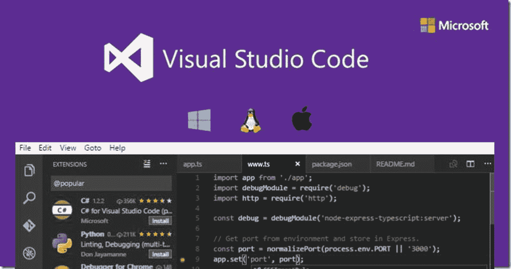

# 1.Visual Studio 代码简介

Visual Studio Code (VS Code)是微软为 Windows、Linux、macOS 打造的开源代码编辑器(图 [1-1](#Fig1) )。广受欢迎的标准特性包括支持调试、语法突出显示、自动代码完成、代码片段、代码重组和嵌入式 Git。用户可以自由更改设计主题、键盘快捷键和首选项，也可以安装额外的扩展来升级整个项目的功能。

微软在 2015 年的 Build 大会上首次推出了 VS 代码。到 2019 年，VS Code 成为最受欢迎的开发人员环境工具，87，317 名受访者中有 50.7%的人表示他们经常使用它。


图 1-1

Visual Studio 代码，一个免费的开源代码编辑器

在这一章中，我们将带您了解如何设置 VS 代码，并提供基本特性的概述:

*   **用户界面:**查看 VS 代码文档。

*   **设置概述:**使用 VS 代码启动和运行的文档，包括平台相关的设置。

*   **键盘快捷键:**自定义自己的快捷键选项，安装 Keymap 扩展。

*   **Keybinding 扩展:**如何安装一个 Keymap 扩展，将之前编辑器中的键绑定带到 VS 代码中。

## 用户界面

按照初衷，VS 代码是一个代码编辑器。与许多其他代码编辑器类似，VS Code 有一个通用的用户界面和浏览器布局，在左边显示您可以访问的所有文件和文件夹，在右边有一个编辑器，显示您已经打开的文件的内容。

### 基本布局

VS 代码有一个简单而直观的布局，它利用了为编辑器提供的所有空间，同时留下一些空间来浏览和访问文件夹或正在进行的项目的完整上下文。用户界面分为五个主要区域:

*   **编辑器:**编辑当前文件的主要空间。您可以并排打开任意数量的编辑器，也可以垂直和水平打开。

*   **侧边栏:**这个区域有不同的视图，例如资源管理器，以便在您处理项目时提供最大的帮助。

*   **状态栏:**当前项目和正在编辑的文件的信息。

*   **活动栏:**位于最左侧，这个区域使您能够在视图之间切换，并为您提供额外的特定于上下文的度量——例如，传出变更的数量。

*   **面板:**您可以在编辑器区域下方显示不同的面板，用于输出或调试内容、错误、警告或集成信息。该面板还可以向右移动，以获得更大的垂直空间。

每次启动 VS 代码时，它都以上次离开时的状态打开。文件夹、布局和打开的文件将保持不变。每个编辑器中打开的文件在编辑器区域的顶部显示有选项卡式标题(选项卡)。要了解有关选项卡式标题的更多信息，请参阅选项卡部分的详细信息。你也可以移动侧边栏到右边(查看➤右移侧边栏)或者增强它的可见性(Ctrl+B)。

### 并排编辑

如前所述，您可以纵向和横向并排打开任意多个编辑器。如果已经打开了一个编辑器，有多种方法可以将另一个编辑器放在现有编辑器的旁边:

*   按住 Alt 键并单击浏览器中的文件。

*   Ctrl+\将活动编辑器一分为二。

*   从文件的资源管理器上下文菜单中打开到侧面(Ctrl+Enter)。

*   点按编辑器右上角的“拆分编辑器”按钮。

*   将文件拖放到编辑器区域的任意一侧。

*   快速打开(Ctrl+P)文件列表中的 Ctrl+Enter (macOS: Cmd+Enter)。

一旦打开另一个文件，正在运行的编辑器将显示该文件的内容。因此，如果您有两个并排的编辑器，并且您需要在右边的编辑器中打开文件 doc.cs，请确保在打开文件 doc.cs 之前该编辑器是活动的(通过单击它)

默认情况下，编辑器在活动编辑器的右侧打开。您可以通过设置 work bench . editor . opensidebysidedirection 和 modify 来更改此模式，以便在活动编辑器的底部打开新的编辑器。同时，当您有多个活跃的编辑器时，您可以通过按住 Ctrl (macOS: Cmd)键并按下 1、2 和 3 来轻松地在它们之间切换。此外，如果您愿意，您可以调整编辑器的大小和重新排序它们:只需拖放编辑器标题区域来重新定位或调整编辑器的大小。

### Minimap(最小化)

Minimap(代码大纲)允许你对你的源代码有一个高层次的概述，这对于简单的导航和代码理解是非常有用的。一个文件的小地图显示在编辑器的右边。您也可以单击或拖动阴影区域，快速切换到文件的不同部分。同样值得注意的是，你可以将小地图移动到左侧，甚至完全禁用它，只需在你的用户或工作区设置中设置“editor.minimap.side”:、“left”或“editor . minimap . enabled”:false。

### 缩进参考线

编辑器上方的图像还显示了垂直线或缩进参考线，它们有助于您自由观察匹配的缩进级别。如果您想关闭这些缩进参考线，您应该在您的用户或工作区设置中设置“editor . renderindentguides”:false。

### 面包屑

如果您再次查看编辑器，您会注意到在它的内容上方有一个名为 Breadcrumbs 的导航栏。它可以显示您的当前位置，并让您在文件夹、文件和符号之间快速导航。

面包屑还倾向于显示文件路径，如果活动文件类型支持符号语言，它会显示光标位置之前的符号路径。您可以使用查看➤显示面包屑简单命令关闭面包屑。您还可以在编辑器的 Breadcrumbs 部分访问有关 Breadcrumbs 功能的相同信息。

### 探险家

浏览器是一种工具，用于浏览、打开和操作编辑项目中的所有文件和文件夹。因为 VS 代码是基于文件和文件夹的，所以您可以在任何时候简单地通过在 VS 代码中打开一个文件或文件夹来开始。一旦在 VS 代码中打开一个文件夹，文件夹的内容就会显示在资源管理器中。您可以从这里进行许多修改，例如:

*   创建、删除和重命名文件和文件夹。

*   使用拖放功能更改文件和文件夹的位置。

*   查看上下文菜单以查看所有选项。

此外，您可以从 VS 代码外部将文件拖放到资源管理器中，以制作它们的 VS 副本，这样，如果资源管理器为空，VS 代码将改为访问它们。

VS 代码也可以很好地与您可能使用的其他工具配合使用，尤其是命令行工具。如果您需要在 VS 代码中打开的文件夹的上下文中运行命令行工具，请右键单击该文件夹并选择在命令提示符下打开(或者在 macOS 或 Linux 上的终端中打开)。

同时，通过右键单击文件或文件夹并选择在资源管理器中显示(或在 macOS 上的 Finder 中显示，或在 Linux 上打开包含文件夹)，您可以在本机资源管理器中导航到文件或文件夹的位置。您也可以键入 Ctrl+P(快速打开选项)来按文件名快速搜索和打开文件。

默认情况下，VS 代码不会从资源管理器中打开某些文件夹(例如。git)。在这种情况下，您可以使用 files.exclude 设置来编辑在资源管理器中隐藏文件和文件夹的规则。但是，如果您有任何派生的资源文件，如\*。Unity 或\*中的 meta。js 在 TypeScript 项目中，那么这个解决方案实际上是没有用的。请注意，Unity 要排除\*.cs.metafiles，选择的模式应该是“* */* . cs . meta”:true。对于 TypeScript，可以用“**/*”排除为 TypeScript 文件生成的 JavaScript。js": {"when": "$(basename)。ts"}。

### 多重选择

您可以在文件资源管理器中选择多个文件，并打开编辑器视图来完成对多个项目的操作(删除、拖放、打开到侧面)。只需使用 Ctrl/Cmd 键单击选择单个文件，然后按住 Shift 键单击选择一个范围。如果选择两个项目，现在可以使用上下文菜单“比较所选项目”命令来快速区分这两个文件。此外，请记住，在早期的 VS 代码版本中，按住 Ctrl/Cmd 键单击会在旁边的新编辑器组中打开一个文件。如果您仍然喜欢此功能，可以使用 work bench . list . multiselect modifier 设置来修改多选，以便通过“work bench . list . multiselect modifier”使用 alt 键:“Alt”。

### 过滤文档树

可以在文件资源管理器中过滤当前可见的文件。您可以简单地开始键入您想要匹配的文件名的一部分，将焦点保持在文件资源管理器上。您将能够在文件资源管理器的右上角看到一个过滤框，显示您到目前为止键入的内容，匹配的文件名将突出显示。一旦您按下光标键上下移动文件列表，它将在匹配的文件或文件夹之间切换。但是，切换“过滤器”框并选择“根据类型启用过滤器”将只显示匹配的文件和文件夹。您可以应用 X Clear 按钮来清除过滤器。

### 大纲视图

Outline 视图是文件资源管理器底部的一个部分。激活后，它将显示当前活动编辑器的符号树。Outline 视图有不同的排序方式和可选的光标跟踪，并支持常见的打开手势。它还有一个输入框，可以在您键入时搜索过滤器和符号。错误和警告也显示在 Outline 视图中，使您可以对问题及其位置有所了解。

至于符号，视图很大程度上依赖于您为不同文件类型安装的扩展计算的数据。例如，内置的降价支持返回降价文件符号的降价标题层次结构。

### 降价大纲视图

有一些大纲视图设置允许您启用和禁用项目，并在显示错误和警告的情况下进行操作(默认情况下全部启用): <sup>[1](#Fn1)</sup>

*   **outline.icons:** 用图标切换渲染轮廓元素。

*   **outline . problems . enabled:**显示大纲元素的错误和警告。

*   **outline.problems.badges:** 切换对错误和警告使用徽章。

*   **outline.problems.colors:** 切换使用错误和警告的颜色。

### 打开编辑器

在浏览器的顶部，有一个标记为“打开的编辑器”的部分，显示活动文件或预览的列表。也可能有一些您之前在 VS 代码中打开的可见文件。例如，如果您对文件进行更改、双击文件头、在资源管理器中双击文件或打开不属于当前文件夹的文件，文件将在打开的编辑器视图中列出。通过在打开的编辑器视图中单击一个项目，它在 VS 代码中变成活动的。完成项目后，如果希望从打开的编辑器视图中单独移除文件，或移除所有文件，可以使用视图:关闭所有编辑器或在组操作中查看并关闭所有编辑器。

### 视图

文件资源管理器只是 VS 代码中可用的视图之一。也有观点认为: <sup>[2](#Fn2)</sup>

*   **搜索:**在您打开的文件夹中提供全局搜索和替换。

*   **源代码控制:** VS 代码默认包含 Git 源代码控制。

*   **Run:** VS 代码的运行和调试视图显示变量、调用栈和断点。

*   **扩展:**在 VS 代码中安装和管理你的扩展。

*   **自定义视图:**扩展贡献的视图。

使用“视图:打开视图”命令可以访问这些视图。

### 活动栏

左侧的活动栏旨在方便您在视图之间切换。您还可以通过将视图拖放到活动栏上来重新排序视图，或者通过右键单击隐藏活动栏来隐藏整个视图。

### 命令面板

VS 代码也很容易通过键盘访问。需要知道的最有用的组合键是 Ctrl+Shift+P，它调用命令面板。使用命令面板，您可以访问 VS 代码的所有功能，包括大多数已实现操作的键盘快捷键。命令选项板提供了对许多命令的访问。您可以管理编辑器命令、打开文件、搜索项目以及查看文件的快速大纲，所有这些都可以在同一个交互式窗口中完成。以下是几个导航组合: <sup>[3](#Fn3)</sup>

*   Ctrl+P 将允许您通过键入名称来导航到任何文件或符号。

*   Ctrl+Tab 将在最后一组打开的文件中循环。

*   Ctrl+Shift+P 将把您直接带到编辑器命令。

*   Ctrl+Shift+O 将让您导航到文件中的特定符号。

*   Ctrl+G 将让您导航到文件中的特定行。

*   类型？输入字段，以获取可从快速打开帮助中执行的可用命令列表。

## 配置编辑器

VS 代码有许多选项供您配置编辑器。从视图菜单中，您可以隐藏或切换用户界面的各个部分，如侧栏、状态栏和活动栏。

### 隐藏菜单栏(适用于 Windows、Linux)

您可以通过选择 window.menuBarVisibility 设置从经典到切换来隐藏 Windows 和 Linux 上的菜单栏。切换设置意味着按一下 Alt 键将再次显示菜单栏。

您也可以使用“查看➤切换菜单栏”命令删除 Windows 和 Linux 上的菜单栏。此命令将 window.menuBarVisibility 从经典切换到精简，从而使菜单栏移动到活动栏中。要将菜单栏移回经典位置，请再次选择“查看➤切换菜单栏”命令。

### 设置

大多数基本的编辑器配置保存在可以直接修改的设置中。可以通过用户设置全局设置选项，也可以通过工作空间设置按项目或文件设置选项。设置选项保存在 settings.json 文件中。你可以按照路径选择文件➤首选项➤设置(或按 Ctrl+，)来编辑用户设置. json 文件。要更改工作空间设置，请单击工作空间设置选项卡编辑工作空间设置. json 文件。注意，对于 macOS 用户，首选项菜单位于代码下，而不是文件下；请遵循➤代码首选项➤设置。

您可以在左侧窗口中访问 VS 代码默认设置，并在右侧访问您的可编辑 settings.json。还可以使用顶部的搜索框轻松过滤默认设置中的设置。通过单击设置左侧的编辑图标，可以将设置复制到右侧可编辑的 settings.json 中。具有一组固定值的设置允许您选择一个主要值作为其编辑图标菜单的一部分。编辑设置后，键入 Ctrl+S 以确定您的更改。这些更改将立即生效。工作空间设置将覆盖用户设置，有利于共享特定的项目设置。

### 禅宗模式

Zen 模式通过移除除编辑器之外的所有用户界面项目(活动栏、状态栏、侧栏和面板),显示全屏并仅居中编辑器布局，使您能够专注于代码。可以使用“视图”菜单、命令调板或快捷键 Ctrl+K Z 来切换 Zen 模式，要退出 Zen 模式，请按两次 Esc。可以通过 zenMode.fullScreen 禁用全屏过渡。zenMode 可以使用以下设置进一步修改:zenMode.hideStatusBar、zenMode.hideTabs、zenMode.fullScreen、zenMode.restore 和 zenMode.centerLayout。

### 居中编辑器布局

居中编辑器布局允许您将编辑器区域居中对齐。如果您发现自己在大型显示器上使用单个编辑器，这将非常有用。您可以使用 Alt 键应用边上的窗扇来调整视图的大小，使用相同的方法您也可以独立移动窗扇。

### 制表符

VS 代码在编辑器上方的标题区域显示带有选项卡式标题或标签的打开项。如果您打开一个文件，则会为该文件添加一个新选项卡。制表符允许您在文件之间快速导航，并且您可以拖放制表符以便根据您的意愿对它们重新排序。当打开的项目多于标题区域所能容纳的项目时，可以应用“显示打开的编辑器”命令来显示选项卡式项目的下拉列表。

如果不想使用选项卡，可以通过将 workbench.editor.showTabs 设置设置为 false 来关闭该功能:" work bench . editor . show Tabs ":false。

### 制表符排序

默认情况下，新选项卡包含在现有选项卡的右侧，但是您可以使用 work bench . editor . open positioning 设置来管理希望新选项卡出现的位置。例如，您可能希望新的选项卡式项目出现在左侧，方法是使用“work bench . editor . open positioning”:“left”。

### 预览模式

在浏览器中单击或选择一个文件后，它将以演示模式显示，并重用现有的选项卡。如果您只需要快速浏览文件，并且不希望您访问的每个文件都有自己的选项卡，这将非常有用。当您开始编辑文件或在浏览器中双击打开文件时，会为该文件分配一个新的选项卡。预览模式在标签标题中用斜体表示:*预览模式*。

如果您不希望看到预览模式，而总是创建一个新选项卡，您可以使用以下设置来控制模式:

*   **work bench . editor . enable preview:**全局启用或禁用预览编辑器。

*   **work bench . editor . enablepreviewfromcquickopen:**启用或禁用从快速打开打开时的预览编辑器。

### 编辑组

如果您通过“拆分编辑器”或“向侧面打开”命令拆分编辑器，则会创建一个可容纳一组项目的新编辑器区域。同时，您可以水平和垂直并排打开任意多个编辑器区域。您可以在 Explorer 视图顶部的 OPEN EDITORS 部分按顺序查看它们。OPEN EDITORS 部分还允许您在工作台上拖放编辑器组，在组之间移动各个选项卡，并通过单击 Close All 快速关闭整个组。

确保 VS 代码使用编辑器组，不管你是否有标签。如果没有标签，编辑器群组就是一堆打开的项目，最近搜索的项目在编辑器面板中可见。默认情况下，当您拆分编辑器以从侧面打开它时，编辑器群组以垂直栏的形式组织。您还可以按照您喜欢的任何布局(垂直和水平)排列编辑器群组。

为了支持灵活的布局，您应该创建空的编辑器组。默认情况下，关闭编辑器组的最后一个编辑器也会关闭该组本身，但您可以使用新设置 work bench . editor . closeemptygroups:false 来修改此行为。您还可以在查看➤编辑器布局菜单中查看是否有任何预定义的编辑器布局集。

通过单击编辑器工具条分割编辑器操作打开的编辑器通常会在活动编辑器的右侧打开。如果您喜欢在活动编辑器下面打开编辑器，请配置新的设置 work bench . editor . opensidebysidedirection:down。

有很多键盘命令可以单独使用键盘来调整编辑器布局，但是如果您更喜欢使用鼠标，拖放是将编辑器拆分到任何方向的最快方法。此外，如果您在切换工具栏操作以拆分编辑器时按住 Alt 键，它将提供向另一个方向的拆分。这是另一种快速向右或向下拆分的方法。

### 快捷键

了解一些方便的键盘快捷键来在编辑器和编辑器组之间快速导航对你来说也是非常有益的。下面是一些最广泛使用的: <sup>[4](#Fn4)</sup>

*   Ctrl+PageDown 转到右边的编辑器。

*   Ctrl+PageUp 转到左边的编辑器。

*   Ctrl+Tab 打开编辑器组 MRU 列表中的上一个编辑器。

*   Ctrl+1 转到最左边的编辑器组。

*   Ctrl+2 转到中心编辑器组。

*   Ctrl+3 转到最右边的编辑器组。

*   Ctrl+F4 关闭活动编辑器。

*   Ctrl+K W 关闭编辑器组中的所有编辑器。

*   关闭所有编辑器。

### 禁用预览模式

如果没有标签，文件浏览器的打开编辑器部分是一个很好的文件导航方式。在预览编辑器模式下，文件不会显示在打开的编辑器列表中，也不会显示在单击打开的编辑器组中。您可以通过 workbench.editor.enablePreview 和 work bench . editor . enablepreviewfromcquickopen 设置关闭此功能。

### 使用 Ctrl+Tab 在整个编辑器历史中导航

您可以编辑 Ctrl+Tab 的键绑定，以向您显示独立于活动编辑器组的历史中所有打开的编辑器的列表。您可以编辑您的键绑定，并使用以下命令添加:

```py
{ "key": "ctrl+tab", "command": "workbench.action.openPreviousEditorFromHistory" },
{ "key": "ctrl+tab", "command": "workbench.action.quickOpenNavigateNext", "when": "inQuickOpen" }

```

### 关闭整个群组而不是单个编辑器

如果您想在关闭一个编辑器时重复 VS 代码关闭整个组的行为，您可以使用:

```py
macOS: { "key": "cmd+w", "command": "workbench.action.closeEditorsInGroup" }
Windows/Linux: { "key": "ctrl+w", "command": "workbench.action.closeEditorsInGroup" }

```

### 窗口管理

VS 代码有一些操作选项来决定如何在会话之间打开或恢复窗口。默认情况下，设置 window.openFoldersInNewWindow 和 window.openFilesInNewWindow 用于配置打开新窗口或重新使用文件或文件夹的最后一个活动窗口以及可能的值。

如果编辑为默认条件，VS 代码将恢复您在之前的会话中工作的所有窗口。但是，仍然存在忽略此设置的情况(例如，如果使用-new-window 或-reuse-window 命令行选项)。

window.restoreWindows 设置告诉 VS 代码如何恢复上一个会话中打开的窗口。您还可以将此设置更改为从不重新打开任何窗口，并且总是从一个空的 VS 代码实例开始。

我们现在将看看如何为 Python 开发设置 VS 代码。

## 设置 Visual Studio 代码

获取和激活 VS 代码既简单又快捷。只需下载一小段，然后你就可以在几分钟内安装它(图 [1-2](#Fig2) )。



图 1-2

设置 VS 代码

### 跨平台

VS Code 是一个免费的代码编辑器，可以在 macOS、Linux 和 Windows 操作系统上运行。

为了更顺利地安装，您可以遵循以下特定于平台的指南: <sup>[5](#Fn5)</sup>

#### 苹果

1.  下载用于 macOS 的 VS 代码。

2.  打开浏览器的下载列表，找到下载的归档文件。

3.  选择放大镜图标以在 Finder 中打开归档。

4.  将 VS Code.app 拖到 Applications 文件夹，使其在 macOS Launchpad 中可用。

5.  将 VS 代码添加到您的 Dock 中，方法是右键单击图标，打开上下文菜单，然后选择 Options，Keep in Dock。

#### Linux 操作系统

VS 代码在 Snap Store 中以 Snap 包的形式正式发布，也可以以 RPM 或 DEB 包的形式从官方网站下载。

可以通过运行:sudo snap install - classic code #或者 code-insiders 来安装。

安装后，Snap 守护进程将在后台自动更新 VS 代码。每当有新的更新可用时，您还会收到产品内更新通知。

#### Windows 操作系统

1.  下载 Windows 的 VS 代码安装程序。

2.  下载后，运行安装程序(VSCodeUserSetup-{version}。exe)。这只需要一分钟。

3.  默认情况下，VS 代码安装在 C:\ users \ { username } \ AppData \ Local \ Programs \ Microsoft VS Code 下。

VS 代码是轻量级的，应该可以在大多数可用的硬件和平台版本上运行。您可以查看系统要求，以了解您的计算机配置是否受支持。

### 更新节奏

VS Code 每个月都会发布一个新版本，包含新特性和渐进式错误修复。大多数平台都安装了自动更新，所以当新版本发布时，系统会提示您寻找新版本。您也可以手动检查更新，方法是在 Linux 和 Windows 上运行帮助➤检查更新，或者在 macOS 上运行代码➤检查更新。此外，如果您想根据自己的计划更新 VS 代码，也可以禁用自动更新。

### 内部人员夜间构建

如果您想在夜间检查 VS 代码构建，以便比其他用户更早地获得新特性，或者验证错误修复，您可以安装 Insiders 构建。内部版本与每月稳定版本并排安装，您可以在同一台机器上自由地合并和使用它们。内部人员构建与 VS 代码开发团队日常使用的工具相同。如果您对要提供的新特性有宝贵的反馈，开发团队会非常感激。

### 便携模式

VS 代码也支持便携模式安装。这种模式确保了由 VS 代码创建和维护的所有数据都存储在近距离内，以便在必要时可以跨环境移动，甚至是在 USB 驱动器上。

### 附加组件

VS 代码是一个占用空间相对较小的编辑器。与其他传统编辑器不同，传统编辑器倾向于包含所有其他功能，使用 VS 代码，您可以根据对您最重要的开发技术来调整和定制您的安装。

### 扩展ˌ扩张

VS 代码扩展允许第三方添加对以下内容的支持:

*   **语言:** C++，C#，Go，Java，Python

*   **工具:**斯洛文尼亚语、JSHint 语、PowerShell 语

*   **调试器:** PHP XDebug

*   按键映射: Vim，Sublime Text，IntelliJ，Emacs，Atom，括号，Visual Studio，Eclipse

扩展平滑地集成到 VS Code 的用户界面、命令和任务运行系统中，所以你会发现通过 VS Code 的共享接口很容易操作不同的技术。

## Visual Studio 代码的键绑定

VS 代码为您提供了一个直接从键盘管理大多数任务的选项(图 [1-3](#Fig3) )。本节列出了默认绑定(键盘快捷键),并概述了如何更新它们。


图 1-3

在 VS 代码中使用键盘快捷键

### 键盘快捷键编辑器

VS 代码有许多简单的键盘快捷键使用键盘快捷键编辑器。它说明了所有可用的命令，包括有无按键绑定，您可以使用可用的选项轻松地更改、删除和更新这些命令。它的顶部还有一个搜索框，在搜索命令或按键时非常有用。您可以通过查看文件➤首选项➤键盘快捷键(macOS 上的代码➤首选项➤键盘快捷键)下的菜单来打开此编辑器。您也可以在帮助➤键盘快捷键参考中访问这些键盘快捷键的可打印版本，并获得一个适合打印的压缩 PDF 版本作为用户友好的参考。

#### 检测按键绑定冲突

如果您安装了太多的扩展，或者您已经自定义了大部分键盘快捷键，您可能会不时地遇到键绑定冲突，因为同一个键盘快捷键被映射来执行几个命令。这可能会导致混乱，尤其是当您继续使用编辑器时，不同的键绑定会进入和超出范围。您应该不时地查看键盘快捷键编辑器，该编辑器有一个上下文菜单命令“显示相同的键绑定”,该命令用于根据键盘快捷键过滤键绑定，以显示并潜在地防止任何冲突。

#### 按键疑难解答

要解决按键问题，可以激活命令 Developer:Toggle Keyboard shortcut s trouble shooting。这将有助于记录发送的键盘快捷键，并提供对带有相应日志文件的输出面板的访问。

有了它，你可以稍后按下你想要的键绑定，并检查什么键盘快捷键 VS 代码使用和什么命令被激活。

### 键盘规则

每条规则由以下内容组成: <sup>[6](#Fn6)</sup>

*   定义被按下的键的键。

*   包含要执行的命令的标识符的命令。

*   可选的 when 子句，包含将根据当前上下文计算的布尔表达式。

称为和弦的两个单独的按键动作通过用空格分隔两个按键来描述。比如 Ctrl+K Ctrl+C。

按下按键时:

*   规则是自下而上评估的。

*   第一个匹配的规则，包括键和何时被接受。

*   不再处理任何规则。

*   如果找到一个规则，并且它也有一个命令集，则执行该命令。

额外的 keybindings.json 规则在运行时被省略到默认规则的底部，因此允许它们覆盖默认规则。VS 代码会观察 keybindings.json 文件，因此在 VS 代码运行时编辑它会在运行时升级规则。

通过分析存储在 JSON 中的规则列表来完成键盘快捷键的分派。举几个例子来说明: <sup>[7](#Fn7)</sup>

```py
// Keybindings that are active when the focus is in the editor:
{ "key": "home",            "command": "cursorHome",              "when": "editorTextFocus" },
{ "key": "shift+home",      "command": "cursorHomeSelect",            "when": "editorTextFocus" },

// Keybindings that are complementary:
{ "key": "f5",              "command": "workbench.action.debug.continue", "when": "inDebugMode" },
{ "key": "f5",              "command": "workbench.action.debug.start",    "when": "!inDebugMode" },

// Global keybindings:
{ "key": "ctrl+f",          "command": "actions.find" },
{ "key": "alt+left",        "command": "workbench.action.navigateBack" },
{ "key": "alt+right",       "command": "workbench.action.navigateForward" },

// Global keybindings using chords (two separate keypress actions):
{ "key": "ctrl+k enter",    "command": "workbench.action.keepEditor" },
{ "key": "ctrl+k ctrl+w",   "command": "workbench.action.closeAllEditors" },

```

### 接受的密钥

密钥由修饰符和密钥本身组成。接受以下修饰符:

<colgroup><col class="tcol1 align-left"> <col class="tcol2 align-left"></colgroup> 
| 

平台

 | 

修饰语

 |
| --- | --- |
| 苹果 | Ctrl+、Shift+、Alt+、Cmd+ |
| Windows 操作系统 | Ctrl+，Shift+，Alt+，Win+ |
| Linux 操作系统 | Ctrl+， Shift+， Alt+， Meta+ |

接受以下密钥:

*   f1-f19，a-z，0-9

*   `, -, =, [, ], \, ;, ', ,, ., /

*   向左、向上、向右、向下、向上翻页、向下翻页、结束、回家

*   制表符、回车、转义、空格、退格、删除

*   暂停断开，帽锁，插入

*   numpad0-numpad9、numpad _ multiply、numpad_add、numpad_separator

*   numpad_subtract、numpad_decimal、numpad_divide

### 命令参数

您可以使用参数调用命令。如果您经常对特定的文件或文件夹执行相同的操作，这尤其有用。您可以包含一个自定义的键盘快捷键来完成您需要它做的事情。下面是一个覆盖 Enter 键以打印一些文本的示例:

```py
{
  "key": "enter",
  "command": "type",
  "args": { "text": "Hello There" },
  "when": "editorTextFocus"
}

```

type 命令将接收{"text": "Hello There"}作为其第一个参数，并将" Hello There "添加到文件中，而不是生成默认命令。

### 删除特定的键绑定规则

您可以编写一个键绑定规则脚本，以消除特定的默认键绑定。使用 keybindings.json，重新定义 VS 代码的所有键绑定总是可以接受的，但是做一点小的添加可能是有挑战性的，特别是在重载的键周围，比如 Tab 或 Escape。为了隐藏特定的键绑定，在命令中添加一个-,该规则将成为一个移除规则。

### 独立于键盘布局的 Nindings

使用扫描代码，定义不随键盘布局的修改而改变的键绑定是可管理的。比如:{ " key ":" cmd+[斜杠]"，" command ":" editor . action . commentline "，以及" when": "editorTextFocus" }。

接受以下扫描代码:

```py
[F1]-[F19], [KeyA]-[KeyZ], [Digit0]-[Digit9]
[Backquote], [Minus], [Equal], [BracketLeft], [BracketRight], [Backslash], [Semicolon], [Quote], [Comma], [Period], [Slash]
[ArrowLeft], [ArrowUp], [ArrowRight], [ArrowDown], [PageUp], [PageDown], [End], [Home]
[Tab], [Enter], [Escape], [Space], [Backspace], [Delete]
[Pause], [CapsLock], [Insert]
[Numpad0]-[Numpad9], [NumpadMultiply], [NumpadAdd], [NumpadComma]
[NumpadSubtract], [NumpadDecimal], [NumpadDivide]

```

### When 子句上下文

VS 代码通过可选的 when 子句让您完全控制何时激活键绑定。如果一些键绑定没有 when 子句，那么这些键绑定在任何时候都是全局可用的。when 子句与操作键绑定的布尔值 true 或 false 相关。

此外，VS 代码根据 VS 代码用户界面中可用和活动的元素来设置各种上下文键和特定值。例如，内置的开始调试命令具有键盘快捷键 F5，该快捷键仅在有适当的调试器可用(context debuggersAvailable 为 true)并且编辑器不处于调试模式(context inDebugMode 为 false)时启用。

### 条件运算符

对于 when 子句条件表达式，表 [1-1](#Tab1) 中的条件运算符用于键绑定。<sup>T3】8T5】</sup>

表 1-1

条件运算符

<colgroup><col class="tcol1 align-left"> <col class="tcol2 align-left"> <col class="tcol3 align-left"></colgroup> 
| 

操作员

 | 

标志

 | 

例子

 |
| --- | --- | --- |
| 平等 | == | " editorLangId == typescript " |
| 不平等 | ！= | "resourceExtname ！= .js" |
| 或者 | &#124;&#124; | " isLinux&#124;&#124;isWindows " |
| 和 | && | “& textInputFocus！editorReadonly " |
| 比赛 | =~ | " resource scheme = ~ /^untitled$&#124;^file$/ " |

### 可用上下文

在 when 子句上下文参考中，您可以看到一些可用的上下文。这里的列表并不详尽，您可以通过在键盘快捷键编辑器中搜索和过滤(首选项:打开键盘快捷键)或查看默认的 Keybindings JSON 文件(首选项:打开默认键盘快捷键(JSON))来查找其他 when 子句上下文。表格 [1-2](#Tab2) 到 [1-12](#Tab12) 为一些基本命令提供了快捷方式。 <sup>[9](#Fn9)</sup>

表 1-2

基本编辑

<colgroup><col class="tcol1 align-left"> <col class="tcol2 align-left"> <col class="tcol3 align-left"></colgroup> 
| 

命令

 | 

钥匙

 | 

命令 id

 |
| --- | --- | --- |
| 切割线(空选择) | Ctrl+X | editor . action . clipboard cut action |
| 复制行(空选择) | Ctrl+C | editor . action . clipboardcopyaction |
| 粘贴 | Ctrl+V | editor . action . clipboard paste action |
| 删除行 | Ctrl+Shift+K | 编辑器. action.deleteLines |
| 在下面插入一行 | 按住 Ctrl 键并输入 | editor.action.insertLineAfter |
| 在上面插入一行 | Ctrl+Shift+Enter | editor.action.insertLineBefore |
| 下移一行 | alt+向下 | editor . action . movelinesdownaction |
| 向上移动一行 | Alt+Up | editor . action . movelinesupaction |
| 向下复制一行 | shift+Alt+向下 | editor . action . copylinesdownaction |
| 复制整行 | shift+Alt+向上 | editor . action . copylinesupaction |
| 取消 | Ctrl+Z 组合键 | 取消 |
| 重做 | Ctrl+Y | 重做 |
| 将所选内容添加到下一个查找匹配项 | Ctrl+D | editor . action . addselectiontonxtfindmatch |
| 将最后一个选择移动到下一个查找匹配项 | Ctrl+K | editor . action . moveselectiontextfindmatch |
| 撤消上一次光标操作 | Ctrl+U | cursorUndo |
| 在行尾插入光标 | Shift+Alt+I | editor . action . insertcursoratendofeachlineselected |
| 选择当前选择的所有匹配项 | Ctrl+Shift+L | editor . action . select 突出显示 |
| 选择当前单词的所有匹配项 | Ctrl+F2 | editor.action.changeAll |
| 选择当前行 | Ctrl+L | 扩大选举 |
| 在下面插入光标 | ctrl+Alt+向下 | editor . action . insertcursorbelow |
| 在上方插入光标 | Ctrl+Alt+Up | editor . action . insertcursorabove |
| 跳转到匹配的括号 | Ctrl+Shift+\ | editor . action . jumptobragg |
| 缩进行 | Ctrl+] | 编辑器. action.indentLines |
| 突出线路 | Ctrl+[ | editor.action.outdentLines |
| 转到行首 | 主页 | 光标之家 |
| 转到行尾 | 目标 | cursorEnd |
| 转到文件结尾 | Ctrl+End | 光标底部 |
| 转到文件开头 | Ctrl+Home | cursorTop |
| 向下滚动一行 | ctrl+向下 | 向下滚动 |
| 向上滚动一行 | ctrl+向上 | scrollLineUp |
| 向下滚动页面 | Alt+PageDown | 向下滚动页面 |
| 向上滚动页面 | Alt+PageUp | scrollPageUp |
| 折叠区域 | Ctrl+Shift+[ | editor.fold |
| 展开(未折叠)区域 | Ctrl+Shift+] | 编辑器.展开 |
| 折叠(折叠)所有子区域 | Ctrl+K Ctrl+[ | editor.foldRecursively |
| 展开(取消折叠)所有子区域 | Ctrl+K Ctrl+] | editor.unfoldRecursively |
| 折叠(折叠)所有区域 | Ctrl+K Ctrl+0 | 编辑器. foldAll |
| 展开(取消折叠)所有区域 | Ctrl+K Ctrl+J | editor.unfoldAll |
| 添加行注释 | Ctrl+K Ctrl+C | editor.action.addCommentLine |
| 删除行注释 | Ctrl+K Ctrl+U | editor . action . remove commentline |
| 切换行注释 | Ctrl+/ | editor.action.commentLine |
| 切换块注释 | Shift+Alt+A | editor . action . block 注释 |
| 发现 | Ctrl+F | 动作.查找 |
| 替换 | Ctrl+H | 编辑器. action . startfindreplaceaction |
| 查找下一个 | 进入 | editor.action.nextMatchFindAction |
| 查找上一个 | Shift+Enter | editor . action . previousmatchfindaction |
| 选择“查找匹配”的所有匹配项 | Alt+Enter | editor.action.selectAllMatches |
| 切换区分大小写 | Alt+C | toggleFindCaseSensitive |
| 切换查找正则表达式 | Alt+R | toggleFindRegex |
| 切换查找整个单词 | Alt+W | toggleFindWholeWord |
| 切换使用 Tab 键设置焦点 | Ctrl+M | editor . action . toggletabfocusmode |
| 切换渲染空白 | 未赋值的 | toggleRenderWhitespace |
| 切换自动换行 | Alt+Z | editor.action.toggleWordWrap |

表 1-3

丰富的语言编辑

<colgroup><col class="tcol1 align-left"> <col class="tcol2 align-left"> <col class="tcol3 align-left"></colgroup> 
| 

命令

 | 

钥匙

 | 

命令 id

 |
| --- | --- | --- |
| 触发建议 | ctrl+空格 | 编辑器.操作.触发器建议 |
| 触发参数提示 | ctrl+Shift+空格键 | editor . action . trigger 参数提示 |
| 格式化文档 | 移位+Alt+F | editor . action . format 文档 |
| 格式选择 | Ctrl+K Ctrl+F | 编辑器.操作.格式选择 |
| 转到定义 | F12 | editor.action.revealDefinition |
| 显示悬停 | Ctrl+K Ctrl+I | 编辑器. action.showHover |
| 峰值定义 | Alt+F12 | editor.action.peekDefinition |
| 向侧面打开定义 | Ctrl+K F12 | editor . action . revealdefinitionside |
| 权宜之计 | Ctrl+。 | 编辑器. action.quickFix |
| 转到参考 | Shift+F12 | editor.action.goToReferences |
| 重命名符号 | 第二子代 | 编辑器.操作.重命名 |
| 替换为下一个值 | Ctrl+Shift+。 | editor . action . inplace replace . down |
| 用以前的值替换 | Ctrl+Shift+， | editor . action . inplace replace . up |
| 展开 AST 选择 | shift+Alt+右移 | editor . action . smart select . expand |
| 收缩 AST 选择 | shift+Alt+向左 | editor . action . smart select . shrink |
| 修剪尾部空白 | Ctrl+K Ctrl+X | editor . action . trimtrailinghhitespace |
| 更改语言模式 | Ctrl+K M | work bench . action . editor . changeloangemode |

表 1-4

航行

<colgroup><col class="tcol1 align-left"> <col class="tcol2 align-left"> <col class="tcol3 align-left"></colgroup> 
| 

命令

 | 

钥匙

 | 

命令 id

 |
| --- | --- | --- |
| 显示所有符号 | Ctrl+T | work bench . action . showall symbols |
| 转到线... | Ctrl+G | workbench.action.gotoLine |
| 转到文件...，快开 | Ctrl+P | workbench 动作 quickOpen |
| 转到符号... | Ctrl+Shift+O | workbench.action.gotoSymbol |
| 显示问题 | Ctrl+Shift+M | 工作台.操作.视图.问题 |
| 转到下一个错误或警告 | F8 | editor . action . marker . nextinfiles |
| 转到上一个错误或警告 | Shift+F8 | editor . action . marker . pre file |
| 显示所有命令 | Ctrl+Shift+P 或 F1 | work bench . action . show 命令 |
| 导航编辑器历史 | Ctrl+Tab | work bench . action . quickopenpreviousededitingroup |
| 回去 | alt+向左 | 工作台.操作.向后导航 |
| 快速输入返回 | alt+向左 | work bench . action . quick input back |
| 前进 | 好 | 工作台.操作.向前导航 |

表 1-5

编辑器/窗口管理

<colgroup><col class="tcol1 align-left"> <col class="tcol2 align-left"> <col class="tcol3 align-left"></colgroup> 
| 

命令

 | 

钥匙

 | 

命令 id

 |
| --- | --- | --- |
| 新窗口 | Ctrl+Shift+N | 工作台.操作.新窗口 |
| 关闭窗口 | Ctrl+W 组合键 | 工作台.操作.关闭窗口 |
| 关闭编辑器 | Ctrl+F4 | work bench . action . close active editor-work bench .动作.关闭作用中编辑器 |
| 关闭文件夹 | Ctrl+K F | 工作台.操作.关闭文件夹 |
| 在编辑器组之间循环 | 未赋值的 | work bench . action . navigateeditorgroups |
| plist 编辑器 | Ctrl+\ | 工作台.操作. splitEditor |
| 聚焦到第一个编辑组 | Ctrl+1 | work bench . action . focusfirsteditorgroup |
| 聚焦到第二个编辑组 | Ctrl+2 | work bench . action . focussecondeditorgroup |
| 聚焦到第三编辑组 | Ctrl+3 | work bench . action . focusthirdeditorgroup |
| 聚焦到左边的编辑组 | 未赋值的 | work bench . action . focuspreviousgroup |
| 聚焦到右边的编辑组 | 未赋值的 | work bench . action . focus next group |
| 向左移动编辑器 | Ctrl+Shift+PageUp | workbench 动作 moveeditorleftingroup |
| 向右移动编辑器 | Ctrl+Shift+PageDown | workbench 动作 moveEditorRightInGroup |
| 向左移动活动编辑器组 | Ctrl+K 向左 | work bench . action . moveactiveeditgroupleft |
| 向右移动活动编辑器组 | Ctrl+K 向右 | work bench . action . moveactiveeditorgroup right |
| 将编辑器移到下一组 | ctrl+Alt+右键 | work bench . action . moveeditortonextgroup |
| 将编辑器移到上一组 | ctrl+Alt+左键 | work bench . action . moveedittopreviewougroup |

表 1-6

文件管理

<colgroup><col class="tcol1 align-left"> <col class="tcol2 align-left"> <col class="tcol3 align-left"></colgroup> 
| 

命令

 | 

钥匙

 | 

命令 id

 |
| --- | --- | --- |
| 新文件 | Ctrl+N | work bench . action . files . newuntitled file |
| 开文件... | Ctrl+O | work bench . action . files . openfile |
| 救援 | Ctrl+S | 工作台.操作.文件.保存 |
| 全部保存 | Ctrl+K S | saveAll(保存全部) |
| 另存为... | Ctrl+Shift+S | 工作台.操作.文件.另存为 |
| 关闭 | Ctrl+F4 | work bench . action . close active editor-work bench .动作.关闭作用中编辑器 |
| 关闭其他 | 未赋值的 | 工作台.动作.收尾编辑器 |
| 封闭组 | Ctrl+K W 组合键 | work bench . action . closeeditorsingroup |
| 关闭其他组 | 未赋值的 | work bench . action . closeeditorsinothergroups |
| 向左关闭群组 | 未赋值的 | work bench . action . closeeditorstotheleft |
| 向右关闭群组 | 未赋值的 | work bench . action . closed store right-维护作业 |
| 全部关闭 | Ctrl+K Ctrl+W | work bench . action . closealleditors |
| 重新打开关闭的编辑器 | Ctrl+Shift+T | work bench . action . reopenclosededitor |
| 保持开放 | Ctrl+K Enter | 工作台.操作. keepEditor |
| 复制活动文件的路径 | Ctrl+K P | work bench . action . files . copypathfactory 文件 |
| 在窗口中显示活动文件 | Ctrl+K R 组合键 | work bench . action . files . revealactivefileinwindows |
| 在新窗口中显示打开的文件 | Ctrl+K | work bench . action . files . showopenedfileinnewwindow |
| 将打开的文件与 | 未赋值的 | work bench . files . action . comparefilewith |

表 1-7

显示

<colgroup><col class="tcol1 align-left"> <col class="tcol2 align-left"> <col class="tcol3 align-left"></colgroup> 
| 

命令

 | 

钥匙

 | 

命令 id

 |
| --- | --- | --- |
| 切换全屏 | F11 | work bench . action . toggle full screen |
| 切换 Zen 模式 | Ctrl+K Z 组合键 | workbench.action.toggleZenMode |
| 离开禅模式 | 逃跑 | 工作台。操作。请求模型 |
| 放大 | Ctrl+= | 工作台.动作. zoomIn |
| 缩小 | Ctrl+- | workbench.action.zoomOut |
| 重置缩放 | Ctrl+Numpad0 | workbench.action.zoomReset |
| 切换侧边栏可见性 | Ctrl+B | work bench . action . togglesidebarvisibility |
| 显示浏览器/切换焦点 | Ctrl+Shift+E | workbench.view.explorer |
| 显示搜索 | Ctrl+Shift+F | 工作台.视图.搜索 |
| 显示源代码管理 | Ctrl+Shift+G | 工作台.视图. scm |
| 显示运行 | Ctrl+Shift+D | 工作台.视图.调试 |
| 显示扩展 | Ctrl+Shift+X | 工作台.视图.扩展 |
| 显示输出 | Ctrl+Shift+U | 工作台.操作.输出. toggleOutput |
| 快速打开视图 | Ctrl+Q | workbench.action.quickOpenView |
| 打开新命令提示符 | Ctrl+Shift+C | work bench . action . terminal . opennativeconsole |
| 切换降价预览 | Ctrl+Shift+V | markdown.showPreview |
| 在侧面打开预览 | Ctrl+K V | markdown.showPreviewToSide |
| 切换集成终端 | Ctrl+`键 | 工作台.操作.终端. toggle 终端 |

表 1-8

搜索

<colgroup><col class="tcol1 align-left"> <col class="tcol2 align-left"> <col class="tcol3 align-left"></colgroup> 
| 

命令

 | 

钥匙

 | 

命令 id

 |
| --- | --- | --- |
| 显示搜索 | Ctrl+Shift+F | 工作台.视图.搜索 |
| 在文件中替换 | Ctrl+Shift+H | work bench . action . replace infiles |
| 切换匹配大小写 | Alt+C | toggleSearchCaseSensitive |
| 切换全字匹配 | Alt+W | toggleSearchWholeWord |
| 切换使用正则表达式 | Alt+R | toggleSearchRegex |
| 切换搜索详细信息 | Ctrl+Shift+J | work bench . action . search . togglequerydetails |
| 聚焦下一个搜索结果 | 法乐四联症 | search . action . focusextsearchresult |
| 聚焦上一个搜索结果 | Shift+F4 | search . action . focusprevioussearchresult |
| 显示下一个搜索词 | 向下 | history.showNext |
| 显示上一个搜索词 | 起来 | history . show 上一个 |

表 1-9

搜索编辑器

<colgroup><col class="tcol1 align-left"> <col class="tcol2 align-left"> <col class="tcol3 align-left"></colgroup> 
| 

命令

 | 

钥匙

 | 

命令 id

 |
| --- | --- | --- |
| 在编辑器中打开结果 | Alt+Enter | search.action.openInEditor |
| 焦点搜索编辑器输入 | 逃跑 | search . action . focusqueryeditorwidget |
| 再次搜索 | Ctrl+Shift+R | rerunSearchEditorSearch |
| 删除文件结果 | ctrl+Shift+退格键 | search . search editor . action . delete file results |

表 1-10

偏好；喜好；优先；参数选择

<colgroup><col class="tcol1 align-left"> <col class="tcol2 align-left"> <col class="tcol3 align-left"></colgroup> 
| 

命令

 | 

钥匙

 | 

命令 id

 |
| --- | --- | --- |
| 打开设置 | Ctrl+， | 工作台.操作. openSettings |
| 打开工作区设置 | 未赋值的 | work bench . action . openworkspacesettings |
| 打开键盘快捷键 | Ctrl+K Ctrl+S | work bench . action . openglobalkey bindings |
| 打开用户片段 | 未赋值的 | work bench . action . open snippet |
| 选择颜色主题 | Ctrl+K Ctrl+T | work bench . action . select 主题 |
| 配置显示语言 | 未赋值的 | work bench . action . configure locale |

表 1-11

调试

<colgroup><col class="tcol1 align-left"> <col class="tcol2 align-left"> <col class="tcol3 align-left"></colgroup> 
| 

命令

 | 

钥匙

 | 

命令 id

 |
| --- | --- | --- |
| 切换断点 | F9 | editor . debug . action . toggle 断点 |
| 开始 | F5 | 工作台.操作.调试.启动 |
| 继续 | F5 | 工作台.操作.调试.继续 |
| 启动(不调试) | Ctrl+F5 | 工作台.操作.调试.运行 |
| 中止 | F6 | 工作台.操作.调试.暂停 |
| 进入 | F11 | work bench . action . debug . stepinto |

表 1-12

任务

<colgroup><col class="tcol1 align-left"> <col class="tcol2 align-left"> <col class="tcol3 align-left"> <col class="tcol4 align-left"></colgroup> 
| 

命令

 |   | 

钥匙

 | 

命令 id

 |
| --- | --- | --- | --- |
| 运行生成任务 |   | Ctrl+Shift+B | 工作台.操作.任务.构建 |
| 运行测试任务 |   | 未赋值的 | 工作台.操作.任务.测试 |

表 1-13

扩展ˌ扩张

<colgroup><col class="tcol1 align-left"> <col class="tcol2 align-left"> <col class="tcol3 align-left"></colgroup> 
| 

命令

 | 

钥匙

 | 

命令 id

 |
| --- | --- | --- |
| 安装扩展 | 未赋值的 | 工作台.扩展.操作.安装扩展 |
| 显示已安装的扩展 | 未赋值的 | work bench . extensions . action . showinstalledextensions |
| 显示过时的扩展名 | 未赋值的 | work bench . extensions . action . listoutdatedextensions |
| 显示推荐的扩展 | 未赋值的 | work bench . extensions . action . show 推荐扩展 |
| 显示常用扩展 | 未赋值的 | work bench . extensions . action . show popular extensions |
| 更新所有扩展 | 未赋值的 | work bench . extensions . action . updateall extensions |

### 支持的编程语言

在 VS 代码中，几乎每一种主流编程语言都有一个支持工具。具有丰富语言扩展的 JavaScript、TypeScript、CSS 和 HTML 的大多数默认设置都可以在 VS 代码市场中找到。以下是八种最流行的语言扩展:

*   计算机编程语言

*   C/C++

*   C#

*   Java 扩展包

*   去

*   镖

*   PHP 扩展包

*   红宝石

您可以去市场或查看 integrated Extensions 视图，并搜索您想要的编程语言，以找到代码片段、代码完成和智能感知提供程序、linters、调试器等。如果您想要更改 VS 代码的显示语言(例如，更改为其他可用的语言)，您可以在显示语言主题中完成。

最好事先对这些编程语言和 VS 代码支持的特定于语言的文档有所了解。

### VS 代码中的语言特性

不同语言及其扩展的支持特性各不相同:

*   语法突出显示和括号匹配

*   智能完成

*   林挺和更正

*   代码导航(转到定义，查找所有引用)

*   排除故障

*   重构

### 更改所选文件的语言

在 VS 代码中，有一个基于文件扩展名的默认语言支持设置。然而，当您需要更改一些语言模式时，您可以通过单击状态栏右侧的语言指示器来实现。这将调用选择语言模式下拉菜单，您可以看到并选择另一种语言的当前文件。

### 附加组件和工具

根据设计，VS 代码非常少，并且只包含有限数量的跨大多数开发平台共享的组件。包括编辑器、文件管理、窗口管理和首选项设置等基本功能。JavaScript 和 TypeScript 语言服务以及 Node.js 调试器也是基本结构的一部分。

如果您习惯于使用更大、更具包容性和多样化的开发工具，您可能会惊讶地发现，您的场景并不总是开箱即用。例如，没有预装项目模板的“文件➤新建项目”对话框。大多数 VS 代码用户将被要求寻找和下载额外的组件，这取决于他们的特定项目。

### 常用组件

以下是一些常见的安装组件:

*   **Git:** VS 代码内置支持使用 Git 的源代码控制，但需要 Git 安装在侧边。

*   **Node.js(包含 npm):** 主要用于构建和运行 JavaScript 应用的跨平台。

*   **TypeScript:**TypeScript 编译器 tsc，用于将 TypeScript 转录为 JavaScript。

### VS 代码扩展

还可以通过扩展来扩展 VS 代码编辑器本身。VS 代码社区已经在 VS 代码市场上为以下编程语言构建了多种有用的扩展:

*   计算机编程语言

*   C/C++

*   朱皮特

*   斯洛文尼亚语

*   更漂亮:代码格式化程序

*   实时服务器

*   Visual Studio 智能代码

*   C#

### 附加工具

VS 代码有效地集成了一些广泛使用的工具链。以下工具将有助于提升您的开发体验:

*   **Yeoman:** 一个应用搭建工具，File ➤新项目的命令行版本。

*   **generator-aspnet:** 一个用于运行 aspnet 核心应用程序的约曼生成器。

*   **发电机-热毛巾:**约曼发电机，用于轻松创建 AngularJS 应用程序。

*   **Express:** 使用 Pug 模板引擎的 Node.js 应用的应用框架。

*   **Gulp:** 一个流任务运行器系统，可以与 VS 代码任务合并。

*   **Mocha:** 运行在 Node.js 上的 JavaScript 测试框架。

*   Yarn: 一个依赖管理器，也是 npm 的一个很好的替代品。

请注意，这些工具中的大多数都需要下载和应用 Node.js 和 npm 包管理器。

### 设置优先级

不同的设置范围可以在多个级别覆盖配置:

*   **用户设置:**全局适用于所有 VS 代码实例。

*   **工作区设置:**转到打开的文件夹或工作区，通常覆盖用户设置。

*   **工作区文件夹设置:**通常适用于多根工作区的特定文件夹；覆盖用户和工作空间设置。

设定值可以有多种类型:

*   **字符串:**" files . auto save ":" after delay "

*   **Boolean:**" editor . minimap . enabled ":true

*   **编号:**“files . auto save delay”:1000

*   **数组:** "editor.rulers": []

*   **Object:**" search . exclude ":{ * */node _ modules ":true，" **/bower_components": true }

具有基元类型和数组类型的值将被覆盖，但具有对象类型的值将被合并。例如，workbench.colorCustomizations 接受一个指定一组用户界面项目及其所需颜色的对象。如果有冲突的值，通常的反应是用优先于用户值的工作空间值来覆盖行为。

### 设置和安全性

一些设置允许你指定一个可执行文件，VS 代码将运行该文件来执行某些操作。例如，您可以选择集成终端将使用的 shell。对于更高级的安全性，此类设置只能在用户设置中确定，而不能在工作区范围内确定。查看工作区设置中不支持的设置列表:

*   git.path

*   终端.外部. windowsExec

*   terminal.external.osxExec

*   终端.外部. linuxExec

第一次激活决定这些设置的工作空间时，VS 代码会警告你一次，之后你可以忽略这些值。

## 摘要

在这一章中，我们已经讲述了与 VS 代码相关的基础知识，包括它的用户界面和键盘快捷键。

在下一章中，我们将更仔细地研究 Python 开发的 VS 代码，包括所需扩展的列表、林挺和调试需求。

<aside aria-label="Footnotes" class="FootnoteSection" epub:type="footnotes">Footnotes [1](#Fn1_source)

Visual Studio Code，《Markdown and Visual Studio Code》， [`https://code.visualstudio.com/docs/languages/markdown`](https://code.visualstudio.com/docs/languages/markdown) ，2021 年 7 月 29 日访问。

  [2](#Fn2_source)

Visual Studio 代码，“用户和工作区设置”， [`https://code.visualstudio.com/docs/getstarted/settings`](https://code.visualstudio.com/docs/getstarted/settings) ，2021 年 7 月 29 日访问。

  [3](#Fn3_source)

Visual Studio 代码，“用户和工作区设置”

  [4](#Fn4_source)

Visual Studio 代码，“用户界面”， [`https://code.visualstudio.com/docs/getstarted/userinterface`](https://code.visualstudio.com/docs/getstarted/userinterface) ，2021 年 7 月 29 日访问。

  [5](#Fn5_source)

Visual Studio 代码，“设置 Visual Studio 代码”， [`https://code.visualstudio.com/docs/setup/setup-overview`](https://code.visualstudio.com/docs/setup/setup-overview) ，2021 年 7 月 29 日访问。

  [6](#Fn6_source)

Visual Studio 代码，“Visual Studio 代码的键绑定”， [`https://code.visualstudio.com/docs/getstarted/keybindings`](https://code.visualstudio.com/docs/getstarted/keybindings) ，2021 年 7 月 29 日访问。

  [7](#Fn7_source)

Visual Studio 代码，“Visual Studio 代码的键绑定”

  [8](#Fn8_source)

Visual Studio 代码，“Visual Studio 代码的键绑定”

  [9](#Fn9_source)

Visual Studio 代码，“When 子句上下文”， [`https://code.visualstudio.com/api/references/when-clause-contexts`](https://code.visualstudio.com/api/references/when-clause-contexts) ，VS 代码，web，2021 年 7 月 29 日访问。

 </aside>