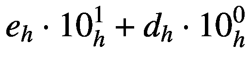

# 2.散列法

哈希是加密安全的基石。它涉及到一个*单向函数*或*指纹*的概念。哈希函数只有在满足以下几个条件时才能正常工作:

*   它们为每个输入产生*可重复的唯一值*。

*   输出值*没有提供关于产生它的输入的线索*。

有些散列函数比其他函数更能满足这些要求，我们将讨论一些好的函数(SHA-256)和一些不太好的函数(MD5，SHA-1 ),以展示它们是如何工作的，以及为什么选择一个好的函数如此重要。

## 用`hashlib`随意散列

### 警告:MD5 是不好的

在本章的前半部分，我们将使用一种叫做 MD5 的算法。MD5 已被弃用，**不应用于任何安全敏感的操作**，或者实际上根本不应用于任何操作，除非您必须与遗留系统交互。

这个讨论是为了介绍散列的概念和提供历史背景。MD5 很好，因为它产生短散列，有丰富的历史，并且*给我们一些东西来破解*。

当我们最后一次从东南极洲离开我们最喜欢的两个间谍时，爱丽丝和鲍勃正在使用简单的替代密码来编制一些代码。尽管这种密码非常脆弱，但它提供了一种基本的信息保密形式。

然而，它对消息*的完整性*毫无作用。如果你还没猜到，消息**保密**意味着除了授权方没有人可以*阅读*消息。消息**完整性**意味着没有未授权方能够*改变*消息而不被注意到。

理解其中的区别很重要。即使有了现代密码，信息不能被阅读并不意味着它不能被篡改，即使是以解密后有意义的方式。

另外，当 Alice 和 Bob 在 WA 边境通过海关时，有时他们的笔记本电脑会被检查。如果知道在这个过程中没有任何文件被篡改，那就太好了。

对 Alice 和 Bob 来说幸运的是，他们的新技术官员向他们介绍了一种叫做“消息摘要”的东西，以“指纹”他们的文件和消息传输。他解释说，他们可以将消息的内容与消息的摘要结合起来，然后一起使用这两者，他们就可以知道任何消息的一部分是否被修改了。听起来正是这样！

由于他们对摘要一无所知，是时候进行一些培训了。让我们跟随他们的指导者使用我们自己的 Python 解释器，从清单 [2-1](#PC1) 开始。

```py
>>> import hashlib
>>> md5hasher = hashlib.md5()
>>> md5hasher.hexdigest()
'd41d8cd98f00b204e9800998ecf8427e'

Listing 2-1Intro to hashlib

```

导入名为`hashlib`的库看起来足够简单，但是什么是`md5`？

教师解释说 MD5 中的“MD”代表“消息摘要”我们稍后将讨论一些有趣的细节，但是现在，像 MD5 这样的摘要可以将任意长度的文档(甚至是空文档)转换成占用固定空间的大数。它至少应具备以下特征:

*   相同的文档总是产生相同的摘要。

*   摘要“感觉”是随机的:如果你有一个摘要，它不会给你任何关于文档的线索。

这样，一个摘要就像一个指纹，有时被称为指纹:它是代表文档身份的少量数据；我们可能关心的每个文档都应该有一个完全独特的摘要。

人类的指纹在其他方面也很相似。如果你手边有一个人，很容易产生一个(相对)一致且唯一的指纹；但是如果你只有一个指纹，就不那么容易找到是谁的了。摘要以同样的方式工作:给定一个文档，很容易计算它的摘要；但是只给出一个摘要，很难找出是哪个文档产生的。*非常*辛苦。事实上，越难越好。

MD5 摘要创建一个总是占用 16 字节内存的数字。在我们的示例解释器会话中，我们要求它为*空文档*生成一个摘要，这就是为什么我们在要求它为我们生成一个摘要之前没有向`md5hasher`添加任何数据。使用`hexdigest`是为了演示一种更易于阅读的数字格式，其中摘要中的 16 个字节中的每一个都显示为两个字符的十六进制值。

急于继续学习的教师要求 Alice 和 Bob 将他们的名字散列(用字节表示)。到解释器，并列出 [2-2](#PC2) ！

```py
>>> md5hasher = hashlib.md5(b'alice')
>>> md5hasher.hexdigest()
'6384e2b2184bcbf58eccf10ca7a6563c'
>>> md5hasher = hashlib.md5(b'bob')
>>> md5hasher.hexdigest()
'9f9d51bc70ef21ca5c14f307980a29d8'

Listing 2-2Hash Names

```

对于像这样的短字符串，组合操作并不少见，比如清单 [2-3](#PC3) 。

```py
>>> hashlib.md5(b'alice').hexdigest()
'6384e2b2184bcbf58eccf10ca7a6563c'
>>> hashlib.md5(b'bob').hexdigest()
'9f9d51bc70ef21ca5c14f307980a29d8'

Listing 2-3Combine Operations

```

“那么，爱丽丝、鲍勃，你们从中学到了什么？”教员问道。当没有人回答时，她建议他们再做一些实验。让我们跟着走。

Python 区分 Unicode 字符串和原始字节字符串。对这些差异的完整解释超出了本书的范围，但是对于几乎所有的加密目的，你必须使用字节。否则，当解释器试图(或拒绝)为您将 Unicode 字符串转换成字节时，您可能会遇到一些令人讨厌的意外。我们使用`b''`字符串语法强制我们的字符串文字为字节。在其他用户输入要求我们从 Unicode 字符串开始的例子中，我们将把它们编码成字节，以确保这样做是安全的。

### 练习 2.1。欢迎使用 MD5

计算更多摘要。尝试计算以下输入的 MD5 和:

*   `b'alice'`(再次)

*   `b'bob'`(再次)

*   `b'balice'`

*   `b'cob'`

*   `b'a'`

*   `b'aa'`

*   `b'aaaaaaaaaa'`(字母“a”的十个副本)

*   `b'a'*`100000(100000 份字母“a”)

关于练习 2.1 中的 MD5 和，您学到了什么？我们将在本章中进一步讨论这些，但让我们跳回我们无畏的南极人。

“好的，爱丽丝和鲍勃，”老师说。“有几件事。这些摘要对象不需要一次输入全部内容。可以使用`update`方法一次插入一大块，如清单 [2-4](#PC4) 所示。

```py
>>> md5hasher = hashlib.md5()
>>> md5hasher.update(b'a')
>>> md5hasher.update(b'l')
>>> md5hasher.update(b'i')
>>> md5hasher.update(b'c')
>>> md5hasher.update(b'e')

Listing 2-4Hash Update

```

教员问爱丽丝和鲍勃:“你认为`md5hasher.hexdigest()`指令的输出会是什么？”尝试一下，看看你是否做对了！

“太好了，”当他们完成后，老师说。“你的入门训练快结束了。就多一个练习！”

### 练习 2.2。谷歌知道！

使用以下散列进行快速谷歌搜索(在谷歌搜索栏中输入散列):

1.  5f 4 DCC 3b 5aa 765d 61d 8327 deb 882 cf 99

2.  d 41 D8 CD 98 f 00 b 204 e 9800998 ECF 8427 e

3.  6384 和 2b2184bcbf58eccf10ca7a6563c

## 把教育搞得一团糟

在计算机安全领域，术语“散列”或“散列函数”总是指*加密*散列函数，除非另有说明。还有一些非常有用的非加密散列函数。事实上，你在小学会学到一个非常简单的方法:计算一个数是奇数还是偶数。让我们看看这个简单、熟悉的函数是如何阐释适用于所有散列函数的原理的。

哈希函数从根本上试图将大量(甚至无限)的事物映射到一个(相对)小的事物集合上。例如，当使用 MD5 时，无论我们的文档有多大，我们最终都会得到一个 16 字节的数字。在离散代数术语中，这意味着哈希函数的*域*比它的*范围*大得多。给定数量非常非常大的文档，它们中的许多可能会产生相同的散列。

哈希函数因此*有损*。从源文档到摘要或**散列**，我们丢失了信息。这实际上对它们的功能至关重要，因为在不丢失信息的情况下，有一种方法可以从哈希返回到文档。我们真的不希望这样，我们很快就会知道为什么。

因此，计算一个数字是奇数还是偶数非常符合这个描述。不管这个(整数)数有多大或者有多有趣，我们都可以把它压缩到一个比特的空间里:1 代表奇数，0 代表偶数。那是杂碎！给定任何大小的任何数字，我们可以有效地产生它的“奇怪”值，但是考虑到它的奇怪，我们将很难找出是哪个数字产生了它。我们可以创建非常非常多的*个可能的*输入，但是我们无法知道*哪个特定的*被用来做出那个答案。

“偶数或奇数”位有时被称为“奇偶”位，通常被用作基本的检错码。

奇偶散列示例说明了将输入“压缩”成固定大小值的原理。这个值是*一致的*，这意味着如果你两次输入相同的数字，你不会得到不同的值。它*将*大量输入压缩到一个固定大小的空间中(只有一位！)，而且是*有损*:只看输出是无法告诉我哪个数字被用作输入的。

所有的哈希函数，包括非密码哈希函数，都具有**一致性**、**压缩**和**有损性**的基本性质，在计算机科学中有各种重要的应用。然而，仅仅这些品质还不足以让散列函数成为*加密的*或*安全的*:为此，散列函数还需要更多的属性。9]:

*   原像电阻

*   第二原像电阻

*   耐碰撞性

我们将依次讨论这些重要的品质。

### 原像电阻

通俗地说，**原像**是一个哈希函数*的输入集合，它产生一个特定的输出*。如果我们把它应用到前面的奇偶校验例子中，奇数奇偶校验位的原像是(无穷大！)所有奇整数的集合。类似地，偶数奇偶校验位的原像是所有偶数整数的集合。

这对加密哈希意味着什么？之前，我们计算出 MD5 哈希值`6384e2b2184bcbf58eccf10ca7a6563c`可以由输入`b'alice'`生成。因此，的原像

*   MD5( *x* ) = `6384e2b2184bcbf58eccf10ca7a6563c`

包含元素`x == b'alice'`。

这很重要，所以让我们用更精确的术语来陈述(使用我们的域和范围中的整数—记住，文档是有序的位，因此只是一个大整数):

**前像**:哈希函数 *H* 的*前像*和哈希值 *k* 是 *x* 的*组值*，其中 *H(x) = k* 。

对于加密哈希函数，原像的概念很重要。如果我给你一个摘要值，可能(应该)有无限多的输入数字可以用来产生它。这些数字是那个摘要的原像。请记住，从计算机的角度来看，每个文档都只是一个大整数。都只是字节，我们只是在对它们进行数学运算。因此，原像只是一组无穷多的整数。 <sup>[1](#Fn1)</sup>

原像抗性的想法基本上是这样的:如果你递给我一个摘要，而我还不知道你是怎么得到的，*我甚至不能在原像中找到一个元素，除非我做了大量的工作。理想情况下，我必须完成*不可能完成的*工作量。*

(一般来说)找到整个原像已经很难了；它太大了。我们真正感兴趣的是让在原像中找到*任何元素*变得困难，除非你碰巧已经知道一个。这就是损失的来源:摘要不应该给我们*任何关于产生它的文件的信息。在没有任何信息指导我们的情况下，我们能做的最好的事情就是随机猜测或尝试一切，直到我们意外地找到一个产生正确摘要的方法。那个*是原像抗性。

试图在给定输出的原像中找到一个元素的过程称为**反转**散列:试图反向运行它以获得给定输出的输入。原像阻力意味着很难找到任何逆像。

这就是为什么奇偶函数是一个潜在的*有用的*散列函数，而不是一个*安全的*散列函数。如果我给你一个偶/奇值，你可以很容易地得出*匹配的东西*。例如，我说“偶数”，你说“2”。这不是很抗原像，因为你刚刚告诉我一个产生给定输出的输入，你不需要很努力地去做。事实上，您可以毫不费力地描述整个原像:“所有偶数整数。”对于密码哈希函数，如果我告诉你`MD5` ( *x* ) `= ca8a0fb205782051bd49f02eae17c9ee`，你(理想情况下)无法告诉我 *x* 是什么，除非你能找到已经知道并且愿意告诉你的人。MD5 很难反转。

现在，您可以尝试随机(或有序)的文档，看看它们中是否有任何一个产生`ca8a0fb205782051bd49f02eae17c9ee`，您可能会得到(非常！)幸运。这种方法是一种**蛮力攻击**，因为你必须在干草堆中的每一根稻草中寻找你要找的针。你所能做的就是盯着一大堆稻草，依靠原始的耐力来度过难关。

因为一致性是哈希的一个属性，如果您已经有了一个映射到给定输出的输入，或者您可以通过搜索 Google 找到它，那么这个特定的输出就会被平凡地反转。无论如何，当运行 MD5 时，ASCII 文本“alice”总是映射到“6384 e2b 2184 bcbf 58 eccf 10 ca 7a 6563 c ”,因此，如果您碰巧知道这两个东西在一起，您可以很容易地从摘要中找到“alice”。对于那个特定的输出，MD5 被简单地反转。但是，这并不意味着 MD5 不能抵抗原像攻击:要打破这一点，你需要找到一种简单的方法，在事先不知道一个输入的情况下*总是*找到一个给定输出的输入*。*

 *这又给我们留下了蛮力。使用强力技术(随机猜测或顺序搜索)猜测 MD5 哈希的原图像元素需要多长时间？要回答这个问题，我们首先需要看看有多少可能的哈希值。我们知道 MD5 总是产生一个 16 字节的摘要，我们可以用它来计算出反转 MD5 的理想难度。为此，我们需要了解二进制(基数为 2)、十进制(基数为 10)和十六进制(基数为 16)正整数(加上 0，但我们通常只说“非负”)。

如果您已经很好地理解了这些，请随意跳到下一部分。

#### 字节转换成一些非负整数

大多数计算机使用二进制来表示一切。二进制数字系统是以 2 为基数表示的。了解它的一个好方法是通过数数。这里，左边是我们熟悉的十进制数，右边是相应的二进制数:

```py
0     0
1     1
2    10
3    11
4   100
5   101
6   110
7   111
8  1000
9  1001

```

在这个系统中，计数是如何工作的？我们从 0 开始，很好听也很熟悉。加 1 得到 1，这是意料之中的。目前为止，一切顺利。但是，由于我们的基数是 2，所以当我们再次尝试的时候，就没有位数了！就像我们的十进制中没有代表数字“10”的一位数一样，二进制中也没有代表“2”的一位数！

当十进制的位数用完了，我们该怎么办？我们使用位置值。“10”这个数字说明了这一点:这个数字中有“1 个 10”和“0 个 1”。是“9”后面的数字

二进制也差不多。当我们从“1”向上移动一个数字时，我们用完了所有的数字，所以我们在“2”列中放一个“1”，在“1”列中从“0”开始。

似乎值得注意的是，你可以用这种方式表示每个非负整数，就像你可以用 decimal 表示一样。基值(“基数-2”、“基数-10”、“基数-16”等)。)告诉您需要处理多少位数字，以及位值的含义。这里有几个不同数系的位值。注意，人们对这些东西有点粗心，用十进制来谈论它们，但实际上数字系统是任意的。说到那个，世界上有十种人:懂二进制的和不懂的。 <sup>[2](#Fn2)</sup>

这是教授数系时的一个大问题:在不知道我们在什么基数上运算的情况下,“10”意味着什么？默认情况下，假设它表示“10”，除非基数被明确说明，或者*确实是明显的*，就像十六进制一样，我们看到“a”—“f”以及更常见的十进制数字。我们在这里也要这样做:如果你看不到一个基数，或者你不能轻易说出它是什么，你看到的是十进制。

<colgroup><col class="tcol1 align-left"> <col class="tcol2 align-left"> <col class="tcol3 align-left"> <col class="tcol4 align-left"> <col class="tcol5 align-left"></colgroup> 
|   | 

第三名

 | 

地方 2

 | 

地点 1

 | 

放置 0

 |
| --- | --- | --- | --- | --- |
| 二进制的 | eight | four | Two | one |
| 小数 | One thousand | One hundred | Ten | one |
| 十六进制的 | Four thousand and ninety-six | Two hundred and fifty-six | Sixteen | one |

或者，换句话说:

<colgroup><col class="tcol1 align-left"> <col class="tcol2 align-left"> <col class="tcol3 align-left"> <col class="tcol4 align-left"> <col class="tcol5 align-left"></colgroup> 
|   | 

第三名

 | 

地方 2

 | 

地点 1

 | 

放置 0

 |
| --- | --- | --- | --- | --- |
| 二进制的 | 2 <sup>3</sup> | 2 <sup>2</sup> | 2 <sup>1</sup> | 2 <sup>0</sup> |
| 小数 | 10 <sup>3</sup> | 10 <sup>2</sup> | 10 <sup>1</sup> | 10 <sup>0</sup> |
| 十六进制的 | 16 <sup>3</sup> | 16 <sup>2</sup> | 16 <sup>1</sup> | 16 <sup>0</sup> |

所有这些数字系统都以同样的方式工作:位置值是通过在底数的指数上加 1 来确定的。

所以，在十进制中，数字 237 真正的意思是 2⋅10<sup>2</sup>+3⋅10<sup>1</sup>+7⋅10<sup>0</sup>= 200+30+7。

同样的数字在十六进制中(我们会用*x*<sub>T3】hT5】来表示“ *x* 在十六进制中”)是 *ed* <sub>*h*</sub> ，表示。但是*那个*是什么意思呢？嗯，*e*<sub>*h*</sub>=十进制的 14 <sub>* d *</sub> ，以及*d*<sub>*h*</sub>= 13<sub>*d*</sub>。由于 10 <sub>* h *</sub> 在十六进制列中有一个 1，我们得到(十进制)14 ⋅ 16 + 13 = 237。</sub>

为什么我们首先关心十六进制，而不是它的相对紧凑性？十六进制(或“hex”)很有用，因为它的位置值是 2 的倍数(确切地说，它们是 2 <sup>4</sup> 的倍数)，所以它与二进制很好地匹配。考虑下表，左边是十六进制，右边是二进制:

```py
0     0
1     1
2    10
3    11
4   100
5   101
6   110
7   111
8  1000
9  1001
A  1010
B  1011
C  1100
D  1101
E  1110
F  1111

```

在我们需要从四列增加到五列的同时，我们用完了十六进制的数字！这真的很有帮助，因为这意味着我们可以在计算机的本机和杂乱无章的二进制数字之间来回转换，转换为更加友好和紧凑的十六进制数字。人们甚至很擅长翻译，一看到就能翻译出来。下面是一个上面是二进制，下面是十六进制的例子:

```py
101 1100 1010 0011 0111
5   c    a    3    7

```

不管一个二进制数有多大，你都可以把每四位写成一个十六进制数字。

回顾二进制的要点是再次强调计算机中的每一个位序列都是一个 T2 数。如果这些比特是一个文件呢？那是一个数字。如果它们代表一个图像呢？这只是一个很大的数字。

这些比特的“意义”不在计算机中，而是在我们的头脑中。

我们可能以某种方式显示这些位，但是我们人类选择这样做是基于我们认为它们的意思。计算机*不知道*它们真正的意思。它们只是数字。我们能以某种方式存储*本身的含义*吗？嗯，当然，但那会迫使我们将含义*编码成数字*，因为数字是计算机所能理解的一切。甚至他们的指令也只是数字。

我们很哲学化，是吗？如果你真的想知道计算机是如何工作的，理解这一点实际上是非常重要的，而且我们确实需要这样的人。数据和代码只是大数字，计算机基本上只是对它们进行提取、存储和运算。

#### 多难的一次散列啊！

有了这个小小的补充，我们现在可以回答我们首先想要回答的问题了:一般来说，使用暴力破解 MD5 有多难？我们可以通过查看其输出的大小来尝试一下。MD5 输出 16 字节的值，即 16 ⋅ 8 = 128 位。用 *n* 位我们可以表示 2<sup>T3】nT5】个单独的值，所以 MD5 可以输出很多不同的摘要。这许多，其实(十进制): <sup>[3](#Fn3)</sup></sup>

340,282,366,920,938,463,463,374,607,431,768,211,456.

即使你每秒检查 100 万个值*(并且保证你检查的任何东西都不会产生你以前见过的输出)，它仍然会花费你大约 10 <sup>26</sup> 年(1000 亿亿亿！)通过蛮力找到一个合适的输入。相比之下，我们的太阳预计最多只能再维持地球生命 50 亿年；你的电脑需要运行很多很多次。*

 *如果你有一个密码算法，它的唯一破解手段是暴力破解，那么你就有一个好算法。麻烦的是，你不一定*知道它好*。但是这给了我们一个上限，即找到一个在 MD5 中产生特定散列的输入需要多长时间。至少用不了多长时间！

### 第二原像和碰撞阻力

一旦理解了原像抗性，其他两个属性就相对容易掌握了。在最后一节快结束时，我们进入了蛮力和二进制，所以让我们快速回顾一下:

*   原像阻力意味着很难找到一个能产生特定摘要的文档，除非你已经知道了。

#### 第二原像电阻

**第二原像阻力**意味着如果你已经有*一个*文档产生特定的摘要，仍然很难找到一个*不同的*文档产生相同的摘要。

换句话说，仅仅因为你知道

*   `384e2b2184bcbf58eccf10ca7a6563c`(爱丽丝)= `384e2b2184bcbf58eccf10ca7a6563c`，

这并不意味着你可以找到另一个值输入到中，它会给你同样的值。你将不得不再次诉诸暴力。

将它与它的名字联系起来，如果您已经有了前映像的一个成员，找到前映像的第二个成员并不容易:前映像中没有可利用的模式。

#### 耐碰撞性

碰撞阻力比我们刚刚提到的任何一个原像特征都要微妙一些。碰撞阻力意味着很难找到任何两个产生相同输出的*:不是一个*特定的*输出，只是*相同的*输出。*

描述这一点的经典方式是用生日。 <sup>[4](#Fn4)</sup> 假设你在一个挤满人的房间里，你想找到其中两个人的生日是 2 月 3 日。这种可能性有多大？不一定很有可能，如果你真的是随便挑的。

但是现在假设你想做别的事情。你想知道是否有两个人的生日是同一天。你不关心它是一年中的哪一天，你只想知道是否有人的生日和其他人的有重叠。这种可能性有多大？原来，一般来说，*远，*远的可能性更大。毕竟，我们刚刚取消了某一天的限制，现在我们想要的只是在*的任何一天*发生碰撞。

这是碰撞阻力背后的基本思想。当散列算法抵抗冲突时，它抵抗有目的地创建或挑选产生相同摘要的任何两个输入，而不预先决定该摘要应该是什么。

MD5 似乎相当抗冲突。有助于这一点的一个属性是，输入的小变化可以产生非常大的输出变化。考虑练习 2.1，其中您为非常相似的值生成了散列，比如“a”和“aa”，或者“bob”和“cob”。对这些值执行 MD5 得到的摘要不仅不同，而且*非常*不同:

```py
bob: 9f9d51bc70ef21ca5c14f307980a29d8
cob: 386685f06beecb9f35db2e22da429ec9

```

没有明显的模式可以将两者联系起来。这是由于许多哈希和加密算法共有的属性，称为**雪崩属性**:输入的变化，无论多小，都会在输出中产生巨大且不可预测的变化。理想情况下，50%的输出位应因微小的输入变化而改变。7].我们用“鲍勃”和“cob”做到了吗？让我们使用一些 Python 来看看二进制摘要，以帮助我们的探索(注意，我们的位串相当长，所以在清单 [2-5](#PC9) 中它被分成两行)。

```py
>>> hexstring = hashlib.md5(b'bob').hexdigest()
>>> hexstring
'9f9d51bc70ef21ca5c14f307980a29d8'
>>> binstring = bin(int(hexstring, 16))
>>> print("{}\n{}".format(binstring[2:66], binstring[66:]))
1001111110011101010100011011110001110000111011110010000111001010
0101110000010100111100110000011110011000000010100010100111011000

Listing 2-5Avalanche

```

下图显示了给定输入`b'bob'`和`b'cob'`时位的变化，

```py
MD5(bob):
   9   f   9   d   5   1   b   c   7   0   e   f   2   1   c   a
1001111110011101010100011011110001110000111011110010000111001010
   5   c   1   4   f   3   0   7   9   8   0   a   2   9   d   8
0101110000010100111100110000011110011000000010100010100111011000

MD5(cob):
   3   8   6   6   8   5   f   0   6   b   e   e   c   b   9   f
0011100001100110100001011111000001101011111011101100101110011111
   3   5   d   b   2   e   2   2   d   a   4   2   9   e   c   9
0011010111011011001011100010001011011010010000101001111011001001

Changed Bits:

X_X__XXXXXXXX_XXXX_X_X___X__XX_____XX_XX_______XXXX_X_X__X_X_X_X
_XX_X__XXX__XXXXXX_XXX_X__X__X_X_X____X__X__X___X_XX_XXX___X___X

```

在本例中,“bob”和“cob”的哈希之间的差异影响了 128 位中的 64 位。还不错！雪崩是一个重要的性质，我们将在第 [3](3.html) 章的密码中再次看到它。

### 练习 2.3。观察雪崩

比较各种输入值之间的位变化。

Avalanche 有助于防止冲突，因为很难生成一个文档，然后进行可预测的更改，这仍然会导致它生成相同的摘要。如果文档中的小变化导致摘要中不可预测的大变化，那么故意制造冲突很可能是一个困难的问题，迫使我们再次使用暴力来解决它。

还记得之前的生日类比吗？寻找碰撞并不像在原像中寻找一个值那样困难。n 位摘要的原像抵抗意味着攻击者在尝试 2 次 <sup>*n*</sup> 后会期望损害你的散列，其中只需要 2 次 <sup>( *n* /2)</sup> 尝试就可以找到冲突。这不是一半的尝试次数，而是一半的尝试次数中有一半的零。这种差异令人震惊。具体地说，对于 MD5，为给定的摘要寻找一个文档应该需要大约 2 次 <sup>128 次</sup>尝试，而寻找两个冲突的文档应该只需要 2 次 <sup>64 次</sup>尝试。

碰巧的是，MD5 的抗碰撞性实际上远没有那么好。它已经被“打破”，这意味着发现碰撞的技术比预期的 2 <sup>64</sup> 尝试要少得多。简而言之，这个问题可以通过某种*而不是蛮力*在不到一个小时内解决【17】。请记住这一点，我们稍后将回到这一点。

## 易消化的散列

至此，您应该知道如何创建一个 Python 程序来计算文件的 MD5 摘要 <sup>[5](#Fn5)</sup> 。这是散列的一个常见用法，也是一个很好的练习。请记住，您必须使用 Python 字节，而不是 Python Unicode 字符串作为输入。如果您尝试使用默认模式打开 Python 文件，它可能会将其作为文本文件打开，并将数据作为字符串读取，进行隐式解码。相反，您应该以“rb”模式打开文件，以便所有读取都产生原始字节。对于文本文件，您可能想将数据作为字符串读取，然后使用字符串的`encode`方法转换为字节，但是*取决于配置，这种编码可能不是您所期望的，并导致令人讨厌的意外*。

### 练习 2.4。文件的 MD5

编写一个 python 程序，计算文件中数据的 MD5 和。您不需要担心文件的任何元数据，比如最后修改时间，甚至是文件名，只需要担心它的内容。

你应该检查你的练习 2.4。如果您使用的是 Ubuntu Linux 系统，那么已经安装了`md5sum`实用程序。使用一个文件作为输入，从命令行运行这个实用程序，看看它是否会生成与您的实用程序相同的十六进制摘要。

说到 Ubuntu，这是一个使用哈希实现文件完整性的完美例子。访问 Ubuntu 版本的网站。在写这篇文章的时候，这个网站是 [`https://releases.ubuntu.com`](https://releases.ubuntu.com) 。例如，如果你看一下“仿生海狸”发行版，你会发现有许多文件可供下载。具体来说，有两个 iso，但它们可以直接获得或通过 BitTorrent 等其他下载技术获得。

还有一个文件叫 MD5SUMS。看一看。对于该发行版，该文件的内容应该如下所示:

```py
f430da8fa59d2f5f4262518e3c177246 *ubuntu-18.04.1-desktop-amd64.iso
9b15b331455c0f7cb5dac53bbe050f61 *ubuntu-18.04.1-live-server-amd64.iso

```

下载后，您可以通过在 ISO 上运行 MD5 sum 来验证数据是否被破坏。

MD5 哈希值有什么帮助？它不会保护你免受危害 Ubuntu 网站的人的攻击。如果他们上传一个假的 Ubuntu 到网络服务器，他们也可以上传一个假的 MD5 总和。

然而，MD5 sum *确实*让你更容易从其他来源获得 Ubuntu ISO 并知道它是可信的。例如，假设您正准备直接从 Ubuntu 网站下载 ISO 文件，这时一位同事过来告诉您，您可以使用他们在 USB 驱动器上已经下载的文件。你可以从 Ubuntu 的官方网站下载 MD5 总和的(相对较小的)文件，并在信任它们之前对照驱动器上的(大得多的)文件进行检查。

在 Ubuntu 目录中，您还会看到一个名为 SHA1SUMS 和 SHA256SUMS 的文件。这些是什么？

到目前为止，我们只讨论了 MD5 作为教授一些散列原理的一种方法。MD5 在很长一段时间内也是加密哈希的标准方法，但它已经被打破了:人们已经发现了比暴力引发冲突更快的方法，因此它正被淘汰，取而代之的是其他哈希函数。

有趣的是,“崩溃”通常意味着“某人可以用比蛮力少一个数量级的时间解决问题”例如，这可能意味着平均在 2 次 <sup>127 次</sup>尝试中可以找到原像值，而不是 2 次 <sup>128 次</sup>。这仍然很难，只是没有想象中那么难。当看到文章指出某些东西已经损坏时，找出*到底是什么意思*很重要。这是否意味着基本属性之一不再成立？这是不是意味着它能保持住，但不那么难绕过？如果不止一处房产呢？这些事情很重要。

通过 MD5，研究人员找到了一种“打破”原像抗性的方法[12]。他们展示了他们可以比 2 次 <sup>128 次</sup>尝试更快地找到 MD5 散列的前像。快了多少？嗯，他们的算法比 2 次 <sup>123 次</sup>尝试花费的时间稍长，或者用十进制表示，10，633，823，966，279，326，983，230，456，482，242，756，608 次尝试。这种攻击被认为是理论上的，因为它在实践中仍然没有用处:2 <sup>123</sup> 仍然*巨大*。

另一方面，MD5 已经被证明在*碰撞阻力*方面非常、非常不可靠。创建两个产生相同 MD5 输出的输入相当容易。这已被证明能够进行实际的攻击，以获得在 TLS 中使用的假证书，TLS 用于所有类型的安全互联网通信。我们不会在这里深入讨论细节，因为我们还没有谈到证书，但是我们会在本书结尾谈到 TLS 时再讨论这个问题。

另一方面，碰撞阻力不同于第二原像阻力。请记住，当你已经有了第一个原像时，第二个原像阻力会阻止你为输出找到第二个原像。尽管 MD5 的抗碰撞能力被破坏了，但它的前像抵抗能力没有被破坏。回到我们的 Ubuntu 发行版的例子，如果你从中介那里得到你的发行版，他们不能用相同的 MD5 摘要创建一个替代发行版。

然而，Ubuntu 组织可以利用 MD5 抗冲突弱点来创建两个具有相同 MD5 和的独立发行版。或许，他们可以与一个政府合作，向另一个对前者怀有敌意的政府出售一个包含各种跟踪软件的发行版。MD5 总和不能用于确保相同的 ISO 被分发给所有各方。

此外，一旦加密算法以一种方式被破解，就越来越有可能以其他方式被破解。因此，即使没有人证明 MD5 的原像或二次原像抵抗的实际攻击，许多密码学家担心这样的漏洞存在。

重申一下本章开头的警告，**不要使用 MD5** 。它已经被弃用了 10 多年(十进制)，它的一些安全缺陷在 20 年前就已经为人所知。

SHA-1 散列是另一种算法，被广泛认为是 MD5 的替代品。然而，SHA-1 的碰撞阻力最近也被打破了，因为研究人员已经表明，创建两个输入散列到同一个输出相对容易。所以，和 MD5 一样，**也不要使用 SHA-1** 。

在撰写本文时，最佳实践是使用 SHA-256。幸运的是，如果您使用的是`hashlib`，这对您来说意义不大:只需更改哈希函数，如清单 [2-6](#PC12) 所示。

```py
>>> import hashlib
>>> hashlib.md5(b'alice').hexdigest()
'6384e2b2184bcbf58eccf10ca7a6563c'
>>> hashlib.sha1(b'alice').hexdigest()
'522b276a356bdf39013dfabea2cd43e141ecc9e8'
>>> hashlib.sha256(b'alice').hexdigest()
'2bd806c97f0e00af1a1fc3328fa763a9269723c8db8fac4f93af71db186d6e90'

Listing 2-6Change to SHA-256

```

您应该注意到，这些不同的哈希算法有不同的长度。当然，MD5 输出 16 个字节(128 位)。如果不明显的话，SHA-1 的输出是 20 字节(160 位)。更简单地说，SHA-256 的输出是 32 字节(256 位)。

如果您认为反转 MD5(为给定的输出找到一个原像)需要很长时间，那么看看 SHA-1 吧。因为输出是 160 位，所以需要 2 次 <sup>160 次</sup>尝试，或者

1,461,501,637,330,902,918,203,684,832,716,283,019,655,932,542,976

试图找到一个前像。SHA-256 要求 2 次 256 次尝试，或者

115,792,089,237,316,195,423,570,985,008,687,907,853,269,984,665,640,564,039,457,584,007,913,129,639,936.

祝你好运！

## 传递哈希字...嗯...哈希密码

哈希函数的另一个常见用途是密码存储。例如，当你在一个网站上创建一个账户时，他们几乎不会存储你的密码。通常，它们存储密码的一个*散列*。这样，如果网站遭到破坏，密码文件被盗，攻击者就无法恢复任何人的密码。

这是什么意思？当你发送你的密码(通过安全通道，经由 HTTPS)，服务器不需要存储它来检查它。当你注册时，你的密码被散列，并且散列被存储。我们称之为 *H* (密码)。当您稍后登录时，您发送一个我们称之为“建议”的密码:您建议这是您的真实密码，服务器需要验证这一点。

因此，您尝试通过安全连接发送您建议的密码来登录，服务器现在为您提供了两件事情:它可以从您的用户名中查找 *H* (密码),并且它有您刚刚提交的建议。它所要做的就是检查 *H* (提议)= *H* (密码)，如果相同就让你通过。

如果您不信任该服务不会实际存储您的密码，该怎么办？这可能是一个合理的担忧，特别是因为近年来我们已经看到如此多的网站被盗密码。为什么不使用 JavaScript 的力量在浏览器中散列你的密码，然后将那个发送给服务器呢？那么服务器甚至不会在内存中看到你的密码，更不用说在数据库中了！

这有几个大问题:

*   在你的浏览器*中散列密码的代码首先来自那个服务器*，所以你仍然必须信任这个服务。

*   如果你没有一个安全的密码通道，那么有人可以在传输中读取它。如果你有一个安全的通道，那么你也可以只发送密码。你必须已经信任这项服务。

*   如果你成功发送了一个散列，它就成为了你的密码。是，您可以从其他一些容易记住的东西中生成它，但是现在您还必须保护哈希值。无论如何，服务器必须对您的散列进行散列，这样，窃取数据库的攻击者就不能仅仅使用存储在那里的内容进行登录。

简而言之，如果你要使用一个散列作为你的密码，正确的方法是使用一个独立于你的浏览器的工具，从你的密码和感兴趣的网站名称*生成散列，然后使用结果作为你的密码。这本质上与创建一个全新的密码并在一个安全的地方记住它是一样的，比如密码管理器。*

就这么做吧。那么服务器将永远看不到你在其他地方使用的密码，因为你为它创建了一个全新的随机密码。

比起试图用散列来解决安全问题，更好的方法是使用多种形式的认证，这些认证被证明可以使在线窃取您的身份变得更加困难，通常涉及连接到您计算机的硬件令牌。

大多数常见形式的双因素身份认证没有帮助，实际上使事情变得更糟。秘密问题就是其中之一。通常很容易得到这些问题的答案，如果不是这样，除非写下来，否则它们只是又一件很难记住的事情。另外，现在你有了几个可以用作网站密码的东西，这意味着攻击者有更多的机会通过猜测进入网站。短信已经被证明是非常脆弱的，也很容易被劫持，所以通过短信向你的手机发送代码是不好的。

正确部署的挑战响应硬件令牌不存在任何这些问题。它们是您拥有的东西，而不仅仅是您知道的另一个东西，它们不会被监听连接或伪装成其他站点的登录表单的人猜到或欺骗。它们不可能是偶然通过电话得到的，也不可能是伪造的。

最终你需要两个或更多的认证因素*无论如何*为了真正的安全。“修复密码”是寻找完整解决方案的错误地方。

如果正确使用了服务器端哈希，并且攻击者窃取了密码文件，他们将会看到类似这样的内容。从看能说出 smithj 的密码吗？

```py
...
smithj,5f4dcc3b5aa765d61d8327deb882cf99
...

```

仔细看。你以前见过那个哈希值吗？

眼尖的读者会记得本章练习开始时的哈希值。你被要求在网上寻找这个值。你发现了什么？

该哈希值是“password”的 MD5 哈希值，是的，该密码仍然被频繁使用。但是这里更深层次的问题是哈希值是确定性的:相同的输入总是哈希到相同的输出。如果攻击者见过一次“密码”的 MD5 总和，他就能够在每个被盗的密码文件中寻找相同的摘要。我们如何解决这个问题？

首先，我们不要假设我们可以让人们停止使用愚蠢的密码。

让我们假设他们会，我们需要修复它。我们将从文摘本身开始。

回想一下，MD5 在原像抗性或二次原像抗性方面是*而不是*(实际上)被破坏的。因此，目前不存在将这个哈希值转化为密码的实际攻击。尽管如此， **MD5 被破解，不应该使用！**让我们来看看新的密码文件。

```py
...
smithj,5baa61e4c9b93f3f0682250b6cf8331b7ee68fd8
...

```

知道史密斯的密码是什么吗？是的，它仍然是“密码”,但现在在 SHA-1 下被散列化了。好多了，对吧？哦耶， **SHA-1 坏了，不能用了！**我们再试一次吧！

```py
...
smithj,5e884898da28047151d0e56f8dc6292773603d0d6aabbdd62a11ef721d1542d8
...

```

那里！终于！我们用的是没有已知漏洞的哈希算法。这样更好，但是确定性哈希的问题仍然是一个问题。如果攻击者知道这个散列映射到“密码”的 SHA-256，那么 smithj 仍然受到威胁。

这就是“盐”的概念发挥作用的地方。salt 是一个众所周知的值，在哈希之前与用户的密码混合在一起。通过混合一个 salt 值，用户的密码将不会像现在这样立即可辨。

这种盐必须选择正确。它需要是唯一的，并且需要足够长。这样做的一种方法是使用`os.urandom`和`base64.b64encode`生成一个强的、随机的 <sup>[6](#Fn6)</sup> salt:

```py
>>> import hashlib
>>> hashlib.md5(b'alice').hexdigest()
'6384e2b2184bcbf58eccf10ca7a6563c'
>>> hashlib.sha1(b'alice').hexdigest()
'522b276a356bdf39013dfabea2cd43e141ecc9e8'
>>> hashlib.sha256(b'alice').hexdigest()
'2bd806c97f0e00af1a1fc3328fa763a9269723c8db8fac4f93af71db186d6e90'

```

显然，您的 salt 输出将与代码清单中显示的不同，并且每次调用它时都会有所不同。

一旦你有了盐，你就存储它，然后把密码和盐连接起来。例如，在哈希之前在密码前面加上盐。现在，如果攻击者获得了您的密码文件，就不可能从任何类型的预先计算的表中“识别”密码。

不过，他们仍然可以尝试散列 salt 加“密码”来查看是否有匹配的内容。猜测总是一种策略，对于大多数人的密码选择来说，这是一种特别好的策略。

很容易看出，每次检查用户密码时都必须使用相同的 salt。但是同一种盐应该被多个用户使用吗？您能为整个网站生成一次 salt 并重用它吗？

答案是一个非常强烈的“不！”你能想到为什么吗？如果两个用户使用相同的盐会有什么影响？至少，这意味着如果两个用户共享同一个密码，很容易识别出来。因此，最佳实践是将用户名和 salt 与密码散列一起存储。

如果我们的朋友 smithj 有可怕的密码，“密码”，至少它会正确地存储在我们的系统中:

```py
...
smithj,cei6LtJVQYSM+n6Cty0O2w==,
    bd51dac1e2fca8456069f38fcce933f1ff30a656320877b596a14a0e05db9567
...

```

我们现在已经走过了密码存储的基础，但还有更好的算法。它们建立在相同的原理上，但是做了额外的步骤，使得攻击者更难颠倒密码。科林·帕西瓦尔强烈推荐的一种密码存储算法叫做 **scrypt** ，在 RFC 7914 [16]中有描述。其他流行的还有较新的**bcrypt**<sup>[7](#Fn7)</sup>([`https://pypi.org/project/bcrypt/`](https://pypi.org/project/bcrypt/))以及被一些人认为是其继承者的算法: **Argon2** ( [`https://pypi.org/project/argon2/`](https://pypi.org/project/argon2/) )。

幸运的是，使用第 [1 章](1.html)中设置的`cryptography`模块，使用`scrypt`很容易。清单 [2-7](#PC18) 是一个来自`cryptography`模块在线文档的例子。该清单导出了要存储在文件系统上的密钥(散列)。

```py
 1   import os
 2   from cryptography.hazmat.primitives.kdf.scrypt import Scrypt
 3   from cryptography.hazmat.backends import default_backend
 4
 5   salt = os.urandom(16)
 6
 7   kdf = Scrypt(salt=salt, length=32,
 8                   n=2**14, r=8, p=1,
 9                   backend=default_backend())
10
11   key = kdf.derive (b"my great password")

Listing 2-7Scrypt Generate

```

密钥和 salt 都必须存储到磁盘上。`scrypt`参数必须是固定的，或者也必须被存储。我们稍后将介绍这些参数，但是首先，清单 [2-8](#PC19) 中描述了验证(假设 salt 和 key 是从磁盘恢复的)。

```py
1   kdf = Scrypt(salt =salt, length =32,
2                n=2**14, r=8, p=1,
3                backend=default_backend())
4   kdf.verify(b"my great password", key)
5   print("Success! (Exception if mismatch)")

Listing 2-8Scrypt Verify

```

### 选择完美的参数

关于`scrypt`参数，先说一下`backend`。`cryptography`模块主要是一个低级引擎的包装器。例如，该模块可以利用 OpenSSL 作为这样的引擎。这使得系统更快(因为计算不是在 Python 中完成的)和更安全(因为它依赖于一个健壮的、经过良好测试的库)。纵观这本书，我们将永远依靠`default_backend()`。

其他参数是针对`scrypt`的。`length`参数是该过程完成后密钥的长度。在这些示例中，密码被处理成 32 字节的输出。参数`r`、`n`和`p`是影响计算时间和所需内存的调优参数。为了更好地保护您的密码，您希望该过程需要更长的时间和更多的内存，以防止攻击者一次破坏大块的数据库(每次破坏都需要很长时间)。

幸运的是，推荐的参数是可用的。`r`参数应该是 8，`p`参数应该是 1。`n`参数可能会有所不同，这取决于您是在做一个需要给出相对快速响应的网站，还是做一个不需要快速响应的更安全的存储。无论哪种方式，它都必须是 2 的幂。对于交互式登录，建议使用 2 <sup>14</sup> 。对于更敏感的文件，高达 2 <sup>20</sup> 的数字更好。

这实际上是进入关于参数的更一般讨论的一个很好的继续。密码术中的许多安全性取决于参数是如何设置的。除非你是密码学专家，知道算法的确切细节，明白它们为什么是它们的样子，否则可能很难正确选择。至少在高层次上，熟悉这些参数的含义，以及在不同的上下文中应该如何使用它们是很重要的。参考可靠的消息来源，如 [`https://cryptodoneright.org`](https://cryptodoneright.org) ，获取意见和建议。也要留意这些来源。随着新的攻击和计算资源的出现，被认为是安全的东西可能会改变。

## 破解弱密码

让我们来看看攻击者是如何试图破解密码的。对 smithj 来说不幸的是，选择这样一个糟糕的密码意味着如果密码文件被盗，他很可能会受到威胁，因为攻击者无论如何都会针对所有哈希尝试常用词(包括*其他*被盗数据库中的词)。但是，即使是不太复杂的方法也可能猜出密码。

在本节中，我们将练习使用最简单的方法破解弱密码:暴力破解。这个练习旨在强调为什么好的密码如此重要。

场景是这样的:攻击者有一个包含用户名、salts 和密码散列的密码文件。他们能做什么？嗯，他们可以尝试一定长度的所有小写字母组合，例如，从“a”、“b”、“c”等等开始。

为了使这些练习更容易开始，清单 [2-9](#PC20) 显示了一些简单的代码，用于生成最大长度的字母表的所有可能组合。

```py
1   def generate(alphabet, max_len):
2       if max_len <= 0: return
3       for c in alphabet:
4           yield c
5       for c in alphabet:
6           for next in generate(alphabet, max_len-1):
7               yield c + next

Listing 2-9
Alphabet Permutations

```

调用 generate( `'ab'`，2)会生成`'a'`、`'b'`、`'aa'`、`'ab'`、`'ba'`、`'bb'`。在内置字符串模块中使用有用的集合，例如

*   `string.ascii_lowercase`

*   `string.ascii_uppercase`

*   `string.ascii_letters`

使下面的练习变得相当容易。回想一下，哈希算法需要字节作为输入，所以在将这些生成的字符串传递给哈希函数之前，不要忘记执行一个`encode`操作，如下所示:

```py
string.ascii_letters.encode('utf-8').

```

ASCII 字母正确地编码成字节，所以这不会导致不正确的散列或意外的行为。

### 练习 2.5。一个人的力量

编写一个程序，执行以下操作 10 次(因此，10 次完整的循环，计算时间):

*   随机选择一个小写字母。这是“原像种子”

*   使用 MD5 计算这个首字母的散列值。这就是“测试哈希”

*   在一个循环中，遍历所有可能的小写单字母输入。
    *   以与之前相同的方式散列每个字母，并与测试散列进行比较。

    *   找到匹配的就停下来。

*   计算找到匹配所需的时间。

平均来说，找到一个随机原像种子的匹配需要多长时间？

### 练习 2.6。一个人的力量，但更大！

重复前面的练习，但是使用越来越大的输入字母集。尝试用小写和大写字母进行测试。然后用小写字母、大写字母、数字试一下。最后，尝试所有可打印字符(`string.printable`)。

*   每个输入集中总共有多少个符号？

*   每次跑步需要多长时间？

### 练习 2.7。密码长度对攻击时间的影响

重复前面的练习，但这次是针对双符号输入。然后一次用三个和四个符号试试。反转随机选择的输入需要多长时间？

您会注意到，增加密码的长度和增加字母表的长度都会增加反转散列所花费的时间。让我们看看数学。

当只使用小写字母时，有多少种可能的单符号输入？很简单，ASCII 中有 26 个小写字母，所以有 26 个单符号输入。在最坏的情况下，将需要 26 次散列计算来反转一个单字母密码。但是，如果我们既有小写字母*又有大写字母*，这将需要的散列数增加到 52。添加数字会使其增加到 62。`string.printable`有 100 个字符。这比进行强力反转所需的最坏情况下的散列数增加了近四倍。

当我们将输入符号的大小增加到两个时会怎样？仅使用小写字母的双符号密码有多少个？如果第一个符号有 26 个字符，第二个符号有 26 个字符，那么总共有 26÷26 = 676 种组合。那是相当大的一跳！

现在看看如果你使用从 52 个大写和小写字母中抽取的两个符号会发生什么。数学计算结果是 52÷52 = 2704！对于双符号输入，将输入集的大小加倍会使复杂性增加四倍！如果加上数字，最坏的情况是 3844 个散列，对于所有可打印的 ASCII 字符，大约是 10，000 个散列。

计算一下三个、四个和五个符号，你会很容易明白为什么较长的密码很重要。拥有支持 GPU 的设备的黑客能够转换小于 6 个字符的任何内容，大多数密码小于 8 个字符，因此*至少*密码应该有那么长。出于这里展示的原因，从*中选择所有*可打印的字母大大增加了复杂性。

### 练习 2.8。更多哈希，更多时间

选择复杂的密码是用户的责任，但存储密码的系统也可以通过使用更复杂的*散列函数*来减缓攻击者的速度。重复前面使用 MD5 的任何练习，但现在使用 SHA-1 和 SHA-256。记录完成蛮力操作需要多长时间。最后，使用 scrypt 尝试蛮力。你可能走不远！

最后一点。仅仅因为一个密码*大*并不意味着它*安全*。攻击者还会使用大型字典来查找已知的单词和短语，即使有各种常见的数字或符号替换。像“巧克力蛋糕”这样的密码很长，但是仍然很容易被破解。随机选择的字母或单词仍然是最好的选择。关键是它们是“随机的”，这意味着你永远也不会在任何真实的作品或真实作品的普通转换中找到它们。通常，选择由常见话语组成的密码短语会将一次成功的攻击减少到*秒*，而不是*年*。

## 工作证明

散列法被广泛使用的另一个领域是区块链技术中所谓的“工作证明”方案。为了介绍这一点，我们需要非常快速地概述一下区块链是如何工作的。

区块链的基本思想是“分布式账本”该系统是一个*分类账*，因为它记录了参与者之间交易的相关信息。它还可以存储附加信息，但主要操作是事务。这是一个*分布式*分类账，因为它的内容存储在参与者的集合中，而不是在任何一个中心位置。

问题是没有一个中心位置来执行系统的正确性。用户如何才能避免(有意或无意地)损坏分类帐？请注意，我们不会在这里详细讨论分类帐，但是我们确实想讨论一下分类帐是由哪些块组成的。

每个事务必须存储在一个块中。一个“块”没什么特别的；它只是一个数据的集合。块内的每个交易都必须由交易者进行数字签名(我们将在第 [5](5.html) 章中更详细地讨论签名，但是现在，简单地接受这意味着没有人可以在没有他们的私钥的情况下为其他人创建交易)。整个块结构受到哈希的保护。块被复制到整个参与者集；如果有人试图对数据块的内容“撒谎”，数据将无法正确验证，他们的信息将被拒绝。

一个新的块是如何创建的，它又是如何获得保护性散列的？在这部分讨论中，我们将使用比特币网络区块链来浏览这些概念。被称为“中本聪”的比特币设计者(或设计者，来源实际上是未知的)希望控制新区块创建的速度，也希望系统能够激励参与。解决方案是将比特币奖励给生产新区块的“矿工”，同时让新区块的生产变得非常困难。

基本上，在任何给定的时间，被称为矿工的各方都在寻找区块链的下一个区块。区块链的任何用户都可以请求交易。他们在整个区块链网络中广播他们想要的交易，矿工们会去接他们。挖掘器获取一些请求的事务集(每个块的数量有限)并创建一个候选块。这个候选块具有所有正确的信息。它有事务、元数据等等。但这并不是区块链的下一个区块，直到矿工能够解决一个密码难题。

这个难题是找到一种特殊的 SHA-256 哈希值，特别是小于某个阈值的值。正如我们之前所讨论的，找到一个产生特定输出的输入将会花费非常非常长的时间，但是找到任何小于某个值的输出将花费非常少的时间(T2)。降低这个阈值会减少有效哈希的数量，需要更多的工作来找到一个合适的值，这就是比特币如何随着时间的推移调整难度，以适应更快的硬件或更大的计算池。最终，整个比特币网络需要大约 10 分钟才能找到一个合适的哈希。如果花费的时间少于几周内的平均时间，则允许的最大哈希值会减少。图 [2-1](#Fig1) 显示了两个不同的示例块，一个具有合适的 nonce(矿工试图找到的随机值，以产生可接受的散列),另一个没有，其中最大允许散列值是 2<sup>236</sup>–1(需要 20 个前导零)。对于比特币，允许出现问题的最简单的方法是由最大值 2<sup>224</sup>–1 决定的，这将使我们的小程序平均花费比以前多 2 <sup>12</sup> 倍的时间。这相当于 11.3 个小时，难度*比今天的*要难多了。


图 2-1

具有相同内容但不同 nonce 值的两个块哈希。产生具有 20 个前导二进制零(十六进制中的 5 个前导零)的散列的随机数是有效的。要求 20 个前导零等同于要求哈希数小于 2∫236。

我们的节目肯定不会很快超过电视网 10 分钟的平均预期。

顺便说一下，说前几个位必须为零与说散列值(散列只是一个数字，就像任何其他位串一样)应该小于某个阈值(恰好是 2 的幂)是一样的。因为好的散列函数(如 SHA-256)产生基本上随机的散列值，你强加给散列的结构越多，找到一个合适的就需要越长的时间。你可以通过思考零的数量来定义搜索空间的大小，从而获得一些直觉:如果你必须有一个前导零，那么这基本上是一个掷硬币的过程；平均只需要两次尝试就可以找到一个从零开始的合适的散列。另一方面，如果你需要找到一个有 8 个前导零的散列，这是一个更困难的问题:256 个不同的数字可以用 8 位来表示，所以平均来说需要 256 次尝试才能找到一个合适的值。

这就是为什么这种策略被称为“工作证明”:如果你在阈值以下找到了一个合适的哈希，你必须做一些工作(或者你破坏了哈希函数，这被认为是极不可能的，但对你来说可能很棒)。

这提出了一个有趣的问题:每个网络参与者如何决定问题应该有多难？举例来说，并不是有一个中央权威告诉每个人，难度只是从 11 增加到 12。这将违背整个网络的宗旨。网络中的“权威”是参与者之间的默契，使用相同的*算法*来确定这些事情。当网络上有人以不同的方式做事时，他们的阻碍会被其他人拒绝，因此他们没有动机去做错事。少数服从多数。

在哈希困难的特定情况下，每个参与者都知道计算前导零的数量的标准算法，并使用该算法来进行挖掘(或者拒绝任性的参与者提出的想要计算简单哈希的糟糕建议)。

但是，您可能会问，当输入数据实际上没有变化时，如何计算不同的 hash 值。这是一个很好的问题，因为散列是确定性的:给定相同的输入，它们总是产生相同的输出(否则它们不会很有用！).答案是他们改变了一小部分输入，称为“现时”它只是一个数字，并不是实际块数据的一部分:它的唯一目的是启用工作证明概念。当搜索合适的散列时，参与者尝试用不同的随机数值对块进行散列，通常是随机搜索，或者每次尝试只对最后一个值加 1。最终找到一个合适的哈希值，并将该块发送给所有其他参与者进行验证。

然后，每个参与者通过自己执行散列来验证该块，根据他们的算法检查前导零，并确保他们的答案与提交的散列值匹配。如果它是好的，他们接受它，链条就变长了。

### 练习 2.9。工作证明

编写一个程序，将一个计数器输入 SHA-256，获取输出散列并将其转换为整数(在转换为二进制之前，我们已经这样做了)。让程序重复运行，直到找到一个小于目标数的散列值。目标数字一开始应该很大，比如 2 <sup>255</sup> 。为了使这更像区块链，包括一些任意字节与计数器结合。

## 是时候重复了

我们已经介绍了很多关于什么是散列以及如何使用它们的信息，包括为什么你永远不应该使用 MD5，除非你告诉人们它是坏的，以及如何使用它们来实现更安全的密码存储甚至加密货币。哈希是密码学中一个强大而重要的部分，随着我们的发展，我们会一次又一次地看到它。

既然我们已经了解了如何将一个文档分解成一个安全的有代表性的值，那么是时候回顾一下加密了。

<aside class="FootnoteSection" epub:type="footnotes">Footnotes [1](#Fn1_source)

如果考虑域有所帮助的话，那么散列函数的每个原像的一个好的品质就是它的所有元素都以不可预测的间距非常分散。这样你就不太可能通过猜测意外地选择一个(它们真的分散开了)，如果命中了，你也不太可能找到任何其他的(不可预测的间距)。最后一部分我们稍后会深入探讨。

  [2](#Fn2_source)

一个老笑话。不客气我们很抱歉。

  [3](#Fn3_source)

在十六进制中，这个数字与二进制更紧密相关，看起来更合理一些:1000000000000000000000000。

  [4](#Fn4_source)

“生日问题”是概率论中的一个经典问题，其起源并不确定。

  [5](#Fn5_source)

有时称为“MD5 sum”，其中“sum”是“checksum”的缩写，这是一个有着自己有趣(和悠久)历史的名称，来自数字传输中的错误检测。

  [6](#Fn6_source)

要求是*唯一性*，而不是*随机性*，但是随机性为我们提供了一种简单的方法，对于我们的例子来说，这种方法非常有效。

  [7](#Fn7_source)

bcrypt 算法非常好，只有一个“难度”参数，比有许多参数的方法更容易正确使用。

 </aside>**