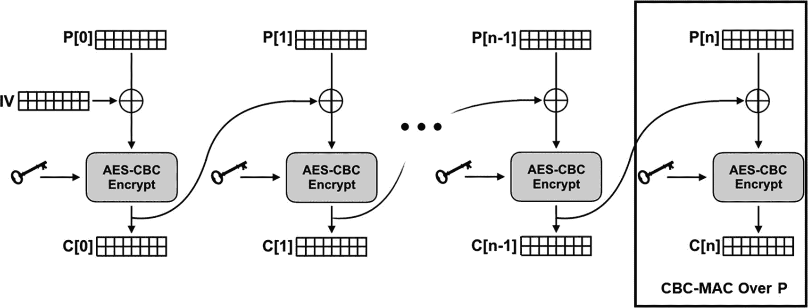

# 5.消息完整性、签名和证书

在这一章中，我们将讨论“密钥哈希”以及如何使用非对称加密技术通过数字签名不仅提供消息隐私，还提供消息完整性和 T2 真实性。我们还将讨论证书与密钥有何不同，以及这种区别为何如此重要。让我们深入一个例子和一些代码！

## 过于简单的消息认证码(MAC)

在爱丽丝和鲍勃的报道中，我们的东南极间谍二人组最近在西部敌对领土的冒险中遇到了一些麻烦。显然，伊芙设法截获了他们之间的一些通信。这些用对称加密法加密的信息是不可读的，但是 Eve 想出了如何*改变*它们，插入一些错误的指令和信息。爱丽丝和鲍勃根据错误的情报采取行动，差点中了埋伏。幸运的是，由于全球变暖，一堆冰融化了，他们设法游回了安全的地方！

他们很快从千钧一发中吸取教训，在总部花了一点时间擦干身体，设计新的通信机制，以防止他们的加密数据被未经授权的修改。

最终，东南极洲真相间谍机构(EATSA)发现了一个新概念:“消息认证码”或“MAC”。

Alice 和 Bob 被告知，MAC 是与消息一起传输的任何“代码”或数据，可以对其进行评估以确定消息是否被更改。这是出于直觉目的的非正式定义。在 Alice 和 Bob 学习这个介绍性的错误起点时，请耐心等待。这个过于简单的 MAC 的基本思想是这样的:

1.  发送方使用函数*f*(*M*T8】1)为给定的消息*M*T12】1 计算代码*C*T2】1。

2.  发送者将*M*T2 1 和*C*T6】1 发送给接收者。

3.  接收者以 *M* 和 *C* 的形式接收数据，但不知道它们是否已被修改。

4.  接收者重新计算 *f* ( *M* )并将输出与 *C* 进行比较，以验证消息未被更改。

假设夏娃截获了爱丽丝发给鲍勃的 *M* <sub>1</sub> 和 *C* <sub>1</sub> 。如果 Eve 想要将消息 *M* <sub>1</sub> 更改为 *M* <sub>2</sub> ，她必须*同时*重新计算*C*<sub>2</sub>=*f*(*M*<sub>2</sub>)并发送 *M* <sub>2</sub> 和*否则，由于 *f* ( *M* )和 *C* 不匹配，Bob 将会检测到某些东西已经被改变。*

如果你在问，“那又怎样？Eve 可以重新计算 MAC，对吗？”那么你就看到了我们过于简单的设置的问题。我们必须假设 Eve 拥有除键之外的所有东西*，但是这个例子也假设她没有 *f* 。我们会尽快解决这个问题。敬请关注！*

现在，Alice 和 Bob 只是假设 Eve 不会计算，或者很容易计算函数 *f* 。如果这个假设是真的(事实并非如此)，那么几乎任何创建指纹的机制都可以工作。东南极洲间谍机构决定将消息*散列*作为消息的附件发送。因此，在这种情况下，MAC 是一个散列。

让我们深入一些代码，看看这个简单的想法是如何形成的。当我们这样做的时候，我们可以把我们新的假 MAC 技术和第三章的对称加密结合起来。这在清单 [5-1](#PC1) 中有所展示。

```py
 1   # THIS IS NOT SECURE. DO NOT USE THIS!!!
 2   from cryptography.hazmat.primitives.ciphers import Cipher, algorithms, modes
 3   from cryptography.hazmat.backends import default_backend
 4   import os, hashlib
 5
 6   class Encryptor:
 7       def __init__ (self, key, nonce):
 8           aesContext = Cipher(algorithms.AES(key),
 9                                modes.CTR(nonce),
10                                backend=default_backend())
11           self.encryptor = aesContext.encryptor()
12           self.hasher = hashlib.sha256()
13
14       def update_encryptor(self, plaintext):
15           ciphertext = self.encryptor.update(plaintext)
16           self.hasher.update(ciphertext)
17           return ciphertext
18
19       def finalize_encryptor(self):
20           return self.encryptor.finalize() + self.hasher.digest()
21
22   key = os.urandom(32)
23   nonce = os.urandom(16)
24   manager = Encryptor(key, nonce)
25   ciphertext = manager.update_encryptor(b"Hi Bob, this is Alice !")
26   ciphertext += manager.finalize_encryptor()

Listing 5-1Fake MAC with Symmetric Encryption

```

回想一下,“计数器模式”不需要填充，在我们前面的例子中,“finalize”函数实际上没做什么。但是现在，当我们完成我们的管理器时，它不仅完成了加密，还返回了计算出的散列，作为附加到加密数据的最后几个字节。因此，最终的加密消息将我们的简单 MAC 附加到它的末尾。

### 练习 5.1。信任但核实

完成简单加密加散列系统的代码，并增加一个解密操作。解密操作应该在完成后重新计算密文的散列，并将其与发送过来的散列进行比较。如果哈希值不匹配，应该会引发一个异常。小心点！MAC 没有加密，不应该解密！如果您不仔细考虑这一点，您可能会解密不存在的数据！

### 练习 5.2。永远邪恶的夏娃

继续“拦截”一些由您在本节中编写的代码加密的消息。修改截获的消息，并验证您的解密机制是否正确地报告了错误。

## 麦克，HMAC 和 CBC-MAC

Alice 和 Bob 的支持人员告诉他们，任何验证消息的机制都是消息验证代码(MAC)。正如我们所暗示的，这不是一个完整的定义。真正的 MAC 也需要一个*键*。 <sup>[1](#Fn1)</sup>

我们已经使用密钥进行加密，但是到目前为止，我们还没有在其他方面使用它们。正如您可能已经猜到的那样，MAC 密钥与加密根本没有关系。相反，它确保消息认证码只能由知道密钥的各方计算。

在我们的例子中，爱丽丝和鲍勃必须假设伊芙不会计算函数 *f* ( *M* )。当然，这是不合理的。艾丽丝和鲍勃利用 SHA-256 得到了一个指纹，所以显然伊芙也可以用它来计算她自己的认证码。假设她可以决定性地修改密文，正如我们在前一章中看到的，在某些情况下，她可以插入一条新消息*和*一个新的假 MAC。

然而，真正的 MAC 依赖于一个密钥，*不可能*由 Eve 生成，除非她已经泄露了密钥！请记住，良好的安全性意味着*除了密钥*之外的一切都可以被*知道，并且它仍然正常工作。 <sup>[2](#Fn2)</sup>*

MAC 保护消息的完整性。没有密钥的攻击者无法不被察觉地更改数据。此外，如果密钥仍然保密，MAC 还提供*真实性*:接收者知道只有共享密钥的其他人才能发送 MAC，因为只有拥有密钥的人才能生成合法的 MAC。

虽然有许多 MAC 算法，我们将着眼于两个易于理解的方法:HMAC 和 CBC-MAC。这些算法在教授 MAC 如何工作以及为什么工作方面做得很好。它们在实践中也是有用的。

### HMAC

HMAC 是一种“基于哈希的消息验证码”事实上，你已经知道 HMAC 最复杂的特征:散列。HMAC 通常只是一个由*键控*的散列。

“被键控”是什么意思？为了说明这一点，让我们首先回顾一下没有密钥的标准加密散列。对于这样的散列，如果输入不变，输出也不变。它们完全是确定性的，只基于一个输入:消息内容。如果你重温“谷歌知道！”在第 [2](2.html) 章中，你会回忆起我们实际上可以在 Google 中输入一些哈希值并找到匹配的输入。

打开 Python shell，再测试一两次:

```py
>>> import hashlib
>>> hashlib.sha256(b"hello world").hexdigest()
'b94d27b9934d3e08a52e52d7da7dabfac484efe37a5380ee9088f7ace2efcde9'
>>> hashlib.sha256(b"happy birthday").hexdigest()
'd7469a66c4bb97c09aa84e8536a85f1795761f5fe01ddc8139922b6236f4397d'

```

“hello world”和“happy birthday”的 SHA-256 输出在每台计算机上永远都是这些值。他们将*永远不会改变*。您可以通过自己运行代码来验证这一点。SHA-256 定义要求如此。你也可以尝试在线搜索哈希值。

重复一遍，使用非密钥算法，相同的输入*总是*产生相同的输出。

当一个算法被*键控*时，意味着输出依赖于输入和一个键。但是如何对哈希算法进行加密呢？

从概念上讲，这其实很容易。因为即使对散列算法输入的微小改变也会完全改变输出，所以我们可以让密钥成为输入本身的一部分！

虽然下面的例子*不是*真正的 HMAC，并且*不是*被认为足够安全，但是它说明了这个想法:

```py
>>> import hashlib
>>>
>>> password1 = b"CorrectHorseBatteryStaple" # See XKCD 936
>>> password2 = b"LiverKiteWorkerAgainst"
>>>
>>> # This is not really HMAC, it is for illustration ONLY:
>>> hashlib.sha256(password1 + b"hello world").hexdigest()
'ca7d4abd13bceb305eef2738e3592da77ed826aa1665ba684b80f36bd7522b32'
>>>
>>> hashlib.sha256(password2 + b"hello world").hexdigest()
'b22786bc894c8bb27d1e7e698a9bddfd6b95f35dcd063e37d764fa296216408a'

```

在这个例子中，我们使用人类可读的密码作为密钥。我们将输入的“hello world”散列了两次，但每次都插入不同的密码作为前缀*。基本上，我们用密钥来改变我们所散列的内容。每个密码会产生完全不同的输出，这意味着有人要重新创建消息“hello world”的输出 MAC 的唯一方法是*也知道密码*(或者通过暴力破解)。与任何其他加密算法一样，密钥/密码必须足够大并且足够随机。*

 *说到大小，值得注意的是，密码的大小并不是它如何有效地改变散列输出的一个因素。你还记得雪崩原理吗？改变散列函数的输入的单个*位*会完全改变输出散列值。您可以拥有一个万亿字节的文档，只改变其中的一个字符，并产生一个与未改变的文档的散列无关的新散列。类似地，您的密码可以是单个字符，它将有效地“扰乱”任何给定输入的输出，不管输入有多大。您需要担心的是，您的密码长度(和随机性)足够强大，可以防止暴力攻击。

### 练习 5.3。又是暴力

您应该已经在前面的章节中完成了一些强力攻击，但是重要的是重复这个练习，直到您对这个概念有了直觉。使用我们前面的假 HMAC，让计算机生成一个特定大小的随机密码，并使用暴力方法找出它是什么。更具体地说，假设你已经知道消息是什么(例如，“你好，世界”，“生日快乐”，或者你选择的消息)。编写一个程序来创建一个字符的随机密码，将密码添加到消息的前面，然后打印出 MAC(哈希)。获取输出，遍历所有可能的密码，直到找到正确的密码。从简单的单字母字符测试开始，然后尝试两个字符，以此类推。通过使用不同的字符集来混淆事物，例如全部小写、小写和大写，或者大写加数字，等等。

### 练习 5.4。暴力破解四字密码

重复之前的练习。但是不要用从一个字母来源中提取的字母，而要用从一个单词来源中提取的单词。查找或创建一个包含常用单词列表的文本文件。至少要 2000 字。使用这个字典，通过选择 *n* 个随机单词来创建密码。通过尝试字典中所有可能的组合，尝试暴力破解该密码。从 *n* = 1(一个字的密码)开始，从那里往上走。

即使前面的方法也不够好，所以让我们来谈谈真正的 HMAC。我们已经反复说过，仅仅预先设置密码是不够安全的。“HMAC”是标准文档“RFC 2104”中定义的算法的正式名称如果您以前从未看过 RFC，这些是来自互联网工程任务组(IETF)的文档，代表了互联网协议和算法的标准、最佳实践、实验和讨论。它们都是免费的，可以在网上找到。RFC 2104 可以在 [`https://tools.ietf.org/html/rfc2104`](https://tools.ietf.org/html/rfc2104) 找到。

该文件的摘要指出:

*   本文档描述了 HMAC，一种使用加密哈希函数进行消息认证的机制。HMAC 可以与任何迭代加密散列函数(例如，MD5、SHA-1)结合秘密共享密钥一起使用。

这部分应该已经说得通了。我们已经做的实验使用了 SHA-256 和一个秘密共享密钥，但我们显然可以使用 SHA-1 或 MD5。不过，提醒一下，那些散列算法被认为是“坏的”,除非必要，否则不应该用于遗留应用程序。

回到 RFC 的第 3 页，我们看到一旦选择了散列函数 *H* ，输入文本的 HMAC 就被计算出来，因此

*   h(k xorg opad，h(k xorg ipad，文本))

让我们来看看这些术语。我们已经知道*H*；这是底层的哈希函数。术语“文本”指的是输入，但不必像任何“明文”消息那样由可读的文本字符组成:它可以是任意的二进制数据。哦，我们需要解决逗号。因为 *H* 是一个函数，您可能会认为这个定义显示了一个带两个参数的散列函数。但是在 RFC 的这个定义中，逗号可以被认为是连接。和我们所有的例子一样，散列函数只接受一个输入。

术语 *K* 指的是密钥，但不能只是任何东西。RFC 对密钥有许多要求，通常需要一些预处理。这些要求大多与 *H* 的块大小有关。回想一下第 3 章[中的内容，我们在分组密码中使用了术语“块大小”来描述分组密码一次操作的数据大小。例如，AES 的块大小为 16 字节(128 位)。散列算法可以散列任何大小的输入，那么散列算法的块大小是多少呢？](3.html)

实际上，哈希函数通常一次对一个块进行操作，但是将一个块的哈希输出输入到下一个块的哈希计算中。例如，SHA-1 的块大小为 64 字节(512 位)，而 SHA-256 的块大小为 128 字节(1024 位)。RFC 将 *H* 的块大小称为 *B* (字节)。

我们的密钥的第一个要求是，如果它比块大小 *B* 短*个字节，它必须用零填充，直到它的长度为 *B* 个字节。*

第二个要求是，如果密钥比 *B* 长*，那么首先通过用 *H* 散列密钥来减少它。不要对此感到惊讶。我们将在一次 HMAC 操作中多次使用 *H* 。*

 *综上所述，如果 *K* 太短就用零填充，如果 *K* 太长就用 *H* ( *K* )代替。

眼尖的读者会注意到，散列的长度可能*也可能*比块大小短。SHA-1 的散列是 20 字节长，它的块大小是 64 字节。SHA-256 的散列是 32 字节长，但是它的块大小是 128 字节。在用散列函数减少了*太长*的关键字之后，它通常会*太短*，然后将需要填充。

最后，我们应该有一个长度正好为 *B* 字节的密钥。

接下来，我们需要计算 *K* ⊕ ipad (XOR)。术语“ipad”代表“内部填充”，因为这是 HMAC 中的内部散列操作。RFC 将 ipad 定义为“重复 B 次的字节 0x36”，将“opad”定义为“重复 B 次的字节 0x5c”。为 ipad 和 opad 选择的值是任意选取的。最重要的是它们是不同的。

填充的原因超出了本书的范围，但是它们给了 HMAC 一些额外的安全性，以防底层的散列函数被破坏。因此，举例来说，这些填充使得 HMAC-MD5 相对较强，即使 MD5 已经被破解。这很有帮助，但不是对新应用程序使用 HMAC-MD5 的好理由。请不要。HMAC 的填充意味着 HMAC-SHA256 将是一个相当强大的 MAC，即使有人发现 SHA-256 哈希函数中的漏洞，这可以帮助保持现有的使用(可能不容易立即升级到更好的哈希函数)相对安全。

⊕ ipad 的计算非常简单，因为它们大小相同。随后的值被添加到输入“文本”的前面，组合的数据由 *H* 散列。我们现在已经计算出了 *H* ( *K* ⊕ (ipad *，* text))。同样，这是内部哈希计算。

现在，对于外部散列，我们计算 *K* ⊕ opad。随后的值被添加到内部哈希的输出中，聚合的字节再次被哈希。外部函数的散列是输入文本在 *K* 上的 HMAC。

幸运的是，加密库几乎总是将 HMAC 作为原语。

```py
>>> from cryptography.hazmat.backends import default_backend
>>> from cryptography.hazmat.primitives import hashes, hmac
>>>
>>> key = b"CorrectHorseBatteryStaple"
>>> h = hmac.HMAC(key, hashes.SHA256(), backend=default_backend())
>>> h.update(b"hello world")
>>> h.finalize().hex()
'd14110a202b607dc9243f83f5e0b1f4a1e59fba572fc5ea5f41d263dd4e78608'

```

为什么要大费周章去学习 HMAC 内部是如何工作的，而不仅仅是学习如何使用一个附带的库呢？有几个原因。首先，至少对事物如何运作有一点点了解是有好处的。它有助于直觉和推理何时使用它以及为什么使用它。

第二，也许是最重要的，它提醒你 YANAC(你不是一个密码学家...还没！).你一定要记住这个原则！尽可能多地使用加密库，不要试图想出自己的“聪明”算法。再看一眼 HMAC。它建立在一些与简单地在输入前加一个键相同的概念上，但是有更高的复杂性。这种复杂性来自更深层次和更微妙的目标，包括在散列函数被破坏的情况下的前向安全性。这种复杂性不是任意的；HMAC 行动是基于密码学家的一篇研究论文，该论文从数学上证明了某些安全特性。除非你是一名密码学家，发布你的作品(通常有正式的证明)供公众同行审查、测试和辩论，否则你真的不应该创建自己的算法，除非是为了教育或演示的目的。

### 练习 5.5。测试 Python 的 HMAC

虽然你不应该推出自己的加密，但这并不意味着你不应该验证实现！按照 RFC 2104 的说明创建您自己的 HMAC 实现，并用您的实现和 Python 的`cryptography`库的实现测试一些输入和键。确保它们产生相同的输出！

### CBC-MAC 电脑

HMAC 是一个非常受欢迎的 MAC，例如在 TLS 中使用，但也有其他方法来创建 MAC。例如，我们可以将您在第 [3](3.html) 章中学到的关于密码块链接(CBC)模式的知识作为推导安全 MAC 的另一种方法。

让我们快速介绍一些新的术语。MAC 有时也称为“标签”当我们创建一个消息的 MAC 时，我们可以称之为该消息的“标签”；这就像一件礼物或一件衣服上的标签:它是附在主文章上的一点点信息。在数学符号中，标签通常表示为 *t* 。这样，一个 MAC over 消息 *m* <sub>1</sub> 产生一个标签*t*T8】1，该对( *m* <sub>1</sub> *，t* <sub>1</sub> )被发送到接收方进行验证。



图 5-1

因为所有的消息都影响最后一个加密数据块的值，所以 C[n]是所有 P 的 MAC...有一些瑕疵。

回想一下，当使用 AES 加密时，我们一次只能加密 128 位。如果我们单独加密每个 128 位数据块，仍然有信息可能会“泄露”整个数据。例如，大的图像特征可能仍然是可识别的。解决这个问题的一个方法是“连锁”加密，这样来自一个块的输入就可以延续并影响下一个块的加密。换句话说，开始时一个比特的变化会产生级联效应，一直到最后一个块。

换句话说，密文的最后一个块由链中每隔一个块的值*决定:输入中任何地方的任何变化都将反映在最后一个块中！这使得 CBC 加密模式的最后一个块成为整个数据的 MAC，如图 [5-1](#Fig1) 所示。*

希望您已经从本书中学到了这一点，所有的加密技术都有限制和关键参数。和 HMAC 一样，我们将首先做一些简单的例子，看看 CBC-MAC 算法背后的基本概念以及简单的方法是如何被利用的。

让我们从获取一条消息并通过 AES-CBC 加密来运行它开始。出于我们稍后将解释的安全原因，我们将把初始化向量固定为零。为了使我们的消息是块大小的倍数，我们还将使用用于加密的相同的 PKCS7 填充。为了简化下一个练习，我们需要一些没有填充的完整块消息，所以我们包含了一个关闭填充的标志。

```py
 1   # WARNING! This is a fake CBC–MAC that is broken and insecure!!!
 2   # DO NOT USE!!!
 3   from cryptography.hazmat.primitives.ciphers import Cipher, algorithms, modes
 4   from cryptography.hazmat.backends import default_backend
 5   from cryptography.hazmat.primitives import padding
 6   import os
 7
 8   def BROKEN_CBCMAC1(message, key, pad=True):
 9       aesCipher = Cipher(algorithms.AES (key),
10                          modes.CBC(bytes(16)), # 16 zero bytes
11                          backend=default_backend())
12       aesEncryptor = aesCipher.encryptor()
13
14       if pad:
15           padder = padding.PKCS7(128).padder()
16           padded_message = padder.update(message)+padder.finalize()
17       elif len(message) % 16 == 0:
18           padded_message = message
19       else:
20            raise Exception("Unpadded input not a multiple of 16!")
21       ciphertext = aesEncryptor.update(padded_message)
22       return ciphertext[-16:] # the last 16 bytes are the last block
23
24   key = os.urandom(32)
25   mac1 = BROKEN_CBCMAC1(b"hello world, hello world, hello world, hello world", key)
26   mac2 = BROKEN_CBCMAC1(b"Hello world, hello world, hello world, hello world", key)

Listing 5-2Fake MAC with CBC

```

清单 [5-2](#PC5) 中的代码虽然不安全，但确实展示了 MAC 背后的基本概念。一段数据首先被填充，然后被加密。然而，不管它有多长，最后一个块(16 字节)都是由所有前面的输入决定的。把第一个字母从“H”改成“H”，MAC 就完全不一样了。

然而，它可以被利用。回想一下，对于给定的消息和密钥对，MAC 必须是唯一的。如果攻击者可以用相同的密钥为不同的消息生成相同的 MAC，那么 MAC 算法就被破解了。

事实证明，对于 CBC-MAC 的这个幼稚版本，你完全可以做到这一点。让我们先用代码来做，看看你能不能猜出是怎么回事。请注意，清单 [5-3](#PC6) 旨在与清单 [5-2](#PC5) 合并。

```py
 1   # Partial Listing: Some Assembly Required
 2
 3   # Dependencies: BROKENCBCMAC1
 4   def prependAttack(original, prependMessage, key):
 5       # assumes prependMessage is multiple of 16
 6       # assumes original is at least 16
 7       prependMac = BROKEN_CBCMAC1(prependMessage, key, pad = False)
 8       newFirstBlock = bytearray(original [:16])
 9       for i in range (16):
10           newFirstBlock[i] ^= prependMac[i]
11       newFirstBlock = bytes(newFirstBlock)
12       return prependMessage + newFirstBlock + original [16:]
13
14   key = os.urandom(32)
15   originalMessage = b"attack the enemy forces at dawn!"
16   prependMessage = b"do not attack. (End of message, padding follows)"
17   newMessage = prependAttack(originalMessage, prependMessage, key)
18   mac1 = BROKEN_CBCMAC1(originalMessage, key)
19   mac2 = BROKEN_CBCMAC1(newMessage, key)
20   print("Original Message and mac:", originalMessage, mac1.hex())
21   print("New message and mac     :", newMessage, mac2.hex())
22   if mac1 == mac2:
23       print("\tTwo messages with the same MAC! Attack succeeded!!")

Listing 5-3MAC Prepend Attack

```

上市 [5-3](#PC6) 生产的两款 MAC 是*一模一样的*。我们的攻击将我们选择的另一个消息添加到原始消息中，并且*也*破坏了第一个块。对前置消息的唯一限制是，它还必须在同一密钥下具有前置消息的 CBC-MAC 值。我们关闭了这个前置消息的填充，以使攻击变得稍微容易一些，但这只是为了我们的方便，并不是攻击成功的先决条件。

对攻击者来说，可悲的是，原始消息需要修改第一个块；否则，袭击可能会更严重。攻击者然后可以创建消息说“不要在黎明攻击敌军！”攻击者也不能擦除第一块以外的任何数据。在运行代码时，您可能注意到“部队在黎明！”在新邮件中仍然可读。即便如此，这仍然很糟糕:我们添加了一个完全不同的消息，而没有改变 MAC 的值！

对于这个简单的例子，我们假设一个人正在阅读输出，我们希望我们的消息说，其余的数据是填充将足以说服发送者不要进一步阅读。在实际攻击中，传输数据长度和其他类似的机制通常可以用来达到相同的效果。如果我们成功了，我们基本上可以用原来的 MAC 发送任意消息。

出了什么问题？在我们给你解释之前，看看你自己能不能搞清楚。您可能需要重新了解 CBC 模式是如何工作的。如果你需要额外的提示，记住*a*⊕*b*⊕*b*=*a*。

不管怎样，让我们一起努力吧。假设我们有一个消息 *M* 由任意数据块*M*T4】1 到*M*T8】T9】nT11】组成。在下面的公式中，让 *E* 表示 AES 加密操作，让 *t* 表示对数据计算的 CBC-MAC 标签:

*   *t*=*e*(*m***e*(*m】-我...。*e*(*m***e*(， *k】-我...。， *k* ， *k*****

 *请注意，消息的第一块 *m* <sub>1</sub> 由 AES 在密钥 *k* 下加密，加密前输出与 *m* <sub>2</sub> 进行异或运算。

假设我们预先计划了一条消息 *P* ，其长度正好是一个块。那会怎样改变事情？CBC-MAC 显然会产生一些不同的东西，因为我们改变了第一个计算:

*   *t*<sub>*【p】*</sub>=*e*(*【m】**-我...。*e*(*m*<sub><sub>*(*</sub>***-我...。， *k* ， *k****</sub>*

结局是应该的。改变消息(即，预先考虑新的块)改变了标签。但是如果我们已经知道了前置块 *E* ( *P，k* )的 AES 加密的输出会怎么样呢？姑且称之为 *C* 。如果 *E* ( *P，k* ) = *C* ，那么我们可以将 *P* 前置到链上而不改变最后的标签*如果*我们也将原来的第一块 *m* <sub>1</sub> 破坏为*m*<sub>1</sub>⊕*c*。

*   *t*=*e*(*m*<sub>*n*</sub>-我...。*e*(*m*<sub>【2】</sub>*e*(***-我...。， *k* ， *k****

当 CBC 在这个被破坏的链上操作时，它试图将前置块的加密输出( *C* )异或成被破坏的第一个块的明文(*m*T4】1⊕*c*)。但是损坏的第一个块已经混合了 *C* 的 XOR 运算，因此 *C* 值取消！这就简化为

*   *t = e(m*<sub>*【n】*</sub>*【e】*(**】n-1-我...。*e*(*m*<sub>2</sub>*e*(*<sub>1</sub>*-我...。， *k* ， *k*****

 *实际上，我们已经取消了最后一个标签上的前置块的输入！我们回到了消息的原始 MAC！

*   *t*=*e*(*m***e*(*m】-我...。*e*(*m***e*(， *k】-我...。， *k* ， *k*****

 *这个例子只是针对单个块。但事实证明，无论前置消息有多长，我们只关心在加密之前将与 *m* <sub>1</sub> 进行异或运算的部分。在任意长度的 CBC 链中，唯一延续到下一个块的部分是链的*最后一个加密块。换句话说，CBC-MAC 操作的 MAC 输出， *t* ，是前置消息中唯一会影响其后内容的部分！*

然后，假设您有两个消息 *M* <sub>1</sub> 和 *M* <sub>2</sub> 以及两个相应的标签 *t* <sub>1</sub> 和 *t* <sub>2</sub> ，这两个标签都是使用我们的破解 CBC-MAC 算法在同一密钥下生成的。为了创建一个伪造的消息，首先将第一个块*M*T22】2 与第一个块*t*T18】1 进行异或运算，以产生*M*T26】2’。现在创建*M*<sub>3</sub>=*M*<sub>1</sub>+*M*<sub>2</sub>’(加号表示串联)。 *M* <sub>3</sub> 的 CBC-MAC 也会是*t*T46】2 因为(用 *C* ()表示“MAC”):

*   *t*<sub><sub>=*e*(*【m】*<sub>【2】，</sub></sub>**e*-我...。*e*(*m*<sub>【T2，1】</sub>**-我...。， *k* ， *k******</sub>

由于 *M* <sub>1</sub> 的 MAC 是 *t* <sub>1</sub> ，它与另一个 *t* <sub>1</sub> 相抵消，剩下的 MAC 就是 *M* <sub>2</sub> 的 MAC。

图 [5-2](#Fig2) 描述了这种攻击的可视化，以及我们刚刚研究过的数学方法。

重要的是，*你不需要钥匙来进行这次攻击*。在我们的代码示例中，我们自己拥有密钥并生成了一条任意的消息。这仍然是一种攻击，因为即使是共享密钥的拥有者也不能用同一个 MAC 发送两条消息。


图 5-2

攻击者可以在不改变(简单的)CBC-MAC 的情况下，通过破坏第一个块来预先计划消息

但是利用这种攻击，没有密钥的攻击者*可以从两个现有的消息(例如，由受害者生成的)和相应的标签中生成新的消息和伪造的标签。*

这个问题有各种各样的解决方案，但是我们在这里提到的唯一一个是强制每个消息都加上消息的长度，如清单 [5-4](#PC7) 所示。

```py
 1   # Reasonably secure concept. Still, NEVER use it for production code.
 2   # Use a crypto library instead!
 3   from cryptography.hazmat.primitives.ciphers import Cipher, algorithms, modes
 4   from cryptography.hazmat.backends import default_backend
 5   from cryptography.hazmat.primitives import padding
 6   import os
 7
 8   def CBCMAC(message, key):
 9       aesCipher = Cipher(algorithms.AES(key),
10                           modes.CBC(bytes(16)), # 16 zero bytes
11                           backend=default_backend())
12       aesEncryptor = aesCipher.encryptor()
13       padder = padding.PKCS7(128).padder()
14
15       padded_message = padder.update(message)
16       padded_message_with_length = len(message).to_bytes(4, "big") + padded_message
17       ciphertext = aesEncryptor.update(padded_message_with_length)
18       return ciphertext[-16:]

Listing 5-4
Prepend Message Length

```

为了安全地使用 CBC-MAC，有一些额外的注意事项:

1.  如果您也使用 AES-CBC 加密数据，则不能对加密和 MAC 使用相同的密钥。

2.  静脉注射应该固定为零。

对这些问题的全面解释超出了本书的范围。然而，假设您遵循了它们，包含的 CBC-MAC 代码是相当安全的。我们仍然不推荐使用它，因为创建你自己的加密算法或者你自己的已知加密算法的实现总是很危险。相反，请始终使用可信加密库中的算法。

我们在示例代码中使用的库包括 CMAC。该算法是 RFC 4493 中定义的 CBC-MAC 的更新和改进。CMAC 或 HMAC 是 MAC 算法的好选择；在没有专门的 AES 加密硬件的大多数系统上，HMAC 可能会更快。

使用图书馆的 CMAC 很简单。以下内容直接摘自在线文档:

```py
>>> from cryptography.hazmat.backends import default_backend
>>> from cryptography.hazmat.primitives import cmac
>>> from cryptography.hazmat.primitives.ciphers import algorithms
>>> c = cmac.CMAC(algorithms.AES(key), backend=default_backend())
>>> c.update(b"message to authenticate")

```

### 加密和标记

在许多情况下，需要对消息进行加密并防止修改。在本章的第一个代码示例中，Alice 和 Bob 使用了一个未加密的散列来保护加密的消息。显然，这是行不通的，因为没有密钥，任何人都可以生成相应的散列。既然我们无畏(或卑怯)的二人组知道如何使用 HMAC 和 CMAC，他们可以更新他们的代码。

### 练习 5.6。加密然后 MAC

更新本章开头的代码，将 SHA-256 操作替换为 HMAC 或 CMAC 操作，以实现正确的 MAC。使用*两个*键。

请注意在前面的练习中，您何时使用 MAC 以及在什么设备上使用它。您会注意到 MAC 应用的是*密文*，而不是明文。正如这个练习的名字所暗示的，这叫做*加密然后 MAC* 。过去有两种发送加密和认证消息的方法。

一种是先 MAC 后加密。在这个版本中，MAC 应用于*明文、*，然后明文和 MAC 一起加密。早期版本的 TLS(用于 HTTPS 连接)采用了这种方法。

另一种方法叫做加密和 MAC。为了采用这种方法，MAC 也是在明文上计算的，但是 MAC 本身没有加密。它与密文一起发送(未加密)。如果您曾经使用过安全 Shell (SSH 或 PuTTY)，它会使用 Encrypt-And-MAC。

大多数密码学家强烈推荐使用 Encrypt-Then-MAC<sup>[3](#Fn3)</sup>而不是其他两种方法，当然也有一些人反对。事实上，针对 MAC-Then-Encrypt 的某些组合，已经发现了某些实际的漏洞。你已经演示过一次了！前一章中针对 CBC 的填充 oracle 攻击仅适用于 MAC-Then-Encrypt 场景。

还有一种更好的方法叫做 AEAD(带附加数据的认证加密),我们将在第 [7](7.html) 章中了解到，它将加密和消息完整性结合到一个操作中。无论出于何种原因，如果您需要将加密和 MAC 结合起来，请确保选择 Encrypt-Then-MAC(即，加密明文，然后根据密文计算 MAC)。

我们不会深入讨论为什么 Encrypt-Then-MAC 通常被认为更好，但有一点值得一提。正如我们在其他情况下讨论过的，我们通常不希望坏人篡改我们的密文。这可能不直观，因为我们倾向于考虑最终目标:保护*明文*。但是，当坏人可以在我们无法检测到的情况下更改密文时，坏事就会发生。当您先加密再加密 MAC 时，应该保护密文不被修改。

### 练习 5.7。了解你的弱点

建议使用 Encrypt-Then-MAC 方法将加密和 MAC 结合起来。然而，理解所有这三种方法是有好处的。不说别的，如果您曾经不得不维护您没有编写的代码，或者不得不与遗留系统兼容，您将来可能会遇到这种情况。修改您的(强烈推荐)先加密后 MAC 系统，创建一个先 MAC 后加密的变体。最后，创建一个 MAC-And-Encrypt 版本。

## 数字签名:认证和完整性

Alice 和 Bob 喜欢用 hmac 发送加密消息(使用 Encrypt-Then-MAC)。在他们目前在西南极洲的任务中，他们每个人都有四把钥匙。一对允许它们相互发送加密和 MAC 保护的消息(记住，一个密钥用于加密，一个密钥用于 MAC 生成)，第二对允许它们向位于东南极洲的总部发送和接收加密和 MAC 保护的消息。

不幸的是，有一天爱丽丝被抓获，因为她试图渗透到西南极雪球测试大厦。瞬间，一切都陷入混乱，因为夏娃现在可以使用她所有的钥匙。

这是一个可怕的妥协。Eve 现在可以发送消息了，就好像它们是来自 Alice 或 HQ 一样！试图减轻这种保密性和身份验证的损失是一场噩梦。鲍勃的情况很糟糕。他需要两把新钥匙来与总部沟通，也许还需要两把新钥匙来与现场的新合作伙伴沟通。这只能通过返回总部来完成，这意味着将他从现场拉出来，可能会浪费他花在渗透目标和收集数据上的时间和资源。更糟糕的是，他甚至不能被可靠地告知正在发生的事情！如果他没有爱丽丝被捕的第一手资料，总部向他发送的任何通知事件或指示他回家的消息都可以被拦截和更改。

尽管事情对鲍勃来说很糟糕，但总部的情况更糟。他们使用相同的共享密钥对所有邮件进行加密和标记。现场的每个特工都有爱丽丝丢失的密钥。伊芙可以在他们任何一个人面前冒充总部。Eve 可以像任何代理一样向总部发送消息，因为他们没有自己的密钥来与总部通信。

共享密钥的丢失使 EATSA 倒退了至少 12 个月。

更糟糕的是，Eve 可以使用加密密钥读取 HQ 和他们的代理之间的通信，更糟糕的是，她可以使用 MAC 密钥伪装成任何一方发送消息。重复我们之前的一个评论，当人们第一次开始学习密码学时，他们通常认为“加密”是其主要目的或特征。正如我们虚构的例子所示，身份验证——知道谁发送了消息——至少同样重要，甚至可以说更重要。

即使一旦 EATSA 设法得到他们所有代理的家，并且不再使用旧密钥(旧密钥因此被“撤销”)，他们也有提出密钥管理系统以避免将来出现相同问题的问题。他们考虑的一个选择是让每个代理拥有他们自己的单独密钥。如果 HQ 或代理想要发送消息，他们使用各自的密钥对其进行标记。

问题是 MAC 需要*共享*密钥。消息的接收方必须与发送方拥有相同的密钥。他们将如何获得它？每个代理都有其他代理的钥匙吗？如果是这样，代理的捕获就像只有一把钥匙一样糟糕。更糟糕的是，没有什么能阻止一个代理使用另一个代理的密钥(冒充他们),无论是意外还是因为他们变得无赖。

最终，其中一名科学家记起了第四章中的不对称加密，特别是它可以用于一种叫做*的数字签名*。与消息身份验证代码一样，数字签名旨在提供真实性(您可以知道谁发送了消息)和消息完整性(消息不能被不可察觉地更改)。此外，因为他们使用非对称加密，所以*没有共享密钥*。当 EA 开始尝试非对称加密的时候，他们变得非常非常关注消息的加密(保密性),而数字签名则被抛到了一边。

现在是补救的时候了。

到底什么是数字签名？首先，让我们回顾一下不对称加密是如何为我们在第 [4](4.html) 章中学习的 RSA 算法工作的。与各方之间只有一个共享密钥的对称加密不同，RSA 的非对称加密包含一对*密钥:公钥和私钥。这些密钥以相反的方式工作:一个加密，另一个解密。此外，RSA 公钥可以从私钥导出，但不能反过来。*

顾名思义，一方应该保持 RSA 私钥的私密性，永远不要向任何人透露。另一方面，RSA 公钥可以而且通常应该广泛传播。这个设置支持两个非常有趣的操作。

首先，因为 RSA 公钥由任何人持有(并且可能由每个人持有！)，世界上任何一个人都很容易将加密的消息发送给相应 RSA 私钥的所有者。任何人都可以用公钥加密信息，但是只有拥有私钥的一方才能解密。

这很重要！发送加密消息的人知道*只有*拥有私钥的一方可以解密消息。这是一种不同的反向真实性。消息的接收者不知道是谁发送的，但是发送者可以确定(如果密钥是安全的)只有预定的一方可以*阅读*消息。我们在第 4 章[中对 RSA 非对称加密的介绍主要集中在这个用例上。](4.html)

但是，加密的方向可以反过来*:RSA 私钥也可以用来*加密*消息。因此，拥有私钥的一方可以用它来加密只能用公钥解密的东西。那有什么好处呢？任何人(大家！)可能有公钥。这种加密当然不会让数据保密！*

 *这是真的！但是，在 RSA 私钥下加密发送的消息只能由拥有该私钥的某人*加密。即使每个人都能*解密*它，它能被特定的公钥解密的事实是发送者持有私钥*的*证明。换句话说，如果你收到一条可以用我的公钥解密的消息，*你就知道它来自我*；没人能加密它。听起来很有用！*

让我们假设环境局想要向全世界发布一份关于西南极洲犯罪的宣言。首先，他们可以到处传播他们的 RSA 公钥，然后用相关的私钥加密文档。现在，当他们分发文档时，世界上的任何人都可以解密它，这个事实向他们证明了它来自 EA。

这个系统很棒，但是它有几个重要的缺陷。首先，世界如何知道 RSA 公钥真的属于 EA(而不是来自 WA 的赝品)？这是一个非常重要的问题，我们稍后会谈到它。现在，我们假设接收者拥有合法的、可信的 RSA 公钥。

另一个问题是效率。RSA 加密*慢*。解密长文档来验证发送者并不是一个非常有效的方法。更糟糕的是，一些非对称算法没有任何内置的消息完整性。哦，当我们谈论 RSA 的局限性时，它不能加密像文档一样长的东西。

幸运的是，效率和完整性这后两个问题很容易解决。回想一下，我们不是为了*保密*而加密，而是为了*证明来源或真实性*。不加密消息本身，而是加密消息的一个*散列*怎么样？

这是对任意数据进行 RSA 数字签名的基本思想。它包括两个步骤。首先，散列数据。第二，用私钥加密散列。加密哈希是应用于数据的发送方签名。现在，签名可以与原始(可能未加密)数据一起传输。当接收方收到数据和签名时，接收方生成哈希，用公钥解密签名，并验证两个哈希(生成的和解密的)是否相同。

下面是密码学家可能如何表示这一点。首先，对于一个消息 *M* ，我们使用哈希函数生成一个哈希: *h* = *H* ( *M* )。

一旦我们有了散列值 *h* ，我们就用 RSA 私钥对它进行加密。为了描述这个操作，我们将使用加密协议中常用的一些符号。具体来说，我们将使用`{` ⋅ `}`来表示 RSA 加密的数据。大括号内的所有内容都是明文，但是大括号表明明文在某个加密信封内。大括号还会有一个表示键的下标。所以比如密文 *C* 是在某个密钥 *K* 下加密的明文 *P* ，这个被描绘成*C*= {*P*}<sub>*K*</sub>。

从这一点开始，在本书中，两方之间的*共享*密钥将用一个表示双方的下标来描述。所以，举例来说，爱丽丝和鲍勃之间的一个键可以描述为*K*<sub>T5】A，B</sub> 。这是对称密钥的一个例子。

诸如 RSA 公钥之类的公钥将由仅具有一个识别方的密钥来表示。例如，爱丽丝的公钥可以表示为 *K* <sub>*A*</sub> ，而鲍勃的公钥同样可以表示为 *K* <sub>*B*</sub> 。因为公钥是被分发的，所以它是被命名的。私钥改为表示为公钥的逆:*K*<sup>*–*1</sup><sub>*A*</sub>和*K*<sup>*–*1</sup><sub>B</sub>)。

在本章中，我们通常还会使用字母 *t* 来表示 RSA 签名，因为签名有时也被称为标签，就像 MAC 一样。因此，我们表示一个 R:

*t*<sub>T3】MT5】= {*H*(*M*)}<sub>K</sub><sup>—1</sup></sub>

当拥有 RSA 公钥的另一方 *K* 接收到 *M、*{*H*’(*M*)}<sub>K</sub><sup>—1</sup>时，用公钥解密签名，恢复*H*’(*M*)。接收方生成自己的 *H* ( *M* )，如果*H*'(*M*)=*H*(*M*)，则签名被认为是真实的。

冒着重复的风险，请记住 RSA 公钥加密与私钥加密用于不同的用途。用 RSA 公钥加密使消息*保密*:只有私钥拥有者*才能阅读*它。用 RSA 私钥加密证明了*的真实性*:只有所有者才能*创作*它。

在 EA 间谍机构，这似乎是奇迹！代理为自己生成一个 RSA 密钥对，并让所有代理生成一个 RSA 密钥对。代理保存所有代理的所有公共密钥的副本，并且每个代理获得代理的公共密钥的副本。

当代理机构向 Alice 发送加密消息时，他们使用她的公钥对其进行加密，只有 Alice 能够对其进行解密。他们*也*用他们的私钥签署消息，并且 Alice 可以使用代理公钥来验证消息是真实的并且没有被破坏。只要 Alice 和 Bob 有对方公钥的副本，他们同样可以互相发送加密和认证的消息。

这是一个很大的进步，看起来很棒。

确实是这样，但正如 EA 的加密体验经常发生的那样，有复杂之处、警告和微妙之处。然而，在我们开始之前，让我们帮助 Alice 和 Bob 学习如何相互发送一些签名通信。为了简单起见，我们不打算加密它们。

再一次，`cryptography`库用它的签名和验证功能拯救了我们:我们不需要，也不应该试图自己实现数字签名。相反，使用我们的库，我们将生成一些 RSA 签名。

```py
 1   from cryptography.hazmat.backends import default_backend
 2   from cryptography.hazmat.primitives.asymmetric import rsa
 3   from cryptography.hazmat.primitives import hashes
 4   from cryptography.hazmat.primitives.asymmetric import padding
 5
 6   private_key = rsa.generate_private_key(
 7       public_exponent=65537,
 8       key_size=2048,
 9       backend=default_backend()
10   )
11   public_key = private_key.public_key()
12
13   message = b"Alice, this is Bob. Meet me at Dawn"
14   signature = private_key. sign(
15       message,
16       padding.PSS(
17           mgf=padding.MGF1(hashes.SHA256()),
18           salt_length=padding.PSS.MAX_LENGTH
19       ),
20       hashes.SHA256()
21   )
22
23   public_key.verify(
24       signature,
25       message,
26       padding.PSS(
27           mgf=padding.MGF1(hashes.SHA256()),
28           salt_length=padding.PSS.MAX_LENGTH
29       ),
30       hashes.SHA256()
31   )
32   print("Verify passed! (On failure, throw exception)")

Listing 5-5Sign Unencrypted Data

```

清单 [5-5](#PC9) 中的内容可能比预期的要多一点，尤其是在填充配置中。让我们从头到尾走一遍。

首先，我们生成一个密钥对。对于 RSA，公钥是从私钥派生出来的，因此生成私钥会生成密钥对。API 包括一个从私钥获取公钥的调用。在这个例子中，两个密钥都被使用。在真实的例子中，签名和验证代码将存在于完全不同的程序中，并且验证程序将只能访问公钥，而不能访问私钥。

在第 [4](4.html) 章中，我们还学习了如何从磁盘中序列化和反序列化这些 RSA 密钥。

在代码的下一部分，我们对消息进行签名。您会注意到，我们在这里使用填充，就像我们在 RSA 加密中使用的一样，但这是一个不同的方案。RSA 的推荐填充是加密的 OAEP 和签名的 PSS。考虑到 RSA 签名是通过加密哈希生成的，这可能会让您感到惊讶。如果无论如何都是加密，为什么我们需要不同的填充方案？

答案是，因为签名是在散列上操作的，所以数据的某些特征必须是真实的。任意数据加密与散列加密的本质决定了两种不同的填充方案。

与第 [4](4.html) 章中使用的 OAEP 填充一样，PSS 填充功能也需要使用“屏蔽生成功能”在撰写本文时，只有一个这样的函数，MGF1。

最后，签名算法需要散列函数。在本例中，我们使用 SHA-256。

验证算法的参数应该是不言自明的。请注意，验证函数不会返回 true 或 false，而是在数据与签名不匹配时引发异常。

### 重要的

请仔细注意下一段。这一点非常重要，也有些反直觉。

如果要加密签名，应该先签名再加密，还是先加密再签名？在前一节讨论了先加密后 MAC 之后，您可能会想到先加密后签名。

但是签名是*而不是 MAC*，你一般应该*而不是*使用先加密后签名。有两个非常重要的原因。

首先，记住签名的目标不仅仅是消息的完整性，还包括发送者的 T2 认证。假设爱丽丝正在给鲍勃发送一条加密的消息，她在签名之前对消息*进行了加密。任何人都可以截取消息，去掉签名，然后用自己的密钥发送重新签名的消息。哎呀。*

目前还不清楚这种攻击有多实际，因为数据是在每个人都有的*接收者的*公钥下加密的。无论如何，攻击者可以发送他们自己的加密消息给 Bob(用 Bob 的公钥加密)。攻击者甚至无法解密 Alice 的消息，以查看他/她是否想邀功。但关键是，明文和签名之间没有关联，确实需要有关联:Bob 有兴趣知道他能读到的*消息*来自 Alice 而不是其他人。如果加密数据被签名而不是明文，当 Bob 收到密文和签名时，他不能可靠地确定原始消息的作者。

简而言之，如果你签署了一个加密的消息，它很容易被别人截取和签署，这就损害了它的真实性。签名应该应用于明文。

第二，也是更重要的一点，签名不能防止坏人篡改密文。请记住，使用 Encrypt-Then-MAC 的首要原因是防止加密数据被篡改。例如，通过“先加密后签名”，Eve 可以截取 Alice 发给 Bob 的消息，去掉 Alice 的签名，*修改密文*，然后用她自己的密钥对修改后的数据进行签名。你可能会问，这有什么好处？毕竟，Bob 将会看到邮件现在是由 Eve 而不是 Alice 签名的。他为什么要相信它？

鲍勃会接受签名的原因有很多。例如，伊芙可能泄露了另一个特工的钥匙。使用 RSA 加密的全部原因是为了防止一个代理的密钥泄露危及另一个代理的通信。但是如果 Eve 得到了合法的签名密钥，她就可以剥去 Alice 的签名，修改密文，用 Bob 会接受的东西重新签名。

一旦发生这种情况，Eve 可以观察 Bob 的行为来了解 Alice 的信息。正如我们在前面的例子中所使用的，即使 Bob 丢弃了一条消息，Eve 也可以利用这条信息(例如，她知道她发送给他的消息是不可读的)。

这听起来是不是很牵强？嗯，正是苹果 iMessage 的这种漏洞被马特·格林发现了。你可以在他的博客[6]上读到。我们不会在这里详细讨论他的攻击，只是说这种攻击实际上非常实用。

所以，请不要加密然后签名。

为什么这与 MAC 电脑如此不同？为什么先加密后 MAC 行得通？最根本的区别还是在于按键。对于 MAC，有一个共享密钥，通常只在双方之间共享。没有人能够替换由 Alice 和 Bob 共享的密钥创建的 MAC，因为其他人不应该拥有该密钥。然而，用于创建数字签名的私钥是不共享的，并且不将任何一方绑定在一起。

你应该做什么？首先，似乎没有太多的加密系统适用于此。如果您使用对称加密，包含对称 MAC 通常没有问题。如果苹果做到了这一点，我们提到的 iMessage 攻击就不可能发生。不对称加密通常不用于批量加密。当需要加密大量数据时，通常的方法是使用非对称加密交换或创建对称密钥，然后切换到对称算法。我们将在下一章谈到这一点。

如果您必须在没有对称 MAC(例如，RSA 加密加上一些签名)的情况下进行签名和加密，则应对明文消息进行签名，并对明文和签名进行加密(先签名后加密)。尽管这意味着攻击者可以试图篡改密文，但像 OAEP 这样的好的 RSA 填充方案应该会使这变得非常困难。

虽然目前还没有已知的针对先签名后加密的攻击，但一些最偏执的人仍然先签名后加密，然后再签名。内部签名在明文上，证明作者身份，外部签名在密文上，确保消息的完整性。另一种选择是所谓的“签密”因为 Python `cryptography`库不支持签密，所以我们在这里不花时间讨论它，但是好奇的人可以看看这篇关于它的文章: [`www.cs.bham.ac.uk/` <sub>`~`</sub> `mdr/teaching/modules04/security/students/SS3/IntroductiontoSigncryption.pdf`](http://www.cs.bham.ac.uk/%257Emdr/teaching/modules04/security/students/SS3/IntroductiontoSigncryption.pdf) 。

现在，我们将坚持使用稍微不那么偏执的先签名后加密策略。但是，请记住，RSA 加密只能加密非常有限的字节数。当 OAEP 填充与 SHA-256 一起使用时，可以加密的最大明文只有 190 字节！如果您开始加密签名，可能就没有多少空间来做其他事情了。如果你的信息太长，你将不得不把它分成 190 字节的块进行加密。这就是我们在下一章将要看到的使用非对称和对称操作的更多原因。

### 练习 5.8。RSA 回归！

为 Alice、Bob 和 EATSA 创建一个加密和认证系统。该系统需要能够生成密钥对，并以不同的操作员名称将它们保存到磁盘。要发送一条消息，需要加载操作者的私钥和接收者的公钥。然后，要发送的消息由运营商的私钥签名。然后，发送者姓名、消息和签名的连接被加密。

为了接收消息，系统加载操作者的私钥并解密数据，提取发送者的名字、消息和签名。加载发送者的公钥来验证消息上的签名。

### 练习 5.9。MD5 返回！

在第 [2](2.html) 章中，我们讨论了一些破解 MD5 的方法。特别是，我们强调 MD5 仍然没有被破解(在实践中)来寻找原像(即，向后工作)。但是在寻找碰撞方面，它*是*破的。这在涉及签名时非常重要，因为签名通常是通过数据的散列而不是数据本身来计算的。

在本练习中，修改您的签名程序，使用 MD5 代替 SHA-256。找到两条具有相同 MD5 和的数据。您可以在或通过快速搜索互联网找到一些示例。一旦有了数据，验证这两个文件的散列是否相同。现在，为这两个文件创建一个签名，并验证它们是否相同。

最后要提一件事。在某些情况下，您可能无法一次对所有数据进行签名。`sign`函数不像散列函数那样有一个`update`方法。但是，它有一个 API 来提交预先散列的数据。这允许您对需要单独签名的数据进行哈希处理。以下是摘自`cryptography`模块文档的一个示例:

```py
>>> from cryptography.hazmat.primitives.asymmetric import utils
>>> chosen_hash = hashes.SHA256()
>>> hasher = hashes.Hash(chosen_hash, default_backend())
>>> hasher.update(b"data & ")
>>> hasher.update(b"more data")
>>> digest = hasher.finalize()
>>> sig = private_key.sign(
...     digest,
...     padding.PSS(
...         mgf=padding.MGF1(hashes.SHA256()),
...         salt_length=padding.PSS.MAX_LENGTH
...     ),
...     utils.Prehashed(chosen_hash)
... )

```

### 椭圆曲线:RSA 的替代方案

是时候告诉你不对称加密的真相了。到目前为止，我们告诉您的一切都是特定于 RSA 的，RSA 的很多工作实际上都是独一无二的。

当我们谈到非对称或公钥加密时，我们指的是涉及公钥和私钥对的任何加密操作。在第 [4](4.html) 章中，我们几乎专门研究了 RSA 加密，在这一章中，我们探讨了 RSA 签名。方便的是，RSA 签名也基于 RSA 加密(即对要签名的数据的散列进行加密)。但是大多数其他非对称算法甚至根本不支持加密作为一种操作模式，并且不使用加密来生成签名。例如，其他非对称算法生成不涉及任何加密的签名或标签，并且在没有任何种类的可逆操作(例如解密)的情况下验证签名。

这就是我们在本书中试图通过具体提及“RSA 公钥”、“RSA 加密”和“RSA 非对称运算”来限定我们关于非对称加密的对话的原因之一。您不应该假设其他非对称算法提供相同的操作或以相同的方式执行它们。

为什么如此关注 RSA 加密？我们在这里这样做是因为几十年来 RSA 一直是不对称运算最流行的算法之一。它仍然随处可见，你很难不在某个地方碰到它。DSA(数字签名算法)是另一种非对称算法，但它只能用于签名，不能用于加密。出于教育和实践的目的，RSA 是一个很好的起点。

也就是说，RSA 正在慢慢被淘汰。人们发现它有许多弱点，其中一些我们已经探索过了。基于“椭圆曲线” <sup>[4](#Fn4)</sup> 的加密技术已被用于签署数据和交换密钥。在本章中，我们将研究 ECDSA 的签名功能。在第 6 章[中，我们将会看到一种叫做椭圆曲线 Diffie-Hellman (ECDH)的东西，它被用来创建和协商会话密钥。ECDH 的密钥协议为 RSA 加密所支持的密钥传输功能提供了一种替代方案(可以说是一种更好的替代方案)。](6.html)

要使用椭圆曲线对数据进行签名，可以使用 ECDSA 算法。正如您必须为 RSA 选择参数(例如 *e* ，公共指数)，您也必须在基于 EC 的操作中选择参数。其中最明显的是潜在曲线。同样，实际的数学在本书中没有讨论，所以我们可以满足于说不同的椭圆曲线可以用于这些算法中。

对于 ECDSA，`cryptography`库提供了许多 NIST 批准的曲线。需要注意的是，一些密码学家对这些曲线很警惕，因为有可能美国政府推荐了它知道可以被破解的曲线。也就是说，这些是该库目前提供的唯一曲线。如果您在生产中使用这些，您应该留意关于安全漏洞和潜在替代品的其他信息。

对于这个测试，我们将使用 NIST 的 P-384 曲线，在库中称为 SECP384r1。来自`cryptography`文档

```py
>>> from cryptography.hazmat.backends import default_backend
>>> from cryptography.hazmat.primitives import hashes
>>> from cryptography.hazmat.primitives.asymmetric import ec
>>> private_key = ec.generate_private_key(
...     ec.SECP384R1(), default_backend()
... )
>>> data = b"this is some data I'd like to sign"
>>> signature = private_key.sign(
...     data,
...     ec.ECDSA(hashes.SHA256())
... )
>>> public_key = private_key.public_key()
>>> public_key.verify(signature, data, ec.ECDSA(hashes.SHA256()))

```

与 RSA 签名一样，您必须选择一个散列函数。我们再次选择了 SHA-256。你会注意到，尽管选择一个曲线函数看起来令人畏惧，但一旦完成，剩下的操作就非常简单了。

ECDSA 也有与 RSA 相同的预哈希 API，用于处理大量数据。

## 证书:证明公钥的所有权

在我们关于 Alice 和 Bob 以及公钥的例子中，我们假设每个相关方都拥有其他相关方的公钥。在我们的场景中，这个*可能*是可能的。总部可以把所有的间谍聚集在一起，让每个人交换公钥。 <sup>[5](#Fn5)</sup>

然而，随着时间的推移，这可能不可行。

如果诺埃尔，一个新的间谍，在其他人之后进入这个领域会怎么样？假设特工查理被抓了，诺埃尔被派去接替他的位置。爱丽丝和鲍勃已经有了查理的钥匙，但是他们还没有诺尔的钥匙。

当然，Noel 不能就这样出现并分发公钥。否则，Eve 可能会派假特工来分发公钥，声称自己是真正的 EA 特工。她可以像 HQ 一样轻松地创建证书。爱丽丝和鲍勃怎样才能认出诺埃尔是一个真正的 EATSA 特工，而不是为伊芙工作？

一种可能是让 HQ 向 Alice 和 Bob 发送一条消息，其中包含新代理的名称和公钥。Alice 和 Bob 已经信任 HQ，并且已经有了 HQ 的公钥。HQ 可以在他们和 Noel 之间充当*可信的第三方*。在 PKI 的早期，这正是为了建立信任而提出的。这个模型被称为“注册表”注册中心将是身份到公钥映射的中央存储库。注册中心自己的公钥将被传播到任何地方:报纸、杂志、教科书、实体邮件等等。只要每个人都有注册中心密钥的真实副本，他们就可以查找在注册中心注册的任何人的公钥。

当时的问题是规模，尽管现在这个问题不那么严重了。尽管当代计算设想世界上的谷歌、亚马逊和微软每时每刻都在处理来自世界各地的数十亿次连接，但在 20 世纪 90 年代并非如此。人们认为，网上登记处根本无法扩展。

就我们的间谍而言，他们必须假设他们可能与总部失去了联系。他们可能不得不深入隐藏，或者他们可能正在躲避 Eve，或者 EA 想要暂时否认他们的任何活动。由于任何或所有这些原因，他们可能无法从总部得到及时的消息。如果他们在躲避夏娃，如果他们能知道在安全屋遇到他们的间谍是否站在他们一边，那就太好了。

这就把我们带到了证书。公钥证书只是数据；它通常包括一个公钥、与密钥所有权相关的元数据，以及一个已知“发行者”对所有内容的签名。元数据包括诸如所有者身份、发行者身份、截止日期、序列号等信息。其概念是将元数据(尤其是身份的元数据)绑定到公钥。身份可以是姓名、电子邮件地址、URL 或任何其他约定的标识符。

总部现在可以分发*证书，而不是简单地将公钥分发给他们的代理。* <sup>[6](#Fn6)</sup> 首先，代理生成自己的密钥对(任何人，甚至是 HQ，都不应该拥有代理的私钥)。接下来，HQ 获取代理的公钥，并开始创建一个证书，其中包括代理的标识信息，例如他们的代码名称。 <sup>[7](#Fn7)</sup> 为了完成证书，HQ *用 HQ 私钥对其进行签名*，成为发行方。

重复一遍，证书中的公钥属于代理。代理保持他们自己的私钥是私有的。 <sup>[8](#Fn8)</sup> 如图 [5-3](#Fig3) 所示，证书上的签名*是由颁发者的私钥(本例中为 HQ 的私钥)生成的。*


图 5-3

证书的主要目的是将身份和公钥绑定在一起。发行者可以签署证书数据以防止修改并提供信任。

让我们回到我们的场景，爱丽丝在南极洲西部逃亡，夏娃的特工紧追不舍。她来到一个安全屋，看到了一个她从未见过的特工:查理。为了证明他就是他所说的那个人，查理出示了他的证明。Alice 检查身份数据是否与他的声明匹配(例如，证书中的身份是“charlie”)。接下来，Alice 检查证书的颁发者是 HQ，然后验证证书中包含的签名。记住，证书中的签名是由*发布者* (HQ)签署的。使用 HQ 在她执行任务前发给她的公钥，Alice 的签名检查成功。因此，Alice 知道证书一定是由 HQ 颁发的，因为没有其他人能够生成有效的签名。该证书是真实的，并且 Alice 现在拥有(并且信任)Charlie 的公钥用于将来的通信。

当然，还有一个问题。查理的证*公*！没有什么能阻止伊芙拿一份拷贝给爱丽丝本人。爱丽丝怎么知道门口那个手里拿着证件自称查理的人真的是查理？

查理现在必须通过为爱丽丝签署一些数据来证明他的身份。爱丽丝给了他某种测试信息，查理用他的私钥签名。Alice 使用来自其证书的公钥来验证该数据上的签名。签名检查通过，因此 Alice 知道 Charlie 一定是证书的所有者。只有主人有(或者应该有！)与签名数据所需的公钥相关联的私钥。当然，如果查理被抓获，他的私人密钥泄露，所有的赌注都将关闭！

总之，Charlie 用他的私钥签名以证明这是他的证书，但是 Alice 检查证书中的签名以确保证书本身是由她信任的人签发的。Alice 对这一过程的观点如图 [5-4](#Fig4) 所示。


图 5-4

谁在敲门？爱丽丝想知道在她让谁进来之前是谁！

让我们通过一些例子来看看这是如何工作的。对于第一个练习，我们不打算使用真实的证书，至少现在还没有。现在，我们将使用一个简单的字典作为我们的证书数据结构，并使用 Python json 模块将其转换为字节。

### 警告:不用于生产

天啊，我们经常说“不用于生产用途”，不是吗？我们不得不这么做。密码学是独特的，同时也是微妙而诱人的:概念描述起来相对简单，但微小的细节可以决定良好的安全性和不安全性。这些细节有时很难发现，证明它们是正确的也很难。

不要在产品中使用本书中的任何非库实现，也不要假设我们使用库是一个合适的解决方案。不要假设一个例子已经教会了你足够的知识来开发你自己的密码，也不要假设你已经掌握了库的正确用法。甚至不要认为我们的出错清单是完整的！

记住，YANAC(你不是一个密码学家...还没！).我们会再说一遍。这是我们的工作。

我们要研究的例子有三方:声明身份的一方(Charlie)，也称为*主体*，验证声明的一方(Alice)，以及发布证书的可信第三方(HQ)。其中两方，Charlie 和 HQ，将需要 RSA 密钥对。您可以生成 RSA 密钥对，并使用第 [4](4.html) 章中的`rsa_simple.py`脚本将它们保存到磁盘。在本练习的其余部分，我们将假设 HQ 的密钥保存在`hq_public.key`和`hq_private.key`中，Charlie 的密钥保存在`charlie_public.key`和`charlie_private.key`中。

此外，为了清楚起见，我们为每一方创建了三个单独的脚本。发布者 (HQ)使用第一个脚本*从现有的公钥生成证书。*

```py
 1   from cryptography.hazmat.backends import default_backend
 2   from cryptography.hazmat.primitives.asymmetric import rsa
 3   from cryptography.hazmat.primitives.asymmetric import padding
 4   from cryptography.hazmat.primitives import hashes
 5   from cryptography.hazmat.primitives import serialization
 6
 7   import sys, json
 8
 9   ISSUER_NAME = "fake_cert_authority1"
10
11   SUBJECT_KEY = "subject"
12   ISSUER_KEY = "issuer"
13   PUBLICKEY_KEY = "public_key"
14
15   def create_fake_certificate(pem_public_key, subject, issuer_private_key):
16       certificate_data = {}
17       certificate_data[SUBJECT_KEY] = subject
18       certificate_data[ISSUER_KEY] = ISSUER_NAME
19       certificate_data[PUBLICKEY_KEY] = pem_public_key.decode('utf-8')
20       raw_bytes = json.dumps(certificate_data).encode('utf-8')
21       signature = issuer_private_key.sign(
22           raw_bytes,
23           padding.PSS(
24               mgf=padding.MGF1(hashes.SHA256()),
25               salt_length=padding.PSS.MAX_LENGTH
26           ),
27           hashes.SHA256()
28       )
29       return raw_bytes + signature
30
31   if __name__=="__main__":
32       issuer_private_key_file = sys.argv[1]
33       certificate_subject = sys.argv[2]
34       certificate_subject_public_key_file = sys.argv[3]

35       certificate_output_file = sys.argv[4]
36
37       with open(issuer_private_key_file, "rb") as private_key_file_object:
38           issuer_private_key = serialization.load_pem_private_key(
39                            private_key_file_object.read(),
40                            backend=default_backend(),
41                            password=None)
42
43       with open(certificate_subject_public_key_file, "rb") as public_key_file_object:
44           certificate_subject_public_key_bytes = public_key_file_object.read()
45
46       certificate_bytes = create_fake_certificate(certificate_subject_public_key_bytes,
47                                                   certificate_subject,
48                                                   issuer_private_key)
49
50       with open(certificate_output_file, "wb") as certificate_file_object:
51           certificate_file_object.write(certificate_bytes)

Listing 5-6
Fake Certificate Issuer

```

让我们浏览一下清单 [5-6](#PC12) 。只有一个功能:`create_fake_certificate`。我们使用“假”这个名称不是为了表明欺诈，而是表明这不是一个真正的证书。同样，请不要在生产中使用它。 <sup>[9](#Fn9)</sup>

该函数创建一个字典并加载三个字段:主题名称(身份)、发布者名称和公钥。请注意，该文件中使用了两个密钥对(的一部分)。有一个发行者私钥和主体公钥。证书中存储的是主体的私钥。这个公钥在许多方面代表了主体，因为它将被用来证明他或她的身份。这就是证书签名如此重要的原因。另外，任何人都可以创建一个证书来宣称他们喜欢的任何身份。

一旦加载了字典，我们使用`json`将字典序列化为一个字符串。JSON 是一种常见的标准格式，但是在 Python 3.x 中，它不能直接对字节进行编码，而是输出一个文本字符串。为了与 Python `cryptography`库兼容，我们将 PEM 编码的键作为二进制字节而不是文本来加载。要存储在这个 JSON 证书中的公钥必须首先转换成一个字符串，但是因为它是 PEM 编码的(也就是说，它已经是明文)，所以我们可以安全地将其转换成 UTF-8。类似地，`json.dumps()`操作的整个输出通过安全的 UTF-8 转换被转换成字节。

然后使用*发布者的*私钥对字节进行签名。只有颁发者可以访问这个私钥，因为这是颁发者向世界证明它(颁发者)已经创建了证书的方式。我们的最终证书是来自 json 的原始字节和来自签名的字节。

在我们假设的例子中，charlie 想要声明身份“Charlie”Charlie 从生成密钥对开始。公钥(*而不是私钥*)被发送到 HQ 证书颁发部门，并请求制作证书。发行部门中的人应该验证查理有权声明身份“查理”例如，负责的官员可能会要求查看查理的机构 ID，审查上级官员的文书工作，检查指纹等等，以确保真正的查理将获得证书。

颁发者脚本接受四个参数:颁发者私钥文件、将放入证书的声明身份、与身份相关联的公钥以及证书的输出文件名。使用您在本练习中生成的密钥，运行如下所示的脚本:

```py
python fake_certs_issuer.py \
  hq_private.key \
  charlie \
  charlie_public.key \
  charlie.cert

```

这将为 Charlie 生成一个(伪造的)证书，其中包含声明的身份和相关的公钥，所有这些都由 HQ 签名。

现在查理可以向爱丽丝证明他拥有“查理”这个身份。他首先给她声称的身份(“查理”)并提供证书。

这里的第二个脚本是让 Alice 验证 Charlie 声称的身份。

```py
 1   from cryptography.hazmat.backends import default_backend
 2   from cryptography.hazmat.primitives.asymmetric import rsa
 3   from cryptography.hazmat.primitives.asymmetric import padding
 4   from cryptography.hazmat.primitives import hashes
 5   from cryptography.hazmat.primitives import serialization
 6
 7   import sys, json, os
 8
 9   ISSUER_NAME = "fake_cert_authority1"
10
11   SUBJECT_KEY = "subject"
12   ISSUER_KEY = "issuer"
13   PUBLICKEY_KEY = "public_key"
14
15   def validate_certificate(certificate_bytes, issuer_public_key):
16       raw_cert_bytes, signature = certificate_bytes[:-256], certificate_bytes [-256:]
17
18       issuer_public_key.verify(
19           signature,
20           raw_cert_bytes,
21           padding.PSS(
22               mgf=padding.MGF1(hashes.SHA256()),
23               salt_length=padding.PSS.MAX_LENGTH
24           ),
25           hashes.SHA256())
26       cert_data = json.loads(raw_cert_bytes.decode('utf-8'))
27       cert_data[PUBLICKEY_KEY] = cert_data[PUBLICKEY_KEY].encode('utf-8')
28       return cert_data
29
30   def verify_identity(identity, certificate_data, challenge, response):

31       if certificate_data[ISSUER_KEY] != ISSUER_NAME:
32           raise Exception("Invalid (untrusted) Issuer!")
33
34       if certificate_data[SUBJECT_KEY] != identity:
35           raise Exception("Claimed identity does not match")
36
37       certificate_public_key = serialization.load_pem_public_key(
38           certificate_data[PUBLICKEY_KEY],
39           backend=default_backend())
40
41       certificate_public_key.verify(
42           response,
43           challenge,
44           padding.PSS(
45               mgf=padding.MGF1(hashes.SHA256()),
46               salt_length=padding.PSS.MAX_LENGTH
47           ),
48           hashes.SHA256())
49
50   if __name__ == "__main__":
51       claimed_identity = sys.argv[1]
52       cert_file = sys.argv[2]
53       issuer_public_key_file = sys.argv[3]
54
55       with open(issuer_public_key_file, "rb") as public_key_file_object:
56           issuer_public_key = serialization.load_pem_public_key(
57                            public_key_file_object.read(),
58                               backend=default_backend())
59
60       with open(cert_file, "rb") as cert_file_object:
61           certificate_bytes = cert_file_object.read()
62
63       cert_data = validate_certificate(certificate_bytes, issuer_public_key)
64
65       print("Certificate has a valid signature from {}".format(ISSUER_NAME))
66
67       challenge_file = input("Enter a name for a challenge file: ")
68       print("Generating challenge to file {}".format(challenge_file))
69
70       challenge_bytes = os.urandom(32)
71       with open(challenge_file, "wb+") as challenge_file_object:
72           challenge_file_object.write(challenge_bytes)
73
74       response_file = input("Enter the name of the response file: ")
75
76       with open (response_file, "rb") as response_object:
77           response_bytes = response_object.read()
78
79       verify_identity(
80           claimed_identity,
81           cert_data,
82           challenge_bytes,
83           response_bytes)
84       print("Identity validated")

Listing 5-7Verify Identity in a Fake Certificate

```

清单 [5-7](#PC14) 需要三个参数:声明的一方身份、出示的证书和发行者的公钥。

对所声称的身份的验证必须分两部分进行。首先，它加载证书以查看它是否由 HQ 的公钥签名。这由`verify_certificate`功能执行。请记住，如果签名检查失败，签名验证函数会引发异常。您会注意到，为了获得签名，脚本只需要证书的最后 256 个字节。因为签名连接在末尾，并且因为我们总是使用 2048 位密钥的 RSA 签名，所以签名总是 256 字节。

如果签名通过验证，我们使用`json`模块将其他字节加载到字典中(再次将 JSON 操作的字节转换为字符串，然后将公钥数据的字节转换为字符串)。

爱丽丝运行脚本:

```py
python fake_certs_verify_identity.py \
  charlie \
  charlie.cert \
  hq_public.key

```

此时，Alice 的脚本已经给了她一些信息，但是它还在等待更多的输入。在这个过程的这个阶段，Alice 现在知道什么？她知道她得到了一份由 HQ 签名的真实证书。接下来会发生什么？她还不知道出示证书的人是否真的是查理。为此，她需要测试他或她是否有私钥。

她生成一条随机消息，并将其保存到文件`charlie.challenge`中，她将要求自称是查理的人用他的私钥签名。脚本正在等待这个随机消息，所以 Alice 提供了她刚刚创建的文件的名称，`charlie.challenge`。

尽管 Alice 没有完成，我们现在需要切换到 Charlie 的操作。让爱丽丝的剧本一直运行到我们回来。Charlie 将使用另一个脚本和他的私钥来回答 Alice 的挑战。

```py
 1   from cryptography.hazmat.backends import default_backend
 2   from cryptography.hazmat.primitives.asymmetric import rsa
 3   from cryptography.hazmat.primitives.asymmetric import padding
 4   from cryptography.hazmat.primitives import hashes
 5   from cryptography.hazmat.primitives import serialization
 6
 7   import sys
 8
 9   def prove_identity(private_key, challenge):
10       signature = private_key.sign(
11           challenge,
12           padding.PSS(
13               mgf = padding.MGF1(hashes.SHA256()),
14               salt_length = padding.PSS.MAX_LENGTH
15           ),
16           hashes.SHA256()
17       )
18       return signature
19
20   if __name__ == "__main__":
21       private_key_file = sys.argv[1]
22       challenge_file = sys.argv[2]
23       response_file = sys.argv[3]
24
25       with open(private_key_file, "rb") as private_key_file_object:
26           private_key = serialization.load_pem_private_key(
27                            private_key_file_object.read(),
28                            backend=default_backend(),
29                            password=None)
30
31       with open(challenge_file, "rb") as challenge_file_object:
32           challenge_bytes = challenge_file_object.read()
33
34       signed_challenge_bytes = prove_identity(
35           private_key,
36           challenge_bytes)
37
38       with open(response_file, "wb") as response_object:
39           response_object.write(signed_challenge_bytes)

Listing 5-8Prove Identity on a Fake Certificate

```

清单 [5-8](#PC16) 中 Charlie 的脚本很简单。它接受三个参数:证书主体的私钥、质询文件名和将用于存储响应的响应文件名。只需获取挑战字节并用私钥对它们进行签名，就可以生成响应。如下所示运行该脚本(在与 Alice 不同的终端中):

```py
python fake_certs_prove_identity.py \
  charlie_private.key \
  charlie.challenge \
  charlie.response

```

Charlie 因此回答了 Alice 的挑战，并将响应放入文件`charlie.response`。现在我们终于可以完成 Alice 的脚本了，它正在等待响应文件名。输入由 Charlie ( `charlie.response`)生成的文件名以继续。

Alice 的脚本加载响应并验证它。为此，Alice 的脚本现在移到了`verify_identity`函数。它首先检查证书中的名称是否与所声明的身份(例如“charlie”)相匹配，以及颁发者是否为 HQ。接下来，它从证书中加载公钥，并验证挑战字节上的签名是否有效。

这向 Alice 证明了不仅 Charlie 出示的证书是有效的，而且 Charlie 是主体(所有者)。声称是查理的人必须有相关的私钥，否则他将不能回答她的挑战。

### 练习 5.10。检测假查理

使用前面的脚本进行实验，检查出试图欺骗 Alice 时出现的各种错误。创建一个假的颁发者并用这个私钥签署证书。让拿错私钥的人出示查理的证书。确保理解代码中执行的所有不同的检查。

虽然我们的证书是“假的”，但它们旨在教授证书概念背后的基本原则。真正的证书通常使用称为 X.509 的格式。我们将在第 [8](8.html) 章中详细讨论 X.509。

## 证书和信任

你可能会问自己的一个问题是，我们为什么要给发行者命名？毕竟，如果 Alice、Bob 和所有其他代理总是信任 HQ，那么为什么要求在证书中列出颁发者的名字呢？

在我们假设的南极洲陷入内战的世界中，可能有许多证书的发行者。例如，除了间谍单位之外的其他机构可能要出具证明。EA 军方开始发证怎么办？EA 教育部开始发证怎么办？爱丽丝和鲍勃也应该相信这些吗？也许他们会想相信军官证而不是学历证？

在证书术语中，我们也称发行者为“认证机构”(CA)，证书验证者必须决定他们将信任哪个认证机构。事实上，ca 也有它们自己的证书，包括它们的身份名称和它们的公钥。因此，证书的*发布者*字段应该与 CA 证书中的*主体*相同。

如果 CA 有证书，谁给*签那个*？有一个概念叫做“中间”CA。中级 CA 的证书由“更高级”的 CA 签署。在 EA 政府中，可能会有一个顶级 CA 来签署国防、教育、间谍等所有其他 CA。这将创建一个层次证书链，其中最高级别的证书称为“根”证书。

谁签署这个最终的根 CA？

答案是:本身。这个 CA 的证书被称为*自签名*证书。请注意，任何人都可以生成自签名证书，因此在决定信任哪个自签名根证书时必须非常小心。基本上，他们和他们签署的所有证书一起成为公认可信的*！*

虽然这看起来有点复杂，但它确实让事情变得更容易管理。整个 EA 政府可能只有一个顶级 CA。所有雇员、代理甚至公民只需要拥有最顶层的根 CA 证书。所有其他身份都可以在一个链中进行验证。例如，Charlie 可能持有三个证书:他的个人证书、为其签名的间谍 CA 的中间证书以及根 EA 证书本身。Charlie 可以将这三个证书呈现给任何其他 EA 员工，并让他或她验证链的根。

当有多个根时，事情会变得稍微复杂一些(并引入潜在的安全风险)。例如，也许 EA 政府没有一个单一的顶级根。毕竟，你真的希望你的间谍命令由一个可以追溯到政府的 CA 签署吗？假设 EA 政府有两个根基:一个是“公开”运作的部门和组织，另一个是秘密运作的团体和个人。

查理和其他特工应该信任这两个根源吗？

### 练习 5.11。我们在生活中锻造的锁链

修改身份验证程序以支持信任链。首先，为 EA 政府创建一些自签名证书(至少两个，如前所述)。现有的 issuer 脚本已经可以做到这一点。只需使自签名证书的颁发者私钥成为组织自己的私钥。因此，该组织正在签署其自己的证书，并且用于签署证书的私钥与证书中的公钥匹配。

接下来，为中级 ca 创建证书，如“教育部”、“国防部”、“间谍机构”等等。这些证书应该由上一步中的自签名证书进行签名。

最后，由间谍 CA 为 Alice、Bob 和 Charlie 签署证书。也许可以为国防部和教育部门的员工制作一些证书。这些证书应该由适当的中间 CA 签名。

现在修改验证程序，以获取一系列证书，而不仅仅是一个证书。去掉颁发者公钥的命令行参数，代之以硬编码哪些根证书文件名是可信的。要指定证书链，让程序将声明的身份作为第一个输入(已经这样做了)，然后是任意数量的证书。每个证书的颁发者字段应该指示证书链中的下一个证书。例如，为了验证查理，可能有三个证书:`charlie.cert`、`espionage.cert`、`covert_root.cert`。`charlie.cert`的发行者应该与`espionage.cert`拥有相同的主题名称，以此类推。如果证书链中的最后一个证书已经被信任，验证程序应该只接受一个身份。

证书对于现代密码学和计算机安全非常重要。在第 [8](8.html) 章中，我们将介绍 real X.509 证书，并讨论 real CAs 如何运行以及其他问题和解决方案，作为学习 TLS 的一部分。

## 撤销和私钥保护

证书及其包含的公钥非常强大。同时，它们也有一个非常危险的致命弱点。如果相关的私钥泄露了，如何禁用它们呢？

我们这里说的是一个叫做“撤销”的概念撤销证书就是撤销发行人的背书。HQ 可能已经向 Charlie 颁发了证书，但是如果 Charlie 被抓获并且丢失了他的私钥，HQ 需要找到一种方法来告诉所有其他代理不要再信任该证书。

不幸的是，这并不容易做到。如果你还记得，CAs 而不是在线注册的出现的原因之一是对离线验证的渴望。离线验证过程如何提供实时撤销数据？

简单的回答是，“不能。”只有两个选择。要么验证过程必须具有实时部分，要么撤销不能实时更新。目前，这两种选项都可以用于在线证书状态协议(OCSP)和证书撤销列表(CRL)形式的证书，前者可以实时检查证书的状态，后者是不定期发布的带有已撤销证书的列表。我们将在第 [8](8.html) 章更详细地回顾这两者。

由于撤销证书的难度，私有密钥**必须**得到最大限度的保护。当不需要实时签名时，私钥应该脱机保存在安全的环境中。如果必须实时使用证书，并且必须将其存储在服务器上，则应该以必要的最低权限存储证书，并且在严格保密的基础上可读。对于最终用户密钥，例如用于电子邮件和其他应用程序的密钥，存储在磁盘上的私钥应该通过具有强密码的对称加密来充分保护。理想情况下，避免将私钥存储在台式机和服务器上(尤其是在连续备份的现代时代)，而是将私钥存储在硬件安全模块中。

保留相对较短到期日期的证书并在必要时轮换它们可能不是一个坏主意。

## 重放攻击

在讨论消息完整性之前，还有最后一个安全问题需要解决。它同样适用于 MAC 和签名。问题是*重放攻击*。

当先前通信中的合法消息在以后不再有效时被攻击者使用，就会发生重放攻击。

让我们考虑下面的信息:“我们在黎明时进攻！”

我们可以保护此消息不被修改，并用 MAC 或签名来验证发送者。但是什么能阻止 Eve 截取这条信息并在不同的日子发送出去呢？也许她会选择在 EA 正在*而不是*策划攻击的那一天发送它？Eve 可能无法更改消息内容；也许她甚至不能阅读它们，但这并不能阻止她随时重新发送(重放)信息。

出于这个原因，几乎所有加密保护的消息通常都需要某种独特的组件来将它们与所有其他消息区分开来。这段数据通常被称为*随机数*。在许多情况下，随机数可以是一个随机数。如果你快速回头看一下第 3 章，你会发现传递给 AES 计数器模式的 IV 值被称为 nonce。随机数，尤其是随机数随机数，也用于防止消息相同，如果这样做会引入安全漏洞的话。

然而，为了防止重放攻击，简单地使用随机数是不行的。为了检测重放，接收器必须*跟踪已经使用的随机数*,并在第二次看到它们时拒绝它们。

这可能会有很大的问题。应该保留多大的随机数列表？一百？一千？过了一段时间后，你会从列表中删除一个随机数吗？如果你这么做了，并且攻击者知道了，攻击者现在可以在重放中使用它。例如，如果攻击者知道您只跟踪最近 5 分钟内收到的随机数，那么攻击者可以重放从 *6* 分钟前开始的内容，并获得一定的成功。

一些系统使用时间戳而不是随机随机数。使用时间戳，接收者可以拒绝太旧的数据。这种方法的问题是所有的计算机都必须有同步的时钟才能可靠地工作。另外，带有“旧”时间戳的数据必须在某个窗口内被接受。毕竟，信息不会瞬间到达。你允许多大的窗户？不管它有多大，坏人都会想出办法用它来对付你。

将两种方法结合在一起是可能的。你可以发送带有时间戳*和随机数*的数据。时间戳用于删除*真正*旧的数据，随机数用于防止在允许的时间窗口内重放。这意味着时钟只需要相对接近(甚至可能在 24 小时内)，并且要存储的随机数列表是有界的。

现在您已经看到了需要考虑在消息中发送的两个元数据:防止重放的 nonce 和/或时间戳以及发送者/接收者名称。通常，您应该将所有相关的上下文放入消息中，这样就不能在上下文之外使用它。

### 练习 5.12。山姆，再放一遍！

使用 MAC 或签名从 Alice 向 Bob 发送消息，反之亦然。在消息中包含一个 nonce，以防止使用本节中描述的所有三种机制进行重放。发一些 Eve 的回放，试着绕过 Alice 和 Bob 的防守。

## 总结-然后-MAC

新的一章，新的信息来源！在本章中，我们介绍了消息认证码，它是通过一系列数据计算得到的键控代码。没有密钥，就不可能不被察觉地更改数据。此外，当两方共享一个 MAC 密钥时，他们可以确定(除非共享密钥已经泄露)如果其中一方接收到正确的消息，它来自另一方。

使用非对称操作，可以使用私钥在一段数据上创建签名(通常在数据的散列上)。与 MAC 操作不同，MAC 操作只能确保共享密钥的个人的正确性和真实性，理论上，任何人(信任它的人)都可以使用广泛分发的公钥来验证数据上的签名。

我们还提供了基本证书操作的快速概述。

而现在我们的总结已经完成，这里是 HMAC-SHA256(以十六进制表示)对前面三段(即来自“另一章……”通过”...证书操作。”)使用我们两次引用的 XKCD 密码:

```py
c4d60c7336911cd0a23132f11ae1ca8ba392a05ae357c81bc995876693886b9e

```

现在你有办法知道在我们提交给他们之后，我们的编辑是否对摘要做了任何修改或变更！

<aside class="FootnoteSection" epub:type="footnotes">Footnotes [1](#Fn1_source)

这仍然只是一个非正式的定义。小气有正式的定义。 [9](https://doi.org/10.1007/978-1-4842-4900-0_9) 。

  [2](#Fn2_source)

克霍夫原理再次来袭！

  [3](#Fn3_source)

你困惑了吗？“Encrypt- *和* -MAC”的意思是将它们都应用到明文上，而“Encrypt- *Then* -MAC”的意思是将 MAC 应用到密文上:加密后的*。*

  [4](#Fn4_source)

椭圆曲线加密所基于的数学超出了本书的范围。这一节的目的只是让你了解算法，并向你展示如何使用它们。

  [5](#Fn5_source)

现实世界中也发生了类似的情况:PGP 签名聚会。你可能想用你最喜欢的网络搜索引擎来寻找更多的信息。

  [6](#Fn6_source)

记住，这些*包含*公钥，但也是签名的，等等。

  [7](#Fn7_source)

虽然，记住证书是 *public* ！不要将不想让其他人看到的信息放在证书中。也许那不是代号的正确位置？

  [8](#Fn8_source)

显然，一些 web 服务器要求安装一个“证书”,但同时需要证书和私钥。这是对有明确含义的词的一种不幸的误用。证书是公共的，只包含公钥。私钥是私有的，不是证书的一部分。

  [9](#Fn9_source)

告诉过你。

  [10](#Fn10_source)

一个可信的权威。

 </aside>******