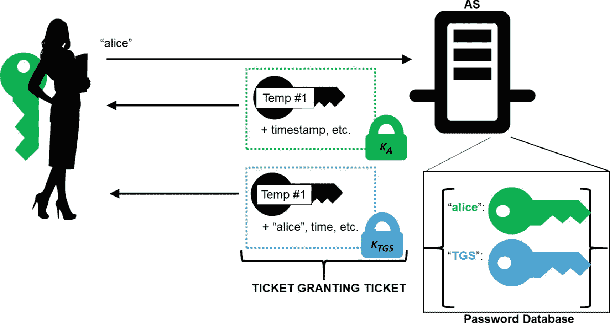
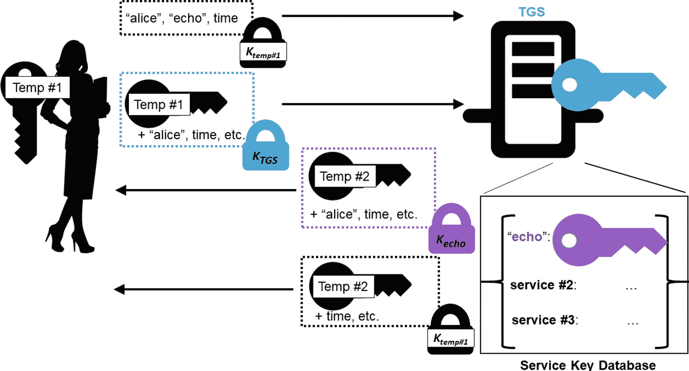
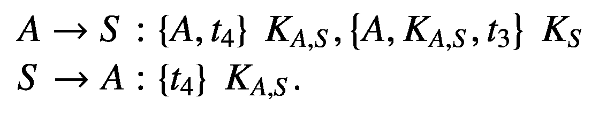

# 7.更对称的加密:认证加密和 Kerberos

在这一章中，我们将讨论一些高级的对称加密技术，我们将更深入地研究认证加密。

让我们深入一个例子和一些使用 AES-GCM 的代码。

## AES-GCM

在过去的一个月里，爱丽丝和鲍勃与伊芙有过几次千钧一发的时刻。在那段时间里，他们一直在交换装有加密文件的 USB 驱动器。到目前为止，这种方法对他们很有效，但他们似乎很难记住一些关键的事情:他们应该先加密然后 MAC，MAC 需要覆盖未加密的数据，以及他们需要有两个独立的密钥。在压力下，他们的记忆力不佳，这是可以理解的，在经历了一些恼怒和千钧一发之后，他们让总部知道他们想要一些不太容易出错的东西。

碰巧的是，他们可以使用一些新的东西。新的对称操作模式称为“认证加密”(AE)和“带附加数据的认证加密”(AEAD)。这些新的操作模式为*提供了数据的保密性和真实性。AEAD 还可以提供“额外数据”的真实性，这些“额外数据”是*没有*加密的。这比听起来要重要得多，所以我们实际上要把 AE 放在一边，只关注 AEAD。*

在本练习中，我们将使用一种称为“伽罗瓦/计数器模式”(GCM)的 AES 模式。这个模式的 API 与我们之前看到的略有不同，所以让我们给 Alice 和 Bob 上一堂速成课。在清单 [7-1](#PC1) 中，我们使用 AES-GCM 加密一个文档*和*认证加密过程中使用的 IV 和 salt。

```py
 1   from cryptography.hazmat.backends import default_backend
 2   from cryptography.hazmat.primitives.kdf.scrypt import Scrypt
 3   from cryptography.hazmat.primitives.ciphers import Cipher, algorithms, modes
 4   import os, sys, struct
 5
 6   READ_SIZE = 4096
 7
 8   def encrypt_file(plainpath, cipherpath, password):
 9       # Derive key with a random 16-byte salt
10       salt = os.urandom(16)
11       kdf = Scrypt(salt=salt, length=32,
12                   n=2**14, r=8, p=1,
13                   backend=default_backend())
14       key = kdf.derive(password)
15
16       # Generate a random 96-bit IV.
17       iv = os.urandom(12)
18
19       # Construct an AES-GCM Cipher object with the given key and IV.
20       encryptor = Cipher(
21           algorithms.AES(key),
22           modes.GCM(iv),
23           backend=default_backend()).encryptor()
24
25       associated_data = iv + salt
26
27       # associated_data will be authenticated but not encrypted,
28       # it must also be passed in on decryption.
29       encryptor.authenticate_additional_data(associated_data)
30
31       with open(cipherpath, "wb+") as fcipher:
32           # Make space for the header (12 + 16 + 16), overwritten last
33           fcipher.write(b"\x00"*(12+16+16))
34
35           # Encrypt and write the main body
36           with open(plainpath, "rb") as fplain:
37               for plaintext in iter(lambda: fplain.read(READ_SIZE), b''):
38                   ciphertext = encryptor.update(plaintext)
39                   fcipher.write(ciphertext)
40               ciphertext = encryptor.finalize() # Always b''.
41                   fcipher.write(ciphertext) # For clarity
42
43               header = associated_data + encryptor.tag

44               fcipher.seek(0,0)
45               fcipher.write(header)

Listing 7-1
AES-GCM

```

这个函数的大部分应该看起来很熟悉。因为我们将这些数据存储在磁盘上，所以我们使用了`Scrypt`而不是`HKDF`，并使用它从密码中生成一个密钥。如前一章所述，因为用户可能在多个文件中使用相同的密码，所以每个文件都需要自己的 salt 来生成每个文件的密钥。请记住，我们不希望在不同的文件上，甚至在同一个文件上使用相同的密钥和 IV(例如，如果我们加密，然后修改文件并再次加密)。为了格外谨慎，我们甚至不会使用同一个密钥。

与我们之前所做的类似，我们也创建了一个`Cipher`对象。但是我们不使用 CTR 或 CBC 模式，而是使用 GCM 模式。这种模式需要一个 IV，我们稍后会讨论为什么它是 12 字节，而不是我们过去看到的 16 字节。加密器上唯一的新方法是`authenticate_additional_data`。正如你可能猜到的，这种方法接收的数据将*而不是*被加密，但仍然需要被认证。

在这种情况下，我们要验证的未加密数据是 salt 和 IV。这个数据*必须*是明文，因为没有它我们无法解密。通过认证，我们可以确定——一旦解密完成——没有人篡改过这些未加密的值。

这个 GCM 操作的另一个独特部分是`encryptor.tag`。该值是在`finalize`方法之后计算的，或多或少是加密和附加数据的 MAC。在我们的实现中，我们选择将相关的数据(salt 和 IV)和标签放在文件的*开头*处。因为这些数据(至少是标签数据)在加密过程结束之前是不可用的，所以我们预先分配了几个字节(最初是零)，当我们在过程结束时最终获得标签时，我们将覆盖这些字节。在某些操作系统中，没有办法预先添加数据，所以预先分配的前缀字节确保我们在完成时有空间放置头。

清单 [7-2](#PC2) 中的函数不会删除或覆盖原始文件，所以使用它是相当安全的。使用它在您的系统上创建文件的加密副本。使用像 *hexdump* 这样的实用程序检查字节，以确保数据实际上是加密的。

### 警告:小心异常大小的文件

不要加密大于 64 GiB 的文件，因为 GCM 有一些限制，我们稍后会讨论。

现在，让我们编写一个`decrypt_file`函数，如清单 [7-2](#PC2) 所示。

```py
 1   from cryptography.hazmat.backends import default_backend
 2   from cryptography.hazmat.primitives.kdf.scrypt import Scrypt
 3   from cryptography.hazmat.primitives.ciphers import Cipher, algorithms, modes
 4   import os, sys, struct
 5
 6   READ_SIZE = 4096
 7   def decrypt_file(cipherpath, plainpath, password):
 8       with open(cipherpath, "rb") as fcipher:
 9           # read the IV (12 bytes) and the salt (16 bytes)
10           associated_data = fcipher.read(12+16)
11
12           iv = associated_data[0:12]
13           salt = associated_data[12:28]
14
15           # derive the same key from the password + salt
16           kdf = Scrypt(salt=salt, length=32,
17                   n=2**14, r=8, p=1,
18                   backend=default_backend())
19           key = kdf.derive(password)
20
21           # get the tag. GCM tags are always 16 bytes
22           tag = fcipher.read(16)
23
24           # Construct an AES-GCM Cipher object with the given key and IV
25           # For decryption, the tag is passed in as a parameter
26           decryptor = Cipher(
27               algorithms.AES(key),
28               modes.GCM(iv, tag),
29               backend=default_backend()).decryptor()
30           decryptor.authenticate_additional_data(associated_data)
31
32           with open(plainpath, "wb+") as fplain:
33               for ciphertext in iter(lambda: fcipher.read(READ_SIZE),b''):
34                   plaintext = decryptor.update(ciphertext)
35                   fplain.write(plaintext)

Listing 7-2AES-GCM Decryption

```

这个解密操作首先从读出未加密的 salt、IV 和 tag 开始。salt 与密码一起用于导出密钥。密钥、IV 和标签是 GCM 解密过程的参数。相关数据(salt 和 IV)也使用`authenticate_additional_data`函数传递到解密器中。

当解密器的`finalize`方法被调用并且任何数据被更改时，无论是密文还是附加数据，该方法都会抛出一个无效标签异常。

此函数不会尝试重新创建原始文件名。因此，您可以安全地将加密文件恢复为新的文件名，然后将新恢复的文件与原始文件进行比较。

### 练习 7.1。标签！就是你了。

人为“破坏”加密文件的不同部分，包括实际的密文和 salt、IV 或标记。演示解密文件会引发异常。

## AES-GCM 细节和细微差别

在我们的入门练习中，Alice 和 Bob 了解了 AES 的 GCM 操作模式。AES-GCM 是一种 AEAD(认证加密和相关数据)模式。关键细节的总结包括

*   该模式使用一个密钥对数据*进行加密和认证。*

*   加密和认证一体化；不需要担心什么时候做什么(例如，先加密后 MAC 与先 MAC 后加密)。

*   AEAD 包括对*未*加密的数据进行认证。

您可能已经注意到，这些功能解决了 Alice 和 Bob 的顾虑。它极大地减少了误用和错误配置，使 Alice 和 Bob(以及您)更容易做对。

其中值得特别强调的一个要素是额外数据的认证。在密码学的历史上，攻击者从一个上下文中取出数据，在另一个上下文中滥用它的情况屡见不鲜。例如，重放攻击就是这类问题的典型例子。在许多情况下，如果强制敏感数据的上下文，这些攻击就会失败。

在我们的文件加密示例中，我们验证了 IV 和 salt 值，但是我们可以很容易地加入文件名和时间戳。加密文件的一个问题是识别该文件的较旧但正确加密的版本的重放。如果用文件认证了时间戳，或者包括了版本号或其他现时，则加密文件更紧密地绑定到可识别的上下文。

当你加密数据时，仔细考虑哪些数据需要是真实的，而不仅仅是 T2 的私人数据。您对加密环境的识别和保护越好，您的系统就越安全。

在保护数据不被修改方面，需要注意的是 AEAD 算法在知道数据是否被修改之前对数据*进行解密。在您对上述文件解密的实验中，您可能已经注意到，即使加密的文件被损坏，解密器仍然会创建一个解密的文件。GCM 抛出的异常是在所有内容都被解密并(在我们的实现中)写入恢复的文件之后抛出的。*

总之，记住在标签被验证之前，解密的数据*是不可信的*！

AEAD 很棒，但是组合操作引入了一个有趣的问题。你要等多久才能拿到标签？假设 Alice 和 Bob 使用 AES-GCM 通过网络发送数据，而不是解密文件。假设是大量的数据。假设完全传输数据需要几个小时。如果我们像加密文件一样加密这些数据，那么在整个传输完成之前，标签不会被发送。

你真的想等到最后几个小时才收到标签吗？

更糟糕的是，如何计算安全通道的“终点”？如果一个加密通道连续几天打开，发送任意数量的数据，在什么时候你决定停止，计算并发送标签？

在 TLS 这样的网络协议中，我们将在第 [8](8.html) 章中更全面地探讨，每个单独的 TLS 记录(或多或少是一个 TLS 包)都是用它自己的单独标签单独进行 GCM 加密的。这样，恶意或意外的修改几乎可以实时检测到，而不是在传输结束时检测到。一般来说，对于流，建议使用更小的 GCM 加密方法。

对于这种小型 AES-GCM 加密操作,`cryptography`库有一个更简单的用户界面。它有一个额外的好处，即除非标签正确，否则解密操作不会返回解密的数据，从而防止您意外使用坏数据。下面是来自`cryptography`库文档的一些示例代码，演示了它的用法:

```py
>>> import os
>>> from cryptography.hazmat.primitives.ciphers.aead import AESGCM
>>> data = b"a secret message"
>>> aad = b"authenticated but unencrypted data"
>>> key = AESGCM.generate_key(bit_length=128)
>>> aesgcm = AESGCM(key)
>>> nonce = os.urandom(12)
>>> ct = aesgcm.encrypt(nonce, data, aad)
>>> aesgcm.decrypt(nonce, ct, aad)
b'a secret message'

```

这个 API 很容易使用，概念也不太难，但是它有一个重要的安全考虑:nonce。回想一下，GCM 中的“C”代表“计数器”。GCM 多少有点像 CTR，其中集成了一个标记操作。这很重要，因为我们之前讨论过的计数器模式的许多问题仍然存在。特别是，虽然你不应该在 AES 加密的*任何*模式下重用一个密钥和 IV 对，但是对于计数器模式(和 GCM)来说*尤其是*是不好的。这样做可以轻松地公开两个明文的 XOR 运算。GCM 的 IV/nonce 必须**永不重用**。

为了说明这个问题，让我们简单回顾一下计数器模式是如何工作的。请记住，与 CBC 模式不同，AES 计数器模式实际上并不使用 AES 块加密来加密明文。相反，单调递增的计数器用 AES 加密，这个*流*与明文进行异或运算。值得重复的是，AES 分组密码首先应用于计数器，然后应用于计数器+1，再应用于计数器+2，以此类推，生成完整的流。重用*随机数*导致重用*流*。

这很重要。但是，如果您不更加小心，您可能会遇到同样灾难性的稍微类似的问题。例如，假设您决定从 nonce 0(0 的 16 个字节)开始，而不是为计数器模式选择一个随机 IV。您使用 nonce (0)在一个密钥下加密一组数据(可能是一个文件),然后将 nonce 加 1 来初始化一个新的 AES 计数器上下文，以便在同一密钥下加密一组新的数据(例如另一个文件)。因此，你的随机数只不过是一个不断递增的计数器。

这样做的问题是——即使您认为您没有重用 nonce(每次都不一样)——计数器模式通过为每个块增加一个 nonce 来工作。第一个操作加密 0，然后 1，然后 2，依此类推；第二个操作加密 1，然后 2，然后 3，依此类推。换句话说，用第二随机数加密的第二文件在第一个 128 位块之后重复相同的密钥流。在后续流之间有*非常大量的重叠*。

对于像我们在示例中使用的相对少量的数据，使用完全随机的 16 字节 IV 对于标准计数器模式可能就足够了。在生产代码中，您必须进行安全性分析，以确定在创建重叠的密码流之前，您平均有多长时间。这种计算取决于您计划在同一密钥下加密多少数据。如果您想要显式地控制您的 IVs，以确保不可能重叠一个键/计数器对，那么您可以遵循一些规则。

例如，GCM 要求一个 12 字节的 IV 来明确地解决这个问题(它确实允许更长的 IV，但是这引入了新的问题，超出了本书的范围)。然后用 4 个零字节填充选定的 12 字节随机数，以产生 16 字节计数器。即使选择的随机数只比前一个随机数多一个，只要不溢出 4 字节块计数器，计数器也不会重叠。128 位块上的 4 字节计数器意味着在溢出计数器之前，最多可以加密 2 <sup>36</sup> 字节(或 64 GiB)的数据，这就是为什么 64 GiB 的数据被指定为 GCM 加密的上限。

使用 12 字节的 IV 和每个 key/IV 对不超过 64 GiB 的明文意味着永远不会有任何重叠。出于超出本书范围的原因，对 GCM IVs 的唯一其他要求是它们不能为零。

让我们回到使用 AES-GCM 加密流中一堆较小消息的问题。我们如何避免重用一个 key/IV 对？我们可以尝试提出一种确定性的方法，在传输的每一端旋转密钥，但这太复杂且容易出错。我们可以做的是为每个单独的加密使用不同的 IV/nonce 值。在最坏的情况下，随机数可以随每个数据包一起发送。与密钥不同，随机数不必是秘密的，只需是可信的就可以了。

此外，我们可以使用某些 nonce 构造算法来帮助防止重用。限制密钥的随机性是不行的，因为密钥必须是秘密的，并且任何选择的比特都决定性地降低了发现该秘密的强力难度。只要 IV 不会被同一个密钥重用，减少 IV 中某些位的随机性*是可以接受的。*

例如，IV 的一些字节可能是设备特定的。这确保了两个不同的设备永远不会生成相同的随机数。可选地，或者附加地，IV 的一些字节可以通过*推断*，减少必须存储或传输的 IV 数据量。也许文件加密的 IV 的一部分取决于文件在磁盘上的存储位置。

现在，我们将继续生成随机的虚拟信息，并根据需要发送它们，但是理解一些生成和使用虚拟信息的不同方式是有好处的。

### 练习 7.2。矮胖的 GCM

修改本章前面的文档加密代码，以不超过 4096 字节的块进行加密。每次加密将使用相同的密钥，但不同的随机数。这一变化意味着，您将需要为每个加密块存储一个 IV 和一个标记，而不是在文件顶部存储一个 IV 和一个标记。

## 其他 AEAD 算法

除了 AES-GCM 模式，`cryptography`库还支持另外两种流行的 AEAD 算法。第一个是 AES-CCM。第二种被称为查查。

AES-CCM 与 AES-GCM 非常相似。像 GCM 一样，它使用计数器模式进行加密；然而，标签是由类似于 CBC-MAC 但也优于 CBC-MAC 的方法生成的。

AES-CCM 和 AES-GCM 之间的一个关键区别是 IV/nonce 可以是可变长度的:在 7 和 13 字节之间。IV/nonce 越小，密钥/IV 对可以加密的数据量就越大。像 GCM 一样，这个 nonce 只是完整的 16 字节计数器值的一部分。因此，nonce 使用的 16 个字节越少，计数器在溢出前可以使用的字节就越多。

由于超出本书范围的原因，nonce 被限制为 15- *L* 字节长，其中 *L* 是长度字段的大小:如果您的数据需要 2 个字节来存储长度，nonce 可以达到 13 个字节。另一方面，如果数据的大小需要 8 个字节来存储长度，则 nonce 被限制为 7 个字节。这两个值代表 CCM 模式支持的最小值和最大值。

假设您希望将 CCM 用于大量数据，只需选择一个 7 字节的 nonce，然后继续。该算法的安全性不会基于 nonce 的大小而改变，只要您不重用带有密钥的 nonce。

除了这个令人痛苦的 nonce 问题，CCM 与 GCM 没有其他 API 差异。然而，就性能而言，GCM 更容易并行化。这可能不会对您的 python 编程产生太大影响，但如果您想将图形卡用作加密加速器，这就有所不同了。

使用`cryptography`库时，不支持将 CCM 作为 AES 密码上下文的操作模式。只有独立的`AESCCM`对象可用。

```py
>>> import os
>>> from cryptography.hazmat.primitives.ciphers.aead import AESCCM
>>> data = b"a secret message"
>>> aad = b"authenticated but unencrypted data"
>>> key = AESCCM.generate_key(bit_length=128)
>>> aesccm = AESCCM(key)
>>> nonce = os.urandom(7)
>>> ct = aesccm.encrypt(nonce, data, aad)
>>> aesccm.decrypt(nonce, ct, aad)
b'a secret message'

```

我们将向您介绍的最后一种 AEAD 模式称为 ChaCha20-Poly1305。这种密码在本书讨论的 AEAD 方法中是独一无二的，因为它是唯一不基于 AES 的 AEAD 算法。它由 Daniel J. Bernstein 设计，结合了他设计的流密码 ChaCha20 和 Bernstein 设计的 MAC 算法 Poly1305。Bernstein 是一名相当出色的密码学家，目前正在从事一些与椭圆曲线、哈希、加密和抵抗量子攻击的不对称算法相关的项目。他还是一名程序员，编写了许多与安全相关的程序。

安全社区的一些人担心，AES 的流行意味着如果在 AES 中发现严重的漏洞，互联网的加密车轮可能会停止转动。将 ChaCha 确立为一种有效的替代方案意味着，如果发现这种漏洞，将会有一种经过充分测试的、成熟的替代方案可用。ChaCha20-Poly1305 作为*认证的*加密是更好的。

ChaCha20 还有其他一些优点。对于纯软件驱动的实现，ChaCha 通常比它的同类产品更快。此外，根据设计，它是一个流密码。AES 是一种可以用作流密码的分组密码，而 ChaCha 只是一种流密码。在互联网的早期，RC4 是一种流密码，用于许多安全环境，包括 TLS 和 Wi-Fi。不幸的是，人们发现它有很大的弱点和缺陷，这几乎使它无法使用。ChaCha 被一些人视为它的精神继承者。

像 AES-GCM 一样，ChaCha20-Poly1305 需要一个 12 字节的 nonce。它在`cryptography`库中的 API 非常相似:

```py
>>> import os
>>> from cryptography.hazmat.primitives.ciphers.aead import ChaCha20Poly1305
>>> data = b"a secret message"
>>> aad = b"authenticated but unencrypted data"
>>> key = ChaCha20Poly1305.generate_key()
>>> chacha = ChaCha20Poly1305(key)
>>> nonce = os.urandom(12)
>>> ct = chacha.encrypt(nonce, data, aad)
>>> chacha.decrypt(nonce, ct, aad)
b'a secret message'

```

这些 AEAD 算法中的任何一种都可以在或多或少相同的安全保证下使用。这三种方法都被认为比通过单独加密和 MAC 来创建认证加密要好得多。只要 AEAD 算法可用，您就应该利用它们。

您可能已经注意到了这三种不同模式的`generate_key`方法。这是一个方便的功能，不是必需的。例如，您仍然可以像往常一样使用密钥派生函数来创建密钥。但是正如您所看到的，使用 ChaCha，您甚至不必指定位大小。它只是给你一个大小合适的键，可以消除一类常见的错误。

### 练习 7.3。快速恰恰

为 AES-GCM、AES-CCM 和 ChaCha20-Poly1305 创建一些速度比较测试。运行一组测试，将大量数据准确地输入每个`encrypt`函数一次。测试解密算法的速度。注意，这也测试了标记检查。

运行第二组测试，将大数据分成较小的数据块(每个数据块可能有 4 个 KiB)，每个数据块单独加密。

## 在网络中工作

东南极洲的间谍们终于走出了石器时代，开始将电脑接入互联网。是时候让 Alice 和 Bob 学习编写一些支持网络的代码来来回回发送他们的代码了。

因为他们使用 Python 3，Alice 和 Bob 将使用`asyncio`模块进行一些异步网络编程。如果你以前用过套接字编程，这将会有一点不同。

作为解释，套接字通常是网络通信的一种*阻塞*或*同步*方式。套接字可以被配置为非阻塞的，在这种模式下，你可以将它们与类似于`select`函数的东西一起使用，以防止程序在等待数据时被卡住。或者，可以将套接字放在一个线程中，以保持数据流入主程序循环。

`asyncio`模块采用异步方法，试图在网络通信的概念模型之后对数据结构建模。特别是，网络数据由一个具有处理`connection_made`、`data_received`和`connection_lost`事件的方法的`Protocol`对象处理。`Protocol`对象被插入到一个异步事件循环中，当事件被触发时`Protocol`的事件处理程序被调用。

一个`Protocol`类通常看起来类似于清单 [7-3](#PC6) 。

```py
 1   import asyncio
 2
 3   class ConcreteProtocol(asyncio.Protocol):
 4       def connection_made(self, transport):
 5           self.transport = transport
 6
 7       def data_received(self, data):
 8           pass
 9           # process data
10           # send data using transport.write as needed
11
12       def connection_lost(self, exc):
13           pass
14           # do cleanup

Listing 7-3Network Protocol Intro

```

一个`Protocol`对象的约定是，在构造之后，当底层网络准备好时，将有一个对`connection_made`的调用。这个事件之后将会有零个或多个对`data_received`的调用，然后在底层网络连接断开时会有一个`connection_lost`调用。

协议可以通过调用`self.transport.write`向对等体发送数据，并可以通过调用`self.transport.close`强制关闭连接。

应该注意的是，每个连接只创建一个协议对象:当一个*客户端*建立一个出站连接时，只有一个连接和一个协议。但是，当一个*服务器*正在监听一个端口上的连接时，一次可能有很多连接。服务器为每个进入的客户机产生连接，而`asyncio`为每个新的连接产生一个协议对象。

这是对`asyncio`的网络 API 的一个非常快速的概述。更详细的解释超出了本书的范围，但是如果你需要更多的信息，`asyncio`文档非常全面。此外，随着您对示例的理解，这其中的大部分内容可能会变得更加清晰。说到这里，让我们利用我们所学的知识，创建一个“安全的”echo 服务器。

echo 协议是网络通信的“Hello World”。基本上，服务器监听客户端连接的端口。当客户机连接时，它向服务器发送一串数据(通常是人类可读的)。服务器通过镜像完全相同的消息(即“echo”)并关闭连接来做出响应。你可以在网上找到很多这样的例子，包括`asyncio`文档中的一个例子。

我们将添加一个扭曲。我们将构建一个变体，在传输时加密，在接收时解密。

让我们从创建服务器开始，如清单 [7-4](#PC7) 所示。

```py
 1   from cryptography.hazmat.primitives.ciphers.aead import ChaCha20Poly1305
 2   from cryptography.hazmat.primitives import hashes
 3   from cryptography.hazmat.primitives.kdf.hkdf import HKDF
 4   from cryptography.hazmat.backends import default_backend
 5   import asyncio, os
 6
 7   PW = b"password"
 8
 9   class EchoServerProtocol(asyncio.Protocol):
10       def __init__(self, password):
11           # 64 bytes gives us 2 32-byte keys.
12           key_material = HKDF(
13               algorithm=hashes.SHA256(),
14               length=64, salt=None, info=None,
15               backend=default_backend()
16           ).derive(password)
17           self._server_read_key = key_material[0:32]
18           self._server_write_key = key_material[32:64]
19
20       def connection_made(self, transport):
21           peername = transport.get_extra_info('peername')
22           print('Connection from {}'.format(peername))
23           self.transport = transport
24
25       def data_received(self, data):
26           # Split out the nonce and the ciphertext.
27           nonce, ciphertext = data[:12], data[12:]
28           plaintext = ChaCha20Poly1305(self._server_read_key).decrypt(
29               nonce, ciphertext, b"")
30           message = plaintext.decode()
31           print('Decrypted message from client: {!r}'.format(message))
32
33           print('Echo back message: {!r}'.format(message)) 

34           reply_nonce = os.urandom(12)
35           ciphertext = ChaCha20Poly1305(self._server_write_key).encrypt(
36               reply_nonce, plaintext, b"")
37           self.transport.write(reply_nonce + ciphertext)
38
39           print('Close the client socket')
40           self.transport.close()
41
42   loop = asyncio.get_event_loop()
43   # Each client connection will create a new protocol instance
44   coro = loop.create_server(lambda: EchoServerProtocol(PW), '127.0.0.1', 8888)
45   server = loop.run_until_complete(coro)
46
47   # Serve requests until Ctrl+C is pressed
48   print('Serving on {}'.format(server.sockets[0].getsockname()))
49   try:
50       loop.run_forever()
51   except KeyboardInterrupt:
52       pass
53
54   # Close the server
55   server.close()
56   loop.run_until_complete(server.wait_closed())
57   loop.close()

Listing 7-4
Secure Echo Server

```

该文件中只有一个协议类:`EchoServerProtocol`。为了便于说明，`connection_made`方法报告了连接客户端的详细信息。这通常是客户端的 IP 地址和出站 TCP 端口。这只是为了增加趣味性，对于服务器的运行并不重要。

真正的肉在`data_received`法里。该方法接收数据，解密数据，重新加密数据，然后将其发送回客户端。

实际上，我们有点超前了:对于这种加密，密钥来自哪里？密码是`EchoServerProtocol`构造函数的一个参数，但是如果你在代码的后面看一下`create_server`行，你会看到我们正在传递一个硬编码的值。鉴于“密码”仍然是一个常见的密码，我们选择该字符串作为“秘密” <sup>[1](#Fn1)</sup> 。

使用密码，`EchoServerProtocol`得到两个密钥:一个“读”密钥和一个“写”密钥。因为我们将使用随机随机数，所以我们可以对客户机和服务器使用相同的密钥，但是拥有两个不同的密钥很容易做到，并且是一个好的实践。我们使用`HKDF`生成 64 字节的密钥材料，并将其分成两个密钥:服务器的读取密钥和服务器的写入密钥。

回到`data_received`方法，记住当我们从客户端收到一些东西时，这个方法被调用。因此，`data`变量是客户端发送给我们的。我们假设(没有任何错误检查)客户端发送了一个 12 字节的 nonce，后跟任意数量的密文。使用这个随机数和服务器的读取密钥，我们可以解密密文。注意，第三个参数只是一个空字节字符串，因为我们现在不验证任何额外的数据。

一旦数据被解密，恢复的明文在服务器的写密钥和新生成的随机数下被重新加密。我们可以重用 nonce，因为我们有一个不同的密钥，但是使用单独的 nonce 是一个很好的实践，可以让传输双方使用相同的消息格式。然后，新的随机数和重新加密的消息被发送回客户端。

剩下的就是设置服务器了。除了`create_server`方法之外，您可以忽略它的大部分。该方法在本地端口 8888 上设置一个侦听器，并将其与一个匿名工厂函数相关联。每次有新的连接进来时，lambda 都会被调用。换句话说，对于每个传入的客户端连接，都会产生一个新的`EchoServerProtocol`对象。

完成服务器代码后，我们创建清单 [7-5](#PC8) 中的客户机代码，它发送初始消息并解密响应。

```py
 1   from cryptography.hazmat.primitives.ciphers.aead import ChaCha20Poly1305
 2   from cryptography.hazmat.primitives import hashes
 3   from cryptography.hazmat.primitives.kdf.hkdf import HKDF
 4   from cryptography.hazmat.backends import default_backend
 5   import asyncio, os, sys
 6
 7   PW = b"password"
 8
 9   class EchoClientProtocol(asyncio.Protocol):
10       def __init__(self, message, password):
11           self.message = message
12
13           # 64 bytes gives us 2 32-byte keys
14           key_material = HKDF(
15               algorithm=hashes.SHA256(),
16               length=64, salt=None, info=None,
17               backend=default_backend()
18           ).derive(password)
19           self._client_write_key = key_material[0:32]
20           self._client_read_key = key_material[32:64]
21
22       def connection_made(self, transport):
23           plaintext = self.message.encode()
24           nonce = os.urandom(12)
25           ciphertext = ChaCha20Poly1305(self._client_write_key).encrypt(
26               nonce, plaintext, b"")
27           transport.write(nonce + ciphertext)
28           print('Encrypted data sent: {!r}'.format(self.message)) 

29
30       def data_received(self, data):
31           nonce, ciphertext = data[:12], data[12:]
32           plaintext = ChaCha20Poly1305(self._client_read_key).decrypt(
33               nonce, ciphertext, b"")
34           print('Decrypted response from server: {!r}'.format(plaintext.decode()))
35
36       def connection_lost(self, exc):
37           print('The server closed the connection')
38           asyncio.get_event_loop().stop()
39
40   loop = asyncio.get_event_loop()
41   message = sys.argv[1]
42   coro = loop.create_connection(lambda: EchoClientProtocol(message, PW),
43                                 '127.0.0.1', 8888)
44   loop.run_until_complete(coro)
45   loop.run_forever()
46   loop.close()

Listing 7-5
Secure Echo Client

```

这段代码与服务器有一些相似之处，这应该很明显。首先，我们有相同的硬编码(非常糟糕)密码。显然，我们需要相同的密码，否则双方将无法相互通信。我们在构造函数中也有相同的密钥派生例程。

尽管如此，还是有一些重要的区别。如果你看看密钥材料是怎么划分的，这次前 32 个字节是客户端的*写*密钥，后 32 个字节是客户端的*读*密钥。在服务器代码中，这当然是相反的。

这不是意外。我们正在处理对称密钥；客户端写什么，服务器读取什么，反之亦然。换句话说，客户端的写密钥就是服务器的读密钥。当您派生密钥时，您必须确保密钥材料拆分的顺序在两端都得到正确的管理。有几个早期的练习在没有太多解释的情况下处理了这个问题。如果那些练习在当时没有多大意义，现在可能是重温它们的好时机。

解决这个问题的另一个方法是在两端总是调用相同的派生密钥。因此，举例来说，您可以选择对客户端和服务器都使用“客户端写入”密钥和“服务器写入”密钥，而不是派生“读取”密钥和“写入”密钥。这样，前 32 个字节可以始终是客户端的写密钥，后 32 个字节是服务器的写密钥。

一旦创建了这两个键，其他的名字只是别名。也就是说，“客户端读取”密钥只是“服务器写入”密钥的别名，而“服务器读取”密钥只是“客户端写入”密钥的别名。

### 练习 7.4。名称又能代表什么呢

在许多情况下，“读”和“写”是使用的正确名称，因为尽管称一台计算机为客户机，一台计算机为服务器，但它们的行为是*对等的*。

但是，如果您正在处理这样一个上下文，其中只有客户端*发出请求，只有服务器*响应请求，那么您可以适当地重命名您的密钥。我们创建的 echo 客户机/服务器就是这种模式的一个例子。**

从清单 [7-4](#PC7) 和 [7-5](#PC8) 中的代码开始，将所有对“读”和“写”数据或键的引用改为“请求”和“响应”。给他们起个合适的名字！客户端编写请求并读取响应，而服务器读取请求并编写响应。客户机和服务器代码之间的关系会发生什么变化？

与服务器代码的另一个区别是，我们在客户端的`connection_made`方法中传输数据。这是因为服务器在响应之前等待客户端发送一些东西，而客户端只是尽可能快地传输。

数据传输本身应该看起来很熟悉。生成一个随机数，并使用`transport.write`写入随机数和密文。

服务器的响应在`data_received`中处理。这个应该也很眼熟吧。分离随机数，并使用读取的密钥和接收的随机数解密密文。

在`create_connection`方法中，您会注意到我们仍然使用匿名 lambda 函数来构建客户端协议类的实例。这可能会让你吃惊。在服务器中，使用工厂函数是有意义的，因为可能有多个连接需要多个协议实例。然而，在出站连接中，只有一个协议实例和一个连接。实际上，工厂是不必要的。使用它是为了让`create_server`和`create_connection`的 API 尽可能的相似。

这段代码是研究使用加密技术的网络协议的良好开端。然而，对于真正的网络通信，通常需要额外的机器。生产代码中可能出现的一个问题是消息被分割成多个`data_received`调用，或者多个消息被压缩成一个`data_received`调用。`data_received`方法将传入的数据视为*流*，这意味着无法保证在一次调用中会收到多少数据。`asyncio`库不知道你发送的数据是否应该被分割。要解决这个问题，您需要能够识别一条消息的结束位置和另一条消息的开始位置。这通常需要一些缓冲，以防不是所有的数据都被一次接收到，并且需要一个协议来指示在哪里分离各个消息。

## Kerberos 简介

尽管 PKI 目前广泛用于建立和验证身份，但也有仅使用对称加密在双方之间建立身份和信任的算法。与 PKI 一样，这些算法需要可信的第三方。

用于双方认证通信的最著名的协议之一是 *Kerberos* 。Kerberos 是一种单点登录(SSO)服务，它在 20 世纪 90 年代早期发展成当前的形式(版本 5)。尽管自那以后有过更新，但该协议基本保持不变。它允许某人先登录 Kerberos 系统，然后无需再次登录即可访问其他网络资源。真正酷的是，虽然已经添加了扩展以使用特定组件的 PKI，但核心算法都使用对称加密。

Alice 和 Bob 听说 Kerberos 现在被部署在某些 WA 网络中的系统上。为了探索渗透这些系统的各种机会并寻找其中的弱点，Alice 和 Bob 在总部花了一些时间学习 Kerberos 是如何工作的。

我们将帮助 Alice 和 Bob 创建一些类似 Kerberos 的代码。与本书中的大多数例子一样，这不是真正的 Kerberos，完整的系统超出了本书的范围。我们仍然可以探索基本组件，并感受 Kerberos 如何使用相对简单的网络协议来施展它的魔力。我们将尝试确定我们遗漏的更高级和更复杂的部分，但是如果您真的想深入了解生产 Kerberos，您将需要研究其他来源。

我们还将引入一些新的符号来描述在加密协议中发送的消息。在我们已经用密钥({plaintext} *K* )表示密文的基础上，我们现在添加一些符号来表示一方(当事人)向另一方发送消息。假设 Alice 想给 Bob 发送一条消息，其中包括她的名字(明文)和一些用共享密钥加密的密文。我们对这种预期交换的符号如下所示:


你看到的箭头并不代表*收到了*的消息。由于数据丢失或被 Eve 截获，Bob 可能永远得不到它。箭头代表*意图*，所以 *A* → *B* 的意思是 A(爱丽丝)打算给 B(鲍勃)发一个信息。然而，出于实际目的，有时把它想象成发送和接收会更简单，所以我们也要做这个简化的假设。

*A* 代表爱丽丝的名字，或者身份串。标识字符串可以是很多东西。这可能是爱丽丝的法定姓名，用户名，URI，或者只是一个不透明的令牌。因为消息中的 *A* 不在任何大括号内，所以它是明文。在 *K* <sub>*A，B*</sub> 下的密文与我们之前用来表示由 *A* 和 *B* 共享的密钥的符号相同。然而，当 *A* 正在向 *B* 发送在“属于】B 的秘密下加密的数据时(例如，在从与 *B* 关联的密码导出的密钥下)，我们将该密钥标记为*K*T24】T25】BT27】。尽管 *A* 知道这个秘密，并且从技术上来说，它是一个共享密钥，但是这个想法是，这个消息被加密，只供 *B.* 使用

Kerberos 有多个主体，消息交换可能有点复杂。我们将使用这种符号来帮助表达谁在向谁发送数据。

做好准备后，Alice 和 Bob 坐下来上 Kerberos 如何工作的课。第一课是关于 Kerberos 如何使用身份*和密码*的中央存储库。与不需要保存所有签名证书的在线注册表(当然也不存储任何私钥)的证书颁发机构不同，Kerberos 身份验证服务器(AS)跟踪每个可用的身份并将其映射到密码。这些数据必须随时可用。

Kerberos AS 显然是系统中非常敏感的部分。如果 AS 遭到破坏，攻击者就会获得每个用户的每个密码。因此，应该小心保护这个系统。此外，如果 AS *宕机*，Kerberos 的其余部分就会崩溃。因此，AS 必须能够抵抗拒绝服务(DoS)攻击。

让我们暂停一下，为我们的玩具快速搭建一个骨骼框架。在整个例子中，从清单 [7-6](#PC9) 开始，我们将我们的系统称为`SimpleKerberos`，以表明这不是完整的协议。我们首先为 AS 创建一个协议类，并硬编码一个基于字典的密码数据库。我们还不知道 AS *做*什么，所以我们将所有的联网方法都留空。

```py
 1   # Partial Listing: Some Assembly Required
 2
 3   # Skeleton for Kerberos AS Code, User Database, initial class decl
 4   import asyncio, json, os, time
 5   from cryptography.hazmat.backends import default_backend
 6   from cryptography.hazmat.primitives import hashes
 7   from cryptography.hazmat.primitives.ciphers import Cipher, algorithms, modes
 8   from cryptography.hazmat.primitives import padding
 9   from cryptography.hazmat.primitives.kdf.hkdf import HKDF
10
11   # we used the most common passwords
12   # from 2018 according to wikipedia
13   # https://en.wikipedia.org/wiki/List_of_the_most_common_passwords
14   USER_DATABASE = {
15       "johndoe": "123456",
16       "janedoe": "password",
17       "h_world": "123456789",
18   }
19
20   class SimpleKerberosAS(asyncio.Protocol):
21       def connection_made(self, transport):
22           self.transport = transport
23
24       def data_received(self, data):
25           pass

Listing 7-6Kerberos Authentication Server

```

到目前为止，清单 [7-6](#PC9) 中没有什么复杂的东西:只是一个用户名到密码的字典和一个空的协议类。为了填充这些方法，我们需要知道 AS 是如何工作的。

至此，一些*真正酷的*密码术出现了！用户应该如何登录？我们绝对不希望通过网络将密码*明文*发送出去。显然，用户必须向 AS 注册，以便将他们的密码存储在那里，所以我们应该利用这个机会来创建一个共享的加密密钥吗？

原来这些都不是必须的！用户只需发送他们的名字就可以登录*。使用我们的协议符号，下面是 Alice 登录 AS 的方式:*


真的吗？这是怎么回事？是什么让伊芙不发送爱丽丝的名字？

神奇之处在于*的回应*。AS 将发回只有真正的*爱丽丝才能解密的加密数据。这假设 Alice 知道她的密码，其他人都不知道。*

首先，AS 将从 Alice 的密码中得到她的密钥 *K* <sub>*A*</sub> 。然后，AS 将发回一个新生成的会话密钥，该密钥在 Alice 的 *K* <sub>*A*</sub> 密钥下加密！


如果爱丽丝知道密码，她将能够导出 *K* <sub>*A*</sub> 并解密会话密钥，稍后我们将解释其目的。现在，我们只能说它是 SSO 操作的一部分。

Kerberos 通过使用时间戳和随机数来抵御重放攻击。虽然 Kerberos 是可配置的，但它通常不会接受超过 5 分钟的消息。时间戳也用作 nonce，这意味着同一个时间戳不能使用两次。时间戳包括微秒字段；很难想象一个客户端在同一微秒内发送两个请求。真正的 Kerberos 检查它是否在同一时间(精确到微秒)发送了多个包。如果发生这种情况，应该人为地将时间戳中微秒字段的值增加 1。

为了简单起见，我们将使用时间戳，而不像对待随机数那样对待它们(例如，检查重复)。我们将更新我们的协议，将 *t* <sub>*1*</sub> 作为爱丽丝的时间戳:


让我们更新我们的 AS 来接收 Alice 的消息并发回一个加密的会话密钥。对于我们在前面的示例和练习中发送的消息，我们只是将数据与足够长的固定长度片段连接在一起，我们可以将所有的单个元素分开。

这一次，我们发送的消息长度不太容易预测。当 Alice 发送她的用户名和时间戳时，AS 如何能够将消息分成两部分？我们可以使用一个分隔符，比如逗号，并禁止它成为用户名的一部分，但是我们将发送多个*加密值*。我们怎么知道一个在哪里结束，另一个在哪里开始？分隔符不能直接用于原始加密数据，因为该数据使用所有可能的字节值。

在实际的网络通信中，这个问题有许多解决方法。例如，HTTP 使用分隔符(例如，`key: value<newline>`)发送元数据，如果任何数据是任意的(并且可能包含分隔符)，则使用某种预定义的算法(例如 Base-64 编码)将其转义或转换为 ASCII。其他网络数据包是通过序列化所有值并将长度字段作为二进制数据包的一部分来创建的。

为了简化这个练习，我们将使用 Python 的`json`库来序列化和反序列化字典。我们在前面的章节中已经使用过一次，将数据存储到磁盘。现在我们将使用 json 对通过网络传输的数据进行编码。然而，`json`并不总是能很好地处理字节字符串。清单 [7-7](#PC10) 定义了两个快速的方法，用于将我们的字典快速转储到 JSON 中，并再次从其中重新加载。确保我们将在这个例子中创建的所有三个 Kerberos 脚本中都有这个代码(或者从一个公共文件中导入它们)。

```py
 1   # These helper functions deal with json's lack of bytes support
 2   def dump_packet(p):
 3       for k, v in p.items():
 4           if isinstance(v, bytes):
 5               p[k] = list(v)
 6       return json.dumps(p).encode('utf-8')
 7
 8   def load_packet(json_data):
 9       p = json.loads(json_data)
10       for k, v in p.items():
11           if isinstance(v, list):
12               p[k] = bytes(v)
13       return p

Listing 7-7Utility Functions for JSON Handling

```

真正的 Kerberos 将从 Alice 发送到的包称为“`AS_REQ`包”我们也将使用这种符号。Alice 发送到我们的简单 Kerberos AS 的包将是一个包含以下字段的字典:

*   类型:`AS_REQ`

*   委托人:爱丽丝的用户名

*   时间戳:当前时间戳

当 AS 收到数据时，它需要检查时间戳是否是新的，以及用户是否在数据库中。让我们更新清单 [7-8](#PC11) 中的`data_received`方法来处理这个问题。

```py
 1   # Partial Listing: Some Assembly Required
 2
 3   class SimpleKerberosAS(asyncio.Protocol):
 4   ...
 5       def data_received(self, data):
 6           packet = load_packet(data)
 7           response = {}
 8           if packet["type"] == "AS_REQ":
 9               clienttime = packet["timestamp"]
10               if abs(time.time()-clienttime) > 300:
11                   response["type"] = "ERROR"
12                   response["message"] = "Timestamp is too old"
13               elif packet["principal"] not in USER_DATABASE:
14                   response["type"] = "ERROR"
15                   response["message"] = "Unknown principal"

Listing 7-8Kerberos AS Receiver

```

“包”一旦还原，就只是一本字典了。我们首先检查类型，确保它是我们期望的数据包类型。接下来，我们检查时间戳。如果差值大于 300 秒(5 分钟)，我们将发回一个错误。同样，如果用户名不在密码数据库中，我们也会返回一个错误。

这种错误包类型是完全虚构的。Kerberos 使用不同的包结构来报告错误，但这将满足我们的需要。

现在我们到了有趣的部分。假设时间戳是最近的，并且用户名在我们的数据库中，我们需要从用户的密码中获得用户的密钥，创建一个会话密钥，并发送回这个在用户密钥下加密的会话密钥。

应该用什么算法和参数？

这是一个真正的 Kerberos 比我们将要做的要复杂得多的领域。像许多加密协议一样，真正的 Kerberos 实际上定义了一套可用于其各种操作的算法。当 Kerberos v5 首次部署时，DES 对称加密算法被广泛使用。当然，现在这种技术已经大部分被淘汰，并增加了 AES。

我们现在知道，不要认为“AES”是一个完整的答案。我们使用的是 AES 的哪种*模式*？我们从哪里得到静脉注射？

有趣的是，Kerberos 使用一种称为“CTS”(密文窃取)的操作模式。我们不打算在这种操作模式(通常构建在 CBC 模式之上)上花费太多时间，但是我们将简要提及，对于许多 Kerberos 密码套件，它们不使用 IV 来区分消息。相反，他们使用一个“混杂因素”混杂信号是一种随机的、块大小的明文消息，附加在真实数据的前面。当使用 CBC 模式时，随机的第一个块在许多方面起到与 IV 相同的作用。

我们不会弄乱这些复杂的东西。我们将重点讨论加密过程以及对称加密在协议中的使用方式。因此，对于我们简单的 Kerberos，我们将使用 AES-CBC，其中有一个固定的充满零的 IV。我们也将暂时忽略 MAC 操作。很明显，这是不安全的，不应该在生产环境中使用。

让我们编写助手函数，用于从密码中导出密钥、加密和解密。这些可以在清单 [7-9](#PC12) 中找到。

```py
 1   # Partial Listing: Some Assembly Required
 2
 3   # Encryption Functions for Kerberos AS
 4   def derive_key(password):
 5       return HKDF(
 6               algorithm=hashes.SHA256(),
 7               length=32,
 8               salt=None,
 9               info=None,
10              backend=default_backend()
11       ).derive(password.encode())
12
13   def encrypt(data, key):
14       encryptor = Cipher(
15           algorithms.AES(key),
16           modes.CBC(b"\x00"*16),
17           backend=default_backend()
18       ).encryptor()
19       padder = padding.PKCS7(128).padder()
20       padded_message = padder.update(data) + padder.finalize()
21       return encryptor.update(padded_message) + encryptor.finalize()
22
23   def decrypt(encrypted_data, key):
24       decryptor = Cipher(
25           algorithms.AES(key),
26           modes.CBC(b"\x00"*16),
27           backend=default_backend()
28       ).decryptor()
29       unpadder = padding.PKCS7(128).unpadder()
30       padded_message = decryptor.update(encrypted_data) + decryptor.finalize()
31       return unpadder.update(padded_message) + unpadder.finalize()

Listing 7-9Kerberos with Encryption

```

注意，为了满足 CBC 要求，我们使用了填充。顺便提一下，Kerberos 使用 CTS 模式的一个原因是因为它不需要填充。之所以称之为“窃取”，是因为它从倒数第二个块中窃取了一些密码数据，以填充最后一个块缺失的字节。

前面三个函数将在多个脚本中使用，所以您可能希望将它们保存在一个单独的文件中并导入它们。

现在我们准备发送来自 AS 的响应，如清单 [7-10](#PC13) 所示。Kerberos 将这个包称为`AS_REP`,我们也将这样做。我们的响应将是发送前序列化的字典。由于我们将很快解释的原因，我们不加密整个包；我们只加密我们称之为`user_data`的部分。

```py
 1   # Partial Listing: Some Assembly Required
 2
 3   class SimpleKerberosAS(asyncio.Protocol):
 4   ...
 5       def data_received(self, data):
 6           packet = load_packet(data)
 7           response = {}
 8           if packet["type"] == "AS_REQ":
 9               if ... # check errors
10               else:
11                   response["type"] = "AS_REP"
12
13                   session_key = os.urandom(32)
14                   user_data = {
15                       "session_key":session_key,
16                       }
17                   user_key = derive_key(USER_DATABASE[packet["principal"]])
18                   user_data_encrypted = encrypt(dump_packet(user_data), user_key)
19                   response["user_data"] = user_data_encrypted
20               self.transport.write(dump_packet(response))
21           self.transport.close()

Listing 7-10Kerberos AS Responder

```

这似乎很合理。现在我们需要编写客户端，但在此之前，是时候解释 Kerberos 协议的下一部分是如何工作的了。

一旦 Alice 通过 as 登录，她接下来需要与另一个名为票据授予服务(TGS)的实体进行对话。Alice 将告诉 TGS 她想要连接到哪个服务或应用。TGS 将验证她是否登录，然后向她提供用于该服务的凭证。

为了使 Alice 能够让 TGS 相信她已经登录，AS 还向她发送了一张票据授予票据(TGT)。TGT 是在 TGS 密钥下加密的信息*，向 TGS 证明 AS 已经验证了 Alice 的身份。这就修改了我们的协议:*


爱丽丝看不到 TGT。她不能以任何方式解密或阅读它；她只能把它传给 TGS。TGT 包含发送给 Alice 的完全相同的会话密钥、Alice 的名字(身份)和时间戳。真正的 Kerberos 包括额外的数据，比如 IP 地址和票证生命周期，但是前三个元素对于加密来说是最关键的。Kerberos 协议的第一阶段如图 [7-1](#Fig1) 所示。



图 7-1

Alice 用一条表明其身份的明文消息启动 Kerberos 登录过程。AS 在其数据库中查找她的密钥，并为 TGS 加密会话密钥。它还将在 TGS 密钥下加密的 TGT 发送给爱丽丝。

如上所述，会话密钥被发送给爱丽丝(用她的密钥)和 TGT 内的 TGS(用 TGS 密钥加密)。该密钥是爱丽丝和 TGS 之间的会话密钥，将允许他们进行通信。我们应该把 *K* <sub>*session*</sub> 改名为 *K* <sub>*A，*</sub> 。如果我们在协议符号中展开 TGT，我们现在得到的是


我们需要更新我们的代码，以包括 TGT。我们还需要更新我们的用户数据库，为 TGS 有一个条目。在真实的 Kerberos 中，TGS 的密钥不一定来自存储在密码数据库中的密码，但是如果共享密钥都来自我们可以在命令行输入的密码，那么运行 AS、TGS 和其他服务将会更容易。这显示在清单 [7-11](#PC14) 中。

```py
 1   # Partial Listing: Some Assembly Required
 2
 3   # we used the most common passwords
 4   # from 2018 according to wikipedia
 5   # https://en.wikipedia.org/wiki/List_of_the_most_common_passwords
 6   USER_DATABASE = {
 7       "johndoe": "123456",
 8       "janedoe": "password",
 9       "h_world": "123456789",
10       "tgs": "sunshine"
11   }
12
13   class SimpleKerberosAS(asyncio.Protocol):
14   ...
15       def data_received(self, data):
16           packet = load_packet(data)
17           response = {}
18           if packet["type"] == "AS_REQ":
19               if ... # check errors
20               else:
21                   response["type"] = "AS_REP"
22
23                   session_key = os.urandom(32)
24                   user_data = {
25                       "session_key":session_key,
26                       }
27                   tgt = {
28                       "session_key":session_key,
29                       "client_principal":packet["principal"],
30                       "timestamp":time.time()
31                       }
32                   user_key = derive_key(USER_DATABASE[packet["principal"]])
33                   user_data_encrypted = encrypt(dump_packet(user_data), user_key)
34                   response["user_data"] = user_data_encrypted
35
36                   tgs_key = derive_key(USER_DATABASE["tgs"])
37                   tgt_encrypted = encrypt(dump_packet(tgt), tgs_key)
38                   response["tgt"] = tgt_encrypted
39               self.transport.write(dump_packet(response))
40           self.transport.close()

Listing 7-11Kerberos Ticket-Granting Ticket

```

让我们现在开始处理客户端，并为通信的这一方创建一个协议类。首先，我们的类(清单 [7-12](#PC15) )需要能够将用户名传输给 AS，并且它需要密码来导出自己的密钥。我们将把这些作为参数传递给类构造函数。

我们还将传入一个回调函数`on_login`，用于在收到会话密钥和 TGT 时接收它们。

```py
 1   # Partial Listing: Some Assembly Required
 2
 3   # Skeleton for Kerberos Client Code. Imports, initial class decl
 4   # Dependencies: derive_key(), encrypt(), decrypt(),
 5   #               load_packet(), dump_packet()
 6   import asyncio, json, sys, time
 7   from cryptography.hazmat.backends import default_backend
 8   from cryptography.hazmat.primitives import hashes
 9   from cryptography.hazmat.primitives.ciphers import Cipher, algorithms, modes
10   from cryptography.hazmat.primitives import padding
11   from cryptography.hazmat.primitives.kdf.hkdf import HKDF
12
13   class SimpleKerberosLogin(asyncio.Protocol):
14       def __init__(self, username, password, on_login):
15           self.username = username
16           self.password = password
17           self.on_login = on_login
18
19           self.session_key = None
20           self.tgt = None

Listing 7-12Kerberos Login

```

一旦建立连接，`SimpleKerberosLogin`类就应该传输用户的身份，所以让我们把这个功能放到清单 [7-13](#PC16) 中的`connection_made`方法中。

```py
 1   # Partial Listing: Some Assembly Required
 2
 3   # Dependencies: derive_key(), encrypt(), decrypt()
 4   class SimpleKerberosLogin(asyncio.Protocol):
 5   ...
 6       def connection_made(self, transport):
 7           self.transport = transport
 8           request = {
 9               "type":      "AS_REQ",
10               "principal": self.username,
11               "timestamp": time.time()
12           }
13           self.transport.write(dump_packet(request))

Listing 7-13Kerberos Login Connection

```

里面应该没有惊喜。我们创建自己的`AS_REQ`包并发送出去。当服务器回写给我们的时候，要么是一个错误，要么是一个`AS_REP`包。如果是后者，我们将需要解密`user_data`来获得我们的会话密钥。TGT 对我们来说是不透明的，并且没有以任何其他方式进行处理。

```py
 1   # Partial Listing: Some Assembly Required
 2
 3   # Dependencies: derive_key(), encrypt(), decrypt()
 4   class SimpleKerberosLogin(asyncio.Protocol):
 5   ...
 6      def data_received(self, data):
 7          packet = load_packet(data)
 8          if packet["type"] == "AS_REP":
 9              user_data_encrypted = packet["user_data"]
10              user_key = derive_key(self.password)
11              user_data_bytes = decrypt(user_data_encrypted, user_key)
12              user_data = load_packet(user_data_bytes)
13              self.session_key = user_data["session_key"]
14              self.tgt = packet["tgt"]
15          elif packet["type"] == "ERROR":
16              print("ERROR: {}".format(packet["message"]))
17
18          self.transport.close()
19
20      def connection_lost(self, exc):
21          self.on_login(self.session_key, self.tgt)

Listing 7-14Kerberos Login Receiver

```

在清单 [7-14](#PC17) 中，连接将以某种方式关闭。当它出现时，我们用会话密钥和 TGT 触发回调。如果有错误，这些值将是`None`。

到目前为止，我们编写的代码应该为我们提供一个客户端，它可以连接到 AS，发送身份，并接收回加密的会话密钥和 TGT。现在，是时候创建 TGS 了！

在许多 Kerberos 系统中，AS 和 TGS 位于同一台主机上。它们服务于相似的目的并具有相似的安全要求。在许多情况下，他们可能需要共享数据库信息。然而，在我们的练习中，为了将 TGS 可视化为一个单独的实体，我们让它作为一个单独的脚本运行。

当 Alice 登录并希望与服务*的*通话时，Alice 向 TGS 发送一条消息，其中包含 TGT、服务名称和“认证者”认证符包含爱丽丝的身份和一个时间戳，该时间戳在由 AS 生成的会话密钥*K*<sub>T5】A，TGS</sub> 下加密。相同的会话密钥在 TGT 内。当 TGS 解密 TGT 并获得 *K* <sub>*A* 、TGS</sub> 时，TGS 将能够解密认证器并验证爱丽丝也拥有密钥 *K* <sub>*A* 、TGS</sub> 。如果 Alice 没有那个密钥，她就不能创建验证器。她有那把钥匙，而且同一把钥匙在 TGT，这意味着 as 授权她进行这次通信。

通过协议符号，下面是 Alice 发送给 TGS 的消息:



图 7-2

Alice 使用 TGT 来证明她的身份，并向 TGS 请求会话密钥以与 echo 服务通信。与 TGT 类似，Alice 将收到 echo 服务的加密消息，她无法打开该消息，但可以转发。


如果 TGS 验证了数据并批准了请求，它会发回一张票和一个新的会话密钥，供 Alice 与服务 *S* 进行通信。像 TGT 一样，这张票对爱丽丝来说是不透明的。它是用*的*的密钥加密的，包含了与爱丽丝相关的授权数据。具体来说，它包含 Alice 的身份、服务的身份和时间戳。同样，真正的 Kerberos 票据包含这里没有包含的附加数据。这次传输的协议符号是


图 [7-2](#Fig2) 描绘了这一过程。

Alice 将使用她与 TGS 的会话密钥来解密新的会话密钥，供她与服务 *S* 一起使用。但是在我们做那部分之前，让我们把 TGS 写下来。

票证授予服务的许多操作与身份验证服务的操作相同，我们不会再写出所有代码。但是，值得注意的是，TGS 需要一个数据库，其中包含它授权的各种服务的密钥。我们再次使用了带密码的数据库，使事情变得更容易。清单 [7-15](#PC18) 中的示例代码只有一个服务:`echo`。

```py
 1   # Partial Listing: Some Assembly Required
 2
 3   # Skeleton for Kerberos TGS. Imports, initial class decl, Service DB
 4   # Dependencies: derive_key(), encrypt(), decrypt(),
 5   #               load_packet(), dump_packet()
 6   import asyncio, json, os, time, sys
 7   from cryptography.hazmat.backends import default_backend
 8   from cryptography.hazmat.primitives import hashes
 9   from cryptography.hazmat.primitives.ciphers import Cipher, algorithms, modes
10   from cryptography.hazmat.primitives import padding
11   from cryptography.hazmat.primitives.kdf.hkdf import HKDF
12
13   # we used the most common passwords
14   # from 2018 according to wikipedia
15   # https://en.wikipedia.org/wiki/List_of_the_most_common_passwords
16   SERVICE_DATABASE = {
17       "echo":"qwerty",
18   }
19
20   class SimpleKerberosTGS(asyncio.Protocol):
21       def __init__(self, password):
22           self.password = password

Listing 7-15Kerberos Ticket-Granting Service

```

请注意，我们还向构造函数传递了一个密码。我们的`SimpleKerberosTGS`需要能够导出它的密钥；否则，它将无法解密由 AS 发送给它的 TGT。

TGS 代码的内容在列表 [7-16](#PC19) 中的`data_received`内。我们将直接在该方法中跳转到 TGS 服务器接收一个`TGS_REQ`包的地方(遵循 Kerberos 命名)。

```py
 1   # Partial Listing: Some Assembly Required
 2
 3   class SimpleKerberosTGS(asyncio.Protocol):
 4   ...
 5       def data_received(self, data):
 6           packet = load_packet(data)
 7           response = {}
 8           if packet["type"] == "TGS_REQ":
 9               tgsKey = derive_key(self.password)
10               tgt_bytes = decrypt(packet["tgt"], tgsKey)
11               tgt = load_packet(tgt_bytes)
12
13               authenticator_bytes = decrypt(packet["authenticator"], tgt["session_key"])
14               authenticator = load_packet(authenticator_bytes)
15
16               clienttime = authenticator["timestamp"]
17               if abs(time.time()-clienttime) > 300:
18                   response["type"] = "ERROR"
19                   response["message"] = "Timestamp is too old"
20               elif authenticator["principal"] != tgt["client_principal"]:
21                   response["type"] = "ERROR"
22                   response["message"] = "Principal mismatch"
23               elif packet["service"] not in SERVICE_DATABASE:
24                   response["type"] = "ERROR"
25                   response["message"] = "Unknown service"
26               else:
27                   response["type"] = "TGS_REP"
28
29                   service_session_key = os.urandom(32)
30                   user_data = {
31                       "service":             packet["service"],
32                       "service_session_key": service_session_key,
33                       }
34                   ticket = {
35                       "service_session_key": service_session_key,
36                       "client_principal":    authenticator["principal"],
37                       "timestamp":           time.time()
38                       }
39                   user_data_encrypted = encrypt(dump_packet(user_data), tgt["session_key"])
40                   response["user_data"] = user_data_encrypted
41
42                   service_key = derive_key(SERVICE_DATABASE[packet["service"]])
43                   ticket_encrypted = encrypt(dump_packet(ticket), service_key)
44                   response["ticket"] = ticket_encrypted
45               self.transport.write(dump_packet(response))
46           self.transport.close()

Listing 7-16Kerberos TGS Receiver

```

正如我们所建议的那样，大部分代码看起来与 AS 代码非常相似。但是有几个关键的区别。

首先，TGS 必须解密验证器以获得时间戳。这次它不是明文发送的，但是它确保加密的数据(验证者)至少是新的(在最近 5 分钟内)。在真正的 Kerberos 中，时间戳将被存储，重复的时间戳将被识别和丢弃。

还要注意，TGS 检查验证者中的主体是否与 TGT 中的主体相同。它必须进行这种检查，以确保由 AS 授权的身份与请求票证的身份相同。

最后，带有会话密钥等的用户数据没有使用从他们的密码导出的密钥加密(反正 TGS 没有)。而是在会话密钥*K*<sub>T3】A，TGS</sub> 下加密。TGS 用这个密钥加密，因为只有爱丽丝能够解密它。

我们需要更新客户端代码来处理 TGS 通信。这包括处理从 AS 接收的登录信息，并触发到 TGS 的新通信。让我们首先创建清单 [7-17](#PC20) 中的`SimpleKerberosGetTicket`类来与我们刚刚创建的 TGS 服务器通信。

```py
 1   # Partial Listing: Some Assembly Required
 2
 3   # SimpleKerberosGetTicket is also part of the Client
 4   # This class connects to the TGS to get a ticket
 5   class SimpleKerberosGetTicket(asyncio.Protocol):
 6       def __init__(self, username, service, session_key, tgt, on_ticket):
 7           self.username = username
 8           self.service = service
 9           self.session_key = session_key
10           self.tgt = tgt
11           self.on_ticket = on_ticket
12
13           self.server_session_key = None
14           self.ticket = None
15
16       def connection_made(self, transport):
17           print("TGS connection made")
18           self.transport = transport
19           authenticator = {
20               "principal": self.username,
21               "timestamp": time.time()
22           }
23           authenticator_encrypted = encrypt(dump_packet(authenticator ), self.session_key) 

24           request = {
25               "type":          "TGS_REQ",
26               "service":       self.service,
27               "authenticator": authenticator_encrypted,
28               "tgt":           self.tgt
29           }
30           self.transport.write(dump_packet(request))
31
32       def data_received(self, data):

Listing 7-17Get Kerberos Ticket

```

```py
33            packet = load_packet(data)
34            if packet["type"] == "TGS_REP":
35                user_data_encrypted = packet["user_data"]
36                user_data_bytes = decrypt(user_data_encrypted, self.session_key)
37                user_data = load_packet(user_data_bytes)
38                self.server_session_key = user_data["service_session_key"]
39                self.ticket = packet["ticket"]
40           elif packet["type"] == "ERROR":
41                print("ERROR: {}".format(packet["message"]))
42
43           self.transport.close()
44
45       def connection_lost(self, exc):
46           self.on_ticket(self.server_session_key, self.tgt)

```


图 7-3

Alice 和 echo 服务最终都有一个共享的对称密钥，它们可以使用这个密钥进行安全通信

这个协议在连接时发送`TGS_REQ`包以及加密的认证符、服务名和 TGT。请记住，TGT 是由 as 传输的，会话密钥也是如此。这些数据被传递给这个协议的构造函数。一旦我们收到了`TGS_REP`，我们就可以提取服务的会话密钥和发送给服务的票据。我们使用另一个回调`on_ticket`来处理这个信息。

图 [7-3](#Fig3) 显示了协议的其余部分。

为了将所有这些粘合在一起，我们使用清单 [7-18](#PC22) 中的`ResponseHandler`类来接收回调`on_login`和`on_ticket`。`on_login`也将触发对 TGS 的呼叫。

```py
 1   # Partial Listing: Some Assembly Required
 2
 3   # ResponseHandler is also part of the client. It connects to the service.
 4   class ResponseHandler:
 5       def __init__(self, username):
 6           self.username = username
 7
 8       def on_login(self, session_key, tgt):
 9           if session_key is None:
10               print("Login failed")
11               asyncio.get_event_loop().stop()
12               return
13
14           service = input("Logged into Simpler Kerberos. Enter Service Name: ")
15           getTicketFactory = lambda: SimpleKerberosGetTicket(
16               self.username, service, session_key, tgt, self.on_ticket)
17
18           coro = asyncio.get_event_loop().create_connection(
19               getTicketFactory, '127.0.0.1', 8889)
20           asyncio.get_event_loop().create_task(coro)
21
22       def on_ticket(self, service_session_key, ticket):
23           if service_session_key is None:
24               print("Login failed")
25               asyncio.get_event_loop().stop()
26               return
27
28           print("Got a server session key:",service_session_key.hex())
29           asyncio.get_event_loop().stop()

Listing 7-18Kerberos Client

```

这段代码中唯一值得指出的部分是使用了`input`来获取要连接的服务的名称。这通常不是使用`asyncio`程序的最佳方式，因为它是一个阻塞调用，会阻止其他任何东西工作。但是，对于我们简单的客户来说，这是合理的。无论如何，它应该在网络通信之间。

请注意，在我们的示例中，TGS 拥有的唯一服务是“echo”，因此这应该是您输入的服务名，除非您想测试错误处理代码。我们还将 TGS 的 IP 地址和端口硬编码为本地端口 8889。您应该对此进行相应的调整。

当该说的都说了，该做的都做了，如果一切都做对了，`on_ticket`回调应该有一个服务会话密钥和一个票据。

在真正的 Kerberos 中，这是事情变得有点棘手的地方。每个使用 Kerberos 进行身份验证的服务都必须“Kerberos 化”这意味着必须修改服务以接受 Kerberos 票证，而不是用户名和密码(或者它通常使用的任何其他身份验证方法)。无论如何配置，Alice 将发送票以及她的身份和服务会话密钥下的另一个时间戳。可选地，服务可以使用相同服务会话密钥下的时间戳进行响应。我们可以把这个协议交换写成



当这完成时，Alice 和服务 *S* 知道他们正在与正确的方通信(基于对 AS/TGT 的信任),并且他们有一个会话密钥来使他们能够通信。

您会注意到会话密钥显示为双向工作。这主要用于主体(Alice 和服务 *S* )之间的实际认证。一旦建立了会话密钥，如果有必要，他们可以进一步协商会话密钥。Kerberos 文档中有关于“子项”的说明，可以根据需要发送或派生这些子项。

对于实际的 Kerberos 身份验证交换，如果使用混淆器，即使在相同的密钥下，消息也将是唯一的。

再重复一遍，Kerberos 本身远比我们在这里展示的要复杂。有各种扩展，例如，启用对 AS 的 PKI 认证、AEAD 算法支持、广泛的选项和核心规范中的附加细节。

尽管如此，这种演练应该有助于 Alice 和 Bob(以及您！)更好地了解 Kerberos 是如何具体工作的，以及对称密钥通常如何用于在各方之间建立身份。

### 练习 7.5。Kerberize 化 Echo 协议

我们没有展示任何 Kerberized 化的 echo 协议的代码。我们让你自己去解决。但是，我们已经设置了一些您需要的部件。在真实的 Kerberos 中，Kerberos 化的服务必须向 TGS 注册。我们已经这样做了。我们的 TGS 代码在服务数据库中有“回声”，密码是“阳光”。

您需要修改 echo 客户端和 echo 服务器，以使用来自 TGS 的会话密钥，而不是从密码中获得会话密钥。您可以将来自 TGS 的会话密钥视为密钥材料，并且仍然使用 HKDF 来派生写密钥和读密钥(Kerberos 称之为两个子会话密钥)。

许多 Kerberized 化的实现接受票证和请求，您在这里也可以这样做。换句话说，发送 Kerberos 消息以及要回显的(加密的)数据。因为您正在发送一条人类可读的消息，所以如果最简单的话，您可以使用空终止符来指示 echo 消息的结束和 Kerberos 消息的开始。或者，您可以做一些更复杂的事情，比如首先传输 Kerberos 消息，以它的长度作为前缀，以人类可读的 echo 消息作为尾部。

还需要对服务器进行修改，以接受用 TGS 导出其密钥的密码。服务器已经有一个作为参数给出的密码。您可以简单地修改它来派生它的 Kerberos 密钥，而不是读写密钥。此外，确保使用适当的求导函数。在票证被接收和解密后，需要在`data_received`方法中导出读写密钥。您可以省去可选的 Kerberos 对 echo 客户机的响应。

最后，您必须想办法将 Kerberos 票据数据发送到 echo 客户端。您可以将 echo 客户机协议直接构建到您的 Kerberos 客户机中，或者找到其他方法来传输它。

### 练习 7.6。混杂因素

检查您的加密数据包中是否有重复的部分。如果进入加密例程的数据(具有固定的 IV 和密钥)在开始时是相同的，就会发生这种情况。因为字典不一定对它们的数据进行排序，所以用户名可能在时间戳之后，在这种情况下，数据包可能每次都不同。如果您的数据包根本没有重复任何字节，也许可以修改时间戳，或者强制加密函数将相同的数据加密两次。

一旦有了重复的字节，通过在序列化的字节前面加上 16 字节的随机明文，在代码中引入混淆。请确保在解密时删除它。这能去掉重复的字节吗？对于 AES-CTR 模式，混杂因素会起作用吗？

### 练习 7.7。防止服务器重播

从我们的 AS 和 TGS 到客户端的传输不包括时间戳。没有时间戳和 nonce，它们可以被完全重放。将时间戳添加到由两个服务器传输的用户数据结构中，并修改客户端代码来检查它们。

### 附加数据

就概念而言，这一节稍微简单一点，就工程而言，这一节稍微沉重一点。

首先，我们引入了一些新的 AES 加密操作模式和新的 ChaCha 加密算法。AEAD 算法(使用附加数据的认证加密)在很大程度上被视为优于单独进行加密和 MAC(例如，使用 AES-CTR 和 HMAC)。只要这些操作模式可用，您就应该使用它们。

我们还介绍了 Kerberos SSO 服务，它很有趣，因为它是基于对称密钥算法构建的。在一个 PKI 无处不在的世界中，很高兴看到一个 25 岁的(在撰写本文时)基于对称的系统继续被广泛使用。

希望亲自动手编写一些客户机/服务器代码会很有趣。我们希望如此。因为最后一章就要到了，网络通信是 TLS 的全部！

<aside class="FootnoteSection" epub:type="footnotes">Footnotes [1](#Fn1_source)

如果任何阅读这本书的人还在使用“密码”作为任何真正重要的密码，请停止阅读并去更改它。真的。我们会等的。

 </aside>