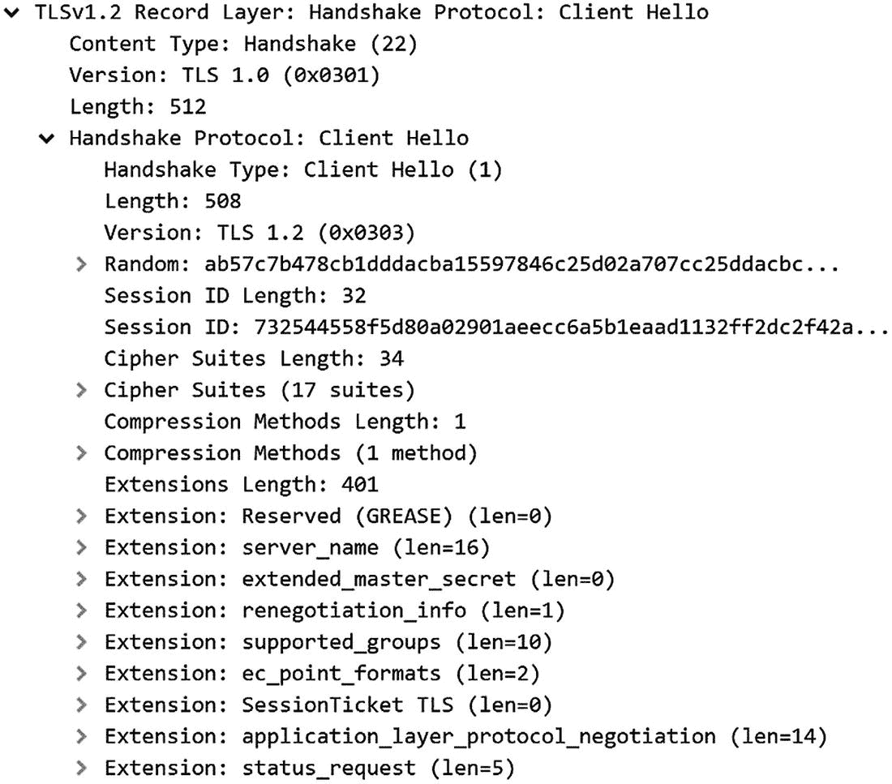
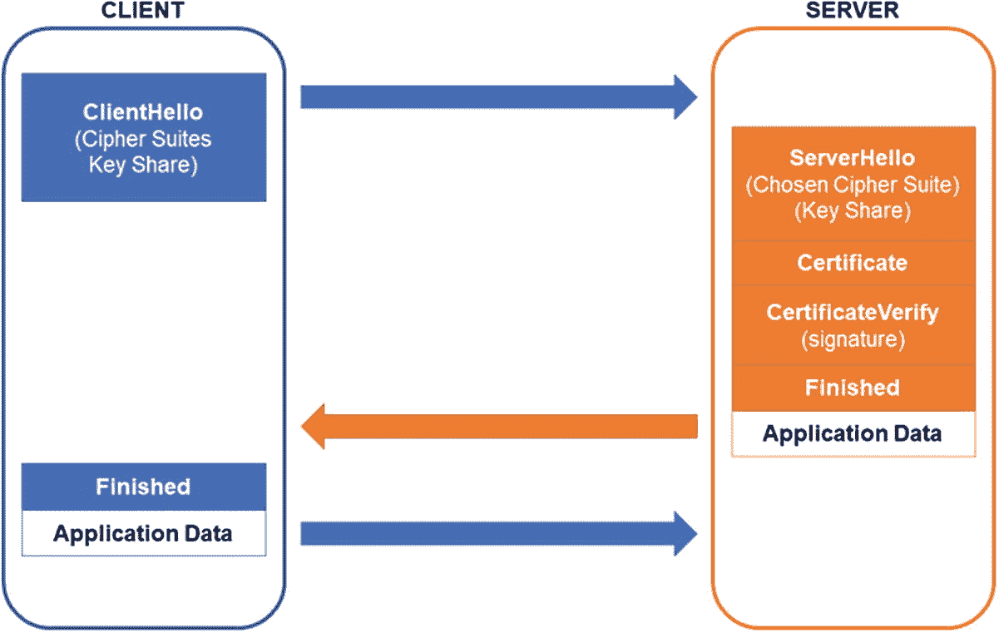

# 8.TLS 通信

在本章中，我们将讨论安全互联网通信的基石之一:TLS。这个主题，就像密码学中的许多东西一样，是一个大主题，充满了复杂的参数、微妙的陷阱和惊人的逻辑。让我们了解更多！

## 拦截流量

伊芙为自己感到非常自豪。她设法进入东南极洲的计算机房，安装了“嗅探”软件。基本上，她已经设法拦截 HTTP (web)流量，并将其渗透出来，供其机构(“西南极洲中央骑士办公室”，或 WACKO)的情报人员进行分析。

HTTP 协议本身支持代理。HTTP 客户端可以通过中间 HTTP 服务器(代理)连接到服务器。当客户机第一次连接到代理时，它发送一个名为`CONNECT`的特殊 HTTP 命令，告诉代理真正的目的地在哪里。一旦代理连接到真正的服务器，它就充当一个简单的通道，将数据从一方转发到另一方。

伊芙设法在她敌人的电脑上安装了一个 HTTP 代理。它与清单 [8-1](#PC1) 中的代码非常相似。

```py
 1   import asyncio
 2
 3   class ProxySocket(asyncio.Protocol):
 4       CONNECTED_RESPONSE = (
 5           b"HTTP/1.0 200 Connection established\n"
 6           b"Proxy-agent: East Antarctica Spying Agency\n\n")
 7
 8       def __init__ (self, proxy):
 9           self.proxy = proxy
10
11       def connection_made(self, transport):
12           self.transport = transport
13           self.proxy.proxy_socket = self
14           self.proxy.transport.write(self.CONNECTED_RESPONSE)
15
16       def data_received(self, data):
17           print("PROXY RECV:", data)
18           self.proxy.transport.write(data)
19
20       def connection_lost(self, exc):
21           self.proxy.transport.close()
22
23
24   class HTTPProxy(asyncio.Protocol):
25       def connection_made(self, transport):
26           peername = transport.get_extra_info('peername')
27           print('Connection from {}'.format(peername))
28           self.transport = transport
29           self.proxy_socket = None
30
31       def data_received(self, data):
32           if self.proxy_socket:
33               print("PROXY SEND:", data)
34               self.proxy_socket.transport.write(data)
35               return
36
37           # No socket, we need to see CONNECT.
38           if not data.startswith(b"CONNECT"):
39               print("Unknown method")
40               self.transport.close()
41               return
42
43           print("Got CONNECT command:", data)

44           serverport = data.split(b" ")[1]
45           server, port = serverport.split(b":")
46           coro = loop.create_connection(lambda: ProxySocket(self), server, port)
47           asyncio.get_event_loop().create_task(coro)
48
49       def connection_lost(self, exc):
50           if not self.proxy_socket: return
51           self.proxy_socket.transport.close()
52           self.proxy_socket = None
53
54   loop = asyncio.get_event_loop()
55   coro = loop.create_server(HTTPProxy, '127.0.0.1', 8888)
56   server = loop.run_until_complete(coro)
57
58   # Serve requests until Ctrl+C is pressed
59   print('Proxying on {}'.format (server.sockets[0].getsockname()))
60   try:
61       loop.run_forever()
62   except KeyboardInterrupt:
63       pass
64
65   # Close the server
66   server.close()
67   loop.run_until_complete(server.wait_closed())
68   loop.close()

Listing 8-1
HTTP Proxy

```

这个 HTTP 代理打印出它从任一端点接收到的所有内容。Eve 的真实代理不会这样做。相反，它通过网络将截获的数据发送到命令和控制服务器。或者，她可以让它将数据保存到磁盘，以便以后提取。

让我们看看我们的网络流量连接到一个不受保护的 HTTP 服务器是什么样子。首先，复制 HTTP 代理的代码(只有大约 70 行)并启动它。 <sup>[1](#Fn1)</sup> 应该是在本地主机:8888 上服务。这在 Python shell 中显示如下。

```py
>>> import http.client
>>> conn = http.client.HTTPConnection("127.0.0.1", 8888)
>>> conn.set_tunnel("www.example.com")
>>> conn.request("GET", "/")
>>> r1 = conn.getresponse()
>>> r1.read()

#SHELL# output_ommitted

```

Python 的`http.client`模块有一些与 HTTP 服务器交互的内置方法。它还具有 HTTP 代理功能。在示例代码中，`HTTPConnection`对象配置了代理的 IP 地址和端口。`set_tunnel`方法重新配置对象，假设它正在连接到代理，但是将通过`CONNECT`方法请求“www.example.com”。

在得到响应后，`read`方法得到输出。结果您应该会看到类似于 HTML 文档的东西。这表示当西澳大利亚用户导航到 www.example.com 时，他们的浏览器接收到的数据。

### 注意:查找 HTTP 站点

为了使本练习能够进行，您需要浏览到一个仍然支持 HTTP 的网站。越来越多的网站完全禁用 HTTP，你只能通过 HTTPS 连接到它们。在撰写本文时，www.example.com 仍然支持这两者。

与此同时，伊芙在看着。在运行 HTTP 代理的终端中，您应该看到如下内容:

```py
Got CONNECT command: b'CONNECT www.example.com:80 HTTP/1.0\r\n\r\n'
PROXY SEND: b'GET/HTTP/1.1\r\nHost: www.example.com\r\nAccept-Encoding: identity\r\n\r\n'
PROXY RECV: b'HTTP/1.1 200 OK\r\nCache-Control: max-age=604800\r\nContent-Type: text/html...

```

您会注意到，他们看到了客户端(例如浏览器)和 web 服务器之间的整个通信流。伊芙偶然发现了一个奇妙的情报来源。

### 警告:多个代理方法

我们的代理使用的是`CONNECT`方法。配置 web 代理有多种方法，我们的基本源代码只支持这一种方法。因此，它不能与试图使用其他方法的浏览器或工具一起工作。

一天，Eve 正在愉快地收集她的敌人的流量，突然一切都停止了工作。明确地说，代理仍然在代理数据。事实上，`CONNECT`方法仍然存在，但是几乎所有流经代理的数据都是不可读的！

仔细查看日志，伊芙注意到一个有趣的变化。

```py
Got CONNECT command: b'CONNECT www.example.com:443 HTTP/1.0\r\n\r\n'

```

你看出区别了吗？几乎一切都是一样的，除了一件事:港口。Eve 过去常常看到浏览器通过 80 端口连接到 www.example.com。现在它在 443 端口上。这是怎么回事？

原来 EA 的对手已经转而使用 HTTPS(“HTTP Secure”)。默认情况下，HTTP 使用端口 80，而 HTTPS 使用端口 443。要明确的是，不是端口使事情变得安全，而是新的协议。端口差异仅仅是 Eve 的第一个线索，表明某些东西被有意地改变了。

为了验证这一点，请再次尝试相同的练习，但有一点小小的不同，如下所示。

```py
>>> import http.client
>>> conn = http.client.HTTPSConnection("127.0.0.1", 8888)
>>> conn.set_tunnel("www.example.com")
>>> conn.request("GET", "/")
>>> r1 = conn.getresponse()
>>> r1.read()

#SHELL# output_ommitted

```

这段代码实际上只有一个字符不同。你看到了吗？我们把`HTTPConnection`改成了 HTTPSConnection。

看看你的 HTTP 代理嗅探器。会有*很多*的输出。它的一部分可能看起来像这样:

```py
Got CONNECT command: b'CONNECT www.example.com:443 HTTP/1.0\r\n\r\n'
PROXY SEND: b"\x16\x03\x01\x02\x00\x01\x00\x01\xfc\x03\x03\x81<\x06f...
...
PROXY RECV: b'\x16\x03\x03\x00E\x02\x00\x00A\x03\x03\xb1\xf0T\xd0\xc...

```

夏娃，不安，她不能再读取网络流量，她拦截，头回华盛顿做一些研究 HTTPS。她了解到 HTTPS 将 HTTP 流量封装在另一种称为 TLS 的协议中。该协议允许客户端验证服务器的身份，并允许双方在彼此之间建立密钥。即使窃听者(如 Eve)正在监听整个通信流，该密钥也是保密的。理论上，TLS 将完全阻止 Eve 窥探 Alice、Bob 和 EA！

这个发现让夏娃很沮丧。但是，作为一个坚定的人，她决定开始寻找弱点。如果说她在这本书中学到了什么的话，那就是密码学经常被错误地使用，因此会被利用。

### 练习 8.1。网络流量里有什么？

假装成 Eve，检查一些你自己的加密流量。也就是说，配置你的浏览器使用你的代理，浏览一些 HTTP 网站，窥探你自己的数据。提示:安全通信的某些部分仍然是明文吗？

如果您不知道如何配置您的浏览器代理，请在您选择的搜索引擎上做一些搜索！请注意，您可能无法将您的浏览器配置为对未加密(HTTP)流量正确使用您的代理。我们亲自测试了 Chrome，发现它对 HTTPS 使用了`CONNECT`方法，但对 HTTP 不使用。

## 数字身份:X.509 证书

为了开始寻找弱点，Eve 首先转向 TLS 协议的认证部分。

她了解到 TLS 使用公钥基础设施(PKI)来建立身份和安全通信。希望拥有用于 TLS 的身份的各方(通常)需要 X.509 证书。

在第 5 章中，我们介绍了证书的概念。当时，为了简单起见，我们使用了假证书，这些证书只不过是我们用 Python `json`库序列化的字典。现在是时候研究真正的 X.509 证书了，这是当今互联网上最常用的一种证书。

### X.509 字段

有点类似于我们基于字典的证书，X.509 是一个键/值对的集合。虽然 X.509 的字段允许分层子字段，但是这些对也可以用字典来表示。

具体来说，X.509 的版本 3 具有以下分层键:

1.  证书
    1.  版本号

    2.  序列号

    3.  签名算法 ID

    4.  发行人名称

    5.  有效期
        1.  之前不会

        2.  不是之后

    6.  主题名称

    7.  主题公钥信息
        1.  公钥算法

        2.  主题公钥

    8.  发行者唯一标识符(可选)

    9.  主题唯一标识符(可选)

    10.  扩展(可选)

2.  证书签名算法

3.  证书签名

X.509 的版本 1 和 2 是子集。版本 3 最重要的附加功能是扩展。这些扩展用于使启用证书的 PKI 更加安全，例如，通过限制证书的用途。尽管如此，版本 1 证书仍然存在并且是可用的，当我们开始生成一些示例时，我们将会看到这一点。

证书的主要目的是将主体的身份与颁发者签名下的公钥联系起来。标识主题、公钥和颁发者的字段是最关键的，但是其他字段提供了理解和解释数据所必需的上下文信息。

例如，有效期用于确定证书何时应被视为有效。虽然“不得早于”字段很重要并且必须检查，但实际上“不得晚于”时间段通常最受关注。具有较高泄密风险的证书可以用较短的有效期来发行，以减轻如果发生泄密所造成的损害。

X.509 证书的另一个重要内容是在标识所使用的证书创建算法和嵌入其中的公钥类型的字段中。与本书中的大多数玩具例子不同，真正的加密系统使用了广泛的算法，证书必须足够灵活以支持它们。

浏览前面的 X.509 字段，有一个“证书:签名算法 ID”字段，它标识证书是如何签名的。 <sup>[2](#Fn2)</sup> 因为它规定了嵌入证书中的实际签名的所有细节，所以它既包括签名算法(例如 RSA)又包括消息摘要(例如 SHA-256)。

另一方面,“证书:主体公钥信息:公钥算法”字段指定证书所有者正在使用什么类型的公钥。

我们将提到的最后一个上下文字段是序列号。这是唯一标识证书的唯一编号(每个颁发者)。该编号对于本章后面讨论的撤销目的很有用。

现在让我们回到我们拥有证书的真正原因:识别主体、主体的公钥以及“证明”这一点的可信第三方。

显然，字段“发布者名称”和“主题名称”描述了发布者和主题所声明的身份。在前几章的假证书中，这些只是简单的字符串。在真实的证书中，这些不仅仅是原始的文本字段，还具有结构和子组件。称为“识别名”，这两个身份字段通常具有以下子字段 <sup>[3](#Fn3)</sup> :

1.  CN: CommonName

2.  OU:组织单位

3.  o:组织

4.  l:地点

5.  s:state corporations name

6.  c:国家名称

因此，例如，“主题名称”或“发行者名称”可能如下所示:

```py
CN= Charlie, OU= Espionage, O=EA, L= Room 110, S=HQ, C=EA

```

并非所有这些子字段都必须填写，但 CN(通用名称)通常是关键的子字段。后来，当我们试图验证一个证书时，主体的通用名称被用作主要标识符。此外，大多数现代证书包括一个名为“Subject Alternative Name”的字段(这是版本 3，用于存储替代主题名称。虽然在我们的许多示例中，我们一直使用代理(代码)名称(例如，“Charlie”)作为主题名称，但与受 TLS 保护的 web 服务器相关联的证书必须将主机名(例如`google.com`)标识为主题的身份。

您可能还注意到，证书包括“颁发者唯一标识符”和“主题唯一标识符”字段，但是这些字段通常可以省略，这里不讨论。

确定了主题和颁发者后，剩下的字段是公钥和根据证书内容计算的签名。签名是通过称为“DER”(“区分编码规则”)的证书二进制编码计算的。签名既证明了证书是由真正的颁发者签署的，也证明了它没有被修改。

### 证书签名请求

为了在现实生活中创建证书，一方创建一个证书签名请求(CSR ),并将其传输到证书颁发机构(CA)。CSR 具有几乎所有与 X.509 证书相同的字段，但是缺少发行者(因为发行是我们试图通过请求获得的)。一旦 CA 拥有了 CSR，它就使用自己的证书和相关的私钥来生成最终的证书，并根据需要填写字段。最重要的字段之一是“发行者”字段。一个证书的颁发者应该与签名者证书的“主题”字段相同。一旦填充了所有字段，CA 就用自己的私钥签署证书。

### 注意:私钥仍然是私有的

请求证书的一方没有向 CA 发送其私钥。它只发送了一个带有其*公共*密钥的 CSR！任何人，即使是 CA，都不应该拥有私钥！

我们前面提到过，在签名之前，证书以一种称为 DER 的格式进行编码。正如我们所说，DER 格式是一种二进制格式。大多数证书(以及 CSR 和私钥)的磁盘表示实际上是一种称为 PEM(“隐私增强邮件”)的文本(ASCII)格式。因为所有的二进制数据都被编码为 ASCII，所以通过基于文本的传输系统(例如，电子邮件)发送这些证书是很容易的。

有了这些关于证书的知识，Eve 决定创建一个证书。因为 Eve 没有证书颁发机构(CA)来签署她的证书，所以她将尝试两种替代方法:自签名和由她自己创建的“假”CA 签署。 <sup>[4](#Fn4)</sup>

生成 X.509 证书的一种常见方法是从命令行使用`openssl`。由于您在本书的练习中使用了`cryptography`模块(它使用 OpenSSL 库),所以您应该安装了 OpenSSL。伊芙知道，所以她要用它。

首先，Eve 需要创建一个私钥和一个相关的 CSR(“证书签名请求”)。她首先用 2048 位模数的 RSA 公钥和阿沙-256 消息摘要创建一个 CSR。下面的许多命令可以组合在一起形成一个更简单的命令行，但是我们将它们分开，以强调 Eve 采取的不同步骤:

1.  生成一个 RSA 密钥。

2.  从密钥创建一个 CSR。

3.  发送给证书颁发机构进行签名(或自己签名)。

#### 生成密钥

首先，她生成一个 RSA 密钥。我们以前在 Python 中做过这种工作，但是为了获得一些使用 OpenSSL 的实践，让我们看看命令行方法:

```py
openssl genpkey -algorithm RSA -out domain_key.pem -pkeyopt rsa_keygen_bits:2048

```

在互联网上散布的各种生成 RSA 密钥的说明中，有许多使用不同的 OpenSSL 命令`genrsa`的指南和演练。请注意，更通用的`genpkey`已经取代了`genrsa`。Eve 的示例命令要求使用 RSA 算法生成一个 2048 位的私钥。输出将保存在`domain_key.pem`(PEM 格式)。

Eve 在文本编辑器中检查了密钥文件，看到如下内容:

```py
    -BEGIN PRIVATE KEY    -
MIIEvQIBADANBgkqhkiG9w0BAQEFAASCBKcwggSjAgEAAoIBAQCpQ0VUe4P0r8+l
6rX4qQGyNHD613X16sqeIW2x+PtkeE9pjAm6sNhFKAspHKa7nWgFoW/O9iiT8oiy
1ah7KbtJsAXceUEbj9Yt6fHPytGe+qIidI1/Rg7ah4k7cn6pbPrqaxGc8n8368pM
NzJZMnLZL0ePVn/y2mTsGX5wR+Cm+imEFBWxL7jgnhYAyLRdOYsdGaZi5DJQaHl7
HqXaL7+6G6RAjhW+Hn34ImBufOvY9eV3dCRvOFCSWr4e5uHv5ofUyRWB2Emwm8u6
SM3zzI30OFb6zHWoBsccU8xJadhWgPXLq27rcSl3A5NK6y1p7KKHimqcp6WDUgMK
3NzCIXK9AgMBAAECggEAB2zfDry4ZjSMPHAWeYkYfPPV/PsUvqwFJXi78jHE/XxV
p4CwMJNveWEvVCdgnRxjotOZLxAXaZ4bJxU+ZeDHyYzCRRDArW/a6nq30/DGz12Z
XT+VsX6mSinl+Eimi9IvE7eMt0DgGdjrL/q/56/R3/s1/XDC/ilcggsAQ/azQT/n
3cOxWoo0HYQQdbMkoi7YDRKOC7F2sfV3X02WMDq4PuWG6mFtLg4j8tpAaJRCOlEz
bNnJnbBS6Dj3RnU53nj5TKBObCIZWkgpYcGK9e2iIg5+kMgkmwY5uxv3hTB5QHZY
tKDOPM9wgvDIR6NrccOGQOJ0cvJmMHDNS8apT2rewQKBgQDhjsS3M3qWT6lzhFx3
+w6NJv7i/uOA2eNd+Kor0q5XYOTicT8XCShSO2gFT6Fg4HRrSvwcjaTpjacUIyjZ
IhfrIIcSEe8Bk1VoBbrcS2NEZ3hMpPrPQ/hZtzUchhA1ftMJOfnysYGtqjA4drpq
HS8rPGmcP8NN1zYnv29ptfkmzQKBgQDAG3W8gA/mqjpboOB/OeC1fMX7u6pJVWGj
f+Bahjj5FAwfOYHJ80N10m/NpUD7BnKKds0dYyOwV287+hhLnQZ2c3glxM/zONUn
9uYIgAWNm0wjsCKOVY6r9nc6kWW07I0kIm628K50BPxiXC/GqsXVpKSPjSrDhKnQ
vG1xFN4bsQKBgA1kP5Os78NK2YGtQxwwgK2quglaHsHArfofUGMnsAgqDYzQMnG4
rncrZcKi9q7cxKy2F//N/ROMwHW2nK8/kfH4zWwqOml6iOCTLoPzyeH+zqqmROnX
XEBfWzzlTMMQU5FBqvBYz50y9If1rJ2uO+WyQYbwVjUh6Oo1OHUrQ66lAoGAXKti
aiHkicLID/dVFEpZKXMdFkf65xE23mYLVd+1kAGpr05QW5jri+SNZkg3RmBf1Idm
fqyaRLCIygfkvGTs/yrIZH/CSHO772FcqfEHvL2TRwvqP3rqLe3gqfIFe/c4RpwN
iFYl8XWOQexyZ4VtlZesgkr4vAQ83qJmsMv+MKECgYEAjRVzqXEAV8DB5nzN+1cf
20vCrZxd1Ktgb/DUqRfZwpAWU5K9YFCHbLWTS96KiMFh45kuAUg/hSKJIktuY1eI
Pl+r3g9FwlnntIHaUiRstDGXuyZku//+gWZMAZU4t5DwvhIXXAG3AqSe0EsB/bi4
kdlstdXcN/HgthWvTQkVycY=
    -END PRIVATE KEY    -

```

#### 从密钥创建 CSR

现在 Eve 有了她的密钥，她为这个密钥创建了一个 CSR。CSR 生成过程将从 Eve 创建的私钥中提取公钥，并将其放入请求中。Eve 使用带有以下参数的`openssl req`命令进行该操作:

```py
openssl req -new -key domain_key.pem -out domain_request.csr

```

这指示 OpenSSL 从私钥构建一个 CSR，并将结果放入`domain_request.csr`。运行这个命令会产生一些交互式问题，用于填写主题名称的元素。只有“通用名称”是 TLS 工作所绝对需要的，但是许多证书颁发机构将要求在他们愿意签署它之前填写这些字段。

```py
You are about to be asked to enter information that will be incorporated
into your certificate request.
What you are about to enter is what is called a Distinguished Name or a DN.
There are quite a few fields but you can leave some blank
For some fields there will be a default value,
If you enter '.', the field will be left blank.
    -
Country Name (2 letter code) [AU]: WA
State or Province Name (full name) [Some-State]:West Antarctic Shelf
Locality Name (eg, city) []:West Antarctic City
Organization Name (eg, company) [Internet Widgits Pty Ltd]:WACKO
Organizational Unit Name (eg, section) []:Espionage
Common Name (e.g. server FQDN or YOUR name) []:wacko.westantarctica.southpole.gov
Email Address []:eve@wacko.westantarctica.southpole.gov

```

一旦 Eve 输入了所有这些字段，OpenSSL 就会生成 CSR 文件并将其保存到磁盘上(也是 PEM 格式)。Eve 使用相同的实用程序(`openssl req`)从磁盘加载 CSR，并以人类可读的格式查看字段。

执行命令

```py
openssl req -in domain_request.csr -text

```

产生以下输出:

```py
Certificate Request:

    Data:
         Version: 1 (0 x0)
         Subject: C = WA, ST = West Antarctic Shelf, L = West Antarctic City,
              \
         O = WACKO, OU = Espionage, CN = wacko.westantarctica.southpole.gov,
             \
         emailAddress = eve@wacko.westantarctica.southpole.gov
         Subject Public Key Info:
             Public Key Algorithm: rsaEncryption
                 Public-Key: (2048 bit)
...
    Signature Algorithm: sha256WithRSAEncryption
         6d:ef:8c:91:cd:a0:5d:9f:56:42:44:7f:1a:06:94:3f:8e:e1:
...

```

您会注意到 Eve 的 CSR 版本是版本 1，而不是版本 3。除非正在使用版本 3 扩展，否则 OpenSSL 总是分配版本 1。但是记住，这只是*请求*，而不是实际的*证书*。当 ca 生成实际证书时，出于安全原因，它们可能会插入 V3 扩展，从而生成使用 X.509 版本 3 的证书。

此外，有些证书字段不存在，如“序列号”CA 签署 CSR 时也会添加这些内容。

从 Eve 的肩膀上看过去，你可能会惊讶地发现 CSR 已经有了一个签名(数据在`Signature Algorithm`后面的一行)。那是从哪里来的？签名不是在颁发者签署证书时创建的吗？

CSR 通常由它们自己的密钥签名*,作为一种指示私钥实际上由请求者持有的方式。任何人都可以将任何人的公钥扔进 CSR。通过自签名，这向 CA 证明请求者控制着私钥，有时称为“拥有证明”CA 生成证书的真正签名是一个单独的过程，也是下一步。*

#### 签署 CSR 以生成证书

回顾一下，让我们记住，证书总是必须由 CA/发行者*签名*。例如，如果 Eve 创建了一个网站，并想要一个 TLS 证书，她将生成 CSR 并将其发送给 CA 进行签名，正如我们所讨论的那样。这个签名是他们认可 Eve 的证书是有效的，并且她被允许要求所要求的身份。CA 负责一定级别的验证。例如，如果 Eve 在东南极政府内部请求一个身份，ca 应该确定，作为他们验证过程的一部分，她不能声明那个身份。然后他们会拒绝她的请求。另一方面，她可以在她出生的西南极洲要求一个身份，并且可能需要向政府提供物理文档，并且亲自与 ca 的代表会面来证明这一点。

除了将 CSR 发送给 CA，Eve 还有另一种选择。她可以*使用同一个私钥自己*签署证书。这被称为生成一个*自签名*证书。所有根证书(例如由 CA 持有的根证书)都是自签名的。毕竟，链条总要在某个地方停下来。

我们太超前了。什么是证书链？

我们在第 [5](5.html) 章简要提到了这个概念。如果您还记得，当我们使用简化的(不是非常真实的)证书时，我们讨论过拥有一个可以任意长的颁发者链的颁发者。也就是说，一方的证书(比如 Eve 的证书)可以由一个发行者签名，然后由一个“更高”的发行者签名，再由一个更高的发行者签名，直到某个根证书成为整个链的最高级别的发行者。根证书由*自己签名*！事实上，根证书的主题和颁发者部分是相同的。

这就是为什么验证证书需要非常小心的原因之一。你必须确保你的证书链以一个可信的根结束。系统的整个安全性取决于这一要求。任何人，包括西南极洲的 Eve，你，或者美国的黑手党黑帮老大，都可以为任何身份(西南极洲政府，Google，Amazon，你的银行等)创建自签名证书。).您的浏览器不信任 Eve 的自签名证书的唯一原因是，它不是由它(浏览器)已经信任的发行者签名的。

浏览器如何知道哪些根证书值得信任？大多数浏览器都内置了某些受信任的根证书。在我们假设的南极例子中，东南极和西南极可以生产只安装了政府授权的 CAs 的浏览器。这实际上会阻止这两个国家相互通信(至少通过 HTTPS 或 TLS)。

但让我们回到伊芙身上。她无法获得由 EA 根签名的证书。相反，自签名证书可能是有用的，并且生成一个自签名证书是有益的。也是 Eve 目前最好的选择，就让她往前走吧。Eve 使用`openssl x509`命令签署她的 CSR:

```py
openssl x509 -req \
  -days 30 \
  -in domain_request.csr \
  -signkey domain_key.pem \
  -out domain_cert.crt

```

此命令创建一个有效期为 30 天的证书。它由`domain_key.pem`签名，这是与 CSR 关联的同一个密钥。自签名证书保存在文件`domain_cert.crt`中。

使用类似于我们用于`openssl req`的语法，Eve 将字段转储为人类可读的格式以供查看。命令

```py
openssl x509 -in domain_cert.crt -text

```

产生类似如下的输出:

```py
Certificate:
    Data:
        Version: 1 (0x0)
        Serial Number:
            a5:f5:15:a8:55:58:12:5e
    Signature Algorithm: sha256WithRSAEncryption
        Issuer: C = WA, ST = West Antarctic Shelf, L = West Antarctic City,
            \
        O = WACKO, OU = Espionage, CN = wacko.westantarctica.southpole.gov,
            \
        emailAddress = eve@wacko.westantarctica.southpole.gov
        Validity
            Not Before: Jan 6 01:13:18 2019 GMT
            Not After : Feb 5 01:13:18 2019 GMT
        Subject: C = WA, ST = West Antarctic Shelf, L = West Antarctic City,
             \
        O = WACKO, OU = Espionage, CN = wacko.westantarctica.southpole.gov,
            \
        emailAddress = eve@wacko.westantarctica.southpole.gov
        Subject Public Key Info:
            Public Key Algorithm: rsaEncryption
                Public-Key: (2048 bit)
                Modulus:
                    00:a9:43:45:54:7b:83:f4:af:cf:a5:ea:b5:f8:a9:
...
    Signature Algorithm: sha256WithRSAEncryption
         20:da:25:88:db:4e:ee:21:19:78:58:ed:b8:7b:3f:28:dd:83:
...

```

现在所有的字段都已填写完毕。例如，Eve 没有指定序列号，所以会自动生成一个序列号。还填写了 issuer 字段，与自签名证书一样，它与主题具有相同的身份。

Eve 决定创建第二个证书并用*这个*证书签名。她着手创建新的证书，并决定给它分配身份`127.0.0.1` (localhost)。Eve 决定尝试创建除 RSA 密钥之外的密钥，她着手创建一个 EC(椭圆曲线)密钥对。

```py
openssl genpkey \
  -algorithm EC \
  -out localhost_key.pem \
  -pkeyopt ec_paramgen_curve:P-256

```

这种 EC 密钥基于 P-256 曲线，这是一种非常流行和广泛使用的曲线，也是一种合理的选择。 <sup>[5](#Fn5)</sup>

Eve 使用与前面相同的命令行从 EC 密钥生成一个新的 CSR:

```py
openssl req -new -key localhost_key.pem -out localhost_request.csr

```

现在 Eve 有一个*请求来创建一个证书*，而不是一个签名证书。反正还没有。为了创建证书，Eve 需要用`domain_key.pem`签名，因为她将该密钥和证书视为 CA 密钥/证书。

她还准备增加一些 X.509 V3 选项。这些选项用于限制证书的使用方式。例如，Eve 想要使用她的第一个证书和私钥(`domain_cert.crt`和`domain_key.pem`)来签署她的第二个证书。她希望她的第一个证书能够用作 CA。但是，她不希望她的第二个证书(用于本地主机)能够签署其他证书。使用 V3 扩展，Eve 可以将这些限制直接编码到证书本身中。

为了理解为什么这很重要，想象一下如果 Eve 被一个真正的 CA 授予了`wacko.westantarctica.southpole.gov`的证书。如果这个证书*没有*的使用限制，没有什么可以阻止 Eve 用它来签署一个*新的*证书，授予她`eatsa.eastantarctica.southpole.gov`的身份。这将为 Eve 提供一个返回到 CA 的授权链，以获得她不应该拥有的身份。因此，为了使证书链有意义，Eve 的证书必须拒绝她创建其他证书的权利。

在 Eve 的实验中，她最关心的两个领域是

*   密钥用法

*   基本限制

Eve 将使用这些字段来表示这个新证书不应被用作 CA。事实上，它会在“基本约束”字段中明确说明。“密钥使用”字段将包括正常的密钥使用，如“数字签名”，但它将省略诸如用作签署“证书撤销列表”(CRL)之类的内容。

为了将这些 V3 特性添加到她的证书中，Eve 创建了一个名为`v3.ext.`的扩展文件，它包含以下两行:

```py
keyUsage=digitalSignature
basicConstraints=CA:FALSE

```

现在 Eve 准备签署 CSR。

```py
openssl x509 -req \
  -days 365 \
  -in localhost_request.csr \
  -CAkey domain_key.pem \
  -CA domain_cert.crt \
  -out localhost_cert.crt \
  -set_serial 123456789 \
  -extfile v3.ext

```

用 CA 密钥和证书签名时，删除`signkey`参数，添加`CA`选项和`CAkey`参数。`CA`选项指定 CA/issuer 的证书，`CAkey`指定用于签名的相关私钥。Eve 插入她第一次实验的私钥和自签名证书。

虽然在创建自签名证书时不需要，但 Eve 现在必须在使用 CA 密钥和证书签名时明确指定序列号。一个真正的 CA 不得重复使用序列号，并且必须保留一份序列号记录，以防证书需要被撤销。

Eve 使用她的命令行检查了这个新证书，并发现了一些不同之处:

```py
Certificate:
    Data:
        Version: 3 (0x2)
        Serial Number: 123456789 (0x75bcd15)
    Signature Algorithm: sha256WithRSAEncryption
        Issuer: C = WA, ST = West Antarctic Shelf, L = West Antarctic City,
            \
        O = WACKO, OU = Espionage, CN = wacko.westantarctica.southpole.gov,
            \
        emailAddress = eve@wacko.westantarctica.southpole.gov
        Validity
            Not Before: Jan 6 05:41:35 2019 GMT
            Not After : Jan 6 05:41:35 2020 GMT
        Subject: C = WA, ST = WhoCares, L = MyCity, O = Localhost,
            OU = Office, CN = 127.0.0.1
        Subject Public Key Info:
            Public Key Algorithm: id-ecPublicKey
                Public-Key: (256 bit)
                pub:
                    04:46:64:ca:95:0c:fc:dd:85:fb:cc:54:5a:9b:e9:
...
                NIST CURVE: P-256
        X509v3 extensions:
            X509v3 Key Usage:
                Digital Signature
            X509v3 Basic Constraints:
                CA:FALSE
    Signature Algorithm: sha256WithRSAEncryption
         07:78:b5:1d:4a:2f:e4:33:a6:f6:a8:fb:e2:51:16:eb:c5:3b:
...

```

正如你所料，这次发行人和主题是不同的。事实上，该证书的 issuer 字段与签名证书的 subject 字段相匹配。这是正确的证书链验证所必需的。

还有，公钥算法现在是椭圆曲线而不是 RSA，但是`Signature Algorithm`还是`sha256WithRSAEncryption`。那是因为这个证书是由之前创建的`domain_cert.crt` Eve 签名的，那还是 RSA。

如您所见，X.509 V3 扩展存在，证书的版本现在也列为“3”。

夏娃故意制造了主体身份`127.0.0.1`。她决定测试一下她新制作的证书，看看 web 浏览器如何处理它们。使用`openssl s_server`，Eve 快速设置了一个对她生成的证书的测试。

```py
openssl s_server -accept 8888 -www \
    -cert localhost_cert.pem -key localhost_key.pem \
    -cert_chain domain_cert.crt -build_chain

```

这个命令启动服务器监听端口 8888(对于您自己的测试，确保您的 HTTP 代理关闭，否则选择一个不同的端口)。它使用本地主机证书作为其身份证书，但使用域证书文件作为证书列表，用于构建链。`build_chain`选项指示服务器尝试构建一个完整的证书链以传输给客户端。换句话说，它将整个链发送给客户端，而不仅仅是身份证书。

一旦 Eve 启动了服务器，她将浏览器指向`https://127.0.0.1:8888`。她看到了类似图 [8-1](#Fig1) 的东西。


图 8-1

Chrome 关于不可信证书的警告

这是一个来自 Chrome 浏览器的图片，报告它不喜欢 Eve 创建的证书。注意 Eve 收到的是`ERR_CERT_AUTHORITY_INVALID`错误。使用 Chrome 的开发工具，Eve 获得了更多关于浏览器如何看待这个证书及其链的信息，如图 [8-2](#Fig2) 所示。


图 8-2

Chrome 对不可信情况的警告

图 [8-2(b)](#Fig2) 是一个关于证书链细节的图像，具体来说。请注意，它收到了该链(证书及其颁发证书)。它将 Eve 创建的域证书(在该图中由通用名称`wacko.westantarctica.southpole.gov`标识)识别为“根”证书，因为它是自签名的。但是，它说这个根证书不是可信证书。如果根证书不可信，那么整个链的安全性就无法建立。

有多种方法可以将根证书添加到浏览器的可信证书库中。Eve 非常仔细地研究了这个概念，因为她可能能够使用这种方法来击败 TLS。然而，我们*不会*在这本书里包括细节，因为这实际上是一个非常糟糕和危险的想法。这可能是迄今为止我们讨论过的*最危险的事情。* <sup>[6](#Fn6)</sup> 如果你在浏览器中安装一个新的根证书，你的浏览器将信任*该根证书*签署的任何证书。如果您考虑不周的可信根不知何故逃到了野外，攻击者基本上可以让您的浏览器相信任何网站都是可信的。

说到这里，浏览器如何信任任何证书颁发机构呢？令人不安的武断的答案是，少数“权威”已经把自己确立为可靠的根权威。这些组织和公司将它们的根公钥默认安装在流行的计算机系统和浏览器中。所有其他的信任必须来自这些武断的权威。这让你感到安全吗？

然而，总的来说，为了让 TLS 正常工作，它必须有正确配置的(和正确限制的)信任锚。有时，工程团队可能需要使用自签名证书进行测试和其他临时用途。但是，一般来说，浏览器不会信任它们，您编写的任何支持 TLS 的代码也不应该信任它们。

### 练习 8.2。证书实践

使用不同的算法和参数(如密钥大小)生成一些不同的 TLS 证书。

### 练习 8.3。梦幻证书

为一些你喜欢的组织创建一些“幻想”证书。自签一两个写着`amazon.com`或`google.com`的证书。你不能使用这些，因为没有人的浏览器会接受它们。 <sup>[7](#Fn7)</sup> 但这是一种有趣的游戏。

也许你可以打印一份 Openssl 的文本表示，并把它框起来。毕竟你有几个朋友有亚马逊 TLS 证书？

### 用 Python 创建密钥、CSR 和证书

完成 OpenSSL 证书测试后，Eve 探索使用 Python `cryptography`库以编程方式创建这些相同的对象。使用这个库，Eve 可以生成自签名证书、证书请求、签名证书和密钥。Alice、Bob、Eve 和您已经在前面的章节中生成了密钥，所以让我们直接跳到证书请求。

`cryptography`库有一个用于构建 CSR 的“builder”类和一个单独的表示 CSR 的类。当使用`builder`构建 CSR 时，唯一需要的信息是主题名称数据和私有密钥。所有其他字段都可以派生或自动填充。可以选择添加扩展。以下代码摘自`cryptography`模块的文档:

```py
>>> from cryptography import x509
>>> from cryptography.hazmat.backends import default_backend
>>> from cryptography.hazmat.primitives import hashes
>>> from cryptography.hazmat.primitives.asymmetric import rsa
>>> from cryptography.x509.oid import NameOID
>>> private_key = rsa.generate_private_key(
...     public_exponent=65537,
...     key_size=2048,
...     backend=default_backend())
>>> builder = x509.CertificateSigningRequestBuilder()
>>> builder = builder.subject_name(x509.Name([
...     x509.NameAttribute(NameOID.COMMON_NAME, 'cryptography.io')]))
>>> builder = builder.add_extension (
...     x509.BasicConstraints(ca=False, path_length=None),
...     critical=True)
>>> request = builder.sign(
...     private_key,
...     hashes.SHA256(),
...     default_backend())

```

`CertificateSigningRequestBuilder`遵循面向对象的“构建器模式”,其中每个构建方法返回构建器对象的一个新副本。当 Eve 决定用部分重叠的参数构造多个 CSR 时，这很方便。可以用重叠参数配置一个构建器，然后在参数不同时创建单独的构建器。

作为对 X.509 扩展的补充说明，您会注意到在我们的示例集`ca=False`中创建的 CSR。与我们之前的 OpenSSL 示例一样，我们明确地将该证书标记为不能签署其他证书(例如，充当 CA)。在这个例子中，它还设置了`path_length=None`，但是这是一个多余的数据，因为`path_length`仅在`ca=True`时适用。`critical`标志表示这是必须由处理软件处理的强制扩展。

准备就绪后，Eve 使用`sign`方法使用私钥构建实际的 CSR 请求对象。回想一下，CSR 是自签名的，以确保请求者拥有与嵌入的公钥相对应的私钥。`sign`方法从私钥中提取公钥，将其插入 CSR，然后用私钥签名。用这种方法构建的对象是`CertificateSigningRequest`的一个实例。

为了将 CSR 保存到磁盘，Eve 在返回数据的 PEM 序列化的`CertificateSigningRequest`对象中使用了`public_bytes`方法。

```py
>>> from cryptography.hazmat.primitives.serialization import Encoding
>>> csr.public_bytes(Encoding.PEM)
b'    -BEGIN CERTIFICATE REQUEST    -\
    nMIICcDCCAVgCAQAwGjEYMBYGA1UEAwwPY3J5cHRvZ3JhcGh5LmlvMIIBIjANBgkq\
    nhkiG9w0BAQEFAAOCAQ8AMIIBCgKCAQEAntx7bGVFlIa0/dlImzUHbN4xCQ8d8/if\
    ng8GQaASN9oyfXUmOB8r+P8p4K6U8xoPXa+lc+KgexZrqibY5x1FEAvzQPanhm0w8\
    nhS7Uo1Pqt3okP6zsdfzXcjgceud8JJhVTqZWpN1Q5e+RldYwuzIsJyxNUFMUZrpL\
    nqZNQ0S/KG5re7YIHJLy3iCx6a/KAW5BbqW9cq989sdTp0Fo462+qCqoHaQ0//hQM\nTmWI/
    IJIZ9mIcP4ggJr0sy8JLAw/RLzcrpMRut8e1/A9mozo+YZJDPt9d+WzXj5p\
    nZvTkpFUfOB8HpogCdtbhPmc5jfgbN/rwOzSO8bQTdHAwTS/5fQjtAQIDAQABoBEw\
    nDwYJKoZIhvcNAQkOMQIwADANBgkqhkiG9w0BAQsFAAOCAQEAR1E3c/aF1X41x4tI\
    n2kUeCeV38C01ZFrCJADXKKl4k6wvHU81ZoDCV6F1ytCeJAlD1ShGS6DmlfH78xay\
    nrefzaIjCp0tRs5R4rccoRNK3LhyBnxEqLY1LZx1fq2F0XiMHlG8jEcK/jjhWm70B\
    naKwBbvWwlHGgha5ZlOgvALOPSFUC9+6LvTStanSABtlBM4eA2izLG2hMek9S5xIw\
    nK53WJG42Mz3PHDMUfYWdGtsJalAnGMkQtqbvR4yKi9o5y4RcvihQtitGFeYQmZc+\
    nhmuVB0BGCe9LUB0iL9J3kUgL4avO2AviCFev48i9OYGD54G73vKrd5KODtY78own\
    nVrbzMw==\n    -END CERTIFICATE REQUEST    -\n'

```

CSR 对象不能直接构造。它们可以由 builder 类构建，也可以从磁盘加载。该类是一个只读样式的类，允许访问数据字段，但不允许更改它们。必要时，Eve 使用 builder 类来构造新的 CSR。她还使用`load_pem_x509_csr`方法从磁盘加载 CSR。以下示例代码摘自`cryptography`文档。

```py
>>> from cryptography import x509
>>> from cryptography.hazmat.backends import default_backend
>>> pem_req_data = b'''      BEGIN CERTIFICATE REQUEST      \
    nMIICcDCCAVgCAQAwGjEYMBYGA1UEAwwPY3J5cHRvZ3JhcGh5LmlvMIIBIjANBgkq\
    nhkiG9w0BAQEFAAOCAQ8AMIIBCgKCAQEAntx7bGVFlIa0/dlImzUHbN4xCQ8d8/if\
    ng8GQaASN9oyfXUmOB8r+P8p4K6U8xoPXa+lc+KgexZrqibY5x1FEAvzQPanhm0w8\
    nhS7Uo1Pqt3okP6zsdfzXcjgceud8JJhVTqZWpN1Q5e+RldYwuzIsJyxNUFMUZrpL\
    nqZNQ0S/KG5re7YIHJLy3iCx6a/KAW5BbqW9cq989sdTp0Fo462+qCqoHaQ0//hQMnnTmWI/
    IJIZ9mIcP4ggJr0sy8JLAw/RLzcrpMRut8e1/A9mozo+YZJDPt9d+WzXj5p\
    nZvTkpFUfOB8HpogCdtbhPmc5jfgbN/rwOzSO8bQTdHAwTS/5fQjtAQIDAQABoBEw\
    nDwYJKoZIhvcNAQkOMQIwADANBgkqhkiG9w0BAQsFAAOCAQEAR1E3c/aF1X41x4tI\
    n2kUeCeV38C01ZFrCJADXKKl4k6wvHU81ZoDCV6F1ytCeJAlD1ShGS6DmlfH78xay\
    nrefzaIjCp0tRs5R4rccoRNK3LhyBnxEqLY1LZx1fq2F0XiMHlG8jEcK/jjhWm70B\
    naKwBbvWwlHGgha5ZlOgvALOPSFUC9+6LvTStanSABtlBM4eA2izLG2hMek9S5xIw\
    nK53WJG42Mz3PHDMUfYWdGtsJalAnGMkQtqbvR4yKi9o5y4RcvihQtitGFeYQmZc+\
    nhmuVB0BGCe9LUB0iL9J3kUgL4avO2AviCFev48i9OYGD54G73vKrd5KODtY78own\
    nVrbzMw==\n      END CERTIFICATE REQUEST      \n'''
>>> csr = x509.load_pem_x509_csr(pem_req_data, default_backend())

```

为了制作证书，Eve 发现`cryptography`库遵循与制作 CSR 相似的模式。有一个生成器类和一个只读证书类，它们也可以序列化到磁盘和从磁盘序列化。

有趣的是，没有从 CSR 创建证书的方法。`cryptography`文档明确指出 certificate builder 类的目的是生成自签名证书。没有理由从企业社会责任开始。

即使 Eve 想要建立一个 CA(为她自己的西南极同事)，对她来说最好不要自动签署 CSR。正如我们前面讨论的，ca 需要非常仔细地验证 CSR 信息，有时需要手动验证；签署前必须确定正确性和有效性。

尽管如此，Eve 发现如果她需要从 CSR 创建证书，她可以加载 CSR，然后使用它的数据字段来填充证书生成器。

在`cryptography`文档中，清单 [8-2](#PC26) 包含了一个构建自签名证书的例子。这段代码运行后，`certificate`变量就有了我们需要的东西。

### 注意:点链接

我们利用了构建器上的每个操作都返回自身这一事实。这允许你看到“点链接”的方法。由于对“sign”的最后调用返回一个证书，而不是一个构建器，我们可以将这个长操作分配给证书本身。

```py
 1   from cryptography import x509
 2   from cryptography.hazmat.backends import default_backend
 3   from cryptography.hazmat.primitives import hashes
 4   from cryptography.hazmat.primitives.asymmetric import rsa
 5   from cryptography.x509.oid import NameOID
 6
 7   import datetime
 8
 9   one_day = datetime.timedelta(1, 0, 0)
10
11   private_key = rsa.generate_private_key(
12       public_exponent=65537,
13       key_size=2048,
14       backend=default_backend())
15
16   public_key = private_key.public_key()
17
18   certificate = x509.CertificateBuilder(
19   ).subject_name(x509.Name([
20        x509.NameAttribute(NameOID.COMMON_NAME, 'cryptography.io')])
21   ).issuer_name(x509.Name([
22        x509.NameAttribute(NameOID.COMMON_NAME, 'cryptography.io')])
23   ).not_valid_before(datetime.datetime.today() - one_day
24   ).not_valid_after(datetime.datetime.today() + (one_day * 30)
25   ).serial_number(x509.random_serial_number()
26   ).public_key(public_key
27   ).add_extension(
28        x509.SubjectAlternativeName([x509.DNSName('cryptography.io')]),
29        critical=False,
30   ).add_extension(
31        x509.BasicConstraints(ca=False, path_length=None),
32        critical=True,
33   ).sign(
34        private_key=private_key, algorithm=hashes.SHA256(),
35        backend=default_backend())

Listing 8-2
TLS Builder

```

为了修改这个示例以从 CSR 创建证书，Eve 可以直接从 CSR 对象中提取主题名称、公钥和可选的扩展，并将它们复制到证书生成器中。要使用 CA 证书/密钥对对证书进行签名，Eve 需要加载 CA 证书和密钥，将签名证书中的“Issuer”字段复制到证书生成器中，并使用证书的私钥进行签名。

可以使用`load_pem_x509_certificate`加载证书，然后使用`public_bytes`方法序列化以便存储或传输。

### 练习 8.4。Openssl 到 Python 的转换

用 Python 生成 CSR，用 Openssl 签名。

用 Openssl 生成一个 CSR，在 Python 中打开它，并从中创建一个自签名证书。

### 练习 8.5。证书在中间截取

在下一节中，我们将讨论 TLS，它是 HTTPS 的基础安全协议。TLS 依赖于您在本节中学到的证书。回到您的 HTTP 代理，拦截更多的 HTTPS 流量，看看您是否能判断出证书何时被发送。

这是一项艰巨的任务，对于那些对实验和修补感兴趣的人来说更是如此。提示一下，证书不是以 PEM 格式发送，而是以 DER 格式发送。这是二进制格式。但不是*加密*。您可以尝试探索某些二进制字节组合。您还可以使用 openssl 将您创建的证书转换成 DER 格式，并在一个十六进制编辑器中检查它们，看看是否有要寻找的公共字节。

### 练习 8.6。中间修改证书

如果您设法发现证书何时通过网络，请修改您的 HTTP 代理程序来拦截和修改它们。至少，你可以发送一个预装的证书。你的浏览器对此有何感想？

## TLS 1.2 和 1.3 概述

凭借对 X.509 证书的一点点了解，Eve 开始研究 TLS 协议。当您继续学习时，您应该认识到 TLS 协议利用了我们在前面所有章节中学习过的加密组件。这对你和 Eve 来说是一个机会，可以看到现代安全协议中的所有部分是如何组合在一起的。

TLS 协议的目标是提供传输安全性(TLS 代表“传输层安全性”)。互联网所基于的 TCP/IP 协议组没有任何安全保证。它不提供保密性，这就是为什么 Eve 能够使用 HTTP 代理来读取双方之间发送的数据。

至少同样糟糕的是，TCP/IP 也不提供真实性。Eve 可以使用她的 HTTP 代理，稍加修改就伪装成真正的目的地(`example.com`)，而 Alice 和 Bob 对此一无所知。TCP/IP 协议组也不提供消息完整性。代理可以*改变*数据，并且这种改变不会被检测到。

TLS 旨在将这些安全功能添加到 TCP/IP 之上。该协议起源于 20 世纪 90 年代中期 Netscape 的“安全套接字层”(SSL)协议。版本 2 是第一个公开发布的版本，紧接着是版本 3。随后，它接受了一些修改，并被重新命名为 TLS 1.0。 <sup>[8](#Fn8) 版本 1.2 已经存在了很多年，仍然被认为是最新的。最近，1.3 版本也发布了，但目前还没有被描述为 1.2 的替代版本(两个版本都被认为是当前版本)。</sup>

TLS 是如何工作的？从握手开始。那次握手极其重要。请记住，TLS 有两个主要目标:第一，建立身份 <sup>[9](#Fn9)</sup> ，第二，相互导出用于安全传输的会话密钥。这两个目标通常通过成功的 TLS 握手来实现。

握手也是各种 TLS 版本之间最大的不同之处。在本节中，我们将回顾 TLS 1.2 握手，然后简要讨论 TLS 1.3 的握手有何不同。在解释了 TLS 1.2 握手之后，TLS 1.3 的变化会更有意义。

请注意，这部分有点学术性。Eve 在编程方面没有太多可以尝试的地方。这一背景将有助于她理解 TLS 应该如何工作，以及过去哪里出了问题。Eve 可以利用这些信息来判断哪些服务器比其他服务器更容易被破解。

与此同时，你，读者，将从观察 Eve 试图突破 TLS 应该提供的加密屏障中受益。在整本书中，我们一直在向你灌输，只要有经过良好测试的库，你就不应该创建自己的算法，也不应该创建自己的实现。

TLS 实际上是一个你可以并且应该使用的协议，Python 中有很多对它的库支持，这很有帮助。但是，如果 Eve 想要攻击您的系统，您想知道她会寻找什么样的东西。让我们开始吧。

### 开场白“你好”

TLS 1.2 从客户端向服务器发送客户端“hello”消息开始。客户端问候消息包括关于其 TLS 配置的信息，以及一个随机数。其中一个配置是客户端的*密码套件*列表。对于新来者来说，TLS 最令人困惑的特征之一可能是 TLS 协议实际上是一起工作的协议的组合。它支持许多不同的算法和协议组合。

出于需要，hello 消息必须让客户机和服务器准备使用相同的算法和组件协议进行通信。客户端发送一个密码套件列表，以指示它愿意使用的所有不同方式，服务器将在其响应中选择一种方式(假设它们支持的密码套件之间有任何重叠)。

TLS 的密码套件通常包括密钥交换、签名、批量加密和哈希算法的一种选择。正如我们所说，TLS 汇集了您在本书中学习的所有不同元素，因此这些术语应该看起来很熟悉！

TLS 1.2 使用的一个密码套件是`TLS_ECDHE_ECDSA_WITH_AES_256_CBC_SHA384`。这个密码套件可以这样理解:

*   密码套件适用的协议。很简单。

*   `ECDHE:`如第 [6 章](6.html)所述，客户端和服务器将使用 ECDHE 创建对称密钥。

*   从对 ECDHE 的了解中回忆起，它是未经认证的。为了确保服务器是它所声称的那个人，它将在一些握手数据上使用 ECDSA 签名。

*   `AES_256_CBC:`握手结束后，客户端和服务器将以 CBC 模式发送受 AES-256 保护的数据。

*   `SHA_384:`该参数与 TLS 操作的*两个不同的*部分有关。握手期间，SHA-384 算法将用于密钥推导函数。此外，握手后发送的批量加密消息(在 CBC 模式下由 AES-256 加密)将受到 HMAC-SHA-384 的保护，不会被修改。

当我们学习 TLS 协议的其余部分时，这些元素将变得更有意义。同时，它也很好地介绍了作为 TLS 操作一部分的组件数量。

### 注:ECDH 诉 ecdh

在本书中，我们没有过多区分 DH/ECDH 和 DHE/ECDHE。提醒一下,“E”代表“短暂”当 DH/ECDH 用于临时模式时，公钥/私钥对被使用一次并被丢弃。

我们没有努力说“DHE”而不是“DH”的原因是，在许多上下文中，DH 隐含地是短暂的。

TLS 的情况*不是*。有些运营模式根本不是*的*昙花一现。因此，我们将在这一章中使用完整的 DHE/ECDHE 术语。

请注意，TLS 的强度很大程度上取决于它的密码套件。有点可怕的是，两台服务器可以“使用”TLS 1.2，其中一台服务器受到强保护，而另一台服务器由于选择了密码套件而容易受到攻击。不要忽略 TLS 握手中的 hello 部分！

真的很重要！

在客户端的 hello 中还有一些其他字段。图 [8-3](#Fig3) 是 Wireshark(一种网络嗅探器，可以捕获任何类型的网络流量，而不仅仅是像你的代理一样的 HTTP)截获的实际 hello 消息。



图 8-3

TLS 1.2 hello 消息的 Wireshark 解码

请注意，有一整节是关于密码套件的！在图 [8-4](#Fig4) 中，我们看到了扩展的列表。这是一个相当长的密码套件列表！请记住，这是一个从客户端到服务器的问候消息，这个列表是客户端愿意使用的所有密码套件。


图 8-4

TLS 1.2 hello 消息的密码套件组件的 Wireshark 解码

当服务器收到客户机的问候时，它将查看是否愿意使用客户机建议的密码套件中的一个。如果是，它会发回一个包含多个元素的响应:

*   Hello:服务器的 hello 消息包含它自己的随机 nonce。

*   证书:服务器的 TLS 证书或证书链，我们在本章前面已经详细介绍过。

*   密钥交换:如果密码套件使用 DHE 或 ECDHE，服务器也将连同 hello 一起传输它的 Diffie-Hellman 交换部分。对于 RSA 密钥传输，服务器不发送此元素。

*   完成:一种消息结束标记。

TLS 规范实际上为握手中发送的每种消息都指定了特定的名称。因此，虽然我们非正式地提到了客户端问候消息，但 TLS 1.2 实际上指定消息的名称是`ClientHello`。图 [8-5](#Fig5) 显示了`ClientHello`和`ServerHello`的交换以及官方消息名称。


图 8-5

TLS 1.2 客户端和服务器 hello exchange

### 练习 8.7。谁

如果您一直在练习使用 HTTP 代理(特别是在前面的练习中)，您应该已经对 TLS 中的来回交换有所了解。所以，现在你知道了 TLS 握手是如何从最初的 hellos 开始的，试着对它进行一点逆向工程。记住，这部分沟通是明文！

你能弄清楚你看到的是 TLS 1.2 还是 1.3 握手吗？这是一个很好的开始！

### 客户端身份验证

当服务器的证书与`ServerHello`一起发送时，当今最流行的 TLS 配置只对服务器进行认证。除非服务器明确请求，否则客户端不会发送证书来验证自身。

对于许多互联网应用来说，这已经足够了。服务器运行在互联网上，向全世界广播它们的信息。他们想向世界证明他们就是他们所说的那个人。欢迎任何人前来参观，无需证明身份。此外，客户的确切身份还不太清楚。服务器的身份通常与域名(例如，`google.com`)或 IP 地址相关联。但是当你在浏览互联网的时候，你的电脑的*应该是什么身份呢？*

对于服务器需要识别客户端的情况，比如银行交易或任何其他类型的帐户访问，用户的身份(而不是机器的身份)才是真正重要的。在这些情况下，服务器关心的是用户名和密码(或其他类型的个人身份)。从概念上讲，通过首先对服务器进行身份验证并创建一个共享密钥，用户就可以使用密码之类的东西安全地向服务器表明自己的身份，而不必担心将自己的机密信息泄露给错误的一方。

然而，有时安全策略规定客户端设备也必须被认证。当 TLS 如此配置时，它被称为“相互 TLS”(MTLS)。在这种模式下，服务器让客户端知道它需要一个证书和证书所有权的证明。

### 练习 8.8。客户认证研究

Mutual TLS 用的不是很频繁，但是用的到。即使使用了证书，客户端的身份验证通常也略有不同。在互联网上搜索一下如何用客户端证书配置浏览器，如何获得这样的证书，以及为主题选择哪种标识符。

### 驾驶会话密钥

回想一下第 [6](6.html) 章，一种非常常见的加密配置是使用非对称操作来交换或生成对称会话密钥。在同一章中，我们讨论了两种不同的方式:密钥传输和密钥协商。

在 TLS 1.2 握手中，目标是让客户端和服务器获得对称密钥的相同副本。事实上，这并不完全正确。目标是获得所谓的“预掌握秘密”(PMS)。PMS 和其他一些非机密数据将用于生成“主机密”主密钥将用于生成批量数据通信所需的所有会话密钥。

TLS 1.2 通过其各种密码套件，提供了密钥传输和密钥协商方法来提供 PMS。

以`TLS_RSA`开头的 TLS 密码套件是指使用 RSA 加密进行密钥传输的 TLS 套件。比如密码套件`TLS_RSA_WITH_3DES_EDE_CBC_SHA`。您可能会注意到，在我们之前的例子中，对于 ECDHE，我们*也*需要 ECDSA 签名。为什么 RSA 密钥传输不需要 RSA 或 ECDSA 签名？

正如我们在上一节中所说的，如果 ECDHE 或 DHE 用于密钥交换，服务器会将这些参数与服务器 hello 一起发送。但是如果使用 RSA 密钥传输，它什么也不发送。相反，在 RSA 密钥传输模式中，客户端接收随服务器 hello 发送的服务器证书，提取公钥，并用公钥加密 PMS。它将加密的 PMS 传输到服务器，并且只有服务器能够随后解密它。现在客户机和服务器都有相同的 PMS。

不需要签名的原因是因为 RSA 加密只能由拥有相应私钥的一方打开。如果服务器能够使用从 PMS 导出的会话密钥进行通信，则它必须拥有私钥，并且必须是证书的所有者。该过程如图 [8-6](#Fig6) 所示。


图 8-6

使用 RSA 密钥传输的 TLS 密钥交换

DHE 和 ECDHE 表现不同。它们被称为密钥协商协议，因为不传输 PMS。取而代之的是，双方交换 DH/ECDH 临时公钥，该公钥可用于同时导出双方的 pm。提醒一下，交换的 DH/ECDH 公钥与证书中的 RSA 或 ECDSA 公钥不同。DH/ECDH 公钥在现场生成*，并且只使用一次*。这就是它们短暂的原因。

这也是他们不可信的原因。如果公钥只是现场编造的，那么客户机如何知道公钥真的来自服务器？服务器如何知道它收到的公钥真的来自客户端？

*长期* RSA 或 ECDSA 私钥被服务器用来签署其 DHE 或 ECDHE 公钥和参数(如曲线)。当客户端收到它们时，它可以使用证书中服务器的公钥来验证 DHE 或 ECDHE 数据来自正确的来源。正如上一节所讨论的，通常客户端不签署任何东西。

用于 TLS 握手的 DHE/ECDHE 版本的密钥交换如图 [8-7](#Fig7) 所示。


图 8-7

使用 DHE/ECDHE 的 TLS 密钥协商

这两种方法的安全性非常不同。正如我们已经在第 [6](6.html) 章中讨论的，DH/ECDH 方法提供了完美的前向保密性，而 RSA 加密方法则没有。此外，RSA 加密方法具有完全由客户端生成的预主密钥。服务器必须相信客户端没有重复使用相同的预主密钥(或者从不良的随机性来源生成它们)。

即使从预主密钥导出的会话密钥依赖于防止普通重放攻击的附加数据(包括`ClientHello`随机数和`ServerHello`随机数),重用预主密钥也是次优的，并可能降低系统的安全性。另一方面，当使用 DH/ECDH 时，服务器和客户端都参与密钥材料的生成，确保服务器在这个值上不完全依赖于客户端。

RSA 加密方案有问题还有一个原因:它使用 PKCS 1.5 填充。在第 4 章[中，你发现这个方案容易受到填充预言攻击。TLS 1.2 提供了旨在消除预言的“对策”(记住，要使攻击奏效，攻击者需要知道填充何时被接受)，但不幸的是，它们并不总是成功的。正如本章后面更详细描述的，这种攻击仍然是一种威胁。](4.html)

由于这些原因和其他原因，大多数安全专家鼓励 TLS 服务器停止使用 RSA 加密进行密钥传输。至少，这种形式的密钥交换应该是最后的选择。

### 练习 8.9。关键练习

尝试重新创建 TLS 的密钥传输和密钥协议操作。先说关键运输。从获取您生成的一个 RSA 证书开始。如果你是一个浏览器，这就是你通过网络收到的内容。创建一个 Python 程序来导入证书，提取 RSA 公钥，并使用它来加密您写回磁盘的一些随机字节(例如，类似于密钥)。

第 6 章中已经有关于密钥协商的练习，甚至是通过网络。如果你没有做这些练习，那么现在可以再试一次。

### 切换到新的密码

一旦客户端发送完密钥交换信息(使用 RSA 加密或 DHE/ECDHE)，它就不再需要明文发送数据。所有随后的信息都应加密和认证发送。

为了表示这一点，客户端向服务器发送一个名为`ChangeCipherSpec`的消息。这基本上就是说，从这一点开始，从客户端发送的所有其他内容都将使用协商的密码进行发送。一旦服务器接收到客户端密钥交换数据，它也可以导出会话密钥。与客户端一样，没有理由进行明文通信，服务器发送自己的`ChangeCipherSpec`消息。

然后每一方发送一个`Finished`消息来完成握手。`Finished`消息包含迄今为止发送的所有握手消息的散列，因为它是在`ChangeCipherSpec`消息之后发送的，所以在新的密码套件下被加密和认证。

图 [8-8](#Fig8) 显示了整个握手过程，不包括一些不常见的信息。


图 8-8

TLS 1.2 握手

握手消息散列的目的是防止攻击者在更改密码规范之前更改任何明文发送的消息。例如，如果攻击者拦截并修改了客户端 hello 消息，他们就可以消除更难的密码，而让弱密码发挥作用，从而降低破解系统的难度。但是，双方都保留发送的消息的记录，并在新的密码套件下传输所有这些消息的散列。如果哈希值不匹配，那么一方发送的不是另一方收到的。在这种情况下，通信信道被认为受到损害，并被立即关闭。

### 派生密钥和批量数据传输

至此，TLS 1.2 握手结束。客户端已经使用公钥证书验证了服务器的身份，并且双方共享一个预主密钥。

不管预主密钥是如何生成的，客户端和服务器都使用它来导出密钥。这些密钥使用对称加密和消息认证来创建安全的认证通道。使用此通道设置应用数据。但是首先，我们来谈谈这些派生的密钥。

在本书中，我们已经使用了多种方法从数据中导出了键。许多都是围绕哈希以这样或那样的形式构建的。在 TLS 1.2 中，使用规范中所谓的“伪随机函数”(PRF)，将预主密钥扩展为“主密钥”。默认情况下，PRF 是使用 HMAC-SHA256 构建的，它使用一种基于 HMAC 的扩展机制来重复调用；一个调用的输出被提供给另一个调用，以便将数据扩展到任意大小。如果密码套件指定，也可以使用不同的底层机制来构建 PRF。

提醒一下，密钥扩展的思想就是简单地将一个秘密扩展成更多的字节。在 TLS 的情况下，我们将预主密钥扩展为 48 个字节，不管它有多大。这是最高机密。主秘密本身被扩展成密码组所需的所有会话密钥和 iv 所需的字节数。不同的套件需要不同的参数和不同的大小，因此称为`key_block`的主套件的最终输出是可变长度的。

最多有六个参数:

*   客户端写入 MAC 密钥

*   服务器写入 MAC 密钥

*   客户端写入密钥

*   服务器写入密钥

*   客户端写入 IV

*   服务器写入 IV

考虑将 PMS 扩展到主秘密和将主秘密扩展到`key_block`可能会有点混乱。为了说明所有这些活动部件，请看图 [8-9](#Fig9) 。


图 8-9

TLS 密钥派生。预主秘密被扩展到主秘密，主秘密被扩展到`key_block`。最终的输出根据需要被分成单独的键和 iv。

您会注意到没有列出 *read* 键。这是因为这些是对称密钥。换句话说，服务器的写密钥就是客户端的读密钥。

### 练习 8.10。实施 PRF

查看 RFC 5246(在线提供),并查找 PRF。在第 13 和 14 页有关于它如何工作的描述。为 HMAC-SHA256 实施 PRF，并尝试一些关键扩展。生成大约 100 个字节，然后将其中一些划分给不同的键。

也不是所有这些参数都用于每个密码套件。AES-GCM 和 AES-CCM 等 AEAD 算法不需要 MAC 密钥。即便如此，*每个*密码套件都提供了保密性和认证性。 <sup>[10](#Fn10)</sup> 这要么涉及加密和应用 MAC，要么使用 AEAD 加密。

说到这里，TLS 1.0 中的 AES-CBC 模式容易受到填充 oracle 攻击，因为它们首先应用 MAC，然后加密。这容易受到与你在第 [3](3.html) 章中所做的练习相同的攻击。虽然理论上 TLS 1.2 不应该容易受到这种攻击，但是一些实现没有正确遵循规范，并且被发现容易受到攻击。因此，CBC 运营模式近年来已经失宠。

了解 MAC 的应用领域也是很好的。在第 5 章中，我们就这个问题进行了简短的讨论。你可能还记得，我们曾经讨论过在使用 MAC 之前，人们希望加密多少数据。在通信环境中，您会等到通信会话即将结束时才发送所有传输数据的 MAC 吗？这可能是个坏主意。毕竟，如果沟通会持续一个月呢！这将是一件可怕的事情，到了月底，发现所有收到的数据都是假的。TLS 选择在每个数据包上放置一个 MAC(在`ChangeCipherSpec`之后)。

TLS 在一个叫做`TLSCipherText`的数据结构中传输所有的批量数据。你可以把`TLSCipherText`想象成一个 TLS 加密的数据包，每个数据包可以容纳大约 16K 的明文。TLS 标准像 C 风格的结构一样表达这种数据结构:

```py
 1   struct {
 2         ContentType type;
 3         ProtocolVersion version;
 4         uint16 length;
 5         select (SecurityParameters.cipher_type) {
 6             case stream: GenericStreamCipher;
 7             case block: GenericBlockCipher;
 8             case aead: GenericAEADCipher;
 9         } fragment;
10   } TLSCiphertext;

```

如果你不熟悉 C 风格的结构，这只是一个原始的数据结构。这有点像 Python 中的一个类，但是没有任何方法。该结构有`type`、`version`和`length`字段，这些字段相当简单。`ContentType`和`ProtocolVersion`的确切类型在文档的其他地方有定义，但是即使不用查找它们，意图也很清楚。

`select`的陈述可能更令人困惑。这部分结构表达的是有一个`fragment`字段，但是它的类型是三个选项之一:`GenericStreamCipher`、`GenericBlockStream`和`GenericAEADCipher`。这三个选项中的每一个都代表一种不同的密码。

为了清楚起见，这里显示的结构是概念性的。这个结构展示了数据是如何以二进制形式以一种易于理解的方式以及层次结构(数据结构中的数据结构)进行布局和连接的。当发送数据时，TLS 按以下顺序构造一个包含这些片段的二进制数据流。

流和块密码类型都包括 MAC 作为密码类型的一部分。子类型定义如下:

```py
 1   stream-ciphered struct {
 2         opaque content[TLSCompressed.length];
 3         opaque MAC[SecurityParameters.mac_length];
 4   } GenericStreamCipher ;
 5
 6   struct {
 7         opaque IV[SecurityParameters.record_iv_length];
 8         block-ciphered struct {
 9             opaque content[TLSCompressed.length];
10             opaque MAC[SecurityParameters.mac_length];
11             uint8 padding[GenericBlockCipher.padding_length];
12             uint8 padding_length;
13         };
14   } GenericBlockCipher;

```

这两种类型的内容字段都是明文(可能是压缩的)。各自结构前面的`stream-ciphered`和`block-ciphered`关键字表示二进制数据被加密。这两种密码类型的 MAC 都在加密结构内。文档说明这些 MAC 是根据内容计算的，包括内容类型、版本、长度和明文本身。显然，这是一个先 MAC 后加密的方案。

AEAD 算法的工作方式略有不同。协议中定义的概念结构如下所示:

```py
1   struct {
2        opaque nonce_explicit[SecurityParameters.record_iv_length];
3        aead-ciphered struct {
4            opaque content[TLSCompressed.length];
5        };
6   } GenericAEADCipher ;

```

这里没有 MAC，因为 MAC 默认包含在输出中。回想一下第 [7](7.html) 章，AEAD 中的“AD”是指经过认证但未加密的“附加数据”。在 TLS AEAD 密码的情况下，AD 在流密码和块密码中包括相同的数据(应用了 MAC ),即内容类型、版本和长度。通过将该广告直接插入解密过程，算法将不会解密明文，除非上下文数据是正确的。这有助于减少错误并确保正确性。

重要的是，因为每个记录都有一个 MAC，所以每个`TLSCiphertext`块的 AEAD 加密都是最终确定的。在第 7 章[中，我们讨论了在确定密文已经被修改之前不想等待千兆字节数据的想法。相应地，AEAD 算法在这些`TLSCiphertext`结构中的每一个上用单独的密钥和 IV (nonce)运行(在完成加密并产生标签之后，相同的密钥和 IV *不得被再次使用*)。](7.html)

在为 TLS 定义的`GenericAEADCipher`结构中，它包括一个携带一定量 IV/nonce 数据的`nonce_explicit`字段。对于 AEAD 算法，通常有 IV 的隐式部分和 IV 的显式部分。计算隐含部分。对于 TLS 1.2，密钥派生操作中派生的服务器(或客户端)IV 是隐式部分。双方在内部计算，而不通过网络发送。片段中包含的显式部分构成 IV/nonce 的其余部分，允许 nonce 对于每个数据包是唯一的。

### 练习 8.11。TLS 1.2 件

尝试将本章中其他练习中类似于 TLS 1.2 的内容串联起来。通过网络交换证书(如果更简单，您可以将其保留为 PEM 格式)。一旦你得到了服务器的证书，让客户端或者发回一个加密的 PMS，或者使用 ECDHE 来生成双方的 PMS。

你可以省去 TLS 所有复杂的东西。您不需要协商密码套件，创建底层记录层，或者在最后对所有消息进行哈希处理。交换一个证书，获得一个 PMS，并派生一些密钥。对于“包”结构，您可以使用与 Kerberos 练习相同的 JSON 字典。

### TLS 1.3

TLS 1.3 协议代表了 TLS 历史上握手过程的最大变化。

首先，TLS 1.3 去掉了 TLS 1.2 中几乎所有的密码。只有五种可用的密码，而且都是 AEAD 密码:

*   `TLS_AES_256_GCM_SHA384`

*   `TLS_CHACHA20_POLY1305_SHA256`

*   `TLS_AES_128_GCM_SHA256`

*   `TLS_AES_128_CCM_8_SHA256`

*   `TLS_AES_128_CCM_SHA256`

基本上，TLS 1.3 支持 AES-GCM、AES-CCM 和 ChaCha20-Poly1305。你已经在这本书里看到了这三种算法。通过减少可用的密码套件并要求 AEAD，TLS 1.3 使服务器很难意外或不知不觉地使用弱加密或身份验证来保护他们的网站。

RSA 加密也不再作为密钥传输机制。

TLS 1.3 更大的变化是握手现在是一次往返。这个*显著地*减少了设置的等待时间。新的握手如图 [8-10](#Fig10) 所示。



图 8-10

TLS 1.3 握手的简化描述。整个握手被设计成在单个往返行程中起作用。

从技术上讲，还有一条来自客户端的“已完成”消息，但如图所示，它可以与客户端的第一条应用消息放在一起。服务器可能已经传输了其握手消息附带的应用数据。

这种加速对于像 HTTP 这样的无状态协议尤其重要。大多数 HTTP 消息都是一次性的传输。为每条消息建立一个新的 TLS 1.2 隧道真的会降低网站的速度和响应能力。将等待时间减半对网络通信来说意义重大。

更重要的是，弱密码和模式已被删除。例如，通过消除 RSA 密钥传输，TLS 1.3 使得前向保密*成为强制*！将算法限制到 AEAD 也是一个重要的改进。

这两种协议还有其他的不同之处和细节没有在这里介绍，但是这对于介绍来说已经足够了。

### 警告:极度缺乏安全性(eTLS)

TLS 1.3 的一个“变体”被称为 eTLS。我们用引号将变体括起来，因为它不是由 IETF 开发的标准，IETF 是 TLS 背后的标准机构。它采用 TLS 1.3，并删除了一些最重要的安全功能，包括前向保密。

据称动机是防止数据丢失(DLP)、性能和其他可用性原因。但我们自己不支持有意削弱协议和算法的加密标准。我们强烈建议您在任何情况下都不要使用 ETL，并为拒绝支持它的浏览器喝彩。请注意，在未来的版本中，eTLS 将被重新命名为企业传输安全(ETS)[9]。

### 练习 8.12。现在什么坏了？

做一些研究，看看你是否能找到自这本书出版以来在 TLS(任何版本)中发现的新漏洞。及时了解您周围发生的漏洞以及未来的缓解途径非常重要。当坏人在他们之前发现你很脆弱，这是一件很可怕的事情。

## 证书验证和信任

Eve 已经读完了关于 TLS 的内容。她已经收集了一些攻击 TLS 的可能性:

*   TLS 的某些版本和实现中针对 RSA 加密的填充 oracle 攻击。

*   TLS 的某些版本和实现中针对 AES-CBC 加密的填充 oracle 攻击。

*   试图强迫客户端和服务器使用弱密码套件。

所有这些都有防御措施，但这些都是 Eve 可以研究的领域。也许她运气好，会找到一个配置很差的服务器。我们将很快探讨这些攻击以及其他一些攻击。但是首先，Eve 决定看看另一个潜在的巨大漏洞:*证书检查*。

在上一节中，我们只简要地提到了证书验证。当客户端收到服务器的证书时，客户端必须确保该证书有效且可信。客户端证书可能依赖于一系列的 ca，验证过程被称为遵循证书路径。路径必须以受信任的根目录结束。

该流程的概要如下

*   客户端证书的主题名称必须与来自 URI 的预期主机名匹配(例如，如果我们导航到 [`https://google.com`](https://google.com) ，那么`google.com`需要是 TLS 证书的主题)。
    *   主机名可以与主题的通用名称相匹配，或者

    *   主机名可以与主题的一个备用名(V3 扩展名)相匹配。

*   路径中的所有证书都不能过期。

*   路径中的任何证书都不能被吊销。

*   在到达根之前，证书的颁发者必须是证书链中下一个证书的主体。

*   实施证书限制(如`KeyUsage`和`BasicConstraints`)。

*   实施与最大路径长度、名称约束等相关的策略。

夏娃意识到这是一个复杂的过程。有许多检查要做，任何一个错误都可能让她进入。许多 TLS 漏洞与协议关系不大，更多的是与程序员或用户错误有关。

TLS 的整体安全性取决于颁发给*授权方*的证书。如果 Eve 可以获得一个未经授权的证书，窃取一个私钥，或者让 Alice 或 Bob(或您)相信她有一个经过授权的证书，那么其余的安全性就会崩溃。Eve 可能尝试的最强大的证书攻击是说服 Alice 或 Bob(或您)安装一个邪恶的根证书！如果发生这种情况，TLS 将接受 Eve 选择发送的任何证书！

### 证书吊销

我们在第 5 章提到过，证书在撤销方面有一个很大的弱点。不幸的是，撤销证书是一件非常痛苦的事情，Eve 正在仔细研究如何利用这一点。

有两种撤销证书的经典方法。第一个是证书撤销列表(CRL)。顾名思义，这只是已被吊销的证书的静态记录。为了保持 CRL 的大小易于管理，证书由其序列号来标识。CRL 通常是特定于 CA 的，并且由 CA 签名，因此 CA 跟踪颁发的序列号是很重要的。它必须确保序列号不会被使用超过一次，并且它必须确保序列号与预期的所有者信息相匹配。CRL 倾向于按固定的时间表发布(例如，每天一次)。

证书验证系统(如 TLS 中使用的系统)必须保存所有已撤销证书的列表，以便在验证过程中可以使任何这种检测到的证书无效。

检查撤销的另一个经典方法是使用在线证书状态协议(OCSP)。与 CRL 一样，该协议用于通过序列号查找来检查证书的有效性。然而，与 CRL 不同的是，该协议与在线服务器一起实时使用，并且可以在证书验证过程中执行。同样，颁发证书的 CA 通常是他们颁发的证书的 OCSP 响应者。

显然，OCSP 将比静态 CRL 拥有更多的最新信息。然而，OCSP 在 TLS 握手设置中引入了额外的延迟。更糟糕的是，如果 OCSP 响应者*没有响应，像浏览器这样的客户端应该做什么？*应该是*而不是*连接吗？它是否应该告诉用户“很抱歉，由于 OCSP 服务器停机，我今天无法让您进行网上银行操作？”

大多数浏览器拒绝采取这种强硬路线。如果浏览器不能得到 OCSP 响应，它就向前移动，并假设证书没有被撤销。这让 Eve 超级兴奋。如果她可以获得一个被吊销的证书(或者一旦她的盗窃行为被发现就立即被吊销的证书)，她就可以用它来对抗 Alice 和 Bob 的浏览器。如果浏览器试图访问 OCSP 服务器，她将执行拒绝服务攻击，确保永远收不到 OCSP 的响应。这是绕过安全措施的简单方法。

由于这些和许多其他原因，CRL 和 OCSPs 被认为是过时的。许多浏览器，如谷歌 Chrome，甚至没有打开这些功能的选项。 <sup>[11](#Fn11)</sup>

事实是，撤销仍然是一个难题，Eve 会尽她所能利用这个事实。

好消息是，现在正在探索新形式的证书撤销，包括强制 OCSP 装订。这个概念是服务器*包括*一个 OCSP 响应和他们的证书。OCSP 响应只在相对较短的时间内有效，因此服务器必须定期刷新。这种方法的全部细节已经超出了本书的范围，但是这可能是 Alice 和 Bob 的一个很好的研究主题。

### 不可信的根、锁定和证书透明性

对我们来说不幸的是(也让 Eve 高兴的是)，和所有已知的建立信任的方法一样，TLS 需要一个可信的第三方。就像罗马诗人尤维纳利斯说的那样，“这是你的职责吗？”(“谁看守看守？”或者“谁看着守望者？”)

CAs 的问题在于，如果 CA 私钥被泄露，窃贼可以为自己生成任何域的证书。这是*而不是*一个理论问题。例如，2011 年对现已解散的 DigiNotar CA 进行了一次成功的攻击[8]。攻击者渗透进他们的服务器，设法生成伪造的证书，包括一个`google.com`的“通配符”证书，加上 Yahoo、WordPress、Mozilla 和 TOR 的附加证书。DigiNotar CA 必须从浏览器和移动设备的可信 CA 列表中删除。不出所料，DigiNotar 在攻击被揭露后几乎立刻就倒闭了。

举一个最近的、在某些方面更令人不安的例子，TLS 证书经销商 Trustico 要求 DigiCert 撤销 20，000 多份证书。这本身没有问题。由于对发行者失去信任，证书被吊销。令人震惊的是，Trustico 承认拥有这些证书的*私钥*，并通过*电子邮件*【4】发送给了 DigiCert！这意味着经销商正在为其客户生成密钥对，并持有私钥。虽然据说保存在“冷库”中，但理论上转售商、转售商的雇员或转售商的不满的前雇员可以获取客户的私钥并冒用他们的数字身份。

CA 保存客户私钥的这个特殊问题在技术上无法解决。如果一方放弃了他们的私钥，就没有机制来保证它们的安全。所有的密码学都建立在保密的基础上。

欺诈和滥用证书的问题更加严重和普遍。如果可以的话，Eve 非常想破坏 CA 或 CA 的证书(特别是 Alice 或 Bob 信任的证书)。偷一个证书只给她一个欺诈身份。窃取 CA 证书给了她无限数量的欺诈身份。

幸运的是，爱丽丝和鲍勃可以用一些方法来保护自己。让我们来看看其中的两个。

第一个是“证书锁定”这个术语有很多不同的用法，所以在研究时一定要小心。基本概念是，像 Alice 或 Bob 这样的客户在收到证书之前，以某种方式期望证书应该是什么样的。收到证书后，会将其与预期版本(即“固定”版本)进行比较，如果不匹配，则会调用一个策略。假设不匹配很可能意味着 Eve 正在使用欺诈性证书。

虽然 pinning 更通用，但是一些资料来源将更具体的 HTTP 公钥 Pinning (HPKP)视为同义词。也许这是因为曾经有一段时间，包括谷歌在内的一些方面都在推动这项技术，将其作为识别和拒绝泄密证书的通用解决方案。自那以后，人们普遍认为这种方法是不够的，新的举措是走向“证书透明”(CT)。

即使如此，锁定(作为一个一般概念)仍然有它的用途，尤其是在移动应用中。例如，手机上的一个应用可以将它的作者证书嵌入到应用中。该证书的固定版本总是与 TLS 握手中收到的证书进行比较。如果不匹配，就说明有问题。如果公司需要更改他们的证书或更换密钥，他们可以在应用升级中推送新的固定版本。撇开移动应用不谈，谷歌和火狐在他们的浏览器中做了这种静态锁定。

这是有效的。由于静态锁定，Google 实际上发现了 DigiNotar 颁发的 Google 证书的问题。

### 练习 8.13。监控证书轮换

假设您在 HTTP 代理程序中成功地截获了 TLS 证书，请多次访问一个站点，看看是否每次都收到相同的证书。您希望服务器的证书多久更改一次？

另一方面，HPKP 是一种通用的动态锁定技术，它依赖于第一次使用时的信任(豆腐)原则。基本上，客户端第一次访问某个网站时，该网站可以请求客户端将证书固定一段时间。如果证书在这段时间内发生变化，它应该将修改后的证书视为冒名顶替者。这个想法很有趣也很合理，但是它引入了许多问题，并且仍然可能被攻击者以不愉快的方式利用。因此，这种想法已经消失了。

相反，前面提到的证书透明性(CT)是解决证书问题的第二种方法，其势头越来越大。其基本思想在某些方面类似于区块链和分布式分类账。无论何时颁发证书，它都会被提交到公共日志。公共日志由第三方托管，甚至可能是颁发证书的 CA，但它是可验证的，因此第三方不必被信任。

日志的目的是透明的:因此 ca 本质上是为了它们产生的证书而被审计的。目标是以一种可加密验证的方式公开所有已颁发的证书以供检查。 <sup>[12](#Fn12)</sup> 浏览器最终将被配置为不接受在这样的日志中找不到的任何证书。

使用 CT 测井我们能得到什么？这看似简单，但却出人意料地有用。假设 Eve 试图为 e a 服务器创建一个假证书。如果 EA 浏览器不接受证书，除非它被发布，Eve 将不得不把它提交给一个公共日志。如果发生这种情况，EA 可以立即检测到生成了一个伪造的证书。虽然这确实需要 EA 监控日志，但是很容易部署一个自动系统来检查是否颁发了任何不应该颁发的新证书。EA 知道(或者应该知道)哪些证书是合法颁发的，并且可以标记那些不合法的。

即使 Eve 如此聪明，以某种方式干扰了东南极洲的审计系统，并设法逃脱了一些托词，一旦检测到攻击，公共日志将能够对问题进行彻底调查，并对损害进行准确评估。可怕的是，在 DigiNotar 黑客攻击中，调查人员甚至无法完全识别所有生成的证书！直到今天，*没有人知道*攻击者到底创建了多少个证书。这也是 DigiNotar 不得不彻底关闭的原因之一。不可能确定所有需要吊销的证书。

CT 还是比较新的，所以它可能会随着时间的推移而继续发展。例如，它没有提供一种验证撤销的机制，而且已经有一个建议要在其中增加“撤销透明性”。这绝对是值得关注并尽快开始使用的技术。

## 针对 TLS 的已知攻击

Eve 总是试图以这样或那样的方式破解证书。如果她通过了那道门，其他的都坏了。当然，如果爱丽丝和鲍勃正在使用 DHE 或 ECDHE 进行前向保密，那么未来的一切都被打破了，但至少过去没有。

除了证书之外，还有一些针对 TLS 的当代攻击需要注意。以下是对针对 TLS 的众所周知的攻击以及如何防止它们的简要概述。

### 狮子狗

POODLE 代表“在降级的传统加密上填充 Oracle”正如我们所讨论的，TLS 1.0 可以在使用 CBC 模式时被利用。当时，分组密码是 DES，但是只要操作模式是 CBC，攻击就可以在 DES 或 AES 上工作。

TLS 1.1 和 1.2 应该通过改变 CBC 加密的填充方式来解决这个问题。但是 POODLE 攻击表明，即使对于运行 1.1 和 1.2 的服务器，它们也可以被重新协商到 TLS 1.0 以便被攻击。

更糟糕的是，后来发现一些 TLS 1.1 和 1.2 实现使用了与 TLS 1.0 相同的填充(与规范相反)。这种错误不会对正常通信造成任何问题，因为两种填充方案对于合法流量是兼容的。只有当数据受到攻击时，才清楚填充是错误的。对于有错误实现的实现，如果没有降级，它们是易受攻击的。

防御措施包括

1.  禁用 TLS 1.0(和 1.1 真的一样)。

2.  使用审核工具验证 TLS 1.2 不容易受到攻击。

### 反常和僵局

Logjam 攻击和 POODLE 一样，依赖于强制降级到 TLS 的早期版本。实际上，我们的目标是降低密码套件的等级。

在 20 世纪 90 年代，美国政府有一项政策，现在允许强加密技术出口到外国。政府的政策将这类算法视为武器。 <sup>[13](#Fn13)</sup> 安全软件仍然带着这一政策的伤疤，并且出现了被称为导出算法的特定 TLS 密码套件。事实上，这些算法非常弱。

在 Logjam 中，攻击者拦截客户端的消息，删除所有建议的密码套件，并用 Diffie-Hellman (DH)的导出变体替换它们。服务器相应地挑选弱参数，并将它们发送回客户端。客户端不知道有什么问题，只是接受服务器糟糕的配置。

由此产生的密钥很容易被破解。

请注意，TLS 协议的`Finished`消息应该可以检测到这种攻击。发送包含握手期间交换的所有消息的散列的消息的全部意义在于揭示这种操纵。

问题是`Finished`消息是在新的(弱)密钥下加密发送的。如果伊芙试图攻击，她可以在破解密钥的同时截获真正的信息。一旦密钥被破解，她可以创建一个假的`Finished`消息，并使用破解的会话密钥对其进行加密。除非破解密钥的时间比内部超时长，否则 Eve 可以成功。

FREAK 是一种与 Logjam 非常相似的攻击，但它使用“导出”RSA 参数。

对僵局和反常的防御包括

1.  在服务器上禁用弱密码套件，尤其是“导出”密码。

2.  使用无条件拒绝接受弱参数(例如，弱的 DH/ECDH 或 RSA 参数)的客户端。

### 甜蜜 32

Sweet32 攻击与我们之前看到的攻击略有不同。它是专门为块大小为 64 位的块密码设计的。对于大多数 TLS 1.2 安装，只有一个使用中的密码具有这样的块大小:3DES。

虽然对 3DES 的完整解释超出了本书的范围，但它在下面使用了 DES。它很慢，但至少不像 DES 那么弱。DES 密钥可以在相当合理的时间内被泄露；3DES 还不能。

然而，3DES 使用的是 64 位块大小。算法的块大小会影响在轮换之前在单个密钥下应该加密多少数据。数学已经超出了本书的范围，但是一旦超过 2 个 <sup>*n/* 2</sup> 的块被加密，加密技术就会崩溃。对于 64 位块大小，限制是大约 32GB 的数据，这在现代计算机上很容易生成。更糟糕的是，2<sup>T5【n/2</sup>是一个*上*界！在实践中，漏洞的出现要快得多。

遗憾的是，许多 TLS 实现并没有用一个键强制最大数据限制。Sweet32 攻击利用这一点发送足够的数据来强制冲突和恢复数据。

防御措施包括

*   禁用基于 3DES 的密码套件(以及任何其他 64 位密码，如果有的话)。

### 机器人

回想一下，在第 [4](4.html) 章中，我们花了很多时间来敲打 RSA。我们证明了在没有填充的情况下使用它是微不足道的失败。我们还展示了某些形式的填充也可以被利用。特别是，PKCS 1.5 容易受到填充 oracle 攻击。这正是 TLS 中用于 RSA 加密的填充，直到并包括版本 1.2。

布莱肯巴赫在 1999 年发现了对 PKCS 1.5 的攻击。显然，那是在 TLS 1.2 版之前很久的事了。为什么没有改？

出于兼容性原因，TLS 背后的设计者决定保持相同的填充方案并插入对策。正如我们在本章前面提到的，填充神谕攻击需要神谕！如果 TLS 协议可以防止泄露填充的成功或失败，它应该可以消除攻击。

不幸的是，事情没那么简单。机器人代表“布莱肯巴赫预言威胁的回归”机器人背后的研究人员发现，TLS 对策并不总是成功的。他们还找到了从 TLS 中提取 oracle 信息的新方法，并且能够证明他们的攻击是可行的。例如，他们可以在没有适当的私钥的情况下为脸书签署消息。

机器人防御包括

*   禁用所有使用 RSA 加密进行密钥交换的密码套件(任何以`TLS_RSA`开头的密码)。

### 犯罪、时间和违约

TLS 1.2 版提供了加密前的数据压缩。这在 TLS 1.3 中已被禁用。压缩的问题是它会把信息泄露给像 Eve 这样的人。该信息可用于恢复密文中的信息。

CRIME 的意思是“压缩比让信息泄露变得容易”，在 2012 年首次展示。压缩的问题在于，只有当数据被重复时，它才能正常工作。因此，即使您只有一些压缩明文的密文，如果您可以插入或部分插入消息，密文大小的下降强烈表明存在一些重复数据，从而导致更好的压缩率。此信息可用于恢复少量字节。任何数据丢失，无论多小，都是不可接受的。但是如果被攻击的数据已经很小了(例如，带有认证信息的 web cookie)，少量的字节丢失就可能是灾难性的。

犯罪之后是时间，时间稍微有效一点。它还启发了 BREACH，这是一种不同的攻击，但也使用压缩来泄露信息。

防御措施包括

*   禁用压缩。

### 赫斯特里德

Heartbleed 在我们的列表中特别提及，因为它不是 TLS 本身的漏洞。更确切地说，这是 OpenSSL 实现中的一个错误(是的，你一直在使用的库)。具体来说，这是 TLS 扩展中的一个错误，该扩展支持检测死连接的心跳。虽然是扩展，但却是常用的。

OpenSSL 实现的问题是，他们没有对从另一端收到的心跳请求进行边界检查。典型的心跳请求包括一些要回显的数据和数据长度。如果长度比要回显的数据长，不正确的实现只是从内存中读取内容。尽管无法保证这些内容中会包含什么，但其中可能包含私钥和其他秘密。

此漏洞的目的是表明并非所有攻击都针对协议本身，但有时会针对协议的实现。关注这两种问题非常重要。

防御措施包括

*   保持 TLS 库和应用最新。

## 将 OpenSSL 与 Python 一起用于 TLS

在这一章中我们已经谈了很多，但是没有太多的编程。这个背景对 Eve 很有帮助，希望对你也有帮助。让我们把手上的脏东西弄干净一点来收尾。

Python 的许多内置网络操作都支持 TLS(通常在引用 SSL 的参数名称下，因为该名称甚至在 TLS 20 年后仍然存在)。Eve 担心 TLS 会阻止她嗅探流量。然而，从她在这一章中所学到的，她已经看到有很多方法可以把事情做错。Eve 决定浏览一些示例，看看她可以利用什么。

她首先像 Alice 和 Bob 一样连接到 TLS 服务器。执行本章开头的代码，但为了简单起见，这一次中间没有 HTTP 代理窥探。

对 Eve 来说是个坏消息(对你来说也是个好消息), Python 正试图确保程序员不会搬起石头砸自己的脚。默认情况下，这段代码会尝试做一些与 SSL 相关的事情。默认参数加载系统的可信证书，验证主机名，并验证证书。这些事情听起来可能很明显，但是一些 API 要求程序员自己实现所有这些检查，这增加了遗漏某些内容或错误实现的风险。

Eve 决定看看 TLS 检查的执行情况。她使用自己创建的证书再次启动`openssl s_server`。她尝试连接 Python，遇到了以下错误(略有删节):

```py
>>> import http.client
>>> conn = http.client.HTTPSConnection("127.0.0.1", 8888)
>>> conn.request("GET", "/")

#SHELL# output_match: '''certificate verify failed'''

Traceback (most recent call last):
  File "<stdin >", line 1, in <module>
  File "/usr/lib/python3.6/http/client.py", line 1239, in request
    self._send_request(method, url, body, headers, encode_chunked)
...
  File "/usr/lib/python3.6/ssl.py", line 689, in do_handshake
    self._sslobj.do_handshake()
ssl.SSLError: [SSL: CERTIFICATE_VERIFY_FAILED] certificate verify failed (_ssl.c:841)

```

不出所料，它拒绝了夏娃的证书。毕竟它没有理由信任它。服务器(`s_server`)发送的证书不是以有效的证书颁发机构为根。默认情况下，Python 代码做了正确的事情。伊芙低声咒骂着。

尽管如此，在搜索完 Python 文档后，Eve 发现 Python *会*让你搬起石头砸自己的脚，如果你真的真的想这么做的话。

`HTTPSConnection`类可以接受一个名为`context`的参数。它需要一个名为`SSLContext`的类的实例。 <sup>[14](#Fn14)</sup> Eve 实验通过插入她自己的版本，在下面所示的代码块中再次运行测试。

```py
>>> import http.client
>>> import ssl
>>> evil_context = ssl.SSLContext()
>>> conn = http.client.HTTPSConnection("127.0.0.1", 8888, context=evil_context)
>>> conn.request("GET", "/")
>>> r1 = conn.getresponse()
>>> r1.read()

#SHELL# output_ommitted

```

伊芙很高兴！她成功收到了`s_server`的回复。为什么？

`SSLContext`对象包含 TLS 配置参数并控制(至少部分)TLS 握手的处理，包括证书检查。一个空的`SSLContext`证件上没有*号*的检查。

事实上，Python 文档建议不要以这种方式创建`SSLContext`。相反，程序员通常应该使用`SSLContext`。`create_default_context()`。这个方法创建了一个`SSLContext`,它执行 Eve 之前遇到的导致证书被拒绝的默认检查。

但是使用这种手动方法，Eve 可以更好地控制证书验证的工作方式。卷起袖子，Eve 将她的`evil_context`配置为*信任*她的域证书，该证书是她的本地主机证书的颁发者。她使用`load_verify_locations`方法将她的域证书指定为可信 CA 文件。

```py
>>> import http.client
>>> import ssl
>>> evil_context = ssl.SSLContext()
>>> evil_context.verify_mode = ssl.CERT_REQUIRED
>>> evil_context.load_verify_locations("domain_cert.crt")
>>> conn = http.client.HTTPSConnection("127.0.0.1", 8888, context=evil_context)
>>> conn.request("GET", "/")
>>> r1 = conn.getresponse()
>>> r1.read()

#SHELL# output_ommitted

```

为了验证信任系统正在工作，Eve 重新运行了这个测试，只留下了`verify_mode = ssl.CERT_REQUIRED`和`load_verify_locations`。这会导致她之前看到的证书检查失败。只有通过告诉她的上下文，她信任的根源在哪里，她才能使她的证书得到验证。

还有一个检查目前被禁用:主机名检查。回想一下，在验证证书时，证书应该具有与主机 URI 相同的主题名称(可分辨名称的通用名称或主题的替代名称)。Eve 故意创建了这个具有通用名称`127.0.0.1`的本地主机证书，以便她可以运行主机名匹配测试。当她浏览到`https://127.0.0.1`时，她希望证书的主题名称匹配。

为了查看主机名检查是否有效，Eve 首先停止`openssl s_server`并使用新参数重新启动它。这一次，她使用她的*域*证书作为服务器的证书(而不是作为发行者)。因为她使用的是自签名证书，所以不需要与链相关的命令行参数。她的命令看起来像这样:

```py
openssl s_server -accept 8888 -www -cert domain_cert.crt -key domain_key.pem

```

她重新运行测试代码，它仍然工作。即使 URI 是`https://127.0.0.1`，主题通用名是`wacko.westantarctica.southpole.gov`，数据也是允许的。如果不启用主机检查，这种不匹配不会导致错误。

Eve 现在在打开主机检查后重复她的测试。

```py
>>> import http.client
>>> import ssl
>>> evil_context = ssl.SSLContext()
>>> evil_context.verify_mode = ssl.CERT_REQUIRED
>>> evil_context.load_verify_locations("domain_cert.crt")
>>> evil_context.check_hostname = True
>>> conn = http.client.HTTPSConnection("127.0.0.1", 8888, context = evil_context)
>>> conn.request("GET", "/")

#SHELL# output_match: '''doesn't match'''

Traceback (most recent call last):
  File "<stdin>", line 1, in <module>
  File "/usr/lib/python3.6/http/client.py", line 1239, in request
    self._send_request(method, url, body, headers, encode_chunked)
...
  File "/usr/lib/python3.6/ssl.py", line 331, in match_hostname
    % (hostname, dnsnames[0]))
ssl.CertificateError: hostname '127.0.0.1' doesn't match'wacko.westantarctica.southpole.gov'

```

正如您在我们截断的异常跟踪中看到的，TLS 抱怨主机名(`127.0.0.1`)与主题名(`wacko.westantarctica.southpole.gov`)不匹配。

一般来说，不希望 Eve 获得假证书的程序员不应该乱用这些参数。默认上下文及其默认检查是一个良好的开端。

### 练习 8.14。社会工程

这是一个思维练习；不涉及编程。Eve 如何让其他人使用不太安全的软件？她能做些什么来说服他们使用配置不佳的 SSL 上下文呢？

不过，这些额外的功能确实有重要的用途。如果 Alice 和 Bob 想要进行静态证书锁定，该怎么办？也许 Bob 正在运行一个命令和控制服务器，而 Eve 正在现场使用一个 Python 程序，需要与它进行安全通信。Alice 如何将证书固定到 Bob 的服务器上？没有一个 API 能让`SSLContext`做到这一点。它只能指定受信任的 CA 证书。它没有指定可信的*服务器*证书的方法。

幸运的是，还有其他 Python APIs 可以在连接后获取对等体的证书。例如:

```py
>>> import http.client
>>> import hashlib
>>> conn = http.client.HTTPSConnection("google.com", 443)
>>> conn.request("GET", "/")
>>> conn.sock.getpeercert(binary_form=True)

#SHELL# output_match: ''''''

b'0\x82\x02\xdb0\x82\x01\xc3\xa0\...
>>> peer_cert = conn.sock.getpeercert(binary_form=True)
>>> hashlib.sha256(peer_cert).hexdigest ()
#SHELL# output_match: ''''''

'bf52e8d42812c7a09586aa19219b0c15a92de6664aad380ed4c66dea7c6a5b3a'

```

可以将哈希与固定值进行比较，以确保它是预期的证书。证书锁定，尤其是静态证书锁定，在某些情况下可能是个好主意。

不幸的是，对于 Alice 和 Bob 来说，还没有使用 CT 日志的 API。Python `cryptography`库开始增加支持，但现在似乎仅限于 X.509 证书中的扩展。没有用于提交序列号以获得 CT 响应的 API，也没有用于向日志提交证书以进行插入的机制。

再次强调，请注意这一点(Eve 肯定会的)。Python 库可能很快会有新的补充。

如果 Eve 有她的方法，她会很乐意看到 Alice 和 Bob 编写他们自己的证书检查算法。她希望他们能这样做，而不是使用 Python 的内置检查器。

例如，Alice 和 Bob 可以获得整个证书链，并尝试手动验证每个证书。`cryptography`模块使用发行者的公钥进行证书“验证”,如下所示。

```py
 1   from cryptography.hazmat.primitives.serialization import load_pem_public_key
 2   from cryptography.hazmat.primitives.asymmetric import padding
 3   from cryptography.hazmat.backends import default_backend
 4   from cryptography import x509
 5
 6   import sys
 7
 8   issuer_public_key_file, cert_to_check = sys.argv[1:3]
 9   with open(issuer_public_key_file,"rb") as key_reader:
10       issuer_public_key = key_reader.read()
11
12   issuer_public_key = load_pem_public_key(
13       issuer_public_key,
14       backend=default_backend())
15
16   with open (cert_to_check,"rb") as cert_reader:
17       pem_data_to_check = cert_reader.read()
18   cert_to_check = x509.load_pem_x509_certificate(
19       pem_data_to_check,
20       default_backend())
21   issuer_public_key.verify(
22       cert_to_check.signature,
23       cert_to_check.tbs_certificate_bytes,
24       padding.PKCS1v15(),
25       cert_to_check.signature_hash_algorithm)
26   print("Signature ok! (Exception on failure!)")

```

请注意，`tbs_certificate_bytes`是 DER 编码的(不是 PEM 编码的)字节，它们被散列以签署证书。因此，在示例代码中，发行者的公钥用于检查证书中这些字节的签名。重复一遍，PEM 数据上的签名是*而不是*。

Eve *希望* Alice 和 Bob 这样做的原因是因为这只是真实证书验证的一小部分！ <sup>[15](#Fn15)</sup> 在前面的代码中，没有检查有效数据，没有检查撤销列表，甚至没有检查客户端证书的颁发者是否与颁发证书的主题行匹配。有很多方法会出错，如果 Alice 和 Bob 使用他们自己的方法，Eve 更有可能找到漏洞。

如果你比 Alice 和 Bob 聪明，那么就把证书验证留给库操作吧。如果你真的觉得你想做一些专门的验证，除了这些广泛部署和广泛测试的库函数之外，不要代替它们。

最后，除了正确的证书检查，Eve 还决定研究另一组参数:支持的 TLS 版本和支持的密码套件。

关于版本，尽管 TLS 1.0 和 1.1 已被弃用，但大多数 TLS 实现仍继续支持它们，以实现向后兼容性和遗留操作。这几乎总是错误的做法。默认情况下，服务器和客户端应该禁用 TLS 1.0 和 1.1，只有当这导致某种真正的、具体的、无法解决的问题时，才重新启用它们。Eve 希望发现她可以对仍然支持这些遗留版本的服务器使用像 POODLE、Logjam 和 FREAK 这样的攻击。

令 Eve 高兴的是，她发现这些易受攻击的版本仍然存在。SSLv3 和 SSLv2 被禁用，但这还不够。TLS 1.0 绝对必须禁用，TLS 1.1 也应该禁用。

然而，Python 确实允许关闭它们，也许我们应该向 Alice 和 Bob 展示如何这样做。以下代码为特定的`SSLContext`对象关闭 TLS 1.0 和 1.1。 <sup>[16](#Fn16)</sup>

```py
>>> import ssl
>>> good_context = ssl.create_default_context()
>>> good_context.options |= ssl.OP_NO_TLSv1
>>> good_context.options |= ssl.OP_NO_TLSv1_1

```

在检查 Python 以查看哪些版本的 TLS 被启用之后，Eve 现在将注意力转向默认的密码套件。她运行下面的代码来查看安装在她的测试系统上的所有密码。

```py
>>> default_ctx = ssl.create_default_context()
>>> for cipher in default_ctx.get_ciphers():
...   print(cipher["name"])
...
ECDHE-ECDSA-AES256-GCM-SHA384
ECDHE-RSA-AES256-GCM-SHA384
ECDHE-ECDSA-AES128-GCM-SHA256
ECDHE-RSA-AES128-GCM-SHA256
ECDHE-ECDSA-CHACHA20-POLY1305
ECDHE-RSA-CHACHA20-POLY1305
DHE-DSS-AES256-GCM-SHA384
DHE-RSA-AES256-GCM-SHA384
DHE-DSS-AES128-GCM-SHA256
DHE-RSA-AES128-GCM-SHA256
DHE-RSA-CHACHA20-POLY1305
ECDHE-ECDSA-AES256-CCM8
ECDHE-ECDSA-AES256-CCM
ECDHE-ECDSA-AES256-SHA384
ECDHE-RSA-AES256-SHA384
ECDHE-ECDSA-AES256-SHA
ECDHE-RSA-AES256-SHA
DHE-RSA-AES256-CCM8
DHE-RSA-AES256-CCM
DHE-RSA-AES256-SHA256
DHE-DSS-AES256-SHA256
DHE-RSA-AES256-SHA
DHE-DSS-AES256-SHA
ECDHE-ECDSA-AES128-CCM8
ECDHE-ECDSA-AES128-CCM
ECDHE-ECDSA-AES128-SHA256
ECDHE-RSA-AES128-SHA256
ECDHE-ECDSA-AES128-SHA
ECDHE-RSA-AES128-SHA
DHE-RSA-AES128-CCM8
DHE-RSA-AES128-CCM
DHE-RSA-AES128-SHA256
DHE-DSS-AES128-SHA256
DHE-RSA-AES128-SHA
DHE-DSS-AES128-SHA
ECDHE-ECDSA-CAMELLIA256-SHA384
ECDHE-RSA-CAMELLIA256-SHA384
ECDHE-ECDSA-CAMELLIA128-SHA256
ECDHE-RSA-CAMELLIA128-SHA256
DHE-RSA-CAMELLIA256-SHA256
DHE-DSS-CAMELLIA256-SHA256
DHE-RSA-CAMELLIA128-SHA256
DHE-DSS-CAMELLIA128-SHA256
DHE-RSA-CAMELLIA256-SHA
DHE-DSS-CAMELLIA256-SHA
DHE-RSA-CAMELLIA128-SHA
DHE-DSS-CAMELLIA128-SHA
AES256-GCM-SHA384
AES128-GCM-SHA256

AES256-CCM8
AES256-CCM
AES128-CCM8
AES128-CCM
AES256-SHA256
AES128-SHA256

AES256-SHA
AES128-SHA
CAMELLIA256-SHA256
CAMELLIA128-SHA256
CAMELLIA256–SHA
CAMELLIA128-SHA

```

Eve 测试电脑上的默认列表对她很不利(对我们有利！).没有用于密钥交换的 RSA 加密，没有 AES-CBC 模式密码，也没有 3DES。看起来爱丽丝和鲍勃不需要做任何改变。根据 Python 文档，大多数弱密码已经被禁用。尽管如此，检查一下也无妨。

如果 Alice 和 Bob 有任何使用 RSA 加密进行密钥交换的密码(例如`TLS_RSA_WITH_AES_128_CBC_SHA`，他们应该通过管理`get_ciphers`返回的列表将它们从密码套件中删除，然后使用`set_ciphers`方法更新`SSLContext`。

伊芙叹了口气，然后离开了房间。她正在回东南极洲的路上，尝试一些窃取信息的新方法。她可能试图伪造证书，或者试图找到一个易受攻击的 TLS 实现。这可能是一个挑战；这可能需要一些时间，但夏娃是有耐心的，狡猾的，坚持不懈的。她总是在倾听。

### 练习 8.15。学会四处打探

利用新获得的(或改进的)密码学知识，你可以做的最好的事情之一就是学习探索。本章的大部分示例代码都是像在 Python shell 中故意执行一样编写的。轻松使用 shell 来访问服务器或测试连接。有很多工具可以测试公共可访问的 TLS 服务器，但是内部的呢？如果您发现您的公司对内部 TLS 连接使用了较差的安全性，请让它知道。意识到你周围发生的事情是很重要的。

记住这一点，用 Python 编写一个诊断程序，连接到给定的服务器并寻找弱算法或配置数据。例如，您已经看到了`SSLSocket`类具有获取远程证书的`getpeercert()`方法。编写一个程序，在连接到服务器时，获取证书并报告证书上的签名是使用阿沙-1 哈希(非常不可靠，不太可能)还是仍然支持 RSA 加密(更有可能)。

您还可以使用`SSLSocket`对象通过`cipher()`来检查当前密码。服务器从所有建议的密码套件中选择了哪一个？那是一个好的选择吗？

在这个密码检查的基础上，把你的 Python `SSLContext`改成*只有*支持弱密码。也就是说，创建一个禁用强密码并重新启用弱密码的上下文。您可以使用`SSLContext.set_ciphers()`函数设置上下文的密码。可在 [`www.openssl.org/docs/manmaster/man1/ciphers.html`](http://www.openssl.org/docs/manmaster/man1/ciphers.html) 找到各版本 TLS 的可用密码套件列表。该测试的目标是查看服务器是否仍然支持旧的、不推荐使用的密码。

如果您的分析工具发现任何弱点，请向适当的 IT 或管理人员报告，并提供补救建议。

## 开始的结束

好了，读者，这本书到此结束。希望这是你的开始。关于密码学有很多东西需要学习，我要重复一千遍，这只是一个介绍。你学到了很多，但你还不是一个(秘密)绝地！

伊芙，永远倾听的偷听者的代表，是不可低估的。在这本书的大部分时间里，伊芙，爱丽丝和鲍勃，有时被认为有点落后于时代。事实是 Eve 总是站在技术的最前沿。TLS 服务器仍有很多方式被成功攻击。请留意关于 TLS 的新闻和更新。不幸的是，新的漏洞和弱点比我们希望的更经常地被发现，并且有许多人喜欢看到和利用它们。

好消息是，随着强大的密码套件的使用和 TLS 遗留版本的禁用，您已经有了很多很好的安全性。本章介绍 Python 编程中的 TLS 安全性。如果你能理解这一章中的概念，这将是一个很好的基础，但要继续学习！夏娃对付我们最有效的武器是无知。

除了 Python 之外，如果您运行的是支持 TLS 的网站，请花时间让 TLS 审计程序偶尔审查一下您的网站。例如，Qualys SSL Labs 目前运行一个免费项目来报告网站的 TLS 卫生状况。你可以在这里免费试用: [`www.ssllabs.com/ssltest/index.html`](http://www.ssllabs.com/ssltest/index.html) 。

此外，也可以登录`cryptodoneright.org`网站。这个项目旨在让加密用户尽可能地了解信息和建议。

简而言之，让我们尽可能地让伊芙的生活变得艰难。总会有风险，但不要让她轻易取胜。让任何胜利都变得痛苦而短暂。毕竟，她总是让我们保持警惕，所以我们应该回报她！

### 练习 8.16。三声欢呼！

这是书上的最后一个练习！为自己走到这一步鼓掌。

当你合上封面时，请随时给作者反馈，无论是好是坏。尤其是如果你让我们知道我们是否错过了什么！

<aside class="FootnoteSection" epub:type="footnotes">Footnotes [1](#Fn1_source)

如果您已经习惯使用 Wireshark、Fiddler 或 tcpdump 等工具，那么您可以使用这些工具中的任何一种。我们为那些以前没有做过任何流量嗅探的人提供这个代理脚本。这个脚本是轻量级的，易于使用，并且一目了然。

  [2](#Fn2_source)

后面出现的“证书签名算法”是一个副本，原因与我们当前的讨论无关。

  [3](#Fn3_source)

使用其他种类的标识符，但是这些字段是“经典的”身份定义。

  [4](#Fn4_source)

CA 证书将是自签名的。

  [5](#Fn5_source)

SafeCurves 组织列出了包括 P-256 在内的许多曲线的某些问题。这条曲线没有已知的漏洞，但是关于它的参数以及它是否被设计成有“后门”存在疑问。其他曲线，如曲线 25519 可能是更好的选择，但数字签名的加密库尚不支持它。

  [6](#Fn6_source)

许多公司、大学和其他组织要求他们的员工这样做。这是不明智的*充其量*。它破坏了这些人在公司网络内所做的一切的安全性，使他们像公司本身一样容易受到攻击，因为他们的流量应该是端到端加密的，但不是。这意味着，对有动机的犯罪分子来说，一家公司代表着一个有吸引力的目标，同时也将他们的员工个人置于丢失数据的风险之中，这些数据是以不加密的方式通过公司网络的一部分传输的。这是**坏**。

  [7](#Fn7_source)

说真的，不要作恶。这个练习并不意味着以任何方式鼓励欺诈。

  [8](#Fn8_source)

旧习难改。很多时候，术语“SSL”仍然被使用，甚至在谈论 TLS 时也是如此。例如，证书仍然经常被称为 SSL 证书，即使它们只用于 TLS。

  [9](#Fn9_source)

在通常的实践中，只有*服务器的*身份被验证，尽管有越来越多的“相互 TLS”(MTLS)用例，其中客户端验证服务器，服务器也验证客户端。

  [10](#Fn10_source)

有一些罕见的算法仅用于身份验证。

  [11](#Fn11_source)

Google Chrome 和 Firefox 实际上创建了自己的“坏”证书列表，并作为软件更新的一部分发送给浏览器。他们实际上是在创建一种专有的 CRL。对于某些类型的证书来说，这实际上已经相当不错了。

  [12](#Fn12_source)

这背后的一个原始项目的名字叫做“阳光”，是在 DigiNotar hack 之后开始的。

  [13](#Fn13_source)

也许这就是东西南极洲如此落后于时代的原因？

  [14](#Fn14_source)

下面的例子都使用了`HTTPSConnection`类，但是`SSLContext`对象在 Python 的各种网络操作中使用，所以这个信息比我们正在使用的例子更通用。

  [15](#Fn15_source)

因此，我们将“验证”放在引号中的原因。

  [16](#Fn16_source)

版本 3.7 引入了一个新的 API 来指定最低版本和最高版本。然而，这本书不仅是为 Python 3.6 编写的，而且新的 API 也需要特定版本的底层 OpenSSL。我们已经决定暂时坚持使用 3.6 API。

 </aside>