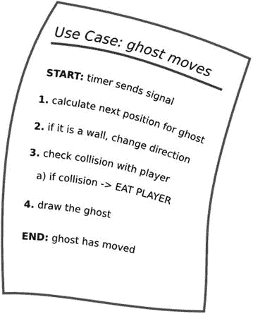
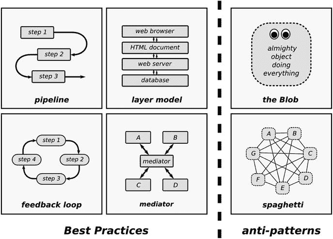
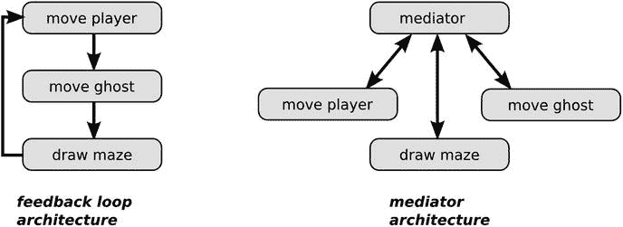

# 十五、分解编程任务

程序员，就像诗人一样，只是稍微偏离了纯粹的思想。——弗雷德·布鲁克斯——神话中的人月

编程的一个关键部分是将一个问题分成更小的部分。这种问题分解是每个程序员的必备技能。不管你是想从头写一个程序，还是想给一个已存在的问题增加功能，你都需要先分解编程问题。问题分解，也称为需求分析，是一种被没有经验和有经验的程序员低估的技能。前者低估了它，因为他们正忙于掌握编程语言本身，后者因为他们认为这是微不足道的，他们已经弄清楚了(尽管他们往往是正确的)。因此，许多编程项目因为缺乏功能或者功能分解不良而遇到问题就不足为奇了。结果，产品是脆弱的，并且深受软件熵之苦，它们花费的时间比预期的要长，或者它们完全失败。个人和大型开发团队、使用传统软件工程方法的团队以及动态、敏捷的团队都报告过这样的问题。本章致力于分解编程任务，帮助你编写不容易犯这个错误的软件。

## 分解编程任务是困难的

但是为什么分解编程问题很难呢？让我们考虑一个典型的编程任务:我们想给我们的游戏添加一个幽灵。幽灵将随机穿过迷宫，试图吃掉玩家。怎么才能分解这个特征呢？直观地说，把一个问题分成更小的块，可以分层次地考虑(见图 [15-1](#Fig1) )。我们首先把它分成两个更小的子问题。然后我们将每个子问题分解成更小的问题。最后，我们实现所有较小的部分，我们就完成了。


图 15-1。

Hierarchical decomposition of a programming problem. First, the problem is divided into two separate subproblems, which are divided further. Unfortunately, this approach rarely works in practice.

这是一个不错的模型。不幸的是，除了最简单的程序之外，它并不适用于所有程序。原因是大多数程序中较小的组件是高度相互依赖的。大多数编程问题都是多维的。我们需要记住多个问题维度:

*   编程任务本身——我们试图编程的到底是什么？
*   数据——我们需要在程序中存储什么信息，它是如何构成的？
*   控制流——程序执行任务的顺序是什么？
*   技术——软件由哪些组件(python 式和非 python 式)组成？
*   成本—哪些功能价格合理，哪些不合理？

所有这些维度(以及这里没有提到的其他维度)都相互依赖。多年来，已经写了很多关于分解的书。他们涉足非常多样的领域，如需求分析、通用建模语言(UML)和 Scrum。所有这些都是非常强大的技术。在一个(主要是公司)环境中，这些方法之一被应用到大型项目中，它们当然值得学习。但是对于普通的 Python 程序员来说，它们并没有太大的帮助。

Python 中的分解问题有什么特别之处吗？有:Python 的一个关键优势是开发速度快。不花任何时间在计划上并马上开始编程是非常诱人的。一个好的分解方法也需要很快，这样我们才不会危及 Python 带给我们的优势。这就是为什么本章描述了一个在几分钟或几小时内适用的轻量级分解过程。我们将详细分解重影特征。最后，我们将在本章开始实现它。

## 分解编程任务的过程

分解编程任务是困难的，因为我们必须在多个维度(功能、数据、控制流、技术、成本)做出设计决策。为了避免过早的设计决策，我们需要或多或少地并行处理这些维度。这是什么意思？我们对程序特性的最初看法就像一朵云(见图 [15-2](#Fig2) )。我们对程序应该做什么有一个粗略的想法，但是功能太不精确而无法实现。在设计过程中，组件开始从云中出现并成形。我们不是在开始下一个维度之前完全固定一个维度，而是将每个维度与其他维度并行平衡，从而解决大的设计问题。最后，组件获得了足够的清晰度，实现是可行的。如果从一个特性到它的实现的路径是清晰的，我们可以说这个特性是完全分解的。


图 15-2。

A program feature is like a blurry cloud in the beginning. Only by decomposing it will details of the functionality and program components become apparent. When we finally arrive at sharply defined, implementable components, the decomposition is complete.

在下文中，我们将使用七个步骤将重影特征分解成更小的部分:

1.  写一个用户故事，对编程任务的简单描述
2.  向描述中添加细节
3.  检查非功能需求
4.  识别可能的问题
5.  决定解决主要问题的架构
6.  识别程序组件
7.  实施

这个过程反映了许多程序员在实现一个简单的功能时的直觉。系统地完成这七个步骤，我们也可以将同样的过程应用到更困难的任务中。在这个过程中，我们有意识地做出设计决策，在云中寻找可以用 Python 实现的组件。这是我们接下来要做的。

我们可以用这个过程来扩展现有的程序吗？没错。很少有软件是从零开始开发的。分解的过程在从零开始或扩展现有程序之间没有根本的区别。当然，当添加到现有软件中时，我们需要考虑我们已经拥有的(在第 3 步及以后)，因为我们不应该在每次添加功能时颠倒我们的设计。

## 写一个用户故事

第一步是写下我们想要编程的内容。此描述必须足够短，以便能写在一张小纸上(A6 纸卡)。描述还必须足够简单，非程序员也能明白其中的价值。这样的描述也被称为用户故事。对于鬼魂，相应的用户故事可能是(也见图 [15-3](#Fig3) ):作为一个玩家，我想要一个鬼魂，这样我就可以通过迷宫逃离它。这个用户故事的句子结构是标准的最佳实践。为了更清晰，许多开发人员已经同意使用该结构“作为(一种类型的用户)，我想要(一些目标)，以便(一些原因)。”这种用户故事的结构不仅记录了要实现什么样的程序特性，还记录了为什么要引入这个特性。又见 [`https://www.mountaingoatsoftware.com/agile/user-stories`](https://www.mountaingoatsoftware.com/agile/user-stories) `.`我们用户故事的价值当然是有鬼的游戏比没鬼的有趣。尽管写下这个特性是一件简单的事情，但它在许多方面改进了程序员的工作:

*   任务变得切实可行。无论使用什么项目管理方法，用户故事都很容易管理。我们可以对它们进行优先排序，估计或跟踪完成的时间，当然，也可以检查它们是否完成。在编写用户故事时，一个常见的最佳实践是将它们放在一个显眼的地方。令人惊讶的是，纸质卡片或纸板往往比电子系统更好。
*   描述有助于我们集中注意力。在描述中包含程序用户将会看到或做的事情有助于我们开发一个比我们写“用 Python 实现一个 ghost 模块”更有用的程序
*   这个描述忽略了技术细节。此时，决定如何实现该功能还为时过早。
*   最重要的是，用户故事表明我们对功能的理解可能是不完整的。我们将需要进一步思考或沟通，以澄清我们想要实施的细节。因此，用户故事也被称为“交流的承诺”


图 15-3。

User Story for adding a ghost to the game. A User Story is a short description of a program feature with an emphasis on the value the feature has for users.

每当你开始开发一个新的程序时，写下所有计划功能的用户故事是组织起来的第一步。

## 向描述中添加细节

从前面的简单描述中，我们已经可以看出，ghost 将大大改变我们的程序。以前，我们只需要对用户按下的键做出反应。现在，幽灵和玩家将同时移动:存在并发性。对于一个程序员来说，这是一个非常危险的时刻。当遇到“并发”这样的概念时，有趣的事情就发生了。经验不足但聪明的程序员举手说“等等！我不知道该怎么做。”更有经验、热情的程序员倾向于立即提出他们喜欢的解决方案(例如，“Python 线程是理想的解决方案”或“不惜一切代价避免使用 Python 线程”。GIL 会把你逼疯的！”).有经验的程序员之间的讨论可能会让其他人感到有点害怕。此外，现在决定技术解决方案可能还为时过早。无论你看到许多可能的解决方案还是根本没有，收集更多的信息都是值得的。

### 验收准则

处理新情况的一个建设性方法是首先收集问题的细节。很多时候，简单地记下要点列表是我们能做的最好的事情。ghost 功能的要点如下所示:

*   玩家和幽灵必须平行移动。
*   幽灵以规则的间隔移动(每平方不到一秒)。
*   鬼魂朝一个方向直线移动，直到碰到一堵墙。然后它随机改变方向。
*   鬼魂不吃小点。
*   当幽灵和玩家在同一方格时，游戏终止。

根据项目方法的不同，这种特性的细节有时被称为验收标准或要求。在一个敏捷项目中，验收标准适用于另一张 A6 卡。在大型的传统软件项目中，需求有时会增长到数百或数千页的文档。后者绝对不是我们希望在一般的 Python 项目中发生的事情。对我们来说，将需求保存在一个小的文本文件中或者用户故事卡的背面就足够了。如果一个简单的要点列表还不够，我们可以添加文字描述和图表来更详细地描述这个特性。如果这样的信息已经存在(带有说明、文章、例子、会议记录的电子邮件)，最好将这些信息放在靠近其他描述的地方。

### 用例描述

除非我们正在编写一个巨大的软件，否则我不会从编写一个关于我们将要实现的特性的冗长的文本描述开始:它们可能无论如何都会改变。比写文本更快的实用计划技术是写下一系列事件或用例描述。用例描述是以一定顺序发生的事件的列表。例如，我们可以像图 [15-4](#Fig4) 那样描述幽灵的运动。用例描述已经比用户故事更类似于 Python 代码。但是仍然，里面没有技术术语；我们仍然不需要决定幽灵的移动是由单个函数处理(也许)，由十个不同的类处理(也许)，还是用 COBOL 语言实现会更好(非常不可能)。



图 15-4。

Use Case for moving the ghost. The movement feature has been broken down into a chronological order of steps that make it easier to reason about it. This Use Case description is not exhaustively accurate, nor does it suggest how to implement the feature. The description simply helps us to gradually shift to higher precision while postponing technical decisions.

图 [15-4](#Fig4) 中的用例包含一个玩家被吃掉时的分支(在 3a 中)。一个用例可以，但不是必须，包含分支。如果有许多不同的情况，通常挑选几个有代表性的就足够了。用例不一定要完整。它仍然需要适合幻灯片或一张纸。也不要担心是否有不止一个“正确”的序列。我们将在接下来的步骤中找到答案。用例描述是一种帮助分解困难用例的工具。大多数情况下，一系列要点将为实施添加足够的细节。

## 检查非功能需求

在前两步中，我们已经足够详细地描述了我们想要实现的功能。在这一步，我们将关注开发中更微妙的部分:非功能性需求。什么是非功能需求？简而言之，非功能需求是对项目的所有约束，与我们正在实现的功能没有直接关系。例如，这些包括技术、开发方法、平台、性能和其他技术参数，以及道德和法律问题。安全和保障也是非功能需求的一部分，但是正如第 [1](01.html) 章所述，我们不会在本书中讨论它们。MazeRun 游戏的一些非功能性需求如下:

*   游戏因为书名(技术)需要用 Python 写。
*   游戏需要有自动化测试(开发方法)。
*   游戏需要可以安装在 Linux、Windows 和 Mac 上，以便许多开发者可以对它进行实验(平台)。
*   源代码的长度需要少于 1000 行，以适合一本书(技术参数)。
*   有 0 到 10 个幽灵以 0.1-1.0 秒的间隔移动(技术参数)。
*   游戏需要适合六岁儿童(伦理)。
*   该游戏需要在开源许可(合法)下在 GitHub 上发布。

为什么非功能需求很重要？想象一下，我们增加了一个非功能性的要求，除了前面的要求，MazeRun 应该可以在 Android 和 iOS 手机上运行，并且能够处理 10，000 个同时追逐玩家的幽灵(以确保即使是最活跃的手机用户也不会感到无聊)。结果将是一个完全不同的程序，我们将不得不使用不同于 Python 和 SDL 的技术来运行它。对非功能性需求的错误理解有可能使程序完全无用，因此跳过这一步是不可选择的。

在更深的层次上，非功能需求帮助我们确定我们正在编写什么样的程序。MazeRun 的第一个工作版本(没有第 7 章中的幽灵)可以开发成许多不同的游戏:一个具有高效人工智能的类似象棋的策略游戏(不在本书中)，一个有许多花哨图形的快节奏射击游戏(也不在本书中)，或者一个为了推理 Python 最佳实践而构建的类似小精灵的游戏(准确地说！).用几个技术参数或其他非功能性需求来表达明确的方向，会使以后的技术决策变得容易得多。

就像功能性描述一样，写下非功能性需求是个好主意。幸运的是，非功能性需求在项目中通常不会改变(但是，如果它们改变了，您需要非常小心)。

## 识别问题

有了功能性和非功能性的描述，我们就有希望清楚地了解 ghost 特性是什么，以及它需要适应什么样的边界条件。这是寻找潜在问题的好时机。还有什么看起来很难的呢？有没有与非功能需求相冲突的用户故事？这些描述中有互相矛盾的吗？有什么事情是听起来不可能的吗？在这一节中，我们休息一下，思考一下我们需要处理的问题。

Tip

休息一下是字面意思。在花了一些时间(10 分钟到几个小时之间)编写用户故事、用例描述和非功能需求之后，现在是后退一步，从一个新的角度来看待任务的好时机。新鲜空气确实有帮助！

对于 ghost 特性，有一个主要的挑战:并发性。玩家和幽灵必须同时移动。目前，我们还没有一个如何实施的计划。这里我们将详细分析并发问题，看看如何从不同的角度处理问题。一般来说，我们可以预料到至少来自四个不同方向的麻烦:不完整的信息、领域专业知识、更改现有代码和预测未来的变化。

### 不完全信息

当你试图自己应用这个过程时，你很可能会意识到你没有足够的信息来继续。对你的特征的描述包含了一些假设，或者仅仅是缺乏你的主管/客户真正需要的细节。这是完全正常的。面对不完全信息时，你有两种选择。要么创建一个(快速的)原型实现，看看它是否符合预期，要么尝试先获取更多信息。当询问更多信息时，你的主管/客户可能也不知道，因为他们在你分解之前从来没有想过这个问题。或者他们想出了一些一开始听起来不错的好主意，但一旦付诸实施，却发现毫无用处。因此，应对信息缺乏的一个好策略是循序渐进。

对于 ghost 特性，我们没有关于如何处理并发性的信息。另一方面，我们对这个特性有很多自由，因为它的主要目的是提供学习体验。任何工作鬼都可以，所以信息不足在这里不是问题。

### 领域专业知识

相反的问题是拥有过多的信息，知道我们正在解决的问题充满了例外和特殊情况。一个常见的症状是，我们反复推理某个特征的非常特殊的方面，比如“是的，但在 Anhk-Morpork 的税法中，如果雇员是一个幽灵，税率是 13%而不是 21%，因为它是一个非物质实体。”如果你不熟悉问题领域(在这种情况下是 Ankh-Morporkian 税法)，这种特定领域的细节很快就会让人不知所措。这类问题的解决方法是先简化。找到一个简洁地代表问题域的模型，但是不要过于简化。在问题域的一个良好构建的模型中，在实现过程中可以包含特殊情况。关于问题领域的背景知识是关键。取决于你是否是领域专家，这种问题可以在一杯咖啡或去图书馆做大量背景研究时解决。幸运的是，我们每个人以前都玩过或至少看过电脑游戏。我们对游戏有足够的了解，可以理解前面提到的 MazeRun 中的并发问题。我们的理解有助于我们列举一些需要注意的情况:

*   如果玩家在幽灵上移动会发生什么？这一点在前面的用例描述中没有明确涵盖！
*   玩家对幽灵移动还是幽灵对玩家移动有区别吗？
*   玩家和鬼魂理论上可以同时移动从而互换位置吗？
*   移动的幽灵会让玩家移动的更慢吗？

收集这些问题将有助于我们评估我们的解决方案。

### 更改现有代码

向程序中添加新的特性可能很有挑战性，因为它们需要适应已经存在的代码。通常，需要重新组织现有代码，以便为新功能腾出空间。问题是如何做到这一点，同时又不造成一片混乱。简而言之，你需要记住在第 14 章中介绍的软件熵的概念。考虑到并发性问题，当考虑 MazeRun 的现有代码时，我们需要更改哪些部分？当然，事件循环必须改变。到目前为止，第 4 章[的实现什么都不做，除非玩家按下一个键。我们将不得不仔细看看这些代码。](04.html)

### 预见未来的变化

软件熵的另一个方面是我们知道我们的程序将来会改变。我们现在做出的设计决策将会产生长期的影响。因此，我们不仅需要考虑程序的当前需求，还要预测程序在未来可能如何发展。为了创建一个稳定的设计，我们需要知道程序的哪些部分最不可能改变，哪些部分肯定会改变。这些部分需要分开。在所有可能的问题中，这是最困难的一个。要解决这个问题，领域专业知识、经验和运气的结合是必要的。回想过去几十年写作和玩电脑游戏的经历，有些事情很可能会改变

*   额外的游戏元素(幽灵的种类，特殊的地砖)
*   参数(重影速度、屏幕尺寸)
*   图形和动画

每个玩游戏的人都立即意识到的一个方面是移动玩家时缺少动画。玩家人物只是从一个方块跳到下一个方块。让动作流畅确实是一个不错的改进。乍一看，这似乎是一个无害的功能，我们可以用几行代码实现为一个定格动画:

```py
import time

for offset in range(32):
    draw_map_without_player()
    draw_player(100 + offset, 100)  # starting point (x=100, y=100)
    pygame.display.update()
    time.sleep(0.05) # seconds

```

但是等等！如果我们加上幽灵，不知何故，幽灵和玩家的流畅动作需要协调。又是并发问题。不用进一步考虑这个问题，我们可以预计并发问题在未来会变得更加重要。总而言之，我们在本节中收集了三个问题，都与并发性有关:

1.  目前，我们还没有解决如何处理平行移动的球员和幽灵。
2.  为了允许同时运动，我们需要改变事件循环。
3.  在未来，将会有更多的事情同时发生。

这样一个可能的问题列表可能会很长。我们需要做的是对它们进行优先排序，然后专注于最糟糕的问题。在我们的例子中，并发性是最大的挑战。在本章的剩余部分，我们将重点解决这个问题。

## 决定架构

我们认为并发是最困难的问题。为了给游戏加个鬼，任何实现都需要妥善解决这个问题。现在，如果这听起来已经足够简单，我们可以跳过接下来的两节，开始编写代码。但是假设我们是第一次做这种事情，最好先考虑一下我们程序的架构。老实说，给电脑游戏添加一个幽灵，建筑这个词有点浮夸。术语软件架构也用于描述由数百台连接的服务器组成的事物。但是我更喜欢架构，而不是更温和的术语软件设计，因为设计经常与事物的外观不正确地联系在一起。我们真正感兴趣的是找到一个能帮助我们解决问题的程序结构。让我们看几个潜在的架构。

在图 [15-5](#Fig5) 中，我们发现了软件中使用的六种常见架构模式。其中四个是有用的。管道描述了一系列相互依赖的步骤。我们在执行计算、数据处理的程序中和 Unix 命令行上的工具中找到了管道结构。层模型有助于组织以两种方式相互通信的组件。它是构建 web 服务器的经典模型。反馈回路是各种调节过程的良好结构，例如，可以在监控工具和感觉装置中找到。最后，中介模型组织不直接相互对话的组件之间的通信。例如，一个绘图程序被构造成一个中介；画布是所有不同绘图工具交互的中心媒介。



图 15-5。

Six frequent architectural pattern s in software. The four on the left are useful patterns; the two on the right are antipatterns that should be avoided.

该图还包含两个反模式，应该避免的结构。第一个是 Blob，它通过将所有内容放在一个组件中来避免分解。结果是一个巨大的混乱的非结构。第二个是意大利面条模型，它有许多组件，但是所有组件都可以自由地相互交流。结果又是一个混乱的非结构。

图中还没有包括其他基本的架构模式。没有太多，因为有有限数量的不同拓扑，既不是斑点也不是意大利面条。我们不能混合两种架构，因为结果将会是一个类似意大利面条的结构。但是，体系结构可以嵌套，也就是说，可以相互包含。例如，分层架构的第二层可以在内部包含一个管道。

我们如何使用这些信息来解决并发问题呢？我们需要让玩家和幽灵都可以并行移动，并负责中间的一些后台任务(例如，绘制迷宫)。让我们考虑图 [15-6](#Fig6) 中的两种可选结构。

1.  一个简单的反馈回路。我们在一个循环中处理所有事情。首先我们移动玩家，接下来我们移动幽灵，最后我们绘制图形。
2.  我们引入了一个中介，这个组件的唯一职责是决定该轮到谁做什么。播放器、ghost 和绘图部分通过相同的协议与中介进行通信。



图 15-6。

Two alternatives for taking care of concurrency : a feedback loop architecture (left) and a mediator-based architecture (right)

可能有更多的可能性来解决这个问题，但是我们将坚持这两个。在我们的案例中，这两种架构中哪一种是最好的？反馈循环可能是更容易实现的。我们可以很快地从头开始写，而且会成功。不过，循环结构有几个明显的缺点。首先，它不容易扩展:每次我们添加一个新的游戏元素，我们都必须将它添加到循环中。第二，循环中最慢的一步会减慢所有其他步骤。在游戏中，增加一些元素很容易导致明显的延迟。我们可以通过最终跳过事件循环中的一个或多个步骤来避免这种情况，但这样架构就不再那么简单了。

另一方面，中介结构易于扩展。只要组件使用相同的协议与中介通信，插入多少个元素并不重要。中介只需要有某种队列或其他规则集来决定轮到哪个组件。后一种属性正是我们所需要的。我们知道玩家和鬼魂的移动会遵循非常不同的节奏。中介架构能够适应这种差异。这就是为什么我们将继续使用中介架构来实现。

## 识别程序组件

我们已经决定使用一个中介架构来实现 ghost。但到目前为止，我们还没有决定介体和它们周围的组件到底是什么。我们仍然需要决定是否使用函数，类，模块，或者其他的东西作为图的一部分。为了先解决高阶问题，我们推迟了这个(显然很重要的)决定。在这一节，最后的实施之前，是时候做出这样的决定了。一般来说，识别组件意味着跨越开头提到的编程问题的维度(功能、数据、控制流、技术)来划分界限。我们现在需要看到一个清晰的结构从最初的云中浮现出来，并且易于实现。

在 Python 中，决定是否在给定的地方使用函数、类或模块本身并不是一个非常困难的决定。因为所有这些都是 Python 对象，所以通常可以很容易地将一个对象换成另一个对象。例如，我们可以从实现一个函数开始，但是如果程序增长了，就用一个类来代替它。在其他语言中，这样的决定有点困难。这一步的目的是使上一步的架构变得生动，而不是创建一个函数、类和模块的详尽列表。我们将需要在实施过程中自由添加或更改一些细节。有一个我们的程序将包含的组件的概要就足够了。

我们的调解人需要哪些组件？同样，我们面临一个设计决策:我们将使用什么作为中介，以及它将如何与其他组件通信？同样，我们将考虑两个选项。首先，我们可以使用多线程。我们并行运行三个子进程，一个用于玩家，一个用于幽灵，一个用于绘图。三者共享相同的数据。在这种情况下，中介是 Python 内置的线程引擎。多线程是游戏中常见的一种中介模型。对于更复杂的并发模型(例如，`asyncio`、`twisted,`或`gevent`)，有大量关于在 Python 和库中实现线程的文档。多线程模型很容易扩展。我们可以简单地为更多的幽灵添加更多的线程。另一方面，众所周知，线程很难调试，不仅仅是在 Python 中。此外，Python 中线程的性能优化并不容易(因为所谓的全局解释器锁或 GIL)。

第二，我们可以使用基于 Pygame 事件的交流。作为中介，我们将有一个事件循环，它收集事件并根据事件类型将它们分配给不同的功能。事件模型的好处是 Pygame 负责将事件排队，并且有预定义的事件类型。我们基本上需要使事件循环更加通用，这样我们就可以插入自定义事件(玩家和幽灵移动和绘图)。像多线程一样，调试事件队列并不容易，我也不敢对它的性能做任何假设。决定是使用线程还是事件队列比之前关于架构的决定要小得多，因为我们现在是在架构的约束下决定的。如果没有太多支持这个或那个模型的话，程序员的经验和偏好决定。就我个人而言，我更喜欢事件循环模型，主要是因为我以前做过，对我来说，线程调试起来更痛苦。但是我坚信这个游戏可以通过多种不同的方式成功实现。你可以自由尝试自己喜欢的方法。

这个问题解决后，我们可以打开文本编辑器，写一个程序大纲。首先，我们将对所有事情使用函数。为了让事件循环作为中介工作，我们将需要以下组件(见图 [15-7](#Fig7) 以获得概述):


图 15-7。

A clear structure has emerged. We have decided to solve the problem of concurrency by using a mediator structure—the event loop. Other game components communicate with the mediator using pygame.event.Event objects, each of which is associated with a callback function. The decomposition is now ready for an implementation.

```py
def move_player(event):
    """moves when keys are pressed"""
    pass

def move_ghost(event):
    """Ghost moves randomly"""
    pass

def update_graphics(event):
    """Re-draws the game window"""
    pass

def event_loop():
    """a mediator using the Pygame event queue"""
    pass

```

创建这样的框架结构是实现的一个很好的准备，不管你想实现小的还是大的组件。这里介绍的方法是相同的。实际上有无限多种可能的成分。为了避免迷失在细节中，表 [15-1](#Tab1) 列出了一些经常出现的错误。

表 15-1。

Some Frequently Occuring Components in Python programs

<colgroup><col> <col> <col></colgroup> 
| 名字 | 目的 | Python 关键字或模块 |
| --- | --- | --- |
| 数据结构 | 将数据与代码分离 | 任何(正确) |
| 班 | 模块化数据+代码 | `class` |
| 命令行界面 | 解析命令行选项 | `argparse` |
| 记录 | 将信息写入日志文件 | `logging` |
| 配置 | 设置参数或从文件中读取参数 | `configparser` |
| 文件输入输出 | 读取或写入数据文件 | 许多 |
| 数据库接口 | 访问外部数据 | 模块，取决于数据库 |
| c 扩展 | 加速计算 | 外部模块 |
| HTML 模板 | 将代码与显示分开 | `jinja2 or django` |

有了这些，我们已经做了足够的练习。是时候将我们的计划工作转化为工作代码了。

## 实施

让我们开始实施的幽灵。中心组件将是事件循环。事件循环的主要职责是充当并发事件的中介。我们从上一节中的框架函数开始实现。事件循环将通过`pygame.event.Event`对象与图 [15-7](#Fig7) 中的其他功能进行通信。Pygame 有内置的整数`USEREVENT`用于定义自定义事件类型，这很方便。我们首先为幽灵移动定义事件，更新屏幕，并退出游戏(对于玩家移动，我们将使用已经存在的键盘事件`KEYDOWN`):

```py
import pygame
from pygame.locals import USEREVENT, KEYDOWN

EXIT = USEREVENT
UPDATE_DISPLAY = USEREVENT + 1
MOVE_GHOST = USEREVENT + 2

```

接下来，我们为游戏中的主要事件创建虚拟程序(在接下来的两章中，我们将把它们发展成功能齐全的组件):

```py
def move_player(event):
    """moves when keys are pressed"""
    print(’player moves’)

def move_ghost(event):
    """Ghost moves randomly"""
    print(’ghost moves’)

def update_graphics(event):
    """Re-draws the game window"""
    print(’graphics updated’)

```

我们希望以一种允许我们灵活地插入不同组件的方式来编写事件循环。为此，我们将事件类型与我们的函数相关联。在程序员的行话中，这样的函数通常被称为回调。Python 字典是存储事件类型和回调函数的理想结构:

```py
callbacks = {
    KEYDOWN: move_player,
    MOVE_GHOST: move_ghost,
    UPDATE_DISPLAY: update_graphics,
}

```

但是所有的事件从何而来呢？对于键盘事件，这一点非常清楚:Pygame 自动生成这些事件，除非我们省略初始化显示(就像我们在第 [4 章](04.html)中所做的)。其余的事件需要显式生成。例如，我们可以将一个`EXIT`事件发送到 Pygame 的事件队列中

```py
# not part of the final program
exit = pygame.event.Event(EXIT)
pygame.event.post(exit)

```

另一种可能性是启动一个每`N`毫秒产生一个事件的定时器。例如，用于每 0.3 秒移动重影的计时器可以从

```py
pygame.time.set_timer(MOVE_GHOST, 300)

```

现在我们可以编写事件循环本身了。与我们之前的实现一样，它从队列中收集事件。但是它没有解释它们，而是将它们重定向到一个回调函数。唯一的例外是`EXIT`事件，它终止了循环:

```py
def event_loop(callbacks, delay=10):
    """Processes events and updates callbacks."""
    running = True
    while running:
        pygame.event.pump()
        event = pygame.event.poll()
        action = callbacks.get(event.type)
        if action:
            action(event)
        pygame.time.delay(delay)
        if event.type == EXIT:
            running = False

```

最后，我们可以开始事件循环。我们需要设置几个定时器来定时移动幽灵和更新屏幕。我们还设置了一个定时器，在五秒钟后触发一个`EXIT`事件:

```py
if __name__ == ’__main__’:
    pygame.init()
    pygame.display.set_mode((10, 10))
    pygame.time.set_timer(UPDATE_DISPLAY, 1000)
    pygame.time.set_timer(MOVE_GHOST, 300)
    pygame.time.set_timer(EXIT, 5000)
    event_loop(callbacks)

```

如果我们启动程序，按几个键，输出如下:

```py
player moves
player moves
ghost moves
ghost moves
player moves
player moves
ghost moves
graphics updated
ghost moves
..

```

到目前为止，我们取得了什么成绩？我们创建了一个通用结构，比幽灵问题通用得多。我们可以对许多并发的游戏元素使用相同的机制。注意，事件循环并不关心我们连接到它的是什么。我们可以插入一个或两个玩家，一个到多个幽灵，或者其他我们以后可能会发明的东西。当然，我们可以插入的组件数量有一个实际上限。但是，我们还远没有到必须考虑优化我们的架构的地步。在接下来的章节中，我们将讨论如何实现 ghost 的其余部分。

七步计划过程是一个如何分解问题的例子。尽管拥有这样一个过程是一种最佳实践，但我很少完整地经历所有的步骤，有时步骤会有很大的不同。大多数时候，解决方案在配方中途指向自己(哔哔声“实现我！”).但是每当有一个有问题的编程任务要添加时，一个缓慢而系统的过程会给出最好的长期结果。关于幽灵的完整实现，参见 [`http://github.com/krother/maze_run`](http://github.com/krother/maze_run) `.`

## 其他规划工具

规划是编程中的一项基本技能。尽管这会分散我们编写代码的注意力，并且通过严格应用常识可以实现很多目标，但是当事情变得更加复杂时，了解一些规划工具可以节省您的时间。这不是一本关于软件项目管理的书，就不赘述了。然而，我有几个最喜欢的规划工具值得一提:

### 一页纸的项目计划

在没有正式计划阶段(有时甚至没有正式的项目经理)的项目中，编写一个最小计划通常足以让所有人达成一致。我一直使用的计划总结在一张 A4 纸上:

*   这个项目是关于什么的？
*   团队中有哪些人(以及如何联系他们)？
*   你为什么要写这个程序？
*   主要目标是什么？
*   最重要的子目标是什么？
*   有截止日期吗？
*   有预算吗？

在一个小团队中，有这样一个小计划可以避免很多误解。

### 问题跟踪器

当你确定了编程任务或者把它们分解成更小的时候，你把它们放在哪里？一种可能性是使用问题跟踪器。问题跟踪器是一个管理编程任务、描述以及谁在负责它们的软件。使用它对防止遗忘有很大的帮助。流行的问题跟踪器有 JIRA、Trac 和 GitHub 上的问题系统。但是基本上任何项目管理系统都提供了跟踪问题的功能。

### 看板法

看板最初由丰田公司发明，是精益生产中管理库存的一种方法。这个概念被大卫·安德森应用于软件开发。看板流程限制了要同时处理的事情的数量，并将它们显示在一个清晰可见的板上。我的桌子上、浏览器上和厨房里都有看板——它们都工作得很好。看板是一种注重改进和完成工作的实用方法，可以很容易地与工作环境中的大多数现有实践相结合。

## 最佳实践

*   分解编程任务类似于从云中慢慢浮现的形状，而不是一系列的突然切割。
*   用户故事是对编程任务的简短、非技术性的描述，使其易于管理。
*   细节可以作为项目符号、文本文档、图表和用例描述添加到用户故事中。
*   非功能需求是描述程序使用环境的边界条件。尽早考虑它们可以大大降低程序变得难以维护或无用的风险。
*   基于一个用户故事，用例描述和非功能需求，矛盾和其他问题可以被识别。
*   当分解一个编程问题时，领域知识是必不可少的。
*   问题的常见来源包括缺乏信息、信息过多、现有代码和未来的变化。
*   选择解决主要问题的架构。
*   确定程序组件(函数、类、模块等)后，创建一个框架程序。)来实现该架构。
*   实现是完全分解后的最后一步。
*   分解编程任务的七步过程应该被理解为一个指南。