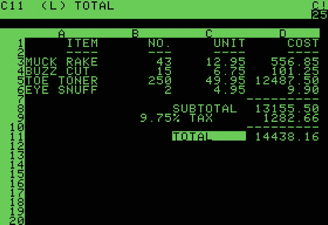
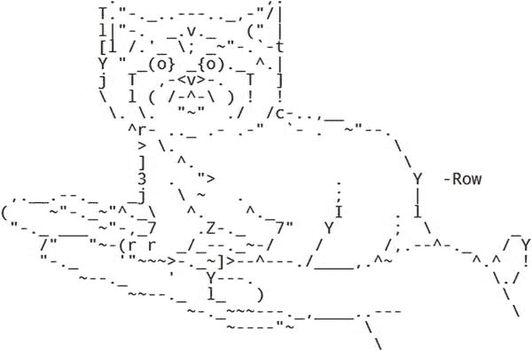
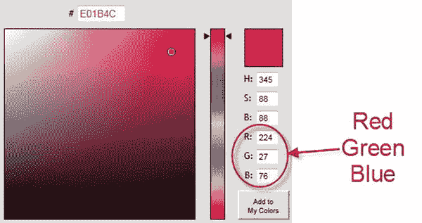
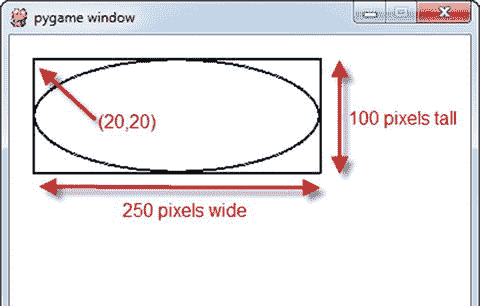
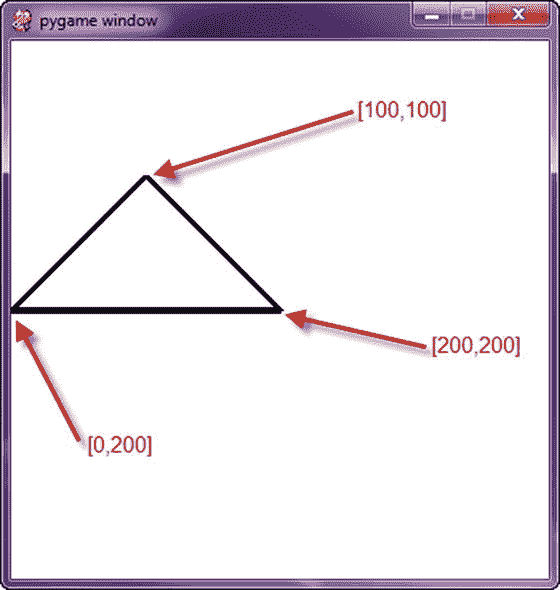

# 6.图形介绍

现在你可以创建循环了，是时候继续学习如何创建图形了。本章涵盖:

*   计算机如何处理 x，y 坐标。它不像你在数学课上学到的坐标系。
*   如何指定颜色？有数百万种颜色可供选择，告诉计算机使用什么颜色并不像只说“红色”那么简单
*   如何打开空白窗口进行绘图？每个艺术家都需要画布。
*   如何画直线、矩形、椭圆和圆弧？

## 计算机坐标系统

笛卡尔坐标系，如下图所示( [`https://commons.wikimedia.org/wiki/File:Cartesian_coordinates_2D.svg`](https://commons.wikimedia.org/wiki/File:Cartesian_coordinates_2D.svg) )，是大多数人在绘制图形时习惯使用的系统。这是学校教的体系。计算机使用一个相似但有些不同的坐标系统。要理解它的不同之处，需要快速了解一下计算机的历史。

笛卡尔坐标系

在 80 年代早期，大多数计算机系统是基于文本的，不支持图形。下一张图( [`https://en.wikipedia.org/wiki/File:Visicalc.png`](https://en.wikipedia.org/wiki/File:Visicalc.png) )显示了在 80 年代流行的苹果`][`电脑上运行的早期电子表格程序。当在屏幕上定位文本时，程序员从顶部开始，称之为第 1 行。屏幕继续向下显示 24 行，横向显示 40 个字符。

早期的苹果文本屏幕

即使是纯文本，也可以通过使用键盘上的字符来制作基本的图形。看到下图中的这只小猫，仔细看看它是怎么画出来的。当制作这种艺术作品时，字符仍然从顶部的第一行开始定位。

文本屏幕

后来，字符集扩展到包括盒子和其他原始绘图形状。人物可以用不同的颜色来画。如图所示，图形变得更高级了。在网上搜索“ASCII 艺术”，可以找到更多的例子。

Spaceware 文本屏幕

一旦计算机能够控制图形的单个像素，基于文本的坐标系统就被卡住了。

计算机坐标系统

x 坐标的工作原理与笛卡尔坐标系相同。但是 y 坐标反了。与笛卡尔图形中的零 y 坐标位于图形底部不同，零 y 坐标位于计算机屏幕的顶部。随着 y 值的上升，计算机坐标位置在屏幕上下移，就像文本行而不是标准的笛卡尔图形。见上图。

另外，请注意，屏幕覆盖了右下象限，而笛卡尔坐标系通常聚焦于右上象限。可以在负坐标绘制项目，但它们将被绘制到屏幕之外。当形状的一部分不在屏幕上时，这很有用。计算机会计算出屏幕外是什么，程序员不需要太担心。

## Pygame 库

为了使图形更容易处理，我们将使用“Pygame”Pygame 是一个其他人编写的代码库，它简化了:

*   绘制图形形状
*   显示位图图像
*   有生命的
*   与键盘、鼠标和游戏手柄互动
*   播放声音
*   检测物体碰撞的时间

Pygame 程序需要做的第一件事是加载和初始化 Pygame 库。每一个使用 Pygame 的程序都应该以下面几行开始:

`# Import a library of functions called ’pygame’`

`import pygame`

`# Initialize the game engine`

`pygame.init()`

如果您还没有安装 Pygame，那么在“开始之前”一节中可以找到安装 Pygame 的说明。如果你的电脑上没有安装 Pygame，当你试图运行`import pygame`时会得到一个错误。

重要提示:`import pygame`查找名为`pygame`的库文件。如果一个程序员创建了一个名为`pygame.py`的新程序，计算机将会导入那个文件！这将阻止任何 pygame 程序运行，直到那个`pygame.py`文件被删除。

## 彩色

接下来，我们需要添加定义程序颜色的变量。颜色由三种颜色定义:红色、绿色和蓝色。你听说过 RGB 显示器吗？这就是这个术语的由来。红绿蓝。对于旧的显示器，你可以坐得离显示器很近，分辨出单独的 RGB 颜色。至少在你妈妈告诉你不要坐得离电视太近之前。这对于今天的高分辨率显示器来说是很难做到的。

RGB 三元组的每个元素都是一个从 0 到 255 的数字。零表示没有颜色，255 表示显示器显示尽可能多的颜色。这些颜色以叠加的方式组合在一起，因此如果指定了所有三种颜色，监视器上的颜色将显示为白色。(这与墨水和颜料的工作原理不同。)

Python 中的列表用方括号或圆括号括起来。([第 8 章](08.html)详细介绍了列表和两种类型的区别。)列表中的各个数字用逗号分隔。下面是一个创建变量并将它们设置为三个数列表的例子。稍后将使用这些列表来指定颜色。

`# Define some colors`

`BLACK    = (   0,   0,   0)`

`WHITE    = ( 255, 255, 255)`

`GREEN    = (   0, 255,   0)`

`RED      = ( 255,   0,   0)`

为什么这些变量都是大写的？记得从[第二章](02.html)回来，不变的变量叫做常数。我们不期望黑色的颜色会改变；它是一个常数。我们用全部大写字母来命名变量，以此来表示变量是常量。如果我们期望一种颜色发生变化，就像我们有`sky_color`在太阳下山时发生变化，那么这个变量应该全部是小写字母。

在空闲时使用交互式 shell，尝试定义这些变量并打印出来。如果上面的五种颜色不是你要找的颜色，你可以自己定义。要选择一种颜色，找到一个在线的“颜色选择器”，如下图所示。一个这样的拾色器在: [`http://www.colorpicker.com/`](http://www.colorpicker.com/)

颜色选择器

额外:一些颜色选择器以十六进制指定颜色。如果以 0x 开头，可以输入十六进制数。例如:

`WHITE = (0xFF, 0xFF, 0xFF)`

最终，程序在绘制圆弧时将需要使用π的值，因此这是我们在程序中定义包含π值的变量的好时机。(也可以从数学库中导入这个作为`math.pi`。)

`PI = 3.141592653`

## 打开窗户

到目前为止，我们开发的程序只能将文本打印到屏幕上。那些程序不像大多数现代程序那样打开任何窗口。打开窗口的代码并不复杂。下面是所需的代码，它创建一个宽度为 700 像素、高度为 500 的窗口:

`size = (700, 500)`

`screen = pygame.display.set_mode(size)`

为什么是`set_mode`？为什么不是`open_window`？原因是这个命令实际上可以做的不仅仅是打开一个窗口。它还可以创建以全屏模式运行的游戏。这将删除开始菜单，标题栏，并让游戏控制屏幕上的一切。因为这种模式使用起来稍微复杂一些，而且大多数人更喜欢窗口游戏，所以我们将跳过对全屏游戏的详细讨论。但是如果你想了解更多关于全屏游戏的信息，可以查看 pygame 的[显示](http://www.pygame.org/docs/ref/display.html)命令的文档。

还有，为什么是`size = (700, 500)`而不是`size = 700, 500`？同样的原因，我们把颜色定义放在括号里。Python 通常不能在一个变量中存储两个数字(高度和宽度)。唯一的方法是将数字存储为一个列表。列表需要圆括号或方括号。(从技术上讲，一组数字周围的括号更准确地称为元组或不可变列表。用方括号括起来的列表就叫做列表。一个有经验的 Python 开发人员可能不愿意将括号中的数字列表称为列表而不是元组。你也可以说`size = 700, 500`，它将默认为一个元组，但我更喜欢用括号。)列表在第 8 章的[中有详细介绍。](08.html)

要设置窗口的标题(显示在标题栏中)，请使用以下代码行:

`pygame.display.set_caption("Professor Craven’s Cool Game")`

## 与用户互动

仅用目前编写的代码，程序就会创建一个窗口并立即挂起。用户不能与窗口交互，甚至不能关闭它。所有这些都需要编程。需要添加代码，以便程序在循环中等待，直到用户单击“退出”

这是程序中最复杂的部分，还不需要完全理解它。但是有必要对它的作用有个概念，所以花点时间研究一下，提出问题。

`# Loop until the user clicks the close button.`

`done = False`

`# Used to manage how fast the screen updates`

`clock = pygame.time.Clock()`

`# -------- Main Program Loop -----------`

`while not done:`

`# --- Main event loop`

`for event in pygame.event.get(): # User did something`

`if event.type == pygame.QUIT: # If user clicked close`

`done = True # Flag that we are done so we exit this loop`

`# --- Game logic should go here`

`# --- Drawing code should go here`

`# First, clear the screen to white. Don’t put other drawing commands`

`# above this, or they will be erased with this command.`

`screen.fill(WHITE)`

`# --- Go ahead and update the screen with what we’ve drawn.`

`pygame.display.flip()`

`# --- Limit to 60 frames per second`

`clock.tick(60)`

最后，我们将添加代码来处理键盘和鼠标点击。该代码将位于第 9 行主事件循环注释的下方。用于确定子弹何时发射以及物体如何移动的代码将放在第 14 行游戏逻辑的注释下面。我们将在后面的章节中讨论这一点。要绘制的代码将放在下面，屏幕的第 20 行用白色填充。

### 事件处理循环

警惕！程序员遇到的最令人沮丧的问题之一是搞乱事件处理循环。这个“事件处理”代码处理所有的击键、鼠标按钮点击和其他几种类型的事件。例如，您的循环可能如下所示:

`for event in pygame.event.get():`

`if event.type == pygame.QUIT:`

`print("User asked to quit.")`

`elif event.type == pygame.KEYDOWN:`

`print("User pressed a key.")`

`elif event.type == pygame.KEYUP:`

`print("User let go of a key.")`

`elif event.type == pygame.MOUSEBUTTONDOWN:`

`print("User pressed a mouse button")`

事件(如按键)都在一个列表中。程序使用一个`for`循环来遍历每个事件。使用一系列的`if`语句，代码判断出发生了什么类型的事件，处理该事件的代码放入`if`语句中。

所有的`if`语句应该在一个`for`循环中一起运行。在复制和粘贴代码时，一个常见的错误是没有合并来自两个程序的循环，而是有两个事件循环。

`# Here is one event loop`

`for event in pygame.event.get():`

`if event.type == pygame.QUIT:`

`print("User asked to quit.")`

`elif event.type == pygame.KEYDOWN:`

`print("User pressed a key.")`

`elif event.type == pygame.KEYUP:`

`print("User let go of a key.")`

`# Here the programmer has copied another event loop`

`# into the program. This is BAD. The events were already`

`# processed.`

`for event in pygame.event.get():`

`if event.type == pygame.QUIT:`

`print("User asked to quit.")`

`elif event.type == pygame.MOUSEBUTTONDOWN:`

`print("User pressed a mouse button")`

第 2 行的`for`循环抓取了所有的用户事件。第 13 行的`for`循环不会抓取任何事件，因为它们已经在前一个循环中处理过了。

另一个典型问题是开始绘制，然后试图完成事件循环:

`for event in pygame.event.get():`

`if event.type == pygame.QUIT:`

`print("User asked to quit.")`

`elif event.type == pygame.KEYDOWN:`

`print("User pressed a key.")`

`pygame.draw.``rect`T2】

`# This is code that processes events. But it is not in the`

`# ’for’ loop that processes events. It will not act reliably.`

`if event.type == pygame.KEYUP:`

`print("User let go of a key.")`

`elif event.type == pygame.MOUSEBUTTONDOWN:`

`print("User pressed a mouse button")`

这将导致程序忽略一些键盘和鼠标命令。为什么呢？`for`循环处理一个列表中的所有事件。因此，如果有两个键被点击，`for`循环将处理这两个键。在上面的例子中，`if`语句不在`for`循环中。如果有多个事件，`if`语句将只针对最后一个事件运行，而不是所有事件。

### 处理每一帧

游戏每一帧的基本逻辑和顺序:

*   未完成时:
    *   对于每个事件(按键、鼠标点击等)。):
        *   使用一系列的`if`语句运行代码来处理每个事件。
*   运行计算来确定物体移动到哪里，当物体碰撞时会发生什么，等等。
*   清空屏幕。
*   画出一切。

如果不把这些步骤混在一起，程序会更容易阅读和理解。不要做一些计算，一些绘图，一些更多的计算，一些更多的绘图。另外，看看这和第二章中的计算器是如何相似的。获取用户输入，运行计算，并输出答案。同样的模式也适用于此。

将图像绘制到屏幕上的代码发生在 while 循环中。时钟刻度设置为 10 时，窗口的内容将每秒绘制 10 次。如果它发生得太快，计算机就会变慢，因为它所有的时间都花在更新屏幕上了。如果它根本不在循环中，屏幕就不能正常重绘。如果绘图在循环之外，屏幕最初可能会显示图形，但如果窗口最小化，或者如果另一个窗口放在前面，图形将不会重新出现。

## 结束程序

现在，在空闲状态下运行这个 Pygame 程序时，点击一个窗口的“关闭”按钮仍然会导致程序崩溃。这是一个麻烦，因为它需要大量点击来关闭一个崩溃的程序。

问题是，即使循环已经退出，程序也没有告诉计算机关闭窗口。通过调用下面的命令，程序将关闭所有打开的窗口并根据需要退出。

`pygame.quit()`

## 清除屏幕

下面的代码清除了白色背景窗口中的所有内容。记住变量`WHITE`在前面被定义为三个 RGB 值的列表。

`# Clear the screen and set the screen background`

`screen.fill(WHITE)`

这应该在发出任何绘图命令之前完成。在程序绘制图形后清除屏幕会导致用户只看到一个空白屏幕。

第一次创建窗口时，它的背景是黑色的。清空屏幕仍然很重要，因为有几件事可能会阻止这个窗口开始清空。一个程序不应该假设它有一个空白的画布来绘制。

## 翻转屏幕

非常重要！画完后必须翻转显示屏。计算机不会在你绘制图形时显示它们，因为这会导致屏幕闪烁。这将等待显示屏幕，直到程序完成绘制。下面的命令将图形“翻转”到屏幕上。

不包含这个命令将意味着程序只是显示一个空白屏幕。翻转后的任何绘图代码都不会显示。

`# Go ahead and``update`T2】

`pygame.display.flip()`

## 打开一个空白窗口

让我们把我们讨论过的所有内容纳入一个完整的程序。这段代码可以作为 Pygame 程序的基础模板。它会打开一个空白窗口，等待用户按下关闭按钮。

在网站上，如果你点击“示例”按钮，你可以选择“图形示例”，然后你会发现这个文件为 pygame_base_template.py。

`"""`

`Pygame base template for opening a window`

`Sample Python/Pygame Programs`

`Simpson College Computer Science`

[T2`http://programarcadegames.com/`](http://programarcadegames.com/)

[T2`http://simpson.edu/computer-science/`](http://simpson.edu/computer-science/)

`Explanation video:`[`http://youtu.be/vRB_983kUMc`T3】](http://youtu.be/vRB_983kUMc)

`"""`

`import pygame`

`# Define some colors`

`BLACK = (0, 0, 0)`

`WHITE = (255, 255, 255)`

`GREEN = (0, 255, 0)`

`RED = (255, 0, 0)`

`pygame.init()`

`# Set the width and height of the screen [width, height]`

`size = (700, 500)`

`screen = pygame.display.set_mode(size)`

`pygame.display.set_caption("My Game")`

`# Loop until the user clicks the close button.`

`done = False`

`# Used to manage how fast the screen updates`

`clock = pygame.time.Clock()`

`# -------- Main Program Loop -----------`

`while not done:`

`# --- Main event loop`

`for event in pygame.event.get():`

`if event.type == pygame.QUIT:`

`done = True`

`# --- Game logic should go here`

`# --- Drawing code should go here`

`# First, clear the screen to white. Don’t put other drawing commands`

`# above this, or they will be erased with this command.`

`screen.fill(WHITE)`

`# ---``Go`T2】

`pygame.display.flip()`

`# --- Limit to 60 frames per second`

`clock.tick(60)`

`# Close the window and quit.`

`# If you forget this line, the program will ’hang’`

`# on exit if running from IDLE.`

`pygame.quit()`

## 图纸介绍

这里有一个你可以画的东西的列表: [`http://www.pygame.org/docs/ref/draw.html`](http://www.pygame.org/docs/ref/draw.html)

程序可以画出矩形、多边形、圆形、椭圆形、弧形和直线。我们还将介绍如何用图形显示文本。位图图形，如图像，包含在第 12 章的[中。如果您决定查看 pygame 参考，您可能会看到如下函数定义:](12.html)

`pygame.draw.rect(Surface, color, Rect, width=0): return Rect`

混淆的一个常见原因是行中写着`width=0`的部分。这意味着如果你不提供宽度，它将默认为零。因此，这个函数调用:

`pygame.draw.rect(screen, RED, [55, 50, 20, 25])`

与此函数调用相同:

`pygame.draw.rect(screen, RED, [55, 50, 20, 25], 0)`

`: return Rect`告诉你这个函数返回一个矩形，就是传入的那个矩形。你可以忽略这部分。

尝试复制该行并将`width = 0`放在括号中是行不通的。

`# This fails and the error the computer gives you is`

`# really hard to understand.`

`pygame.draw.rect(screen, RED, [55, 50, 20, 25], width=0)`

## 画线

下面的代码示例显示了如何在屏幕上画线。它将在屏幕上绘制一条 5 像素宽的从(0，0)到(100，100)的绿线。记住`GREEN`是一个变量，它在前面被定义为三个 RGB 值的列表。

`# Draw on the screen a green line from (0, 0) to (100, 100)`

`# that is 5 pixels wide.`

`pygame.draw.line(screen, GREEN, [0, 0], [100, 100], 5)`

使用前面示例中的基本模板，并添加代码来画线。阅读注释，找出将代码放在哪里的确切位置。尝试用不同的粗细、颜色和位置绘制线条。画几条线。

## 绘制带有环和偏移的线

程序可以一遍又一遍地重复事情。下一个代码示例使用循环反复绘制一条线。程序可以使用这种技术绘制多条线，甚至画出整辆车。

将画线命令放入循环中会导致在屏幕上绘制多条线。但是有个问题。如果每条线都有相同的起点和终点坐标，那么每条线都将绘制在另一条线的顶部。看起来就像只画了一条线。

为了解决这个问题，有必要在每次循环中偏移坐标。所以第一次循环时，变量`y_offset`为零。下面代码中的线是从(0，10)画到(100，110)的。下一次通过循环`y_offset`增加 10。这将导致绘制的下一条线具有新的坐标(0，20)和(100，120)。每次循环都是这样，将每一行的坐标下移 10 个像素。

`# Draw on the screen several lines from (0, 10) to (100, 110)`

`# 5 pixels wide using a while loop`

`y_offset = 0`

`while y_offset < 100:`

`pygame.draw.line(screen,RED,[0,10+y_offset],[100,110+y_offset],5)`

`y_offset = y_offset + 10`

同样的代码可以用一个`for`循环更容易地完成:

`# Draw on the screen several lines from (0,10) to (100,110)`

`# 5 pixels wide using a for loop`

`for y_offset in range(0, 100, 10):`

`pygame.draw.line(screen,RED,[0,10+y_offset],[100,110+y_offset],5)`

运行此代码并尝试对偏移量使用不同的更改。尝试使用不同的值创建偏移。尝试不同的值，直到它的工作原理变得清晰。

例如，这是一个使用正弦和余弦创建更复杂的偏移集的循环，并生成下图所示的图像。

`for i in range(200):`

`radians_x = i / 20`

`radians_y = i / 6`

`x = int(75 * math.sin(radians_x)) + 200`

`y = int(75 * math.cos(radians_y)) + 200`

`pygame.draw.line(screen, BLACK, [x,y], [x+5,y], 5)`

复杂偏移

可以在一个`for`循环中绘制多个元素，如下图所示，这个代码绘制了多个 X。

`for x_offset in range(30, 300, 30):`

`pygame.draw.line(screen,BLACK,[x_offset,100],[x_offset-10,90],2)`

`pygame.draw.``line`T2】

多个 X

## 画一个矩形

当绘制矩形时，计算机需要矩形左上角(原点)的坐标，以及高度和宽度。

该图显示了一个矩形(和一个椭圆，将在后面解释)，其原点在(20，20)，宽度为 250，高度为 100。当指定一个矩形时，计算机需要一个由这四个数字按(x，y，宽度，高度)顺序排列的列表。

画一个椭圆

下一个代码示例绘制这个矩形。列表中的前两个数字将左上角定义为(20，20)。接下来的两个数字首先指定 250 像素的宽度，然后指定 100 像素的高度。

末尾的 2 指定 2 个像素的线宽。数字越大，矩形周围的线条越粗。如果该数字为 0，则矩形周围不会有边框。而是用指定的颜色填充。

`# Draw a rectangle`

`pygame.draw.rect(screen,BLACK,[20,20,250,100],2)`

## 画一个椭圆

椭圆的绘制就像矩形一样。指定矩形的边界，计算机在这些边界内绘制一个椭圆。

使用椭圆时最常见的错误是认为起点指定了椭圆的中心。现实中，起点什么都不画。它是包含椭圆的矩形的左上角。

回头看这幅图，你可以看到一个 250 像素宽，100 像素高的椭圆。包含它的 250x100 矩形的左上角位于(20，20)。请注意，在(20，20)处实际上没有绘制任何内容。将两者绘制在彼此之上，可以更容易地看到椭圆是如何指定的。

`# Draw an ellipse, using a rectangle as the outside boundaries`

`pygame.draw.ellipse(screen, BLACK, [20,20,250,100], 2)`

## 画弧线

如果一个程序只需要画椭圆的一部分怎么办？这可以通过`arc`命令来完成。该命令类似于`ellipse`命令，但它包括要绘制的弧的开始和结束角度。角度以弧度为单位。见下图。

弧

下面的代码示例绘制了四个圆弧，显示圆的四个不同象限。每个象限都用不同的颜色绘制，以便更容易看到弧段。这段代码的结果如上图所示。

`# Draw an arc as part of an ellipse. Use radians to determine what`

`# angle to draw.`

`pygame.draw.arc(screen, GREEN, [100,100,250,200],  PI/2,     PI, 2)`

`pygame.draw.arc(screen, BLACK, [100,100,250,200],     0,   PI/2, 2)`

`pygame.draw.arc(screen, RED,   [100,100,250,200],3*PI/2,   2*PI, 2)`

`pygame.draw.arc(screen, BLUE,  [100,100,250,200],    PI, 3*PI/2, 2)`

## 绘制多边形

下一行代码绘制一个多边形。三角形由(100，100) (0，200)和(200，200)三个点定义。可以根据需要列出任意多的点。请注意这些点是如何列出的。每个点是一个由两个数字组成的列表，这些点本身嵌套在另一个包含所有这些点的列表中。该代码绘制了下图中可以看到的内容。

多边形

`# This draws a triangle using the polygon command`

`pygame.draw.polygon(screen, BLACK, [[100,100], [0,200], [200,200]], 5)`

## 绘图文本

文本稍微复杂一些。有三件事需要做。首先，程序创建一个变量来保存将要使用的字体的信息，比如字体和字体大小。

第二，程序创建文本的图像。一种想法是，该程序用所需的字母雕刻出一个“图章”，可以蘸上墨水印在纸上。

第三件要做的事情是程序告诉这个文本图像应该在屏幕上的什么地方被标记(或者“blit”)。

这里有一个例子:

`# Select the``font`T2】

`font = pygame.font.SysFont(’Calibri’, 25, True, False)`

`# Render the text. "True" means anti-aliased text.`

`# Black is the color. The variable BLACK was defined`

`# above as a list of [0, 0, 0]`

`# Note: This line creates an image of the letters,`

`# but does not put it on the screen yet.`

`text = font.render("My text", True, BLACK)`

`# Put the image of the text on the screen at 250x250`

`screen.blit(text, [250, 250])`

想把分数打印到屏幕上？这就有点复杂了。这不起作用:

`text = font.render("Score: ", score, True, BLACK)`

为什么呢？一个程序不能像`print`语句一样只是给`font.render`添加额外的项。只能向命令发送一个字符串；因此，score 的实际值需要追加到“Score:”字符串中。但这也不管用:

`text = font.render("Score: " + score, True, BLACK)`

如果 score 是一个整型变量，计算机不知道如何把它加到一个字符串上。你，程序员，必须把乐谱转换成字符串。然后像这样把字符串加在一起:

`text = font.render("Score: " + str(score), True, BLACK)`

现在你知道如何打印分数了。如果你想打印一个定时器，那就需要打印格式，这将在后面的章节中讨论。查看`timer.py`示例的在线部分示例代码:

ProgramArcadeGames.com/python_examples/f.php?file=timer.py

## 完整的节目列表

这是本章讨论的程序的完整列表。该程序以及其他程序可以从以下网站下载:

ProgramArcadeGam es。com/ index。php？章节=示例 _ 代码

示例程序的结果

`"""`

`Simple graphics demo`

`Sample Python/Pygame Programs`

[T2`http://programarcadegames.com/`](http://programarcadegames.com/)

`"""`

`# Import a``library`T2】

`import pygame`

`# Initialize the game engine`

`pygame.init()`

`# Define some colors`

`BLACK = (0, 0, 0)`

`WHITE = (255, 255, 255)`

`BLUE = (0, 0, 255)`

`GREEN = (0, 255, 0)`

`RED = (255, 0, 0)`

`PI = 3.141592653`

`# Set the height and width of the screen`

`size = (400, 500)`

`screen = pygame.display.set_mode(size)`

`pygame.display.set_caption("Professor Craven’s Cool Game")`

`# Loop until the user clicks the close button.`

`done = False`

`clock = pygame.time.Clock()`

`# Loop as long as done == False`

`while not done:`

`for event in pygame.event.get():  # User did something`

`if event.type == pygame.QUIT:  # If user clicked close`

`done = True  # Flag that we are done so we exit this loop`

`# All drawing code happens after the for loop and but`

`# inside the main while not done loop.`

`# Clear the``screen`T2】

`screen.fill(WHITE)`

`# Draw on the screen a line from (0,0) to (100,100)`

`# 5 pixels wide.`

`pygame.draw.line(screen, GREEN, [0, 0], [100, 100], 5)`

`# Draw on the screen several lines from (0,10) to (100,110)`

`# 5 pixels wide using a loop`

`for y_offset in range(0, 100, 10):`

`pygame.draw.line(screen, RED, [0, 10 + y_offset], [100, 110 + y_offset], 5)`

`# Draw a rectangle`

`pygame.draw.rect(screen, BLACK, [20, 20, 250, 100], 2)`

`# Draw an ellipse, using a rectangle as the outside boundaries`

`pygame.draw.ellipse(screen, BLACK, [20, 20, 250, 100], 2)`

`# Draw an arc as part of an ellipse.`

`# Use radians to determine what angle to draw.`

`pygame.draw.arc(screen, BLACK, [20, 220, 250, 200], 0, PI / 2, 2)`

`pygame.draw.arc(screen, GREEN, [20, 220, 250, 200], PI / 2, PI, 2)`

`pygame.draw.arc(screen, BLUE, [20, 220, 250, 200], PI, 3 * PI / 2, 2)`

`pygame.draw.arc(screen, RED, [20, 220, 250, 200], 3 * PI / 2, 2 * PI, 2)`

`# This draws a triangle using the polygon command`

`pygame.draw.polygon(screen, BLACK, [[100, 100], [0, 200], [200, 200]], 5)`

`# Select the font to use, size, bold, italics`

`font = pygame.font.SysFont(’Calibri’, 25, True, False)`

`# Render the text. "True" means anti-aliased text.`

`# Black is the color. This creates an image of the`

`# letters, but does not put it on the screen`

`text = font.render("My text", True, BLACK)`

`# Put the image of the text on the screen at 250x250`

`screen.blit(text, [250, 250])`

`# Go ahead and update the screen with what we’ve drawn.`

`# This MUST happen after all the other drawing commands.`

`pygame.display.flip()`

`#``This`T2】

`# Leave this out and we will use all CPU we can.`

`clock.tick(60)`

`# Be IDLE friendly`

`pygame.quit()`

## 回顾

### 多项选择测验

If a box is drawn starting at (x,y) coordinate (0,0), where will it be on the screen? Upper left   Lower left   Upper right   Lower right   Center   f.It won’t display   If the screen width and height are both 400 pixels, and a rectangle is drawn starting at (0,400), where will it display? Upper left   Lower left   Upper right   Lower right   Center   It won’t display     In computer graphics, as x and y coordinates increase in value, a point will move: Down and to the right   Up and to the right   Down and to the left   Up and to the left   Nowhere     What color would be defined by (0, 0, 0)? Black   Red   Green   Blue   White     What color would be defined by (0, 255, 0)? Black   Red   Green   Blue   White     What color would be defined by (255, 255, 255)? Black   Red   Green   Blue   White     What code will open up a window 400 pixels high and 800 pixels wide? `size = [800, 400]` `screen = pygame.display.set_mode(size)`   `size = [400, 800]` `screen = pygame.display.set_mode(size)`   `size = 800,400` `screen = pygame.display.set_mode(size)`   `size = 400,800` `screen = pygame.display.set_mode(size)`   `screen = pygame.display.open_window(800, 400)`   `screen = pygame.display.open_window(400, 800)`     What is the main program loop? It processes user input, updates objects, and draws the screen in each frame of the game.   It runs once for the entire game.   It loops once for each life that the player has.   It loops once for each level of the game.     Where does this code go? `clock = pygame.time.Clock()` The code is placed after the main program loop.   The code is placed inside the main program loop.   This code is placed before the main program loop.     Where does this code go, and what does it do? `clock.tick(20)` The code is place after the main program loop and pauses 20 milliseconds.   The code is place after the main program loop and limits the game to 20 frames per second.   The code is placed inside the main program loop and limits the game to 20 frames per second.   This code is placed before the main program loop and limits the game to 20 frames per second.   The code is placed inside the main program loop and pauses 20 milliseconds.     Changing this code from 20 to 30 will cause what to happen? `clock.tick(20)` Nothing.   The game will run faster.   The game will run slower.     What does this code do? `pygame.display.flip()` Nothing.   Clears the screen.   Displays everything that has been drawn so far.   Flips the screen from left to right.   Flips the screen from top to bottom.     What code will draw a line from x, y coordinates (0, 0) to (100, 100)? `pygame.draw.line(screen, GREEN, [0,0,100,100], 5)`   `pygame.draw.line(screen, GREEN, 0, 0, 100, 100, 5)`   `pygame.draw.line(screen, GREEN, [0, 0], [100, 100], 5)`   `pygame.draw.line(GREEN, screen, 0, 0, 100, 100, 5)`   `pygame.draw.line(5, GREEN, [0, 0], [100, 100], screen)`     What will this code draw? `offset = 0` `while offset < 100:`     `pygame.draw.line(screen, RED, [50+offset,20], [50+offset,60], 5)`     `offset = offset + 10` Ten vertical lines, 10 pixels apart, with a starting x coordinate of 50 and an ending coordinate of 140.   Ten horizontal lines, 10 pixels part, with a starting y coordinate of 50 and an ending coordinate of 150.   Ten vertical lines, 5 pixels apart, with a starting x coordinate of 50 and an ending coordinate of 100.   Ten vertical lines, 10 pixels apart, with a starting x coordinate of 10 and an ending coordinate of 110.   Ten vertical lines, 5 pixels apart, with a starting x coordinate of 10 and an ending coordinate of 150.   Ten lines, all drawn on top of each other.     How wide will this ellipse be? `pygame.draw.ellipse(screen, BLACK, [0, 0, 100, 100], 2)` 100 pixels   99 pixels   101 pixels   50 pixels   49 pixels     Where will the center of this ellipse be? `pygame.draw.ellipse(screen, BLACK, [1, 1, 3, 3], 1)` (1, 1)   (3, 3)   (2, 2)    

### 简答工作表

Explain how the computer coordinate system differs from the standard Cartesian coordinate system. There are two main differences. List both.   Before a Python Pygame program can use any functions like `pygame.display.set_mode()`, what two lines of code must occur first?   Explain how `WHITE = (255, 255, 255)` represents a color.   When do we use variable names for colors in all uppercase, and when do we use variable names for colors in all lowercase? (This applies to all variables, not just colors.)   What does the `pygame.display.set_mode()` function do?   What does this `for event in pygame.event.get()` loop do?   What is `pygame.time.Clock` used for?   For this line of code: `pygame.draw.line(screen, GREEN, [0, 0], [100, 100], 5)`

*   `screen`是做什么的？
*   `[0, 0]`是做什么的？
*   `[100, 100]`是做什么的？
*   `5`是做什么的？

  What is the best way to repeat something over and over in a drawing?   When drawing a rectangle, what happens if the specified line width is zero?   Describe the ellipse drawn in the code below.

*   原点坐标的 x，y 是什么？
*   原点坐标说明了什么？圆心？
*   椭圆的长度和宽度是多少？

`pygame.draw.ellipse(screen, BLACK, [20, 20, 250, 100], 2)`   When drawing an arc, what additional information is needed over drawing an ellipse?   Describe, in general, what are the three steps needed when printing text to the screen using graphics?   When drawing text, the first line of the three lines needed to draw text should actually be outside the main program loop. It should only run once at the start of the program. Why is this? You may need to ask.   What are the coordinates of the polygon that the code below draws? `pygame.draw.polygon(screen, BLACK, [[50,100],[0,200],[200,200],[100,50]], 5)`   What does `pygame.display.flip()` do?   What does `pygame.quit()` do?   Look up online how the `pygame.draw.circle` works. Get it working and paste a working sample here. I only need the one line of code that draws the circle, but make sure it is working by trying it out in a full working program.  

### 锻炼

查看附录中本章附带的练习“创建图片”。