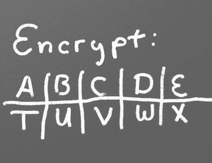

# 8.列表简介

到目前为止，这本书已经展示了四种类型的数据:

*   字符串(字符串是“字符串”的缩写，正常人认为它是文本。)
*   整数
*   浮点
*   布尔代数学体系的

Python 可以用`type`函数显示一个值是什么类型的数据。

这个`type`函数对本书中的其他编程没有用，但是演示到目前为止介绍的数据类型是很有用的。在交互式 shell 中键入以下内容。(不要新建一个窗口，把这个作为程序打进去；没用的。)

`type(3)`

`type(3.145)`

`type("Hi there")`

`type(True)`

`>>> type(3)`

`<class ’int’>`

`>>> type(3.145)`

`<class ’float’>`

`>>> type("Hi there")`

`<class ’str’>`

`>>> type(True)`

`<class ’bool’>`

也可以对变量使用`type`函数来查看变量中的数据类型。

`x = 3`

`type(x)`

要收集的硬币不止一枚？使用列表！

本章介绍的两种新的数据类型是列表和元组。列表类似于另一种叫做数组的数据结构。列表可以调整大小，但数组不能。数据结构的课程会教你细节，但这超出了本书的范围。尝试在交互式 Python shell 中运行以下命令，并查看显示的内容:

`type(  (2, 3, 4, 5) )`

`type(  [2, 3, 4, 5] )`

## 使用列表

你已经创建了购物清单、待办事项清单、遗愿清单，但是你如何在电脑上创建一个清单呢？

甚至计算机也使用列表

使用 IDLE 的命令行尝试这些示例。要创建列表并将其打印出来，请尝试以下方法:

`>>> x = [1,2]`

`>>> print(x)`

`[1, 2]`

要打印列表中的单个元素:

`>>> print(x[0])`

`1`

这个带有项目位置的数字称为索引。请注意，列表位置从零开始。所以一个有 10 个元素的列表或数组在 spot [10]中没有元素。只有斑点[0]到[9]。创建一个包含 10 个条目的列表，却没有第 10 个条目，这可能会非常令人困惑，但是大多数计算机语言都是从 0 开始计数，而不是从 1 开始计数。

将列表想象成一个盛放数字的冰块托盘，如下图所示。这些值存储在每个托盘点内，写在托盘侧面的是从零开始的数字，用于标识每个点的位置。

不要混淆指数和价值！

请记住，在处理数字列表时，需要考虑两组数字:位置和值。位置，也称为索引，是指值所在的位置。该值是存储在该位置的实际数字。当使用列表或数组时，一定要考虑是否需要位置或值。

给定位置很容易得到值，但是给定值很难得到位置。[第 16 章](16.html)致力于回答如何找到特定值的位置。

列表就像冰块托盘

程序可以给列表中的单个元素赋值。在下面的例子中，位置 0(不是 1)的第一个点被指定为数字 22。

`>>> x[0] = 22`

`>>> print(x)`

`[22, 2]`

此外，程序可以创建一个元组。这种数据类型的工作方式类似于列表，但有两个不同之处。首先，它是用圆括号而不是方括号创建的。第二，元组一旦创建就不可能改变。见下文:

`>>> x = (1, 2)`

`>>> print(x)`

`(1, 2)`

`>>> print(x[0])`

`1`

`>>> x[0] = 22`

`Traceback (most recent call last):`

`File "<pyshell#18>", line 1, in <module>`

`x[0] = 22`

`TypeError: ’tuple’ object does not support item assignment`

`>>>`

从上面代码的输出可以看出，我们不能给元组中的一个项赋值。为什么我们想要这个限制？首先，如果计算机知道值不会改变，它可以运行得更快。第二，一些我们不想改变的列表，比如红色的 RGB 颜色列表。红色不会改变；因此，不可变元组是更好的选择。

## 遍历列表

如果程序需要遍历列表中的每一项，比如打印出来，有两种类型的`for`循环可以做到这一点。

第一种在循环中迭代每一项的方法是使用 for-each 循环。这种类型的循环接受一组项，并对每个项循环一次代码。它将获取该项的一个副本，并将其存储在一个变量中进行处理。

命令的格式:`for`项目 _ 变量`in`列表 _ 名称`:`

以下是一些例子:

`my_list = [101, 20, 10, 50, 60]`

`for item in my_list:`

`print(item)`

`101`

`20`

`10`

`50`

`60`

程序也可以在列表中存储字符串:

`my_list = ["Spoon", "Fork", "Knife"]`

`for item in my_list:`

`print(item)`

`Spoon`

`Knife`

`Fork`

列表甚至可以包含其他列表。这将遍历主列表中的每一项，但不遍历子列表中的每一项。

`my_list = [ [2,3], [4,3], [6,7] ]`

`for item in my_list:`

`print(item)`

`[2,3]`

`[4,3]`

`[6,7]`

另一种遍历列表的方法是使用索引变量并直接访问列表，而不是通过每个条目的副本。为了使用索引变量，程序从 0 开始计数，直到列表的长度。如果有 10 个元素，循环必须从 0 到 9，总共 10 个元素。

列表的长度可以通过使用`len`函数得到。将它与`range`函数结合起来，允许程序遍历整个列表。

`my_list = [101, 20, 10, 50, 60]`

`for i in range(len(my_list)):`

`print(my_list[i])`

`101`

`20`

`10`

`50`

`60`

这种方法更复杂，但也更强大。因为我们直接使用列表元素，而不是副本，所以列表可以被修改。for-each 循环不允许修改原始列表。

## 添加到列表

通过使用`append`命令，可以向列表(而不是元组)添加新项目。例如:

`my_list = [2, 4, 5, 6]`

`print(my_list)`

`my_list.append(9)`

`print(my_list)`

`[2, 4, 5, 6]`

`[2, 4, 5, 6, 9]`

附注:如果追加时的性能是一个问题，那么理解一个列表是如何实现的就非常重要了。例如，如果一个列表被实现为数组数据类型，那么将一个条目添加到列表中就很像在一个装满鸡蛋的纸盒中添加一个新鸡蛋。一个新的鸡蛋纸盒必须有 13 个点。然后把 12 个鸡蛋挪过去。然后加入第 13 个鸡蛋。最后旧的鸡蛋纸盒被回收。因为这可能发生在函数的幕后，程序员可能会忘记这一点，让计算机做所有的工作。简单地告诉计算机制作一个有足够斑点的鸡蛋盒会更有效率。幸运的是，Python 没有将 list 实现为数组数据类型。但重要的是要注意你下学期的数据结构课，并了解所有这些是如何工作的。

要从头开始创建列表，需要创建一个空白列表，然后使用 append 函数。本示例根据用户输入创建一个列表:

`my_list = [] # Empty list`

`for i in range(5):`

`userInput = input( "Enter an integer: ")`

`userInput = int( userInput )`

`my_list.append(userInput)`

`print(my_list)`

`Enter an integer: 4`

`[4]`

`Enter an integer: 5`

`[4, 5]`

`Enter an integer: 3`

`[4, 5, 3]`

`Enter an integer: 1`

`[4, 5, 3, 1]`

`Enter an integer: 8`

`[4, 5, 3, 1, 8]`

如果一个程序需要创建一个具有相同值的特定长度的数组，一个简单的技巧是使用下面的代码:

`# Create an array with 100 zeros.`

`my_list = [0] * 100`

## 汇总或修改列表

创建数组的累计是一种常见的操作。这是如何做到的:

`# Copy of the array to sum`

`my_list = [5,76,8,5,3,3,56,5,23]`

`# Initial sum should be zero`

`list_total = 0`

`# Loop from 0 up to the number of elements`

`# in the array:`

`for i in range(len(my_list)):`

`# Add element 0, next 1, then 2, etc.`

`list_total += my_list[i]`

`# Print the result`

`print(list_total)`

同样的事情可以通过使用`for`循环迭代数组来完成，而不是通过一个范围来计数:

`# Copy of the array to sum`

`my_list = [5, 76, 8, 5, 3, 3, 56, 5, 23]`

`# Initial sum should be zero`

`list_total = 0`

`# Loop through array, copying each item in the array into`

`# the variable named item.`

`for item in my_list:`

`# Add each item`

`list_total += item`

`# Print the result`

`print(list_total)`

数组中的数字也可以通过使用`for`循环来改变:

`# Copy of the array to modify`

`my_list = [5, 76, 8, 5, 3, 3, 56, 5, 23]`

`# Loop from 0 up to the number of elements`

`# in the array:`

`for i in range(len(my_list)):`

`# Modify the element by doubling it`

`my_list[i] = my_list[i] * 2`

`# Print the result`

`print(my_list)`

然而，第 2 版不能将数组中的值加倍。为什么？因为一个`item`是数组中一个元素的副本。下面的代码是副本的两倍，而不是原始的数组元素。

`# Copy of the array to modify`

`my_list = [5, 76, 8, 5, 3, 3, 56, 5, 23]`

`# Loop through each element in myArray`

`for item in my_list:`

`# This doubles item, but does not change the array`

`# because item is a copy of a single element.`

`item = item * 2`

`# Print the result`

`print(my_list)`

## 分割字符串

字符串实际上是字符列表。它们可以像列表一样被处理，每个字母是一个单独的条目。使用两个版本的`x`运行以下代码:

`x = "This is a sample string"`

`#x = "0123456789"`

`print("x=", x)`

`# Accessing a single character`

`print("x[0]=", x[0])`

`print("x[1]=", x[1])`

`# Accessing from the right side`

`print("x[-1]=", x[-1])`

`# Access 0-5`

`print("x[:6]=", x[:6])`

`# Access 6`

`print("x[6:]=", x[6:])`

`# Access 6-8`

`print("x[6:9]=", x[6:9])`

Python 中的字符串可以和一些数学运算符一起使用。尝试下面的代码，看看 Python 做了什么:

`a = "Hi"`

`b = "There"`

`c = "!"`

`print(a + b)`

`print(a + b + c)`

`print(3 * a)`

`print(a * 3)`

`print((a * 2) + (b * 2))`

有可能得到一个字符串的长度。也可以用任何类型的数组来实现这一点。

`a = "Hi There"`

`print(len(a))`

`b = [3, 4, 5, 6, 76, 4, 3, 3]`

`print(len(b))`

因为字符串是一个数组，所以程序可以像数组一样遍历每个字符元素:

`for character in "This is a test.":`

`print(character)`

练习:从以下代码开始:

`months = "JanFebMarAprMayJunJulAugSepOctNovDec"`

`n = int(input("Enter a month number: "))`

打印用户输入的月份编号的三个月缩写。(计算字符串中的起始位置，然后使用我们刚刚学习的信息打印出正确的子字符串。)

## 秘密代码

这段代码分别打印出字符串中的每个字母:

`plain_text = "This is a test. ABC abc"`

`for c in plain_text:`

`print(c, end=" ")`

计算机实际上并不在内存中存储字符串的字母；电脑储存一系列数字。每个数字代表一个字母。计算机用来将数字转换成字母的系统称为 Unicode。编码的全称是通用字符集转换格式 8 位，通常缩写为`UTF-8`。

Unicode 图表包含使用数字 0-127 的西方字母表。每个西文字母代表一个字节的内存。其他字母，如西里尔字母，可以用多个字节来表示每个字母。Unicode 图表的部分副本如下:

<colgroup><col> <col> <col> <col> <col> <col> <col> <col></colgroup> 
| 价值 | 性格；角色；字母 | 价值 | 性格；角色；字母 | 价值 | 性格；角色；字母 | 价值 | 性格；角色；字母 |
| --- | --- | --- | --- | --- | --- | --- | --- |
| Forty | （ | Sixty-one | = | Eighty-two | 稀有 | One hundred and three | g |
| Forty-one | ) | Sixty-two | > | Eighty-three | S | One hundred and four | h |
| forty-two | * | Sixty-three | ？ | Eighty-four | T | One hundred and five | 我 |
| Forty-three | + | Sixty-four | @ | eighty-five | U | One hundred and six | j |
| forty-four | , | Sixty-five | A | Eighty-six | V | One hundred and seven | k |
| Forty-five | - | Sixty-six | B | Eighty-seven | W | One hundred and eight | l |
| Forty-six | 。 | Sixty-seven | C | Eighty-eight | X | One hundred and nine | m |
| Forty-seven | / | sixty-eight | D | eighty-nine | Y | One hundred and ten | n |
| Forty-eight | Zero | sixty-nine | E | Ninety | Z | One hundred and eleven | o |
| forty-nine | one | Seventy | F | Ninety-one | [ | One hundred and twelve | p |
| Fifty | Two | Seventy-one | G | Ninety-two | \ | One hundred and thirteen | q |
| Fifty-one | three | seventy-two | H | Ninety-three | ] | One hundred and fourteen | r |
| fifty-two | four | Seventy-three | 我 | Ninety-four | ^ | One hundred and fifteen | s |
| Fifty-three | five | Seventy-four | J | Ninety-five | _ | One hundred and sixteen | t |
| Fifty-four | six | Seventy-five | K | Ninety-six | ` | One hundred and seventeen | u |
| Fifty-five | seven | Seventy-six | L | Ninety-seven | a | One hundred and eighteen | v |
| fifty-six | eight | Seventy-seven | M | Ninety-eight | b | One hundred and nineteen | w |
| Fifty-seven | nine | seventy-eight | 普通 | Ninety-nine | c | One hundred and twenty | x |
| Fifty-eight | ： | Seventy-nine | O | One hundred | d | One hundred and twenty-one | y |
| Fifty-nine | ； | Eighty | P | One hundred and one | e | One hundred and twenty-two | z |
| Sixty | < | Eighty-one | Q | One hundred and two | f |   |   |

有关 ASCII(与西方字母表的 Unicode 具有相同的值)的更多信息，请参见: [`http://en.wikipedia.org/wiki/ASCII`](http://en.wikipedia.org/wiki/ASCII)

要看解释 Unicode 之美的视频，请看这里: [`http://hackaday.com/2013/09/27/utf-8-the-most-elegant-hack`](http://hackaday.com/2013/09/27/utf-8-the-most-elegant-hack/)

下一组代码使用 UTF-8 将前面示例中的每个字母转换为它的序数值:

`plain_text = "This is a test. ABC abc"`

`for c in plain_text:`

`print(ord(c), end=" ")`

下一个程序获取每个 UTF-8 值并加 1。然后，它打印新的 UTF-8 值，然后将该值转换回字母。

`plain_text = "This is a test. ABC abc"`

`for c in plain_text:`

`x = ord(c)`

`x = x + 1`

`c2 = chr(x)`

`print(c2, end="")`

下一个代码清单获取每个 UTF-8 值并加 1，然后将该值转换回字母。

`# Sample Python/Pygame Programs`

`#`[`http://programarcadegames.com/`T3】](http://programarcadegames.com/)

`# Explanation video:`[`http://youtu.be/sxFIxD8Gd3A`T3】](http://youtu.be/sxFIxD8Gd3A)

`plain_text = "This is a test. ABC abc"`

`encrypted_text = ""`

`for c in plain_text:`

`x = ord(c)`

`x = x + 1`

`c2 = chr(x)`

`encrypted_text = encrypted_text + c2`

`print(encrypted_text)`

最后，最后一段代码获取每个 UTF-8 值并从中减去 1，然后将该值转换回字母。通过将前一个程序的输出提供给这个程序，它可以作为前一个例子编码的文本的解码器。

`# Sample Python/Pygame Programs`

`#`[`http://programarcadegames.com/`T3】](http://programarcadegames.com/)

`# Explanation video:`[`http://youtu.be/sxFIxD8Gd3A`T3】](http://youtu.be/sxFIxD8Gd3A)

`encrypted_text = "Uijt!jt!b!uftu/!BCD!bcd"`

`plain_text = ""`

`for c in encrypted_text:`

`x = ord(c)`

`x = x - 1`

`c2 = chr(x)`

`plain_text = plain_text + c2`

`print(plain_text)`

## 关联数组

Python 并不局限于使用数字作为数组索引。也可以使用关联数组。关联数组的工作方式如下:

`# Create an empty associative array`

`# (Note the curly braces.)`

`x = {}`

`# Add some stuff to it`

`x["fred"] = 2`

`x["scooby"] = 8`

`x["wilma"] = 1`

`# Fetch and print an item`

`print(x["fred"])`

对于这本书来说，你并不真的需要关联数组，但是我认为有必要指出这是可能的。

## 回顾

### 多项选择测验

What code will print out the first element? `x = [1, 2, 3, 4, 5]` `print(x[0])`   `print(x[1])`   `print(x(0))`   `print(x(1))`   `print(x)`   `print([1])`     What code will change the first element? `x = [1, 2, 3, 4, 5]` `x[0] = 100`   `x = 100`   `x[1] = 100`   `[1] = 100`   `x(1) = 100`     What code will print each element of `my_list`? `my_list = [101, 20, 10, 50, 60]` `for item in my_list:`     `print(item)`   `for item in my_list:` `print(my_list)`   `for item in range(my_list):` `print(item)`   `for my_list in item:` `print(item)`     What code will add a new element to this list? `my_list = [5, 6, 7]` `my_list[8]`   `my_list(8)`   `my_list.add(8)`   `my_list.append(8)`   `my_list.add[8]`     What code will sum all the elements in this list? `my_array = [5, 76, 8, 5, 3, 3, 56, 5, 23]` `array_total = 0` `for i in range(len(my_array)):`     `array_total += my_array[i]`   `array_total = 0` `for i in range(my_array):`     `array_total += my_array[i]`   `array_total = 0` `for i in range(len(my_array)):`     `array_total += i`   `i = 0` `for i in range(len(my_array)):`     `array_total += my_array`   `i = 0` `for i in my_array:`     `array_total += my_array(i)`     What does this code print? `my_array = [2, 4, 6]` `for i in range(3):`         `print(my_array)` `0` `1` `2`   `1` `2` `3`   `[2, 4, 6]` `[2, 4, 6]` `[2, 4, 6]`   `246`   `[2, 4, 6]`   `2` `4` `6`     What does this code print? `my_array = [2, 4, 6]` `for i in range(3):`         `print(my_array[0])`

*   `0``1`T2】
*   `2``2`T2】
*   `[2, 4, 6]``[2, 4, 6]`T2】
*   `246`
*   `[2, 4, 6]`
*   `2``4`T2】

  What does this code print? `my_array = [2, 4, 6]` `for i in range(3):`         `print(i)`

*   `0``1`T2】
*   `2``2`T2】
*   `[2, 4, 6]``[2, 4, 6]`T2】
*   `246`
*   `[2, 4, 6]`
*   `2``4`T2】

### 简答工作表

在下面的问题中，如果一个错误阻止了一个例子的运行，一定要在结果中提到它。还有，要精确。如果程序打印[1]，不会说它打印 1。

List the four types of data we’ve covered, and give an example of each:   What does this code print out? For this and the following problems, make sure you understand WHY it prints what it does. You don’t have to explain it, but if you don’t understand why, make sure to ask. Otherwise you are wasting your time doing these. `my_list = [5, 2, 6, 8, 101]` `print(my_list[1])` `print(my_list[4])` `print(my_list[5])`   What does this code print out? `my_list=[5, 2, 6, 8, 101]` `for my_item in my_list:`     `print(my_item)`   What does this code print out? `my_list1 = [5, 2, 6, 8, 101]` `my_list2 = (5, 2, 6, 8, 101)` `my_list1[3] = 10` `print(my_list1)` `my_list2[2] = 10` `print(my_list2)`   What does this code print out? `my_list = [3 * 5]` `print(my_list)` `my_list = [3] * 5` `print(my_list)`   What does this code print out? `my_list = [5]` `for i in range(5):`         `my_list.append(i)` `print(my_list)`   What does this code print out? `print(len("Hi"))` `print(len("Hi there."))` `print(len("Hi") + len("there."))` `print(len("2"))` `print(len(2))`   What does this code print out? `print("Simpson" + "College")` `print("Simpson" + "College"[1])` `print( ("Simpson" + "College")[1] )`   What does this code print out? `word = "Simpson"` `for letter in word:`     `print(letter)`   What does this code print out? `word = "Simpson"` `for i in range(3):`     `word += "College"` `print(word)`   What does this code print out? `word = "Hi" * 3` `print(word)`   What does this code print out? `my_text = "The quick brown fox jumped over the lazy dogs."` `print("The 3rd spot is: " + my_text[3])` `print("The -1 spot is: " + my_text[-1])`   What does this code print out? `s = "0123456789"` `print(s[1])` `print(s[:3])` `print(s[3:])`   Write a loop that will take in a list of five numbers from the user, adding each to an array. Then print the array. Try doing this without looking at the book.   Write a program that take an array like the following, and print the average. Use the `len` function, don’t just use 15, because that won’t work if the list size changes. (There is a `sum` function I haven’t told you about. Don’t use that. Sum the numbers individually as shown in the chapter.) `my_list = [3,12,3,5,3,4,6,8,5,3,5,6,3,2,4]`  

### 锻炼

查看附录中本章附带的“冒险”练习。