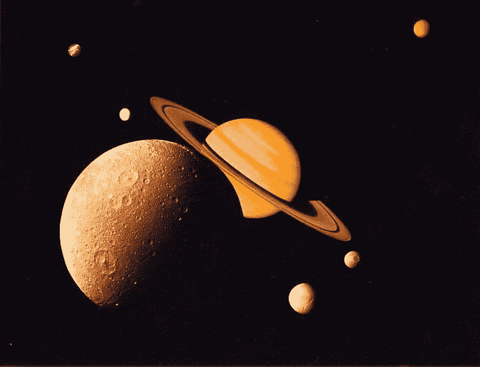
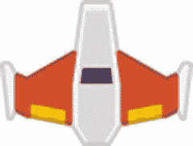
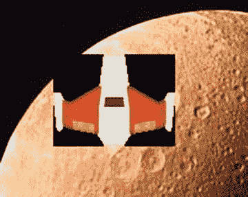
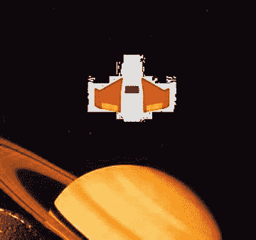

# 12.位图图形和声音

为了超越绘制圆形和矩形所提供的简单形状，我们的程序需要处理位图图形的能力。位图图形可以是从绘图程序创建和保存的照片或图像。

但是图形是不够的。游戏也需要声音！这一章展示了如何在你的游戏中加入图像和声音。

## 将程序存储在文件夹中

到目前为止，我们制作的程序只涉及一个文件。现在我们包括图像和声音，有更多的文件是我们程序的一部分。很容易将这些文件与我们正在制作的其他程序混在一起。保持一切整洁和独立的方法是将这些程序放入各自的文件夹中。在开始任何这样的项目之前，点击“新建文件夹”按钮，并使用该新文件夹作为存放所有新文件的地方，如下图所示。

创建新文件夹

## 设置背景图像

需要为你的游戏设置背景图片？找到如下图所示的图像。如果你在网络浏览器上在线浏览，你通常可以右键点击一张图片，然后把它保存到电脑上。将图像保存到我们刚刚为游戏创建的文件夹中。

确保不使用有版权的图片！使用反向图像搜索可以很容易地再次确认你没有复制它。

背景图像

游戏中使用的任何位图图像都应该已经根据它在屏幕上的显示方式进行了调整。不要从高分辨率相机拍摄 5000x5000 像素的图像，然后试图将其加载到只有 800x600 的窗口中。在 Python 程序中使用图像之前，使用图形程序(甚至 MS Paint 也可以)并调整图像大小/裁剪图像。

加载图像是一个简单的过程，只需要一行代码。在那一行代码中发生了很多事情，所以对这一行的解释将分为三个部分。我们的`load`命令的第一个版本将加载一个名为`saturn_family1.jpg`的文件。该文件必须位于 Python 程序所在的同一目录中，否则计算机将找不到它:

`pygame.image.load("saturn_family1.jpg")`

该代码可以加载图像，但是我们没有办法引用和显示该图像！我们需要一个与`load()`命令返回的值相等的变量集。在 load 命令的下一个版本中，我们创建了一个名为`background_image`的新变量。第二版见下文:

`background_image = pygame.image.load("saturn_family1.jpg")`

最后，需要将图像转换成 pygame 更容易处理的格式。为此，我们将`.convert()`添加到命令中来调用 convert 函数。函数`.convert()`是`Image`类中的一个方法。我们将在第 13 章中详细讨论类、对象和方法。

所有的图片都应该使用类似下面的代码来加载。只需根据需要更改变量名和文件名。

`background_image = pygame.image.load("saturn_family1.jpg").convert()`

加载图像应该在主程序循环之前完成。虽然有可能在主程序循环中加载它，但这将导致程序每秒钟从磁盘获取图像 20 次左右。这完全没有必要。只需要在程序启动时做一次。

使用`blit`命令显示图像。这将图像位传送到屏幕上。在第六章中，我们已经在游戏窗口显示文本时使用过这个命令。

`blit`命令是`screen`变量中的一个方法，所以我们需要通过`screen.blit`来启动我们的命令。接下来，我们需要将图像传递给 blit，以及在哪里 blit 它。这个命令应该在循环内部执行，这样图像就可以在每一帧中绘制出来。见下文:

`screen.blit(background_image, [0, 0])`

这段代码从(0，0)开始将保存在`background_image`中的图像传送到屏幕上。

## 移动图像

现在我们想加载一个图像并在屏幕上移动它。我们将从一艘简单的橙色宇宙飞船开始。你可以从 [`http://kenney.nl/`](http://kenney.nl/) 那里得到这个和许多其他伟大的资产。见下图。这艘船的图片可以从这本书的网站上下载，或者你也可以在。你喜欢的白色或黑色背景的 png。不要用. jpg。

玩家形象

为了加载图像，我们需要使用与背景图像相同的命令。在这种情况下，我假设文件保存为`player.png`。

`player_image = pygame.image.load("player.png").convert()`

在主程序循环中，检索鼠标坐标，并将其传递给另一个`blit`函数作为绘制图像的坐标:

`# Get the current mouse position. This returns the position`

`# as a list of two numbers.`

`player_position = pygame.mouse.get_pos()`

`x = player_position[0]`

`y = player_position[1]`

`# Copy image to screen:`

`screen.blit(player_image, [x, y])`

这说明了一个问题。该图像是一艘带有纯黑背景的宇宙飞船。所以当图像被绘制时，程序显示下图。

这张图片的纯黑背景很明显

我们只要飞船，不要长方形背景！但是我们可以加载的所有图像都是矩形，那么我们如何只显示图像中我们想要的部分呢？解决这个问题的方法是告诉程序让一种颜色透明而不显示。这可以在装载后立即完成。下面的代码使黑色(假设黑色已经被定义为一个变量)透明:

`player_image.set_colorkey(BLACK)`

这适用于大多数以结尾的文件。这对于大多数人来说并不太好。jpg 文件。jpeg 图像格式非常适合保存照片，但作为使图像变小的算法的一部分，它确实会微妙地改变图像。图像输入。gif 和。png 也是压缩的，但是这些格式中使用的算法不会改变图像。格式。bmp 根本没有压缩，它会产生巨大的文件。因为。jpg 格式改变了格式，这意味着不是所有的背景颜色都会完全一样。在下一张图中，飞船被保存为白色背景的 jpeg 格式。船周围的白色并不完全是(255，255，255)，而是非常接近。

JPEG 压缩伪像

如果你要挑选一个透明的图像，选择. gif 或. png。这些是图形艺术类型图像的最佳格式。照片应该是. jpg。请记住，仅仅通过将文件扩展名重命名为. png 是不可能将. jpg 更改为另一种格式的。即使您将其命名为其他格式，它仍然是. jpg。它需要在图形程序中进行转换，以将其转换为不同的格式。但是一旦转换成. jpg 格式，它就被修改了，转换成. png 格式不会修复这些修改。

这里有三个很好的地方可以找到在您的程序中使用的免费图像:

*   [T4`http://kenney.nl`；](http://kenney.nl/)[`http://opengameart.org`](http://opengameart.org/)；还有 [`http://hasgraphics.com` /](http://hasgraphics.com/)

## 声音

在这一节中，我们将在点击鼠标按钮时播放激光声音。这个声音最初来自 Kenney.nl，你可以在这里下载并保存声音:`ProgramArcadeGames.com/python_examples/en/laser5.ogg`

像图像一样，声音在使用前必须加载。这应该在主程序循环之前进行一次。以下命令加载一个声音文件，并创建一个名为`click_sound`的变量来引用它:

`click_sound = pygame.mixer.Sound("laser5.ogg")`

我们可以使用以下命令来播放声音:

`click_sound.play()`

但是我们把这个命令放在哪里呢？如果我们把它放在主程序循环中，它将每秒播放 20 次左右。真的很烦。我们需要一个触发器。一些动作发生，然后我们播放声音。例如，当用户用下面的代码点击鼠标按钮时，可以播放这个声音:

`for event in pygame.event.get():`

`if event.type == pygame.QUIT:`

`done = True`

`elif event.type == pygame.MOUSEBUTTONDOWN:`

`click_sound.play()`

未压缩的声音文件通常以`.wav`结尾。这些文件比其他格式的文件大，因为没有对它们运行算法来使它们变小。还有曾经流行的`.mp3`格式，尽管这种格式有专利，可能使它不适合某些应用。另一种可以免费使用的格式是以`.ogg`结尾的 OGG Vorbis 格式。

Pygame 并不播放互联网上能找到的所有`.wav`文件。如果你有一个不工作的文件，你可以试着用程序 [`http://sourceforge.net/projects/audacity`](http://sourceforge.net/projects/audacity) 把它转换成以`.ogg`结尾的 ogg-vorbis 类型的声音文件。这种文件格式对于 pygame 来说很小也很可靠。

如果你想在你的节目中播放背景音乐，请查看在线示例部分:

`ProgramArcadeGames.com/en/python_examples/f.php?file=background_music.py`

请注意，您不能将受版权保护的音乐与您的程序一起再分发。即使你制作了一个以受版权保护的音乐为背景的视频，YouTube 和类似的视频网站也会标记你侵犯版权。

找到在您的程序中使用的免费声音的好地方:

*   [`OpenGameArt.org`](http://opengameart.org/)`and`[`www.freesound.org`T6】](http://www.freesound.org/)

## 完整列表

`"""`

`Sample Python/Pygame Programs`

[T2`http://programarcadegames.com/`](http://programarcadegames.com/)

`Explanation video:`[`http://youtu.be/4YqIKncMJNs`T3】](http://youtu.be/4YqIKncMJNs)

`Explanation video:`[`http://youtu.be/ONAK8VZIcI4`T3】](http://youtu.be/ONAK8VZIcI4)

`Explanation video:`[`http://youtu.be/_6c4o41BIms`T3】](http://youtu.be/_6c4o41BIms)

`"""`

`import pygame`

`# Define some colors`

`WHITE = (255, 255, 255)`

`BLACK = (0, 0, 0)`

`# Call this function so the Pygame library can initialize itself`

`pygame.init()`

`# Create an 800x600 sized screen`

`screen = pygame.display.set_mode([800, 600])`

`# This sets the name of the window`

`pygame.display.set_caption(’CMSC 150 is cool’)`

`clock = pygame.time.Clock()`

`# Before the loop, load the sounds:`

`click_sound = pygame.mixer.Sound("laser5.ogg")`

`# Set positions of graphics`

`background_position = [0, 0]`

`# Load and set up graphics.`

`background_image = pygame.image.load("saturn_family1.jpg").convert()`

`player_image = pygame.image.load("playerShip1_orange.png").convert()`

`player_image.set_colorkey(BLACK)`

`done = False`

`while not done:`

`for event in pygame.event.get():`

`if event.type == pygame.QUIT:`

`done = True`

`elif event.type == pygame.MOUSEBUTTONDOWN:`

`click_sound.play()`

`# Copy image to screen:`

`screen.blit(background_image, background_position)`

`# Get the current mouse position. This returns the position`

`# as a list of two numbers.`

`player_position = pygame.mouse.get_pos()`

`x = player_position[0]`

`y = player_position[1]`

`# Copy image to screen:`

`screen.blit(player_image, [x, y])`

`pygame.display.flip()`

`clock.tick(60)`

`pygame.quit()`

## 回顾

### 多项选择测验

Should the following line go inside, or outside of the main program loop? `background_image = pygame.image.load("saturn_family1.jpg").convert()` Outside the loop, because it isn’t a good idea to load the image from the disk 20 times per second.   Inside the loop, because the background image needs to be redrawn every frame.     In the following code, what does the `[0, 0]` do? `screen.blit(background_image, [0, 0])` Default dimensions of the bitmap.   Specifies the x and y of the top left coordinate of where to start drawing the bitmap on the screen.   Draw the bitmap in the center of the screen.     Should the following line go inside or outside of the main program loop? `screen.blit(background_image, [0, 0])` Outside the loop, because it isn’t a good idea to load the image from the disk 20 times per second.   Inside the loop, because the background image needs to be redrawn every frame.     Given this line of code, what code will get the x value of the current mouse position? `player_position = pygame.mouse.get_pos()` `x = player_position[x]`   `x = player_position[0]`   `x = player_position.x`   `x[0] = player_position`     What types of image file formats are loss-less (i.e., they do not change the image)? Choose the best answer. `png, jpg, gif`   `png, gif`   `png`   `jpg`   `gif`   `jpg, gif`     What does this code do? `player_image.set_colorkey(WHITE)` Makes the bitmap background white.   Sets all the white pixels to be transparent instead.   Sets the next color to be drawn to white.   Clears the screen to a white color.   Draws the player image in white.     What is wrong with section of code? `for event in pygame.event.get():`     `if event.type == pygame.QUIT:`         `done=True`     `if event.type == pygame.MOUSEBUTTONDOWN:`         `click_sound = pygame.mixer.Sound("click.wav")`         `click_sound.play()` Pygame doesn’t support .wav files.   The colorkey hasn’t been set for `click_sound` yet.   Sounds should be loaded at the start of the program, not in the main program loop.   Sounds should not be played in a main program loop.    

### 简答工作表

This is about the time that many people learning to program run into problems with Windows hiding file extensions. Briefly explain how to make Windows show file extensions. If you don’t remember, go back to [Chapter 1](01.html) to see the details.   For the following file extensions:

*   。使用 jpeg 文件交换格式存储的编码图像文件扩展名
*   。声音资源文件
*   。可交换的图像格式
*   。巴布亚新几内亚
*   。格式
*   。位图文件的扩展名
*   . mp3

…match the extension to the category it best fits:

*   照片
*   图形艺术
*   未压缩图像
*   歌曲和音效
*   未压缩的声音

  Should an image be loaded inside the main program loop or before it? Should the program `blit` the image in the main program loop or before it?   How can a person change an image from one format to another? For example, how do you change a .jpg to a .gif? Why does changing the file extension not really work? (Ask if you can’t figure it out.)   Explain why an image that was originally saved as a .jpg doesn’t work with setting a background color even after it is converted to a .png.   Briefly explain how to play background music in a game and how to automatically start playing a new song when the current song ends.  

### 锻炼

查看附录中本章附带的练习“位图图形和用户控制”。