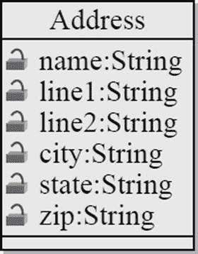
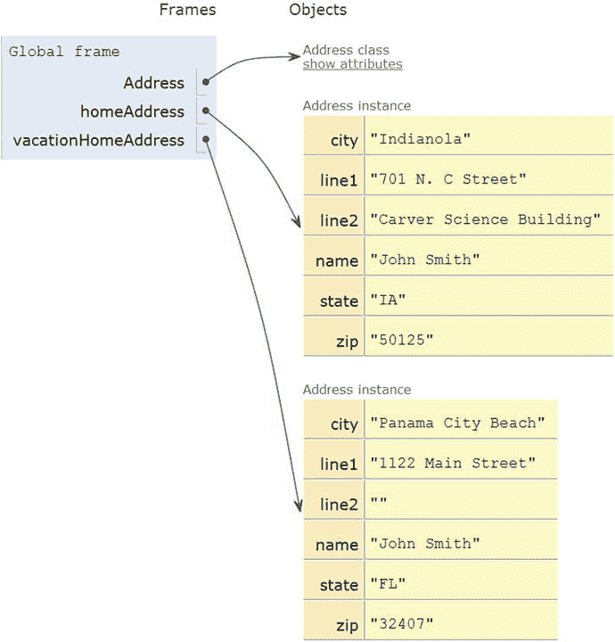
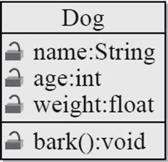
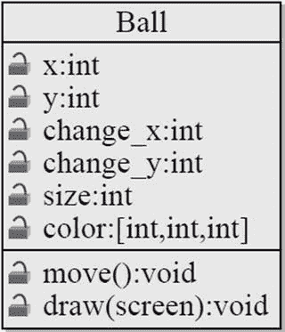
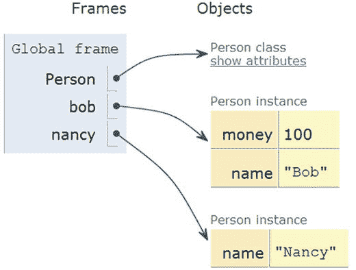
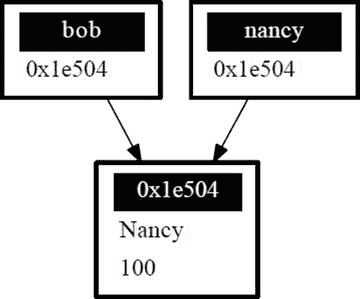
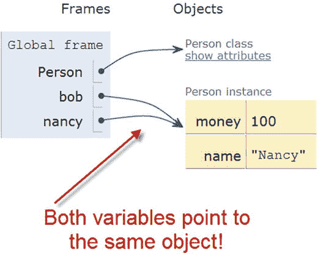
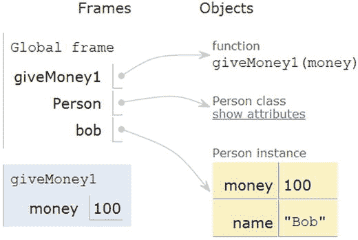
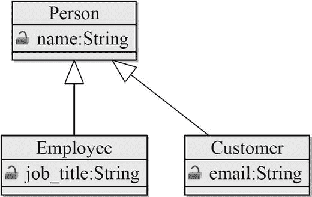

# 13.课程简介

类和对象是非常强大的编程工具。它们使编程更容易。事实上，您已经熟悉了类和对象的概念。类是对象的分类。比如人或者形象。对象是一个类的特定实例。就像玛丽是一个人的实例。

对象有属性，比如一个人的名字、身高和年龄。对象也有方法。方法定义了一个对象能做什么:比如跑、跳或坐。

## 为什么要学习课程？

冒险游戏中的每个角色都需要数据:名字、位置、实力；他们举起他们的手臂；他们朝哪个方向前进；等等。再加上那些角色做事。他们跑，跳，打，和说话。

如果没有类，我们存储这些数据的 Python 代码可能看起来像这样:

`name = "Link"`

`sex = "Male"`

`max_hit_points = 50`

`current_hit_points = 50`

为了处理这个字符，我们需要将数据传递给一个函数:

`def display_character(name, sex, max_hit_points, current_hit_points):`

`print(name, sex, max_hit_points, current_hit_points)`

现在想象一下，创建一个程序，为我们游戏中的每个角色、怪物和物品设置一组这样的变量。然后我们需要创建处理这些项目的函数。我们现在已经陷入了数据的泥潭。突然间，这听起来一点也不好玩了。

但是等等，更糟的是！随着我们游戏的扩展，我们可能需要添加新的领域来描述我们的角色。在这种情况下，我们添加了`max_speed`:

`name = "Link"`

`sex = "Male"`

`max_hit_points = 50`

`current_hit_points = 50`

`max_speed = 10`

`def display_character(name, sex, max_hit_points, current_hit_points, max_speed):`

`print(name, sex, max_hit_points, current_hit_points)`

在上面的例子中，只有一个函数。但是在一个大型的视频游戏中，我们可能有数百个函数来处理主角。添加一个新的字段来帮助描述一个角色有什么和能做什么，这将要求我们遍历这些函数中的每一个，并将其添加到参数列表中。那将是大量的工作。也许我们需要给不同类型的角色添加`max_speed`，比如怪物。需要有更好的方法。不知何故，我们的程序需要将这些数据字段打包，以便于管理。

## 定义和创建简单的类

管理多个数据属性的更好方法是定义一个包含所有信息的结构。然后我们可以给这些信息起一个名字，比如字符或地址。在 Python 和任何其他现代语言中，通过使用一个类可以很容易地做到这一点。

例如，我们可以定义一个代表游戏中角色的类:

`class Character():`

`""" This is a class that represents the main character in a game. """`

`def __init__(self):`

`""" This is a method that sets up the variables in the object. """`

`self.name = "Link"`

`self.sex = "Male"`

`self.max_hit_points = 50`

`self.current_hit_points = 50`

`self.max_speed = 10`

`self.armor_amount = 8`

这是另一个例子。我们定义一个类来保存地址的所有字段:

`class Address():`

`""" Hold all the fields for a mailing address. """`

`def __init__(self):`

`""" Set up the address fields. """`

`self.name = ""`

`self.line1 = ""`

`self.line2 = ""`

`self.city = ""`

`self.state = ""`

`self.zip = ""`

在上面的代码中，`Address`是类名。类中的变量，如`name`和`city`，称为属性或字段。(注意声明一个类和声明一个函数的异同。)

与函数和变量不同，类名应该以大写字母开头。虽然可以用小写字母开始一个类，但这不被认为是好的做法。

被称为构造函数的特殊函数中的`def __init__(self):`在创建类时自动运行。我们稍后会详细讨论构造函数。

这个`self.`有点像代词 my。在课堂上，我们谈论我的名字、我的城市等等。我们不想在`Address`的类定义之外使用`self.`，来引用一个`Address`字段。为什么？因为就像代词“我的”一样，当由不同的人说时，它的意思是完全不同的人！

为了更好地可视化类以及它们之间的关系，程序员经常制作图表。`Address`类的图表如下图所示。查看类名是如何显示在顶部的，下面列出了每个属性的名称。每个属性的右边是数据类型，如字符串或整数。

类图

类代码定义了一个类，但它实际上并没有创建一个类的实例。代码告诉计算机一个地址有哪些字段，初始默认值是什么。虽然我们还没有地址。我们可以定义一个类而不创建它，就像我们可以定义一个函数而不调用它一样。要创建一个类并设置字段，请查看下面的示例:

`# Create an address`

`home_address = Address()`

`# Set the fields in the address`

`home_address.name = "John Smith"`

`home_address.line1 = "701 N. C Street"`

`home_address.line2 = "Carver Science Building"`

`home_address.city = "Indianola"`

`home_address.state = "IA"`

`home_address.zip = "50125"`

在第 2 行用`Address()`创建了一个 address 类的实例。注意类名`Address`的用法，后跟括号。变量名可以是遵循正常命名规则的任何名称。

要设置类中的字段，程序必须使用点运算符。该运算符是位于`home_address`和字段名之间的句点。查看最后 6 行如何使用点运算符来设置每个字段值。

使用类时一个非常常见的错误是忘记指定要使用的类的实例。如果只创建了一个地址，很自然地认为计算机会知道使用你所说的那个地址。然而，事实并非如此。请参见下面的示例:

`class Address():`

`def __init__(self):`

`self.name = ""`

`self.line1 = ""`

`self.line2 = ""`

`self.city = ""`

`self.state = ""`

`self.zip = ""`

`# Create an address`

`my_address = Address()`

`# Alert! This does not set the address’s name!`

`name = "Dr. Craven"`

`# This doesn’t set the name for the address either`

`Address.name = "Dr. Craven"`

`# This does work:`

`my_address.name = "Dr. Craven"`

可以创建第二个地址，并且可以使用来自两个实例的字段。请参见下面的示例(为便于阅读，添加了行号):

`001 class Address():`

`002     def __init__(self):`

`003         self.name = ""`

`004         self.line1 = ""`

`005         self.line2 = ""`

`006         self.city = ""`

`007         self.state = ""`

`008         self.zip = ""`

`009`

`010 # Create an address`

`011 home_address = Address()`

`012`

`013 # Set the fields in the address`

`014 home_address.name = "John Smith"`

`015 home_address.line1 = "701 N. C Street"`

`016 home_address.line2 = "Carver Science Building"`

`017 home_address.city = "Indianola"`

`018 home_address.state = "IA"`

`019 home_address.zip = "50125"`

`020`

`021 # Create another` `address`

`022 vacation_home_address = Address()`

`023`

`024 # Set the fields in the address`

`025 vacation_home_address.name = "John Smith"`

`026 vacation_home_address.line1 = "1122 Main Street"`

`027 vacation_home_address.line2 = ""`

`028 vacation_home_address.city = "Panama City Beach"`

`029 vacation_home_address.state = "FL"`

`030 vacation_home_address.zip = "32407"`

`031`

`032 print("The client’s main home is in " + home_address.city)`

`033 print("His vacation home is in " + vacation_home_address.city)`

第 11 行创建了第一个`Address`实例；第 22 行创建了第二个实例。变量`home_address`指向第一个实例，`vacation_home_address`指向第二个实例。

第 25–30 行设置了这个新类实例中的字段。第 32 行打印家庭地址的城市，因为`home_address`出现在点运算符之前。第 33 行打印假期地址，因为`vacation_home_address`出现在点运算符之前。

在示例中，`Address`被称为类，因为它为数据对象定义了一个新的分类。变量`home_address`和`vacation_home_address`引用对象，因为它们引用了类`Address`的实际实例。一个对象的简单定义是它是一个类的实例。像鲍勃和南希是人类类的实例。

通过使用`www.pythontutor.com`，我们可以可视化代码的执行(见下文)。有三个变量在起作用。一个指向`Address`的类定义。另外两个变量指向不同的地址对象和它们的数据。

两个地址

将大量数据字段放入一个类中，可以很容易地将数据传入和传出一个函数。在下面的代码中，该函数接受一个地址作为参数，并将其打印在屏幕上。没有必要为地址的每个字段传递参数。

`# Print an address to the screen`

`def print_address(address):`

`print(address.name)`

`# If there is a line1 in the address, print it`

`if len(address.line1) > 0:`

`print(address.line1)`

`# If there is a line2 in the address, print it`

`if len(address.line2) > 0:`

`print( address.line2 )`

`print(address.city + ", " + address.state + " " + address.zip)`

`print_address(home_address)`

`print()`

`print_address(vacation_home_address)`

## 向类中添加方法

除了属性，类还可以有方法。方法是存在于类内部的函数。扩展前面回顾问题 1 中的`Dog`类的例子，下面的代码增加了一个狗叫的方法。

`class Dog():`

`def __init__(self):`

`self.age = 0`

`self.name = ""`

`self.weight = 0`

`def bark(self):`

`print("Woof")`

方法定义包含在上面的第 7–8 行中。类中的方法定义看起来几乎和函数定义一模一样。最大的不同是在第 7 行增加了一个参数`self`。类中任何方法的第一个参数必须是`self`。即使函数不使用该参数，它也是必需的。

以下是为类创建方法时要记住的重要事项:

*   应该先列出属性，后列出方法。
*   任何方法的第一个参数都必须是`self`。
*   方法定义恰好缩进一个制表位。

调用方法的方式类似于引用对象的属性。请参见下面的示例代码。

`001 my_dog = Dog()`

`002`

`003 my_dog.name = "Spot"`

`004 my_dog.weight = 20`

`005 my_dog.age = 3`

`006`

`007 my_dog.bark()`

第 1 行创建了狗。第 3–5 行设置对象的属性。第 7 行调用了`bark`函数。注意，即使`bark`函数有一个参数`self`，调用也不会传入任何东西。这是因为第一个参数被假定为对 dog 对象本身的引用。在幕后，Python 发出了一个看起来像这样的调用:

`# Example, not actually legal`

`Dog.bark(my_dog)`

如果`bark`函数需要引用任何属性，那么它就使用`self`引用变量。例如，我们可以改变`Dog`类，这样当狗叫的时候，它也能打印出狗的名字。在下面的代码中，使用点运算符和`self`引用来访问 name 属性。

`def bark(self):`

`print("Woof says", self.name)`

属性是形容词，方法是动词。该类的绘图如下图所示。

狗类

### 示例:球类

这个示例代码可以在 Python/pygame 中用来画一个球。将所有参数包含在一个类中会使数据管理更容易。下图显示了`Ball`类的图表。

球类

`class Ball():`

`def __init__(self):`

`# --- Class Attributes ---`

`# Ball position`

`self.x = 0`

`self.y = 0`

`# Ball’s vector`

`self.change_x = 0`

`self.change_y = 0`

`# Ball size`

`self.size = 10`

`# Ball color`

`self.color = [255,255,255]`

`# --- Class Methods ---`

`def move(self):`

`self.x += self.change_x`

`self.y += self.change_y`

`def draw(self, screen):`

`pygame.draw.circle(screen, self.color, [self.x, self.y], self.size )`

下面是在主程序循环之前创建一个球并设置其属性的代码:

`theBall = Ball()`

`theBall.x = 100`

`theBall.y = 100`

`theBall.change_x = 2`

`theBall.change_y = 1`

`theBall.color = [255,0,0]`

这段代码将进入主循环来移动和绘制球:

`theBall.move()`

`theBall.draw(screen)`

## 参考

这就是我们区分真正的程序员和想要成为程序员的地方。理解类引用。看一下下面的代码:

`class Person():`

`def __init__(self):`

`self.name = ""`

`self.money = 0`

`bob = Person()`

`bob.name = "Bob"`

`bob.money = 100`

`nancy = Person()`

`nancy.name = "Nancy"`

`print(bob.name, "has", bob.money, "dollars.")`

`print(nancy.name, "has", nancy.money, "dollars.")`

上面的代码创建了 Person()类的两个实例，使用`www.pythontutor.com`我们可以在下图中可视化这两个类。

两个人

上面的代码没有什么新意。但是下面的代码可以:

`class Person():`

`def __init__(self):`

`self.name = ""`

`self.money = 0`

`bob = Person()`

`bob.name = "Bob"`

`bob.money = 100`

`nancy = bob`

`nancy.name = "Nancy"`

`print(bob.name, "has", bob.money, "dollars.")`

`print(nancy.name, "has", nancy.money, "dollars.")`

看到第 10 行和`nancy = bob`的区别了吗？

处理对象时一个常见的误解是假设变量`bob`是 Person 对象。事实并非如此。变量`bob`是对 Person 对象的引用。也就是说，它存储的是对象所在的内存地址，而不是对象本身。

如果`bob`实际上是对象，那么第 9 行可以创建对象的副本，这样就会有两个对象存在。程序的输出将显示 Bob 和 Nancy 都有 100 美元。但是当运行时，程序输出以下内容:

`Nancy has 100 dollars.`

`Nancy has 100 dollars.`

`bob`存储的是对对象的引用。除了引用，我们还可以称之为地址、指针或句柄。引用是计算机内存中存储对象的地址。这个地址是一个十六进制数，如果打印出来，可能看起来像 0x1e504。运行第 9 行时，复制的是地址，而不是地址指向的整个对象。见下图。

类别引用

我们也可以在`www.pythontutor.com`中运行它，看看这两个变量是如何指向同一个对象的。

一个人，两个指针

### 功能和参考

请看下面的代码示例。第 1 行创建了一个接受一个数字作为参数的函数。变量`money`是包含传入数据副本的变量。将该数字加 100 不会改变存储在第 11 行`bob.money`中的数字。因此，第 14 行的 print 语句打印出 100 而不是 200。

`def give_money1(money):`

`money += 100`

`class Person():`

`def __init__(self):`

`self.name = ""`

`self.money = 0`

`bob = Person()`

`bob.name = "Bob"`

`bob.money = 100`

`give_money1(bob.money)`

`print(bob.money)`

在`http://www.pythontutor.com/visualize.html#mode=display`上运行，我们看到`money`变量有两个实例。一个是对`give_money1`函数的复制和本地。

函数引用

看看下面的附加代码。这段代码确实导致`bob.money`增加，并且打印语句打印 200。

`def give_money2(person):`

`person.money += 100`

`give_money2(bob)`

`print(bob.money)`

这是为什么呢？因为`person`包含的是对象的内存地址的副本，而不是实际的对象本身。你可以把它想象成一个银行账号。该函数有一个银行帐号的副本，而不是整个银行帐户的副本。因此，使用银行账号的副本存入 100 美元会导致 Bob 的银行账户余额上升。

函数引用

数组以同样的方式工作。接受一个数组(列表)作为参数并修改该数组中的值的函数将修改调用代码创建的同一数组。复制的是数组的地址，而不是整个数组。

### 复习问题

Create a class called `Cat`. Give it attributes for name, color, and weight. Give it a method called `meow`.   Create an instance of the cat class, set the attributes, and call the meow method.   Create a class called `Monster`. Give it an attribute for name and an integer attribute for health. Create a method called `decrease_health` that takes in a parameter `amount` and decreases the health by that much. Inside that method, print that the animal died if its health goes below zero.  

## 构造器

下面列出的`Dog`我们班有一个可怕的问题。当我们创建一只狗时，默认情况下，这只狗没有名字。狗应该有名字！我们不应该允许狗出生后就不给它取名字。然而，下面的代码允许这种情况发生，那只狗永远不会有名字。

`class Dog()`

`def __init__(self):`

`self.name = ""`

`my_dog = Dog()`

Python 不希望这种情况发生。这就是 Python 类有一个特殊函数的原因，每当创建该类的实例时都会调用这个函数。通过添加一个称为构造函数的函数，程序员可以添加每次创建类的实例时自动运行的代码。请参见下面的示例构造函数代码:

`class Dog():`

`def __init__(self):`

`""" Constructor. Called when creating an object of this type. """`

`self.name = ""`

`print("A new dog is born!")`

`# This creates the dog`

`my_dog = Dog()`

构造函数从第 2 行开始。必须取名`__init__`。`init`前有两个下划线，后有两个下划线。一个常见的错误是只使用一个。

构造函数必须接受`self`作为第一个参数，就像类中的其他方法一样。当程序运行时，它将打印:

`A new dog is born!`

当在第 8 行创建一个`Dog`对象时，自动调用`__init__`函数，并将消息打印到屏幕上。

### 避免这个错误

将一个方法的所有内容放入一个定义中。不要定义两次。例如:

`# Wrong:`

`class Dog():`

`def __init__(self):`

`self.age = 0`

`self.name = ""`

`self.weight = 0`

`def __init__(self):`

`print("New dog!")`

计算机会忽略第一个`__init__`并使用最后一个定义。请改为这样做:

`# Correct:`

`class Dog():`

`def __init__(self):`

`self.age = 0`

`self.name = ""`

`self.weight = 0`

`print("New dog!")`

构造函数可用于初始化和设置对象的数据。上面的示例`Dog`类仍然允许在创建 dog 对象后将`name`属性留空。我们如何防止这种情况发生？许多对象在创建时就需要有正确的值。可以使用构造函数来实现这一点。参见下面的代码:

`001 class Dog():`

`002`

`003     def __init__(self, new_name):`

`004         """ Constructor. """`

`005         self.name = new_name`

`006`

`007 # This creates the dog`

`008 my_dog = Dog("Spot")`

`009`

`010 # Print the name to verify it was set`

`011 print(my_dog.name)`

`012`

`013 # This line will give an error because`

`014 # a name is not passed in.`

`015 herDog = Dog()`

在第 3 行，构造函数现在有了一个名为`new_name`的额外参数。该参数的值用于设置第 8 行的`Dog`类中的`name`属性。不再可能创建一个没有名字的狗类。第 15 行的代码尝试这样做。这将导致 Python 错误，并且无法运行。一个常见的错误是将`__init__`函数的参数命名为与属性相同的名称，并假设这些值会自动同步。这种情况不会发生。

### 复习问题

Should class names begin with an upper or lowercase letter?   Should method names begin with an upper or lowercase letter?   Should attribute names begin with an upper or lowercase letter?   Which should be listed first in a class, attributes or methods?   What are other names for a reference?   What is another name for an instance variable?   What is the name for an instance of a class?   Create a class called `Star` that will print out “A star is born!” every time it is created.   Create a class called `Monster` with attributes for health and a name. Add a constructor to the class that sets the health and name of the object with data passed in as parameters.  

## 遗产

使用类和对象的另一个强大特性是利用继承的能力。创建一个类并继承父类的所有属性和方法是可能的。

例如，一个程序可能会创建一个名为`Boat`的类，它拥有代表游戏中一艘船所需的所有属性:

`class Boat():`

`def __init__(self):`

`self.tonnage = 0`

`self.name = ""`

`self.isDocked = True`

`def dock(self):`

`if self.isDocked:`

`print("You are already docked.")`

`else:`

`self.isDocked = True`

`print("Docking")`

`def undock(self):`

`if not self.isDocked:`

`print("You aren’t docked.")`

`else:`

`self.isDocked = False`

`print("Undocking")`

要测试我们的代码:

`b = Boat()`

`b.dock()`

`b.undock()`

`b.undock()`

`b.dock()`

`b.dock()`

产出:

`You are already docked.`

`Undocking`

`You aren’t docked.`

`Docking`

`You are already docked.`

我们的项目也需要一艘潜艇。我们的潜艇能做一艘船能做的一切，另外我们需要一个指挥`submerge`。没有继承，我们有两个选择。

*   一，给我们的船添加`submerge()`命令。这不是一个好主意，因为我们不想给人一种我们的船通常在水下的印象。
*   第二，我们可以创建一个`Boat`类的副本，并将其命名为`Submarine`。在这个类中，我们将添加`submerge()`命令。这一开始很容易，但是如果我们改变了`Boat`类，事情就变得更难了。程序员需要记住，我们不仅需要修改`Boat`类，还要对`Submarine`类做同样的修改。保持这些代码的同步既费时又容易出错。

幸运的是，有一个更好的方法。我们的程序可以创建继承父类所有属性和方法的子类。然后，子类可以添加符合其需求的字段和方法。例如:

`class Submarine(Boat):`

`def submerge(self):`

`print("Submerge!")`

第 1 行是重要的部分。仅仅通过在类声明期间将`Boat`放在括号之间，我们就已经自动选择了`Boat`类中的每个属性和方法。如果我们更新`Boat`，那么子类`Submarine`将自动获得这些更新。传承就是这么简单！

下一个代码示例如下图所示。

类图

`001 class Person():`

`002     def __init__(self):`

`003         self.name = ""`

`004`

`005 class Employee(Person):`

`006     def __init__(self):`

`007         # Call the parent/super class constructor first`

`008         super().__init__()`

`009`

`010         # Now set up our variables`

`011         self.job_title = ""`

`012`

`013 class Customer(Person):`

`014     def __init__(self):`

`015         super().__init__()`

`016         self.email = ""`

`017`

`018 john_smith = Person()`

`019 john_smith.name = "John Smith"`

`020`

`021 jane_employee = Employee()`

`022 jane_employee.name = "Jane Employee"`

`023 jane_employee.job_title = "Web Developer"`

`024`

`025 bob_customer = Customer()`

`026 bob_customer.name = "Bob Customer"`

`027 bob_customer.email = "send_me@spam.com"`

通过将`Person`放在第 5 行和第 13 行的括号之间，程序员告诉计算机`Person`是`Employee`和`Customer`的父类。这允许程序在第 19 和 22 行设置`name`属性。

方法也是继承的。父类拥有的任何方法，子类也会拥有。但是如果我们在子类和父类中都有一个方法呢？

我们有两个选择。我们可以用关键字`super()`运行它们。使用`super()`后跟一个点操作符，最后是一个方法名，允许您调用该方法的父版本。

上面的代码显示了使用`super`的第一个选项，其中我们不仅运行子构造函数，还运行父构造函数。

如果您正在为子方法编写方法，并且想要调用父方法，通常它将是子方法中的第一条语句。请注意上面的例子。

所有的构造函数都应该调用父构造函数，因为那样你就会有一个没有父构造函数的子构造函数，这很可悲。事实上，有些语言强制执行这个规则，但是 Python 没有。

第二种选择？方法可以被子类重写以提供不同的功能。以下示例显示了这两个选项。`Employee.report`覆盖了`Person.report`,因为它从不调用和运行父报告方法。`Customer`报告确实调用了父类,`Customer`中的`report`方法增加了`Person`功能。

`class Person():`

`def __init__(self):`

`self.name = ""`

`def report(self):`

`# Basic report`

`print("Report for", self.name)`

`class Employee(Person):`

`def __init__(self):`

`# Call the parent/super class constructor first`

`super().__init__()`

`# Now set up our variables`

`self.job_title = ""`

`def report(self):`

`# Here we override report and just do this:`

`print("Employee report for", self.name)`

`class Customer(Person):`

`def __init__(self):`

`super().__init__()`

`self.email = ""`

`def report(self):`

`# Run the parent report:`

`super().report()`

`# Now add our own stuff to the end so we do both`

`print("Customer e-mail:", self.email)`

`john_smith = Person()`

`john_smith.name = "John Smith"`

`jane_employee = Employee()`

`jane_employee.name = "Jane Employee"`

`jane_employee.job_title = "Web Developer"`

`bob_customer = Customer()`

`bob_customer.name = "Bob Customer"`

`bob_customer.email = "send_me@spam.com"`

`john_smith.report()`

`jane_employee.report()`

`bob_customer.report()`

### Is-A 和 Has-A 关系

类有两种主要类型的关系。他们是“是一个”和“有一个”的关系。

父类应该总是子类的更一般、更抽象的版本。这种类型的父子关系称为 is 关系。例如，一个父类动物可以有一个子类狗。Dog 类可以有一个子类 Poodle。另一个例子，海豚是哺乳动物。反之亦然:哺乳动物不一定是海豚。所以海豚类永远不会成为哺乳动物类的父母。同样，教室桌子不应该是教室椅子的父代，因为椅子不是桌子。

另一种关系是有关系。这些关系通过类属性在代码中实现。一只狗有一个名字，因此 dog 类有一个 name 属性。同样，一个人可以有一只狗，这可以通过让 person 类有一个 dog 属性来实现。Person 类不会从 Dog 派生，因为那会是一种侮辱。

查看前面的代码示例，我们可以看到:

*   员工是一个人。
*   客户是一个人。
*   人有名字。
*   员工有职称。
*   客户有一封电子邮件。

## 静态变量与实例变量

静态变量和实例变量之间的区别令人困惑。谢天谢地，现在没有必要完全理解这种区别。但是如果你坚持编程，它将是。因此我们在这里简单介绍一下。

在我出版这本书的最初几年，Python 还有一些奇怪的地方让我感到困惑。所以你可能会看到我弄错的旧视频和例子。

实例变量是我们到目前为止使用的类变量的类型。该类的每个实例都有自己的值。例如，在一个挤满人的房间里，每个人都有自己的年龄。有些年龄可能是相同的，但我们仍然需要单独跟踪每个年龄。

有了实例变量，就不能和一屋子人只说“年龄”了。我们需要具体说明我们谈论的是谁的年龄。此外，如果房间里没有人，那么在没有人的情况下提及年龄是没有意义的。

对于静态变量，类的每个实例的值都是相同的。即使没有实例，静态变量仍然有一个值。例如，我们可能有一个静态变量来表示现有的`Human`类的数量。没有人类？值为零，但仍然存在。

在下面的例子中，`ClassA`创建了一个实例变量。`ClassB`创建一个静态变量。

`001 # Example of an instance variable`

`002 class ClassA():`

`003     def __init__(self):`

`004         self.y = 3`

`005`

`006 # Example of a static variable`

`007 class ClassB():`

`008     x = 7`

`009`

`010 # Create class instances`

`011 a = ClassA()`

`012 b = ClassB()`

`013`

`014 # Two ways to print the static variable.`

`015 # The second way is the proper way to do it.`

`016 print(b.x)`

`017 print(ClassB.x)`

`018`

`019 # One way to print an instance variable.`

`020 # The second generates an error, because we don’t know what instance`

`021 # to reference.`

`022 print(a.y)`

`023 print(ClassA.y)`

在上面的例子中，第 16 行和第 17 行打印出静态变量。第 17 行是这样做的正确方式。与以前不同，我们可以在使用静态变量时引用类名，而不是指向特定实例的变量。因为我们使用的是类名，所以通过查看第 17 行，我们可以立即看出我们使用的是静态变量。第 16 行可以是实例或静态变量。这种混乱使得第 17 行成为更好的选择。

第 22 行打印出实例变量，就像我们在前面的例子中所做的一样。第 23 行将产生一个错误，因为`y`的每个实例都是不同的(毕竟它是一个实例变量)，并且我们没有告诉计算机我们在谈论的是`ClassA`的哪个实例。

### 实例变量隐藏静态变量

这是我不喜欢 Python 的一个特性。静态变量和实例变量可以同名。请看下面的例子:

`# Class with a static variable`

`class ClassB():`

`x = 7`

`# Create a class instance`

`b = ClassB()`

`# This prints 7`

`print(b.x)`

`# This also prints 7`

`print(ClassB.x)`

`# Set x to a new value using the class name`

`ClassB.x = 8`

`# This also prints 8`

`print(b.x)`

`# This prints 8`

`print(ClassB.x)`

`# Set x to a new value using the instance.`

`# Wait! Actually, it doesn’t set x to a new value!`

`# It creates a brand new variable, x. This x`

`# is an instance variable. The static variable is`

`# also called x. But they are two different`

`# variables. This is super-confusing and is bad`

`# practice.`

`b.x = 9`

`# This prints 9`

`print(b.x)`

`# This prints 8\. NOT 9!!!`

`print(ClassB.x)`

允许实例变量隐藏静态变量让我困惑了很多年！

## 回顾

### 多项选择测验

Select the best class definition for an alien: `class Alien():` `def __init__(self):` `self.name = ""` `self.height = 7.2` `self.weight = 156`   `class alien():` `def __init__(self):` `self.name = ""` `self.height = 7.2` `self.weight = 156`   `class alien.name = ""` `class alien.height = 7.2` `class alien.weight = 156`   `class alien(` `def __init__(self):` `self.name = ""` `self.height = 7.2` `self.weight = 156` `)`     What does this code do? `d1 = Dog()` `d2 = Dog()` Creates two objects, of type `Dog`.   Creates two classes, of type `Dog`.   Creates one object, of type `Dog`.     What does this code do? `d1 = Dog()` `d2 = d1` Creates two objects, of type Dog.   Creates two classes, of type Dog.   Creates one object, of type Dog.     What is wrong with the following code: `class Book():`     `def open(self):`         `print("You opened the book")`     `def __init__(self):`         `self.pages = 347` There should be a `self.` in front of `pages`.   `Book` should not be capitalized.   The `__init__` with attributes should be listed first.   `open` should be capitalized.     What is wrong with the following code: `class Ball():`     `def __init__(self):`         `self.x = 0`         `self.y = 0`         `self.change_x = 0`         `self.change_y = 0`     `x += change_x`     `y += change_y` The ball should not be at location 0, 0   The variables should be set equal to "".   The code to add to `x` and `y` must be in a method.   The code to set the variables to zero should be inside a method.   All classes must have at least one method   `self` should be in between the parentheses.     What is wrong with the following code: `class Ball():`     `def __init__(self):`         `self.x = 0`         `self.y = 0` `Ball.x = 50` `Ball.y = 100` Lines 3 and 4 should not have `self.` in front.   `Ball.` does not refer to an instance of the class.   Lines 3 and 5 should be used to set x and y to 50 and 100.   `Ball.` on lines 6 and 7 should be lowercase.     What is wrong with the following code: `class Ball():`     `def __init__(self):`         `self.x = 0`         `self.y = 0`         `b = Ball()`         `b.x = 50`         `b.y = 100` Lines 6–8 should be in a method.   Lines 6–8 should not be indented.   Lines 7 and 8 should have `self.` instead of `b`.   Line 6 should have `self` in between the parentheses.     What will this print? `class Ball():`     `def __init__(self):`         `self.x = 0`         `self.y = 0` `b1 = Ball()` `b2 = b1` `b1.x = 40` `b2.x = 50` `b1.x += 5` `b2.x += 5` `print(b1.x, b2.x)` 40 40   60 60   45 55   55 55   40 50     What will this print? `class Account():`     `def __init__(self):`         `self.money = 0`     `def deposit(self, amount):`         `self.money += amount` `account = Account()` `money = 100` `account.deposit(50)` `print(money, account.money)` 150 150   100 50   100 100   50 100   50 50   100 150     What is wrong with the following: `class Dog():`     `def __init__(self, new_name):`         `""" Constructor.`         `Called when creating an object of this type """`         `name = new_name`         `print("A new dog is born!")` `# This creates the dog` `my_dog = Dog("Rover")` On line 6, there should be a `self.` in front of `new_name`   On line 6, there should be a `self.` in front of `name`   Line 10 has 1 parameter, yet in line 2 we can see `__init__` takes two parameters.   Lines 9 and 10 should be indented.   Lines 6 to 7 should not be indented.    

### 简答工作表

#### 第 1 节:

What is the difference between a class and an object?   What is the difference between a function and a method?   Write code to create an instance of this class and set its attributes: `class Dog():`     `def __init__(self):`         `self.age = 0`         `self.name = ""`         `self.weight = 0`   Write code to create two different instances of this class and set attributes for both objects: `class Person():`     `def __init__(self):`         `self.name = ""`         `self.cell_phone = ""`         `self.email = ""`   For the code below, write a class that has the appropriate class name and attributes that will allow the code to work. `my_bird = Bird()` `my_bird.color = "green"` `my_bird.name = "Sunny"` `my_bird.breed = "Sun Conure"`   Define a class that would represent a character in a simple 2D game. Include attributes for the position, name, and strength.   The following code runs, but it is not correct. What did the programmer do wrong? `class Person():`     `def __init__(self):`         `self.name = ""`         `self.money = 0` `nancy = Person()` `name = "Nancy"` `money = 100`   Take a look at the code. It does not run. What is the error that prevents it from running? `class Person():`     `def __init__(self):`         `self.name = ""`         `self.money = 0` `bob = Person()` `print(bob.name, "has", money, "dollars.")`   Even with that error fixed, the program will not print out: `Bob has 0 dollars.` Instead it just prints out: `has 0 dollars.` Why is this the case?   Take pairs of the following items, and list some of the “has-a” relationships, and the “is-a” relationships between them.

*   往来账户
*   人
*   抵押账户
*   顾客
*   撤退
*   银行存款
*   severely subnormal 智力严重逊常
*   交易
*   地址
*   存款

  In Python, how is an “is-a” relationship implemented? Give an example.   In Python, how is a “has-a” relationship implemented? Give an example.   How does this change if an object is allowed more than one item of a given type? (Ask if you aren’t sure.)  

#### 第二部分:

要回答接下来的四个问题，创建一个程序。在那个程序中会有所有四个问题的答案。确保程序运行，然后从程序中复制/粘贴来回答下面的每个问题。

你应该有一个以三个类定义开始的程序，前三个问题各有一个。然后你应该有代码来创建每个类的实例，这将是最后一个问题的答案。

Write code that defines a class named `Animal`:

*   为动物名称添加一个属性。
*   为打印“Munch munch”的`Animal`添加一个`eat()`方法
*   打印“Grrr 表示[动物名称]”的`Animal`的`make_noise()`方法
*   为打印“一只动物出生了”的`Animal`类添加一个构造函数

  A class named `Cat`:

*   使`Animal`成为父级。
*   打印“喵说[动物名]”的`Cat`的`make_noise()`方法
*   打印“一只猫出生了”的`Cat`的构造函数
*   修改构造函数，使它也调用父构造函数。

  A class named `Dog`:

*   使`Animal`成为父级。
*   一个`Dog`的`make_noise()`方法，打印“树皮说【动物名称】”
*   打印“一只狗出生了”的`Dog`的构造函数
*   修改构造函数，使它也调用父构造函数。

  A main program with:

*   创建一只猫、两只狗和一只动物的代码。
*   设定每种动物的名称。
*   为每种动物调用`eat()`和`make_noise()`的代码。(这个别忘了！)

### 锻炼

查看附录中本章附带的练习“类和图形”。