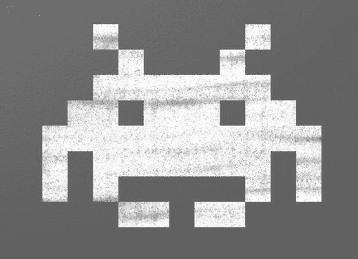
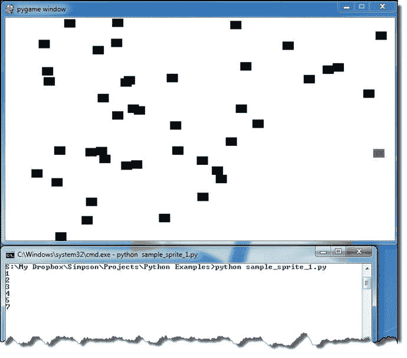
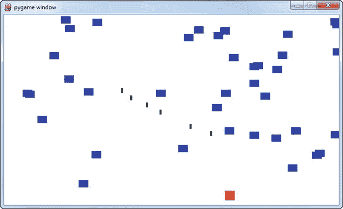
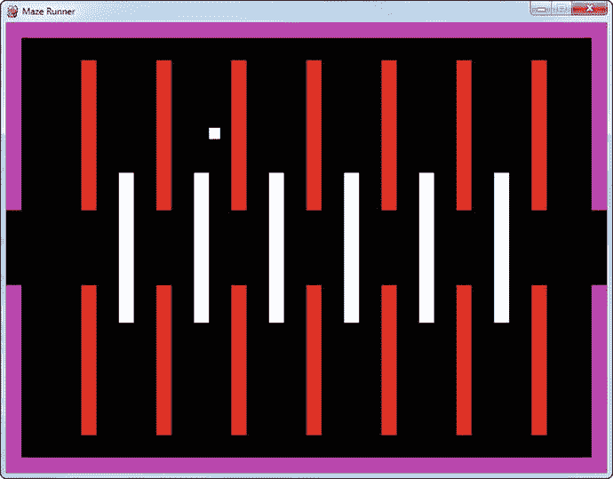
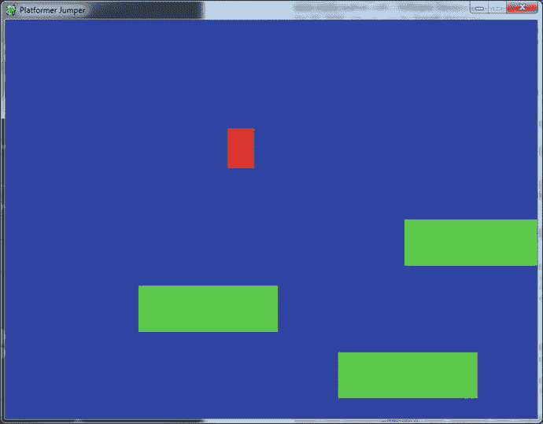
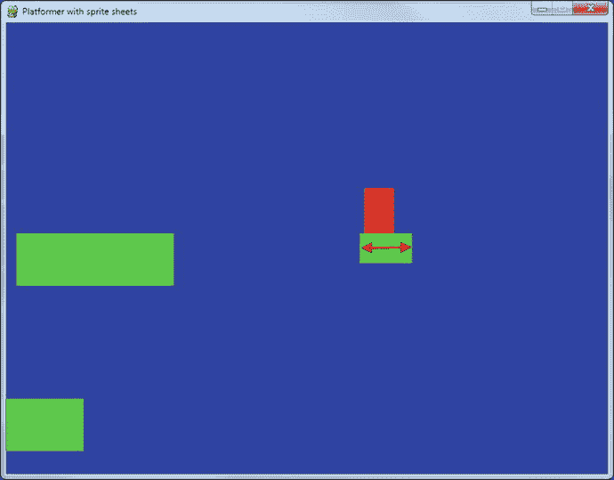
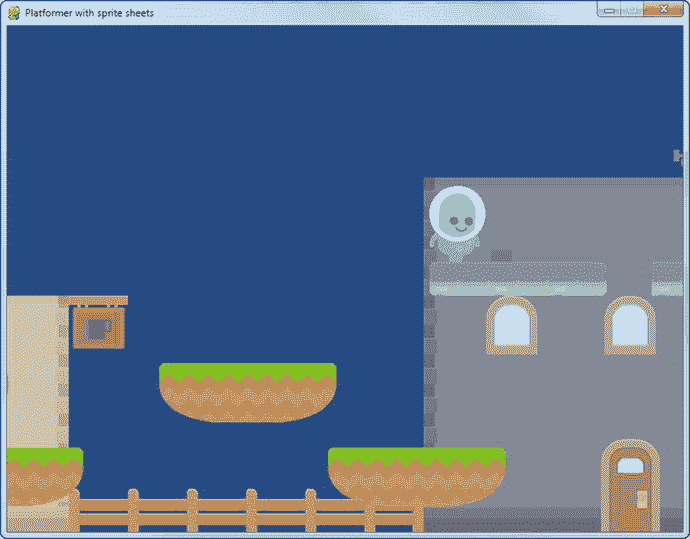
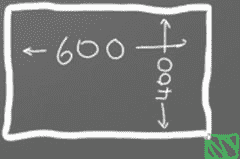

# 14.精灵简介

我们的游戏需要支持处理碰撞的物体。球从球拍上弹开，激光束击中外星人，或者我们最喜欢的角色收集硬币。所有这些例子都需要碰撞检测。

pygame 库支持精灵。精灵是一个二维图像，是更大的图形场景的一部分。通常，精灵是场景中的某种对象，可以与汽车、青蛙或小水管工进行交互。

最初，视频游戏控制台内置了对小精灵的硬件支持。现在不再需要这种专门的硬件支持，但我们仍然使用术语 sprite。

## 基本精灵和碰撞

让我们逐步完成一个使用精灵的示例程序。这个例子展示了如何创建一个黑色方块的屏幕，并使用一个由鼠标控制的红色方块来收集它们，如下图所示。该计划保持分数多少块已经收集。此示例的代码可以在以下位置找到:

`ProgramArcadeGames.com/python_examples/f.php?file=sprite_collect_blocks.py`

精灵游戏示例

我们程序的前几行像我们做过的其他游戏一样开始(为了清楚起见添加了行号):

`001 import pygame`

`002 import random`

`003`

`004 # Define some colors`

`005 BLACK = (  0,   0,   0)`

`006 WHITE = (255, 255, 255)`

`007 RED   = (255,   0,   0)`

pygame 库是为第 1 行的 sprite 支持而导入的。随机库被导入用于第 2 行上的块的随机放置。颜色的定义在第 5-7 行是标准的；这个例子中没有什么新的东西。

`009 class Block(pygame.sprite.Sprite):`

`010     """`

`011     This class represents the ball.`

`012     It derives from the "Sprite" class in pygame.`

`013     """`

第 9 行开始定义`Block`类。注意，在第 9 行，这个类是`Sprite`类的子类。`pygame.sprite.`指定了库和包，这将在[第 15 章](15.html)中讨论。`Sprite`类的所有默认功能现在都将成为`Block`类的一部分。

`015     def __init__(self, color, width, height):`

`016         """ Constructor. Pass in the color of the block,`

`017         and its x and y position. """`

`018`

`019         # Call the parent class (Sprite) constructor`

`020         super().__init__()`

第 15 行的`Block`类的构造函数像任何其他构造函数一样为`self`接受一个参数。它还接受定义对象颜色、高度和宽度的参数。

调用`Sprite`中的父类构造函数来允许精灵初始化是很重要的。这是在第 20 行完成的。

`022         # Create an image of the block, and fill it with a color.`

`023         # This could also be an image loaded from the disk.`

`024         self.image = pygame.Surface([width, height])`

`025         self.image.fill(color)`

第 24 行和第 25 行创建了最终将出现在屏幕上的图像。第 24 行创建了一个空白图像。第 25 行用黑色填充它。如果程序需要黑色方块以外的东西，这些是要修改的代码行。

例如，看看下面的代码:

`def __init__(self, color, width, height):`

`"""`

`Ellipse Constructor. Pass in the color of the ellipse,`

`and its size`

`"""`

`# Call the parent class (Sprite) constructor`

`super().__init__()`

`# Set the background color and set it to be transparent`

`self.image = pygame.Surface([width, height])`

`self.image.fill(WHITE)`

`self.image.set_colorkey(WHITE)`

`# Draw the ellipse`

`pygame.draw.ellipse(self.image, color, [0, 0, width, height])`

如果上面的代码被替换，那么一切都将是省略号的形式。第 29 行绘制椭圆，第 26 行将白色变成透明色，这样背景就显示出来了。这与第 12 章中使用的使图像的白色背景透明的概念相同。

`def __init__(self):`

`""" Graphic Sprite Constructor. """`

`# Call the parent class (Sprite) constructor`

`super().__init__()`

`# Load the image`

`self.image = pygame.image.load("player.png").convert()`

`# Set our transparent color`

`self.image.set_colorkey(WHITE)`

如果需要位图图形，替换上面的代码行将加载一个图形(第 22 行)并将白色设置为透明背景色(第 25 行)。在这种情况下，sprite 的尺寸将自动设置为图形尺寸，不再需要传递它们。看看第 15 行为什么不再有这些参数。

不管我们有什么样的精灵，在构造函数中还需要一行重要的代码:

`027         # Fetch the rectangle object that has the dimensions of the image`

`028         # image.`

`029         # Update the position of this object by setting the values`

`030         # of rect.x and rect.y`

`031         self.rect = self.image.get_rect()`

属性`rect`是一个变量，它是 pygame 提供的`Rect`类的一个实例。矩形代表精灵的尺寸。这个 rectangle 类具有可以设置的 x 和 y 属性。Pygame 将在 x 和 y 属性所在的地方绘制精灵。所以要移动这个精灵，程序员需要设置`mySpriteRef.rect.x`和`mySpriteRef.rect.y`，其中`mySpriteRef`是指向精灵的变量。

我们已经完成了`Block`类。是时候进入初始化代码了。

`033 # Initialize pygame`

`034 pygame.init()`

`035`

`036 # Set the height and width of the screen`

`037 screen_width = 700`

`038 screen_height = 400`

`039 screen = pygame.display.set_mode([screen_width, screen_height])`

上面的代码初始化 pygame 并为游戏创建一个窗口。这里没有任何来自其他 pygame 程序的新内容。

`041 # This is a list of ’sprites.’ Each block in the program is`

`042 # added to this list. The list is managed by a class called ’Group.’`

`043 block_list = pygame.sprite.Group()`

`044`

`045 # This is a list of every sprite.`

`046 # All blocks and the player block as well.`

`047 all_sprites_list = pygame.sprite.Group()`

和精灵一起工作的一个主要优势是能够和他们一起分组工作。如果精灵在一个组中，我们可以用一个命令来绘制和移动所有的精灵。我们还可以检查整个组的精灵碰撞。

上面的代码创建了两个列表。变量`all_sprites_list`将包含游戏中的每一个精灵。这个列表将被用来绘制所有的精灵。变量`block_list`保存玩家可以碰撞的每个物体。在这个例子中，它将包括游戏中除玩家之外的所有对象。我们不希望玩家出现在这个列表中，因为当我们检查玩家是否与`block_list`中的物体发生碰撞时，pygame 会继续，如果玩家出现在列表中，它会返回碰撞结果。

`049 for i in range(50):`

`050     # This represents a block`

`051     block = Block(BLACK, 20, 15)`

`052`

`053     # Set a random location for the block`

`054     block.rect.x = random.randrange(screen_width)`

`055     block.rect.y = random.randrange(screen_height)`

`056`

`057     # Add the block to the list of objects`

`058     block_list.add(block)`

`059     all_sprites_list.add(block)`

从第 49 行开始的循环向屏幕添加了 50 个黑色精灵块。第 51 行创建一个新块，设置颜色、宽度和高度。第 54 行和第 55 行设置了这个对象出现的坐标。第 58 行将方块添加到玩家可以碰撞的方块列表中。第 59 行将其添加到所有块的列表中。这应该与您在练习 13 中写的代码非常相似。

`061 # Create a RED player block`

`062 player = Block(RED, 20, 15)`

`063 all_sprites_list.add(player)`

第 61–63 行为我们的游戏设置了玩家。第 62 行创建了一个红色块，最终将作为播放器。该块被添加到第 63 行的`all_sprites_list`中，因此它可以被绘制，但不能被绘制到`block_list`中。

`065 # Loop until the user clicks the close button.`

`066 done = False`

`067`

`068 # Used to manage how fast the screen updates`

`069 clock = pygame.time.Clock()`

`070`

`071 score = 0`

`072`

`073 # -------- Main Program Loop -----------`

`074 while not done:`

`075     for event in pygame.event.get():`

`076         if event.type == pygame.QUIT:`

`077             done = True`

`078`

`079     # Clear the screen`

`080     screen.fill(WHITE)`

上面的代码是一个标准的程序循环，在第 6 章中首次介绍。第 71 行将我们的`score`变量初始化为 0。

`082     # Get the current mouse position. This``returns`T2】

`083     # as a list of two numbers.`

`084     pos = pygame.mouse.get_pos()`

`085`

`086     # Fetch the x and y out of the list,`

`087        # just like we’d fetch letters out of a string.`

`088     # Set the player object to the mouse location`

`089     player.rect.x = pos[0]`

`090     player.rect.y = pos[1]`

第 84 行获取鼠标位置，类似于之前讨论的其他 pygame 程序。重要的新部分包含在第 89–90 行，其中包含精灵的矩形被移动到新的位置。请记住，这个 rect 是在第 31 行创建的，如果没有那一行，这段代码将无法运行。

`092     # See if the player block has collided with anything.`

`093     blocks_hit_list = pygame.sprite.spritecollide(player, block_list, True)`

这行代码获取由`player`引用的 sprite，并对照`block_list`中的所有 sprite 进行检查。代码返回一个重叠的精灵列表。如果没有重叠的精灵，它将返回一个空列表。布尔`True`将从列表中删除碰撞的精灵。如果设置为`False`，精灵将不会被移除。

`095     # Check the list of collisions.`

`096     for block in blocks_hit_list:`

`097         score += 1`

`098         print(score)`

这为在第 93 行创建的碰撞列表中的每个精灵循环。如果列表中有精灵，增加每次碰撞的分数。然后将分数打印到屏幕上。请注意，第 98 行的`print`不会将乐谱打印到主窗口和精灵窗口，而是打印到控制台窗口。弄清楚如何让分数显示在主窗口上是练习“收集精灵”的一部分

`100     # Draw all the spites`

`101     all_sprites_list.draw(screen)`

`all_sprites_list`所属的`Group`类有一个叫做`draw`的方法。该方法遍历列表中的每个 sprite，并调用该 sprite 的`draw`方法。这意味着只需一行代码，一个程序就可以让`all_sprites_list`中的每个精灵都被绘制出来。

`103     # Go ahead and update the screen with what we’ve drawn.`

`104     pygame.display.flip()`

`105`

`106     # Limit to 60 frames per second`

`107     clock.tick(60)`

`108`

`109 pygame.quit()`

当主循环完成时，第 103–109 行翻转屏幕并调用`quit`方法。

## 移动精灵

在到目前为止的例子中，只有玩家精灵移动。一个程序怎么能让所有的精灵都动起来？这很容易做到；只需要两步。

第一步是向`Block`类添加一个新方法。这种新方法叫做`update`。当对整个列表调用`update`时，将自动调用更新功能。

把这个放进雪碧里:

`def update(self):`

`""" Called each frame. """`

`# Move block down one pixel`

`self.rect.y += 1`

把这个放到主程序循环中:

`# Call the update() method for all blocks in``t`T2】

`block_list.update()`

代码并不完美，因为块会从屏幕上掉下来，不再出现。这段代码将改进`update`函数，使块重新出现在顶部。

`def update(self):`

`# Move the block down one pixel`

`self.rect.y += 1`

`if self.rect.y > screen_height:`

`self.rect.y = random.randrange(-100, -10)`

`self.rect.x = random.randrange(0, screen_width)`

如果程序应该重置收集到屏幕顶部的块，可以使用以下代码更改 sprite:

`def reset_pos(self):`

`""" Reset position to the top of the screen, at a random x location.`

`Called by update() or the main program loop if there is a collision.`

`"""`

`self.rect.y = random.randrange(-300, -20)`

`self.rect.x = random.randrange(0, screen_width)`

`def update(self):`

`""" Called each frame. """`

`# Move block down one pixel`

`self.rect.y += 1`

`# If block is too far down, reset to top of screen.`

`if self.rect.y > 410:`

`self.reset_pos()`

当碰撞发生时，程序可能会调用`reset_pos`函数，而不是销毁块，块将移动到屏幕顶部准备收集。

`# See if the player block has collided with anything.`

`blocks_hit_list = pygame.sprite.spritecollide(player, block_list, False)`

`# Check the list of collisions.`

`for block in blocks_hit_list:`

`score += 1`

`print(score)`

`# Reset block to the top of the screen to fall again.`

`block.reset_pos()`

此示例的完整代码如下:

`ProgramArcadeGames.com/python_examples/f.php?file=moving_sprites.py`

如果你想看弹跳精灵的代码，请看这里:

`ProgramArcadeGames.com/python_examples/f.php?file=moving_sprites_bounce.py`

如果你想让它们转圈:

`ProgramArcadeGames.com/python_examples/f.php?file=sprite_circle_movement.py`

## 游戏课

回到第 10 章我们介绍了函数。在本章的最后，我们讨论了使用`main`函数的选项。随着程序变得越来越大，这种技术有助于我们避免因需要整理大量代码而带来的问题。我们的程序还没有那么大。然而，我知道有些人喜欢从一开始就组织好事情。

对于那些人来说，这里有另一种组织代码的可选技术。(如果您不在这个阵营中，您可以跳过这一部分，稍后当您的程序变得太大时再回来。)观看视频，了解该程序的工作原理。

`ProgramArcadeGames.com/python_examples/f.php?file=game_class_example.py`

## 其他示例

这里有几个你可以用精灵做什么的例子。其中一些还包括一个解释代码如何工作的链接视频。

### 拍摄东西

拍摄东西

对射击游戏感兴趣吗？类似经典的太空入侵者？此示例显示了如何创建代表项目符号的精灵:

`ProgramArcadeGames.com/python_examples/f.php?file=bullets.py`

### 墙壁

你在寻找更多的冒险游戏吗？你不想让你的玩家到处乱逛吧？这显示了如何添加阻止玩家移动的墙:

`ProgramArcadeGames.com/python_examples/f.php?file=move_with_walls_example.py`

跟着我们能碰到的墙走

等等？一个房间还不够冒险吗？你想让你的玩家在屏幕间移动吗？我们能做到！请看这个例子，玩家可能在一个多房间的迷宫中奔跑:

`ProgramArcadeGames.com/python_examples/f.php?file=maze_runner.py`

多房间迷宫

### 平台

有兴趣打造一个平台化的，比如大金刚？我们需要使用与我们的墙壁示例相同的想法，但是增加一些重力:

`ProgramArcadeGames.com/python_examples/f.php?file=platform_jumper.py`

在平台上跳跃

好的平台玩家可以左右移动。这是一个侧面滚动平台:

`ProgramArcadeGames.com/python_examples/f.php?file=platform_scroller.py`

侧面滚动平台

甚至更酷的平台游戏也有移动的平台！看看这个例子是如何做到的:

`ProgramArcadeGames.com/python_examples/f.php?file=platform_moving.py`

移动平台

### 蛇/蜈蚣

我偶尔会碰到一些读者想制作一个蛇或者蜈蚣类型的游戏。你有一条可以控制的多节蛇。这需要将每个段保存在一个列表中。虽然它需要学习两个新的命令，但这个游戏背后的概念并不难。

控制一条蛇或蜈蚣绕着屏幕走:

`ProgramArcadeGames.com/python_examples/f.php?file=snake.py`

蛇

### 使用精灵工作表

这是一个广泛的例子，使用 sprite 表来提供平台游戏背后的图形。它支持多层次和移动平台。游戏被分成多个文件。`ProgramArcadeGames.com/python_examples/en/sprite_sheets`

雪碧薄板平台车

## 回顾

### 多项选择测验

What is a Sprite? A graphic image that he computer can easily track, draw on the screen, and detect collisions with.   A very bright color that seems to glow.   A function that draws images to the screen.   A sprite is to Tinkerbell as a human is to Bob.     Which option best describes how a programmer use sprites in his or her program? Derive a new class from `pygame.sprite.Sprite`, and then create instances of those sprites and add them to sprite groups.   Create instances of `pygame.sprite.Sprite` and add them to sprite groups.   Use functions to draw images directly to the screen   Use bitmaps and blit images to the screen.     What is the standard way to draw sprites in a program? Add a sprite to a group. Then call `.draw(screen)` on the group.   Call the sprite’s `.draw(screen)` method.   Call the sprite’s `.update(screen)` method.   Call the sprite’s `.blit(screen)` method.     How does a program move a sprite pointed to by `mysprite`? Set new `mysprite.rect.x` and `mysprite.rect.y` values.   Set new `mysprite.x` and `mysprite.y` values.   Call `mysprite.draw(x,y)` with the desired `x` and `y` values.   Call `mysprite.move(x,y)` with the desired `x` and `y` values.     How does a sprite move itself? Create an `update()` method. Change `self.rect.x` and `self.rect.y` values.   Create an `update()` method. Change `rect.x` and `rect.y` values.   Create a `move()` method. Change `self.x` and `self.y` values.     If a programmer creates his/her own constructor for a sprite, what must be the first line of that constructor? `super().__init__()`   `self.image = pygame.Surface([width, height])`   `self.image.set_colorkey(white)`     If a programmer wants to create a transparent background for a sprite, what type of image should be avoided? jpg   png   gif     What does the `True` do in this line of code? `sprites_hit_list = pygame.sprite.spritecollide(sprite, sprite_list, True)` Removes `sprite` if any sprite in `sprite_list` is overlapping.   Creates an explosion effect when the sprites collide.   Creates a sound effect when the sprites collide.   Removes any sprite in `sprite_list` that is overlapping `sprite`.     What is special about a sprite’s `update()` function? It is called automatically each time through the game loop.   It is called automatically when the code calls `update()` on any list that sprite is in.   There is no special significance to that function.     What is the proper command to add a sprite to an instance of `pygame.sprite.Group()` pointed to by a `sprite_list`? `sprite_list.append(my_sprite)`   `sprite_list.add(my_sprite)`   `sprite_list.insert(my_sprite)`     If the screen is 600 wide and 400 tall, where will this sprite be moved? `mysprite.rect.x = 600` `mysprite.rect.y = 400`              

### 锻炼

查看附录中本章附带的练习“收集精灵”。