# 2.电子学入门

在上一章中，我们介绍了微控制器的基础知识以及如何建立开发环境。然而，要真正使用微控制器，我们需要将它们与外界连接。这需要对电子学有一个基本的了解。虽然不可能在一章中完全涵盖这个庞大而复杂的领域，更不用说一整本书了，但本章介绍了电子学原理，并概述了您将在微控制器中使用的一些元件。

电子学可以分为两个主要领域:模拟电子学和数字电子学。模拟电子学涉及电路中的元件可以有几种状态的电子学；因此，我们说模拟电子学处理的是连续电路。另一方面，数字电路有两种状态，因此数字电子学处理的是分立电路。在本章中，我将讨论这两个问题。

电就是电子的流动。为了理解电子，让我们谈一点原子。据说原子是物质存在的最小部分，这一切都很好，除了它还不止于此。即使在原子内部，也存在无数的亚原子粒子，它们被描述为粒子动物园。我们有质子、中子、电子、夸克、介子，这个清单可以一直列下去。

亚原子物理学可能需要一生的时间来研究。我们将跳过这一复杂性，把原子描述为由三种主要粒子组成。这些是质子、中子和电子。据说质子带正电荷，中子不带电荷，电子带负电荷。

现在我们的头脑中有了这些粒子，人们会认为它们的大小都一样。然而，事实并非如此。质子和中子比电子大得多。关于这些粒子，还需要记住的是，它们在原子中不是随机分布的。中子和质子在原子中心聚集在一起，电子围绕着它。

这种电子流称为*电流*。这些电子流动的原因很简单:导体本身由原子构成。当我们施加一个电压时，这是导体两点之间的电位差，它使这些电子流动，这就是所谓的电流。现在，记住导体的原子已经有电子了；因此，当你让更多的电子流过导体时，它会导致一个单独的原子向其邻居“扔出”电子，这个过程以光速继续进行许多许多次。

所以，让我们为那些仍然困惑的人回顾一下。原子是由质子、中子和电子组成的。这些电子可以流过允许它们流动的叫做导体的材料，而不能流过不允许它们流动的绝缘体。当这些电子流动时，它们产生电流，它们流动是因为导体两端存在电位差，也称为电压。允许电流通过的物质被称为导体，而不允许电流通过的物质被称为绝缘体。为了流动，电流需要一个闭合的路径或回路，称为*电路*。

一种叫做*电源*的设备两端有一个电势差，可以让电流流动。在上面的一段中，我们谈到了电压，它是导致电流流过物体的电位差。然而，这种电位差并不是来自它本身；它来自一种能产生电力的装置，我们需要这种电力来驱动电子设备。电池和蓄电池就是两种这样的电源。

在这个时代出生的任何人都肯定遇到过这种或那种形式的电池。你想过电池是什么吗？我的意思是，你知道在你的手机和你身边的小玩意里有一个。然而，你想过什么是电池吗？

电池是一种我们用来发电的装置，由一组电池组成。虽然我们把所有能提供电能的东西都叫做电池，但事实并非如此。电池是产生能量的单一单位。当我们收集了一些细胞时，就形成了一个电池。

原电池是这样一种电池，其中发生的产生电的化学反应不容易逆转。你更换过多少次家里钟表和遥控器的电池？一旦原电池耗尽，就意味着要被丢弃。

你用来给玩具和小玩意供电的碱性电池通常是原电池。当 AA 或 AAA 电池用完时，你可以扔掉它，根据预期用途放入一个新的。

如果我们观察细胞，我们会看到两个标记。电源的正极叫做阳极，你会看到它标有一个小小的十字符号(+)。你的电源的负极端被称为阴极，你会看到它标有一个小破折号(-)。这种阴极有时被称为接地。

虽然原电池有其用途，但我们向“绿色”的转变以及电池技术的进步使我们倾向于使用能量耗尽后可以充电的电池。我们称这些细胞为次级细胞。

二次电池是一种产生电能的化学反应可以逆转的电池。想一想；如果化学反应产生了电，增加电不应该能够逆转产生电的化学反应吗？

这是二次电池工作的前提。由于它的电池化学性质，它可以充电。这些类型的电池在我们的手机和平板电脑等现代电子设备中很常见。

我们将在整本书中使用的电子元件具有不同的物理属性，允许电子以特定的方式在其中流动。当我们使用这些组件时，我们所做的就是利用这些属性来产生某些想要的效果。在这一章中，我将依次讨论每个组件，以展示它如何影响电流。

## 电线

电线是电流在电路中流动的媒介。电线由包围导电金属芯的绝缘体组成。这种芯可以是实心的或绞合的。实芯焊丝由芯部的一片金属组成。图 [2-1](#Fig1) 显示了绝缘下面的实芯电线。

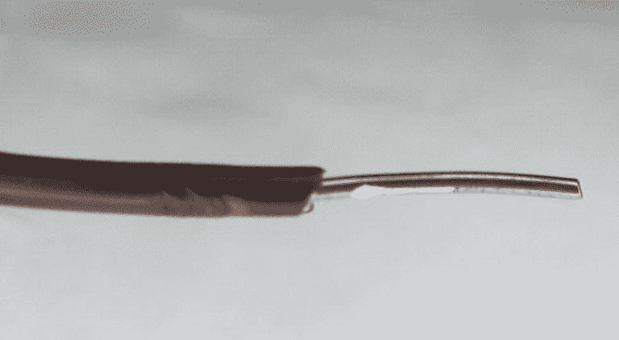

图 2-1

实芯线

绞合芯线由许多捆在一起的实心线组成。图 [2-2](#Fig2) 向我们展示了绞合芯线的样子。

图 2-2

绞合芯线

绞合线和实芯线都有它们的应用。在抗腐蚀方面，实芯焊丝非常坚固，对于可能发生腐蚀的应用，它们是首选的焊丝类型。另一方面，多股绞合线更柔软，因此用于电线可能会有很多弯曲的应用中。实芯线在大量弯曲下更容易断裂，不适合这种应用。

随着您获得更多经验，您将能够确定哪种电线适合哪种应用。有时，成本或电流处理能力等其他因素可能会决定您将在应用中使用哪种类型的电线。

关于电线，需要了解的另一件重要事情是它们的尺寸。我们用来指代导线尺寸的名称是导线的规格。美国线规(AWG)是大多数人在处理电线尺寸时使用的标准。

一些总是让初学者困惑的事情与电线的尺寸和分配给他们规格的数字有关。在 AWG 系统中，数字越大，导线越细。这意味着 12 号线(家庭布线的常用尺寸)比电子工程中常见的 22 号线粗。

更粗的线通常意味着更大的处理能力。当比较导线时，在 DC 电压下，单芯导线通常比具有相同横截面积的相应绞合导线提供更高的额定电流。原因很简单:归结起来就是热。

导线处理电流的能力取决于当电流流过导线时它能多好地消除产生的热量。单芯导线必须将热量从导线散发到外部，这比绞合导线要好。想想绞线中间的那一股。热量必须从该中心线股散发，并依靠其他线股将热量传导到电线外部，这导致散热较差。

## 试验板

当我们开始使用电子元件时，我们需要一个表面来构建电路。我们称这个表面为*试验板*。试验板是一块由称为插座的小孔组成的板，我们可以在那里连接我们的组件。图 [2-3](#Fig3) 显示了一个试验板。

图 2-3

一块试验板

试验板的插座按组排列。电路板的两侧是垂直的插座带，称为电源端子、电源轨或电源总线。这些都标有一个加号“+”用于指示电源的正极连接位置，一个负号“-”用于指示电路上的接地连接位置。在试验板内部，单个+或–列中的所有插座都用金属线连接，允许电流在插座之间流动。电源轨如图 [2-4](#Fig4) 所示。

图 2-4

试验板的电源轨用红线突出显示

试验板的中心由成行排列的插座条组成。试验板的这一部分称为原型制作区域。每排有两组五个插座，中间有一条沟隔开。每一排插座都有一个编号；在我们的示例试验板上，它们从 1 到 30 编号。一行中的每个插座也有指定的字母。在试验板内部，每组五个插座用一根金属线连接，如图 [2-5](#Fig5) 中突出显示的。中央沟槽用于支撑集成电路元件，这将在本章后面讨论。

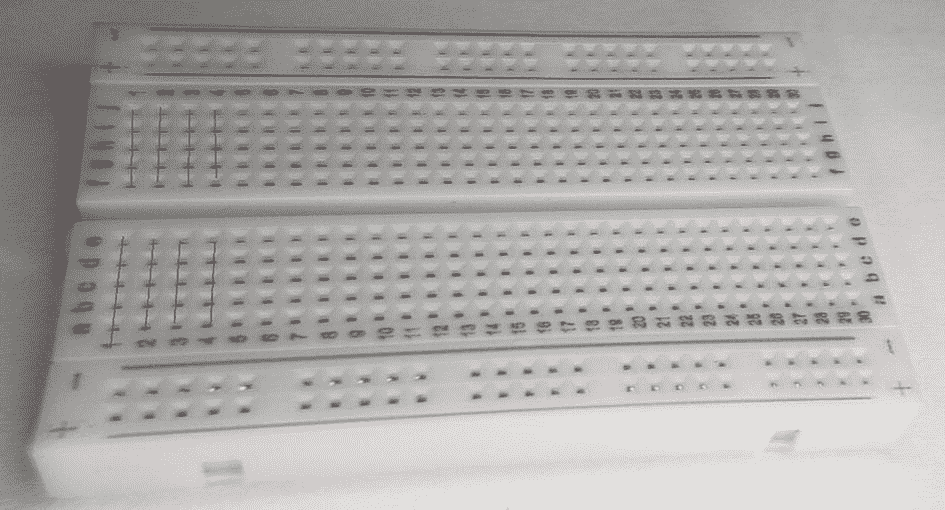

图 2-5

原型区域，前几行插座用红色突出显示

公对公跳线，如图 [2-6](#Fig6) 所示，其连接器可以轻松插入试验板的插座中。

图 2-6

跳线

这些跳线用于将不同的插座连接在一起，为电流流经试验板上的元件提供路径。

### 电子原理图

描述电子学时，习惯上用一个*原理图*来表示你正在处理的电路。想象我们有一个连接到电池的电机，如图 [2-7](#Fig7) 所示。

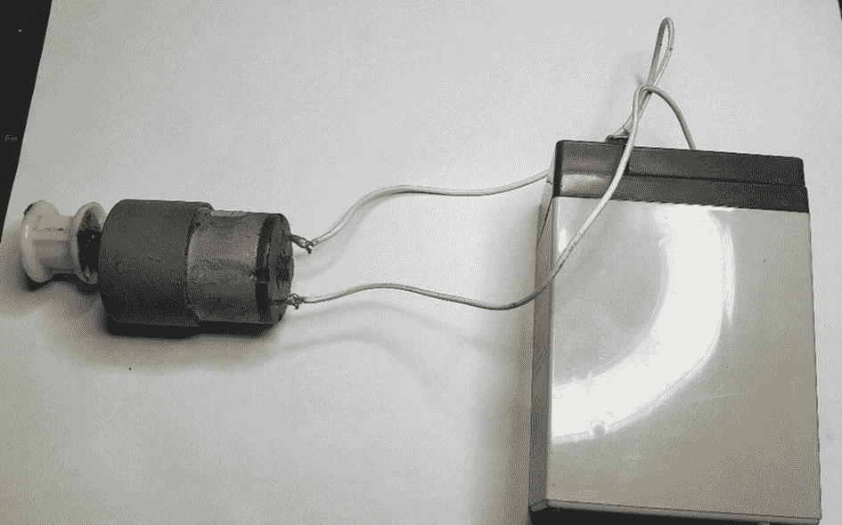

图 2-7

一个简单的电路，特点是电机连接到电池

可以用电路元件的特殊电子表示来替换电路元件的图形表示。这种表示叫做示意图。在我们的第一个电路中，我们将电池连接到马达上。图 [2-8](#Fig8) 向我们展示了如何将这个电路重新绘制成图形。这个电路的图示叫做电路图。在电路图中，我们用图形来表示我们的电路。

图 2-8

我们电路的图示

图 [2-8](#Fig8) 中的电路可以用特殊符号重新绘制，以表示组成电路的元件，如图 [2-9](#Fig9) 所示。这是因为虽然电路图很棒，但随着我们的电路变得越来越复杂，充分使用电路图来表示我们的电路变得越来越困难。图 [2-9](#Fig9) 中的图表使用示意符号来表示我们的电路。原理图使用抽象的图形符号来表示电路中的元件，而不是图形表示。

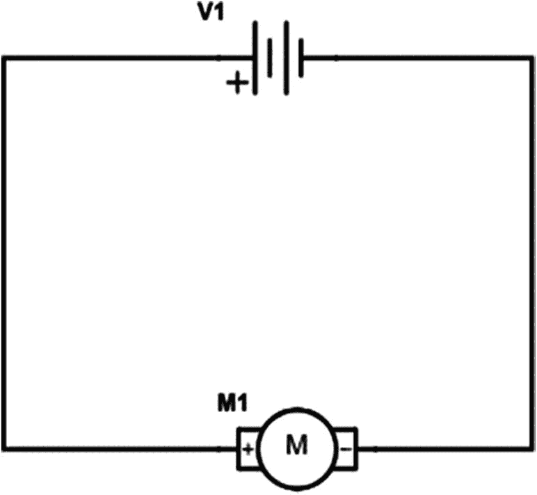

图 2-9

使用原理图符号显示的相同电路

然而，这些术语并不是一成不变的，因为有些人在某些情况下将电路图称为示意图。然而，你应该知道，我们如何表示我们的电路存在差异。在本书中，我使用原理图，因为它们比电路图更清晰、更简洁。另外，一旦你理解了原理图，你应该可以毫无问题地理解电路图。

我们在电子产品中使用的每个元件都有自己的标准化示意图符号来表示。以下是我们迄今为止使用的组件的符号。

导线用直线表示，如图 [2-10](#Fig10) 所示。试验板上成行成列的连接孔可视为导线，因为它们允许电路内的元件连接。

图 2-10

导线原理图符号

如图 [2-11](#Fig11) 所示，一个单元由一条短线和一条长线表示，它们相互平行，导线从两侧伸出。

图 2-11

单元示意图符号

电池的示意符号是几个电池连接在一起，如图 [2-12](#Fig12) 所示。

图 2-12

电池示意图符号

电机也有自己的示意符号，它是一个内部带有大写字母 M 的圆圈，如图 [2-13](#Fig13) 所示。

图 2-13

电机示意图符号

随着我们的进展，将会逐渐引入更多的示意性符号。

## 无源元件

我们现在准备讨论所谓的*无源元件*。它们被称为无源，因为它们不需要任何外部电源来运行。这些装置能够消耗、储存和释放电能。无源元件包括*电阻*、*电容*和*电感*。

## 电阻

电阻器是一种阻止电子流通过的装置。这需要限制流入某些电路元件的电流。如果我们将太多的电流注入某些元件，它们就会被损坏，因此，我们使用电阻来防止这种情况发生。电阻也是一个特别重要的分压电路的一部分。分压器将较大的电压转换成较小的电压，这在构建某些电路时很有用，我们将在本书后面看到。

我们用欧姆这个单位来测量物质的电阻。仔细想想，所有电阻都是电路中电压和电流之间的关系。本质上，它是一种物质上的电压与通过它的电流之比。这种关系形成了所谓的欧姆定律。

我们谈论电路不能不讨论欧姆定律。一个叫格奥尔格·欧姆的家伙发展了一个定律，在这个定律中，他发现了电压、电阻和电流之间的关系。

*   电压=电流*电阻

这种关系简单却强大！为了说明这一点，让我们假设有一个 5 伏的电压流过你的电路，一个电阻的值为 1k。

我们如何计算电流？我们简单地重新排列欧姆定律，得到如下结果:

*   电流=电压/电阻

因此，我们可以计算出电路中的电流为 5v / 1000 欧姆= 0.5 毫安。

在图 [2-14](#Fig14) 中，我们可以看到一些电阻的样子。

图 2-14

一些抵抗组织:阿达果，adafruit.com

电阻器上印有彩色条带，用以指示电阻值。第一段表示电阻的第一位数字，第二段表示第二位数字，第三段表示零的数量。第四个频段称为电阻的容差水平，它告诉我们电阻可能超出或低于原始值的百分比。我们从左到右阅读这些电阻颜色代码；然后根据带的颜色，我们根据电阻的带数来赋值。我们通常可以通过寻找电阻上的金或银容差带来判断哪个带是第一带；公差带将是最右边的带，因此我们从最左边的带开始确定值。通常，公差带和值带之间会有一个小的间隙，但情况并非总是如此。表 [2-1](#Tab1) 列出了我们可以用来确定电阻值的颜色。

表 2-1

电阻器颜色代码

<colgroup><col class="tcol1 align-left"> <col class="tcol2 align-left"></colgroup> 
| 

颜色

 | 

数字

 |
| --- | --- |
| 黑色 | Zero |
| 褐色的 | one |
| 红色 | Two |
| 柑橘 | three |
| 黄色 | four |
| 格林（姓氏）；绿色的 | five |
| 蓝色 | six |
| 紫罗兰 | seven |
| 灰色的 | eight |
| 白色的 | nine |

公差带可以是棕色，表示 1%的公差，金色，表示 5%的公差，银色，表示 10%的公差，或者根本没有条纹，表示 20%的公差。还有其他指示其他容差级别的波段，但这些是您最常遇到的波段。

电阻是一种性能良好的元件。电阻是罪魁祸首的电路很少会有问题。如果一个电路中的电阻出现故障，要么是因为设计选择不当，要么是因为另一个元件的故障导致该电阻出现故障。

电阻的示意符号是一条锯齿线，如图 [2-15](#Fig15) 所示。

图 2-15

电阻器原理图符号

## 电容器

电容器负责在电路中储存电能。它们最常见的用途之一是与电阻一起用于滤波电路。电子设备中的滤波器用于允许特定频率的电信号通过，同时衰减或减少其他频率的电信号。一些类型的滤波器甚至能够放大或修改它们允许通过的频率信号。

滤波器电路有许多重要的应用；一个这样的应用是在音频信号中，当您想要创建一个双向分频电路，并将所有高频信号导向高音扬声器，同时衰减低频信号。

电容器的特性取决于制造它们的材料；我们称它们是由电介质制成的材料。电介质将决定电容器是极化的还是非极化的。极化电容器在电路中必须以某种方式连接；否则，它将被损坏并存在火灾危险。无极性电容器可以在电路中以任何一种方式连接都没有问题。

电容器所能容纳的电荷量称为电容，用法拉来度量。一法拉是很大的存储量，因此，我们通常使用少量电容，通常为微法拉(μF)和皮法拉(pF)，分别为百万分之一法拉和万亿分之一法拉。

使用电容器时，需要注意的一些事项是它们的温度范围和工作电压。这些值通常印在设备的主体上。温度范围代表电容器正常工作的最低和最高温度，而工作电压是可以馈入电容器的最大电压。重要的是不要超过工作电压，因为这将导致设备损坏。当电容器发生故障时，它们会燃烧，并有能力带走其他电路元件。

如果电容器上没有电压或温度额定值，最好查阅器件的数据手册。这是一份列出您正在使用的设备的所有特性的文件，包括安全工作电压和推荐的工作温度。

## 极化电容器

你可能遇到的最常见的极化电容器是铝电解电容器，如图 [2-16](#Fig16) 所示。与大多数非极化电容器相比，这些电容器具有较大的电容。

图 2-16

一种铝电解电容器

由于其结构，铝电解电容器存在一个称为漏电流的问题。漏电流的产生是因为电容器中的绝缘体不完美，因此确实有一些电流流过。为了解决这个问题，人们发明了另一种电容，称为钽电解电容，它的漏电流比铝制电容低得多。

## 非极化电容器

陶瓷电容是迄今为止最常见的非极化电容。图 [2-17](#Fig17) 显示了陶瓷电容器的样子。

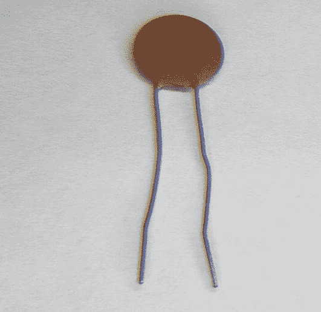

图 2-17

陶瓷电容器

陶瓷电容器比铝电解电容器提供更高的工作电压，尽管它们的电容要低得多。通常，您会根据自己的电容要求选择其中之一。如果你需要一个大电容，那么你可以使用电解电容；然而，如果你想要一个小电容，你会倾向于使用陶瓷电容。

如果你观察陶瓷电容器，你会发现上面印着三个数字。前两位数字代表电容值，最后一位数字给出乘数。我们所做的就是取前两位数，加上乘数中指定的零的个数。这给出了以皮法为单位的电容。如果您没有看到任何第三位数字，那么这就是皮法值。因此，如果你看到一个电容只写着“10”，那么这个电容的值就是 10 皮法。

例如，图 [2-17](#Fig17) 中列出的电容器的标记为 104。因此，该值将为 10 + 0000，即 100 000 pF 或 0.1uF。

### 电容器示意图符号

图 [2-18](#Fig18) 向我们展示了如何用示意符号表示极化电容器，图 [2-19](#Fig19) 向我们展示了如何表示非极化电容器。

图 2-19

非极化电容器示意图符号

图 2-18

极化电容器示意图符号

极化电容器总是有一根导线，旁边有一个加号“+”。非极化电容器没有任何极化标记。

## 感应器

电感是一个特别重要的元件，我认为很多人把它看得过于复杂。你可以利用微积分和其他高等数学来了解电感，或者你可以从电感是什么的角度来看待电感，它只是另一个可以使用的元件。不要担心；在本书中，我们将以最实用的方式介绍电感及其用途。

在深入研究电感之前，我们必须了解电磁学。在生活中的某个时刻，我们可能会遇到磁铁。

磁铁是展示磁性的材料。也就是说，磁体是具有磁场特性的材料。当电流通过导体时，就会产生磁场。如果我们有一根有电流流过的导线，磁场会很弱。如果将导线缠绕成线圈，就会产生更强的磁场，这就形成了电磁铁的基础。

一圈线圈会产生磁场。然而，这仍然是一个非常薄弱的领域。我们可以通过增加线圈的匝数来增加磁场的强度。

为了大幅增加磁场强度，我们将一种导磁材料放入线圈核心。这种材料通常是铁。当我们这样做时，我们现在得到了一个可以电子控制的强磁体。带有导磁磁芯的线圈称为螺线管。

我们刚刚学习了电容器，它们可以储存电荷，我们还学习了电磁学，即当电场穿过导体时，导体会产生磁场。

电感器是储存电荷的装置。我们刚才谈到的盘绕在一起的导线是一个电感器，因此，你有时可能会听到人们把电感器称为线圈。

电感和电容的区别在于，电感以磁场的形式储存电荷。就电感器的工作而言，你可以把电感器当作一个在磁场中储存电荷的黑匣子来设计许多电路。

电感缩写为(L ),测量单位为亨利(H)。

电感有各种不同用途的封装。这些电感可以是屏蔽的，也可以是未屏蔽的。记得我们说过电磁学吗？感应器的设计会产生磁场。该磁场会对周围的电子电路产生不良影响。我们可以通过屏蔽的方式来设计电感，从而将干扰对环境的影响降至最低。

电感用于阻挡电力线上的高频噪声；为此，我们把这样使用的电感器叫做扼流圈。这在逆变器和电机控制电路等电源电路中很常见。这些扼流圈可以用来处理相当大的电流。它们也用于设计类似于电容器的电子滤波器。

长期以来，“空芯”电感器被广泛使用。这些电感器是通过简单地将一根实心线缠绕成线圈而形成的。尽管这些仍然有其应用，但这种电感器有其局限性。只需添加一个铁芯供电线缠绕，就可以在更小的封装中获得更大的电感。随着时间的推移，其他核心材料和设计变得普遍。因此，现代电感器看起来不仅仅是一个中间有铁条的线圈。图 [2-20](#Fig20) 显示了一种你可能在现代电子产品中遇到的电感，左边是它的原理图符号。

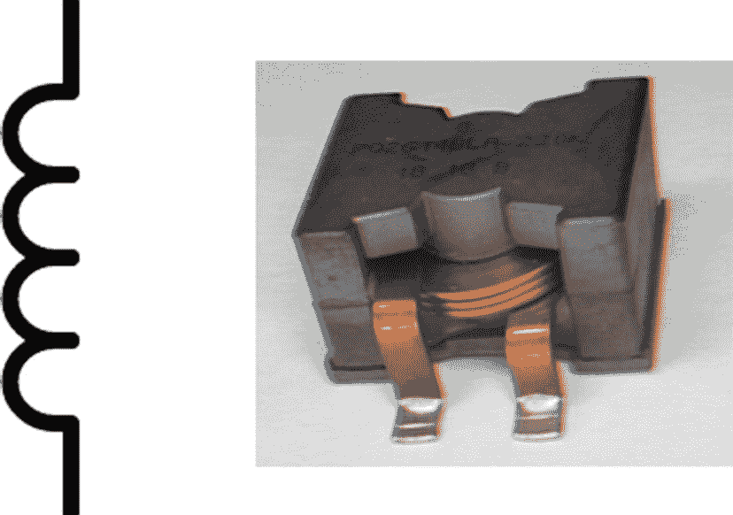

图 2-20

电感器及其原理图符号

技术进步如此之快，以至于出现了一种叫做平面电感器的小型电感器。考虑到它们的小尺寸，它们具有非常高的电流处理能力。

## 半导体

在上一节中，我们讨论的电阻、电容和电感被称为无源模拟电路元件。还有一类电路元件称为有源电路元件。我们将从半导体开始讨论有源模拟电路元件。我之前提到了半导体，并告诉您我们将在稍后讨论它们。本节是对这一承诺的履行。

我们了解到，虽然银和铜等一些物质是良导体，但橡胶和玻璃等其他物质是绝缘体。然而，有一类特殊的材料被称为半导体。

在电子学中，元件中最常用的两种半导体材料是锗(Ge)和硅(Si)。尽管近年来市场上出现的一些其他半导体元件是由氮化镓(GaN)和碳化硅(SiC)制成的。

半导体的导电性比绝缘体好，但比导体差。另一种思考半导体的方式是，它们的电阻比绝缘体小，但比导体大。然而，这些器件仅在特殊条件下表现出这些性质，例如温度或添加其他材料。

前面提到的半导体不是最好的导体。这些半导体的导电性可以通过添加某些杂质来提高，从而使它们成为 n 型半导体或 p 型半导体。添加这些杂质的过程称为掺杂。当这些 p 型和 n 型半导体结合在一起时，就形成了所谓的 pn 结。

当你在一个电路的两点之间施加 DC 电压进行某项操作时，这就是所谓的偏置。当你施加的电压可以流过 pn 结时，这就是所谓的正向偏置。你可以通过在 pn 结上连接一个电源来实现正向偏置，这样电源的正端连接到 pn 结的正端，负端连接到 pn 结的负端。

然而，如果施加电压时，正端连接到 pn 结的负端，负端连接到 pn 结的正端，就会产生反向偏置。当反向偏置 pn 结时，它的电阻很大，不允许电压流过。

然而，当反向偏置 pn 结时，你应该知道有极少量的电流流过。还有，当你给 pn 结施加电压时，它会取一定量以上的电压；对于硅来说，它是 0.7 伏，即电流开始在电路中流动时的电压降。这种导致电流快速增加的电压称为拐点电压。如果对 pn 结施加大的反向电压，它就会击穿。结击穿时的电压称为反向电压。峰值反向电压是一个术语，人们用来指 pn 结被损坏前可以施加的最大反向电压量。

### 二极管

我们要看的第一个半导体器件是*二极管*。二极管只允许电流单向流动。当二极管以那个方向连接并且电流可以流动时，就说它正向偏置。当它以另一个方向连接时，二极管不允许电流流动，这被称为反向偏置。二极管由设备阴极上的条带来识别。图 [2-21](#Fig21) 显示了二极管的样子。

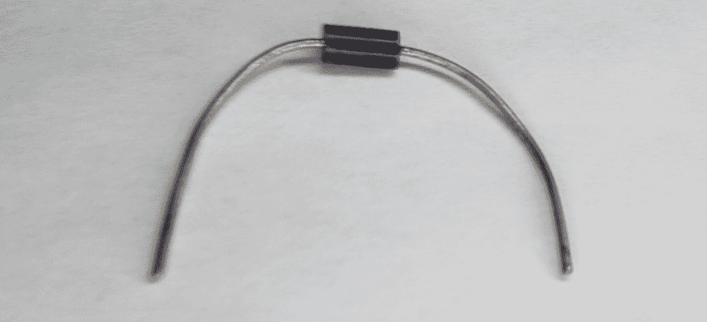

图 2-21

二极管

二极管的示意符号是一个三角形，尖端有一条线，如图 [2-22](#Fig22) 所示。

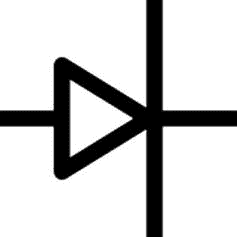

图 2-22

二极管示意图符号

二极管正向连接时电阻可以忽略不计，反向连接时电阻非常高。有信号二极管，用于小电流电路，和功率二极管，可以处理更高的电压和电流。

## 发光二极管

*发光二极管(LED)* 是一种特殊类型的二极管，在正向偏置时会发光。LED 可以产生可见光、红外光或紫外光。图 [2-23](#Fig23) 显示了发光二极管的样子。

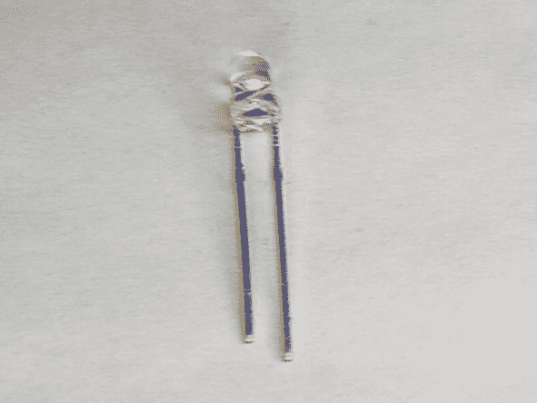

图 2-23

发光二极管

LED 示意符号与二极管符号相似，只是其周围有一个圆圈，如图 [2-24](#Fig24) 所示。

图 2-24

LED 示意符号

像所有二极管一样，led 也有一个电压降。这个电压降取决于制造 LED 的材料类型。

一个 LED 上有两条引线。这些导线中较长的称为阳极。这是你连接正电压的地方。较短的导线称为阴极。这是你接地的地方。如果我们观察塑料外壳内的 LED，您会发现其中一条引线在外壳内看起来更大更平。这也可以用来识别阴极。此外，在圆形 led 上，塑料外壳本身有一个平边；这是另一种识别 LED 的方法。所有这些标记的原因是 led 不喜欢以错误的方式连接。我们将在以后学习如何使用 LED 时讨论这一点。

## 晶体管

晶体管是有史以来最重要的设备之一。它是计算机革命得以发生的核心。

晶体管是通过将 p 型或 n 型材料放在一对相反类型的材料之间而形成的。因此，当你有两个 N 型半导体，中间有一个 P 型半导体时，你得到一个 N-P-N 晶体管。如果你有两个 P 型半导体，中间有一个 N 型半导体，你将得到一个 P-N-P 晶体管。这个 NPN 或 PNP 结可以看作是两个背靠背连接的二极管，一个正向偏置，另一个反向偏置。晶体管的名字来源于这样一个事实，即它将信号从低电阻二极管传输到高电阻二极管。事实上，晶体管是“转移电阻器”的简称

到目前为止，我们一直在讨论的器件有一个共同点:它们都是双端器件。然而，晶体管有三个端子:基极、集电极和发射极。它们分别由字母 B、C 和 E 表示。图 [2-25](#Fig25) 显示了这些晶体管引脚的样子。

图 2-25

晶体管图

当电流流入晶体管的基极时，从集电极流向发射极的电流比流入基极的电流大。基极流过的电流越多，从集电极流到发射极的电流也就越多。我们在图 [2-26](#Fig26) 中看到一个晶体管。

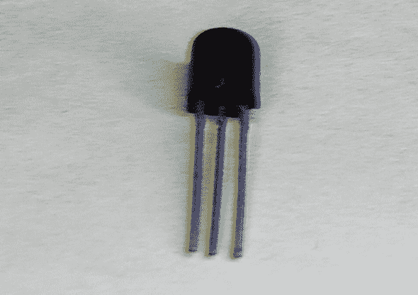

图 2-26

物理晶体管

NPN 晶体管示意符号如图 [2-27](#Fig27) 所示。该符号是一个圆形，三个引脚集电极、基极和发射极分别标记为 C、B 和 E。NPN 晶体管发射极上的箭头指向远离基极的方向。

图 2-27

NPN 晶体管图

PNP 晶体管原理图符号如图 [2-28](#Fig28) 所示。PNP 晶体管看起来像 NPN 晶体管，发射极指向基极。

图 2-28

PNP 晶体管图

p 型和 n 型导体相遇点称为结。发射极和基极相遇的结称为发射极二极管。请记住，晶体管可以被认为是两个背靠背的二极管。集电极和基极相遇的结称为集电极二极管。发射极二极管正向偏置，允许电流流过，集电极二极管反向偏置，不允许电流流过。在我们前进的时候，请记住这一点。由于这种构造晶体管的方法，这里讨论的晶体管类型被称为双极结型晶体管或 BJT。

## 金属氧化物半导体场效应晶体管

*金属氧化物半导体场效应晶体管(MOSFET)* 像压控电阻器(VCR)一样工作。这些录像机有一个输入端口和两个输出端口；输入端口电压控制输出端口之间的电阻。电阻随着输入到器件的电压非线性变化。这一特性允许输入端口有效地开启或关闭 MOSFET。当 MOSFET 导通时，它的电阻很低，只有几分之一欧姆。查看 MOSFET 的数据手册时，您会看到它的 RDS(On)值，即器件饱和时的漏源电阻。当最大量的栅极电压施加到器件上时，MOSFET 处于饱和状态，这使得 RDS(On)非常小，允许最大漏极电流流过 MOSFET。较低的 RDS(On)值意味着器件的运行温度更低，效率更高。

我们可以在图 [2-29](#Fig29) 中看到一个 MOSFET。这是一种 TO-220 封装，对于 MOSFETs 来说并不少见。

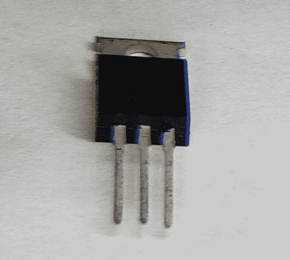

图 2-29

金属氧化物半导体场效应晶体管

正如 BJT 有两种类型一样，MOSFETs 也有两种类型。图 [2-30](#Fig30) 显示了两者的示意符号。左边是 N 沟道 MOSFET，类似于 NPN BJT，右边是 P 沟道 MOSFET，类似于 PNP BJT。

图 2-30

N 沟道和 P 沟道 MOSFETs 的原理图符号

需要考虑的一个重要因素是栅极阈值电压，它表示将电流导入漏极所需的最小电压。将注意力转移到图 [2-31](#Fig31) 上。

像晶体管一样，MOSFETs 也有三个引脚。它们被标记为漏极、栅极和源极。它们分别相当于晶体管的集电极、基极和发射极引脚。通常，在大多数应用中，你可以用 MOSFET 代替晶体管。

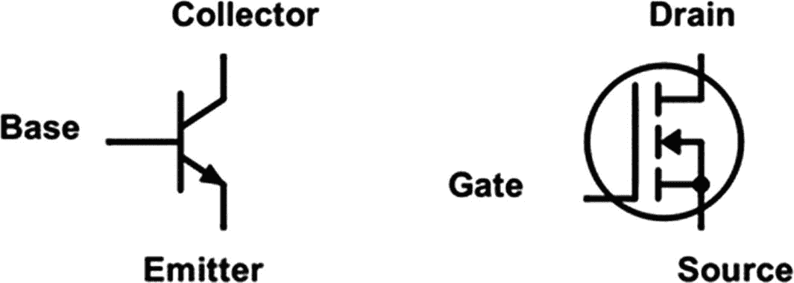

图 2-31

晶体管和 MOSFET 并排

使用 MOSFET 的一些注意事项是确保不要超过栅极到源极的电压，否则会损坏 MOSFET。此外，当切换感性负载(我们称之为电感器件)时，要确保使用反激二极管(连接在器件两端的二极管)来保护 MOSFET。这是我们将在稍后研究如何在我们的设备中使用电机时更详细讨论的内容；现在请记住，当您使用 MOSFETs 时，如果您使用的器件充当继电器或电机等电感，您将需要使用二极管来保护该器件。

### 集成电路

到目前为止，我们看到的器件被称为*分立元件*，因为每个器件只有一个功能。相比之下，*集成电路(IC)* 是一种将几个分立元件放入一个设备中的元件。IC 在紧凑的封装中提供了许多有用的功能。通过将我们之前看到的元件组合成不同的电路配置，我们可以得到该电路的理想功能。我们可以把分立器件小型化，做成集成电路，而不是用分立元件来实现这个功能。例如，正如我们在上一章中所了解的，微控制器是一种将许多不同电路功能集成到一个封装中的集成电路。我们将在书中进一步了解不同类型的 IC。

图 [2-32](#Fig32) 显示了集成电路的样子。顶部通常有一个凹口，表示哪个引脚是器件上的第一个引脚。如果你没有看到一个凹口，那么你会看到一个点，这将起到同样的作用。

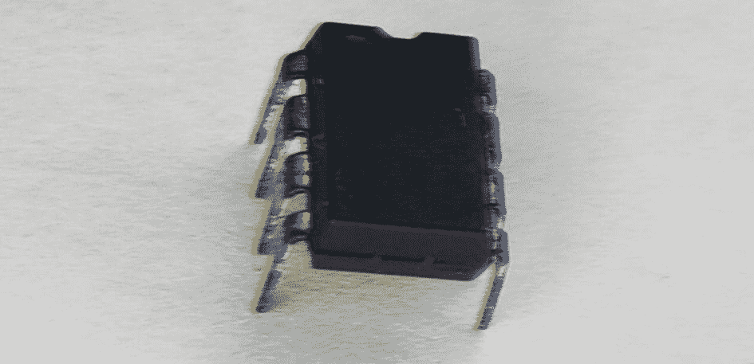

图 2-32

集成电路块

图 [2-32](#Fig32) 所示的 IC 类型是双列直插式封装(DIP) IC。这些 ic 通常有 4 到 40 个引脚，通常引脚均匀分布在容纳所有器件的塑料外壳的两侧。引脚间距通常为 0.1 英寸，这使得 DIP ICs 非常适合插入试验板。

虽然 DIP 技术非常适合原型制作，但今天你会发现大多数 IC 都是作为表面贴装技术(SMT)器件制造的，这种器件是为机器组装而制造的，可以更容易地以更低的成本制造电子产品。对于初学者来说，SMT 设备很难使用，尽管有一些适配器可以让它们适应试验板。

### 数字逻辑

既然我们已经讲述了基本的模拟电子学，我们可以看看数字电子学了。模拟电路元件，如晶体管和二极管，可以不同的方式组合成数字逻辑电路。所有数字电子设备的基本构件是逻辑门；因此，我们对数字逻辑的讨论从对*逻辑门*的讨论开始。逻辑门是一种电路配置，它接收输入并输出高或低状态。这些高和低状态对应于电压电平。在传统的数字电子设备中，我们认为高电压通常为 1.8、3.3 或 5 伏，低电压通常为 0 伏。这些高电压和低电压可能会有所不同，但对于大多数应用，这些都是我们将考虑的电压水平。本质上，高电压就是我们所说的逻辑电平“1”，低电压就是逻辑电平“0”。这就是所谓的二进制系统。二进制系统只用 0 和 1 两个数字来表示它们所有的信息。数字逻辑电路在其输入端使用这些逻辑电平，并产生二进制输出。对于我们在本节中所研究的数字逻辑电路，这种输出通常是一个二进制数字，我们称之为位。

逻辑门通常有两个输入和一个输出。尽管可以用任意数量的输入来构造门，但为了简单起见，我们将坚持使用两个输入。逻辑门是可以连接到微控制器的分立元件(我们将在下一节讨论这种类型)，当这样使用时，它们被称为胶合逻辑，因为它们允许不同的逻辑电路通过桥接接口连接在一起工作。它们也是电路中较大的部分，我们将在本书后面的章节中看到。在这一节，我们将看看一些常见的逻辑门。

我们要看的第一个逻辑门是*与门*。与门比较两个二进制值。如果两个值都是逻辑 1 或高，则结果是逻辑 1，输出将是高。如果输入端的任何值为逻辑 0 或低电平，则门的输出将为低电平。图 [2-33](#Fig33) 显示了与门的符号。

图 2-33

与门

一个*或门*比较两个二进制值。如果任一值为逻辑 1 或高，则结果为逻辑 1，输出将为高。如果两个值都是逻辑 1，那么输出也将是高电平。如果输入端的两个值都是逻辑 0 或低电平，那么门的输出将是低电平。图 [2-34](#Fig34) 显示了或门的符号。

图 2-34

或门

*非门*是数字电子世界中经常遇到的另一种门。它将输入的反义词作为输出。如果输入低，则输出高，如果输入高，则输出低。图 [2-35](#Fig35) 为非门的示意符号。

图 2-35

非门

另一个重要的门是*异或门*。XOR 代表异或。如果输入具有相反的值，异或门将输出高值，否则输出将为低。换句话说，只有当一个或另一个输入(而不是两个)为高时，它的输出才会为高。XOR 门可以使用这种独特的能力来执行许多不同的任务，例如奇偶校验(用于确保数据正确传输)，XOR 门的一个特点是任何数字与其自身进行 XOR 运算都会产生一个 0，用于清除机器代码中的寄存器(我们将在后面了解更多)，并可以在微处理器中使用，以帮助进行更有效的加法。此外，如果您对同一个数字进行两次 XOR 运算(我们执行一次 XOR 运算，取其输出值，然后再次进行 XOR 运算)，您将得到原始值！异或门符号如图 [2-36](#Fig36) 所示。

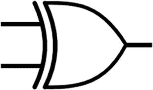

图 2-36

异或门

我们要看的最后一个门是*缓冲门*。缓冲门接收输入信号，并且不反转输出；如果你输入一个逻辑高，你得到一个高输出，如果你输入一个低输入，你得到一个低输出。缓冲门用于放大数字信号。如果在输入端提供逻辑信号的器件无法向目标提供足够的吸电流(提供电流)或源电流(接收电流)(稍后我们将在讨论微控制器的输入和输出时看到这一点)，则使用缓冲栅极来增强器件输入端的驱动能力。图 [2-37](#Fig37) 为缓冲器的示意符号。

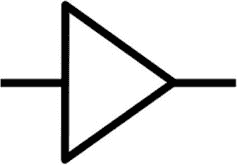

图 2-37

缓冲器

我们将会看到，所有这些逻辑门都有其应用。

## 逻辑电平转换

使用数字逻辑时，有时需要将一个逻辑电平(如 1.8 伏、3.3 伏或 5 伏)转换为另一个。这是因为不同的设备在不同的电压下运行。在数字电路的早期，系统通常在 5 伏电压下运行。由于 5 伏是微处理器等智能设备出现时的标准电压，因此它们也使用 5 伏逻辑进行操作。因此，许多外设(我们稍后将了解微控制器上的特殊电路)和模块都是为 5 伏系统设计的。

然而，近年来，行业趋势已转向使用 3.3 伏逻辑电平或甚至 1.8 伏。由于 5 伏系统已经存在多年，有时有必要将较低的逻辑电平与使用 5 伏逻辑的模块或其它 ic 结合起来，因为它们可能更容易获得，或者设计团队可能对这种器件的鲁棒性有经验。在这种情况下，可能需要执行逻辑电平转换，以便从一种电压转换到另一种电压。请注意，如果您使用的是具有 3.3 伏逻辑电平的 5 伏外设，则无需进行逻辑电平转换就可以与器件接口。然而，当使用具有 5 伏逻辑电平的 3.3 伏逻辑器件时，转换器是必要的。不过，为了安全起见，当您跨不同的逻辑电平域工作时，可以使用逻辑电平转换器。为此，您通常会使用专用 IC。也可以使用如图 [2-38](#Fig38) 所示的特殊逻辑电平转换 PCB。这个逻辑电平转换器可以看作是几个缓冲逻辑门，它们不改变信息，只是修改输入或输出端的驱动电流。

图 2-38

逻辑电平转换器

## 触发器

既然我们已经检查了分立逻辑门，我们可以转向构成计算机存储器一部分的*触发器*。触发器是最小的存储单元。触发器可以以高或低逻辑状态的形式存储单个数据位。在数字电子技术中，有组合逻辑电路和时序逻辑电路。组合逻辑电路的输入一旦改变，其输出也随之改变；以与门为例，一旦门的输入改变；输出将响应输入而立即改变。触发器可以用作计算机存储器的原因是它属于时序逻辑电路的范畴。这种电路只有在你有意改变输出状态时才会改变，不管你在输入端做了什么。该输出通常不仅响应于当前输入，还响应于设备的先前输入而改变。触发器是时序逻辑电路的基本构件。

钟控 RS 触发器就是这样一种时序触发器电路。钟控 RS 触发器依赖施加于输入端的时钟脉冲来改变状态。JK 触发器清除了与 S 和 R 都为逻辑 1 所导致的无效条件相关的一些不一致。因此，JK 触发器是一种常用于数字设计的流行触发器。在图 [2-39](#Fig39) 中，我们看到一个 JK 触发器。

图 2-39

JK 人字拖

我们看到的触发器上 J 和 K 引脚(输入引脚)之间的三角形引脚是时钟引脚；时钟引脚接受时钟输入。时钟可以被认为是在高和低逻辑电平状态之间交替的逻辑电平信号。时钟由低变高的状态称为时钟的上升沿，时钟由高变低的状态称为时钟的下降沿。我们还有输出引脚 Q 和！Q(不是 Q)。如果 J 和 K 处于逻辑高电平状态，并且我们施加一个时钟信号，那么 Q 和！q 会改变状态。如果 J 和 K 都处于低逻辑电平状态，并且我们施加一个时钟脉冲，那么输出将没有变化。

JK 触发器被称为通用触发器，它们用于移位寄存器、脉宽调制(PWM)电路和计数器等设备，以及我们将在本书中了解的其他类型的电路。

## 寄存器和移位寄存器

触发器构成了计算存储器基本单元的基础。我们用来指代计算机内存基本单元的另一个术语是*寄存器*。寄存器用于存储和操作计算机中的数据。寄存器利用触发器来存储数据，因此我们可以轻松地对其进行读写。为了便于理解，可以把寄存器想象成一个存储一位数据的黑盒，这个黑盒内部使用一个触发器来完成这个任务。

你会遇到的一种寄存器是*移位寄存器*。移位寄存器可以存储 4 位或 8 位的序列。移位寄存器具有一系列触发器，这些触发器以这样的方式连接，即当一个时钟脉冲施加到器件时，位从一个触发器移动到下一个触发器。

为了实现这一点，移位寄存器通常有一串 D 触发器。D 触发器可以认为是只有一个输入的 JK 触发器，这使得触发器更容易使用；然而，它需要更多的逻辑电路来实现它的实现。在一个移位寄存器中，我们称每个 D 触发器为一个锁存器。从最严格的意义上来说，锁存器和触发器的区别在于锁存器是电平触发的，而触发器是边沿触发的。这意味着锁存器是异步的，输入一改变逻辑电平，锁存器就改变输入，而触发器依赖时钟信号的状态(利用时钟的上升沿或下降沿)来改变输入。

我们说，当某样东西对器件输入端的电压电平转换做出响应时，它就是电平触发的，电压电平可以是高逻辑电平，也可以是低逻辑电平。另一方面，边沿触发器件响应时钟信号的边沿，它可以由时钟信号的上升沿或下降沿触发。

在包含锁存器的移位寄存器中，一个锁存器的输出连接到另一个锁存器的输入，数据可以串行(一次一位)或并行(所有位同时)馈入移位寄存器。

由于这种安排，我们可以有各种各样的移位寄存器

*   串行输入串行输出(SISO)

*   串行输入并行输出(SIPO)

*   平行输入平行输出(PIPO)

*   并行输入串行输出(PISO)

*   双向移位寄存器

每种类型的移位寄存器都有自己的应用。如今，许多移位寄存器都集成在 IC 中，因此不经常作为分立元件使用。

## 多路复用器和多路分离器

一个*多路复用器*是一个数字电路，它将两个或多个输入线路组合成一个输出。这有时被称为复用。图 [2-40](#Fig40) 有多路复用电路。

图 2-40

多路复用器

多路复用器有两个标记为 0 和 1 或 A 和 B 的输入，另一个输入线称为 SEL0，还有一个输出线 y。根据输入线的值，多路复用器为输出分配一个值。如果选择器线为低电平，则线 1 将在输出端。如果选择器线为高电平，输出将反映线 0 上的值。

一个*解复用器*做与复用器相反的事情。它将单个输入转换成许多不同的输出。解复用器如图 [2-41](#Fig41) 所示。

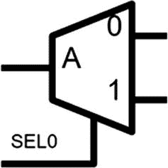

图 2-41

多路分解器

解复用器具有输入 A 或 F 和两个输出 0 和 1 或 A 和 B，以及选择器线 SEL0。输入线上的二进制模式将被转换为输出线上的值。当选择线为低时，A 处的输入将在线 0 上，当选择线为高时，多路复用器将 A 处的输入分配给线 1。

## 结论

在本章中，我们讲述了基本的电子学，重点是一些常用的实际元件。我们研究了无源模拟器件，以及半导体、二极管、晶体管和 MOSFETs。我们还看了一些数字电子元件。掌握了数字电子学的基础知识，当你以后使用微控制器时，你会更好地理解它们。我希望在这一章中，你将会学到电子学的概念是建立在彼此的基础上的。尽管二极管和晶体管是模拟元件，但它们可以组合起来形成数字构建模块，构成微控制器；这里学到的知识现在看起来很抽象，但我可以保证，当我们了解微控制器上的各种外设时，我们就会明白这些信息有多有用。这里的信息将为您的微控制器之旅服务。