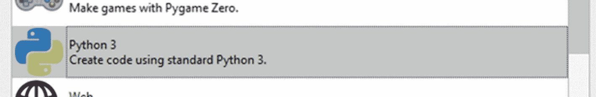

# 四、Python 编程

Python 是一门庞大而复杂的语言，我不希望在一章中涵盖它。有太多的函数、结构和编程构造需要详细说明，以使您成为一名优秀的 Python 用户。然而，我将尝试应用 80/20 法则，也称为帕累托法则。因为我们学习 Python 的目的是用 CircuitPython 编写微控制器，所以我可以省略很多东西，但仍然可以让你理解这本书。

出于这个原因，我们将学习你需要知道的 20%的语言，以处理你可能用 CircuitPython 做的 80%的任务。因此，这一章将呈现核心语言的一个子集，简要地涵盖该语言最重要的方面。如果你有使用 Python 编程的经验，你可能会认为我应该添加其中的一个。不过，我在这里介绍的子集已经足够了，例如，任何来自 Arduino 或 C 背景的人都可以轻松掌握。

## 编写 Python 程序

Python 程序通常是在带有“.”的文本文件中编写的。py”扩展名。Python 有两个版本，一个是 Python 2，它是 Python 的传统版本，另一个是 Python 3，它是当前版本，得到了很好的支持。出于大多数目的，我们将关注 Python 3，因为这是 CircuitPython 中使用的版本。如果您觉得有必要运行本章中介绍的任何程序，您可以使用 Mu 编辑器。

为此，只需点击如图 [4-1](#Fig1) 所示的模式按钮。


图 4-1

模式按钮

点击这个按钮后，应该会出现一个窗口；从对话框中，选择图 [4-2](#Fig2) 中的“Python 3”选项，启动一个新的 Python 程序。



图 4-2

Python 3 选项

一旦它被选中，一个窗口打开；我们在文本区输入我们的程序，并按下图 [4-3](#Fig3) 中描述的运行按钮。


图 4-3

运行按钮

我们的程序将运行，并在位于 IDE 底部的控制台窗口中查找输出。我们的程序完成后，我们可以点击停止按钮，如图 [4-4](#Fig4) 所示。


图 4-4

停止按钮

现在你知道了如何运行 Python 程序，我们可以看看如何使用 Python 语言了。

首先看一下 Python 程序的典型结构，以此开始我们对 Python 编程的讨论是很重要的。清单 [4-1](#PC1) 展示了我们将在本书中使用的一个基本 Python 程序的例子。我们使用 import 语句在程序中引入模块，这样我们就可以使用其中包含的方法。我们还将有一个主循环，称为无限期运行的超级循环。哈希符号“#”后的单词称为注释。这些被 Python 解释器忽略了，但是允许我们向自己和其他程序员解释我们的代码在做什么。

```py
# import math modules
import math

# main super loop
while(True):
    # call method from our imported module
    print (math.sqrt(4))

Listing 4-1Basic Python Program

```

在 Python 中，我们访问的方法是代码块，只有在被点符号调用时才会运行。我们的数学模块有一个我们想要使用的名为平方根的方法，所以我们称之为“math.sqrt”方法。还有一个打印声明。print 语句用于将东西输出到我们的显示器，我们可以用它从程序中获取信息。所有 Python 程序都将保持这种基本结构，你将在后面的章节中看到。

## 空白

需要注意的是 Python 程序中的空白。当我们谈论空白时，我们真正谈论的是不可见的字符，比如制表符、空格、换行符等等。

一些编程语言会忽略空白，但是在 Python 中，空白扮演了一个特殊的角色。空白用来构建你的 Python 程序。虽然许多编程语言使用花括号来表示代码块的开始和结束位置，但在 Python 中，空格用于表示程序中的代码块。注意空格，因为它在 Python 代码中特别重要。这本书里的程序相当短，没有太多的缩进层次；然而，你仍然应该注意程序中的空白。

## 评论

注释是 Python 程序中的文本，是为了程序员的利益而存在的，因为它们被解释器忽略了。良好的编程实践要求您包含足够多的注释，以便其他程序员在阅读您的代码时能够意识到程序在做什么。注释还会提醒你你的代码做了什么，因为将来你可能需要更新或维护你的代码。

虽然评论是必要的，但重要的是不要滥用评论和放置太多。就像生活中的任何事情一样，保持平衡很重要，所以使用评论，但不要过度使用。

用 Python 写注释有两种方法。有一个单行注释占据了一行，它是通过使用散列符号来完成的。解释器会忽略放在这个符号后面的任何内容。这是在清单 [4-2](#PC2) 中完成的。

```py
# a single line comment

Listing 4-2Single-Line Comment

```

还有跨越多行的注释，用于注释块。这些使用包含在两组三重引号中的注释。清单 [4-3](#PC3) 向我们展示了这些多行注释的样子。

```py
"""
a multiline block comment
That spans multiple lines
"""

Listing 4-3Multiline Comment

```

每种注释类型都有它们的用途，并且它依赖于您所维护的代码库或者您所工作的团队，这将决定您将使用哪种注释风格。

## 变量和常数

当编写程序时，我们需要某种方法来存储信息并在以后检索它。我们用变量来做这件事。变量允许我们给一个内存位置指定一个名字，在那个位置存储数据，然后在以后检索它。我们在 Python 中赋予变量的名称必须符合某些参数。有效的 Python 变量可以是数字和字符的组合，也统称为字母数字字符。这意味着在创建 Python 程序时，只能使用字母、数字和下划线。清单 [4-4](#PC4) 展示了有效 Python 变量名的例子。

```py
Foo
dove
_topshot
RickyTicky99

Listing 4-4Example Valid Python Variable Names

```

虽然在变量名中使用数字是有效的，但是不能以数字作为变量名的开头。变量名中也不能有空格，并且不能在变量名中使用关键字(作为语言的一部分保留的词)。清单 [4-5](#PC5) 向我们展示了一些无效的变量名。

```py
20Foo
dove bird
$upermaniac
for

Listing 4-5Example Invalid Python Variable Names

```

为了确保您不使用任何保留的关键字作为变量名，表 [4-1](#Tab1) 显示了我们不能使用的变量名，按字母顺序排序。

表 4-1

Python 中的保留关键字

<colgroup><col class="tcol1 align-left"> <col class="tcol2 align-left"> <col class="tcol3 align-left"> <col class="tcol4 align-left"> <col class="tcol5 align-left"></colgroup> 
| 和 | 艾列弗 | 如果 | 或者 | 产量 |
| 如同 | 其他 | 进口 | 及格 |   |
| 维护 | 除...之外 | 在 | 上升 |   |
| 破裂 | 最后 | 存在 | 返回 |   |
| 班级 | 错误的 | 希腊字母的第 11 个 | 真实的 |   |
| 继续 | 为 | 非局部的 | 尝试 |   |
| 极好的 | 从 | 没有人 | 随着 |   |
| 是吗 | 全球的 | 不 | 正在… |   |

当变量在程序执行过程中不能改变时，我们称这些变量为常量。在 Python 中，我们通常用大写字母来声明变量，并将它们放在 constants.py 文件中。

在程序中使用变量之前，我们必须声明它。清单 4-6 向我们展示了如何声明一个变量。

```py
# declaring a variable
myVar = None

Listing 4-6Declaring a Variable

```

在我们声明一个变量后，我们可以给它赋值。给变量赋值的过程称为变量的初始化。清单 [4-7](#PC7) 展示了我们如何初始化一个变量。

```py
# initializing a variable
myVar = 10

Listing 4-7Initializing a Variable

```

如清单 [4-8](#PC8) 所示，我们可以同时声明和初始化一个变量。

```py
# declaring and initializing a variable
anotherVar = 10

Listing 4-8Declaring and Initializing a Variable

```

## 数据类型

变量可以属于 Python 语言中几种数据类型中的一种。变量的类型决定了变量中可以存储什么类型的数据以及它占用多少内存。我们不需要告诉 Python 一个变量是整数(一个数字)还是字符串(比如单词)，因为 Python 会自动处理这些赋值。表 [4-2](#Tab2) 中给出了我们程序中最常用的四种数据类型及其用法。

表 4-2

常见数据类型

<colgroup><col class="tcol1 align-left"> <col class="tcol2 align-left"></colgroup> 
| 

数据类型

 | 

描述

 |
| --- | --- |
| int(整数) | 这是一个整数或数字，如 10、20、100、4000 |
| 浮动(浮动) | 这是一个浮点数或带小数点的数字，例如 4.5、60.9、300.03、1000.908 |
| 字符串 | 字符串是引号(双引号或单引号)之间的一组字符，例如，“Andy”或“Maggie” |
| 布尔值（布尔值） | 可以表示真或假的数据类型 |

要查看变量的类型，只需使用“type(variableName)”就可以看到关键字的类型。

## 经营者

Python 提供了执行许多逻辑和数学运算的工具。为了实现这一点，Python 有很多可以使用的操作符。这些运算符可以是算术、关系、逻辑、按位和赋值运算符。表 [4-3](#Tab3) 列出了一些常见的运算符，并提供了它们的用法示例。这个表并不详尽，但它确实让您了解了可用的内容。

表 4-3

常见 Python 运算符

<colgroup><col class="tcol1 align-left"> <col class="tcol2 align-left"> <col class="tcol3 align-left"> <col class="tcol4 align-left"></colgroup> 
| 

操作员

 | 

类型

 | 

描述

 | 

使用

 |
| --- | --- | --- | --- |
| + | 算术 | 将两个操作数相加 | X + Y |
| - | 算术 | 从第一个操作数中减去第二个操作数 | X - Y |
| * | 算术 | 将两个操作数相乘 | X * Y |
| / | 算术 | 将分子除以分母 | X / Y |
| % | 算术 | 模运算符给出除法运算的余数 | X % Y |
| ** | 算术 | 这是指数运算符，执行幂运算 | X**Y |
| == | 比较 | 如果两个操作数相等，那么 Python 会将条件评估为真 | A==B |
| ！= | 比较 | 如果两个操作数不相等，Python 会将条件评估为真 | 答！= B |
| > | 比较 | 如果左边的操作数大于右边的操作数，则条件为真 | A > B |
| < | 比较 | 如果左边的操作数小于右边的操作数，则条件为真 | A < B |

## 列表

任何编程语言的一个重要组成部分是它支持的数据结构的类型。列表是 Python 编程语言的一种基础数据结构。列表存储已排序的项目集合，并且列表可以更改。清单 [4-9](#PC9) 向我们展示了 Python 中的一个列表。

```py
# python list
myList = ["boy", 15, 1.2]

Listing 4-9Example List in Python

```

在 Python 中，列表中的项目被分配一个从 0 开始的索引。我们可以通过使用清单 [4-10](#PC10) 中的代码来获得一个列表的索引。

```py
# get index of list item
myList = ["red", "orange", "green"]
print(thislist[1])

Listing 4-10Get Index of List Item

```

请记住，当我们向前移动时，列表中的元素从零开始。

## 元组

我们在上一节中了解到，列表可以存储数据类型的集合。但是，有时您需要另一种方法来组织数据。对于这样的场景，我们可以使用元组。

在 Python 中，一个元组结构可以被认为是一个列表；然而，我们不能改变元组中包含的元素。清单 4-11 向我们展示了如何使用元组。

```py
# tuple example
myTuple=("red", "orange", "green")
print(myTuple)

Listing 4-11Python Tuple

```

我们可以像访问列表一样访问元组中条目的索引。清单 [4-12](#PC12) 展示了我们如何做到这一点。

```py
# access tuple item index
myTuple = ("red", "orange", "green")
print(myTuple[0])

Listing 4-12Access Items of Tuple

```

## 如果语句

**if** 语句用于在你的程序中做决定(参见清单 [4-13](#PC13) )。为此，该语句检查布尔表达式是否为真。如果表达式为真，将执行该语句。

```py
if (x > y):
    doSomething()

Listing 4-13if Statement

```

## else 语句

**else** 语句用于补充 if 语句并创建一个决策块。当 if 语句中的布尔语句评估为 false 时，else 语句执行。清单 [4-14](#PC14) 向我们展示了 else 语句是如何运行的。

```py
if (x > y):
   doSomething()

else:
  doSomethingElse()

Listing 4-14else Statement

```

## elif 语句

很多时候，在我们的程序中，我们可能需要在我们的决策块中测试不止两个条件。为了测试几个条件，我们必须使用 **elif** 语句来测试这些多个条件。清单 [4-15](#PC15) 给了我们一个 else if 语句的例子。

```py
if (x > y):
   doSomething()

elif (x == y):
  doSomethingElse()

else:
   doTheOtherThing()

Listing 4-15else if Statement

```

## 有几分地

有时，如果 if 语句足够短，并且您只有一条语句要执行，您可以将它放在一行中，如清单 [4-16](#PC16) 所示。

```py
# single line if statement
if x == y: print("its equal")

Listing 4-16One-Line if

```

## for 循环

有时，我们需要执行一段代码指定的次数。为了帮助实现这一点，我们使用了一个与范围函数相结合的 **for** 循环。清单 [4-17](#PC17) 给出了一个使用范围函数的 for 循环的例子。

```py
# print 0 to 9
for x in range(10):
  print(x)

Listing 4-17for Loop

```

请记住，Python 从 0 开始计数，因此当前面的语句运行时，它将在控制台中打印从 0 到 9 的数字，而不是 10。

## while 循环

虽然带有 range 函数的 for 循环允许我们运行一个代码块一定的次数，但有时我们不确定我们需要执行一个代码块多少次。在这种情况下，我们使用一个 while 循环，该循环在为循环执行指定的条件保持为真的情况下执行。这是本书中许多程序的基础。清单 [4-18](#PC18) 向我们展示了 while 循环的样子。

```py
while (True):
   runForever()

Listing 4-18while Loop

```

while 循环在许多嵌入式应用程序中用于保持程序无限期运行，当它这样做时，我们称之为超级循环。

## 功能

有时，在您的 Python 程序中，您可能会发现自己不得不一遍又一遍地运行相同的代码块。Python 中有一个名为 function 的特性，可以让您调用自己编写的代码块并返回一个值，而不是多次键入同一个代码块。这些函数可以接受输入的参数，然后对它们做一些事情。如果你需要从一个函数中返回值，你可以使用 return 语句。

例如，让我们编写一个函数，它将接受两个变量并对其中一个进行乘方，然后调用它三次来演示这是如何工作的，如清单 [4-19](#PC19) 所示。

```py
def addVar(a, b):
     print (a**b)

addVar(3, 6)
addVar(2, 8)
addVar(1, 9)

Listing 4-19Functions

```

## λ函数

有时，在我们的程序中，我们可以创建一个 lambda 函数。Lambda 函数允许我们编写不需要命名的小函数。清单 [4-20](#PC20) 向我们展示了如何用一个小的 lambda 函数替换前面的函数。

```py
x = lambda a, b : a**b
print (x(2, 5))

Listing 4-20Lambda Functions

```

## 异常处理

有时，我们的部分代码不能按预期工作，尽管它可能遵循程序的所有语法规则，但 Python 解释器执行的语句可能仍然无效。例如，如果我们试图打印一个不存在的变量，尽管用 print 函数打印一个变量在语法上是正确的，但由于变量尚不存在，我们会得到一个错误。当我们“尝试”执行语句失败时，程序不会崩溃，我们可以通过将代码块放在 except 语句下来做其他事情。清单 4-21 向我们展示了异常处理是如何工作的。

```py
 try:
  print(undefVar)
except:
  print("Causes Exception")

Listing 4-21Exception Handling

```

## 面向对象编程

Python 是众所周知的面向对象编程语言。这意味着我们可以创建一些特殊的代码，作为我们创建其他代码的蓝图。我们称这个特殊的蓝图代码为类。这个蓝图的正式名称是对象构造函数，我们用它来创建类的实例。我们也可以拥有存在于一个类中的函数，当我们这样做时，它们被称为方法。

在 Python 中，类中有一个特殊的方法，每次我们使用它来创建一个名为 __init__()方法的对象时，都会调用这个方法。在 Python 中，我们可以在用“self”调用之前修改类的实例；使用 self，我们可以访问 Python 类的属性和方法，这些属性和方法将在对象初始化后对其执行。

一个对象是一个类的实例，它从这个类中获取它的属性，并用来模拟现实世界中的事物。想想一辆车；两辆汽车可能有相同的品牌和型号，但颜色不同。除了颜色属性不同之外，它们在功能上是相同的。在 Python 中，也是这样——有时，我们需要相同的对象，但需要对其中一个进行稍微不同的修改；在这种情况下，我们将创建一个类，然后我们可以分别修改该类的两个实例。清单 [4-22](#PC22) 向我们展示了 Python 中的类是什么样的。

```py
# create the car class
class AwesomeCar:
    # our special method that lets us
    # initialize attributes of the class
    def __init__(self, color):
        # these remain the same
        self.make = "Tayaba"
        self.model = "Nimbus"
        # the colors change
        self.color = color

# create instance of our car class
Car1 = AwesomeCar("Red")

# create another instance of our car class
Car2 = AwesomeCar("Blue")

# print car attributes
# prints {'make': 'Tayaba', 'model': 'Nimbus', 'color': 'Red'}
print(Car1.__dict__)

# print car attributes
# prints {'make': 'Tayaba', 'model': 'Nimbus', 'color': 'Blue'}
print(Car2.__dict__)

Listing 4-22Python Class

```

我们可以用(__dict__)打印该类的所有属性，该属性本身就是对象拥有的属性，包含为对象本身定义的所有属性。

在 Python 中，我们将在整本书中使用许多类及其方法；《objects》中的这一小段碰撞部分足以让你看完这本书的其余部分。

## 随机和时间

有时，我们需要生成随机数，因此，Python 提供了一个名为 random 模块的模块来实现这一点。我们还有一个模块叫做睡眠模块，它允许我们的代码等待一段时间。清单 [4-23](#PC23) 展示了我们如何一起使用这两个模块。

```py
# our random module
import random

# the time module
import time

# super loop
while (True):
    # create a random number between 1 and 10
    x = random.randint(1, 10)

    # print the number
    print(x)

    # once per second
    time.sleep(1)

Listing 4-23Using Random and Time

```

## Python 诉 circuitpython 案

使用最广泛的 Python 发行版是我们所知的 CPython。CPython 是 Python 编程语言的“黄金标准”实现，因为它被称为该语言的参考实现。CircuitPython 旨在兼容 CPython 然而，由于微控制器内存不足的明显原因以及为了便于使用，一些在 CPython 中可用的库可能在 CircuitPython 中不可用。然而，来自核心语言的大多数东西都可以工作，用 CircuitPython 编写的代码在 CPython 中是有效的，但反过来就不一定了。然而，核心语言就在那里，你可以用 CircuitPython 编写许多令人惊叹的程序。

## 我的 Python 程序如何运行？

如果您不熟悉微控制器和编程，您可能会想知道 Python 程序是如何从您的编辑器(如 Mu)进入微控制器执行的。因此，在这一节中，我给出了运行 Python 程序时会发生什么的高级概述。

Python 是一种被称为解释语言的语言，这意味着当程序运行时，它获取我们源代码中的每条语句，并将其转换为我们的微控制器可以理解的机器语言。这与编译器不同，编译器在程序运行之前将编写的代码转换成机器代码。

Python 程序以三种状态运行，它们是

*   初始化

*   汇编

*   执行

在我们开始研究 Python 程序是如何运行的之前，我们必须记住 Python 解释器是用 C 编写的，因此它仅仅是一个用 C 代码运行的程序。在初始阶段，当我们编写程序并将其加载到 C 程序中时，程序会寻找 Py_main 程序，这是主程序中的主要高级函数。然后调用处理程序初始化等的其他支持函数。

在这个阶段之后，我们进入编译阶段，在这个阶段，称为解析树生成和抽象语法树(AST)生成的事情发生，以帮助生成字节码。这些字节码指令不是机器码；相反，它们独立于我们正在使用的平台。然后字节码被优化，我们得到了需要运行的目标代码。在 CircuitPython 中，我们可以选择在程序运行之前将代码转换成字节码，这样的文件会被赋予一个“.”。mpy”扩展名。这些文件可以像普通文件一样导入，并且更紧凑，从而更有效地使用内存。

最后，我们的程序在 Python 虚拟机(PVM)中执行。虚拟机是运行这些字节码指令的解释程序中的一个功能。它只是一个大的超级循环，一个接一个地读取我们的字节码指令并执行它们。

## 结论

在这一章中，我们简要地看了一下 Python 和这种语言的一些特性。一旦你阅读了这一章，你应该对 Python 编程语言有一个基本的了解。编程是一件需要你长时间学习的事情，因此我们写代码是很重要的。只有通过编写代码，你才能学会你正在使用的语言，因此，在下一章，我们将看看如何使用 Python 来控制我们的微控制器硬件。