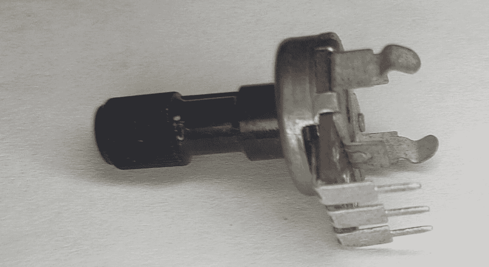
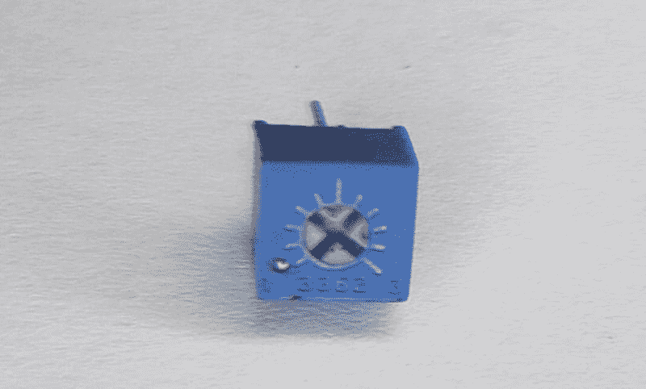
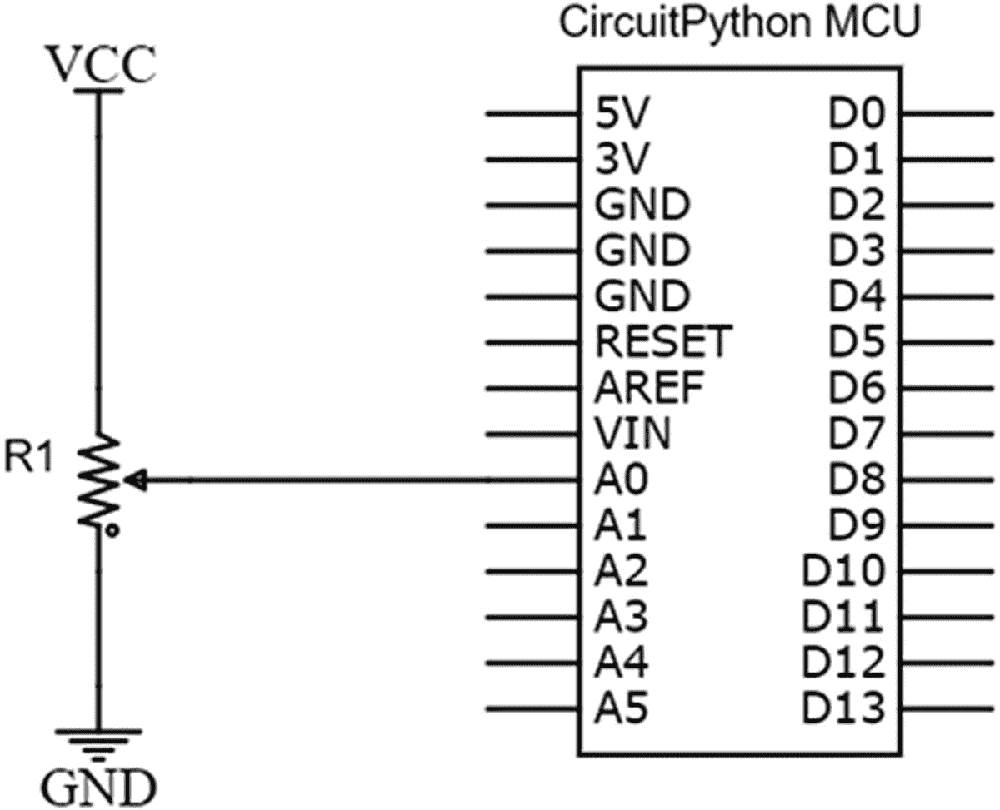
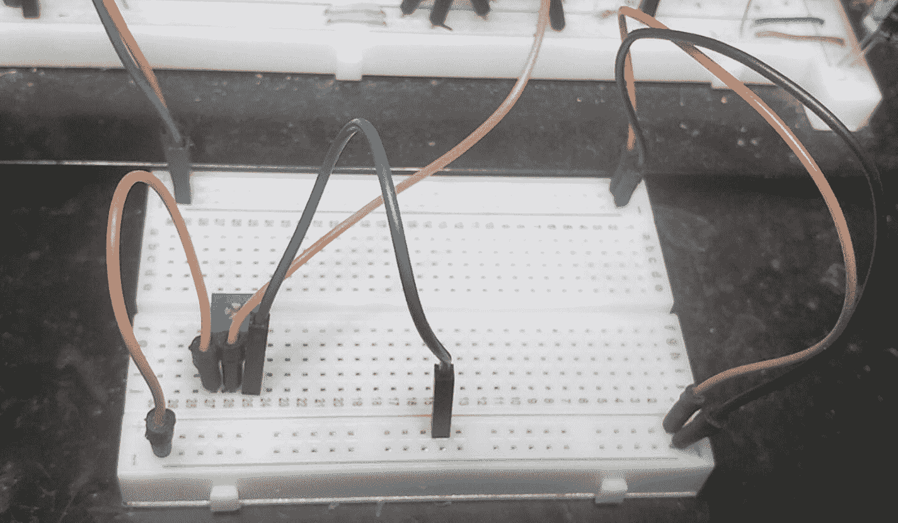
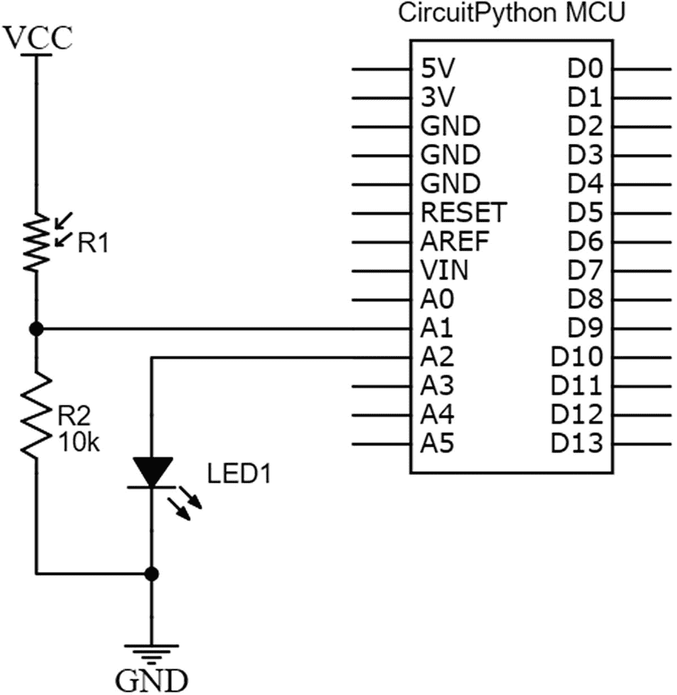
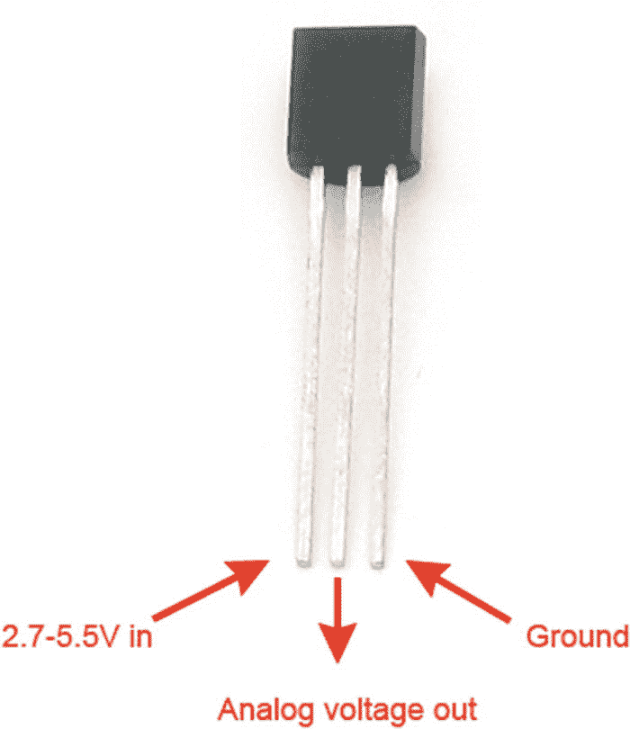
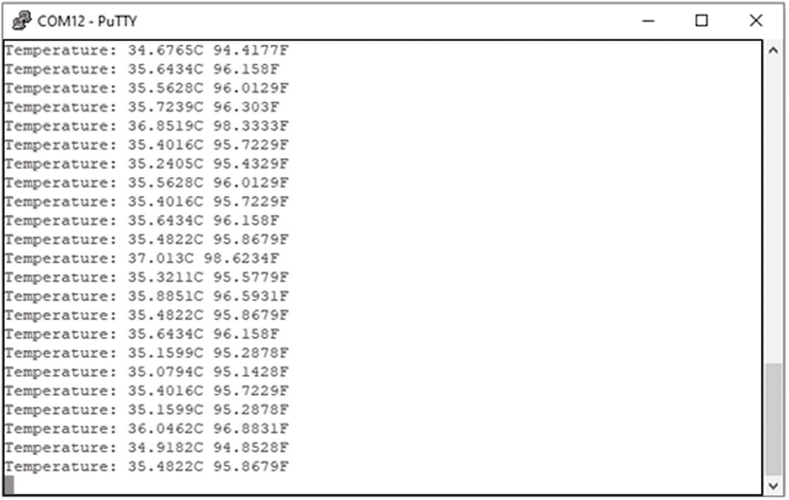

# 6.数据变换

微控制器的主要优势之一是能够数字化我们熟悉的模拟信息，如温度、湿度和光强。我们可以获取这些模拟传感器读数，并将其转换为数字形式，作为我们可以分析和处理的信号。将模拟信号转换为数字信号是微控制器设备的标志，因为许多利用微控制器的智能设备应用将监控传感器，然后根据该数据执行一些操作。模数转换是任何对微控制器感兴趣的人的基本话题。

在这一章中，我们先来看看模数转换，然后看看我们可以通过这种方法获取数据的一些传感器。我们将使用的传感器包括电位计、光敏电阻和温度传感器。

## 模数转换

任何像样的微控制器都会配备模数转换模块。*模数转换* (ADC)模块将提供给它们的信息转换成微控制器可以处理的二进制表示。

我们的物理世界本质上是模拟的。拿你手机的录音系统来说:你对着手机的麦克风说话，接收到的信号是模拟的。然后，麦克风必须将您声音中的模拟信息转换为微控制器可以解释的数字信号。其中一个应用是语音识别系统，设备中的微控制器需要监听“唤醒词”。“唤醒词”是可以用来引起计算设备注意的单词或短语。微控制器需要将你的声音转换成数字形式，这样它就可以搜索单词，从而将设备从睡眠中唤醒。大多数智能手机还具有过滤背景噪音或放大语音信号的功能。使用微控制器的 ADC 模块，您可以轻松滤除进入麦克风的音频中的噪声。这种类型的滤波器虽然不像我们在第 [2](02.html) 章中学习的硬件滤波器，但实际上是一种在软件中运行的数字滤波器。然而，它们的功能与您之前学习的过滤器相似。

我们在第 [2](02.html) 章中了解到，模拟电路被称为连续电路；因此，它们产生的信号本质上是连续的。当我们说一个信号是连续的时，我们的意思是它的特征是随着时间的变化在信号中的点之间平滑过渡。正如我们所知，由数字电路产生的数字信号具有离散性。出于我们的目的，这些可以被认为是连续信号的数字表示。

让我们先仔细看看什么是信号。信号可以被认为是我们用来提取信息的能量。在微控制器电子设备中，信号采用传感器产生的电压或电流形式。传感器产生的信号通常不是我们可以直接获取信息的形式，因为我们缺乏处理传感器信息的能力。微控制器需要为我们读取传感器，然后通过某种显示器以我们可以理解的方式传递信息。微控制器也可以获取这些信息并执行一些操作。例如，数控烤箱可能有一个热电偶传感器来读取烤箱内的温度。当烤箱内的温度达到预设温度时，微控制器需要关闭加热器。这只是可能使用 ADC 模块的一种应用。

## ADC 硬件

有几种方法可以执行模数转换，其中最常用的是使用*逐次逼近型 ADC 电路*。逐次逼近型 ADC 使用各种电路元件。逐次逼近电路使用的这些组件包括将数字信号转换成模拟信号的数模转换器(DAC)。它还使用一个比较器、一个采样保持(S & H)电路和一个控制电路，我们一会儿会讲到。逐次逼近型 ADC 电路看起来有点像图 [6-1](#Fig1) 。


图 6-1

逐次逼近电路

该电路首先从微控制器引脚获取输入。由于典型微控制器上只有一个 ADC 模块，使用多路复用器电路，我们可以将电压从几个引脚路由到微控制器内的 ADC 模块。这是因为一个模块一次只能读取一个引脚，很多时候，我们可能需要我们的微控制器来读取几个传感器。

为确保 ADC 正常工作，需要拍摄微控制器引脚电压的快照。由于传感器会持续输出数据，ADC 电路需要时间来执行转换，因此需要拍摄该快照。该快照是在微控制器调用 ADC 模块执行转换时拍摄的。简单来说，使用电容是因为，正如我们之前所学，电容可以存储电压。电容器将被充电到与我们想要读取其电压的引脚相同的电压值。例如，如果一个传感器输出 3.7 伏，然后快速输出 3.9 伏，然后 4.0 伏，我们需要一些序列来有效地数字化所有这些读数。这是因为单独的 ADC 模块无法执行并行转换。ADC 模块首先需要获取 3.7 伏电压，将其转换为数字形式，然后是 3.9 伏电压，依此类推。

电容充电的电压将是我们在微控制器上执行逐次逼近程序的电压。我们将 ADC 模块上带电容的前端称为采样保持(S&H)电路。

一旦 S&H 电路上有电压，与 ADC 电路一起工作的比较器就开始工作。这两个电路的结合将持续将输入端的电压减半。当我们说输入端的电压时，我们实际上指的是快照电压。该过程将继续，直到我们达到这些电路的组合所允许的最接近输入值。

在讨论 ADC 的时候，经常出现的一个词就是分辨率。让我们仔细看看什么是决心。ADC 模块有一系列值可用来表示转换后的信号。该值表示为模块输出的二进制位数。本质上，引起比特变化的最小电压就是我们所说的分辨率。根据 ADC 的分辨率，ADC 模块将具有一定数量的电压阶跃，可用于表示测量的电压。电压步进数越多，ADC 模块的分辨率越高。

为了输出信息，ADC 电路将利用来自比较器和 DAC 的转换值，将模块输出的二进制数的最高有效位(MSB)处理到最低有效位(LSB)。这是为了尽可能匹配输入端读取的电压值，并以二进制形式表示。该输出值当然受到 ADC 模块内 DAC 分辨率的限制。这是因为电压可以被削减的次数取决于 DAC 的分辨率。该值随后从 ADC 模块输出，以便 CPU 读取和处理。

为应用选择微控制器时，有时 ADC 的分辨率可能是选择器件的决定性因素。例如，读取温度或光传感器所需的分辨率可能不那么重要。然而，如果我们需要建立一个用于语音识别的电路，您将需要高分辨率来拥有一个功能电路。微控制器上的 ADC 电路通常具有约 8 至 16 位的分辨率。对于大多数传感器读数应用，这就足够了，如果需要更高的分辨率，例如在专业医疗应用中，可以使用外部 ADC IC。

## 深入了解 ADC

现在，我们来看看讨论 ADC 时可能会遇到的一些额外术语。在讨论 ADC 时，我们首先需要讨论的是采样。如前所述，为了让 ADC 模块有时间处理读取值，必须拍摄电压快照。采样是指我们在一段时间内可以拍摄的快照数量。当我们谈到模数转换中的采样时，我们指的是 ADC 模块复制正在分析的信号并创建尽可能接近原始信号的数字等效物的能力。数模转换器能够捕获的样本越多，原始信号的数字表示就越精确。

你可能会遇到的一个难题是，试图确定我们需要采集的样本的最佳数量，以便恰当地表示我们正在采样的信号。如果我们接受很多信号，那么我们的模块将会很慢，可能没有我们的应用所需要的响应时间。另一方面，如果我们取的样本太少，我们会有一个快速的转换；然而，我们可能没有原始信号的精确表示。称为奈奎斯特采样速率的特殊采样速率是用于确定最小采样时间的基准。

奈奎斯特采样速率是指最小采样速率至少是我们试图采样的信号最高频率的两倍。例如，如果信号的最高频率预计为 10 kHz，则最低采样速率必须为 20 kHz。换句话说，采样保持电路必须每秒拍摄 20，000 张快照才能充分测量信号。

ADC 模块还有一个数据采样速率，通常用 ADC 模块能够测量的每秒样本数(SPS)来衡量。通常，我们会看到制造商以每秒千个样本(kSPS)或每秒百万个样本(MSPS)来指定采样速率。

ADC 转换的另一个方面是量化。量化是指将 ADC 的输入电压值映射到 ADC 能够产生的输出值的过程。例如，一个 10 位 ADC 模块将具有从 0 到 1023 的步长。我们称这个从 0 到 1023 的值为 ADC 的量化电平。8 位 ADC 的量化级别为 0 至 255。这种量化是对等于我们试图在引脚上测量的电压的值进行舍入的名称。这意味着，在最严格的意义上，我们可以将分辨率重新定义为两个相邻量化级别之间的度量距离。

## 电位计

我们要研究的第一个配合 ADC 模块使用的器件是电位计。当我们观察现实世界中的嵌入式器件时，你会发现许多器件中都有电位计。例如，立体声系统和扬声器系统上的音量旋钮使用电位计，以允许用户调整这些设备上的音量。这些设备都使用电位计电路来正常工作。在图 [6-2](#Fig2) 中，我们看到了电位计的样子。



图 6-2

电位计

电位计可能有不同的形状因素；但是，如果我们观察它的机械结构，我们会发现它们都是三针装置，在顶部有一个转动机构，以便进行调整。有时，您可能会看到一个看起来像电位计的器件，上面有五个或更多的引脚。这不是电位计，而是旋转编码器，功能不同。

电位计的三个引脚中，一个连接到供电轨，另一个连接到地电源，第三个连接到微控制器的输入引脚。当您调节电位计上的旋钮时，您所做的是将模拟输入上的电压从 0 伏特改变到 VDD。这通常可以在 0 伏到 3.3 或 5 伏的范围内。

发生这种情况的原因是电位计可以被认为是一种分压器电路。分压器是一种电路，它利用两个电阻串联时存在的特性，将较大的电压转换成较小的电压。在图 [6-3](#Fig3) 中，我们看到了这个分压器的布局。


图 6-3

该分压器

如图 [6-3](#Fig3) 所示的分压器将输出 VCC 上电压的大约一半。因此，如果 VCC 是 5 伏，那么分压器的输出将是 2.5 伏。分压器的输出被确定为在两个电阻的中点测得的电压。这就是分压器的作用。它们输出输入端输入电压的一小部分。分压器的输出不是任意的，而是由组成分压器电路的电阻值决定的。一旦我们知道了电阻值，我们就可以使用分压器公式来计算输出。当我们需要使用电阻获得特定的电压输出时，这个公式非常有用。

为了计算分压器的输出，我们使用以下公式

想要=葡萄酒(R2/(R1 + R2)

我们知道图 [6-3](#Fig3) 中的分压电路将提供一半的输入电压；然而，如果我们想计算同样的数学，我们可以使用我们的分压公式。如果我们想计算 Vout，可以使用公式并输入 Vin、R1 和 R2 的值。进行计算时，我们将 R1 作为顶部电阻，R2 作为底部电阻，我们得到

vot = 5v(1/(1+1)= 5v x 0.5 = 2.5

电位计起电阻器的作用，并表现出电阻。然而，它可以被认为是一个完全不同的设备，因此它有自己的示意性符号。我们在图 [6-4](#Fig4) 中看到电位计的示意符号。


图 6-4

电位计示意图符号

电位计的示意符号由一个指向电阻器的箭头组成。这意味着电阻是可调的。有时，您会看到如图 [6-5](#Fig5) 所示的较小版本的电位计。



图 6-5

微调电位器

这种电位计被称为微调电位计或微调电位计。功能与普通电位器相同；但是，它被设计为隐藏在最终产品中，并由制造商或服务人员进行调整，而不是由产品的最终用户进行调整。这些很容易识别，因为常规电位计的调节旋钮从器件中伸出，必须用螺丝刀调节才能改变它们的值。

## CircuitPython 中的模数转换

CircuitPython 提供了使用 ADC 的库。我们将为模数转换工作的库是

*   board–board 模块包含我们正在使用的电路板的引脚常量。

*   analog io–这是一个包含所有类的模块，提供对我们正在使用的模拟输入和输出功能的访问。该模块允许我们从模拟引脚读取模拟数据。

*   时间–时间库包含允许微控制器使用时间相关功能的函数。睡眠方法是我们用来帮助微控制器计时的方法。

Note

有些主板可能不支持某些功能，如模拟输入功能，尤其是当它们的固件处于测试阶段时；因此，最好查看您所用主板的发行说明。

## 带 MCU 的 ADC 原理图

电位计可以连接到我们的 MCU，如图 [6-6](#Fig6) 所示。



图 6-6

带电位计的 MCU

## ADC 电路连接技巧

以下是连接电路的推荐步骤:

1.  将一根跳线从微控制器上的 A0 引脚连接到试验板原型制作区域的一个插座。

2.  将电阻器的中心引线连接到步骤 1 中使用的试验板同一行中的另一个插座。

3.  用一根跳线将它从电位计的一根引线连接到 VCC。

4.  用跨接线将电位计的最后一根引线接地。

当你完成电路连接后，它看起来应该类似于图 [6-7](#Fig7) 。



图 6-7

带电位计试验板的 MCU

一旦你有了你的电路设置，我们运行如清单 [6-1](#PC1) 所示的程序。记得检查你的连接，确保它们符合你的原理图，否则你有损坏电路板电路元件的危险。出于这个原因，我总是建议您在关闭电源的情况下连接电路，然后在编写测试程序之前打开电源。

## 带电位计程序的 CircuitPython

现在我们已经连接了物理电路，我们可以看看如何使用 CircuitPython 读取电位计。在 Mu 编辑器中编辑您的 code.py 文件，以反映清单 [6-1](#PC1) 。

```py
# import time module
import time

# import the board module
import board

# import our analog read function
1 from analogio import AnalogIn

# read the A0 pin on our board
2 analog_in = AnalogIn(board.A0)

# get the voltage level from our potentiometer
3  def get_voltage(pin):
    return (pin.value * 3.3) / 65536

# print the voltage we read

4  while True:
    print((get_voltage(analog_in),))
    time.sleep(0.1)

Listing 6-1MCU with Potentiometer Program

```

我们做的第一件事是导入控制电路板所需的 CircuitPython 库。这些是我们通常进口的时间和董事会图书馆。在(1)中，我们从`analogio`模块中导入`AnalogIn`对象。这是允许我们执行模拟功能的库。我们程序(2)的下一步是创建一个 p in 对象，它将允许我们读取正在使用的特定模拟引脚。在这种情况下，我们使用电路板上的引脚 A0，并将其命名为`analog_in`。

沿着(3)的程序，我们有一个函数，允许我们从电位计读取电压电平。该函数`get_voltage`将引脚作为输入，然后执行计算以返回正确的电位计读数。在我们的超级循环中的(4)处，我们使用`get_voltage`函数读取我们的模拟输入引脚，并将该读取电压连续打印到我们的串行控制台。一旦一切运行正常，在你的串行控制台中，你应该看到如图 [6-8](#Fig8) 所示的输出。


图 6-8

带电位计输出的 MCU

当我们调整电位计的输入时，我们看到输出从 0 伏变为 3.3 伏左右，该值被打印到串行端子上。

## 光敏电阻

由于这种读取模拟传感器的能力，我们现在能够使用的一种传感器是光敏电阻。光敏电阻是一种电阻器，它根据照射到其上的光量来改变电阻。当没有光照射在光敏电阻上时，它具有极高的电阻，大约为几十万欧姆。然而，当光照射到光敏电阻上时，电阻下降到几百欧姆。为了创建一个读取光敏电阻的程序，我们需要创建一个分压电路。这个分压电路将由光敏电阻和常规电阻组成。然后，微控制器将读取电路的输出，以确定光敏电阻的亮度变化。

## 带 mcu 原理图的光探测器

我们如图 [6-9](#Fig9) 所示连接电路。光敏电阻连接到引脚 A1，LED 连接到引脚 A2。



图 6-9

带摄像头的单片机

## 光电探测器电路连接提示

以下是连接电路的推荐步骤:

1.  将一根跳线从微控制器上的 A2 引脚连接到试验板原型制作区域的插座，再连接到 LED 的一根引线。

2.  用跨接导线将 LED 的另一根导线接地。

3.  用一根跳线将光敏电阻的一根引线连接到 VCC。

4.  将光敏电阻的另一根引线连接到 10k 电阻器的一根引线上。

5.  用一根跨接导线将 10k 电阻的另一根导线接地。

6.  在电阻器和光敏电阻的交叉点与微控制器上的引脚 A1 之间连接一根跳线。

当你完成连接电路时，它应该看起来如图 [6-10](#Fig10) 所示。


图 6-10

带照片显示试验板的 mcu

现在我们有了电路设置，我们可以写一些代码了！

## 带 CircuitPython 程序的光敏电阻

在 Mu 编辑器中编辑您的 code.py，使其类似于清单 [6-2](#PC2) 。

```py
# import the board module
import board

# import time library
import time

# import our analog read function
from analogio import AnalogIn

# import pin control
import digitalio

# set an adjust value
1 adjustValue = 2000

# create object for pin we are using
2  led = digitalio.DigitalInOut(board.A2)

# set the pin to output

3 led.direction = digitalio.Direction.OUTPUT

# read the A1 pin on our board
4 photoresistor = AnalogIn(board.A1)

# set an ambient light value
5 ambientLightValue = photoresistor.value

# release the pin for other use
6 photoresistor.deinit()

# print the voltage we read
7 while True:
    # read the photoresistor
    photoresistor = AnalogIn(board.A1)
    # if bright turn the LED off
    if (photoresistor.value > ambientLightValue - 2000):
        led.value = False
    # turn the LED on
    else:
        led.value = True

    # release the pin for other use
    photoresistor.deinit()

Listing 6-2MCU with Photoresistor Program

```

这个程序做了很多事情。让我们看看会发生什么。在程序的顶部，我们导入我们的电路板、时间、模拟和数字库。在(1)中，我们创建了一个`adjustValue`变量，用于帮助读取光敏电阻。我们的下一步是在(2)处创建一个表示真实世界 LED 的对象，并将其设置为(3)处的输出。然后，我们创建一个对象来表示(4)处的光敏电阻。在(5)中，我们从光电管中读取一个读数并存储该值。这是当前存在的环境光的值。

注意，在读取数据后，我们必须使用(6)中的`deinit`方法来允许我们的 pin 在程序的其他部分使用。如果我们不这样做，那么我们就不能在超级循环中使用 pin。

在(7)的超级循环中，我们不断读取光敏电阻值。有一个条件，检查是否有黑暗的 LED。如果有黑暗，LED 就打开，有光亮的时候，我们就把 LED 关掉。

保存程序并运行它。你会观察到，用手盖住光敏电阻，LED 就亮了；然而，当 LED 处于环境亮度或更亮时，LED 将不被点亮。

## 温度传感器

现在我们可以使用模拟输入的一种传感器是温度传感器。我们将使用的温度传感器是 TMP36 温度传感器，它使用电压作为输出，以摄氏度为单位提供温度读数。TMP36 如图 [6-11](#Fig11) 所示。



图 6-11

TMP36 温度传感器认证:adafruit.com ada fruit

TMP36 温度传感器器件有三个引脚。一个是连接到正电源的 VCC 引脚。还有一个连接到地的 GND 引脚和一个由微控制器读取的模拟电压输出引脚。根据 VCC 的电压值，微控制器可以进行一些计算来确定我们正在读取的温度。

该传感器的工作电压范围为 2.7 至 5.5v，是一款非常通用的传感器，可以与所有配有 ADC 模块的普通微控制器配合使用。它能够与基于 CircuitPython 的 3.3 伏 MCU 配合使用，该电压在器件的电压范围内。温度传感器可以测量从-50 摄氏度到 125 摄氏度的温度，这对于您将要承担的大多数项目来说都是一个很好的范围。

## 带 MCU 原理图的温度传感器

我们如图 [6-12](#Fig12) 所示连接电路。我们的 TMP36 连接到 A0 模拟输入引脚。使用 CircuitPython MCU 时，我们需要电容 C1 和电阻 R1 来获得传感器的精确读数。这是由于高速读取传感器的设备的基本配置。


图 6-12

带 MCU 原理图的温度传感器

## 温度传感器电路连接提示

以下是连接电路的推荐步骤:

1.  将一根跳线从 TMP36 温度传感器的 VCC 引脚连接到试验板的正供电轨。

2.  用一根跳线将传感器的接地引脚连接到试验板的接地轨。

3.  将 47k 电阻器的一根引线连接到 TMP36 传感器的输出引脚，并将电阻器的另一根引线连接到传感器的接地引脚。

4.  将电容的一根引线连接到接地引脚，另一根引线连接到 TMP36 传感器的输出引脚。

5.  在温度传感器的输出引脚和运行 CircuitPython 的 MCU 上的引脚 A0 之间连接一根跳线。

当您完成电路连接时，它看起来应该类似于图 [6-13](#Fig13) 。


图 6-13

试验板上集成 MCU 的温度传感器

## 带 CircuitPython 程序的温度传感器

在 Mu 编辑器中编辑您的 code.py，使其类似于清单 [6-3](#PC3) 。这个例子由 Adafruit Industries 提供的用于读取传感器的例子修改而来。

```py
# import the board module

import board

# import the time module
import time

# import module for reading analog input
import analogio

# sensor connected to pin A0
1 TMP36_PIN = board.A0

# function for reading the temperature sensor
2 def tmp36_temperature_C(analogin):
    # convert the voltage to a temperature
    millivolts = analogin.value * (analogin.reference_voltage * 1000 / 65535)
    return (millivolts - 500) / 10

# create instance of analog object for sensor
3 tmp36 = analogio.AnalogIn(TMP36_PIN)

# super loop

4 while True:
    # read temperature in Celsius
    temp_C = tmp36_temperature_C(tmp36)
    # use Celsius to get Fahrenheit value
    temp_F = (temp_C * 9/5) + 32

    # print our temperature
    print("Temperature: {}C {}F".format(temp_C, temp_F))

    # every second
    time.sleep(1.0)

Listing 6-3MCU with Temperature Sensor Program

```

在这个程序中，我们做了我们通常的导入工作来启动和运行开发板。在(1)中，我们设置了连接到模拟输入引脚 A0 的温度传感器。在(2)中，我们有一个读取温度传感器并进行电压到温度转换的函数。在(3)中，我们为温度传感器创建一个模拟对象的实例。在主程序中，我们在(4)处运行一个超级循环，读取传感器数据并每秒钟将其打印到输出控制台。如果您查看您的串行控制台，您应该会得到类似于我在图 [6-14](#Fig14) 中得到的输出。



图 6-14

温度传感器输出

## 结论

在本章中，我们讨论了模数转换的基础知识。我们研究了微控制器 ADC 电路在硬件中的工作原理，在学习这些电路工作原理的过程中，我们发现了电位计、光敏电阻和分压器的工作原理。我们还学习了如何将 CircuitPython 用于模拟输入。利用这些信息，我们能够读取温度传感器并将信息输出到串行终端。有了这里获得的知识，数百个传感器现在由你支配。