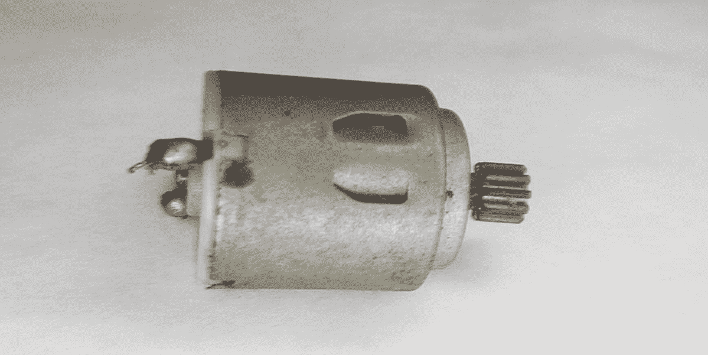
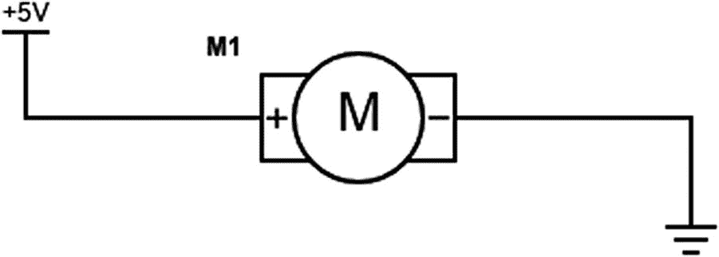
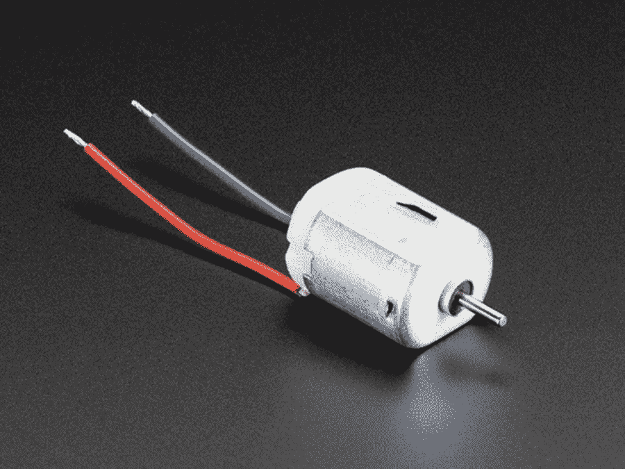
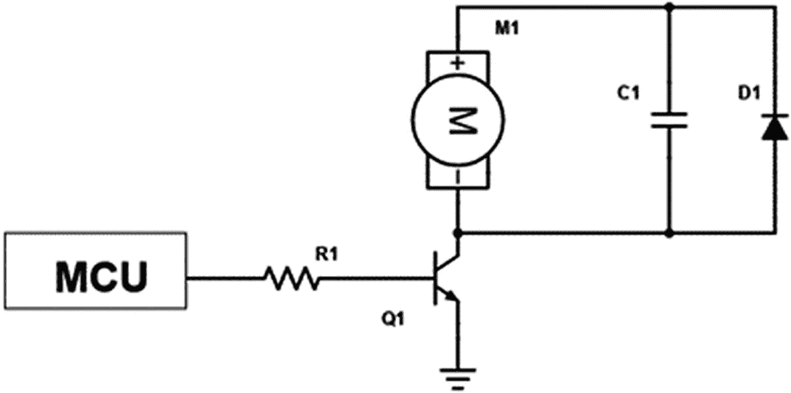
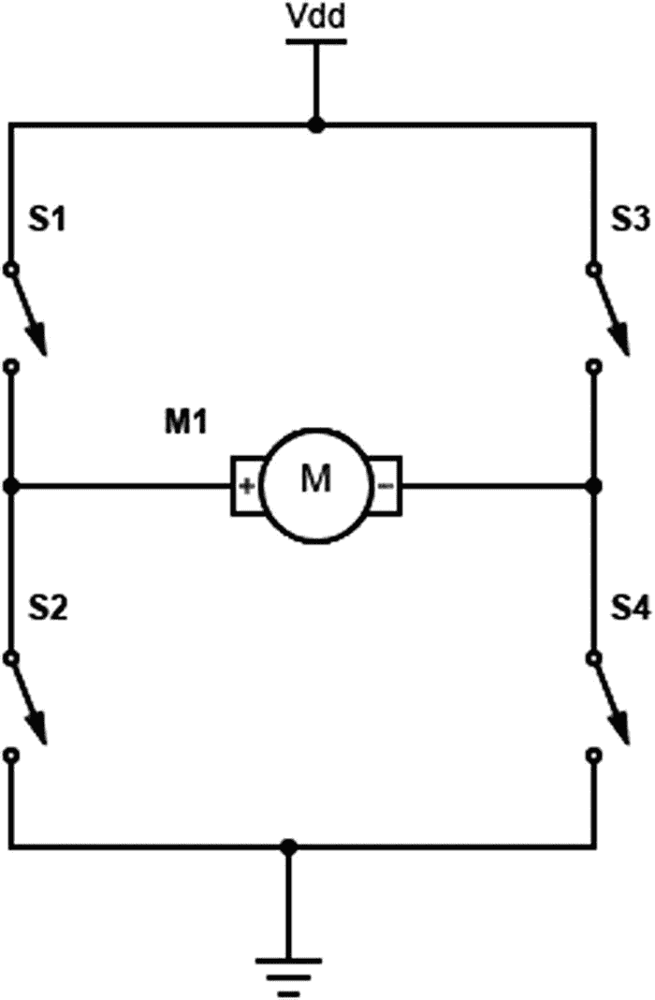
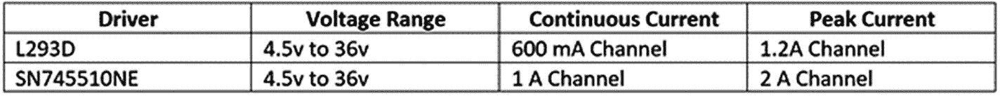
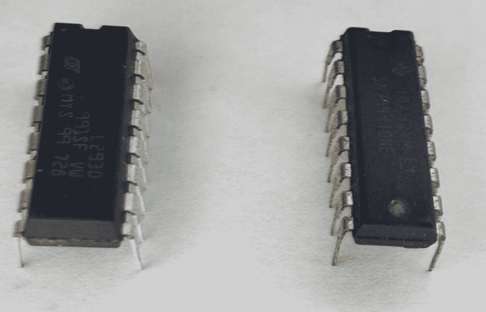
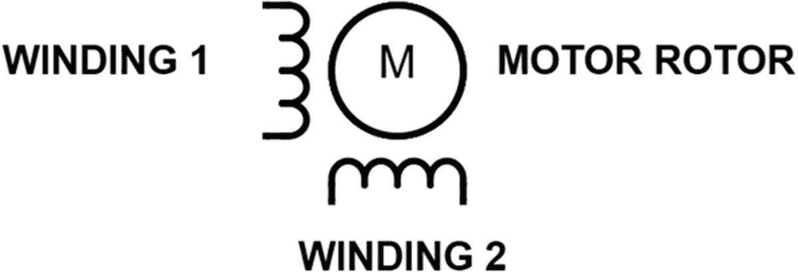
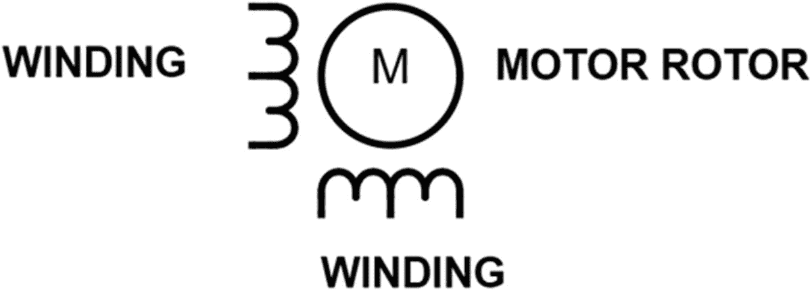
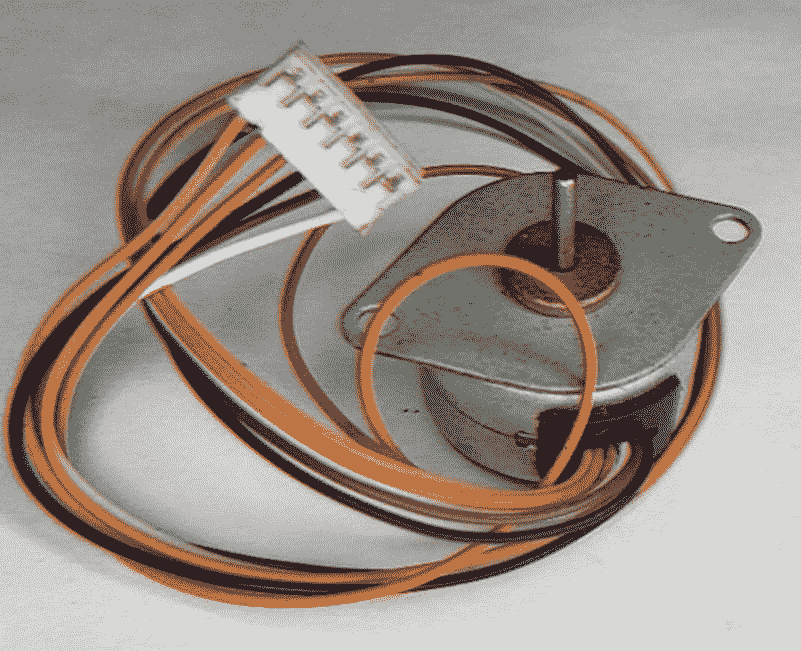

# 九、控制 DC 执行器

微控制器可以用来控制致动器设备。致动器是一种负责运动的装置。致动器分为两组，即机械致动器和机电致动器。在这一章中，我们将研究控制一些重要的机电 DC 执行器。学会控制执行器后，整个世界向你敞开。自动锁，机器人，数控机床更容易理解，以后你就有能力造这种设备了。

## DC 汽车公司

您将使用的第一种类型的致动器是 DC 马达。DC 电机被用于很多设备，从玩具，如遥控汽车，到电器和工具，如无绳电钻。

当电势差(电压)施加在它们的端子上时，这些电机通过旋转动作运行。

有两种类型的 DC 电机，有刷 DC 电机和无刷 DC 电机。无刷 DC 电机比有刷 DC 电机具有更好的热特性和更高的效率。然而，有刷 DC 电机可以以更简单的方式驱动，从而降低系统成本。

有刷 DC 电机是你可能会在自己的项目中使用的类型，尽管在本章的后面我们还会看到一种称为步进电机的无刷 DC 电机。

图 [9-1](#Fig1) 显示了玩具和其他简单设备中常见的典型有刷 DC 电机。



图 9-1

有刷 DC 电机

由于其机械结构，有刷 DC 电机的寿命比无刷电机短。这是因为有刷 DC 电机有一个被称为电刷的部件，它会随着时间的推移而磨损。

## 驾驶 DC 汽车

有刷 DC 电机应该很好开；我的意思是，如果你把一个 DC 发动机连接到电池上，如图 [9-2](#Fig2) 所示，它应该会运行。



图 9-2

带电池的 DC 发动机

然而，这种简单的方法缺乏智能控制，并且电机将仅在一个方向上旋转。如果我们想让马达在智能控制下反方向旋转，那就不仅仅需要把 DC 马达和电池连接起来。使用 MCU 驱动电机的方式如图 [9-3](#Fig3) 所示。


图 9-3

用单片机驱动 DC 电机

电路运行的前提很简单。来自微控制器的信号将使晶体管打开或关闭。根据晶体管的状态，电流将流过电机，使其旋转。我们必须记住，电机是一个感性负载。因此，D1 是一个缓冲二极管，保护其他电路元件免受电机产生的感应尖峰的影响。如果您确实需要对振动电机等小型电机进行简单的开/关控制，那么您可以使用图 [9-4](#Fig4) 中的电路。


图 9-4

一种实用的开关控制电路

这里，在图 [9-4](#Fig4) 中，我们有一个如图 [9-3](#Fig3) 所示版本的实际电路。为了驱动电机，我们使用 2N2222A 晶体管，它可以处理高达 800 mA 的电流，足以驱动电机。虽然 2N3904 经常被宣传为 2N2222A 的替代品，但在本电路中并不合适，因为 2N3904 的电流处理能力仅为 200 mA。如果你想驱动需要简单开/关控制的小电机，这个电路是很好的。如图 [9-5](#Fig5) 所示，用于触觉反馈的振动电机或用于玩具等的标准 130 DC 电机是理想的选择。



图 9-5

标准 130 adafruit.com DC 汽车信贷公司

虽然简单的开/关控制确实有其应用，但如果我们真的想要一个智能电机控制，我们需要像方向和速度控制这样的东西。这些属于脉宽调制的范畴，我们将在下一节讨论。

## 脉宽灯

如果你真的想用微控制器来控制电机的速度，那么你必须考虑一种叫做脉宽调制(PWM)的东西。在讲 PWM 之前，我们先来看一下图 [9-6](#Fig6) 中的方波。


图 9-6

方波

在你的方波上，你有一个我们称之为高电平时间的时间和一个我们称之为低电平时间的时间。如果这个方波是由微控制器产生的，我们可以将高电平时间设为 3.3 伏，低电平时间设为 0 伏。这种脉冲重复的频率称为波的频率，我们用赫兹(Hz)来测量。波的周期是频率的倒数，指的是周期重复一次所需的时间。

由于波的周期是频率的倒数，随着波形频率的增加，波的周期将同时减小。

PWM 的一个重要方面是占空比。众所周知，数字信号可以是高电平或低电平。波形的高电平时间称为占空比，通常用百分比表示。例如，如果一个波一半时间为高电平，一半时间为低电平，则可以说它的占空比为 50%。

图 [9-7](#Fig7) 显示了我们可以在波形上识别占空比的图表。


图 9-7

占空比

通过调整波形的占空比，我们可以有效地调整输出的电压水平。这是一种强大的技术。使用 PWM，我们可以控制发光二极管的亮度和控制电机的速度。

## 电路中的 PWM python

如今，几乎每个微控制器都提供了支持 PWM 的模块，CircuitPython 提供了用于控制这些 PWM 模块的库。大多数支持 CircuitPython 的 MCU 都有 PWM 引脚，在输出引脚旁边印有一个小小的波浪号“~”。为了在 CircuitPython 中使用 PWM，我们使用以下库:

*   电路板–我们需要电路板库来指示微控制器的特定引脚。

*   时间–时间库提供了处理基于时间的活动的功能。

*   pulse io–pulse io 库是 CircuitPython 中 PWM 用法的核心。该库为支持 PWM 的引脚提供了函数。

## 使用 CircuitPython 程序进行 PWM

我们可以使用 PWM 模块来淡化 LED。我们可以使用 PWM 来淡化电路板上的 LED。清单 [9-1](#PC1) 中有一个程序，我们可以用它来淡化连接到 PWM 引脚的 LED，在本例中是引脚 D13。大多数支持 CircuitPython 的电路板都有一个 LED 连接到此引脚；如果此引脚上没有 LED，或者您使用的是定制板，则可以用一个 1k 电阻将 LED 连接到引脚 D13。

```py
# import time functions
import time

# import our board specific pins
import board

# library for using PWM
(1) import pulseio

# setup the pwm using Pin13, with a frequency of 5000 Hz
(2) pwmLed = pulseio.PWMOut(board.D13, frequency=5000)

(3) while True:
    for i in range(100):
        # PWM LED up and down
        if i < 50:
            # below 50 pwm up
            pwmLed.duty_cycle = int(i * 2 * 65535 / 100)
        else

:
            # more than 50 pwm down
            pwmLed.duty_cycle = 65535 - int((i - 50) * 2 * 65535 / 100)
        # slow it down so we can see
        time.sleep(0.05)

Listing 9-1The PWM Program

```

当你运行程序时，你会看到 LED 变得非常亮，然后逐渐消失，变得暗淡。该程序的工作原理如下。在(1)中，我们导入了用于使用 PWM 的“pulseio”库。在(2)中，我们在引脚上创建一个 PWM 模块实例，并将频率设置为 5000 赫兹。在(3)中，我们有一个主程序循环，在该循环中，我们递增然后递减 PWM 占空比一个指定的周期。这导致 LED 具有褪色效果。

## 控制电机速度

如果你想控制 DC 电机，标准的方法是用 PWM 控制。如果我们提供电机运行所需的最大电压，那么电机将全速运行。然而，如果我们通过使用 PWM 调整电机的占空比来快速打开和关闭电机，我们将能够控制电机的有效或平均速度。

我们可以创建如图 [9-8](#Fig8) 所示的硬件连接来控制电机速度。



图 9-8

电机控制的连接

这与我们在本章前面讨论的电路相同。我们只需将“MCU”替换为您选择的引脚和一个晶体管，该晶体管可以处理您想要控制的电机的电流。为了控制电机速度，我们可以使用 MCU 的 PWM 来改变电机的速度，使用晶体管来做重物提升。然而，有一种更好的方法，我们将在下一节中探讨。

## H 桥

如果你需要简单的开/关控制或者只是调整电机的转速，用晶体管驱动电机是很好的选择。然而，在有些情况下，你不仅希望调整电机的速度，还需要控制旋转的方向。移动机器人就是一个很好的例子。在移动机器人中，机器人不仅需要向前行驶，还需要反向行驶。要做到这一点，您可以使用一种称为 H 桥的电路配置，如图 [9-9](#Fig9) 所示。



图 9-9

H 桥

该电路将如下工作。当 S3 和 S2 关闭时，电机将正向旋转，当 S1 和 S4 关闭时，电机将反向旋转。使用 H 桥时，避免在驱动电机时产生短路非常重要。如果左边的两个开关(S1 和 S2)或右边的两个开关(S3 和 S4)都闭合，那么您将创建从源到地的短路。如果使用 H 桥 IC，通常会包括热关断功能，以防止这些器件被损坏。但是，您不应该依赖这种保护机制来保护您的 IC。

通常，当您需要高电流处理能力时(在这种情况下大于 5A)，通常用 MOSFETs 构建 H 桥。然而，对于大多数低于 5A 的应用，您可以使用 H 桥 IC。有可能获得处理 5A 以上电流的 IC 驱动器。然而，由于功耗水平以及电机可能需要的峰值电流，构建分立 H 桥通常更经济。

可能有些人不同意我的观点，但随着半导体技术的进步，为大多数应用构建自己的分立驱动器将不再必要。

对于低电流应用(< 5A)，通常使用 H 桥驱动器 IC。两种常见的 H 桥 IC 是 L293D 和 SN754410NE 四路半 H 驱动器。这些驱动程序非常相似，在大多数应用中可以互换使用。

与 L293D 相比，SN754410NE 具有更高的连续电流输出和更高的峰值电流。图 [9-10](#Fig10) 突出了这两种驱动器的特征差异。



图 9-10

L293D 与 SN754410NE 特性的关系

在图 [9-11](#Fig11) 中，我们看到了两个设备的物理布局。L293D 在左边，SN754410NE 在右边。



图 9-11

L293D 与 SN754410NE 物理封装

图 [9-11](#Fig11) 中的封装是 PDIP-16 封装，它们的引脚相互兼容。芯片的内部逻辑和电机电源都有 VCC 电源。VCC1 为芯片的内部逻辑供电，连接到 5v，VCC2 连接到电机电源，通常为 9–12v。

左马达连接到针脚 1Y 和 2Y，右马达连接到针脚 3Y 和 4Y。引脚 1A 和 2A 是左逻辑引脚，3A 和 4A 引脚是右逻辑引脚。1，2 EN 使能左驱动器，3，4 EN 使能右驱动器。

驾驶员基本上有三种被驱动状态，即前进、后退和制动。在正向状态下，我们将一个开关设为高电平，另一个设为低电平。对于反向旋转，我们反转引脚上的逻辑电平。为了创建制动场景，我们将两个逻辑电平引脚都设为低电平状态。

## 带 MCU 原理图的 h 桥

我们可以使用逻辑电平转换器将微控制器连接到 L293D，因为 L293D 需要 5v 逻辑，我们有运行 CircuitPython 的 3.3v 器件。如图 [9-12](#Fig12) 所示连接原理图。


图 9-12

带 H 桥的 CircuitPython MCU

1.  将微控制器的引脚 D12 和 D13 连接到逻辑电平转换器的 LV1 和 LV2。

2.  将逻辑电平转换器上的 GND 引脚连接到试验板上的接地轨。

3.  将逻辑电平转换器的 HV1 引脚连接到 H 桥 ic 的 INPUT1 引脚，将 HV2 引脚连接到 INPUT2 引脚。

4.  将电机的一个引脚连接到输出 1，另一个引脚连接到输出 2。

5.  H 桥的使能引脚连接到 MCU 的 A1。

6.  将 H 桥 IC 的正极引脚连接到电源轨，将 GND 引脚连接到接地轨。

连接的电路应如图 [9-13](#Fig13) 所示。注意你使用的电机的大小很重要，因为越大的电机使用的电流越大；因此，你必须确保额外的电容器放置在电源轨上，如图 [9-13](#Fig13) 所示。如果你不放置这些额外的电容，那么微控制器将复位，你将有一个意外的操作。H 桥运行时，无需连接驱动器右侧的接地连接，但如果您愿意，也可以将其连接起来作为预防措施。


图 9-13

试验板上集成 MCU 的 h 桥

## h 桥与 CircuitPython 程序

我们将编写一个程序，使用 PWM 来限制由 L293D 电机驱动器驱动的电机的速度，这将允许我们控制电机的方向。我们将打开 Mu 编辑器并创建清单 [9-2](#PC2) 中的程序。

```py
# import time functions
import time

# import our board specific pins
import board

# library for using PWM
(1) import pulseio

# library for working with digital output
import digitalio

# create instance of enable pin
(2) en = digitalio.DigitalInOut(board.A1)

# set the enable pin to output
en.direction = digitalio.Direction.OUTPUT

# start with enable false
en.value = False

# setup the pwm using Pin13, with a frequency of 5000 Hz
# steup the pwm using Pin12, with a frequecny of 5000 Hz
(3) in1 = pulseio.PWMOut(board.D13, frequency=5000, duty_cycle=0)
in2 = pulseio.PWMOut(board.D12, frequency=5000, duty_cycle=0)

# turn in forward direction
(4) def forward():
    print("forward")
    en.value = True
    in1.duty_cycle = 20000
    in2.duty_cycle = 0
    time.sleep(3)

# reverse direction
(5) def reverse():
    print("reverse")
    en.value = True
    in1.duty_cycle = 0
    in2.duty_cycle = 20000
    time.sleep(3)

# stop motors
(6) def stop():
    print("stop")
    en.value = False
    in1.duty_cycle = 0
    in2.duty_cycle = 0
    time.sleep(2)

# super loop

(7) while True:
    # forward
    forward()

    # stop before transition
    stop()

    # reverse
    reverse()

    # stop before transition
    stop()

Listing 9-2Using the H-Bridge

```

在程序中，我们做我们通常的导入，在(1)中，pulseio 库被导入用于处理 PWM 引脚。在(2)处，设置使能引脚，并设置其方向和状态。在(3)处，设置 PWM 实例，用于连接 H 桥。在(4)、(5)和(6)中，创建了允许电机正转、反转和停止的功能。正向功能允许电机正向旋转，反向功能允许电机反向旋转，停止功能阻止电机移动。

在(7)的超级循环中，我们正向旋转电机 3 秒钟；请注意，在我们转换到另一个方向之前，我们停止电机 2 秒钟。在那之后，我们反转马达的方向，这样无限地继续下去。

## 伺服电机

在上一节中，我们介绍了有刷 DC 电机以及如何驱动它们。另一个常见的 DC 致动器你可能会遇到的是 DC 伺服电机。这些伺服电机是 R/C(无线电控制)伺服电机，因为它们旨在用于与遥控器(通常是模型飞机)相关的爱好应用。

这些电机不需要外部电机驱动器。这是因为它们是独立的，具有带控制电路的 DC 电机和集成到设备中的齿轮系。

这些电机有三根电线，如图 [9-14](#Fig14) 所示。一根导线向伺服系统供电，另一根导线接地，最后一根导线用于向电机发送控制信号。电源线通常为红色，接地线为棕色或黑色，控制信号为白色或橙色。

图 [9-14](#Fig14) 中的伺服系统是 MG90D，这是一个很好的标准微伺服系统，可以在您自己的项目中使用。

有两种类型的伺服，这是连续旋转和标准伺服电机。连续旋转伺服电机可以旋转完整的 360 度，而标准伺服范围从 0 到 180 度。

为了控制伺服电机，我们需要在信号线上发送一个脉冲。对于连续旋转的伺服系统，脉冲的长度将决定伺服系统旋转的速度。在标准伺服电机中，脉冲长度将决定伺服旋转的位置。

脉冲长度将由制造商指定。然而，对于典型的伺服系统，1 ms 的脉冲宽度将使电机转到 0 度位置。当提供 1.5 毫秒的脉冲宽度时，它将使电机转向 90 度位置。最后，当我们提供一个 2 毫秒的脉冲，电机将转向 180 度的位置。


图 9-14

遥控伺服电机

伺服电机也需要发送一个信号来保持其位置一段时间。如果不发送该信号，电机的运行可能会变得非常不规则，出现跳动。

## CircuitPython 中的伺服电机

控制一个伺服系统很简单，但对初学者来说可能会令人望而生畏。为了使用伺服功能，我们必须使用 PWM 来控制脉冲。幸运的是，CircuitPython 提供了我们可以用来控制伺服系统的库。要使用伺服电机，我们需要

*   pulseio 库——这将允许我们使用 PWM 来控制伺服电机。

*   这个库包含了我们控制伺服电机所需要的函数。该库还提供了一些与刷 DC 和步进电机工作的函数。要使用这个库，我们需要将它复制到微控制器上的 lib 文件夹中。

## 带 MCU 原理图的伺服电机

我们需要使用逻辑电平转换器将微控制器连接到伺服系统，因为伺服系统运行在 5 伏电压下，但我们的微控制器是 3.3 伏器件。该示意图如图 [9-15](#Fig15) 所示。


图 9-15

带伺服原理图的 MCU

我们按如下方式连接电路:

1.  将伺服电机的 V+引脚连接到电源轨。

2.  将伺服电机的 GND 引脚连接到试验板的 GND 轨道。

3.  信号引脚连接到逻辑电平转换器的 HV3 引脚。

4.  将逻辑电平转换器的 LV3 连接到微控制器的 A2 引脚。

5.  将逻辑电平转换器的 GND 引脚连接到试验板上的接地轨。

在图 [9-16](#Fig16) 中，我们看到了电路的试验版。


图 9-16

带伺服试验板的 MCU

## 带 CircuitPython 程序的伺服电机

为了控制伺服电机，我们将使用 adafruit_motor 库函数，该示例将电机扫过 180 度圆弧。清单 [9-3](#PC3) 中给出了程序。

```py
# import the time library
import time

# import the board pins
import board

# import library for working with PWM
import pulseio

# import library for working with servo
(1) from adafruit_motor import servo

# create a PWMOut object on Pin A2.
(2) pwm = pulseio.PWMOut(board.A2, duty_cycle=2 ** 15, frequency=50)

# Create a servo object, my_servo and set the min and max pulse
(3) my_servo = servo.Servo(pwm, min_pulse = 500, max_pulse = 2800)

(4) while True:
    for angle in range(0, 180, 5):  # 0 - 180 degrees, 5 degrees at a time.
        my_servo.angle = angle
        time.sleep(0.05)
    for angle in range(180, 0, -5): # 180 - 0 degrees, 5 degrees at a time.
        my_servo.angle = angle
        time.sleep(0.05)

Listing 9-3Using the Servo Motor Program

```

在我们的程序中，我们执行通常的导入以及 pulseio 库来处理 PWM。在(1)中，我们导入了 adafruit_motor 库，以允许我们控制伺服电机。在(2)中，我们在引脚 A2 上创建了一个 PWM 实例。在(3)中，我们可以操作的伺服对象被创建，并且我们设置使伺服操作所需的脉冲宽度。在(4)的主程序循环中，我们首先从 0 度到 180 度扫描伺服范围，然后从 180 度到 0 度。

在 my_servo 对象中随意调整最小和最大脉冲；该程序已配置为与 MG90S 电机或同等产品一起工作。

## 步进电机

我们要看的最后一种电机是步进电机。步进电机是一种无刷 DC 电机，这当然使它在某些应用中优于有刷 DC 电机。步进电机非常适合位置控制，这使得它们在 CNC 机器、3D 打印机和绘图机中无处不在。步进电机还具有很高的保持转矩，这使得它们特别适合这种应用。然而，步进电机的缺点是，由于它们的结构，它们通常不如有刷 DC 电机运行得快。

步进电机有两种，双极步进电机和单极步进电机。不管是哪一种，步进电机都是通过给围绕中心转子的线圈通电来工作的，中心转子上有我们称之为磁极的永磁齿。线圈被称为定子。这些定子是电磁体，按顺序极化和去极化，使电机能够步进旋转。这些阶梯旋转一定的角度，我们称之为阶梯角。

步距角取决于步进电机内定子极和转子齿的数量。定子分阶段通电。定子的这些相是连续接通和断开的。这样做会产生一个磁场，使转子转动，从而产生步进动作。

双极步进电机由两个绕组和一个电机电枢组成，如图 [9-17](#Fig17) 所示。



图 9-17

双极步进电机

双极步进电机有四根电线。您通常会参考数据手册来确定哪两根电线属于哪个绕组对。电线通常用颜色标记，以便于识别。如果没有数据表，可以将万用表设在导通档。使用此功能，您可以检查连续性，以确定哪对电线属于同一对。

图 [9-18](#Fig18) 中所示的 42BYGHM809 是一种常见的双极步进电机。


图 9-18

42building m809 步进电机

还有单极步进电机。这些电机可采用五引脚、六引脚或八引脚配置。由于六引脚配置最为常见，这就是我们要研究的品种。六针单极步进电机的原理图如图 [9-19](#Fig19) 所示。



图 9-19

六引线单极步进电机

单极步进电机每相有一个带中心抽头的绕组。这意味着电流只沿一个方向流过线圈。这与电流双向流过线圈的双极步进电机形成对比。

我们将使用的六线步进电机是 Sinotech 25BY4801，它代表一种普通的小型步进电机，如图 [9-20](#Fig20) 所示。



图 9-20

Sinotech 25BY4801 六线步进电机

如果需要，您可以通过简单地忽略中心抽头，将六引线单极步进电机作为双极电机来驱动。

有三种方式可以用来驱动步进电机，它们是波形驱动模式、全驱动模式和半驱动模式。

在波形驱动模式下，我们一次给电机上的每个定子线圈通电一次。这样做的结果是，它给了我们更少的输出扭矩，但也减少了电机消耗的功率。

在全驱动模式下，我们一次激励两个定子，为我们提供更大的输出扭矩，这也伴随着更大的电流消耗。

还有一种半驱动步进模式，交替激励一个相位，然后两个相位。它用于使电机的角度分辨率加倍(增加步数)。不过不要担心；我们将只关注波浪驱动和全驱动模式，这两种模式对于初学者来说更容易理解。

## CircuitPython 中的步进电机

adafruit_motor 库包含用于单极和双极步进电机的函数。然而，如果我们手动驱动电机，那么理解发生了什么会更有用。因此，我们将不使用 adafruit_motor 库函数。

## 带 MCU 原理图的步进电机

为了控制电机，我们将使用 ULN2003 IC，它可以处理步进电机的高电流要求。ULN2003 在一个封装中包含七个达林顿晶体管，在最高 40v 的电压下，每个驱动器可以处理高达 500 mA 的电流。这对于驱动我们的马达来说绰绰有余。该驱动器还包括抑制二极管，这使得它很适合驱动电感负载，如我们的步进电机。这些抑制二极管提供额外的电路保护。示意图如图 [9-21](#Fig21) 所示。


图 9-21

步进电机控制

我们可以按如下方式连接电路:

1.  将逻辑电平转换器的 GND 引脚接地。

2.  将逻辑电平转换器的 LV4 引脚连接到 D13 引脚。

3.  将逻辑电平转换器的 LV3 引脚连接到 D12 引脚。

4.  将逻辑电平转换器的 LV2 引脚连接到引脚 D11，将 LV1 引脚连接到引脚 D10。

5.  在逻辑电平转换器上，将引脚 HV4、HV3、HV2 和 HV1 分别连接到 ULN2003 的引脚 1B、2B、3B 和 4B。

6.  将 ULN2003 的 COM 引脚连接到 VCC 引脚。

7.  将步进电机的中心抽头 2 和 5 连接到 VCC。

8.  将步进电机的电线 1 和 3 分别连接到 ULN2003 的引脚 4C 和 3C。

9.  将步进电机的导线 4 和 6 分别连接到 ULN2003 的引脚 1C 和 2C。

由于 ULN2003 在 5v 逻辑下比在 3.3v 逻辑下输出更多的电流，我们使用逻辑电平转换器将来自 MCU 的 3.3v 信号转换为供 ULN2003 使用的 5v 信号。

## 步进电机与 CircuitPython 程序

我们现在可以编写一个程序，使用波形驱动和全驱动模式来控制步进电机。清单 [9-4](#PC4) 中给出了程序。该程序在紧凑的 Python 代码方面效率不高，但我觉得它对初学者来说更容易理解。

```py
# import pin constants for board we are using
import board

# import pin control
import digitalio

# import time
import time

(1) # create objects for pins we are using
WHT = digitalio.DigitalInOut(board.D10)
BLK = digitalio.DigitalInOut(board.D11)
YEL = digitalio.DigitalInOut(board.D12)
RED = digitalio.DigitalInOut(board.D13)

(2) # set the pins to output
WHT.direction = digitalio.Direction.OUTPUT
BLK.direction = digitalio.Direction.OUTPUT
YEL.direction = digitalio.Direction.OUTPUT
RED.direction = digitalio.Direction.OUTPUT

(3) # super loop
while True:
    for i in range(24):
        if i < 12:

            # phase 1
            # 1000
            RED.value = True    # A
            BLK.value = False   # B
            YEL.value = False   # C
            WHT.value = False   # D
            time.sleep(0.1)

            # phase 2
            # 0100

            RED.value = False    # A
            BLK.value = True     # B
            YEL.value = False    # C
            WHT.value = False    # D
            time.sleep(0.1)

            # phase 3
            # 0010
            RED.value = False    # A
            BLK.value = False    # B
            YEL.value = True     # C
            WHT.value = False    # D
            time.sleep(0.1)

            # phase 4
            0001
            RED.value = False   # A
            BLK.value = False   # B
            YEL.value = False   # C
            WHT.value = True    # D
            time.sleep(0.1)

            time.sleep(0.5)

        else:
            # phase 4
            # 1001
            RED.value = True    # A
            BLK.value = False   # B
            YEL.value = False   # C
            WHT.value = True    # D
            time.sleep(0.1)

            # phase 3
            # 0011

            RED.value = False   # A
            BLK.value = False   # B
            YEL.value = True    # C
            WHT.value = True    # D
            time.sleep(0.1)

            # phase 2
            # 0110
            RED.value = False   # A
            BLK.value = True    # B
            YEL.value = True    # C
            WHT.value = False   # D
            time.sleep(0.1)

            # phase 1
            # 1100
            RED.value = True    # A
            BLK.value = True    # B
            YEL.value = False   # C
            WHT.value = False   # D
            time.sleep(0.1)

            time.sleep(0.5)

Listing 9-4Using the Stepper Motor Program

```

在我们的程序(1)中，我们为正在使用的管脚创建对象，然后在(2)中，我们将管脚设置为输出管脚。这些接点是根据它们的导线颜色命名的，以使连接更容易理解。在我们的主循环中的(3)处，我们使用波形驱动模式向前旋转电机。然后，当我们达到 360 度旋转时，我们使用全驱动模式使电机回到其起始位置。

在我们的超级循环中，当“I”变量达到 12 时，步进电机将完成一次完整的旋转。由于电机的步进角度为 7.5 度，电机中有四个相位，每次变量增加，我们就步进四次，直到 7.5 度，也就是 30 度。12 次计数后，我们将旋转 360 度。

如果您愿意，可以测量电流消耗，您会发现全驱动模式比波形驱动模式消耗的电流更少。在我的测试中，全驱动模式的电流消耗约为 520 毫安，而波形驱动模式的电流消耗约为 325 毫安。

## 结论

在这一章中，我们讨论了各种 DC 致动器。我们研究了有刷和无刷 DC 电机，包括有刷 DC 电机、步进电机和伺服电机。我们讨论了这些电机的特性和用途，以及如何将它们与基于 Python 的 MCU 进行接口。通过学习这些主题，我们了解了 H 桥以及驱动 DC 电机的各种方法，并学习了控制步进电机的程序。如果您需要更多信息，我建议您查看特定电机驱动器的制造商数据表，包括 L293D 和 SN754410NE。机械臂、移动机器人，甚至无人机的设计和控制现在都可以用你在本章学到的知识来尝试。