# 一、面向调查人员的 PowerShell 简介

PowerShell 提供了一个强大的获取引擎，可以从实时系统、服务器、外围设备、移动设备和数据驱动的应用程序(如 Active Directory)中获取大量信息。

由于微软决定开放 PowerShell 并提供从其他非微软平台(如 Mac 和 Linux)获取信息的能力，可以访问的信息范围实际上是无限的(通过适当的凭证)。再加上大量的内置和第三方 CmdLets(发音为“command let”)，可以对其进行过滤、排序和整合，您就拥有了最终的获取引擎。

通过添加从 PowerShell 到 Python 的桥梁，我们现在可以利用丰富的逻辑机器学习和对 PowerShell 获取的原始信息的深度分析。图 [1-1](#Fig1) 描绘了我们将在本书中集成的核心组件。其结果将是为现场调查和事故响应应用开发新的创新方法的工作台。


图 1-1

PowerShell 和 Python

## PowerShell 的一点历史

PowerShell 是一个微软框架，包括一个命令外壳和一个脚本语言。PowerShell 传统上由系统管理员、IT 团队、事件响应小组和法医调查人员使用，以获取有关他们管理的基础架构的操作信息。如图 [1-2](#Fig2) 所示，在过去十年中发生了显著的变化。


图 1-2

PowerShell 发展

## PowerShell 如今使用情况如何？

PowerShell 通常用于自动化管理任务和检查运行的桌面、服务器和移动设备的细节。它用于检查使用通用对象模型(COM)和 Windows 管理界面(WMI)的本地和远程系统。今天，它可以用来检查和管理使用公共信息模型(CIM)的远程 Linux、Mac 和网络设备。

## 你是如何用 PowerShell 做实验的？

PowerShell 通常已经安装在现代的 Windows 桌面和服务器平台上。如果没有，可以直接打开自己喜欢的浏览器，搜索“Windows 管理框架 5”，然后下载安装 PowerShell。PowerShell 和 PowerShell ISE(集成脚本环境)是免费的。

我更喜欢使用 PowerShell ISE，因为它提供了:

1.  有助于发现和试验 CmdLets 的集成环境

2.  编写、测试和调试脚本的能力

3.  轻松访问上下文相关的帮助

4.  自动完成命令，加速开发和学习

### 导航 PowerShell ISE

安装 PowerShell ISE 后，您可以在 Windows 平台上通过单击开始菜单(Windows 8-10 的左下角)启动它，然后搜索 PowerShell ISE 并单击如图 [1-3](#Fig3) 所示的应用程序。


图 1-3

在 Windows 10 上启动 PowerShell

### 注意

您可以使用**用户**权限运行 PowerShell 和 PowerShell ISE 然而，要访问所需的许多丰富的采集功能，需要以**管理员**的身份运行 PowerShell。还有一句警告。以管理员或用户身份运行并执行 CmdLets 可能会损坏您的系统或删除重要文件！小心行事！

我通常将它添加到我的 Windows 任务栏中，以便于访问，如图 [1-4](#Fig4) 所示。PowerShell 和 PowerShell ISE 我都加了。高亮框中右边的图标是 ISE，左边的是 PowerShell。通过右键单击 PowerShell ISE 图标，然后再次右键单击 Windows PowerShell ISE 选项，您可以选择以管理员身份运行 PowerShell ISE。通过这样做，您将能够执行最广泛的 PowerShell CmdLets 和脚本。

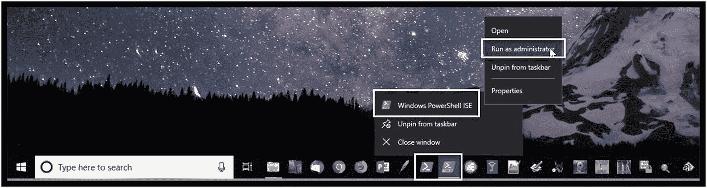

图 1-4

Windows 任务栏以管理员身份启动 PowerShell ISE

启动后，ISE 有三个主窗口，如图 [1-5](#Fig5) 所示。请注意，默认情况下不显示脚本窗格，但可以从工具栏中选择查看。我已经注释了应用程序的三个主要部分:

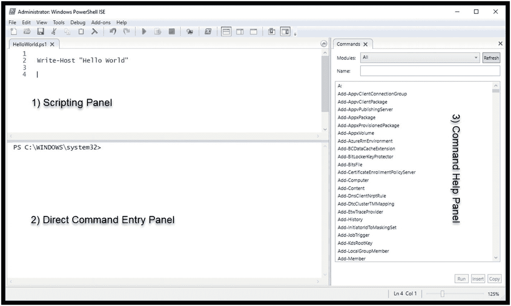

图 1-5

PowerShell ISE 界面

1.  脚本面板:该面板提供了使用附带的 PowerShell 脚本语言创建合并了多个命令的 PowerShell 脚本的能力。请注意，这不是我们在开发 PowerShell 脚本时通常开始的地方。相反，我们首先在直接命令输入面板中进行实验；一旦我们完善了我们的方法，我们就可以创建脚本。

2.  直接命令输入面板:此面板用于执行 PowerShell CmdLets。这里输入的命令比祖先的 Windows 命令行或 DOS 命令强大得多。此外，这些命令的格式和结构有很大不同，并且遵循一些严格的规则。我将在下一节解释动词-名词的格式和结构，并提供更多的细节和一些例子。

3.  命令帮助面板:该面板提供关于我们可用的每个 CmdLet 的详细帮助和信息。但是，我很少使用这个区域，而是使用 Get-Help CmdLet 请求直接帮助，以获得有关感兴趣的 CmdLet 的信息，了解它们如何操作，获得它们的使用示例，以及获得所有可用选项的详细信息。

### PowerShell CmdLets

在我们直接进入 PowerShell CmdLets 之前，有一些警告:

1.  实际上有成千上万种可能的 CmdLets。

2.  如果你考虑所有可能的变化，有成千上万种可能的选择。

3.  每天都有新的 cmdlet、变体和对现有 cmdlet 的更新被创建。

4.  每个 CmdLet 都包含详细的帮助和示例。

每天更新 CmdLet 帮助很重要，这样可以确保您能够访问有关您正在使用或计划使用的 CmdLet 的最新信息。

### 什么是 CmdLet？

CmdLet 通常是一个[轻量级](http://whatis.techtarget.com/definition/lightweight)Windows[PowerShell](http://searchwindowsserver.techtarget.com/definition/PowerShell)T4】脚本，它执行特定的[功能](http://whatis.techtarget.com/definition/function)。我在这里通常陈述的原因是，一些 CmdLet 非常广泛，并且由于能够创建您自己的 CmdLet，它们的复杂性和对系统资源的使用可以基于开发人员的目标而变化。

然后， [CmdLet](http://searchwindowsserver.techtarget.com/definition/command) 是用户给[操作系统](http://searchcio-midmarket.techtarget.com/definition/operating-system)或[应用程序](http://searchsoftwarequality.techtarget.com/definition/application)执行服务的特定命令，例如“显示所有当前运行的进程”或“显示所有当前停止的服务”

所有 CmdLets 都表示为一个**动词-名词**对，并且有一个可以使用动词-名词对`Get-Help <CmdLet name>`访问的帮助文件。所以没错，就算是帮助也只是另一个 CmdLet。更新帮助对于保持帮助与当前所有当前安装的 cmdlet 相关联以及为每天创建和更新的新 cmdlet 安装帮助至关重要。正如您可能猜到的，这只是另一个 CmdLet，这是您应该使用的第一个 CmdLet。具体来说:

```py
Update-Help

```

您可以从直接命令输入面板执行此 CmdLet，如图 [1-6](#Fig6) 所示。将为所有已安装的模块更新帮助文件。我们将在以后的章节中讨论模块，但是现在这将更新所有的标准 PowerShell 模块。其他模块，如 Active Directory、VMWare、SharePoint 和数百个其他模块，允许购买大量设备和服务。


图 1-6

更新-帮助 CmdLet 执行

### 一些关键 CmdLets 的介绍

您可能会问的第一个问题是，“有哪些 CmdLets 可用？”或者更具体地说，“有哪些针对特定信息的 CmdLets？”本节将向您介绍几个关键的 cmdlet:`Get-Help`、`Get-Process`和`Get-Member`。

#### 获得帮助

假设我们对获取当前正在运行的服务的信息感兴趣。为了找到与此主题相关的 CmdLets，我将输入:

```py
Get-Help services

```

注意，我没有请求关于特定 CmdLet 的信息，而是请求帮助系统向我提供关于可能与服务相关的任何 CmdLet 的信息。图 [1-7](#Fig7) 显示了一个简化的输出。

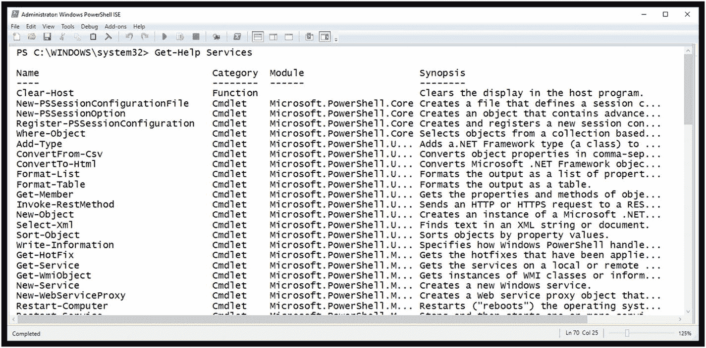

图 1-7

搜索与服务相关的 CmdLets

请注意，根据您使用的 PowerShell 版本、帮助文件的当前版本以及安装的 CmdLets，您的列表可能会有所不同。

下一步是选择一个或多个 cmdlet 并获取这些 cmdlet 的帮助。浏览这个简短的列表，Get-Service 听起来很有前途，所以我将通过键入以下命令来请求关于这个特定 CmdLet 的帮助:

```py
Get-Help Get-Service

```

图 [1-8](#Fig8) 显示了简化的输出。请注意，有多个选项与 Get-Help CmdLet 的执行相关。对于这个例子，我使用了最简单的形式。但是，我也可以选择使用其他形式的 CmdLet，例如:

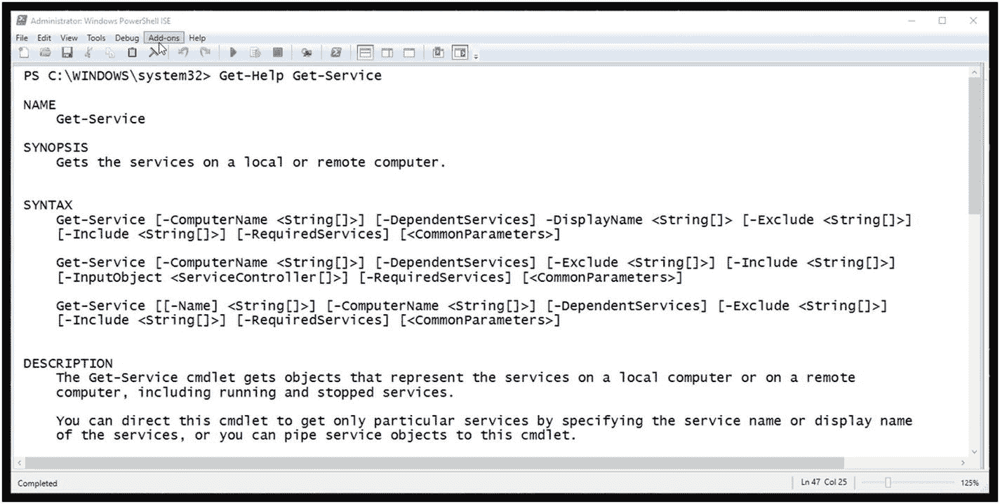

图 1-8

Get-Help Get-Service 缩写输出

```py
Get-Help Get-Service -Detailed

```

或者

```py
Get-Help Get-Service -Examples

```

检查输出时，我们注意到呈现给我们的每个命令的详细语法。此 CmdLet 允许我们获取关于本地或远程计算机上的服务的信息。选项`-ComputerName`允许我们指定多台计算机，每台计算机之间用逗号分隔。通过使用:

```py
Get-Help Get-Service -Examples

```

帮助系统将提供大量示例来演示 CmdLet 的使用(图 [1-9](#Fig9) )。

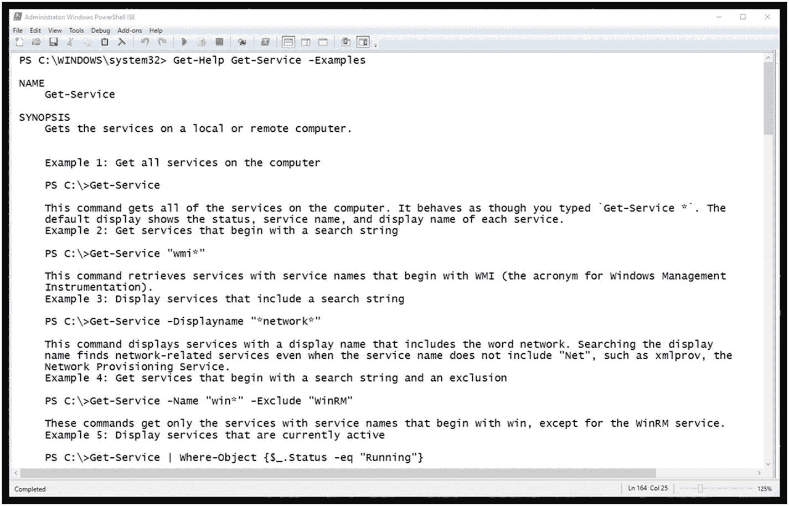

图 1-9

获取示例帮助

#### 获取流程

另一个有用的 CmdLet 是 Get-Process；与 Get-Service 非常相似，它返回关于在本地或远程计算机上运行的进程的信息。使用 Get-Help 更深入地观察 Get-Process(参见图 [1-10](#Fig10) ，我们首先注意到 Get-Process 的六种不同的基本变体。从技术上讲，这些被称为参数集，允许我们以六种不同的方式运行 Get-Process CmdLet。


图 1-10

获取帮助获取过程

检查第一组参数(见图 [1-11](#Fig11) ，我们发现所有参数都是可选的。这由每个参数周围的方括号表示。

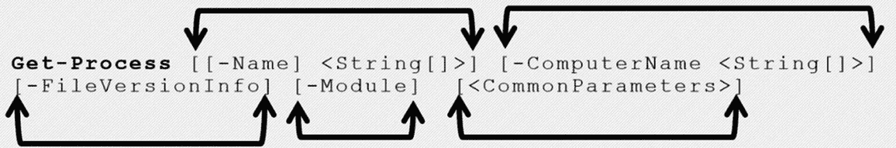

图 1-11

获取流程

这允许我们简单地键入命令，而不包括任何额外的参数，如图 [1-12](#Fig12) 所示，带有缩写输出。

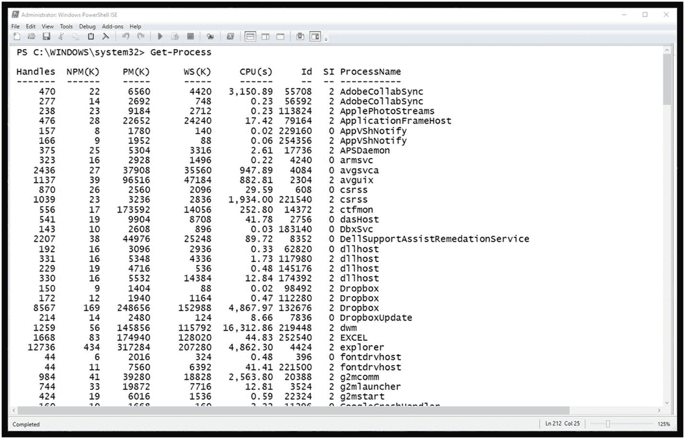

图 1-12

不带附加参数的 Get-Process

如果我只想获得与 Google Chrome 浏览器相关流程的信息，该怎么办？在图 [1-13](#Fig13) 中，我列出了我们需要利用的具体`-Name`参数，以实现这一点。

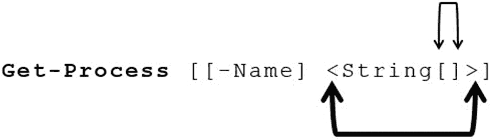

图 1-13

Get-Process -Name 参数

您会注意到`-Name`参数是可选的；但是，如果指定了它，您必须指定一个字符串来指示您必须提供的特定数据类型(其内容将是流程的名称)。您还会注意到单词 String 后面有两个方括号。这表明您可以选择包含一个名称列表。每个名称都需要用逗号分隔。图 [1-14](#Fig14) 显示了一个例子。

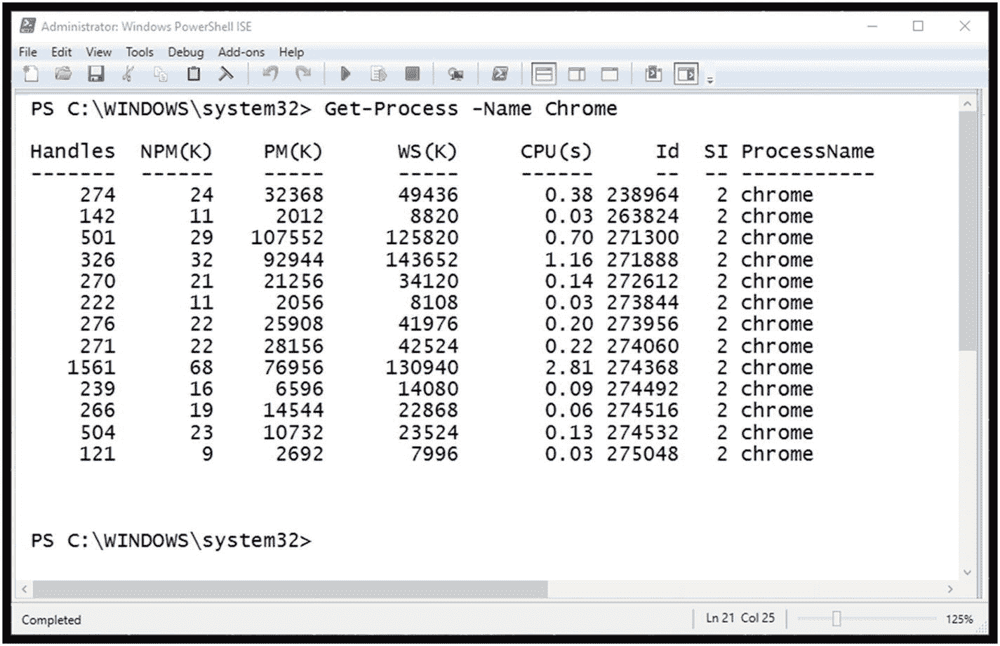

图 1-14

使用-Name 参数的 Get-Process 示例

#### 获取成员

如您所见，当使用 PowerShell CmdLets 从目标系统获取信息(或证据)时，它们会提供有用的结果。除了简单的输出之外，每个 CmdLet 还返回一个对象，该对象提供对附加属性和方法的访问。Get-Member CmdLet 将显示 CmdLet 的可用属性和方法。

请注意，与任何 CmdLet 一样，您可以利用 Get-Help CmdLet 来获取有关 Get-Member 的详细信息和示例。例如，该命令将是:

```py
Get-Help Get-Member

```

为了说明获取 CmdLet 附加属性的价值，请看 Get-Service CmdLet 的标准输出，如图 [1-15](#Fig15) 所示。

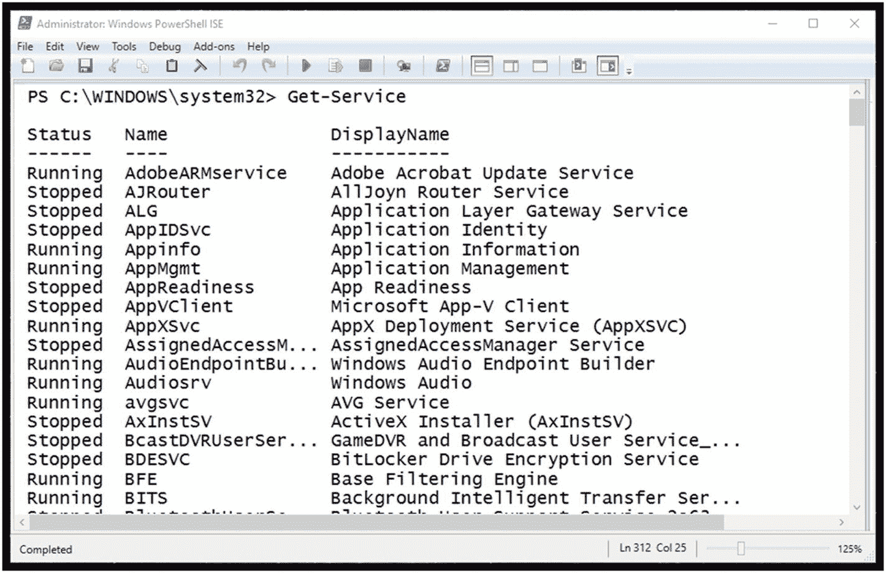

图 1-15

Get-Service CmdLet 的标准输出

如果需要额外的信息证据呢？例如，如果知道服务是如何启动的很重要，那该怎么办？为了回答这个问题，我们需要询问并从对象中获得额外的属性。

为了提取对象的方法和属性细节，我们需要利用管道将输出对象定向到 Get-Member CmdLet。管道在大多数命令行和 shell 环境中的操作是相似的。然而，在 PowerShell 中，它们是特定于对象和上下文的。

在本例中，我们希望查询的 CmdLet Get-Service 没有执行，而是将对象信息传递给 Get-Member CmdLet，如图 [1-16](#Fig16) 所示。注意，我们正在寻找的属性的名称是 StartType。

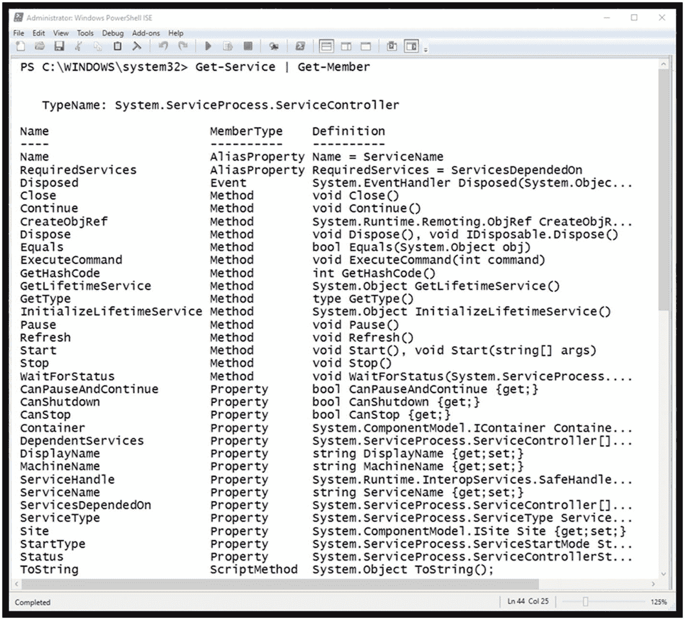

图 1-16

获取成员示例

现在我们知道了名称，我们可以指定属性`StartType`显示一个定制的输出，如图 [1-17](#Fig17) 所示。这是我们能做的最简单的管道形式。执行 Get-Service CmdLet，并将结果传送给 Select-Object CmdLet。

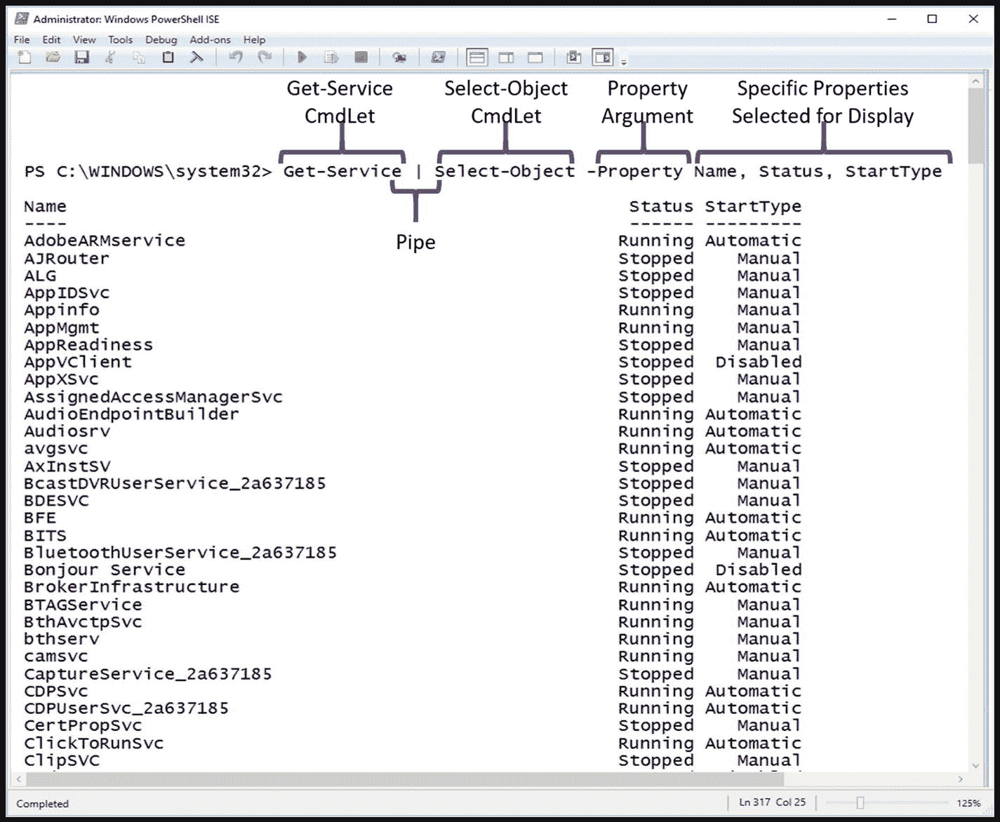

图 1-17

使用名称、状态和启动类型获取服务

然后，Select-Object CmdLet 显示指定的特定属性。Select-Object CmdLet 的`-Property`参数接受要显示的字符串名称。同样，每个都用逗号分隔。

## 挑战问题:要探索的调查 CmdLets

为了熟悉 PowerShell、ISE 和在调查过程中可能会用到的 CmdLets，您需要直接对它们进行实验。为了帮助这个过程，我在每一章的结尾都列出了一系列挑战性的问题。记住对每个 cmdlet 使用 Get-Help，并确保在检查 cmdlet 时使用了`-Detailed`和`-Examples`选项。我还在附录中提供了每个挑战问题的解决方案，所以你可以自己尝试一下，然后检查你的结果。

### 挑战一:基于文件扩展名执行“查找”

你们中的许多人可能熟悉 Windows 命令行 dir 命令，它将列出特定目录的内容。所有传统的 Windows 和 DOS 命令都有等效的 PowerShell 命令。一种毫不费力的方法是**使用**一个 PowerShell CmdLet 来查找相关的 PowerShell CmdLet，如图 [1-18](#Fig18) 所示。要了解有关 Get-Alias 和 Get-ChildItem 的更多信息，请使用 PowerShell 帮助系统。


图 1-18

使用获取别名

现在您已经了解了 Get-ChildItem CmdLet，使用它可以通过。jpg 扩展名。

请随意试验 Get-ChildItem 提供的其他参数。此外，确保使用-Examples 开关访问 Get-Help 并研究这些示例。

### 挑战二:检查网络设置

此时，您可能会想，“如果 PowerShell 只是简单地替换了 Windows 命令行，那么为什么不直接使用 Windows 命令行呢？”正如本章前面所学，帮助系统可以提供围绕特定单词或短语的可用命令列表。

尝试键入:

```py
Get-Help ip

```

这将提供所有涉及 IP 的 PowerShell CmdLets。您将看到许多可能的 CmdLets，允许您检查网络配置。请注意，这比使用 Windows 命令行要强大得多。在这个挑战中，请深入了解其中的三个 CmdLets:

```py
Get-NetIPAddress
Get-NetIPConfiguration
Get-NetIPInterface

```

首先，使用 PowerShell 帮助系统来理解每个 CmdLet 的功能，并检查提供的示例。然后试验每个命令，仔细查看您自己的网络设置。你知道所有的设定吗？

### 挑战三:检查防火墙设置

对于此质询问题，请查找可能与防火墙相关的 CmdLets。特别是获取有关您系统上的防火墙设置的信息。检查完基本信息后，查找并执行一个 CmdLet，该 CmdLet 将检查任何已启用的“服务筛选器”。你发现什么惊喜了吗？

### 挑战四:你探索的机会

对于这个挑战，请使用帮助系统和您感兴趣的关键字来探测您的系统。

## 摘要

本章介绍了本书的目标，特别是 PowerShell 和 Python 的集成将如何为研究者提供价值。

此外，还简要介绍了 PowerShell 的发展，以便更好地理解 PowerShell 今天与调查的关系。提供了 PowerShell 的基本设置和执行，以及从哪里获取最新的可信版本。概述了 PowerShell ISE 和 PowerShell 帮助系统，以及更新帮助系统的重要性。接下来，介绍了 PowerShell CmdLets 和动词-名词术语，接着是关于如何识别感兴趣的特定 cmdlet 的简短讨论和示例。演示了几个 CmdLets 来提供关于可以使用 PowerShell 获取的信息深度的详细信息。最后，提出了一组挑战性问题，以鼓励您深入 PowerShell 并进行实验。

期待第 [2](2.html) 章，我们会发现 PowerShell CmdLets 的一个关键元素是能够创建 PowerShell 变量，并以一种称为管道化的方法将多个命令串在一起。我们将建立几个调查挑战，并使用 PowerShell 变量和流水线来解决它们。此外，我们将引入几个新的 CmdLets，它们将允许我们对输出进行排序、过滤和格式化。第 2 章[是关键，因为它提供了我们将如何集成 PowerShell 和 Python 的前奏。](2.html)