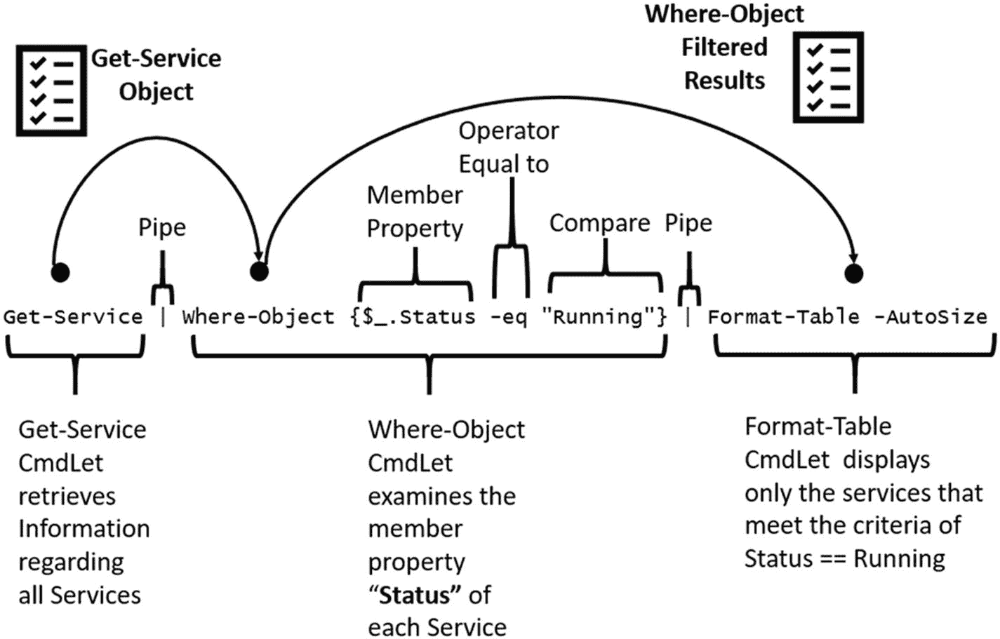
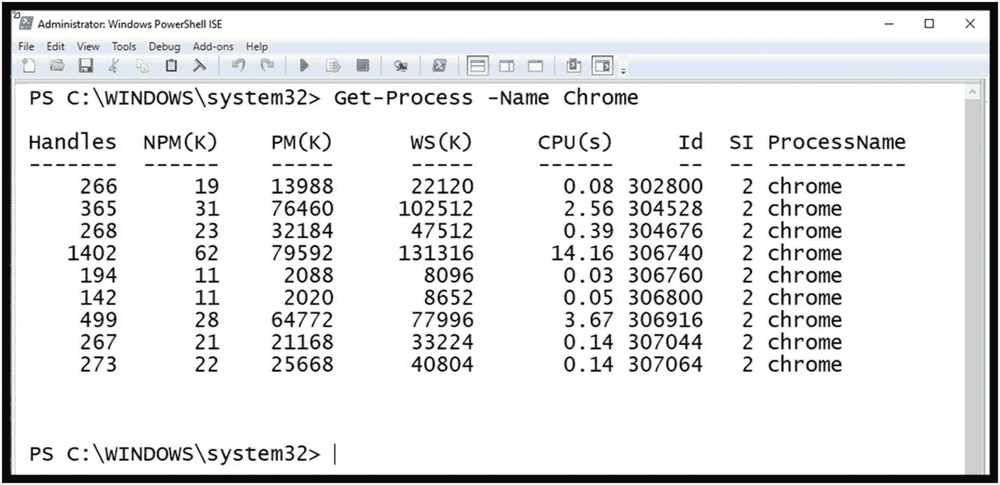
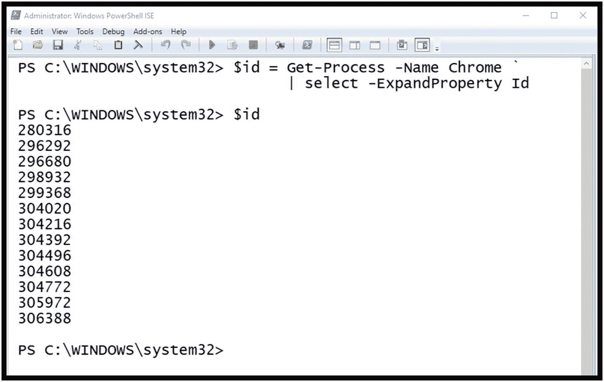
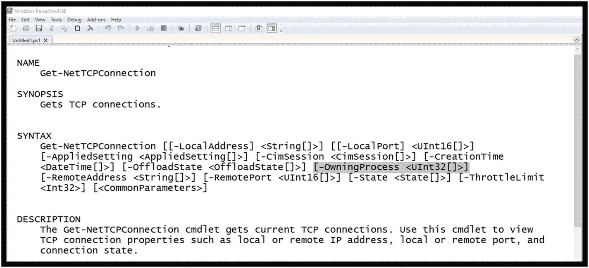
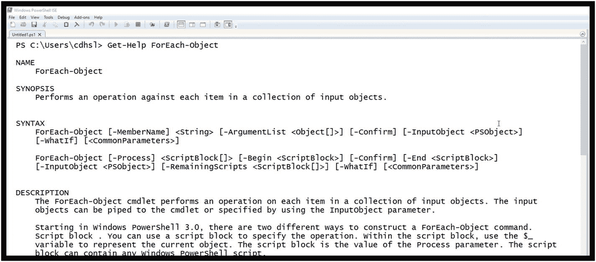
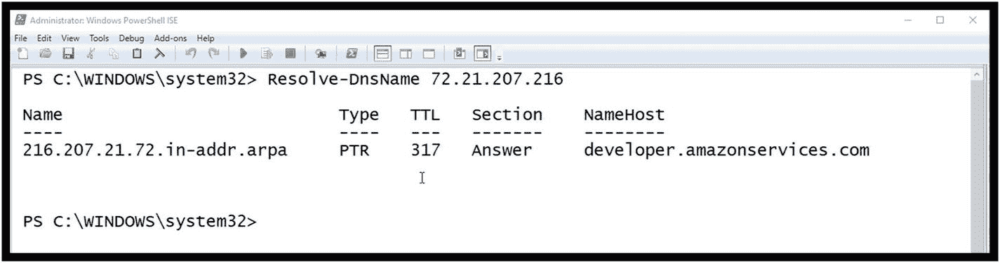
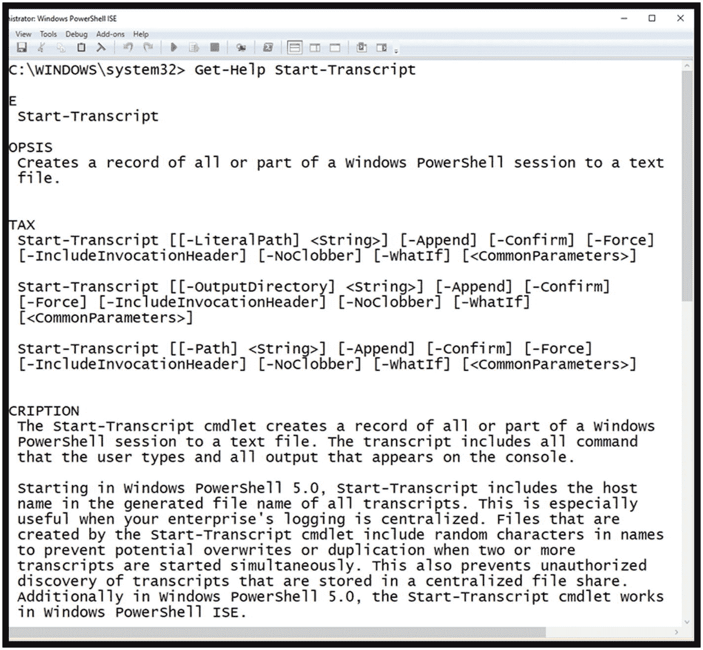
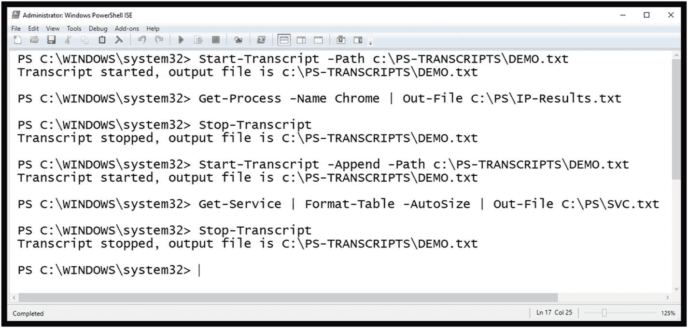

# 2.PowerShell 管道

管道是 PowerShell 中的关键特性，它将帮助我们促进 Python 和 PowerShell 的集成。选择本章中的示例和图示来解释管道，并提供对 CmdLet 和方法的深入了解，这些在调查过程中是有用的。

## 什么是 CmdLet 流水线操作？

CmdLet 管道创建了以特定顺序执行的命令的汇编行，同时也从每个 CmdLet 移动数据或结果。描述这一点的最佳方式是举几个与调查相关的例子。

### 示例 1:获取服务

假设我们想要查看我们正在调查的系统上当前有哪些服务正在运行。将输出从一个 CmdLet 向下筛选到另一个 CmdLet 是管道最常见的用途之一。此外，我们希望以表格的形式显示输出。图 [2-1](#Fig1) 是将解决这一挑战的示例管道。



图 2-1

显示正在运行的服务的管道图

如您所见，管道从 Get-Service CmdLet 开始，没有任何命令行参数。

### 注意

当然，您可以在管道符号 **|** 之前添加命令行参数，例如-ComputerName，这将允许 Get-Service CmdLet 在指定的计算机上远程执行。

Get-Service CmdLet 生成一个对象，该对象通过管道传递给链中的下一个 CmdLet。

Where-Object CmdLet 执行过滤操作，该操作评估 Get-Service CmdLet 对象属性**状态**等于“正在运行”Where-Object CmdLet 的结果输出会对结果进行筛选，以仅包括那些当前正在运行的服务。然后将结果传递给下一个管道 CmdLet。

最后，Format-Table CmdLet 使用与 Get-Service 相关联的默认输出来生成带有过滤器服务的表结果显示。图 [2-2](#Fig2) 描述了实际的命令——为了简洁起见，结果被截断了。


图 2-2

挑战解决方案

### 注意

通过使用 Get-Service | Get-Member 操作，您可以显示 Get-Service CmdLet 对象中所有可用的方法和属性，从而允许附加的筛选选项。

在调查过程中，报告哪些服务被停止也同样重要。例如，复杂的恶意软件会使病毒防护、防火墙和其他防护服务失效。图 [2-3](#Fig3) 更改命令，只显示当前停止的服务。同样，为了简洁起见，结果被截断。


图 2-3

显示停止的服务

最后一点:如果你想要更多关于格式表的信息，记得使用 Get-Help，如图 [2-4](#Fig4) 所示。


图 2-4

格式-表 CmdLet 概述

### 示例 2:获取流程

与正在运行的进程相关的详细信息也很重要，可以提供有关连接到哪些进程的附加信息。例如，在现场调查中，确定 Google Chrome 正在使用哪些活跃的互联网连接可能很重要。对于这个例子，让我们首先将它分解成单独的组件，并介绍 PowerShell 中变量的概念。

#### PowerShell 变量

什么是 PowerShell 变量:PowerShell 中的变量只是内存中指定用于保存数据值的命名位置。PowerShell 中的所有变量名都以一个 **$** 开头，以便于识别。另一个注意事项:PowerShell 中的变量名不区分大小写；因此，$ipAddress 和$IPaddress 表示同一个变量。您可以为变量赋值，例如:

```py
$InvestigatorName = "Chet Hosmer"

```

或者

```py
$CaseNumber = "BC-0234"

```

#### PowerShell 自动变量

此外，还有几个内置或自动变量可用，但用户不能更改。几个例子如图 [2-5](#Fig5) 所示。


图 2-5

自动变量的示例

#### 分解示例 2 的 CmdLet 用法

现在我们对变量有了一个大致的概念，我们将把它们用于从 Get-Process 收集信息。为了减少 Get-Process 的输出，让我们只关注一个正在运行的进程。在我的测试系统上，我安装并运行了谷歌浏览器。在您的系统上，您可能正在使用其他浏览器，如 Internet Explorer 或 Firefox。替换您的浏览器的名称，以定位由它们创建的进程。此外，名为 svchost 的进程总是在运行，因此您也可以替换它。PowerShell 中的命令如下，结果如图 [2-6](#Fig6) 所示。



图 2-6

获取进程名称 Chrome

```py
Get-Process -Name chrome

```

Get-Process CmdLet 需要的一条关键信息是我的示例中与 Google Chrome 相关联的进程 ID。我们可以使用该进程 ID 将该进程与相关的互联网活动相关联。正如你可能猜到的，我们将在 PowerShell 中使用另一个 CmdLet 来检查 Google Chrome 和互联网之间的连接。为了实现这一点，将构造一个命令来将 CmdLet 的结果存储到一个名为$id 的变量中，而不是简单地显示结果:

```py
$id = Get-Process -Name Chrome `
   | select -ExpandProperty Id

```

请注意，为了便于显示，我使用了勾号(`)字符，然后按 Shift+Enter 在下一行继续该命令。Get-Process -Name Chrome 命令的结果然后通过管道选择-ExpandProperty 命令，以仅指定 Id 字段。当然，您可以在一行中输入这个命令，但是这是一个很好的方法，可以使这个命令更具可读性。

图 [2-7](#Fig7) 将 Get-Process ID 值的结果存储到变量$id 中。然后通过在下一行指定$id 变量名(当然后面跟着 Enter 键)，显示$id 变量的内容。



图 2-7

将 Get-Process CmdLet 结果存储在变量$id 中

#### 添加 NetTCPConnections CmdLet

$id 变量现在可以用作其他 CmdLets 的参数。例如，CmdLet Get-NetTCPConnections 有一个参数-OwningProcess，它允许我们将 CmdLet 的输出限制为特定的进程 id。使用 Get-Help 检查 Get-NetTCPConnections，获得以下信息(参见图 [2-8](#Fig8) )。



图 2-8

Get-NetTCPConnections 帮助

#### 如何发现 CmdLets？

您可能会问的一个问题是，对于成千上万的 CmdLets，我如何知道使用哪一个来获取和关联与拥有进程的 TCP 连接？答案是使用 Get-Help。PowerShell 中内置的帮助系统的设计是充分利用 PowerShell 和相关 CmdLets 的关键。由于帮助系统每天更新，因此它被设计为与新 cmdlet 保持同步，这些新 cmdlet 是随着对现有 cmdlet 的任何更新而创建的。但是，您也可以找到与特定关键字相关的 CmdLets。例如，参见图 [2-9](#Fig9) 中如何使用关键字而不是 CmdLet 来使用 Get-Help。


图 2-9

使用关键字而不是 CmdLet 获取帮助

当您使用关键字提供 Get-Help 时，如本例中的 **TCP** ，它将报告与 TCP 有任何关联的已知 CmdLets。可以看到，Get-NetTCPConnection 是第一个命中的。一旦你知道了 CmdLet 的名字，你就可以使用 Get-Help 命令来决定如何使用它，就像我在图 [2-8](#Fig8) 中所做的那样。

#### 对 CmdLets 使用 PowerShell 变量

使用-OwningProcess 参数执行 Get-NetTCPConnection CmdLet 并指定$id 将仅生成与之前使用 Get-Process 发现的 Google Chrome id 值关联的 TCP 连接。完成此操作的命令如下，示例输出如图 [2-10](#Fig10) 所示。


图 2-10

使用进程 ID 的变量执行 Get-NetTCPConnection

```py
Get-NetTCPConnection -State Established -OwningProcess $id | Format-Table -Autosize

```

如您所见，使用了命令行参数-State 和-OwningProcess:

*   对于-State， **Established** 被指定为自变量。这将只列出当前连接的 TCP 连接，因为我现在只对当前连接感兴趣。

*   相反，对于-OwningProcess，指定了变量$id，它包含与 Google Chrome 关联的进程 id 列表。这样做的原因是 Get-Help 为参数 OwningProcess 提供的定义如下:

    ```py
    [-OwningProcess <UInt32[]>]

    ```

该定义声明-OwningProcess 需要一个长度为 32 位的无符号整数。UInt32 后面的两个方括号[]表示它可以接受值列表。

正如你所看到的，只有一个 Chrome 进程 id(特别是 108404)与已建立的互联网连接相关联。因此，被识别的其他 Google Chrome 进程并不直接连接互联网，只有 108404 可以。

这是一个很好的例子，说明了如何使用中间变量来存储命令的内容。但是，我们可以使用一个命令来执行这个操作。掌握了 Get-Process、PowerShell 变量和 Get-NetTCPConnections 的工作原理后，可以创建一个命令来消除对$id 变量的需要。为了进行下一步，需要 ForEach-Object CmdLet。

#### ForEach-对象

ForEach-Object 允许处理管道上前一个命令的每个后续结果。在本例中，这将是 Get-Process -Name Chrome 命令生成的每个结果。

图 [2-11](#Fig11) 使用 Get-Help 提供 For-Each 对象的解释。



图 2-11

ForEach-Object 的获取帮助概述

#### 创建示例 2 的单一管道解决方案

```py
Get-Process -Name Chrome | ForEach-Object {Get-NetTCPConnection -State Established -OwningProcess $_.Id -ErrorAction SilentlyContinue}| Format-Table -Autosize

```

在本例中(参见图 [2-12](#Fig12) 中的操作结果)，组件分解如下:

*   获取所有名为 Chrome 的进程的详细信息。

    ```py
    ForEach-Object { }

    ```

*   处理每次迭代(更简单地说，是 Get-Process 通过管道提供的每次输出。

    ```py
    {Get-NetTCPConnection -State Established -OwningProcess $_.Id -ErrorAction SilentlyContinue}

    ```

*   对每个结果执行 Get-NetTCPConnection CmdLet。

*   -State Established 过滤输出，仅包括当前建立的连接。

*   -OwningProcess $_。Id 指定将提取连接信息的进程 ID。的$_。Id 语法用于从 Get-Process CmdLet 的每个迭代结果中获取所属进程的进程 ID。使用以下语法处理特定属性:
    *   $_.身份

        This syntax breaks down as follows:
        *   $_ 表示通过管道的当前对象。

        *   。Id 指定哪个特定属性值与操作相关联。

*   -ErrorAction -SilentlyContinue 用于忽略 Get-NetTCPConnection CmdLet 期间可能出现的任何错误。例如，如果进程 ID 未链接到指定的 TCPConnection，CmdLet 将引发异常。该参数允许忽略这些异常。

*   Format-Table -Autosize 用于将输出格式化为更紧凑的格式。

```py
Get-Process -Name Chrome

```


图 2-12

映射谷歌浏览器 IP 连接的最终解决方案

#### 解析远程 IP 地址

这些结果引出了下一个调查问题，Chrome 浏览器引用的 IP 地址指的是什么？当然有一个 CmdLet 可以直接发现这些信息。IP 地址 72.21.207.216 是从图 [2-12](#Fig12) 的列表中任意选择的。然后，Resolve-DnsName CmdLet 用于获取有关此远程 IP 地址的信息。

```py
Resolve-DnsName 72.21.207.216

```

Resolve-DnsName CmdLet 成功解析了 developer.amazonservices.com 的 IP 地址(参见图 [2-13](#Fig13) )。



图 2-13

解析 DnsName

要了解有关 Resolve-DnsName 的更多信息，请尝试使用 Get-Help。

## 添加副本以跟踪您的活动

记录你的调查行为是很重要的(至少可以这么说)。捕获操作和结果数据的一个简单方法是在 PowerShell 中使用另一个 CmdLet:

```py
Start-Transaction
Stop-Transaction

```

与 PowerShell 中的所有 cmdlet 一样，获取有关 cmdlet 的用法和选项的信息是通过使用 Get-Help。这听起来可能有点多余；然而，许多人仍然转向谷歌或其他搜索引擎来获取这些知识。这在某些情况下当然是有用的，但是 PowerShell 中的帮助系统不仅功能强大、考虑周全，而且每天都在更新。因此，为了获得有关 CmdLets 的最新、最准确的信息，请使用 Get-Help。图 [2-14](#Fig14) 提供了与开始转录相关的结果。



图 2-14

获取帮助开始-抄本

在这个例子中，指定-Path 参数是为了将脚本的输出指向一个特定的文件，如图 [2-15](#Fig15) 所示。为了演示 Start-script 的-Append 参数，使用了 Transcript CmdLet，然后重新启动了 script。为此，只需使用相同的路径参数启动第二个 Start-Transcript CmdLet，然后添加-Append 选项，如图 [2-15](#Fig15) 所示。这允许您在同一个输出文件中连接 PowerShell 会话。



图 2-15

PowerShell 启动和停止记录

清单 [2-1](#PC13) 描述了生成的脚本文件。请注意，这里还添加了另一个新的 CmdLet，Out-File–这将 Get-Process CmdLet 的输出定向到桌面上的 IP-Result.txt 文件。因此，脚本不包括 Get-Process 或 Get-Service 输出，而是将结果存储在指定的输出文件中。这可能是你的文件夹。突出显示每个附加事务的开始和结束时间字符串。请注意，PowerShell 使用本地时间；在这个例子中，记录开始于 2018 年 11 月 27 日，16:09:03，或下午 4:09。

```py
**********************
Windows PowerShell transcript start
Start time: 20181127160903
Username: PYTHON-3\cdhsl
RunAs User: PYTHON-3\cdhsl
Configuration Name:
Machine: PYTHON-3 (Microsoft Windows NT 10.0.17134.0)
Host Application: C:\WINDOWS\system32\WindowsPowerShell\v1.0\PowerShell_ISE.exe
Process ID: 148432
PSVersion: 5.1.17134.407
PSEdition: Desktop
PSCompatibleVersions: 1.0, 2.0, 3.0, 4.0, 5.0, 5.1.17134.407
BuildVersion: 10.0.17134.407
CLRVersion: 4.0.30319.42000
WSManStackVersion: 3.0

PSRemotingProtocolVersion: 2.3
SerializationVersion: 1.1.0.1
**********************
Transcript started, output file is C:\Users\cdhsl\PS-TRANSCRIPTS\DEMO.txt
PS C:\WINDOWS\system32> Get-Process -Name chrome | Out-File C:\Users\cdhsl\Desktop\IP-Result.txt
PS C:\WINDOWS\system32> Stop-Transcript
**********************
Windows PowerShell transcript end
End time: 20181127160930
**********************
**********************
Windows PowerShell transcript start
Start time: 20181127161013
Username: PYTHON-3\cdhsl
RunAs User: PYTHON-3\cdhsl
Configuration Name:
Machine: PYTHON-3 (Microsoft Windows NT 10.0.17134.0)
Host Application: C:\WINDOWS\system32\WindowsPowerShell\v1.0\PowerShell_ISE.exe
Process ID: 148432
PSVersion: 5.1.17134.407
PSEdition: Desktop
PSCompatibleVersions: 1.0, 2.0, 3.0, 4.0, 5.0, 5.1.17134.407
BuildVersion: 10.0.17134.407
CLRVersion: 4.0.30319.42000
WSManStackVersion: 3.0
PSRemotingProtocolVersion: 2.3
SerializationVersion: 1.1.0.1
**********************
Transcript started, output file is C:\Users\cdhsl\PS-TRANSCRIPTS\DEMO.txt
PS C:\WINDOWS\system32> Get-Service | Format-Table -AutoSize | Out-File C:\Users\cdhsl\Desktop\Services.txt

PS C:\WINDOWS\system32> Stop-Transcript
**********************
Windows PowerShell transcript end
End time: 20181127161306
**********************

Listing 2-1
PowerShell Transcript

```

## 挑战问题:CmdLet 实验

仅仅通过阅读本文或任何其他相关内容是无法学会使用 PowerShell 的。相反，你必须通过与 PowerShell 互动来体验它。表 [2-1](#Tab1) 提供了一些在调查过程中有用的流行 CmdLets 的简短列表。我只选择了检索或获取信息的 CmdLets 供您试验。

表 2-1

质询问题 CmdLets

<colgroup><col class="tcol1 align-left"> <col class="tcol2 align-left"></colgroup> 
| 获取流程 | 获取服务 |
| Get-NetIPAddress | Get-NetIPConfiguration |
| get-net IP v4 协议 | get-net IPv6 协议 |
| Get-NetTCPConnection | 测试网络连接 |
| 获取网络路由 | get-MP 计算机状态 |
| get-mpthread | Get-NetFirewallSetting |
| Get-NetFirewallPortFilter | 获取-体积 |
| get-childitem | Get-ItemProperty |
| 获取事件日志 | Get-LocalUser |
| Get-LocalGroup(获取-局部组) | 获取内容 |
| 获取位置 | 设置位置 |
| 开始-抄本 | 停止转录 |
| 格式-表格 |   |

### 警告

如果您决定用修改系统的其他 CmdLets 进行试验，那么风险自负。PowerShell CmdLets 可以修改、损坏、删除甚至破坏您的系统。

对于表 [2-1](#Tab1) 中指定的每个 CmdLets，执行以下操作:

1.  查看每个 CmdLet 的帮助，包括详细信息和示例，即，
    1.  获取帮助详细信息

    2.  获取帮助-示例

2.  查看后，描述 CmdLet 的作用，并考虑它在调查中的价值。

3.  使用最少一个参数执行每个 CmdLet，也可以尝试其他参数。

4.  使用管道来组装 CmdLet，从简单的事情开始，比如将 CmdLet 输出管道化到 Format-Table CmdLet，然后尝试其他选项。

5.  确保你的开始和结束记录在你的实验中，这将作为你行动和结果的记录。当您以后试图复制一个复杂的命令时，可以参考这些命令。

这个挑战性问题的解决方案可以在本书的附录和源代码中找到，可在 [`www.apress.com/9781484245033`](http://www.apress.com/9781484245033) 获得。

## 摘要

本章重点介绍了 PowerShell 的几个关键领域，并介绍了几个新的 CmdLets 及其应用。此外，还介绍了 PowerShell 变量的创建和使用。创建了两个示例管道来演示如何在 PowerShell 中实现管道。第 [3](3.html) 章将引入新的 CmdLets，开发多个完整的 PowerShell 脚本。