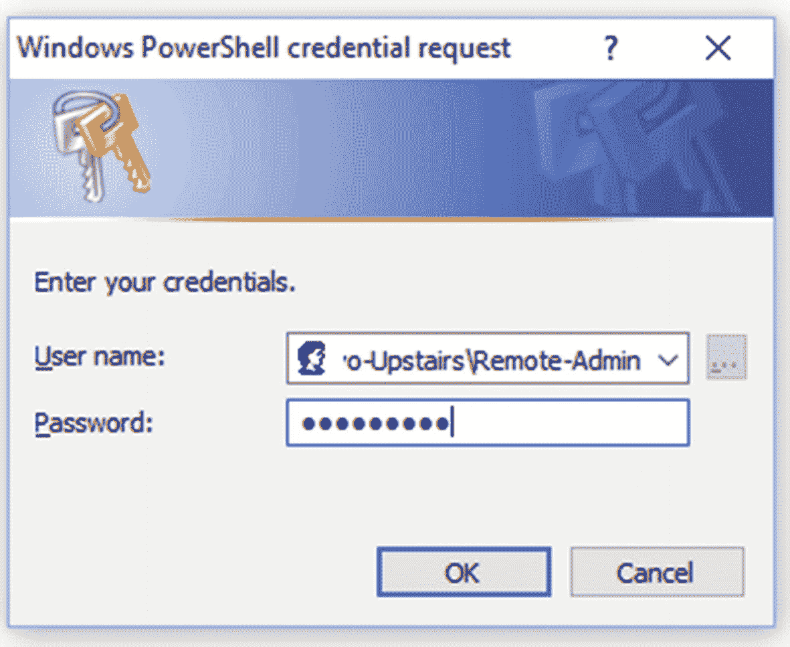
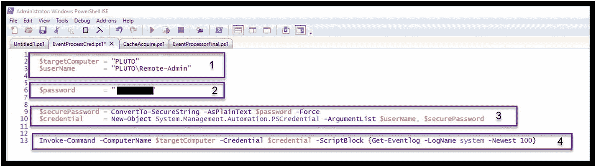
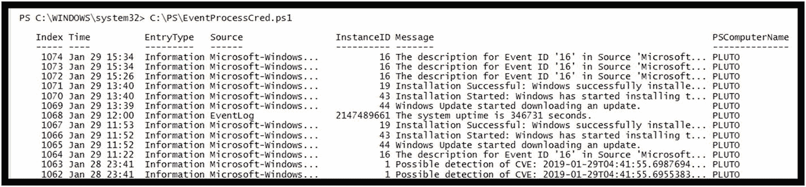
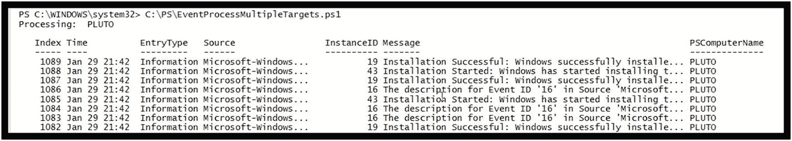

# 七、遗留问题和未来考虑

已经开发了两种 PowerShell 和 Python 集成的可靠方法(即 Python 子处理和 PowerShell 管道化)，还有一些未解决的问题和未来的考虑需要解决。

## 松散的一端

第一种是使用 PowerShell Invoke-Command CmdLet，而不需要每次都响应登录弹出窗口，如图 [7-1](#Fig1) 所示。

图 7-1

Windows PowerShell 凭据请求

这可以通过使用 PowerShell 系统管理自动化 PSCredential 系统创建新的凭据对象来实现。图 [7-2](#Fig2) 显示了一个简单的 PowerShell 脚本，它使用 Remote-Admin 用户凭证从计算机 PLUTO 获取系统事件日志。这只需要四个步骤:

1.  创建两个本地 PowerShell 变量:$targetComputer(您希望访问的计算机名)和$userName(远程计算机上的用户名)。

2.  使用与远程用户相关联的密码创建一个明文字符串$password。注意密码在这里被涂黑了。在 PowerShell 脚本中嵌入密码时，保护脚本免受未经授权的访问至关重要。

3.  这一步包含两个重要部分:
    1.  首先，明文密码被转换为安全字符串$securePassword。ConvertTo-secure string CmdLet 创建的安全字符串然后可以用于需要 SecureString 类型参数的其他 CmdLet 或函数。

    2.  接下来，创建安全凭证对象$credential。这需要$userName 和新创建的$securePassword 作为参数。

4.  最后，新创建的$credential PowerShell 变量可以作为 Invoke-Command CmdLet 中的-Credential 参数传递。

图 7-2

使用嵌入式凭据收集远程事件日志的 PowerShell 脚本

脚本的执行从 PLUTO 计算机获取系统事件日志，如图 [7-3](#Fig3) 所示。注意，为了简洁起见，输出被截断了。

图 7-3

EventProcessCred.ps1 示例执行

第二个改进利用了嵌入式凭据方法。嵌入凭证的主要原因(除了方便之外)是脚本可以从同一个脚本从多个远程计算机获取数据，而不需要交互。实现这一点的一种方法是创建一个要访问的目标计算机名称列表。PowerShell 列表非常有用，可以使用 *foreach* 操作符在多个选择中循环。图 [7-4](#Fig4) 显示了从 PowerShell 列表中定义的两台计算机获取系统日志的示例。

图 7-4

使用嵌入式凭据从多台目标计算机获取系统事件日志

### 注意

在本例中，为了简化说明，每个目标的用户名和密码都是相同的。当然，该示例还可以扩展为包括每个目标的唯一用户名和密码。

该脚本分为三个步骤:

1.  本节创建一个 PowerShell 对象$listOfTargets，它是一个简单的字符串列表。每个字符串代表一台目标计算机的名称。新创建的列表没有元素。然后使用与所创建的 PowerShell 列表对象相关联的 Add 方法填充 listOfTargets。

2.  默认的$remoteUser 变量被创建并设置为“Remote-Admin ”,这是将要使用的远程用户管理帐户。此外，还创建了$securePassword，用于访问每个远程目标。请注意，还没有创建$credential，因为它需要为每个目标收购单独创建。

3.  最后，创建一个循环，它将执行以下操作:
    1.  显示每次通过循环处理的主机的名称。

    2.  将当前的 targetComputer 和默认的 remoteUser 名称组合起来，为该目标创建唯一的 userName。例如:

        **冥王星\远程管理**。

    3.  使用 PowerShell 系统。Automation 功能，那么每次通过循环，使用$userName 和$securePassword PowerShell 变量创建唯一的$credential。

    4.  然后，使用当前的$targetComputer 和访问所需的相关$credential 来执行获取系统事件日志的 Invoke-Command。

简短的脚本输出如图 [7-5](#Fig5) 所示。

图 7-5

多目标计算机系统事件日志执行

## 未来的考虑

集成 PowerShell 和 Python 并结合两个非常强大的脚本环境是一件令人愉快的事情。研究、实验和模型创建一直在尝试；然而，结果是两个可行和有用的方法，将允许调查解决方案的扩展。

数以千计的 PowerShell CmdLets 可用于从本地或远程目标计算机获取物证，这为数字调查人员提供了丰富的基础。将这一点与 Python 环境的多功能性和强大功能相结合，为无限的创新和解决方案带来了机会。

鉴于这两种集成模式，我要求您开发和扩展结合两种环境优点的新解决方案。我仍然认为 PowerShell 是一个强大的获取引擎，Python 是后端分析和处理组件。然而，这只是我的观点——你可能有不同的想法。所以，也用这些来运行，这里提供的模型可以支持广泛的可能性。

## 摘要

这一章主要关注一些细节，通过在 PowerShell 脚本中嵌入凭证来提高 PowerShell 的自动化程度。这种嵌入支持同时获取多个证据，然后这些证据可以交付给 Python 元素或由 Python 元素驱动。这肯定会扩大调查人员的调查范围，加快获取和分析证据的速度。

祝你好运，我期待着就以独特的方式结合 PowerShell 和 Python 的新调查解决方案进行交流和合作。