第三章


数到 101

人类最大的缺点是我们无法理解指数函数。

世界人口平衡顾问委员会 Albert A. Bartlett 博士

有一次，当著名数学家卡尔·弗里德里希·高斯上小学的时候，他的老师让学生们把 1 到 100 之间的所有整数相加(或者，至少，这是这个故事最常见的版本)。毫无疑问，老师预计这将占用他的学生一段时间，但高斯几乎立即产生了结果。这似乎需要闪电般的心算，但事实是，实际需要的计算非常简单；诀窍是真正理解问题。

读完上一章后，你可能会对这些事情有点厌倦。“显然，答案是θ(1)，”你说。嗯，是的...但是假设我们要对从 1 到 n 的整数求和？接下来的章节将讨论一些类似的重要问题，这些问题在算法分析中会反复出现。这一章有时可能有点挑战性，但提出的想法是至关重要的，非常值得努力。他们会让这本书的其余部分更容易理解。首先，我会给你一个简单的解释和一些基本的操作方法。接下来是这一章的两个主要部分:一个是关于两个基本和(或者组合问题，取决于你的观点)，另一个是关于所谓的递归关系，稍后你将需要分析递归算法。在这两者之间有一小段是关于子集、组合和排列的。

提示这一章有相当多的数学内容。如果这不是你的东西，你可能会想现在浏览一下，然后在需要的时候再回来读这本书的其余部分。(不过，本章中的一些观点可能会让本书的其余部分更容易理解。)

算术上的细微差别

在第二章，中，我解释了当两个循环嵌套并且内层循环的复杂度随着外层循环的迭代而变化时，你需要开始求和。事实上，在算法中，求和到处都是，所以你最好习惯于思考它们。让我们从基本符号开始。

更像希腊人

在 Python 中，您可以编写以下代码:

```py
x*sum(S) == sum(x*y for y in S)
```

用数学符号，你可以这样写:


你能看出为什么这个等式是正确的吗？如果你以前没有使用过这个资本 sigma，它可能看起来有点吓人。然而，它并不比 Python 中的`sum`函数更可怕；语法只是有点不同。西格玛本身表明我们正在做一个总和，我们把关于什么总和的信息放在它的上面、下面和右边。我们放在右边的(在前面的例子中， *y* 和 *xy* )是要求和的值，而我们把要迭代的项的描述放在 sigma 下面。

除了迭代一个集合(或其他集合)中的对象，我们可以对总和进行限制，就像使用`range`(除了两个限制都包含在内)。一般表达式“sum*f*(*I*)for*I*=*m*to*n*是这样写的:

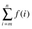

Python 的对等用法如下:

```py
sum(f(i) for i in range(m, n+1))
```

对于许多程序员来说，将这些总和视为编写循环的数学方式可能更容易:

```py
s = 0
for i in range(m, n+1):
    s += f(i)
```

更简洁的数学符号的优势在于，它能让我们更好地了解正在发生的事情。

使用总和

上一节中的示例等式中，因子 *x* 被移到了总和中，这只是在处理总和时允许使用的几个有用的“操作规则”之一。这里总结了其中最重要的两个(为了我们的目的):


*乘法常数* *可以移入或移出总和*。这也是上一节中的初始示例所说明的。这就是你在更简单的求和中多次看到的 *分配性*的相同规则:*c*(*f*(*m*)+...+*f*(*n*)=*cf*(*m*)+...+ *比照* ( *n* )。


*不是将两个和相加，而是可以将它们相加的内容相加*。这只是意味着，如果你要总结一堆东西，你怎么做并不重要；也就是说，

```py
sum(f(i) for i in S) + sum(g(i) for i in S)
```

和`sum(f(i) + g(i) for i in S)`一模一样。 [<sup>1</sup>](#Fn1) 这只是 *结合律*的一个实例。如果你想减去两个和，你可以使用相同的技巧。如果您愿意，可以假装将常数因子-1 移动到第二个和中。

两场比赛的故事

你可能会发现大量的算术题对你的工作有用，一本好的数学参考书可能会给你大多数算术题的答案。然而，有两个和，或者说组合问题，涵盖了你在本书中会遇到的大多数情况——或者说，实际上，是最基本的算法工作。

这些年来，我一直在反复解释这两个想法，使用了许多不同的例子和比喻，但我认为一种相当令人难忘(我希望可以理解)的方式是将它们作为两种形式的*锦标赛*。

 **注意**实际上，在图论(一个完整的图，其中每条边都被指定了一个方向)中，*锦标赛*这个词有一个技术含义。我这里说的不是这个，虽然概念是相关的。

锦标赛有很多种，但让我们考虑两种非常常见的锦标赛，它们的名字都很吸引人。这就是 *循环赛*和 *淘汰赛*。

在循环锦标赛(或者，具体来说，是一场*单人*循环锦标赛)中，每位参赛选手依次与其他选手相遇。那么问题就变成了，例如，如果我们有 *n* 骑士比武，我们需要多少场比赛或比赛？(如果你愿意，在这里替换你最喜欢的竞技活动。)在淘汰赛中，参赛者被安排成对，只有每对中的获胜者才能进入下一轮比赛。这里有更多的问题要问:对于 *n* 骑士，我们需要多少回合，总共会有多少场比赛？

握手

循环赛问题完全等同于另一个众所周知的难题:如果你让 *n* 个算法专家在一个会议上碰面，他们都握手，你能握多少次手？或者，等价地，一个有*个*节点的完整图有多少条边(见[图 3-1](#Fig1) )？这和你在任何“所有人对抗所有人”的情况下得到的计数是一样的。例如，如果你在地图上有 n 个*和*位置，并且想要找到彼此最接近的两个，简单的(强力)方法是将所有点与所有其他点进行比较。为了找到这个算法的运行时间，你需要解决循环问题。(第 6 章中的[给出了这个](06.html) *最接近对*问题的更有效的解决方案。)

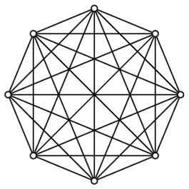

[图 3-1](#_Fig1) 。一个完整的图，说明了循环赛，或握手问题

你很可能已经猜到会有个二次方的匹配。“所有人反对所有人”听起来非常像“所有时间”，或者*n*T3】2。虽然结果确实是二次的，但是*n*T7】2 的精确形式并不完全正确。想想看——首先，只有渴望死亡的骑士才会和自己决斗。如果加拉哈德爵士和兰斯洛特爵士有过交锋，兰斯洛特爵士没有必要还手，因为他们肯定都打过仗，所以一场比赛就够了。一个简单的“ *n* 乘以 *n* ”的解决方案忽略了这两个因素，假设每个骑士与*每个骑士*(包括他们自己)进行单独的比赛。解决方法很简单:让每个骑士与所有其他*骑士*骑士进行一场比赛，得到*n*(*n*–1)，然后，因为我们现在已经对每场比赛进行了两次计数(每个参与的骑士一次)，我们除以 2，得到最终答案，*n*(*n*–1)/2，这确实是θ(*n*<sup xmlns:m="http://www.w3.org/1998/Math/MathML" xmlns:pls="http://www.w3.org/2005/01/pronunciation-lexicon" xmlns:ssml="http://www.w3.org/2001/10/synthesis">2</sup>)。

现在，我们已经用一种相对简单的方式统计了这些匹配(或握手或地图点比较)——答案可能已经很明显了。好吧，摆在面前的可能也不完全是火箭科学，但是请放心，所有这些都是有意义的。。。现在我们用不同的方式来计算它们，结果肯定是一样的。

另一种计算方式是这样的:第一个骑士和其他的*n*–1 人决斗。在剩下的人中，第二个骑士与*n*–2 决斗。这种情况一直持续到倒数第二名，他与最后一名骑士进行最后一场比赛(然后他与剩下的零名骑士进行零场比赛)。这给了我们总和*n*–1+*n*–2+...+ 1 + 0，或者说`sum(i for i in range(n))`。我们只对每场比赛计数一次，所以总和必须产生和以前一样的计数:


我当然可以直接给你这个等式。我希望额外的包装对你来说更有意义。当然，你可以想出解释这个等式的其他方法(或者整本书中的其他方法)。例如，在本章开篇的故事中，高斯的洞见是，从 1 到 100 的总和可以“从外部”计算，将 1 与 100 配对，2 与 99 配对，以此类推，产生 50 对，总和为 101。如果你将其推广到从 0 到 n 的求和情况，你会得到和之前一样的公式。你能看出这一切与邻接矩阵对角线下方的左下半部分有什么关系吗？

 **提示** An *算术* *数列*是任意两个连续数字之差为常数的和。假设这个常数是正的，那么总和永远是二次。其实就是 *i* <sup xmlns:m="http://www.w3.org/1998/Math/MathML" xmlns:pls="http://www.w3.org/2005/01/pronunciation-lexicon" xmlns:ssml="http://www.w3.org/2001/10/synthesis">* k *</sup> 之和，其中 *i* = 1。。。 *n* ，对于某个正常数 *k* ，永远是θ(*n*T23】k+1)。握手和只是一个特例。

兔子和乌龟

假设我们的骑士有 100 人，而锦标赛的工作人员仍然对去年的循环赛感到有些疲惫。这很容易理解，因为应该有 4950 场比赛。他们决定引入(更有效的)淘汰制，并想知道他们需要多少场比赛。找到解决方案可能有点棘手...或者很明显，取决于你如何看待它。先从稍微棘手的角度来看。在第一轮中，所有的骑士都是成对的，所以我们有 *n* /2 场比赛。只有一半人进入第二轮，所以我们有 *n* /4 场比赛。我们继续减半，直到最后一场比赛，给我们的总数是*n*/2+*n*/4+*n*/8+...+ 1，或者相当于 1 + 2 + 4 +...+ *n* /2。稍后你会看到，这个和有很多应用，但是答案是什么呢？

接下来是非常明显的部分:在每场比赛中，一名骑士被击倒。除了获胜者之外，所有人都被淘汰(他们只被淘汰一次)，所以我们需要*n*–1 场比赛，只留下一个男人(或女人)站着。在[图 3-2](#Fig2) 中，锦标赛结构被图示为一棵有根的树，其中每片叶子是一个骑士，每个内部节点代表一场比赛。换句话说:

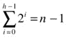


[图 3-2](#_Fig2) 。一棵完全平衡的有根二叉树，有 n 片叶子和 n–1 个内部节点(根高亮显示)。该树可能是无向的，但是可以认为其边隐式地指向下方，如图所示

上限，*h*–1，是轮数，或者说 *h* 二叉树的高度，所以 2 <sup xmlns:m="http://www.w3.org/1998/Math/MathML" xmlns:pls="http://www.w3.org/2005/01/pronunciation-lexicon" xmlns:ssml="http://www.w3.org/2001/10/synthesis">*h*</sup> = *n* 。在这种具体的环境下，结果可能看起来并不奇怪，但它确实有点奇怪。在某种程度上，它形成了一个神话的基础，即活着的人比所有死去的人都多。即使神话是错的，也没那么牵强！人口增长大致呈指数增长，目前大约每 50 年翻一番。假设历史上我们有一个固定的倍增时间。 [<sup>这不是真的，2</sup>](#Fn2) 而是将就着。或者，为了进一步简化，假设每一代人的人口是上一代人的两倍。 [<sup>3</sup>](#Fn3) 那么，如果当前这一代由 *n* 个个体组成，那么之前的*所有世代的总和，正如我们所看到的，将只有*n*–1(当然，他们中的一些人可能还活着)。*

为什么二进制行得通

我们刚刚看到，当对 2 的幂求和时，你总是比 2 的下一个幂少 1。例如，1+2+4 = 8–1，或 1+2+4+8 = 16–1，依此类推。从一个角度来看，这正是二进制计数有效的原因。一个二进制数是一串 0 和 1，每个 0 和 1 决定了一个给定的 2 的幂是否应该包含在一个和中(从最右边的 2 <sup xmlns:m="http://www.w3.org/1998/Math/MathML" xmlns:pls="http://www.w3.org/2005/01/pronunciation-lexicon" xmlns:ssml="http://www.w3.org/2001/10/synthesis">0</sup> = 1 开始)。例如，11010 就是 2 + 8 + 16 = 26。将这些幂的第一个 *h* 相加相当于一个类似于 1111 的数，其中 *h* 为 1。这就是我们对这些 *h* 数字的了解，但幸运的是，如果这些数字的总和为*n*–1，那么下一次幂将正好是 *n* 。比如 1111 是 15，10000 是 16。(练习 3-3 要求你展示这个属性允许你用二进制数表示任何正整数。)

这是关于加倍的第一课:一棵完美平衡的二叉树(即一棵所有内部节点都有两个子节点且所有叶子深度相同的有根树)有*n*–1 个内部节点。然而，在这个问题上，还有几个教训在等着你。例如，我还没有提到标题中提到的兔子和乌龟。

兔子和乌龟分别代表树的宽度和高度。这个图有几个问题，不要太较真，但思路是，互相比较(其实是作为对方的*函数*)，一个长得很慢，一个长得极快。我已经说过，*n*= 2<sup xmlns:m="http://www.w3.org/1998/Math/MathML" xmlns:pls="http://www.w3.org/2005/01/pronunciation-lexicon" xmlns:ssml="http://www.w3.org/2001/10/synthesis">T5】h</sup>，但是我们也可以很容易地使用逆对数，它来自于二进制对数的定义:*h*= LG*n*；参见[图 3-3](#Fig3) 的图示。

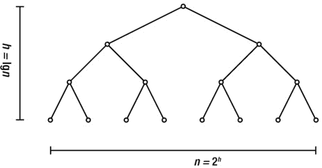

[图 3-3](#_Fig3) 。完全平衡的二叉树的高度和宽度(叶子的数量)

这两者之间的差异究竟有多大很难理解。一种策略是简单地接受它们是极其不同的——这意味着对数时间算法是超级甜蜜的，而指数时间算法是完全虚假的——然后尽可能地找出这些差异的例子。让我给你举几个例子开始吧。首先让我们做一个我喜欢称之为“思考一个粒子”的游戏我想到可见宇宙中的一个粒子，你试着猜是哪一个，只用是/否的问题。好吗？开枪！

这个游戏可能看起来完全疯狂，但我向你保证，这与实用性(比如跟踪哪些粒子已经被排除在外)的关系要大于替代物的数量。为了稍微简化这些实际问题，让我们改为“想一个数字”。对于我们正在谈论的粒子数量，有许多估计，但是 10 个 90 个(也就是说，一个 1 后面跟着 90 个 0)可能会相当多。你甚至可以自己玩这个游戏，用 Python:

```py
>>> from random import randrange
>>> n = 10**90
>>> p = randrange(10**90)
```

你现在有了一个未知粒子(粒子编号`p`)，你可以用是/否问题来研究它(不要偷看！).例如，一个相当没用的问题可能如下:

```py
>>> p == 52561927548332435090282755894003484804019842420331
False
```

如果你玩过“20 个问题”，你可能会发现这里的缺陷:我没有得到足够的“物有所值”对于一个是/否问题，我所能做的就是将剩下的选项减半。比如说:

```py
>>> p < n/2
True
```

现在我们有进展了！事实上，如果你玩对了牌(抱歉混淆了隐喻——或者更确切地说，是游戏)，并且一直将候选人的剩余区间减半，你实际上可以在不到 300 个问题中找到答案。你可以自己计算一下:

```py
>>> from math import log
>>> log(n, 2) # base-two logarithm
298.97352853986263
```

如果这看起来很平凡，让它沉淀一分钟。通过只问是/否的问题，你可以在大约五分钟内确定可见宇宙中的任何粒子！这是为什么对数算法如此超级可爱的一个经典例子。(现在试着说十遍“对数算法”，快。)

 **注**这是 *二等分*，或者说*二分搜索法*的一个例子，最重要也是最知名的对数算法之一。这将在第 6 章的[模块的“黑盒”侧栏中进一步讨论。](06.html)

现在让我们转向对数的伪反面，思考同样怪异的指数。任何一个例子都会自动成为另一个的例子——如果我让你从一个粒子开始，然后重复加倍，你会很快填满整个可观测的宇宙。(正如我们所见，这需要大约 299 倍。)这只是老 *小麦和棋盘*问题的一个稍微极端一点的版本。如果你在棋盘的第一格放一粒小麦，第二格放两粒，第三格放四粒，依此类推，你会得到多少粒小麦？ [<sup>4</sup>](#Fn4) 最后一个方块中的颗粒数将是 2 <sup xmlns:m="http://www.w3.org/1998/Math/MathML" xmlns:pls="http://www.w3.org/2005/01/pronunciation-lexicon" xmlns:ssml="http://www.w3.org/2001/10/synthesis">63</sup> (我们从 2 <sup xmlns:m="http://www.w3.org/1998/Math/MathML" xmlns:pls="http://www.w3.org/2005/01/pronunciation-lexicon" xmlns:ssml="http://www.w3.org/2001/10/synthesis">0</sup> = 1 开始计算)根据图 3-2 所示的总和，这意味着总数将是 2<sup xmlns:m="http://www.w3.org/1998/Math/MathML" xmlns:pls="http://www.w3.org/2005/01/pronunciation-lexicon" xmlns:ssml="http://www.w3.org/2001/10/synthesis">64</sup>–1 = 18，446，744，073，709，551，615，或者，对于小麦来说，大约是 5 ^ 10 那是一大笔谷物——是世界年产量的几百倍！现在想象一下，我们不是在处理谷物，而是在处理时间。对于一个问题大小 *n* ，你的程序使用 2<sup xmlns:m="http://www.w3.org/1998/Math/MathML" xmlns:pls="http://www.w3.org/2005/01/pronunciation-lexicon" xmlns:ssml="http://www.w3.org/2001/10/synthesis">T25】nT27】毫秒。对于 n = 64，程序将运行 584，542，046 年*！为了完成今天的工作，这个程序必须在脊椎动物编写代码之前运行很久。指数级增长可能会很可怕。*</sup>

 *现在，我希望你开始明白指数和对数是如何互为倒数的。然而，在离开这一部分之前，我想谈一谈我们在处理龟兔赛跑时出现的另一个二元性:从 1 到 n 的倍增数当然与从 T2 到 1 的减半数相同。这是显而易见的，但是当我们开始研究递归的时候，我会回到这个话题，这个想法会很有帮助。看看[图 3-4](#Fig4) 。该树表示从 1(根节点)到 *n* (第 *n* 叶)的加倍，但我也在节点下添加了一些标签，表示从 *n* 到 1 的减半。当处理递归时，这些量级将代表问题实例的一部分，以及一组递归调用所执行的相关工作量。当我们试图计算出总工作量时，我们将同时使用树的高度和每一层完成的工作量。我们可以将这些值视为沿树向下传递的固定数量的令牌。随着节点数量加倍，每个节点的令牌数量减半；每一关的代币数量保持为 *n* 。(这类似于练习 2-10 提示中的冰淇淋甜筒。)

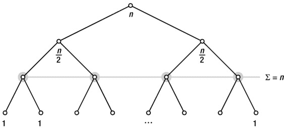

[图 3-4](#_Fig4) 。通过二叉树的各级向下传递 n 个令牌

 **提示**一T5】几何(或*指数* ) *级数*是 *ki* 之和，其中 *i* = 0... *n* ，为某常数 *k* 。如果 *k* 大于 1，那么总和永远是θ(*k*<sup xmlns:m="http://www.w3.org/1998/Math/MathML" xmlns:pls="http://www.w3.org/2005/01/pronunciation-lexicon" xmlns:ssml="http://www.w3.org/2001/10/synthesis">*n*+1</sup>)。加倍和只是一个特例。

子集、排列和组合

如果你读过前一节，那么长度为 *k* 的二进制字符串的数量应该很容易计算。例如，你可以把字符串想象成一棵完美平衡的二叉树中从根到叶的方向。字符串长度 *k* 将是树的高度，可能的字符串数量将等于叶子的数量，2 <sup xmlns:m="http://www.w3.org/1998/Math/MathML" xmlns:pls="http://www.w3.org/2005/01/pronunciation-lexicon" xmlns:ssml="http://www.w3.org/2001/10/synthesis">*k*</sup> 。另一种更直接的方式是考虑每一步的可能性数量:第一位可以是 0 或 1，对于这些值中的每一个，第二个*也有两种可能性，依此类推。就像 *k* 嵌套`for`循环，每个循环运行两次迭代；总计数还是 2<sup xmlns:m="http://www.w3.org/1998/Math/MathML" xmlns:pls="http://www.w3.org/2005/01/pronunciation-lexicon" xmlns:ssml="http://www.w3.org/2001/10/synthesis">T14】k</sup>*T16】。

伪多项式

好词，嗯？它是某些具有指数运行时间的算法的名称，这些算法“看起来”具有多项式运行时间，甚至在实践中可能也是如此。问题是，我们可以将运行时间描述为许多事情的函数，但我们为那些运行时间是输入大小的多项式*的算法保留“多项式”标签，输入大小是给定实例在某种合理编码中所需的存储量。让我们考虑一下质数检查的问题，或者回答“这个数是质数吗？”这个问题有多项式解，但并不完全明显...攻击它的完全显而易见的方法实际上产生了一个非多项式解。*

以下是我尝试的一个相对直接的解决方案:

`def is_prime(n):`
`for i in range(2,n):`
`if n % i == 0: return False`

这里的算法是遍历所有小于 *n* 的正整数，从 2 开始，检查它们是否除以 *n* 。如果其中一个有， *n* 不是素数；否则就是。这可能*看起来*像一个多项式算法，实际上它的运行时间是θ(*n*)。问题是 *n* 不是合法的问题大小！

在 *n* 中将运行时间描述为线性肯定是有用的，我们甚至可以说它是多项式...在 *n* 。但是这并没有给我们权利说它是多项式的...句号。由 *n* 组成的问题实例的大小不是 *n* ，而是*编码 n* 所需的比特数，如果 *n* 是 2 的幂，则大约是 lg *n* + 1。对于任意正整数，实际上是`floor(log(n,2))+1`。

我们姑且称这个问题大小(位数) *k* 。于是我们大致有了*n*= 2<sup xmlns:m="http://www.w3.org/1998/Math/MathML" xmlns:pls="http://www.w3.org/2005/01/pronunciation-lexicon" xmlns:ssml="http://www.w3.org/2001/10/synthesis">T5】k–1</sup>。我们宝贵的θ(*n*)运行时间，当改写为实际问题大小的函数时，就变成了θ(2<sup xmlns:m="http://www.w3.org/1998/Math/MathML" xmlns:pls="http://www.w3.org/2005/01/pronunciation-lexicon" xmlns:ssml="http://www.w3.org/2001/10/synthesis">*k*</sup>)，显然是指数型的。 [<sup>5</sup>](#Fn5) 还有其他类似的算法，它们的运行时间只有在被解释为输入中数值的函数时才是多项式。(一个例子是第八章中讨论的*背包*问题的解决方案。)这些都叫做*伪多项式*。

与子集的关系是非常直接的:如果每个位表示 size- *k* 集合中对象的存在或不存在，则每个位串表示 2 个 <sup>*k*</sup> 可能子集之一。也许最重要的结果是，任何需要检查输入对象的每个子集的算法都必然具有指数级的运行时间复杂度。

虽然子集对于算法学家来说是必不可少的，但是排列和组合可能更不重要。不过，你可能会碰到它们(没有它们就不会数到 101)，所以这里有一个如何数它们的快速纲要。

*排列*是排序。如果人们排队买电影票，我们能排多少队？每一个都是队列的排列。如[第二章](02.html)所述， *n* 项的排列数是 *n* 的阶乘，或者说 *n* ！(包括感叹号，读作“ *n* 阶乘”)。可以算出 *n* ！通过将 *n* (第一位置的可能人数)乘以*n*–1(第二位置的剩余选项)和*n*–2(第三...)，以此类推，直到 1:


没有多少算法的运行时间涉及 *n* ！(尽管我们会在第六章的[中讨论排序的极限时再讨论这个计数)。一个愚蠢的例子，预期运行时间为θ(*n*T6】n！)是](06.html)排序算法 *bogosort* ，由反复将输入序列混洗成随机顺序，并检查结果是否排序组成。

*组合*是排列和子集的近亲。从一组 *n* 中抽取的 *k* 元素的组合，有时被写成 *C* ( *n* ， *k* )，或者，对于那些数学爱好者来说:

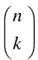

这也被称为 *二项式系数*(或者有时是*选择函数*)，读作“ *n* 选择 *k* ”虽然阶乘公式背后的直觉相当直观，但如何计算二项式系数就不那么明显了。 [<sup>6</sup>](#Fn6)

想象一下(再一次)你有 *n* 个人排队看电影，但是电影院只剩下 *k* 个座位。有多少个大小为 k 的子集有可能进入 T4？那正是 *C* ( *n* ， *k* )，当然，这个比喻在这里可能会为我们做一些工作。我们已经知道我们有 *n* ！整条生产线的可能订单。如果我们只计算所有这些可能性，并输入第一个 *k* 呢？唯一的问题是我们已经对子集计数太多次了。在许多排列中，某一群朋友可能站在队伍的最前面；事实上，我们可以允许这些朋友站在他们的任何一个 *k* ！可能的排列，这一行的其余部分可以站在他们的任何(*n*–*k*)！可能的排列而不影响谁能进去。这给了我们答案！


这个公式只是计算了这条线( *n* )所有可能的排列！)并除以我们计算每个“获胜子集”的次数，如前所述。

 **注**关于计算二项式系数的不同观点将在第 8 章[关于动态规划中给出。](08.html)

注意，我们在这里选择了大小为 *k* 的*子集*，这意味着选择*而不替换*。如果我们只是抽签 k 次，我们可能会不止一次地抽取同一个人，实际上是在候选人名单中“替换”他们。那么可能结果的数量将简单地是 *nk* 。事实上， *C* ( *n* ， *k* )计算大小为 *k* 的可能子集的数量，而 2 <sup>*n*</sup> 计算可能子集的总数，这给了我们以下美丽的等式:

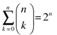

这些组合物体就是这样。是时候做一个稍微有点令人费解的展望了:求解引用自身的方程！

 **提示**对于大多数数学来说，交互式 Python 解释器作为计算器相当方便； `math`模块包含许多有用的数学函数。然而，对于像我们在本章中所做的符号操作来说，这并不是很有帮助。不过，Python 也有符号数学工具，比如 Sage(可从`http://sagemath.org`获得)。如果你只是需要一个快速工具来解决一个特别讨厌的求和或递归问题(见下一节)，你可能想看看 Wolfram Alpha ( `http://wolframalpha.com`)。你只需输入总数或其他数学问题，答案就会跳出来了。

递归和递归

我打算 假设你至少*有一些关于递归的*经验，尽管我会在这一节给你一个简短的介绍，甚至在[第四章](04.html)给你更详细的介绍。如果对你来说这是一个完全陌生的概念，在网上或一些基础编程教科书中查找它可能是一个好主意。

递归的特点是函数直接或间接地调用自己。下面是一个简单的例子，说明如何递归地对一个序列求和:

```py
def S(seq, i=0):
    if i == len(seq): return 0
    return S(seq, i+1) + seq[i]
```

理解这个函数如何工作和计算它的运行时间是两个密切相关的任务。功能非常简单:参数`i`表示求和从哪里开始。如果超出了序列的结尾(基本情况*，防止无限递归)，函数简单地返回 0。否则，它将位置`i`的值加到剩余序列的总和上。除了递归调用之外，我们在每次执行`S`时都有固定的工作量，并且它对序列中的每一项都执行一次，所以很明显运行时间是线性的。不过，让我们来研究一下:*

```py
def T(seq, i=0):
    if i == len(seq): return 1
    return T(seq, i+1) + 1
```

这个新的`T`函数实际上与`S`具有相同的结构，但是它处理的值是不同的。不像`S`返回子问题的*解决方案，而是返回*找到那个解决方案*的成本。在这种情况下，我刚刚计算了执行`if`语句的次数。在一个更加数学化的设置中，您可以计算任何相关的操作，例如，使用θ(1)而不是 1。让我们来看看这两个函数:*

```py
>>> seq = range(1,101)
>>> s(seq)
5050
```

你知道吗，高斯是对的！我们来看看运行时间:

```py
>>> T(seq)
101
```

看起来差不多。这里，大小 *n* 是 100，所以这是 *n* +1。这似乎应该在总体上成立:

```py
>>> for n in range(100):
...     seq = range(n)
...     assert T(seq) == n+1
```

没有错误，所以这个假设看起来似乎有点道理。

我们现在要做的是如何找到函数的非递归版本，比如`T`，给我们递归算法明确的运行时间复杂度。

用手做

为了从数学上描述递归算法的运行时间，我们使用递归方程，称为*递归关系*。如果我们的递归算法像上一节的`S`，那么递归关系的定义有点像`T`。因为我们正朝着一个渐近的答案努力，我们不关心常数部分，我们隐含地假设*T*(*k*)=θ(1)，对于某个常数 *k* 。这意味着我们可以在建立方程时忽略基本情况(除非它们*不*花费恒定的时间量)，对于`S`，我们的 *T* 可以定义如下:


这意味着计算`S(seq, i)`所需的时间，也就是 *T* ( *n* )，等于递归调用`S(seq, i+1)`所需的时间，也就是*T*(*n*–1)，加上访问所需的时间`seq[i]`，这个时间是常数，或者θ(1)。换句话说，我们可以在恒定时间内将问题简化为更小的版本，从大小 *n* 到*n*–1，然后解决更小的子问题。总时间是这两个操作的总和。

 **注**如你所见，对于递归之外的额外工作(即时间)，我用 1 而不是θ(1)。我也可以用θ。只要我渐近地描述结果，就没多大关系。在这种情况下，使用θ(1)可能有风险，因为我将建立一个和(1 + 1 + 1...)，如果它包含渐近符号(即θ(1)+θ(1)+θ(1)，就很容易错误地将这个和简化为常数...).

现在，我们如何*求解*这样一个方程？线索在于我们将 *T* 实现为一个可执行函数。我们可以自己模拟递归，而不是让 Python 运行它。这整个方法的关键是下面的等式:


我放在盒子里的两个子公式是相同的，这是关键。我声称这两个盒子是相同的基本原理在于我们最初的递归，因为如果...


...然后:


我只是简单的把原来方程中的 *n* 换成了*n*–1(当然，*T*((*n*–1)=*T*(*n*–2))，而 *voilà* ，我们看到盒子是相等的。我们在这里所做的是使用带有一个更小参数的 *T* 的定义，本质上，这就是递归调用求值时发生的事情。因此，将递归调用从第一个框*T*(*n*–1)扩展到第二个框*T*(*n*–2)+1，本质上是模拟或“解开”递归的一个层次。我们还有递归调用*T*(*n*–2)要处理，但是我们可以用同样的方式处理它！


事实上，*T*(*n*–2)=*T*(*n*–3)+1(两个加框的表达式)也是由原来的递推关系得出的。在这一点上，我们应该看到一个模式:每次我们减少一个参数，我们已经解开的工作(或时间)的总和(在递归调用之外)就增加*1。如果我们递归地解开*T*(*n*)I*步骤，我们得到如下结果:

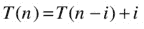

这正是我们正在寻找的表达式——递归的层次被表示为一个变量 *i* 。因为所有这些未分解的表达式都是相等的(我们每一步都有方程)，我们可以自由地将 *i* 设置为我们想要的任何值，只要我们不超过基本情况(例如， *T* (1))，在基本情况下，原始的递归关系不再有效。我们所做的是将*直接上升到*的基本情况，并尝试将*T*(*n*–*I*)转化为 *T* (1)，因为我们知道，或者隐含地假设 *T* (1)是θ(1)，这意味着我们已经解决了整个问题。我们可以通过设置*I*=*n*–1:


我们现在可能付出了更多的努力，发现`S`有一个线性运行时间，正如我们所怀疑的。在下一节中，我将向您展示如何使用这种方法来处理一些不太直接的递归。

 **小心**这种方法，叫做 *重复换人法*(或者有时是 *迭代法*)，是完全有效的，如果你小心的话。然而，很容易做出一两个不必要的假设，*尤其是*在更复杂的递归中。这意味着你可能应该将结果视为一个*假设*，然后使用本章后面“猜测和检查”一节中描述的技术检查你的答案。

一些重要的例子

你通常会遇到的递归的一般形式是*T*(*n*)=*a T*(*g*(*n*)+*f*(*n*)，其中 *a* 代表递归调用的次数， *g* ( *n* 是每个子问题的大小

 **提示**当然有可能制定出不符合这种模式的递归算法，例如，如果子问题大小不同。这种情况不会在本书中讨论，但是在“如果你好奇”一节中给出了一些关于更多信息的提示...，“这一章快结束了。

[表 3-1](#Tab1) 总结了一些重要的递归——对大小为*n*–1 或 *n* /2 的问题进行一到两次递归调用，每次调用都有常量或线性的额外工作。在上一节中，您已经看到了第一个循环。在下文中，我将向你展示如何用重复替换法解决最后四个问题，剩下的三个(2 到 4)留给练习 3-7 到 3-9。

[表 3-1](#_Tab1) 。一些基本的递归和解决方案，以及一些样本应用


在我们开始处理最后四个递归之前(它们都是 分治递归的例子，在本章后面和[第 6 章](06.html)中有更详细的解释)，你可能想用[图 3-5](#Fig5) 来刷新你的记忆。它总结了迄今为止我所讨论的关于二叉树的结果；正如你将在下面的文本中看到的，我已经悄悄地给了你需要的所有工具。

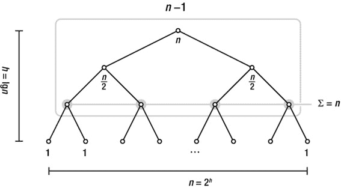

[图 3-5](#_Fig5) 。完全平衡二叉树的一些重要性质综述

 **注**我已经提到过基例有常数时间的假设(*T*(*k*)=*T*<sub>0</sub>，*k*≤*n*<sub>0</sub>，对于某些常数 *t* <sub>0</sub> ， *n* <sub>0</sub> )。在递归中， *T* 的参数是 *n* / *b* ，对于某个常数 *b* ，我们会遇到另一个技术问题:参数实际上应该是一个整数。我们可以通过舍入来实现这一点(到处使用`floor`和`ceil`)，但是简单地忽略这个细节是很常见的(实际上假设 *n* 是 *b* 的幂)。为了纠正这种马虎，你应该用本章后面的“猜测和检查”中描述的方法来检查你的答案。

看递归 5。只有一个递归调用，解决了一半的问题，此外还有固定的工作量。如果我们把完整的递归看做一棵树(一棵 *递归树*)，这个额外的工作( *f* ( *n* ))是在每个节点执行的，而递归调用的结构是用边来表示的。总工作量( *T* ( *n* ))是所有节点(或涉及的节点)的 *f* ( *n* )之和。在这种情况下，每个节点的功是不变的，所以我们只需要计算节点的个数。而且，我们只有*一个*递归调用，所以全部工作相当于一条从根到叶子的路径。很明显， *T* ( *n* )是对数，但是如果我们尝试一步一步地揭开递归，让我们看看这是什么样子:


花括号括起了相当于递归调用的部分( *T* (...))在前一行。这种逐步解开(或反复替换)只是我们求解方法的第一步。一般方法如下:

1.  解开循环，直到你看到一个模式。
2.  用一个行号变量， *i* 来表示模式(通常涉及一个和)。
3.  选择 *i* 以便递归到达其基本情况(并求解总和)。

第一步是我们已经做的。让我们从第 2 步开始:


我希望你同意这种一般形式抓住了我们解开的模式:对于每一个解开(每一行进一步向下)，我们将问题大小减半(即除数加倍)并增加另一个工作单位(另一个 1)。最后的总和有点傻。我们知道我们有 *i* 个 1，所以总和显然就是 *i* 。我已经把它写成了一个总和，以显示这里的方法的一般模式。

为了达到递归的基本情况，我们必须让*T*(*n*/2<sup xmlns:m="http://www.w3.org/1998/Math/MathML" xmlns:pls="http://www.w3.org/2005/01/pronunciation-lexicon" xmlns:ssml="http://www.w3.org/2001/10/synthesis">T5】I</sup>)变成，比如说， *T* (1)。这只是意味着我们必须将从 *n* 到 1 的路径减半，这一点现在应该很熟悉了:递归高度是对数的，或者说 *i* = lg *n* 。将它插入到模式中，你会得到 *T* ( *n* )确实是θ(LG*n*)。

递归 6 的分解非常相似，但是这里的和稍微有趣一些:

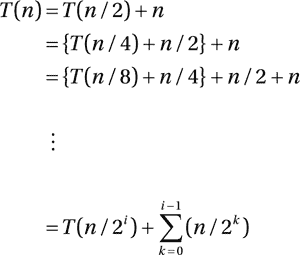

如果您不明白我是如何得出大致模式的，您可能需要思考一下。基本上，我只是使用了 sigma 符号来表示总和 *n* + *n* /2 +...+*n*/(2<sup>*I*–1</sup>)，你可以在早期的解开步骤中看到这些。在担心解和之前，我们再次设置 *i* = lg *n* 。假设 *T* (1) = 1，我们得到如下结果:

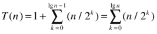

还有最后一步就是因为*n*/2<sup>LG*n*</sup>= 1，所以我们可以把孤独的 1 纳入求和。

现在:这个数字看起来熟悉吗？再一次，看一下[图 3-5](#Fig5) :如果 *k* 是一个*高度*，那么*n*/2<sup xmlns:m="http://www.w3.org/1998/Math/MathML" xmlns:pls="http://www.w3.org/2005/01/pronunciation-lexicon" xmlns:ssml="http://www.w3.org/2001/10/synthesis">/T9】k</sup>是该高度的节点数(我们将从叶子到根分成两半)。这意味着总和等于节点数，即θ(*n*)。

递归 7 和 8 引入了一个难题:多次递归调用。递归 7 类似于递归 5:不是计数从根到叶的一条路径上的*个节点，我们现在从每个节点开始跟随*的两个*子边，所以计数等于节点的数量，或θ(*n*)。你能看出递归 6 和递归 7 是如何以两种不同的方式计算同一个节点的吗？我将在递归 8 上使用我们的求解方法；第 7 项的程序非常相似，但值得一查:*

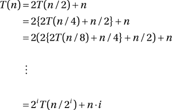

如你所见，两者在前面不断堆积，产生了 2 <sup>*i*</sup> 的因子。括号内的情况看起来有点混乱，但幸运的是，减半和加倍完美地平衡了:第一个括号内是 *n* /2，乘以 2； *n* /4 乘以 4，一般来说， *n* /2 <sup>*i*</sup> 乘以 2 <sup>*i*</sup> ，也就是说我们剩下的是 *n* 的 *i* 重复的总和，或者简称为 *n* *i* 。再次，为了得到基本情况，我们选择 *i* = lg *n* :


换句话说，运行时间是θ(*n*LG*n*)。在[图 3-5](#Fig5) 中也能看到这样的结果吗？没错。递归树根节点中的工作是*n*；在两个递归调用(子节点)的每一个中，这是减半的。换句话说，每个节点的功等于[图 3-5](#Fig5) 中的标号。我们知道每一行的总和为 *n* ，并且我们知道有 lg *n* + 1 行节点，给我们一个总和*n*LG*n*+*n*，或者θ(*n*LG*n*)。

猜测和检查

递归和归纳将在第四章中深入讨论。我的一个主要论点是，它们就像彼此的镜像；一种观点认为归纳法向你展示了为什么递归有效。在这一节中，我将讨论限制在展示我们对*递归*的解决方案是正确的(而不是讨论递归算法本身)，但它仍然应该让您对这些事情是如何联系的有所了解。

正如我在本章前面说过的，解开一个循环和“发现”一个模式的过程在某种程度上受制于不必要的假设。例如，我们经常假设 *n* 是 2 的整数次幂，这样就可以获得精确到 lg *n* 的递归深度。在大多数情况下，这些假设工作得很好，但为了确保解决方案是正确的，您应该检查它。能够检查解决方案的好处在于，你可以通过猜测或直觉想象出一个解决方案，然后(理想情况下)证明它是正确的。

 **注意**为了使事情简单，我将坚持下面的大 Oh，并使用上限。可以用类似的方式显示下限(并得到ω或θ)。

让我们来看看第一个循环，*T*(*n*)=*T*(*n*–1)+1。我们想检查一下 *T* ( *n* )是 *O* ( *n* )是否正确。和实验一样(在第一章中讨论过)，我们不能用渐近符号真正得到我们想要的结果；我们必须更具体一些，插入一些常数，所以我们试图验证*T*(*n*)≤*cn*，对于一些任意的 *c* ≥ 1。根据我们的标准假设，我们设置 *T* (1) = 1。目前为止，一切顺利。但是对于更大的 n 值呢？

这就是归纳的作用所在。这个想法很简单:我们从 *T* (1)开始，这里我们*知道*我们的解决方案是正确的，然后我们试图证明它也适用于 *T* (2)、 *T* (3)，等等。我们一般通过证明一个*归纳步骤*来做到这一点，表明如果我们的解决方案对于*T*(*n*–1)是正确的，那么对于 *T* ( *n* )，对于 *n* > 1 也是正确的。这一步会让我们从 *T* (1)到 *T* (2)，从 *T* (2)到 *T* (3)，等等，就像我们想要的那样。

证明归纳步骤的关键是假设(在这种情况下)我们对*T*(*n*–1)做了正确的假设。这正是我们用来得到 *T* ( *n* )的东西，它被称为*归纳假设*。在我们的例子中，归纳假设是*T*(*n*–1)≤*c*(*n*–1)(对于某些 *c* )，我们想表明这延续到 *T* ( *n* ):


我在这里用方框突出了归纳假设的用法:我用*c*(*n*–1)代替*T*(*n*–1)，我知道(根据归纳假设)这是一个更大(或同样大)的值。这使得替换是安全的，只要我在第一行和第二行之间从等号切换到“小于或等于”。后面的一些基础代数，我已经说明了假设*T*(*n*–1)≤*c*(*n*–1)导致*T*(*n*)≤*cn*，从而导致*T*(*n*+1)≤*c*从我们的基本案例 *T* (1)开始，我们现在已经表明 *T* ( *n* )通常是 *O* ( *n* )。**

基本的分而治之的循环并不难。让我们做递归 8(来自[表 3-1](#Tab1) )。这一次，让我们用一种叫做 *强感应*的东西。在前面的例子中，我只假设了一些关于前值的东西(*n*–1，所谓弱*归纳*)；现在，我的归纳假设将是关于*所有更小的数字*。更具体地说，我将假设*T*(*k*)≤*CK*LG*k*对于所有正整数 *k* < *n* ，并表明这导致*T*(*n*)≤*cn*LG*n*。基本思想仍然是一样的——我们的解决方案仍然会从 *T* (1)到 *T* (2)等等——只是我们得到了更多一点的工作。特别是，我们现在假设一些关于 *T* ( *n* /2)的东西，而不仅仅是*T*(*n*–1)。让我们试一试:


如前所述，假设我们已经展示了较小参数的结果，我们展示了它也适用于 *T* ( *n* )。

 **注意**警惕递归中的渐近符号，尤其是递归部分。考虑下面这个*T*(*n*)= 2*T*(*n*/2)+*n*的“证明”是指 *T* ( *n* )是 *O* ( *n* ，直接用我们归纳假设中的大 Oh:

```py
*T* (*n*) = 2 · *T* (*n*/2) + *n* = 2 · *O* (*n*/2) + *n* = *O* (*n*)
```

这有很多问题，但最突出的问题可能是，归纳假设需要特定于参数的单个值( *k* = 1，2)...)，但渐近符号必然适用于整个函数。

掉进兔子洞(或改变我们的变量)

一句警告:侧边栏中的材料可能有点挑战性。如果你已经满脑子都是循环的概念，以后再来重温它可能是个好主意。

在某些(可能很少)情况下，您可能会遇到类似如下的重复现象:

*T*`(`*n*`) =`*aT*`(`*n*<sup xmlns:m="http://www.w3.org/1998/Math/MathML" xmlns:pls="http://www.w3.org/2005/01/pronunciation-lexicon" xmlns:ssml="http://www.w3.org/2001/10/synthesis">`1/`T16】b</sup>`) +`*f*`(`*n*`)`

换句话说，子问题的大小是*b*-原问题的根。*现在*你做什么？实际上，我们可以进入“另一个世界”,在那里复发很容易！这个另一个世界当然必须是真实世界的某种反映，这样我们回来时就可以得到原始重现的解决方案。

我们的“兔子洞”采取的形式是所谓的*变量变化*。这实际上是一个协调的变化，我们替换了 *T* (比如说， *S* )和 *n* (到 *m* )，这样我们的循环就和以前一样了——我们只是用不同的方式写了它。我们要的是把*T*(*n*<sup>1/*b*</sup>)改成*S*(*m*/*b*)，这样更好用。让我们尝试一个具体的例子，使用一个平方根:

*T*`(`*n*`) = 2`T9】T`(`*n*<sup xmlns:m="http://www.w3.org/1998/Math/MathML" xmlns:pls="http://www.w3.org/2005/01/pronunciation-lexicon" xmlns:ssml="http://www.w3.org/2001/10/synthesis">`1/2`</sup>`) + lg`*n*

怎样才能得到*T*(*n*<sup>1/2</sup>)=*S*(*m*/2)？直觉可能会告诉我们，要从幂到积，我们需要用到对数。这里的技巧是设置 *m* = lg *n* ，这又让我们在递归中插入 2 *m* 而不是 *n* :

*T*`(2`*m*`) = 2`*T*`((2`<sup xmlns:m="http://www.w3.org/1998/Math/MathML" xmlns:pls="http://www.w3.org/2005/01/pronunciation-lexicon" xmlns:ssml="http://www.w3.org/2001/10/synthesis">*m*</sup>`)`<sup xmlns:m="http://www.w3.org/1998/Math/MathML" xmlns:pls="http://www.w3.org/2005/01/pronunciation-lexicon" xmlns:ssml="http://www.w3.org/2001/10/synthesis">`1/2`</sup>`) +`*m*`= 2`*T*`(2`<sup xmlns:m="http://www.w3.org/1998/Math/MathML" xmlns:pls="http://www.w3.org/2005/01/pronunciation-lexicon" xmlns:ssml="http://www.w3.org/2001/10/synthesis">*m*`/2`</sup>`) +`T30】m

通过设置*S*(*m*)=*T*(2<sup>*m*</sup>)，我们可以隐藏那种力量，然后就好了！我们在仙境:

*S*`(`*m*`) = 2`*S*`(`T10】m`/2) +`T12】m

这个到现在应该很容易解决了:*T*(*n*)=*S*(*m*)是θ(*m*LG*m*)=θ(LG*n*LG*n*)。

在这个侧边栏的第一次循环中，常数 *a* 和 *b* 可能有其他值，当然(和 *f* 肯定可能不太合作)，留给我们的是 *S* ( *m* ) = *为*(*m*/*b【T15)+*g*(*m*)(其中*您可以使用重复替换来解决这个问题，或者您可以使用下一节中给出的千篇一律的解决方案，因为它们特别适合这种递归。**

主定理:千篇一律的解决方案

对应于许多所谓的分治算法(在第 6 章的[中讨论)的](06.html)递归具有以下形式(其中 *a* ≥ 1 并且 *b* > 1):


这个想法是，你有 *a* 递归调用，每一个都在数据集的给定百分比(1/ *b* )上。除了递归调用，该算法还执行 *f* ( *n* )个工作单元。看一下[图 3-6](#Fig6) ，图中说明了这样一个算法。在我们早期的树中，数字 2 是最重要的，但是现在我们有了两个重要的常数*， *a* 和 *b* 。分配给每个节点的问题大小除以我们每下降一级的*b*；这意味着为了达到问题大小 1(在树叶中)，我们需要 log<sub>*b*</sub>T22】n*的高度。记住，这是为了得到 *n* 而必须提高的 *b* 的幂。

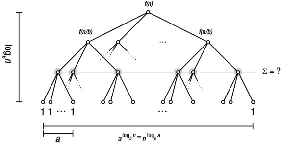

[图 3-6](#_Fig6) 。一个完美平衡的，规则的多路(一路)树，展示了分治递归

然而，每个内部节点都有 *a* 子节点，所以从一级到另一级节点数量的增加不一定抵消问题规模的减少。这意味着叶节点的数量不一定是 *n* 。相反，对于每个级别，节点的数量增加一个因子 *a* ，并且对于 log <sub>*b*</sub> *n* 的高度，我们得到 log*a*<sup>b*n*</sup>的宽度。然而，由于对数的计算规则相当方便，我们可以交换 *a* 和 *n* ，得到*n*T24】log*b a*T27】leaves。练习 3-10 要求你证明这是正确的。

本节的目标 是建立三个千篇一律的解决方案，它们一起形成所谓的主定理。解决方案对应于三种可能的场景:要么大部分工作在*根节点*中执行(也就是说，大部分时间花费在上面)，要么主要在*叶节点*中执行，要么*在递归树的各行之间平均分配*。让我们逐一考虑这三种情况。

在第一个场景中，大部分工作是在根中执行的，我说的“大部分”是指它渐近地支配着运行时间，给我们一个总的运行时间θ(*f*(*n*))。但是我们怎么知道根占优势呢？如果功从一级到另一级缩小(至少)一个常数，并且根比叶做更多的功(渐近)，就会发生这种情况。更正式地说:

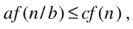

对于一些*c*T4【1】和大型 *n* ，以及

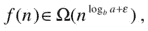

对于某常数*ε*T10】0。这仅仅意味着 *f* ( *n* )的增长*比叶子的数量*更快(这就是为什么我在叶子计数公式的指数中添加了 *ε* )。以下面的例子为例:


这里， *a* = 2， *b* = 3，*f*(*n*)=*n*。为了找到叶子的数量，我们需要计算 log <sub xmlns:m="http://www.w3.org/1998/Math/MathML" xmlns:pls="http://www.w3.org/2005/01/pronunciation-lexicon" xmlns:ssml="http://www.w3.org/2001/10/synthesis">3</sub> 2。我们可以通过在标准计算器上使用表达式 log 2/log 3 来做到这一点，但是在 Python 中我们可以使用来自`math`模块的`log`函数，我们发现`log(2,3)`比 0.631 小一点。换句话说，我们想知道*f*(*n*)=*n*是否为ω(*n*<sup xmlns:m="http://www.w3.org/1998/Math/MathML" xmlns:pls="http://www.w3.org/2005/01/pronunciation-lexicon" xmlns:ssml="http://www.w3.org/2001/10/synthesis">0.631</sup>)，显然是，这就告诉我们 *T* ( *n* )为θ(*f*(*n*))=θ(*n 这里的一个捷径是看到 *b* 大于 *a* ，这可以立即告诉我们 *n* 是表达式的主要部分。你知道为什么吗？*

我们也可以颠倒根叶关系:


现在树叶主宰了画面。你认为这会导致多少总运行时间？没错:

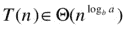

以下面的循环为例:


这里 *a* = *b* ，所以我们得到了一个 *n* 的叶子数，它显然比*f*(*n*)= LG*n*增长得更快。这意味着最终运行时间渐进地等于叶子数，或θ(*n*)。

 **注意**为了建立根的优势，我们需要额外的需求*af*(*n*/*b【T8)≤*cf*(*n*)，对于一些 *c* < 1。建立叶优势，没有类似的要求。*

最后一种情况是根和叶中的功具有相同的渐近增长:


这就变成了树的每一层的总和(从根到叶既不增加也不减少)，这意味着我们可以用它乘以对数高度来得到总和:


以下面的循环为例:

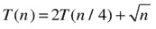

平方根可能看起来令人生畏，但它只是另一种力量，即， *n* <sup xmlns:m="http://www.w3.org/1998/Math/MathML" xmlns:pls="http://www.w3.org/2005/01/pronunciation-lexicon" xmlns:ssml="http://www.w3.org/2001/10/synthesis">0.5</sup> 。我们有 *a* = 2 和 *b* = 4，给我们 log*b a*= log<sub xmlns:m="http://www.w3.org/1998/Math/MathML" xmlns:pls="http://www.w3.org/2005/01/pronunciation-lexicon" xmlns:ssml="http://www.w3.org/2001/10/synthesis">4</sub>2 = 0.5。你知道吗—根和叶的功都是θ(*n*T14】0.5)，因此在树的每一行中，总运行时间如下:

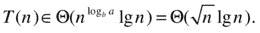

[表 3-2](#Tab2) 总结了主定理的三种情况，按照习惯上给出的顺序:情况 1 是树叶占优；情况 2 是“死竞争”，其中所有行都有相同的(渐近)和；在第三种情况下，根占优势。

[表 3-2](#_Tab2) 。*三例* *掌握定理*

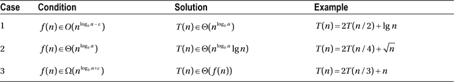

那么，到底是怎么回事呢？

好的，这里有这里有很多数学，但是到目前为止没有很多编码。这些公式有什么意义？考虑一下[清单 3-1](#list1) 和[清单 3-2](#list2) 中的 Python 程序。 [<sup>7</sup>](#Fn7) (你可以在[清单 6-6](06.html#list6) 中找到 `mergesort`函数的完整注释版本。)假设这些是新算法，所以你不能只在网上搜索它们的名字，你的任务是确定哪个算法具有更好的渐近运行时间复杂度。

[***清单 3-1***](#_list1) 。Gnome Sort，一个示例排序算法

```py
def gnomesort(seq):
    i = 0
    while i < len(seq):
        if i == 0 or seq[i-1] <= seq[i]:
            i += 1
        else:
            seq[i], seq[i-1] = seq[i-1], seq[i]
            i -= 1
```

[***清单 3-2***](#_list2) 。合并排序，排序算法的另一个例子

```py
def mergesort(seq):
    mid = len(seq)//2
    lft, rgt = seq[:mid], seq[mid:]
    if len(lft) > 1: lft = mergesort(lft)
    if len(rgt) > 1: rgt = mergesort(rgt)
    res = []
    while lft and rgt:
        if lft[-1] >=rgt[-1]:
            res.append(lft.pop())
        else:
            res.append(rgt.pop())
    res.reverse()
    return (lft or rgt) + res
```

Gnome sort 包含一个单独的`while`循环和一个从`0`到`len(seq)-1`的索引变量，这可能会诱使我们得出结论，它有一个线性的运行时间，但是最后一行中的语句`i -= 1`可能会指出其他情况。为了弄清楚它运行了多长时间，你需要了解它是如何工作的。最初，它从左边的`a`开始扫描(重复递增`i`，寻找`seq[i-1]`大于`seq[i]`的位置`i`，也就是顺序错误的两个值。此时，`else`部分开始工作。

`else`条款交换`seq[i]`和`seq[i-1]`并减少`i`。这种行为将继续，直到再次`seq[i-1] <= seq[i]`(或者我们到达位置`0`)并且秩序被恢复。换句话说，该算法交替地在序列中向上扫描不合适(即太小)的元素，并通过重复交换将该元素向下移动到有效位置。这一切的代价是什么？让我们忽略一般情况，专注于最好和最坏的情况。当序列被排序时，最好的情况出现:`gnomesort`将只是扫描通过`a`而没有发现任何不合适的地方，然后终止，产生运行时间θ(*n*)。

最坏的情况稍微简单一点，但也不多。注意，一旦我们发现一个不合适的元素，该点之前的所有元素都已经排序了，将新元素移动到正确的位置不会打乱它们。这意味着每次我们发现一个错放的元素，排序后的元素的数量就会增加 1，下一个错放的元素将会更靠右。寻找和移动一个错放的元素的最坏的可能成本与它的位置成正比，所以最坏的运行时间可能是 1 + 2 +...+*n*–1，也就是θ(*n*T4】2)。目前这只是一个假设——我已经证明情况不会比这更糟，但它真的会变得这么糟吗？

的确可以。考虑元素按降序排序的情况(即，与我们想要的相反)。那么每个元素都在错误的位置，必须一直移动到起点，给我们二次运行时间。所以，一般来说，gnome sort 的运行时间是ω(*n*)和 *O* ( *n* <sup>2</sup> )，这是分别代表最好和最坏情况的紧界。

现在，看看合并排序([清单 3-2](#list2) )。它比 gnome sort 稍微复杂一点，所以我会推迟到第 6 章再解释它是如何排序的。幸运的是，我们可以在不了解它如何工作的情况下分析它的运行时间！只看整体结构。输入(序列)的大小为 *n* 。这里有两个递归调用，每个调用都是针对一个子问题 *n* /2(或者是尽可能接近整数大小)。此外，在`while`循环和`res.reverse()`中执行一些工作；练习 3-11 要求你证明这个功是θ(*n*)。(练习 3-12 问你如果用`pop(0)`代替`pop()`会发生什么。)这就给了我们众所周知的递归数 8，*T*(*n*)= 2*T*(*n*/2)+θ(*n*)，也就是说不管输入是什么，归并排序的运行时间都是θ(*n*LG*n*)。这意味着，如果我们期望数据几乎被排序，我们可能更喜欢 gnome 排序，但一般来说，我们可能会更好地放弃它以支持合并排序。

 **注意** Python 的排序算法 timsort 是一个自然适应版本的归并排序。它设法实现线性最佳情况运行时间，同时保持对数线性最坏情况。你可以在第六章[的 timsort 上的“黑盒”侧栏中找到更多细节。](06.html)

摘要

第 *n* 个整数的和是二次的，第 lg *n* 个 2 的一次幂的和是线性的。这些身份中的第一个可以被说明为循环锦标赛，具有所有可能的 *n* 元素的配对；第二个与淘汰赛有关，lg *n* 轮，除了获胜者之外，所有人都必须被淘汰。 *n* 的排列数是 *n* ！，而来自 *n* 的*k*-组合(大小为 *k* 的子集)的个数，写成 *C* ( *n* ， *k* )，则为 *n* ！/( *k* ！(*n*–*k*)！).这也被称为*二项式系数*。

如果一个函数调用自己(直接或通过其他函数)，那么它就是递归的。递推关系是将一个函数与其自身以递归的方式联系起来的方程(如*T*(*n*)=*T*(*n*/2)+1)。这些方程经常被用来描述递归算法的运行时间，为了能够求解它们，我们需要假设一些关于递归的基本情况；通常，我们假设 *T* ( *k* )为θ(1)，对于某个常数 *k* 。本章介绍了三种主要的求解递归的方法: (1)反复应用原方程来解开 *T* 的递归出现，直到你找到一个模式；(2)猜测一个解，并用归纳法证明其正确性；以及(3)对于符合主定理的情况之一的分治递归，简单地使用相应的解决方案。

如果你好奇的话...

本章的主题(以及之前的主题)通常被归类为所谓的 *离散数学*的一部分。关于这个话题有很多书，我看过的大多数都很酷。如果你喜欢这类东西，那就去图书馆、当地书店或网上书店。我相信你会找到足够让你忙上好一阵子的东西。

我喜欢的一本论述 计数和证明(但不是一般的离散数学)的书是本杰明和奎因的《真正计算的*证明》。值得一看。如果你想要一本专门为计算机科学家编写的关于和、组合学、递归以及许多其他实质性内容的可靠参考，你应该去看看 Graham、Knuth 和 Patashnik 的经典*具体数学*。(是啊，就是*那个* Knuth，你就知道好了。)如果你只是需要一个地方来查找一个总数的解，你可以尝试 Wolfram Alpha ( `http://wolframalpha.com`)，如前所述，或者找一本装满公式的袖珍参考资料(同样，可能可以在你最喜欢的书店买到)。*

如果你想要更多关于递归的细节，你可以在我在[第一章](01.html)中提到的算法教科书中查找标准方法，或者你可以研究一些更高级的方法，这些方法可以让你处理比我在这里处理的更多的递归类型。比如*具体数学*讲解如何使用所谓的 *生成函数* 。如果你在网上四处看看，你一定会发现很多有趣的东西，比如用 *零化子*或者使用*阿克拉-宝宝定理*来解决递归问题。

本章前面关于伪多项式的边栏使用了素性检查作为例子。许多(更老的)教科书声称这是一个未解决的问题(即没有已知的多项式算法来解决它)。正如你所知——这不再是真的了:2002 年，Agrawal、Kayal 和 Saxena 发表了他们的开创性论文“素数在 P 中”，描述了如何进行多项式素性检查。(奇怪的是，*因式分解*数字仍然是一个未解决的问题。)

练习

3-1.证明“使用求和”一节中描述的属性是正确的。

3-2.用[第二章](02.html)中的规则表示*n*(*n*–1)/2 为θ(*n*T8】2)。

3-3.2 的前 *k* 个非负整数次幂之和为 2<sup>*k*+1</sup>–1。展示这个属性如何让你将任意正整数表示成二进制数。

3-4.在“龟兔赛跑”这一节中，我们简要介绍了两种求数的方法。将这些方法转化为数字猜测算法，并作为 Python 程序来实现。

3-5.表明 *C* ( *n* ， *k* ) = *C* ( *n* ，*n*–*k*)。

3-6.在“递归和递归”一节前面的递归函数`S`中，假设函数没有使用位置参数`i`，而是简单地返回了`sec[0] + S(seq[1:])`。现在渐近运行时间是多少？

3-7.使用重复替换求解表 3-1 中的递归 2。

3-8.使用重复替换求解表 3-1 中的递归 3。

3-9.使用重复替换求解表 3-1 中的递归 4。

3-10.表明*x*<sup>log*y*</sup>=*y*<sup>log*x*</sup>，不管对数的底数。

3-11.对于[清单 3-2](#list2) 中归并排序的实现，表明 *f* ( *n* )为θ(*n*)。

3-12.在[清单 3-2](#list2) 的合并排序中，对象从序列的每一半的末尾弹出(用`pop()`)。从一开始就用`pop(0)`弹出可能更直观，以避免之后不得不反转`res`(我在现实生活中见过这样做)，但`pop(0)`就像`insert(0)`一样，是线性操作，与`pop()`相反，它是常数。这样的切换对总运行时间意味着什么？

参考

Agrawal、n . Kayal 和 n . sa xena(2004 年)。*素数在 P* 中。数学年鉴，160(2):781–793。

阿克拉和宝宝(1998 年)。*关于线性递推方程组的解*。计算优化与应用，10(2):195–210。

本杰明，A. T .和奎因，J. (2003)。真正重要的证明:组合证明的艺术。美国数学协会。

Graham，R. L .，Knuth，D. E .和 Patashnik，O. (1994 年)。具体数学:计算机科学的基础，第二版。艾迪森-韦斯利专业版。

__________________

[<sup>1</sup>](#_Fn1) 只要函数没有任何副作用，也就是说，而是表现得像数学函数。

[<sup>2</sup>](#_Fn2)T0】。

如果这是真的，那么在大约 32 代以前，人类人口将由一男一女组成...但是，就像我说的，配合一下。

[<sup>4</sup> ...尽管他被告知要清点他收到的每一粒谷物。我猜他改变主意了。](#_Fn4)

[<sup>5</sup>](#_Fn5) 你看到指数中的–1 去哪了吗？记住，2<sup>*a*+*b*</sup>= 2<sup>*a*</sup>2<sup>*b*</sup>...

[<sup>6</sup>](#_Fn6) 另一个不太明显的是“二项式系数”这个名字的由来。你可能想查一下。这是一种整洁。

[<sup>7</sup>](#_Fn7) 归并排序是一个经典，由计算机科学传奇人物约翰·冯·诺依曼于 1945 年在 EDVAC 上首次实现。你会在第六章的[中了解到更多关于那个和其他类似算法的内容。Gnome sort 是由 Hamid Sarbazi-Azad 在 2000 年发明的，名字叫做愚蠢排序。](06.html)

[<sup>8</sup>](#_Fn8) 如果你不确定*离散*和*离散*的区别，你可能想查一下。**