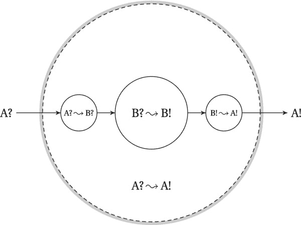
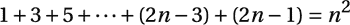
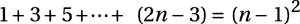
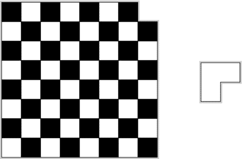
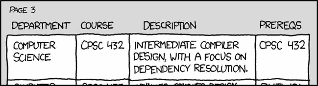
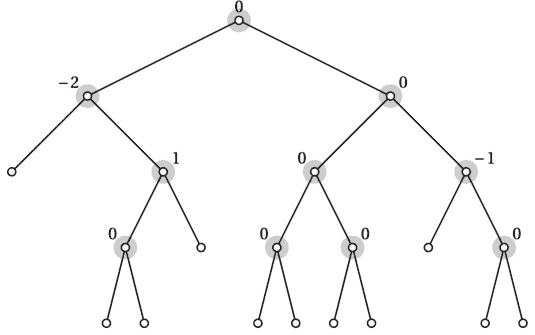

第四章


归纳和递归...和还原

你绝不能马上想到整条街，明白吗？你必须只专注于下一步，下一次呼吸，扫帚的下一次挥动，下一次，再下一次。没别的了。

— Beppo Roadsweeper，米切尔·恩德的《Momo》

在这一章，我为你的算法设计技巧打下基础。算法设计可能很难教，因为没有明确的方法可以遵循。不过，有一些基本原则，其中一个反复出现的是*抽象*的原则。我敢打赌你已经非常熟悉几种抽象了——最重要的是，过程(或函数)抽象和面向对象。这两种方法都允许您隔离代码的各个部分，并最小化它们之间的交互，这样您就可以一次专注于几个概念。

本章的主要思想——归纳、递归和归约——也是抽象的原则。它们都是关于忽略大部分问题，专注于向解决方案迈出*一步*。伟大的事情是，这一步是你所需要的；剩下的自动跟上！这些原则通常是分开教授和使用的，但是如果你看得更深一点，你会发现它们是非常密切相关的:归纳和递归在某种意义上是彼此的镜像，两者都可以被看作是归约的例子。以下是这些术语实际含义的简要概述:

*   *归约*就是把一个问题转化成另一个问题。我们通常把未知的问题简化成我们知道如何解决的问题。这种简化可能涉及到输入(因此它适用于新问题)和输出(因此它适用于原问题)的转换。
*   *归纳法*，或*数学归纳法*，用于表明一个陈述对一大类对象(通常是自然数)成立。我们首先证明它对于一个基本情况(例如数字 1)是正确的，然后证明它从一个对象“延续”到下一个对象；例如，如果对*n*–1 成立，那么对 *n* 也成立。
*   *递归*是函数调用自身时发生的事情。在这里，我们需要确保函数对于(非递归的)基本情况是正确的，并且它将递归调用的结果组合成一个有效的解。

归纳法和递归法都包括将一个问题简化(或分解)成更小的子问题，然后再向前一步，解决整个问题。

注意，虽然这一章中的视角可能与当前的一些教科书有点不同，但这绝不是唯一的。事实上，大部分材料的灵感来自于 Udi man ber 1988 年的精彩论文“使用归纳法设计算法”和他次年的书*算法简介:一种创造性的方法*。

哦，那很简单！

简而言之，将一个问题 A 简化为另一个问题 B 涉及某种形式的转换，之后 B 的解决方案会(直接或经过一些处理)给你一个 A 的解决方案。一旦你学会了一系列标准算法(你会在本书中遇到很多)，这就是你遇到新问题时通常会做的事情。你能以某种方式改变它，以便用你知道的方法之一解决它吗？从很多方面来说，这是*所有*问题解决的核心过程。

我们举个例子。你有一个数字列表，你想找出最接近的两个(不相同的)数字(即绝对差值最小的两个):

```py
>>> from random import randrange
>>> seq = [randrange(10**10) for i in range(100)]
>>> dd = float("inf")
>>> for x in seq:
...     for y in seq:
...         if x == y: continue
...         d = abs(x-y)
...         if d < dd:
...             xx, yy, dd = x, y, d
...
>>> xx, yy
(15743, 15774)
```

两个嵌套循环，都在`seq`之上；应该很明显这是二次的，一般不是好事。假设你对算法有所了解，你知道如果序列是按*排序的*，那么它们通常会更容易处理。你也知道排序通常是对数线性的，或者θ(*n*LG*n*)。看到这有什么帮助了吗？这里的见解是，两个最接近的数字在排序序列中必须是*挨着*:

```py
>>> seq.sort()
>>> dd = float("inf")
>>> for i in range(len(seq)-1):
...     x, y = seq[i], seq[i+1]
...     if x == y: continue
...     d = abs(x-y)
...     if d < dd:
...         xx, yy, dd = x, y, d
...
>>> xx, yy
(15743, 15774)
```

更快的算法，同样的解决方案。新的运行时间是对数线性的，由排序决定。我们最初的问题是“在一个序列中找到两个最接近的数字”，我们通过排序`seq`将其简化为“在一个排序的序列中找到两个最接近的数字”。在这种情况下，我们的归约(排序)不会影响我们得到的答案。一般来说，我们可能需要转换答案，使其符合原始问题。

 **注**在某种程度上，我们只是把问题分成两部分，排序和扫描排序后的序列。你也可以说扫描是将原始问题简化为排序序列问题的一种方式。这完全是视角的问题。

把 A 化简为 B 有点像说“你想解 A？哦，那很简单，只要你能解决 b。”见[图 4-1](#Fig1) 关于归约如何工作的图解。



[图 4-1](#_Fig1) 。用一个从 A 到 B 的归约用一个 B 的算法来解 A . B 的算法(中心，内圆)可以把输入的 B 进行变换？到输出 B！，而归约由两个转换(较小的圆)组成，从 A？to B？还有从 B！敬 A！，共同构成主算法，它将输入 A？到输出 A！

一个，两个，许多

我已经用归纳法解决了第三章中的一些问题，但是让我们回顾一下，看几个例子。当抽象地描述归纳时，我们说我们有一个*命题*，或者说陈述 *P* ( *n* )，我们想证明对于任意自然数 *n* 都成立。例如，假设我们正在调查第一个 *n 个*奇数的总和； *P* ( *n* )则可以是以下语句:



这非常熟悉——它几乎与我们在上一章中使用的握手和相同。你可以很容易地通过调整握手公式得到这个新结果，但是让我们看看如何用归纳法来证明它。归纳法的思想是让我们的证明“横扫”所有自然数，有点像一排多米诺骨牌倒下。我们从建立 *P* (1)开始，这在本例中非常明显，然后我们需要表明，如果每块多米诺骨牌倒下，将会推倒下一块。换句话说，我们必须证明*如果*陈述*P*(*n*–1)为真，那么随之而来的是 *P* ( *n* )也为*真。*

如果我们能表现出这个蕴涵，即*P*(*n*–1)*P*(*n*)，那么结果将会扫过 *n* 的所有值，从 *P* (1)开始，用*P*(1)ü*P*(2)建立 *P* (2)，然后继续进行*换句话说，关键的事情是建立让我们更进一步的暗示。我们称之为*归纳步骤*。在我们的例子中，这意味着我们假设如下(*P*(*n*–1)):*



我们可以认为这是理所当然的，我们只要把它拼接到原来的公式中，看看能不能推导出 *P* ( *n* ):


给你。归纳步骤成立，我们现在知道该公式适用于所有自然数 *n* 。

使我们能够执行这个归纳步骤的主要原因是，我们假设我们已经建立了*P*(*n*–1)。这意味着我们可以从我们所知道的(或者说，假设的)关于*n*–1 的东西开始，并在此基础上展示一些关于 *n* 的东西。让我们尝试一个稍微不那么有序的例子。考虑一个有根的二叉树，其中每个内部节点都有两个子节点(尽管它不需要平衡，所以叶子可能都有不同的深度)。如果树有 *n* 片叶子，它有多少个内部节点？ [<sup>1</sup>](#Fn1)

我们不再有一个好的自然数序列，但是归纳变量( *n* )的选择是非常明显的。解决方案(内部节点的数量)是*n*–1，但是现在我们需要证明这适用于所有的 *n* 。为了避免一些令人厌烦的技术细节，我们从 *n* = 3 开始，所以我们保证有一个内部节点和两个叶子(很明显 *P* (3)是正确的)。现在，假设对于*n*–1 个叶子，我们有*n*–2 个内部节点。我们如何进行至关重要的归纳步骤？

这更接近于构建算法时的工作方式。我们不再只是打乱数字和符号，而是在思考结构，逐步构建它们。在这种情况下，我们将为我们的树添加一片叶子。会发生什么？问题是，我们不能随意添加树叶而不违反我们对树木的限制。相反，我们可以反过来进行这个步骤，从第 *n* 片叶子到第*n*–1 片叶子。在有 *n* 片叶子的树中，连同它的(内部)父节点一起移除任何一片叶子，然后连接剩下的两片叶子，这样现在断开的节点就被插入到父节点所在的位置。这是一棵合法的树，有 n*–1 片叶子和(根据我们的归纳假设)*n*–2 个内部节点。原来的树多了一片叶子，多了一个内部节点，也就是 *n* 片叶子和*n*–1 个内部，这正是我们想要展示的。*

 *现在，考虑下面的经典难题。如图 4-2 中的[图所示，你如何用 L 形瓷砖盖住一个缺了一个角的棋盘？这可能吗？你会从哪里开始？你*可以*尝试一个强力解决方案，从第一个棋子开始，把它放在每一个可能的位置(和每一个可能的方向)，对于每一个，尝试第二个的每一种可能性，以此类推。那不会很有效率。我们怎样才能减少这个问题？还原在哪里？](#Fig2) [<sup>2</sup>](#Fn2)



[图 4-2](#_Fig2) 。一个不完整的棋盘，被 L 形瓷砖覆盖。拼贴可以旋转，但不能重叠

放置一个瓷砖，并假设我们可以解决其余的问题，或者假设我们已经解决了除一个以外的所有问题，然后放置最后一个——这当然是一种减少。我们已经把问题从一个转化到另一个，但是问题是我们没有解决新的问题*和*的方法，所以它没有真正的帮助。为了使用归纳法(或递归)，归约必须(通常)在*相同问题*或*不同大小*的实例之间进行。目前，我们的问题仅针对图 4-2 中的特定电路板，但将其推广到其他尺寸应该不会有太大问题。给定这个概括，你看到任何有用的减少吗？**

问题是我们怎样才能把这块木板分割成形状相同的小块。它是二次的，所以自然的起点可能是把它分成四个更小的正方形。在那一点上，我们和完整解决方案之间唯一的障碍是，四个板部件中只有*一个*与原来的形状相同，缺了一个角。其他三个是完整的(四分之一大小)棋盘。然而，这很容易补救。只需放置一个瓷砖，使其覆盖这三个子板的一个角，就像变魔术一样，我们现在有四个子问题，每个都相当于(但小于)完整的问题！

为了澄清这里的归纳，假设您实际上还没有放置瓷砖。你只需要注意哪三个角是敞开的。通过*归纳假设*，你可以覆盖三个子板(其中*基础案例*是四个正方形的板)，一旦你完成，还剩下三个正方形可以覆盖，呈 L 形。[<sup>3</sup>](#Fn3)*归纳步骤*然后放置这个棋子，隐含地组合四个子解。因为归纳，我们不仅解决了八乘八的问题。这个解决方案适用于任何这种类型的棋盘，只要它的边是 2 的(相等)幂。

 **注意**在这里，我们还没有真正在所有电路板尺寸或所有边长上使用感应。我们已经隐含地假设边长为 2 *k* ，对于某个正整数 *k* ，并在 *k* 上使用归纳法。结果是完全有效的，但重要的是要注意我们已经证明了什么。例如，对于奇数边电路板，解决方案*不*成立。

这个设计实际上更多的是一个证明，而不是一个实际的算法。不过，把它变成一个算法并不难。你首先需要考虑由四个正方形组成的所有子问题，确保它们的开角正确对齐。然后，你将这些问题组合成由 16 个正方形组成的子问题，仍然要确保放置开放的角，以便它们可以用 L 形片连接。虽然你当然可以用一个循环把它设置成一个迭代程序，但是用递归会简单得多，在下一节你会看到。

镜子，镜子

在他出色的网络视频节目中，泽·弗兰克曾经说过这样的话:“‘你知道没有什么可害怕的，除了害怕本身。’是的，这叫做递归，这会导致无限的恐惧，所以谢谢你。 [<sup>4</sup>](#Fn4) 另一个常见的建议是，“为了理解递归，首先必须理解递归。"

确实如此。递归可能很难理解——尽管无限递归是一种相当病态的情况。 [<sup>5</sup>](#Fn5) 在某种程度上，递归只有作为归纳的镜像才有意义(参见[图 4-3](#Fig3) )。在归纳法中，我们(从概念上)从一个基本案例开始，展示归纳步骤如何带我们走得更远，直到整个问题的规模。对于弱归纳， [<sup>6</sup>](#Fn6) 我们假设(归纳假设)我们的解决方案对*n*–1 有效，并由此推断对 *n* 有效。递归通常看起来更像是分解事物。你从一个完整的问题开始，大小为 *n* 。您将大小为*n*–1 的子问题委托给一个递归调用，等待结果，并将得到的子解扩展为完整解。我相信你可以看到这只是一个视角的问题。在某种程度上，归纳法向我们展示了为什么递归有效，而递归给了我们一个简单的方法(直接)实现我们的归纳思想。


[图 4-3](#_Fig3) 。归纳(左边)和递归(右边)，互为镜像

以上一节的棋盘问题为例。最简单的解决方法(至少在我看来)是递归。你放置一个 L-piece，这样你得到四个等价的子问题，然后你递归地解决它们。通过归纳，解决方案将是正确的。

**实现棋盘覆盖**

尽管棋盘覆盖问题在概念上有一个非常简单的递归解决方案*，但是实现它可能需要一些思考。实现的细节对于这个例子的要点来说并不重要，所以如果你愿意的话，可以跳过这个边栏。实现解决方案的一种方式如下所示:*

 *`def cover(board, lab=1, top=0, left=0, side=None):`
`if side is None: side = len(board)`

`# Side length of subboard:`
`s = side // 2`

`# Offsets for outer/inner squares of subboards:`
`offsets = (0, -1), (side-1, 0)`

`for dx_outer, dx_inner in offsets:`
`# If the outer corner is not set...`
`if not board[top+dy_outer][left+dx_outer]:`
`# ... label the inner corner:`
`board[top+s+dy_inner][left+s+dx_inner] = lab`

`# Next label:`

`if s > 1:`

`for dx in [0, s]:`
`# Recursive calls, if s is at least 2:`
`lab = cover(board, lab, top+dy, left+dx, s)`

`# Return the next available label:`

虽然递归算法很简单，但是需要做一些簿记工作。每个调用都需要知道它正在哪个子板上工作，以及当前 I-tile 的编号(或标签)。该函数的主要工作是检查四个中心方块中的哪一个要用 L-tile 覆盖。我们只覆盖不对应于缺失(外部)角的三个角。最后，有四个递归调用，分别针对四个子问题。(返回下一个可用标签，因此可以在下一次递归调用中使用它。)下面是一个如何运行代码的示例:

`>>> board = [[0]*8 for i in range(8)] # Eight by eight checkerboard`
`>>> board[7][7] = -1                  # Missing corner`
`>>> cover(board)`
`22`
`>>> for row in board:`
`...     print((" %2i"*8) % tuple(row))`
`3  3  4  4  8  8  9  9`
`3  2  2  4  8  7  7  9`
`5  2  6  6 10 10  7 11`
`5  5  6  1  1 10 11 11`
`13 13 14  1 18 18 19 19`
`13 12 14 14 18 17 17 19``15 12 12 16 20 17 21 21`
`15 15 16 16 20 20 21 -1`

正如你所看到的，所有的数字标签都形成了 L 形(除了-1，它代表缺角)。代码可能有点难以理解，但是想象一下，在没有归纳或递归的基础知识的情况下理解它，更不用说设计它了！

归纳和递归是密切相关的，因为直接递归地实现归纳思想通常是可能的。然而，有几个原因可以解释为什么迭代实现可能更好。使用循环的开销通常比递归小(所以速度更快)，而且在大多数语言(包括 Python)中，递归的深度是有限制的(最大堆栈深度)。以下面的例子为例，它只遍历一个序列:

```py
>>> def trav(seq, i=0):
...     if i==len(seq): return
...     trav(seq, i+1)
...
>>> trav(range(100))
>>>
```

它可以工作，但请尝试在`range(1000)`上运行它。您将得到一个`RuntimeError`,抱怨您已经超过了最大递归深度。

 **注**很多所谓的函数式编程语言都实现了一种叫做*尾部递归优化* 的东西。类似前面的函数(唯一的递归调用是函数的最后一条语句)被修改，这样它们就不会耗尽堆栈。通常，递归调用在内部被重写为循环。

幸运的是，任何递归函数都可以重写为迭代函数，反之亦然。然而，在某些情况下，递归是非常自然的，你可能需要在迭代程序中使用你自己的堆栈来伪装它(如在非递归的*深度优先搜索*，在[第 5 章](05.html)中解释)。

让我们来看几个基本算法，通过递归思想可以很容易地理解算法思想，但是实现非常适合迭代。 [<sup>7</sup>](#Fn7) 考虑排序问题(计算机科学教学中的最爱)。像以前一样，问问自己，减在哪里？有很多方法可以减少这个问题(在[第 6 章](06.html)我们将减少一半)，但是考虑一下我们通过*一个元素*减少这个问题的情况。我们可以假设(归纳)前*n*–1 个元素已经排序，并将元素 *n* 插入正确的位置，或者我们可以找到最大的元素，将其放在位置 *n* 处，然后递归排序剩余的元素。前者给我们*插入排序*，后者给*选择排序*。T19】

 **注意**这些算法并不那么有用，但它们通常被教授，因为它们是很好的例子。此外，它们是经典，所以任何算法专家都应该知道它们是如何工作的。

看看清单 4-1 中[的递归插入排序。它巧妙地概括了算法思想。要将序列向上排序到位置 *i* ，首先将其递归向上排序到位置*I*–1(通过归纳假设进行校正)，然后向下交换元素`seq[i]`，直到它在已经排序的元素中到达正确的位置。基本情况是当 *i* = 0 时；单个元素被平凡地排序。如果您愿意，您可以添加一个默认案例，其中`i`被设置为`len(seq)-1`。如前所述，尽管这种实现允许我们在递归调用中封装归纳假设，但它有实际的限制(例如，它将处理的序列的长度)。](#list1)

[***清单 4-1***](#_list1) 。递归插入排序

```py
def ins_sort_rec(seq, i):
    if i==0: return                             # Base case -- do nothing
    ins_sort_rec(seq, i-1)                      # Sort 0..i-1
    j = i                                       # Start "walking" down
    while j > 0 and seq[j-1] > seq[j]:          # Look for OK spot
        seq[j-1], seq[j] = seq[j], seq[j-1]     # Keep moving seq[j] down
        j -= 1                                  # Decrement j
```

[清单 4-2](#list2) 显示了迭代版本，通常称为*插入排序* 。不是向后递归，而是从第一个元素开始向前迭代。如果你仔细想想，这也正是递归版本所做的。虽然看起来是从末尾开始，但是在执行`while`循环之前，递归调用会一直返回到第一个元素。在那个递归调用返回之后，`while`循环在*第二个*元素上执行，依此类推，所以两个版本的行为是相同的。

[***清单 4-2***](#_list2) 。插入排序

```py
def ins_sort(seq):
    for i in range(1,len(seq)):                 # 0..i-1 sorted so far
        j = i                                   # Start "walking" down
        while j > 0 and seq[j-1] > seq[j]:      # Look for OK spot
            seq[j-1], seq[j] = seq[j], seq[j-1] # Keep moving seq[j] down
            j -= 1                              # Decrement j
```

[清单 4-3](#list3) 和 [4-4](#list4) 分别包含选择排序的递归和迭代版本。

[***清单 4-3***](#_list3) 。递归选择排序

```py
def sel_sort_rec(seq, i):
    if i==0: return                             # Base case -- do nothing
    max_j = i                                   # Idx. of largest value so far
    for j in range(i):                          # Look for a larger value
        if seq[j] > seq[max_j]: max_j = j       # Found one? Update max_j
    seq[i], seq[max_j] = seq[max_j], seq[i]     # Switch largest into place
    sel_sort_rec(seq, i-1)                      # Sort 0..i-1
```

[***清单 4-4***](#_list4) 。选择排序

```py
def sel_sort(seq):
    for i in range(len(seq)-1,0,-1):            # n..i+1 sorted so far
        max_j = i                               # Idx. of largest value so far
        for j in range(i):                      # Look for a larger value
            if seq[j] > seq[max_j]: max_j = j   # Found one? Update max_j
        seq[i], seq[max_j] = seq[max_j], seq[i] # Switch largest into place
```

再一次，你可以看到两者非常相似。递归实现明确表示归纳假设(作为递归调用)，而迭代版本明确表示重复执行归纳步骤。两者都是通过找到最大的元素(寻找`max_j`的`for`循环)并将其交换到所考虑的序列前缀的末尾来工作的。请注意，您也可以从头开始运行本节中的所有四种排序算法，而不是从结尾开始(在插入排序中将所有对象*排序到右侧*，或者在选择排序中寻找*最小的*元素)。

**但哪里的** ***是*** **的还原？**

找到一个有用的约简通常是解决算法问题的关键步骤。如果你不知道从哪里开始，问问自己，减少在哪里？

然而，可能不完全清楚本节中的想法如何与图 4-1 中呈现的减少情况相吻合。如前所述，归约将问题 A 的实例转换为问题 B 的实例，然后将 B 的输出转换为 A 的有效输出。但是在归纳和归约中，我们只是缩小了问题的规模。哪里*是*的还原，真的吗？

哦，它就在那里——只是我们正在从 A 减少到 A。尽管有些转变正在发生。这种减少确保了我们将*减少到*的实例比原来的实例*小*(这是归纳工作的原因)，当转换输出时，我们再次增加大小。

这是缩减的两个主要变化:缩减到不同的问题和缩减到相同问题的缩小版本。如果你把子问题想成顶点，把归约想成边，你会得到在第二章的[中讨论的*子问题图*，这个概念我会多次重温。(在](02.html)[第八章](08.html)中尤为重要。)

使用归纳法(和递归)进行设计

在这一部分，我将带你完成三个问题的算法解决方案的设计。我正在构建的问题，拓扑排序，是一个在实践中经常出现的问题，如果你的软件管理任何类型的依赖，有一天你很可能需要自己实现它。前两个问题可能没那么有用，但是很有趣，它们是归纳(和递归)的好例子。

寻找最大排列

八个品味独特的人买了电影票。他们中的一些人对自己的座位很满意，但大多数人并不满意，在第三章排队之后，他们变得有点暴躁。假设他们每个人都有一个最喜欢的座位，你想找到一种方法让他们交换座位，让尽可能多的人对结果感到满意(忽略其他观众，他们最终可能会对我们的观众的滑稽动作感到有点厌倦)。但是因为都比较暴躁，如果拿不到自己喜欢的，都拒绝挪到别的座位。

这是*匹配问题*的一种形式。你会在[第 10 章](10.html)中遇到其他几个。我们可以把问题(实例)建模成一个图，就像[图 4-4](#Fig4) 中的那个。边缘从人们现在坐的位置指向他们想要坐的位置。(这个图有点不寻常，因为节点没有唯一的标签；每个人或每个席位代表两次。)


[图 4-4](#_Fig4) 。集合{ a 中的映射...h}自身

 **注意**这是所谓的*二分图*图的一个例子，这意味着节点可以被分成两个集合，其中所有的边都在集合之间*(并且它们都不在*内*)。换句话说，您可以只使用两种颜色来给节点着色，这样相邻节点就不会有相同的颜色。*

在我们尝试设计算法之前，我们需要将问题形式化。真正理解问题总是解决问题的关键的第一步。在这种情况下，我们希望让尽可能多的人得到他们“指向”的座位其他人需要留在座位上。另一种看待这个问题的方式是，我们在寻找一个人(或指指点点的人)的子集，形成一对一的映射，或 T2 排列。这意味着集合中没有人指向它之外，每个座位(在集合中)只被指向一次。这样，排列中的每个人都可以根据自己的意愿自由排列或交换座位。我们希望找到一个尽可能大的排列*(以减少落在它之外并且他们的愿望被拒绝的人的数量)。*

同样，我们的第一步是问，减少在哪里？我们怎样才能把问题缩小呢？我们可以委托(递归地)或假设(归纳地)已经解决的子问题是什么？让我们用简单(弱)归纳法，看看我们是否能把问题从 *n* 缩小到*n*–1。这里， *n* 为人数(或座位数)，即 *n* = 8 为[图 4-4](#Fig4) 。归纳假设来自我们的一般方法。我们简单假设可以解决*n*–1 人的问题(即找到形成排列的最大子集)。唯一需要创造性解决问题的*是安全地移除一个人，这样剩下的子问题就是我们可以建立的(也就是说，是整个解决方案的一部分)。*

如果每个人指向一个不同的座位，整个集合就形成了一个排列，这个排列肯定是尽可能大的——不需要移除任何人，因为我们已经完成了。基本情况也是微不足道的。对于 *n* = 1，无处可动。所以，让我们假设*n*T32】1，并且至少有两个人指向同一个座位(这是打破排列的唯一方法)。以[图 4-4](#Fig4) 中的 *a* 和 *b* 为例。它们都指向 *c* ，我们可以有把握地说*其中一个*必须被淘汰。然而，我们选择哪一个是至关重要的。比方说，我们选择移除 *a* (人和座位)。然后我们注意到 *c* 指向 *a* ，这意味着 *c* 也必须被消除。最后， *b* 指向 *c* 并且也必须被删除——这意味着我们可以简单地从一开始就删除 *b* ,保留 *a* 和 *c* (它们只是想互相交换座位)。

当寻找这样的归纳步骤时，寻找突出的东西通常是个好主意。例如，一个没人想坐的座位(即图 4-4 中[下一行没有 in-edges 的节点)怎么办？在一个有效的解决方案(排列)中，至多一个人(元素)可以被放置(映射到)任何给定的座位(位置)。这意味着没有空座位的空间，因为至少两个人会试图坐在同一个座位上。换句话说，不仅仅是去掉一个空座位(和对应的人)就 OK；这其实是*必要的*。例如，在](#Fig4)[图 4-4](#Fig4) 中，标有 *b* 的节点不能是*任何*排列的一部分，当然不是最大尺寸的。因此，我们可以排除 *b* ，剩下的是同一个问题的一个更小的实例(具有 *n* = 7)，通过归纳的魔力，我们完成了！

还是我们？我们总是需要确保我们已经考虑到了所有可能发生的事情。如果需要的话，我们能确定总会有一个空座位被取消吗？事实上我们可以。没有空座， *n* 人必须集体指向所有的 *n* 座，也就是说他们都指向*不同的*座，所以我们已经有了一个排列。

现在是将归纳/递归算法思想转化为实际实现的时候了。早期的决策总是如何表示问题实例中的对象。在这种情况下，我们可能会用一个图形或者一个在对象之间映射的函数来思考。然而，本质上，像这样的映射只是一个位置(0...*n*–1)与每个元素相关联(也是 0...*n*–1)，我们可以使用一个简单的列表来实现它。比如[图 4-4](#Fig4) 中的例子(如果 *a* = 0， *b* = 1，...)可以表示如下:

```py
>>> M = [2, 2, 0, 5, 3, 5, 7, 4]
>>> M[2] # c is mapped to a
0
```

 **提示**如果可能的话，试着用一种尽可能具体*的方式来表达你的问题。更一般的表示会导致更多的簿记和复杂的代码；如果你使用一个隐含问题约束的表示，那么找到和实现一个解决方案都会容易得多。*

 *如果我们愿意，我们现在可以直接实现递归算法的思想，用一些强力代码来寻找要消除的元素。它不会非常高效，但是低效的实现有时可以是一个有指导意义的起点。参见清单 4-5 中相对直接的实现。

[***清单 4-5***](#_list5) 。寻找最大排列的递归算法思想的简单实现

```py
def naive_max_perm(M, A=None):
    if A is None:                               # The elt. set not supplied?
        A = set(range(len(M)))                  # A = {0, 1, ... , n-1}
    if len(A) == 1: return A                    # Base case -- single-elt. A
    B = set(M[i] for i in A)                    # The "pointed to" elements
    C = A - B                                   # "Not pointed to" elements
    if C:                                       # Any useless elements?
        A.remove(C.pop())                       # Remove one of them
        return naive_max_perm(M, A)             # Solve remaining problem
    return A                                    # All useful -- return all
```

函数`naive_max_perm`接收一组剩余的人(`A`)并创建一组被指向的座位(`B`)。如果它在 A 中找到一个不在 B 中的元素，它就删除这个元素，然后递归地解决剩下的问题。让我们使用我们的例子中的实现，`M`。 [<sup>8</sup>](#Fn8)

```py
>>> naive_max_perm(M)
{0, 2, 5}
```

所以， *a* ， *c* ， *f* 可以参与排列。其他人将不得不坐在不受欢迎的座位上。

实现并不太差。便捷的集合类型让我们可以用现成的高级操作来操作集合，而不必自己实现它们。不过，还是有一些问题。首先，我们可能需要一个迭代的解决方案。这很容易补救——递归可以很简单地用循环代替(就像我们对插入排序和选择排序所做的那样)。然而，更糟糕的问题是算法是二次的！(练习 4-10 要求你展示这个。)

最浪费的操作是重复创建集合 b。如果我们可以跟踪哪些椅子不再被指向，我们就可以完全消除这个操作。这样做的一个方法是为每个元素保存一个计数。当指向 *x* 的人被消灭时，我们可以减少椅子 *x* 的计数，如果 *x* 的计数为零，人和椅子 *x* 都将退出游戏。

 **提示**这种*参考计数* 的思路一般都能有用。例如，它是许多垃圾收集系统中的基本组件(一种自动释放不再有用的对象的内存管理形式)。在拓扑排序的讨论中，您将再次看到这种技术。

在任何时候都可能有不止一个元素需要被删除，但是我们可以把我们遇到的任何新的元素放到一个“待办事项”列表中，以后再处理它们。如果我们需要确保元素按照我们发现它们不再有用的顺序被删除，我们将需要使用一个*先入*、*先出*队列，比如`deque`类(在[第 5 章](05.html)中讨论)。例如，我们并不在乎，所以我们可以使用一个集合，但是仅仅追加到一个列表或者从一个列表中弹出可能会给我们带来更少的开销。当然，你可以随意试验。您可以在清单 4-6 中找到该算法的迭代线性时间版本的实现。

[***清单 4-6***](#_list6) 。寻找最大排列

```py
def max_perm(M):
    n = len(M)                                  # How many elements?
    A = set(range(n))                           # A = {0, 1, ... , n-1}
    count = [0]*n                               # C[i] == 0 for i in A
    for i in M:                                 # All that are "pointed to"
        count[i] += 1                           # Increment "point count"
    Q = [i for i in A if count[i] == 0]         # Useless elements
    while Q:                                    # While useless elts. left...
        i = Q.pop()                             # Get one
        A.remove(i)                             # Remove it
        j = M[i]                                # Who's it pointing to?
        count[j] -= 1                           # Not anymore...
        if count[j] == 0:                       # Is j useless now?
            Q.append(j)                         # Then deal w/it next
    return A                                    # Return useful elts.
```

 **提示**在最近版本的 Python 中，`collections`模块包含了`Counter`类，可以为你统计(可散列)对象。有了它，[清单 4-7](#list7) 中的`for`循环可以被赋值`count = Counter(M)`所取代。这可能会有一些额外的开销，但它会有相同的渐进运行时间。

[***清单 4-7***](#_list7) 。对名人问题的天真解决方案

```py
def naive_celeb(G):
    n = len(G)
    for u in range(n):                          # For every candidate...
        for v in range(n):                      # For everyone else...
            if u == v: continue                 # Same person? Skip.
            if G[u][v]: break                   # Candidate knows other
            if not G[v][u]: break               # Other doesn't know candidate
        else:
            return u                            # No breaks? Celebrity!
    return None                                 # Couldn't find anyone
```

一些简单的实验(见[第二章](02.html)中的提示)应该会让你相信，即使对于相当小的问题实例，`max_perm`也比`naive_max_perm`快很多。但是，它们都非常快，如果您所做的只是解决一个中等大小的实例，您可能会对两者中更直接的一个感到满意。归纳思维在为你提供一个能够找到答案的解决方案时仍然是有用的。当然，你可以尝试每一种可能性，但是*那个*会导致一个完全无用的算法。然而，如果您必须解决这个问题的一些非常大的实例，或者即使您必须解决许多中等的实例，提出线性时间算法所涉及的额外思考可能会得到回报。

**计数排序& FAM**

如果你在某个问题中处理的元素是可散列的，或者更好的是，你可以直接使用整数作为索引(就像在置换的例子中)，那么*计数*应该是你手边的一个工具。计数可以做什么的一个最著名的例子是*计数排序*。正如你将在[第 6 章](06.html)中看到的，如果你只知道你的值是大于还是小于彼此，那么你排序的速度(在最坏的情况下)是有(对数线性)限制的。

在许多情况下，这是您必须接受的现实，例如，如果您使用自定义比较方法对对象进行排序。对数线性比我们目前看到的二次排序算法要好得多。然而，如果你能*数*你的元素，你就能做得更好。可以线性时间排序！更重要的是，计数排序算法非常简单。(我有提到它有多漂亮吗？)

`from collections import defaultdict`

`def counting_sort(A, key=lambda x: x):`
`B, C = [], defaultdict(list)                # Output and "counts"`
`for x in A:`
`C[key(x)].append(x)                     # "Count" key(x)`
`for k in range(min(C), max(C)+1):           # For every key in the range`
`B.extend(C[k])                          # Add values in sorted order`
T7】

默认情况下，我只是根据对象的值对它们进行排序。通过提供一个关键函数，你可以根据你喜欢的任何东西进行排序。请注意，密钥必须是有限范围内的整数。如果这个范围是 0...*k*–1，则运行时间为θ(*n*+*k*)。(虽然常见的实现只是简单地用*对*元素进行计数，然后计算出将它们放在`B`中的什么位置，但是 Python 使得为每个键构建值列表并连接它们变得很容易。)如果几个值有相同的键，它们会以彼此相关的原始顺序结束。具有这种性质的排序算法叫做*稳定*。

举例来说，计数排序确实比快速排序等就地算法需要更多的空间，所以如果数据集和值的范围很大，可能会因为内存不足而导致速度变慢。这可以通过更有效地处理值域来部分解决。我们可以通过对*单个数字*上的数字(或者单个字符上的字符串或者固定大小块上的位向量)进行排序来做到这一点。如果首先按*最低*有效位排序，出于稳定性考虑，按*第二低*有效位排序不会破坏第一次运行时的内部排序。(这有点像在电子表格中逐列排序。)这意味着对于 *d* 位，你可以在θ(*dn*时间内对 *n* 位进行排序。这个算法叫做*基数排序* ，练习 4-11 要求你实现。

另一个有点类似的线性时间排序算法是*桶排序* 。它假设您的值在一个区间内均匀分布，例如，实数在区间[0，1]内，并使用 *n 个桶*，或子区间，您可以将您的值直接放入其中。在某种程度上，您将每个值散列到其适当的槽中，每个桶的平均(预期)大小是θ(1)。因为桶是有序的，所以你可以遍历它们，在θ(*n*)时间内对随机数据进行排序。(练习 4-12 要求你实现桶排序。)

名人问题

在名人问题中，你要在人群中寻找一个名人。这有点牵强，尽管它也许可以用于分析社交网络，如脸书和推特。这个想法是这样的:名人不认识任何人，但是每个人都认识这个名人。 [<sup>10</sup>](#Fn10) 同一个问题的一个更实际的版本是检查一组依赖项并试图找到一个起点。例如，在一个多线程应用程序中，您可能有多个线程在相互等待，甚至有一些循环依赖(所谓的死锁)，您正在寻找一个不等待任何其他线程但所有其他线程都依赖于它的线程。(一种更现实的处理依赖关系的方法——拓扑排序——将在下一节讨论。)

无论我们如何修饰这个问题，它的核心都可以用图表来表示。我们正在寻找一个节点，它有来自所有其他节点的输入边，但是没有来自 T2 的输出边。在掌握了我们正在处理的结构之后，我们可以实现一个强力解决方案，看看它是否能帮助我们理解任何东西(参见[清单 4-7](#list7) )。

`naive_celeb`函数正面解决问题。浏览所有的人，检查每个人是否是名人。这种检查要通过所有的*其他人*，确保他们都认识候选人，而候选人不认识他们中的任何一个。这个版本显然是二次型的，但是也有可能将运行时间降低到线性。

和以前一样，关键在于找到一个缩减——尽可能便宜地将问题从 *n* 人缩减到*n*–1 人。实际上,`naive_celeb`实现确实逐步减少了问题。在外部循环的迭代 *k* 中，我们知道 0...k–1 可能是名人，所以我们只需要解决剩余部分的问题，这正是剩余迭代要做的。这个归约显然是正确的，算法也是如此。这种情况下的新情况是，我们必须努力提高减速的效率。为了得到一个线性算法，我们需要在*常数时间*中进行缩减。如果我们能做到这一点，问题就等于解决了。正如你所看到的，这种归纳的思维方式真的可以帮助我们找到哪里需要运用我们创造性的解决问题的技巧。

一旦我们集中精力在我们需要做的事情上，问题就不那么难了。要把问题从 *n* 减少到*n*–1，我们必须找到一个*非名人*，这个人要么认识某个人，要么不为其他人所知。如果我们为*检查`G[u][v]`的任何*节点`u`和`v`，我们可以排除`u`或`v`！如果`G[u][v]`为真，我们剔除`u`；否则，我们淘汰`v`。如果我们保证*是一个名人，这就是我们所需要的。否则，我们仍然可以排除所有候选人，只留下一个，但我们需要检查他们是否是名人，就像我们在`naive_celeb`中所做的那样。您可以在清单 4-8 中找到基于这种简化的算法实现。(您可以使用集合更直接地实现算法思想；你明白了吗？)*

[***清单 4-8***](#_list8) 。名人问题的解决方案

```py
def celeb(G):
    n = len(G)
    u, v = 0, 1                                 # The first two
    for c in range(2,n+1):                      # Others to check
        if G[u][v]: u = c                       # u knows v? Replace u
        else:       v = c                       # Otherwise, replace v
    if u == n:      c = v                       # u was replaced last; use v
    else:           c = u                       # Otherwise, u is a candidate
    for v in range(n):                          # For everyone else...
        if c == v: continue                     # Same person? Skip.
        if G[c][v]: break                       # Candidate knows other
        if not G[v][c]: break                   # Other doesn't know candidate
    else:
        return c                                # No breaks? Celebrity!
    return None                                 # Couldn't find anyone
```

要尝试这些寻找名人的功能，你可以随便画一张图表。 [<sup>11</sup>](#Fn11) 让我们以相等的概率打开或关闭每个边缘:

```py
>>> from random import randrange
>>> n = 100
>>> G = [[randrange(2) for i in range(n)] for i in range(n)]
```

现在确保有一个名人在那里，并运行两个函数:

```py
>>> c = randrange(n)
>>> for i in range(n):
...     G[i][c] = True
...     G[c][i] = False
...
>>> naive_celeb(G)
57
>>> celeb(G)
57
```

请注意，虽然一个是二次的，一个是线性的，但构建图的时间(无论是随机的还是来自其他来源)在这里是二次的。这可以避免(对于一个*稀疏*图，其中平均边数小于θ(*n*))，用一些其他的图表示；参见第 2 章中的[获取建议。](02.html)

拓扑排序

几乎在任何项目中，要承担的任务都有部分限制其顺序的依赖关系。比如，除非你有非常前卫的时尚感，否则你需要先穿袜子再穿靴子，但你是否先戴帽子再穿短裤就没那么重要了。这种依赖性(如第 2 章中提到的那样)很容易用有向无环图(DAG)来表示，寻找一种尊重依赖性的排序(这样所有的边在排序中都指向前面)被称为*拓扑排序*。

[图 4-5](#Fig5) 说明了这个概念。在这种情况下，有一个唯一有效的排序，但是考虑一下如果你移除边 *ab* 会发生什么——然后 *a* 可以放置在顺序中的任何位置，只要它在 *f* 之前。


[图 4-5](#_Fig5) 。按拓扑排序的有向无环图(DAG)及其节点

在任何中等复杂的计算机系统中，拓扑排序问题在许多情况下都会出现。事情需要去做，并且依赖于其他事情...从哪里开始？一个相当明显的例子是安装软件。大多数现代操作系统至少有一个自动安装软件组件(如应用程序或库)的系统，这些系统可以自动检测某些依赖项何时丢失，然后下载并安装它。为此，必须按照拓扑排序的顺序安装组件。 [<sup>12</sup>](#Fn12)

还有一些算法(例如用于在 DAG 中寻找最短路径的算法，以及在某种意义上，大多数基于动态规划的算法)是基于 DAG 被拓扑排序作为初始步骤。然而，虽然标准排序算法很容易封装在标准库之类的东西中，但是抽象出图算法以便它们可以处理任何类型的依赖结构就有点困难了...因此，您需要在某个时候实现它的可能性并不太大。

 **提示**如果您正在使用某种 Unix 系统，您可以使用`tsort`命令对纯文本文件中描述的图形进行拓扑排序。

在我们的问题中，我们已经有了一个很好的结构表示(DAG)。下一步是寻找一些有用的减少。和以前一样，我们的第一直觉可能应该是删除一个节点，并为剩余的*n*–1 解决问题(或者假设问题已经解决)。这个相当明显的缩减可以用类似于插入排序的方式来实现，如[清单 4-9](#list9) 所示。(我这里假设是邻接集或者邻接字典之类的；详见[第二章](02.html)。)

[***清单 4-9***](#_list9) 。拓扑排序的一种简单算法

```py
def naive_topsort(G, S=None):
    if S is None: S = set(G)                    # Default: All nodes
    if len(S) == 1: return list(S)              # Base case, single node
    v = S.pop()                                 # Reduction: Remove a node
    seq = naive_topsort(G, S)                   # Recursion (assumption), n-1
    min_i = 0
    for i, u in enumerate(seq):
        if v in G[u]: min_i = i+1               # After all dependencies
    seq.insert(min_i, v)
    return seq
```

虽然我希望(通过归纳)清楚地知道`naive_topsort`是*正确的*，但它显然也是二次的(通过表 3-1 中的递归 2)。问题是它在每一步选择一个*任意的*节点，这意味着它必须在递归调用(这给出了线性工作)之后查看节点适合的位置。我们可以反过来，更像选择排序那样工作。在递归调用之前找到要移除的正确节点。然而，这个新想法给我们留下了两个问题。首先，我们应该删除哪个节点？第二，我们如何高效地找到它？ [<sup>十三</sup>](#Fn13)

我们正在处理一个序列(或者至少我们正在*向*一个序列)工作，这可能会给我们一个想法。我们可以做一些类似于选择排序的事情，挑选出应该放在第一个(或最后一个)的元素...其实并不重要；参见练习 4-19)。在这里，我们不能只是把它放在第一位—我们需要真正地把它从图中删除，所以剩下的仍然是一个 DAG(一个等价的但更小的问题)。幸运的是，我们可以在不直接改变图形表示的情况下做到这一点，您马上就会看到。

你会怎么找到一个可以先放的节点？可能有不止一个有效的选择，但选择哪一个并不重要。希望这能让你想起最大排列问题。同样，我们希望找到没有入边的节点。没有内边的节点可以安全地放在第一位，因为它不依赖于任何其他节点。如果我们(从概念上)移除它所有的外边缘，剩下的图，有*n*–1 个节点，也将是一个 DAG，可以用同样的方式排序。

 **提示**如果一个问题让你想起一个你已经知道的问题或算法，那可能是一个好迹象。事实上，建立一个问题和算法的心理档案是可以让你成为一个熟练的算法专家的事情之一。如果你面临一个问题，而你没有直接的关联，你可以系统地考虑你知道的任何相关(或半相关)的技术，并寻找减少的可能性。

就像在最大排列问题中，我们可以通过*计数*找到没有 in-edges 的节点。通过从一个步骤到下一个步骤保持我们的计数，我们不需要每次都重新开始，这将线性步骤成本降低到一个常数(产生一个线性运行总时间，如表 3-1 中的递归 1)。[清单 4-10](#list10) 展示了这种基于计数的拓扑排序的迭代实现。(你能看出迭代结构是如何体现递归思想的吗？)关于图形表示的唯一假设是我们可以迭代遍历节点及其邻居。

[***清单 4-10***](#_list10) 。有向无环图的拓扑排序

```py
def topsort(G):
    count = dict((u, 0) for u in G)             # The in-degree for each node
    for u in G:
        for v in G[u]:
            count[v] += 1                       # Count every in-edge
    Q = [u for u in G if count[u] == 0]         # Valid initial nodes
    S = []                                      # The result
    while Q:                                    # While we have start nodes...
        u = Q.pop()                             # Pick one
        S.append(u)                             # Use it as first of the rest
        for v in G[u]:
            count[v] -= 1                       # "Uncount" its out-edges
            if count[v] == 0:                   # New valid start nodes?
                Q.append(v)                     # Deal with them next
    return S
```

**黑盒:拓扑排序和 PYTHON 的 MRO**

我们在这一节中处理的这种结构排序实际上是 Python 面向对象继承语义的一个组成部分。对于单继承(每个类都是从单个超类派生的)，选择正确的属性或方法很容易。简单地沿着“继承链”向上走，首先检查实例，然后是类，然后是超类，等等。第一个拥有我们要找的东西的类被使用。

然而，如果你有不止一个超类，事情就有点棘手了。考虑以下示例:

`>>> class X: pass`
`>>> class Y: pass`
`>>> class A(X,Y): pass`

如果你想从`A`和`B`中派生出一个新的类`C`，那你就有麻烦了。你不知道是在`X`还是`Y`中寻找方法。

一般来说，继承关系形成了一个 DAG(你不能在一个循环中继承)，为了弄清楚在哪里寻找方法，大多数语言创建了一个类的*线性化*，这只是 DAG 的一个拓扑排序。Python 的最新版本使用了一种称为 C3 的方法解析顺序(或 MRO )(更多信息请参见参考资料),这种方法除了以尽可能有意义的方式对类进行线性化之外，还禁止出现像前面示例中那样的问题情况。



***属地。*** *软件包管理类 CPSC 357 的先决条件是 CPSC 432、CPSC 357 和 glibc2.5 或更高版本(* *`http://xkcd.com/754`* *)*

更强的假设

设计算法时默认的归纳假设是“我们可以用它来解决更小的实例”，但有时这不足以实际执行归纳步骤或有效地执行它。选择子问题的顺序可能很重要(例如在拓扑排序中)，但有时我们必须实际做出一个更强的*T2 假设，以在我们的归纳中附带一些额外的信息。虽然一个更强的假设看起来会让证明变得更难， [<sup>14</sup>](#Fn14) 它实际上只是给了我们更多的*来处理*来推导从*n*–1(或 *n* /2，或其他大小)到 *n* 的步长。*

考虑*平衡因素*的想法。这些被用在一些类型的平衡树中(在第六章的[中讨论),并且是一个树或者子树平衡(或者不平衡)程度的度量。为简单起见，我们假设每个内部节点都有两个子节点。(在实际实现中，一些叶子可能仅仅是`None`等。)为每个内部节点定义平衡因子，并将其设置为左右子树的高度之差，其中高度是从节点(向下)到叶子的最大距离。例如，](06.html)[图 4-6](#Fig6) 中根的左子树的平衡因子为–2，因为它的左子树是一片叶子(高度为 0)，而它的右子树的高度为 2。



[图 4-6](#_Fig6) 。二叉树的平衡因子。只为内部节点(突出显示)定义了平衡因子，但是对于叶节点，可以将其设置为零

计算平衡因子并不是一个非常具有挑战性的算法设计问题，但它确实说明了一点。考虑明显的(分治)缩减。为了找到根的平衡因子，递归地求解每个子树的问题，然后将部分解扩展/组合成完整的解。很简单。除...之外...没用的。我们可以解决更小的子问题的归纳假设在这里对我们没有帮助，因为我们的子问题的解决方案(即平衡因子)没有包含足够的信息来进行归纳步骤！平衡系数不是根据孩子的平衡系数定义的，而是根据他们的*身高*定义的。只要加强我们的假设，我们就能轻松解决这个问题。我们假设可以找到任意一棵有 *k* < *n* 个节点的树的平衡因子和*高度*。我们现在可以在归纳步骤中使用高度，在归纳步骤中找到尺寸 *n* 的平衡系数(左高减去右高)和高度(左高和右高的最大值加 1)。问题解决了！练习 4-20 要求你解决这里的细节问题。

 **注意**树上的递归算法与*深度优先搜索*密切相关，在[第 5 章](05.html)中讨论。

正式思考加强归纳假设有时会有点混乱。相反，你可以想一想，为了建立一个更大的解决方案，你需要在归纳步骤中“附带”哪些额外的信息。例如，在前面使用拓扑排序时，很明显，在我们逐步通过部分解决方案时，捎带(和维护)入度使得更有效地执行归纳步骤成为可能。

更多强化归纳假设的例子，参见[第六章](06.html)中的*最近点*问题和练习 4-21 中的*区间包含*问题。

**反向感应和二次幂**

有时候限制我们正在处理的问题的大小是很有用的，比如只处理 2 的幂。例如，这经常发生在分治算法中(分别参见[第 3 章](03.html)和[第 6 章](06.html)的递归和示例)。在许多情况下，无论我们发现什么样的算法或复杂性，对任何值的 *n* 都仍然有效，但有时，对于本章前面描述的棋盘覆盖问题，情况并非如此。可以肯定的是，我们可能需要证明 *n* 的任何值都是安全的。对于复发，可以使用第 3 章中[的归纳方法。为了显示正确性，可以使用*反向*归纳。](03.html)假设算法对于 *n* 是正确的，并表明这意味着对于*n*–1 是正确的。这通常可以通过简单地引入一个“虚拟”元素来实现，该元素不会影响解决方案，但是会将大小增加到 *n* 。如果你知道这个算法对于无限大小的集合(比如 2 的所有幂)是正确的，反向归纳将让你证明它对于所有的尺寸都是正确的。

不变量和正确性

本章的主要焦点是*设计*算法，其中正确性来自设计过程。也许在计算机科学中，归纳的一个更普遍的观点是*正确性证明*。这和我在这一章中讨论的基本上是一样的，只是角度略有不同。你面前是一个完成的算法，你需要证明它是可行的。对于递归算法，我已经展示给你的思想可以直接使用。对于循环，也可以递归思考，但是有一个概念更直接的适用于迭代的归纳证明:*循环不变量*。给定一些前提条件，循环不变量是在循环的每次迭代后为真的东西；它被称为*不变量*，因为它不会变化——从头到尾都是真的。

通常，最终解是不变量在最后一次迭代后得到的特例，所以如果不变量总是成立(给定算法的前提条件)，并且你可以证明循环终止，你就证明了算法是正确的。让我们用插入排序来试试这种方法([清单 4-2](#list2) )。循环的不变量是元素 0... *i* 被排序(如代码中第一个注释所暗示的)。如果我们想用这个不变量来证明正确性，我们需要做以下事情:

1.  使用归纳法来证明它在每次迭代后都是真实的。
2.  表明如果算法终止，我们会得到正确的答案。
3.  表明算法终止。

步骤 1 中的归纳包括显示一个基本情况(即第一次迭代的之前的*)和一个归纳步骤(循环的单次运行保持不变量)。第二步包括在终止点使用不变量。第三步通常很容易证明(也许通过展示你最终“用完”了某样东西)。 [<sup>15</sup>](#Fn15)*

对于插入排序，步骤 2 和 3 应该是显而易见的。`for`循环将在 *n 次*迭代后终止，其中*I*=*n*–1。不变量然后说元素 0...*n*–1 排序，表示问题解决。基本情况( *i* = 0)是微不足道的，因此剩下的就是归纳步骤——通过在排序值的正确位置插入下一个元素(不中断排序)来显示循环保持不变量。

放松和逐步改善

术语*放松* 取自数学，在数学中有几个意思。这个术语已经被算法学家使用，用来描述几种算法中的关键步骤，特别是基于动态规划的最短路径算法(在第 8 章和第 8 章[第 9 章](09.html)中讨论)，在这些算法中，我们逐渐改进我们对最优解的逼近。以这种方式逐步改进解决方案的想法也是寻找最大流的算法的核心。我现在还不会深入这些算法是如何工作的，但是让我们来看一个简单的例子，它可能被称为*放松*。

你在一个机场，坐飞机可以到达其他几个机场。从这些机场中的每一个，你可以乘火车到几个城镇和城市。假设你有一个航班时刻表，即`A`，那么`A[u]`就是你到达`u`机场的时间。同样，`B[u][v]`会给你坐火车从机场`u`到城镇`v`所需的时间。(`B`可以是列表的列表，也可以是字典的字典，例如；参见[第二章](02.html)。)考虑以下随机方法来估计你到达每个城镇所需的时间，`C[v]`:

```py
>>> for v in range(n):
...     C[v] = float('inf')
>>> for i in range(N):
...     u, v = randrange(n), randrange(n)
...     C[v] = min(C[v], A[u] + B[u][v]) # Relax
```

这里的想法是反复看看我们是否可以通过选择另一条路线来提高我们对`C[v]`的估计。先坐飞机去`u`，然后坐火车去`v`。如果这给了我们一个更好的总时间，我们更新`C`。只要`N`真的很大，我们最终会得到每个城镇的正确答案。

对于实际上*保证*正确解的基于松弛的算法，我们需要做得比这更好。对于飞机+火车的问题，这相当容易(见练习 4-22)。对于更复杂的问题，你可能需要更微妙的方法。例如，你可以表明你的解的值在每次迭代中增加一个整数；如果算法只在你达到最优(整数)值时终止，那么它一定是正确的。(这类似于最大流算法的情况。)或者，您可能需要展示正确的估计如何在问题实例的元素之间传播，例如图中的节点。如果目前这看起来有点笼统，不要担心——当我们遇到使用该技术的算法时，我会得到足够具体的信息。

 **提示**用放松来设计算法可以像一个游戏。每一次放松都是一个“动作”，你试图用尽可能少的动作获得最优解。你总是可以通过全身放松来达到目的，但关键在于以正确的顺序表演你的动作。当我们在 DAGs ( [第 8 章](08.html))、Bellman-Ford 和 Dijkstra 的算法([第 9 章](09.html))中处理最短路径时，将进一步探讨这个想法。

还原+对位=硬度证明

这一节实际上只是你将在第 11 章中遇到的一些铺垫。你看，虽然归约被用来*解决*问题，但大多数教科书讨论它们的唯一背景是*问题复杂性*，它们被用来表明你【可能】*不能*解决一个给定的问题。这个想法真的很简单，但我已经看到它绊倒了我的许多(甚至大多数)学生。

硬度证明是基于这样一个事实，即我们只允许简单(即快速)的减少。比方说，你能把问题 A 简化为 B(所以 B 的解也给你一个 A 的解；看看[图 4-1](#Fig1) 如果你需要刷新你的记忆关于这是如何工作的)。我们知道，如果 B 是简单的，那么 A 也一定是简单的。这直接源于这样一个事实，我们可以用 B，加上一个简单的简化，来求解 a。

例如，假设 A 正在寻找 DAG 中两个节点之间的最长路径*，而 B 正在寻找 DAG 中两个节点之间的最短*路径*。然后，你可以通过简单地将所有的边都视为负值来将 A 简化为 B。现在，如果你学会了在允许负边权重的 DAGs 中寻找*最短*路径的有效算法(你将在[第 8 章](08.html)中看到)，你也自动拥有了寻找*最长*路径和*正*边权重的有效算法。 [<sup>17</sup> 换句话说，快速归约+快速解 B =快速解 a。](#Fn17)*

现在让我们应用我们的朋友*对位*。我们已经建立了“如果 B 很容易，那么 A 也很容易。”反命题是“如果 A 是硬的，那么 B 也是硬的。” [<sup>18</sup>](#Fn18) 这个应该还是挺容易理解的，直观上。如果我们知道 A 是困难的，无论我们如何接近它，我们都知道 B 不可能是容易的——因为如果它*是*容易的，它将为我们提供一个解决 A 的简单方法，而 A 终究不会是困难的(一个矛盾)。

我希望这一节到目前为止是有意义的。现在推理还有最后一步。如果我遇到一个新的未知问题 X，我已经知道问题 Y 是难的，我怎么用一个归约来说明 X 是难的？

基本上有两种选择，所以几率应该是五五开左右。奇怪的是，在我询问的人中，似乎有超过一半的人在稍加思考之前就理解错了。答案是，把 Y 还原成 x，(你答对了吗？)如果你知道 Y 是硬的，你把它简化为 X，那么 X 一定是硬的，因为否则它可以很容易地用来解 Y——这是一个矛盾。

向另一个方向减少真的不会让你有任何进展。例如，修理一台被砸坏的电脑很难，但是如果你想知道修理你的(未被砸坏的)电脑是容易还是困难，砸坏它并不能证明什么。

因此，总结一下这里的推理:

*   如果你能(轻易地)把 A 化简为 B，那么 B 至少和 A 一样努力。
*   如果你想证明 X 是硬的，你知道 Y 是硬的，把 Y 简化成 X。

许多人对此感到困惑的原因之一是，我们通常认为减少是将一个问题转化为更容易的事情。就连“还原”这个名字也隐含了这一点。然而，如果我们通过将 A 简化为 B 来求解 A，那么只有*似乎*像 B 更容易，因为它是我们已经知道如何求解的东西。简化后，A 是*一样简单*——因为我们可以通过 B 解决它(加上一个简单快速的简化)。换句话说，只要你的减少没有带来任何沉重的负担，你就不能*永远不要*减少到更容易的事情，因为减少的行为会自动平衡事情。将 A 简化为 B，B 自动地至少和 A 一样硬。

让我们暂时就这样吧。我将在第 11 章中详细介绍。

解决问题的建议

以下是一些解决算法问题和设计算法的建议，总结了本章的一些主要观点:

*   确保你真的理解了这个问题。什么是输入？产量？两者的精确关系是什么？尝试将问题实例表示为熟悉的结构，例如序列或图形。直接、强力的解决方案有时有助于明确问题所在。
*   **Look for a reduction.** Can you transform the input so it works as input for another problem that you can solve? Can you transform the resulting output so that you can use it? Can you reduce an instance of size *n* to an instance of size *k* < *n* and extend the recursive solution (inductive hypothesis) back to *n*?

    这两者共同构成了算法设计的强大方法。我还将在这里添加第三个项目。这与其说是第三步，不如说是在完成前两步时需要记住的事情:

*   你还有其他可以利用的假设吗？固定值范围内的整数可以比任意值更高效的排序。在 DAG 中寻找最短路径比在任意图中更容易，并且仅使用非负边权重通常比任意边权重更容易。

现在，你应该能够开始使用前两条建议来构建你的算法。第一点(理解和表现问题)可能看起来显而易见，但对问题结构的深刻理解可以使找到解决方案变得容易得多。考虑特例或简化，看看它们是否能给你灵感。一厢情愿的想法在这里可能是有用的，丢弃部分问题规范，这样你就可以一次考虑一个或几个方面。(“如果我们忽略边缘权重会怎么样？如果所有的数字都是 0 或 1 呢？如果所有的弦都是等长的呢？如果每个节点都有恰好 *k* 个邻居会怎么样？”)

第二项(寻求简化)在本章中已经讨论了很多，尤其是简化为(或分解为)子问题。这在设计你自己的全新算法时至关重要，但通常情况下，你更有可能找到一个*几乎*适合的算法。寻找你认识到的问题的模式或方面，扫描你的大脑档案，寻找可能相关的算法。你能不能不构造一个算法来解决问题，而是构造一个算法来转换实例，以便现有的算法可以解决它们？系统地处理你知道的问题和算法比等待灵感更有成效。

第三项更多的是一般性的观察。针对特定问题定制的算法通常比更通用的算法更有效。即使你知道一个通用的解决方案，也许你可以调整它来使用这个特殊问题的额外约束？如果你已经构建了一个蛮力解决方案来试图理解这个问题，也许你可以通过利用这个问题的这些怪癖把它发展成一个更有效的解决方案？考虑修改插入排序，使其成为桶排序，例如， [<sup>19</sup>](#Fn19) ，因为您知道一些值的分布。

摘要

这一章是关于通过某种方式将一个问题简化为你知道如何解决的问题来设计算法。如果你把它简化成一个完全不同的问题，你也许可以用现有的算法来解决它。如果你把它简化成一个或多个子问题(同一问题的更小的实例)，你就可以归纳地解决它，归纳设计给你一个新的算法。本章中的大多数例子都是基于弱归纳法或对大小为*n*–1 的子问题的扩展解决方案。在后面的章节里，尤其是[第 6 章](06.html)，你会看到更多强归纳法的使用，这里的子问题可以是任意大小 *k* < *n* 。

这种规模缩减和归纳与递归密切相关。归纳是你用来证明递归是正确的，递归是实现大多数归纳算法思想的一种非常直接的方式。但是，将算法重写为迭代式可以避免大多数非函数式编程语言中递归函数的开销和限制。如果一个算法开始是迭代的，你仍然可以递归地考虑它，通过查看到目前为止解决的子问题，就好像它是通过递归调用计算的。另一种方法是定义一个循环不变量，它在每次迭代后都是正确的，并且你可以用归纳法来证明。如果表明算法终止，可以用不变量来表明正确性。

在本章的例子中，最重要的一个可能是拓扑排序:对 DAG 的节点进行排序，使所有的边都指向前方(也就是说，所有的依赖关系都得到考虑)。例如，这对于找到执行相互依赖的任务的有效顺序，或者对于在更复杂的算法中排序子问题是很重要的。这里提出的算法重复地删除没有入边的节点，将它们附加到排序中，并保持所有节点的入度，以保持解决方案的效率。[第 5 章](05.html)描述了这个问题的另一种算法。

在一些算法中，归纳思想不仅仅与子问题的大小有关。它们是基于一些估计的逐渐改进，使用一种叫做*松弛*的方法。例如，这在许多算法中用于寻找加权图中的最短路径。为了证明这些是正确的，您可能需要揭示评估如何改进的模式，或者正确的评估如何在您的问题实例的元素中传播。

虽然在这一章中使用了归约来表明一个问题是简单的，也就是说，你也可以用归约来表明一个问题至少和另一个问题一样难。如果你把问题 A 化简为问题 B，化简本身很容易，那么 B 至少要和 A 一样难(或者我们得到一个矛盾)。这个想法在[第 11 章](11.html)中有更详细的探讨。

如果你好奇的话...

正如我在引言中所说，这一章在很大程度上受到了 Udi Manber 的论文“使用归纳法设计算法”的启发。关于那篇论文和他后来关于同一主题的书的信息可以在“参考资料”部分找到。我强烈建议你至少看一下这篇论文，你可以在网上找到。在本书的其余部分，你还会遇到这些原则的几个例子和应用。

如果你真的想理解递归是如何被用于几乎任何事情的，你可能想尝试一下函数式语言，比如 Haskell(见`http://haskell.org`)或 Clojure(见`http://clojure.org`)。仅仅浏览一些函数式编程的基础教程就可以加深你对递归的理解，从而大大加深对归纳法的理解，特别是如果你对这种思维方式有点陌生的话。你甚至可以看看 Rabhi 和 Lapalme 写的关于 Haskell 算法的书，以及 Okasaki 写的关于函数式语言数据结构的书。

虽然我在这里只关注递归的归纳性质，但是还有其他方式来展示递归是如何工作的。例如，存在一个所谓的递归不动点理论，它可以用来确定递归函数真正做什么。这是相当沉重的东西，我不会推荐它作为开始的地方，但是如果你想了解更多，你可以看看 Zohar Manna 的书，或者 Michael Soltys 的书(描述稍微简单一些，但是不太全面)。

如果你想要更多的解决问题的建议，Pólya 的*如何解决*是一本经典，不断被转载。值得一看。你可能还想得到史蒂文·斯基纳的算法设计手册*。这是一个相当全面的基本算法参考，以及设计原则的讨论。他甚至有一个非常有用的解决算法问题的清单。*

练习

4-1.你可以在平面上画出没有任何边互相交叉的图叫做*平面*。这样的绘图将会有许多的*区域*，由图的边所包围的区域，以及围绕图的(无限大的)区域*。如果图分别有 *V* 、 *E* 和 *F* 个节点、边和区域，那么平面连通图的欧拉公式说*V*–*E*+*F*= 2。用归纳法证明这是正确的。*

4-2.考虑一盘巧克力，由矩形排列的 n 个正方形组成。你想把它分成独立的方块，你要使用的唯一操作是把当前的一个矩形(一旦你开始打破，会有更多的矩形)分成两块。做这件事最有效的方法是什么？

4-3.假设你要邀请一些人参加一个聚会。你在考虑交朋友，但是你知道只有当他们每个人都至少认识聚会上的其他人时，他们才会玩得开心。(假设如果 A 知道 B，那么 B 自动知道 A。)通过设计一个算法来寻找你的朋友的最大可能子集来解决你的问题，其中每个人都知道至少其他人的 *k* ，如果这样的子集存在的话。

加分题:如果你的朋友平均认识 *d* 组*中的其他人*并且至少有一个*的人认识至少一个*的*其他人，说明你总能找到 *k* ≤ *d* /2 的(非空)解。*

4-4.如果从一个节点到同一图中任何其他节点的最大(未加权)距离是最小的，则该节点称为*中心*。也就是说，如果您按照节点到任何其他节点的最大距离对节点进行排序，中心节点将位于开头。解释为什么无根树有一个或两个中心节点，并描述寻找它们的算法。

4-5.还记得[第三章](03.html)里的骑士吗？在他们的第一次锦标赛(循环锦标赛，每个骑士互相比武)之后，工作人员想要创建一个排名。他们意识到可能无法创建一个*独特的*等级，甚至无法进行适当的拓扑排序(因为可能会有骑士互相击败的循环)，但他们决定采用以下解决方案:按顺序排列骑士*K*T6】1，*K*T10】2，...、 *Kn* ，其中 *K* <sub xmlns:m="http://www.w3.org/1998/Math/MathML" xmlns:pls="http://www.w3.org/2005/01/pronunciation-lexicon" xmlns:ssml="http://www.w3.org/2001/10/synthesis">1</sub> 败 *K* <sub xmlns:m="http://www.w3.org/1998/Math/MathML" xmlns:pls="http://www.w3.org/2005/01/pronunciation-lexicon" xmlns:ssml="http://www.w3.org/2001/10/synthesis">2</sub> 、 *K* <sub xmlns:m="http://www.w3.org/1998/Math/MathML" xmlns:pls="http://www.w3.org/2005/01/pronunciation-lexicon" xmlns:ssml="http://www.w3.org/2001/10/synthesis">2</sub> 败 *K* <sub xmlns:m="http://www.w3.org/1998/Math/MathML" xmlns:pls="http://www.w3.org/2005/01/pronunciation-lexicon" xmlns:ssml="http://www.w3.org/2001/10/synthesis">3</sub> 以此类推(*Ki*<sub xmlns:m="http://www.w3.org/1998/Math/MathML" xmlns:pls="http://www.w3.org/2005/01/pronunciation-lexicon" xmlns:ssml="http://www.w3.org/2001/10/synthesis">–1</sub>败 *Ki* ，为 *i* ...n)。证明总是可以通过设计一个构建序列的算法来构建这样一个序列。

4-6.乔治·波利亚(《如何解决*的作者*；见“参考资料”一节)提出了以下有趣的(和故意谬误的)“证明”，即所有的马都有相同的颜色。如果你只有一匹马，那么很明显只有一种颜色(基本情况)。现在我们要证明 *n* 匹马颜色相同，在归纳假设下*n*–1 匹马都是这样。考虑集合{1，2，...，*n*–1 }和{2，3，...， *n* }。这两件衣服的尺寸都是 1，所以每套衣服只有一种颜色。但是，因为集合重叠，所以对于{1，2，... *n* }。这个论点的错误在哪里？

4-7.在“一、二、多”一节前面的例子中，我们想要显示一棵有 *n* 片叶子的二叉树有多少个内部节点，而不是从*n*–1 到 *n* ，我们从 *n* 个节点开始，删除了一片叶子和一个内部节点。为什么没问题？

4-8.使用来自[第 2 章](02.html)的标准规则和来自[第 3 章](03.html)的递归，表明[清单 4-1](#list1) 到[清单 4-4](#list4) 中四种排序算法的运行时间都是二次的。

4-9.在递归寻找最大排列时(如清单 4-5 中的),我们如何确定我们最终得到的排列至少包含一个人呢？从理论上来说，不应该有可能移除所有人吗？

4-10.证明寻找最大排列的简单算法([列表 4-5](#list5) )是二次的。

4-11.实现基数排序。

4-12.实现桶排序。

4-13.对于固定位数(或字符或元素)的数字(或字符串或序列)， *d* ，radix sort 的运行时间为θ(*dn*)。假设您正在对位数相差很大的数字进行排序。一个标准的基数排序会要求你将 *d* 设置为其中的最大值，用初始零填充其余部分。例如，如果一个数字的位数比其他数字多得多，这就不是很有效。如何修改算法使其运行时间为θ(≘*di*，其中 *di* 是第 *i* 个数字的位数？

4-14.如何对数值范围 1 中的 n 个数字进行排序...*n*T4】2 在θ(*n*时间内？

4-15.在最大排列问题中求 in-degrees 时，为什么计数数组可以简单地设置为`[M.count(i) for i in range(n)]`？

4-16.“使用归纳(和递归)进行设计”一节描述了三个问题的解决方案。通过实验比较算法的原始版本和最终版本。

4-17.解释为什么`naive_topsort`是正确的；为什么将最后一个节点直接插入其依赖项之后是正确的？

4-18.写一个生成随机 Dag 的函数。使用您的 DAG 生成器编写一个自动测试来检查`topsort`是否给出了有效的排序。

4-19.重新设计`topsort`，使其在每次迭代中选择最后一个节点*，而不是第一个*节点*。*

4-20.实现在二叉树中寻找平衡因子的算法。

4-21.例如，一个*区间*可以表示为一对数字，例如(3.2，4.9)。假设您有一个这样的区间列表(其中没有相同的区间)，并且您想知道哪些区间落在其他区间内。当 *x* ≤ *u* 和 *v* ≤ *y* 时，一个音程( *u* ， *v* )落在( *x* ， *y* )内。你如何有效地做到这一点？

4-22.在“放松和逐步改进”一节中，你将如何改进飞机+火车问题的基于放松的算法，从而保证你在多项式时间内得到答案？

4-23.考虑三个问题， *foo* ， *bar* ， *baz* 。你知道*杠*很难，而*杠*很容易。你会如何表现出 *foo* 很难？你如何证明这很容易？

参考

曼伯大学(1988 年)。用归纳法设计算法。*ACM 的通信*，31(11):1300–1313。

曼伯大学(1989 年)。*算法介绍:一种创造性的方法*。艾迪森-韦斯利。

曼纳，Z. (1974)。*数学计算理论*。麦格劳-希尔图书公司。

冈崎，C. (1999 年)。*纯功能数据结构*。剑桥大学出版社。

Pólya，G. (2009 年)。*如何求解:数学方法的一个新方面*。石井出版社。

Rabhi，F. A .和 Lapalme，G. (1999 年)。*算法:一种功能方法*。艾迪森-韦斯利。

西米奥纳托(2006 年)。Python 2.3 方法解析顺序。`http://python.org/download/releases/2.3/mro`。

斯基埃纳，S. S. (2008 年)。*算法设计手册*，第二版。斯普林格。

索尔提斯博士(2010 年)。*算法分析介绍*。世界科学。

__________________

这实际上是练习 2-10，但是如果你愿意，你仍然可以试一试。尝试使用归纳法在没有的情况下解决*。*

[<sup>2</sup> 我建议你自己验证一下。](#_Fn2)

[<sup>3</sup>](#_Fn3)

[<sup>4</sup>](#_Fn4) *与泽弗兰克的秀*，2007 年 2 月 22 日。

[<sup>5</sup>](#_Fn5) 有没有试过用谷歌搜索*递归*？你可能想试试。并关注搜索建议。

[<sup>6</sup>](#_Fn6) 如[第三章](03.html)所述，在*弱*归纳中归纳假设适用于*n*–1，而在*强*归纳中适用于所有正整数 *k* < *n* 。

这些算法并不那么有用，但它们通常被教授，因为它们是很好的例子。此外，它们是经典，所以任何算法专家都应该知道它们是如何工作的。

[<sup>8</sup>](#_Fn8) 如果你使用的是 Python 2.6 或更早的版本，结果会是`set([0, 2, 5])`。

[<sup>9</sup>](#_Fn9) 在一个链表的开头插入或删除是一个线性时间的操作，还记得吗？通常不是一个好主意。

[<sup>10</sup>](#_Fn10) 有谚语把这个名人换成小丑、傻瓜或猴子。或许有点合适。

[<sup>11</sup>](#_Fn11) 事实上，有一个关于随机图的丰富理论。网上搜索应该会找到很多材料。

[<sup>12</sup>](#_Fn12) 描述“检测到某些依赖项缺失时，下载并安装它”实际上几乎是对*另一种*算法拓扑排序的字面描述，这在[第五章](05.html)中讨论。

[<sup>13</sup>](#_Fn13) 没有有效的选择，我们不会有任何收获。例如，我比较过的算法，插入和选择排序，都是二次的，因为在未排序的元素中选择最大或最小的元素并不比在排序的元素中插入它容易。

[<sup>14</sup>](#_Fn14) 总的来说，你当然要小心不必要的假设。用亚历克·麦肯齐(Brian Tracy)的话说，“错误的假设是每一次失败的根源。”或者，正如大多数人所说，“假设是所有愚蠢行为之母。”归纳中的假设被*证明*，尽管是从基础案例一步一步来的。

[<sup>15</sup> 详见第 11 章](#_Fn15)中[对*停止问题*的讨论。](11.html)

[<sup>16</sup>](#_Fn16)[第十一章](11.html)中最重要的情况是当“易”表示多项式。这个逻辑也适用于其他情况。

[<sup>17</sup>](#_Fn17) 不过只在达格。在一般的图中寻找最长的路径是一个未解决的问题，正如在[第 11 章](11.html)中所讨论的。

[<sup>18</sup> 例如，“我思故我在”等同于“我不在，故我思不在。”然而，它是*而不是*等同于“我在，所以我想”](#_Fn18)

[<sup>19</sup>](#_Fn19) 在本章前面的边栏“计数排序& Fam”中讨论过。***