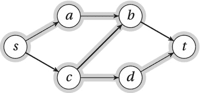
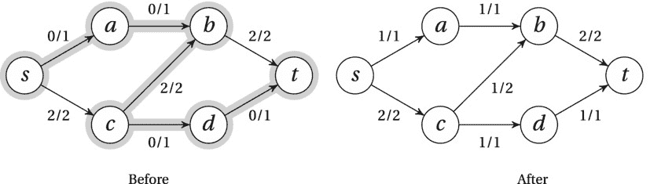

# 十、匹配、切割和流动

快乐的生活是个人的创造，无法从食谱中复制。

—米哈里·契克森米哈，*心流:最佳体验心理学*

虽然上一章给出了一个问题的几种算法，但这一章描述的是一种具有多种变化和应用的算法。核心问题是寻找网络中的最大流，我将使用的主要解决策略是 Ford 和 Fulkerson 的增广路径法。在解决整个问题之前，我将引导您解决两个更简单的问题，它们基本上是特例(它们很容易被简化为最大流)。这些问题，即二分匹配和不相交路径，本身有许多应用，可以通过更专门的算法来解决。您还会看到最大流问题有一个*对偶*，即最小割问题，这意味着您将同时自动解决这两个问题。最小割问题有几个有趣的应用，看起来与最大流问题非常不同，即使它们真的密切相关。最后，我会给你一些扩展最大流问题的方法，通过增加成本，寻找最大流的*最便宜的*，为最小成本二分匹配等应用铺平道路。

最大流问题及其变种几乎有无穷的应用。Douglas B. West 在他的书*中(见[第二章](02.html)中的“参考文献”)给出了一些相当明显的例子，比如确定道路和通信网络的总容量，甚至是研究电路中的电流。Kleinberg 和 Tardos(参见第 1 章中的“参考资料”)解释了如何将形式主义应用于调查设计、航班调度、图像分割、项目选择、棒球淘汰以及分配医生休假。Ahuja、Magnanti 和 Orlin 已经写了关于这个主题的最全面的书籍之一，并且涵盖了工程、制造、调度、管理、医学、国防、通信、公共政策、数学和运输等不同领域的 100 多个应用。虽然算法适用于图形，但这些应用不需要完全像图形一样。例如，谁会认为图像分割是一个图形问题？在本章后面的“一些应用”一节中，我将带您浏览这些应用。如果您对如何使用这些技术感到好奇，您可能想在继续阅读之前快速浏览一下该部分。*

 *贯穿本章的总体思想是，我们试图最大限度地利用网络，从一端移动到另一端，尽可能多地推动某种物质——无论是二分匹配的边、边不相交的路径还是流的单元。这和上一章谨慎的图形探索有点不同。尽管如此，增量改进的基本方法仍然存在。我们反复寻找方法来稍微改进我们的解决方案，直到它不能变得更好。你会看到*取消*的想法是关键——我们可能需要删除以前解决方案的部分内容，以使其整体更好。

 **注意**我在本章的实现中使用了福特和富尔克森的标记方法。另一个关于增加路径搜索的观点是，我们正在穿越一个*剩余网络*。这个想法将在本章后面的边栏“剩余网络”中解释。

二分匹配

我已经向你展示了双方匹配的想法，在第四章第一节中的暴躁的电影观众和第七章第三节中的稳定的婚姻问题中。一般来说，一个图的*匹配* 是边的节点不相交子集。也就是说，我们选择一些边，使得没有两条边共享一个节点。这意味着每条边匹配两对——因此得名。一种特殊的匹配适用于二分图，这种图可以分成两个独立的节点集(没有边的子图)，如图 10-1 中的图。这正是我们在电影观众和婚姻问题中一直在处理的那种匹配，比一般的那种要容易处理得多。当我们谈论二分匹配时，我们通常想要一个最大的匹配，一个包含最大数量的边的匹配。这意味着，如果可能的话，我们想要一个完全匹配的*，一个所有节点都匹配的节点。这是一个简单的问题，但在现实生活中很容易发生。比方说，你正在给项目分配人员，图表显示了谁想做什么。完美的搭配会让每个人都满意。 [<sup>1</sup>](#Fn1)*

 *

[图 10-1](#_Fig1) 。一个二部图,有一个(非最大)匹配(粗边)和一条从 b 到 f 的增广路径(高亮)

我们可以继续使用稳定婚姻问题的比喻——我们将放弃稳定，努力让每个人都找到他们可以接受的对象。为了想象发生了什么，假设每个男人都有一枚订婚戒指。我们想要的是让每个男人把他的戒指给其中一个女人，这样就没有一个女人有一个以上的戒指。或者，如果这是不可能的，我们想把尽可能多的戒指*从男人身上转移到女人身上*，仍然禁止任何女人拥有一个以上的戒指。一如既往，为了解决这个问题，我们开始寻找某种形式的归约或归纳步骤。一个显而易见的想法是找出一对注定在一起的恋人，从而减少我们需要担心的情侣数量。然而，要保证任何一对都是最大匹配的一部分并不容易，除非，例如，它是完全隔离的，像图 10-1 中的 *d* 和 *h* 。

更适合这种情况的方法是*迭代改进*，，如[第 4 章](04.html)中所讨论的。这与第 9 章中[放松的使用密切相关，因为我们将一步一步地改进我们的解决方案，直到我们无法再改进为止。我们还必须确保改进停止的唯一原因是解决方案是最优的——但我会回到这一点。让我们从寻找一些循序渐进的改进方案开始。让我们说，在每一轮中，我们试图将一枚额外的戒指从男子手中转移到女子手中。如果我们幸运的话，这将立刻给我们答案——也就是说，如果每个男人都把戒指给那个他认为最合适的女人。但是，我们不能让任何浪漫的倾向蒙蔽了我们的视线。这种方法很可能不会那么顺利。再次考虑](09.html)[图 10-1](#Fig1) 中的图表。假设在我们的前两次迭代中， *a* 给 *e* 一个环， *c* 给 *g* 一个环。这给了我们一个由两对组成的试探性匹配(用黑色的粗边表示)。现在我们转向 *b* 。他要做什么？

让我们遵循一个有点类似于第七章中提到的盖尔-沙普利算法的策略，当有新的追求者接近时，女性可以改变主意。事实上，让我们命令他们*总是做*。所以当 *b* 询问 *g* 时，她将当前戒指归还给 *c* ，接受来自 *b* 的戒指。换句话说，她*取消了*与 *c* 的婚约。(这种取消的思想对于本章所有的算法都是至关重要的。)但是现在 *c* 是单一的，如果我们要确保迭代确实带来改进，我们就不能接受这种新情况。我们立即四处寻找 *c* 的新伴侣，在这个例子中是 *e* 。但是如果 *c* 将他归还的戒指交给 *e* ，她必须取消与 *a* 的婚约，归还*他的*戒指。他又把这个传递给 *f* ，我们就完成了。在这一次之字形交换之后，戒指沿着高亮显示的边缘来回传递。此外，我们现在已经将夫妇的数量从两个增加到三个( *a* + *f，b* + *g* ，以及 *c* + *e* )。

事实上，我们可以从这个特别的程序中提取出一个通用的方法。首先，我们需要找到一个不匹配的人。(如果不能，我们就完了。)然后，我们需要找到一些约定和取消的交替序列，以便我们以约定结束。如果我们能发现这一点，我们就知道肯定有一个约会比取消的多，增加了一对。我们只是尽可能长时间地寻找这样的曲折。

我们正在寻找的之字形是从左侧一个不匹配的节点到右侧一个不匹配的节点的路径。按照接合环的逻辑，我们看到路径只能移动到*右边*穿过已经在匹配中的*而不是*的边(建议)，并且它只能移动*左边*穿过在匹配中*是*的边(取消)。这样的路径(如图 10-1 中突出显示的路径)被称为*扩充路径*，，因为它扩充了我们的解决方案(也就是说，它增加了参与计数)，我们可以通过遍历找到扩充路径。我们只需要确保我们遵循规则——我们不能遵循右边匹配的边或左边不匹配的边。

剩下的就是确保我们确实能够找到这样的扩充路径，只要还有改进的空间。虽然这看起来似乎很合理，但是为什么*一定是这样的还不是很明显。我们想表明的是，如果有改进的空间，我们可以找到一条增强的途径。这意味着我们有一个当前的匹配 *M* ，还有一些我们还没有找到的更大的匹配 *M* 。现在考虑这两者之间的*对称差*中的边——也就是说，这些边在其中一个对称差中，但不在两个对称差中。让我们称 *M* 中的边为红色，称*M’*中的边为绿色。*

这种混乱的红绿边缘实际上会有一些有用的结构。例如，我们知道每个节点最多关联两条边，每种颜色一条边(因为它不可能有两条来自相同匹配的边)。这意味着我们有一个或多个相连的组件，每个组件都是曲折的路径或交替颜色的循环。因为 *M* 比 *M* 大，我们必须至少有一个组件的绿色边比红色边多，唯一可能发生的方式是在一条路径中——一条以绿色边开始和结束的奇数长度的路径。

你看到了吗？没错。这条绿-红-绿的道路将会是一条增广的道路。它的长度是奇数，所以一端在男性一侧，一端在女性一侧。第一条和最后一条边是绿色的，这意味着它们不是我们原始匹配的一部分，所以我们可以开始增加。(这基本上是我对所谓的伯奇引理的理解。)

在实施这一战略时，有很大的创造性空间。一个可能的实现如[清单 10-1](#list1) 所示。`tr`函数的代码可以在[清单 5-10](05.html#list10) 中找到。参数`X`和`Y`是节点的集合(可迭代对象)，代表图`G`的二分。运行时间可能不明显，因为边在执行期间被打开和关闭，但是我们*知道在每次迭代中有一对被添加到匹配中，所以迭代次数是 *O* ( *n* )，对于 *n* 节点。假设 *m* 条边，寻找增广路径基本上就是遍历一个连通分支，也就是 *O* ( *m* )。那么，总共运行时间是 *O* ( *nm* )。*

[***清单 10-1***](#_list1) 。使用扩充路径寻找最大二部匹配

```py
from itertools import chain

def match(G, X, Y):                             # Maximum bipartite matching
    H = tr(G)                                   # The transposed graph
    S, T, M = set(X), set(Y), set()             # Unmatched left/right + match
    while S:                                    # Still unmatched on the left?
        s = S.pop()                             # Get one
        Q, P = {s}, {}                          # Start a traversal from it
        while Q:                                # Discovered, unvisited
            u = Q.pop()                         # Visit one
            if u in T:                          # Finished augmenting path?
                T.remove(u)                     # u is now matched
                break                           # and our traversal is done
            forw = (v for v in G[u] if (u,v) not in M)  # Possible new edges
            back = (v for v in H[u] if (v,u) in M)      # Cancellations
            for v in chain(forw, back):         # Along out- and in-edges
                if v in P: continue             # Already visited? Ignore
                P[v] = u                        # Traversal predecessor
                Q.add(v)                        # New node discovered
        while u != s:                           # Augment: Backtrack to s
            u, v = P[u], u                      # Shift one step
            if v in G[u]:                       # Forward edge?
                M.add((u,v))                    # New edge
            else:                               # Backward edge?
                M.remove((v,u))                 # Cancellation
    return M                                    # Matching -- a set of edges
```

 **注**柯尼希定理陈述了对于二部图，最大匹配问题的对偶就是最小顶点覆盖问题。换句话说，这些问题是等价的。

不相交的路径

寻找匹配的增广路径法也可以用于更一般的问题。最简单的概括可能是计算*条边不相交的路径* 而不是*条边*。 [<sup>2</sup>](#Fn2) 边不相交的路径可以共享节点，但不能共享边。在这种更一般的情况下，我们不再需要把自己局限于二分图。然而，当我们允许一般的有向图时，我们可以自由地指定路径的起点和终点。最简单(也是最常见)的解决方案是指定两个特殊的节点， *s* 和 *t* ，称为*源*和*接收器*。(这样的图通常被称为 *s* - *t* 图，或 *s* - *t* 网络。)然后，我们要求所有路径从 *s* 开始，到 *t* 结束(隐含地允许路径共享这两个节点)。这个问题的一个重要应用是确定一个网络的*边连通性*——在该图断开之前(或者，在这种情况下，在 *s* 不能到达 *t* 之前)可以删除(或者“失败”)多少条边？

另一个应用是在多核 CPU 上寻找通信路径。您可能有许多二维布局的内核，并且由于通信的工作方式，不可能通过相同的交换点路由两个通信通道。在这些情况下，找到一组不相交的路径至关重要。注意，这些路径可能更自然地被建模为*顶点不相交，而不是边不相交。详见练习 10-2。此外，只要您需要将每个源核心与一个特定的接收核心配对，您就有了一个被称为 *多商品流*问题的版本，这里不讨论这个问题。(参见“如果你好奇…”以获得一些提示。)*

 *你可以在算法中直接处理多个源和汇，就像清单 10-1 中的[一样。如果这些源和汇中的每一个都只能包含在一条路径中，并且您不关心哪个源与哪个汇配对，那么将问题简化为单源、单汇的情况会更容易。你可以通过添加 *s* 和 *t* 作为新节点，并引入从 *s* 到你的所有源和从你的所有汇到 *t* 的边。路径的数量将是相同的，重建您正在寻找的路径只需要再次剪掉 *s* 和 *t* 。事实上，这种减少使得最大匹配问题成为不相交路径问题的特例。如你所见，解决问题的算法也非常相似。](#list1)

不要考虑完整的路径，能够孤立地看待问题的较小部分将是有用的。我们可以通过引入两个规则来做到这一点:

*   除了 *s* 或 *t* 之外，进入任何节点的路径数必须等于从该节点出去的路径数。
*   至多*条*路径可以通过任何给定的边。

考虑到这些限制，我们可以使用遍历来找到从 *s* 到 *t* 的路径。在某种程度上，我们无法找到更多的路径，而不与我们已经拥有的一些路径重叠。不过，我们可以再次使用上一节中的增加路径的思想。参见，例如，[图 10-2](#Fig2) 。第一轮遍历建立了一条从 *s* 经由 *c* 和 *b* 到 *t* 的路径。现在，任何进一步的进展似乎都被这条路径阻碍了——但是增加路径的想法让我们通过取消从 *c* 到 *b* 的*边来改进解决方案。*



[图 10-2](#_Fig2) 。一个发现了一条路径(粗边)和一条增广路径(高亮显示)的 s-t 网络

取消的原理就像二分匹配一样。当我们寻找一条增加的路径时，我们从 *s* 移动到 *a* ，然后到 *b* 。在那里，我们被边缘 *bt 挡住了。*此时的问题是 *b* 有来自 *a* 和 *c* 的*两条*输入路径，但只有*一条*输出路径。通过取消边缘 *cb* ，我们已经解决了 *b* 的问题，但是现在在 *c* 处有一个问题。这和我们在二分匹配中看到的级联效应是一样的。在这种情况下， *c* 有一条来自 *s* 的传入路径，但是没有传出路径——我们需要为该路径找到一个路径。我们通过继续我们的路径通过 *d* 到 *t* 来做到这一点，如图 10-2 中的突出显示所示。

如果你在某个节点 *u* 上*增加*一个*输入*边沿或者*取消*一个*输出*边沿，那么那个节点就会过度拥挤。它将有更多的路径进入而不是离开，这是不允许的。你可以通过*增加*一个*输出*边缘或者*取消*一个*输入*边缘来解决这个问题。总而言之，这解决了从 *s* 开始寻找路径的问题，沿着未使用的边的方向，使用过的边*逆着*的方向。任何时候你能找到这样一条增加的路径，你也会发现一条额外的不相交的路径。

清单 10-2 展示了实现这个算法的代码。和以前一样，`tr`函数的代码可以在[清单 5-10](05.html#list10) 中找到。

[***清单 10-2***](#_list2) 。使用标记遍历来计数边不相交路径以寻找扩充路径

```py
from itertools import chain

def paths(G, s, t):                             # Edge-disjoint path count
    H, M, count = tr(G), set(), 0               # Transpose, matching, result
    while True:                                 # Until the function returns
        Q, P = {s}, {}                          # Traversal queue + tree
        while Q:                                # Discovered, unvisited
            u = Q.pop()                         # Get one
            if u == t:                          # Augmenting path!
                count += 1                      # That means one more path
                break                           # End the traversal
            forw = (v for v in G[u] if (u,v) not in M)  # Possible new edges
            back = (v for v in H[u] if (v,u) in M)      # Cancellations
            for v in chain(forw, back):         # Along out- and in-edges
                if v in P: continue             # Already visited? Ignore
                P[v] = u                        # Traversal predecessor
                Q.add(v)                        # New node discovered
        else:                                   # Didn't reach t?
            return count                        # We're done
        while u != s:                           # Augment: Backtrack to s
            u, v = P[u], u                      # Shift one step
            if v in G[u]:                       # Forward edge?
                M.add((u,v))                    # New edge
            else:                               # Backward edge?
                M.remove((v,u))                 # Cancellation
```

为了确保我们已经解决了这个问题，我们仍然需要证明相反的情况——只要还有改进的空间，就总会有*增加的途径。展示这一点最简单的方法是使用连通性的概念:我们必须去掉多少条边才能将 *s* 与 *t* 分开(这样就没有路径从 *s* 到 *t* )？任何这样的集合都代表一个 *s* - *t 割*，一个划分为两个集合 *S* 和 *T* ，其中 *S* 包含 *s* 而 *T* 包含 *t* 。我们称从 *S* 到 *T* 的边为定向*边分隔符*。然后，我们可以证明以下三个语句是等价的:*

*   我们已经发现了 *k* 条不相交的路径，并且有一个大小为 *k* 的边分隔符。
*   我们已经找到了不相交路径的最大数量。
*   没有增加的路径。

我们主要想表明的是，最后两个语句是等价的，但有时通过第三个语句更容易，比如本例中的第一个语句。

很容易看出第一个暗示着第二个。姑且称分隔符 *F* 。任何 *s* - *t* 路径在 *F* 中必须至少有一条边，这意味着 *F* 的大小至少与不相交的 *s* - *t* 路径的数量一样大。如果分隔符的大小与我们找到的不相交路径的数量相同，显然我们已经达到了最大值。

证明第二个陈述暗示第三个陈述很容易通过矛盾来完成。假设没有改进的空间，但我们仍然有一个增强的路径。如前所述，这条增加的路径可以用来改进解决方案，所以我们有一个矛盾。

唯一需要证明的是，最后一个陈述隐含了第一个陈述，这就是整个连通性思想作为垫脚石的好处。想象你已经执行了算法，直到你用完了增加的路径。让 *S* 是你在最后一次遍历中到达的节点集，让 *T* 是剩余的节点。很明显，这是一个 *s* - *t* 切。考虑这个切口的边缘。从 *S* 到 *T* 的任何前向边都必须是您发现的不相交路径之一的一部分。如果不是，您应该在遍历过程中跟随它。出于同样的原因，从 *T* 到 *S* 的任何边都不能是其中一条路径的一部分，因为你可以取消它，从而到达 *T* 。换句话说，从 *S* 到 *T* 的所有边都属于你的不相交路径，并且因为其他方向的边都不属于你的不相交路径，所以前向边必须都属于它们自己的路径，这意味着你有 *k* 条不相交路径和一个大小为 *k* 的分隔符。

这可能有点复杂，但是直觉告诉我们，如果我们找不到一条增加的路径，那么在某个地方一定有一个瓶颈，我们一定已经填补了它。无论我们怎么做，都无法获得更多路径通过这个瓶颈，所以算法一定找到了答案。(这个结果是门格尔定理的一个版本，，它是最大流最小割定理的一个特例，稍后你会看到。)

那么这一切要持续多长时间？每次迭代由从 *s* 开始的相对直接的遍历组成，对于 *m* 边，其运行时间为 *O* ( *m* )。每一轮都给了我们另一条不相交的路径，而且明明最多有 *O* ( *m* )，意思是运行时间是*O*(*m*<sup>2</sup>)。练习 10-3 要求你证明在最坏的情况下这是一个紧界。

 **注**门格尔定理是对偶的另一个例子:从 *s* 到 *t* 的边不相交路径的最大数等于 *s* 和 *t* 之间的最小割。这是最大流最小割定理的一个特例，稍后讨论。

最大流量

这是这一章的中心问题。它形成了二分匹配和不相交路径的一般化，并且是最小割问题的镜像(下一节)。与不相交路径情况的唯一区别在于，我们没有将每条边的*容量* 设置为 1，而是将其设为任意正数。如果容量是一个正整数，您可以把它看作是可以通过它的路径的数量。更一般地说，这里的比喻是某种形式的物质在网络中流动，从源头到汇点，容量代表了有多少单元可以流过给定边的限制。(你可以把这看作是配对中来回传递的订婚戒指的概括。)一般来说，流本身就是若干个流单元对每个单元的赋值(即从边到数的函数或映射)，而流的*大小*或*大小*则是通过网络推送的总量。(例如，这可以通过找到流出源头的净流量来找到。)注意，尽管流网络通常被定义为有向网络，你也可以在无向网络中找到最大流(练习 10-4)。

让我们看看如何解决这个更普遍的情况。一个天真的方法是简单地分割边缘，就像第九章中 BFS 的天真延伸(图 9-3)。不过现在，我们想把它们*纵向*分开，如图 10-3 中的[所示。就像带有串行虚拟节点的 BFS](#Fig3) 给你一个 Dijkstra 算法如何工作的好主意一样，我们带有并行虚拟节点的扩充路径算法非常接近用于寻找最大流的完整福特-富尔克森算法的工作方式。不过，与 Dijkstra 的情况一样，实际算法可以一次处理更多的流，这意味着虚拟节点方法(一次只能饱和一个单位的容量)的效率低得令人绝望。


[图 10-3](#_Fig3) 。由虚拟节点模拟的边缘容量

让我们看一下技术细节。就像在 0-1 的情况下，我们有两条规则来确定我们的流如何与边和节点交互。如您所见，它们与不相交的路径规则非常相似:

*   除了 *s* 或 *t* 之外，进入任何节点的流量*必须等于从该节点流出*的流量。**
*   最多有 *c* ( *e* )个单位的流量可以通过任意给定的边。

这里， *c* ( *e* )是 edge *e* 的*容量*。就像对于不相交的路径，我们需要沿着边的方向，所以沿着边的流*返回*总是零。一个遵守我们两个规则的流程被称为*可行*。

不过，这可能是你需要放松和集中注意力的地方。我接下来要说的其实并不复杂，但可能会有点混乱。我*被允许*逆着一条边的方向推动水流，只要已经有一些水流向正确的方向。你知道这是怎么回事吗？我希望前两节已经为你做好了准备——这完全是*取消流量*的问题。如果我有一个单位的流量从 *a* 流向 *b* ，我可以*取消*那个单位，实际上是把一个单位推向另一个方向。最终结果为零，因此没有*实际*流向错误的方向(这是完全禁止的)。

这个想法让我们创建增加的路径，就像以前一样:如果你在某个节点 *u* 沿输入边增加 *k* 个单位的流量，或者取消输出边上的 *k* 个单位的流量，那个节点就会溢出。流入的流量会比流出的多，这是不允许的。您可以通过沿着输出边添加 *k* 个流单位或者通过在输入边上取消 *k* 个流单位来解决这个问题。这正是你在 0-1 的情况下所做的，除了 k 总是 1。

在[图 10-4](#Fig4) 中，显示了同一流程网络的两种状态。在第一状态中，流已经沿着路径*s*-*c*-*b*-*t*被推动，给出总流值 2。这种流动阻碍了沿*前*边缘的任何进一步改进。正如你所看到的，增加的路径包括一个向后的边缘。通过取消从 *c* 到 *b* 的一个流量单位，我们可以从 *c* 经由 *d* 到 *t* 发送一个额外的单位，达到最大值。



[图 10-4](#_Fig4) 。通过增广路径增广前后的流量网络(突出显示)

如本节所解释的，一般的福特-富尔克森方法 不给出任何运行时间保证。事实上，如果无理数容量(包含平方根等)被允许，迭代增加可能*永远不会终止*。对于实际应用来说，使用无理数可能不太现实，但即使我们把自己限制在有限精度的浮点数，甚至是*整数*，我们还是会遇到麻烦。考虑一个非常简单的网络，有源、宿和另外两个节点， *u* 和 *v* 。两个节点都有从源到宿的边，都具有容量 *k* 。我们还有一个从 *u* 到 *v* 的单位产能优势。如果我们继续选择增加通过边缘 *uv* 的路径，在每次迭代中增加和取消一个单位的流，这将在终止之前给我们 2 *k* 次迭代。

这个运行时间有什么问题？它是伪多项式——实际问题规模的指数。我们可以很容易地提高容量，从而增加运行时间，而不需要占用太多的空间。令人恼火的是，如果我们更聪明地选择了增补路线(例如，完全避开边缘 *uv* ，我们将在*两轮*中完成，而不管容量 *k* 。

幸运的是，这个问题有一个解决方案，它给我们一个多项式的运行时间，不管容量是多少(甚至是无理数！).事实是，Ford-Fulkerson 并不是一个完全指定的算法，因为它的遍历是完全任意的。如果我们选择 BFS 作为遍历顺序(从而总是选择最短的扩充路径)，我们最终会得到所谓的埃德蒙兹-卡普算法， ，这正是我们正在寻找的解决方案。对于 *n* 节点和 *m* 边，埃德蒙兹-卡普在 *O* ( *nm* <sup>2</sup> )时间内运行。然而，这种情况并不完全明显。为了得到彻底的证明，我推荐在 Cormen 等人的书中查找该算法(参见[第 1 章](01.html)中的“参考文献”)。大致思路是:每条最短增广路径在 *O* ( *m* )时间内找到，当我们沿着它增广流量时，至少有一条边是饱和的(流量达到容量)。每次边缘饱和时，离源的距离(沿着增加的路径)必须增加，这个距离最多是 *O* ( *n* )。因为每个边沿最多可以饱和 *O* ( *n* )次，所以我们得到的是 *O* ( *nm* )次迭代，总运行时间为*O*(*nm*<sup>2</sup>)。

对于一般的福特-富尔克森方法(因此也是埃德蒙兹-卡普算法)的*正确性*证明，参见下一节，最小切割。但是，正确性证明确实假设了终止性，如果您避免不合理的容量或者如果您简单地使用 Edmonds-Karp 算法(它具有确定的运行时间),这是有保证的。

清单 10-3 中给出了一个基于 BFS 的扩充遍历。清单 10-4 中的[显示了完整的福特-富尔克森方法的实现。为简单起见，假设 *s* 和 *t* 是不同的节点。默认情况下，该实现使用基于 BFS 的增强遍历，这为我们提供了 Edmonds-Karp 算法。主函数(`ford_fulkerson`)非常简单，与本章前面的两个算法非常相似。主`while`循环继续下去，直到不可能找到一条增加的路径，然后返回流程。每当发现一条增加的路径时，它被回溯到`s`，将路径的容量加到每个前向边上，并从每个反向边上减去(消除)它。](#list4)

[清单 10-3](#list3) 中的`bfs_aug`函数类似于前面算法中的遍历。它使用一个`deque`来获得 BFS，并使用`P`图构建遍历树。如果有一些剩余容量(`G[u][v]-f[u,v] > 0`，它只遍历前向边缘，如果有一些流量要取消(`f[v,u] > 0`)，它只遍历后向边缘。*标记* 包括设置遍历前趋(在`P`中)和记住有多少流可以传输到这个节点(存储在`F`中)。这个流量值是(1)我们设法传输到前一个的流量和(2)连接边上的剩余容量(或反向流量)的最小值。这意味着一旦我们到达`t`，路径的总松弛度(我们可以推动通过它的额外流量)是`F[t]`。

 **注意**如果你的能力是整数，增量也总是整数，导致一个整数流。这是使最大流问题(以及解决它的大多数算法)得到如此广泛应用的性质之一。

[***清单 10-3***](#_list3) 。用 BFS 和标号寻找增广路径

```py
from collections import deque
inf = float('inf')

def bfs_aug(G, H, s, t, f):
    P, Q, F = {s: None}, deque([s]), {s: inf}   # Tree, queue, flow label
    def label(inc):                             # Flow increase at v from u?
        if v in P or inc <= 0: return           # Seen? Unreachable? Ignore
        F[v], P[v] = min(F[u], inc), u          # Max flow here? From where?
        Q.append(v)                             # Discovered -- visit later
    while Q:                                    # Discovered, unvisited
        u = Q.popleft()                         # Get one (FIFO)
        if u == t: return P, F[t]               # Reached t? Augmenting path!
        for v in G[u]: label(G[u][v]-f[u,v])    # Label along out-edges
        for v in H[u]: label(f[v,u])            # Label along in-edges
    return None, 0                              # No augmenting path found
```

[***清单 10-4***](#_list4) 。福特-富尔克森法(默认为埃德蒙兹-卡普算法)

```py
from collections import defaultdict

def ford_fulkerson(G, s, t, aug=bfs_aug):       # Max flow from s to t
    H, f = tr(G), defaultdict(int)              # Transpose and flow
    while True:                                 # While we can improve things
        P, c = aug(G, H, s, t, f)               # Aug. path and capacity/slack
        if c == 0: return f                     # No augm. path found? Done!
        u = t                                   # Start augmentation
        while u != s:                           # Backtrack to s
            u, v = P[u], u                      # Shift one step
            if v in G[u]: f[u,v] += c           # Forward edge? Add slack
            else:         f[v,u] -= c           # Backward edge? Cancel slack
```

剩余网络

一个经常用来解释福特-富尔克森方法及其相关方法的抽象概念是*剩余网络*。剩余网络*G*<sub xmlns:m="http://www.w3.org/1998/Math/MathML" xmlns:pls="http://www.w3.org/2005/01/pronunciation-lexicon" xmlns:ssml="http://www.w3.org/2001/10/synthesis">T5】f</sub>是相对于原始流网络 *G* 以及流 *f* 定义的，并且是在寻找扩充路径时使用的表示遍历规则的方式。在 *G*

换句话说，我们在 *G* 中的特殊增广遍历现在变成了在 *G* <sub>*f*</sub> 中的*完全正常的*遍历。当在剩余网络中不再有从源到宿的路径时，该算法终止。虽然这个想法主要是形式上的，使得使用普通的图论来推理增强成为可能，但是如果你愿意(练习 10-5)，你也可以显式地实现它，作为实际图形的动态视图。这将允许您直接在剩余网络上使用 BFS 的现有实现，以及(稍后您将看到)贝尔曼-福特和迪克斯特拉。

最小切割

就像零一流产生了门格尔定理一样，更一般的流问题给了我们福特和富尔克森的*最大流最小截*定理，我们可以用类似的方式证明它。

*   我们已经找到了一个大小为 k 的流，并且有一个容量为 k 的流*。*
**   我们已经找到了最大流量。*   没有增加的路径。*

 *证明这一点将给我们两件事:它将表明福特-富尔克森方法是正确的，它意味着我们可以用它来寻找最小割，这本身就是一个有用的问题。(我会回到这个话题。)

和零一的情况一样，第一个明显意味着第二个。每个流量单位都必须通过任何一个 *s* - *t* 切割，所以如果我们有一个容量切割 *k* ，那就是流量的上限。如果我们有一个流量*等于*一个切割的容量，那么这个流量一定是最大的，而这个切割一定是最小的。这就是所谓的*二元性*的一个例子。

从第二个陈述(我们已经达到最大值)到第三个陈述(没有增加的路径)的含义再次被矛盾证明。假设我们已经达到了最大值，但是仍然有一个增加的路径。然后我们可以用这条路来增加我们的流量，这是一个矛盾。

最后一步(没有增加路径意味着我们有一个等于流的切割)再次使用遍历来构造一个切割。也就是说，我们让 *S* 是我们在最后一次迭代中可以到达的节点集， *T* 是余数。任何穿过切口的前沿都必须是饱和的，否则我们就会穿过它。同样，任何后向边都必须是空的。这意味着通过切口的流量正好等于其容量，这就是我们想要展示的。

最小割有几个看起来不像最大流问题的应用。例如，考虑以最小化两个处理器之间通信的方式将进程分配给两个处理器的问题。假设其中一个处理器是 GPU，进程在两个处理器上有不同的运行时间。有些更适合 CPU，而有些应该在 GPU 上运行。然而，可能会有这样的情况，一个安装在 CPU 上，一个安装在 GPU 上，但是两者之间会进行大量的通信。在这种情况下，我们可能希望将它们放在同一个处理器上，只是为了降低通信成本。

我们如何解决这个问题？例如，我们可以建立一个无向流网络，将 CPU 作为源，将 GPU 作为宿。每个进程都有一条通向源和接收器的边，其容量等于在该处理器上运行所需的时间。我们还在进行通信的进程之间添加了边，其容量代表了它们在不同处理器上的通信开销(额外的计算时间)。然后，最小割会以总成本尽可能小的方式在两个处理器上分配进程——如果我们不能归结为最小割问题，这是一个不小的任务。

总的来说，你可以把全流网络形式主义看作是一种特殊的算法机器，你可以用它通过归约来解决其他问题。任务变成了构建某种形式的流网络，其中最大流或最小割代表原始问题的解决方案。

二元性

这一章有几个对偶的例子:最大二部匹配是最小二部顶点覆盖的对偶，最大流是最小割的对偶。还有几个类似的例子，比如最大张力*问题，它是最短路径问题的对偶。一般来说，对偶涉及两个优化问题，原始的和对偶的，其中两个有相同的优化成本，解决一个将解决另一个。更具体地说，对于一个最大化问题 A 和一个最小化问题 B，如果 A 的最优解小于或等于 B 的最优解，我们有*弱对偶*，如果它们相等(对于最大流最小割的情况)，我们有*强对偶*。如果你想知道更多关于对偶性的知识(包括一些更高级的内容)，看看 Go 和 Yang 的《最优化中的对偶性与变分不等式》。*

 *最便宜的流和指派问题 [<sup>4</sup>](#Fn4)

在离开流量这个话题之前，我们先来看看一个重要的、相当明显的延伸；我们来找*最便宜的*最大流量。也就是说，我们仍然希望找到最大流量，但是如果有多种方法可以达到相同的流量大小，我们希望找到最便宜的方法。我们通过向边添加成本来形式化这一点，并将总成本定义为所有边 e 上的*w*(*e*)*f*(*e*)之和，其中 *w* 和 *f* 分别是成本和流函数。也就是说，成本是给定边缘上每单位流量的*。*

一个直接的应用是二分匹配问题的扩展。我们可以继续使用零一流公式，但会增加每个边的成本。然后，我们有了最小成本二分匹配(或分配)问题的解决方案，在引言中暗示:通过找到最大流，我们知道我们有一个最大匹配，通过最小化成本，我们得到我们正在寻找的匹配。

这个问题通常简称为*最小费用流*。这意味着，我们不是寻找最便宜的*最大*流量，而是简单地寻找给定数量的最便宜的流量。例如，问题可能是“给我一个大小为 *k* 的流，如果这样的流存在的话，确保你尽可能便宜地构建它。”例如，你可以构造一个尽可能大的流，*直到 k* 的值。这样，找到最大流量(或最小成本最大流量)只需将 *k* 设置为一个足够大的值。事实证明，仅仅关注最大流量就足够了；我们可以通过简单的简化优化到一个特定的流量值，而不需要修改算法(见练习 10-6)。

Busacker 和 Gowen 提出的解决最小费用流问题的思想是:寻找 *最便宜的增广路径*。也就是说，在遍历步骤中，对加权图使用最短路径算法，而不仅仅是 BFS。唯一的问题是，为了找到最短路径，向后遍历的边的成本是无效的。(毕竟它们是用来取消流量的。)

如果我们可以假设成本函数是正的，我们可以使用 Dijkstra 的算法来找到我们的扩充路径。问题是，一旦你把一些流从 *u* 推到 *v* ，我们就可以突然遍历(虚构的)反向边 *vu* ，它有一个*负*成本。换句话说，Dijkstra 的算法在第一次*迭代中会工作得很好，但是在那之后，我们就完蛋了。幸运的是，埃德蒙兹和卡普想到了一个巧妙的方法来解决这个问题——一个与约翰逊算法中使用的方法非常相似的方法(见[第 9 章](09.html))。我们可以通过以下方式调整所有权重:( 1)使它们都为正，以及(2)沿着所有遍历路径形成伸缩和，确保最短路径仍然是最短的。*

假设我们正在执行算法，并且我们已经建立了一些可行的流程。设 *w* ( *u* ， *v* )为边权重，根据增加路径遍历的规则进行调整(即沿着有剩余容量的边不变，沿着正向流的后向边取反)。让我们再次(即，就像在约翰逊的算法中一样)设置*h*(*v*)=*d*(*s*， *v* )，其中距离是相对于 *w* 计算的。然后我们可以定义一个*调整后的权重*，我们可以用它来寻找下一个增强路径: *w* '( *u* ，*v*)=*w*(*u*，*v*)+*h*(*u*)-*h*(*v*使用与第 9 章中[相同的推理，我们看到该调整将保留所有最短路径，特别是从 *s* 到 *t* 的最短增补路径。](09.html)**

实现基本的 Busacker-Gowen 算法基本上是一个在`bfs_aug` ( [清单 10-3](#list3) )的代码中用例如 Bellman-Ford(见[清单 9-2](#list2) )替换 BFS 的问题。如果你想使用 Dijkstra 的算法，你只需使用修改后的权重，如前所述(练习 10-7)。关于基于贝尔曼-福特的实现，见清单 10-5 。(该实现假设边权重由单独的地图给出，因此`W[u,v]`是从`u`到`v`的边的权重或成本。)注意，来自福特-富尔克森标记方法的流标记已经与贝尔曼-福特的 relax 操作合并——两者都在`label`函数中执行。要做任何事情，你们都必须找到一条更好的路径，并且在新的边缘有一些空闲容量。如果是这种情况，距离估计和流标签都被更新。

Busacker-Gowen 方法的运行时间取决于您选择的最短路径算法。我们不再使用埃德蒙兹-卡普方法，所以我们失去了它的运行时间保证，但是如果我们使用整数容量并寻找价值流 *k* ，我们保证最多 *k* 次迭代。[T5】5T7】假设 Dijkstra 的算法，总运行时间变成*O*(*km*LG*n*)。对于最小代价二分匹配， *k* 将是 *O* ( *n* )，因此我们将得到*O*(*nm*LG*n*)。](#Fn5)

从某种意义上来说，这是一个贪婪的算法，我们逐步建立流量，但在每一步中增加尽可能少的成本。凭直觉，这似乎应该行得通，事实上也确实如此，但证明同样多可能有点挑战性——事实上，以至于我在这里不打算详细说明。如果你想阅读证明(以及关于运行时间的更多细节)，可以看一下 Dieter Jungnickel 在*图、网络和算法*中关于循环的章节。 [<sup>6</sup>](#Fn6) 你可以在 Kleinberg 和 Tardos 的*算法设计*中找到最小代价二分匹配特例的更简单的证明(参见[第一章](01.html)“参考文献”)。

[***清单 10-5***](#_list5) 。布萨克-戈恩算法，使用贝尔曼-福特进行增强

```py
def busacker_gowen(G, W, s, t):                 # Min-cost max-flow
    def sp_aug(G, H, s, t, f):                  # Shortest path (Bellman-Ford)
        D, P, F = {s:0}, {s:None}, {s:inf,t:0}  # Dist, preds and flow
        def label(inc, cst):                    # Label + relax, really
            if inc <= 0: return False           # No flow increase? Skip it
            d = D.get(u,inf) + cst              # New possible aug. distance
            if d >= D.get(v,inf): return False  # No improvement? Skip it
            D[v], P[v] = d, u                   # Update dist and pred
            F[v] = min(F[u], inc)               # Update flow label
            return True                         # We changed things!
        for _ in G:                             # n = len(G) rounds
            changed = False                     # No changes in round so far
            for u in G:                         # Every from-node
                for v in G[u]:                  # Every forward to-node
                    changed |= label(G[u][v]-f[u,v], W[u,v])
                for v in H[u]:                  # Every backward to-node
                    changed |= label(f[v,u], -W[v,u])
            if not changed: break               # No change in round: Done
        else:                                   # Not done before round n?
            raise ValueError('negative cycle')  # Negative cycle detected
        return P, F[t]                          # Preds and flow reaching t
    return ford_fulkerson(G, s, t, sp_aug)      # Max-flow with Bellman-Ford
```

一些应用

正如最初所承诺的，我现在将概述本章中一些技术的一些应用。我不会给你所有的细节或实际代码——如果你想对这些材料有更多的体验，你可以在 尝试实现这些解决方案。

**棒球淘汰赛。这个问题的解决方案由 Benjamin L. Schwartz 于 1966 年首次发表。如果你像我一样，你可以放弃棒球的背景，想象这是一场骑士比武的循环赛(如第四章中所讨论的)。无论如何，想法是这样的:你有一个部分完成的锦标赛(棒球相关或其他)，你想知道某个队，比如火星绿皮肤队，是否有可能赢得锦标赛。也就是说，如果他们总共最多能赢 *W* 场比赛(如果他们赢下剩下的每一场比赛)，有没有可能达到其他球队都没有超过 *W* 场胜利的局面？**

这个问题如何通过减少到最大流来解决并不明显，但是让我们试一试。我们将建立一个具有完整流的网络，其中每个流单元代表一个剩余的游戏。我们创建节点 *x* <sub xmlns:m="http://www.w3.org/1998/Math/MathML" xmlns:pls="http://www.w3.org/2005/01/pronunciation-lexicon" xmlns:ssml="http://www.w3.org/2001/10/synthesis">1</sub> ，…， *x* <sub xmlns:m="http://www.w3.org/1998/Math/MathML" xmlns:pls="http://www.w3.org/2005/01/pronunciation-lexicon" xmlns:ssml="http://www.w3.org/2001/10/synthesis">*n*</sub> 来表示其他团队，以及节点*p*<sub xmlns:m="http://www.w3.org/1998/Math/MathML" xmlns:pls="http://www.w3.org/2005/01/pronunciation-lexicon" xmlns:ssml="http://www.w3.org/2001/10/synthesis">*ij*</sub>来表示每对节点 *x* <sub xmlns:m="http://www.w3.org/1998/Math/MathML" xmlns:pls="http://www.w3.org/2005/01/pronunciation-lexicon" xmlns:ssml="http://www.w3.org/2001/10/synthesis">*i*</sub> 和 *x* <sub xmlns:m="http://www.w3.org/1998/Math/MathML" xmlns:pls="http://www.w3.org/2005/01/pronunciation-lexicon" xmlns:ssml="http://www.w3.org/2001/10/synthesis">*j*</sub> 。除此之外，当然我们还有源 *s* 和宿 *t* 。从 *s* 到每个组节点添加一条边，从每个对节点到 *t* 添加一条边。对于一对节点*p*<sub xmlns:m="http://www.w3.org/1998/Math/MathML" xmlns:pls="http://www.w3.org/2005/01/pronunciation-lexicon" xmlns:ssml="http://www.w3.org/2001/10/synthesis">*ij*</sub>，加上来自 *x* <sub xmlns:m="http://www.w3.org/1998/Math/MathML" xmlns:pls="http://www.w3.org/2005/01/pronunciation-lexicon" xmlns:ssml="http://www.w3.org/2001/10/synthesis">*i*</sub> 和 *x* <sub xmlns:m="http://www.w3.org/1998/Math/MathML" xmlns:pls="http://www.w3.org/2005/01/pronunciation-lexicon" xmlns:ssml="http://www.w3.org/2001/10/synthesis">*j*</sub> 的边，容量为无穷大。从对节点*p*<sub xmlns:m="http://www.w3.org/1998/Math/MathML" xmlns:pls="http://www.w3.org/2005/01/pronunciation-lexicon" xmlns:ssml="http://www.w3.org/2001/10/synthesis">*ij*</sub>到 *t* 的边得到一个容量，该容量等于在 *x* <sub xmlns:m="http://www.w3.org/1998/Math/MathML" xmlns:pls="http://www.w3.org/2005/01/pronunciation-lexicon" xmlns:ssml="http://www.w3.org/2001/10/synthesis">*i*</sub> 和 *x* <sub xmlns:m="http://www.w3.org/1998/Math/MathML" xmlns:pls="http://www.w3.org/2005/01/pronunciation-lexicon" xmlns:ssml="http://www.w3.org/2001/10/synthesis">*j*</sub> 之间剩余的游戏数。如果团队 *x* <sub xmlns:m="http://www.w3.org/1998/Math/MathML" xmlns:pls="http://www.w3.org/2005/01/pronunciation-lexicon" xmlns:ssml="http://www.w3.org/2001/10/synthesis">*i*</sub> 已经赢了 *w* <sub xmlns:m="http://www.w3.org/1998/Math/MathML" xmlns:pls="http://www.w3.org/2005/01/pronunciation-lexicon" xmlns:ssml="http://www.w3.org/2001/10/synthesis">*i*</sub> 游戏，那么从 *s* 到*x*<sub xmlns:m="http://www.w3.org/1998/Math/MathML" xmlns:pls="http://www.w3.org/2005/01/pronunciation-lexicon" xmlns:ssml="http://www.w3.org/2001/10/synthesis">*I*</sub>的边得到一个 *W* - *w***

我说过，每个流量单位代表一个游戏。想象一下从 *s* 到 *t* 跟踪单个单元。首先，我们来到一个团队节点，代表赢得这场比赛的团队。然后我们来到一个 pair 节点，代表我们面对的是哪一队。最后，沿着一条边移动到 *t* ，我们吞噬了一个代表所讨论的两支球队之间的一场比赛的容量单位。我们可以将所有优势饱和到 *t* 中的唯一方法是，如果*所有的*剩余的比赛都可以在这些条件下进行——也就是说，没有一支队伍赢得的比赛总数超过 *W* 场。因此，找到最大流量就给了我们答案。要获得更详细的正确性证明，请参见 Douglas B. West 的*图论介绍*的第 4.3 节(参见第 2 章的[参考资料)或 B. L. Schwartz 的原始资料*部分完成的比赛中可能的赢家*。](02.html)

**选择代表。** Ahuja 等人描述了这个有趣的小问题。一个小镇，有 *n* 居民， *x* <sub xmlns:m="http://www.w3.org/1998/Math/MathML" xmlns:pls="http://www.w3.org/2005/01/pronunciation-lexicon" xmlns:ssml="http://www.w3.org/2001/10/synthesis">1</sub> ，…， *x* <sub xmlns:m="http://www.w3.org/1998/Math/MathML" xmlns:pls="http://www.w3.org/2005/01/pronunciation-lexicon" xmlns:ssml="http://www.w3.org/2001/10/synthesis">*n*</sub> 。还有 *m* 社、*c*T19】1、…、 *c* <sub xmlns:m="http://www.w3.org/1998/Math/MathML" xmlns:pls="http://www.w3.org/2005/01/pronunciation-lexicon" xmlns:ssml="http://www.w3.org/2001/10/synthesis">*m*</sub> 和 *k* 政党、 *p* <sub xmlns:m="http://www.w3.org/1998/Math/MathML" xmlns:pls="http://www.w3.org/2005/01/pronunciation-lexicon" xmlns:ssml="http://www.w3.org/2001/10/synthesis">1</sub> 、…、 *p* <sub xmlns:m="http://www.w3.org/1998/Math/MathML" xmlns:pls="http://www.w3.org/2005/01/pronunciation-lexicon" xmlns:ssml="http://www.w3.org/2001/10/synthesis">*k*</sub> 。每个居民至少是一个俱乐部的成员，并且只能属于一个政党。每个俱乐部必须提名一名成员代表它参加市议会。不过，有一个问题:属于党派 *p* <sub xmlns:m="http://www.w3.org/1998/Math/MathML" xmlns:pls="http://www.w3.org/2005/01/pronunciation-lexicon" xmlns:ssml="http://www.w3.org/2001/10/synthesis">*i*</sub> 的代表人数最多只能是 *u* <sub xmlns:m="http://www.w3.org/1998/Math/MathML" xmlns:pls="http://www.w3.org/2005/01/pronunciation-lexicon" xmlns:ssml="http://www.w3.org/2001/10/synthesis">*i*</sub> 。有可能找到这样一组代表？再次，我们减少到最大流量。通常情况下，我们将问题的对象表示为节点，并将它们之间的约束表示为边和容量。在这种情况下，每个居民、俱乐部和聚会都有一个节点，还有源 *s* 和接收器 *t* 。

流动的单位代表了代表。因此，我们给每个俱乐部一个来自 *s* 的优势，容量为 1，代表他们可以提名的单个人。从每个俱乐部中，我们给属于那个俱乐部的每个人增加一个优势，因为他们形成了候选人。(这些边上的容量并不重要，只要它至少是 1。)注意，每个人可以有多个 in-edge(即属于多个俱乐部)。现在，将居民的优势添加到他们的政党中(每人一个)。这些边的容量也是 1(这个人只能代表一个俱乐部)。最后，将来自各方的边添加到 *t* 中，这样来自各方的边 *p* <sub>*i*</sub> 的容量为 *u* <sub>*i*</sub> ，限制了理事会中的代表人数。找到一个最大流量将会给我们带来一组有效的提名。

当然，这个最大流解决方案只给了*一个*有效的提名集，不一定是我们*想要的*。我们可以假设政党能力 *u* <sub>*i*</sub> 是基于民主原则(某种形式的投票)；代表的选择不应该同样基于俱乐部的偏好吗？也许他们可以举行投票，以表明他们有多希望每个成员代表他们，所以成员得到的分数，比如说，等于他们的投票百分比。然后，我们可以尝试最大化这些分数的总和，同时仍然确保提名在全球范围内有效。明白我的意思了吗？完全正确:我们可以扩展 Ahuja 等人的问题，在从俱乐部到居民的边上增加一个*成本*(例如，等于 100 分)，然后我们解决最小成本最大流问题。事实上，我们得到了最大的流量，这将保证提名的有效性，而成本最小化将根据俱乐部的偏好给我们最好的妥协。

休假中的医生。克莱恩伯格和塔尔多斯(见第一章中[的“参考文献”)描述了一个有点类似的问题。不同的对象和约束，但想法仍然有些相似。问题是给医生分配假期。每个假期必须至少指派一名医生，但如何做到这一点是有限制的。首先，每个医生只在一些假期有空。第二，每个医生最多只能工作 *c* 天。第三，在每个假期中，每个医生只能在一天工作。你知道如何将流量降到最大吗？](01.html)

同样，我们有一组相互之间有约束的对象。除了接收器 *s* 和源 *t* 之外，我们至少需要每个医生一个节点，每个假期一个节点。我们从 *s* 给每个医生一个容量为 *c* 的 in-edge，代表每个医生可以工作的天数。现在我们*可以*开始将医生与日期直接联系起来，但是我们如何表达假期*期间*的想法呢？我们可以为每个医生添加一个节点，但是每个医生在每个时期都有单独的约束，所以我们需要更多的节点。每个医生每个假期都有一个节点，每个节点都有一个出边。例如，每个医生都有一个圣诞节节点。如果我们将这些外部边缘上的能力设置为 1，则医生在每个周期中不能工作超过一天。最后，我们将这些新的周期节点与医生有空的日子联系起来。因此，如果 Zoidberg 博士在圣诞节期间只能在平安夜和圣诞节工作，我们就在这两个日期加上他的圣诞节节点的外边缘。

最后，每一个假期都有一个优势。我们在这些方面设置的容量取决于我们是否希望找到多少医生，或者我们是否希望每个假期只有一名医生。无论哪种方式，找到最大流量会给我们我们正在寻找的答案。就像我们扩展前面的问题一样，我们可以再次考虑偏好，通过添加成本，例如在从每个医生的假期节点到个人假期的边上。然后，通过寻找最小成本流，我们不仅会找到一个*可能的*解决方案，我们还会找到一个引起最少总体不满的方案。

**供给与需求。**想象一下你正在管理某种形式的行星递送服务(或者，如果你喜欢一个不那么奇特的例子，一家运输公司)。你正试图计划一些商品的分销，例如*波普勒*。每个星球(或海港)都有一定的供给或需求(以每月的 popplers 来衡量)，而你在这些星球之间的航线有一定的运力。我们如何对此建模？

事实上，这个问题的解决方案给了我们一个非常好的工具。不仅仅是解决这个特定的问题(无论如何，这只是对潜在的流问题的一个不加掩饰的描述)，让我们更一般地描述一些事情。你有一个类似于我们到目前为止看到的网络，除了我们不再有一个源或一个汇。相反，每个节点 *v* 都有一个*电源 b* ( *v* )。该值也可以是负的，代表需求。为了简单起见，我们可以假设供给和需求的总和为零。我们现在想知道的不是找到最大流量，而是使用可用的供给是否能满足需求。我们称之为相对于 *b* 的*可行*流程。

我们需要一个新的算法吗？幸运的是，没有。归约又一次拯救了我们。给定一个有供给和需求的网络，我们可以构建一个简单的流量网络，如下所示。首先，我们添加一个源 *s* 和一个宿 *t* 。然后，具有供应的每个节点 *v* 从 *s* 获得一个输入边，其供应作为容量，而具有需求的每个节点获得一个输出边到 *t* ，其需求作为容量。我们现在解决这个新网络的最大流问题。如果流浸透了到汇点的所有边(就此而言，还有来自源点的边)，我们就找到了一个可行的流(我们可以通过忽略 *s* 和 *t* 及其边来提取它)。

**一致矩阵** 舍入**。**你有一个浮点数矩阵，你想把所有的数都四舍五入成整数。每一行和每一列都有一个总和，你也要对这些总和进行四舍五入。您可以自由选择在每种情况下是向上舍入还是向下舍入(也就是说，是使用`math.floor`还是`math.ceil`)，但是您必须确保每行和每列中舍入数字的总和与舍入的列或行总和相同。(您可以将此视为一个标准，该标准寻求在舍入后保留原始矩阵的一些重要属性。)我们称这样的舍入方案为*一致舍入*。

这看起来很数字，对吧？您可能不会立即想到图表或网络流。实际上，如果除了容量(这是一个上限)之外，我们首先在每个边中引入流的下界*，这个问题会更容易解决。这给了我们一个新的初始障碍:找到一个关于边界的可行流。一旦我们有了一个可行的流量，只要稍微修改一下福特-富尔克森方法就可以找到最大流量，但是我们如何找到这个可行的初始流量呢？这远不如找到一个可行的供给和需求流程那么容易。我将在这里简单描述一下主要观点——详情请参考 Douglas B. West 的《图论介绍》中的第 4.3 节，或者 Ahuja 等人的《网络流》*中的第 6.7 节。**

 *第一步是添加一条从 *t* 到 *s* 的边，其容量为无穷大(下界为零)。我们现在不再有一个流量网络，但我们可以寻找一个 *循环*，而不是寻找一个流量。一个循环就像一个流，除了它在每个节点都有流量守恒。换句话说，没有任何源头或汇点可以免于保护。循环不会在某个地方出现，在另一个地方消失；它只是在网络中“四处移动”。我们仍然有上限和下限，所以我们现在的任务是找到一个*可行循环*(这将给出原始图中的可行流)。

如果一条边 *e* 分别有上下限 *l* ( *e* )和 *u* ( *e* )，我们定义*c*(*e*)=*u*(*e*)-*l*(*e*)。(此处的命名选择反映了我们稍后将使用它作为一种能力。)现在，对于每个节点 *v* ，设*l*T26—(*v*)为其入边的下界之和，而*l*<sup xmlns:m="http://www.w3.org/1998/Math/MathML" xmlns:pls="http://www.w3.org/2005/01/pronunciation-lexicon" xmlns:ssml="http://www.w3.org/2001/10/synthesis">+</sup>(*v*)为其出边的下界之和。基于这些值，我们定义*b*(*v*)=*l*<sup xmlns:m="http://www.w3.org/1998/Math/MathML" xmlns:pls="http://www.w3.org/2005/01/pronunciation-lexicon" xmlns:ssml="http://www.w3.org/2001/10/synthesis">–</sup>(*v*)–*l*<sup xmlns:m="http://www.w3.org/1998/Math/MathML" xmlns:pls="http://www.w3.org/2005/01/pronunciation-lexicon" xmlns:ssml="http://www.w3.org/2001/10/synthesis">+</sup>(*v*)。因为每个下限对其源节点和目标节点都有贡献，所以 *b* 值的总和为零。

现在，足够神奇的是，如果我们找到一个关于容量 *c* 和供给与需求 *b* 的可行流程(如前一个问题所讨论的)，我们也将找到一个关于下限和上限 *l* 和 *u* 的可行循环。为什么会这样？可行的循环必须遵守 *l* 和 *u* ，并且流入每个节点的流量与流出的流量相当。如果我们能找到*任何*具有这些属性的循环，我们就完成了。现在，让*f*'(*e*)=*f*(*e*)–*l*(*e*)。然后我们可以通过简单地要求 0≤*f*'(*e*)≤*c*(*e*)来强制执行 *f* 的上下限，对吗？

现在考虑流动和循环守恒。我们要确保进入一个节点的环流等于从该节点流出的环流。假设进入节点的总流量*f*v 减去流出节点的流量 *v* 等于*b*(*v*)——这正是我们的供给/需求问题的守恒要求。 *f* 会怎么样？假设 *v* 有一个输入边和一个输出边。现在，假设入边的下界为 3，出边的下界为 2。这意味着 *b* ( *v* ) = 1。我们需要比流入多一个单位的流出量。假设流入为 0，流出为 1。当我们将这些流动转换回环流时，我们必须加上下限，使内环流和外环流都为 3，所以总和为零。(如果这看起来令人困惑，试着改变一下想法，我相信它们会“一拍即合”)

现在我们知道了如何找到一个有下界的可行流(首先简化为可行循环，然后再简化为有供给和需求的可行流)。这和矩阵舍入有什么关系？设*x*T5】1，…， *x* <sub xmlns:m="http://www.w3.org/1998/Math/MathML" xmlns:pls="http://www.w3.org/2005/01/pronunciation-lexicon" xmlns:ssml="http://www.w3.org/2001/10/synthesis">*n*</sub> 表示矩阵的行，设 *y* <sub xmlns:m="http://www.w3.org/1998/Math/MathML" xmlns:pls="http://www.w3.org/2005/01/pronunciation-lexicon" xmlns:ssml="http://www.w3.org/2001/10/synthesis">1</sub> ，…， *y* <sub xmlns:m="http://www.w3.org/1998/Math/MathML" xmlns:pls="http://www.w3.org/2005/01/pronunciation-lexicon" xmlns:ssml="http://www.w3.org/2001/10/synthesis">*m*</sub> 表示列。还要添加一个源 *s* 和一个宿 *s* 。给每一行一个来自 *s* 的 in-edge，代表行总和，给每一列一个到 *t* 的 out-edge，代表列总和。另外，从每一行到每一列添加一条边，表示矩阵元素。每个边沿 *e* 代表一个真实值`r`。设置 *l* ( *e* ) = `floor(r)`和 *u* ( *e* ) = `ceil(r)`。相对于 *l* 和 *u* 而言，从 *s* 到 *t* 的可行流程将给出我们所需要的——一致的矩阵舍入。(你看怎么样？)

摘要

本章处理单个核心问题，寻找流网络中的最大流，以及专门版本，如最大二部匹配和寻找边不相交路径。您还看到了最小割问题是最大流问题的对偶，以一个解决方案的价格为我们提供了两个解决方案。解决最小费用流问题也是密切相关的，只需要我们切换遍历方法，使用最短路径算法来寻找最便宜的扩充路径。所有解决方案的基本思想都是迭代改进，反复寻找一条增加的路径，让我们改进解决方案。这是一般的 Ford-Fulkerson 方法，它通常不保证多项式运行时间(或者甚至是终止，如果你使用无理的容量)。使用 BFS 寻找边数最少的扩充路径被称为 Edmonds-Karp 算法，它很好地解决了这个问题。(注意，这种方法不能用于最小成本的情况，因为我们必须找到相对于*容量*的最短路径，而不是边数。)最大流问题及其相关问题是灵活的，适用于相当多的问题。面临的挑战是找到合适的减排方案。

如果你好奇的话…

关于各种流算法，确实有大量的资料。例如，有 Dinic 的算法，它是 Edmonds-Karp 算法的近亲(它实际上比它更早，并且使用相同的基本原理)，有一些技巧可以稍微提高运行时间。或者你有 push-relabel 算法，在大多数情况下(除了稀疏图)比 Edmonds-Karp 快。对于二分匹配的情况，您有 Hopcroft-Karp 算法，它通过执行多个*同时*遍历来改进运行时间。对于最小成本二分匹配，也有众所周知的*匈牙利算法*，以及更近一些的真正会飞的启发式算法，比如 Goldberg 和 Kennedy 的成本缩放算法(CSA) 。如果你想深入挖掘增加路径的基础，也许你想读读 Berge 的原始论文，“图论中的两个定理”？

还有更高级的流动问题，包括边缘流动的下限，或所谓的环流，没有源或汇。还有*多商品流*问题，对此没有有效的专用算法(你需要用一种叫做*线性规划*的技术来解决)。对于一般的图形，还有匹配问题——即使是最小成本版本。这方面的算法比本章中的要复杂得多。

关于流的一些血淋淋的细节的第一站可能是教科书，如 Cormen 等人的*算法简介*(见[第一章](01.html)中的“参考”部分)，但是如果你想要更多的广度，以及大量的示例应用，我推荐由 Ahuja，Magnanti 和 Orlin 的*网络流:理论，算法和应用*。你可能还想看看福特和富尔克森的开创性著作《网络中的流动》。

练习

10-1.在一些应用中，例如当通过交换点路由通信时，让*节点*具有容量，而不是(或除了)边缘，可能是有用的。你如何将这种问题简化为标准的最大流问题？

10-2.如何找到顶点不相交的路径？

10-3.证明用于寻找不相交路径的扩充路径算法的最坏情况运行时间是θ(*m*<sup>2</sup>)，其中 *m* 是图中的边数。

10-4.你如何在一个无向网络中找到流量？

10-5.实现一个包装器对象，它看起来像一个图，但是动态地反映了一个底层流网络的剩余网络。使用遍历算法的简单实现来实现本章中的一些流算法，以找到增加的路径。

10-6.你如何将流量问题(寻找一个给定大小的流量)简化为最大流量问题？

10-7.使用 Dijkstra 算法和权重调整实现最小成本流问题的解决方案。

10-8.在练习 4-3 中，你邀请朋友参加聚会，并希望确保每个客人至少认识在场的其他人。你已经意识到事情有点复杂。你比其他人更喜欢一些朋友，用真实值*兼容性*来表示，可能是负面的。你也知道，只有在某些其他客人参加的情况下，许多客人才会参加(尽管这种感觉不一定是相互的)。你将如何选择一个可行的潜在客人子集，最大化你与他们的兼容性总和？(你可能还想考虑那些其他人来了而*不来*的客人。不过，这有点难——请看练习 11-19。)

10-9.在第四章第一节，四个脾气暴躁的电影观众试图找出他们的座位安排。问题的一部分是，除非能买到自己喜欢的，否则他们谁也不愿意换座位。假设他们的脾气稍微好一点，并且愿意根据需要交换位置以获得最佳解决方案。现在，一个最佳的解决方案可以通过在免费座位上添加边来找到，直到你用完为止。使用本章中的二分匹配算法的简化来说明这一点。

10-10.你正在为 *n* 人开一个团队建设研讨会，你正在做两个练习。在这两个练习中，您希望将人群划分为由 *k* 组成的组，并且您希望确保在第二轮中没有人与他们在第一轮中所在的组属于同一组。你如何用最大流量解决这个问题？(假设 *n* 能被 *k* 整除。)

10-11.你被一家星际客运服务公司(或者，不那么想象的话，一家航空公司)雇佣去分析它的一次飞行。宇宙飞船按顺序降落在行星 1… *n* 上，并且可以在每一站搭载或放下乘客。你知道有多少乘客想从每个 *i* 星球到其他每个 *j* 星球，以及每次旅行的费用。设计一个算法，使整个行程的利润最大化。(该问题基于 Ahuja 等人的*网络流*中的应用 9.4。)

参考

阿胡贾，R. K .，马格南蒂，T. L .，和奥林，J. B. (1993 年)。网络流:理论、算法和应用。普伦蒂斯霍尔。

贝尔热，C. (1957)。图论中的两个定理。美国国家科学院院刊 43(9):842–844。`http://www.pnas.org/content/43/9/842.full.pdf`。

布萨克，R. G .科芬，S. A .和戈恩，P. J. (1962)。三种常见的网络流问题及其解决方法。工作人员文件 RAC-SP-183，研究分析公司，作战后勤处。`http://handle.dtic.mil/100.2/AD296365`。

福特和富尔克森(1957 年)。求最大网络流的简单算法及其在希区柯克问题中的应用。加拿大数学杂志，9:210–218。`http://smc.math.ca/cjm/v9/p210`。

福特和富尔克森(1962 年)。*网络中的流量*。兰德公司 R-375-PR 技术报告。`http://www.rand.org/pubs/reports/R375`。

Jungnickel 博士(2007 年)。*图、网络和算法*，第三版。斯普林格。

吴俊杰、杨晓清(2002)。*最优化和变分不等式中的对偶*。最优化理论与应用。泰勒&弗朗西斯。

戈德堡和肯尼迪(1995 年)。指派问题的有效成本比例算法。*数学编程*，71:153–178。`http://theory.stanford.edu/~robert/papers/csa.ps`。

施瓦茨，B. L. (1966 年)。部分完成的锦标赛中可能的赢家。*暹罗评论*，8(3):302–308。`http://jstor.org/pss/2028206`。

________________________

[<sup>1</sup>](#_Fn1) 如果你允许他们指定一个*偏好度*，这就变成了更一般的最小成本二分匹配，或者*指派问题*。虽然这是一个非常有用的问题，但解决起来有点困难——我稍后会谈到这一点。

[<sup>2</sup>](#_Fn2) 这个问题在某些方面类似于[第八章](08.html)中的路径计数。然而，主要的区别在于，在这种情况下，我们计算了所有可能的路径(如帕斯卡三角形)，这通常会导致大量的重叠，否则记忆将毫无意义。这种重叠在这里是不允许的。

[<sup>3</sup> 门格尔定理的证明也不依赖于流动的概念。](#_Fn3)

这一节有点难，但对于理解这本书的其余部分并不重要。随意浏览，甚至完全跳过。不过，你可能想读一下前几段，了解一下这个问题。

这当然是伪多项式，所以明智地选择你的容量。

[<sup>6</sup>](#_Fn6) 也可在线:`http://books.google.com/books?id=NvuFAglxaJkC&pg=PA299`

[<sup>7</sup>](#_Fn7) 注意，这里的总和是*内边缘*下限减去*外边缘*下限——与我们对流量求和的方式相反。这正是问题的关键。******