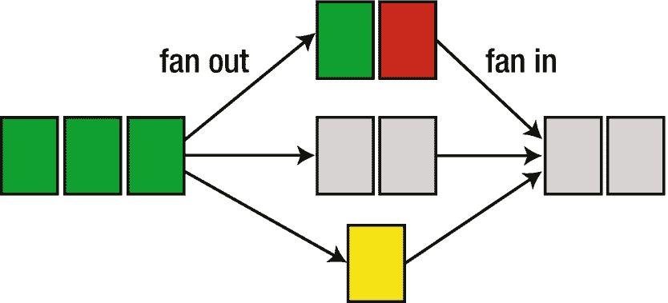
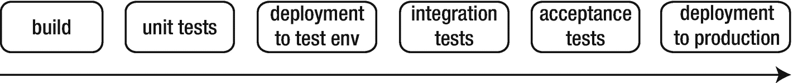

# 4.连续交货

持续集成(CI)是健壮的现代软件开发的基石，但它不是软件开发方法的顶峰。相反，它是更先进技术的推动者。

当 CI 作业显示所有测试都通过时，您可以合理地确定软件可以独立工作。但是和其他软件配合的好吗？我们如何将它呈现在最终用户面前？这就是连续交付(CD)的用武之地。

当您实践 CD 时，您将软件的部署过程自动化，并在几个环境中重复它。您可以使用其中的一些环境进行自动化测试，例如全系统集成测试、自动化验收测试，甚至性能和渗透测试。当然，这并不排除手工问答，手工问答仍然可以发现一类自动化测试不容易发现的缺陷。最后，您使用相同的自动化在您的生产环境中部署软件，在那里它到达它的最终用户。

建立一个 CD 系统听起来的确是一项令人生畏的任务，事实也确实如此。然而，好处是多方面的，但也许并不是所有的好处都是一目了然的。

本章的其余部分将讨论 CD 的好处，并提供一个粗略的路线图来实现它。本书的其余部分致力于展示 CD 的简单方法和实现它的例子。

## 4.1 光盘和自动化部署的原因

因为实现 CD 可能需要大量的工作，所以清楚这样做的原因和潜在好处是有好处的。你也可以使用本节中的论点来说服你的管理层投资这种方法。

### 节约时间

在大中型组织中，应用及其基础设施通常由独立的团队开发和操作。每个部署都必须在这些团队之间进行协调。必须提交变更请求，必须找到适合两个团队的日期，必须传播关于新版本的信息(例如什么新配置是可用的或需要的)，开发团队必须使二进制文件可供安装，等等。无论是在开发团队还是在运营团队，所有这些都很容易耗费每个版本几个小时或几天的时间。

然后，实际的部署过程也需要时间，通常伴随着停机。由于通常要在工作时间避免停机，部署必须在晚上或周末进行，这使得运营团队不太愿意执行任务。宝贵的善意也被人工调配消耗殆尽。

自动化部署可以节省大量时间和信誉。例如， [Etsy](https://www.etsy.com/) <sup>[1](#Fn1)</sup> 引入了连续(因此是自动化的)交付，将部署时间成本从“部署大军”的[6-14 小时减少到单人](https://www.slideshare.net/mikebrittain/principles-and-practices-in-continuous-deployment-at-etsy)[15 分钟](https://www.slideshare.net/mikebrittain/principles-and-practices-in-continuous-deployment-at-etsy)。 <sup>[2](#Fn2)</sup>

### 更短的发布周期

不言而喻，需要大量努力的任务比那些几乎不需要努力的任务完成得少得多。冒险的努力也是如此:我们倾向于避免经常这样做。

手动发布和部署的公司通常每周发布一次，甚至更少。有些公司每月甚至每季度发布一次。在更保守的行业，甚至每 6 个月或 12 个月发布一次也不是闻所未闻。

不频繁的发布总是导致冗长的开发过程和缓慢的上市时间。如果软件每季度部署一次，从规范到部署的时间很容易被缓慢的发布周期所支配，至少对于小的特性是如此。

这可能意味着，例如，在结账过程中用户体验不佳的在线企业必须等待大约三个月才能改善用户体验，这可能会花费大量金钱。自动化部署使得更频繁的发布更加容易，减轻了这种痛苦。

### 更短的反馈周期

获得软件反馈的最佳方式是将其部署到生产环境中。在那里，人们将实际使用它，然后你可以听听他们要说什么，甚至连续测量他们与系统不同部分的参与度。

如果您正在开发供公司内部使用的工具，您可能会让一些人在一个试运行环境中试用它们，但这并不容易。这需要他们从实际工作中抽出时间；必须用所有必要的数据(客户数据、库存等)来设置登台环境，甚至使其可用；然后那里的所有更改最终都会丢失。根据我的经验，让用户在非生产环境中进行测试是一项艰苦的工作，只有在重大变更时才值得。

对于手动的，因此也是不频繁的发布，反馈周期很慢，这违背了“敏捷”或“精益”开发过程的整体思想。

精益软件开发是一种受丰田精益制造流程启发的开发模式，其重点是减少不必要的工作、快速交付软件、学习和相关原则。

因为人类的交流容易产生误解，一个特性的第一次实现很少能满足最初的期望。反馈周期是不可避免的。因此，缓慢的发布周期导致缓慢的开发，使涉众和开发人员都感到沮丧。

但是也有副作用。当改进周期花费很长时间时，许多用户甚至都懒得请求小的改进。这是一个真正的遗憾，因为一个好的用户界面是由数以百计的小便利和锋利的边缘组成的，它们必须是圆形的。所以，从长远来看，缓慢的发布周期会导致更差的可用性和质量。

### 发布的可靠性

手动释放有一个恶性循环。它们往往是不频繁的，这意味着许多变化都集中在一个版本中。这增加了出错的风险。当一个大版本带来太多麻烦时，经理和工程师会寻找方法来提高下一个版本的可靠性，通过增加更多的验证步骤和过程。

但是更多的过程意味着更多的努力，更多的努力导致更慢的周期，导致每个版本更多的变化。你可以看到事情的发展。

自动化发布过程的步骤，甚至整个过程，是打破这种恶性循环的一种方式。在不折不扣地遵循指令方面，计算机比人强得多，在漫长的软件部署之夜结束时，它们的注意力不会下降。

一旦发布过程变得更可靠，执行起来更快，就很容易推动更频繁的发布，每一次都引入更少的变化。自动化节省的时间释放了资源来进一步改进自动化发布过程。

随着进行更多的部署，也带来了更多的经验，这使您能够更好地进一步改进流程和工具。

### 较小的增量使训练更容易

当一个部署引入了一个 bug，并且这个部署只引入了一两个特性或者 bug 修复，通常很容易就能找出是哪个变更导致了这个 bug (triaging)。相比之下，当许多变更是同一个部署的一部分时，就很难对新的 bug 进行分类，这意味着浪费了更多的时间，但是这也导致需要更长的时间才能修复缺陷。

### 更多的建筑自由

软件业当前的趋势是从巨大的、单一的应用转向更多更小组件的分布式系统。这就是*微服务*模式的全部内容。较小的应用或服务往往更容易维护，可伸缩性需求要求它们都必须能够在不同的机器上运行，并且通常每个服务都要在几台机器上运行。

但是，如果部署一个应用或服务已经很痛苦，那么部署十个甚至一百个更小的应用肯定会更痛苦，并且将微服务与手动部署混合在一起是完全不负责任的。

因此，自动部署打开了可能的软件架构的空间，您可以利用它来解决业务问题。

### 先进的质量保证技术

一旦你有了必要的基础设施，你就可以采用令人惊讶的 QA 策略。例如，GitHub 使用新老实现 <sup>[3](#Fn3)</sup> 的实时并行执行来避免结果和性能参数的倒退。

假设你开发了一个旅游搜索引擎，你想改进搜索算法。您可以同时部署引擎的旧版本和新版本，并针对两者运行传入的查询(或其中的一部分),并定义一些度量标准来评估它们。例如，快速旅行和低成本使航班衔接很好。你可以用它来发现新引擎比旧引擎表现差的情况，并使用这些数据来改进它。你也可以用这些数据来证明新搜索引擎的优越性，从而证明开发它所付出的努力是正确的。

但是，如果每个新版本都必须手动部署，并且部署每个版本是一项很大的工作，那么这样的实验是不实际的。自动部署不会自动给你带来这些好处，但是它是使用这种高级 QA 技术的先决条件。

## 4.2 光盘计划

我希望现在你已经相信裁谈会是一个好主意。当我到达那个阶段时，实际实施它的前景似乎相当令人生畏。

CD 的过程可以分解成几个步骤，每个步骤都可以单独管理。更好的是，每个步骤的自动化提供了好处，即使整个过程还没有自动化。

让我们来看看一个典型的光盘系统和所涉及的步骤。

### 管道架构

CD 系统的结构是一个流水线。版本控制系统中的新提交或分支触发流水线的实例化，并开始执行一系列阶段中的第一个。当一个阶段成功运行时，它会触发下一个阶段。如果失败，整个管道实例将停止。

那么手动干预是必要的，通常是通过添加新的提交来修复代码或测试，或者通过修复环境或管道配置。然后，管道的新实例或失败阶段的重新运行就有机会成功。

偏离严格的管道模型是可能的。例如，潜在地并行执行的分支允许在不同的环境中运行不同的测试，并等待下一步，直到两者都成功完成。分支成多个流水线，从而并行执行，称为*扇出*；在(图 [4-1](#Fig1) )中，将管道连接成一个单独的分支称为*风扇。*



图 4-1

扇出分支管道；范也加入了他们

典型的阶段是构建、运行单元测试、部署到第一个测试环境、在那里运行集成测试、可能部署到各种测试环境并在其中进行测试，以及最终部署到生产环境(图 [4-2](#Fig2) )。



图 4-2

部署管道的典型推荐阶段

有时候，这些阶段有点模糊。例如，Debian 包的典型构建也运行单元测试，这减少了对单独单元测试阶段的需求。同样，如果部署到一个环境中，对其部署到的每个主机运行冒烟测试，则不需要单独的冒烟测试阶段(图 [4-3](#Fig3) )。


图 4-3

在实际的流水线中，将多个推荐的阶段合并成一个阶段是很方便的，并且可能有理论掩盖的额外阶段

通常，有一个软件控制整个管道的流量。它为一个阶段准备必要的文件，运行与该阶段相关的代码，收集其输出和*工件*(即该阶段产生的值得保留的文件，如二进制文件或测试输出)，确定该阶段是否成功，然后继续下一个阶段。

从架构的角度来看，这使阶段不必知道下一步是什么阶段，甚至不必知道如何到达运行它的机器。它分离了阶段并保持关注点的分离。

### 反模式:每个环境独立构建

如果您为您的源代码使用一个分支模型，比如 [GitFlow](http://nvie.com/posts/a-successful-git-branching-model/) <sup>[4](#Fn4)</sup> ，那么自动将`develop`分支部署到测试环境是很有诱惑力的。当发布时间到来时，您将开发分支合并到`master`分支中(可能通过独立发布分支的间接方式)，然后您自动构建`master`分支并将结果部署到生产环境中。

这很诱人，因为它是现有的、经过验证的工作流的直接扩展。不要这样做。

这种方法的一个大问题是，您实际上没有测试将要部署的内容，另一方面，您将一些未经测试的内容部署到生产环境中。即使您在部署到生产环境之前已经有了一个试运行环境，但是如果您没有实际发布在之前的环境中测试过的二进制文件或包，那么您所做的所有测试都是无效的。

如果您从不同的来源(比如不同的分支)构建“测试”和“发布”包，那么产生的二进制文件将会不同。即使您使用完全相同的源代码，构建两次仍然是一个坏主意，因为许多构建是不可重复的。不确定的编译器行为以及环境和依赖关系的差异都可能导致包在一个版本中运行良好，而在另一个版本中失败。最好通过将您在测试环境中测试过的版本部署到生产环境中，来避免这种潜在的差异和错误。

环境之间的行为差异(如果需要的话)应该由不属于构建的配置来实现。同样不言而喻的是，配置必须在版本控制之下并自动部署。有专门用于部署配置的工具，比如 Puppet、Chef 和 Ansible，后面的章节将讨论如何将它们集成到部署过程中。

### 一切都取决于包装形式

构建可部署的工件是 CD 管道的早期阶段:构建、存储库管理、安装和操作都依赖于包格式的选择。Python 软件通常被打包成源代码 tarball，格式由`setuptools`包确定，有时也打包成二进制*轮*包，由 [Python 增强提案(PEP) 427](https://www.python.org/dev/peps/pep-0427/) 指定。 <sup>[5](#Fn5)</sup>

源 tarballs 和 wheels 都不特别适合部署正在运行的应用。它们在安装时缺少钩子来创建必要的系统资源(如用户帐户)，启动或重新启动应用，以及其他特定于操作系统的任务。它们也不支持管理非 Python 依赖项，比如用 c 编写的数据库客户端库。

Python 包由 *pip* 包管理器安装，默认为系统范围的全局安装，有时与操作系统包管理器安装的 Python 包交互不佳。例如，存在虚拟环境形式的工作区，但是管理这些工作区需要额外的关注和努力。

最后，在开发和操作职责分开的情况下，操作团队通常更熟悉本地操作系统包。尽管如此，源代码 tarballs 作为创建更适合直接部署的格式的包的起点，发挥了非常有用的作用。

在本书中，我们部署到 Debian GNU/Linux 机器上，因此我们使用两步过程构建 Debian 包。首先，我们使用一个由`setuptools`支持的`setup.py`文件创建一个源 tarball。然后工具`dh-virtualenv`创建一个包含 virtualenv 的 Debian 包，该软件及其所有 Python 依赖项都安装在这个包中。

### 管理 Debian 仓库的技术

部署 Debian(和大多数其他)包的工作方式是将它们上传到一个*库*中。然后，使用该存储库的 URL 配置目标机器。从目标机器的角度来看，这是一个基于拉的模型，允许它们获取尚未安装的依赖项。这些存储库由特定的目录布局组成，其中预定义名称和格式的文件包含元数据并链接到实际的包文件。

这些文件和目录可以通过传输机制公开，例如本地文件访问(可能通过网络文件系统挂载)、HTTP 和 FTP。HTTP 是很好的选择，因为它设置简单，易于调试，而且通常不会成为性能瓶颈，因为它是标准的系统组件。

有各种各样的软件来管理 Debian 仓库，其中大部分都没有很好的文档记录或者很少维护。一些解决方案，如 *debarchiver、*或 *dak* ，提供了通过 SSH 的远程上传，但没有给出上传是否成功的即时反馈。Debarchiver 还批量处理上传的文件，这是由 cron 作业触发的，这会导致延迟，从而降低自动化的乐趣。

我选择了[](https://www.aptly.info/)**，* <sup>[6](#Fn6)</sup> ，这是一个用于管理存储库的命令行工具集。当您向存储库中添加一个新的包时，会以退出代码的形式给出及时的反馈。它没有提供一种方便的方式将文件上传到存储库所在的服务器上，但是这是管道管理器可以做的事情。*

 *最后，Aptly 可以在一个存储库中保存同一个包的多个版本，这使得回滚到以前的版本更加容易。

### 安装软件包的工具

一旦您构建了一个 Debian 包，将它上传到一个存储库中，并配置了目标机器来使用这个存储库，交互式包安装看起来就像这样:

```py
$ apt-get update && apt-get install $package

```

在自动化安装中有一些微妙之处需要注意。您必须关闭所有形式的交互，可能控制输出的详细程度，配置降级是否可接受，等等。

与其试图找出所有这些细节，不如重用一个现有的工具，该工具的作者已经完成了艰苦的工作。配置管理工具如 [Ansible](https://ansible.com/) 、<sup>、 [7](#Fn7) 、</sup>、 [Chef](https://www.chef.io/) 、<sup>、 [8](#Fn8) 、</sup>、[木偶](https://puppet.com/)、<sup>、 [9](#Fn9) 、</sup>、[盐](https://www.saltstack.com/)、<sup>、</sup>10、[雷克斯](https://www.rexify.org/)、<sup>、 [11](#Fn11) 、</sup>都有安装包的模块

然而，并不是所有的配置管理系统都适合自动化部署。Puppet 通常在基于拉的模型中使用，在这种模型中，每个 Puppet 管理的机器定期联系服务器，并请求其目标配置。这对可伸缩性来说很好，但是集成到工作流中是一个大问题。在基于推的模型中，管理器联系被管理的机器(例如，通过 SSH)然后执行命令，这种模型更适合于部署任务(通常提供更简单、更愉快的开发和调试体验)。

对于这本书，我选择了 Ansible。这主要是因为我喜欢它的声明式语法，它的简单模型，并且到目前为止，谷歌搜索已经为所有实际问题找到了很好的解决方案。

### 控制管道

即使您从构建、测试、分发和安装软件的角度考虑部署管道，所做的大部分工作实际上是“粘合”，即使整个事情顺利运行的小任务。这些包括轮询版本控制系统，为构建作业准备目录，收集构建的包(或者在失败时中止当前管道实例)，以及将工作分配给最适合该任务的机器。

当然，也有完成这些任务的工具。Jenkins 等一般 CI 和构建服务器通常可以完成这项工作。但也有专门做 CD 流水线的工具，比如 [Go 连续交付](https://www.gocd.org/) (GoCD) <sup>[12](#Fn12)</sup> 和 [Concourse](https://concourse-ci.org/) 。 <sup>[13](#Fn13)</sup>

虽然 Jenkins 是一个很好的 CI 工具，但它以工作为中心的世界观使它不太适合 CD 的管道模型。在这里，我们将探索 GoCD，它是 ThoughtWorks，Inc .的开源软件，主要用 Java 编写，可用于大多数操作系统。为了方便基于 Debian 的开发环境，它提供了预构建的 Debian 包。

在接下来章节的例子中，我们将打包一个也运行单元测试的构建。在生产环境中，如果 Jenkins 中的所有测试都已通过，您可能会在 Jenkins 管道中包含一个使用 GoCD API 来触发 CD 步骤的构建后操作。

## 4.3 总结

CD 支持以小增量部署软件。这缩短了上市时间，缩短了反馈周期，并使得对新引入的 bug 进行分类变得更加容易。

CD 中涉及的步骤包括单元测试、包构建、包分发、安装和已安装包的测试。它由一个管道系统控制，为此我们将使用 GoCD。

<aside class="FootnoteSection" epub:type="footnotes">Footnotes [1](#Fn1_source)

[`www.etsy.com/`](https://www.etsy.com/) 。

  [2](#Fn2_source)

Mike Britain，“Etsy 持续部署的原则和实践”，SlideShare， [`www.slideshare.net/mikebrittain/principles-and-practices-in-continuous-deployment-at-etsy`](http://www.slideshare.net/mikebrittain/principles-and-practices-in-continuous-deployment-at-etsy) ，2014 年 4 月 2 日。

  [3](#Fn3_source)

梁赫群·马蒂，“快速移动并修复事物”，GitHub 工程， [`http://githubengineering.com/move-fast/`](http://githubengineering.com/move-fast/) ，2015 年 12 月 15 日。

  [4](#Fn4_source)

文森特·德里森，“一个成功的 Git 分支模型”，nvie.com， [`http://nvie.com/posts/a-successful-git-branching-model/`](http://nvie.com/posts/a-successful-git-branching-model/) ，2010 年 1 月 5 日。

  [5](#Fn5_source)

Python 软件基础，《PEP 427—车轮二进制包格式 1.0》， [`www.python.org/dev/peps/pep-0427/`](http://www.python.org/dev/peps/pep-0427/) ，2018。

  [6](#Fn6_source)

[`www.aptly.info/`](http://www.aptly.info/) 。

  [7](#Fn7_source)

[`https://ansible.com`](https://ansible.com) 。

  [8](#Fn8_source)

[`www.chef.io/`](http://www.chef.io/) 。

  [9](#Fn9_source)

[`https://puppet.com/`](https://puppet.com/) 。

  [10](#Fn10_source)

[`www.saltstack.com/`](http://www.saltstack.com/) 。

  [11](#Fn11_source)

[`www.rexify.org/`](http://www.rexify.org/) 。

  [12](#Fn12_source)

[`www.gocd.org/`](http://www.gocd.org/) 。

  [13](#Fn13_source)

[`https://concourse-ci.org/`](https://concourse-ci.org/) 。

 </aside>*