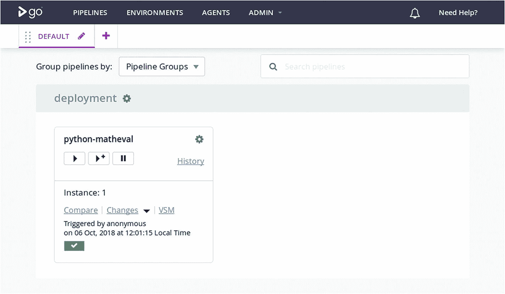

# 9.持续交付中的构建

前面的章节已经展示了从源代码到部署的基本步骤的自动化:构建、发布和部署。现在缺少的是将它们结合在一起的粘合剂:轮询源代码存储库，将包从构建服务器发送到存储库服务器并通常控制流程，当一个步骤失败时中止管道实例，等等。

我们将用 ThoughtWorks 的 [Go 连续交付](https://www.gocd.org/) <sup>[1](#Fn1)</sup> (GoCD 或 Go)作为胶水。

## 9.1 关于 Go 连续交货

GoCD 是一个用 Java 编写的开源项目，它的 web 接口组件是用 Ruby on Rails 编写的。它在 2010 年开始作为专有软件，并在 2014 年开源。

您可以下载适用于 Windows、OSX、Debian 和基于 RPM 的 Linux 发行版以及 Solaris 的 GoCD。ThoughtWorks 提供 GoCD 的商业支持。

它由一个服务器组件组成，该组件保存管道配置、轮询源代码存储库的更改、调度和分发工作、收集工件、提供一个 web 界面来可视化和控制所有这些，并提供一个手动批准步骤的机制。

一个或多个*代理*连接到服务器并执行构建管道中的实际任务。

### 管道组织

GoCD 执行的每个构建、部署或测试工作都必须是*管道*的一部分。流水线由一个或多个线性排列的*级*组成。在一个阶段中，一个或多个*作业*潜在地并行运行，并被单独分配给代理。*任务*在一个作业中连续执行。

在任务中，您可以依赖于同一作业中以前的任务生成的文件，而在作业和阶段之间，您必须显式地捕获它们，并在以后将其作为工件进行检索。更多信息请见下文。

最常见的任务是执行外部程序。其他任务包括检索工件或特定于语言的东西，比如运行 Ant 或 Rake 构建。 <sup>[2](#Fn2)</sup>

管道可以触发其他管道，让你形成一个非循环的、有向的管道图(图 [9-1](#Fig1) )。


图 9-1

GoCD 管道可以形成一个图。管道由连续的阶段组成，在这些阶段中，几个作业可以并行运行。任务在一个作业中连续执行。

### 作业与代理的匹配

当代理空闲时，它轮询服务器的工作。如果服务器有作业要运行，它使用两个标准来决定代理是否适合执行作业:*环境*和*资源*。

每个作业都是管道的一部分，如果您选择使用环境，管道就是环境的一部分。另一方面，每个代理被配置为一个或多个环境的一部分。代理仅接受来自其环境之一的管道的作业。

资源是用户定义的标签，描述代理必须提供的内容，在管道配置中，您可以指定作业需要哪些资源。例如，如果您定义一个作业需要使用`phantomjs`资源来测试一个 web 应用，那么只有您分配了该资源的代理才会执行该作业。将操作系统和版本作为资源添加是一个好主意。在前面的例子中，代理可能拥有`phantomjs`、`debian`和`debian-stretch`资源，为作业的作者提供了指定所需操作系统的粒度选择。

### 关于环境的一句话

GoCD 使得在特定环境中运行代理成为可能。例如，可以在每台测试机器和每台生产机器上运行 Go 代理，并将管道与代理环境相匹配，以确保安装步骤发生在正确环境中的正确机器上。如果您使用这个模型，您还可以使用 GoCD 将构建工件复制到需要它们的机器上。

我选择不这样做，因为我不想在我想部署的每台机器上安装 GoCD 代理。相反，我使用在 GoCD 代理上执行的 Ansible 来控制环境中的所有机器。这需要管理 Ansible 使用的 SSH 密钥，并通过 Debian 仓库分发包。但是因为 Debian 无论如何都需要一个存储库来解决依赖性，所以这并不是额外的负担。

### 材料

GoCD 中的一个*素材*有两个用途:它触发一个管道，它提供管道中的任务可以使用的文件。

我倾向于使用 Git 存储库作为素材，GoCD 可以轮询这些存储库，在新版本可用时触发管道。GoCD 代理还将存储库克隆到代理执行其作业的文件系统中。

有针对各种源代码控制系统的材料插件，比如 Subversion (svn)和 mercurial，还有将 Debian 和 RPM 包存储库视为材料的插件。

最后，管线可以作为其他管线的材料。使用此功能，您可以构建管线图。

### 史前古器物

GoCD 可以收集*工件*，这些工件是由一个作业生成的文件或目录。同一管道的后续部分，甚至是其他连接的管道，都可以检索这些工件。工件的检索不限于在同一台代理机器上创建的工件。

您还可以从 web 界面和 [GoCD 服务器提供的](https://api.gocd.org/current/)REST API 中检索工件。 <sup>[3](#Fn3)</sup>

当磁盘空间变得不足时，可以将工件存储库配置为丢弃旧版本。

## 9.2 安装

为了使用 GoCD，您必须在一台机器上安装 GoCD 服务器，并在至少一台机器上安装 GoCD 代理。这可以与服务器在同一台机器上，也可以在不同的机器上，只要它可以通过端口 8153 和 8154 连接到 GoCD 服务器。

当您的基础设施和管道数量增长时，您可能会运行几个 Go 代理。

### 在 Debian 上安装 GoCD 服务器

要在基于 Debian 的操作系统上安装 GoCD 服务器，首先你必须确保你可以通过 HTTPS 下载 Debian 软件包。

```py
$ apt-get install -y apt-transport-https

```

然后，您必须配置软件包源。

```py
$ echo 'deb https://download.gocd.org /' \
        > /etc/apt/sources.list.d/gocd.list
$ curl https://download.gocd.org/GOCD-GPG-KEY.asc \
        | apt-key add -

```

最后安装。

```py
$ apt-get update && apt-get install -y go-server

```

在 Debian 9 上，codename *Stretch* ，Java 8 开箱即用。在 Debian 的旧版本中，你可能不得不从其他来源安装 Java 8，比如 [Debian Backports](https://backports.debian.org/) 。 <sup>[4](#Fn4)</sup>

现在，当您将浏览器指向 HTTPS Go 服务器的端口 8154(忽略 SSL 安全警告)或 HTTP 的端口 8153 时，您应该会看到 GoCD 服务器的 web 界面(图 [9-2](#Fig2) )。


图 9-2

GoCD 的初始网络界面

如果你得到一个*连接被拒绝*的错误，检查`/var/log/go-server/`下的文件，寻找出错的提示。

为了防止未经认证的访问，您可以安装认证插件，例如基于[密码文件的认证](https://github.com/gocd/gocd-filebased-authentication-plugin) <sup>[5](#Fn5)</sup> 或基于 LDAP 或 Active Directory 的认证。 <sup>[6](#Fn6)</sup>

### 在 Debian 上安装 GoCD 代理

在您想要执行自动构建和部署步骤的一台或多台机器上，您必须安装一个 Go 代理，它将连接到服务器并轮询它的工作。

关于 GoCD 代理的自动安装示例，请参见第 [8](08.html) 章。如果您想改为手动安装，您必须执行与安装 GoCD 服务器时相同的前三个步骤，以确保您可以从 GoCD 软件包资源库安装软件包。然后，当然，你安装 Go 代理。在基于 Debian 的系统上，如下所示:

```py
$ apt-get install -y apt-transport-https
$ echo 'deb https://download.gocd.org /' >
    /etc/apt/sources.list.d/gocd.list
$ curl https://download.gocd.org/GOCD-GPG-KEY.asc \
    | apt-key add -
$ apt-get update && apt-get install -y go-agent

```

然后编辑文件`/etd/default/go-agent`。第一行应为

```py
GO_SERVER_URL=https://127.0.0.1:8154/go

```

将变量更改为指向您的 GoCD 服务器，然后启动代理。

```py
$ service go-agent start

```

几秒钟后，代理将联系服务器。当您在 GoCD 服务器的 web 界面中单击代理菜单时，您应该会看到代理(图 [9-3](#Fig3) )。


图 9-3

GoCD 的代理管理界面截图。(`lara`是这里代理的主机名。)

### 第一次接触 GoCD 的 XML 配置

有两种方法可以配置 GoCD 服务器:通过 web 界面和 XML 格式的配置文件。您还可以通过 web 界面编辑 XML 配置。 <sup>[7](#Fn7)</sup>

虽然 web 界面是探索 GoCD 功能的好方法，但由于点击次数太多，它很快就变得令人讨厌。使用具有良好 XML 支持的编辑器可以更快地完成工作，而且它更适合于紧凑的解释，所以这就是我在这里选择的路线。您还可以在同一个 GoCD 服务器实例上使用这两种方法。

在管理菜单中，Config XML 项目允许您查看和编辑服务器配置。清单 [9-1](#PC7) 是一个原始的 XML 配置，已经注册了一个代理。

```py
<?xml version="1.0" encoding="utf-8"?>

<cruise

    xmlns:xsi="http://www.w3.org/2001/XMLSchema-instance"
    xsi:noNamespaceSchemaLocation="cruise-config.xsd"
    schemaVersion="77">
<server artifactsdir="artifacts"
        commandRepositoryLocation="default"
        serverId="b2ce4653-b333-4b74-8ee6-8670be479df9">

</server>

<agents>

    <agent hostname="lara" ipaddress="192.168.2.43"
        uuid="19e70088-927f-49cc-980f-2b1002048e09" />

</agents>

</cruise>

Listing 9-1Baseline GoCD XML Configuration, with One Agent Registered

```

即使您遵循相同的步骤，代理的`serverId`和数据在您的安装中也会有所不同。

为了给代理一些资源，您可以将`<agents>`部分中的`<agent .../>`标记改为如清单 [9-2](#PC8) 所示。

```py
<agent hostname="lara" ipaddress="192.168.2.43"
    uuid="19e70088-927f-49cc-980f-2b1002048e09">
  <resources>
    <resource>debian-stretch</resource>
    <resource>build</resource>
    <resource>aptly</resource>
  </resources>

</agent>

Listing 9-2GoCD XML Configuration for an Agent with Resources

```

### 创建 SSH 密钥

对于 GoCD 来说，拥有一个没有密码的 SSH 密钥是很方便的，例如，能够通过 SSH 克隆 Git 存储库。要创建一个，请在服务器上运行以下命令:

```py
$ su - go
$ ssh-keygen -t rsa -b 2048 -N " -f ~/.ssh/id_rsa

```

要么将生成的`.ssh`目录和其中的文件复制到每个代理的`/var/go`目录中(记得在最初创建时设置所有者和权限),要么在每个代理上创建一个新的密钥对。

## 9.3 管道中的建筑

触发 Debian 包的构建需要从 Git 存储库中获取源代码，将其配置为 GoCD 材料，然后调用带有一些选项的`dpkg-buildpackage`命令，最后收集结果文件。

这里(清单 [9-3](#PC10) )是构建`python-matheval`包的第一步，用 GoCD 的 XML 配置表示。

```py
<pipelines group="deployment">
  <pipeline name="python-matheval">
    <materials>
      <git
url="https://github.com/python-ci-cd/python-matheval.git"
        dest="source" />
    </materials>
    <stage name="build" cleanWorkingDir="true">
       <jobs>
         <job name="build-deb" timeout="5">
          <tasks>
            <exec command="/bin/bash" workingdir="source">
              <arg>-c</arg>
              <arg>dpkg-buildpackage -b -us -uc</arg>
            </exec>
          </tasks>
          <artifacts>
            <artifact src="*.deb" dest="debian-packages/"
                type="build" />
          </artifacts>
          <resources>
            <resource>debian-stretch</resource>
            <resource>build</resource>
          </resources>
        </job>
      </jobs>
    </stage>
  </
pipeline>

</pipelines>

Listing 9-3Simple Approach to Building a Debian Package in GoCD

```

您可以在[deployment-utils](https://github.com/python-ci-cd/deployment-utils)<sup>[8](#Fn8)</sup>存储库的`gocd`目录中找到这个配置和所有下面的 XML 配置。

最外面的标记是管道组，它有一个名称。它可用于对可用管道进行分类，也可用于管理权限。

第二层是带有名称的`<pipeline>`，它包含一个材料列表和一个或多个阶段。

### 目录布局

每次运行某个阶段中的作业时，分配给该作业的 GoCD 代理都会准备一个目录，在该目录中可以使用这些材料。在 Linux 上，这个目录默认为`/var/lib/go-agent/pipelines/`，后跟管道名。GoCD 配置中的路径相对于此路径。

例如，前面的 material 定义包含属性`dest="source"`，所以这个 Git 存储库的工作副本的绝对路径是`/var/lib/go-agent/pipelines/python-matheval/source`。省略掉`dest="..."`会有效，并且会减少一个目录级别，但是这也会阻止我们在将来使用第二个材料。

可用材料类型和选项列表见[配置参考](https://docs.gocd.org/current/configuration/configuration_reference.html#materials) <sup>[9](#Fn9)</sup> 。[插件可用于](http://www.gocd.org/plugins/) <sup>[10](#Fn10)</sup> 添加更多的材料类型。

### 阶段、作业、任务和工件

管道中的所有阶段都是串行运行的，并且只有在前一个阶段成功的情况下，每个阶段才会运行。每个阶段都有一个名称，它既用于前端，也用于获取该阶段中产生的工件。

在前面的例子中，我给 stage 赋予了属性`cleanWorkingDir="true"`，这使得 GoCD 删除在之前的构建过程中创建的文件，并放弃对版本控制下的文件的更改。这往往是一个很好的选择；否则，您可能会不知不觉地陷入前一个构建影响当前构建的境地，这对于调试来说确实很痛苦。

作业有可能在一个阶段中并行执行，并且由于与阶段相同的原因而命名。如果有几个代理可以运行这些作业，则它们只能并行运行。

GoCD 代理连续执行作业中的任务。我倾向于主要使用`<exec>`任务(和`<fetchartifact>`，你将在下一章看到)，它们调用系统命令。他们遵循 UNIX 惯例，将退出状态 0 视为成功，其他都视为失败。

对于更复杂的命令，我在 Git 存储库中创建 shell、Perl 或 Python 脚本，并将存储库作为素材添加到管道中，这使得它们在构建过程中可用，而无需额外的工作。

我们示例中的`<exec>`任务调用`/bin/bash -c 'dpkg-buildpackage -b -us -uc'`。这是一个[货邪教编程](https://en.wikipedia.org/wiki/Cargo_cult_programming)、 <sup>[11](#Fn11)</sup> 的案例，因为直接调用`dpkg-buildpackage`也可以。啊，好吧，我们可以稍后修改这个…

构建 Debian 包，并在源代码的 Git 检验中执行。它生成一个`.deb`文件，一个`.changes`文件，可能还有其他一些带有元数据的文件。它们是在管道的根目录中创建的，比 Git checkout 高一级。

因为这些是我们稍后想要处理的文件，至少是`.deb`文件，我们让 GoCD 将它们存储在一个名为*工件库*的内部数据库中。这就是配置中的`<artifact>`标签指示 GoCD 做的事情。

生成的包文件的名称取决于构建的 Debian 包的版本号(来自 Git 存储库中的`debian/changelog`文件)，所以以后不容易通过名称引用它们。这就是`dest="debian-packages/"`发挥作用的地方:它让 GoCD 将工件存储在一个有固定名称的目录中。随后的阶段可以通过固定的目录名从这个目录中检索所有工件文件。

### 行动中的管道

如果没有出错(从来没有出错过，对吗？)，图 [9-4](#Fig4) 大致展示了运行新管道后 web 界面的样子。



图 9-4

成功运行构建阶段后的管道概述

每当 Git 存储库中有新的提交时，GoCD 都会很高兴地构建一个 Debian 包并存储起来以备将来使用。自动化构建，耶！

### 版本回收被认为有害

当构建 Debian 包时，工具通过查看`debian/changelog`文件的顶部来确定最终包的版本号。这意味着，每当有人在没有新的 changelog 条目的情况下推送代码或文档变更时，生成的 Debian 包与前一个包具有相同的版本号。

大多数 Debian 工具假设包名、版本和架构的元组唯一地标识了包的修订。将旧版本号的包的新版本塞进一个存储库中肯定会引起麻烦。大多数存储库管理软件只是简单地拒绝接受循环使用某个版本的包的副本。在要安装软件包的目标机器上，如果版本号保持不变，升级软件包不会有任何作用。

### 构建唯一的版本号

有几个来源可以用来生成唯一的版本号。

*   随机性(例如，以 UUIDs 的形式)

*   当前日期和时间

*   Git 存储库本身

*   GoCD 公开的几个有用的环境变量 <sup>[12](#Fn12)</sup>

后者大有可为。`GO_PIPELINE_COUNTER`是一个单调计数器，每次 GoCD 运行管道时它都会增加，所以这是一个很好的版本号来源。GoCD 允许手动重新运行阶段，所以最好与`GO_STAGE_COUNTER`结合使用。就 shell 脚本而言，使用`$GO_PIPELINE_COUNTER.$GO_STAGE_COUNTER`作为版本字符串听起来是一种不错的方法。

但是，还有更多。GoCD 允许您使用特定版本的材料触发管道，因此您可以运行新的管道来构建旧版本的软件。如果这样做，使用`GO_PIPELINE_COUNTER`作为版本字符串的第一部分并不能反映旧代码库的使用。

`git describe`是一种计算提交次数的既定方法。默认情况下，它打印存储库中的最后一个标记，如果`HEAD`没有解析为与该标记相同的提交，它会添加自该标记以来的提交次数和以`g`为前缀的缩写 SHA1 哈希，例如，提交`4232204`的`2016.04-32-g4232204`，这是在标记`2016.04`之后的 32 次提交。选项`--long`强制它总是打印提交次数和散列，即使 HEAD 指向一个标签。

我们不需要版本号的提交散列，因此构建合适版本号的 shell 脚本如下所示。

```py
#!/bin/bash

set -e
set -o pipefail
v=$(git describe --long |sed 's/-g[A-Fa-f0-9]*$//')
version="$v.${GO_PIPELINE_COUNTER:-0}.${GO_STAGE_COUNTER:-0}"

```

Bash 的`${VARIABLE:-default}`语法是让脚本在 GoCD 代理环境之外工作的好方法。这个脚本需要在 Git 存储库中设置一个标记。如果没有，则失败，并显示来自`git describe`的消息:

```py
fatal: No names found, cannot describe anything.

```

### 围绕构建的其他零碎内容

现在我们有了一个惟一的版本字符串，我们必须指示构建系统使用这个版本字符串。这通过用期望的版本号在`debian/changelog`中写入一个新条目来实现。`debchange`工具为我们实现了自动化。要使它可靠地工作，有几个选项是必需的。

```py
export DEBFULLNAME='Go Debian Build Agent'
export DEBEMAIL='go-noreply@example.com'
debchange --newversion=$version --force-distribution -b \
    --distribution="${DISTRIBUTION:-stretch}" 'New Version'

```

当我们想要在管道的后期引用这个版本号时(是的，将会有更多)，在一个文件中提供它是很方便的。在输出中包含它也很方便，所以我们在脚本中还需要两行。

```py
echo $version
echo $version > ../version

```

当然，必须触发实际的构建，如下所示:

```py
dpkg-buildpackage -b -us -uc

```

### 将它插入 GoCD

为了让 GoCD 可以访问这个脚本，并让它处于版本控制之下，我将这个脚本放入一个 Git 存储库中，命名为`debian-autobuild`，并将这个存储库作为一个素材添加到管道中(清单 [9-4](#PC16) )。

```py
<pipeline name="python-matheval">
  <materials>
    <git
url="https://github.com/python-ci-cd/python-matheval.git"
        dest="source" materialName="python-matheval" />
    <git
url="https://github.com/python-ci-cd/deployment-utils.git"
    dest="deployment-utils" materialName="deployment-utils" />
  </materials>
  <stage name="build" cleanWorkingDir="true">
    <jobs>
      <job name="build-deb" timeout="5">
        <tasks>
          <exec command="../deployment-utils/debian-autobuild"
                workingdir="source" />
        </tasks>
        <artifacts>
          <artifact src="version" type="build"/>
          <artifact src="*.deb" dest="debian-packages/"
            type="build" />
        </artifacts>
        <resources>
          <resource>debian-stretch</resource>
          <resource>build</resource>
        </resources>
      </job>

    </jobs>
  </stage>

</pipeline>

Listing 9-4GoCD Configuration for Building Packages with Distinct Version Numbers

```

现在，GoCD 在每次提交到 Git 存储库时自动构建 Debian 包，并给每个包一个不同的版本字符串。

## 9.4 总结

GoCD 是一个开源工具，可以轮询您的 Git 存储库，并通过专用代理触发构建。它是通过 web 界面配置的，可以通过点击助手或提供 XML 配置。

必须注意为每个版本构造有意义的版本号。Git 标记、自最后一个标记以来的提交次数以及 GoCD 公开的计数器是构建这种版本号的有用组件。

<aside class="FootnoteSection" epub:type="footnotes">Footnotes [1](#Fn1_source)

[`www.gocd.org/`](http://www.gocd.org/) 。

  [2](#Fn2_source)

`<ant>`和`<rake>`任务执行同名的专门构建器，并允许您指定目标和构建文件。详见 [`https://docs.gocd.org/current/configuration/configuration_reference.html#ant`](https://docs.gocd.org/current/configuration/configuration_reference.html#ant) 。

  [3](#Fn3_source)

[`https://api.gocd.org/current/`](https://api.gocd.org/current/) 。

  [4](#Fn4_source)

[`https://backports.debian.org/`](https://backports.debian.org/) 。

  [5](#Fn5_source)

[`https://github.com/gocd/gocd-filebased-authentication-plugin`](https://github.com/gocd/gocd-filebased-authentication-plugin) 。

  [6](#Fn6_source)

[`https://github.com/gocd/gocd-ldap-authentication-plugin`](https://github.com/gocd/gocd-ldap-authentication-plugin) 。

  [7](#Fn7_source)

从 GoCD 版本 16.7 开始，管道配置可以交换到外部版本控制库，并且通过插件，甚至可以用不同的格式编写，比如 YAML。虽然这似乎是一个非常有前途的方法，但介绍它超出了本书的范围。

  [8](#Fn8_source)

[`https://github.com/python-ci-cd/deployment-utils`](https://github.com/python-ci-cd/deployment-utils) 。

  [9](#Fn9_source)

[`https://docs.gocd.org/current/configuration/configuration_reference.html#materials`](https://docs.gocd.org/current/configuration/configuration_reference.html#materials) 。

  [10](#Fn10_source)

[`www.gocd.org/plugins/`](http://www.gocd.org/plugins/) 。

  [11](#Fn11_source)

维基百科，《货物邪教编程》， [`https://en.wikipedia.org/wiki/Cargo_cult_programming`](https://en.wikipedia.org/wiki/Cargo_cult_programming) ，2018 年。

  [12](#Fn12_source)

[`https://docs.gocd.org/current/faq/dev_use_current_revision_in_build.html`](https://docs.gocd.org/current/faq/dev_use_current_revision_in_build.html) 。

 </aside>