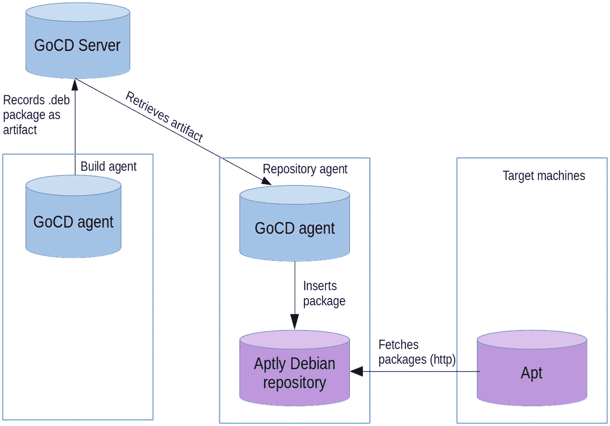

# 10.在管道中分发和部署包

前一章给我们留下了 GoCD 管道的开端。它会在每次新的提交被推送到 Git 时自动构建一个 Debian 包，并为每次构建生成一个唯一的版本号。最后，它捕获构建的包和包含版本号的文件`version`,作为工件。接下来的任务是将它上传到 Debian 仓库，并部署到目标机器上。

## 10.1 管道上传

第 6 章，关于分发软件包，已经介绍了一个小程序，用于创建和填充 Debian 知识库。如果您将它添加到那一章的`deployment-utils` Git 存储库中，那么您可以自动上传新构建的带有这个额外 GoCD 配置的包(清单 [10-1](#PC1) )，在构建阶段之后插入。

```py
<stage name="upload-testing">
  <jobs>
    <job name="upload-testing">
      <tasks>
        <fetchartifact pipeline="" stage="build"
            job="build-deb" srcdir="debian-packages"
            artifactOrigin="gocd">
          <runif status="passed" />
        </fetchartifact>

        <exec command="/bin/bash">
          <arg>-c</arg>
  <arg>deployment-utils/add-package testing stretch *.deb</arg>
        </exec>
      </tasks>
      <resources>
        <resource>aptly</resource>
      </resources>
    </job>
  </jobs>

</stage>

Listing 10-1GoCD Configuration for Uploading a Freshly Built Package to the testing Repository

```

您猜对了,`fetchartifact`任务获取存储在 GoCD 服务器的工件库中的工件。在这里，它获取目录`python-matheval`，前一阶段将 Debian 包上传到这个目录中。管道名称的空字符串指示 GoCD 使用当前管道。

在`add-package`脚本的调用中，`testing`指的是环境的名称(可以自由选择，只要一致)，而不是 Debian 项目的测试发行版。

最后，`aptly`资源选择具有相同资源的 GoCD 代理来运行作业(参见图 [10-1](#Fig1) )。如果您预计您的设置会有所增长，那么您应该有一台单独的机器来为这些存储库服务。在其上安装 GoCD 代理，并为其分配该资源。您甚至可以为测试和生产存储库准备单独的机器，并给它们更多特定的资源(比如`aptly-testing`和`aptly-production`)。



图 10-1

Aptly 存储库所在的机器有一个 GoCD 代理，它从 GoCD 服务器中检索 Debian 包作为工件。目标机器将存储库配置为软件包源。

### 用户帐户和安全性

在前面的示例配置中，`add-package`脚本以`go`系统用户的身份运行，默认情况下，该用户在基于 Linux 的系统上的主目录是`/var/go`。这将在诸如`/var/go/aptly/testing/stretch/`的目录中创建存储库。

在第 6 章[中，假设 Aptly 在自己的系统用户账户下运行。您仍然需要给予`go`用户权限来将包添加到存储库中，但是您可以防止`go`用户修改现有的存储库，更重要的是，防止用户从用来签署包的 GPG 密钥获得访问权。](06.html)

如果您将存储库置于一个单独的用户之下，您需要一种跨越用户帐户障碍的方法，对于命令行应用程序来说，传统的方法是允许`go`用户通过`sudo`命令调用`add-package`。但是为了获得实际的安全性好处，您必须将`add-package`命令复制到一个位置，在那里`go`用户没有写权限。否则，可以访问`go`用户帐户的攻击者可以修改这个命令，做他/她认为合适的任何事情。

假设您打算将其复制到`/usr/local/bin`，您可以添加这一行:

```py
/etc/sudoers

```

到文件(列表 [10-2](#PC3) )。

```py
go ALL=(aptly) NOPASSWD: /usr/local/bin/add-package

Listing 10-2/etc/sudoers Line That Allows the go User to Execute add-package As User aptly

```

然后，不是调用`add-package <environment> <distribution> <deb package>`，而是将它改为

```py
$ sudo -u aptly --set-home /usr/local/bin/add-package \
    <environment> <distribution> <deb package>

```

`--set-home`标志告诉`sudo`将`HOME`环境变量设置为目标用户的主目录，这里是`aptly`。

如果你选择不走`sudo`路线，你必须调整网络服务器配置，以提供来自`/var/go/aptly/`而不是`/home/aptly/aptly`的文件。

## 10.2 在管道中部署

在第 [7](07.html) 章中，我们看到了如何通过 Ansible 升级(或安装，如果尚未安装的话)一个包(见图 [10-2](#Fig2) ，如下所示:

```py
$ ansible -i testing web -m apt \
    -a 'name=python-matheval state=latest update_cache=yes'

```

其中，`testing`是与环境同名的清单文件，`web`是要部署到的主机组，`python-matheval`是软件包的名称。


图 10-2

GoCD 代理运行 Ansible，通过 SSH 连接到目标机器，安装所需的软件包

在 GoCD 中，你可以在`upload-testing`阶段(清单 [10-3](#PC6) )之后，作为一个单独的阶段来完成这项工作。

```py
<stage name="deploy-testing">
  <jobs>
    <job name="deploy-testing">
      <tasks>
        <exec command="ansible" workingdir="deployment-utils/ansible/">
          <arg>--inventory-file=testing</arg>
          <arg>web</arg>
          <arg>-m</arg>
          <arg>apt</arg>
          <arg>-a</arg>
          <arg>name=python-matheval state=latest update_cache=yes</arg>
          <runif status="passed" />
        </exec>
      </tasks>
    </job>
  </jobs>

</stage>

Listing 10-3GoCD Configuration for Automatically Installing a Package

```

这里假设您将库存文件添加到了`deployment-utils` Git 仓库的`ansible`目录中，并且 Debian 仓库已经在目标机器上配置好了，正如第 [7](07.html) 章中所讨论的。

## 10.3 结果

要运行新阶段，可以通过点击 web 前端管道概览中的“播放”三角形来触发管道的完整运行，或者在管道历史视图中手动触发该阶段。您可以登录目标机器，检查软件包是否安装成功。

```py
$ dpkg -l python-matheval
Desired=Unknown/Install/Remove/Purge/Hold
| Status=Not/Inst/Conf-files/Unpacked/halF-conf/Half-inst/
|/ Err?=(none)/Reinst-required (Status,Err: uppercase=bad)
||/ Name          Version     Architecture Description
+++-==============-============-============-==============
ii python-matheval  0.1-0.7.1   all         Web service

```

并验证该服务正在运行

```py
$ systemctl status python-matheval
  python-matheval.service - Package installation informati
   Loaded: loaded (/lib/systemd/system/python-matheval.ser
   Active: active (running) since Sun 2016-03-27 13:15:41
  Process: 4439 ExecStop=/usr/bin/hypnotoad -s /usr/lib/py
 Main PID: 4442 (/usr/lib/packag)
   CGroup: /system.slice/python-matheval.service
           ├─4442 /usr/lib/python-matheval/python-matheval
           ├─4445 /usr/lib/python-matheval/python-matheval
           ├─4446 /usr/lib/python-matheval/python-matheval
           ├─4447 /usr/lib/python-matheval/python-matheval
           └─4448 /usr/lib/python-matheval/python-matheval

```

您还可以从主机检查服务是否在端口 8080 上响应，正如它应该做的那样。

```py
$ curl --data '["+", 5]' -XPOST http://172.28.128.3:8800
5

```

## 10.4 一直到生产

上传和部署到生产环境的工作方式与测试环境相同。因此，所有需要做的就是复制最后两条管道的配置，用`production`替换每次出现的`testing`，并添加一个手动批准按钮，这样生产部署仍然是一个有意识的决定(列出 [10-4](#PC10) )。

```py
<stage name="upload-production">
  <approval type="manual" />
  <jobs>
    <job name="upload-production">
      <tasks>
        <fetchartifact pipeline="" stage="build" job="build-deb" srcdir="debian-packages" artifactOrigin="gocd">
          <runif status="passed" />
        </fetchartifact>
        <exec command="/bin/bash">
          <arg>-c</arg>
          <arg>deployment-utils/add-package production \ stretch *.deb</arg>
        </exec>
      </tasks>
      <resources>
        <resource>aptly</resource>
      </resources>
    </job>

  </jobs>

</stage>

<stage name="deploy-production">
  <jobs>
    <job name="deploy-production">
      <tasks>
        <exec command="ansible" workingdir="deployment-utils/ansible/">
          <arg>--inventory-file=production</arg>
          <arg>web</arg>
          <arg>-m</arg>
          <arg>apt</arg>
          <arg>-a</arg>
  <arg>name=python-matheval state=latest update_cache=yes</arg>
          <runif status="passed" />
        </exec>
      </tasks>
    </job>
  </jobs>

</stage>

Listing 10-4GoCD Configuration for Distributing in, and Deploying to, the Production Environment

```

这里唯一真正的新闻是第二行

```py
<approval type="manual" />

```

这使得 GoCD 只有在有人单击 web 界面中的批准箭头时才进行到这个阶段。

您还必须用您的一台或多台服务器的列表填写名为`production`的清单文件。

## 10.5 成就解锁:基本连续交付

简而言之，管道

*   由源代码中的提交自动触发

*   从每次提交自动构建 Debian 包

*   将其上传到测试环境的存储库中

*   自动将其安装在测试环境中

*   在手动批准后，将其上传到生产环境的存储库中

*   在生产中自动安装新版本

从源代码中的 Git 提交到生产环境中运行的软件的自动化部署的基本框架已经就绪。