# 四、视角

我在前一章讨论了等距视图和透视视图。现在，您将开发一个能够自动生成透视图的转换。它的操作很像一台照相机，光线从组成一个物体的各个点被追踪到一个平面上，你可能会认为这是一个电影平面。图 [4-1](#Fig1) 显示了几何形状。它是 x，y，z 空间中的一个三维盒子。x，y 平面代表胶片平面。还有一个焦点，在 x，y，z 空间之外，在 x，y 平面的前面。光线从盒子的角落追踪到焦点。通过连接光线到达 x，y 平面的点，可以构建长方体的透视图。


图 4-1

Geometry used to project a perspective image of an object on the x,y plane

如图 [4-2](#Fig2) 所示，在不透明的薄片上打一个小孔，就可以构造出一个原始的相机。从一个物体发出的光线穿过这个孔，会在“胶片平面”上产生一个类似照片的透视图像。除了在计算机屏幕上描绘图像之外，你将在这一章中产生的透视变换将以有点类似的方式操作。除了针孔几何形状产生反转图像之外，该几何形状在几何形状上是相似的。如果焦点在-z 方向上向后移动很远，来自物体的光线变得几乎平行，透视效果就丧失了；图像变得扁平。摄影师用长焦距镜头拍摄时，这种现象是众所周知的。


图 4-2

Pinhole camera vs. computer projection geometry

图 [4-3](#Fig3) 和 [4-4](#Fig4) 显示了您将用于构建转换的几何图形。图 [4-3](#Fig3) 显示了 x、y、z 空间内的三维物体。焦点在全局坐标(xfp，yfp，zfp)的空间之外。它可以在 x，y 平面(-z 方向)前面的任何地方。不同的位置会产生物体的不同视图，就像照相机从不同的位置拍摄物体时会产生不同的图像一样。

从盒子四角发出的假想射线穿过 x，y 平面，你可以想象这是你的电脑屏幕。由于 x，y 平面位于 z=0 处，因此每条射线在到达焦点 zh=0 的途中都会在撞击点(xh，yh，zh=0)处撞击 x，y 平面。连接由来自组成物体的点的射线产生的击中点将产生透视图像。

对象上的典型点位于(x，y，z)处。点和焦点之间的距离是 q，Qh 是焦点到命中点的距离。|zfp|+z 是从焦点到物点的水平距离。|z|是从焦点到击中点的水平距离。③是从焦点指向物点的单位矢量。利用这个几何图形，可以推导出以下关系:

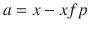

(4-1)


(4-2)

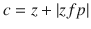

(4-3)

因为，在方程 [4-3](#Equ3) 中 zfp 是负的(它位于 x，y 平面的前面)，你使用它的绝对值|zfp|因为它加到 z 上给出焦点和物点之间的总 z 方向距离。当然，你可以将方程 [4-3](#Equ3) 写成 c=z-zfp，这是等价的，但是绝对值|zfp|的使用使得下面的分析更容易理解。同样，如果你忘记并为 zfp 输入一个正的 z 值也没关系。


【4-4】

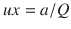

【4-5】


【4-6】


【4-7】


【4-8】


【4-9】

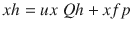

【4-10】

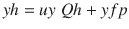

【4-11】

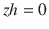

您可以通过以下方式显示 zh=0(即命中点位于 x，y 平面上，正如它应该的那样):

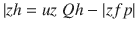

(4-13)


(4-14)


(4-15)

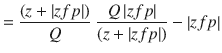

(4-16)

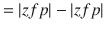

(4-17)


(4-18)

等式 [4-13](#Equ13) 中的负号是因为|zfp|总是正的，而你知道焦点总是在-z 位置。

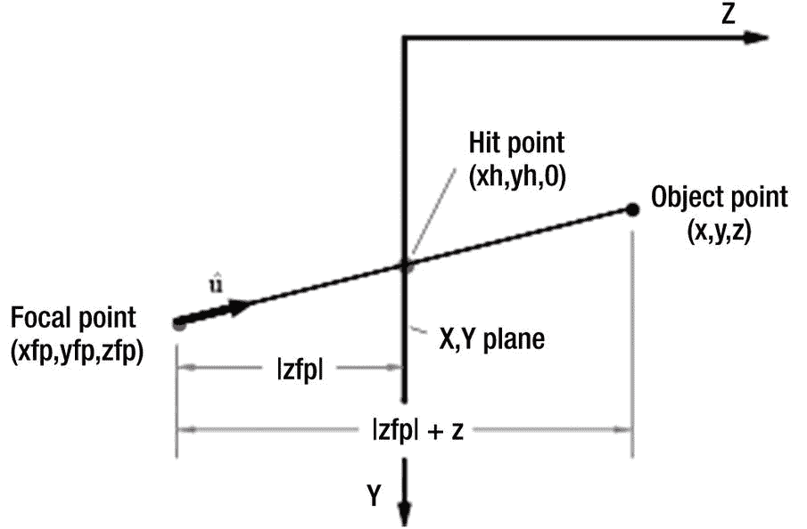

图 4-4

Perspective image projection geometry side view


图 4-3

Perspective image projection geometry

清单 [4-1](#Par12) 展示了上述模型的使用。它使您能够构建一个对象，旋转它，然后以透视的方式查看它。第 14-29 行定义了对象，在这个例子中是一所房子。第 14-16 行建立了局部坐标中的角坐标 x，y，z；也就是说，相对于在第 18-20 行中设置的点 xc，yc，zc。这是房子的中心，也是旋转的中心。第 22-29 行通过向第 22-24 行中的空列表集合添加元素，将 x，y，z 转换为全局坐标 xg，yg，zg。第 31-47 行通过用线连接角点来绘制房子。

第 50-63 行定义了一个关于 xc，yc，zc 旋转本地坐标的函数，将结果保存为 xg，yg，zg。它使用函数 roty，该函数在第 54-63 行中定义。这个函数在以前的程序中使用过。它是这个程序中唯一的旋转函数，也就是说你只能绕着 y 方向旋转。接下来是视角转换视角(xfp，yfp，zfp)；它实现了上面开发的等式 [4-1](#Equ1) 到 [4-12](#Equ12) 。从第 67 行开始的循环计算从对象的每个角点到焦点的光线的击中点的坐标。用全局坐标表示的命中点保存在第 79-81 行。

程序的控制发生在第 83-95 行。第 83-85 行定义了焦点的位置；第 87-89 行房子的中心点。第 91 行的 Ry 指定了围绕 y 方向的旋转角度。第 93 行然后调用函数 plothouse(xc，yc，zc，Ry)，它旋转房子。第 94 行调用 perspective(xfp，yfp，zfp)，它执行透视转换。第 95 行绘制了房子。这可以包含在 function 透视图中，但是放在这里是为了说明操作的顺序。

```py
1   """
2   PERSPECTIVE
3   """
4
5   import matplotlib.pyplot as plt
6   import numpy as np
7   from math import sin, cos, radians
8
9   plt.axis([0,150,100,0])
10
11  plt.axis('on')
12  plt.grid(True)
13
14  x=[-20,-20,20,20,-20,-20,20,20,-20,20] #——–object local corner coordinates
15  y=[-10,-10,-10,-10,10,10,10,10,-20,-20]
16  z=[5,-5,-5,5,5,-5,-5,5,0,0]
17
18  xc=30 #———————————————object center coordinates
19  yc=50
20  zc=10
21
22  xg=[ ] #———————————————object global coordinates
23  yg=[ ]
24  zg=[ ]
25
26  for i in np.arange(len(x)):
27        xg.append(x[i]+xc)
28        yg.append(y[i]+yc)
29        zg.append(z[i]+zc)
30
31  #————————————–plot object
32  def plothouse(xg,yg,zg):
33       plt.plot([xg[0],xg[3]],[yg[0],yg[3]],color='k')
34       plt.plot([xg[1],xg[2]],[yg[1],yg[2]],color='k')
35       plt.plot([xg[4],xg[7]],[yg[4],yg[7]],color='k')
36       plt.plot([xg[5],xg[6]],[yg[5],yg[6]],color='k')
37       plt.plot([xg[8],xg[9]],[yg[8],yg[9]],color='k')
38       plt.plot([xg[4],xg[0]],[yg[4],yg[0]],color='k')
39       plt.plot([xg[5],xg[1]],[yg[5],yg[1]],color='k')
40       plt.plot([xg[6],xg[2]],[yg[6],yg[2]],color='r')
41       plt.plot([xg[7],xg[3]],[yg[7],yg[3]],color='r')
42       plt.plot([xg[0],xg[8]],[yg[0],yg[8]],color='k')
43       plt.plot([xg[1],xg[8]],[yg[1],yg[8]],color='k')
44       plt.plot([xg[2],xg[9]],[yg[2],yg[9]],color='r')
45       plt.plot([xg[3],xg[9]],[yg[3],yg[9]],color='r')
46       plt.plot([xg[4],xg[5]],[yg[4],yg[5]],color='k')
47       plt.plot([xg[6],xg[7]],[yg[6],yg[7]],color='r')
48
49  #——————————————rotate object about the Y direction
40  def plothousey(xc,yc,zc,Ry):
51       for i in range(len(x)): #—————rotate 10 corners
52             [xg[i],yg[i],zg[i]]=roty(xc,yc,zc,x[i],y[i],z[i],Ry)
53
54  def roty(xc,yc,zc,x,y,z,Ry):
55       a=[x,y,z]
56       b=[cos(Ry),0,sin(Ry)]
57       xpp=np.inner(a,b)
58       b=[0,1,0]
59       ypp=np.inner(a,b)
60       b=[-sin(Ry),0,cos(Ry)]
61       zpp=np.inner(a,b)
62       [xg,yg,zg]=[xpp+xc,ypp+yc,zpp+zc]
63       return [xg,yg,zg]
64
65  #—————————————————————————————————————perspective transformation
66  def perspective(xfp,yfp,zfp):
67       for i in range(len(x)):
68             a=xg[i]-xfp
69             b=yg[i]-yfp
70             c=zg[i]+abs(zfp)
71             q=np.sqrt(a*a+b*b+c*c)
72             ux=a/q
73             uy=b/q
74             uz=c/q
75             qh=q*abs(zfp)/(zg[i]+abs(zfp))
76             xh=ux*qh+xfp
77             yh=uy*qh+yfp
78             zh=0
79             xg[i]=xh
80             yg[i]=yh
81             zg[i]=zh
82
83  xfp=80 #—————————————————————————focal point coordinates
84  yfp=50
85  zfp=-100
86
87  xc=80 #——————————————redefine center coordinates
88  yc=50
89  zc=50
90
91  Ry=radians(45)  #—————————————————————angle of rotation
92
93  plothousey(xc,yc,zc,Ry)               #—-rotate
94  perspective(xfp,yfp,zfp)              #—-transform
95  plothouse(xg,yg,zg)                   #—-rotate
96
97  plt.show()
Listing 4-1Program PERSPECTIVE

```

图 [4-5](#Fig5) 至 [4-8](#Fig8) 显示了列表 [4-1](#Par12) 的输出。图 [4-5](#Fig5) 显示了未旋转(Ry = 0°)方向的房屋。右边是红色的。焦点在 xc=80，yc=50，-100。这与房子的中心成一直线，但是在 x，y 平面的前面 100 度。图 [4-6](#Fig6) 显示房屋绕 y 方向旋转 45 度。透视效果很明显。图 [4-7](#Fig7) 显示了具有相同设置的房屋，但是焦点从 zfp=-100 移回到 zfp=-600。你可以看到图像是如何变平的，透视效果大部分丢失。图 [4-8](#Fig8) 显示了一些随机设置的房屋。按照清单 [4-1](#Par12) 中的步骤，你应该能够很容易地创建一个更复杂的场景。


图 4-8

Perspective image with Ry=-60, zfp=-100, xc=40, yc=70, xfp=100, zfp=-80


图 4-7

Perspective image with Ry=45, zfp=-600

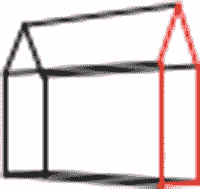

图 4-6

Perspective image with Ry=45, zfp=-100


图 4-5

Perspective image with Ry=0, zfp=-100

问题是，焦点放在哪里。如果你把图像投影到 x，y 平面上，显然它应该在那个平面的前面(即-z 方向)。但是焦点的 x，y 坐标呢？最好的结果，最像人眼看到的，是把它放在与房子中心相同的 x，y 坐标上。当然，如果模型中有很多物体，比如更多的房屋和树木，那么在哪里放置焦点就不明显了。将它放置在 x，y 平面的前面，在对应于模型近似中心的坐标处，将获得最佳结果。这类似于将相机对准要拍摄的场景的中心。画家维米尔在他的许多画作中选择了这种结构。事实上，在他的一些画布上，艺术史学家在消失点发现了一个钉孔，所有平行线如房间角落和地砖都在这里交汇。钉孔大约在场景的中心。人们相信他在钉子上绑了一根线，用它来追踪聚合线，就像你在算法中使用线一样。你可以在弗米尔的许多室内画中看到这种结构。

## 4.1 总结

在本章中，您学习了如何构建透视图。几何体基于简单的盒式摄像机。你把透视图像投影到 x，y 平面上。你可以使用任何其他坐标平面，例如 x，z 平面；几何形状是相似的。你探讨了焦点放在哪里的问题，焦点对应于观察者或相机的观察点。答案是，除非你在寻找一个不寻常的图像，在模型的大致中心。这是弗米尔在他的许多画中使用的结构。