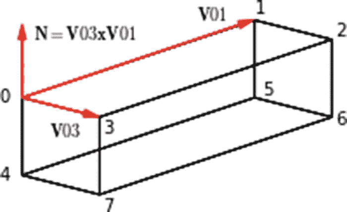
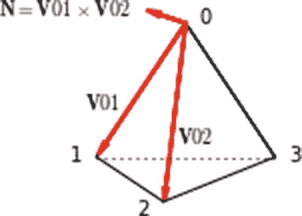
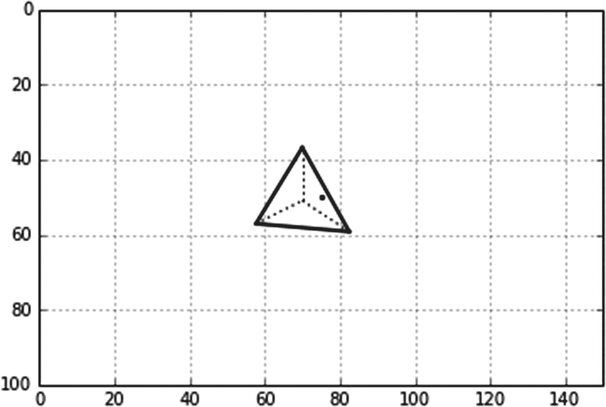
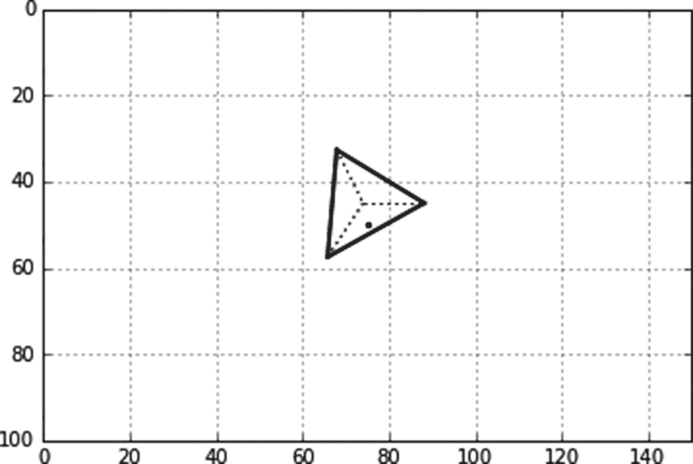
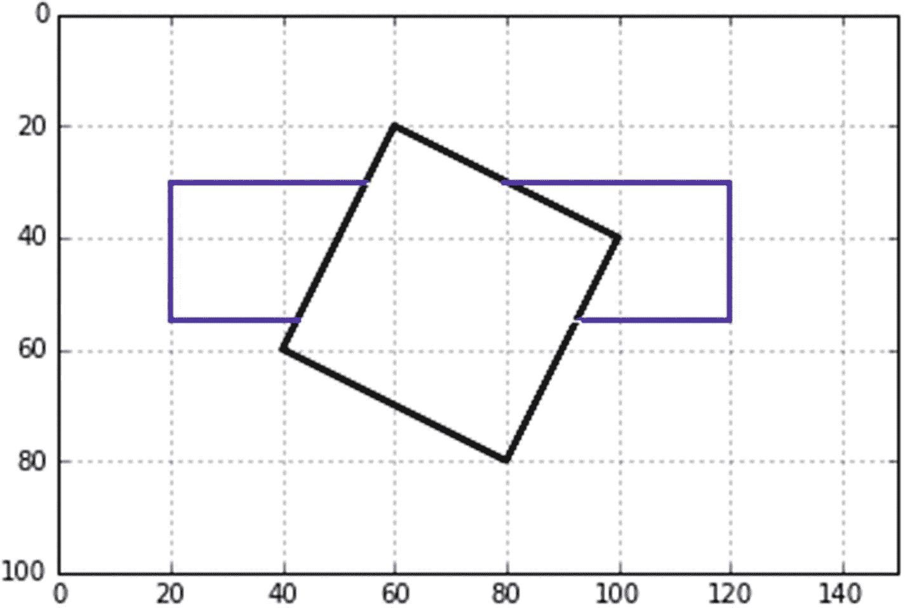
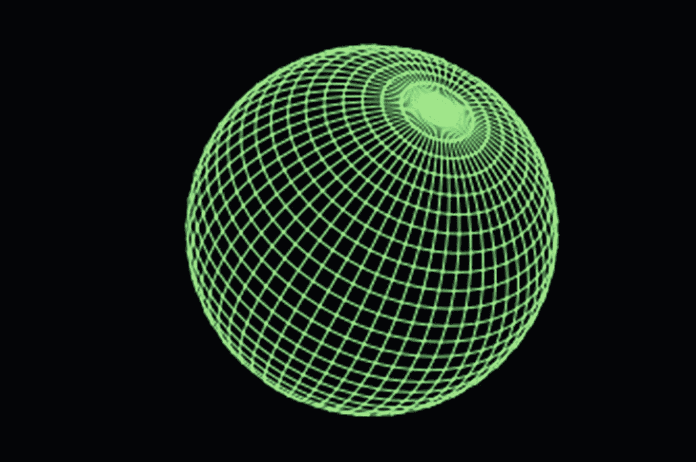

# 6.隐藏线移除

前几章中使用的大多数模型本质上都是由点和线构成的简笔画。当在三维空间中观察这种物体时，可以看到背面的线条，就好像物体是透明的一样。这一章是关于从物体上去除通常隐藏的线条，使它们看起来是实心的。

本章将涵盖两种情况。第一种称为对象内隐藏线去除。这是指从单个对象中删除隐藏线。我们假设大多数物体都是由平面构成的；这些示例包括长方体、棱锥体和由平面近似的球面。您将使用的技术依赖于确定特定平面是面向观察者(在这种情况下，它是可见的并被打印)还是远离观察者(在这种情况下，它是不可见的且不被打印)。

另一方面，对象间隐藏线去除指的是多于一个对象的系统，例如两个平面，一个在另一个后面。这里的一般方法是使用一些在前一章中开发的光线追踪技术来寻找线和表面之间的交点。首先，使用点或短线段绘制背面对象。在每一点上，你构建一条朝向观察者的线(光线),观察者在-z 方向，并观察它是否与前面的物体相交。如果是，则隐藏背面对象上的该点，并且不打印。

## 6.1 方框

作为对象内隐藏线去除的一个例子，让我们从一个简单的盒子开始，如图 [6-1](#Fig1) 和 [6-2](#Fig2) 所示。他们是通过列举 [6-1](#Par11) 得出的。图 [6-3](#Fig3) 、 [6-4](#Fig4) 和 [6-5](#Fig5) 显示了程序使用的模型。

在图 [6-3](#Fig3) 中，你看到盒子有八个角，编号为 0 到 7。在角 0 处，有两个向量:从角 0 到 1 的 V01 和从 0 到 3 的 V03。首先查看 0，1，2，3 面，当旋转盒子时，策略是确定它是朝向还是远离-z 方向上的观察者倾斜。如果它面向观察者，则绘制该面的边。如果它背对着观察者，则不会绘制它们。如何确定人脸是否正对观察者？叉(向量)积 V03×V01 给出一个向量 N，垂直于 0，1，2，3 面，所以


【6-1】


(6-2)

![$$ V03x=x\left[3\right]-x\left[0\right] $$](A456962_1_En_6_Chapter_Equ3.gif)

【6-3】

![$$ V03y=y\left[3\right]-y\left[0\right] $$](A456962_1_En_6_Chapter_Equ4.gif)

【6-4】

![$$ V03z=z\left[3\right]-z\left[0\right] $$](A456962_1_En_6_Chapter_Equ5.gif)

【6-5】

![$$ V01x=x\left[1\right]-x\left[0\right] $$](A456962_1_En_6_Chapter_Equ6.gif)

(6-6)

![$$ V01y=y\left[1\right]-y\left[0\right] $$](A456962_1_En_6_Chapter_Equ7.gif)

您可以通过 Nz，N 的 z 分量的值来确定平面是面向还是背离观察者。图 [6-4](#Fig4) 和 [6-5](#Fig5) 显示了相对于观察者的平面(蓝色)。这是图 [6-3](#Fig3) 中所示盒子的一个面的侧视图。观察者位于坐标系的右侧，朝+z 方向看。参考图 [6-4](#Fig4) ，如果方程 [6-11](#Equ11) 中 N，Nz 的 z 分量为< 0(即指向-z 方向)，则平面面向观察者，观察者可见，并标绘。如果 Nz 为正(即指向+z 方向)，如图 [6-5](#Fig5) 所示，该面倾斜远离观察者，在这种情况下，观察者看不到该面，也不会绘制该面。注意，你可以使用全矢量 V，而不是单位矢量，因为你只关心 V 的符号。

其他的脸呢？4，5，6，7 面平行于 0，1，2，3 面，因此其指向外的法向量与 0，1，2，3 面的法向量相反。您可以进行类似的检查，确定其法向量是指向+z(不绘制)还是=z(绘制)方向。

其余的面以类似的方式处理。1，2，6，5 的法线与 0，3，7，4 的法线相反；3，2，6，7 的法线与 0，1，5，4 的法线相反。


图 6-1

Box with hidden lines removed: Rx=45°, Ry=45°, Rz=30° (produced by Listing [6-1](#Par11))

列表 [6-1](#Par11) 产生数字 [6-1](#Fig1) 和 [6-2](#Fig2) 。第 9、10 和 11 行中的列表定义了未旋转的盒子相对于其中心的坐标，该坐标在第 124-126 行中设置。第 13-15 行用零填充全局坐标列表。这些列表与列表 x 的长度相同(也列出了 y 和 z ),由 len(x)函数设置。

第 124-140 行像前面的程序一样接受键盘输入。作为操作序列的一个例子，假设您在第 129 行输入 x，后跟一个角度(度)。第 132 行调用从第 102 行开始的函数 plotboxx。第 103-105 行旋转角点并更新局部和全局坐标列表。第 107 行调用从第 40 行开始的函数 plotbox。该函数使用列表 xg、yg 和 zg 绘制新旋转方向的长方体。从 0，1，2，3 面开始，第 41-47 行使用上述分析计算 Nz，即第 47 行中法向量 N 的 z 分量。如果 Nz <=0, the 0,1,2,3 face is plotted in lines 49-52\. If it is not visible (i.e. Nz> 0)，那么你知道对面的面 4，5，6，7 一定是可见的，并且它被绘制在第 54-57 行中。其他面以类似的方式处理。


图 6-5

Model for hidden line removal of a box used by Listing [6-1](#Par11)


图 6-4

Model for hidden line removal of a box used by Listing [6-1](#Par11)



图 6-3

Model for hidden line removal of a box used by Listing [6-1](#Par11). N not to scale.


图 6-2

Box with hidden lines removed: Rx=30°, Ry=-60°, Rz=30° (produced by Listing [6-1](#Par11))

```py
1   """
2   HLBOX
3   """
4
5   import numpy as np
6   import matplotlib.pyplot as plt
7   from math import sin, cos, radians
8   #————————————————————define  lists
9   x=[-20,20,20,-20,-20,20,20,-20]
10  y=[-10,-10,-10,-10,10,10,10,10]
11  z=[5,5,-5,-5,5,5,-5,-5]
12
13  xg=[0]*len(x) #—fill xg,yg,zg lists with len(x) zeros
14  yg=[0]*len(x)
15  zg=[0]*len(x)
16
17  #===================================================rotation functions
18  def rotx(xc,yc,zc,xp,yp,zp,Rx):
19       xpp=xp
20       ypp=yp*cos(Rx)-zp*sin(Rx)
21       zpp=yp*sin(Rx)+zp*cos(Rx)
22       [xg,yg,zg]=[xpp+xc,ypp+yc,zpp+zc]
23       return[xg,yg,zg]
24
25  def  roty(xc,yc,zc,xp,yp,zp,Ry):
26       xpp=xp*cos(Ry)+zp*sin(Ry)
27       ypp=yp
28       zpp=-xp*sin(Ry)+zp*cos(Ry)
29       [xg,yg,zg]=[xpp+xc,ypp+yc,zpp+zc]
30       return[xg,yg,zg]
31
32  def rotz(xc,yc,zc,xp,yp,zp,Rz):
33       xpp=xp*cos(Rz)-yp*sin(Rz)
34       ypp=xp*sin(Rz)+yp*cos(Rz)
35       zpp=zp
36       [xg,yg,zg]=[xpp+xc,ypp+yc,zpp+zc]
37       return[xg,yg,zg]
38
39  #================================================box plotting function
40  def plotbox(xg,yg,zg):
41       v01x=x[1]-x[0] #———0,1,2,3 face
42       v01y=y[1]-y[0]
43       v01z=z[1]-z[0]
44       v03x=x[3]-x[0]
45       v03y=y[3]-y[0]
46       v03z=z[3]-z[0]
47       nz=v03x*v01y-v03y*v01x
48       if nz<=0 :
49            plt.plot([xg[0],xg[1]],[yg[0],yg[1]],color='k',linewidth=2)
50            plt.plot([xg[1],xg[2]],[yg[1],yg[2]],color='k',linewidth=2)
51            plt.plot([xg[2],xg[3]],[yg[2],yg[3]],color='k',linewidth=2)
52            plt.plot([xg[3],xg[0]],[yg[3],yg[0]],color='k',linewidth=2)
53       else: #—-plot the other side
54            plt.plot([xg[4],xg[5]],[yg[4],yg[5]],color='k',linewidth=2)
55            plt.plot([xg[5],xg[6]],[yg[5],yg[6]],color='k',linewidth=2)
56            plt.plot([xg[6],xg[7]],[yg[6],yg[7]],color='k',linewidth=2)
57            plt.plot([xg[7],xg[4]],[yg[7],yg[4]],color='k',linewidth=2)
58
59       v04x=x[4]-x[0] #———0,3,7,4 face
60       v04y=y[4]-y[0]
61       v04z=z[4]-z[0]
62       v03x=x[3]-x[0]
63       v03y=y[3]-y[0]
64       v03z=z[3]-z[0]
65       nz=v04x*v03y-v04y*v03x
66       if nz<=0 :
67            plt.plot([xg[0],xg[3]],[yg[0],yg[3]],color='k',linewidth=2)
68            plt.plot([xg[3],xg[7]],[yg[3],yg[7]],color='k',linewidth=2)
69            plt.plot([xg[7],xg[4]],[yg[7],yg[4]],color='k',linewidth=2)
70            plt.plot([xg[4],xg[0]],[yg[4],yg[0]],color='k',linewidth=2)
71       else: #———plot the other side
72            plt.plot([xg[1],xg[2]],[yg[1],yg[2]],color='k',linewidth=2)
73            plt.plot([xg[2],xg[6]],[yg[2],yg[6]],color='k',linewidth=2)
74            plt.plot([xg[6],xg[5]],[yg[6],yg[5]],color='k',linewidth=2)
75            plt.plot([xg[5],xg[1]],[yg[5],yg[1]],color='k',linewidth=2)
76
77       v01x=x[1]-x[0] #—0,1,5,4 face
78       v01y=y[1]-y[0]
79       v01z=z[1]-z[0]
80       v04x=x[4]-x[0]
81       v04y=y[4]-y[0]
82       v04z=z[4]-z[0]
83       nz=v01x*v04y-v01y*v04x
84       if nz<=0 :
85            plt.plot([xg[0],xg[1]],[yg[0],yg[1]],color='k',linewidth=2)
86            plt.plot([xg[1],xg[5]],[yg[1],yg[5]],color='k',linewidth=2)
87            plt.plot([xg[5],xg[4]],[yg[5],yg[4]],color='k',linewidth=2)
88            plt.plot([xg[4],xg[0]],[yg[4],yg[0]],color='k',linewidth=2)
89       else: #———plot the other side
90            plt.plot([xg[3],xg[2]],[yg[3],yg[2]],color='k',linewidth=2)
91            plt.plot([xg[2],xg[6]],[yg[2],yg[6]],color='k',linewidth=2)
92            plt.plot([xg[6],xg[7]],[yg[6],yg[7]],color='k',linewidth=2)
93            plt.plot([xg[7],xg[3]],[yg[7],yg[3]],color='k',linewidth=2)
94
95       plt.scatter(xc,yc,s=5,color='k') #–plot a dot at the center
96       plt.axis([0,150,100,0]) #–replot axes and grid
97       plt.axis('on')
98       plt.grid(True)
99       plt.show() #–plot latest rotation
100
101 #==============================transform coordinates and plot functions
102 def plotboxx(xc,yc,zc,Rx): #——————transform & plot Rx box
103     for i in range(len(x)):
104           [xg[i],yg[i],zg[i]]=rotx(xc,yc,zc,x[i],y[i],z[i],Rx)
105           [x[i],y[i],z[i]]=[xg[i]-xc,yg[i]-yc,zg[i]-zc]  
106
107     plotbox(xg,yg,zg) #—————plot
108
109 def plotboxy(xc,yc,zc,Ry):
110      for i in range(len(x)): #——————transform & plot Ry box
111           [xg[i],yg[i],zg[i]]=roty(xc,yc,zc,x[i],y[i],z[i],Ry)
112           [x[i],y[i],z[i]]=[xg[i]-xc,yg[i]-yc,zg[i]-zc]
113
114     plotbox(xg,yg,zg)
115
116 def plotboxz(xc,yc,zc,Rz):
117      for i in range(len(x)): #——————transform  &  plot  Rz  box
118           [xg[i],yg[i],zg[i]]=rotz(xc,yc,zc,x[i],y[i],z[i],Rz)
119           [x[i],y[i],z[i]]=[xg[i]-xc,yg[i]-yc,zg[i]-zc]
120
121      plotbox(xg,yg,zg)
122
123 #——————————————————————plot  box
124 xc=75 #–center coordinates
125 yc=50
126 zc=50
127
128 while True:
129      axis=input('x, y or z?: ') #———input axis of rotation (lower case)
130      if axis == 'x': #–if x axis
131             Rx=radians(float(input('Rx Degrees?: '))) #———input degrees of rotation
132             plotboxx(xc,yc,zc,Rx) #———call function plotboxx
133      if axis == 'y':
134             Ry=radians(float(input('Ry Degrees?: '))) #———input degrees of rotation
135             plotboxy(xc,yc,zc,Ry)
136      if axis == 'z':
137             Rz=radians(float(input('Rz Degrees?: '))) #———input degrees
138             plotboxz(xc,yc,zc,Rz)
139      if axis == ":
104           break
Listing 6-1Program HLBOX

```

## 6.2 金字塔

清单 [6-2](#Par13) 用于绘制图形 [6-6](#Fig6) 和 [6-7](#Fig7) 。所用型号如图 [6-8](#Fig8) 所示。该分析类似于上一节中用于盒子的分析。不同之处在于，有四个面要处理，而且没有一个面是平行的，就像盒子一样，因此您必须独立处理每个面，以查看它是面向还是背离观察者。隐藏线在程序行 54-56、67-69 和 77-79 中被绘制为点。要删除这些点，请将这些行中的“:”替换为“”。清单 [6-2](#Par13) 中的代码应该是不言自明的。



图 6-8

Model for Listing [6-2](#Par13). N not to scale.



图 6-7

Pyramid with hidden lines removed: Rx=30<sup>°</sup>, Ry=45<sup>°</sup>, Rz=-90<sup>°</sup> (produced by Listing [6-2](#Par13))



图 6-6

Pyramid with hidden lines removed: Rx=30<sup>°</sup>, Ry=45<sup>°</sup>, Rz=0<sup>°</sup> (produced by Listing [6-2](#Par13))

```py
1   """
2   HLPYRAMID
3   """
4
5   import numpy as np
6   import matplotlib.pyplot as plt
7   from math import sin, cos, radians
8   #————————————————————define lists
9   x=[0,-10,0,10]
10  y=[-20,0,0,0]
11  z=[0,10,-15,10]
12
13  xg=[0]*len(x)
14  yg=[0]*len(x)
15  zg=[0]*len(x)
16
17  #============================================define rotation function
18  def rotx(xc,yc,zc,xp,yp,zp,Rx):
19       xpp=xp
20       ypp=yp*cos(Rx)-zp*sin(Rx)
21       zpp=yp*sin(Rx)+zp*cos(Rx)
22       [xg,yg,zg]=[xpp+xc,ypp+yc,zpp+zc]
23       return[xg,yg,zg]
24
25  def roty(xc,yc,zc,xp,yp,zp,Ry):
26       xpp=xp*cos(Ry)+zp*sin(Ry)
27       ypp=yp
28       zpp=-xp*sin(Ry)+zp*cos(Ry)
29       [xg,yg,zg]=[xpp+xc,ypp+yc,zpp+zc]
30       return[xg,yg,zg]
31
32  def rotz(xc,yc,zc,xp,yp,zp,Rz):
33       xpp=xp*cos(Rz)-yp*sin(Rz)
34       ypp=xp*sin(Rz)+yp*cos(Rz)
35       zpp=zp
36       [xg,yg,zg]=[xpp+xc,ypp+yc,zpp+zc]
37       return[xg,yg,zg]
38
39  #======================================define pyramid plotting function
40
41  def plotpyramid(xg,yg,zg):
42       v01x=x[1]-x[0] #———0,1,2 face
43       v01y=y[1]-y[0]
44       v01z=z[1]-z[0]
45       v02x=x[2]-x[0]
46       v02y=y[2]-y[0]
47       v02z=z[2]-z[0]
48       nz=v01x*v02y-v01y*v02x
49       if nz<=0 :
50            plt.plot([xg[0],xg[1]],[yg[0],yg[1]],color='k',linewidth=2)
51            plt.plot([xg[1],xg[2]],[yg[1],yg[2]],color='k',linewidth=2)
52            plt.plot([xg[2],xg[0]],[yg[2],yg[0]],color='k',linewidth=2)
53       else:
54            plt.plot([xg[0],xg[1]],[yg[0],yg[1]],color='k',linestyle=':')
55            plt.plot([xg[1],xg[2]],[yg[1],yg[2]],color='k',linestyle=':')
56            plt.plot([xg[2],xg[0]],[yg[2],yg[0]],color='k',linestyle=':')
57
58       v03x=x[3]-x[0] #—0,2,3 face
59       v03y=y[3]-y[0]
60       v03z=z[3]-z[0]
61       nz=v02x*v03y-v02y*v03x
62       if nz<=0 :
63            plt.plot([xg[0],xg[2]],[yg[0],yg[2]],color='k',linewidth=2)
64            plt.plot([xg[0],xg[3]],[yg[0],yg[3]],color='k',linewidth=2)
65            plt.plot([xg[2],xg[3]],[yg[2],yg[3]],color='k',linewidth=2)
66       else:
67            plt.plot([xg[0],xg[2]],[yg[0],yg[2]],color='k',linestyle=':')
68            plt.plot([xg[0],xg[3]],[yg[0],yg[3]],color='k',linestyle=':')
69            plt.plot([xg[2],xg[3]],[yg[2],yg[3]],color='k',linestyle=':')
70
71       nz=v03x*v01y-v03y*v01x #—0,2,3 face
72       if nz<=0 :
73            plt.plot([xg[0],xg[1]],[yg[0],yg[1]],color='k',linewidth=2)
74            plt.plot([xg[0],xg[3]],[yg[0],yg[3]],color='k',linewidth=2)
75            plt.plot([xg[1],xg[3]],[yg[1],yg[3]],color='k',linewidth=2)
76       else:
77            plt.plot([xg[0],xg[1]],[yg[0],yg[1]],color='k',linestyle=':')
78            plt.plot([xg[0],xg[3]],[yg[0],yg[3]],color='k',linestyle=':')
79            plt.plot([xg[1],xg[3]],[yg[1],yg[3]],color='k',linestyle=':')
80
81       v21x=x[1]-x[2] #———1,2,3 face
82       v21y=y[1]-y[2]
83       v21z=z[1]-z[2]
84       v23x=x[3]-x[2]
85       v23y=y[3]-y[2]
86       v23z=z[3]-z[2]
87       nz=v21x*v23y-v21y*v23x
88       if nz¡0:
89            plt.plot([x[2],x[1]],[y[2],y[1]])
90            plt.plot([x[1],x[3]],[y[1],y[3]])
91            plt.plot([x[3],x[2]],[y[3],y[2]])
92
93       plt.scatter(xc,yc,s=5,color='k') #———plot a dot at the center
94       plt.axis([0,150,100,0]) #———replot axes and grid
95       plt.axis('on')
96       plt.grid(True)
97       plt.show() #–plot latest rotation
98
99  #========================transform coordinates and plotting fucntions
100 def plotpyramidx(xc,yc,zc,Rx): #——————transform & plot Rx pyramid
101      for i in range(len(x)):
102            [xg[i],yg[i],zg[i]]=rotx(xc,yc,zc,x[i],y[i],z[i],Rx) 
103            [x[i],y[i],z[i]]=[xg[i]-xc,yg[i]-yc,zg[i]-zc]
104
105      plotpyramid(xg,yg,zg) #—————plot
106
107 def plotpyramidy(xc,yc,zc,Ry):
108      for i in range(len(x)): #——————transform & plot Ry pyramid
109            [xg[i],yg[i],zg[i]]=roty(xc,yc,zc,x[i],y[i],z[i],Ry)
110            [x[i],y[i],z[i]]=[xg[i]-xc,yg[i]-yc,zg[i]-zc]
111
112      plotpyramid(xg,yg,zg)
113
114 def plotpyramidz(xc,yc,zc,Rz):
115      for i in range(len(x)): #——————transform & plot Rz pyramid
116            [xg[i],yg[i],zg[i]]=rotz(xc,yc,zc,x[i],y[i],z[i],Rz)
117            [x[i],y[i],z[i]]=[xg[i]-xc,yg[i]-yc,zg[i]-zc]
118
119      plotpyramid(xg,yg,zg)
120
121 #———————————————————plot pyramids
122 xc=75 #——center coordinates
123 yc=50
124 zc=50
125
126 while True:
127      axis=input('x, y or z?: ') #———input axis of rotation (lower case)
128      if axis == 'x': #———if x axis
129            Rx=radians(float(input('Rx Degrees?: '))) #———input degrees of rotation
130            plotpyramidx(xc,yc,zc,Rx) #———call function plotpyramidx
131      if axis == 'y':
132            Ry=radians(float(input('Ry Degrees?: '))) #———input degrees of rotation
133            plotpyramidy(xc,yc,zc,Ry)
134      if axis == 'z':
135            Rz=radians(float(input('Rz Degrees?: '))) #———input degrees of rotation
136            plotpyramidz(xc,yc,zc,Rz)
137      if axis == ":
138            break
Listing 6-2Program HLPYRAMID

```

## 6.3 飞机

接下来是物体间隐藏线去除的例子。图 [6-9](#Fig9) 显示了两个平面(a)和(b)；图 [6-10](#Fig10) 显示相同的两个平面部分重叠。很快您就会看到，平面(b)实际上位于平面(a)的下方，应该被部分遮挡。图 [6-11](#Fig11) 显示了移除了平面(b)的隐藏线的平面。图 [6-12](#Fig12) 为另一示例。图 [6-13](#Fig13) 显示了平面(a)旋转的示例。

在这个简单的模型中，两个平面平行于 x，y 平面，平面(b)位于平面(a)的后面(即在+z 方向的更远处)。您不需要关心平面坐标的 z 分量，因为您不会将它们旋转到平面之外(即，围绕 x 或 y 方向)，尽管您将围绕 z 方向旋转平面(a ),但为此您不需要 z 坐标。

图 [6-14](#Fig14) 为清单 [6-3](#Par23) 使用的型号。飞机(a)是用黑色画的，飞机(b)是用蓝色画的。单位向量和显示在平面(a)的角 0 处。当平面(b)或其一部分在(a)后面且不可见时，您可以使用光线追踪技术来移除隐藏线。从平面(b)的边 0-1 开始，逐行执行此操作。从平面(b)的 0 角开始，想象一条从该点发出的光线传播到一个位于-z 方向的观察者，他正看着 x，y 平面。如果平面(a)不干扰该光线(即不覆盖该点)，则绘制该点。如果平面(a)确实干涉，则不绘制。因此，这个问题变成了一个相交问题:确定来自平面(b)边上一点的射线是否与平面(a)相交。

一次处理一个平面(b)的边缘。从角 0 开始，沿着边 0-1 以小步前进到角 1。向量 H 表示点 H 在边 0-1 上的位置。列表 [6-3](#Par23) 确定该点的位置，以及它是否位于平面(a)之下(即，如果从 h 发出的光线照射到平面(a))。如果没有，则绘制点 p；如果是的话，就不画 p。

在清单 [6-3](#Par23) 中，第 14-18 行在全局坐标中建立了两个平面的坐标，准备绘图。第 21-32 行定义了一个函数 dlinea，它画出了平面(a)的边缘线。它一次处理一条边缘线。dlinea 不会在平面(a)的边上进行隐藏线检查，因为您指定平面(a)位于平面(b)之上。调用参数 x1、x2、y1、y2 是边缘线的起点和终点坐标。第 22 行中的 q 是该行的长度；uxa 和 uya 是沿着从 x1，y1 到 x2，y2 的边缘线指向的单位向量的 x 和 y 分量。第 27-32 行中的循环按照第 27 行中设置的步长 0 . 2，沿着从 x1，y1 到 x2，y2 的线推进该点。第 28 和 29 行中的 hx 和 hy 是沿线 h 点的坐标。hxstart 和 hystart 允许用短线段连接这些点，比点绘制成点更好看。

第 35-38 行通过调用函数 dlinea 用四条边中每条边的开始和结束坐标来绘制平面(a)的边。线 40-42 确定了从平面(a)的角 0 到角 3 的距离 qa03。第 43 和 44 行中的 uxa 和 uya 是单位向量的 x 和 y 分量，单位向量从角 0 指向角 3。类似地，第 46-50 行给出了的分量，一个从角 0 指向 1 的单位向量。他们将被要求进行相交检查，就像上一章中对线/平面相交所做的那样。

函数 dlineb 类似于 dlinea，只是调用参数现在包括 agx[0]和 agy[0]，即平面(a)的角 0 的坐标。此外，该功能包括第 64 行和第 71 行之间的干扰检查。这被标为内部/外部检查。在第 64 行中，a 是点 h 的 x 坐标与平面(a)的角 0 的 x 坐标之间的距离；第 65 行中的 b 是 y 距离。这些基本上是向量 H 的 x 和 y 分量。在第 66 行，H 与单位向量的点(标量)积放弃了。这是 H 在平面(a)的 0-3 侧的投影。类似地，H 与第 67 行中的单位向量的点积给出 vp，即 H 在平面(a)的 0-1 侧的投影。干扰检查很简单，总结在第 68 行。如果第 68 行中的所有问题都为真，则该点在第 69 行中以白色绘制，这意味着它是不可见的。如果第 68 行中的任何问题为假，这意味着该点没有被平面(a)阻挡，则第 71 行将其标为黑色。

你可能会问，为什么要用这种精心制作的向量分析？为什么不如图 [6-14](#Fig14) 所示，对照平面(a)的水平和垂直边界检查每个点的 x 和 y 坐标？如果两个平面都保持与 x 和 y 轴对齐，您可以这样做，如图所示。但是通过使用矢量方法，你可以使任一平面绕 z 方向旋转，如图 [6-13](#Fig13) 所示。

我通过指定平面(b)位于(a)之下来简化这个模型。一般来说，你可能不知道哪个平面离观察者更近，哪个应该是(a)，哪个应该是(b)。这可以通过简单检查 z 坐标来完成。原则上，隐藏线删除过程与您在这里所做的类似，尽管编程在试图跟踪大量对象时会变得复杂。


图 6-14

Model for Listing [6-3](#Par23)



图 6-13

Two planes, one at an angle and overlapping the other, hidden lines removed by Listing [6-3](#Par23)


图 6-12

Two planes, one overlapping the other, hidden lines removed by Listing [6-3](#Par23)


图 6-11

Two planes overlapping, hidden lines removed by Listing [6-3](#Par23)


图 6-10

Two planes, one partially overlapping the other, hidden lines not removed. Plane (b) is beneath (a).


图 6-9

Two planes

```py
1   """
2   HLPLANES
3   """
4
5   import numpy as np
6   import matplotlib.pyplot as plt
7   from math import sqrt, sin, cos, radians
8
9   plt.axis([0,150,100,0])
10  plt.axis('off')
11  plt.grid(False)
12
13  #———————————————————-define lists
14  axg=[40,80,80,40]
15  ayg=[20,20,60,60]
16
17  bxg=[20,120,120,20]
18  byg=[30,30,55,55]
19
20  #================================================define function dlinea
21  def dlinea(x1,x2,y1,y2):
22       q=sqrt((x2-x1)**2+(y2-y1)**2)
23       uxa=(x2-x1)/q
24       uya=(y2-y1)/q
25       hxstart=x1
26       hystart=y1
27       for l in np.arange(0,q,.2):
28              hx=x1+l*uxa #———global hit coordinates along the line
29              hy=y1+l*uya
30              plt.plot([hxstart,hx],[hystart,hy],color='k')
31              hxstart=hx
32              hystart=hy
33
34  #—————————————————————plane (a)
35  dlinea(axg[0],axg[1],ayg[0],ayg[1]) #———plot plane (a)
36  dlinea(axg[1],axg[2],ayg[1],ayg[2])
37  dlinea(axg[2],axg[3],ayg[2],ayg[3])
38  dlinea(axg[3],axg[0],ayg[3],ayg[0])
39
40  a=axg[3]-axg[0] #———unit vector u plane (a)
41  b=ayg[3]-ayg[0]
42  qa03=sqrt(a*a+b*b)
43  uxa=a/qa03
44  uya=b/qa03
45
46  a=axg[1]-axg[0] #———unit vector v plane (a)
47  b=ayg[1]-ayg[0]
48  qa01=sqrt(a*a+b*b)
49  vxa=a/qa01
50  vya=b/qa01
51
52  #=============================================================lineb( )
53  def dlineb(x1,x2,y1,y2,ax0,ay0):
54       a=x2-x1 #———unit vector line
55       b=y2-y1
56       ql=sqrt(a*a+b*b)
57       uxl=a/ql
58       uyl=b/ql
59       hxglast=x1
60       hyglast=y1
61       for l in np.arange(0,ql,.5):
62             hxg=x1+l*uxl
63             hyg=y1+l*uyl
64             a=hxg-ax0 #———inside/outside check
65             b=hyg-ay0
66             up=a*uxa+b*uya
67             vp=a*vxa+b*vya
68             if 0<up<qa03 and 0<vp<qa01: #———is it inside (a)?
79                  plt.plot([hxglast,hxg],[hyglast,hyg],color=’white’)
70             else:
71                  plt.plot([hxglast,hxg],[hyglast,hyg],color=’k’)
72       hxglast=hxg
73       hyglast=hyg
74
75  #———————————————————plot plane (b)
76  dlineb(bxg[0],bxg[1],byg[0],byg[1],axg[0],ayg[0])
77  dlineb(bxg[1],bxg[2],byg[1],byg[2],axg[0],ayg[0])
78  dlineb(bxg[2],bxg[3],byg[2],byg[3],axg[0],ayg[0])
79  dlineb(bxg[3],bxg[0],byg[3],byg[0],axg[0],ayg[0])
80
81  plt.show()
Listing 6-3Program HLPLANES

```

## 6.4 球体

在第 [5](05.html) 章，你画了一个球体，但没有旋转它。背面的线条与正面的重叠，因此不可见，所以删除隐藏的线条不是问题。在本章中，您将绘制一个球体并旋转它，同时移除背面的隐藏线。

图 [6-15](#Fig15) 和 [6-18](#Fig18) 显示了清单 [6-4](#Par35) 的输出示例，它绘制了一个删除了隐藏线的球体。图 [6-15](#Fig15) 和 [6-16](#Fig16) 中的垂直线为纵向，以绿色绘制；水平纬度用蓝色标出。这个程序使用了一个隐藏线移除方案，就像你之前使用的盒子和金字塔一样。如果垂直于一个点的向量的 z 分量是正的(即指向远离位于-z 方向的观察者)，则不绘制该点；否则就画了。

在清单 [6-4](#Par35) 中，第 14 行将列表 g[]的长度设置为 3。这将用于从 rotx、roty 和 rotz 旋转函数中返回全局坐标 xg、yg 和 zg，这些函数在第 24-40 行中定义(它们与前面程序中使用的函数相同)。经度绘制在 55-79 行。该型号与第 [5](05.html) 章中清单 [5-5](05.html#Par61) 中使用的型号相同。第 55 行和第 79 行之间的算法计算经度上每个点的位置，一次一个，并旋转它。即每个点分别建立和旋转；除了 g[ ]列表外，不使用其他列表。从第 55 行开始的α环以第 47-49 行设置的 6 度步长从α= 0°到α= 360°扫描经度。在每一个α步，ϕ环画出一个经度，从-90 度开始，以 6 度为步长到+90 度。第 57-59 行的几何图形取自清单 [5-5](05.html#Par61) 。旋转前一点的坐标(Rx=0，Ry=0，Rz=0)为 xp，yp，zp，如 57-59 行所示。这个点位于球面上的球面坐标α，ϕ.线 60 围绕 x 方向旋转该点一个角度 Rx。这在第 61-63 行产生了新的坐标 xp，yp，zp。第 64 行围绕 y 方向旋转这些新坐标上的点。线 68 使它绕 z 方向旋转。这就产生了点的最终位置。

接下来，您必须确定该点是否在球体的背面，并且从视图中隐藏。如果为真，则不绘制。第 73-79 行执行这个功能。首先，在第 73-75 行中，你建立了连接第一点和第二点的直线的起始坐标。你用线而不是点来连接这些点，因为线看起来更好。第 73 行询问 phi 是否等于 phi1，即 phi 循环中的起始角度。如果是，开始坐标 xpglast 和 ypglast 被设置为等于循环计算的第一个坐标。接下来，在第 76 行，你问 nz，从球体中心到该点的向量的 z 分量，是否小于 0。nz 在第 72 行计算。如果为真，你知道这个点对于位于-z 方向的观察者是可见的；然后，该点通过线 77 连接到前一点。

第 77 行的 plt.plot()函数需要两组坐标:xpglast，ypglast 和 xpg，ypg。在循环的第一个循环中，起始坐标 xpglast，ypglast 设置为等于 xpg，ypg，这意味着第一个点与其自身相连，因此绘制的第一条线的长度为零。之后，在第 78-79 行中设置前一个点的坐标。第 73 行确定它是否是第一个点。如果第 76 行中的 nz 大于零，则该点位于旋转球体的背面，并且不可见，因此不会被绘制。坐标 xpglast 和 ypglast 仍然必须更新，这是在第 78-79 行完成的。纬度的处理方式基本相同，尽管几何图形不同，如清单 [5-5](05.html#Par61) 所述。可以通过改变第 77 行和第 104 行的 color='color '值来改变经度和纬度的颜色。

当运行这个程序时，请记住旋转不是像前面的一些程序那样是累加的。第 51-53 行中指定的旋转角度是球体将终止的角度；它们不会添加到任何以前的旋转中。要将球体旋转到另一个方向，请更改第 51-53 行中的值。

正如在关于连接的讨论中提到的，旋转的顺序很重要。Rx 后跟 Ry 不会给出与 Ry 后跟 Rx 相同的结果。该程序具有函数调用序列 Rx、Ry、Rz，如经度的第 60、64 和 68 行以及纬度的第 87、91 和 95 行所指定的。要更改旋转顺序，请更改这些函数调用的顺序。

图 [6-17](#Fig17) 和 [6-18](#Fig18) 中显示的球体具有黑色背景。为此，在列表 [6-4](#Par35) 中任何其他绘图命令之前插入以下行，例如在第 12 行之后:

```py
#———————————————————paint the background
for y in np.arange(1,100,1):
     plt.plot([0,150],[y,y],linewidth=4,color='k')

```

这将在绘图窗口中绘制从 x=0 到 x=150 以及从 y=1 到 y=100 的黑线。这将使用黑色背景填充该区域。颜色可以改变成任何想要的。为了防止水平线之间出现间隙，线宽被设置为 4。背景必须在构建球体之前绘制，因为您使用的是线段。新线覆盖旧线，因此按照这个顺序，球体线段将覆盖背景线；否则背景线会过度绘制球体。

在图 [6-15](#Fig15) 和 [6-16](#Fig16) 中，程序行 77 和 104 中的球体线宽设置为. 5。这在清晰的背景上给出了良好的结果，但是当背景变为黑色时，线条过于柔和。因此，在插入上面两行代码的同时，清单 [6-4](#Par35) 中的行宽应该改为更大的值，比如 1.0。图 [6-17](#Fig17) 和 [6-18](#Fig18) 所示颜色为“浅绿色”。有些颜色不适合黑色背景，但浅绿色似乎很适合；你只需要尝试。


图 6-18

Rotated sphere with hidden lines removed: Rx=60<sup>°</sup>, Ry=20<sup>°</sup>, Rz=10<sup>°</sup>, black background (produced by Listing [6-4](#Par35))



图 6-17

Rotated sphere with hidden lines removed: Rx=40<sup>°</sup>, Ry=-20<sup>°</sup>, Rz=40<sup>°</sup>, black background (produced by Listing [6-4](#Par35))


图 6-16

Rotated sphere with hidden lines removed: Rx=40<sup>°</sup>, Ry=-20<sup>°</sup>, Rz=40<sup>°</sup> (produced by Listing [6-4](#Par35))


图 6-15

Rotated sphere with hidden lines removed: Rx=55°, Ry=-20°, Rz=-40° (produced by Listing [6-4](#Par35))

```py
1   """
2   HLSPHERE
3   """
4
5   import numpy as np
6   import matplotlib.pyplot as plt
7   from math import sin, cos, radians, sqrt
8
9   plt.axis([0,150,100,0])
10  plt.axis('off')
11  plt.grid(False)
12
13  #———————————————————————lists
14  g=[0]*3
15
16  #—————————————————————parameters
17  xc=80 #———sphere center
18  yc=50
19  zc=0
20
21  rs=40 #———sphere radius
22
23  #=========================================================
24  def rotx(xc,yc,zc,xp,yp,zp,Rx):
25       g[0]=xp+xc
26       g[1]=yp*cos(Rx)-zp*sin(Rx)+yc
27       g[2]=yp*sin(Rx)+zp*cos(Rx)+zc
28       return[g]
29
30  def roty(xc,yc,zc,xp,yp,zp,Ry):
31       g[0]=xp*cos(Ry)+zp*sin(Ry)+xc
32       g[1]=yp+yc
33       g[2]=-xp*sin(Ry)+zp*cos(Ry)+zc
34       return[g]
35
36  def rotz(xc,yc,zc,xp,yp,zp,Rz):
37       g[0]=xp*cos(Rz)-yp*sin(Rz)+xc
38       g[1]=xp*sin(Rz)+yp*cos(Rz)+yc
39       g[2]=zp+zc
40       return[g]
41
42  #————————————————-longitudes and latitudes
43  phi1=radians(-90)
44  phi2=radians(90)
45  dphi=radians(6)
46
47  alpha1=radians(0)
48  alpha2=radians(360)
49  dalpha=radians(6)
50
51  Rx=radians(45)
52  Ry=radians(-20)
53  Rz=radians(40)
54
55  for alpha in np.arange(alpha1,alpha2,dalpha):  #———longitudes
56       for phi in np.arange(phi1,phi2,dphi):
57            xp=rs*cos(phi)*cos(alpha)
58            yp=rs*sin(phi)
59            zp=-rs*cos(phi)*sin(alpha)
60            rotx(xc,yc,zc,xp,yp,zp,Rx)
61            xp=g[0]-xc
62            yp=g[1]-yc
63            zp=g[2]-zc
64            roty(xc,yc,zc,xp,yp,zp,Ry)
65            xp=g[0]-xc
66            yp=g[1]-yc
67            zp=g[2]-zc
68            rotz(xc,yc,zc,xp,yp,zp,Rz)
69            xpg=g[0]
70            ypg=g[1]
71            zpg=g[2]
72            nz=zpg-zc
73            if phi == phi1:
74                   xpglast=xpg
75                   ypglast=ypg
76            if nz < 0:
77                   plt.plot([xpglast,xpg],[ypglast,ypg],linewidth=.5,color='g')
78            xpglast=xpg
79            ypglast=ypg
80
81  for phi in np.arange(phi1,phi2,dphi):  #—————latitudes
82       r=rs*cos(phi)
83       for alpha in np.arange(alpha1,alpha2+dalpha,dalpha):
84            xp=r*cos(alpha)
85            yp=rs*sin(phi)
86            zp=-rs*cos(phi)*sin(alpha)
87            rotx(xc,yc,zc,xp,yp,zp,Rx)
88            xp=g[0]-xc
89            yp=g[1]-yc
90            zp=g[2]-zc
91            roty(xc,yc,zc,xp,yp,zp,Ry)
92            xp=g[0]-xc
93            yp=g[1]-yc
94            zp=g[2]-zc
95            rotz(xc,yc,zc,xp,yp,zp,Rz)
96            xpg=g[0]
97            ypg=g[1]
98            zpg=g[2]
99            nz=zpg-zc
100           if alpha == alpha1:
101                  xpglast=xpg
102                  ypglast=ypg
103           if nz < 0:
104                   plt.plot([xpglast,xpg],[ypglast,ypg],linewidth=.5,color='b')
105           xpglast=xpg
106           ypglast=ypg
107
108 plt.show()
Listing 6-4Program HLSPHERE

```

## 6.5 总结

您学习了如何删除单个对象和对象之间的隐藏线。在单个对象的情况下，比如盒子、金字塔和球体，你可以毫不费力地构造算法。当从单独的对象(如两个平面)中删除隐藏线时，您依赖于从点或从一个点到另一个点的短线段构建其中一个对象的技术。不管是哪种情况，你都还在和点打交道。从一个平面上的一个点，你画了一条假想的线，一条到-z 方向的观察者的射线。然后你检查光线是否与另一个平面相交。您使用了在第 [5](05.html) 章中开发的线-平面相交算法。如果它相交，则该点被隐藏，并且它或与之相连的线段不会被绘制。你用两架飞机来探索这项技术。你可以使用你在第五章[中用过的任何其他形状。例如，通过用点构建平面并使用第五章](05.html)[中的交集算法，你可以很容易地从一个圆形线段下的平面中删除隐藏线。但是，您可能无法提前知道哪个对象覆盖哪个对象。你可以粗略地检查一下来回答这个问题。例如，在两个平面的情况下，如果一个平面的所有四个角的 z 坐标都小于另一个，则它更靠近观察者，在这种情况下，它可能会覆盖另一个平面的一部分。在这种情况下，应该检查另一个平面的隐藏线。](05.html)