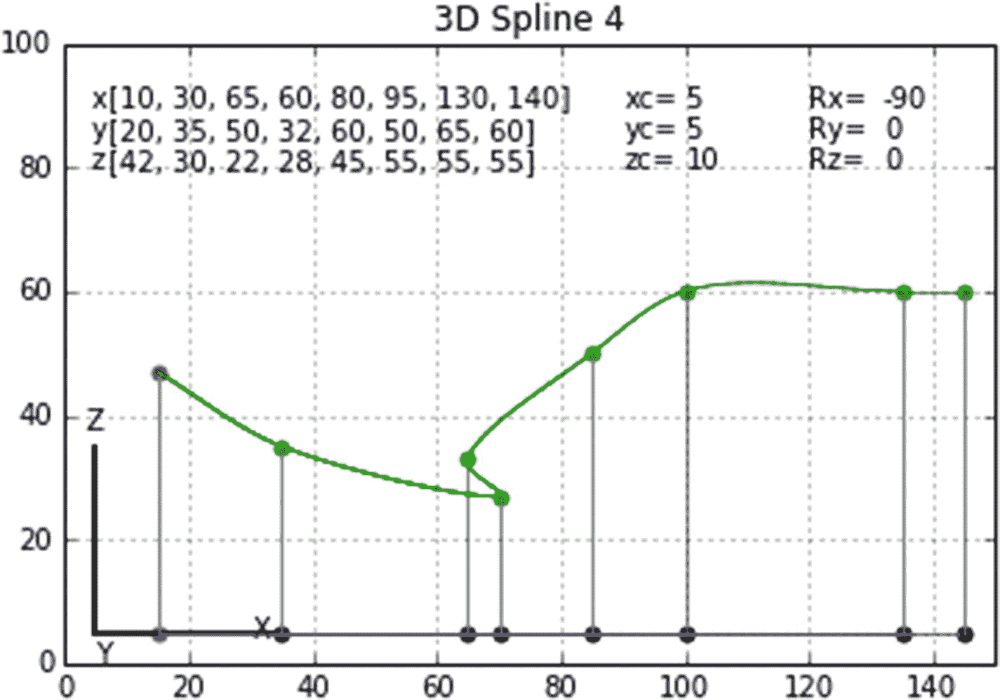
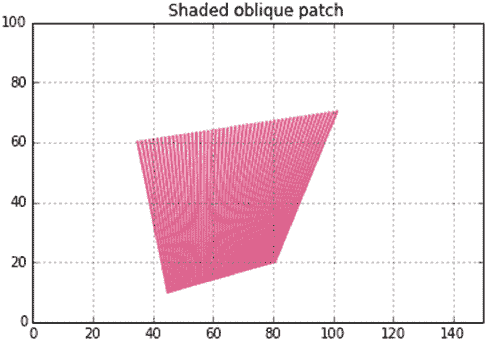

# 九、3D 数据绘图

将第 [8](08.html) 章中开发的用于生成二维样条的技术外推到三维样条是很容易的:你需要做的只是在程序中添加几行代码。这些行是清单 [9-1](#Par10) 中粗体突出显示的行，特别是函数 plotspline()中从第 89 行到第 161 行的那些行。它们引入 z 坐标的语法与 x 和 y 坐标使用的语法基本相同。

列表 [9-1](#Par10) 的控制从第 175 行开始。第一组数据点由第 175-177 行中的列表 x、y 和 z 定义。这些已经用#符号取消了，但是如果您想使用它们，它们会保留在原来的位置。他们制作图 [9-1](#Fig1) 。第 179-181 行中的活动列表产生数字 [9-2](#Fig2) 到 [9-4](#Fig4) 。第 183 行的 nop 是数据点的数量。这等于 len(x ),当然，也等于 len(y)和 len(z)。第 85 行的列表 g 保存由 rotx()、roty()和 rotz()旋转函数返回的值。旋转中心的坐标 xc、yc 和 zc 在第 187-189 行中定义。

第 191-193 行中的旋转角度 Rxd、Ryd 和 Rzd 可以使用一些解释。参考图 [9-5](#Fig5) ，右边的坐标系定义了旋转(Rxd，Ryd，Rzd)和平移(xc，yc，zc)方向的数据点和样条。左侧的系统显示了全局坐标系，这是在指定旋转时应该使用的坐标系。x 和 y 方向由第 9 行的 plt.axis()函数定义。由于这是一个右手坐标系，所以+z 方向指向屏幕之外。例如，围绕 z 方向的正旋转 Rzd 将使右侧的图形逆时针旋转。

在图上显示网格线主要是为了帮助确定 xc、yc、zc 的位置。当轴(例如图 [9-4](#Fig4) 中的 x 轴和 z 轴)位于绘图平面内时，它们可用作数据点和样条坐标值的测量。然而，当旋转图时，如图 [9-3](#Fig3) 所示，它们并不给出真实的测量值，但可以在定位中心 xc、yc、zc 时作为辅助。

第 200-210 行通过调用第 33-43 行的函数 plotaxis()绘制了定义数据点和样条的轴。每个长度为 30 个单位。第 43 行的列表 g 保存每个轴的端点坐标。线 202 绘出了 x 轴；y 轴和 z 轴也是如此。

没有旋转(即 Rxd=Ryd=Rzd=0 ),轴将出现在图 [9-5](#Fig5) 的左侧。当绘制数据时，我们通常认为 z 是 x 和 y 的函数(即 z=z(x，y))，我们更喜欢 z 轴指向上。要做到这一点，我们必须旋转坐标系，使 z 向上。举个例子，在图 [9-4](#Fig4) 中，Rx=-90，Ry=0，Rz=0。这些值显示在图的右上角。这将获取+z 轴，该轴在未旋转的位置指向屏幕外，并围绕 x 轴逆时针旋转，使其指向上方。+y 现在指向屏幕。这是一个很好的开始方向。围绕该方向的后续旋转可以给出三维视图。然而，请记住，这个程序已经硬连线，以给出序列 Rx，Ry，Rz 的旋转。例如，在从第 46 行开始的函数 plotdata()中，第 51 行执行 Rx 旋转，接下来是第 55 行的 Ry，然后是第 59 行的 Rz。

数据点绘制在第 213 行，它调用函数 plotdata()。这个函数很简单。在第 51、55 和 59 行中，每个数据点旋转量 Rx，然后 Ry，接着 Rz。在线 66 中，每个点被绘制为绿色散射点。第 64 行用红色标出了第一个点。第 68-86 行绘制了从每个点到 x，y 平面的灰线。每条线的顶部具有与数据点 g[0]，g[1]相同的全局绘图坐标。绘图时不需要 z 坐标 g[3]。每条线底部的局部坐标与数据点具有相同的局部 x，y 坐标，但是现在局部 z 坐标为零，如第 72 行中所指定的。你需要这些局部坐标来旋转每条线的底部点。第 73、77 和 81 行执行旋转。第 83 行用红色标出了第一个点；线 86 用黑色绘制其余的点，用灰色绘制线。

接下来，在第 217 行绘制样条曲线，这将调用函数 plotspline()。颜色设置在第 216 行。该功能与前一章中使用的样条绘图算法相同，只是在程序列表中增加了以粗体显示的 z 轴线。

接下来，通过调用第 221 行中的函数 plotbottomspline()，用样条线连接垂直线的底部。颜色设置在第 220 行。plotbottomspline()打开每个点的 x、y 和 z 坐标列表:xbottom[ ]、ybottom[ ]、zbottom[ ]。每个中的项目最初设置为零。它们等同于第 168-171 行中的 x 和 y 数据点坐标。因为 z 坐标位于 x，y 平面，所以在第 171 行中它被设置为零。这些都是本地坐标。第 172 行调用函数 plotspline()，该函数用于绘制主样条，参数是底部点的本地坐标。如前所述，plotspline()将执行旋转并绘制样条曲线。程序的其余部分打印数据和标签。


图 9-5

Rotation model used by Listing [9-1](#Par10)



图 9-4

Spline produced by Listing [9-1](#Par10)


图 9-3

Spline produced by Listing [9-1](#Par10)


图 9-2

Spline produced by Listing [9-1](#Par10)


图 9-1

Spline produced by Listing [9-1](#Par10)

```py
1   """
2   SPLINE3D
3   """
4
5   import matplotlib.pyplot as plt
6   import numpy as np
7   from math import sqrt, radians, sin, cos
8
9   plt.axis([0,150,0,100])
10  plt.axis('on')
11  plt.grid(True)
12
13  #=================================================rotation transformations
14  def rotx(xp,yp,zp,Rx):
15      g[0]=xp+xc
16      g[1]=yp*cos(Rx)-zp*sin(Rx)+yc
17      g[2]=yp*sin(Rx)+zp*cos(Rx)+zc
18      return[g]
19
20  def roty(xp,yp,zp,Ry):
21      g[0]=xp*cos(Ry)+zp*sin(Ry)+xc
22      g[1]=yp+yc
23      g[2]=-xp*sin(Ry)+zp*cos(Ry)+zc
24      return[g]
25
26  def rotz(xp,yp,zp,Rz):
27      g[0]=xp*cos(Rz)-yp*sin(Rz)+xc
28      g[1]=xp*sin(Rz)+yp*cos(Rz)+yc
29      g[2]=zp+zc
30      return[g]
31
32  #==========================================================plot axis
33  def plotaxis(xp,yp,zp,Rx,Ry,Rz):
34      rotx(xp,yp,zp,Rx) #—Rx rotation
35      xp=g[0]-xc
36      yp=g[1]-yc
37      zp=g[2]-zc
38      roty(xp,yp,zp,Ry) #—Ry rotation
39      xp=g[0]-xc
40      yp=g[1]-yc
41      zp=g[2]-zc
42      rotz(xp,yp,zp,Rz) #—Rz rotation
43      return[g]
44
45  #===============================================plot data points
46  def plotdata(x,y,z,Rx,Ry,Rz):
47      for i in range(0,nop):

48          xp=x[i]
49          yp=y[i]
50          zp=z[i]
51          rotx(xp,yp,zp,Rx)
52          xp=g[0]-xc
53          yp=g[1]-yc
54          zp=g[2]-zc
55          roty(xp,yp,zp,Ry)
56          xp=g[0]-xc
57          yp=g[1]-yc
58          zp=g[2]-zc
59          rotz(xp,yp,zp,Rz)
60          xp=g[0]-xc
61          yp=g[1]-yc
62          zp=g[2]-zc
63          if i==0: #———plot first point red
64              plt.scatter(g[0],g[1],s=25,color='r')
65          else:
66              plt.scatter(g[0],g[1],s=25,color='g')
67          #———————plot vertical lines from data points to the x,y plane
68          xt=g[0] #-global line top coords=rotated data point coords
69          yt=g[1]
70          xp=x[i] #—coords of line bottom (zp=0) before rotation)
71          yp=y[i]
72          zp=0
73          rotx(xp,yp,zp,Rx) #———rotate bottom coords
74          xp=g[0]-xc
75          yp=g[1]-yc
76          zp=g[2]-zc
77          roty(xp,yp,zp,Ry)
78          xp=g[0]-xc
79          yp=g[1]-yc
80          zp=g[2]-zc
81          rotz(xp,yp,zp,Rz)
82          if i==0: #———————plot first bottom point red
83              plt.scatter(g[0],g[1],s=25,color='r')
84          else:
85              plt.scatter(g[0],g[1],s=25,color='k')
86          plt.plot([xt,g[0]],[yt,g[1]],color='grey') #———plot line
87
88  #====================================================plot spline
89  def plotspline(x,y,z,Rx,Ry,Rz,clr):
90      q=[0]*nop
91      mx=[0]*nop
92      my=[0]*nop
93      mz=[0]*nop
94      cx=[0]*nop
95      cy=[0]*nop
96      cz=[0]*nop
97      dx=[0]*nop
98      dy=[0]*nop
99      dz=[0]*nop
100     bx=[0]*nop
101     by=[0]*nop
102     bz=[0]*nop
103     ax=[0]*nop
104     ay=[0]*nop
105     az=[0]*nop
106
107     for i in range(1,nop): #———chords q(i)
108         a=x[i]-x[i-1]
109         b=y[i]-y[i-1]
110         c=z[i]-z[i-1]
111         q[i-1]=sqrt(a*a+b*b+c*c) #———nop=6 gives q[5]
112
113     mx[0]=(x[1]-x[0])/q[0] #———mx[0]
114     my[0]=(y[1]-y[0])/q[0] #———my[0]
115     mz[0]=(z[1]-z[0])/q[0] #———mx[0]
116
117     for i in range(1,nop-1): #———average m[i]
118         mx[i]=((x[i]-x[i-1])/q[i-1]+(x[i+1]-x[i])/q[i])*.5
119         my[i]=((y[i]-y[i-1])/q[i-1]+(y[i+1]-y[i])/q[i])*.5
120         mz[i]=((z[i]-z[i-1])/q[i-1]+(z[i+1]-z[i])/q[i])*.5
121
122     mx[nop-1]=(x[nop-1]-x[nop-2])/q[nop-2] #—mx[nop-1]
123     my[nop-1]=(y[nop-1]-y[nop-2])/q[nop-2] #—my[nop-1]
124     mz[nop-1]=(z[nop-1]-z[nop-2])/q[nop-2] #—mz[nop-1]
125
126     #————————————calculate coefficients
127     for i in range(0,nop-1):
128         dx[i]=x[i]

129         dy[i]=y[i]
130         dz[i]=z[i]
131         cx[i]=mx[i]
132         cy[i]=my[i]
133         cz[i]=mz[i]
134         bx[i]=(3*x[i+1]-2*cx[i]*q[i]-3*dx[i]-mx[i+1]*q[i])/(q[i]*q[i])
135         by[i]=(3*y[i+1]-2*cy[i]*q[i]-3*dy[i]-my[i+1]*q[i])/(q[i]*q[i])
136         bz[i]=(3*z[i+1]-2*cz[i]*q[i]-3*dz[i]-mz[i+1]*q[i])/(q[i]*q[i])
137         ax[i]=(mx[i+1]-2*bx[i]*q[i]-cx[i])/(3*q[i]*q[i])
138         ay[i]=(my[i+1]-2*by[i]*q[i]-cy[i])/(3*q[i]*q[i])
139         az[i]=(mz[i+1]-2*bz[i]*q[i]-cz[i])/(3*q[i]*q[i])
140
141     #————————————plot spline between data points
142     for i in range(0,nop-1):
143         for qq in np.arange(0,q[i],2):
144             xp=ax[i]*qq*qq*qq+bx[i]*qq*qq+cx[i]*qq+dx[i]
145             yp=ay[i]*qq*qq*qq+by[i]*qq*qq+cy[i]*qq+dy[i]
146             zp=az[i]*qq*qq*qq+bz[i]*qq*qq+cz[i]*qq+dz[i]
147             rotx(xp,yp,zp,Rx) #———Rx rotation
148             xp=g[0]-xc
149             yp=g[1]-yc
150             zp=g[2]-zc
151             roty(xp,yp,zp,Ry) #———Ry rotation
152             xp=g[0]-xc
153             yp=g[1]-yc
154             zp=g[2]-zc
155             rotz(xp,yp,zp,Rz) #———Rz rotation
156             if qq==0: #—plot first point red
157                 xplast=g[0]
158                 yplast=g[1]
159             plt.plot([xplast,g[0]],[yplast,g[1]],linewidth=.7,color=clr)
160             xplast=g[0]
161             yplast=g[1]

162
163 #=============================================plot bottom spline
164 def plotbottomspline(x,y,z,Rx,Ry,Rz,clr):
165     xbottom=[0]*nop
166     ybottom=[0]*nop
167     zbottom=[0]*nop
168     for i in range(0,nop):
169         xbottom[i]=x[i]
170         ybottom[i]=y[i]
171         zbottom[i]=0
172     plotspline(xbottom,ybottom,zbottom,Rx,Ry,Rz, clr)
173
174 #=================================================control
175 #x=[20,40,60,80] #—LOCAL coords-Fig(3D Spline 1)
176 #y=[30,30,30,30]
177 #z=[15,33,28,17]
178
179 x=[10,30,65,60,80,95,130,140 #–LOCAL coordinates-Figs(3D Splines 2,3 and 4)
180 y=[20,35,50,32,60,50,65,60]
181 z=[42,30,22,28,45,55,55,55]
182
183 nop=len(x) #—number of data points
184
185 g=[0]*3 #—global plotting coords returned by rotx, roty and rotz
186
187 xc=80 #—origin of X,Y,Z coordinate system
188 yc=20
189 zc=10
190
191 Rxd=-100 #—rotations of X,Y,Z system degrees
192 Ryd=-135
193 Rzd=8
194
195 Rx=radians(Rxd) #———rotations of X,Y,Z system radians
196 Ry=radians(Ryd)
197 Rz=radians(Rzd)

198
199 #———————————————————plot X,Y,Z axes
200 plotaxis(30,0,0,Rx,Ry,Rz) #—plot X axis
201 plt.plot([xc,g[0]],[yc,g[1]],linewidth=2,color='k')
202 plt.text(g[0]-5,g[1]-1,'X')
203
204 plotaxis(0,30,0,Rx,Ry,Rz) #—plot Y axis
205 plt.plot([xc,g[0]],[yc,g[1]],linewidth=2,color='k')
206 plt.text(g[0],g[1]-5,'Y')
207
208 plotaxis(0,0,30,Rx,Ry,Rz) #—plot Z axis
209 plt.plot([xc,g[0]],[yc,g[1]],linewidth=2,color='k')
210 plt.text(g[0]-2,g[1]+3,'Z')
211
212 #———————————————————plot data
213 plotdata(x,y,z,Rx,Ry,Rz)
214
215 #———————————————————plot spline
216 clr='g' #—————————–spline color
217 plotspline(x,y,z,Rx,Ry,Rz,clr)
218
219 #———————————————————plot bottom spline
220 clr='b' #——————————bottom spline color
221 plotbottomspline(x,y,z,Rx,Ry,Rz,clr)
222
223 #————————————————————labels
224 plt.text(120,90,'Rx=')
225 Rxd='%7.1f'%(Rxd)
226 plt.text(132,90,Rxd)
227
228 plt.text(120,85,'Ry=')
229 Ryd='%7.1f'%(Ryd)
230 plt.text(132,85,Ryd)
231
232 plt.text(120,80,'Rz=')
233 Rzd='%7.1f'%(Rzd)
234 plt.text(132,80,Rzd)
235
236 plt.text(90,90,'xc=')
237 xc='%7.1f'%(xc)
238 plt.text(100,90,xc)
239
240 plt.text(90,85,'yc=')
241 yc='%7.1f'%(yc)
242 plt.text(100,85,yc)
243
244 plt.text(90,80,'zc=')

245 zc='%7.1f'%(zc)
246 plt.text(100,80,zc)
247
248 plt.text(4,90,'x')
249 plt.text(7,90,x)
250 plt.text(4,85,'y')
251 plt.text(7,85,y)
252 plt.text(4,80,'z')
253 plt.text(7,80,z)
254
255 plt.title('3D Spline 4')
256
257 plt.show()
Listing 9-1Program SPLINE3D

```

## 9.1 3D 曲面

在上一节中，您了解了如何用三维样条连接数据点。在本节中，您将使用这些技术来创建一个三维表面。图 [9-6](#Fig6) 显示了一个表面 z=z(x，y)。它由 x，y，z 空间中的 16 个数据点定义。为了给出表面的外观，这些点通过样条线相互连接。绿色样条连接 y 方向的点，蓝色样条连接 x 方向的点。既然您已经知道如何在三维空间中创建样条，那么问题就变成了以正确的顺序排列数据点。

清单 [9-2](#Par16) 与清单 [9-1](#Par10) 相似，尽管为了简单起见，已经删除了该程序的一些特性；不绘制从数据点到 x，y 平面的垂直线，也不绘制样条在 x，y 平面上的投影。

清单 [9-2](#Par16) 的本质包含在从第 140 行开始的“控制”部分中。图 [9-6](#Fig6) 所示的 16 个数据点由第 168-182 行的列表定义。第 168-170 行列表中的第一组点定义了第一个 y 方向样条(绿色)中显示的数据点。该样条位于 y，z 平面，其中 x=0。点 x1[ ]、y1[ ]、z1[ ]指的是该样条内的四个点；x2[ ]、y2[ ]、z2[ ]指的是第二条样条内的点，依此类推。第一条样条曲线中的第一个点位于 0，0，0 处。这些坐标在行 168-170 中被指定为 x1[0]，y1[0]，z1[0]。第一条样条曲线中的第二个点位于 0，10，43。这些坐标被指定为 x1[1]，y1[1]，z1[1]。类似地，x1[2]，y1[2]，z1[2]和 x1[3]，y1[3]，z1[3]指的是第一个 y 方向样条中的第三和第四个点。第 187-190 行通过调用函数 plotdata()以这些列表作为参数来绘制数据点。第 194-197 行调用函数 plotspline()，同样使用这些列表作为参数，绘制第一条 y 方向样条线。第 172-174 行以及第 188 和 195 行绘制了 x = 20 处的数据点和第二条绿色样条曲线，对于 x = 40 和 x = 60 处的其余两条样条曲线，以此类推。要绘制 x 方向样条曲线，您可以做同样的事情，只是您必须首先重新定义坐标列表。这发生在第 200-214 行。蓝色样条线绘制在线 218-221 中。

当然，每个坐标列表可以包含四个以上的项目。第 170-184 行的列表中定义的数据点都位于网格中。他们不需要。

虽然它的工作，这里使用的方法来安排数据绘图是非常繁琐的。这也需要大量的编码。这里这样做是为了说明所用的程序。通过使用数组可以大大缩短这个时间，我们将在下一节中使用数组。


图 9-6

Surface produced by Listing [9-2](#Par16)

```py
1   """
2   SURFACE3D
3   """
4
5   import matplotlib.pyplot as plt
6   import numpy as np
7   from math import sqrt, radians, sin, cos
8
9   plt.axis([0,150,0,100])
10  plt.axis('on')
11  plt.grid(True)
12
13  #===================================================rotation transformations
14  def rotx(xp,yp,zp,Rx):
15      g[0]=xp+xc
16      g[1]=yp*cos(Rx)-zp*sin(Rx)+yc
17      g[2]=yp*sin(Rx)+zp*cos(Rx)+zc
18      return[g]
19
20  def roty(xp,yp,zp,Ry):
21      g[0]=xp*cos(Ry)+zp*sin(Ry)+xc
22      g[1]=yp+yc
23      g[2]=-xp*sin(Ry)+zp*cos(Ry)+zc
24      return[g]
25
26  def rotz(xp,yp,zp,Rz):
27      g[0]=xp*cos(Rz)-yp*sin(Rz)+xc
28      g[1]=xp*sin(Rz)+yp*cos(Rz)+yc
29      g[2]=zp+zc
30      return[g]
31
32  #============================================================plot axis
33  def plotaxis(xp,yp,zp,Rx,Ry,Rz):
34      rotx(xp,yp,zp,Rx) #———Rx rotation
35      xp=g[0]-xc
36      yp=g[1]-yc
37      zp=g[2]-zc
38      roty(xp,yp,zp,Ry) #———Ry rotation
39      xp=g[0]-xc
40      yp=g[1]-yc
41      zp=g[2]-zc
42      rotz(xp,yp,zp,Rz) #———Rz rotation
43      return[g]
44
45  #======================================================plot data 46  def plotdata(x,y,z,Rx,Ry,Rz):
47      for i in range(0,nop):
48          xp=x[i]
49          yp=y[i]
50          zp=z[i]
51          rotx(xp,yp,zp,Rx)
52          xp=g[0]-xc
53          yp=g[1]-yc
54          zp=g[2]-zc
55          roty(xp,yp,zp,Ry)
56          xp=g[0]-xc
57          yp=g[1]-yc
58          zp=g[2]-zc
59          rotz(xp,yp,zp,Rz)
60          xp=g[0]-xc
61          yp=g[1]-yc
62          zp=g[2]-zc
63          plt.scatter(g[0],g[1],s=25,color='g')
64
65  #========================================================plotspline( )
66  def plotspline(x,y,z,Rx,Ry,Rz,clr):
67      q=[0]*nop
68      mx=[0]*nop
69      my=[0]*nop
70      mz=[0]*nop
71      cx=[0]*nop
72      cy=[0]*nop
73      cz=[0]*nop
74      dx=[0]*nop
75      dy=[0]*nop
76      dz=[0]*nop
77      bx=[0]*nop
78      by=[0]*nop
79      bz=[0]*nop
80      ax=[0]*nop
81      ay=[0]*nop
82      az=[0]*nop
83
84      for i in range(1,nop): #—chords q(i)
85          a=x[i]-x[i-1]
86          b=y[i]-y[i-1]

87          c=z[i]-z[i-1]
88          q[i-1]=sqrt(a*a+b*b+c*c) #—nop=6 gives q[5]
89
90      mx[0]=(x[1]-x[0])/q[0] #—mx[0]
91      my[0]=(y[1]-y[0])/q[0] #—my[0]
92      mz[0]=(z[1]-z[0])/q[0] #—mx[0]
93
94      for i in range(1,nop-1): #—average m[i]
95          mx[i]=((x[i]-x[i-1])/q[i-1]+(x[i+1]-x[i])/q[i])*.5
96          my[i]=((y[i]-y[i-1])/q[i-1]+(y[i+1]-y[i])/q[i])*.5
97          mz[i]=((z[i]-z[i-1])/q[i-1]+(z[i+1]-z[i])/q[i])*.5
98
99      mx[nop-1]=(x[nop-1]-x[nop-2])/q[nop-2] #—mx[nop-1]
100     my[nop-1]=(y[nop-1]-y[nop-2])/q[nop-2] #—my[nop-1]
101     mz[nop-1]=(z[nop-1]-z[nop-2])/q[nop-2] #—mz[nop-1]
102
103     #————————————calculate coefficients
104     for i in range(0,nop-1):
105         dx[i]=x[i]
106         dy[i]=y[i]
107         dz[i]=z[i]
108         cx[i]=mx[i]
109         cy[i]=my[i]
110         cz[i]=mz[i]
111         bx[i]=(3*x[i+1]-2*cx[i]*q[i]-3*dx[i]-mx[i+1]*q[i])/(q[i]*q[i])
112         by[i]=(3*y[i+1]-2*cy[i]*q[i]-3*dy[i]-my[i+1]*q[i])/(q[i]*q[i])
113         bz[i]=(3*z[i+1]-2*cz[i]*q[i]-3*dz[i]-mz[i+1]*q[i])/(q[i]*q[i])
114         ax[i]=(mx[i+1]-2*bx[i]*q[i]-cx[i])/(3*q[i]*q[i])
115         ay[i]=(my[i+1]-2*by[i]*q[i]-cy[i])/(3*q[i]*q[i])
116         az[i]=(mz[i+1]-2*bz[i]*q[i]-cz[i])/(3*q[i]*q[i])
117
118     #——————————————plot splines between data points
119     for i in range(0,nop-1):
120         for qq in np.arange(0,q[i],2):
121             xp=ax[i]*qq*qq*qq+bx[i]*qq*qq+cx[i]*qq+dx[i]
122             yp=ay[i]*qq*qq*qq+by[i]*qq*qq+cy[i]*qq+dy[i]
123             zp=az[i]*qq*qq*qq+bz[i]*qq*qq+cz[i]*qq+dz[i]
124             xp=g[0]-xc
125             yp=g[1]-yc
126             zp=g[2]-zc
127             roty(xp,yp,zp,Ry) #—Ry rotation
128             xp=g[0]-xc
129             yp=g[1]-yc
130             zp=g[2]-zc
131             rotz(xp,yp,zp,Rz) #—Rz rotation
132             if qq==0:
133                 xplast=g[0]
134                 yplast=g[1]
135             plt.plot([xplast,g[0]],[yplast,g[1]],linewidth=.7,color=clr)
136             xplast=g[0]
137             yplast=g[1]
138
139 #==================================================control
140 g=[0]*3 #—global plotting coords returned by rotx, roty and rotz
141
142 xc=80 #—origin of X,Y,Z coordinate system
143 yc=20
144 zc=10
145
146 Rxd=-100 #–rotations of X,Y,Z system degrees
147 Ryd=-135
148 Rzd=8
149
150 Rx=radians(Rxd) #—rotations of X,Y,Z system radians
151 Ry=radians(Ryd)
152 Rz=radians(Rzd)
153
154 #—————————————————————plot X,Y,Z axes
155 plotaxis(60,0,0,Rx,Ry,Rz) #—plot X axis
156 plt.plot([xc,g[0]],[yc,g[1]],linewidth=2,color='k')
157 plt.text(g[0]-5,g[1]-1,'X')
158
159 plotaxis(0,60,0,Rx,Ry,Rz) #—plot Y axis
160 plt.plot([xc,g[0]],[yc,g[1]],linewidth=2,color='k')
161 plt.text(g[0],g[1]-5,'Y')

162
163 plotaxis(0,0,60,Rx,Ry,Rz) #—plot Z axis
164 plt.plot([xc,g[0]],[yc,g[1]],linewidth=2,color='k')
165 plt.text(g[0]-2,g[1]+3,'Z')
166
167 #————————-define 4 sets of data points at different values of X
168 x1=[0,0,0,0] #———LOCAL coords
169 y1=[0,10,20,30]
170 z1=[50,43,30,14]
171
172 x2=[20,20,20,20]
173 y2=y1
174 z2=[25,23,19,12]
175
176 x3=[40,40,40,40]
177 y3=y1
178 z3=[14,15,13,9]
179
180 x4=[60,60,60,60]
181 y4=y1
182 z4=[7,10,10,9]
183
184 nop=len(x1) #———number of data points
185
186 #—————————————————————plot data points
187 plotdata(x1,y1,z1,Rx,Ry,Rz)
188 plotdata(x2,y2,z2,Rx,Ry,Rz)
189 plotdata(x3,y3,z3,Rx,Ry,Rz)
190 plotdata(x4,y4,z4,Rx,Ry,Rz)
191
192 #——————————————————plot Y direction splines
193 clr='g' #——————————spline color
194 plotspline(x1,y1,z1,Rx,Ry,Rz,clr)
195 plotspline(x2,y2,z2,Rx,Ry,Rz,clr)
196 plotspline(x3,y3,z3,Rx,Ry,Rz,clr)
197 plotspline(x4,y4,z4,Rx,Ry,Rz,clr)
198
199 #——————————redefine the data points at different values of y
200 xx1=[0,20,40,60]
201 yy1=[y1[3],y2[3],y3[3],y4[3]]

202 zz1=[z1[3],z2[3],z3[3],z4[3]]
203
204 xx2=xx1
205 yy2=[y1[2],y2[2],y3[2],y4[2]]
206 zz2=[z1[2],z2[2],z3[2],z4[2]]
207
208 xx3=xx1
209 yy3=[y1[1],y2[1],y3[1],y4[1]]
210 zz3=[z1[1],z2[1],z3[1],z4[1]]
211
212 xx4=xx1
213 yy4=[y1[0],y2[0],y3[0],y4[0]]
214 zz4=[z1[0],z2[0],z3[0],z4[0]]
215
216 #——————————————————plot X direction splines
217 clr='b' #——————————spline color
218 plotspline(xx1,yy1,zz1,Rx,Ry,Rz,clr)
219 plotspline(xx2,yy2,zz2,Rx,Ry,Rz,clr)
220 plotspline(xx3,yy3,zz3,Rx,Ry,Rz,clr)
221 plotspline(xx4,yy4,zz4,Rx,Ry,Rz,clr)
222
223 #————————————————————————labels
224 plt.text(120,90,'Rx=')
225 Rxd='%7.1f'%(Rxd)
226 plt.text(130,90,Rxd)
227
228 plt.text(120,85,'Ry=')
229 Ryd='%7.1f'%(Ryd)
230 plt.text(130,85,Ryd)
231
232 plt.text(120,80,'Rz=')
233 Rzd='%7.1f'%(Rzd)
234 plt.text(130,80,Rzd)
235
236 plt.title('3D Surface')
237
238 plt.show()

Listing 9-2Program SURFACE3D

```

## 9.2 3D 表面着色

在上一节中，您通过用样条线连接数据点构建了一个曲面。你没有使用数组，而是依赖于一个繁琐的编号系统。虽然这保持了过程的开放性和易理解性，但却导致了太多的代码行。在本节中，您将使用相同的数据集，但有两个不同之处:首先，您将通过直线连接数据点；其次，您将使用数组来组织您的绘图。当您看到数组的使用是如此简单和优雅时，您可能会问哪种方法最容易编码和遵循。

使用与前一节中相同的三维数据集，定义数据的数组是


列表 [9-3](#Par55) 使用该数组产生图形 [9-7](#Fig7) 。用于将 A 与表面点相关联的编号方案如图 [9-8](#Fig8) 所示。


图 9-8

Data point numbering scheme used in Listing [9-3](#Par55)


图 9-7

Shaded 3D surface produced by Listing [9-3](#Par55)

中的每个元素都是一个列表。共有 16 个列表:A[0]到 A[15]。列表 I 被引用为[i],其中 i=0→15。比如 A[3]=[0，30，14]。每个列表 I 定义了数据点 I 的 x，y，z 坐标，即

![$$ A\left[i,1\right]=x(i) $$](A456962_1_En_9_Chapter_Equ2.gif)

(9-2)

![$$ A\left[i,2\right]=y(i) $$](A456962_1_En_9_Chapter_Equ3.gif)

(9-3)

![$$ A\left[i,3\right]=z(i) $$](A456962_1_En_9_Chapter_Equ4.gif)

(9-4)

比如第一个点，点 0，有坐标

![$$ A\left[0,1\right]=x(0)=0 $$](A456962_1_En_9_Chapter_Equ5.gif)

(9-5)

![$$ A\left[0,2\right]=y(0)=0 $$](A456962_1_En_9_Chapter_Equ6.gif)

(9-6)

![$$ A\left[0,3\right]=z(0)=50 $$](A456962_1_En_9_Chapter_Equ7.gif)

(9-7)

这种方法取代了上一节中使用的列表编号系统。

参考图 [9-8](#Fig8) ，为了得到编号为 3 的第四个数据点的 z 坐标，通过让 i=3，j=2 来访问数组 A 的第四个列表的第三个元素。与列表一样，数组中元素的编号从 0 开始，因此第四个数据点的坐标包含在列表 i=3 中。z 分量是列表中的第三个元素，j=2。因此，第四个数据点的 z 坐标是 A[3，2]，所以

```py
print(A[3,2])

14

```

图 [9-8](#Fig8) 中的编号方案从点 0 开始，该点位于 x=0，y=0，z=50 处表面的上角，并沿 y 方向前进，总共 4 个数据点。然后，对于另一组 4 个 y 方向点，它前进到新的 x 值。这总共给出了 16 个数据点。可以使用其他编号方案。例如，你可以从同一点开始，但是先从 x 方向开始，而不是 y 方向。或者你可以从表面的另一个角落开始。正如您将看到的，无论选择什么编号方案，都会对该数据的后续操作产生影响。

曲面由四边形组成，称之为面片。您将对这些补丁进行着色。每个面片由四个数据点定义。因为它们位于三维空间中，所以贴片通常不会是平的。此外，由于边的长度可以是任意的，所以贴片不一定是矩形的。将使用前几章中使用的基本着色技术(即通过在补丁上画线来给补丁着色)，但必须修改该技术。

图 [9-9](#Fig9) 显示了模型。这是一个由编号为 0 → 3 的四个角定义的普通倾斜面片。q03 和 q12 是从 0 → 3 和 1 → 2 的边长。如前所述，这些边是三维的，不一定平行。就像前面章节中关于阴影的处理一样，你可以通过在四边形上画线来填充颜色。显示的蓝线是示例。如图 [9-10](#Fig10) 和 [9-11](#Fig11) 所示，你将在这里开发的算法将适用于任何四边形。

要绘制这些线，您只需确定每条线沿 0，3 边的起始位置 S 和沿 1，2 边的终止位置 E。由于这些边的长度不同，S 从 0 点到 0，3 边的距离 q 与 E 从 1 点到 1，2 边的距离不同。线 S 的起点在 q=0 时从补片的顶部(角 0)开始，并前进到 q=q03 时的底部。为了得到 E 下边 1，2 的相应位置，你用距离 q 除以 q12/q03。然后在 S 和 e 之间画一条线。图 [9-9](#Fig9) 中显示的蓝线分别是补丁两边的 70%、80%和 90%。

图 [9-9](#Fig9) 中所示的单位矢量 nˇ不是画线所必需的，但在确定着色强度时会用到。这是像以前一样通过取 n 与光源单位矢量<sup>l 的点积来完成的</sup>

在清单 [9-3](#Par55) 中，图 [9-9](#Fig9) 中的普通补片角的编号 0→3 被替换为数组 a 中曲面上每个补片的相应编号。第 169 行给出了 A 中数据点的数量，它等于列表的数量，每个列表定义一个点的位置。在这种情况下，nop=16。数据点绘制在线 172-194 中。这个简单的例程说明了使用数组的好处，取代了以前程序中使用的数据绘图功能。第 178-185 行通过第 177 行中指定的颜色 clr 线连接四个 y 方向点。函数 plotline()绘制直线。第 188-194 行在 x 方向做同样的事情。


图 9-9

Patch model used in Listing [9-3](#Par55)

通过调用从第 65 行开始的函数 shade()，第 197-205 行中的补丁被着色。参数的排列符合图 [9-9](#Fig9) 所示的通用补丁角。第 197-199 行在 y 方向上对第一行补片加阴影。第一个面片的左上角位于 A[0，0]，第二个面片的左上角位于 A[1，0]，依此类推。在循环的第一个循环中，i=0，第 198 行和第 199 行给出了以下面片角坐标，这些坐标用作函数 shade 调用中的参数:

*   A[0，0] = x[0] = x0 = 0 角 0
*   A[0，1] = y[0] = y0 = 0
*   A[0，2] = z[0] = z0 = 50
*   A[1，0] = x[1] = x1 = 0 角 1
*   A[1，2] = y[1] = y1 = 10
*   A[1，3] = z[1] = z1 = 43
*   A[5，0] = x[5] = x2 = 0 角 2
*   A[5，1] = y[5] = y2 = 20
*   A[5，2] = z[5] = z2 = 30
*   A[4，0] = x[4] = x3 = 0 角 3
*   A[4，1] = y[4] = y3 = 30
*   A[4，2] = z[4] = z3 = 14

在函数 shade()中，第 65 行的参数与上面的面片角 0、1、2 和 3、

![$$ \left(\underset{corner\kern0.5em 0}{\underbrace{\overset{A\left[0\right]}{\overbrace{x0,\kern0.5em y0,\kern0.5em z0,}}}}\kern0.5em \underset{corner\kern0.5em 1}{\underbrace{\overset{A\left[1\right]}{\overbrace{x1,\kern0.5em y1,\kern0.5em z1,}}\kern0.5em }}\underset{corner\kern0.5em 2}{\underbrace{\overset{A\left[5\right]}{\overbrace{x2,\kern0.5em y2,\kern0.5em z2,}}}}\underset{corner\kern0.5em 3}{\underbrace{\kern0.5em \overset{A\left[4\right]}{\overbrace{x3,\kern0.5em y3,\kern0.5em z3,}}}}\right) $$](A456962_1_En_9_Chapter_Equa.gif)

重合

当 i=1 时，这些相同的程序行给出了 y 方向上的下一个面片的角坐标，该面片具有角 1、2、6 和 5。这些对应于通用面片角 0、1、2 和 3。循环的剩余循环在 y 方向上对剩余的两个面片进行着色。线 200-202 和 203-205 在 x 方向上前进并执行相同的操作，从而对所有九个补片进行着色。

您可能想知道为什么第 197 行中的 for 循环，对于范围(0，3)中的 I，使用索引 3 而不是 2。毕竟只有三个 y 方向的面片需要着色；0 → 3 似乎等于 4。它与 range()函数的工作方式有关。一般来说，语法是 range(开始、停止、步进)。如果没有指定步长，则假设步长为 1。范围将从 start 开始，以 step 的步长转到 stop，但不会返回 stop 处的值。在第 197 行，0 是起始值，3 是终止值。这将返回 i=0，1 和 2，但不是 3。这在第 [1](01.html) 章中有所解释。你可以自己试试这个:

```py
for i in range(0,3):
    print(i)

0
1
2

```

人们很容易将 stop 视为要返回的值的数量，但事实并非如此。例如，

```py
for i in range(1,3):
    print(i)

1
2

```

如果未指定起始值，它会自动设置为 0:

```py
for i in range(3):
    print(i)

0
1
2

```

在本文中，为了清楚起见，我通常包括起始值，但我通常不指定步长值，除非它不同于 1。

在函数 shade()中，第 66-92 行计算单位向量 uˇ、vˇ、wˇ和 nˇ。

第 94-96 行指定了<sup>ˇ</sup>l 的分量，即入射光方向单位向量，就像在以前的着色程序中所做的那样。第 98 行取 nˇ与<sup>l</sup>的点积。第 100-103 行定义了阴影函数并建立了影响补片的光强 I。第 105 行混合了红、绿、蓝三种颜色。线 107-115 绘出了穿过补丁的线。第 117 行绘制了这些线。请注意，这些线具有在第 105 行中建立的颜色。



图 9-11

Shaded oblique patch


图 9-10

Shaded oblique patch

```py
1   """
2   SHADEDSURFACE3D
3   """
4
5   import matplotlib.pyplot as plt
6   import numpy as np
7   from math import sqrt, radians, sin, cos
8
9   plt.axis([0,150,0,100])
10  plt.axis('on')
11  plt.grid(True)

12
13  #=========================================rotation transformations
14
15  #————————same as Listing 9-2, Program SURFACE3D———————
16
17  #========================================================plot axes
18
19  #————————same as Listing 9-2, Program SURFACE3D———————
20
21  #=======================================================plot point
22  def plotpoint(xp,yp,zp,Rx,Ry,Rz,clr):
23      rotx(xp,yp,zp,Rx)
24      xp=g[0]-xc
25      yp=g[1]-yc
26      zp=g[2]-zc
27      roty(xp,yp,zp,Ry)
28      xp=g[0]-xc
29      yp=g[1]-yc
30      zp=g[2]-zc
31      rotz(xp,yp,zp,Rz)
32      plt.scatter(g[0],g[1],s=10,color=clr)
33
34  #=======================================================plotline
35  def plotline(xb,yb,zb,xe,ye,ze,Rx,Ry,Rz,clr):
36      rotx(xb,yb,zb,Rx) #———rotate line beginning coordinates
37      xb=g[0]-xc
38      yb=g[1]-yc
39      zb=g[2]-zc
40      roty(xb,yb,zb,Ry)
41      xb=g[0]-xc
42      yb=g[1]-yc
43      zb=g[2]-zc
44      rotz(xb,yb,zb,Rz)
45      xb=g[0]
46      yb=g[1]
47      zb=g[2]
48
49      rotx(xe,ye,ze,Rx) #———rotate line end coordinates
50      xe=g[0]-xc
51      ye=g[1]-yc
52      ze=g[2]-zc
53      roty(xe,ye,ze,Ry)
54      xe=g[0]-xc
55      ye=g[1]-yc
56      ze=g[2]-zc
57      rotz(xe,ye,ze,Rz)
58      xe=g[0]
59      ye=g[1]
60      ze=g[2]
61
62  plt.plot([xb,xe],[yb,ye],linewidth=.7,color=clr)
63
64  #================================================shade
65  def shade(x0,y0,z0,x1,y1,z1,x2,y2,z2,x3,y3,z3,Rx,Ry,Rz,clr):
66      a=x3-x0
67      b=y3-y0
68      c=z3-z0
69      q03=np.sqrt(a*a+b*b+c*c)
70      ux=a/q03
71      uy=b/q03
72      uz=c/q03
73
74      a=x1-x0
75      b=y1-y0
76      c=z1-z0
77      q02=sqrt(a*a+b*b+c*c)
78      vx=a/q02
79      vy=b/q02
80      vz=c/q02
81
82      a=x2-x1
83      b=y2-y1
84      c=z2-z1
85      q12=np.sqrt(a*a+b*b+c*c)
86      wx=a/q12
87      wy=b/q12
88      wz=c/
q12

89
90      nx=uy*vz-uz*vy
91      ny=uz*vx-ux*vz
92      nz=ux*vy-uy*vx
93
94      lx=0
95      ly=-.7
96      lz=0
97
98      ndotl=nx*lx+ny*ly+nz*lz
99
100     IA=.01
101     IB=1
102     n=2.8
103     I=IA+(IB-IA)*((1-ndotl)/2)**n
104
105     clr=(1-I,.4*(1-I),.6*(1-I))
106
107     r=q12/q03
108     dq=q03/50
109     for q in np.arange(0,q03+1,dq):
110        xb=x0+ux*q
111        yb=y0+uy*q
112        zb=z0+uz*q
113        xe=x1+wx*q*r
114        ye=y1+wy*q*r
115        ze=z1+wz*q*r
116
117        plotline(xb,yb,zb,xe,ye,ze,Rx,Ry,Rz,clr)
118
119     plt.text(121,70,'lx=')
120     lx='%7.3f'%(lx)
121     plt.text(130,70,lx)
122
123     plt.text(121,65,'ly=')
124     ly='%7.3f'%(ly)
125     plt.text(130,65,ly)
126
127     plt.text(121,60,'lz=')
128     lz='%7.3f'%(lz)
129     plt.text(130,60,lz)
130
131     plt.text(121,50,'IA=')

132     IA='%7.3f'%(IA)
133     plt.text(130,50,IA)
134
135     plt.text(121,45,'IB=')
136     IB='%7.3f'%(IB)
137     plt.text(130,45,IB)
138
139     plt.text(121,40,'n=')
140     n='%7.3f'%(n)
141     plt.text(130,40,n)
142
143 #======================================================control
144 g=[0]*3 #———global plotting coords returned by rotx, roty and rotz
145
146 xc=80 #———origin of X,Y,Z coordinate system
147 yc=20
148 zc=10
149
150 Rxd=-100 #——–rotations of X,Y,Z system degrees
151 Ryd=-135
152 Rzd=8
153
154 Rx=radians(Rxd) #———rotations of X,Y,Z system radians
155 Ry=radians(Ryd)
156 Rz=radians(Rzd)
157
158 #—————————————————————plot X,Y,Z axes
159
160 #————————same as Listing 9-2, Program SURFACE3D———————
161
162 #———————————————define data point array A
163
164 A=np.array([ [0,0,50], [0,10,43], [0,20,30], [0,30,14],
165             [20,0,25], [20,10,23], [20,20,19], [20,30,12],
166             [40,0,14], [40,10,15], [40,20,13], [40,30,9],
167             [60,0,7], [60,10,10], [60,20,10], [60,30,9] ])
168
169 nop=len(A) #———number of data points
170
171 #—————————————————————plot data points
172 clr="k"
173 for i in range(0,16):
174     plotpoint(A[i,0],A[i,1],A[i,2],Rx,Ry,Rz,clr)
175
176 #——————————————–connect data points in Y direction
177 clr="k" #——————————line color
178 for i in range(0,3):
179     plotline(A[i,0],A[i,1],A[i,2],A[i+1,0],A[i+1,1],A[i+1,2],Rx,Ry,Rz,clr)
180 for i in range(4,7):
181     plotline(A[i,0],A[i,1],A[i,2],A[i+1,0],A[i+1,1],A[i+1,2],Rx,Ry,Rz,clr)
182 for i in range(8,11):
183     plotline(A[i,0],A[i,1],A[i,2],A[i+1,0],A[i+1,1],A[i+1,2],Rx,Ry,Rz,clr)
184 for i in range(12,15):
185     plotline(A[i,0],A[i,1],A[i,2],A[i+1,0],A[i+1,1],A[i+1,2],Rx,Ry,Rz,clr)
186
187 #———————————————connect data points in X direction
188 clr="k" #——————————line color
189 for i in range(0,4):
190     plotline(A[i,0],A[i,1],A[i,2],A[i+4,0],A[i+4,1],A[i+4,2],Rx,Ry,Rz,clr)
191 for i in range(4,8):
192     plotline(A[i,0],A[i,1],A[i,2],A[i+4,0],A[i+4,1],A[i+4,2],Rx,Ry,Rz,clr)
193 for i in range(8,12):
194     plotline(A[i,0],A[i,1],A[i,2],A[i+4,0],A[i+4,1],A[i+4,2],Rx,Ry,Rz,clr)
195
196 #——————————————————————shade patches
197 for i in range(0,3):
198     shade(A[i,0],A[i,1],A[i,2],A[i+1,0],A[i+1,1],A[i+1,2],A[i+5,0],
199         A[i+5,1],A[i+5,2],A[i+4,0],A[i+4,1],A[i+4,2],Rx,Ry,Rz,clr)
200 for i in range(4,7):
201     shade(A[i,0],A[i,1],A[i,2],A[i+1,0],A[i+1,1],A[i+1,2],A[i+5,0],
202         A[i+5,1],A[i+5,2],A[i+4,0],A[i+4,1],A[i+4,2],Rx,Ry,Rz,clr)
203 for i in range(8,11):
204     shade(A[i,0],A[i,1],A[i,2],A[i+1,0],A[i+1,1],A[i+1,2],A[i+5,0],
205         A[i+5,1],A[i+5,2],A[i+4,0],A[i+4,1],A[i+4,2],Rx,Ry,Rz,clr)
206
207 #————————————————————————labels
208 plt.text(121,90,'Rx=')
209 Rxd='%7.1f'%(Rxd)
210 plt.text(130,90,Rxd)
211
212 plt.text(121,85,'Ry=')
213 Ryd='%7.1f'%(Ryd)
214 plt.text(130,85,Ryd)
215
216 plt.text(121,80,'Rz=')
217 Rzd='%7.1f'%(Rzd)
218 plt.text(130,80,Rzd)
219
220 plt.title('Shaded 3D Surface')
221
222 plt.show()
Listing 9-3Program SHADEDSURFACE3D

```

## 9.3 总结

在本章中，您了解了如何绘制三维数据。为了做到这一点，您将通常的 z 轴指向屏幕的方向改为 z 向上；x 和 y 在水平面上。这是 Pz=f(Px，Py)时常用的数据显示方式；Px、Py 和 Pz 是数据点的坐标。在清单 [9-1](#Par10) 中，您用样条连接了数据点。作为可视化的辅助手段，您将样条向下投影到 x，y 平面上。它可以毫无困难地投影到其他坐标平面上。你使用的 3D 样条算法是第 8 章[中介绍的 2D 样条的外推。在清单](08.html) [9-2](#Par16) 中，你通过在 x 和 y 方向用样条连接点构建了一个表面。然后你给三维表面涂上阴影。这需要用直线而不是样条来连接数据点。结果是一组倾斜的补丁，不一定是平面的；它们中的每一个都可能扭曲出平面。您学习了如何通过对每个面片进行着色来对曲面进行着色。这需要开发一种能够对非平面倾斜四边形进行着色的算法。阴影是通过在每个小块的表面上画线来实现的；颜色的强度由贴片相对于照明光线方向的方向决定。