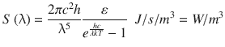
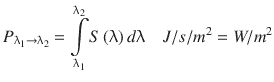
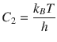
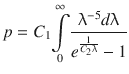
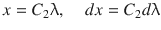
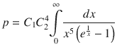

# 十二、普朗克辐射定律和斯特凡-玻尔兹曼方程

在第 [10](10.html) 章中，向你介绍了马普著名的黑体辐射方程:

(B-1)

表面在带宽λ 1 → λ 2 上发射的功率为

(B-2)

用方程 B-1，这就变成了

(B-3)

在第 [10](10.html) 章中，你对方程 B-3 进行了数值积分。在这里，您将对其进行数学积分，并表明它可用于推导黑体辐射的 Stefan-Boltzmann 定律

(B-4)其中 t 是表面的绝对温度，p 是单位面积辐射的功率，k B 是 Boltzmann 常数，h 是 Planck 常数，c 是光速，ϵ是表面的发射率。从区域 A 的表面辐射的功率是

(B-5)，其中

(B-6) σ被称为 Stefan-Boltzmann 常数。等式 B-4 将表面辐射的功率强度与其温度 t 的四次方相关联。该等式通常用于科学和工程中。

为了进行导致方程 B-4 的积分，你从普朗克的辐射方程开始(也在上面的 12-1 中示出):

(B-7)你想要从λ=0 到λ=∞对其积分以获得每单位的总功率

所有波长辐射的区域 p。让 C 1 =ϵ2πhc 2 和

，你得到

(B-8)

如果你做了下面的替换

(B-9)稍微忙乱一下你就有了

(B-10)

利用众所周知的:)关系

(B-11)，将 C 1 和 C 2 代入方程 B-10，得到

(B-12)，与上面的方程 B-4 相同。