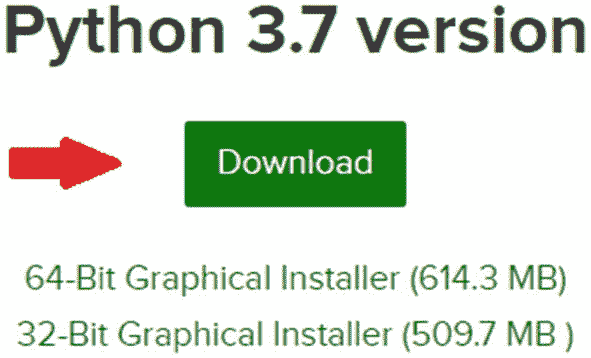
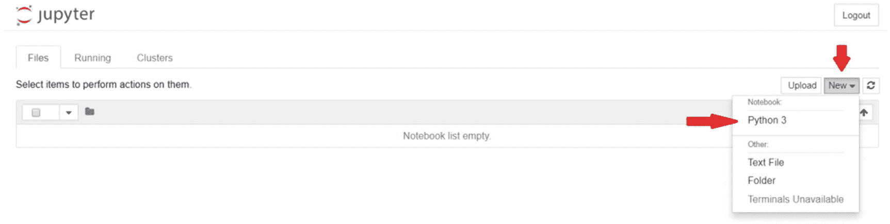
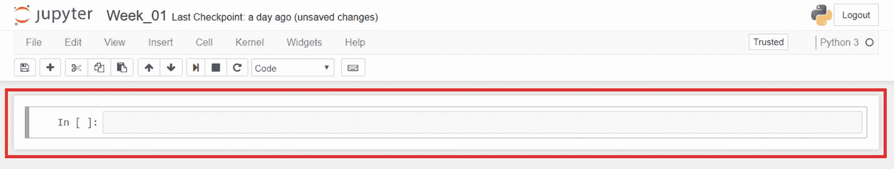

# 1.入门指南

你好！欢迎迈出成为 Python 开发人员的第一步。令人兴奋不是吗？无论你是刚刚开始学习如何编程，还是已经有了其他语言的经验，本书教授的课程将有助于加速你的目标。作为一名 Python 指导者，我可以向你保证，关键不在于你从哪里开始，而在于你愿意付出多大的努力。

在写这本书的时候，我的日常工作是一名编码训练营教练，在那里我教学生如何在短短十周内从零编程经验到专业开发人员。这本书的设计意图是将基于训练营的方法引入文本。这本书旨在帮助你学习对成为 Python 专业开发者有价值的主题。

接下来的每一章都会有一个概述和对我们那一周所学内容的简要描述。本周我们将涵盖所有必要的基础知识，让我们快速入门。遵循古老的说法，“在你能跑之前，你必须学会走，”在我们开始编码之前，我们必须了解我们的工具是什么以及如何使用它们。

**概述**

*   理解这本书为什么和如何工作

*   安装 Python 和 Anaconda

*   了解如何使用这些新工具

*   了解如何使用终端

*   编写您的第一个 Python 程序

事不宜迟，我们开始吧，好吗？

## 星期一:介绍

几乎每个程序员都记得“啊哈！”那一刻，一切都为他们所触动。对我来说，那是我学会 Python 的时候。经过多年的计算机科学教育，我发现最好的学习方法之一是构建应用程序并应用你所学的知识。这就是为什么这本书会让你跟着编码，而不是阅读编程背后的理论。Python 使得理解其他语言中难以理解的概念变得简单。这使得它成为进入开发行业的绝佳语言！

你可能已经注意到这本书的结构与大多数不同。我们用星期或天来分隔每个主题，而不是章节。请注意该部分的当前标题。这是基于训练营的方法的一部分，因此你可以设定每天的目标。这本书有两种解读方式:

1.  在十周的时间里

2.  在十天的过程中

如果你想遵循 10 周的方法，那么就把每一章当作一个周目标。所有章节被进一步分解为周一至周五的每日部分。前四天，周一到周四，将介绍新的概念来理解。周五，或者更广为人知的项目日，我们将根据一周内学到的经验一起创建一个项目。重点是你每天留出 30-60 分钟来完成每天的任务。

如果你非常渴望尝试训练营的方式，在那里你可以在十天内学会所有的内容，那么就把每一章当成一天。当然，你必须知道，为了在十天内完成这本书，你需要每天投入大约 8 个小时，这对于编码训练营的学生来说是典型的一天。在训练营中(*就像我教的那个*)，我们每天都要复习几个概念，接下来的每一天我们都要重申从之前的课程中学到的主题。这有助于加快学习每个概念的过程。

### Python 是什么？

Python 是一种**解释的**、**高级**、**通用**编程语言。为了理解这些描述的含义，让我们做一些比较:

*   **低级与高级**:指我们是否使用机器级别的指令和数据对象编程，或者我们是否使用语言设计者提供的更抽象的操作编程。低级语言(如 C，C++)需要你分配和管理内存，而 Python 为我们管理内存。

*   **通用与针对性**:指编程语言的操作是广泛适用还是针对某个领域进行微调。例如，SQL 是一种目标语言，旨在方便从关系数据库中提取信息，但您不会想用它来构建操作系统。

*   **解释过的 vs .编译过的**:指程序员编写的指令序列，称为*源代码*，是直接执行(*由解释器*)还是先转换(*由编译器*)成机器级原语操作序列。大多数用 Python 设计的应用程序都是通过解释器运行的，所以错误是在运行时发现的。

Python 还强调代码的可读性，并使用空格来分隔代码片段。我们将在课程中更多地了解 Python 中的空格是如何工作的，但是现在我们只知道 Python 是进入计算机科学行业的第一语言。

### 为什么是 Python？

我可以继续讲述 Python 为何如此神奇，但简单的谷歌搜索就能帮我做到。Python 是最容易学习的语言之一。注意，我说的是“*更容易*而不是“*容易*”……这是因为编程仍然很难，但 Python 比大多数其他语言更接近英语。这是学习 Python 的好处之一，因为你从本书中学到的概念仍然适用于其他语言。Python 也是当今技术行业最受欢迎的技能之一，被谷歌、脸书、IBM 等公司使用。它被用于构建 Instagram、Pinterest、Dropbox 等应用程序。

它也是 2019 年增长最快的语言之一，攀升至未来学习的前 3 种语言。然而它的报酬有多高呢？据 Indeed.com 称，2018 年的平均工资约为**11.7 万美元**！ <sup>[2](#Fn2)</sup> 垄断的钱多着呢！

然而，学习 Python 的最大原因之一肯定是语言本身的使用。它被用于几个不同的行业:前端开发、后端开发、全栈、测试、数据分析、数据科学、网页设计等。，这使它成为一种有用的语言。

### 为什么是这本书？

先说想看这本书的主要原因。贯穿本书的教材有一个被证实的记录。我个人使用这种精确的组织方法帮助我的学生在各种行业获得高薪职位。多年来，该课程的结构已经过多次改进，以适应当前的行业趋势。

与竞争对手相比，这本书的下一个优势是概念是如何教授的。我不会用细节来烦你；相反，在本书的整个过程中，我们将一起构建小型和大型应用程序。最好的学习方法往往是边做边学！尤其是在编程方面，我经常告诉学生的一个教训是，试着写代码，如果代码坏了，就修复它。如果你不尝试打破东西，你将无法学习！

最后，这本书不仅会教你如何编程，还会教你如何像程序员一样思考。在每周的开始，我会挑战你，到课程结束时，你将能够理解你需要采取的方法。你总是能区分那些只会编程的人和那些久经考验的开发人员。

### 这本书是给谁的？

在你开始读这本书之前，先了解你要读的内容总是有好处的。想要读一本书，你首先必须意识到这本书本身是否是为你设计的。如果你对以下任何一个问题的答案是肯定的，那么这本书就是为你而写的:

*   你是否有过其他编程语言的经验，却想拿起一门高级语言？

*   你有没有以前没有编程过但是很渴望学习的经历？

*   你以前学过计算机科学课程吗，但是它们没有帮助你学习如何创建应用程序？

*   你想转行吗？

*   你以前有没有试过学语言，但是因为语言的难度而学不下去？

*   你以前用 Python 编程过，但是想提高自己的能力，学习新的工具吗？

这本书是为各种各样的读者设计的，不管你的背景如何。真正的问题在你身上，“**你愿意多努力工作**”这本书教授的概念可以让任何愿意学习的人受益。即使你以前用 Python 编程过，这本书仍然可以帮助你成为一个更强的开发者。

### 你会学到什么

这本书是为教学 Python 而设计的训练营课程而创作的。您可以期望涵盖 Python 开发人员工作中所需的必要信息。这些概念将使你有能力继续你的编程教育。在每章的结尾，我们将使用所涵盖的概念来创建各种现实世界的应用程序。毕竟，我们在这里不仅仅关注 Python，我们试图帮助你成为一名更好的开发人员。

明天，我们将了解如何安装本书使用的必要软件。如果您的机器上已经安装了 Anaconda 和 Python，您可以跳到周三的课程。

## 星期二:设置 Anaconda 和 Python

今天，我们将进行软件设置。在本书中，我们将使用一个名为 **Anaconda** 的软件平台，一个名为 **Jupyter Notebook** 的**集成开发环境(IDE)** ，以及 Python 本身的语言。这本书将严格涵盖 Python 3；然而，有时你可能会看到我提到版本 2 和版本 3 之间的细微差别。让我们先下载并安装这些软件，然后我会详细介绍它们各自的功能。

### 跨平台开发

Python 可以在所有主流操作系统上运行，这使它成为一种跨平台语言。这意味着你可以在一个操作系统上编写代码，并与使用与你完全不同的机器的人一起工作。如果两台机器都安装了 Python，它们应该都能够运行这个程序。

### 为 Windows 安装 Anaconda 和 Python

大多数 OS X 和 Linux 操作系统已经安装了 Python 但是，您仍然需要下载 Anaconda。对于 Windows 用户，Python 通常不包括在内，但它与 Anaconda 一起安装。使用以下步骤正确安装 Anaconda:

1.  打开浏览器，输入 [`www.anaconda.com/distribution/`](http://www.anaconda.com/distribution/) 。

2.  Click the download button in the header (see Figure [1-1](#Fig1)).

    

    图 1-1

    Anaconda 下载页面

3.  Once you are on the next page, make sure you select the proper operating system on the header at the top. Click that button (see Figure [1-2](#Fig2)).

    

    图 1-2

    选择操作系统

4.  Next, click the download button for the Python 3.7 (*or greater*) section (see Figure [1-3](#Fig3)).

    

    图 1-3

    下载 Python 3.x 版本

5.  **This step is strictly for Windows users**… Once the installer fully downloads, go ahead and run it. Use all defaults except for one option. When you get to the page in Figure [1-4](#Fig4), make sure you click the “**add to path**” option. This will let us access Anaconda through our terminal.

    

    图 1-4

    添加到路径

6.  对于所有选项(*除了 Windows 用户的步骤 5*)，使用默认设置。然后点击“安装”按钮，让 Anaconda 完成安装。

### 什么是蟒蛇？

Anaconda 是一个 Python 和 R 发行软件。它旨在为 Python " *提供开箱即用的一切。它主要用于数据分析和数据科学；然而，这也是一个极好的学习工具。下载后，它包括*

*   核心 Python 语言和库

*   Jupyter 笔记型电脑

*   Anaconda 自己的包管理器

这些只是 Anaconda 附带的众多特性中的一小部分；然而，这些是我们将在整本书中使用的。这个列表中的第一个特性是 Python 语言和 Python 可以访问的包含包。库是另一个开发人员预先编写的代码，您可以为了自己的利益而使用。下一节将讨论第二个特性。最后，Anaconda 有一种为我们管理环境的方式。这是一个复杂的话题，我们将在接下来的几周深入探讨。

### Jupyter 笔记本是什么？

它是一个开源的集成开发环境(IDE)，允许你创建和共享包含实时代码、公式、可视化和叙述性文本的文档。对我们来说，它本质上是我们的笔记本，我们将在那里一起编码。如果你不熟悉 ide，它们只是开发人员编写代码的工具。把它们想象成艺术家的画布。它还允许您编写代码片段，而不需要了解很多关于 Python 的知识。我们将在周四的课程中更多地学习朱庇特笔记本。

在今天的课程中，我们安装了 Anaconda、Python 和 Jupyter Notebook。明天，我们将学习为什么以及如何使用终端。

## 星期三:如何使用终端

根据你的操作系统，你将会使用**命令提示符** ( *Windows* )或者**终端** ( *Linux 和*)。从现在开始，我将把它称为“*终端*”，所以如果你使用 Windows，请记住这一点。终端是用户能够通过基本文本向计算机发出命令的工具。对于本书的大部分内容，我们将使用终端来测试我们的 Python 代码或运行 Jupyter Notebook。今天我们将学习基本命令以及如何使用 Python shell。首先，让我们打开终端。由于每个操作系统看起来都不同，终端会话将在代码中由“ **$** ”定义。您在该符号后看到的任何文本都将是您需要自己写入终端的内容。

### 更改目录

在终端中，您可能经常想要在文件夹之间移动。这给了你在电脑上导航的能力。了解如何做到这一点很重要，因为这一直是我们启动 Jupyter Notebook 时要做的事情。为了改变目录，你需要输入“ *cd* ”，然后输入你想去的文件夹名。

```py
$ cd desktop

```

如果你需要从一个文件夹中返回，那么你需要使用两个点(“*..*”:

```py
$ cd ..

```

通常，在本书中，您需要遍历几个目录才能进入一个项目文件夹。当您使用“cd”命令时，您可以选择向前或向后移动多远，您只需要指定您要去的文件夹的正确路径。以下面的代码为例…

```py
$ cd desktop/../desktop

```

我们将进入桌面目录，但随后返回，只是为了回到它里面。这没什么不好；然而，这只是一个例子，计算机将遵循您指定的路径。通常情况下，我们只需将光盘放入桌面就可以了。

### 正在检查目录

要检查您当前所在的目录，只需查看您可以书写这些文本行的左侧。对于 Windows 用户，您当前所在的目录将是您所在的结束 URL，以粗体标记如下:

```py
C:\Users\name\desktop>

```

最后一个文件夹名是“*桌面*”，这意味着我当前在我的桌面的目录中。如果我要创建任何文件或文件夹，它们会直接在那里创建。要检查您所在的 Linux 目录，它将是“ *$* ”左侧的名称:

```py
user@user:~/Desktop$

```

对于 OS X 用户，它将位于您的用户名(*您登录时的用户名*)的左侧:

```py
User-Macbook-Pro:Desktop Name$

```

### 制作目录

虽然进入您的文件浏览器当然没问题，但是右键单击并选择“*创建新文件夹*”，了解如何通过终端会话本身创建新文件夹是很好的。确保你在“*桌面*”目录中，即我们“ *cd* 之前进入的目录。然后写下下面一行:

```py
$ mkdir python_bootcamp

```

这将在您的桌面上创建一个名为“ **python_bootcamp** ”的新文件夹。从现在开始，我们将使用这个文件夹来存储我们的课程，以便保持有序。

### 创建文件

同样，进入文件资源管理器可以更容易地创建文件。但是，有时我们需要根据文件类型在终端中创建文件。然而，在我们创建新文件之前，让我们将" *cd* "放到我们创建的" *python_bootcamp* "文件夹中:

```py
$ cd python_bootcamp

```

现在，对于 **Windows** 用户，我们需要键入以下内容:

```py
$ echo.>example.txt

```

或者如果你使用的是 **Linux/OSX** :

```py
$ touch example.txt

```

现在，您应该能够在文件资源管理器中看到 sample.txt 文件。

### 注意

如果没有看到“*”。txt* "扩展名，这是因为您没有在文件资源管理器的首选项中选中“**扩展名**”。

### 检查版本号

终端总是检查我们下载的某些软件版本号的好方法。因为我们已经下载并安装了 Python，所以让我们运行以下代码:

```py
$ python --version

```

### 清除终端输出

有时终端会得到大量无用的输出，或者变得难以阅读。当你想清除输出时，你需要写下面一行(*对于 Windows* ):

```py
$ cls

```

对于 Linux/OSX 用户，您需要键入以下内容:

```py
$ clear

```

### 使用 Python Shell

Python 是一种需要所谓的“*解释器*来读取和运行我们创建的代码的语言。当 Python shell 被激活时，它在打开的终端会话中充当本地解释器。当它开放时，我们可以写任何我们想执行的 Python。这通常对于练习小代码片段非常有用，这样您就不必打开 IDE 并运行整个文件。要启动 Python shell，当我们在“ *python_bootcamp* 目录中时，只需键入“ *python* ”并点击 enter。将出现以下内容:

```py
$ python
Python 3.7.0 (v3)
Type "help", "copyright", "credits" or "license" for more information
>>>

```

输出将显示您当前运行的 Python 版本。你会注意到三个箭头( **> > >** )，这意味着你现在正在 Python 解释器内工作。在 Python shell 中，您编写的所有内容都被解释为 Python 语言。如果出于某种原因，您收到以下响应:

```py
$ python
'python' is not recongized as an internal or external command, operable program or batch file.

```

这意味着 Anaconda 和 Python 没有正确安装。我建议您回到昨天的课程，按照给出的逐步说明重新安装 Anaconda。您可能还需要重新启动计算机。

### 编写您的第一行 Python 代码

到目前为止，我们还没有进行任何编程。一般来说，我反对自己不去编码；然而，这些基本的设置说明对于开发人员的入门至关重要。虽然我们还没有学习任何 Python，但是当解释器还在运行的时候，在箭头旁边写下下面的代码并按下回车键:

```py
>>> print("Hello, buddy!")

```

这就对了。您刚刚编写了第一行 Python 代码，应该会看到以下输出:

```py
>>> print("Hello, buddy!")
Hello, buddy!
>>>

```

### 退出 Python Shell

现在，我将在后面的课程中解释您刚刚编写的内容，但现在让我们离开 Python shell，通过编写以下行并按 enter 键来结束今天的课程:

```py
>>> exit( )

```

今天的课程是关于操作和理解终端的。对于一些开发人员来说，这是一项重要的技能，尤其是那些使用 Linux 操作系统的开发人员。明天我们将讨论如何操作 Jupyter 笔记本！

## 星期四:使用 Jupyter 笔记本

朱庇特笔记本将会是我们在本书中花费大部分时间的地方。这是数据科学社区中使用的一个强大工具，它使我们更容易学习 Python，因为我们可以专注于编写代码。今天的课程是关于如何使用这个工具，细胞，以及如何打开它。

### 注意

每节课都会要求你打开 Jupyter 笔记本，所以把这一页放在手边，以防你需要回头再看。

### 打开 Jupyter 笔记本

Jupyter 笔记本可以通过 Anaconda 程序打开；但是，我希望您开始习惯终端以及如何操作它，所以我们不打算通过 Anaconda 打开它。相反，我们将通过终端来执行此操作。这样做的两个好处是

*   Jupyter 笔记本将在我们的终端所在的目录中打开

*   作为开发人员，知道如何使用终端将对您有所帮助

如果昨天的终端会话仍然打开，请跳过第一步。

#### 步骤 1:打开终端

我们需要打开终端，将“ *cd* 放入我们的“ *python_bootcamp* 目录:

```py
$ cd desktop/python_bootcamp

```

#### 步骤 2:编写 Jupyter 笔记本命令

通过终端打开 Jupyter Notebook 就像输入工具名称一样简单:

```py
$ jupyter notebook

```

在键入代码之前，请确保您位于正确的目录中；否则，它将在您的终端目录当前所在的位置打开。通常，这将在用户文件夹中打开 Jupyter Notebook。Jupyter 笔记本将在您的浏览器中打开。

### 创建 Python 文件

每当我们开始新的一周，我们最终都会创建一个新的工作文件。这样做很简单；Jupyter 笔记本第一次打开时，只需点击屏幕右侧的“**新建**按钮即可。然后选择“ *Python 3* ”(见图 [1-5](#Fig5) )。



图 1-5

创建 Python 3 笔记本

一旦你点击了" *Python 3* "选项，一个新的标签将作为这个文件打开。点击顶部的名称进行重命名，我们把这个文件命名为“W *eek_01* ”(见图 [1-6](#Fig6) )。


图 1-6

更改文件名

### Jupyter 笔记本电池

现在我们已经打开了 Jupyter Notebook 并创建了一个可以使用的文件，让我们来谈谈细胞。我说的不是生物学；相反，在本笔记本中，您会注意到工具下方的空白白色矩形部分(参见图 [1-7](#Fig7) )。这些被称为*细胞*



图 1-7

以红色突出显示的笔记本单元格

每个单元格都是我们可以写代码的地方，甚至可以使用**标记**语言。让我们先写一些标记。

1.  在第一个单元格中单击，周围区域会发出蓝光。

2.  在工具栏中，您会注意到一个写着“代码”的下拉菜单点击下拉菜单，选择“降价”。

3.  在单元格内写下以下内容:

```py
# Week 01

```

### 注意

编写标记时，一行中 hashtags 的数量与标题的大小有关。比如 HTML 标题标签。

1.  现在让我们运行单元来执行代码。为此，按住 shift 并按 enter 键(*单元格必须被选中*)。

2.  当您使用 shift + enter 时，一个新的单元格将出现在当前单元格的下方。

在这个新创建的单元格中，让我们继续编写一行简单的 Python 代码，看看输出是如何工作的。让我们继续编写以下内容:

```py
# this is python
print("Hello, buddy!")

```

去查查手机。它将运行单元格内的所有代码并输出结果。同样，不要担心实际的 Python，这一课是关于 Jupyter 笔记本单元如何运行的。

对于本书的其余部分，我们将在 Jupyter 笔记本文件中编写代码。我将使用 markdown 来指定某些部分，所以在继续之前，请确保您已经熟悉了运行单元格、编写 markdown 和创建新的 Jupyter 笔记本文件。

今天我们学习了如何使用 Jupyter 笔记本，以及我们可以用细胞做什么。在明天的课程中，我们将构建我们的第一个 Python 应用程序！

## 星期五:创建你的第一个程序

每周五将被称为“**项目日**”，在那里我们将一起构建一个小的应用程序或游戏，它使用了一周中所学的概念。然而，本周我将让您在一个单元格中编写一些代码，这样您就可以看到 Python 的强大功能。因为我们还没有学习任何 Python，所以我希望你们能够体验我们将在接下来的几周里学到的东西。您将要编写的代码将使用第 2、3 和 4 周的概念。在这几周结束时，你将能够完全理解以下代码的每一行，并做出自己的调整，使程序更具挑战性。

我们将从昨天课的 Jupyter 笔记本文件开始学习。如果你在回到这本书后已经关闭了程序，请继续并重新打开文件。

### 注意

如果您忘记了如何打开 Jupyter 笔记本，请回到昨天的课程，重做这些步骤，除了创建一个文件。

### 引入的行号

对于较大的项目，有时很难跟着书走。对于这个项目，以及以后的所有课程，我将实现行号。这将使您更容易跟踪并检查您是否正确地编写了代码:

```py
1| ←

```

行号现在将出现在所有单元格的左侧，因为我们将需要在一个单元格中编写所有这些代码。请务必注意这些数字，因为您可能会看到它们跳过了几行:

```py
1| # this is the first line in the cell
5| # this is the fifth line in the cell

```

这意味着你应该在第五行上写下所示的第二行。

### 注意

点按单元格的边后按下“L”来打开线条。

### 创建程序

我们需要做的第一件事是在文件中的当前单元格下创建一个新的单元格。为此，只需遵循以下步骤:

1.  单击文件中的最后一个单元格。

2.  高亮显示时，进入菜单栏中的“**插入**选项卡，点击下方的“**插入单元格”**

我们的项目现在有了一个细胞。如果你想创建一个标题为“**猜谜游戏**的 markdown 单元格，请随意回顾上一课以及我们之前是如何做的。在这个新单元格中，让我们继续编写以下代码:

```py
 1| # guessing game
 2| from random import randint
 3| from IPython.display import clear_output
 5| guessed = False
 6| number = randint(0, 100)
 7| guesses = 0
 9| while not guessed:
10|   ans = input("Try to guess the number I am thinking of!")      # use tab to indent
12|   guesses += 1
14|   clear_output( )
16|   if int(ans) == number:
17|           print("Congrats! You guessed it correctly.")              # use tab twice to indent twice
18|           print( "It took you { } guesses!".format(guesses) )
19|           break
20|   elif int(ans) > number:
21|           print("The number is lower than what you guessed.")
22|   elif int(ans) < number:
23|           print("The number is greater than what you guessed.")

```

这个程序无论如何都不是完美的，但是尝试猜测计算机正在思考的数字肯定很有趣。我知道现在对你来说这看起来像是一门外语，但是在接下来的几个星期里，每一行都会变得有意义。最终你甚至可以对游戏做出自己的改变和改进！我要你现在做的是运行细胞和玩游戏。开始像开发人员一样思考，并在玩的时候问自己这些问题:

*   我可以做哪些改进？

*   是什么让程序崩溃？

*   我能做得更好吗？

如果出现错误，不要害怕，这是成为开发人员成长的一部分！测试你写的代码的有趣的部分是你试图破坏它。随着我们的深入，我将用一些问题来挑战你，为什么代码中的一行是这样工作的。当这种情况发生时，试着思考几分钟，甚至试着用谷歌搜索答案。作为一名开发者，你会发现你做的很多事情都是在谷歌搜索一个问题。这就是优秀的开发人员与伟大的开发人员之间的区别……独立解决问题的能力。有了这本书的其余课程，没有我的帮助，你也能很好地解决问题。

### 最终输出

每周的所有源代码都将位于本书的 Github 资源库中。你可以在书的前面找到那个知识库的链接。要找到本周的具体代码，只需从 Github 存储库中打开或下载“ **Week_01.ipynb** ”文件。如果您在这个过程中遇到了错误，一定要参考您用这个文件中的代码编写的内容，看看哪里出错了。

今天，我们能够看到我们的第一个 Python 程序在运行。虽然你可能不明白发生了什么，但我相信让你见识一下 Python 的威力是至关重要的。随着我们的深入，您可以随时回到该计划，并对其进行自己的改进。毕竟，让你变得更好的唯一方法就是去做！！！

## 每周总结

我知道这一周有点慢，但这是这个过程中至关重要的一周。我们讲述了如何下载必要的工具，如何使用它们，以及如何使用终端本身。这些主题对于理解接下来的内容非常重要，有助于你走向成功。

在这个周末，我们一起编写了一个有趣的猜谜游戏，我希望你能试着打破这个游戏。作为一名开发人员，想要打破一个程序是很重要的，这样你就可以改进它。在接下来的一周，真正的乐趣开始了。我们将开始学习 Python 的基础知识，并最终一起编写一个小程序。

## 每周挑战

每周结束时都会有自己的挑战，你一定要试试。完成它们将有助于提高你的编程技能。因为本周主要是关于设置，所以接下来的挑战与编程无关。然而，其他的几周会给你很好的例子来检验你的能力。

1.  **新文件**:创建一个名为“第一周-挑战”的新 Jupyter 笔记本文件现在，主工作文件夹中应该有两个文件。

2.  **编写降价**:在练习 1 的文件中，创建一个带有降价的单元格，上面写着“挑战 1”尝试几种不同的页眉尺寸。挑一个你最喜欢的。

3.  **探索 Python** :你应该习惯于谷歌搜索你感兴趣的问题或话题。尝试搜索您感兴趣的 Python 主题，并在开始学习该语言时记住它们。

4.  **激励自己**:每个程序员都是白手起家。每个人都通过推动自己学习他们感兴趣的语言而成为伟大的程序员。找出是什么促使你想成为一名开发人员，并把它写下来。当你开始奋斗时，请记住这一点。

<aside class="FootnoteSection" epub:type="footnotes">Footnotes [1](#Fn1_source)

`www.tiobe.com/tiobe-index/`

  [2](#Fn2_source)

`www.indeed.com/salaries/Python-Developer-Salaries`

 </aside>