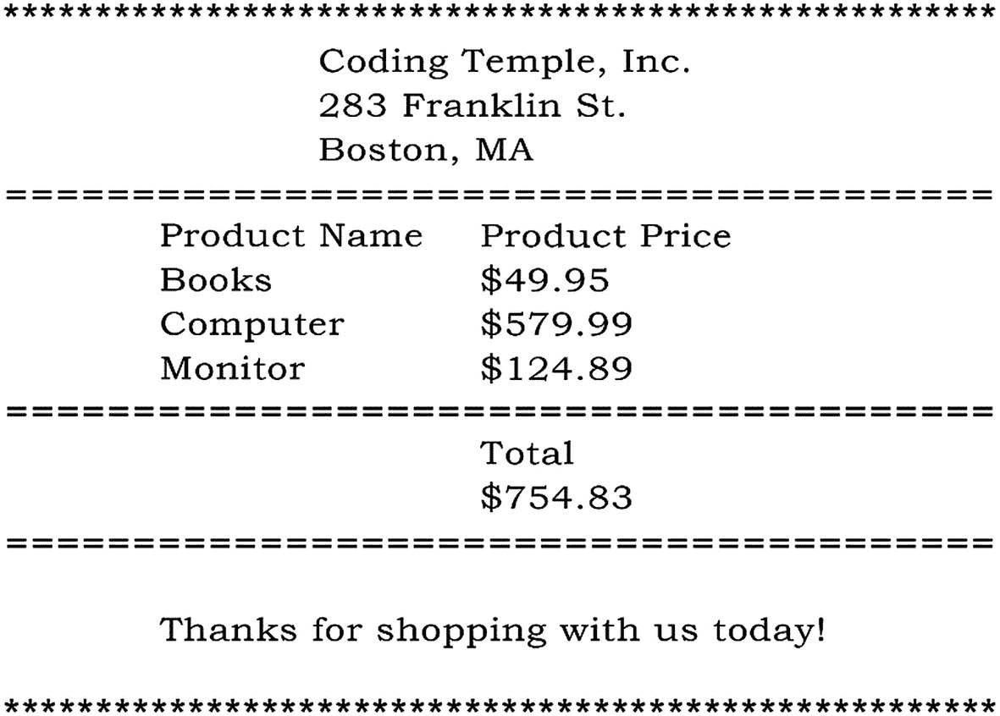

# 2.Python 基础

无论你想到哪个著名的程序员，像比尔·盖茨或吉多·范·罗苏姆，他们在人生的某个阶段也是从基础做起的。这些基本概念是构建学习任何编程语言的基础所必需的。毕竟，你不会从屋顶开始盖房子，你需要有一个基础来工作。这就是本周发挥作用的地方。

本周的重点将是数据类型和变量的**。这些几乎是任何编程语言的核心概念。学习一门语言的美妙之处在于，它让你可以很容易地学会其他语言。这部分是因为所有语言都遵循相同的核心概念。到本周末，你将能够理解如何自己编写简单的程序。一个程序，比如我们将一起构建的程序，我们将在一个格式良好的收据中向用户打印信息。**

本周我还将介绍您的第一个*挑战问题*。这些问题是为了确保你开始“**像开发人员**一样思考。”有些问题可能没有明确的答案，但它们会促使你创造解决方案并**解决问题**。重要的是，你花一些时间思考每个问题，这样你就可以开始训练你解决问题的技巧。毕竟，这是每个开发行业最受欢迎的技能。

**概述**

*   了解数据类型

*   如何使用变量

*   看看你能用绳子做什么

*   如何操作字符串

*   编写打印收据的程序

### 挑战问题

在编程中，我们有一个概念叫做“**算法**”一个算法仅仅是一组步骤。不管你知不知道，你一生都在使用算法。一个常见的算法是一个食谱，你按照它来制作食物。

要像开发人员一样思考，您必须开始理解计算机如何读取代码。一台计算机只和它应该执行的程序一样聪明。这意味着如果步骤不正确，即使最聪明的计算机也可能失败。例如，让我们用一个食谱来烤一个蛋糕。如果我们错过了一个步骤，或者把蛋糕放在烤箱里太久，那么我们就失败了，就像电脑错过了一个关键步骤一样。

现在，我希望你们思考一下制作花生酱和果冻三明治的步骤。在一张纸上写下你的步骤。当你把它们写出来的时候，试着像电脑一样思考，并且明白你需要尽可能的精确。答案会在本章末尾。

## 星期一:注释和基本数据类型

今天是你学习 Python 语言的第一课！今天教授的两个概念将有助于建立我们正在努力的基础。为了继续今天的内容，让我们从“ *python_bootcamp* ”文件夹中打开 Jupyter 笔记本。如果需要，请回到上周关于如何打开 Jupyter 笔记本的课程。打开后，创建一个新文件，并将其重命名为“ *Week_02* 接下来，用下面的代码进行第一个单元格的降价:

```py
# Comments & Basic Data Types

```

### 什么是注释，为什么要使用注释？

评论就像你留下的笔记，可以给自己看，也可以给别人看。它们不被解释器读入，意味着你可以写任何你想写的东西，计算机会忽略它。一个好的评论应该简短、易读、切中要点。在每一行放一个注释是很乏味的，但是不放任何注释是不好的做法。当你编程时，你会开始理解快乐的媒介是什么样子的。

当你开始写更大的程序时，你会想给自己留些笔记。我经常创建一个程序，停止工作三个星期，当我回来时，我忘记了我在做什么。留下评论不仅对你自己有好处，对其他阅读你代码的人也有好处。把评论想象成面包屑，帮助你理解正在发生的事情。

### 写评论

在 Python 中，我们可以使用**散列** (#)符号来编写注释。此符号后面的任何文本都将被注释掉。在减价标题下方的单元格中，让我们写下第一条评论:

```py
# this is a comment

```

让我们继续运行单元。请注意，什么也没有发生。这是因为计算机完全忽略任何评论。在大多数情况下，我们将在他们自己的行上写评论；但是，在某些情况下，您可能会看到与代码一致的注释。在与上一条注释相同的单元格中，我们添加下面一行:

```py
print("Hello")       # this is also a comment

```

这一行的第一部分将运行并输出**【Hello】****，但是第二部分将被忽略，因为有散列符号。**

 **### 注意

Markdown 使用散列字符作为头，就像 Python 注释一样。确保您知道您的单元格设置为*“降价/单元格”的类型*

要编写多行注释，以便为更大部分的代码编写更具描述性的段落，我们需要使用三个左右双引号:

```py
" " "
       This is a multi-Line comment
" " "
print("Hello")       # this is also a comment

```

去查查手机。请注意，多行注释中的文本会被忽略。这些类型的注释对于添加关于代码的描述性段落非常有用。但是，一定不要过度使用它们，因为使用太多它们肯定会把程序搞得一团糟。

### 什么是数据类型？

几乎所有的语言都使用数据类型，它们对每个程序都是必不可少的。**数据类型**是我们定义值的方式，比如单词或数字。如果我问你一个句子是由什么组成的，你可能会用*“单词或字符*”来回答在编程中，我们称之为字符串。就像我们把数字称为它们自己的数据类型一样。数据类型定义了我们可以做什么，以及这些值如何存储在计算机的内存中。在表 [2-1](#Tab1) 中，你会发现每一行都显示了一个数据类型、一个样本值以及对每一个的描述。阅读每一部分，了解每种类型的详细解释。您可以在表格中找到我们本周讨论的四种基本类型。

表 2-1

数据类型示例

<colgroup><col class="tcol1 align-left"> <col class="tcol2 align-left"> <col class="tcol3 align-left"></colgroup> 
| 

数据类型

 | 

样本值

 | 

描述

 |
| --- | --- | --- |
| 整数 | five | 整数 |
| 浮动 | Five point seven | 十进制数字 |
| 布尔代数学体系的 | 真实的 | 真值或假值 |
| 线 | “你好” | 引号中的字符 |

### 打印声明

在我们进一步讨论之前，我只想简单介绍一下**打印声明**。几乎在每一种语言中，你都需要向用户输出信息的能力；在 Python 中，我们可以通过 print 语句做到这一点。现在我不想太深入，但是打印语句是我们在 Python 中称之为**的函数**。我们将在整个第五周讨论各种功能。但是现在，我们只需要知道 print 语句允许我们向用户输出信息。它的工作方式是通过写下关键字“*打印*”，然后加上括号。括号内的内容将输出给用户查看。

### 整数

这些数据类型通常被称为**整数**或**整数**。它们是正数或负数**整数**，没有小数点。整数的使用有各种各样的原因，在数学计算和索引(*，我们将在后面进入*)；它们是任何语言中的主要数据类型。让我们在文件的下一个单元格中打印几个例子:

```py
# the following are all integers
print(2)
print(10)

```

去查查手机。结果输出应该是一系列数字 **2** 和 **10** 。

### 漂浮物

每当一个数字上有小数点时，它们就被称为浮点数据类型。不管它是 1 位数还是 20 位数，它仍然是一个**浮点数**。浮点数的主要用途是在数学计算中，尽管它们也有其他用途。让我们来看一个例子:

```py
# the following are all floats
print(10.953)
print(8.0)       # even this number is a float

```

去查查手机。输出应该是一系列数字 **10.953** 和 **8.0** 。

### 注意

数字“8.0”被认为是一个浮点数，因为它包含一个小数点。

### 布尔运算

**布尔**数据类型为真或假值。你可以把它想象成一个开关，要么关闭，要么打开。除了 True 或 False，它不能被赋予任何其他值。布尔是一种关键的数据类型，因为它们提供了多种用途。其中最常见的是跟踪是否发生了什么。例如，如果你玩一个视频游戏，想知道玩家是否还活着，当玩家开始繁殖时，你可以设置一个布尔值“**真**”。当玩家失去了他们所有的生命，你会设置布尔为“**假**”。这样你可以简单地检查布尔值，看看玩家是否还活着。这使得程序更快，而不是每次都计算生命。让我们继续运行以下代码:

```py
# the following are booleans
print(True)
print(False)

```

去查查那个手机。输出应该分别是字**真**和**假**。

### 用线串

也被称为"*字符串文字* *，*"这些数据类型是我们今天要讨论的四种数据类型中最复杂的。字符串的实际定义是

> Python 中的字符串是代表 unicode 字符的字节数组。

对于大多数初学者来说，这听起来就像一堆废话，所以让我们把它分解成一些我们可以理解的简单的东西。字符串无非是一组 ***字符、符号、数字、空格，甚至是两组*** 引号之间的空格。在 Python 中，我们可以使用单引号或双引号来创建字符串。大多数时候这是个人偏好，除非你想在一个字符串中包含引号(*见下一个块*中的第 3 行)。引号内的内容将被视为字符串，即使它是一个数字。让我们在下一个单元格中为字符串编写一些示例:

```py
# the following are strings
print(" ")
print("There's a snake in my boot!")
print('True')

```

输出将在顶部包含一个空行，因为我们在第一条语句中不打印任何内容。

### 周一练习

1.  **输出**:打印出你的名字。

2.  **类型检查**:尝试使用 Type()方法检查值的类型。这将始终打印出您正在检查的数据类型。当您不确定时，这对于检查数据类型很有用。举个例子:

    `>>> type(int) # will output <class 'int'>`

今天，我们关注 Python 中的四种基本数据类型。理解两者之间的差异是我们前进的关键。在明天的课程中，我们将开始了解如何保存这些数据类型，以便在程序的后面使用。

## 星期二:变数

**变量**是编程中最重要的初级概念之一。它们允许我们使用指定的名称将值保存到内存中。这让我们可以在程序的后面使用这些值。昨天的课程讲述了不同的数据类型，但是如果您想保存其中一种数据类型以备后用，该怎么办呢？这就像我们如何在大脑中存储信息一样，变量存储在计算机内存中，我们可以在以后通过引用我们使用的名称来访问它们。我不会深入 Python 如何存储信息背后的理论，因为我们更关注编程的应用，但值得注意的是 Python 自动为我们处理内存存储和**垃圾收集**。

为了跟上这一课，让我们从之前的笔记本文件“ *Week_02* ”继续，简单地在底部添加一个标有“**变量”的 markdown 单元格。**

### 它们是如何工作的

我们在**等于运算符**(“**=**”)的左边声明了一个名称，在右边，我们为想要保存以备后用的值赋值。举个例子(*不用写这个*):

```py
>>> first_name = "John"

```

当你创建一个变量时，你赋值的那一行是一个叫做**声明**的步骤。我们刚刚声明了一个名为“ *first_name* 的变量，并为它分配了字符串数据类型“ *John* 的值。这个字符串现在存储在内存中，我们可以通过调用变量名“ *first_name* ”来访问它。

### 注意

变量名只能包含字母、下划线和数字。但是，它们不能以数字开头。

### 处理命名错误

所有的程序员都会犯错，所以如果你遇到错误也不成问题。这是工作带来的。让我们来看看变量(不需要写这个)的一个常见错误:

```py
>>> Sport = 'baseball'    # capital 'S'
>>> print(sport)          # lowercase 'S'

```

如果我们尝试运行这段代码，我们将得到以下错误/输出:

```py
NameError: name 'sport' is not defined

```

这是因为名字完全不同。我们引用了一个带有小写字母“s”的变量，但是声明了一个带有大写字母“s”的变量。

### 整数和浮点变量

为了在变量中存储一个整数或浮点数，我们在操作符的左边给一个名字，在右边写一个数字。在下一个单元格中，让我们继续编写以下代码:

```py
num1 = 5           # storing an integer into a variable
num2 = 8.4         # storing a float into a variable
print(num1, num2)  # you can print multiple items using commas

```

去查查那个手机。注意输出是 **5 和 8.4** ，即使我们打印出了“ *num1* 和“ *num2”。*“我们打印出存储在这些变量中的值。

### 布尔变量

请记住，布尔值是**真**或**假**值，因此存储它们就像键入这两个单词中的一个一样简单。让我们写以下内容:

```py
# storing a boolean into a variable
switch = True
print(switch)

```

去查查那个手机。结果输出为“**真**”。注意，在 Jupyter Notebook 中，True 或 False 的值会发绿光。如果我们写得正确，这是一个很好的指示。

### 字符串变量

字符串和前面三种数据类型一样容易存储。请记住，使用单引号或双引号很重要。让我们继续在新的单元格中编写以下代码:

```py
# storing strings into a variable
name = 'John Smith'
fav_number = '9'
print(name, fav_number)            # will print 9 next to the name

```

继续运行它。记住字符串“ **9** ”和整数 9 是不一样的。这两种数据类型表现不同，即使输出看起来相似。

### 使用多个变量

几乎在你编写的任何程序中，你都需要对变量进行一些计算或操作。在下面的代码中，我们从先前声明的变量中访问值，并将它们相加以创建一个和。在运行此单元之前，请确保已经运行了之前的单元。让我们将它放入一个新的单元格中:

```py
# using two variables to create another variable
result = num1 + num2
print(result)

```

运行这个单元后，你会注意到它将 **5** 和 **8.4** 加在一起输出 **13.4** 。

### 注意

如果您得到一个错误消息，说某个变量不存在，请尝试运行首先声明该变量的单元格。

### 对数值变量使用运算符

把 Python 想象成一个计算器，我们可以随意改变任何变量。在下面的代码中，我们改变了先前定义的"*结果*"变量:

```py
# adding, deleting, multiplying, dividing from a variable
result += 1   # same as saying result = result + 1
print(result)
result *= num1   # same as saying result = result * num1
print(result)

```

去查查手机。在第一行中，我们给结果加 1，然后我们把它乘以" *num1，*"的值，也就是 5。与此同时，计算机保存了结果变量，所以我们可以继续编辑它。然后我们打印结果，结果显示为 **72.0** 。

### 覆盖以前创建的变量

Python 让我们很容易改变一个变量的值，只需要简单地重新声明它。在某些语言中，您必须定义数据类型，但是 Python 为我们处理了所有这些。我们已经在前面的结果变量中看到了这种情况，但是在它自己的单元格中值得注意:

```py
# defining a variable and overwriting it's value
name = 'John'
print(name)
name = 'Sam'
print(name)

```

继续在新的单元格中运行。您会注意到输出显示了**“约翰”**和**“山姆”**。访问或重新声明变量的位置很重要；记住这一点。

### 空白

空白仅仅意味着用于间隔的字符，并且有一个"*空的*"表示。在 python 的上下文中，它意味着制表符和空格。例如:

```py
>>> name = 'John Smith'

```

等号运算符的左右两边都有空格。这不是必需的，但它使阅读代码更容易。计算机在编译代码时会忽略空白。然而，在字符串中，空格是**而不是**空格，这只是一个“空格”字符。

### 星期二练习

1.  **变量输出**:将值 3 存储在一个名为“x”的变量中，将值 10 存储在一个名为“y”的变量中。将 x * y 的结果保存到一个名为“结果”的单独变量中。最后，输出信息，如下所示:

    ```py
    >>> 3 + 10 = 13

    ```

2.  **面积计算**:计算一个 245.54”x 13.66”的长方形的面积。打印出结果。提示:面积是宽度乘以高度。

变量无处不在，Python 让我们很容易将它们合并。能够存储信息是任何程序的关键部分。明天我们将看看如何操作字符串。

## 星期三:使用字符串

理解可以对字符串数据类型做什么很重要。接下来的两天包括**与**和**一起操作**字符串，这样我们可以在周末建立一个收据打印程序。我们不会担心接受用户输入，而是担心如何格式化字符串，什么是字符串索引，等等。

为了继续学习这一课，让我们从之前的笔记本文件“ *Week_02* ”继续，并在底部简单地添加一个 markdown 单元格，上面写着“**使用字符串”。**

### 串并置

当我们谈论连接字符串时，我的意思是我们希望将一个字符串添加到另一个字符串的末尾。这个概念只是将字符串变量加在一起以完成一个更大的字符串的许多方法之一。对于第一个示例，让我们将三个单独的字符串加在一起:

```py
# using the addition operator without variables
name = "John" + " " + "Smith"
print(name)

```

继续运行 markdown 单元格下面的单元格。我们得到的输出是“**约翰·史密斯**”。我们最后添加了两个字符串，这两个字符串是名称，并使用一个内部带有空格的字符串来分隔它们。让我们先尝试将这两个名字存储到变量中:

```py
# using the addition operator with variables
first_name = "John"
last_name = "Smith"
full_name = first_name + " " + last_name
print(full_name)

```

去查查那个手机。我们得到与前一个细胞完全相同的输出；然而，这次我们使用了变量来存储信息。

### 格式化字符串

之前，我们通过将多个字符串相加来创建一个更大的字符串，从而创建了一个全名。虽然这完全可以使用，但对于较大的字符串来说，就很难阅读了。想象一下，你必须创造一个使用 10 个变量的句子。将所有十个变量添加到一个句子中很难跟踪，更不用说读取了。我们需要使用一个叫做字符串格式的概念。这将允许我们编写一个完整的字符串，并在适当的位置注入我们想要使用的变量。

#### 。格式( )

format 方法的工作原理是直接在结束字符串引号后加一个句点，后跟关键字“ *format* ”。关键字后的括号内是将注入字符串的变量。不管是什么数据类型，它都会把它插入到字符串中合适的位置，这就带来了一个问题，它怎么知道把它放在哪里？这就是花括号发挥作用的地方。花括号的顺序与格式括号中变量的顺序相同。要在一个格式字符串中包含多个变量，只需用逗号分隔每个变量。让我们来看看一些例子:

```py
# injecting variables using the format method
name = "John"
print( "Hello { }".format(name) )
print( "Hello { }, you are { } years old!".format(name, 28) )

```

去查查那个手机。我们会看到第一行的输出是“**你好约翰**”，第二行是“**你好约翰，你 28 岁了**”。请记住，format 函数会注入变量，甚至是数据类型本身。在这个例子中，我们注入了整数值 28。

#### f 字符串(Python 3.6 中的新特性)

在 Python 中将变量注入字符串的新方法是使用我们称之为 **f strings** 的方法。通过将字母" **f** "放在一个字符串的前面，你可以直接在行中将一个变量注入到一个字符串中。这一点很重要，因为当字符串变长时，它使字符串更容易阅读，这是格式化字符串的首选方法。只要记住你需要 Python 3.6 来使用它；否则你会收到一个错误。要在一个字符串中注入一个变量，只需在变量名周围加上花括号。让我们看一个例子:

```py
# using the new f strings
name = "John"
print( f"Hello {name}" )

```

去查查手机。我们得到了与*相同的输出。format()* 方法；但是，这次读代码就容易多了。

### 注意

在本书中，我们将使用。format()方法。

#### Python 2 中的格式

Python 2 不包括。format()方法；取而代之的是，你可以使用百分比运算符来标记被注入变量的位置。下面是将变量“ *name* 注入“ **%s** ”位置的例子。百分比运算符后的字母表示数据类型。对于整数，你可以用“ **%d** ”来表示数字。在字符串结束后，您可以放置一个百分比运算符，后跟您想要使用的变量。让我们看一个例子:

```py
# one major difference between versions 2 & 3
name = 'John'
print('Hello, %s' % name)

```

去查查那个手机。您会注意到，我们得到了与前面方法相同的输出。如果您想在 Python 2 中用多个变量格式化一个字符串，那么您需要编写以下代码:

```py
# python 2 multiple variable formatting
first_name = "John"
last_name = "Smith"
print( "Hello, %s %s" % (first_name, last_name) )        # surround the variables in parenthesis

```

去查查手机。我们将得到输出“你好，约翰·史密斯”。当传递多个变量时，需要用括号将变量名括起来，并用逗号分隔。注意，字符串中还有两个符号，从左到右依次表示每个变量的位置。

### 字符串索引

关于字符串，我们需要理解的另一个关键概念是它们是如何存储的。当计算机将一个字符串保存到内存中时，字符串中的每个字符都被赋予一个我们称之为“**索引** **的符号。**“索引本质上是内存中的一个位置。把索引想象成你在商场排队等候时的位置。如果你在队伍的最前面，你的索引号将会是零。你后面的人将被赋予索引位置 1。他们后面的人将被给予索引位置 2，以此类推。

### 注意

包括 Python 在内的大多数语言的索引都是从 0 开始，而不是从 1 开始。

Python 字符串也是如此。如果我们取一个类似*“Hello”*的字符串，分解它们的索引(见图 [2-1](#Fig1) ，我们可以看到字母“ *H* ”位于索引零处。让我们试一个例子:

```py
# using indexes to print each element
word = "Hello"
print( word[ 0 ] )            # will output 'H'
print( word[ 1 ] )            # will output 'e'
print( word[ -1 ] )           # will output 'o'

```

为了索引一个特定的元素，您可以在变量名的右边使用方括号。在那些**方括号**中，您放入您希望访问的索引位置。在前面的例子中，我们正在访问存储在变量**“单词”**中的字符串**“你好”**中的前两个元素。最后一行访问最后一个位置的元素。使用负索引号将导致试图从后面访问信息，例如-4 将导致字母“e”的输出。


图 2-1

字符串的索引位置

使用索引时要非常小心。索引是内存中的一个特定位置。如果你试图访问一个超出范围的位置，你会使你的程序崩溃，因为它试图访问一个不存在的内存位置。例如，如果我们试图访问*“Hello*”上的索引 5。

### 字符串切片

我想简单介绍一下切片这个话题。切片主要用于 Python 列表；但是，您也可以在字符串上使用它。切片本质上是当你只想要变量的一部分时，这样，如果我只想要单词“hello”中的“He ”,我们将编写如下:

```py
print( word[ 0 : 2 ] )            # will output 'He'

```

括号中的第一个数字是起始索引；第二个是停止指数。我们将在下一周触及这个概念；然而，你可以随意摆弄切片。不过，在今天结束之前，我想快速介绍一下切片时的开始、停止和步进参数。切片的语法总是

```py
>>> variable_name[ start : stop : step ]

```

在上一个单元格中，我们只包括开始和停止，因为步骤是可选的，默认情况下每次递增 1。然而，如果我们想打印每隔一个字母:

```py
print( word[ 0 : 5 : 2 ] )         # will output 'Hlo'

```

去查查手机。通过将步骤作为数字 2 传递，它每次将索引增加 2，而不是 1。我们将在后面的章节中更深入地讨论这个问题；现在，让这成为对所有三个参数的切片的介绍。

### 周三练习

1.  **变量注入**:创建一个打印语句，将整数、浮点、布尔和字符串全部注入一行。输出应该看起来像“ *23 4.5 假约翰*”。

2.  **填空**:使用 format 方法，通过将你的名字和喜欢的活动赋值到变量中来填写以下空格:

    `"{ }'s favorite sports is { }."`

    `"{ } is working on { } programming!"`

我们今天讨论了使用字符串、格式化和索引时的一些关键概念。明天我们将使用其他方法来帮助我们操作字符串。

## 周四:字符串操作

在您将要构建的许多程序中，您会希望以某种方式**改变**字符串。字符串操作仅仅意味着我们想要改变当前的字符串。幸运的是，Python 有大量的**方法**，我们可以用它们来改变字符串数据类型。

接下来，让我们从之前的笔记本文件“ *Week_02* ”继续，简单地在底部添加一个 markdown 单元格，上面写着:“**操纵字符串。**

### 。标题( )

通常，你会遇到不大写的单词，这些单词通常应该是名字。title 方法将字符串中每个单词的首字母全部大写。尝试以下方法:

```py
# using the title method to capitalize a string
name = "john smith"
print( name.title( ) )

```

去查查那个手机。我们得到的输出是一个" **John Smith** "，每个单词都有大写字母。这个**方法**对于正确格式化名字非常有用。

### 注意

尝试使用 name.lower()和 name.upper()看看会发生什么。

### 。替换( )

replace 方法的工作方式类似于查找和替换工具。它在括号中接受两个值，一个是它要搜索的值，另一个是它用以下内容替换搜索到的值:

```py
# replacing an exclamation point with a period
words = "Hello there!"
print( words.replace( "!", "." ) )

```

去查查那个手机。这将导致“ **Hello there** ”的输出。

### 注意

为了在以后正确存储替换，我们必须重新声明我们的 words 变量: **words = words.replace('！', '.').**

### 。查找( )

find 方法将搜索我们要求它搜索的任何字符串。在本例中，我们尝试搜索整个单词，但我们可以搜索包括字符或完整句子在内的任何内容:

```py
# finding the starting index of our searched term
s = "Look over that way"
print( s.find("over") )

```

去查查那个手机。你会注意到我们得到了 **5** 的输出。Find 返回匹配的起始索引位置。如果你计算单词“ **over** 开始的位置，那么“ **o** 在索引位置 5。当您想要访问搜索中的特定索引时，这一点非常重要。

### 。条状( )

如果你想去掉字符串左右两边的某个字符，你可以使用 strip 方法。默认情况下，它会删除空格。让我们尝试运行以下代码:

```py
# removing white space with strip
name = "   john   "
print( name.strip( ) )

```

输出将产生“ **john** ”，因为我们已经移除了左侧和右侧的所有空格。

### 注意

试试看。lstrip()和。rstrip()看看会发生什么。

### 。拆分( )

我不会对 split 进行过多的描述，因为它返回的是一个列表，我们还没有涉及到这些；然而，我想让你看看如何使用这种方法。它的作用是将句子中的单词分成一组单词，存储在一个列表中。现在先不要担心列表，我们会有的。现在，让我们看看这个方法是如何工作的:

```py
# converting a string into a list of words
s = "These words are separated by spaces"
print( s.split(" ") )

```

去查查手机。输出结果是单词列表“ **['这些'，'单词'，'是'，'分隔'，'分隔'，'空格']** ”。我们将回到这个方法以及它为什么重要。

### 周四练习

1.  **大写**:尝试操作字符串“uppercase ”,使它打印出来的都是大写字母。你需要寻找一种新方法。

2.  **剥去符号**:剥去这个字符串“$$John Smith”左边的所有美元符号。试试看。lstrip()和。剥离()。要查看有关如何进一步使用 strip 方法的描述，请尝试使用 Python 中的帮助功能，方法是键入以下内容:

    ```py
    >>> help(" ".strip)

    ```

今天你学了一些操作方法，但还有更多。试着用你在网上找到的其他人做实验。

## 星期五:创建收据打印程序

欢迎来到你的第一个项目！我们将创建一个非常基本的收据打印程序。本周，我们已经学习了变量、操作符和字符串操作，我们将使用这些技能来创建这个程序。

接下来，让我们从我们的“ *Week_02* ”笔记本继续，简单地在底部添加一个减价单元格，上面写着:“**星期五项目:打印收据。**

### 完工图纸

描绘出你想要建造的东西的设计总是好的。对于较大的项目，你会想要创建一个流程图或某种设计文档，这将使你走上正轨。这样你就不会偏离预期的结果。对我们来说，我们将用我们所学的概念构建一个小的收据打印程序，其中的输出将如图 [2-2](#Fig2) 所示。



图 2-2

星期五项目的最终结果

我们开始吧，好吗！

### 启发过程

无论何时开始一个项目，你都必须知道从哪里开始。无论项目大小，都有一定的依赖性。就像盖房子一样，你必须先有地基，然后才能盖屋顶。现在，这个程序大约有 50 行，几乎没有依赖关系，所以我们将从顶部边框开始，一路向下到底部。

### 定义我们的变量

在减价标题下方的单元格中，让我们开始定义我们将在整个计划中使用的变量:

```py
1| # create a product and price for three items
2| p1_name, p1_price = "Books", 49.95
3| p2_name, p2_price = "Computer", 579.99
4| p3_name, p3_price = "Monitor", 124.89

```

我总是喜欢在构建这些周五项目时引入新概念，因为实现好的编码技术是有好处的。该块中引入的技术是在同一行声明多个变量的能力。为此，我们只需用逗号分隔变量名及其相关值。看前面声明的两个变量，“ **Books** 的值会保存到变量名“ **p1_name** ”，值“ **49.95** ”会保存到变量名“ **p1_price** ”。我们已经把程序减少了一半，而不是写六行。我们用的线越少越好(*多数时候*)。像 x 和 y 这样的变量，或者在我们的例子中，一个名字和价格，是在一行中声明相关变量的好例子。

接下来，让我们在收据的顶部定义公司将使用的变量。这个项目的所有代码可以在单个单元格中完成，或者您可以将单元格分开。这取决于你。我提供了行号，以防您跟踪单个单元格:

```py
6| # create a company name and information
7| company_name = "coding temple, inc."
8| company_address = "283 Franklin St."
9| company_city = "Boston, MA"

```

例如，我们将公司名称全部小写，这样我们可以使用字符串操作方法来解决这个问题。

最后，让我们在收据的底部声明我们将输出给用户的消息:

```py
11| # declare ending message
12| message = "Thanks for shopping with us today!"

```

去查查手机。现在我们已经定义了所有的变量，我们可以继续了。

### 创建顶部边框

正如我们可以从这个项目开始时的设计中看到的，我们需要在顶部和底部打印出一个边框。让我们从顶部边框开始:

```py
14| # create a top border
15| print( "*" * 50 )

```

去查查手机。这里应用了一个新概念，我们写 **"*" * 50** 。我们所要做的就是打印出 50 个星星作为上边框，而不是打印 50 条语句，我们可以简单地将字符串乘以我们想要的数字。这样我们得到了顶部边框，同时保持代码简洁易读。代码的可读性始终是关键。

### 显示公司信息

我们已经在前面几行中为公司定义了变量，所以让我们显示它们:

```py
17| # print company information first, using format
18| print( "\t\t{ }".format( company_name.title( ) )
19| print( "\t\t{ }".format(company_address) )
20| print( "\t\t{ }".format(company_city) )

```

去查查手机。起初，这些打印语句可能看起来有点难以理解；不过，我给你介绍一个逃兵角色。转义字符由定义反斜杠 **"\"** 字符读入。反斜杠后面的内容是计算机将解释的内容。在三个打印语句中，我们使用 **"\t"** 作为制表符缩进。你可能会看到的另一个流行的转义字符是 **"\n"** ，它的意思是换行，就像你按下回车键一样。我们在一行中使用两个转义字符，使其在输出中居中。让我们创建一个分割线:

```py
22| # print a line between sections
23| print( "=" * 50 )

```

去查查手机。就像我们打印上边框一样，我们将等号乘以 50 来创建相同宽度的线条。这将给出单独部分的外观。

### 显示产品信息

查看我们的原始设计，我们希望在列出每个产品的名称和价格之前创建一个标题。这可以通过使用我们的转义字符进行缩进来实现:

```py
25| # print out header for section of items
26| print("\tProduct Name\tProduct Price")

```

去查查手机。由于标题名称的大小，我们只需要在每个标题前使用一个制表符。现在，我们可以为每个产品的信息输出一行:

```py
28| # create a print statement for each product
29| print( "\t{ }\t\t${ }".format(p1_name.title( ), p1_price) )
30| print( "\t{ }\t\t${ }".format(p2_name.title( ), p2_price) )
31| print( "\t{ }\t\t${ }".format(p3_name.title( ), p3_price) )

```

去查查手机。我们使用与之前的打印声明相似的样式，以便将每个产品的标题和价格放在各自标题的中心。尽量不要被打印字符串中的所有符号搞糊涂；您可以简单地将它们分解成一个制表符，然后是格式化为字符串的第一个变量，接着是两个制表符，接着是美元符号(*以使价格看起来像货币*)，然后是格式化为字符串的第二个变量。这就完成了我们产品的部分，所以让我们放入另一个部分分隔线:

```py
33| # print a line between sections
34| print('=' * 50)

```

去查查手机。这将为我们的下一部分设置显示总数。

### 显示总数

像 products 部分一样，我们希望为我们的合计创建一个标题，但是我们还希望它位于 products 部分的 price 列的中心。为此，我们将使用三个选项卡:

```py
36| # print out header for section of total
37| print("\t\t\tTotal")

```

去查查手机。现在我们已经将合计标题与 products 中的 price 列对齐，我们可以在下一行输出合计。然而，在我们可以打印出总数之前，我们必须首先计算总数，它是我们所有产品的总和。让我们定义一个名为 total 的变量，然后将其打印出来:

```py
39| # calculate total price and print out
40| total = p1_price + p2_price + p3_price
41| print( "\t\t\t${ }".format(total) )

```

去查查手机。同样，我们已经添加了三个选项卡，加上一个美元符号，使总值显示为货币。现在让我们添加一个部分边界:

```py
43| # print a line between sections
44| print( "=" * 50)

```

继续运行单元格，以确保它看起来像目前为止期望的输出。

### 显示结束消息

为了显示最后的感谢信息，我们的设计使它的间距比任何其他部分都稍大，所以我们需要添加几个换行符来给它一些额外的间距:

```py
46| # output thank you message
47| print( "\n\t{ }\n".format(message) )

```

去查查手机。我们的信息现在集中了，我们准备继续前进。

### 显示底部边框

为了完成这个简单的打印程序，为了美观，我们需要添加一个底部边框:

```py
49| # create a bottom border
50| print( "*" * 50 )

```

继续最后一次检查手机。

恭喜你！尽管可能很简单，但这是一个巨大的里程碑。在学习了更多的材料之后，试着回到这里来改进它。

## 每周总结

本周，我们复习了变量编程和字符串处理中一些非常重要的基础概念。您必须始终记住，变量需要在使用之前声明，并且相关的名称与等号运算符右侧的值一起保存在内存中。Python 中的字符串很容易处理，因为这种语言有各种各样的方法，我们可以调用这些方法来完成这项工作。在周末，我们能够构建一个简单的收据打印程序。试试破解程序！我总是鼓励学生尝试破坏程序，因为这将教会你如何修复它。

## 挑战问题解决方案

做 PB&J 三明治没有一个确定的解决方案，但是我希望你回去看看你是否还不够具体。计算机的智能取决于我们对它们的编程，所以如果你说把花生酱放在面包上，它可能会理解为把整个罐子放在面包上。作为一名开发人员，你需要对你的描述进行具体化。甚至尝试用改进的步骤重写一个新算法。

## 每周挑战

要测试你的技能，请尝试以下挑战:

1.  侧边框:在周五的项目中，我们最终在打印出来的信息的上方和下方创建了边框。现在试着在边上加一个星形边框。

2.  **研究方法**:我们已经讨论了一些广泛使用的字符串操作方法；然而，还有很多；试着查找一些并实现它们。

3.  **反转**:声明一个等于“Hello”的变量。使用切片反转字符串。纠结的话试着查一下。

### 小费

切片时，可以定义开始、停止和步进。**